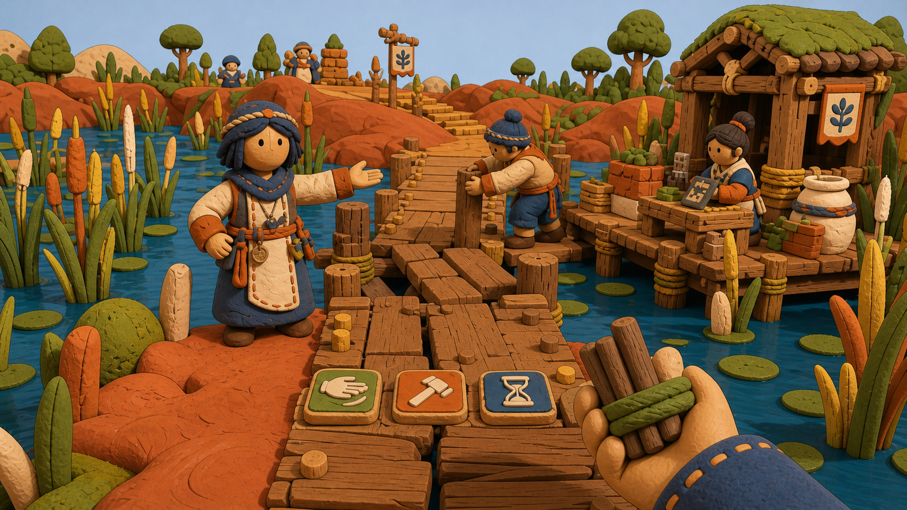
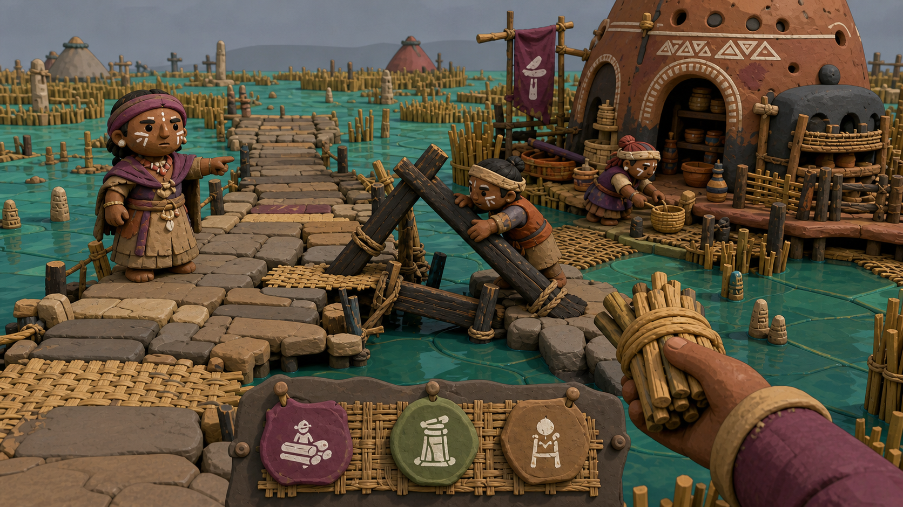
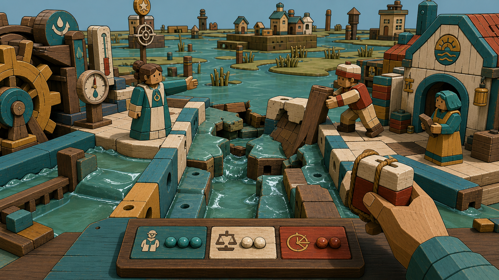

# F1 Snow Globe Tactile Miniature Visual and Interaction Target

## Status and boundary

**Status:** tactile clay-and-wood miniature selected as the dominant F1 language; three replacement treatments
are ready for user review. F1 remains incomplete until the user accepts one treatment or a precise bounded
blend after running the replacement in-engine study.

The first Reedwork Foundry / Floodplain Commons / Sluice Observatory frames were rejected by the user on
2026-08-26 as far too realistic. Their generated assets remain in the repository only as explicit failed
comparison evidence. They are not an art target and must not guide production.

This package changes presentation only. It does not replace the main scene, add simulation state, integrate a
model/provider, or establish visual/play acceptance. `PrototypeRuntimeSession` and the existing validated
commands/events remain untouched.

## Locked visual language

The world should feel like a society physically assembled by its residents:

- hand-pinched clay, carved wood, woven reed, felt, twine, pegs, paint, and repair marks;
- chunky adult silhouettes and deliberately simplified faces rather than realistic anatomy;
- shallow, readable tabletop composition with strong foreground/midground/background staging;
- matte tactile surfaces, broad material marks, limited palettes, and visible hand construction;
- mature civic warmth and ecological stakes without grim survival realism or preschool cuteness; and
- world-integrated wooden, clay, or woven interaction pieces rather than floating software chrome.

Hard visual rejects: photorealism, realistic PBR, realistic humans/skin, cinematic fog, photographic depth of
field, glossy plastic, generic survival HUD, chat windows, dialogue boxes, quest lists, minimaps, health bars,
neon holograms, toy packaging, and childish preschool proportions.

## Fixed comparison moment

Every treatment shows the same resident-founder situation:

- first-person arrival at the failing wetland causeway;
- Mara offers a materially grounded counter-position;
- Ivo visibly braces the repair while Sena works near the depot;
- the player carries one modest repair bundle;
- the response surface offers **labor**, **evidence**, or **defer**;
- pending, refusal, and consequence use words plus graphic marks; and
- the interface remains subordinate to citizen, work, water, and consequence.

The generated frames are visual targets, not screenshots of the Godot implementation.

## A — Hearthwood Causeway



**Position:** warm hand-carved commonwork. Honey-colored peg planks, thumb-pressed terracotta banks, wool-felt
reeds, braided cord, cream clay, indigo cloth, and small safety-orange repair marks.

**Interaction language:** a handbound work ledger expressed as three carved clay-and-wood tabs.

**Strength:** strongest resident warmth, material charm, and immediate readability without losing the causeway
crisis.

**Risk:** can become cozy to the point of low urgency unless damage, labor, water pressure, and consequence are
exaggerated graphically.

## B — Reed-Kiln Wetlands



**Position:** earthenware wetland craft. Rough coil-built clay, woven reed mats, scorched braces, cork mud
islands, fiber rope, ceramic water marks, and organic asymmetry.

**Interaction language:** pinned kiln-fired seals on a woven notice mat, with the player's position visibly
entered into the shared work record.

**Strength:** strongest ecological identity and clearest sense that the settlement is built from the wetland
itself.

**Risk:** can become tonally muddy or visually noisy unless silhouettes and state colors stay unusually bold.

## C — Painted Sluice Toyworks



**Position:** graphic civic cause-and-effect. Interlocking painted wood blocks, glazed clay water channels,
chunky sluice wheels, peg-built causeway pieces, ceramic gauges, chipped paint, and simplified mechanisms.

**Interaction language:** a narrow wooden control rail with inset choice tiles and clay state beads.

**Strength:** clearest causal readability and most distinctive systems language; the player can see how water,
work, and public decisions fit together.

**Risk:** can become sterile or toy-like unless residents leave repairs, personal marks, wear, cloth, and
vegetation across the mechanism.

## Shared interaction contract

The standalone study uses fixed presentation data only. It exercises the surface that a future
experience-cognition Interface will drive without pretending to be that Interface.

| State | Required presentation |
|---|---|
| Open | Mara's position, causeway need, visible work, and three grounded responses; no instruction wall. |
| Labor pending | Immediate acknowledgement, explicit `LABOR ENTERED`, motion-safe pending mark, and no blocked camera/world tick. |
| Evidence pending | Mara exposes the water marks in the world; the response names what is being checked. |
| Defer/refusal | `DEFERRED / NOT NEUTRAL`, a distinct `!` mark, and the repair proceeding without player commitment. |
| Consequence | A named result, a `✓` mark, citizen response, and a physical/state consequence statement. |

Accessibility requirements:

- words and glyphs accompany color for every state;
- controls remain pointer-activatable and keyboard-operable through documented shortcuts, with at least 4.5:1 normal-text contrast;
- layouts fit 1920×1080, 1280×720, and 960×540 study viewports;
- reduced motion freezes the subtle tabletop drift without hiding state;
- speaker names remain readable against every material treatment; and
- no required information depends on audio, hue, animation, or diagnostics alone.

## Standalone review route

```powershell
cd C:\Users\hunte\.codex\worktrees\f1-visual-target\societies
& 'C:\Users\hunte\AppData\Local\Microsoft\WinGet\Packages\GodotEngine.GodotEngine.Mono_Microsoft.Winget.Source_8wekyb3d8bbwe\Godot_v4.6.2-stable_mono_win64\Godot_v4.6.2-stable_mono_win64.exe' --path src/societies res://scenes/f1_visual_target_study.tscn
```

Controls:

- `1`, `2`, `3`: Hearthwood Causeway, Reed-Kiln Wetlands, Painted Sluice Toyworks.
- `Q`: offer labor.
- `W`: ask for evidence.
- `E`: defer and observe refusal.
- `Space`: advance or reset the selected response cycle.
- `R`: toggle the static-safe reduced-motion view.
- `D`: show or hide the optional diagnostic detail panel; it is hidden by default.

For each treatment, inspect open, pending, refusal, consequence, and reduced-motion states. Record 1–5 plus one
sentence for:

1. unmistakable clay/wood miniature identity;
2. mature rather than childish tone;
3. citizen presence and social credibility;
4. causeway/wetland consequence readability;
5. interaction hierarchy and accessibility; and
6. desire to inhabit and continue.

F1 passes only when the user selects one treatment or names a bounded blend and accepts a normal-play in-engine
target. The selected treatment then receives the complete five-view target package before F2.

## Production and performance direction

- Build the first kit from reusable low-poly clay masses, peg/plank modules, reed/felt cards, rope pieces,
  painted state tiles, and three simplified citizen bodies.
- Use silhouette, paint blocks, and material seams before prop density.
- Keep materials matte and non-metallic; reserve glaze for water channels and gauges.
- Prefer opaque geometry, repeated meshes/materials, one broad key light, cheap contact shadowing, and no
  cinematic volumetric fog.
- Treat visible fingerprints, broad tool grooves, chipped paint, stitched edges, and repair joints as authored
  graphic marks rather than dense texture detail.
- Target stable 60 Hz at 1920×1080 on the RTX 2070 SUPER reference machine, but keep that target explicitly
  unproven until the selected production slice is measured. The rejected ER-01 `51.9392 ms` median p95 remains
  a predecessor safety failure.

## Generated-frame provenance and final prompt set

The three replacement PNG frames were generated with the built-in image-generation tool on 2026-08-26 and
copied into the repository. They are internal concept targets, not captured gameplay or acceptance evidence.
No independent public-release license clearance is claimed; selected-direction asset provenance review or
replacement remains a later production gate.

All prompts used `stylized-concept`, the same causeway/character/action invariants, a 16:9 gameplay frame,
a compact icon-led three-choice surface, uniform crisp focus across the full tabletop, broad flat-diffuse game
lighting, and these shared constraints:

> Unmistakably non-photoreal stylized 3D game art made from hand-pinched clay, carved wood, felt, twine,
> woven reed, pegs, and matte paint. Use chunky simplified adult citizens, shallow tabletop staging, broad
> graphic marks, visible hand construction, and mature civic warmth. Avoid photorealism, realistic PBR,
> realistic anatomy or skin, cinematic fog, photographic depth of field, glossy plastic, generic survival
> HUD, chat windows, quest UI, minimaps, health bars, holograms, toy packaging, and preschool proportions.

Direction additions:

- **A:** honey wood, terracotta, felt reeds, braided cord, warm diffuse light, and three carved work tabs.
- **B:** rough earthenware, reed matting, scorched braces, cork mud, fiber rope, overcast light, and pinned clay
  seals on a woven notice mat.
- **C:** painted wood blocks, glazed clay channels, chunky sluice gears, graphic cause-and-effect, cool teal /
  cream / brick / mustard, and an inset wooden control rail with clay state beads.

## Rejected v1 evidence

The following frames remain only to preserve the failed user evaluation:

- [Reedwork Foundry](assets/f1-visual-targets/direction-a-reedwork-foundry.png)
- [Floodplain Commons](assets/f1-visual-targets/direction-b-floodplain-commons.png)
- [Sluice Observatory](assets/f1-visual-targets/direction-c-sluice-observatory.png)

They were technically valid candidate assets but too realistic for the selected product language. Do not blend
their realistic lighting, human treatment, PBR material density, or survival-concept-art tone into v2.

## Next decision

The user reviews **A**, **B**, and **C** inside the selected tactile miniature language, then chooses one base
treatment or a precise blend naming one base and at most two borrowed elements.
