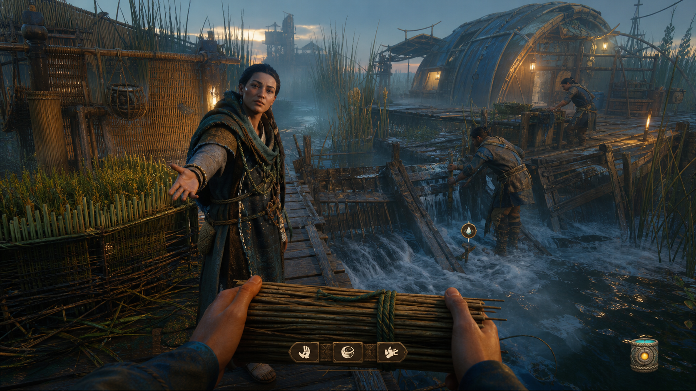
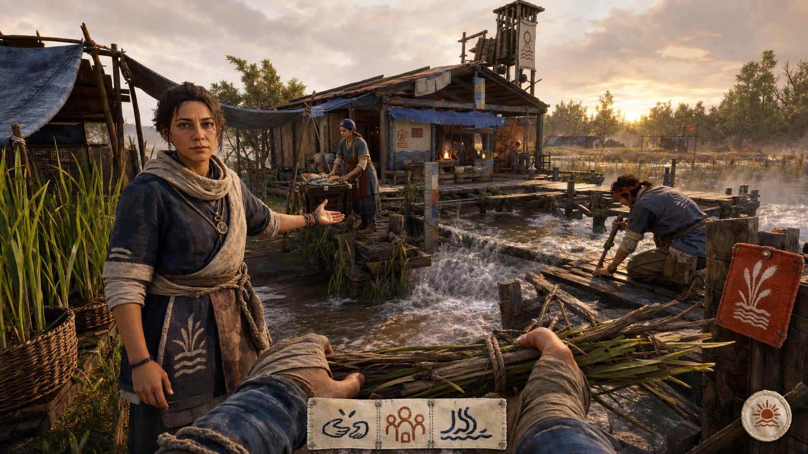
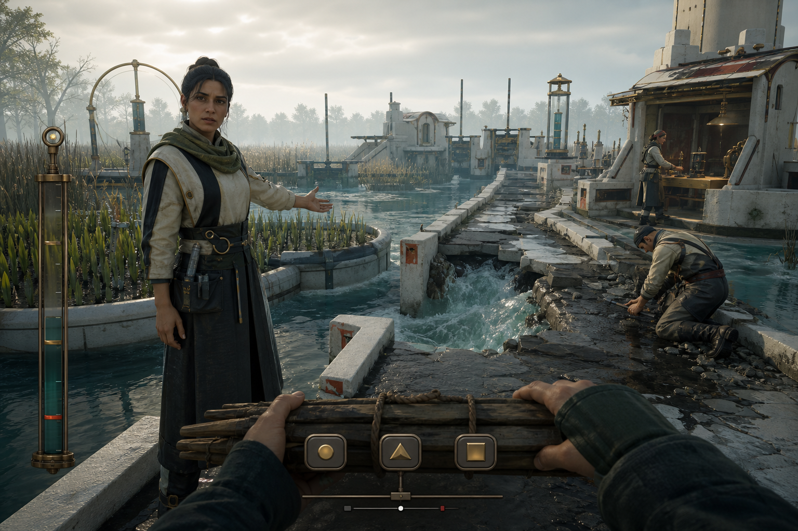

# F1 Snow Globe Visual and Interaction Target Package

## Status and boundary

**Status:** three-direction Candidate package ready; F1 remains incomplete until the user selects and accepts
one direction after viewing the style frames and running the standalone in-engine study.

This package compares presentation for the accepted resident-founder causeway moment. It does not replace the
main scene, add simulation state, integrate a live model/provider, or establish visual/play acceptance.
`PrototypeRuntimeSession` and the existing validated commands/events remain untouched.

## Fixed comparison moment

Every direction shows the same product situation:

- first-person arrival at the failing wetland causeway;
- Mara offers a materially grounded counter-position;
- Ivo visibly braces the repair while Sena works near the depot;
- the player carries one modest repair bundle;
- the response surface offers **labor**, **evidence**, or **defer**;
- pending, refusal, and consequence are expressed with both words and marks; and
- the interface remains subordinate to citizen, work, water, and consequence.

The style frames are visual targets, not screenshots of the current Godot implementation.

## Direction A — Reedwork Foundry



**Position:** weathered ecological futurism. Layered reed fibre, oxidized fasteners, wet timber, battered
biocomposite ribs, cool marsh fog, and localized amber work light.

**Interaction language:** a tactile field instrument—one need marker, one narrow response ribbon, one recent
result. No generic survival dashboard or chat window.

**Strength:** strongest atmosphere, wetland materiality, urgency, and contrast between human warmth and a cold
living environment.

**Risk:** can become muddy, visually expensive, or generic post-collapse craft if silhouettes, color hierarchy,
and civic identity are not rigorously authored.

## Direction B — Floodplain Commons



**Position:** civic fieldcraft. Heavy timber, patched canvas, enamel gauges, dyed cloth, painted communal
symbols, baskets, ceramic pipes, and warm overcast light.

**Interaction language:** a stitched field note or public work notice—one primary condition, three hand-stamped
responses, and one witnessed-result seal.

**Strength:** clearest settlement warmth, collective ownership, citizen legibility, and approachable human
stakes.

**Risk:** can drift toward a familiar rustic survival village unless the water infrastructure, civic marks,
and Snow Globe citizen behavior carry a distinctive identity.

## Direction C — Sluice Observatory



**Position:** hydrological instrumentalism. Limewashed floodworks, dark stone, ceramic sluice parts, oxidized
brass, blue-green level glass, geometric water channels, luminous fog, and precise warm work lights.

**Interaction language:** a restrained calibrated rail—one breach-aligned condition gauge, three geometric
response controls, and one consequence trace.

**Strength:** most distinctive architectural signature, clearest cause-and-effect geometry, and strongest
potential for a recognizable Snow Globe visual identity.

**Risk:** can feel sterile or authoritarian if wear, resident customization, vegetation, and human warmth do
not visibly interrupt the measured forms.

## Shared interaction contract

The standalone study uses fixed presentation data only. It deliberately exercises the surface that a future
experience-cognition Interface will drive without pretending to be that Interface.

| State | Required presentation |
|---|---|
| Open | Mara's position, causeway need, visible work, and three grounded responses; no instruction wall. |
| Labor pending | Immediate acknowledgement, explicit `LABOR ENTERED`, motion-safe pending mark, and no blocked camera/world tick. |
| Evidence pending | Mara exposes the water marks in the world; the response names what is being checked. |
| Defer/refusal | `DEFERRED / NOT NEUTRAL`, a distinct `!` mark, and the repair visibly proceeding without player commitment. |
| Consequence | A named result, a `✓` mark, citizen response, and a physical/state consequence statement. |

Accessibility requirements shared by all directions:

- words and glyphs accompany color for every state;
- response controls remain keyboard-focusable;
- layouts fit the supported 1920×1080, 1280×720, and 960×540 study viewports;
- reduced-motion mode freezes the subtle atmospheric drift without hiding state;
- subtitles and speaker names remain readable against the world; and
- no required information depends on audio, hue, animation, or provider diagnostics alone.

## Standalone review route

Run from this worktree:

```powershell
cd C:\Users\hunte\.codex\worktrees\f1-visual-target\societies
& 'C:\Users\hunte\AppData\Local\Microsoft\WinGet\Packages\GodotEngine.GodotEngine.Mono_Microsoft.Winget.Source_8wekyb3d8bbwe\Godot_v4.6.2-stable_mono_win64\Godot_v4.6.2-stable_mono_win64.exe' --path src/societies res://scenes/f1_visual_target_study.tscn
```

Controls:

- `1`, `2`, `3`: switch Reedwork Foundry, Floodplain Commons, and Sluice Observatory.
- `Q`: offer labor.
- `W`: ask for evidence.
- `E`: defer and observe refusal.
- `Space`: advance or reset the selected response cycle.
- `R`: toggle the static-safe reduced-motion view.

For each direction, inspect the open state, one pending path, refusal, consequence, and reduced-motion view.
Record 1–5 plus one sentence for:

1. distinctive world identity;
2. citizen presence and social credibility;
3. causeway/wetland consequence readability;
4. interaction/HUD hierarchy;
5. accessibility and comfort; and
6. desire to inhabit and continue.

F1 passes only when the user selects one direction, identifies any required blend, and accepts a normal-play
in-engine target. The selected direction then receives the complete five-view target package before F2.

## Production and performance direction

- Keep the first asset kit bounded to one wetland terrain/water set, causeway, depot, two support structures,
  three citizen silhouettes, one carried material, one tool family, and required state effects.
- Author silhouettes and material breakup before prop density. Extra clutter cannot substitute for readable
  work and consequence.
- Favor opaque geometry, reused materials, bounded local lights, and cheap fog layers. Transparencies,
  reflection breadth, particle density, and overlapping shadow lights are explicit budget risks.
- Target a stable 60 Hz presentation at 1920×1080 on the existing RTX 2070 SUPER reference machine, but treat
  that as an unproven F2 production target. The rejected ER-01 branch's `51.9392 ms` reference median p95
  remains a safety failure and is not repaired by this study.

## Generated-frame provenance and final prompt set

The three PNG frames were generated with the built-in image-generation tool on 2026-08-26 and copied into the
repository. They are ideation/target assets, not captured gameplay and not acceptance evidence. All prompts
used the `stylized-concept` game-environment target-frame mode and the same subject/composition invariants.

**Source and usage status:** these are newly generated outputs, not sourced third-party art. They are committed
only for internal concept comparison. No independent production/public-release license clearance is claimed;
that review, replacement decision, and any required attribution record remain part of the selected direction's
asset-production gate.

### Shared prompt

> Create a polished, production-minded gameplay-camera target frame for Societies / Snow Globe. Show the same
> first-person resident-founder moment at a failing wetland causeway: Mara presents a counter-position toward
> the reed nursery, Ivo repairs the causeway, Sena works beside the depot, and the player's hands carry one
> modest repair bundle. Use achievable high-quality stylized 3D game art, strong silhouettes, visible water
> and labor, a restrained three-choice contextual surface, and no readable text. Avoid chat windows, dialogue
> boxes, quest lists, minimaps, health bars, spreadsheets, floating exclamation marks, sci-fi holograms,
> combat/fantasy gear, neon cyberpunk, generic survival HUD, empty plazas, logos, and watermarks.

### Direction-specific prompt A

> `REEDWORK FOUNDRY`: weathered ecological futurism; woven reed-fiber panels, battered biocomposite beams,
> oxidized fasteners, wet timber, patched canvas, cool blue-green marsh fog, and localized amber work lights.
> The interface feels like a tactile field instrument with one need marker, one icon-led response ribbon, and
> one recent-result mark.

### Direction-specific prompt B

> `FLOODPLAIN COMMONS`: human civic fieldcraft; heavy timber trestles, repaired canvas, cream enamel gauges,
> woven baskets, painted communal symbols, rope lashings, chalk marks, ceramic pipes, clay red, faded ochre,
> indigo, and small safety-orange marks under warm after-rain sunset. The interface feels like a stitched field
> note/public work notice with three hand-stamped choices and one witnessed-result seal.

### Direction-specific prompt C

> `SLUICE OBSERVATORY`: austere hydrological instrumentalism softened by residents and wetland growth;
> limewashed floodwalls, dark stone paths, ribbed ceramic sluice parts, oxidized brass, blue-green level glass,
> geometric channels, luminous cool fog, and precise warm work lights. The interface is one breach-aligned
> condition gauge, one narrow three-choice response rail, and one consequence trace; avoid sterile or
> spaceship-like architecture.

## Next decision

The user selects **A**, **B**, **C**, or a precise blend naming one base direction and at most two elements to
borrow. Do not silently average all three; the selected product needs one dominant visual grammar.
