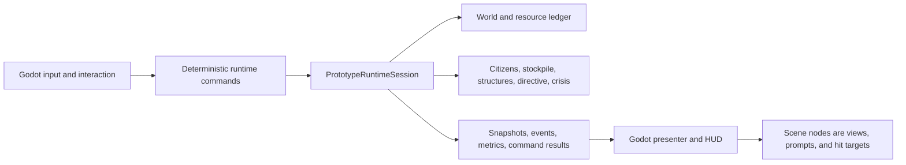

# Societies V3: Two-Week Development Plan

## Document Control

| Field | Value |
|---|---|
| Status | Active |
| Prepared | 2026-07-09 |
| Execution window | Monday 2026-07-13 through Friday 2026-07-24 |
| Day-zero preparation | Friday 2026-07-10, optional, 30–60 minutes |
| Baseline branch | `master` |
| Baseline commit before synchronization | `c58e3de` |
| Target engine | Godot 4.6.2 Mono + C# |
| Capacity assumption | One developer, 40–50 focused hours; 44.5-hour core, with up to 5.5 hours reserve at full capacity |
| Product milestone | V3 hardening plus one player-driven crisis slice |

This is the authoritative short-horizon execution plan for the next two weeks. `CURRENT_BUILD.md` remains the authority for what the game already contains. Older session planning remains design reference only.

## Long-Term North-Star Alignment

This sprint is a preliminary continuation, not a redefinition of the full game. The long-term product direction is an Eco-like society and ecology simulation in which human players and AI citizens coexist, specialize, cooperate, compete, deliberate, and experience shared material consequences. The intended added value is not unrestricted AI behavior; it is a society whose inhabitants can reason about, explain, negotiate, and remember consequential events while humans retain meaningful economic and political agency.

### Deterministic simulation and LLM boundary

- The authoritative simulation owns world facts and outcomes, including resources, ecology, production, inventories, ownership, laws, votes, and other state-changing rules as those systems are introduced.
- LLM-driven components may interpret structured observations, form intentions, explain motives, negotiate, deliberate, summarize memories, and propose actions.
- Every proposed action that changes the world must pass through explicit deterministic commands, validation, and recorded outcomes. An LLM response is never itself authoritative game state.
- Human participation must remain consequential. AI citizens should provide continuity, social texture, and autonomous interests without solving the civilization on the player's behalf or reducing the player to a spectator.
- Core simulation progress, validation, replay, and recovery must remain possible when an external model is unavailable, delayed, or returns an invalid proposal.

These principles constrain future design decisions but add no LLM, dialogue, multiplayer, market, or governance implementation to this two-week sprint. Those systems remain deferred until the current deterministic crisis slice answers whether helping and directing a visible society is understandable and fun.

### Planning drift log

Record only discoveries that may change the long-term vision, architecture, prototype order, or validation strategy. Do not rewrite the long-term library during the sprint unless a contradiction blocks current implementation.

| Date | Evidence or trigger | Planning implication | Affected anchors | Disposition |
|---|---|---|---|---|
| 2026-07-13 | Product-direction review clarified the Eco-like ecology/society goal and the role of LLM-enabled citizens alongside human participants. | Preserve deterministic world authority; use LLMs for bounded reasoning and communication; protect meaningful human agency. | Session 2 AI design, Session 6 roadmap, Session 7 master plan | Reconcile after the Day 10 result; no sprint scope change. |

## Execution Log

- **2026-07-09, Day 1 started:** refreshed `origin`, fast-forwarded local `master` from `c58e3de` to `379300d`, and created `feature/v3-runtime-hardening`.
- **Baseline correction:** synchronized master contains 79 required .NET tests. Its first Windows run passed 77 and exposed two CRLF-sensitive CSV test assertions; the runtime CSV was valid.
- **First green checkpoint:** normalized line endings in the CSV test parser, then captured a zero-warning Release build, 79/79 .NET tests, and 13/13 Godot headless tests. See `planning/active/evidence/v3-day1-validation-manifest.json`.
- **First runtime hardening unit:** added a 12-tick rendered-frame cap that retains backlog, restores unattempted intervals after a tick failure, and leaves direct test/soak stepping uncapped. Validation passed 85/85 .NET and 14/14 Godot tests; see `planning/active/evidence/v3-w1-02a-catchup-validation.json`.
- **HUD coalescing unit:** removed redundant inventory/stockpile event-driven HUD rebuilds while retaining rendered-frame and explicit command refreshes. Validation passed 85/85 .NET and 15/15 Godot tests; see `planning/active/evidence/v3-w1-02b-hud-coalescing-validation.json`.
- **Metrics collector foundation:** added a pure, unused, instance-owned collector with bounded typed batches, reset/abort-safe one-shot phase tokens, separate rendered/manual batch kinds, and invariant CSV output. Validation passed 91/91 .NET tests; runtime wiring remains the next unit. See `planning/active/evidence/v3-w1-02c-runtime-metrics-collector-validation.json`.
- **Metrics runtime wiring:** gated collection behind `SOCIETIES_PERF_METRICS=1`, preserved metrics-off allocation/clock behavior, separated capped rendered frames from uncapped manual batches, exposed value diagnostics, and timed `BuildWorkOrders` at its actual call site. Validation passed 91/91 .NET and 16/16 Godot tests; see `planning/active/evidence/v3-w1-02d-runtime-metrics-wiring-validation.json`.
- **Metrics artifact export:** added bounded `runtime-batch-metrics-v3.csv` output to the normal save path, removes stale output when metrics are disabled, and isolates optional telemetry I/O failures from core snapshot saves. The existing public save overload and positional artifact-path API remain compatible. Validation passed 91/91 .NET and 16/16 Godot tests; see `planning/active/evidence/v3-w1-02e-runtime-metrics-export-validation.json`.
- **Runtime diagnostic schema:** added exact path hit/miss accounting, last cache size, runtime invalidation/rebuild timing, worker count, and generic assignment candidate pressure. The CSV keeps its original 20-column prefix and appends eight fields; metrics-off still performs no clock read or row allocation. A forced path completion and exact candidate-count tests are green. Benchmark-only eager warmup remains separate until deterministic state equivalence is proven because current cache entries embed exact endpoints. Validation passed 91/91 .NET and 16/16 Godot tests; see `planning/active/evidence/v3-w1-02f-runtime-diagnostics-validation.json`.
- **Standalone performance-runner tooling:** implemented an optional paired runner that executes matching metrics-off and metrics-on cases, records timing statistics, deterministic hashes, diagnostics, environment/build identity, and machine-readable manifests, and requires clean committed source by default. The short characterization command is `./scripts/run-performance-pair.ps1 -Scenario balanced_basin -Seed 1337 -Citizens 3 -Ticks 3`; its ignored artifacts are written below `artifacts/performance/`. Final validation passed 4/4 focused statistics tests, 79/79 fast .NET tests, 95/95 required .NET tests, a clean Godot solution build, and 16/16 Godot headless tests. A clean-source pair from `a791c3c` produced exact snapshot, event-log, and combined-hash equivalence with three metrics batches and zero drops; see `planning/active/evidence/v3-w1-02g-performance-runner-validation.json`. This completes V3-W1-02; the current Godot editor/headless route is Debug characterization rather than V3-W1-03 Release evidence. V3-W1-03 remains next: establish a verified Release route, then run the complete cold/warm/invalidation matrix and median reference cases.
- **V3-W1-03a Release-route slice complete:** added a tracked `Windows Performance Release` preset, an export-only `performance_runner` main-scene override, a Godot-configured `Societies.sln`, exported-PCK catalog loading, and runtime assertions that distinguish Godot's managed `ExportRelease` configuration from an ordinary managed `Release` build. `run-performance-pair.ps1 -ReleaseExport` exports and invokes the Windows console wrapper, pins Godot 4.6.2, records exact runner/process/project provenance, and rejects debug, editor-hosted, or incomplete release-template identities. Validation passed 6/6 focused tests, 79/79 fast .NET tests, 95/95 required .NET tests, zero-warning Debug/ExportDebug/ExportRelease solution builds, a clean Godot solution build, and 16/16 Godot headless tests. From clean implementation commit `acf634f`, the exported metrics-off/on pair passed every route and equivalence contract with deterministic hash `d9581664e4bdfa40d55b0b301c271c5106854379d3a7f9e72e7df5ef5bbb5a1e`; the matching Debug negative control failed only `release_environment`. See `planning/active/evidence/v3-w1-03a-release-route-validation.json`. This validates the Release execution route only; explicit cold/warm/invalidation modes and the full median reference matrix remain next.

- **V3-W1-03b cache-mode contracts complete:** schema v3 separates natural simulation preconditioning from cache treatment. `cold` clears only derived path entries, `natural_warm` retains the same-timeline cache, and `forced_invalidation` completes one prepared path segment on the first measured tick and records the exact new-version miss, endpoint/cell checks, cost change, and commit-to-first-correct-lookup interval. `run-performance-cache-modes.ps1` is the cross-mode authority and requires configuration, environment, tick, and deterministic-hash identity plus a valid forced transition. Eager/all-pairs prefill remains disabled. Validation passed 7/7 focused probe/statistics tests, 98/98 required .NET tests, zero-warning Debug/ExportDebug/ExportRelease builds, and 16/16 Godot headless tests. A clean verified ExportRelease comparison from implementation commit `5444cc3` passed all contracts, revalidated 21/21 artifact hashes, matched cold/warm deterministic hash `7e24bda3446585802f37a95edc050848d126b8a6c5a94ebfe07368a071430814`, and proved the forced transition with hash `7dbf93fcf4c0c852cb608cc94f8fb87e19c9b61b8a8bec4919c3004d782e3d88`. See `planning/active/evidence/v3-w1-03b-cache-mode-validation.json`. This evidence remains scoped to cache-mode contracts; the aggregate baseline and budget decision are recorded by W1-03c below.
- **V3-W1-03c performance evidence captured; safety gate red:** `run-performance-baseline-matrix.ps1` is now the sole aggregate authority for the 14-pair canonical Release matrix. It validates exact case inventory, clean content identity, one machine and content-identical Release bundle, leaf manifests and artifact bytes, cold/warm determinism, three comparable 16-citizen trials, repeated 1,000-tick soak determinism, stress characterization, forced invalidation, and fixed target/safety thresholds. The first clean attempt exposed that long soaks legitimately complete path segments; the corrected contract accepts only equal nonnegative navigation-version/invalidation deltas and remains exact for forced mode. Validation passed 103/103 required .NET tests, a zero-warning ExportRelease build, 14/14 clean Release pairs, 28 metrics rows, and 354/354 manifest artifact hashes from commit `a636967`. Evidence validity is green, but the measured budget is `safety_failure`: 16-citizen cold median p95 570.6155 ms and max 3694.2534 ms exceed 50 ms and 250 ms safety; both 1,000-tick soaks also exceed safety; 24-citizen stress reaches p95 1045.7539 ms. Forced invalidation passes at 8.4171 ms, cold/warm hashes match, repeated soak hashes match, and eager/all-pairs warmup remains benchmark-only. See `planning/active/evidence/v3-w1-03c-performance-baseline-validation.json`. W1-03 evidence capture is complete, but Week 2 feature expansion is blocked. Continue the W1-04/W1-05 correctness/performance sequence, add route-selection phase detail, reduce exact path-plan work, then rerun W1-03c before lifting the gate.
- **V3-W1-04 navigation semantics complete:** implementation commit `7918d49` replaces fabricated unreachable routes with explicit reachability, rejects blocked endpoints, prevents corner cutting, uses an admissible minimum-multiplier octile heuristic, and applies deterministic queue ties. Cell-route and negative results are cached while exact endpoints are rematerialized per request. Assignment preflights every required leg, preserves the original score formula, counts/skips unreachable candidates, and avoids inventory mutation before a route is proven; unexpected post-pickup failure restores the source item. Deterministic outward walkable interaction resolution preserves wetland reeds/clay and normalizes fresh plus legacy cache, structure, depot, and citizen-home positions. Seven new tests cover the navigation contract, all-unreachable idle diagnostics, and legacy wetland resume without harvest or carry loss. Validation passed 110/110 required .NET tests, 16/16 Godot headless tests, zero-warning Debug/ExportDebug/ExportRelease builds, and final independent review with no P0/P1 findings. See `planning/active/evidence/v3-w1-04-navigation-validation.json`. At that checkpoint W1-05 was unblocked while Week 2 remained gated.
- **V3-W1-05 exact selection complete; overall safety remains red:** implementation begins at `b1fddaf`, with clean Release evidence from `227a758`. The default selector uses a float-guarded straight-line score bound, bound/ordinal ordering, strict-below-best pruning, exact multi-leg reachability, and first-route reuse; exhaustive selection remains a non-persistent reference mode. Nine selector tests include 300-tick differential coverage for all four shipped scenarios. Balanced Basin at 16 citizens reduced exact selector queries from 17,441 to 2,544 (85.414%) while per-tick assignments, events, resource application, final snapshots, and clean Release hashes remained exact. Three counterbalanced trials on one hash-pinned Release bundle produced median p95 78.0301 ms optimized versus 656.3981 ms exhaustive and passed the no-regression gate. The optimized cache-mode rerun passed, as did all 14 canonical matrix contracts and 354 artifact hashes. The optimized matrix reference median p95 improved from 570.6155 ms to 81.4823 ms, but still exceeds the 50 ms safety limit; median maximum is 1,552.5664 ms versus 250 ms safety, and the stress case remains red. Validation passed 119/119 .NET, 16/16 Godot, and zero-warning Debug/ExportDebug/ExportRelease builds. See `planning/active/evidence/v3-w1-05-job-selection-validation.json`. W1-06 and Week 2 feature work should not start until the remaining p95/maximum spikes are characterized and the performance gate is explicitly reconsidered.
- **V3-W1-05b spike characterization complete; gate reconsidered and still red:** `analyze-performance-spikes.ps1` consumes only clean, verified schema-v4 ExportRelease equivalence pairs, validates their source identities and hashes, and emits diagnostic-only threshold, attribution, phase, cache-miss, correlation, repeatability, and forced-transition evidence. Across all 14 runs and 5,301 ticks, wall time correlates `0.982573` with path-cache misses versus `0.233264` with lookup volume and `0.076652` with navigation rebuild time. Each 16-citizen reference run reproduces the same 16 ticks over 50 ms; all seven ticks above 250 ms are initial-cold or immediately post-invalidation, and all six one-second ticks follow invalidation. Both 1,000-tick soaks reproduce the same 50 spike ticks, with all 18 one-second ticks following invalidation. The causal path is full-cache clearing after completed path segments, followed by exact A* repopulation during extraction-site ranking and citizen selection; navigation rebuild itself is small. Two analysis executions were byte-identical, and final independent review found no P0/P1 issues. This explains the gate failure but does not cure it. W1-06 and Week 2 remain blocked until an exact cache-repopulation optimization passes differential correctness and a fresh canonical matrix. See `planning/active/evidence/v3-w1-05b-spike-characterization.json`.
- **V3-W1-05c exact cache-repopulation optimization complete; safety p95 green, maximum still narrowly red:** independent exact-bounded and exhaustive extraction modes prove identical assignments, events, resource application, and snapshots for 300 ticks in all four scenarios while reducing total path lookups by 22.72% to 67.96%. A representation-only A-star port replaces coordinate dictionaries with dense cells, pooled generation-stamped workspaces, cached exact multipliers, and immutable packed neighbor topology shared only across cost-only navigation versions. Sixteen navigation-representation cases, including dictionary-oracle differentials, preserve exact route cells, waypoints, float bits, unreachable behavior, ties, bounds, generation wrap, concurrency, and mutable-world sharing guards. Full validation passes 151/151 .NET and 16/16 Godot tests. The clean schema-v5 14-pair ExportRelease matrix from `a772d15` passes every evidence contract and 354 hashes. Against the immediate W1-05 matrix, 16-citizen median p95 falls from 81.4823 ms to 36.9614 ms and median max from 1552.5664 ms to 259.702 ms; the forced metrics-off full tick is 245.699 ms against this slice's 250 ms diagnostic bound, while the formal commit-to-first-correct-lookup target passes at 11.8671 ms. The hard gate remains `safety_failure` because reference max is 9.702 ms above safety, soak maxima remain about 322-323 ms, and 24-citizen stress is 272.6378 ms p95 / 607.9651 ms max. Residual wall time still correlates `0.959689` with misses; the worst stress tick combines 67 general and 225 selector misses. Representation tuning is no longer the primary blocker. W1-06 and Week 2 remain blocked while the next exact slice reduces distinct searches across the global work-order/selection frontier. See `planning/active/evidence/v3-w1-05c-cache-repopulation-validation.json`.
- **V3-W1-05d shared-frontier bounding complete; maxima green, one p95 trial still red:** clean implementation commit `8688c27` adds exact-position, topology-only geometric distance fields over the immutable packed neighbor graph. A field is built only after eight distinct current-version cache misses are predicted and is used solely to tighten the existing strict branch-and-bound cutoff; it never supplies a route, exact score, reachability result, or cross-version cache entry. Eight direct cases cover exact endpoints, same-cell, blocked/disconnected, built-path versions, origin identity, and non-binary float accumulation. Four 300-tick exhaustive differentials compare per-tick worker state, assignments, events, resources, and final snapshots; Balanced Basin selector queries fall from 2,544 to 1,482. Full validation passes 159/159 .NET and 16/16 Godot tests, all managed builds are warning-free, and final deep review has no P0/P1/P2 findings. The clean 14-pair schema-v5 matrix passes 354/354 hashes. Reference median p95 is 46.9161 ms and median max is 159.8224 ms; both soaks pass safety at 36.6139/36.5885 ms p95 and 169.5998/165.5849 ms max. Stress improves to 128.9719 ms p95 / 165.0386 ms max, while its former worst tick falls from 67 general + 225 selector misses and 626.3771 ms to 34 + 2 misses and 157.7138 ms. Forced invalidation is exact at 11.4945 ms. The aggregate hard gate is still `safety_failure` because reference trial 3 reaches 50.9476 ms p95, 0.9476 ms above safety. Keep W1-06 and Week 2 blocked; the next performance slice must reduce residual general work-order construction cost or variance without weakening exact navigation. See `planning/active/evidence/v3-w1-05d-shared-frontier-validation.json`.
- **V3-W1-05e cached-distance replay complete; exact improvement validated, hard p95 gate still red:** residual fanout analysis found 323,893 general positive-cache hits against 4,176 general misses and 15,010 selector hits against 1,262 selector misses across the 14-run W1-05d frontier. Every distance-only general hit rebuilt a complete route and then discarded everything except distance. Clean implementation commits `b10084b` and `9d5ca14` add a current-version positive-cache fast path that replays identical endpoint checks and float additions over the cached cell path, plus a full-materialization reference mode. Misses, negative hits, selector/full-plan queries, deterministic ordering, exact endpoints, unreachable behavior, and navigation-version invalidation are unchanged. Nine direct replay tests, four 300-tick shipped-scenario differentials, and two forwarding cases raise full validation to 174/174 .NET plus 16/16 Godot. Schema-v6 performance/equivalence artifacts measure only the post-warmup interval and require paired result/manifest counter equality; runtime metrics CSV stays v4, and the spike analyzer remains compatible with v5 and v6. The final clean 14-pair matrix exercises 316,534 fast hits, passes every evidence contract and 354/354 hashes, and records reference median p95 49.1537 ms / max 156.3861 ms, soak maxima 170.4334/162.4554 ms, stress 132.4614 ms p95 / 154.5145 ms max, and exact forced invalidation at 12.7154 ms. The aggregate remains `safety_failure`: reference trial 2 reaches 51.2372 ms p95, 1.2372 ms above the hard limit. The slice removes repeated materialization work but does not reduce the remaining distinct exact misses, so W1-06 and Week 2 remain blocked pending an exact frontier-search reduction and another clean matrix. See `planning/active/evidence/v3-w1-05e-cached-distance-validation.json`.
- **V3-W1-05f bounded work-order frontier complete; hard performance gate green:** pre-change analysis found 4,743,965 virtual uncapped orders reduced to 369,430 retained orders, with extraction planning as the sole BuildWorkOrders route-ranking caller and 72.869% of general misses occurring immediately after invalidation. Clean implementation commit `7456072` adds exact whole-resource-class omission only when `K` active unclaimed orders have priorities strictly greater than the class maximum; equality, claimed-ID collisions, exhaustive-reference mode, uncapped mode, and every uncertain case retain full route evaluation. Virtual uncapped counts preserve diagnostics and final ordering. Eleven new direct and call-site cases plus four 300-tick shipped-scenario differentials raise full validation to 185/185 .NET and 16/16 Godot, with warning-free Debug/ExportDebug/ExportRelease builds and no final P0/P1/P2 review findings. The clean 14-pair matrix passes all contracts and 354/354 hashes, cuts route lookups by 20.157%, and records three individually green references at 45.8724-47.2589 ms p95 and 147.9514-203.0221 ms maximum. A separate clean confirmation remains individually green at 48.1055-48.6139 ms p95 and 147.7332-206.0087 ms maximum. Both soaks and the 12.1761 ms forced transition pass safety. The formal budget remains `target_missed`, and non-gating 24-citizen stress remains red at 129.2682 ms p95, but every hard performance safety limit now passes. W1-06 is unblocked; Week 2 remains blocked until W1-06 completes the resource-authority and snapshot/schema gate. See `planning/active/evidence/v3-w1-05f-bounded-work-order-frontier-validation.json`.
- **V3-W1-06 session-owned resource ledger complete; Week 1 hard gate green:** implementation commits `419ba69` and `8300574` establish stable legacy-compatible site IDs, a pure session-owned quantity ledger, ordered player/AI command-result transactions, immediate deterministic AI rollback, scene-only projections, ledger-sourced persistence/metrics/summaries, runtime snapshot/run-summary schema v6, and strict prepare-before-commit v5 migration/v6 restore. Exact 300-tick headless operation, player/AI exactly-once behavior, `logs_1/logs_10/logs_2` identity, omitted-v5 depletion, malformed/future rejection, and 1,000-tick versus save-at-500/resume equivalence are covered. Full validation passes 198/198 .NET and 16/16 Godot with zero build warnings and no final P0/P1/P2 review findings. The first clean matrix at `419ba69` repeated a narrow first-reference p95 miss, so `8300574` added exact revision-cached ordered active projections. The final clean 14-pair ExportRelease matrix passes 354/354 artifact hashes and every hard safety limit: references are 45.7490-46.5016 ms p95 / 146.6519-157.3410 ms maximum, soaks are 37.0458-38.0370 ms p95 / 164.5518-165.1034 ms maximum, and forced invalidation is exact at 12.0662 ms. The formal result remains `target_missed`, with non-gating stress at 133.8055 ms p95. W1-06 and the Week 1 hard gate are complete; the contracted Week 2 crisis slice is now allowed. See `planning/active/evidence/v3-w1-06-session-resource-ledger-validation.json`.

- **V3-W2-01 crisis contract complete:** added the fixed-seed `empty_stores` catalog scenario, a shared 20 Hz simulation-time constant, strict catalog validation, and a pure session-owned crisis evaluator. Stable, incapacity-collapse, and deadline outcomes advance only from authoritative ticks; holds reset on any broken condition; paused calls and render cadence cannot advance crisis time. Thirteen focused tests retain a repeated real-session no-input trace, an exact candidate-success contract envelope, domain checkpoint/resume equivalence, deterministic initialization, and crisis-absent legacy defaults. Runtime snapshot schema remains v6: crisis-scenario persistence fails fast instead of discarding state, while legacy persistence remains unchanged. Contribution commands, directives, terminal events, HUD, and schema-v7 serialization remain explicitly deferred to W2-02 through W2-05. Full validation passes 211/211 .NET and 16/16 Godot tests with zero managed build warnings. See `planning/active/evidence/v3-w2-01-empty-stores-contract-validation.json`.
- **V3-W2-02 atomic contribution complete:** implementation commit `a75acf4` adds a catalog-gated command/result boundary and ordinal deposit-all central-depot interaction. Eligible raw resources move as one preflighted authoritative batch; crafted tools remain personal; failures are mutation-free; duplicate same-frame input is rejected; per-resource counters and events are deterministic; and existing citizen work orders consume the deposited stock. Contribution-bearing sessions, like crisis sessions, fail schema-v6 persistence explicitly until W2-05 rather than losing counters. Validation passes 15/15 focused contribution cases, the manifest-owned 133/133 fast tier, 17/17 Godot headless tests, and zero-warning Debug/ExportDebug/ExportRelease builds. The full 226-test soak/coverage route was intentionally not run because Weekly Full Validation owns it. See `planning/active/evidence/v3-w2-02-atomic-contribution-validation.json`.

## Decision and Intended Outcome

Continue from the existing Godot project and establish a clean V3 boundary. Do not restart the repository and do not migrate to Unity during this sprint.

The sprint has two linked outcomes:

1. **Week 1 — trustworthy simulation kernel:** correct navigation, measured performance, bounded runtime instrumentation, and a single authoritative owner for resource quantities.
2. **Week 2 — smallest meaningful game loop:** the player contributes to the settlement, chooses a directive, observes citizens respond for understandable reasons, and reaches a clear Stable or Collapsed outcome.

At the end of Day 10, record one explicit result:

- **Continue V3:** technical gates pass and the crisis demonstrates understandable agency.
- **Narrow iteration:** engineering passes, but playtests show that the crisis, directive, or citizen causality needs refinement.
- **Stop feature expansion:** correctness, determinism, persistence, or the performance safety gate fails; return to the last green boundary before adding systems.

The canonical product north star and deterministic/LLM boundary are maintained in [PRODUCT-THESIS.md](../PRODUCT-THESIS.md). If the W2-06 report concludes **Continue V3**, evaluate [the Draft/Conditional Weeks 3-4 plan](v3-weeks-3-4-development-plan.md); it does not activate before that conclusion.

### Day 10 long-term planning reconciliation

After recording the sprint result, perform a focused reconciliation before selecting the next implementation stage:

1. Compare technical and playtest evidence against the north-star principles above.
2. Record which major assumptions were validated, weakened, invalidated, or remain unknown.
3. Re-sequence future prototypes around the next highest-risk product question rather than the oldest feature list.
4. Update only the affected anchor documents first: `planning/README.md`, Session 2 AI design, Session 6 prototyping roadmap, Session 7 master plan, and `planning/meta/technical-constants.md` when a measured constant changed.
5. Classify other affected planning documents as **Retained**, **Needs revalidation**, **Deferred**, **Superseded**, or **Reference only** instead of rewriting the full library.
6. Carry unresolved drift entries into the next short-horizon plan with a named validation method or explicit deferral.

The reconciliation is a decision checkpoint, not an automatic feature-expansion approval. The code, `CURRENT_BUILD.md`, validated evidence, and observed playtest results remain authoritative.

## Starting Reality

### Repository and validation baseline

- Local `master` is at `c58e3de` and is two commits behind `origin/master`.
- `origin/master` adds `7a4270a` (metrics CSV/build fix) and `379300d` (uncapped work-order diagnostics).
- The pre-sync audit produced a Release build with zero warnings/errors, 64/64 .NET tests passing, and 13/13 Godot headless tests passing.
- Synchronizing `7a4270a` and `379300d` adds 15 required .NET tests, so the active preservation floor is now 79 .NET and 13 Godot tests. The old 64 count is historical evidence only.
- `origin/feature/runtime-observability-and-hardening` is based on the older local master and overlaps current simulation work. It is evidence and a source of selected changes, not a branch to merge wholesale.

### Performance evidence, not yet the new baseline

The hardening branch demonstrated that 16 citizens over 300 ticks can reach approximately 13.3 ms mean, 19.4 ms p95, and 41.2 ms p99 after warmup. It also reduced a large initial spike from roughly 18 seconds to 2.6 seconds by eagerly warming routes.

That result is encouraging but incomplete:

- eager warmup creates roughly 9,400 cached routes at the current world scale;
- the benchmark did not exercise a real navigation invalidation;
- timing and diagnostic collection still need lifecycle, memory, and CSV hardening;
- the job selector still computes exact paths for too many candidates.

All sprint performance claims must be regenerated from the synchronized V3 branch.

### Product baseline

The current build is a strong simulation debugger but not yet a compelling player loop. It has first-person harvesting, a player inventory and separate settlement stockpile, one crafting recipe, citizen task explanations, persistence, settlement classifications, and rich debug overlays. It does not yet let the player deliberately shape the shared economy or make a consequential settlement-level choice.

The V3 slice will reuse those systems. It will not add markets, broad governance, dialogue, combat, networking, or production art.

## Scope

### Sprint goals

- Synchronize and lock a reproducible V3 baseline.
- Selectively port and harden useful runtime observability.
- Fix known navigation defects before optimizing navigation use.
- Reduce exact path queries without changing the exhaustive selector's result.
- Move resource quantities into session-owned authoritative state.
- Add safe snapshot schema handling for the changed state boundary.
- Create one deterministic crisis scenario named `empty_stores`.
- Let the player transfer eligible resources into the settlement stockpile atomically.
- Let the player choose between two visible settlement directives.
- Show how a directive affected a citizen's assignment reason.
- Resolve the crisis with deterministic, visible rules.
- Establish a reproducible visual and representational baseline before observed playtests.
- Capture enough telemetry and playtest evidence to decide what to build next.

### Explicit non-goals

- Unity migration or DOTS prototype
- multithreaded simulation or ECS conversion
- multiplayer, ENet, backend services, or production accounts
- authoritative voxel terrain
- markets, trade, laws, elections, broad governance, or autonomous external AI agents
- combat, social relationships, dialogue, or approval simulation
- crafting expansion or redesign
- spatial indexing, crowd simulation, or 256-citizen optimization
- a separate engine-neutral assembly or removal of every Godot type
- custom models, animation polish, music, or audio
- multiple crises, dynamic difficulty, or a quest framework

These are deferred, not rejected. None is required to answer the next product question: *is directing and helping a visible society fun and understandable?*

## Target Runtime Boundary



| State | Authoritative owner | Godot scene responsibility |
|---|---|---|
| Resource IDs and quantities | `PrototypeRuntimeSession` resource ledger | Render snapshots and provide interaction targets |
| Player inventory | Runtime session | Display and submit commands |
| Settlement stockpile | Settlement/runtime session | Display only |
| Citizens, orders, structures, paths | Settlement/runtime session | Render only |
| Active directive and crisis | Runtime session | Display and submit choices |
| Saves, events, and metrics | Captured from runtime state | Trigger/export only |

The scene must not decrement resources or repair runtime state after a tick. Commands mutate state once; presenters consume results.

## Definition of Success

### Technical release gates

| Area | V3 target | Safety failure or blocker |
|---|---|---|
| Build | Release build succeeds with zero warnings/errors | Build failure or new unexplained warning |
| Existing tests | Existing 79 .NET and 13 Godot tests, plus new tests, all pass | Any unexplained loss or failure |
| Determinism | Repeated fixed-seed 1,000-tick runs have exact canonical state and event ordering | Any mismatch |
| Resume | Uninterrupted 1,000 ticks equals save at 500, restore, and continue | Any state loss, duplication, or event-order mismatch |
| 16 citizens / 300 ticks | Median of three: p95 ≤25 ms, p99 ≤50 ms, max ≤100 ms, total ≤6 s | p95 >50 ms or any tick >250 ms |
| 16 citizens / 1,000 ticks | p95 ≤25 ms, no crash/stall/backlog, exact repeat hash | Any tick >250 ms or nondeterminism |
| 24-citizen stress | Characterize; target p95 ≤50 ms and max ≤200 ms | Report before making it a hard cross-machine gate |
| Bootstrap | ≤3 s target; ≤2 s stretch | >5 s |
| Forced navigation invalidation | ≤150 ms target | >250 ms or incorrect route reuse |
| Assignment work | At least 60% fewer assignment-time exact path queries at 16 citizens | Behavior differs from exhaustive reference |
| Fixed-step protection | Never process more than 12 catch-up ticks in one rendered frame | Cap bypassed or backlog grows without warning |
| Resource authority | One writer; harvesting and deposit cannot duplicate or lose resources | Any scene-owned quantity mutation remains |

Absolute timing gates use the same named reference machine, fixed scenario and seed, Release build, and the median of three runs. CI on unrelated hardware reports trends and enforces broad safety limits. Cache hit rate is diagnostic unless warm-cache mode is enabled; in that mode target at least 99% after warmup and investigate below 98%.

The release reference is `balanced_basin`, simulation seed `1337`, 16 citizens, Release build, with runtime metrics disabled for the primary timing run and an equivalent metrics-enabled companion run for diagnosis. Define intervals consistently:

- **cold bootstrap:** entry to `PrototypeRuntimeSession.Initialize` through generated world, initialized simulation, and first presentable runtime snapshot, with no pre-warmed route cache;
- **warm benchmark:** the same fixed run after the benchmark-only warmup completes; warmup time is reported separately;
- **forced invalidation:** the tick that commits a path-segment navigation-version change through completion of the first correct post-change route lookup, excluding artifact serialization.

The performance runner must record its exact invocation and configuration in the manifest so these boundaries can be reproduced.

### Player-loop gates

- A no-input reference run reaches Collapsed inside the tuned crisis window.
- A scripted contribute-and-direct run reaches Stable.
- Contributions never lose or duplicate resources and are consumed through normal citizen work.
- Directives produce materially different future assignments without canceling active tasks or overriding critical eating/sleeping.
- A citizen explanation names the directive when it materially influenced the assignment.
- The result is emitted once, survives save/load, and explains why it occurred.
- The slice is playable without editing debug state or using a developer command.
- No P0/P1 crash, data loss, soft lock, or progression blocker remains.

### Playtest decision gates

Recruit five observed testers. The numerical gates below are valid only when all five complete a usable session. Three or four completed sessions are directional evidence and must be labeled product validation incomplete; fewer than three are insufficient for a product conclusion.

- 4/5 identify the crisis goal within two minutes.
- 4/5 contribute without facilitator instruction.
- 3/5 correctly explain the directives.
- 3/5 correctly explain why one inspected citizen chose a task.
- 3/5 rate clarity and agency at least 5/7.
- 3/5 say they would try another crisis.
- No critical defect invalidates a session.

Low win rate alone means tuning. Failure to understand contribution, directives, or citizen causality means the loop needs design iteration.

## Work Breakdown

Estimates include implementation, focused tests, and review. Automated suite runtime is not counted as focused labor. The core totals approximately 44.5 hours, leaving up to 5.5 hours at full capacity for regression repair and tuning. Use the capacity adjustments below if fewer than 44.5 hours are actually available. Stretch work is separate.

### Week 1 — V3 hardening and state authority

| ID | Deliverable | Estimate | Depends on |
|---|---|---:|---|
| V3-W1-01 | Synchronize and lock the baseline | 2 h | — |
| V3-W1-02 | Selectively port and harden observability | 4.5 h | W1-01 |
| V3-W1-03 | Capture current performance evidence | 1.5 h | W1-02 |
| V3-W1-04 | Correct navigation semantics | 4.5 h | W1-03 |
| V3-W1-05 | Preserve-exact job-selection optimization | 4.5 h | W1-04 |
| V3-W1-06 | Session-owned resource ledger and schema v6 | 6.5 h | W1-04; contracts begin during W1-05 |
|  | **Week 1 total** | **23.5 h** |  |

#### V3-W1-01 — Synchronize and lock the baseline

- Confirm a clean worktree and fetch current remote state.
- Fast-forward `master` to include `7a4270a` and `379300d`.
- Run the full validation loop before branching.
- Record SHA, hardware, tool versions, scenario, seed, test counts, and durations.
- Create `feature/v3-runtime-hardening` from the verified SHA.
- Create a local baseline tag only after the synchronized commit is green.
- Add a test manifest and classify tests as Fast, Integration, Soak, or Extended without removing coverage.

Acceptance:

- Baseline metadata and commands are reproducible.
- The authoritative build and both test suites pass.
- The baseline can be restored without destructive history operations.
- Fast feedback is identified; the full validation script remains authoritative.

#### V3-W1-02 — Selectively port and harden observability

Port useful behavior from `origin/feature/runtime-observability-and-hardening` as reviewable units:

- 12-tick catch-up cap and backlog warning;
- phase/tick timing and artifact export;
- Godot performance runner;
- path lookup, hit, miss, invalidation, cache size, work-order, and worker-count diagnostics;
- HUD update deduplication;
- optional eager route warmup for comparison only.

Harden it during the port:

- explicit per-run reset so metrics cannot leak across tests/restarts;
- bounded or streamed tick rows rather than an unbounded list;
- invariant-culture, escaped CSV;
- no diagnostic allocation or `Stopwatch` work when metrics are disabled;
- correct nested phase measurement and non-zero tick accumulation;
- preserve `WorkOrdersGeneratedUncapped` from master;
- move performance characterization to `Societies.Core.Tests.Extended`;
- label old benchmark reports as historical.

Acceptance:

- Metrics-on and metrics-off runs end with the same deterministic hash.
- Metrics-off performs no per-tick diagnostic-row allocation.
- Exported CSV parses and contains real measurements.
- A Godot test proves `_Process` never advances more than 12 catch-up ticks per rendered frame.
- Characterization is excluded from the normal pull-request gate.
- Each logical port can be reverted independently.

#### V3-W1-03 — Capture current performance evidence

Run cold and warm configurations for 3, 6, 12, and 16 citizens over 300 ticks, plus a 16-citizen 1,000-tick soak, a 24-citizen stress run, and a forced path-completion/invalidation case.

Capture initialization time, tick p50/p95/p99/max, exact path queries, hits/misses, cache size, candidates per idle citizen, invalidations/rebuild time, capped/uncapped orders, final hash, and artifact paths.

Acceptance:

- Three comparable runs exist for the release-scale case.
- A machine-readable manifest identifies environment and configuration.
- Cold, warm, and invalidated behavior compare without changing results.
- Evidence decides whether all-pairs warmup remains benchmark-only or is temporarily required.

#### V3-W1-04 — Correct navigation semantics

- Replace fake direct paths for unreachable destinations with explicit `TryFindPath`/reachability semantics.
- Reject unwalkable starts and destinations.
- Prevent diagonal corner cutting unless both adjacent orthogonal cells are traversable.
- Scale the A* heuristic by the minimum possible traversal multiplier, including built-path discounts.
- Skip and count unreachable work orders instead of assigning them.
- Preserve stable deterministic tie-breaking.

Acceptance tests:

- disconnected destinations are unreachable and never route through blocked terrain;
- blocked orthogonal neighbors prevent an illegal diagonal, while valid diagonals remain allowed;
- A* cost matches a small Dijkstra reference on handcrafted grids, including built paths;
- repeated queries return identical reachability, cells, waypoints, and cost;
- a citizen with only unreachable work stays idle with a diagnostic reason;
- any fixture/hash change is reviewed and explained as a correctness change.

#### V3-W1-05 — Preserve-exact job-selection optimization

Replace exhaustive exact routing of every candidate with exact branch-and-bound:

1. Derive and document a safe score upper bound using straight-line distance and the existing score formula.
2. Sort by that bound, then stable `OrderId`.
3. Compute exact routes only while a remaining candidate can beat the best exact score.
4. Evaluate ties; stop only when the next bound is strictly below the best score.
5. Skip unreachable candidates.
6. Reuse the selected route when travel begins.

Do not use an arbitrary top-3/top-5 shortlist. If a safe bound cannot be demonstrated, keep the exhaustive reference and optimize elsewhere.

Acceptance:

- Differential tests compare exhaustive and optimized selection across every shipped scenario for at least 300 ticks.
- Selected order IDs and final snapshots match exactly.
- Assignment-time exact path queries fall by at least 60% at 16 citizens.
- Tick p95 does not regress more than 10%.
- Cold, warm, and invalidation benchmarks are rerun.
- If cold startup meets budget, eager all-pairs warmup leaves normal startup.

#### V3-W1-06 — Session-owned resource ledger and schema v6

This is an atomic authority migration, not a full rewrite.

Status: **complete at `8300574`**. All correctness, persistence, review, full-validation, and hard ExportRelease safety gates pass. The aspirational target and non-gating 24-citizen stress target remain red.

- Give each generated resource site a stable deterministic ID.
- Add a pure C# resource ledger owned by `PrototypeRuntimeSession`.
- Represent player and AI harvesting with command/result records using IDs and quantities.
- Make `Advance` consume session state instead of a scene-captured resource list.
- Make the presenter render snapshots; scene nodes cannot mutate quantity.
- Source persistence, metrics, and summaries from the ledger.
- Restore the session before repainting the scene.
- Bump runtime snapshots from schema v5 to v6.
- Add explicit v5-to-v6 migration that imports existing resource snapshots into the authoritative ledger. Freeze v6 to this resource-authority shape; it must not acquire Week 2 crisis fields later.
- Reject unsupported future schemas and malformed data clearly.

Acceptance:

- A pure headless session advances 300 ticks without presenter or scene-resource input.
- Player and AI harvest decrement exactly once.
- Missing and depleted IDs fail deterministically without mutation.
- Resources survive save/load and checkpoint/resume exactly.
- The loop no longer uses scene `CaptureResourceSites()` or presenter `ApplyHarvestRequest()` as authoritative mutations.
- v5 migration, v6 round-trip, malformed input, and future-version rejection tests pass.
- The migration lands atomically; if unfinished, revert it and retain only contracts/tests/design notes.

### Week 1 Exit Gate

The **hard safety gate** requires:

- standard build, core tests, Godot build, and smoke tests are green;
- navigation correctness passes;
- determinism and checkpoint/resume are exact;
- an enabled optimized selector is equivalent to exhaustive selection; otherwise the exhaustive selector remains active;
- 16-citizen performance stays below every safety limit;
- resource quantity has one authoritative writer;
- v5 migration and v6 round-trip pass;
- work is split into reviewable observability, navigation/selection, and state-ownership units.

The **target gate** additionally requires the ≤25 ms p95 target, ≤3 s bootstrap, and at least 60% fewer assignment-time exact path queries. Full Week 2 scope begins only when both gates pass.

The contracted Week 2 scope is allowed only when every hard safety item—including W1-06 resource authority—is green but one or more target items miss. If any hard safety item is red, stop feature expansion and use Week 2 to restore a green runtime. Do not hide a red technical gate behind new UI.

Current gate decision: **the Week 1 hard gate is green and the target gate is missed**. Begin only the contracted Week 2 crisis slice; do not broaden scope beyond that contract while the aspirational and stress targets remain red.

### Week 2 — Player-Driven Crisis Slice

| ID | Deliverable | Estimate | Depends on |
|---|---|---:|---|
| V3-W2-01 | Freeze `empty_stores` crisis contract and reference runs | 2.5 h | Week 1 gate |
| V3-W2-02 | Atomic contribution to the shared economy | 3.5 h | W1-06, W2-01 |
| V3-W2-03 | Two directives and citizen causal explanation | 4.5 h | W2-01 |
| V3-W2-04 | Deterministic outcome and minimal crisis HUD | 3.5 h | W2-02, W2-03 |
| V3-W2-VIS | Visual and representational baseline | 3 h | W2-04 |
| V3-W2-05 | Schema v7, telemetry, and automated slice tests | 3 h | W2-02–04 |
| V3-W2-06 | Release validation, observed playtests, and decision report | 4 h | W2-05, W2-VIS |
|  | **Week 2 total** | **24 h** |  |

#### V3-W2-01 — Freeze the crisis contract

Add one catalog-driven scenario, `empty_stores`, using existing terrain and settlement systems:

- 12 citizens;
- two starting huts and a third hut queued;
- low meals and hearth fuel;
- reachable berries and logs;
- enough resources for either strategy to matter;
- a visible deadline and deterministic seed.

The loop is:

> understand the shortage → harvest → contribute → choose a directive → inspect citizen response → adapt → reach an outcome

Start with these tuning targets and adjust only from recorded reference runs:

- no-input collapse in roughly 8–14 minutes;
- a scripted strategy stabilizes in roughly 10–18 minutes;
- Stable requires at least 9 of 12 citizens capable, 6 meals, hearth fuel 4, and 50% bed coverage, held for 45 seconds;
- Collapsed occurs when 6 citizens remain incapacitated for 10 seconds or the 18-minute deadline expires.

All crisis timers use simulation ticks. The minute/second values above describe simulation time at normal speed for player readability. Crisis time advances exactly once per simulation tick, stops while simulation is paused, and is unaffected by render frame rate or machine speed. Faster simulation advances more ticks by design, while the HUD always derives its clock from tick state.

Acceptance:

- Conditions are catalog/domain data, not HUD logic.
- Hold timers reset when a condition breaks and prevent one-tick outcomes.
- Fixed-seed no-action and candidate-success traces are retained as test evidence.
- Existing scenarios are unchanged when crisis configuration is absent.

Status: **complete on the W2-01 feature branch**. Two retained no-input `PrototypeRuntimeSession` runs terminate identically at tick 9,735 (Collapsed, 8m06.75s), with 7,532 events and trace SHA-256 `e99b79066ae85fc5617ef21295a29ae1dfc4591932ffea127eae7788073daa36`. The candidate-success contract envelope terminates at tick 18,384 (Stable, 15m19.2s) with repeat-run hash `46e645177e7a00a74160a5bd5a219448ab137f3d205585b2ae28a54fb786a734`; W2-02 and W2-03 must replace that envelope with an end-to-end command-driven reference. Domain checkpoint/resume is exact and strictly validated. Runtime schema-v7 persistence remains W2-05 scope; crisis saves fail fast until then rather than silently losing progress.

#### V3-W2-02 — Atomic contribution to the shared economy

- Add a runtime command such as `ContributeToStockpile(itemId, amount)` with an explicit result.
- Accept eligible raw resources from player inventory and add them to the central stockpile in one mutation.
- Keep crafted tools personal in the core scope.
- Use a central-depot proximity prompt that deposits all eligible resources. A 3D crate and partial-quantity picker are stretch work.
- Emit clear success, empty-inventory, invalid-item, and rejected-command feedback.

Acceptance:

- Success removes and adds identical quantities exactly once.
- Failure leaves both inventories unchanged.
- Citizens consume contributions through normal work systems.
- Repeated input in one frame cannot duplicate a transfer.
- Contribution events and per-resource counters are deterministic.
- Unit, session, save/load, and Godot interaction tests cover the path.

Status: **complete at `a75acf4`**. The command and depot input paths are deterministic and atomic, citizen consumption uses the existing central-depot authority, repeated-frame input cannot duplicate a batch, and schema-v6 capture fails explicitly when contribution counters would otherwise be lost.

#### V3-W2-03 — Two directives and citizen causal explanation
Status: **complete at `f71965d`**. Neutral, Food & Fuel, and Shelter are session-owned deterministic choices; directive bonuses participate in exact scoring, selector bounds, extraction omission, and the global frontier without cancelling active work or outranking critical needs. A single exact route pass tracks both neutral and directive winners, and the inspector claims `Why:` only when the directive changes the selected order. Validation passes 14/14 focused cases, 20/20 selector cases including all 15 scenario/directive 300-tick differentials, 147/147 manifest-fast tests, 18/18 Godot tests, and three zero-warning builds. The full 251-test weekly route and a new Release timing matrix were not run. Final independent review is clean. See `planning/active/evidence/v3-w2-03-directive-causality-validation.json`.


Add two choices:

- **Food & Fuel:** favors berries, meals, firewood, hearth refueling, and related hauling.
- **Shelter:** favors timber/thatch, supplying the queued hut, and construction.

Rules:

- a neutral state exists until the player chooses;
- a directive changes scoring for future assignments only;
- it never cancels active work;
- critical eating, sleeping, and recovery remain dominant;
- modifiers are constant-time and deterministic;
- when the optimized selector is enabled, every modifier is included in the branch-and-bound upper-bound calculation introduced in W1-05;
- the directive is session-owned and its v7 snapshot contract is frozen here; serialization lands in W2-05;
- when it changes a winning assignment, `CurrentOrderReason` includes a cause such as `Why: Shelter — construction lumber`.

Acceptance:

- Fixed-seed runs under each directive produce materially different assignment mixes.
- Food & Fuel increases relevant assignments; Shelter increases hut/material assignments.
- Critical-needs tests prove directives cannot starve or exhaust a citizen for lower-priority work.
- Exhaustive-versus-optimized differential tests pass under Neutral, Food & Fuel, and Shelter for every shipped scenario; selected order IDs and final snapshots match exactly.
- Inspector/HUD text claims directive influence only when it mattered.
- Command, event, and snapshot ordering remain deterministic.

#### V3-W2-04 — Deterministic outcome and minimal crisis HUD

- Display crisis name, remaining time, active directive, cumulative contributions, and four stability conditions.
- Show hold progress without adding a general quest framework.
- Emit Stable or Collapsed once, pause the crisis, and show a compact causal summary.
- Allow reset/replay from terminal state.
- Use existing procedural/debug UI; do not create an art dependency.

Acceptance:

- The terminal event fires exactly once.
- Save/load during a hold preserves progress.
- Save/load after completion preserves the result without re-emitting it.
- The domain exposes elapsed/deadline ticks, both hold counters, terminal outcome, and event-emitted state for W2-05 persistence.
- The no-input reference collapses and scripted reference stabilizes.
- A contribution is reflected on the next presentation update.

Status: **merged through PR #117 at master `d519d4d`; prerequisite full-gate repair complete.** A pre-existing exhaustive-reference diagnostic parity leak was repaired with an exact-bounded shadow frontier used only for backlog diagnostics; shipped/default selection, capped-backlog classification, and persisted snapshot semantics remain unchanged. A clean `d519d4d` archive executes the retained trace at tick `9777`, event `7495`, SHA-256 `ab219da9ad492a0011bd70160548d29da3420569eb6a89facd74c6c63145a880`; the scripted default snapshot remains tick `1253`, hut switch `245`, SHA-256 `a81d7083649911a3244446bcde991f215dc0237ea2aa8967b94bfc0c9a98bd3b`. Full validation passes 269/269 .NET with 0 failed/skipped and 22/22 Godot tests, and Debug builds with 0 warnings. V3-W2-VIS status is recorded below; this W2-04 repair does not change its capture/readback exception.

#### V3-W2-VIS — Visual and representational baseline

Create a reproducible visual target for the playable slice before outside testers see it. This is a placeholder-quality representation baseline, not a production-art pass and not a dependency on custom models, animation, music, or audio.

Deliverables:

- one canonical `empty_stores` scene using a fixed seed, time of day, lighting setup, simulation tick, and camera transforms;
- a five-image reference set covering first-person arrival, observer settlement overview, contribution point, citizen inspection, and terminal crisis state;
- a representation matrix for citizens, huts, depot/stockpile, resources, built paths, queued construction, interactable objects, and crisis states;
- documented scale, silhouette, material, lighting, color, icon, and state-cue conventions that can be implemented with placeholders and existing assets;
- stable HUD layouts at 1920x1080 and 1280x720, including crisis timer, directive, contributions, conditions, inspected-citizen reason, and terminal summary;
- a replacement map distinguishing temporary placeholders from elements intended to survive into the next milestone;
- a short capture note recording build SHA, scenario, seed, camera, resolution, graphics settings, and screenshot paths.

Acceptance:

- citizens, huts, depot, loose resources, paths, construction state, and the contribution point are distinguishable without enabling debug overlays;
- Neutral, Food & Fuel, Shelter, Stable, Collapsed, blocked interaction, and successful contribution each have an unambiguous visible cue;
- the player can identify the active crisis, remaining time, current directive, contribution result, and settlement outcome from the normal play view;
- HUD content remains readable and non-overlapping at both baseline resolutions;
- the reference screenshots can be reproduced from a clean build using the recorded configuration;
- representative-scene performance remains inside the applicable W1-03 safety limits;
- the baseline is reviewed before observed playtests, and visual confusion is recorded separately from rules or pacing confusion.

The baseline may improve composition, lighting, materials, placeholder readability, and existing UI presentation. Production asset creation and broad visual polish remain deferred until the playtests justify them.

Status: **complete by explicit one-time performance safety waiver; performance safety did not pass.** W2-04 is merged through PR #117 at master `d519d4d`. Full gates are green at Release .NET 269/269 (0 failed/skipped), Debug build 0 warnings/errors, and Godot 22/22; deep review found zero P0-P3 before rendered evidence, and subsequent capture fixes retained green Debug/Godot gates. Canonical capture source build `2393e884b902d54b50f54d8dfcd966f9bbae11f0` is tracked under `docs/evidence/v3-w2-vis/2393e884b902d54b50f54d8dfcd966f9bbae11f0/` with schema-4 manifest, exact 1920x1080 `forward_plus`, five PNGs, reproduction record, terminal tick `9777` trace `69f3e224...`, assembly hash `7fb5b1b3...`, and capture exit 0 with scratch cleanup. Rendered-frame review found product cues legible; dark wedges remain a visual residual. Final clean ReleaseExport timing-only evidence from source `50f16cd6491350053af45ba7164cb5121cc3bf26` is accepted under the waiver: p95 `55.4529 ms` versus 50 ms (FAIL), max `142.9547 ms` versus 250 ms (PASS), `failureAllowed=true`, contractStatus `pass`; persistence/hash equivalence is unavailable in timing-only mode. W2-05 remains next but inactive/not implemented; Weeks 3-4 remain Draft/Conditional until W2-06 records **Continue V3**.

#### V3-W2-05 — Schema v7, telemetry, and automated slice tests

Freeze the directive/crisis persistence contract, bump runtime snapshots from v6 to v7, and add an explicit v6-to-v7 migration with Neutral/no-crisis defaults. A v5 save must migrate through v6 to v7. Extend events, summaries, and metrics with:

- elapsed/deadline ticks, stability-hold ticks, collapse-hold ticks, terminal outcome, and terminal-event-emitted state;
- outcome, failure reason, and elapsed time;
- first directive and first contribution ticks;
- directive changes and final directive;
- contributions by resource;
- peak incapacitated citizens;
- minimum meals and hearth fuel;
- maximum bed coverage;
- final condition values;
- stability-hold entry/break and terminal events.

Required scenarios:

- no input → Collapsed;
- scripted Food & Fuel followed by Shelter → Stable;
- repeated same-seed run → identical outcome, events, and snapshot;
- save at midpoint/resume → identical final result;
- existing non-crisis scenario → unchanged behavior;
- failed contribution → no mutation;
- critical-needs override → preserved.

Acceptance:

- v6-to-v7, chained v5-to-v7, v7 round-trip, malformed input, and future-version rejection tests pass;
- Artifacts validate and contain no unbounded per-tick narrative log.
- The full suite remains green.
- Slice tests use commands/domain state rather than brittle UI timing where possible.
- One Godot smoke test covers the real input-to-HUD path.

#### V3-W2-06 — Release validation, playtests, and decision

Run the release candidate from a clean state:

- Release build and full .NET/Godot suites;
- 16-citizen matrix and 1,000-tick determinism/resume;
- forced navigation invalidation;
- a 20–30 minute smoke covering contribution, both directives, inspection, save/load, outcome, reset, and artifacts;
- five observed playtests if testers are available.

Give testers only the in-game briefing. Record time to first directive, harvest, contribution, citizen inspection, outcome, facilitator prompts, and confusion/boredom moments.

Ask afterward:

1. What was the crisis?
2. What actions could change it?
3. What did each directive do?
4. Why was the inspected citizen doing that task?
5. Did contributing visibly affect the settlement?
6. What caused the result, and did it feel fair?
7. Would you play another crisis?

Deliver `V3_SPRINT_VALIDATION_REPORT.md` with baseline-versus-RC results, defects, playtest evidence, and one sprint conclusion.

## Ten-Day Schedule

| Day | Date | Focus | End-of-day proof |
|---|---|---|---|
| Day 0 | Fri Jul 10 | Optional remote sync, tester invitations, tool/version check | No code change required |
| Day 1 | Mon Jul 13 | W1-01; begin staged observability port | Green synchronized baseline, V3 branch, manifest |
| Day 2 | Tue Jul 14 | Finish W1-02 and W1-03 | Hardened metrics plus cold/warm/invalidation evidence |
| Day 3 | Wed Jul 15 | W1-04 navigation; draft W1-06 ledger/migration contracts | Navigation tests green; authority contracts and migration fixtures ready |
| Day 4 | Thu Jul 16 | W1-05 optimization; begin W1-06 implementation | Differential report; resource migration underway behind tests |
| Day 5 | Fri Jul 17 | W1-06 resource authority/schema; Week 1 gate | One writer, v5 migration/v6 round-trip, full green gate |
| Day 6 | Mon Jul 20 | W2-01 and W2-02 | Crisis setup and atomic shared-economy contribution |
| Day 7 | Tue Jul 21 | W2-03 | Directives visible in assignment reasons |
| Day 8 | Wed Jul 22 | W2-04, W2-VIS; first author smoke | End-to-end loop, reproducible screenshot baseline, first confusion/defect notes |
| Day 9 | Thu Jul 23 | W2-05, 2–3 observed sessions, code freeze at midday | Repeat/resume green, visual baseline approved, artifacts, first tester evidence |
| Day 10 | Fri Jul 24 | Clean RC, remaining observed sessions, report | Final validation and evidence-backed decision |

## Validation Strategy

### Test tiers

| Tier | Purpose | Cadence |
|---|---|---|
| Iteration/focused | Changed deterministic units, schema/state checks, short session advance, or the smallest relevant Godot smoke | During implementation and after each logical change |
| Merge/fast | Release build, manifest-owned 165-test fast tier, and 22-test Godot headless suite | Before merge or handoff |
| Weekly/milestone full | All 269 required .NET tests, all 22 Godot tests, and extended coverage where supported | Weekly, sprint-end, milestone, or relevant boundary change |
| Conditional release/performance | Repeat/resume, release-route artifacts, 16/24-citizen characterization, and performance matrix | Only for performance-sensitive changes, hard-gate rechecks, or a new performance claim |

`.github/workflows/tests.yml` is the protected fast pull-request gate. `.github/workflows/tests-extended.yml` owns scheduled/manual full validation. The local full validation loop remains authoritative for sprint-end and release-candidate evidence, but is not required for each pull request.

Use a planning guardrail of approximately 60% playable implementation/presentation, 20% focused automation/integration, and 20% play, observation, and synthesis. This is not a timesheet; shift the balance when a red or high-risk safety gate requires repair. Full/slow/performance routes are not routine per-slice checks. Once a coherent/readable path exists, perform an author smoke; begin observed play before release-grade polish. Deterministic, persistence, replay, and fallback checks trigger whenever those boundaries change; performance matrices trigger only under the conditional tier above. Deep review is triggered by security, state authority, persistence, determinism-sensitive, performance, public-contract, migration, milestone work, or consequence that warrants it.

Standard commands:

```powershell
$manifest = Get-Content tests/test-manifest.json -Raw | ConvertFrom-Json
$fastFilter = $manifest.required.dotnet.tiers.fast.filter

# Iteration/focused example; replace the filter with the touched test class or name.
dotnet test tests/Societies.Core.Tests/Societies.Core.Tests.csproj --configuration Release --filter "FullyQualifiedName~PrototypeCrisisTests"

# Merge/fast.
dotnet build src/societies/Societies.csproj --configuration Release
dotnet test tests/Societies.Core.Tests/Societies.Core.Tests.csproj --configuration Release --filter $fastFilter
godot --headless --path src/societies res://tests/HeadlessTestRunner.tscn

# Weekly/milestone full route; do not duplicate it after already running the same integrated gate.
./scripts/run-prototype-validation.ps1

# Conditional release/performance evidence only.
./scripts/run-performance-baseline-matrix.ps1
```

If `godot` is not on `PATH`, Day 0 must resolve and record the absolute Godot 4.6.2 Mono executable (or the repository's supported environment variable) and use that same binary throughout the sprint.

### Required artifacts

- `validation-manifest.json`: SHA, dirty state, hardware, tool versions, command, scenario, seed, counts, durations, and budget result
- `.trx` test results and coverage output if already supported
- complete Godot headless log and machine-readable summary
- `perf-matrix.csv`, `perf-results.json`, and summary text
- bounded per-tick diagnostics for performance runs
- canonical state hashes for repeat/resume
- representative snapshot, event log, run summary, world summary, and metrics CSV
- `representational-baseline.md`, representation matrix, and the five-image reproducible screenshot set
- final `V3_SPRINT_VALIDATION_REPORT.md`

Retain review artifacts for at least seven days, nightly/extended artifacts for 30 days, and the final bundle for 90 days or with the milestone tag.

### Daily cadence

- Start from the latest green commit and run the fast gate.
- After a logical change, run targeted tests and build the touched layer.
- Before push/handoff, run the fast gate.
- End each day with latest green SHA, open P0/P1 list, failure classification, and performance trend.
- Do not call a retry a resolution; retain and classify the first failure artifact.
- Freeze feature scope at midday Day 9. Remove or disable incomplete work rather than waive a gate.

## Commit and Rollback Strategy

Recommended reviewable units:

1. baseline/test taxonomy;
2. metrics and artifacts;
3. catch-up protection and presentation throttling;
4. navigation correctness;
5. exact selection optimization;
6. resource ledger and migration;
7. crisis domain and contribution;
8. directives and explanations;
9. outcome UI, telemetry, and tuning;
10. validation report and documentation.

Use `feature/v3-runtime-hardening` for Week 1. After the Week 1 gate is integrated or otherwise locked at a green SHA, create `feature/v3-empty-stores-slice` from that boundary for Week 2. Do not make the crisis slice depend on unreviewed hardening-branch history.

Use normal revert commits. Never rewrite history destructively to rescue the sprint.

Block or revert the smallest responsible unit when:

- a baseline correctness test fails without an approved behavior change;
- deterministic hashes diverge;
- save/load loses or duplicates state;
- reachability changes without an intentional tested correction;
- 16-citizen p95 exceeds 50 ms, any tick exceeds 250 ms, or bootstrap exceeds 5 s;
- the full suite remains red at end of day.

## Risks and Mitigations

| Risk | Signal | Mitigation |
|---|---|---|
| Stale hardening branch conflicts | Settlement/metrics overlap | Port manually in small units; never wholesale merge |
| Warmup moves rather than removes work | Large cache and slow init | Keep optional, reduce selection queries, test invalidation |
| Navigation fix changes outcomes | Fixture/hash changes | Compare with Dijkstra, review expected changes, preserve ties |
| Unsafe pruning changes jobs | Differential mismatch | Require proven bound; keep exhaustive oracle/fallback |
| Half-migrated resource authority | Scene and session both mutate | Make atomic or revert completely |
| Schema change breaks saves | v5 failure or silent defaults | Migration fixtures, future-version rejection, round-trip tests |
| Directives become hard orders | Needs overridden/task churn | Modify future scoring only; active tasks and critical needs win |
| Crisis becomes UI-only | HUD and simulation disagree | Domain owns conditions/outcome; HUD presents snapshots |
| Timing tests are noisy | Machines disagree | Same-machine median; counters and safety bands in CI |
| Playtests unavailable | Fewer than five usable outside sessions | Finish scripted evidence; treat 3–4 as directional and mark product validation incomplete |
| Scope expands | Mid-sprint system proposals | Defer them; enforce Day 5 and Day 9 gates |

## Scope Cuts and Contingencies

### Cut order

Cut first:

1. partial-quantity deposit selection;
2. bespoke 3D crate; use a depot proximity prompt;
3. mouse directive menus; keep two clear key/button actions;
4. custom art, audio, animation, and transition polish;
5. coverage thresholds and broad CI restructuring;
6. 24/64-citizen tuning beyond characterization;
7. extra directives, crises, dialogue, difficulty, or quest markers.

Never cut:

- navigation correctness;
- deterministic state and checkpoint/resume;
- one authoritative resource writer;
- atomic shared-economy contribution;
- one consequential directive with a citizen `Why` explanation;
- deterministic outcome and basic telemetry;
- at least one end-to-end playtest/smoke pass.

### Contracted Week 2 if Week 1 is late

If every hard safety item is green but the Week 1 target gate is late or missed:

- use `food_poor_highlands` instead of adding `empty_stores`;
- implement only atomic contribution and one Food & Fuel directive through the command boundary;
- show existing settlement classification and citizen reason instead of a new terminal overlay;
- spend Days 9–10 on determinism, persistence, performance, and causal-clarity testing;
- freeze the full v7 persistence shape with safe no-crisis defaults, but defer crisis logic and terminal UI; do not silently extend the same schema later.

If resource authority, navigation correctness, build/tests, determinism, resume, or a performance safety limit is red, none of those contracted features begins.

If 16-citizen p95 remains above 50 ms on Day 5, Week 2 becomes correctness/performance only. This supports another algorithm sprint, not by itself a Unity/DOTS migration.

If determinism or resume is red on Day 7, stop feature work and return to the latest green SHA. If scripted success is not possible by midday Day 9, stop presentation polish and use the remaining time for pacing, correctness, and causal clarity.

### Capacity adjustment

- **Under 30 hours:** complete W1-01 through W1-04, then W1-06. If the hard gate passes on the exhaustive selector, skip W1-05 and use any remaining time for the contribution command on an existing scenario. Defer directives/crisis and do not claim the slice complete. Never implement contribution without the atomic resource migration.
- **30–40 hours:** complete Week 1 and the contracted Week 2 slice.
- **40–50 hours:** execute this core plan.
- **More than 50 hours:** use extra time only for stretch work after core gates pass.

## Stretch Backlog

- 3D contribution crate with clearer affordance
- partial-quantity contribution UI
- parallel required .NET and Godot CI jobs while preserving the manifest
- automated performance baseline comparison and safety-failure exit code
- improved terminal presentation using existing assets
- Infrastructure directive, only after two-mode causality is clear
- 64-citizen extended characterization
- more external playtests

## End-of-Sprint Review

The Day 10 report answers:

1. Did V3 preserve or improve correctness, determinism, persistence, and performance?
2. Is every resource mutation owned by the runtime session?
3. Can a player understand how contributing and directing changes behavior?
4. Does the crisis create a readable decision with a fair outcome?
5. What is the smallest next milestone justified by evidence?

Decision rules:

- **Technical and playtest gates pass:** continue V3 in Godot; plan a second crisis or deeper citizen-policy interaction.
- **Technical passes, playtest misses:** keep the architecture and run a narrow clarity iteration; do not rewrite.
- **Performance target misses but safety passes:** continue algorithm work before considering engine migration.
- **Correctness, determinism, or persistence fails:** revert to last green and suspend expansion.
- **External tests incomplete:** engineering may be complete, but do not claim product validation.

## Definition of Done

- Every core acceptance criterion is passed or explicitly recorded as cut.
- The final commit is reproducible from a clean checkout.
- Required automated validation is green.
- Performance evidence uses the fixed reference configuration.
- One manual run covers start, contribution, both directives, citizen explanation, save/load, outcome, reset, and artifacts.
- Playtest evidence or its availability gap is recorded.
- `CURRENT_BUILD.md` is updated to describe implemented V3 reality, not intent.
- The report records Continue V3, Narrow Iteration, or Stop Feature Expansion.
- This document becomes Complete or Superseded.
