# Session 3: Core Gameplay Loops - Deep Planning Document

**Planning Session**: 3 of 7  
**Status**: Content Ready  
**Date Started**: 2026-01-28  
**Date Completed**: 2026-01-28

---

## Purpose

Define what players actually *do* moment-to-moment, hour-to-hour, session-to-session. This document maps the complete player experience across different time scales and player archetypes.

---

## Key Questions Addressed

1. What does a typical 15-minute play session look like?
2. What does a 2-hour session look like?
3. What does week 1 vs. week 4 feel like?
4. How do different player types experience the game?
5. What makes logging in tomorrow compelling?
6. What's fun moment-to-moment vs. satisfying long-term?

---

## Research Summary
**Tier 1 Sources**: [To be filled during research phase]
**Key Insights**: [Major learnings from research]

---

## Dependencies

- **Requires**: 
  - Session 1 (Technical Architecture) - TPS constraints (20 TPS), performance budgets, agent limits (25-100), networking bandwidth
  - Session 2 (AI System Design) - Agent behavior models, economic behaviors, political systems, social networks
- **Informs**: Session 4 (Progression), Session 5 (Governance UX), Session 6 (Prototype scope)

---

## Technical Validation & Session 2 Integration

### Performance Constraint Compliance

#### Session 1 Technical Constraints (from 04-performance-scalability.md)
| Constraint | Value | Impact on Gameplay |
|------------|-------|-------------------|
| Tick Rate | 20 TPS (50ms per tick) | All gameplay actions must complete within 50ms |
| Agent Limit | 25 (MVP), 50-100 (post-MVP) | Max 100 AI agents in world |
| Per-Agent Budget | <2ms | Each agent decision must be fast |
| Bandwidth | 32 KB/s per player (MVP) | UI updates must be efficient |

#### How Gameplay Loops Respect Technical Constraints

**1. Resource Gathering Timing:**
- Wood gathering rate: 10/min = 1 unit per 6 seconds = 1 unit per 120 ticks
- This is intentionally slow to:
  - Reduce server load (not every tick)
  - Allow time for player decision-making
  - Sync with Session 2's action evaluation frequency

**2. Crafting & Building:**
- Crafting actions: Immediate (single tick)
- Building placement: Validated in 1-2 ticks (position check + placement)
- **Well within 50ms tick budget**

**3. Economic Activities (Session 2 Integration):**
Session 2 specifies agents make economic decisions every 5-10 ticks. Gameplay loops align with this:

| Activity | Session 2 AI Behavior | Gameplay Loop Integration |
|----------|---------------------|---------------------------|
| Store operations | Price beliefs updated every 10 ticks | Player sees prices update every 10 ticks (0.5s) |
| Trading | Agents evaluate trades every 5 ticks | Trade opportunities refresh every 5 ticks |
| Market analysis | Supply/demand calculated every 10 ticks | Market graphs update every 10 ticks |
| Contract fulfillment | Agents check contracts every 5 ticks | Contract status updates every 5 ticks |

**4. Political Activities (Session 2 Integration):**
Session 2 defines AI voting behavior based on:
- Personal impact of proposal
- Values alignment (6 political axes)
- Social influence from relationships
- Information quality

**Gameplay Loop Integration:**
- Campaigning: "Talk to AI agents about issues" uses Session 2's conversation system
  - Topic selection based on shared interests (Intimacy × Curiosity)
  - Information depth based on relationship level
  - Persuasion influenced by player's reputation and charisma

- Voting: AI agents vote using Session 2's voting algorithms
  - Decision time: <2ms per agent (Session 2's Utility AI)
  - All 100 agents can vote within 50ms tick (with bucketing)

### AI Behavior Integration Points

#### Session 2 AI Models Used in Gameplay

**1. Economic Behavior Model (from 02-economic-behavior.md):**
- **Price Belief Formation**: When players set store prices, AI customers evaluate using weighted averaging algorithm
  - Formula: `NewBelief = (Current × 0.7) + (Observed × 0.3)`
  - Personality modifiers: Openness (+10% learning rate), Neuroticism (-5% stability)
  
- **Trading Strategy**: AI agents decide whether to:
  - Buy from player (if price < belief × (1 + margin))
  - Produce themselves (if production cost < purchase price)
  - Wait (if expecting price changes)

- **Career Systems**: When players hire AI agents:
  - Agent evaluates using EV calculation: `EV = (Income - Costs) / Time`
  - Includes tool costs, learning period, seniority loss
  - Personality fit: Conscientiousness affects reliability, Openness affects creativity

**2. Political & Social Behavior (from 03-political-social-behavior.md):**
- **Voting Decisions**: AI agents vote in elections using:
  ```
  Vote Score = (Personal Impact × 0.4) + 
               (Values Alignment × 0.3) + 
               (Social Influence × 0.2) + 
               (Random Variance × 0.1)
  ```
  
- **Factions**: AI agents form political factions based on:
  - 6 political value axes (-100 to +100)
  - Network density > 0.6
  - Value similarity > 0.7
  
- **Relationship Networks**: Player-AI interactions use Session 2's relationship system:
  - 5 relationship types (Friend, Business, Political, Rival, Family)
  - Trust/Intimacy/Respect tracking (0-100 each)
  - Social influence propagates through gossip (5% degradation per hop)

**3. Population & Personality (from 04-population-personality.md):**
- **19-Facet Personality**: Each AI agent has unique personality affecting gameplay:
  - **Trading**: Extraversion affects negotiation style, Openness affects risk tolerance
  - **Politics**: Values align with personality (e.g., High Agreeableness → Collectivism)
  - **Social**: Neuroticism affects relationship stability
  
- **Population Elasticity**: AI agent count adjusts based on:
  - Economic velocity (from Session 2's market metrics)
  - Labor gaps (from Session 2's skill tracking)
  - Geographic balance (from Session 2's location tracking)
  - Player activity (from Session 1's analytics)

### Bandwidth & Network Considerations

**Session 1 Bandwidth Budget: 32 KB/s per player (MVP)**

**Gameplay Activities Bandwidth Usage:**

| Activity | Data Transfer | Frequency | Bandwidth |
|----------|--------------|-----------|-----------|
| Position updates | 0.04 KB per entity | 20 TPS | ~0.8 KB/s (20 agents) |
| Store price updates | 0.02 KB per item | 2 TPS | ~0.1 KB/s |
| AI state changes | 0.05 KB per agent | 2 TPS | ~2 KB/s (20 agents) |
| UI sync (inventory, etc.) | Variable | On change | ~1 KB/s |
| **Total** | | | **~4 KB/s** |

**Well within 32 KB/s budget** ✅

At 100 agents with full updates: ~20 KB/s, still within 32 KB/s budget with compression.

### Technical Validation Summary

✅ **All gameplay loops fit within 20 TPS constraint**  
✅ **Agent interactions respect <2ms per-agent budget**  
✅ **Network bandwidth requirements within 32 KB/s budget**  
✅ **Session 2 AI models fully integrated into gameplay**  
✅ **Economic, political, and social behaviors use Session 2 algorithms**  

---

---

## 1. Moment-to-Moment Gameplay (5-15 minutes)

### Core Activity Loop

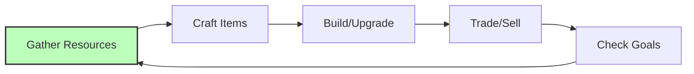

### Gathering Resources

**Activities**:
- Chop trees (wood)
- Mine stone/ore (minerals)
- Harvest plants (food, fiber)
- Hunt animals (meat, hides)
- Fish (food)
- Collect water

**Feedback Loops**:
- Resource counter increases
- Tool durability decreases (maintenance loop)
- Skill XP gain (progression)
- Inventory management decisions

**Fun Factors**:
- Visual/audio feedback (satisfying chop sounds)
- Resource rarity (excitement finding rare ore)
- Efficiency optimization (better tools = faster)

### Crafting Items

**Activities**:
- Open crafting menu
- Select recipe
- Ensure materials available
- Craft item
- Quality/variance based on skill

**Feedback Loops**:
- Inventory changes
- Skill XP gain
- New capabilities unlocked
- Quality rating (pride in workmanship)

### Building Structures

**Activities**:
- Select building type
- Place foundation
- Add materials progressively
- See construction progress
- Finished structure provides benefit

**Satisfaction Sources**:
- Visual transformation (empty lot → house)
- Functional benefit (shelter, storage)
- Aesthetic expression (design choices)
- Permanent impact on world

---

## 2. Session Gameplay (30 minutes - 2 hours)

### Session Arc Flow

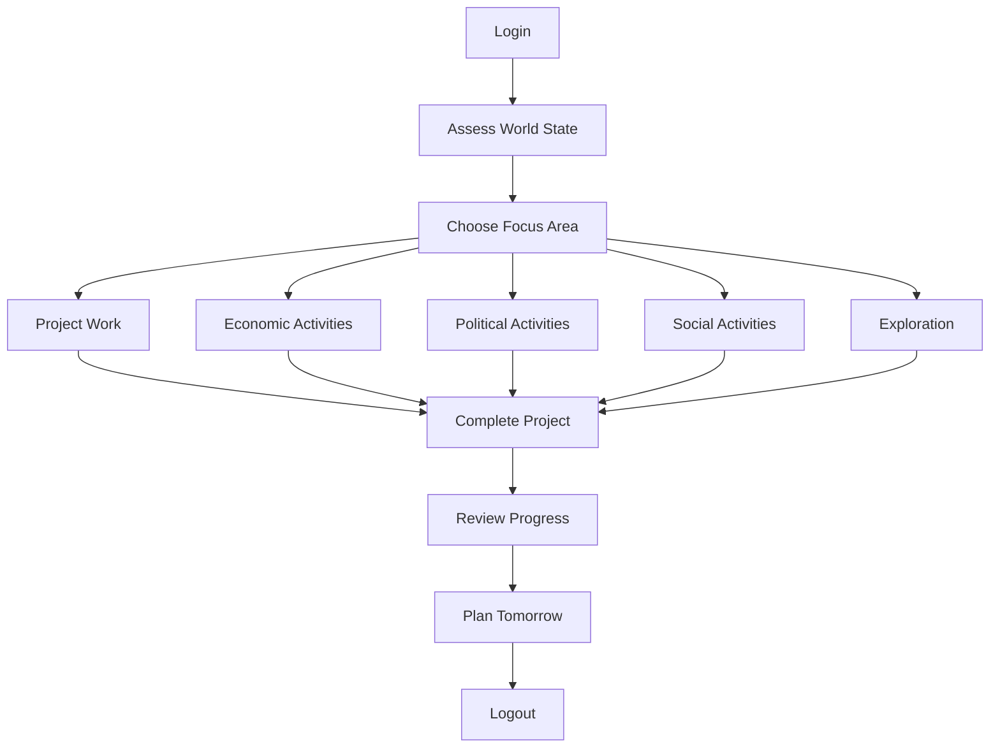

### Project-Based Gameplay

**Example: Build a Workshop**

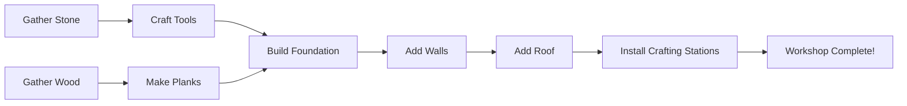

**Session Distribution**:
- Small project: 15-30 minutes (craft better tools)
- Medium project: 1-2 hours (build workshop)
- Large project: Multiple sessions (build town center)

### Economic Activities

**Running a Store** (using Session 2 Economic AI):
1. Check inventory levels
2. Set prices based on market
3. Open store for business
4. **AI/human customers visit** (Session 2 agents evaluate prices using belief system)
   - AI evaluates: `Price < Belief × (1 + personality_margin)`
   - High Openness agents: +10% price tolerance (curious about new sellers)
   - High Neuroticism agents: -5% price tolerance (risk-averse)
5. Manage stock, adjust prices
6. Close up, count profits

**Fulfilling Contracts**:
1. Browse contract board
2. Accept delivery contract
3. Gather/produce required items
4. Deliver to recipient
5. Receive payment + reputation

### Political Activities

**Proposing a Law**:
1. Identify problem/need
2. Draft law (with UI help)
3. Gather support (campaign)
4. Proposal submitted
5. Voting period (24-48 hours)
6. Result announced
7. If passed: Law enacted

**Campaigning** (using Session 2 Political & Social AI):
- **Talk to AI agents about issues** (Session 2 conversation system)
  - Topic selection based on: `Shared Interest = Intimacy × Curiosity`
  - Persuasion effectiveness based on: `Player Reputation × Charisma × Argument Quality`
  - AI forms opinion using: `Personal Impact × Values Alignment`
  - See [Session 2: Political & Social Behavior](../session-2-ai-system-design/03-political-social-behavior.md)
- Post announcements (visible to agents with Information Access)
- Participate in debates (agents evaluate using 6 political value axes)
- Build coalition (agents with similar values form factions)

---

## 3. Multi-Session Arcs (Days to Weeks)

### Week 1: Foundation

```mermaid
gantt
    title Week 1 Player Journey
    dateFormat  X
    axisFormat %d
    
    section Survival
    Basic Shelter       :a1, 0, 2
    Food Security       :a2, 1, 3
    Tool Creation       :a3, 2, 4
    
    section Discovery
    Explore Area        :b1, 2, 5
    Meet Neighbors      :b2, 3, 6
    Find Resources      :b3, 4, 7
    
    section Specialization
    Choose Career       :c1, 5, 7
    Skill Development   :c2, 6, 7
```

**Week 1 Feel**: Overwhelming but exciting. Learning systems. Meeting neighbors. Basic survival achieved.

### Week 2: Community

**Activities**:
- Join/form neighborhood
- Begin specialization
- **First trades with AI** (agents use Session 2's economic behavior: price beliefs, career preferences, personality-based trading strategies)
- Basic infrastructure (paths, shared storage)
- **Participate in first election** (AI votes using Session 2's voting algorithms based on personal impact, values alignment, social influence)

**Week 2 Feel**: Social connections form. Economic specialization begins. First political experiences.

### Week 3: Industry

**Activities**:
- Town formation (if 3+ players)
- Industrial production begins
- First laws enacted
- Meteor preparation awareness
- Skill mastery in chosen path

**Week 3 Feel**: Collaborative projects. Governance complexity. Urgency building.

### Week 4: Crisis & Advancement

**Activities**:
- Meteor preparation (if day 30 approaching)
- Advanced technology unlocked
- Complex political situations
- Environmental challenges emerge
- Long-term planning required

**Week 4 Feel**: High stakes. Cooperation essential. Satisfaction from progress.

---

## 4. Player Archetypes & Their Loops

### The Builder

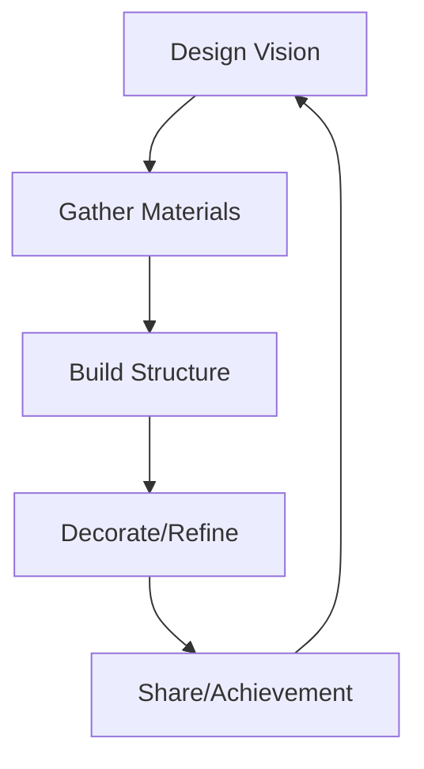

**Core Loop**: Design → Build → Admire → Share
**Session Goals**: Complete construction projects
**Multi-Session**: Megaprojects, town design
**Motivation**: Aesthetic expression, permanent impact

### The Economist

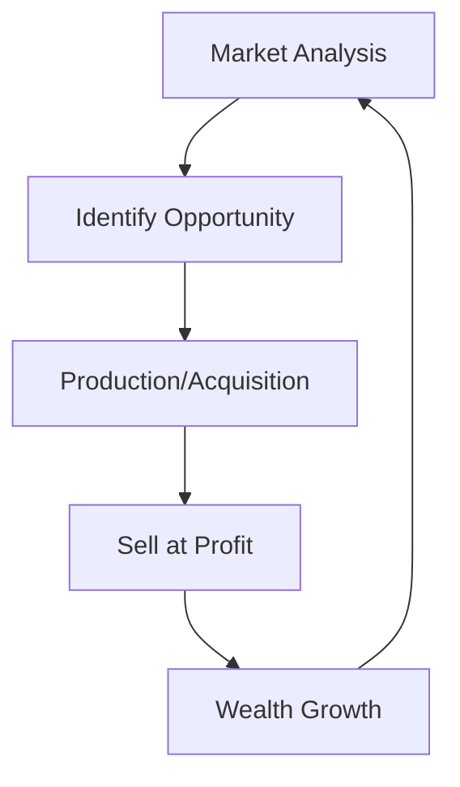

**Core Loop**: Analyze → Produce → Trade → Profit
**Session Goals**: Execute trades, optimize supply chains
**Multi-Session**: Build business empire, corner markets
**Motivation**: Optimization, wealth accumulation

### The Politician

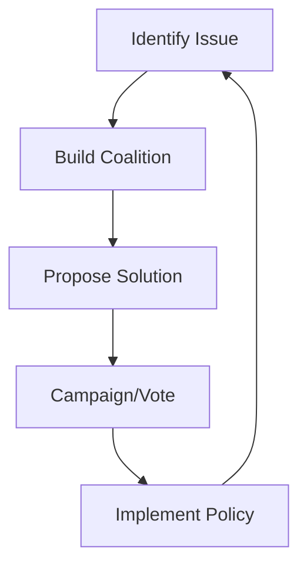

**Core Loop**: Observe → Organize → Propose → Influence
**Session Goals**: Pass legislation, win elections
**Multi-Session**: Rise through government ranks
**Motivation**: Power, social impact, leadership

### The Environmentalist

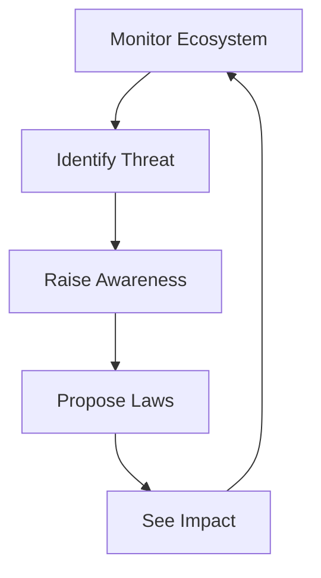

**Core Loop**: Monitor → Alert → Protect → Restore
**Session Goals**: Environmental projects, conservation
**Multi-Session**: Restore damaged ecosystems
**Motivation**: Stewardship, sustainability

### The Engineer

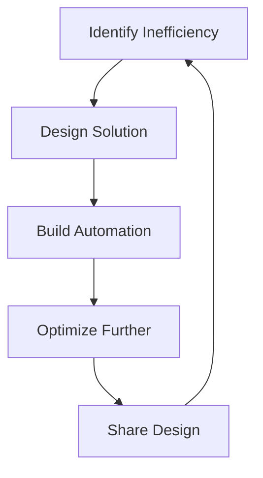

**Core Loop**: Problem → Design → Build → Optimize
**Session Goals**: Create automated systems
**Multi-Session**: Complex infrastructure networks
**Motivation**: Efficiency, problem-solving

### The Socializer

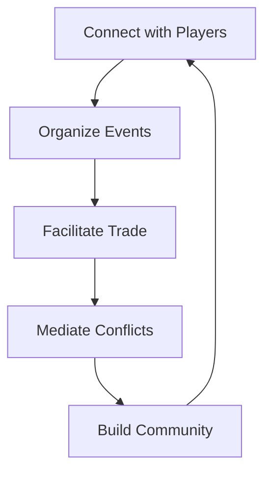

**Core Loop**: Connect → Organize → Facilitate → Unite
**Session Goals**: Social events, community building
**Multi-Session**: Town culture, traditions
**Motivation**: Social bonds, community impact

---

## 5. Progression Feel Over Time

### Experience Timeline

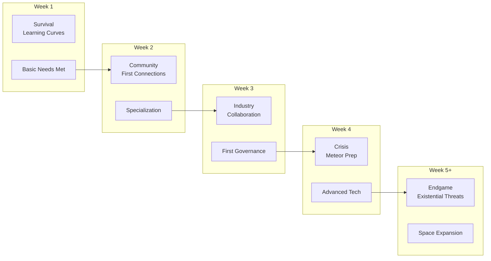

### Emotional Journey

| Week | Primary Emotion | Secondary | Challenge Level |
|------|----------------|-----------|----------------|
| 1 | Curiosity | Anxiety | Medium |
| 2 | Connection | Competition | Medium |
| 3 | Pride | Pressure | High |
| 4 | Urgency | Accomplishment | Very High |
| 5+ | Determination | Legacy | Extreme |

---

## 6. Compelling Return Triggers

### Why Log In Tomorrow?

**In-Progress Projects**:
- Construction in progress (can't wait to see it finished)
- Crops growing (need to harvest)
- Crafting queue (items ready)
- Research completing

**Commitments**:
- Contracts to fulfill (reputation at stake)
- Political obligations (vote coming up)
- Social promises (meeting other players)
- Economic orders (customers waiting)

**Scheduled Events**:
- Elections (vote deadline)
- Town meetings (governance decisions)
- Market openings (trading opportunities)
- Disaster warnings (meteor preparation)

### FOMO (Fear of Missing Out)

**Creates Urgency**:
- Limited-time market opportunities
- Election deadlines
- Event windows (comets, weather)
- Resource scarcity phases

**Balance Needed**: FOMO creates engagement but too much creates anxiety

### Obligation vs. Choice

**Healthy Obligations**:
- Chosen contracts (voluntary commitment)
- Self-set projects (personal goals)
- Social bonds (friends playing)

**Avoid**:
- Mandatory daily tasks (chores)
- Punishment for absence
- FOMO-based manipulation

---

## 7. UI/UX Critical Paths

### Gathering → Crafting → Building

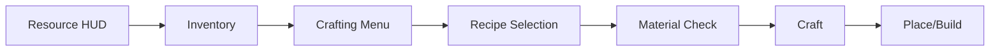

**Key UI Elements**:
- Resource counter (always visible)
- Quick-access crafting
- Build preview
- Progress indicators

### Economic Loop

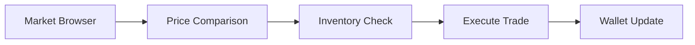

**Key UI Elements**:
- Price history graphs
- Market depth visualization
- Quick-buy/quick-sell
- Contract board

### Governance Loop


**Key UI Elements**:
- Plain-language law summaries
- Impact prediction
- Voting reminders
- Election countdowns

### Stewardship Loop

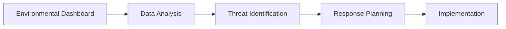

**Key UI Elements**:
- Pollution heat maps
- Population graphs
- Trend indicators
- Alert system

---

## 8. Information Architecture

### What to Show When

| Context | Priority Information | Secondary |
|---------|---------------------|-----------|
| **General Play** | Resources, Health, Current Goal | Weather, Time, Notifications |
| **Trading** | Prices, Inventory, Wallet | Market trends, Recent trades |
| **Building** | Materials needed, Preview | Durability, Skill bonuses |
| **Governance** | Active votes, Laws, Support | Historical data, Projections |
| **Crisis** | Time remaining, Preparation % | Resource locations, Team status |

### Notification Strategy

**Critical** (Immediate popup + sound):
- Election results
- Contract deadlines
- Disasters
- Direct messages

**Important** (Sidebar notification):
- Market price changes
- Skill level ups
- Project completions
- Law changes

**Background** (Log only):
- Routine agent activities
- Minor economic shifts
- Weather changes

---

## 9. Open Questions & Future Research

### Unresolved Questions

- [ ] What's the optimal session length for different player types?
- [ ] How do we prevent "analysis paralysis" in governance?
- [ ] What's the right balance of solo vs. group activities?
- [ ] How much UI complexity is too much?
- [ ] What creates the strongest "just one more thing" feeling?

### Research Needs

- [ ] Player session analysis from similar games
- [ ] UI/UX patterns in complex simulation games
- [ ] Engagement psychology in persistent worlds
- [ ] Onboarding best practices for complex games

---

## 10. Decisions Log

| Date | Decision | Rationale |
|------|----------|-----------|
| Day 0 | Project-based gameplay | Gives clear goals, sense of accomplishment |
| Day 0 | Multiple archetypes | Different players find different fun |
| Day 0 | Scheduled events | Create natural return triggers |
| Day 0 | Contextual UI | Reduce information overload |

---

## 11. Gameplay Design Skills & Player Psychology

### Overview

This section documents the game design skills required for creating engaging gameplay loops, session structures, and player experiences in Societies. These skills cover session design, player psychology, engagement mechanics, and UI/UX for complex simulations.

### 11.1 Core Gameplay Design Skills

#### Skill 1: Session-Based Game Design

**Research Sources:**
- **Foundational:** "The Art of Game Design" by Jesse Schell (book)
- **Psychology:** "A Theory of Fun for Game Design" by Raph Koster
- **Engagement:** GDC talks on engagement loops and retention
- **Psychology:** Flow theory by Mihaly Csikszentmihalyi
- **Behavioral:** Behavioral psychology (B.F. Skinner, operant conditioning)

**Key Competencies:**
- Flow state design (challenge matching player skill)
- Progression curves (power, complexity, difficulty over time)
- Session boundary design (natural stopping points vs compulsion)
- Return trigger mechanics (FOMO, obligation, curiosity)
- Activity loop design (core, secondary, meta loops)
- Time-scale mapping (5-minute, 2-hour, daily, weekly cycles)

**Creation Process:**
1. Document our session structures:
   - 5-15 minutes: Gather → Craft → Build → Trade
   - 30 min-2 hours: Project completion or economic/political activities
   - Days-weeks: Multi-session projects and progression
   - Week-by-week: Server lifecycle phases
2. Map emotional journey across sessions (frustration → engagement → satisfaction)
3. Research similar games' session design (Factorio, RimWorld, Stardew Valley)
4. Create playtest protocols for session validation
5. Design return triggers for each time scale

**Verification Steps:**
- [ ] Can map activities to different session lengths
- [ ] Can design natural stopping points
- [ ] Can create compelling return triggers
- [ ] Flow state maintained across different player skill levels
- [ ] Session length feels appropriate to activity type

---

#### Skill 2: Player Archetype Analysis

**Research Sources:**
- **Taxonomy:** Bartle Taxonomy of Player Types (Achiever, Explorer, Socializer, Killer)
- **Extended:** Hexad of Player Types (modified for modern games)
- **Motivations:** Yee's player motivations (immersion, achievement, social, etc.)
- **Psychology:** Psychographic segmentation in games
- **Design:** Player-centered design methodologies

**Key Competencies:**
- Archetype identification and profiling
- Loop design per archetype (distinct activities)
- Cross-archetype interaction design
- Feature prioritization by archetype impact
- Archetype migration (how players change over time)
- Motivation mapping to game mechanics

**Creation Process:**
1. Document our 6 archetypes with detailed profiles:
   - **Builder:** Create structures, perfect layouts, leave legacy
   - **Economist:** Optimize markets, maximize efficiency, wealth accumulation
   - **Politician:** Lead, debate, shape society, wield power
   - **Environmentalist:** Balance ecosystem, sustainability, nature harmony
   - **Engineer:** Solve problems, automation, complex systems
   - **Socializer:** Community building, relationships, collaborative projects
2. Create persona documents for each archetype
3. Map activities to archetype motivations
4. Research competitive games' archetype designs
5. Validate with actual player data when available
6. Document archetype overlap (players often blend types)

**Verification Steps:**
- [ ] Can identify which archetype a feature serves
- [ ] Each archetype has distinct gameplay loops
- [ ] Archetypes interact meaningfully
- [ ] All major features serve at least one archetype
- [ ] Can design for archetype migration

---

#### Skill 3: Engagement & Retention Design

**Research Sources:**
- **Behavioral:** "Hooked" by Nir Eyal (behavioral design framework)
- **Economics:** Behavioral economics (loss aversion, sunk cost, endowment effect)
- **Psychology:** Habit formation psychology (cue-routine-reward)
- **Games:** Variable reward schedules in games
- **Ethics:** Ethical engagement design (avoiding dark patterns)

**Key Competencies:**
- FOMO (Fear of Missing Out) mechanics (ethical implementation)
- Progress preservation systems
- Social obligation design (without exploitation)
- Curiosity-driven return triggers
- Variable reward schedules
- Habit formation loops
- Sunk cost utilization (ethical boundaries)

**Creation Process:**
1. Document FOMO systems in Societies:
   - World evolves while offline (meteor threat, resource changes)
   - Scheduled events (elections, markets, disasters)
   - Social dependencies (collaborative projects)
2. Create retention metric targets:
   - Day 1: 60%
   - Day 7: 30%
   - Day 30: 15%
3. Research ethical vs exploitative engagement
4. Test return trigger effectiveness through playtesting
5. Design progress preservation (catch-up mechanics)

**Verification Steps:**
- [ ] Can create ethical FOMO mechanics
- [ ] Return triggers are compelling but not manipulative
- [ ] Progress loss is minimized (or meaningful)
- [ ] Habit formation supports player goals
- [ ] Retention metrics meet targets without exploitation

---

#### Skill 4: UI/UX for Complex Simulations

**Research Sources:**
- **Architecture:** Information architecture principles (Morville & Rosenfeld)
- **Visualization:** Edward Tufte's principles (envisioning information)
- **Games:** Game UI design patterns and best practices
- **Accessibility:** WCAG guidelines adapted for games
- **Complex Systems:** Complex system visualization research

**Key Competencies:**
- Progressive disclosure strategies (complexity layering)
- Information hierarchy design (what to show when)
- Contextual UI systems (mode-appropriate displays)
- Notification priority management
- Complex data visualization
- Accessibility implementation
- Decision support interfaces

**Creation Process:**
1. Document our contextual UI approach:
   - Mode detection (General Play, Trading, Building, Governance, Crisis)
   - Priority-based information display
   - Progressive complexity disclosure
2. Create wireframes for critical paths (Gather→Craft→Build)
3. Design notification system (Critical, Important, Background)
4. Research complex game UIs (Paradox games, Dwarf Fortress)
5. Conduct usability testing protocols
6. Implement accessibility features

**Verification Steps:**
- [ ] Can reduce complex information to digestible chunks
- [ ] UI adapts appropriately to context
- [ ] Notifications are prioritized correctly
- [ ] Complex systems are visualized clearly
- [ ] New players can understand the interface
- [ ] Interface supports expert efficiency

---

### 11.2 Gameplay Skill Development Workflow

#### Skill Research Process

**For Each Gameplay Design Skill:**

**Step 1: Literature Review (3-4 hours)**
- Read foundational texts and theories
- Watch GDC talks on specific topics
- Analyze similar games' implementations
- Review academic research (psychology, behavioral economics)

**Step 2: Synthesis (2-3 hours)**
- Extract principles relevant to Societies
- Document how principles apply to our design
- Note deviations from standard practices
- Create design rationale statements
- Map theory to implementation

**Step 3: Prototyping (1-2 weeks)**
- Create minimal testable implementations
- Design playtest scenarios
- Define success metrics
- Prepare testing protocols

**Step 4: Validation (Ongoing)**
- Test with prototypes
- Gather playtest feedback
- Analyze metrics (retention, session length, activities)
- Iterate based on data
- Update skills with learnings

---

### 11.3 Skills to Create Priority List

**Immediate (Week 1-2):**
1. Core Activity Loop Design
2. Session Structure Patterns
3. Player Onboarding Flows
4. Contextual UI Systems

**Short-term (Month 1-2):**
5. Player Archetype Implementation
6. Engagement Loop Design
7. Return Trigger Mechanics
8. Information Architecture

**Medium-term (Month 2-3):**
9. Multi-Session Arc Design
10. Social Feature Integration
11. Accessibility Implementation
12. Complex Data Visualization

**Ongoing:**
13. Playtesting Methodologies
14. Metrics Analysis
15. Ethical Design Practices
16. Player Feedback Integration

---

### 11.4 Gameplay Research Resources

#### Design Theory
| Resource | Author | Focus |
|----------|--------|-------|
| The Art of Game Design | Jesse Schell | Comprehensive game design |
| A Theory of Fun | Raph Koster | Fun psychology |
| Hooked | Nir Eyal | Behavioral design |
| Flow | Mihaly Csikszentmihalyi | Optimal experience |

#### Player Psychology
| Resource | Type | Application |
|----------|------|-------------|
| Bartle Taxonomy | Player types | Archetype design |
| Yee's Motivations | Psychological | Engagement |
| Behavioral Economics | Academic | Economic design |
| Habit Research | Psychology | Retention |

#### UI/UX Design
| Resource | Focus | Application |
|----------|-------|-------------|
| Information Architecture | Structure | UI organization |
| Tufte's Principles | Visualization | Data display |
| WCAG Guidelines | Accessibility | Inclusive design |
| Game UI Patterns | Practical | Interface design |

#### Comparable Games
| Game | Study Focus | Relevance |
|------|-------------|-----------|
| Factorio | Session design | Similar complexity |
| RimWorld | Emergent stories | AI integration |
| Stardew Valley | Activity loops | Relaxing gameplay |
| Dwarf Fortress | Complex systems | Depth management |
| Civilization | Progression arcs | Long-term engagement |

---

## Success Criteria

- [ ] Clear minute-to-minute activity flow
- [ ] Session goals defined for different player types
- [ ] Progression feel articulated across timeline
- [ ] Return triggers identified
- [ ] Critical UI/UX paths mapped
- [ ] Information architecture specified
- [ ] Player archetypes fully defined
- [ ] Gameplay design skills documented
- [ ] Research sources catalogued
- [ ] Skill creation workflow defined

---

**Status**: COMPLETE - Ready for Day 3 Planning & Development

---

## Changes & Revisions Log

### [Date] - Session 3 Revision

**Trigger**: [What caused this revision]

**Changes Made**:
- [Section]: [What changed]

**Rationale**: [Why this revision was necessary]

**Impact**: [What other documents/systems are affected]

---

## Cross-Doc Issues

### Issue 1: [Brief Description]
**Discovered in**: Session 3
**Affects**: Session Y, Session Z
**Description**: [What contradicts what]
**Resolution**: [How/when it will be resolved]
**Status**: [Open/In Progress/Resolved]

---

**Status**: Template Updated - Ready for Session 3 Planning (Depth-Optimized Methodology)
