# Session 2: AI System Design - Deep Planning Document

**Planning Session**: 2 of 7  
**Status**: COMPLETE - Ready for Implementation  
**Date Started**: January 31, 2026  
**Date Completed**: January 31, 2026  
**Location**: planning/sessions/session-2-ai-system-design/
**Document Size**: ~10,800 lines | 14 sections | 50+ code examples

---

## Purpose

Specify how AI agents think, decide, and behave to create believable citizens. This document defines the AI architecture, decision-making processes, memory systems, and experimental brain configurations that make AI agents feel authentic rather than robotic.

---

## Key Questions Addressed

1. What's the AI decision-making architecture?
2. How do agents form goals and prioritize actions?
3. How do agents learn, remember, and form relationships?
4. How do we handle AI voting and political behavior?
5. How does the AI population elasticity system work?
6. What makes AI behavior feel authentic rather than robotic?
7. How do players learn about AI lives? (Emergent narrative)
8. How do we debug AI decisions? (Debuggability)

---

## Research Summary

**Tier 1 Sources**:
- **R4 (Dwarf Fortress)**: Memory systems (short-term 8+8 slots), emotional valence, core memory formation, episodic/semantic/procedural memory types, memory consolidation mechanics
- **R7 (AI Systems)**: Utility AI architecture, consideration curves, goal hierarchies, interrupt handling, decision loop optimization
- **R8 (PDF Synthesis)**: Agent-based economic modeling, price belief formation, trading strategies, market equilibrium behaviors
- **R1 (Technical constraints)**: 20 TPS tick rate, 2ms per-agent budget, 100-1000 agent scale, spatial partitioning for perception

**Key Insights**:
1. **Memory slot competition creates emergent forgetting**: DF's limited memory slots (5+5 simplified from 8+8) force agents to prioritize only significant events, naturally creating "forgotten" histories without explicit deletion logic
2. **Utility AI scales better than GOAP for 100+ agents**: Multiplicative consideration scoring provides predictable performance O(n) vs GOAP's exponential planning, while still producing rich emergent behavior
3. **Price beliefs must include uncertainty ranges**: Agents need min-max bounds (not just mean) to create realistic bid-ask spreads and negotiation behaviors
4. **Personality traits need non-linear impact curves**: Linear trait-to-behavior mappings produce robotic agents; exponential and logistic curves create more human-like variance
5. **Weighted random selection prevents hive-mind**: Top-3 goal weighted random (vs pure max) creates essential behavioral diversity even with identical inputs
6. **3-tier memory system balances depth and performance**: STM (5 slots, hours), LTM (5 slots, weeks), Core (unlimited, permanent) fits ~640 bytes per agent while enabling meaningful agent histories
7. **Economic agents need both belief formation AND gossip**: Price discovery requires direct observation (weighted averaging) plus social transmission through trusted relationships

---

## Dependencies

- **Requires**: Session 1 (Technical Architecture) - Performance budgets, tick loop
- **Informs**: Session 3 (Gameplay Loops), Session 5 (Governance), Session 6 (Prototyping)

---

## 1. AI Agent Architecture

### Core Decision Loop

The decision loop follows a **sense-think-act-learn** cycle optimized for 20 TPS (50ms per tick) with a per-agent budget of <2ms. Not all steps run every tick—some are amortized across multiple ticks to maintain performance.

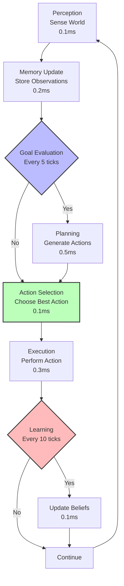
```mermaid
graph TD
    A[Perception<br/>Sense World<br/>0.1ms] --> B[Memory Update<br/>Store Observations<br/>0.2ms]
    B --> C{Goal Evaluation<br/>Every 5 ticks}
    C -->|Yes| D[Planning<br/>Generate Actions<br/>0.5ms]
    C -->|No| E[Action Selection<br/>Choose Best Action<br/>0.1ms]
    D --> E
    E --> F[Execution<br/>Perform Action<br/>0.3ms]
    F --> G{Learning<br/>Every 10 ticks}
    G -->|Yes| H[Update Beliefs<br/>0.1ms]
    G -->|No| I[Continue]
    H --> I
    I --> A
    
    style C fill:#bbf,stroke:#333,stroke-width:2px
    style E fill:#bfb,stroke:#333,stroke-width:2px
    style G fill:#fbb,stroke:#333,stroke-width:2px
```

#### Decision Loop Timing

| Phase | Frequency | Budget | Cumulative | Purpose |
|-------|-----------|--------|------------|---------|
| **Perception** | Every tick | 0.1ms | 2.0ms | Sense nearby entities, resources, threats |
| **Memory Update** | Every tick | 0.2ms | 1.9ms | Store observations, decay memories |
| **Goal Evaluation** | Every 5 ticks (4Hz) | 0.3ms | 1.7ms | Recalculate goal priorities |
| **Planning** | On goal change | 0.5ms | 1.5ms | Generate action sequence |
| **Action Selection** | Every tick | 0.1ms | 1.2ms | Select next action from plan |
| **Execution** | Every tick | 0.3ms | 0.9ms | Perform action, update state |
| **Learning** | Every 10 ticks (2Hz) | 0.1ms | 0.6ms | Update beliefs, consolidate memory |
| **Idle/Buffer** | - | 0.6ms | - | Reserved for variability |
| **TOTAL** | **Amortized** | **<2.0ms** | - | Per agent per tick |

#### Detailed Phase Descriptions

**1. Perception (0.1ms, Every Tick)**
- Query spatial partition for entities within 50m radius
- Identify: threats, resources, other agents, market opportunities
- Filter by agent's sensory capabilities (sight range, hearing)
- Update working memory with current observations
- **Optimization**: Spatial partitioning (100m chunks) reduces query to O(1)

**2. Memory Update (0.2ms, Every Tick)**
- Add new observations to short-term memory
- Apply decay to existing memories (exponential decay curve)
- Check for slot competition (overwrite weakest if full)
- Update relationship tracking (proximity = potential interaction)
- **Optimization**: Decay calculated every 5 ticks, interpolated between

**3. Goal Evaluation (0.3ms, Every 5 Ticks)**
- Calculate utility for all active goals using consideration system
- Check goal completion conditions
- Evaluate goal interruptions (critical needs override current)
- Select highest-utility goal as current
- **Formula**: `GoalScore = Σ(Consideration_i × Weight_i)`

**4. Planning (0.5ms, On Goal Change)**
- Generate action sequence to achieve current goal
- Query world state for available actions
- Score actions using Utility AI
- Select top-scoring action sequence
- **Fallback**: If planning fails, use default "idle" behavior

**5. Action Selection (0.1ms, Every Tick)**
- Select next action from current plan
- Check action preconditions (still valid?)
- Handle action interruption (higher priority goal?)
- Advance plan pointer or replan if complete

**6. Execution (0.3ms, Every Tick)**
- Perform selected action (move, craft, trade, socialize)
- Update agent state (energy, hunger, position)
- Trigger animations via Behavior Tree
- Broadcast action to nearby agents (if observable)

**7. Learning (0.1ms, Every 10 Ticks)**
- Update price beliefs based on market observations
- Consolidate short-term to long-term memories
- Adjust skill levels (if practice occurred)
- Update relationship strengths
- **Optimization**: Batched processing, only for agents with new data

#### Tick Processing Pseudocode

```csharp
public void ProcessAgentTick(Agent agent, float deltaTime)
{
    var stopwatch = Stopwatch.StartNew();
    
    // 1. PERCEPTION (every tick, 0.1ms)
    var nearbyEntities = spatialPartition.Query(agent.position, 50f);
    var observations = perceptionSystem.Sense(agent, nearbyEntities);
    
    // 2. MEMORY UPDATE (every tick, 0.2ms)
    foreach (var obs in observations)
    {
        agent.memory.AddToShortTerm(obs);
    }
    agent.memory.Decay(deltaTime);
    
    // 3. GOAL EVALUATION (every 5 ticks, 0.3ms)
    if (agent.ticksProcessed % 5 == 0)
    {
        agent.goals.EvaluatePriorities();
        var newGoal = agent.goals.SelectCurrentGoal();
        
        // Check for goal interruption
        if (newGoal != agent.goals.currentGoal && newGoal.urgency > 0.8f)
        {
            agent.goals.InterruptCurrent(newGoal);
            agent.behavior.Replan(); // Trigger planning phase
        }
    }
    
    // 4. PLANNING (on goal change, 0.5ms)
    if (agent.behavior.needsReplan)
    {
        var availableActions = actionSystem.GetAvailableActions(agent);
        var scoredActions = utilityAI.ScoreActions(agent, availableActions);
        agent.behavior.SetPlan(scoredActions.Top(3)); // Keep top 3 alternatives
        agent.behavior.needsReplan = false;
    }
    
    // 5. ACTION SELECTION (every tick, 0.1ms)
    var currentAction = agent.behavior.GetCurrentAction();
    if (!currentAction.IsValid(agent))
    {
        agent.behavior.AdvancePlan(); // Skip invalid action
        currentAction = agent.behavior.GetCurrentAction();
    }
    
    // 6. EXECUTION (every tick, 0.3ms)
    var result = currentAction.Execute(agent, deltaTime);
    agent.state.UpdateFromAction(result);
    behaviorTree.Execute(agent, currentAction.type);
    
    // 7. LEARNING (every 10 ticks, 0.1ms)
    if (agent.ticksProcessed % 10 == 0)
    {
        agent.economy.UpdatePriceBeliefs();
        agent.memory.Consolidate();
        agent.skills.UpdateFromPractice();
    }
    
    // Performance monitoring
    agent.tickBudgetMs = stopwatch.ElapsedMilliseconds;
    agent.ticksProcessed++;
    
    // Budget enforcement (soft limit)
    if (agent.tickBudgetMs > 2.0f)
    {
        telemetry.RecordOverBudget(agent, agent.tickBudgetMs);
    }
}
```

#### Interrupt Handling

Agents must respond immediately to critical events:

```csharp
public void HandleInterrupt(Agent agent, InterruptType type, float severity)
{
    switch (type)
    {
        case InterruptType.CriticalNeed:
            // Starvation, exhaustion - immediate response
            agent.goals.ForceGoal(GoalType.Survival, priority: 1.0f);
            agent.behavior.ClearPlan();
            break;
            
        case InterruptType.Threat:
            // Danger detected - fight or flight
            var bravery = agent.profile.traits.bravery;
            if (bravery > 60)
                agent.goals.ForceGoal(GoalType.Combat, priority: 0.9f);
            else
                agent.goals.ForceGoal(GoalType.Flee, priority: 0.9f);
            break;
            
        case InterruptType.Opportunity:
            // Rare chance - may or may not interrupt
            if (severity > 0.7f && agent.profile.traits.openness > 50)
            {
                agent.goals.QueueGoal(GoalType.Opportunity, priority: severity);
            }
            break;
    }
}
```

#### Performance Optimizations

**Agent Bucketing** (from Session 1):
- Divide agents into buckets of 100
- Process one bucket per tick (amortizes 100 agents across 5 ticks)
- Critical agents (in combat, player-visible) processed every tick

**LOD (Level of Detail)**:
- **High** (player within 20m): Full AI, every tick
- **Medium** (20-100m): Reduced frequency (every 5 ticks), simplified pathfinding
- **Low** (>100m): Minimal processing (every 20 ticks), no pathfinding

**Sleep States**:
- Dormant agents skip all processing except basic needs decay
- Wake when: player approaches, significant event occurs, timer expires
- Typical wake cycle: 300 ticks (15 seconds at 20 TPS)

#### Determinism Requirements

For replay debugging and multiplayer consistency:
- Fixed random seed per agent (derived from agent ID + world seed)
- Deterministic utility calculations (no floating-point variability)
- Action outcomes deterministic given same inputs
- Timestamp-based timing (not frame-dependent)

```csharp
// Deterministic random for agent
var agentSeed = Hash(agent.id, world.seed, tickNumber);
var random = new DeterministicRandom(agentSeed);

// Usage in utility calculation
var noise = random.Range(0.95f, 1.05f); // 5% personality variance
utilityScore *= noise;
```

### Agent State Structure

The agent state structure is designed for efficient serialization, minimal memory footprint (~8KB per agent), and fast tick processing. All data structures support the 20 TPS target with <2ms per agent budget.

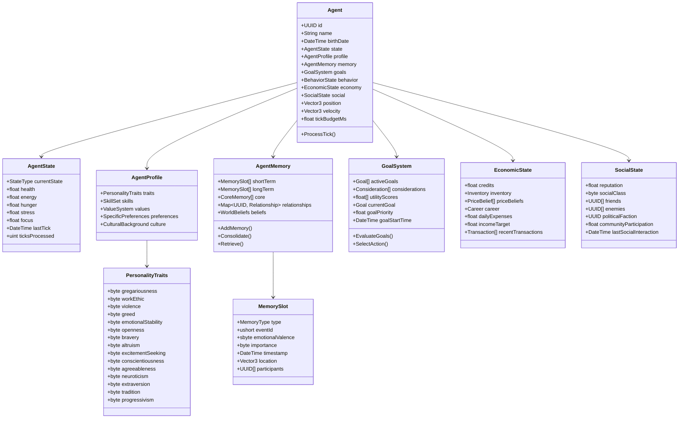
```mermaid
classDiagram
    class Agent {
        +UUID id
        +String name
        +DateTime birthDate
        +AgentState state
        +AgentProfile profile
        +AgentMemory memory
        +GoalSystem goals
        +BehaviorState behavior
        +EconomicState economy
        +SocialState social
        +Vector3 position
        +Vector3 velocity
        +float tickBudgetMs
        +ProcessTick()
    }

    class AgentState {
        +StateType currentState
        +float health
        +float energy
        +float hunger
        +float stress
        +float focus
        +DateTime lastTick
        +uint ticksProcessed
    }
    
    class AgentProfile {
        +PersonalityTraits traits
        +SkillSet skills
        +ValueSystem values
        +SpecificPreferences preferences
        +CulturalBackground culture
    }

    class PersonalityTraits {
        +byte gregariousness
        +byte workEthic
        +byte violence
        +byte greed
        +byte emotionalStability
        +byte openness
        +byte bravery
        +byte altruism
        +byte excitementSeeking
        +byte conscientiousness
        +byte agreeableness
        +byte neuroticism
        +byte extraversion
        +byte tradition
        +byte progressivism
    }
    
    class AgentMemory {
        +MemorySlot[] shortTerm
        +MemorySlot[] longTerm
        +CoreMemory[] core
        +Map~UUID, Relationship~ relationships
        +WorldBeliefs beliefs
        +AddMemory()
        +Consolidate()
        +Retrieve()
    }
    
    class MemorySlot {
        +MemoryType type
        +ushort eventId
        +sbyte emotionalValence
        +byte importance
        +DateTime timestamp
        +Vector3 location
        +UUID[] participants
    }
    
    class GoalSystem {
        +Goal[] activeGoals
        +Consideration[] considerations
        +float[] utilityScores
        +Goal currentGoal
        +float goalPriority
        +DateTime goalStartTime
        +EvaluateGoals()
        +SelectAction()
    }
    
    class EconomicState {
        +float credits
        +Inventory inventory
        +PriceBelief[] priceBeliefs
        +Career career
        +float dailyExpenses
        +float incomeTarget
        +Transaction[] recentTransactions
    }
    
    class SocialState {
        +float reputation
        +byte socialClass
        +UUID[] friends
        +UUID[] enemies
        +UUID politicalFaction
        +float communityParticipation
        +DateTime lastSocialInteraction
    }
    
    Agent --> AgentState
    Agent --> AgentProfile
    Agent --> AgentMemory
    Agent --> GoalSystem
    Agent --> EconomicState
    Agent --> SocialState
    AgentProfile --> PersonalityTraits
    AgentMemory --> MemorySlot
```

#### Data Structure Specifications

**Agent Core (256 bytes)**
- `UUID id`: 16 bytes - Unique identifier
- `String name`: 32 bytes (max 31 chars) - Display name
- `DateTime birthDate`: 8 bytes - For age calculation
- `AgentState state`: 32 bytes - Current condition
- `Vector3 position`: 12 bytes - World location
- `Vector3 velocity`: 12 bytes - Movement vector
- `float tickBudgetMs`: 4 bytes - Time allocated this tick
- Padding/alignment: 140 bytes reserved for expansion

**AgentState (32 bytes)**
- `StateType currentState`: 1 byte (Active, Dormant, Dead, etc.)
- `float health`: 4 bytes (0.0-100.0)
- `float energy`: 4 bytes (0.0-100.0)
- `float hunger`: 4 bytes (0.0-100.0, inverted from DF for intuition)
- `float stress`: 4 bytes (-50000 to +120000, DF-style)
- `float focus`: 4 bytes (percentage, affects skill effectiveness)
- `DateTime lastTick`: 8 bytes - Last processing time
- `uint ticksProcessed`: 4 bytes - Total tick count

**PersonalityTraits (15 bytes)**
Each trait stored as `byte` (0-100) for memory efficiency:
- Core 5: Gregariousness, Work Ethic, Violence, Greed, Emotional Stability
- Big Five: Openness, Conscientiousness, Extraversion, Agreeableness, Neuroticism
- Secondary 5: Bravery, Altruism, Excitement-Seeking, Tradition, Progressivism

**MemorySlot (64 bytes per slot, 5 short-term + 5 long-term = 640 bytes)**
- `MemoryType type`: 1 byte (Episodic, Semantic, Procedural, Social)
- `ushort eventId`: 2 bytes - Reference to event template
- `sbyte emotionalValence`: 1 byte (-100 to +100)
- `byte importance`: 1 byte (0-255, slot competition score)
- `DateTime timestamp`: 8 bytes
- `Vector3 location`: 12 bytes
- `UUID participants[4]`: 64 bytes - Up to 4 other agents
- `byte data[39]`: 39 bytes - Event-specific payload

**EconomicState (~2KB)**
- `float credits`: 4 bytes - Current money
- `Inventory inventory`: ~1KB - 64 slots max (compact array)
- `PriceBelief[32] priceBeliefs`: 256 bytes - Beliefs for common goods
- `Career career`: 32 bytes - Current job and skills
- `Transaction[16] recentTransactions`: 512 bytes - Last 16 transactions

**SocialState (~4KB)**
- `float reputation`: 4 bytes - Community standing
- `byte socialClass`: 1 byte - Current class level
- `UUID friends[16]`: 256 bytes - Friend list (max 16)
- `UUID enemies[8]`: 128 bytes - Enemy list (max 8)
- `Relationship[24] relationships`: ~3KB - Detailed relationship data

#### Memory Layout Summary

| Component | Size | Notes |
|-----------|------|-------|
| Agent Core | 256 bytes | Base agent data |
| AgentState | 32 bytes | Current condition |
| Personality | 15 bytes | 15 traits × 1 byte |
| Memory System | 640 bytes | 5+5 slots × 64 bytes |
| Goal System | 256 bytes | Active goals + scores |
| Economic | 2KB | Inventory is largest |
| Social | 4KB | Relationships are largest |
| **Total per Agent** | **~8KB** | Fits L1 cache |

With 8KB per agent:
- 100 agents = ~800KB (easily fits in memory)
- 1000 agents = ~8MB (still reasonable)

#### Performance Budget Allocation

Per-agent tick budget: **<2ms at 20 TPS**

| System | Budget | Frequency |
|--------|--------|-----------|
| Perception | 0.1ms | Every tick |
| Memory Update | 0.2ms | Every tick |
| Goal Evaluation | 0.3ms | Every 5 ticks (4Hz) |
| Planning | 0.5ms | When goal changes |
| Action Execution | 0.3ms | Every tick |
| Learning | 0.1ms | Every 10 ticks (2Hz) |
| **Total** | **<1.5ms** | **Amortized** |

#### Serialization Format

For database persistence (PostgreSQL JSONB):
```json
{
  "id": "uuid",
  "name": "string",
  "state": { "health": 85.5, "energy": 72.0, ... },
  "profile": { "traits": { "gregariousness": 75, ... }, ... },
  "memory": { "shortTerm": [...], "longTerm": [...], ... },
  "economy": { "credits": 150.50, "inventory": [...], ... },
  "social": { "reputation": 65.0, "friends": [...], ... }
}
```

**Size**: ~3-4KB compressed JSON per agent
**Query Performance**: 0.5-0.8ms with GIN indexes (per R1 PostgreSQL research)

### Tick Processing Architecture

The tick processing system coordinates agent updates within the server's 50ms tick window (20 TPS). Agents are processed in buckets to amortize CPU load, with critical agents receiving priority processing.

#### Server Tick Flow

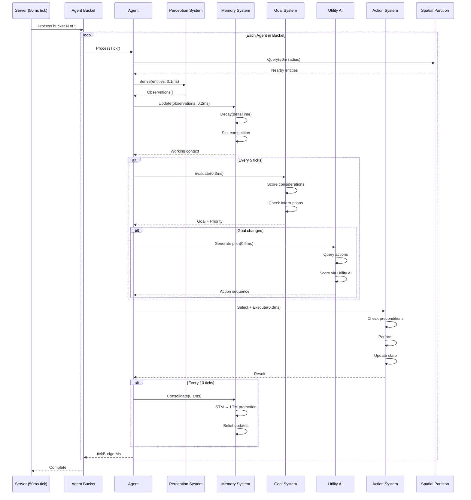
```mermaid
sequenceDiagram
    participant Server as Server (50ms tick)
    participant Bucket as Agent Bucket
    participant Agent as Agent
    participant Perception as Perception System
    participant Memory as Memory System
    participant Goals as Goal System
    participant Planner as Utility AI
    participant Action as Action System
    participant Spatial as Spatial Partition
    
    Server->>Bucket: Process bucket N of 5
    
    loop Each Agent in Bucket
        Bucket->>Agent: ProcessTick()
        
        Agent->>Spatial: Query(50m radius)
        Spatial-->>Agent: Nearby entities
        
        Agent->>Perception: Sense(entities, 0.1ms)
        Perception-->>Agent: Observations[]
        
        Agent->>Memory: Update(observations, 0.2ms)
        Memory->>Memory: Decay(deltaTime)
        Memory->>Memory: Slot competition
        Memory-->>Agent: Working context
        
        alt Every 5 ticks
            Agent->>Goals: Evaluate(0.3ms)
            Goals->>Goals: Score considerations
            Goals->>Goals: Check interruptions
            Goals-->>Agent: Goal + Priority
            
            alt Goal changed
                Agent->>Planner: Generate plan(0.5ms)
                Planner->>Planner: Query actions
                Planner->>Planner: Score via Utility AI
                Planner-->>Agent: Action sequence
            end
        end
        
        Agent->>Action: Select + Execute(0.3ms)
        Action->>Action: Check preconditions
        Action->>Action: Perform
        Action->>Action: Update state
        Action-->>Agent: Result
        
        alt Every 10 ticks
            Agent->>Memory: Consolidate(0.1ms)
            Memory->>Memory: STM → LTM promotion
            Memory->>Memory: Belief updates
        end
        
        Agent-->>Bucket: tickBudgetMs
    end
    
    Bucket-->>Server: Complete
```

#### Processing Buckets

To maintain 20 TPS with 100+ agents, agents are divided into **5 buckets** of 20 agents each:

| Tick | Bucket | Agents Processed | Processing Time |
|------|--------|------------------|-----------------|
| 1 | A | 0-19 | ~30ms |
| 2 | B | 20-39 | ~30ms |
| 3 | C | 40-59 | ~30ms |
| 4 | D | 60-79 | ~30ms |
| 5 | E | 80-99 | ~30ms |
| 6 | A | 0-19 (repeat) | ~30ms |

**Benefits**:
- Distributes 100 agents across 5 ticks = 20 agents per tick
- Per-tick budget: 20 agents × 2ms = 40ms (fits in 50ms tick)
- Leaves 10ms for physics, networking, ecosystem

**Priority Override**:
- Critical agents (in combat, player-visible, stressed) process every tick
- Maximum 10% of agents can be critical (10 agents max at 100 agent count)

#### Amortization Schedule

Not all systems run every tick. Here's the amortization schedule for a typical agent:

| Tick | Perception | Memory Update | Goal Eval | Planning | Action Exec | Learning |
|------|------------|---------------|-----------|----------|-------------|----------|
| 1 | ✓ | ✓ | ✓ | - | ✓ | - |
| 2 | ✓ | ✓ | - | - | ✓ | - |
| 3 | ✓ | ✓ | - | - | ✓ | - |
| 4 | ✓ | ✓ | - | - | ✓ | - |
| 5 | ✓ | ✓ | ✓ | If needed | ✓ | - |
| 6 | ✓ | ✓ | - | - | ✓ | ✓ |
| ... | ... | ... | ... | ... | ... | ... |

**Total per 10-tick cycle**: ~6.0ms amortized = 0.6ms average per tick

#### Threading Model

```csharp
public class AgentTickProcessor
{
    private Agent[] agents;
    private SpatialPartition spatial;
    private int currentBucket = 0;
    private const int BUCKET_COUNT = 5;
    
    public void ProcessTick(float deltaTime)
    {
        var bucketSize = agents.Length / BUCKET_COUNT;
        var startIdx = currentBucket * bucketSize;
        var endIdx = startIdx + bucketSize;
        
        // Process current bucket
        for (int i = startIdx; i < endIdx; i++)
        {
            ProcessAgent(agents[i], deltaTime);
        }
        
        // Process critical agents (every tick)
        foreach (var agent in agents.Where(a => a.isCritical))
        {
            ProcessAgent(agent, deltaTime);
        }
        
        // Advance bucket
        currentBucket = (currentBucket + 1) % BUCKET_COUNT;
    }
    
    private void ProcessAgent(Agent agent, float deltaTime)
    {
        // Set LOD level based on distance to nearest player
        var lod = CalculateLOD(agent);
        agent.SetLOD(lod);
        
        // Skip if dormant
        if (agent.state.currentState == StateType.Dormant)
        {
            ProcessDormant(agent, deltaTime);
            return;
        }
        
        // Full processing
        var timer = Stopwatch.StartNew();
        
        PerceptionPhase(agent);
        MemoryPhase(agent, deltaTime);
        GoalPhase(agent);
        PlanningPhase(agent);
        ActionPhase(agent, deltaTime);
        LearningPhase(agent);
        
        agent.tickBudgetMs = timer.ElapsedMilliseconds;
        agent.ticksProcessed++;
    }
    
    private void ProcessDormant(Agent agent, float deltaTime)
    {
        // Minimal processing: needs decay only
        agent.state.hunger += deltaTime * 0.1f;
        agent.state.energy -= deltaTime * 0.05f;
        
        // Wake check
        if (ShouldWake(agent))
        {
            agent.state.currentState = StateType.Active;
            agent.memory.AddToShortTerm(new Memory("Woke up", importance: 50));
        }
    }
}
```

#### LOD (Level of Detail) Processing

| LOD | Distance | Frequency | Systems Active | Budget |
|-----|----------|-----------|----------------|--------|
| **High** | <20m | Every tick | All systems | 2.0ms |
| **Medium** | 20-100m | Every 5 ticks | Perception, Memory, Action | 0.5ms |
| **Low** | >100m | Every 20 ticks | Basic needs only | 0.1ms |
| **Dormant** | >500m or player absent | Every 100 ticks | Needs decay only | 0.01ms |

**LOD Transitions**:
- Promote to higher LOD when: player approaches, significant event occurs, agent enters combat
- Demote to lower LOD when: player leaves, agent idle for 60 seconds, no important state changes

#### Performance Monitoring

```csharp
public class AgentPerformanceMonitor
{
    public void RecordMetrics(Agent agent)
    {
        // Per-agent metrics
        if (agent.tickBudgetMs > 2.0f)
        {
            Log.Warning($"Agent {agent.id} over budget: {agent.tickBudgetMs}ms");
            
            // Auto-LOD demotion if consistently over budget
            if (agent.overBudgetCount > 5)
            {
                agent.SetLOD(LODLevel.Medium);
            }
        }
        
        // Aggregate metrics
        telemetry.Record("agent.tick_time", agent.tickBudgetMs);
        telemetry.Record("agent.lod_distribution", agent.currentLOD);
    }
    
    public PerformanceReport GenerateReport()
    {
        return new PerformanceReport
        {
            AverageTickTime = telemetry.Average("agent.tick_time"),
            AgentsOverBudget = telemetry.CountWhere("agent.tick_time", t => t > 2.0),
            LODDistribution = telemetry.Distribution("agent.lod_distribution"),
            BucketUtilization = CalculateBucketUtilization()
        };
    }
}
```

#### Session 1 Integration Points

**From Session 1 (Technical Architecture)**:
- 20 TPS target → 50ms tick window
- 2ms per agent budget → Enforced via monitoring
- Spatial partitioning (100m chunks) → Perception queries
- State sync networking → Agent position/state broadcast
- PostgreSQL persistence → Agent save/load

**Dependencies**:
- Session 1's tick loop calls `AgentTickProcessor.ProcessTick()`
- Session 1's spatial partition provides entity queries
- Session 1's network layer broadcasts agent actions to clients

---

## 2. Goal System Architecture

### Goal Hierarchy

The goal hierarchy follows a modified **Maslow's Hierarchy of Needs** adapted for economic simulation. Lower-level goals (Survival) take precedence over higher-level goals (Self-Actualization), but all goals compete continuously via utility scoring.

```mermaid
graph TD
    subgraph "SURVIVAL<br/>Base Priority: 0.8-1.0"
        S[Survival<br/>Physiological] --> SR[Subsistence Resources]
        S --> SH[Shelter & Safety]
        
        SR --> F[Food Security<br/>Activation: Hunger>50%]
        SR --> W[Water Access<br/>Activation: Thirst>50%]
        SR --> I[Income Stability<br/>Activation: Credits<50]
        
        SH --> ST[Shelter Quality<br/>Activation: NoHome|Weather]
        SH --> SF[Personal Safety<br/>Activation: ThreatNearby]
    end
    
    subgraph "PROSPERITY<br/>Base Priority: 0.4-0.7"
        P[Prosperity<br/>Economic] --> WE[Wealth Accumulation<br/>Credits<Target]
        P --> SP[Skill Progression<br/>Skill<Cap]
        P --> BU[Business Growth<br/>Owner&Demand>Supply]
        P --> EM[Employment<br/>Unemployed|BetterJob]
    end
    
    subgraph "SOCIAL<br/>Base Priority: 0.2-0.5"
        SO[Social<br/>Belonging] --> RE[Relationships<br/>Friends<Desired]
        SO --> ST2[Status & Reputation<br/>Rep<Goal]
        SO --> CO[Community Participation<br/>Participation<Threshold]
        SO --> FA[Family Needs<br/>FamilyPresent|MissingFamily]
    end
    
    subgraph "SELF-ACTUALIZATION<br/>Base Priority: 0.1-0.3"
        SE[Self-Actualization<br/>Fulfillment] --> CR[Creative Expression<br/>Openness>60]
        SE --> PO[Political Influence<br/>PoliticalInterest>50]
        SE --> LE[Legacy Building<br/>Age>40|Success]
        SE --> KN[Knowledge Pursuit<br/>Openness>50]
        SE --> TR[Teaching/Mentoring<br/>Skill>80&Altruism>50]
    end
    
    S -.->|Blocked if<br/>unsatisfied| P
    P -.->|Can defer for<br/>social needs| SO
    SO -.->|Fulfilled| SE
    
    style S fill:#f99,stroke:#333,stroke-width:3px
    style P fill:#ff9,stroke:#333,stroke-width:2px
    style SO fill:#9f9,stroke:#333,stroke-width:2px
    style SE fill:#99f,stroke:#333,stroke-width:2px
```

#### Hierarchy Levels

**Level 1: SURVIVAL (Base Priority: 0.8-1.0)**

Critical physiological and safety needs. These goals **always** activate when needs are unmet and can interrupt any other goal.

| Goal | Activation Condition | Completion Condition | Interruptible |
|------|---------------------|---------------------|---------------|
| **Food Security** | Hunger > 50% | Hunger < 20% or FoodEaten | NO (Critical) |
| **Water Access** | Thirst > 50% | Thirst < 20% or WaterDrank | NO (Critical) |
| **Rest/Sleep** | Energy < 30% | Energy > 80% or Slept 8h | NO (Critical) |
| **Shelter Quality** | No home OR Weather dangerous | Has adequate shelter | Partial (can delay briefly) |
| **Personal Safety** | Threat within 30m | Threat gone or Safe zone | NO (Critical) |
| **Medical Attention** | Health < 50% | Health > 80% or Treated | Partial |
| **Income Stability** | Credits < 50 (can't afford food) | Credits > 200 | Partial |

**Behavior**: When survival goals active with utility > 0.8, they override all other goals. Agents will:
- Drop current work to find food
- Flee from threats (fight only if brave and cornered)
- Seek shelter during storms
- Take any paying work if destitute

**Level 2: PROSPERITY (Base Priority: 0.4-0.7)**

Economic advancement and resource accumulation. Active when survival is secured.

| Goal | Activation Condition | Completion Condition | Duration |
|------|---------------------|---------------------|----------|
| **Wealth Accumulation** | Credits < WealthTarget (personality-based) | Credits >= Target × 1.2 | Ongoing |
| **Skill Progression** | Primary skill < DesiredLevel | Skill >= Target | Months |
| **Business Growth** | Owns business AND Demand > Supply 20% | Profit stable for 7 days | Weeks |
| **Employment** | Unemployed OR (Better job available × 1.5 pay) | Employed at target job | Days |
| **Resource Stockpiling** | Inventory < StockpileTarget (prepper trait) | Inventory >= Target | Days |
| **Investment** | Credits > 500 AND Greed > 60 | Investment made | One-time |

**Behavior**: Agents work, trade, and invest to improve economic standing. High-greed agents prioritize wealth; high-work-ethic agents prioritize skill mastery.

**Personality Modifiers**:
- High Greed (+20%): Lower wealth target threshold, prioritize money-making
- High Work Ethic (+15%): Prefer skill progression over easy income
- High Openness (-10%): Less focused on wealth, more on experience

**Level 3: SOCIAL (Base Priority: 0.2-0.5)**

Relationship building, community participation, and social standing. Active when survival and prosperity are minimally satisfied.

| Goal | Activation Condition | Completion Condition | Frequency |
|------|---------------------|---------------------|-----------|
| **Relationship Building** | ActiveFriends < DesiredCount (3-8, based on gregariousness) | Friend gained OR Time limit (1 day) | Weekly |
| **Status & Reputation** | Reputation < ReputationGoal | Reputation >= Goal | Ongoing |
| **Community Participation** | DaysSinceParticipation > 3 | Participated in event/project | Every 3-7 days |
| **Family Time** | Family nearby AND DaysSinceVisit > 2 | Visited family | Every 2-5 days |
| **Romance** | Single AND Age>16 AND Romance propensity > 40 | Dating OR Rejected | As opportunity arises |
| **Conflict Resolution** | Has enemy AND Agreeableness > 50 | Reconciled OR Avoided | As needed |

**Behavior**: Agents seek social interaction based on personality. High-gregariousness agents need frequent social contact; low-gregariousness agents prefer occasional deep interactions.

**Personality Modifiers**:
- High Gregariousness (+30%): Lower threshold for social need activation
- High Extraversion (+20%): Prioritize status over close relationships
- High Agreeableness (+15%): More likely to pursue conflict resolution

**Level 4: SELF-ACTUALIZATION (Base Priority: 0.1-0.3)**

Fulfillment, creative expression, political influence, and legacy building. Only pursued when lower needs are well-satisfied.

| Goal | Activation Condition | Completion Condition | Requirements |
|------|---------------------|---------------------|--------------|
| **Creative Expression** | Openness > 60 AND Time available | Artwork created OR Skill used | 2+ hours free time |
| **Political Influence** | Political interest > 50 AND Governance exists | Law passed OR Office held | Town level+ government |
| **Legacy Building** | Age > 40 OR Major success achieved | Monument built OR Child mentored | Resources + time |
| **Knowledge Pursuit** | Openness > 50 AND Unknown skill available | Learned new skill OR Research complete | Access to knowledge |
| **Teaching/Mentoring** | Skill > 80 AND Altruism > 50 AND Student available | Student skill improved | Apprentice available |
| **Philanthropy** | Credits > 1000 AND Altruism > 60 | Donation made OR Project funded | Surplus wealth |

**Behavior**: These goals provide long-term satisfaction but lower immediate utility. Agents only pursue when:
- Survival utility < 0.3 (not threatened)
- Prosperity utility < 0.4 (economically stable)
- Personality traits support the goal (e.g., high openness for creativity)

**Personality Modifiers**:
- High Openness (+40%): Much more likely to pursue creative/knowledge goals
- High Progressivism (+25%): Prioritize political influence
- High Tradition (+20%): Prefer legacy building through family

#### Goal Activation Logic

```csharp
public class GoalSystem
{
    public List<Goal> activeGoals = new();
    
    public void UpdateActiveGoals(Agent agent)
    {
        activeGoals.Clear();
        
        // Always check survival goals
        AddIfActive(new FoodSecurityGoal(), agent.hunger > 50);
        AddIfActive(new WaterAccessGoal(), agent.thirst > 50);
        AddIfActive(new RestGoal(), agent.energy < 30);
        AddIfActive(new ShelterGoal(), agent.home == null || agent.weather.IsSevere);
        AddIfActive(new SafetyGoal(), agent.perception.threats.Count > 0);
        
        // Prosperity goals if survival secured
        if (agent.hunger < 30 && agent.energy > 40)
        {
            AddIfActive(new WealthGoal(), agent.credits < agent.wealthTarget);
            AddIfActive(new SkillProgressionGoal(), agent.primarySkill < agent.skillTarget);
            AddIfActive(new EmploymentGoal(), agent.employer == null);
        }
        
        // Social goals if basic prosperity secured
        if (agent.credits > 100)
        {
            AddIfActive(new RelationshipGoal(), agent.friends.Count < agent.desiredFriendCount);
            AddIfActive(new CommunityGoal(), agent.daysSinceParticipation > 3);
        }
        
        // Self-actualization if well-satisfied lower needs
        if (agent.hunger < 20 && agent.energy > 60 && agent.credits > 200)
        {
            AddIfActive(new CreativeGoal(), agent.traits.openness > 60);
            AddIfActive(new PoliticalGoal(), agent.traits.progressivism > 50 && agent.town.hasGovernment);
            AddIfActive(new LegacyGoal(), agent.age > 40);
        }
    }
    
    private void AddIfActive(Goal goal, bool condition)
    {
        if (condition)
            activeGoals.Add(goal);
    }
}
```

#### Goal Completion and Satisfaction

Goals are not binary complete/incomplete—they provide **satisfaction decay**:

```csharp
public class GoalSatisfaction
{
    public float currentSatisfaction; // 0.0-1.0
    public float decayRate; // Per-tick decay
    
    public void Update(Goal goal, Agent agent)
    {
        // Satisfaction increases when goal pursued
        if (agent.currentGoal == goal)
        {
            currentSatisfaction += goal.satisfactionGainPerTick;
        }
        
        // Satisfaction decays over time (needs recur)
        currentSatisfaction -= decayRate;
        
        // Clamp
        currentSatisfaction = Mathf.Clamp01(currentSatisfaction);
    }
}
```

**Decay Rates** (at 20 TPS):
- Survival goals: Fast decay (satisfaction lost in 10-30 minutes real-time)
- Prosperity goals: Medium decay (hours to days)
- Social goals: Medium-slow decay (days)
- Self-actualization: Slow decay (days to weeks)

#### Goal Satisfaction Effects

Meeting goals affects agent state:

| Goal Category | Satisfaction Effect | Unsatisfied Effect |
|---------------|--------------------|--------------------|
| **Survival** | Health regen, energy restore | Health damage, stress gain, focus loss |
| **Prosperity** | Stress reduction, confidence boost | Stress gain, anxiety, status loss |
| **Social** | Mood boost, creativity bonus | Loneliness, depression, stress |
| **Self-Actualization** | Long-term happiness, legacy points | Mid-life crisis, regret (memories) |

#### Dynamic Goal Adjustment

Goals adapt based on world state:

```csharp
public void AdjustGoalsForWorldState(Agent agent)
{
    // Economic depression: Lower wealth targets
    if (world.economicIndex < 0.5f)
    {
        agent.wealthTarget *= 0.7f;
        agent.considerations["Wealth"].weight *= 0.8f;
    }
    
    // War/chaos: Raise safety priority
    if (world.conflictLevel > 0.7f)
    {
        agent.considerations["Safety"].weight *= 1.5f;
        agent.considerations["Wealth"].weight *= 0.6f;
    }
    
    // Festival/community event: Raise social priority
    if (world.activeEvents.Any(e => e.type == EventType.Festival))
    {
        agent.considerations["Social"].weight *= 1.3f;
    }
    
    // Personal tragedy: Adjust goals based on trauma
    if (agent.memory.core.Any(m => m.type == Trauma && m.age < 30))
    {
        agent.considerations["Safety"].weight *= 1.4f;
        agent.considerations["Family"].weight *= 1.3f;
    }
}
```

#### Goal Examples

**Example 1: Newly Arrived Agent**:
- Survival: Needs food and shelter (utility ~0.9)
- Prosperity: Needs income (utility ~0.6)
- Social: Wants friends but deferred (utility ~0.3)
- **Result**: Prioritizes finding work that provides both food and money

**Example 2: Established Merchant**:
- Survival: Well-fed, safe home (utility ~0.2)
- Prosperity: Wants to expand shop (utility ~0.7)
- Social: Active in community (utility ~0.6)
- Self-Actualization: Interested in politics (utility ~0.4)
- **Result**: Balances business growth with community participation, occasionally pursues political influence

**Example 3: Elder Craftsman**:
- Survival: Modest but secure (utility ~0.3)
- Prosperity: Comfortable, not expanding (utility ~0.4)
- Social: Family nearby (utility ~0.5)
- Self-Actualization: Wants to teach apprentice (utility ~0.8)
- **Result**: Spends significant time mentoring, creating legacy

### Goal Priority Calculation

Goal priorities are calculated using **Utility AI** principles. Each goal is scored by combining multiple considerations (factors) through response curves, producing a final utility score in the range [0.0, 1.0].

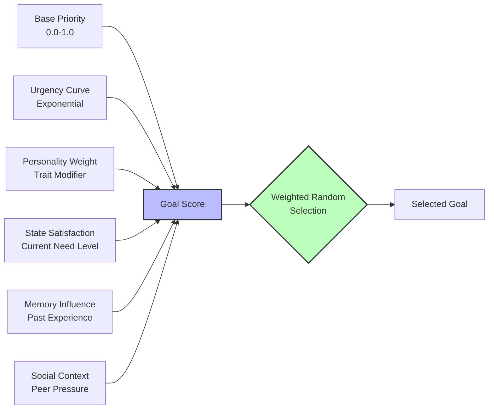
```mermaid
graph LR
    A[Base Priority<br/>0.0-1.0] --> G[Goal Score]
    B[Urgency Curve<br/>Exponential] --> G
    C[Personality Weight<br/>Trait Modifier] --> G
    D[State Satisfaction<br/>Current Need Level] --> G
    E[Memory Influence<br/>Past Experience] --> G
    F[Social Context<br/>Peer Pressure] --> G
    G --> H{Weighted Random<br/>Selection}
    H --> I[Selected Goal]
    
    style G fill:#bbf,stroke:#333,stroke-width:2px
    style H fill:#bfb,stroke:#333,stroke-width:2px
```

#### Priority Calculation Formula

```csharp
public float CalculateGoalUtility(Agent agent, Goal goal)
{
    float score = 1.0f;
    
    // Multiplicative combination of all considerations
    foreach (var consideration in goal.considerations)
    {
        float value = consideration.GetValue(agent, goal);
        float curved = consideration.responseCurve.Evaluate(value);
        float weighted = Mathf.Pow(curved, consideration.weight);
        score *= weighted;
    }
    
    // Apply personality modifiers
    score *= GetPersonalityMultiplier(agent, goal);
    
    // Add small random variance (5-10%) to prevent robotic behavior
    float noise = agent.random.Range(0.95f, 1.05f);
    score *= noise;
    
    return Mathf.Clamp01(score);
}
```

#### Consideration System

**Considerations** are the atomic units of goal evaluation. Each consideration measures one factor and maps it to [0.0, 1.0] via a response curve.

**Core Considerations (15-20 total)**:

| Consideration | Measures | Default Weight | Curve Type | Personality Link |
|---------------|----------|----------------|------------|------------------|
| **Hunger** | Current hunger level (0-100) | 10.0 | Exponential | Greed (inverse) |
| **Energy** | Current energy (0-100) | 8.0 | Exponential | Work Ethic |
| **Health** | Current health (0-100) | 9.0 | Logistic | Emotional Stability |
| **Safety** | Proximity to threats | 7.0 | Step | Bravery (inverse) |
| **Social Need** | Time since last interaction | 5.0 | Linear | Gregariousness |
| **Wealth** | Current credits vs. target | 6.0 | Logistic | Greed |
| **Skill Growth** | Recent skill practice | 4.0 | Linear | Openness |
| **Status** | Reputation vs. aspiration | 3.0 | Logistic | Extraversion |
| **Comfort** | Housing quality | 4.0 | Linear | Conscientiousness |
| **Achievement** | Recent accomplishments | 3.0 | Linear | Work Ethic |
| **Political Interest** | Governance participation | 2.0 | Linear | Progressivism |
| **Creativity** | Creative outlet need | 2.0 | Linear | Openness |
| **Tradition** | Cultural adherence | 2.0 | Linear | Tradition |
| **Excitement** | Boredom level | 3.0 | Exponential | Excitement-Seeking |
| **Altruism** | Helping others | 2.0 | Linear | Altruism |

**Response Curves**:

**Exponential (for urgent needs like hunger)**:
```
f(x) = x^k where k > 1 (typically 2.0-3.0)
Example: At 30% hunger: 0.3^2 = 0.09 (low urgency)
         At 80% hunger: 0.8^2 = 0.64 (high urgency)
```

**Logistic/Sigmoid (for threshold behaviors)**:
```
f(x) = 1 / (1 + e^(-k * (x - midpoint)))
Example: Safety consideration with midpoint=50, k=0.2
         At x=30 (safe): ~0.12 (low concern)
         At x=50 (caution zone): ~0.50
         At x=70 (dangerous): ~0.88 (high concern)
```

**Linear (for steady preferences)**:
```
f(x) = x (clamped to [0,1])
Example: Social need grows steadily with time
```

**Step (for binary conditions)**:
```
f(x) = 0 if x < threshold, 1 if x >= threshold
Example: Safety step at 0.3 (30% health = critical)
```

#### Personality Weight Modifiers

Traits modify consideration weights and curve parameters:

```csharp
public float GetPersonalityMultiplier(Agent agent, Goal goal)
{
    float multiplier = 1.0f;
    
    // Adjust based on goal type
    switch (goal.category)
    {
        case GoalCategory.Survival:
            // High neuroticism = higher safety priority
            multiplier += (agent.traits.neuroticism - 50) * 0.01f;
            break;
            
        case GoalCategory.Prosperity:
            // High greed = higher wealth priority
            multiplier += (agent.traits.greed - 50) * 0.02f;
            // High work ethic = more willing to work for wealth
            if (goal.subCategory == GoalSubCategory.Work)
                multiplier += (agent.traits.workEthic - 50) * 0.01f;
            break;
            
        case GoalCategory.Social:
            // High gregariousness = higher social need
            multiplier += (agent.traits.gregariousness - 50) * 0.02f;
            // High extraversion = cares more about status
            if (goal.subCategory == GoalSubCategory.Status)
                multiplier += (agent.traits.extraversion - 50) * 0.015f;
            break;
            
        case GoalCategory.SelfActualization:
            // High openness = values creativity and learning
            multiplier += (agent.traits.openness - 50) * 0.02f;
            break;
    }
    
    return Mathf.Clamp(multiplier, 0.5f, 2.0f); // Range: 0.5x to 2.0x
}
```

#### Memory Influence

Past experiences modify current goal priorities:

```csharp
public float GetMemoryModifier(Agent agent, Goal goal)
{
    float modifier = 1.0f;
    
    // Check for relevant memories
    var relevantMemories = agent.memory.RetrieveByType(goal.memoryType);
    
    foreach (var memory in relevantMemories)
    {
        // Positive memory of goal completion
        if (memory.emotionalValence > 50 && memory.importance > 70)
        {
            // Encourage repeating positive experiences
            modifier += 0.1f;
        }
        
        // Negative memory of ignoring this need
        if (memory.emotionalValence < -50 && memory.tags.Contains("consequence"))
        {
            // Increase urgency to avoid repeated negative outcome
            modifier += 0.2f;
        }
        
        // Trauma related to this goal type
        if (memory.type == MemoryType.Core && memory.emotionalValence < -80)
        {
            // Strong avoidance or obsession depending on trait
            if (agent.traits.emotionalStability < 40)
                modifier += 0.3f; // Obsessive about preventing repeat
        }
    }
    
    return Mathf.Clamp(modifier, 0.5f, 1.5f);
}
```

#### Social Context

Peer influence and social pressure:

```csharp
public float GetSocialModifier(Agent agent, Goal goal)
{
    float modifier = 1.0f;
    
    // Check what friends are doing
    var friends = agent.social.GetFriends();
    int friendsPursuingGoal = friends.Count(f => f.currentGoal == goal.type);
    
    if (friendsPursuingGoal > 0)
    {
        // Social proof: if 3+ friends doing X, more likely to join
        float socialInfluence = Mathf.Min(friendsPursuingGoal * 0.1f, 0.3f);
        
        // High agreeableness = more susceptible to peer pressure
        socialInfluence *= (agent.traits.agreeableness / 50f);
        
        modifier += socialInfluence;
    }
    
    // Authority influence (if respected leader pursuing goal)
    var respectedAgents = agent.social.GetHighRespectAgents();
    if (respectedAgents.Any(r => r.currentGoal == goal.type))
    {
        modifier += 0.15f; // Role model effect
    }
    
    return Mathf.Clamp(modifier, 0.8f, 1.4f);
}
```

#### Final Priority Score

Combining all factors:

```csharp
public float CalculateFinalPriority(Agent agent, Goal goal)
{
    // Base utility from considerations
    float utility = CalculateGoalUtility(agent, goal);
    
    // Apply modifiers
    float personalityMod = GetPersonalityMultiplier(agent, goal);
    float memoryMod = GetMemoryModifier(agent, goal);
    float socialMod = GetSocialModifier(agent, goal);
    
    float finalScore = utility * personalityMod * memoryMod * socialMod;
    
    // Hard override for critical needs (survival always wins if urgent)
    if (goal.category == GoalCategory.Survival && utility > 0.8f)
    {
        finalScore = 1.0f; // Maximum priority
    }
    
    return Mathf.Clamp01(finalScore);
}
```

#### Goal Selection

Weighted random selection among top-scoring goals prevents deterministic behavior:

```csharp
public Goal SelectGoal(Agent agent)
{
    // Score all active goals
    var scoredGoals = activeGoals.Select(g => new {
        Goal = g,
        Score = CalculateFinalPriority(agent, g)
    }).OrderByDescending(x => x.Score).ToList();
    
    // Consider top 3 goals (or fewer if less available)
    var candidates = scoredGoals.Take(3).ToList();
    
    if (candidates.Count == 0)
        return Goal.Idle; // Default fallback
    
    // If one goal dominates (>0.8 score), select it deterministically
    if (candidates[0].Score > 0.8f && candidates[0].Score > candidates[1].Score + 0.2f)
    {
        return candidates[0].Goal;
    }
    
    // Otherwise, weighted random selection
    float totalWeight = candidates.Sum(c => c.Score);
    float random = agent.random.Range(0, totalWeight);
    
    float cumulative = 0;
    foreach (var candidate in candidates)
    {
        cumulative += candidate.Score;
        if (random <= cumulative)
            return candidate.Goal;
    }
    
    return candidates[0].Goal; // Fallback
}
```

#### Goal Interruption

Critical needs can interrupt current goals:

```csharp
public bool ShouldInterruptCurrentGoal(Agent agent, Goal currentGoal)
{
    // Check all goals for critical priority
    foreach (var goal in activeGoals)
    {
        float score = CalculateFinalPriority(agent, goal);
        
        // Critical threshold: score > 0.9 and significantly higher than current
        if (score > 0.9f && goal != currentGoal)
        {
            float currentScore = CalculateFinalPriority(agent, currentGoal);
            if (score > currentScore + 0.3f)
            {
                return true; // Interrupt for critical need
            }
        }
    }
    
    // Check for interrupts (combat, emergencies)
    if (agent.pendingInterrupts.Any(i => i.severity > 0.8f))
    {
        return true;
    }
    
    return false;
}
```

**Interruption Handling**:
```csharp
public void InterruptGoal(Agent agent, Goal newGoal)
{
    // Save current goal state for resumption
    if (agent.currentGoal != null && agent.currentGoal.interruptible)
    {
        agent.goalStack.Push(agent.currentGoal);
    }
    
    // Set new goal
    agent.currentGoal = newGoal;
    agent.behavior.needsReplan = true;
    
    // Log interruption for memory
    agent.memory.AddToShortTerm(new Memory(
        $"Interrupted {oldGoal.name} for {newGoal.name}",
        importance: 60,
        emotionalValence: (sbyte)(newGoal.urgency > 0.8f ? -30 : -10)
    ));
}
```

#### Performance Considerations

- **Caching**: Goal scores cached for 5 ticks (0.25s at 20 TPS)
- **Lazy Evaluation**: Only evaluate goals that could potentially win (top 5 by base priority)
- **Early Exit**: If consideration returns 0, abort goal evaluation immediately
- **Budgeting**: Track time spent in goal evaluation, demote to simpler heuristics if over budget

#### Example: Goal Priority Scenarios

**Scenario 1: Hungry Agent**:
- Hunger: 85% (curved: 0.85^2.5 = 0.66)
- Energy: 70% (curved: 0.70^2.0 = 0.49)
- Wealth consideration: 0.3 (moderate wealth)
- **Food goal score**: 0.66 × 1.2 (greedy agent) × 1.1 (once starved before) = **0.87** (High priority)

**Scenario 2: Comfortable Agent**:
- Hunger: 20% (curved: 0.04)
- Social need: 80% (0.80)
- Excitement: 70% (curved: 0.49)
- **Social goal score**: 0.80 × 1.3 (high gregariousness) = **1.04** → clamped to 1.0 (Maximum priority)
- **Work goal score**: 0.3 × 0.8 (moderate work ethic) = 0.24 (Low priority)

**Result**: Agent chooses to socialize rather than work, despite having moderate wealth needs.

---

## 3. Agent Memory System

### Memory Architecture

The memory system uses a **3-tier architecture** inspired by Dwarf Fortress but optimized for performance. Memory slots are limited (5 short-term + 5 long-term) to create competition dynamics—only the most important memories are retained.

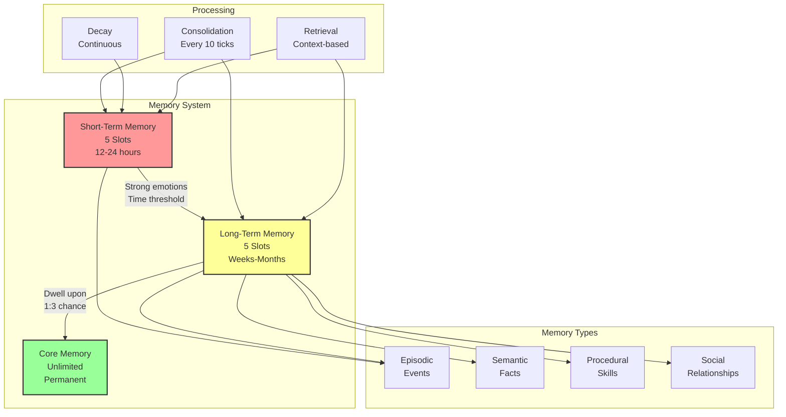
```mermaid
graph TB
    subgraph "Memory System"
        STM[Short-Term Memory<br/>5 Slots<br/>12-24 hours]
        LTM[Long-Term Memory<br/>5 Slots<br/>Weeks-Months]
        CM[Core Memory<br/>Unlimited<br/>Permanent]
    end
    
    subgraph "Memory Types"
        EP[Episodic<br/>Events]
        SEM[Semantic<br/>Facts]
        PR[Procedural<br/>Skills]
        SO[Social<br/>Relationships]
    end
    
    subgraph "Processing"
        CON[Consolidation<br/>Every 10 ticks]
        DEC[Decay<br/>Continuous]
        RET[Retrieval<br/>Context-based]
    end
    
    STM -->|Strong emotions<br/>Time threshold| LTM
    LTM -->|Dwell upon<br/>1:3 chance| CM
    
    STM --> EP
    LTM --> EP
    LTM --> SEM
    LTM --> PR
    LTM --> SO
    
    CON --> STM
    CON --> LTM
    DEC --> STM
    RET --> STM
    RET --> LTM
    
    style STM fill:#f99,stroke:#333,stroke-width:2px
    style LTM fill:#ff9,stroke:#333,stroke-width:2px
    style CM fill:#9f9,stroke:#333,stroke-width:2px
```

### Memory Data Structure

Memory structures are optimized for cache efficiency and fast comparison during slot competition.

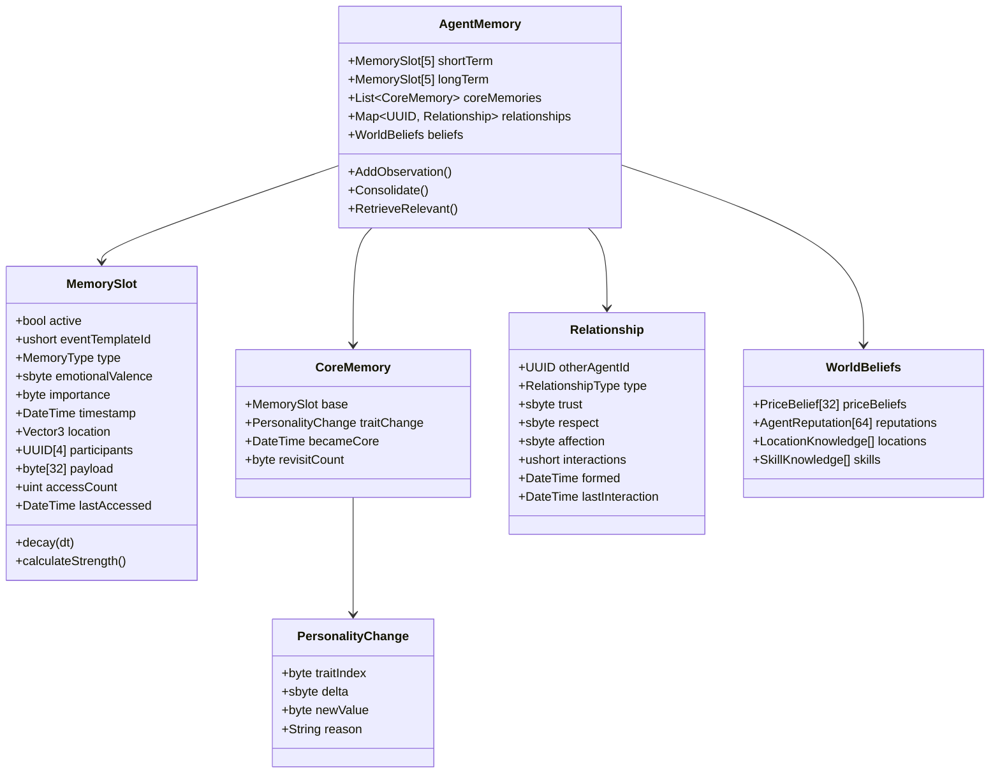
```mermaid
classDiagram
    class MemorySlot {
        +bool active
        +ushort eventTemplateId
        +MemoryType type
        +sbyte emotionalValence
        +byte importance
        +DateTime timestamp
        +Vector3 location
        +UUID[4] participants
        +byte[32] payload
        +uint accessCount
        +DateTime lastAccessed
        +decay(dt)
        +calculateStrength()
    }
    
    class CoreMemory {
        +MemorySlot base
        +PersonalityChange traitChange
        +DateTime becameCore
        +byte revisitCount
    }
    
    class PersonalityChange {
        +byte traitIndex
        +sbyte delta
        +byte newValue
        +String reason
    }
    
    class AgentMemory {
        +MemorySlot[5] shortTerm
        +MemorySlot[5] longTerm
        +List~CoreMemory~ coreMemories
        +Map~UUID, Relationship~ relationships
        +WorldBeliefs beliefs
        +AddObservation()
        +Consolidate()
        +RetrieveRelevant()
    }
    
    class Relationship {
        +UUID otherAgentId
        +RelationshipType type
        +sbyte trust
        +sbyte respect
        +sbyte affection
        +ushort interactions
        +DateTime formed
        +DateTime lastInteraction
    }
    
    class WorldBeliefs {
        +PriceBelief[32] priceBeliefs
        +AgentReputation[64] reputations
        +LocationKnowledge[] locations
        +SkillKnowledge[] skills
    }
    
    AgentMemory --> MemorySlot
    AgentMemory --> CoreMemory
    AgentMemory --> Relationship
    AgentMemory --> WorldBeliefs
    CoreMemory --> PersonalityChange
```

#### MemorySlot Structure (64 bytes fixed)

Compact binary format for cache efficiency:

| Field | Type | Size | Description |
|-------|------|------|-------------|
| `active` | bool | 1 byte | Slot occupied? |
| `eventTemplateId` | ushort | 2 bytes | Reference to event template |
| `type` | byte (enum) | 1 byte | Episodic/Semantic/Procedural/Social |
| `emotionalValence` | sbyte | 1 byte | -100 to +100 |
| `importance` | byte | 1 byte | 0-255 (slot competition score) |
| `timestamp` | DateTime | 8 bytes | When event occurred |
| `location` | Vector3 | 12 bytes | Where event occurred |
| `participants[4]` | UUID[4] | 64 bytes | Up to 4 other agents |
| `payload[32]` | byte[32] | 32 bytes | Event-specific data |
| `accessCount` | uint | 4 bytes | Times retrieved |
| `lastAccessed` | DateTime | 8 bytes | Last retrieval time |
| **Total** | | **~140 bytes** | (padded to 64-byte cache line) |

**Total Memory per Agent**: 5 short-term + 5 long-term = 10 slots × 64 bytes = **640 bytes**

#### Memory Types

**Episodic (Events)**:
- Personal experiences with temporal/spatial context
- Examples: "Ate meal", "Fought bear", "Traded with Bob", "Went to party"
- Payload: Event-specific data (food type, opponent, trade details)

**Semantic (Facts)**:
- Knowledge about the world
- Examples: "Iron sells for 5 credits", "Forest has wolves", "Sarah is mayor"
- Payload: Fact data (price, danger level, role)

**Procedural (Skills)**:
- How-to knowledge gained through practice
- Examples: "Efficient mining technique", "Good haggling strategy"
- Payload: Skill ID, proficiency level

**Social (Relationships)**:
- Information about other agents
- Examples: "Bob is trustworthy", "Alice slighted me"
- Payload: Agent ID, relationship change

#### Slot Competition Algorithm

When a new memory arrives, it competes for a slot based on **strength score**:

```csharp
public float CalculateStrength(MemorySlot memory)
{
    // Base: importance (0-255 mapped to 0-1)
    float baseStrength = memory.importance / 255f;
    
    // Emotional amplification
    float emotionFactor = 1.0f + (Mathf.Abs(memory.emotionalValence) / 100f);
    
    // Recency bonus (exponential decay over time)
    float ageHours = (DateTime.Now - memory.timestamp).TotalHours;
    float recency = Mathf.Exp(-ageHours / 24f); // Decay over 24 hours
    
    // Access frequency (memories we think about are stronger)
    float rehearsal = Mathf.Min(memory.accessCount / 10f, 1.0f);
    
    return baseStrength * emotionFactor * (0.5f + 0.5f * recency) * (0.8f + 0.2f * rehearsal);
}

public void AddToShortTerm(Agent agent, Observation observation)
{
    // Create new memory
    var newMemory = new MemorySlot
    {
        eventTemplateId = observation.templateId,
        type = observation.memoryType,
        emotionalValence = (sbyte)Mathf.Clamp(observation.emotion, -100, 100),
        importance = CalculateInitialImportance(observation),
        timestamp = DateTime.Now,
        location = observation.location,
        participants = observation.participants,
        payload = observation.SerializePayload()
    };
    
    // Check if same event type already exists
    var existing = agent.memory.shortTerm.FirstOrDefault(m => 
        m.active && m.eventTemplateId == newMemory.eventTemplateId);
    
    if (existing != null)
    {
        // Replace if new memory is stronger
        if (CalculateStrength(newMemory) > CalculateStrength(existing))
        {
            ReplaceSlot(agent.memory.shortTerm, existing, newMemory);
        }
        // Otherwise, strengthen existing (it's been reinforced)
        else
        {
            existing.importance = (byte)Mathf.Min(existing.importance + 10, 255);
            existing.lastAccessed = DateTime.Now;
        }
        return;
    }
    
    // Find weakest slot
    var weakest = agent.memory.shortTerm
        .Where(m => m.active)
        .OrderBy(m => CalculateStrength(m))
        .FirstOrDefault();
    
    // Replace if new memory is stronger than weakest
    if (weakest == null || CalculateStrength(newMemory) > CalculateStrength(weakest))
    {
        ReplaceSlot(agent.memory.shortTerm, weakest, newMemory);
    }
    // Otherwise: memory forgotten (too weak to compete)
}

public void ReplaceSlot(MemorySlot[] slots, MemorySlot old, MemorySlot newMem)
{
    if (old != null)
    {
        // Move to forgotten list (for analytics/debugging)
        LogMemoryForgotten(old);
        old.active = false;
    }
    
    // Find empty slot or overwrite
    var targetSlot = old ?? slots.FirstOrDefault(s => !s.active);
    if (targetSlot != null)
    {
        *targetSlot = newMem;
        targetSlot.active = true;
    }
}
```

#### Memory Decay Mechanics

Memories fade over time unless reinforced through access:

```csharp
public void Decay(MemorySlot memory, float deltaTimeHours)
{
    // Importance decays exponentially
    float decayRate = 0.05f * deltaTimeHours; // 5% per hour
    
    // Emotional memories decay slower
    if (Mathf.Abs(memory.emotionalValence) > 50)
        decayRate *= 0.5f;
    
    // Recently accessed memories resist decay
    float hoursSinceAccess = (DateTime.Now - memory.lastAccessed).TotalHours;
    if (hoursSinceAccess < 1f)
        decayRate *= 0.1f; // Recently accessed: 90% slower decay
    
    memory.importance = (byte)Mathf.Max(0, memory.importance - (int)(decayRate * 255));
    
    // If importance drops too low, memory becomes eligible for overwrite
    if (memory.importance < 20)
    {
        memory.active = false;
    }
}
```

**Decay Rates**:
- Normal memories: 5% per hour (fades in ~20 hours)
- Emotional memories (|valence| > 50): 2.5% per hour (fades in ~40 hours)
- Core memories: No decay (permanent)
- Accessed memories: 0.5% per hour for 1 hour after access

#### Memory Consolidation (STM → LTM)

Strong short-term memories promote to long-term after time threshold:

```csharp
public void Consolidate(Agent agent)
{
    foreach (var stm in agent.memory.shortTerm.Where(m => m.active))
    {
        // Check time threshold (12-24 hours in STM)
        float ageHours = (DateTime.Now - stm.timestamp).TotalHours;
        if (ageHours < 12f) continue;
        
        // Check strength threshold
        float strength = CalculateStrength(stm);
        if (strength < 0.6f) continue;
        
        // Check access frequency (must have been thought about)
        if (stm.accessCount < 2) continue;
        
        // Promote to LTM
        var ltmSlot = agent.memory.longTerm.FirstOrDefault(s => !s.active);
        if (ltmSlot != null)
        {
            *ltmSlot = stm;
            ltmSlot.active = true;
            stm.active = false; // Clear STM slot
            
            LogMemoryConsolidated(stm);
        }
        else
        {
            // LTM full: compete for slot
            var weakestLtm = agent.memory.longTerm
                .Where(m => m.active)
                .OrderBy(m => CalculateStrength(m))
                .First();
            
            if (strength > CalculateStrength(weakestLtm))
            {
                ReplaceSlot(agent.memory.longTerm, weakestLtm, stm);
                stm.active = false;
            }
        }
    }
}
```

**Consolidation Triggers**:
- Runs every 10 ticks (0.5 seconds at 20 TPS)
- Minimum age: 12 hours (simulated time)
- Minimum strength: 0.6/1.0
- Minimum accesses: 2 (must have been recalled)

#### Core Memory Formation (LTM → Core)

Extremely important long-term memories become permanent personality-shaping core memories:

```csharp
public void FormCoreMemory(Agent agent, MemorySlot ltmMemory)
{
    // Only certain event types can become core
    if (!CanBecomeCore(ltmMemory.type)) return;
    
    // Must be dwelling upon (revisiting) memory
    // 1:3 chance per revisit after age threshold
    float ageDays = (DateTime.Now - ltmMemory.timestamp).TotalDays;
    if (ageDays < 7f) return; // Minimum 7 days old
    
    // Check for dwell (revisit during consolidation)
    if (agent.random.Range(0, 3) != 0) return; // 1:3 chance
    
    // Create core memory
    var core = new CoreMemory
    {
        base = ltmMemory,
        becameCore = DateTime.Now,
        revisitCount = 0
    };
    
    // Determine personality change
    core.traitChange = CalculatePersonalityChange(agent, ltmMemory);
    
    // Apply change
    ApplyPersonalityChange(agent, core.traitChange);
    
    // Add to core memory list
    agent.memory.coreMemories.Add(core);
    
    // Remove from LTM (promoted)
    ltmMemory.active = false;
    
    LogCoreMemoryFormed(core);
}

public bool CanBecomeCore(MemoryType type)
{
    // Only major life events become core
    return type switch
    {
        MemoryType.Trauma => true,
        MemoryType.Birth => true,
        MemoryType.Death => true,
        MemoryType.Marriage => true,
        MemoryType.Achievement => true, // Major success
        MemoryType.Betrayal => true,
        _ => false
    };
}

public PersonalityChange CalculatePersonalityChange(Agent agent, MemorySlot memory)
{
    var change = new PersonalityChange();
    
    switch (memory.type)
    {
        case MemoryType.Trauma:
            // Trauma increases neuroticism or decreases stability
            if (agent.random.Range(0, 2) == 0)
            {
                change.traitIndex = TraitIndex.Neuroticism;
                change.delta = (sbyte)agent.random.Range(5, 15);
            }
            else
            {
                change.traitIndex = TraitIndex.EmotionalStability;
                change.delta = (sbyte)agent.random.Range(-15, -5);
            }
            change.reason = "Traumatic experience";
            break;
            
        case MemoryType.Achievement:
            // Success increases confidence/work ethic
            change.traitIndex = TraitIndex.WorkEthic;
            change.delta = (sbyte)agent.random.Range(3, 10);
            change.reason = "Major achievement";
            break;
            
        case MemoryType.Betrayal:
            // Betrayal decreases trust
            change.traitIndex = TraitIndex.Gregariousness; // Affects trust in people
            change.delta = (sbyte)agent.random.Range(-10, -3);
            change.reason = "Betrayed by trusted person";
            break;
    }
    
    return change;
}
```

**Core Memory Characteristics**:
- Unlimited capacity (unlike STM/LTM slots)
- Permanent (no decay)
- Cause personality changes
- Visually distinct in UI (bright magenta, per DF)
- Agents "dwell upon" them frequently (revisit)

#### Memory Retrieval

Context-based retrieval for decision-making:

```csharp
public List<MemorySlot> RetrieveRelevant(Agent agent, RetrievalContext context)
{
    var relevant = new List<MemorySlot>();
    
    // Search STM and LTM
    var allMemories = agent.memory.shortTerm
        .Concat(agent.memory.longTerm)
        .Where(m => m.active);
    
    foreach (var memory in allMemories)
    {
        float relevance = CalculateRelevance(memory, context);
        if (relevance > 0.5f)
        {
            relevant.Add(memory);
            memory.accessCount++;
            memory.lastAccessed = DateTime.Now;
        }
    }
    
    // Always include core memories if relevant
    foreach (var core in agent.memory.coreMemories)
    {
        float relevance = CalculateRelevance(core.base, context);
        if (relevance > 0.3f)
        {
            relevant.Add(core.base);
            core.revisitCount++;
        }
    }
    
    return relevant.OrderByDescending(m => CalculateRelevance(m, context)).ToList();
}

public float CalculateRelevance(MemorySlot memory, RetrievalContext context)
{
    float score = 0f;
    
    // Location match
    if (Vector3.Distance(memory.location, context.location) < 10f)
        score += 0.3f;
    
    // Participants match
    if (memory.participants.Any(p => context.involvedAgents.Contains(p)))
        score += 0.4f;
    
    // Time context (similar time of day)
    float timeDiff = Mathf.Abs((memory.timestamp.Hour - context.currentTime.Hour) / 24f);
    if (timeDiff < 0.1f) score += 0.1f;
    
    // Type match
    if (memory.type == context.relevantType)
        score += 0.2f;
    
    // Recent = more relevant
    float ageHours = (DateTime.Now - memory.timestamp).TotalHours;
    score += Mathf.Exp(-ageHours / 48f) * 0.5f;
    
    return Mathf.Clamp01(score);
}
```

#### What Agents Remember

**Short-Term Memory (5 slots, 12-24 hour duration)**:
- Recent meals and their quality
- Last 3-5 social interactions
- Current trade offers and prices seen
- Immediate threats encountered
- Recent work completed
- Active plans and intentions

**Long-Term Memory (5 slots, weeks-months duration)**:
- Significant social events (parties, conflicts, alliances)
- Major economic transactions (big wins/losses)
- Traumatic experiences (attacks, deaths witnessed)
- Achievement moments (skill mastery, successful projects)
- Important world facts (reliable trading partners, dangerous areas)

**Core Memory (unlimited, permanent)**:
- Death of family member or close friend
- Marriage or birth of child
- Major betrayal or trust violation
- Life-threatening trauma survived
- Significant achievement (first masterwork, business success)
- Major political events participated in

### What Agents Remember

**Short-Term (24 hours)**:
- Recent conversations
- Current transactions
- Immediate threats/opportunities
- Active plans

**Long-Term (Persistent)**:
- Major life events
- Traumatic experiences
- Successful strategies
- Relationship histories
- World facts (prices, locations, laws)

**Decay Mechanics**:
- Unimportant memories fade
- Emotional memories persist longer
- Accessed memories strengthen
- Contradicting memories update beliefs

---

## 4. Economic Behavior Model

### Price Belief Formation

Agents form beliefs about fair market prices through observation and experience, creating diverse pricing expectations that drive market dynamics.

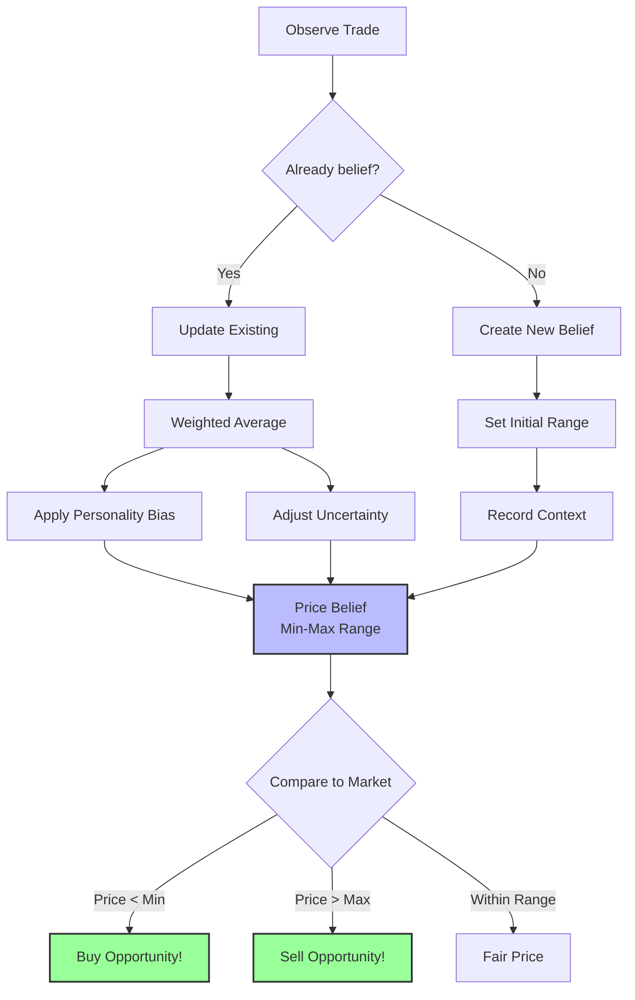
```mermaid
graph TD
    A[Observe Trade] --> B{Already belief?}
    B -->|Yes| C[Update Existing]
    B -->|No| D[Create New Belief]
    
    C --> E[Weighted Average]
    E --> F[Apply Personality Bias]
    E --> G[Adjust Uncertainty]
    
    D --> H[Set Initial Range]
    H --> I[Record Context]
    
    F --> J[Price Belief<br/>Min-Max Range]
    G --> J
    I --> J
    
    J --> K{Compare to Market}
    K -->|Price < Min| L[Buy Opportunity!]
    K -->|Price > Max| M[Sell Opportunity!]
    K -->|Within Range| N[Fair Price]
    
    style J fill:#bbf,stroke:#333,stroke-width:2px
    style L fill:#9f9,stroke:#333,stroke-width:2px
    style M fill:#9f9,stroke:#333,stroke-width:2px
```

#### Price Belief Data Structure

```csharp
public struct PriceBelief
{
    public ushort itemId;          // What item
    public float meanPrice;        // Expected fair price
    public float uncertainty;      // Price range (±uncertainty)
    public float minPrice;         // Won't pay more than this
    public float maxPrice;         // Won't sell for less than this
    public byte observationCount;  // How many observations
    public DateTime lastUpdated;   // Last observation time
    public float confidence;       // 0-1 certainty in belief
}
```

#### Belief Update Algorithm

When an agent observes a transaction or market listing:

```csharp
public void UpdatePriceBelief(Agent agent, ushort itemId, float observedPrice)
{
    var belief = agent.economy.GetBelief(itemId);
    
    if (belief == null)
    {
        // Create initial belief
        belief = new PriceBelief
        {
            itemId = itemId,
            meanPrice = observedPrice,
            uncertainty = observedPrice * 0.3f, // 30% initial uncertainty
            observationCount = 1,
            lastUpdated = DateTime.Now,
            confidence = 0.3f
        };
    }
    else
    {
        // Calculate recency weight
        float hoursSinceUpdate = (DateTime.Now - belief.lastUpdated).TotalHours;
        float recencyDecay = Mathf.Exp(-hoursSinceUpdate / 24f); // Decay over 24 hours
        
        // Base weight depends on observation count
        float baseWeight = Mathf.Min(belief.observationCount / 10f, 0.7f);
        
        // Personality: Openness = more willing to update beliefs
        float opennessFactor = 1.0f + (agent.traits.openness - 50) * 0.01f;
        
        // Neuroticism = more cautious about price changes
        float neuroticismFactor = 1.0f - (agent.traits.neuroticism - 50) * 0.005f;
        
        float memoryWeight = baseWeight * recencyDecay * opennessFactor * neuroticismFactor;
        memoryWeight = Mathf.Clamp(memoryWeight, 0.3f, 0.9f);
        
        float observationWeight = 1.0f - memoryWeight;
        
        // Update mean price (weighted average)
        float oldMean = belief.meanPrice;
        belief.meanPrice = (oldMean * memoryWeight) + (observedPrice * observationWeight);
        
        // Update uncertainty (decreases with more observations)
        float priceVariance = Mathf.Abs(observedPrice - oldMean);
        belief.uncertainty = (belief.uncertainty * memoryWeight) + (priceVariance * observationWeight);
        belief.uncertainty = Mathf.Max(belief.uncertainty, belief.meanPrice * 0.1f); // Min 10% uncertainty
        
        // Update min/max bounds
        belief.minPrice = belief.meanPrice - belief.uncertainty;
        belief.maxPrice = belief.meanPrice + belief.uncertainty;
        
        // Increase observation count (capped at 100)
        belief.observationCount = (byte)Mathf.Min(belief.observationCount + 1, 100);
        
        // Update confidence
        belief.confidence = Mathf.Min(belief.observationCount / 20f, 0.95f);
        belief.lastUpdated = DateTime.Now;
    }
    
    // Apply personality bias to bounds
    ApplyPersonalityBias(agent, belief);
    
    agent.economy.SetBelief(belief);
}
```

#### Personality Bias Application

Different personalities interpret prices differently:

```csharp
public void ApplyPersonalityBias(Agent agent, PriceBelief belief)
{
    // Greed: Wants to pay less, sell for more
    float greedFactor = (agent.traits.greed - 50) * 0.002f; // ±10% at extremes
    
    // Optimists think prices will go up (buy now, hold out when selling)
    // Pessimists think prices will go down (wait to buy, sell now)
    float neuroticismBias = (agent.traits.neuroticism - 50) * 0.001f;
    
    // Buying bias (what agent considers "fair" to pay)
    float buyBias = 1.0f - greedFactor + neuroticismBias;
    belief.minPrice *= buyBias;
    
    // Selling bias (what agent considers "fair" to receive)
    float sellBias = 1.0f + greedFactor - neuroticismBias;
    belief.maxPrice *= sellBias;
    
    // Conscientiousness: More disciplined about price discipline
    if (agent.traits.conscientiousness > 70)
    {
        // Tighter spreads for high-conscientiousness agents
        belief.uncertainty *= 0.8f;
    }
}
```

#### Belief Decay and Uncertainty

Beliefs become less certain over time without observations:

```csharp
public void DecayPriceBeliefs(Agent agent, float deltaTimeHours)
{
    foreach (var belief in agent.economy.priceBeliefs)
    {
        // Uncertainty grows with time
        float decayRate = 0.02f * deltaTimeHours; // 2% per hour
        belief.uncertainty *= (1.0f + decayRate);
        
        // Max uncertainty cap (300% of mean)
        belief.uncertainty = Mathf.Min(belief.uncertainty, belief.meanPrice * 3.0f);
        
        // Confidence decays
        belief.confidence *= (1.0f - decayRate * 0.5f);
        
        // Update bounds
        belief.minPrice = belief.meanPrice - belief.uncertainty;
        belief.maxPrice = belief.meanPrice + belief.uncertainty;
    }
}
```

#### Trading Decision Based on Beliefs

Agents use beliefs to identify trading opportunities:

```csharp
public TradingDecision EvaluateTrade(Agent agent, ushort itemId, float offeredPrice, bool isBuying)
{
    var belief = agent.economy.GetBelief(itemId);
    
    if (belief == null || belief.confidence < 0.2f)
    {
        // No strong belief - accept if price seems reasonable
        return new TradingDecision { action = TradingAction.Accept, confidence = 0.5f };
    }
    
    if (isBuying)
    {
        // Buying: Want price below our max willingness to pay
        if (offeredPrice <= belief.minPrice)
        {
            // Great deal! Below our minimum expectation
            return new TradingDecision { action = TradingAction.Accept, urgency = TradeUrgency.High };
        }
        else if (offeredPrice <= belief.meanPrice)
        {
            // Fair deal, within acceptable range
            return new TradingDecision { action = TradingAction.Accept, urgency = TradeUrgency.Normal };
        }
        else if (offeredPrice <= belief.maxPrice)
        {
            // Expensive but not outrageous
            // Consider need urgency
            float needUrgency = GetNeedUrgency(agent, itemId);
            if (needUrgency > 0.7f)
                return new TradingDecision { action = TradingAction.Accept, urgency = TradeUrgency.Reluctant };
            else
                return new TradingDecision { action = TradingAction.Negotiate };
        }
        else
        {
            // Way too expensive
            return new TradingDecision { action = TradingAction.Reject };
        }
    }
    else // Selling
    {
        // Selling: Want price above our minimum willingness to accept
        if (offeredPrice >= belief.maxPrice)
        {
            // Great deal! Above our maximum expectation
            return new TradingDecision { action = TradingAction.Accept, urgency = TradeUrgency.High };
        }
        else if (offeredPrice >= belief.meanPrice)
        {
            // Fair deal
            return new TradingDecision { action = TradingAction.Accept, urgency = TradeUrgency.Normal };
        }
        else if (offeredPrice >= belief.minPrice)
        {
            // Below ideal but acceptable
            // Consider urgency to sell
            float surplusUrgency = GetSurplusUrgency(agent, itemId);
            if (surplusUrgency > 0.6f)
                return new TradingDecision { action = TradingAction.Accept, urgency = TradeUrgency.Reluctant };
            else
                return new TradingDecision { action = TradingAction.Negotiate };
        }
        else
        {
            // Way too low
            return new TradingDecision { action = TradingAction.Reject };
        }
    }
}
```

#### Market Discovery

Agents actively seek price information:

```csharp
public void SeekPriceInformation(Agent agent)
{
    // Check which items we need beliefs for
    var itemsOfInterest = GetItemsOfInterest(agent);
    
    foreach (var itemId in itemsOfInterest)
    {
        var belief = agent.economy.GetBelief(itemId);
        
        // If belief is stale or low confidence, seek info
        if (belief == null || belief.confidence < 0.4f)
        {
            // Option 1: Visit market and observe
            agent.goals.QueueGoal(new VisitMarketGoal(itemId));
            
            // Option 2: Ask friends
            var knowledgeableFriend = agent.social.friends
                .Where(f => f.economy.HasRecentBelief(itemId))
                .FirstOrDefault();
            
            if (knowledgeableFriend != null && agent.traits.trust > 50)
            {
                agent.goals.QueueGoal(new AskPriceGoal(knowledgeableFriend, itemId));
            }
        }
    }
}
```

**Price Information Gossip**:
```csharp
public void SharePriceInfo(Agent speaker, Agent listener, ushort itemId)
{
    var belief = speaker.economy.GetBelief(itemId);
    if (belief == null || belief.confidence < 0.5f) return;
    
    // Trust affects whether listener believes the info
    float trust = listener.social.GetRelationship(speaker.id).trust;
    float credibility = trust / 100f;
    
    // Update listener's belief (weighted by credibility)
    listener.economy.UpdatePriceBelief(itemId, belief.meanPrice, credibility);
    
    // Create memory
    listener.memory.AddToShortTerm(new Memory(
        $"{speaker.name} told me {itemId} costs around {belief.meanPrice}",
        importance: (byte)(30 * credibility),
        emotionalValence: 0
    ));
}
```

**Example Price Belief Evolution**:

**Agent: Sarah the Carpenter (Greed: 65, Openness: 45)**

**Day 1**: Observes lumber selling for 10 credits
- Initial belief: Mean=10, Uncertainty=3, Min=7, Max=13, Confidence=0.3

**Day 3**: Observes lumber selling for 12 credits
- Update: Memory weight 0.5 (2 observations), Observation weight 0.5
- New mean: (10×0.5 + 12×0.5) = 11
- New uncertainty: (3×0.5 + 2×0.5) = 2.5
- Observation count: 2, Confidence: 0.4

**With Greed Bias (65 = +15% greed)**:
- Min price (what she'll pay): 7 × 0.85 = 5.95
- Max price (what she'll accept): 13 × 1.15 = 14.95

**Result**: Sarah thinks fair price is 11, but she's biased to:
- Buy only if price ≤ 5.95 (looking for bargains)
- Sell only if price ≥ 14.95 (holding out for premium)
- This creates realistic price spread in market

### Trading Strategy

Agents engage in multi-stage economic decision-making: assessing needs, sourcing goods (produce vs. buy), managing inventory, and selling surplus.

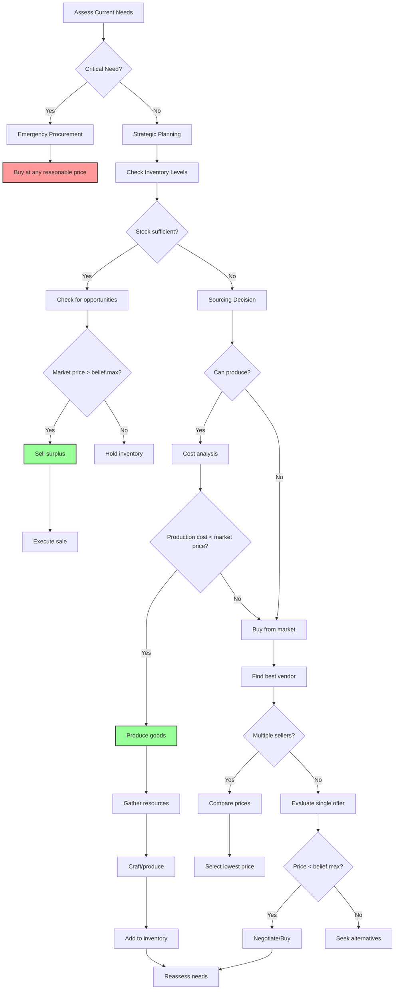
```mermaid
graph TD
    A[Assess Current Needs] --> B{Critical Need?}
    B -->|Yes| C[Emergency Procurement]
    B -->|No| D[Strategic Planning]
    
    C --> E[Buy at any reasonable price]
    
    D --> F[Check Inventory Levels]
    F --> G{Stock sufficient?}
    
    G -->|Yes| H[Check for opportunities]
    G -->|No| I[Sourcing Decision]
    
    H --> J{Market price > belief.max?}
    J -->|Yes| K[Sell surplus]
    J -->|No| L[Hold inventory]
    
    I --> M{Can produce?}
    M -->|Yes| N[Cost analysis]
    M -->|No| O[Buy from market]
    
    N --> P{Production cost < market price?}
    P -->|Yes| Q[Produce goods]
    P -->|No| O
    
    Q --> R[Gather resources]
    R --> S[Craft/produce]
    S --> T[Add to inventory]
    
    O --> U[Find best vendor]
    U --> V{Multiple sellers?}
    V -->|Yes| W[Compare prices]
    V -->|No| X[Evaluate single offer]
    
    W --> Y[Select lowest price]
    X --> Z{Price < belief.max?}
    Z -->|Yes| AA[Negotiate/Buy]
    Z -->|No| AB[Seek alternatives]
    
    K --> AC[Execute sale]
    T --> AD[Reassess needs]
    AA --> AD
    
    style E fill:#f99,stroke:#333,stroke-width:2px
    style K fill:#9f9,stroke:#333,stroke-width:2px
    style Q fill:#9f9,stroke:#333,stroke-width:2px
```

#### Needs Assessment Algorithm

Agents continuously evaluate resource requirements:

```csharp
public class NeedsAssessment
{
    public List<ResourceNeed> CalculateNeeds(Agent agent)
    {
        var needs = new List<ResourceNeed>();
        
        // 1. Survival needs (highest priority)
        if (agent.state.hunger > 60)
        {
            needs.Add(new ResourceNeed
            {
                itemId = ItemType.Food,
                quantity = CalculateFoodNeed(agent),
                urgency = Urgency.Critical,
                maxPrice = agent.credits * 0.5f // Willing to spend 50% of money on food when hungry
            });
        }
        
        // 2. Tool durability (work equipment)
        foreach (var tool in agent.inventory.GetTools())
        {
            if (tool.durability < 0.2f) // Tool about to break
            {
                needs.Add(new ResourceNeed
                {
                    itemId = tool.itemId,
                    quantity = 1,
                    urgency = Urgency.High,
                    maxPrice = agent.economy.GetBelief(tool.itemId)?.meanPrice * 1.2f ?? 100f
                });
            }
        }
        
        // 3. Input materials for profession
        var profession = agent.economy.career.profession;
        var requiredInputs = profession.GetRequiredInputs();
        foreach (var input in requiredInputs)
        {
            var currentStock = agent.inventory.Count(input.itemId);
            var optimalStock = input.optimalStock;
            
            if (currentStock < optimalStock * 0.3f) // Below 30% of optimal
            {
                needs.Add(new ResourceNeed
                {
                    itemId = input.itemId,
                    quantity = optimalStock - currentStock,
                    urgency = Urgency.Medium,
                    maxPrice = CalculateMaxInputPrice(agent, input)
                });
            }
        }
        
        // 4. Investment/stockpiling (low greed = more stockpiling)
        if (agent.traits.greed < 40 && agent.economy.credits > 200)
        {
            var stockpileItems = GetStockpileOpportunities(agent);
            needs.AddRange(stockpileItems);
        }
        
        return needs.OrderByDescending(n => n.urgency).ToList();
    }
    
    private float CalculateMaxInputPrice(Agent agent, InputRequirement input)
    {
        // Calculate break-even price
        var productBelief = agent.economy.GetBelief(input.productId);
        if (productBelief == null) return float.MaxValue;
        
        float expectedProductPrice = productBelief.meanPrice;
        float breakEvenInputPrice = expectedProductPrice * input.inputRatio;
        
        // High work ethic agents accept lower margins
        float marginRequirement = 1.0f + (0.3f - (agent.traits.workEthic - 50) * 0.005f);
        
        return breakEvenInputPrice / marginRequirement;
    }
}
```

#### Production vs. Purchase Decision

Agents decide whether to make or buy based on cost analysis:

```csharp
public SourcingDecision DecideSourcingMethod(Agent agent, ResourceNeed need)
{
    // Option 1: Buy from market
    var marketBelief = agent.economy.GetBelief(need.itemId);
    float marketCost = float.MaxValue;
    
    if (marketBelief != null)
    {
        marketCost = marketBelief.meanPrice * need.quantity;
    }
    
    // Option 2: Produce (if agent has skill)
    float productionCost = float.MaxValue;
    bool canProduce = false;
    
    var recipe = CraftingSystem.GetRecipe(need.itemId);
    if (recipe != null && agent.skills.HasSkill(recipe.requiredSkill))
    {
        canProduce = true;
        
        // Calculate input costs
        productionCost = 0;
        foreach (var ingredient in recipe.ingredients)
        {
            var ingredientBelief = agent.economy.GetBelief(ingredient.itemId);
            float ingredientPrice = ingredientBelief?.meanPrice ?? 50f;
            productionCost += ingredientPrice * ingredient.quantity;
        }
        
        // Add labor cost (opportunity cost)
        float timeRequired = recipe.craftingTime / agent.skills.GetLevel(recipe.requiredSkill);
        float hourlyWorth = agent.economy.career.hourlyIncomeTarget;
        productionCost += timeRequired * hourlyWorth;
    }
    
    // Option 3: Gather raw (if resource exists in world)
    float gatheringCost = float.MaxValue;
    bool canGather = false;
    
    if (ResourceNodes.Exists(need.itemId))
    {
        canGather = true;
        var nearestNode = ResourceNodes.FindNearest(agent.position, need.itemId);
        if (nearestNode != null)
        {
            float travelTime = Pathfinder.EstimateTime(agent.position, nearestNode.position);
            float gatheringTime = nearestNode.gatheringTime;
            gatheringCost = (travelTime + gatheringTime) * agent.economy.career.hourlyWorth;
        }
    }
    
    // Personality modifiers
    // High work ethic prefers production
    if (agent.traits.workEthic > 60 && canProduce)
        productionCost *= 0.9f;
    
    // High greed prefers cheapest option regardless
    // High excitement-seeking might prefer gathering (adventure)
    if (agent.traits.excitementSeeking > 70 && canGather)
        gatheringCost *= 0.8f;
    
    // Select best option
    var options = new List<(SourcingMethod method, float cost)>
    {
        (SourcingMethod.Buy, marketCost),
        (SourcingMethod.Produce, productionCost),
        (SourcingMethod.Gather, gatheringCost)
    }.Where(o => o.cost < float.MaxValue).OrderBy(o => o.cost).ToList();
    
    if (options.Count == 0)
        return new SourcingDecision { method = SourcingMethod.None, reason = "No viable sourcing method" };
    
    var best = options[0];
    return new SourcingDecision
    {
        method = best.method,
        estimatedCost = best.cost,
        alternativeCost = options.Count > 1 ? options[1].cost : best.cost,
        savings = options.Count > 1 ? options[1].cost - best.cost : 0
    };
}
```

#### Market Search and Vendor Selection

When buying, agents seek the best available price:

```csharp
public Vendor SelectVendor(Agent buyer, ushort itemId, float maxPrice)
{
    // Get all available vendors
    var vendors = Market.GetVendorsSelling(itemId)
        .Where(v => v.price <= maxPrice)
        .Where(v => v.stock >= buyer.needs.MinQuantity)
        .ToList();
    
    if (vendors.Count == 0)
        return null;
    
    if (vendors.Count == 1)
        return vendors[0]; // Only one option
    
    // Score each vendor
    var scoredVendors = vendors.Select(v => new
    {
        Vendor = v,
        Score = CalculateVendorScore(buyer, v)
    }).OrderByDescending(v => v.Score).ToList();
    
    // Weighted random selection among top 3
    var topVendors = scoredVendors.Take(3).ToList();
    float totalWeight = topVendors.Sum(v => v.Score);
    float random = buyer.random.Range(0, totalWeight);
    
    float cumulative = 0;
    foreach (var v in topVendors)
    {
        cumulative += v.Score;
        if (random <= cumulative)
            return v.Vendor;
    }
    
    return topVendors[0].Vendor;
}

public float CalculateVendorScore(Agent buyer, Vendor vendor)
{
    float score = 1.0f;
    
    // Price factor (lower is better)
    var belief = buyer.economy.GetBelief(vendor.itemId);
    float expectedPrice = belief?.meanPrice ?? vendor.price;
    float priceAdvantage = (expectedPrice - vendor.price) / expectedPrice;
    score *= (1.0f + priceAdvantage * 2); // 10% cheaper = 20% score bonus
    
    // Relationship factor
    var relationship = buyer.social.GetRelationship(vendor.ownerId);
    if (relationship != null)
    {
        score *= (1.0f + relationship.trust * 0.01f); // +1% per trust point
    }
    
    // Distance factor (closer is better)
    float distance = Vector3.Distance(buyer.position, vendor.location);
    float distancePenalty = Mathf.Min(distance / 100f, 0.5f); // Max 50% penalty
    score *= (1.0f - distancePenalty);
    
    // Convenience (one-stop shopping)
    int otherNeededItems = buyer.needs.Count(n => vendor.stock.Contains(n.itemId));
    score *= (1.0f + otherNeededItems * 0.1f); // +10% per additional needed item
    
    return score;
}
```

#### Inventory Management

Agents manage inventory to balance availability and capital efficiency:

```csharp
public class InventoryManager
{
    public void RebalanceInventory(Agent agent)
    {
        foreach (var item in agent.inventory.GetTradeableItems())
        {
            var optimal = CalculateOptimalStock(agent, item.itemId);
            var current = item.quantity;
            
            if (current > optimal.max)
            {
                // Sell surplus
                int surplus = current - optimal.target;
                agent.economy.QueueForSale(item.itemId, surplus);
            }
            else if (current < optimal.min)
            {
                // Acquire more
                int needed = optimal.target - current;
                agent.needs.Add(new ResourceNeed
                {
                    itemId = item.itemId,
                    quantity = needed,
                    urgency = Urgency.Low
                });
            }
        }
        
        // Emergency liquidity
        if (agent.credits < 50 && agent.traits.greed < 60)
        {
            // Sell non-essential items
            var sellable = agent.inventory.GetNonEssentialItems()
                .OrderBy(i => i.importanceToAgent)
                .FirstOrDefault();
            
            if (sellable != null)
            {
                agent.economy.QueueForSale(sellable.itemId, sellable.quantity / 2);
            }
        }
    }
    
    private OptimalStock CalculateOptimalStock(Agent agent, ushort itemId)
    {
        // Base on consumption rate
        float dailyConsumption = GetDailyConsumption(agent, itemId);
        
        // Safety stock (higher for cautious agents)
        float safetyMultiplier = 1.0f + (agent.traits.neuroticism - 50) * 0.02f;
        int safetyStock = (int)(dailyConsumption * 3 * safetyMultiplier); // 3 days buffer
        
        // Economic order quantity (EOQ)
        float orderCost = 10f; // Fixed cost per purchase trip
        float holdingCost = 0.01f; // 1% per day carrying cost
        float annualDemand = dailyConsumption * 365;
        float eoq = Mathf.Sqrt((2 * annualDemand * orderCost) / holdingCost);
        
        return new OptimalStock
        {
            min = safetyStock,
            target = (int)eoq,
            max = (int)(eoq * 1.5f)
        };
    }
}
```

#### Transaction Execution

When a trade is agreed upon:

```csharp
public void ExecuteTrade(Agent buyer, Agent seller, ushort itemId, int quantity, float price)
{
    // Verify preconditions
    if (!buyer.inventory.CanAfford(price))
        throw new TradeException("Buyer cannot afford");
    
    if (seller.inventory.Count(itemId) < quantity)
        throw new TradeException("Seller insufficient stock");
    
    // Transfer credits
    buyer.credits -= price;
    seller.credits += price;
    
    // Transfer items
    var items = seller.inventory.Remove(itemId, quantity);
    buyer.inventory.Add(items);
    
    // Update beliefs
    float unitPrice = price / quantity;
    buyer.economy.UpdatePriceBelief(itemId, unitPrice);
    seller.economy.UpdatePriceBelief(itemId, unitPrice);
    
    // Record transaction
    var transaction = new Transaction
    {
        buyerId = buyer.id,
        sellerId = seller.id,
        itemId = itemId,
        quantity = quantity,
        price = price,
        timestamp = DateTime.Now,
        location = buyer.position
    };
    
    Market.RecordTransaction(transaction);
    buyer.economy.recentTransactions.Add(transaction);
    seller.economy.recentTransactions.Add(transaction);
    
    // Create memories
    var importance = (byte)Mathf.Min(50 + (int)(price / 10), 100);
    buyer.memory.AddToShortTerm(new Memory(
        $"Bought {quantity} {itemId} from {seller.name} for {price} credits",
        importance: importance,
        emotionalValence: (sbyte)(price < buyer.economy.GetBelief(itemId).meanPrice ? 20 : -10)
    ));
    
    seller.memory.AddToShortTerm(new Memory(
        $"Sold {quantity} {itemId} to {buyer.name} for {price} credits",
        importance: importance,
        emotionalValence: (sbyte)(price > seller.economy.GetBelief(itemId).meanPrice ? 20 : -10)
    ));
    
    // Update relationship
    buyer.social.RecordTransaction(seller.id, price);
    seller.social.RecordTransaction(buyer.id, price);
}
```

#### Trading Examples

**Example 1: Hungry Laborer**
- Needs: Food (urgency: Critical)
- Credits: 30
- Belief: Food should cost ~5 credits
- Market price: 8 credits
- **Decision**: Buy at 8 (overpaying because hungry), grumbling about high prices

**Example 2: Merchant Restocking**
- Needs: Iron ingots for tools
- Can produce (has smithing skill) or buy
- Production cost: 60 credits (materials + time)
- Market price: 50 credits
- **Decision**: Buy from market (cheaper), update price belief to ~50

**Example 3: Cautious Stockpiler**
- Current food: 10 units
- Optimal stock (neuroticism=70): 30 units
- **Decision**: Buy 20 units even though not immediately hungry (fear of shortage)

### Career Specialization Decision

Agents choose and switch careers based on expected income, skill aptitude, market demand, and personal satisfaction. Career decisions are major life choices with significant switching costs.

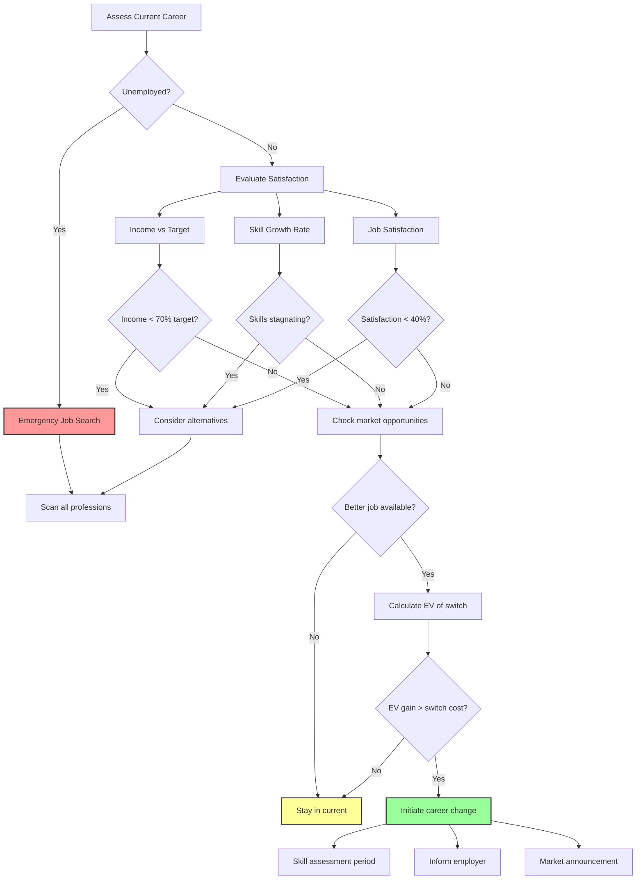
```mermaid
graph TD
    A[Assess Current Career] --> B{Unemployed?}
    B -->|Yes| C[Emergency Job Search]
    B -->|No| D[Evaluate Satisfaction]
    
    D --> E[Income vs Target]
    D --> F[Skill Growth Rate]
    D --> G[Job Satisfaction]
    
    E --> H{Income < 70% target?}
    F --> I{Skills stagnating?}
    G --> J{Satisfaction < 40%?}
    
    H -->|Yes| K[Consider alternatives]
    I -->|Yes| K
    J -->|Yes| K
    
    H -->|No| L[Check market opportunities]
    I -->|No| L
    J -->|No| L
    
    C --> M[Scan all professions]
    K --> M
    L --> N{Better job available?}
    
    N -->|Yes| O[Calculate EV of switch]
    N -->|No| P[Stay in current]
    
    O --> Q{EV gain > switch cost?}
    Q -->|Yes| R[Initiate career change]
    Q -->|No| P
    
    R --> S[Skill assessment period]
    R --> T[Inform employer]
    R --> U[Market announcement]
    
    style R fill:#9f9,stroke:#333,stroke-width:2px
    style P fill:#ff9,stroke:#333,stroke-width:2px
    style C fill:#f99,stroke:#333,stroke-width:2px
```

#### Career Evaluation Algorithm

Agents periodically evaluate their career (every 7 days):

```csharp
public CareerEvaluation EvaluateCurrentCareer(Agent agent)
{
    var career = agent.economy.career;
    var evaluation = new CareerEvaluation();
    
    // 1. Income assessment
    float avgIncome = agent.economy.recentTransactions
        .Where(t => t.timestamp > DateTime.Now.AddDays(-7))
        .Where(t => t.sellerId == agent.id)
        .Sum(t => t.price) / 7f;
    
    evaluation.incomeSatisfaction = avgIncome / agent.economy.incomeTarget;
    
    // 2. Skill growth assessment
    var primarySkill = career.primarySkill;
    float skillGrowth = agent.skills.GetGrowthRate(primarySkill);
    evaluation.skillGrowthSatisfaction = skillGrowth / career.expectedSkillGrowth;
    
    // 3. Job satisfaction (personality fit)
    float personalityFit = CalculatePersonalityFit(agent, career.profession);
    float workConditions = career.workEnvironmentQuality;
    evaluation.jobSatisfaction = (personalityFit * 0.6f) + (workConditions * 0.4f);
    
    // 4. Market demand
    evaluation.marketDemand = Market.GetDemandFor(career.profession.outputItemId);
    
    // 5. Overall career health
    evaluation.overallScore = (
        evaluation.incomeSatisfaction * 0.4f +
        evaluation.skillGrowthSatisfaction * 0.2f +
        evaluation.jobSatisfaction * 0.25f +
        evaluation.marketDemand * 0.15f
    );
    
    return evaluation;
}

public float CalculatePersonalityFit(Agent agent, Profession profession)
{
    float fit = 0.5f; // Baseline
    
    // Each profession has ideal personality profile
    switch (profession.type)
    {
        case ProfessionType.Miner:
            fit += (agent.traits.workEthic - 50) * 0.01f; // + for high work ethic
            fit += (agent.traits.excitementSeeking - 50) * 0.005f; // Slight + for adventure
            fit -= (agent.traits.gregariousness - 50) * 0.01f; // - for high social need (isolated work)
            break;
            
        case ProfessionType.Merchant:
            fit += (agent.traits.greed - 50) * 0.015f; // + for high greed
            fit += (agent.traits.gregariousness - 50) * 0.01f; // + for social
            fit += (agent.traits.openness - 50) * 0.005f; // + for adaptability
            break;
            
        case ProfessionType.Craftsman:
            fit += (agent.traits.workEthic - 50) * 0.01f;
            fit += (agent.traits.openness - 50) * 0.008f; // Creativity
            fit -= (agent.traits.excitementSeeking - 50) * 0.01f; // - for boredom with routine
            break;
            
        case ProfessionType.Farmer:
            fit += (agent.traits.conscientiousness - 50) * 0.01f;
            fit += (agent.traits.tradition - 50) * 0.008f;
            fit -= (agent.traits.excitementSeeking - 50) * 0.015f; // Farming is routine
            break;
    }
    
    return Mathf.Clamp01(fit);
}
```

#### Alternative Career Analysis

When considering a switch, agents evaluate alternatives:

```csharp
public List<CareerOption> EvaluateAlternatives(Agent agent)
{
    var options = new List<CareerOption>();
    
    foreach (var profession in Profession.All)
    {
        // Skip current profession
        if (profession == agent.economy.career.profession) continue;
        
        var option = new CareerOption
        {
            profession = profession,
            
            // 1. Expected income
            marketPrice = Market.GetAveragePrice(profession.outputItemId),
            productionRate = profession.baseProductionRate,
            expectedDailyIncome = marketPrice * productionRate,
            
            // 2. Skill transfer
            existingSkillLevel = agent.skills.GetLevel(profession.primarySkill),
            skillTransferBonus = CalculateSkillTransfer(agent, profession),
            
            // 3. Learning curve
            timeToCompetence = (10 - existingSkillLevel) * profession.learningDifficulty,
            incomeDuringLearning = expectedDailyIncome * (existingSkillLevel / 10f),
            
            // 4. Startup costs
            toolCost = profession.requiredTools.Sum(t => Market.GetPrice(t.itemId)),
            materialCost = profession.dailyMaterialCost,
            
            // 5. Personality fit
            personalityFit = CalculatePersonalityFit(agent, profession),
            
            // 6. Market demand
            marketDemand = Market.GetDemandFor(profession.outputItemId),
            competitionLevel = Market.GetSellerCount(profession.outputItemId)
        };
        
        // Calculate EV (Expected Value)
        float learningPhaseEV = option.incomeDuringLearning * option.timeToCompetence;
        float competentPhaseEV = option.expectedDailyIncome * 30; // 30 days
        float totalCost = option.toolCost + (option.materialCost * option.timeToCompetence);
        
        option.expectedValue = (learningPhaseEV + competentPhaseEV - totalCost) * option.personalityFit * option.marketDemand;
        option.switchCost = totalCost + (agent.economy.career.seniority * 10); // Lose seniority
        
        option.netValue = option.expectedValue - option.switchCost;
        
        options.Add(option);
    }
    
    return options.OrderByDescending(o => o.netValue).ToList();
}
```

#### Career Switch Decision

Agents decide whether to switch based on net value analysis:

```csharp
public bool ShouldSwitchCareer(Agent agent, CareerOption alternative)
{
    var current = EvaluateCurrentCareer(agent);
    
    // Current career EV (next 30 days)
    float currentEV = agent.economy.career.averageDailyIncome * 30 * current.jobSatisfaction;
    
    // Alternative EV
    float alternativeEV = alternative.expectedValue;
    
    // Switch cost
    float switchCost = alternative.switchCost;
    
    // Net gain
    float netGain = alternativeEV - currentEV - switchCost;
    
    // Decision thresholds (personality-based)
    float riskTolerance = agent.traits.bravery * 0.01f; // 0.5 to 1.0
    float requiredReturn = 1.2f - (riskTolerance * 0.2f); // Risk-takers need less return
    
    // High work ethic = more willing to endure current career
    if (agent.traits.workEthic > 70)
        requiredReturn += 0.1f;
    
    // High neuroticism = less willing to switch (fear of change)
    if (agent.traits.neuroticism > 70)
        requiredReturn += 0.15f;
    
    // Decision
    return netGain > (currentEV * (requiredReturn - 1f));
}

public void ExecuteCareerSwitch(Agent agent, CareerOption newCareer)
{
    // 1. Purchase required tools
    foreach (var tool in newCareer.profession.requiredTools)
    {
        if (!agent.inventory.Has(tool.itemId))
        {
            var vendor = FindVendor(agent, tool.itemId);
            if (vendor != null)
            {
                ExecuteTrade(agent, vendor.owner, tool.itemId, 1, vendor.price);
            }
        }
    }
    
    // 2. Update career
    var oldCareer = agent.economy.career;
    agent.economy.career = new Career
    {
        profession = newCareer.profession,
        startDate = DateTime.Now,
        hourlyIncomeTarget = newCareer.expectedDailyIncome / 8f, // 8 hour work day
        previousCareer = oldCareer.profession.name
    };
    
    // 3. Create memories
    agent.memory.AddToShortTerm(new Memory(
        $"Switched career from {oldCareer.profession.name} to {newCareer.profession.name}",
        importance: 80,
        emotionalValence: (sbyte)(newCareer.personalityFit > 0.7 ? 40 : 10)
    ));
    
    // 4. Announce to community (for gossip)
    GossipSystem.Announce($"{agent.name} has become a {newCareer.profession.name}");
    
    // 5. Log for analytics
    Analytics.RecordCareerChange(agent, oldCareer, agent.economy.career, newCareer.netValue);
}
```

#### Career Progression

Within a career, agents advance based on skill and performance:

```csharp
public void AdvanceCareer(Agent agent)
{
    var career = agent.economy.career;
    
    // Check for promotion
    if (career.skillLevel > career.currentTier.requiredSkill + 10)
    {
        var nextTier = career.profession.GetNextTier(career.currentTier);
        if (nextTier != null)
        {
            // Apply for promotion
            career.Promote(nextTier);
            
            agent.memory.AddToShortTerm(new Memory(
                $"Promoted to {nextTier.title} in {career.profession.name}",
                importance: 70,
                emotionalValence: 50
            ));
        }
    }
    
    // Check for specialization
    if (career.yearsInProfession > 2 && agent.traits.openness > 60)
    {
        var specializations = career.profession.GetSpecializations();
        var bestFit = specializations.OrderByDescending(s => CalculatePersonalityFit(agent, s)).First();
        
        if (CalculatePersonalityFit(agent, bestFit) > 0.8f)
        {
            career.Specialize(bestFit);
        }
    }
}
```

**Career Switching Costs**:

| Cost Type | Amount | Notes |
|-----------|--------|-------|
| **Tool Investment** | 50-500 credits | New profession equipment |
| **Learning Period** | 7-30 days | Reduced income while learning |
| **Seniority Loss** | Varies | Lose accumulated benefits |
| **Social Capital** | Moderate | May leave professional network |
| **Psychological** | High for some | Stress of change (neuroticism) |

**Example Career Decision**:

**Agent: Tom the Miner**
- Current: Mining (income: 40/day, satisfaction: 0.6, skills stagnating)
- Alternative: Smithing
  - Expected income: 60/day
  - Tool cost: 200 credits
  - Learning time: 14 days at 30/day
  - Personality fit: 0.75
  - Market demand: 0.8
  - EV: (30×14 + 60×30) × 0.75 × 0.8 = 1332
  - Switch cost: 200 + (40×14) = 760
  - Net gain: 1332 - (40×30) - 760 = 92
- **Decision**: Switch (modest positive gain + better personality fit)

---

## 5. Political Behavior Model

The political behavior system creates emergent governance dynamics where agents form opinions, join factions, and participate in collective decision-making. This system integrates with the economic and social systems to create believable political landscapes.

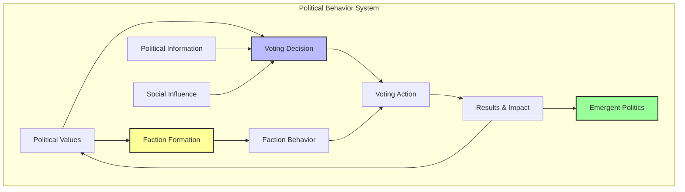
```mermaid
graph TB
    subgraph "Political Behavior System"
        PV[Political Values] --> VD[Voting Decision]
        PI[Political Information] --> VD
        SI[Social Influence] --> VD
        
        VD --> VA[Voting Action]
        VA --> RE[Results & Impact]
        RE --> PV
        
        PV --> FF[Faction Formation]
        FF --> FB[Faction Behavior]
        FB --> VA
        
        RE --> EM[Emergent Politics]
    end
    
    style VD fill:#bbf,stroke:#333,stroke-width:2px
    style FF fill:#ff9,stroke:#333,stroke-width:2px
    style EM fill:#9f9,stroke:#333,stroke-width:2px
```

### 5.1 Voting Decision Process

The voting decision process uses a weighted multi-factor model that considers personal interests, values alignment, social pressure, and candidate track records. This creates diverse voting patterns where different agents prioritize different factors.

#### Vote Score Formula

The core voting decision algorithm calculates a **VoteScore** for each option (candidate or law):

```
VoteScore = (personalImpact × 0.3) + (valueAlignment × 0.3) + (socialInfluence × 0.2) + (pastPerformance × 0.2)
```

**Variable Definitions:**
- `personalImpact` (0.0-1.0): How the option affects the agent's wealth, safety, and daily life
- `valueAlignment` (0.0-1.0): How well the option matches the agent's political values
- `socialInfluence` (0.0-1.0): Pressure from friends, family, and respected community members
- `pastPerformance` (0.0-1.0): Historical track record of candidates or similar policies

**Personality Modifiers:**
- High Neuroticism (+15% personalImpact weight): Anxious agents focus more on self-interest
- High Extraversion (+10% socialInfluence weight): Social agents care more about peer opinions
- High Conscientiousness (+10% pastPerformance weight): Diligent agents research track records
- High Openness (+10% valueAlignment weight): Open-minded agents prioritize ideological fit

#### Detailed Factor Calculations

**1. Personal Impact Calculation**

```csharp
public float CalculatePersonalImpact(Agent agent, VoteOption option)
{
    float impact = 0.0f;
    
    // Economic impact (wealth changes)
    float economicImpact = 0.0f;
    if (option.affectsTaxes)
    {
        float taxChange = option.taxChangeAmount;
        float income = agent.economy.averageDailyIncome * 30; // Monthly income
        float taxImpact = (taxChange / income) * 100; // As percentage of income
        
        // Normalize to 0-1 range (±20% income change = full impact)
        economicImpact = Mathf.Clamp01(Mathf.Abs(taxImpact) / 20f);
        
        // Direction matters: tax increases are negative for most
        if (taxChange > 0 && agent.economy.credits < 500)
            economicImpact *= -1.5f; // Poor agents feel tax hikes more
        else if (taxChange < 0)
            economicImpact *= 1.2f; // Tax cuts are good
    }
    
    // Profession impact (job-related effects)
    float professionImpact = 0.0f;
    if (option.affectsProfessions)
    {
        var myProfession = agent.economy.career.profession;
        if (option.benefitedProfessions.Contains(myProfession))
            professionImpact = 0.8f;
        else if (option.harmedProfessions.Contains(myProfession))
            professionImpact = -0.8f;
    }
    
    // Resource access impact
    float resourceImpact = 0.0f;
    if (option.affectsResourceAccess)
    {
        foreach (var resource in option.resourceChanges)
        {
            var need = agent.needs.GetNeed(resource.itemId);
            if (need != null)
            {
                float importance = need.urgency / 100f;
                float change = resource.availabilityChange; // -1.0 to +1.0
                resourceImpact += importance * change * 0.3f;
            }
        }
        resourceImpact = Mathf.Clamp(resourceImpact, -1f, 1f);
    }
    
    // Safety/Security impact
    float safetyImpact = 0.0f;
    if (option.affectsSafety)
    {
        safetyImpact = option.safetyChange; // -1.0 to +1.0
        // High neuroticism amplifies safety concerns
        safetyImpact *= 1.0f + (agent.traits.neuroticism - 50) * 0.01f;
    }
    
    // Combine impacts (weighted by agent priorities)
    impact = (Mathf.Abs(economicImpact) * 0.35f) + 
             (Mathf.Abs(professionImpact) * 0.25f) + 
             (Mathf.Abs(resourceImpact) * 0.25f) + 
             (Mathf.Abs(safetyImpact) * 0.15f);
    
    // Direction: positive or negative impact
    float netDirection = (economicImpact * 0.35f) + 
                         (professionImpact * 0.25f) + 
                         (resourceImpact * 0.25f) + 
                         (safetyImpact * 0.15f);
    
    // Return score: 0.5 = neutral, 1.0 = very positive, 0.0 = very negative
    return Mathf.Clamp01(0.5f + (netDirection * impact * 0.5f));
}
```

**2. Value Alignment Calculation**

```csharp
public float CalculateValueAlignment(Agent agent, VoteOption option)
{
    float alignment = 0.0f;
    int valueCount = 0;
    
    // Check each political value axis
    foreach (var valueAxis in PoliticalValues.AllAxes)
    {
        if (!option.valueImplications.ContainsKey(valueAxis)) continue;
        
        // Agent's position on this axis (-1.0 to +1.0)
        float agentPosition = agent.politicalValues.GetPosition(valueAxis);
        
        // Option's position on this axis (-1.0 to +1.0)
        float optionPosition = option.valueImplications[valueAxis];
        
        // Calculate alignment (1.0 = perfect match, 0.0 = total opposite)
        float axisAlignment = 1.0f - Mathf.Abs(agentPosition - optionPosition) / 2f;
        
        // Weight by how much agent cares about this axis
        float importance = agent.politicalValues.GetImportance(valueAxis);
        
        alignment += axisAlignment * importance;
        valueCount++;
    }
    
    if (valueCount == 0) return 0.5f; // No relevant values
    
    // Normalize
    alignment /= valueCount;
    
    // High-tradition agents care more about value alignment
    alignment *= 1.0f + (agent.traits.tradition - 50) * 0.005f;
    
    return Mathf.Clamp01(alignment);
}
```

**3. Social Influence Calculation**

```csharp
public float CalculateSocialInfluence(Agent agent, VoteOption option)
{
    float totalInfluence = 0.0f;
    float totalWeight = 0.0f;
    
    // Check influence from each social connection
    foreach (var relationship in agent.social.relationships)
    {
        var other = GetAgent(relationship.otherId);
        if (other == null) continue;
        
        // Has this person expressed an opinion?
        var opinion = other.politicalBehavior.GetOpinion(option);
        if (opinion == null) continue;
        
        // Calculate influence weight based on relationship
        float relationshipStrength = (relationship.trust + relationship.respect) / 200f;
        float influenceWeight = relationshipStrength;
        
        // Close family has stronger influence
        if (relationship.type == RelationshipType.Family)
            influenceWeight *= 1.5f;
        
        // Romantic partner has very strong influence
        if (relationship.type == RelationshipType.Romantic)
            influenceWeight *= 2.0f;
        
        // Respected community leaders have extra influence
        if (other.social.reputation > 70)
            influenceWeight *= 1.3f;
        
        // Apply influence
        float theirVoteScore = opinion.voteScore; // 0.0-1.0
        totalInfluence += theirVoteScore * influenceWeight;
        totalWeight += influenceWeight;
    }
    
    if (totalWeight == 0) return 0.5f; // No social influence available
    
    float averageInfluence = totalInfluence / totalWeight;
    
    // High agreeableness = more susceptible to social influence
    float agreeablenessMod = 1.0f + (agent.traits.agreeableness - 50) * 0.01f;
    
    // High extraversion = more influenced by social network
    float extraversionMod = 1.0f + (agent.traits.extraversion - 50) * 0.008f;
    
    // Calculate deviation from personal preference (conformity pressure)
    float personalPreference = agent.politicalBehavior.GetPersonalPreference(option);
    float conformityPressure = 1.0f - Mathf.Abs(averageInfluence - personalPreference);
    
    return Mathf.Clamp01(averageInfluence * agreeablenessMod * extraversionMod * conformityPressure);
}
```

**4. Past Performance Calculation**

```csharp
public float CalculatePastPerformance(Agent agent, VoteOption option)
{
    // For candidates: track record
    if (option.type == VoteOptionType.Candidate)
    {
        var candidate = option.candidate;
        
        // Check memories of this candidate
        var candidateMemories = agent.memory.RetrieveByParticipant(candidate.id);
        
        float positiveActions = 0;
        float negativeActions = 0;
        float totalWeight = 0;
        
        foreach (var memory in candidateMemories)
        {
            float weight = CalculateMemoryWeight(memory);
            
            if (memory.emotionalValence > 30)
                positiveActions += weight;
            else if (memory.emotionalValence < -30)
                negativeActions += weight;
            
            totalWeight += weight;
        }
        
        if (totalWeight == 0) return 0.5f; // No information
        
        float performance = positiveActions / (positiveActions + negativeActions);
        
        // High conscientiousness agents research more thoroughly
        if (agent.traits.conscientiousness > 70)
        {
            // Bonus for having more information
            float informationBonus = Mathf.Min(totalWeight / 10f, 0.1f);
            performance = Mathf.Lerp(0.5f, performance, 0.8f + informationBonus);
        }
        
        return Mathf.Clamp01(performance);
    }
    
    // For laws/policies: similar past policies
    if (option.type == VoteOptionType.Law)
    {
        // Find similar past laws
        var similarLaws = World.GetPastLaws()
            .Where(l => l.category == option.lawCategory)
            .Where(l => (DateTime.Now - l.passedDate).TotalDays < 365);
        
        float totalImpact = 0;
        int lawCount = 0;
        
        foreach (var law in similarLaws)
        {
            // Did this agent experience the effects?
            var impactMemory = agent.memory.RetrieveByType(MemoryType.PolicyImpact)
                .FirstOrDefault(m => m.payload.lawId == law.id);
            
            if (impactMemory != null)
            {
                totalImpact += impactMemory.emotionalValence / 100f; // -1.0 to +1.0
                lawCount++;
            }
        }
        
        if (lawCount == 0) return 0.5f;
        
        // Normalize to 0-1
        float avgImpact = totalImpact / lawCount;
        return Mathf.Clamp01(0.5f + avgImpact * 0.5f);
    }
    
    return 0.5f;
}
```

#### Abstention Logic

Not all agents vote. Abstention depends on apathy, barriers, and satisfaction with status quo.

```csharp
public bool ShouldAbstain(Agent agent, Election election)
{
    // Base abstention rate: 10-30% depending on civic engagement
    float baseAbstention = 0.2f;
    
    // Apathy factors
    float apathyScore = 0.0f;
    
    // Low political interest = higher apathy
    if (agent.politicalValues.politicalEngagement < 30)
        apathyScore += 0.3f;
    
    // Satisfaction with status quo = less reason to vote
    if (agent.politicalValues.statusQuoSatisfaction > 70)
        apathyScore += 0.2f;
    
    // Information barriers
    float informationBarrier = 0.0f;
    
    // Low information quality = don't feel qualified to vote
    if (agent.politicalBehavior.informationQuality < 0.4f)
        informationBarrier += 0.25f;
    
    // Distance to polling location (if physical voting)
    if (election.requiresPhysicalPresence)
    {
        float distance = Vector3.Distance(agent.position, election.pollingLocation);
        if (distance > 500) informationBarrier += 0.3f; // Far away
    }
    
    // Social factors
    float socialBarrier = 0.0f;
    
    // If friends are voting, more likely to vote (social pressure)
    int votingFriends = agent.social.friends.Count(f => f.politicalBehavior.willVote);
    float friendVotingRate = votingFriends / (float)Mathf.Max(agent.social.friends.Count, 1);
    socialBarrier -= friendVotingRate * 0.2f; // Reduces abstention
    
    // Calculate final abstention probability
    float abstentionProb = baseAbstention + apathyScore + informationBarrier + socialBarrier;
    
    // Personality modifiers
    if (agent.traits.conscientiousness > 70)
        abstentionProb -= 0.15f; // Conscientious agents fulfill civic duties
    
    if (agent.traits.extraversion < 30)
        abstentionProb += 0.1f; // Introverts less likely to engage
    
    // Final decision
    return agent.random.Range(0f, 1f) < Mathf.Clamp01(abstentionProb);
}
```

#### Multiple Voting Methods

The system supports various voting mechanisms for different types of decisions:

**1. Plurality Voting (First-Past-The-Post)**

```csharp
public VoteChoice VotePlurality(Agent agent, List<VoteOption> options)
{
    // Calculate scores for all options
    var scoredOptions = options.Select(o => new {
        Option = o,
        Score = CalculateVoteScore(agent, o)
    }).ToList();
    
    // Select highest scoring option
    var best = scoredOptions.OrderByDescending(x => x.Score).First();
    
    return new VoteChoice {
        option = best.Option,
        method = VotingMethod.Plurality,
        confidence = best.Score
    };
}
```

**2. Approval Voting**

```csharp
public List<VoteOption> VoteApproval(Agent agent, List<VoteOption> options)
{
    var approved = new List<VoteOption>();
    
    // Calculate threshold for approval (personality-based)
    float approvalThreshold = 0.6f; // Default: must be 60% aligned
    
    // High agreeableness agents approve more options
    if (agent.traits.agreeableness > 70)
        approvalThreshold = 0.5f;
    
    // High conscientiousness agents are more selective
    if (agent.traits.conscientiousness > 70)
        approvalThreshold = 0.7f;
    
    foreach (var option in options)
    {
        float score = CalculateVoteScore(agent, option);
        if (score >= approvalThreshold)
        {
            approved.Add(option);
        }
    }
    
    // Must approve at least one if voting
    if (approved.Count == 0)
    {
        var best = options.OrderByDescending(o => CalculateVoteScore(agent, o)).First();
        approved.Add(best);
    }
    
    return approved;
}
```

**3. Ranked Choice Voting (Instant Runoff)**

```csharp
public List<(VoteOption option, int rank)> VoteRankedChoice(Agent agent, List<VoteOption> options)
{
    var rankings = new List<(VoteOption option, float score)>();
    
    // Calculate scores
    foreach (var option in options)
    {
        float score = CalculateVoteScore(agent, option);
        rankings.Add((option, score));
    }
    
    // Sort by score (descending)
    rankings = rankings.OrderByDescending(x => x.score).ToList();
    
    // Convert to rank order
    var result = new List<(VoteOption option, int rank)>();
    int currentRank = 1;
    float lastScore = -1;
    
    foreach (var (option, score) in rankings)
    {
        // Agents with low conscientiousness may rank ties randomly
        if (Mathf.Abs(score - lastScore) < 0.05f && agent.traits.conscientiousness < 50)
        {
            // 50% chance to swap with previous (simulating indifference)
            if (agent.random.Range(0f, 1f) < 0.5f && result.Count > 0)
            {
                var last = result[result.Count - 1];
                result[result.Count - 1] = (option, last.rank);
                result.Add((last.option, currentRank));
                continue;
            }
        }
        
        result.Add((option, currentRank));
        currentRank++;
        lastScore = score;
    }
    
    return result;
}
```

**4. Score Voting (Range Voting)**

```csharp
public Dictionary<VoteOption, int> VoteScore(Agent agent, List<VoteOption> options, int minScore = 0, int maxScore = 5)
{
    var scores = new Dictionary<VoteOption, int>();
    
    foreach (var option in options)
    {
        float normalizedScore = CalculateVoteScore(agent, option); // 0.0-1.0
        
        // Map to score range
        int score = Mathf.RoundToInt(normalizedScore * (maxScore - minScore)) + minScore;
        
        // Strategic voters (high greed) may exaggerate scores
        if (agent.traits.greed > 70 && normalizedScore > 0.5f)
        {
            score = maxScore; // Maximally support preferred option
        }
        else if (agent.traits.greed > 70 && normalizedScore < 0.5f)
        {
            score = minScore; // Minimally support disliked option
        }
        
        scores[option] = Mathf.Clamp(score, minScore, maxScore);
    }
    
    return scores;
}
```

#### Vote Counting and Winner Determination

```csharp
public class VoteCounter
{
    public VoteOption CountVotes(List<VoteChoice> votes, VotingMethod method)
    {
        switch (method)
        {
            case VotingMethod.Plurality:
                return CountPlurality(votes);
                
            case VotingMethod.Approval:
                return CountApproval(votes);
                
            case VotingMethod.RankedChoice:
                return CountRankedChoice(votes);
                
            case VotingMethod.Score:
                return CountScore(votes);
                
            default:
                return CountPlurality(votes);
        }
    }
    
    private VoteOption CountPlurality(List<VoteChoice> votes)
    {
        var voteCounts = new Dictionary<VoteOption, int>();
        
        foreach (var vote in votes)
        {
            if (!voteCounts.ContainsKey(vote.option))
                voteCounts[vote.option] = 0;
            voteCounts[vote.option]++;
        }
        
        return voteCounts.OrderByDescending(x => x.Value).First().Key;
    }
    
    private VoteOption CountRankedChoice(List<VoteChoice> votes)
    {
        var activeOptions = votes.SelectMany(v => v.rankedOptions.Select(r => r.option)).Distinct().ToList();
        
        while (activeOptions.Count > 1)
        {
            // Count first preferences among active options
            var firstPrefs = new Dictionary<VoteOption, int>();
            foreach (var option in activeOptions)
                firstPrefs[option] = 0;
            
            foreach (var vote in votes)
            {
                // Find highest-ranked active option
                var highestActive = vote.rankedOptions
                    .Where(r => activeOptions.Contains(r.option))
                    .OrderBy(r => r.rank)
                    .FirstOrDefault();
                
                if (highestActive.option != null)
                    firstPrefs[highestActive.option]++;
            }
            
            // Check for majority winner
            int totalVotes = firstPrefs.Values.Sum();
            var winner = firstPrefs.FirstOrDefault(x => x.Value > totalVotes / 2);
            
            if (winner.Key != null)
                return winner.Key;
            
            // Eliminate lowest option
            var loser = firstPrefs.OrderBy(x => x.Value).First().Key;
            activeOptions.Remove(loser);
        }
        
        return activeOptions.FirstOrDefault();
    }
}
```

### 5.2 Political Values System

Political values define an agent's ideological preferences across multiple axes. These values are generated from personality traits and evolve based on life experiences.

#### Six Political Value Axes

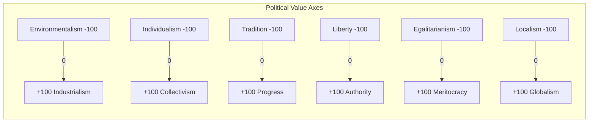
```mermaid
graph LR
    subgraph "Political Value Axes"
        A[Environmentalism -100] -->|0| B[+100 Industrialism]
        C[Individualism -100] -->|0| D[+100 Collectivism]
        E[Tradition -100] -->|0| F[+100 Progress]
        G[Liberty -100] -->|0| H[+100 Authority]
        I[Egalitarianism -100] -->|0| J[+100 Meritocracy]
        K[Localism -100] -->|0| L[+100 Globalism]
    end
```

**Axis 1: Environmentalism vs Industrialism** (-100 to +100)
- **Environmentalism (-100)**: Prioritizes nature preservation, sustainability, low pollution
- **Industrialism (+100)**: Prioritizes economic growth, production efficiency, resource extraction
- **Impact**: Affects votes on environmental regulations, zoning, resource policies

**Axis 2: Individualism vs Collectivism** (-100 to +100)
- **Individualism (-100)**: Personal freedom, private property rights, minimal government
- **Collectivism (+100)**: Community welfare, shared resources, cooperative ownership
- **Impact**: Affects votes on taxation, public services, property laws

**Axis 3: Tradition vs Progress** (-100 to +100)
- **Tradition (-100)**: Values established customs, stability, gradual change
- **Progress (+100)**: Values innovation, reform, rapid advancement
- **Impact**: Affects votes on social reforms, new technologies, cultural policies

**Axis 4: Liberty vs Authority** (-100 to +100)
- **Liberty (-100)**: Minimal laws, personal autonomy, anti-authoritarian
- **Authority (+100)**: Strong laws, social order, respect for hierarchy
- **Impact**: Affects votes on law enforcement, government powers, civil liberties

**Axis 5: Egalitarianism vs Meritocracy** (-100 to +100)
- **Egalitarianism (-100)**: Equal outcomes, wealth redistribution, social safety nets
- **Meritocracy (+100)**: Reward by effort/talent, competition, personal responsibility
- **Impact**: Affects votes on welfare systems, education funding, tax structures

**Axis 6: Localism vs Globalism** (-100 to +100)
- **Localism (-100)**: Community focus, local production, insular policies
- **Globalism (+100)**: Trade openness, immigration, cosmopolitan values
- **Impact**: Affects votes on trade policies, immigration, infrastructure

#### Value Generation from Personality Traits

```csharp
public class PoliticalValuesGenerator
{
    public PoliticalValues GenerateFromPersonality(AgentProfile profile)
    {
        var values = new PoliticalValues();
        
        // Environmentalism vs Industrialism
        // Openness: curious about nature = environmental
        // Conscientiousness: organized planning = can go either way
        // Excitement-seeking: risk-taking = industrial growth
        values.environmentalismIndustrialism = Calculate(
            (profile.traits.openness - 50) * 1.5f +        // High openness = environmental
            (profile.traits.excitementSeeking - 50) * -1.0f + // High excitement = industrial
            (profile.traits.greed - 50) * -1.2f +          // High greed = industrial
            agent.random.Range(-20f, 20f)                  // Random variance
        );
        
        // Individualism vs Collectivism
        // Gregariousness: social need = collectivism
        // Agreeableness: cooperative = collectivism
        // Greed: self-interest = individualism
        values.individualismCollectivism = Calculate(
            (profile.traits.gregariousness - 50) * 1.0f +
            (profile.traits.agreeableness - 50) * 0.8f +
            (profile.traits.greed - 50) * -1.5f +          // High greed = individualism
            (profile.traits.altruism - 50) * 1.2f +        // High altruism = collectivism
            agent.random.Range(-15f, 15f)
        );
        
        // Tradition vs Progress
        // Tradition trait directly maps
        // Progressivism trait directly maps
        // Openness: new experiences = progress
        values.traditionProgress = Calculate(
            (profile.traits.tradition - 50) * 1.8f +       // Strong weight on tradition trait
            (profile.traits.progressivism - 50) * -1.8f +  // Negative = progress
            (profile.traits.openness - 50) * -1.0f +       // Open = progress
            (profile.traits.conscientiousness - 50) * -0.5f + // Conscientious = slightly traditional
            agent.random.Range(-10f, 10f)
        );
        
        // Liberty vs Authority
        // Bravery: anti-authoritarian (rebels)
        // Violence: might prefer authority to maintain order, or chaos
        // Neuroticism: anxious = prefer authority for safety
        values.libertyAuthority = Calculate(
            (profile.traits.bravery - 50) * -1.0f +        // Brave = liberty (anti-authority)
            (profile.traits.neuroticism - 50) * 1.2f +     // Anxious = authority (security)
            (profile.traits.conscientiousness - 50) * 0.6f + // Conscientious = respect for order
            (profile.traits.violence - 50) * -0.8f +       // Violent = anti-authority
            agent.random.Range(-20f, 20f)
        );
        
        // Egalitarianism vs Meritocracy
        // Greed: want to keep wealth = meritocracy
        // Altruism: care for others = egalitarianism
        // Work ethic: believe in effort = meritocracy
        values.egalitarianismMeritocracy = Calculate(
            (profile.traits.greed - 50) * 1.5f +           // Greedy = meritocracy
            (profile.traits.altruism - 50) * -1.3f +       // Altruistic = egalitarian
            (profile.traits.workEthic - 50) * 1.0f +       // Hard worker = meritocracy
            (profile.traits.emotionalStability - 50) * -0.5f + // Stable = egalitarian
            agent.random.Range(-15f, 15f)
        );
        
        // Localism vs Globalism
        // Gregariousness: social = globalism
        // Tradition: traditional = localism
        // Openness: open = globalism
        values.localismGlobalism = Calculate(
            (profile.traits.gregariousness - 50) * 0.8f +
            (profile.traits.tradition - 50) * -1.0f +      // Traditional = local
            (profile.traits.openness - 50) * 1.2f +        // Open = global
            (profile.traits.conscientiousness - 50) * 0.4f +
            agent.random.Range(-20f, 20f)
        );
        
        // Set importance weights (how much agent cares about each axis)
        values.axisImportance = new Dictionary<ValueAxis, float>();
        foreach (var axis in Enum.GetValues(typeof(ValueAxis)))
        {
            // Importance varies by personality
            float baseImportance = agent.random.Range(0.5f, 1.0f);
            
            // High openness = care more about environmental/progress issues
            if ((axis == ValueAxis.EnvironmentalismIndustrialism || 
                 axis == ValueAxis.TraditionProgress) && 
                profile.traits.openness > 60)
                baseImportance += 0.2f;
            
            // High greed = care more about economic axes
            if ((axis == ValueAxis.EgalitarianismMeritocracy || 
                 axis == ValueAxis.IndividualismCollectivism) && 
                profile.traits.greed > 60)
                baseImportance += 0.2f;
            
            values.axisImportance[axis] = Mathf.Clamp01(baseImportance);
        }
        
        return values;
    }
    
    private float Calculate(float value)
    {
        // Normalize to -100 to +100 range
        return Mathf.Clamp(value, -100f, 100f);
    }
}
```

#### Value Evolution Over Time

Political values shift based on life experiences, economic conditions, and social influence:

```csharp
public class ValueEvolution
{
    public void UpdateValues(Agent agent, float deltaTimeDays)
    {
        var values = agent.politicalValues;
        
        // 1. Economic experience effects
        UpdateFromEconomicExperience(agent, values, deltaTimeDays);
        
        // 2. Social influence effects
        UpdateFromSocialInfluence(agent, values, deltaTimeDays);
        
        // 3. Major life events
        UpdateFromLifeEvents(agent, values, deltaTimeDays);
        
        // 4. Information exposure
        UpdateFromInformationExposure(agent, values, deltaTimeDays);
        
        // Apply gradual normalization (tend toward 0 over long periods)
        ApplyNormalization(values, deltaTimeDays);
    }
    
    private void UpdateFromEconomicExperience(Agent agent, PoliticalValues values, float deltaTimeDays)
    {
        // Recent economic success/failure affects egalitarianism/meritocracy
        float recentIncome = agent.economy.GetAverageIncome(30); // Last 30 days
        float historicalIncome = agent.economy.GetHistoricalAverageIncome();
        
        if (recentIncome > historicalIncome * 1.3f)
        {
            // Doing better than average = shift toward meritocracy
            values.egalitarianismMeritocracy += 0.5f * deltaTimeDays;
        }
        else if (recentIncome < historicalIncome * 0.7f)
        {
            // Doing worse = shift toward egalitarianism
            values.egalitarianismMeritocracy -= 0.5f * deltaTimeDays;
        }
        
        // Resource scarcity affects environmentalism
        float foodSecurity = agent.state.foodSecurity; // 0-1
        if (foodSecurity < 0.3f)
        {
            // Starvation risk = prioritize industrialism (food production)
            values.environmentalismIndustrialism += 1.0f * deltaTimeDays;
        }
        
        // Career type affects values
        switch (agent.economy.career.profession.category)
        {
            case ProfessionCategory.Farmer:
                // Farmers value tradition and localism
                values.traditionProgress -= 0.1f * deltaTimeDays;
                values.localismGlobalism -= 0.2f * deltaTimeDays;
                break;
                
            case ProfessionCategory.Merchant:
                // Merchants value globalism
                values.localismGlobalism += 0.2f * deltaTimeDays;
                break;
                
            case ProfessionCategory.Craftsman:
                // Craftspeople value tradition and individualism
                values.traditionProgress -= 0.15f * deltaTimeDays;
                values.individualismCollectivism -= 0.1f * deltaTimeDays;
                break;
        }
    }
    
    private void UpdateFromSocialInfluence(Agent agent, PoliticalValues values, float deltaTimeDays)
    {
        // Values drift toward friends' values over time
        foreach (var friend in agent.social.friends)
        {
            float relationshipStrength = agent.social.GetRelationship(friend.id).affection / 100f;
            float influence = relationshipStrength * 0.02f * deltaTimeDays; // Slow drift
            
            // Drift each axis toward friend's position
            values.environmentalismIndustrialism = Mathf.Lerp(
                values.environmentalismIndustrialism,
                friend.politicalValues.environmentalismIndustrialism,
                influence
            );
            
            values.individualismCollectivism = Mathf.Lerp(
                values.individualismCollectivism,
                friend.politicalValues.individualismCollectivism,
                influence
            );
            
            values.traditionProgress = Mathf.Lerp(
                values.traditionProgress,
                friend.politicalValues.traditionProgress,
                influence
            );
            
            // Other axes...
        }
        
        // Faction membership causes stronger value alignment
        if (agent.social.politicalFaction != Guid.Empty)
        {
            var faction = Faction.Get(agent.social.politicalFaction);
            if (faction != null)
            {
                float factionInfluence = 0.05f * deltaTimeDays; // Stronger than friends
                
                // Align with faction platform
                values.environmentalismIndustrialism = Mathf.Lerp(
                    values.environmentalismIndustrialism,
                    faction.platform.environmentalismIndustrialism,
                    factionInfluence
                );
                
                // Other axes...
            }
        }
    }
    
    private void UpdateFromLifeEvents(Agent agent, PoliticalValues values, float deltaTimeDays)
    {
        // Check for significant memories that affect values
        var recentMemories = agent.memory.RetrieveRecent(30); // Last 30 days
        
        foreach (var memory in recentMemories)
        {
            switch (memory.type)
            {
                case MemoryType.VictimOfCrime:
                    // Victimization pushes toward authority
                    values.libertyAuthority += 5f;
                    break;
                    
                case MemoryType.BusinessSuccess:
                    // Success pushes toward individualism/meritocracy
                    values.individualismCollectivism -= 3f;
                    values.egalitarianismMeritocracy += 3f;
                    break;
                    
                case MemoryType.BusinessFailure:
                    // Failure pushes toward collectivism/egalitarianism
                    values.individualismCollectivism += 3f;
                    values.egalitarianismMeritocracy -= 3f;
                    break;
                    
                case MemoryType.EnvironmentalDisaster:
                    // Disasters push toward environmentalism
                    values.environmentalismIndustrialism -= 5f;
                    break;
                    
                case MemoryType.CommunitySupport:
                    // Received help = collectivism
                    values.individualismCollectivism += 4f;
                    break;
            }
        }
    }
    
    private void UpdateFromInformationExposure(Agent agent, PoliticalValues values, float deltaTimeDays)
    {
        // Media/information exposure affects values
        var recentInfo = agent.politicalBehavior.recentInformation;
        
        foreach (var info in recentInfo)
        {
            if (info.ageDays > 7) continue; // Only recent info matters
            
            float impact = info.credibility * info.emotionalImpact * 0.1f * deltaTimeDays;
            
            // Info about environmental issues
            if (info.category == InfoCategory.Environmental)
            {
                if (info.valence > 0) // Positive environmental news
                    values.environmentalismIndustrialism -= impact;
                else
                    values.environmentalismIndustrialism += impact;
            }
            
            // Info about economic inequality
            if (info.category == InfoCategory.EconomicInequality)
            {
                if (info.valence < 0) // Negative news about inequality
                    values.egalitarianismMeritocracy -= impact;
            }
            
            // Other categories...
        }
    }
    
    private void ApplyNormalization(PoliticalValues values, float deltaTimeDays)
    {
        // Very slow drift toward moderation (0) over years
        float normalizationRate = 0.001f * deltaTimeDays; // Extremely slow
        
        values.environmentalismIndustrialism *= (1f - normalizationRate);
        values.individualismCollectivism *= (1f - normalizationRate);
        values.traditionProgress *= (1f - normalizationRate);
        values.libertyAuthority *= (1f - normalizationRate);
        values.egalitarianismMeritocracy *= (1f - normalizationRate);
        values.localismGlobalism *= (1f - normalizationRate);
    }
}
```

### 5.3 Faction Formation

Factions emerge organically when agents with similar values communicate and coordinate. Unlike pre-defined political parties, factions form dynamically based on shared interests and social connections.

#### Faction Emergence Triggers

```csharp
public class FactionFormation
{
    public List<Faction> DetectEmergingFactions(List<Agent> agents)
    {
        var potentialFactions = new List<PotentialFaction>();
        
        // 1. Find clusters of similar values
        var valueClusters = FindValueClusters(agents);
        
        foreach (var cluster in valueClusters)
        {
            // 2. Check communication network density
            float networkDensity = CalculateNetworkDensity(cluster.agents);
            
            // 3. Check for shared interests/goals
            float interestAlignment = CalculateInterestAlignment(cluster.agents);
            
            // 4. Check for triggering events (crisis, opportunity)
            float triggerIntensity = CalculateTriggerIntensity(cluster.agents);
            
            // Faction emergence score
            float emergenceScore = (networkDensity * 0.3f) + 
                                   (interestAlignment * 0.3f) + 
                                   (cluster.valueSimilarity * 0.25f) + 
                                   (triggerIntensity * 0.15f);
            
            // Minimum threshold and size requirement
            if (emergenceScore > 0.6f && cluster.agents.Count >= 3)
            {
                potentialFactions.Add(new PotentialFaction
                {
                    agents = cluster.agents,
                    formationScore = emergenceScore,
                    averageValues = cluster.averageValues,
                    sharedInterests = cluster.sharedInterests
                });
            }
        }
        
        // 5. Resolve overlapping factions (merge or select strongest)
        var resolvedFactions = ResolveOverlaps(potentialFactions);
        
        // 6. Create actual faction entities
        return resolvedFactions.Select(pf => CreateFaction(pf)).ToList();
    }
    
    private List<ValueCluster> FindValueClusters(List<Agent> agents)
    {
        var clusters = new List<ValueCluster>();
        var unclustered = new HashSet<Agent>(agents);
        
        foreach (var agent in agents)
        {
            if (!unclustered.Contains(agent)) continue;
            
            // Find all agents with similar values
            var similarAgents = unclustered
                .Where(a => a != agent)
                .Where(a => CalculateValueSimilarity(agent, a) > 0.7f)
                .ToList();
            
            if (similarAgents.Count >= 2) // Need at least 2 others (3 total)
            {
                similarAgents.Add(agent);
                
                var cluster = new ValueCluster
                {
                    agents = similarAgents,
                    valueSimilarity = CalculateGroupSimilarity(similarAgents),
                    averageValues = CalculateAverageValues(similarAgents),
                    sharedInterests = FindSharedInterests(similarAgents)
                };
                
                clusters.Add(cluster);
                
                foreach (var a in similarAgents)
                    unclustered.Remove(a);
            }
        }
        
        return clusters;
    }
    
    private float CalculateValueSimilarity(Agent a1, Agent a2)
    {
        float diff = 0f;
        
        // Calculate differences across all axes
        diff += Mathf.Abs(a1.politicalValues.environmentalismIndustrialism - 
                         a2.politicalValues.environmentalismIndustrialism);
        diff += Mathf.Abs(a1.politicalValues.individualismCollectivism - 
                         a2.politicalValues.individualismCollectivism);
        diff += Mathf.Abs(a1.politicalValues.traditionProgress - 
                         a2.politicalValues.traditionProgress);
        diff += Mathf.Abs(a1.politicalValues.libertyAuthority - 
                         a2.politicalValues.libertyAuthority);
        diff += Mathf.Abs(a1.politicalValues.egalitarianismMeritocracy - 
                         a2.politicalValues.egalitarianismMeritocracy);
        diff += Mathf.Abs(a1.politicalValues.localismGlobalism - 
                         a2.politicalValues.localismGlobalism);
        
        // Normalize to 0-1 (max possible diff is 1200 = 6 axes * 200 range)
        float avgDiff = diff / 6f;
        float similarity = 1f - (avgDiff / 200f);
        
        return Mathf.Clamp01(similarity);
    }
}
```

#### Faction Structure and Properties

```csharp
public class Faction
{
    public Guid id;
    public string name;
    public DateTime formationDate;
    public FactionType type;
    
    // Membership
    public List<Agent> members;
    public Agent leader;
    public int memberCount => members.Count;
    
    // Political platform (average of member values)
    public PoliticalValues platform;
    public List<PolicyGoal> agenda;
    
    // Cohesion metrics
    public float internalCohesion; // 0.0-1.0
    public float externalInfluence; // 0.0-1.0
    public float resourcePool; // Credits/resources contributed
    
    // Organizational structure
    public bool hasFormalLeadership;
    public bool hasSharedResources;
    public bool hasCollectiveAction;
    
    // History
    public List<FactionAction> actionHistory;
    public List<ElectionResult> electionResults;
    
    public float CalculateCohesion()
    {
        if (members.Count < 2) return 1.0f;
        
        float valueAlignment = CalculateGroupSimilarity(members);
        
        // Social connection density
        float connectionDensity = 0f;
        int possibleConnections = members.Count * (members.Count - 1) / 2;
        int actualConnections = 0;
        
        for (int i = 0; i < members.Count; i++)
        {
            for (int j = i + 1; j < members.Count; j++)
            {
                var relationship = members[i].social.GetRelationship(members[j].id);
                if (relationship != null && relationship.trust > 30)
                    actualConnections++;
            }
        }
        
        connectionDensity = (float)actualConnections / possibleConnections;
        
        // Recent shared experiences (collective action)
        float sharedExperience = Mathf.Min(actionHistory.Count / 10f, 1.0f);
        
        // Success/failure history
        float successRate = 0.5f;
        if (electionResults.Count > 0)
        {
            int wins = electionResults.Count(r => r.won);
            successRate = (float)wins / electionResults.Count;
        }
        
        return (valueAlignment * 0.35f) + 
               (connectionDensity * 0.25f) + 
               (sharedExperience * 0.2f) + 
               (successRate * 0.2f);
    }
}
```

#### Faction Cohesion Mechanics

```csharp
public class FactionCohesionSystem
{
    public void UpdateFactionCohesion(Faction faction, float deltaTime)
    {
        // Base cohesion from value alignment
        float baseCohesion = CalculateValueAlignmentCohesion(faction);
        
        // Social bonding effects
        float socialCohesion = CalculateSocialBonding(faction, deltaTime);
        
        // Success/failure effects
        float successCohesion = CalculateSuccessEffect(faction);
        
        // Conflict resolution
        float conflictEffect = CalculateInternalConflict(faction);
        
        // External pressure (common enemy increases cohesion)
        float externalPressure = CalculateExternalPressure(faction);
        
        // Combine factors
        float newCohesion = (baseCohesion * 0.3f) + 
                           (socialCohesion * 0.25f) + 
                           (successCohesion * 0.2f) + 
                           (conflictEffect * 0.15f) + 
                           (externalPressure * 0.1f);
        
        // Gradual change (cohesion doesn't shift instantly)
        faction.internalCohesion = Mathf.Lerp(faction.internalCohesion, newCohesion, 0.1f * deltaTime);
        
        // Check for faction collapse
        if (faction.internalCohesion < 0.2f && faction.members.Count > 3)
        {
            ConsiderFactionSplit(faction);
        }
    }
    
    private void ConsiderFactionSplit(Faction faction)
    {
        // Find subgroups with different value emphases
        var subgroups = FindValueSubgroups(faction.members);
        
        if (subgroups.Count >= 2 && subgroups[0].Count >= 3 && subgroups[1].Count >= 3)
        {
            // Split the faction
            var newFaction = CreateFactionFromSubgroup(subgroups[1]);
            
            // Remove members from old faction
            foreach (var agent in subgroups[1])
            {
                faction.members.Remove(agent);
                agent.social.politicalFaction = newFaction.id;
            }
            
            // Recalculate both factions' platforms
            faction.platform = CalculateAverageValues(faction.members);
            newFaction.platform = CalculateAverageValues(newFaction.members);
            
            // Log event
            LogFactionSplit(faction, newFaction);
        }
    }
}
```

#### Voting Bloc Behavior

When factions participate in elections, they coordinate to maximize their influence:

```csharp
public class VotingBlocBehavior
{
    public VoteChoice DetermineFactionVote(Faction faction, Election election)
    {
        // 1. Calculate faction's preference
        var factionPreferences = CalculateFactionPreferences(faction, election.options);
        
        // 2. Assess viability of options
        var viabilityScores = AssessOptionViability(election);
        
        // 3. Strategic decision: support best viable option or stick to principles
        bool strategicMode = ShouldBeStrategic(faction);
        
        if (strategicMode)
        {
            // Strategic voting: support most viable option close to faction platform
            var strategicChoice = factionPreferences
                .Where(p => viabilityScores[p.option] > 0.3f) // Minimum viability
                .OrderByDescending(p => p.score * viabilityScores[p.option])
                .FirstOrDefault();
            
            return strategicChoice;
        }
        else
        {
            // Principled voting: support closest match regardless of viability
            return factionPreferences.OrderByDescending(p => p.score).First();
        }
    }
    
    private bool ShouldBeStrategic(Faction faction)
    {
        // High cohesion factions can afford to be principled
        if (faction.internalCohesion > 0.8f) return false;
        
        // Desperate factions (low success) become strategic
        if (faction.electionResults.Count(r => !r.won) > 3) return true;
        
        // Pragmatic factions (industrialism, meritocracy) are more strategic
        if (faction.platform.individualismCollectivism < -30) return true;
        if (faction.platform.egalitarianismMeritocracy > 30) return true;
        
        return faction.internalCohesion < 0.5f;
    }
    
    public void CoordinateMemberVotes(Faction faction, VoteChoice factionChoice, Election election)
    {
        foreach (var member in faction.members)
        {
            // Calculate personal preference
            var personalChoice = CalculatePersonalVote(member, election);
            
            // Determine loyalty to faction
            float loyalty = CalculateFactionLoyalty(member, faction);
            
            // Blend personal preference with faction recommendation
            float blend = loyalty;
            
            // High conscientiousness = more loyal
            if (member.traits.conscientiousness > 70) blend += 0.1f;
            
            // Low cohesion = less pressure to conform
            blend *= faction.internalCohesion;
            
            // If personal preference very strong, may override faction
            if (personalChoice.confidence > 0.9f && factionChoice.confidence < 0.6f)
            {
                blend -= 0.3f;
            }
            
            blend = Mathf.Clamp01(blend);
            
            // Make final vote choice
            if (agent.random.Range(0f, 1f) < blend)
            {
                member.politicalBehavior.castVote = factionChoice;
                member.politicalBehavior.voteReason = VoteReason.FactionLoyalty;
            }
            else
            {
                member.politicalBehavior.castVote = personalChoice;
                member.politicalBehavior.voteReason = VoteReason.PersonalPreference;
            }
        }
    }
}
```

#### Faction Agenda Formation

Factions develop policy agendas based on member priorities and platform values:

```csharp
public class FactionAgendaSystem
{
    public List<PolicyGoal> GenerateAgenda(Faction faction)
    {
        var agenda = new List<PolicyGoal>();
        
        // 1. Identify priority issues from platform
        var priorityAxes = GetPriorityAxes(faction.platform);
        
        // 2. Find policy opportunities
        var availablePolicies = GetAvailablePolicies();
        
        // 3. Score each policy for faction alignment
        var scoredPolicies = availablePolicies.Select(p => new {
            Policy = p,
            AlignmentScore = CalculatePolicyAlignment(faction, p),
            FeasibilityScore = CalculateFeasibility(faction, p),
            UrgencyScore = CalculateUrgency(faction, p)
        }).ToList();
        
        // 4. Select top priorities
        var topPolicies = scoredPolicies
            .OrderByDescending(p => 
                p.AlignmentScore * 0.4f + 
                p.FeasibilityScore * 0.3f + 
                p.UrgencyScore * 0.3f)
            .Take(5)
            .ToList();
        
        // 5. Create policy goals
        foreach (var scored in topPolicies)
        {
            var goal = new PolicyGoal
            {
                policy = scored.Policy,
                priority = scored.AlignmentScore,
                feasibility = scored.FeasibilityScore,
                targetCompletion = EstimateCompletionDate(scored.Policy),
                supportingArguments = GenerateArguments(faction, scored.Policy),
                targetedVoters = IdentifyTargetVoters(faction, scored.Policy)
            };
            
            agenda.Add(goal);
        }
        
        return agenda.OrderByDescending(g => g.priority).ToList();
    }
    
    private List<ValueAxis> GetPriorityAxes(PoliticalValues platform)
    {
        var priorities = new List<(ValueAxis axis, float extremity)>();
        
        // Find axes where faction has strong positions
        if (Mathf.Abs(platform.environmentalismIndustrialism) > 50)
            priorities.Add((ValueAxis.EnvironmentalismIndustrialism, 
                          Mathf.Abs(platform.environmentalismIndustrialism)));
        
        if (Mathf.Abs(platform.individualismCollectivism) > 50)
            priorities.Add((ValueAxis.IndividualismCollectivism, 
                          Mathf.Abs(platform.individualismCollectivism)));
        
        if (Mathf.Abs(platform.traditionProgress) > 50)
            priorities.Add((ValueAxis.TraditionProgress, 
                          Mathf.Abs(platform.traditionProgress)));
        
        // Other axes...
        
        return priorities.OrderByDescending(p => p.extremity).Select(p => p.axis).ToList();
    }
    
    private float CalculatePolicyAlignment(Faction faction, Policy policy)
    {
        float alignment = 0f;
        int relevantAxes = 0;
        
        foreach (var implication in policy.valueImplications)
        {
            float factionPosition = faction.platform.GetPosition(implication.Key);
            float policyPosition = implication.Value;
            
            // Alignment is inverse of difference
            float axisAlignment = 1f - Mathf.Abs(factionPosition - policyPosition) / 200f;
            
            alignment += axisAlignment;
            relevantAxes++;
        }
        
        if (relevantAxes == 0) return 0.5f;
        
        return alignment / relevantAxes;
    }
}
```

### 5.4 Information and Political Knowledge

Agents learn about political issues through experience, observation, communication, and information gathering. Information quality affects voting accuracy and political engagement.

#### Information Acquisition Channels

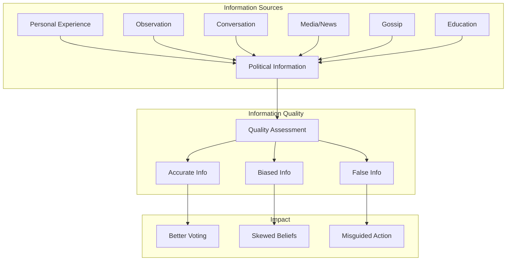
```mermaid
graph TD
    subgraph "Information Sources"
        EXP[Personal Experience] --> PI[Political Information]
        OBS[Observation] --> PI
        CON[Conversation] --> PI
        MED[Media/News] --> PI
        GOS[Gossip] --> PI
        EDU[Education] --> PI
    end
    
    subgraph "Information Quality"
        PI --> IQ[Quality Assessment]
        IQ --> ACC[Accurate Info]
        IQ --> BIA[Biased Info]
        IQ --> FAL[False Info]
    end
    
    subgraph "Impact"
        ACC --> VB[Better Voting]
        BIA --> SB[Skewed Beliefs]
        FAL --> MW[Misguided Action]
    end
```

```csharp
public class PoliticalInformationSystem
{
    // Information channels and their characteristics
    public enum InformationChannel
    {
        PersonalExperience,    // Highest accuracy, limited scope
        DirectObservation,     // High accuracy, limited scope
        Conversation,          // Medium accuracy, varies by trust
        OfficialNews,          // High accuracy, broad scope
        RumorGossip,           // Low accuracy, fast spread
        Educational,           // High accuracy, slow acquisition
        CampaignMaterial       // Biased accuracy, persuasive
    }
    
    public class PoliticalInformation
    {
        public Guid id;
        public string content;
        public InformationChannel source;
        public InfoCategory category;
        public float accuracy; // 0.0-1.0
        public float bias; // -1.0 to +1.0 (directional bias)
        public float emotionalImpact;
        public DateTime receivedDate;
        public float credibility; // Agent's assessment of reliability
        public int spreadCount; // How many times shared
    }
}
```

#### Learning About Political Issues

```csharp
public class PoliticalLearning
{
    public void LearnFromExperience(Agent agent, PoliticalEvent politicalEvent)
    {
        // Create memory of political event
        var info = new PoliticalInformation
        {
            id = Guid.NewGuid(),
            content = GenerateEventDescription(politicalEvent, agent),
            source = InformationChannel.PersonalExperience,
            category = ClassifyEventCategory(politicalEvent),
            accuracy = 0.9f, // Personal experience is highly accurate
            bias = 0.0f, // Minimal bias in direct experience
            emotionalImpact = CalculateEmotionalImpact(agent, politicalEvent),
            receivedDate = DateTime.Now,
            credibility = 1.0f,
            spreadCount = 0
        };
        
        agent.politicalBehavior.AddInformation(info);
        
        // Update beliefs based on experience
        UpdateBeliefsFromExperience(agent, politicalEvent);
    }
    
    public void LearnFromObservation(Agent agent, Agent observedAgent, PoliticalAction action)
    {
        // Observed agent taking political action
        var info = new PoliticalInformation
        {
            source = InformationChannel.DirectObservation,
            content = GenerateObservationDescription(observedAgent, action),
            accuracy = 0.8f,
            bias = 0.0f,
            emotionalImpact = 0.3f,
            receivedDate = DateTime.Now
        };
        
        agent.politicalBehavior.AddInformation(info);
        
        // Update opinion of observed agent
        UpdateAgentOpinion(agent, observedAgent, action);
    }
    
    public void LearnFromConversation(Agent agent, Agent source, PoliticalInformation info)
    {
        // Assess credibility of source
        float trust = agent.social.GetRelationship(source.id)?.trust ?? 50f;
        float sourceCompetence = source.skills.politicalKnowledge / 100f;
        
        // Calculate information credibility
        float credibility = (trust / 100f) * 0.6f + (sourceCompetence * 0.4f);
        
        // Check for existing conflicting information
        var existingInfo = agent.politicalBehavior.GetInformation(info.category);
        if (existingInfo != null)
        {
            float conflict = CalculateInformationConflict(existingInfo, info);
            if (conflict > 0.5f)
            {
                // Conflicting info - decide which to believe
                if (existingInfo.credibility > credibility)
                {
                    // Keep existing belief, mark new as suspicious
                    credibility *= 0.5f;
                }
                else
                {
                    // Replace with new info
                    agent.politicalBehavior.RemoveInformation(existingInfo);
                }
            }
        }
        
        // Add new information
        var newInfo = info.Clone();
        newInfo.source = InformationChannel.Conversation;
        newInfo.credibility = credibility;
        newInfo.accuracy *= credibility; // Accuracy degraded by credibility
        
        agent.politicalBehavior.AddInformation(newInfo);
        
        // Create memory
        agent.memory.AddToShortTerm(new Memory(
            $"{source.name} told me about {info.category}: {info.content}",
            importance: (byte)(30 + info.emotionalImpact * 30),
            emotionalValence: (sbyte)(info.emotionalImpact * 50)
        ));
    }
}
```

#### Information Quality Effects on Voting

```csharp
public class InformationQualityEffects
{
    public float AdjustVoteConfidence(Agent agent, VoteOption option, float baseScore)
    {
        // Get information quality for this option
        float infoQuality = GetInformationQuality(agent, option);
        
        // Low information quality reduces confidence
        float confidenceModifier = 0.5f + (infoQuality * 0.5f); // 0.5 to 1.0
        
        // Calculate adjusted score
        float adjustedScore = baseScore;
        
        // With low information, agents rely more on heuristics
        if (infoQuality < 0.4f)
        {
            // Use social influence more heavily
            float socialOverride = agent.social.friends
                .Select(f => f.politicalBehavior.castVote?.option == option ? 1f : 0f)
                .DefaultIfEmpty(0f)
                .Average();
            
            adjustedScore = Mathf.Lerp(baseScore, socialOverride, 0.4f);
            
            // Low info + low engagement = might abstain
            if (agent.politicalValues.politicalEngagement < 30 && agent.random.Range(0f, 1f) < 0.3f)
            {
                agent.politicalBehavior.willAbstain = true;
            }
        }
        
        // High conscientiousness agents reduce confidence if low info
        if (agent.traits.conscientiousness > 70 && infoQuality < 0.5f)
        {
            adjustedScore = 0.5f; // Uncertain/undecided
        }
        
        return adjustedScore * confidenceModifier;
    }
    
    public float GetInformationQuality(Agent agent, VoteOption option)
    {
        float totalQuality = 0f;
        float totalWeight = 0f;
        
        // Check relevant information
        var relevantInfo = agent.politicalBehavior.information
            .Where(i => IsRelevantToOption(i, option))
            .Where(i => (DateTime.Now - i.receivedDate).TotalDays < 30) // Recent only
            .ToList();
        
        foreach (var info in relevantInfo)
        {
            float age = (DateTime.Now - info.receivedDate).TotalDays;
            float recencyWeight = Mathf.Exp(-age / 7f); // Decay over week
            
            float weightedQuality = info.accuracy * info.credibility * recencyWeight;
            
            totalQuality += weightedQuality;
            totalWeight += recencyWeight;
        }
        
        if (totalWeight == 0) return 0.2f; // Minimum baseline
        
        float avgQuality = totalQuality / totalWeight;
        
        // High openness agents gather better information
        avgQuality *= 1.0f + (agent.traits.openness - 50) * 0.01f;
        
        return Mathf.Clamp01(avgQuality);
    }
}
```

#### Gossip and Information Spread

```csharp
public class PoliticalGossipSystem
{
    public void SpreadInformation(Agent source, PoliticalInformation info, List<Agent> potentialListeners)
    {
        // Determine spread probability based on info characteristics
        float newsworthiness = CalculateNewsworthiness(info);
        
        foreach (var listener in potentialListeners)
        {
            // Check if they can hear it (proximity, social connection)
            if (!CanReceiveGossip(source, listener)) continue;
            
            // Check willingness to share
            float spreadProb = newsworthiness;
            
            // Extraverts spread more
            spreadProb *= 1.0f + (source.traits.extraversion - 50) * 0.01f;
            
            // High trust in listener = more likely to share
            float trust = source.social.GetRelationship(listener.id)?.trust ?? 30f;
            spreadProb *= trust / 100f;
            
            // Shared faction = more communication
            if (source.social.politicalFaction == listener.social.politicalFaction && 
                source.social.politicalFaction != Guid.Empty)
            {
                spreadProb *= 1.3f;
            }
            
            if (source.random.Range(0f, 1f) < spreadProb)
            {
                // Share the information
                TransmitInformation(source, listener, info);
            }
        }
    }
    
    private void TransmitInformation(Agent source, Agent listener, PoliticalInformation info)
    {
        // Information degrades with transmission
        var transmittedInfo = info.Clone();
        transmittedInfo.accuracy *= 0.95f; // Lose 5% accuracy per hop
        transmittedInfo.credibility *= source.social.GetRelationship(listener.id)?.trust / 100f ?? 0.5f;
        transmittedInfo.spreadCount++;
        
        // Add bias based on source's values
        transmittedInfo.bias = CalculateTransmissionBias(source, info);
        
        // Listener receives and processes
        listener.politicalBehavior.ReceiveGossip(source, transmittedInfo);
        
        // Create gossip memory for both
        source.memory.AddToShortTerm(new Memory(
            $"Told {listener.name} about {info.category}",
            importance: 25,
            emotionalValence: 10
        ));
        
        listener.memory.AddToShortTerm(new Memory(
            $"Heard from {source.name} about {info.category}: {info.content}",
            importance: (byte)(20 + info.emotionalImpact * 20),
            emotionalValence = (sbyte)(transmittedInfo.bias * 30)
        ));
    }
    
    private float CalculateNewsworthiness(PoliticalInformation info)
    {
        float score = 0.5f;
        
        // Emotional impact increases spread
        score += info.emotionalImpact * 0.3f;
        
        // Recency matters
        float age = (DateTime.Now - info.receivedDate).TotalHours;
        score *= Mathf.Exp(-age / 24f); // Decay over 24 hours
        
        // Rarity/scarcity increases interest
        if (info.spreadCount < 5)
            score += 0.2f;
        
        // Controversy increases spread
        score += Mathf.Abs(info.bias) * 0.2f;
        
        return Mathf.Clamp01(score);
    }
}
```

#### Political Knowledge Skill

Agents can improve their political knowledge over time:

```csharp
public class PoliticalKnowledgeSkill
{
    public void GainPoliticalKnowledge(Agent agent, float amount, KnowledgeSource source)
    {
        float currentKnowledge = agent.skills.politicalKnowledge; // 0-100
        
        // Diminishing returns as knowledge increases
        float learningRate = (100f - currentKnowledge) / 100f;
        float actualGain = amount * learningRate;
        
        // Personality modifiers
        if (agent.traits.openness > 60)
            actualGain *= 1.2f; // Open-minded agents learn faster
        
        if (agent.traits.conscientiousness > 70)
            actualGain *= 1.1f; // Conscientious agents study harder
        
        agent.skills.politicalKnowledge = Mathf.Min(100f, currentKnowledge + actualGain);
        
        // High knowledge affects information processing
        if (agent.skills.politicalKnowledge > 70)
        {
            // Better at detecting bias
            agent.politicalBehavior.biasDetection = 0.6f + (agent.skills.politicalKnowledge - 70) * 0.01f;
            
            // Better at finding accurate sources
            agent.politicalBehavior.sourceEvaluation = 0.7f;
        }
    }
    
    public void ApplyKnowledgeToVoting(Agent agent, VoteOption option)
    {
        float knowledge = agent.skills.politicalKnowledge / 100f;
        
        // High knowledge agents get information quality bonus
        agent.politicalBehavior.informationQuality *= (0.8f + knowledge * 0.2f);
        
        // Better prediction of policy outcomes
        if (knowledge > 0.6f)
        {
            float predictionAccuracy = knowledge;
            agent.politicalBehavior.predictedOutcome = CalculateRealisticOutcome(option, predictionAccuracy);
        }
    }
}
```

---

---

## 6. Social Behavior Model

### Relationship Formation

The relationship formation system creates authentic social networks through proximity-based discovery, compatibility scoring, and progressive trust building. Agents form relationships organically based on their personalities, shared experiences, and practical needs.

#### Proximity Requirements

Agents can only form relationships when physical and visibility conditions are met:

| Requirement | Specification | Rationale |
|-------------|--------------|-----------|
| **Maximum Distance** | 10 meters | Conversation range for natural interaction |
| **Line of Sight** | Required | Must be able to see each other |
| **Time Threshold** | Minimum 30 seconds co-located | Brief encounters don't form bonds |
| **Frequency** | 3+ encounters within 7 days | Repeated contact needed for relationship |
| **Context** | Non-hostile environment | Combat or threats prevent bonding |

**Proximity Detection Algorithm:**

```csharp
public bool CanFormRelationship(Agent agentA, Agent agentB)
{
    // Distance check (10m threshold)
    float distance = Vector3.Distance(agentA.position, agentB.position);
    if (distance > 10.0f) return false;
    
    // Line of sight check
    if (!spatialSystem.HasLineOfSight(agentA, agentB)) return false;
    
    // Context validation
    if (agentA.state.IsInCombat() || agentB.state.IsInCombat()) return false;
    if (agentA.state.stress > 80 || agentB.state.stress > 80) return false;
    
    // Time tracking for relationship formation
    float timeTogether = agentA.social.GetTimeWith(agentB.id);
    if (timeTogether < 30.0f) return false;
    
    // Frequency check
    int recentEncounters = agentA.memory.CountEncountersWith(agentB.id, days: 7);
    if (recentEncounters < 3) return false;
    
    return true;
}
```

**Proximity Zone Architecture:**

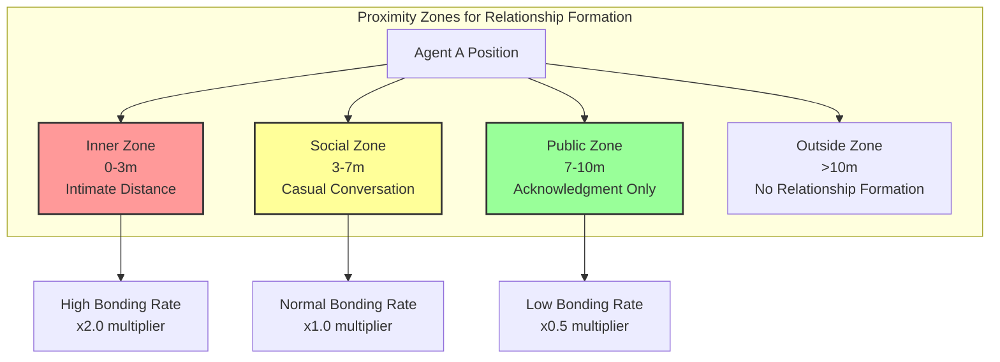
```mermaid
graph TB
    subgraph "Proximity Zones for Relationship Formation"
        A[Agent A Position] 
        
        A --> B[Inner Zone<br/>0-3m<br/>Intimate Distance]
        A --> C[Social Zone<br/>3-7m<br/>Casual Conversation]
        A --> D[Public Zone<br/>7-10m<br/>Acknowledgment Only]
        A --> E[Outside Zone<br/>>10m<br/>No Relationship Formation]
    end
    
    B --> F[High Bonding Rate<br/>x2.0 multiplier]
    C --> G[Normal Bonding Rate<br/>x1.0 multiplier]
    D --> H[Low Bonding Rate<br/>x0.5 multiplier]
    
    style B fill:#f99,stroke:#333,stroke-width:2px
    style C fill:#ff9,stroke:#333,stroke-width:2px
    style D fill:#9f9,stroke:#333,stroke-width:2px
```

#### Compatibility Scoring Algorithm

Relationship formation depends on personality compatibility calculated using a multi-factor scoring system:

**Core Compatibility Formula:**

```
compatibility = 50 + Σ(personality differences < 20 ? +5 : -10) + sharedInterests × 3
```

**Pseudocode Implementation:**

```csharp
public int CalculateCompatibility(Agent agentA, Agent agentB)
{
    int baseScore = 50;
    int personalityScore = 0;
    int interestScore = 0;
    
    // Compare 15 personality traits
    string[] traits = {
        "gregariousness", "workEthic", "violence", "greed", "emotionalStability",
        "openness", "bravery", "altruism", "excitementSeeking", "conscientiousness",
        "agreeableness", "neuroticism", "extraversion", "tradition", "progressivism"
    };
    
    foreach (var trait in traits)
    {
        int diff = Math.Abs(agentA.profile.traits[trait] - agentB.profile.traits[trait]);
        
        // Compatibility bonus for similar traits
        if (diff < 20)
        {
            personalityScore += 5;
        }
        // Penalty for very different traits
        else if (diff > 60)
        {
            personalityScore -= 10;
        }
        // Neutral zone (20-60 difference)
        else
        {
            personalityScore += 0;
        }
    }
    
    // Shared interests bonus
    var sharedInterests = agentA.profile.interests.Intersect(agentB.profile.interests);
    interestScore = sharedInterests.Count() * 3;
    
    // Special trait interactions
    int specialModifier = CalculateSpecialModifiers(agentA, agentB);
    
    // Final calculation
    int compatibility = baseScore + personalityScore + interestScore + specialModifier;
    
    // Clamp to 0-100 range
    return Math.Clamp(compatibility, 0, 100);
}

private int CalculateSpecialModifiers(Agent agentA, Agent agentB)
{
    int modifier = 0;
    
    // High agreeableness agents get along with almost everyone
    if (agentA.profile.traits.agreeableness > 80 || agentB.profile.traits.agreeableness > 80)
    {
        modifier += 10;
    }
    
    // Two high-neuroticism agents may clash
    if (agentA.profile.traits.neuroticism > 70 && agentB.profile.traits.neuroticism > 70)
    {
        modifier -= 15;
    }
    
    // Complementary traits: High bravery + High caution can work well
    if (Math.Abs(agentA.profile.traits.bravery - agentB.profile.traits.bravery) > 50)
    {
        modifier += 5; // "Opposites attract" bonus
    }
    
    // Business compatibility: Low greed with low greed = good
    if (agentA.profile.traits.greed < 30 && agentB.profile.traits.greed < 30)
    {
        modifier += 8; // Trust bonus for non-greedy agents
    }
    
    return modifier;
}
```

**Compatibility Thresholds:**

| Compatibility Range | Relationship Potential | Formation Probability |
|--------------------|----------------------|---------------------|
| 0-30 | Hostile/Ignored | 5% (only if forced) |
| 31-50 | Tolerated | 25% |
| 51-70 | Acquaintance Material | 60% |
| 71-85 | Friend Potential | 85% |
| 86-100 | Best Friend/Soulmate | 95% |

#### Trust Building Mechanics

Trust increases through positive interactions and decreases through negative experiences. Trust is the foundation for relationship progression.

**Trust Dynamics:**

```csharp
public class TrustSystem
{
    public float currentTrust; // 0.0 - 100.0
    public float trustDecayRate = 0.1f; // Per day without interaction
    
    public void UpdateTrust(InteractionResult result)
    {
        switch (result.type)
        {
            case InteractionType.SuccessfulTrade:
                currentTrust += result.value * 2.0f; // +2 to +20 per trade
                break;
                
            case InteractionType.FulfilledPromise:
                currentTrust += result.importance * 3.0f; // Keeping promises builds trust
                break;
                
            case InteractionType.SharedExperience:
                currentTrust += 1.5f; // Small boost for time together
                break;
                
            case InteractionType.BrokenPromise:
                currentTrust -= result.importance * 5.0f; // Breaking promises hurts
                break;
                
            case InteractionType.Betrayal:
                currentTrust -= 30.0f; // Major trust loss
                break;
                
            case InteractionType.Conflict:
                currentTrust -= result.severity * 2.0f; // Arguments reduce trust
                break;
        }
        
        // Apply decay if no recent positive interaction
        if (DaysSinceLastPositiveInteraction() > 7)
        {
            currentTrust -= trustDecayRate * DaysSinceLastPositiveInteraction();
        }
        
        // Clamp
        currentTrust = Math.Clamp(currentTrust, 0.0f, 100.0f);
    }
}
```

**Trust Thresholds for Relationship Types:**

| Trust Level | Value Range | Relationship Actions Unlocked |
|------------|-------------|------------------------------|
| **Stranger** | 0-10 | Basic greeting only |
| **Acquaintance** | 11-30 | Simple conversations, small trades |
| **Familiar** | 31-50 | Personal topics, lending small items |
| **Trusted** | 51-70 | Sharing secrets, significant favors |
| **Close** | 71-85 | Deep confidences, business partnerships |
| **Intimate** | 86-100 | Life commitments, family bonds |

#### Relationship Types

Agents form five distinct relationship types, each with unique mechanics and benefits:

**1. Friend Relationship**

```csharp
public class FriendshipRelationship : Relationship
{
    public int friendLevel; // 1-4 (Acquaintance → Best Friend)
    public float emotionalSupport; // Stress reduction when together
    public DateTime lastActivity;
    
    public void OnSocialInteraction(Agent friend)
    {
        // Stress reduction for high-quality friends
        float stressReduction = 5.0f * friendLevel;
        owner.state.stress = Math.Max(0, owner.state.stress - stressReduction);
        
        // Emotional support during hard times
        if (owner.state.stress > 60)
        {
            float supportBonus = emotionalSupport * 0.5f;
            owner.memory.AddToShortTerm(new Memory(
                $"Friend {friend.name} helped during tough time",
                emotionalValence: 70,
                importance: 80
            ));
        }
    }
}
```

**Friendship Benefits:**
- Stress reduction: -5 to -20 stress per interaction
- Information sharing: Friends share market tips, gossip, warnings
- Emergency help: High-trust friends assist during crises
- Happiness bonus: +10% mood when near friends

**2. Business Partner Relationship**

```csharp
public class BusinessRelationship : Relationship
{
    public float businessTrust; // Separate from personal trust
    public int successfulTrades;
    public int failedTrades;
    public float creditLimit; // Max credit extended
    public List<Contract> activeContracts;
    
    public float CalculateBusinessTrust()
    {
        float baseTrust = (successfulTrades * 2.0f) - (failedTrades * 10.0f);
        float reliabilityBonus = (successfulTrades / Math.Max(1, successfulTrades + failedTrades)) * 20.0f;
        
        return Math.Clamp(baseTrust + reliabilityBonus, 0.0f, 100.0f);
    }
    
    public void OnSuccessfulTrade(float value)
    {
        successfulTrades++;
        creditLimit += value * 0.1f; // 10% of trade value increases credit limit
        businessTrust = CalculateBusinessTrust();
    }
}
```

**Business Benefits:**
- Trade discounts: 5-15% better prices based on trust
- Credit access: Trusted partners extend credit for large purchases
- Exclusive deals: High-trust partners offer rare goods first
- Market information: Share price trends and opportunities

**3. Political Ally Relationship**

```csharp
public class PoliticalRelationship : Relationship
{
    public Faction faction;
    public int politicalInfluence; // 0-100
    public List<Policy> supportedPolicies;
    public List<Policy> opposedPolicies;
    
    public float CalculatePoliticalAlignment()
    {
        float alignment = 0.0f;
        
        // Compare political values
        alignment += 1.0f - (Math.Abs(owner.profile.values.equality - target.profile.values.equality) / 100.0f);
        alignment += 1.0f - (Math.Abs(owner.profile.values.liberty - target.profile.values.liberty) / 100.0f);
        alignment += 1.0f - (Math.Abs(owner.profile.values.tradition - target.profile.values.tradition) / 100.0f);
        
        return alignment / 3.0f; // Normalize to 0-1
    }
    
    public bool WillSupportPolicy(Policy policy)
    {
        float alignment = CalculatePoliticalAlignment();
        float trustFactor = currentTrust / 100.0f;
        
        // Political allies support policies when aligned and trust is high
        return alignment > 0.6f && trustFactor > 0.5f;
    }
}
```

**Political Benefits:**
- Voting bloc: Allies vote together on policies
- Campaign support: Help each other gain office
- Policy influence: Combined influence to pass legislation
- Protection: Defend each other politically

**4. Rival Relationship**

```csharp
public class RivalRelationship : Relationship
{
    public float rivalryIntensity; // 0-100
    public CompetitionType competitionType;
    public DateTime lastConflict;
    public int winsAgainst;
    public int lossesTo;
    
    public void EscalateConflict(ConflictType type, float severity)
    {
        rivalryIntensity += severity;
        
        // High rivalry can trigger active sabotage
        if (rivalryIntensity > 70)
        {
            owner.goals.AddGoal(new SabotageGoal(target));
        }
        
        // Very high rivalry can lead to violence for aggressive agents
        if (rivalryIntensity > 85 && owner.profile.traits.violence > 60)
        {
            owner.goals.AddGoal(new ConfrontGoal(target));
        }
    }
    
    public void ResolveConflict(ResolutionType resolution)
    {
        switch (resolution)
        {
            case ResolutionType.Apology:
                rivalryIntensity -= 20;
                break;
            case ResolutionType.Compromise:
                rivalryIntensity -= 15;
                break;
            case ResolutionType.Mediation:
                rivalryIntensity -= 10;
                break;
            case ResolutionType.Victory:
                winsAgainst++;
                rivalryIntensity -= 5; // Winning reduces rivalry
                break;
            case ResolutionType.Defeat:
                lossesTo++;
                rivalryIntensity += 10; // Losing increases rivalry
                break;
        }
        
        // If intensity drops below 20, convert to neutral relationship
        if (rivalryIntensity < 20)
        {
            ConvertToNeutral();
        }
    }
}
```

**Rivalry Mechanics:**
- Competition: Rivals compete for same resources, status, mates
- Sabotage: High rivalry leads to undermining behavior
- Stress generation: Being near rival increases stress
- Resolution paths: Apology, competition victory, third-party mediation

**5. Family Relationship**

```csharp
public class FamilyRelationship : Relationship
{
    public FamilyRelationType relationType; // Parent, Child, Sibling, Spouse
    public float familyObligation; // 0-100, sense of duty
    public float inheritancePriority; // Position in will
    public bool livingTogether;
    public List<FamilyTradition> sharedTraditions;
    
    public float CalculateFamilySupport()
    {
        float support = familyObligation * 0.6f;
        support += currentTrust * 0.3f;
        support += (livingTogether ? 10.0f : 0.0f);
        
        // Special bond for parent-child
        if (relationType == FamilyRelationType.Parent || relationType == FamilyRelationType.Child)
        {
            support += 15.0f;
        }
        
        return Math.Clamp(support, 0.0f, 100.0f);
    }
    
    public void OnFamilyEmergency(Agent familyMember)
    {
        float supportLevel = CalculateFamilySupport();
        
        // Family emergencies trigger immediate help
        if (supportLevel > 50)
        {
            owner.goals.ForceGoal(new HelpFamilyGoal(familyMember), priority: 0.9f);
            
            // Financial assistance if possible
            if (owner.economy.credits > 100 && supportLevel > 70)
            {
                float aidAmount = owner.economy.credits * 0.2f; // 20% of wealth
                TransferCredits(familyMember, aidAmount);
            }
        }
    }
}
```

**Family Benefits:**
- Unconditional support: Family helps even with low trust
- Inheritance: Family members receive priority in estate
- Housing: Family can live together, share costs
- Reputation: Family connections affect social standing

#### Relationship Progression

Relationships progress through distinct stages based on interaction quality, trust level, and time investment.

**Relationship Progression Pipeline:**

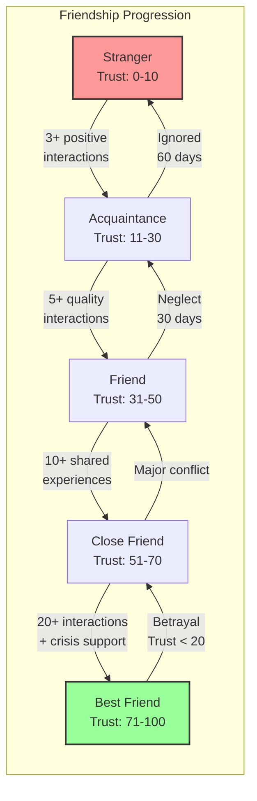
```mermaid
graph LR
    subgraph "Friendship Progression"
        A[Stranger<br/>Trust: 0-10] 
        B[Acquaintance<br/>Trust: 11-30]
        C[Friend<br/>Trust: 31-50]
        D[Close Friend<br/>Trust: 51-70]
        E[Best Friend<br/>Trust: 71-100]
    end
    
    A -->|3+ positive<br/>interactions| B
    B -->|5+ quality<br/>interactions| C
    C -->|10+ shared<br/>experiences| D
    D -->|20+ interactions<br/>+ crisis support| E
    
    E -->|Betrayal<br/>Trust < 20| D
    D -->|Major conflict| C
    C -->|Neglect<br/>30 days| B
    B -->|Ignored<br/>60 days| A
    
    style A fill:#f99,stroke:#333,stroke-width:2px
    style E fill:#9f9,stroke:#333,stroke-width:2px
```

**Progression Mechanics:**

```csharp
public class RelationshipProgression
{
    public RelationshipStage currentStage;
    public float stageProgress; // 0.0 - 100.0
    public int interactionsAtCurrentStage;
    public DateTime stageEntryDate;
    
    public void UpdateProgression(Relationship relationship)
    {
        // Calculate progress based on recent interactions
        float progressDelta = 0.0f;
        
        // Quality interactions advance progress
        var recentInteractions = relationship.GetRecentInteractions(days: 30);
        foreach (var interaction in recentInteractions)
        {
            if (interaction.quality > 70)
            {
                progressDelta += 2.0f; // High quality interaction
            }
            else if (interaction.quality > 40)
            {
                progressDelta += 0.5f; // Average interaction
            }
            else
            {
                progressDelta -= 1.0f; // Poor interaction
            }
        }
        
        // Trust level affects progression speed
        float trustMultiplier = relationship.trust / 50.0f; // 0-2x multiplier
        progressDelta *= trustMultiplier;
        
        // Time factor: Relationships need time to develop
        int daysAtStage = (DateTime.Now - stageEntryDate).Days;
        if (daysAtStage < GetMinimumDaysForStage(currentStage))
        {
            progressDelta *= 0.5f; // Slow down if not enough time passed
        }
        
        // Apply decay if no interactions
        if (recentInteractions.Count == 0)
        {
            progressDelta -= 5.0f * DaysSinceLastInteraction();
        }
        
        stageProgress += progressDelta;
        
        // Check for stage advancement
        if (stageProgress >= 100.0f)
        {
            AdvanceStage();
        }
        else if (stageProgress < 0.0f)
        {
            RegressStage();
        }
    }
    
    private int GetMinimumDaysForStage(RelationshipStage stage)
    {
        return stage switch
        {
            RelationshipStage.Stranger => 0,
            RelationshipStage.Acquaintance => 3,
            RelationshipStage.Friend => 7,
            RelationshipStage.CloseFriend => 14,
            RelationshipStage.BestFriend => 30,
            _ => 0
        };
    }
    
    private void AdvanceStage()
    {
        if (currentStage < RelationshipStage.BestFriend)
        {
            currentStage++;
            stageProgress = 0.0f;
            stageEntryDate = DateTime.Now;
            interactionsAtCurrentStage = 0;
            
            // Trigger memory of progression
            owner.memory.AddToShortTerm(new Memory(
                $"Became {currentStage} with {relationship.target.name}",
                importance: 70,
                emotionalValence: 80
            ));
        }
    }
}
```

**Stage-Specific Requirements:**

| Stage | Min Time | Min Interactions | Trust Required | Special Condition |
|-------|----------|------------------|----------------|-------------------|
| Acquaintance | 3 days | 3 | 11+ | None |
| Friend | 7 days | 8 | 31+ | One shared positive experience |
| Close Friend | 14 days | 15 | 51+ | One favor exchanged |
| Best Friend | 30 days | 30 | 71+ | Crisis support provided |

### Social Interactions

The social interaction system governs how agents communicate, exchange gifts, resolve conflicts, and participate in community events.

#### Conversation System

Conversations follow a topic selection algorithm based on agent interests, current context, and relationship depth.

**Topic Selection Algorithm:**

```csharp
public class ConversationSystem
{
    public List<Topic> availableTopics;
    public Topic currentTopic;
    public float conversationQuality; // 0-100
    
    public Topic SelectTopic(Agent speaker, Agent listener, Relationship relationship)
    {
        // Score all possible topics
        var scoredTopics = new List<ScoredTopic>();
        
        foreach (var topic in availableTopics)
        {
            float score = 50.0f; // Base score
            
            // Speaker interest
            float speakerInterest = speaker.profile.GetInterestLevel(topic.category);
            score += speakerInterest * 0.3f;
            
            // Listener interest
            float listenerInterest = listener.profile.GetInterestLevel(topic.category);
            score += listenerInterest * 0.3f;
            
            // Context relevance
            float contextScore = GetContextRelevance(topic, speaker.state.currentContext);
            score += contextScore * 0.2f;
            
            // Relationship depth
            if (topic.intimacyLevel <= relationship.intimacyLevel)
            {
                score += 20.0f; // Bonus for appropriate intimacy
            }
            else
            {
                score -= 30.0f; // Penalty for too personal topics
            }
            
            // Shared interests bonus
            if (speaker.profile.interests.Overlaps(listener.profile.interests, topic.category))
            {
                score += 15.0f;
            }
            
            // Recent conversation memory (avoid repetition)
            if (speaker.memory.RecentlyDiscussed(topic, days: 1))
            {
                score -= 20.0f;
            }
            
            // Personality modifiers
            if (topic.category == TopicCategory.Gossip && speaker.profile.traits.gregariousness > 70)
            {
                score += 10.0f;
            }
            
            scoredTopics.Add(new ScoredTopic(topic, score));
        }
        
        // Select from top 3 weighted by score
        var topTopics = scoredTopics.OrderByDescending(st => st.score).Take(3).ToList();
        float totalWeight = topTopics.Sum(st => st.score);
        float random = speaker.random.Range(0, totalWeight);
        
        float cumulative = 0;
        foreach (var scored in topTopics)
        {
            cumulative += scored.score;
            if (random <= cumulative)
                return scored.topic;
        }
        
        return topTopics[0].topic;
    }
}
```

**Topic Categories:**

| Category | Intimacy Level | Best For | Personality Preference |
|----------|---------------|----------|----------------------|
| Weather | 1 (Casual) | Strangers, breaking ice | All |
| Trade/Business | 2 | Business partners, merchants | High greed |
| Local News | 2 | Acquaintances | High openness |
| Hobbies | 3 | Friends | Matching interests |
| Personal Goals | 4 | Close friends | High extraversion |
| Fears/Worries | 5 | Best friends, family | High neuroticism |
| Secrets | 5 | Best friends only | High trust required |

#### Gift-Giving Mechanics

Gift exchange builds relationships and satisfies social obligations. Gifts are evaluated based on recipient preferences, value, and timing.

**Gift Evaluation Formula:**

```
giftAppreciation = baseValue × preferenceMultiplier × occasionBonus × timingFactor - expectationPenalty
```

```csharp
public class GiftSystem
{
    public float EvaluateGift(Agent giver, Agent recipient, Item gift, Occasion occasion)
    {
        float appreciation = 0.0f;
        
        // Base value (normalized 0-100)
        float baseValue = gift.marketValue / 10.0f; // 100 credits = 10 appreciation
        appreciation += baseValue;
        
        // Preference matching
        float preferenceMultiplier = 1.0f;
        if (recipient.profile.preferences.favoriteCategories.Contains(gift.category))
        {
            preferenceMultiplier = 2.0f; // Double appreciation for favorite category
        }
        else if (recipient.profile.preferences.dislikedCategories.Contains(gift.category))
        {
            preferenceMultiplier = 0.3f; // 70% penalty for disliked
        }
        appreciation *= preferenceMultiplier;
        
        // Occasion bonus
        float occasionBonus = occasion switch
        {
            Occasion.Birthday => 1.5f,
            Occasion.Festival => 1.3f,
            Occasion.ThankYou => 1.2f,
            Occasion.Apology => 1.4f,
            Occasion.Random => 1.0f,
            _ => 1.0f
        };
        appreciation *= occasionBonus;
        
        // Timing factor (recent good deed = better reception)
        var recentHelp = recipient.memory.GetRecentHelpFrom(giver.id, days: 7);
        if (recentHelp != null)
        {
            appreciation *= 1.2f; // 20% bonus if recently helped
        }
        
        // Expectation penalty (extravagant gifts create obligation)
        Relationship relationship = recipient.social.GetRelationship(giver.id);
        float expectedValue = GetExpectedGiftValue(relationship);
        if (baseValue > expectedValue * 3)
        {
            appreciation -= (baseValue - expectedValue * 3) * 0.5f; // Diminishing returns
            relationship.trust -= 5.0f; // Suspicion of ulterior motives
        }
        
        // Generosity trait bonus
        if (giver.profile.traits.altruism > 70)
        {
            appreciation *= 1.1f; // 10% bonus for known generous givers
        }
        
        return Math.Clamp(appreciation, 0.0f, 100.0f);
    }
    
    public void OnGiftReceived(Agent recipient, Agent giver, Item gift, float appreciation)
    {
        // Update relationship
        var relationship = recipient.social.GetRelationship(giver.id);
        relationship.trust += appreciation * 0.2f;
        relationship.fondness += appreciation * 0.15f;
        
        // Create memory
        recipient.memory.AddToShortTerm(new Memory(
            $"Received {gift.name} from {giver.name}",
            emotionalValence: (sbyte)(appreciation / 2 - 25), // -25 to +25 range
            importance: (byte)(appreciation * 0.8f)
        ));
        
        // Social obligation
        if (appreciation > 60)
        {
            recipient.social.AddObligation(giver.id, appreciation * 0.5f);
        }
        
        // Reciprocity planning
        if (relationship.relationshipType == RelationshipType.Friend || 
            relationship.relationshipType == RelationshipType.Family)
        {
            recipient.goals.AddGoal(new ReciprocateGiftGoal(giver, gift.marketValue));
        }
    }
}
```

#### Conflict Resolution vs Escalation

When conflicts arise, agents choose between resolution and escalation based on personality, relationship value, and conflict severity.

**Conflict Decision Tree:**

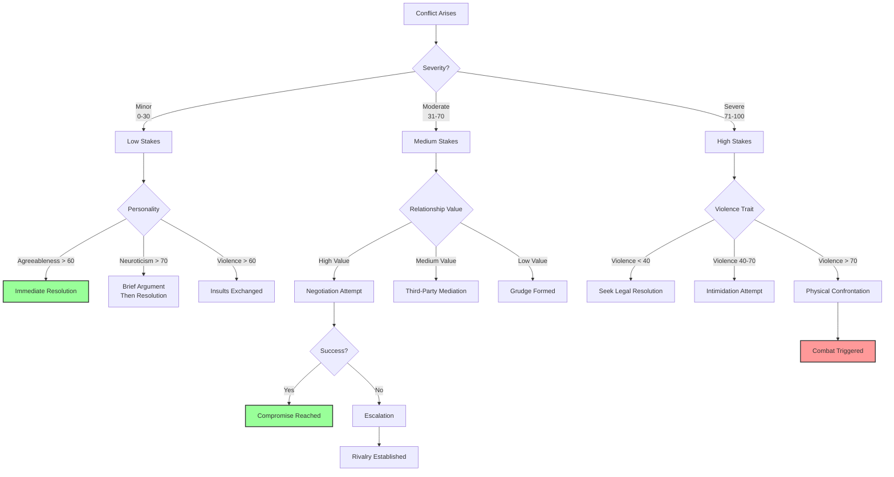
```mermaid
graph TD
    A[Conflict Arises] --> B{Severity?}
    
    B -->|Minor<br/>0-30| C[Low Stakes]
    B -->|Moderate<br/>31-70| D[Medium Stakes]
    B -->|Severe<br/>71-100| E[High Stakes]
    
    C --> F{Personality}
    F -->|Agreeableness > 60| G[Immediate Resolution]
    F -->|Neuroticism > 70| H[Brief Argument<br/>Then Resolution]
    F -->|Violence > 60| I[Insults Exchanged]
    
    D --> J{Relationship Value}
    J -->|High Value| K[Negotiation Attempt]
    J -->|Medium Value| L[Third-Party Mediation]
    J -->|Low Value| M[Grudge Formed]
    
    K --> N{Success?}
    N -->|Yes| O[Compromise Reached]
    N -->|No| P[Escalation]
    
    E --> Q{Violence Trait}
    Q -->|Violence < 40| R[Seek Legal Resolution]
    Q -->|Violence 40-70| S[Intimidation Attempt]
    Q -->|Violence > 70| T[Physical Confrontation]
    
    P --> U[Rivalry Established]
    T --> V[Combat Triggered]
    
    style G fill:#9f9,stroke:#333,stroke-width:2px
    style O fill:#9f9,stroke:#333,stroke-width:2px
    style V fill:#f99,stroke:#333,stroke-width:2px
```

**Conflict Resolution Algorithm:**

```csharp
public class ConflictResolution
{
    public ConflictOutcome ResolveConflict(Agent agentA, Agent agentB, Conflict conflict)
    {
        // Calculate resolution probability
        float resolutionChance = CalculateResolutionChance(agentA, agentB, conflict);
        
        // Determine resolution approach
        ResolutionApproach approach = SelectApproach(agentA, agentB, conflict);
        
        // Attempt resolution
        if (agentA.random.Range(0.0f, 1.0f) < resolutionChance)
        {
            // Success - apply resolution
            ApplyResolution(agentA, agentB, conflict, approach);
            return ConflictOutcome.Resolved;
        }
        else
        {
            // Failure - escalate
            EscalateConflict(agentA, agentB, conflict);
            return ConflictOutcome.Escalated;
        }
    }
    
    private float CalculateResolutionChance(Agent agentA, Agent agentB, Conflict conflict)
    {
        float chance = 0.5f; // Base 50%
        
        // Personality factors
        float avgAgreeableness = (agentA.profile.traits.agreeableness + agentB.profile.traits.agreeableness) / 2.0f;
        chance += (avgAgreeableness - 50) * 0.01f; // +/- 0.5 based on agreeableness
        
        // Relationship value
        var relationship = agentA.social.GetRelationship(agentB.id);
        if (relationship != null)
        {
            chance += relationship.value * 0.3f; // Up to +30% for valuable relationships
        }
        
        // Conflict severity (harder to resolve severe conflicts)
        chance -= conflict.severity * 0.003f; // Up to -30% for severe conflicts
        
        // Time factor (cooling off period helps)
        if (conflict.hoursSinceStart > 24)
        {
            chance += 0.1f; // +10% after a day
        }
        
        // Third party available?
        if (FindMediator(agentA, agentB) != null)
        {
            chance += 0.15f; // +15% with mediator
        }
        
        return Math.Clamp(chance, 0.05f, 0.95f); // Never guaranteed
    }
    
    private void ApplyResolution(Agent agentA, Agent agentB, Conflict conflict, ResolutionApproach approach)
    {
        switch (approach)
        {
            case ResolutionApproach.Apology:
                // Agent with higher fault apologizes
                var apologizer = (conflict.faultRatio > 0.5f) ? agentA : agentB;
                var recipient = (apologizer == agentA) ? agentB : agentA;
                
                recipient.memory.AddToShortTerm(new Memory(
                    $"Received sincere apology from {apologizer.name}",
                    emotionalValence: 40,
                    importance: 60
                ));
                
                // Restore trust
                var relationship = recipient.social.GetRelationship(apologizer.id);
                relationship.trust += 15.0f;
                break;
                
            case ResolutionApproach.Compromise:
                // Both agents give something up
                float agentASacrifice = conflict.stakes * conflict.faultRatio;
                float agentBSacrifice = conflict.stakes * (1 - conflict.faultRatio);
                
                ApplySacrifice(agentA, agentASacrifice);
                ApplySacrifice(agentB, agentBSacrifice);
                
                // Create compromise memory
                agentA.memory.AddToShortTerm(new Memory(
                    $"Reached compromise with {agentB.name}",
                    emotionalValence: 20,
                    importance: 50
                ));
                break;
                
            case ResolutionApproach.Mediation:
                var mediator = FindMediator(agentA, agentB);
                float mediatorAuthority = mediator.social.reputation / 100.0f;
                
                // Mediated solutions accepted based on mediator respect
                if (agentA.random.Range(0.0f, 1.0f) < mediatorAuthority)
                {
                    ApplyMediatedSolution(agentA, agentB, conflict, mediator);
                }
                break;
        }
        
        // Clear conflict
        agentA.social.RemoveConflict(agentB.id);
        agentB.social.RemoveConflict(agentA.id);
    }
}
```

#### Social Event Participation

Agents decide whether to attend social events based on event type, their social needs, and practical considerations.

**Event Participation Decision:**

```csharp
public class EventParticipation
{
    public bool WillAttendEvent(Agent agent, SocialEvent socialEvent)
    {
        // Calculate attendance score
        float attendanceScore = 0.0f;
        
        // Base interest in event type
        float typeInterest = GetEventTypeInterest(agent, socialEvent.type);
        attendanceScore += typeInterest * 0.25f;
        
        // Social need level
        float socialNeed = agent.considerations["Social"].GetValue();
        attendanceScore += socialNeed * 0.30f;
        
        // Friends attending (social proof)
        int friendsAttending = CountFriendsAttending(agent, socialEvent);
        attendanceScore += friendsAttending * 5.0f; // +5 per friend
        
        // Cost-benefit analysis
        float cost = CalculateAttendanceCost(agent, socialEvent);
        float benefit = socialEvent.expectedFun + socialEvent.networkingValue;
        float costBenefit = (benefit - cost) / 100.0f;
        attendanceScore += costBenefit * 0.20f;
        
        // Reputation concern
        if (socialEvent.isHighStatus && agent.social.reputation < 50)
        {
            attendanceScore -= 15.0f; // May feel out of place
        }
        
        // Current state
        if (agent.state.energy < 30)
        {
            attendanceScore -= 20.0f; // Too tired
        }
        if (agent.state.stress > 70)
        {
            attendanceScore += 10.0f; // Seeking stress relief
        }
        
        // Obligations
        if (agent.social.HasObligationToAttend(socialEvent))
        {
            attendanceScore += 25.0f;
        }
        
        return attendanceScore > 50.0f;
    }
    
    public void ParticipateInEvent(Agent agent, SocialEvent socialEvent)
    {
        // Event participation provides multiple benefits
        
        // Social need satisfaction
        float satisfaction = socialEvent.funLevel * 0.5f;
        agent.considerations["Social"].Satisfy(satisfaction);
        
        // Stress reduction
        agent.state.stress = Math.Max(0, agent.state.stress - socialEvent.funLevel * 0.3f);
        
        // Meeting new people
        int newAcquaintances = 0;
        var attendees = socialEvent.GetAttendees().Where(a => a != agent);
        foreach (var attendee in attendees)
        {
            if (!agent.social.Knows(attendee.id))
            {
                float compatibility = CalculateCompatibility(agent, attendee);
                if (compatibility > 50 && agent.random.Range(0.0f, 1.0f) < 0.3f)
                {
                    // 30% chance to form acquaintance if compatible
                    agent.social.FormAcquaintance(attendee);
                    newAcquaintances++;
                }
            }
            else
            {
                // Strengthen existing relationships
                var relationship = agent.social.GetRelationship(attendee.id);
                relationship.Interact(quality: socialEvent.funLevel / 2);
            }
        }
        
        // Memory creation
        agent.memory.AddToShortTerm(new Memory(
            $"Attended {socialEvent.name}, met {newAcquaintances} new people",
            emotionalValence: (sbyte)(socialEvent.funLevel / 2),
            importance: (byte)(60 + newAcquaintances * 5)
        ));
        
        // Skill gains
        if (socialEvent.type == EventType.Dance || socialEvent.type == EventType.Festival)
        {
            agent.skills.Improve(SkillType.Social, amount: 0.5f);
        }
    }
}
```

**Event Types and Agent Preferences:**

| Event Type | Interest Base | Gregariousness Bonus | Extraversion Bonus | Energy Cost |
|------------|--------------|---------------------|-------------------|-------------|
| Market Festival | 60 | +20 | +10 | Medium |
| Political Rally | 40 | +5 | +25 | Low |
| Art Exhibition | 50 | +0 | +15 | Low |
| Music Concert | 70 | +30 | +20 | High |
| Religious Ceremony | 45 | +10 | +0 | Low |
| Sports Tournament | 55 | +25 | +30 | High |
| Business Networking | 35 | +10 | +20 | Medium |
| Community Meeting | 50 | +15 | +10 | Low |

---

## 7. Population Elasticity System

### Elasticity Metrics

The population elasticity system continuously monitors four key metrics to determine when to spawn or despawn agents, ensuring the world feels alive without overwhelming computational resources.

#### Economic Velocity

Economic velocity measures the rate of economic transactions and activity in the world, indicating whether the economy needs more participants.

**Economic Velocity Calculation:**

```csharp
public class EconomicVelocityMetric
{
    public float currentVelocity; // 0.0 - 100.0 (percentage of baseline)
    public float baselineVelocity; // Expected transactions per day
    public Queue<float> velocityHistory; // Last 7 days
    
    public void CalculateVelocity(World world)
    {
        // Count transactions in last 24 hours
        int transactionCount = world.economy.GetTransactionCount(hours: 24);
        
        // Calculate value-weighted velocity
        float totalValue = world.economy.GetTransactionValue(hours: 24);
        float valueVelocity = (totalValue / baselineVelocity) * 100.0f;
        
        // Count active economic agents
        int activeTraders = world.agents.Count(a => a.economy.recentTransactions.Count > 0);
        float participationRate = (float)activeTraders / world.agents.Count * 100.0f;
        
        // Composite velocity score
        currentVelocity = (valueVelocity * 0.6f) + (participationRate * 0.4f);
        
        // Update history
        velocityHistory.Enqueue(currentVelocity);
        if (velocityHistory.Count > 7)
            velocityHistory.Dequeue();
    }
    
    public float GetAverageVelocity(int days = 3)
    {
        return velocityHistory.Take(days).Average();
    }
    
    public bool IsLowVelocity()
    {
        return GetAverageVelocity() < 50.0f; // Below 50% baseline
    }
    
    public bool IsHighVelocity()
    {
        return GetAverageVelocity() > 150.0f; // Above 150% baseline
    }
}
```

**Velocity Components:**

| Component | Weight | Measurement | Low Threshold | High Threshold |
|-----------|--------|-------------|---------------|----------------|
| Transaction Volume | 40% | Credits exchanged/day | < 40% baseline | > 160% baseline |
| Transaction Count | 30% | Number of trades/day | < 30% baseline | > 170% baseline |
| Active Agents | 20% | % agents trading | < 25% | > 80% |
| Market Listings | 10% | New listings/day | < 20% baseline | > 180% baseline |

#### Labor Gap Analysis

Labor gaps identify unfilled jobs and skill shortages that indicate a need for new agents with specific professions.

**Labor Gap Calculation:**

```csharp
public class LaborGapAnalyzer
{
    public Dictionary<Profession, LaborGap> laborGaps;
    
    public void AnalyzeLaborGaps(World world)
    {
        laborGaps.Clear();
        
        foreach (var profession in Enum.GetValues<Profession>())
        {
            // Count current workers
            int currentWorkers = world.agents.Count(a => a.career.profession == profession && a.career.isEmployed);
            
            // Calculate demand based on population and economy
            int requiredWorkers = CalculateRequiredWorkers(profession, world);
            
            // Calculate gap
            int gap = requiredWorkers - currentWorkers;
            
            // Calculate urgency based on unmet demand
            float urgency = 0.0f;
            if (gap > 0)
            {
                // Check for unfilled job postings
                int unfilledJobs = world.jobs.Count(j => j.profession == profession && !j.isFilled);
                
                // Check for service shortages (e.g., no food available)
                float serviceShortage = CalculateServiceShortage(profession, world);
                
                urgency = (gap * 10.0f) + (unfilledJobs * 5.0f) + (serviceShortage * 20.0f);
            }
            
            laborGaps[profession] = new LaborGap
            {
                profession = profession,
                currentWorkers = currentWorkers,
                requiredWorkers = requiredWorkers,
                gap = gap,
                urgency = urgency
            };
        }
    }
    
    private int CalculateRequiredWorkers(Profession profession, World world)
    {
        int population = world.agents.Count;
        
        // Base requirements per population size
        return profession switch
        {
            Profession.Farmer => Math.Max(1, population / 5), // 1 farmer per 5 people
            Profession.Merchant => Math.Max(1, population / 8),
            Profession.Blacksmith => Math.Max(1, population / 15),
            Profession.Carpenter => Math.Max(1, population / 12),
            Profession.Miner => Math.Max(1, population / 10),
            Profession.Cook => Math.Max(1, population / 6),
            Profession.Healer => Math.Max(1, population / 20),
            Profession.Guard => Math.Max(1, population / 25),
            Profession.Artisan => Math.Max(1, population / 18),
            _ => 0
        };
    }
    
    public List<LaborGap> GetCriticalGaps()
    {
        return laborGaps.Values
            .Where(g => g.gap > 0 && g.urgency > 30.0f)
            .OrderByDescending(g => g.urgency)
            .ToList();
    }
    
    public int GetTotalLaborGapScore()
    {
        // Sum all critical gaps
        return laborGaps.Values
            .Where(g => g.gap > 0)
            .Sum(g => g.gap);
    }
}
```

**Gap Thresholds:**

| Gap Severity | Unfilled Jobs | Service Impact | Spawn Priority |
|--------------|--------------|----------------|----------------|
| Critical | 5+ | Severe shortage | Immediate |
| High | 3-4 | Noticeable shortage | High |
| Moderate | 1-2 | Minor inconvenience | Medium |
| Low | 0 | None | Low |

#### Geographic Balance

Geographic balance monitors agent distribution across regions to prevent overcrowding in some areas and abandonment in others.

**Geographic Balance Calculation:**

```csharp
public class GeographicBalanceAnalyzer
{
    public Dictionary<Region, RegionBalance> regionBalance;
    
    public void AnalyzeGeographicBalance(World world)
    {
        regionBalance.Clear();
        
        float totalPopulation = world.agents.Count;
        float idealDensity = totalPopulation / world.regions.Count; // Even distribution
        
        foreach (var region in world.regions)
        {
            int agentCount = region.GetAgentCount();
            float currentDensity = agentCount / region.area;
            float densityRatio = currentDensity / (idealDensity / world.regions.Average(r => r.area));
            
            // Calculate balance score (1.0 = perfect, <1 = underpopulated, >1 = overcrowded)
            float balanceScore = 1.0f / densityRatio;
            
            // Check for amenities (agents leave regions without food, shelter, work)
            float amenityScore = CalculateAmenityScore(region);
            
            // Calculate satisfaction (happy agents stay, unhappy ones leave)
            float satisfaction = region.GetAverageAgentSatisfaction();
            
            regionBalance[region] = new RegionBalance
            {
                region = region,
                agentCount = agentCount,
                idealCount = (int)(totalPopulation / world.regions.Count * (region.area / world.totalArea)),
                densityRatio = densityRatio,
                balanceScore = balanceScore,
                amenityScore = amenityScore,
                satisfaction = satisfaction,
                needsAgents = balanceScore > 1.3f && amenityScore > 0.5f,
                overpopulated = densityRatio > 2.0f
            };
        }
    }
    
    private float CalculateAmenityScore(Region region)
    {
        float score = 0.0f;
        
        // Check for essential services
        bool hasFood = region.buildings.Any(b => b.producesFood);
        bool hasShelter = region.buildings.Any(b => b.providesHousing);
        bool hasWork = region.jobs.Any(j => j.isAvailable);
        bool hasWater = region.hasWaterSource;
        
        score += hasFood ? 0.25f : 0.0f;
        score += hasShelter ? 0.25f : 0.0f;
        score += hasWork ? 0.25f : 0.0f;
        score += hasWater ? 0.25f : 0.0f;
        
        return score;
    }
    
    public List<Region> GetRegionsNeedingAgents()
    {
        return regionBalance.Values
            .Where(rb => rb.needsAgents)
            .OrderByDescending(rb => rb.balanceScore)
            .Select(rb => rb.region)
            .ToList();
    }
    
    public List<Region> GetOverpopulatedRegions()
    {
        return regionBalance.Values
            .Where(rb => rb.overpopulated)
            .OrderByDescending(rb => rb.densityRatio)
            .Select(rb => rb.region)
            .ToList();
    }
}
```

**Geographic Distribution Targets:**

| Region Type | Target Density | Max Density | Min Amenities Required |
|-------------|---------------|-------------|----------------------|
| City Center | High (1.5x avg) | 3.0x avg | 3/4 |
| Residential | Medium (1.0x avg) | 2.0x avg | 4/4 |
| Industrial | Medium (0.8x avg) | 1.5x avg | 2/4 |
| Rural | Low (0.5x avg) | 1.0x avg | 2/4 |
| Frontier | Very Low (0.2x avg) | 0.5x avg | 1/4 |

#### Player Activity Monitoring

Player activity tracking ensures agent population aligns with actual player engagement, preventing dead worlds during low activity and overcrowding during peak times.

**Player Activity Tracker:**

```csharp
public class PlayerActivityMonitor
{
    public float currentActivityLevel; // 0.0 - 100.0
    public float averageSessionLength; // Minutes
    public int concurrentPlayers;
    public Queue<float> activityHistory; // Hourly snapshots
    
    public void MonitorActivity(World world)
    {
        // Count active players (logged in within last 5 minutes)
        concurrentPlayers = world.players.Count(p => p.lastActivity > DateTime.Now.AddMinutes(-5));
        
        // Calculate activity based on player actions
        float actionIntensity = 0.0f;
        foreach (var player in world.players.Where(p => p.isOnline))
        {
            // Weight different activity types
            actionIntensity += player.recentActions.Count(a => a.type == ActionType.Combat) * 2.0f;
            actionIntensity += player.recentActions.Count(a => a.type == ActionType.Trading) * 1.5f;
            actionIntensity += player.recentActions.Count(a => a.type == ActionType.Social) * 1.0f;
            actionIntensity += player.recentActions.Count(a => a.type == ActionType.Crafting) * 0.8f;
            actionIntensity += player.recentActions.Count(a => a.type == ActionType.Exploration) * 0.5f;
        }
        
        // Normalize by expected activity level
        float expectedActivity = concurrentPlayers * 10.0f; // 10 actions per player baseline
        currentActivityLevel = (actionIntensity / expectedActivity) * 100.0f;
        
        // Update history
        activityHistory.Enqueue(currentActivityLevel);
        if (activityHistory.Count > 24)
            activityHistory.Dequeue();
    }
    
    public float GetTrend()
    {
        if (activityHistory.Count < 6)
            return 0.0f; // Not enough data
            
        // Compare last 3 hours to previous 3 hours
        float recent = activityHistory.Take(3).Average();
        float previous = activityHistory.Skip(3).Take(3).Average();
        
        return recent - previous; // Positive = increasing, negative = decreasing
    }
    
    public ActivityClassification GetClassification()
    {
        float avgActivity = activityHistory.Average();
        
        if (avgActivity < 20.0f)
            return ActivityClassification.VeryLow;
        else if (avgActivity < 40.0f)
            return ActivityClassification.Low;
        else if (avgActivity < 70.0f)
            return ActivityClassification.Moderate;
        else if (avgActivity < 90.0f)
            return ActivityClassification.High;
        else
            return ActivityClassification.VeryHigh;
    }
    
    public int GetRecommendedPopulation()
    {
        var classification = GetClassification();
        
        return classification switch
        {
            ActivityClassification.VeryLow => 50,   // Minimal population
            ActivityClassification.Low => 75,       // Reduced population
            ActivityClassification.Moderate => 100, // Standard population
            ActivityClassification.High => 125,     // Increased population
            ActivityClassification.VeryHigh => 150, // Maximum population
            _ => 100
        };
    }
}
```

**Activity Level Triggers:**

| Activity Level | Range | Population Adjustment | Spawn Rate | Despawn Rate |
|----------------|-------|---------------------|------------|--------------|
| Very Low | 0-20% | -50% | None | Aggressive |
| Low | 21-40% | -25% | Slow | Moderate |
| Moderate | 41-70% | Baseline | Normal | Low |
| High | 71-90% | +25% | Increased | None |
| Very High | 91-100% | +50% | Aggressive | None |

### Spawn/Despawn Triggers

The population manager uses specific threshold combinations to decide when to add or remove agents from the world.

#### Spawn Triggers

**Primary Spawn Conditions:**

```csharp
public class SpawnTriggerEvaluator
{
    public bool ShouldSpawnAgent(World world)
    {
        var metrics = world.populationMetrics;
        
        // CRITICAL: Economic velocity < 50% AND Labor gaps > 3
        if (metrics.economicVelocity.IsLowVelocity() && 
            metrics.laborGaps.GetTotalLaborGapScore() > 3)
        {
            return true; // Economy needs workers
        }
        
        // HIGH PRIORITY: Geographic imbalance AND Low activity
        var needyRegions = metrics.geographicBalance.GetRegionsNeedingAgents();
        if (needyRegions.Count > 0 && 
            metrics.playerActivity.GetClassification() == ActivityClassification.Moderate)
        {
            return true; // Fill empty regions during active play
        }
        
        // MODERATE: Low player activity AND Below optimal population
        int optimalPopulation = metrics.playerActivity.GetRecommendedPopulation();
        if (world.agents.Count < optimalPopulation * 0.8f &&
            metrics.playerActivity.GetClassification() <= ActivityClassification.Low)
        {
            return true; // Maintain minimum population
        }
        
        // SPECIAL: Critical labor shortage in essential profession
        var criticalGaps = metrics.laborGaps.GetCriticalGaps();
        if (criticalGaps.Any(g => IsEssentialProfession(g.profession)))
        {
            return true; // Always fill essential jobs (food, shelter, medicine)
        }
        
        return false;
    }
    
    private bool IsEssentialProfession(Profession profession)
    {
        return profession == Profession.Farmer ||
               profession == Profession.Cook ||
               profession == Profession.Healer ||
               profession == Profession.Builder;
    }
    
    public SpawnPriority GetSpawnPriority(World world)
    {
        var metrics = world.populationMetrics;
        
        // Calculate urgency score
        float urgency = 0.0f;
        
        // Economic urgency
        if (metrics.economicVelocity.IsLowVelocity())
            urgency += 30.0f;
        
        // Labor urgency
        urgency += Math.Min(metrics.laborGaps.GetTotalLaborGapScore() * 5.0f, 40.0f);
        
        // Geographic urgency
        var needyRegions = metrics.geographicBalance.GetRegionsNeedingAgents();
        urgency += needyRegions.Count * 5.0f;
        
        // Population deficit
        int optimal = metrics.playerActivity.GetRecommendedPopulation();
        float deficit = (optimal - world.agents.Count) / (float)optimal;
        urgency += deficit * 20.0f;
        
        if (urgency > 80.0f)
            return SpawnPriority.Critical;
        else if (urgency > 60.0f)
            return SpawnPriority.High;
        else if (urgency > 40.0f)
            return SpawnPriority.Moderate;
        else
            return SpawnPriority.Low;
    }
}
```

**Spawn Trigger Matrix:**

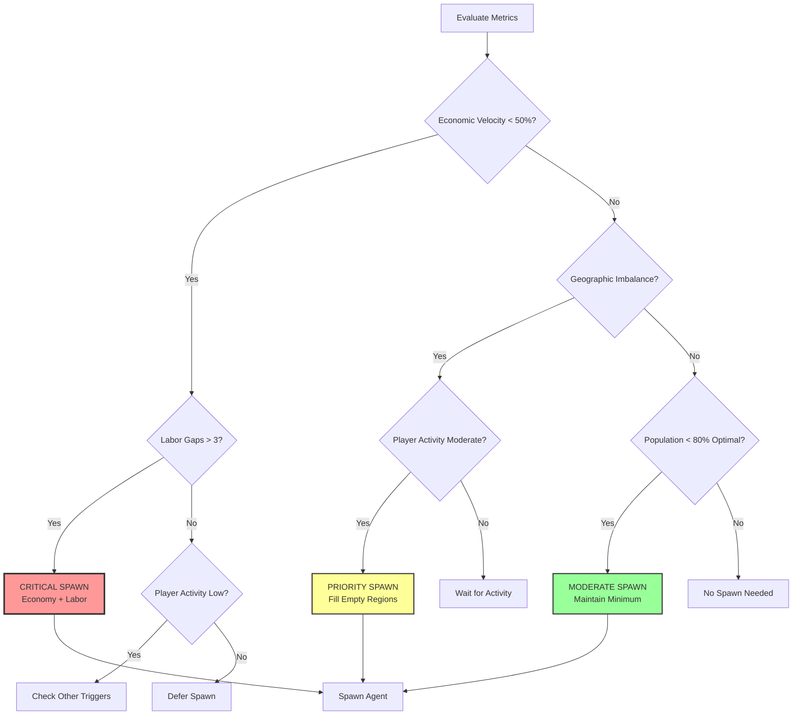
```mermaid
graph TD
    A[Evaluate Metrics] --> B{Economic Velocity < 50%?}
    B -->|Yes| C{Labor Gaps > 3?}
    B -->|No| D{Geographic Imbalance?}
    
    C -->|Yes| E[CRITICAL SPAWN<br/>Economy + Labor]
    C -->|No| F{Player Activity Low?}
    
    D -->|Yes| G{Player Activity Moderate?}
    D -->|No| H{Population < 80% Optimal?}
    
    G -->|Yes| I[PRIORITY SPAWN<br/>Fill Empty Regions]
    G -->|No| J[Wait for Activity]
    
    H -->|Yes| K[MODERATE SPAWN<br/>Maintain Minimum]
    H -->|No| L[No Spawn Needed]
    
    F -->|Yes| M[Check Other Triggers]
    F -->|No| N[Defer Spawn]
    
    E --> O[Spawn Agent]
    I --> O
    K --> O
    
    style E fill:#f99,stroke:#333,stroke-width:3px
    style I fill:#ff9,stroke:#333,stroke-width:2px
    style K fill:#9f9,stroke:#333,stroke-width:2px
```

#### Despawn Triggers

**Primary Despawn Conditions:**

```csharp
public class DespawnTriggerEvaluator
{
    public List<Agent> GetDespawnCandidates(World world)
    {
        var candidates = new List<Agent>();
        var metrics = world.populationMetrics;
        
        // PRIMARY: High player activity AND Above optimal population
        int optimalPopulation = metrics.playerActivity.GetRecommendedPopulation();
        if (world.agents.Count > optimalPopulation * 1.2f &&
            metrics.playerActivity.GetClassification() >= ActivityClassification.High)
        {
            // Find excess agents to remove
            int excessCount = world.agents.Count - optimalPopulation;
            var removableAgents = FindRemovableAgents(world, excessCount);
            candidates.AddRange(removableAgents);
        }
        
        // SECONDARY: Overpopulated regions
        var overpopulatedRegions = metrics.geographicBalance.GetOverpopulatedRegions();
        foreach (var region in overpopulatedRegions)
        {
            var excessAgents = region.GetAgents()
                .Where(a => CanDespawn(a))
                .OrderBy(a => a.social.reputation) // Remove least important first
                .Take(region.agentCount - region.idealCount);
            
            candidates.AddRange(excessAgents);
        }
        
        // TERTIARY: Very low activity (aggressive reduction)
        if (metrics.playerActivity.GetClassification() == ActivityClassification.VeryLow)
        {
            var removableAgents = world.agents
                .Where(a => CanDespawn(a) && !IsEssential(a))
                .OrderBy(a => CalculateAgentImportance(a))
                .Take(world.agents.Count - 50); // Reduce to minimum 50
            
            candidates.AddRange(removableAgents);
        }
        
        return candidates.Distinct().ToList();
    }
    
    private bool CanDespawn(Agent agent)
    {
        // Don't despawn if:
        if (agent.state.currentState == StateType.InCombat)
            return false; // In active combat
            
        if (agent.social.HasActiveRelationshipsWithPlayer())
            return false; // Player knows this agent personally
            
        if (agent.economy.HasActiveContracts())
            return false; // Has business obligations
            
        if (agent.memory.HasRecentImportantMemories(hours: 24))
            return false; // Recently did something significant
            
        if (agent.isCriticalNPC)
            return false; // Plot-critical character
            
        if (agent.social.reputation > 80)
            return false; // Very important community member
            
        // Can despawn if:
        if (agent.state.currentState == StateType.Dormant)
            return true; // Already dormant
            
        if (agent.timeSinceLastPlayerInteraction > TimeSpan.FromHours(2))
            return true; // No player contact for 2+ hours
            
        if (agent.dissatisfaction > 70)
            return true; // Already wants to leave
            
        return false;
    }
    
    private bool IsEssential(Agent agent)
    {
        // Essential if fills critical labor gap
        var gap = world.populationMetrics.laborGaps.GetGap(agent.career.profession);
        return gap != null && gap.gap > 0;
    }
    
    private float CalculateAgentImportance(Agent agent)
    {
        float importance = 0.0f;
        
        // Reputation score
        importance += agent.social.reputation;
        
        // Relationship network size
        importance += agent.social.relationships.Count * 2.0f;
        
        // Economic contribution
        importance += agent.economy.GetRecentTransactionValue(days: 7) / 10.0f;
        
        // Job criticality
        if (IsEssential(agent))
            importance += 50.0f;
        
        // Recent player interaction
        if (agent.timeSinceLastPlayerInteraction < TimeSpan.FromHours(1))
            importance += 30.0f;
        
        return importance;
    }
}
```

**Despawn Selection Priority (Lowest Importance First):**

1. **Dormant agents** (no processing, safe to remove)
2. **Low reputation** (not important to community)
3. **No player contact** (2+ hours since interaction)
4. **High dissatisfaction** (already wants to leave)
5. **No active relationships** (won't be missed)
6. **Redundant profession** (not filling labor gap)

**Despawn Trigger Matrix:**

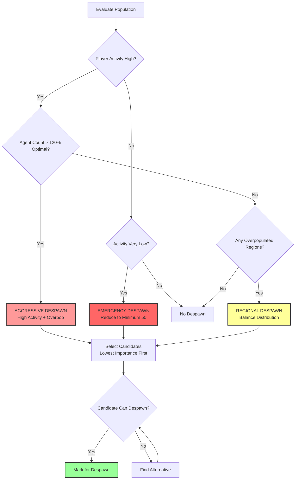
```mermaid
graph TD
    A[Evaluate Population] --> B{Player Activity High?}
    B -->|Yes| C{Agent Count > 120% Optimal?}
    B -->|No| D{Activity Very Low?}
    
    C -->|Yes| E[AGGRESSIVE DESPAWN<br/>High Activity + Overpop]
    C -->|No| F{Any Overpopulated Regions?}
    
    D -->|Yes| G[EMERGENCY DESPAWN<br/>Reduce to Minimum 50]
    D -->|No| H[No Despawn]
    
    F -->|Yes| I[REGIONAL DESPAWN<br/>Balance Distribution]
    F -->|No| H
    
    E --> J[Select Candidates<br/>Lowest Importance First]
    G --> J
    I --> J
    
    J --> K{Candidate Can Despawn?}
    K -->|Yes| L[Mark for Despawn]
    K -->|No| M[Find Alternative]
    
    M --> K
    
    style E fill:#f99,stroke:#333,stroke-width:3px
    style G fill:#f66,stroke:#333,stroke-width:3px
    style I fill:#ff9,stroke:#333,stroke-width:2px
    style L fill:#9f9,stroke:#333,stroke-width:2px
```

### Agent Lifecycle

Agents progress through distinct lifecycle states, each with different processing requirements and transition triggers.

#### Lifecycle State Machine

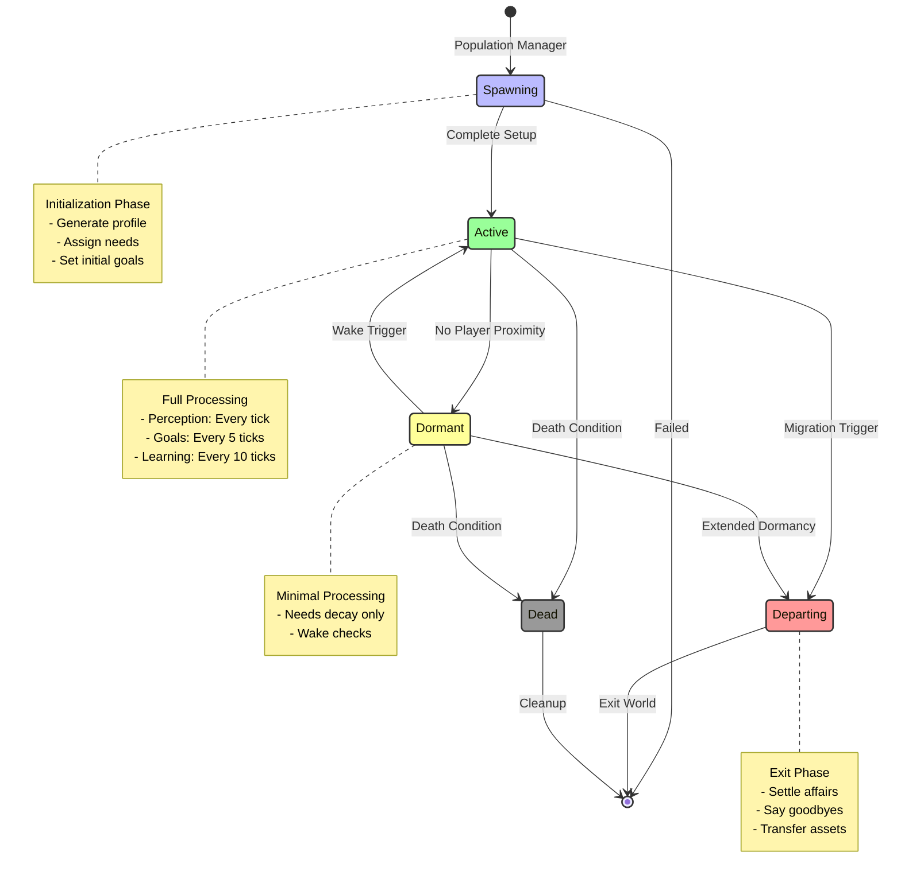
```mermaid
stateDiagram-v2
    [*] --> Spawning: Population Manager
    
    Spawning --> Active: Complete Setup
    Spawning --> [*]: Failed
    
    Active --> Dormant: No Player Proximity
    Active --> Departing: Migration Trigger
    Active --> Dead: Death Condition
    
    Dormant --> Active: Wake Trigger
    Dormant --> Departing: Extended Dormancy
    Dormant --> Dead: Death Condition
    
    Departing --> [*]: Exit World
    
    Dead --> [*]: Cleanup
    
    note right of Spawning
        Initialization Phase
        - Generate profile
        - Assign needs
        - Set initial goals
    end note
    
    note right of Active
        Full Processing
        - Perception: Every tick
        - Goals: Every 5 ticks
        - Learning: Every 10 ticks
    end note
    
    note right of Dormant
        Minimal Processing
        - Needs decay only
        - Wake checks
    end note
    
    note right of Departing
        Exit Phase
        - Settle affairs
        - Say goodbyes
        - Transfer assets
    end note
    
    style Spawning fill:#bbf,stroke:#333,stroke-width:2px
    style Active fill:#9f9,stroke:#333,stroke-width:2px
    style Dormant fill:#ff9,stroke:#333,stroke-width:2px
    style Departing fill:#f99,stroke:#333,stroke-width:2px
    style Dead fill:#999,stroke:#333,stroke-width:2px
```

#### Lifecycle State Definitions

**1. Spawning State**

```csharp
public class SpawningState : AgentState
{
    public override StateType Type => StateType.Spawning;
    
    public override void Enter(Agent agent)
    {
        // Generate agent profile
        agent.profile = profileGenerator.Generate(
            professionPreference: GetNeededProfession(),
            region: GetTargetRegion()
        );
        
        // Initialize starting conditions
        agent.economy.credits = CalculateStartingCredits();
        agent.state.health = 100.0f;
        agent.state.energy = 80.0f;
        agent.state.hunger = 30.0f;
        
        // Set initial goals based on needs
        agent.goals.AddGoal(new SettleInGoal(agent));
        
        // Create arrival memory
        agent.memory.AddToShortTerm(new Memory(
            $"Arrived in {agent.location.region.name} seeking opportunity",
            importance: 80,
            emotionalValence: 30
        ));
        
        // Transition to active after setup
        agent.TransitionToState(new ActiveState());
    }
    
    private Profession GetNeededProfession()
    {
        var criticalGaps = world.populationMetrics.laborGaps.GetCriticalGaps();
        if (criticalGaps.Any())
        {
            // 70% chance to fill critical gap
            if (random.Range(0.0f, 1.0f) < 0.7f)
            {
                return criticalGaps.First().profession;
            }
        }
        
        // Otherwise random profession weighted by demand
        return professionSelector.SelectWeightedByDemand();
    }
}
```

**2. Active State**

```csharp
public class ActiveState : AgentState
{
    public override StateType Type => StateType.Active;
    
    public override void ProcessTick(Agent agent, float deltaTime)
    {
        // Full AI processing
        perceptionSystem.Process(agent);
        memorySystem.Process(agent, deltaTime);
        goalSystem.Evaluate(agent);
        behaviorSystem.Execute(agent, deltaTime);
        learningSystem.Process(agent);
        
        // Check for dormancy transition
        if (ShouldEnterDormancy(agent))
        {
            agent.TransitionToState(new DormantState());
        }
        
        // Check for departure
        if (ShouldDepart(agent))
        {
            agent.TransitionToState(new DepartingState());
        }
    }
    
    private bool ShouldEnterDormancy(Agent agent)
    {
        // No player within 100m
        float nearestPlayer = GetDistanceToNearestPlayer(agent);
        if (nearestPlayer > 100.0f)
        {
            // Check if dormant for 5 minutes
            agent.dormancyTimer += Time.deltaTime;
            if (agent.dormancyTimer > 300.0f) // 5 minutes
            {
                return true;
            }
        }
        else
        {
            agent.dormancyTimer = 0.0f; // Reset timer
        }
        
        return false;
    }
    
    private bool ShouldDepart(Agent agent)
    {
        // Dissatisfaction threshold
        if (agent.dissatisfaction > 85)
        {
            return true;
        }
        
        // Economic failure
        if (agent.economy.credits < 10 && agent.daysWithoutIncome > 7)
        {
            return true;
        }
        
        // Personal tragedy
        if (agent.memory.HasRecentTrauma(days: 30) && agent.profile.traits.emotionalStability < 40)
        {
            return true;
        }
        
        return false;
    }
}
```

**3. Dormant State**

```csharp
public class DormantState : AgentState
{
    public override StateType Type => StateType.Dormant;
    
    private float dormancyDuration = 0.0f;
    private const float MAX_DORMANCY = 1800.0f; // 30 minutes
    
    public override void ProcessTick(Agent agent, float deltaTime)
    {
        // Minimal processing
        
        // Basic needs decay
        agent.state.hunger += deltaTime * 0.05f;
        agent.state.energy -= deltaTime * 0.03f;
        
        // Wake checks (every 5 seconds)
        dormancyDuration += deltaTime;
        
        if (dormancyDuration % 5.0f < deltaTime) // Every 5 seconds
        {
            if (ShouldWake(agent))
            {
                agent.TransitionToState(new ActiveState());
            }
        }
        
        // Extended dormancy leads to departure
        if (dormancyDuration > MAX_DORMANCY)
        {
            agent.TransitionToState(new DepartingState());
        }
    }
    
    private bool ShouldWake(Agent agent)
    {
        // Player proximity
        float nearestPlayer = GetDistanceToNearestPlayer(agent);
        if (nearestPlayer < 30.0f)
        {
            return true;
        }
        
        // Scheduled wake time
        if (agent.schedule.HasScheduledActivity(withinMinutes: 15))
        {
            return true;
        }
        
        // Critical need
        if (agent.state.hunger > 80 || agent.state.energy < 20)
        {
            return true;
        }
        
        // Important event
        if (world.events.HasRelevantEventFor(agent))
        {
            return true;
        }
        
        return false;
    }
}
```

**4. Departing State**

```csharp
public class DepartingState : AgentState
{
    public override StateType Type => StateType.Departing;
    
    private float departureTimer = 0.0f;
    private const float DEPARTURE_TIME = 300.0f; // 5 minutes to wrap up
    
    public override void Enter(Agent agent)
    {
        // Notify relationships
        foreach (var relationship in agent.social.relationships)
        {
            var otherAgent = world.GetAgent(relationship.targetId);
            if (otherAgent != null)
            {
                otherAgent.memory.AddToShortTerm(new Memory(
                    $"{agent.name} announced they are leaving",
                    importance: 60,
                    emotionalValence: (sbyte)(relationship.trust > 50 ? -40 : -10)
                ));
            }
        }
        
        // Settle economic affairs
        agent.economy.SettleAccounts();
        
        // Create departure memory
        agent.memory.AddToShortTerm(new Memory(
            $"Departed {world.name} in search of better opportunities",
            importance: 90,
            emotionalValence: -20
        ));
    }
    
    public override void ProcessTick(Agent agent, float deltaTime)
    {
        departureTimer += deltaTime;
        
        // Walk to exit point
        if (departureTimer < DEPARTURE_TIME)
        {
            agent.behavior.WalkTo(world.GetExitPoint());
        }
        
        // Complete departure
        if (departureTimer >= DEPARTURE_TIME)
        {
            world.RemoveAgent(agent);
            agent.Destroy();
        }
    }
}
```

**5. Dead State**

```csharp
public class DeadState : AgentState
{
    public override StateType Type => StateType.Dead;
    
    public override void Enter(Agent agent)
    {
        // Create death memory for witnesses
        var witnesses = world.GetAgentsInRange(agent.position, 20.0f);
        foreach (var witness in witnesses)
        {
            witness.memory.AddToShortTerm(new Memory(
                $"Witnessed death of {agent.name}",
                importance: 95,
                emotionalValence: -70
            ));
        }
        
        // Handle inheritance
        inheritanceSystem.DistributeAssets(agent);
        
        // Update family relationships
        foreach (var family in agent.social.GetFamily())
        {
            family.OnFamilyMemberDeath(agent);
        }
        
        // Schedule cleanup
        agent.cleanupTimer = 3600.0f; // 1 hour for funeral/loot
    }
    
    public override void ProcessTick(Agent agent, float deltaTime)
    {
        // No AI processing, just cleanup countdown
        agent.cleanupTimer -= deltaTime;
        
        if (agent.cleanupTimer <= 0)
        {
            world.RemoveAgent(agent);
            agent.Destroy();
        }
    }
}
```

#### Migration Decisions

When agents become dissatisfied, they evaluate whether to migrate to a different region or leave the world entirely.

**Migration Decision Algorithm:**

```csharp
public class MigrationDecisionSystem
{
    public MigrationDecision EvaluateMigration(Agent agent)
    {
        // Calculate dissatisfaction factors
        float economicDissatisfaction = CalculateEconomicDissatisfaction(agent);
        float socialDissatisfaction = CalculateSocialDissatisfaction(agent);
        float environmentalDissatisfaction = CalculateEnvironmentalDissatisfaction(agent);
        
        float totalDissatisfaction = 
            economicDissatisfaction * 0.4f + 
            socialDissatisfaction * 0.35f + 
            environmentalDissatisfaction * 0.25f;
        
        // Check if migration threshold reached
        if (totalDissatisfaction < 60.0f)
        {
            return new MigrationDecision { shouldMigrate = false };
        }
        
        // Evaluate migration options
        var options = EvaluateMigrationOptions(agent);
        
        if (options.Any())
        {
            // Select best option
            var bestOption = options.OrderByDescending(o => o.attractiveness).First();
            
            // Calculate migration cost
            float migrationCost = CalculateMigrationCost(agent, bestOption.destination);
            
            // Determine if worth it
            if (bestOption.attractiveness > totalDissatisfaction + migrationCost)
            {
                return new MigrationDecision
                {
                    shouldMigrate = true,
                    destination = bestOption.destination,
                    reason = bestOption.reason,
                    urgency = totalDissatisfaction / 100.0f
                };
            }
        }
        
        // No good options, consider leaving world entirely
        if (totalDissatisfaction > 85)
        {
            return new MigrationDecision
            {
                shouldMigrate = true,
                destination = null, // Leave world
                reason = MigrationReason.TotalDissatisfaction,
                urgency = 1.0f
            };
        }
        
        return new MigrationDecision { shouldMigrate = false };
    }
    
    private float CalculateEconomicDissatisfaction(Agent agent)
    {
        float dissatisfaction = 0.0f;
        
        // Income vs needs
        if (agent.economy.credits < agent.economy.dailyExpenses * 7)
        {
            dissatisfaction += 30.0f;
        }
        
        // Unemployment
        if (agent.career.isUnemployed)
        {
            dissatisfaction += 25.0f;
        }
        
        // Job dissatisfaction
        if (agent.career.satisfaction < 40)
        {
            dissatisfaction += 20.0f;
        }
        
        // Price dissatisfaction (can't afford necessities)
        if (agent.economy.canAffordFood == false)
        {
            dissatisfaction += 40.0f;
        }
        
        return Math.Min(dissatisfaction, 100.0f);
    }
    
    private float CalculateSocialDissatisfaction(Agent agent)
    {
        float dissatisfaction = 0.0f;
        
        // Loneliness
        int friendCount = agent.social.GetFriends().Count;
        int desiredFriends = agent.GetDesiredFriendCount();
        if (friendCount < desiredFriends * 0.5f)
        {
            dissatisfaction += 25.0f;
        }
        
        // Reputation issues
        if (agent.social.reputation < 30)
        {
            dissatisfaction += 20.0f;
        }
        
        // Enemies
        int enemyCount = agent.social.GetEnemies().Count;
        dissatisfaction += enemyCount * 10.0f;
        
        // Social rejection
        if (agent.memory.HasRecentSocialRejection(days: 30))
        {
            dissatisfaction += 15.0f;
        }
        
        return Math.Min(dissatisfaction, 100.0f);
    }
    
    private List<MigrationOption> EvaluateMigrationOptions(Agent agent)
    {
        var options = new List<MigrationOption>();
        
        foreach (var region in world.regions.Where(r => r != agent.location.region))
        {
            float attractiveness = 0.0f;
            var reasons = new List<string>();
            
            // Economic opportunity
            var jobOpportunities = region.GetJobOpenings(agent.career.profession);
            if (jobOpportunities.Any())
            {
                float bestPay = jobOpportunities.Max(j => j.salary);
                if (bestPay > agent.career.currentSalary * 1.2f)
                {
                    attractiveness += 30.0f;
                    reasons.Add($"Better job opportunities ({(bestPay / agent.career.currentSalary - 1) * 100:F0}% higher pay)");
                }
            }
            
            // Lower cost of living
            if (region.costOfLiving < agent.location.region.costOfLiving * 0.8f)
            {
                attractiveness += 15.0f;
                reasons.Add("Lower cost of living");
            }
            
            // Social opportunity (new start)
            if (agent.social.reputation < 40 && region.averageReputation > 50)
            {
                attractiveness += 20.0f;
                reasons.Add("Chance to rebuild reputation");
            }
            
            // Known contacts in region
            int contactsInRegion = agent.social.GetFriendsInRegion(region).Count;
            attractiveness += contactsInRegion * 5.0f;
            if (contactsInRegion > 0)
            {
                reasons.Add($"Has {contactsInRegion} contacts there");
            }
            
            // Amenity quality
            if (region.amenityScore > agent.location.region.amenityScore * 1.2f)
            {
                attractiveness += 10.0f;
                reasons.Add("Better amenities");
            }
            
            if (attractiveness > 30.0f)
            {
                options.Add(new MigrationOption
                {
                    destination = region,
                    attractiveness = attractiveness,
                    reason = string.Join(", ", reasons)
                });
            }
        }
        
        return options;
    }
}
```

**Migration Decision Flow:**

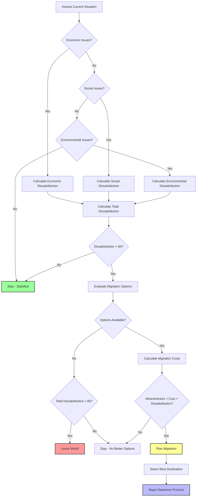
```mermaid
graph TD
    A[Assess Current Situation] --> B{Economic Issues?}
    B -->|Yes| C[Calculate Economic Dissatisfaction]
    B -->|No| D{Social Issues?}
    
    D -->|Yes| E[Calculate Social Dissatisfaction]
    D -->|No| F{Environmental Issues?}
    
    F -->|Yes| G[Calculate Environmental Dissatisfaction]
    F -->|No| H[Stay - Satisfied]
    
    C --> I[Calculate Total Dissatisfaction]
    E --> I
    G --> I
    
    I --> J{Dissatisfaction > 60?}
    J -->|No| H
    J -->|Yes| K[Evaluate Migration Options]
    
    K --> L{Options Available?}
    L -->|Yes| M[Calculate Migration Costs]
    L -->|No| N{Total Dissatisfaction > 85?}
    
    N -->|Yes| O[Leave World]
    N -->|No| P[Stay - No Better Options]
    
    M --> Q{Attractiveness > Cost + Dissatisfaction?}
    Q -->|Yes| R[Plan Migration]
    Q -->|No| P
    
    R --> S[Select Best Destination]
    S --> T[Begin Departure Process]
    
    style H fill:#9f9,stroke:#333,stroke-width:2px
    style O fill:#f99,stroke:#333,stroke-width:2px
    style R fill:#ff9,stroke:#333,stroke-width:2px
    style T fill:#bbf,stroke:#333,stroke-width:2px
```

---

## 8. Personality & Diversity System

### Personality Model (Big Five/OCEAN + Extended Facets)

The personality system combines the established Big Five (OCEAN) model with game-relevant traits to create 15-20 distinct facets that drive agent behavior. Each trait is stored as a byte (0-100) for memory efficiency and generates diverse, believable agent populations.

#### Complete Trait Inventory (19 Facets)

**Core 5 - Primary Behavioral Drivers:**

| Trait | Range | Description | Game Impact |
|-------|-------|-------------|-------------|
| **Gregariousness** | 0-100 | Desire for social interaction | Social need activation frequency, friendship capacity |
| **Work Ethic** | 0-100 | Dedication to productive labor | Crafting quality, job persistence, skill growth rate |
| **Violence** | 0-100 | Aggression and physical conflict tendency | Combat initiation, threat response, rivalry escalation |
| **Greed** | 0-100 | Desire for material accumulation | Price expectations, hoarding behavior, risk tolerance |
| **Emotional Stability** | 0-100 | Resilience to stress and setbacks | Stress recovery, trauma recovery, mood volatility |

**Big Five - OCEAN Dimensions:**

| Trait | Range | Low (0-30) | High (70-100) | System Impact |
|-------|-------|-----------|--------------|---------------|
| **Openness** | 0-100 | Traditional, practical | Curious, creative | Career diversity, exploration, adaptability |
| **Conscientiousness** | 0-100 | Spontaneous, casual | Organized, disciplined | Plan completion, inventory management, punctuality |
| **Extraversion** | 0-100 | Reserved, solitary | Outgoing, energetic | Social event participation, status-seeking, influence |
| **Agreeableness** | 0-100 | Competitive, skeptical | Cooperative, trusting | Trade fairness, conflict resolution, faction loyalty |
| **Neuroticism** | 0-100 | Calm, stable | Anxious, reactive | Stress generation, safety prioritization, mood swings |

**Secondary 9 - Nuanced Behavioral Modifiers:**

| Trait | Range | Description | Behavioral Manifestation |
|-------|-------|-------------|------------------------|
| **Bravery** | 0-100 | Willingness to face danger vs. seek safety | Exploration range, combat participation, risk-taking |
| **Altruism** | 0-100 | Concern for others' welfare | Helping behaviors, charity, sacrifice for others |
| **Excitement-Seeking** | 0-100 | Desire for novelty and stimulation | Travel frequency, dangerous activities, boredom threshold |
| **Tradition** | 0-100 | Respect for customs and established ways | Resistance to change, cultural adherence, generational values |
| **Progressivism** | 0-100 | Desire for reform and advancement | Innovation adoption, political activism, change support |
| **Dominance** | 0-100 | Preference for leadership vs. following | Faction leadership, political ambition, social hierarchy |
| **Orderliness** | 0-100 | Need for structure and tidiness | Home organization, schedule adherence, tool maintenance |
| **Artistic Interest** | 0-100 | Appreciation for beauty and expression | Decorative building, creative professions, aesthetic choices |
| **Cautiousness** | 0-100 | Careful deliberation vs. spontaneity | Decision speed, risk assessment, planning thoroughness |

```mermaid
graph TD
    subgraph "Personality Facets - 19 Total"
        CORE[Core 5]
        BIG5[Big Five - OCEAN]
        SEC[Secondary 9]
        
        CORE --> G[Gregariousness]
        CORE --> WE[Work Ethic]
        CORE --> V[Violence]
        CORE --> GR[Greed]
        CORE --> ES[Emotional Stability]
        
        BIG5 --> O[Openness]
        BIG5 --> C[Conscientiousness]
        BIG5 --> E[Extraversion]
        BIG5 --> A[Agreeableness]
        BIG5 --> N[Neuroticism]
        
        SEC --> B[Bravery]
        SEC --> AL[Altruism]
        SEC --> EX[Excitement-Seeking]
        SEC --> T[Tradition]
        SEC --> P[Progressivism]
        SEC --> D[Dominance]
        SEC --> OR[Orderliness]
        SEC --> AR[Artistic Interest]
        SEC --> CA[Cautiousness]
    end
    
    subgraph "Trait Interactions"
        G -.->|Modulates| SOCIAL[Social System]
        WE -.->|Drives| ECON[Economic System]
        V -.->|Controls| COMBAT[Combat System]
        GR -.->|Shapes| TRADE[Trading System]
        ES -.->|Buffers| STRESS[Stress System]
    end
```

#### Personality Generation Algorithm

Agents are generated with personalities using a **bell curve distribution with species/cultural biases** to create realistic population diversity:

```csharp
public class PersonalityGenerator
{
    // Standard bell curve parameters (mean = 50, std dev = 15)
    private const float BASE_MEAN = 50.0f;
    private const float BASE_STD_DEV = 15.0f;
    
    public PersonalityTraits Generate(AgentTemplate template, Culture culture, Random rng)
    {
        var traits = new PersonalityTraits();
        
        // Generate each trait with normal distribution
        traits.gregariousness = GenerateTraitWithBias(
            template.gregariousnessBias, 
            culture.socialNorm, 
            rng
        );
        
        traits.workEthic = GenerateTraitWithBias(
            template.workEthicBias,
            culture.workCulture,
            rng
        );
        
        traits.violence = GenerateTraitWithBias(
            template.violenceBias,
            culture.conflictStyle,
            rng
        );
        
        traits.greed = GenerateTraitWithBias(
            template.greedBias,
            culture.economicSystem,
            rng
        );
        
        traits.emotionalStability = GenerateTraitWithBias(
            template.stabilityBias,
            0, // No cultural bias for stability
            rng
        );
        
        // Big Five with moderate correlation
        traits.openness = GenerateCorrelatedTrait(
            traits.gregariousness, 0.3f, // Slight correlation
            template.opennessBias,
            rng
        );
        
        traits.conscientiousness = GenerateCorrelatedTrait(
            traits.workEthic, 0.6f, // Strong correlation
            template.conscientiousnessBias,
            rng
        );
        
        traits.extraversion = GenerateCorrelatedTrait(
            traits.gregariousness, 0.7f, // Very strong correlation
            template.extraversionBias,
            rng
        );
        
        traits.agreeableness = GenerateCorrelatedTrait(
            traits.violence, -0.5f, // Inverse correlation
            template.agreeablenessBias,
            rng
        );
        
        traits.neuroticism = GenerateCorrelatedTrait(
            traits.emotionalStability, -0.8f, // Strong inverse
            template.neuroticismBias,
            rng
        );
        
        // Secondary traits with weaker correlations
        traits.bravery = GenerateSecondaryTrait(
            new[] { traits.violence, traits.emotionalStability },
            new[] { 0.4f, 0.3f },
            template.braveryBias,
            rng
        );
        
        traits.altruism = GenerateSecondaryTrait(
            new[] { traits.agreeableness, traits.greed },
            new[] { 0.5f, -0.4f },
            template.altruismBias,
            rng
        );
        
        traits.excitementSeeking = GenerateSecondaryTrait(
            new[] { traits.openness, traits.violence, traits.bravery },
            new[] { 0.4f, 0.3f, 0.3f },
            template.excitementSeekingBias,
            rng
        );
        
        traits.tradition = GenerateSecondaryTrait(
            new[] { traits.openness, traits.age },
            new[] { -0.5f, 0.3f }, // Older = more traditional
            template.traditionBias,
            rng
        );
        
        traits.progressivism = GenerateCorrelatedTrait(
            traits.tradition, -0.6f,
            template.progressivismBias,
            rng
        );
        
        // Pure independent traits
        traits.dominance = GenerateIndependentTrait(template.dominanceBias, rng);
        traits.orderliness = GenerateCorrelatedTrait(traits.conscientiousness, 0.5f, 0, rng);
        traits.artisticInterest = GenerateCorrelatedTrait(traits.openness, 0.6f, 0, rng);
        traits.cautiousness = GenerateCorrelatedTrait(traits.conscientiousness, 0.4f, 0, rng);
        
        return traits;
    }
    
    private byte GenerateTraitWithBias(float bias, float culturalBias, Random rng)
    {
        // Box-Muller transform for normal distribution
        float u1 = rng.NextFloat();
        float u2 = rng.NextFloat();
        float normal = Mathf.Sqrt(-2.0f * Mathf.Log(u1)) * Mathf.Sin(2.0f * Mathf.PI * u2);
        
        // Apply mean shift from biases (each bias point = 2 units shift)
        float mean = BASE_MEAN + (bias * 2.0f) + (culturalBias * 3.0f);
        
        // Calculate final value
        float value = mean + (normal * BASE_STD_DEV);
        
        // Clamp to valid range
        return (byte)Mathf.Clamp(value, 0, 100);
    }
    
    private byte GenerateCorrelatedTrait(byte primaryTrait, float correlation, float bias, Random rng)
    {
        // Start with correlated portion
        float correlatedComponent = (primaryTrait - 50) * correlation;
        
        // Add independent variation (remaining variance)
        float independentVariance = Mathf.Sqrt(1.0f - correlation * correlation) * BASE_STD_DEV;
        float u1 = rng.NextFloat();
        float u2 = rng.NextFloat();
        float normal = Mathf.Sqrt(-2.0f * Mathf.Log(u1)) * Mathf.Sin(2.0f * Mathf.PI * u2);
        float independentComponent = normal * independentVariance;
        
        // Combine and apply bias
        float value = 50 + correlatedComponent + independentComponent + (bias * 2.0f);
        
        return (byte)Mathf.Clamp(value, 0, 100);
    }
    
    private byte GenerateSecondaryTrait(byte[] primaryTraits, float[] weights, float bias, Random rng)
    {
        float weightedSum = 0;
        float totalWeight = 0;
        
        for (int i = 0; i < primaryTraits.Length; i++)
        {
            weightedSum += (primaryTraits[i] - 50) * weights[i];
            totalWeight += Mathf.Abs(weights[i]);
        }
        
        float correlatedComponent = weightedSum / totalWeight;
        
        // Add 30% independent variation
        float u1 = rng.NextFloat();
        float u2 = rng.NextFloat();
        float normal = Mathf.Sqrt(-2.0f * Mathf.Log(u1)) * Mathf.Sin(2.0f * Mathf.PI * u2);
        float independentComponent = normal * BASE_STD_DEV * 0.3f;
        
        float value = 50 + correlatedComponent + independentComponent + (bias * 2.0f);
        
        return (byte)Mathf.Clamp(value, 0, 100);
    }
}
```

**Distribution Characteristics:**
- ~68% of population falls within 35-65 range (1 std dev)
- ~95% of population falls within 20-80 range (2 std dev)
- Only ~5% are extreme (0-20 or 80-100)
- Cultural biases shift means by ±15 points
- Template biases shift means by ±10 points

**Species/Culture Trait Biases:**

| Culture/Species | Gregariousness | Work Ethic | Violence | Greed | Openness | Tradition |
|----------------|----------------|------------|----------|-------|----------|-----------|
| Industrial | -5 | +10 | -5 | +5 | +5 | -10 |
| Agrarian | +5 | +5 | -10 | -5 | -10 | +15 |
| Mercantile | +10 | +5 | -5 | +10 | +5 | -5 |
| Martial | -5 | +5 | +15 | +0 | -5 | +10 |
| Scholarly | -10 | +5 | -15 | -5 | +15 | +5 |
| Nomadic | +5 | -5 | +5 | -5 | +10 | -5 |

#### Trait Impact Matrix

Each trait affects 10+ specific behaviors through weighted multipliers:

**Core 5 Impact Matrix:**

| Trait | Behavior 1 | Behavior 2 | Behavior 3 | Behavior 4 | Behavior 5 | Behavior 6 | Behavior 7 | Behavior 8 | Behavior 9 | Behavior 10 |
|-------|-----------|-----------|-----------|-----------|-----------|-----------|-----------|-----------|-----------|------------|
| **Gregariousness** | Social freq (+40%) | Friend capacity (+30%) | Party attendance (+35%) | Gossip spread (+25%) | Loneliness threshold (-20%) | Conversation length (+20%) | Group work preference (+30%) | Conflict avoidance (+15%) | Event hosting (+25%) | Relationship decay (-15%) |
| **Work Ethic** | Crafting speed (+30%) | Job persistence (+40%) | Skill growth (+35%) | Task completion (+25%) | Quality output (+20%) | Overtime willingness (+30%) | Procrastination (-25%) | Tool maintenance (+20%) | Plan adherence (+25%) | Wealth accumulation (+15%) |
| **Violence** | Combat initiation (+45%) | Threat response (+40%) | Rivalry escalation (+35%) | Criminal behavior (+30%) | Diplomacy (-25%) | Property damage (+20%) | Intimidation use (+30%) | Mercenary work (+25%) | Defense aggression (+35%) | Conflict duration (+20%) |
| **Greed** | Price markup (+30%) | Hoarding (+40%) | Risk tolerance (+25%) | Charity (-35%) | Bargaining effort (+30%) | Quality compromise (+20%) | Investment (+25%) | Debt avoidance (+15%) | Tax evasion (+20%) | Resource competition (+25%) |
| **Emotional Stability** | Stress recovery (+35%) | Trauma impact (-30%) | Mood volatility (-40%) | Decision consistency (+25%) | Panic response (-30%) | Rumination (-25%) | Resilience (+35%) | Optimism (+20%) | Grudge duration (-20%) | Setback recovery (+30%) |

**Big Five Impact Matrix:**

| Trait | Behavior 1 | Behavior 2 | Behavior 3 | Behavior 4 | Behavior 5 | Behavior 6 | Behavior 7 | Behavior 8 | Behavior 9 | Behavior 10 |
|-------|-----------|-----------|-----------|-----------|-----------|-----------|-----------|-----------|-----------|------------|
| **Openness** | Career diversity (+35%) | Exploration range (+30%) | Innovation adoption (+40%) | Routine tolerance (-25%) | Artistic activity (+35%) | Travel frequency (+25%) | Learning speed (+20%) | Creative solutions (+30%) | Tradition adherence (-20%) | Experimentation (+35%) |
| **Conscientiousness** | Plan completion (+40%) | Punctuality (+35%) | Organization (+30%) | Detail attention (+25%) | Promise keeping (+40%) | Health maintenance (+20%) | Financial planning (+25%) | Error rate (-30%) | Preparation (+35%) | Long-term goals (+30%) |
| **Extraversion** | Social event participation (+40%) | Status seeking (+30%) | Group leadership (+35%) | Public speaking (+25%) | Energy from crowds (+30%) | Risk taking (+20%) | Network building (+35%) | Assertiveness (+30%) | Attention seeking (+25%) | Social media use (+30%) |
| **Agreeableness** | Trade fairness (+30%) | Conflict resolution (+35%) | Trust level (+40%) | Competition avoidance (+20%) | Helping behavior (+35%) | Forgiveness (+30%) | Negotiation style (+25%) | Faction loyalty (+20%) | Social harmony (+35%) | Altruistic acts (+30%) |
| **Neuroticism** | Stress generation (+40%) | Safety prioritization (+35%) | Mood swings (+45%) | Complaint frequency (+30%) | Worry duration (+35%) | Sensitivity (+30%) | Risk aversion (+25%) | Health anxiety (+20%) | Catastrophizing (+30%) | Help seeking (+25%) |

**Impact Calculation Formula:**

```csharp
public class TraitImpactCalculator
{
    public float CalculateTraitImpact(byte traitValue, string behavior, ImpactCurve curve)
    {
        // Normalize trait to -1 to +1 range (50 = 0)
        float normalized = (traitValue - 50) / 50.0f;
        
        // Apply response curve
        float curvedValue = curve.Evaluate(normalized);
        
        // Get base impact weight for this behavior
        float weight = GetBehaviorWeight(behavior);
        
        // Calculate final impact multiplier
        // Example: 70 trait = +0.4 normalized = +0.3 curved = +12% impact (at 30% weight)
        float impact = 1.0f + (curvedValue * weight);
        
        return impact;
    }
    
    private float GetBehaviorWeight(string behavior)
    {
        return behavior switch
        {
            "social_frequency" => 0.40f,
            "crafting_speed" => 0.30f,
            "combat_initiation" => 0.45f,
            "price_markup" => 0.30f,
            "stress_recovery" => 0.35f,
            "exploration_range" => 0.30f,
            "plan_completion" => 0.40f,
            "event_participation" => 0.40f,
            "trade_fairness" => 0.30f,
            "mood_stability" => 0.40f,
            _ => 0.25f
        };
    }
}

public enum ImpactCurve
{
    Linear,           // f(x) = x
    Exponential,      // f(x) = x^2 (amplifies extremes)
    Logistic,         // S-curve (moderates extremes)
    Step,             // Binary threshold
    Quadratic         // f(x) = x^2 * sign(x)
}
```

**Combined Trait Effects:**

Certain trait combinations create emergent personality archetypes:

| Archetype | Key Traits | Behavioral Signature | Population % |
|-----------|-----------|---------------------|--------------|
| **The Entrepreneur** | High Greed + High Openness + High Work Ethic | Innovative business creation, risk-taking, wealth building | ~8% |
| **The Diplomat** | High Agreeableness + High Extraversion + Low Violence | Conflict resolution, networking, mediation | ~10% |
| **The Hermit** | Low Gregariousness + High Tradition + High Conscientiousness | Self-sufficient, routine-oriented, avoids crowds | ~6% |
| **The Warrior** | High Violence + High Bravery + Low Agreeableness | Combat-focused, protective, aggressive problem-solving | ~5% |
| **The Artist** | High Openness + High Artistic Interest + Low Conscientiousness | Creative expression, chaotic lifestyle, beauty-focused | ~7% |
| **The Altruist** | High Altruism + High Agreeableness + Low Greed | Charity work, helping others, community service | ~9% |
| **The Rebel** | High Progressivism + High Bravery + Low Tradition | Political activism, challenging norms, innovation | ~6% |
| **The Cautious** | High Cautiousness + High Neuroticism + Low Bravery | Risk-avoidant, safety-focused, slow decision-making | ~8% |

### Value Diversity System

#### Six Political Value Axes

Values represent ideological preferences that influence voting, faction membership, and goal prioritization. Each axis spans -100 to +100, with 0 representing neutral/undecided.

```mermaid
graph LR
    subgraph "Political Value Spectrum"
        ENV[Environmentalism<br/>-100] <-->|Nature vs Economy| IND[Industrialism<br/>+100]
        INDIV[Individualism<br/>-100] <-->|Freedom vs Community| COLL[Collectivism<br/>+100]
        TRAD[Tradition<br/>-100] <-->|Stability vs Change| PROG[Progress<br/>+100]
        LIB[Liberty<br/>-100] <-->|Autonomy vs Order| AUTH[Authority<br/>+100]
        EGAL[Egalitarianism<br/>-100] <-->|Equality vs Excellence| MERIT[Meritocracy<br/>+100]
        LOC[Localism<br/>-100] <-->|Community vs World| GLOB[Globalism<br/>+100]
    end
```

**Axis 1: Environmentalism (-100) ↔ Industrialism (+100)**

| Position | Description | Policy Preferences | Goal Impact |
|----------|-------------|-------------------|-------------|
| -80 to -100 | Radical Environmentalist | Ban resource extraction, nature preservation laws, pollution criminalization | Prioritize conservation over profit; refuse polluting jobs |
| -40 to -79 | Environmentalist | Environmental regulations, sustainable practices, green technology | Prefer eco-friendly careers; support environmental policies |
| -10 to -39 | Mild Environmentalist | Moderate regulations, conservation areas, pollution taxes | Slight preference for green options; vote for mild regulations |
| +10 to +39 | Mild Industrialist | Limited regulations, economic growth focus, resource development | Prefer high-output careers; prioritize efficiency over environment |
| +40 to +79 | Industrialist | Deregulation, industrial expansion, resource extraction | Support industrial policies; maximize production goals |
| +80 to +100 | Radical Industrialist | No environmental laws, maximum extraction, pollution allowed | Ignore environmental consequences; maximize profit above all |

**Generation Correlation:**
```csharp
// Environmentalism derived from:
// + Openness (curiosity about nature)
// - Excitement-seeking (conservative)
// - Greed (profit motive)
// + Age (older = more environmental)
environmentalism = (openness - 50) * 0.8f 
                 + (excitementSeeking - 50) * -0.3f 
                 + (greed - 50) * -1.2f 
                 + (age - 40) * 0.5f
                 + rng.Range(-20, 20);
```

**Axis 2: Individualism (-100) ↔ Collectivism (+100)**

| Position | Economic View | Property Rights | Social View | Goal Prioritization |
|----------|--------------|-----------------|-------------|---------------------|
| -100 | Free market extremist | Absolute private property | Self-reliance | Personal wealth, independence |
| -60 | Free market advocate | Strong property rights | Personal responsibility | Individual success, minimal taxes |
| -20 | Individual-leaning | Property with limits | Balanced | Personal goals + some community |
| +20 | Collective-leaning | Shared resources | Community support | Community participation |
| +60 | Collective advocate | Cooperative ownership | Mutual aid | Group success, shared resources |
| +100 | Collectivist extremist | Common ownership | Collective identity | Collective welfare above self |

**Behavioral Effects:**
- Individualists: Form fewer deep friendships, prioritize personal businesses, resist taxation
- Collectivists: Join factions readily, support welfare policies, prefer cooperative work

**Axis 3: Tradition (-100) ↔ Progress (+100)**

| Position | Attitude to Change | Technology | Social Reform | Goal Duration |
|----------|-------------------|------------|---------------|---------------|
| -100 | Extreme conservative | Reject new tech | Oppose all reform | Long-term, stable goals |
| -60 | Traditionalist | Skeptical of new tech | Gradual reform | Prefer established paths |
| -20 | Moderate conservative | Cautious adoption | Slow change | Mix of old and new |
| +20 | Moderate progressive | Enthusiastic adoption | Moderate reform | Balanced approach |
| +60 | Progressive | Early adopter | Rapid reform | Seek new opportunities |
| +100 | Radical progressive | Immediate adoption | Revolutionary change | Constantly changing goals |

**Direct Trait Mapping:**
- Tradition trait (0-100) = -Tradition axis value
- Progressivism trait (0-100) = +Progress axis value
- Openness trait positively correlates with Progress

**Axis 4: Liberty (-100) ↔ Authority (+100)**

| Position | Law Preference | Governance | Personal Autonomy | Conflict Response |
|----------|---------------|------------|-------------------|-------------------|
| -100 | Anarchist | No government | Absolute freedom | Reject all authority |
| -60 | Libertarian | Minimal government | High autonomy | Resist restrictions |
| -20 | Liberty-leaning | Limited government | Moderate autonomy | Prefer freedom |
| +20 | Authority-leaning | Active government | Some restrictions | Accept necessary rules |
| +60 | Authoritarian | Strong government | Low autonomy | Support strong leadership |
| +100 | Totalitarian | Total government control | No autonomy | Enforce compliance |

**Generation Factors:**
- High Bravery = Liberty (anti-authority stance)
- High Neuroticism = Authority (security-seeking)
- High Conscientiousness = slight Authority (respect for order)
- Victim of crime memory = +20 Authority shift

**Axis 5: Egalitarianism (-100) ↔ Meritocracy (+100)**

| Position | Wealth Distribution | Opportunity | Reward System | Career Perspective |
|----------|-------------------|-------------|---------------|-------------------|
| -100 | Total equality | Guaranteed outcomes | Equal rewards | Disincentivizes effort |
| -60 | Strong redistribution | Equal opportunity focus | Need-based | Supports social safety net |
| -20 | Moderate redistribution | Some equalization | Mixed criteria | Accepts moderate inequality |
| +20 | Limited redistribution | Merit focus | Performance-based | Rewards effort |
| +60 | Minimal redistribution | Pure meritocracy | Achievement-based | Strong performance focus |
| +100 | No redistribution | Winner-takes-all | Market-determined | Extreme competition |

**Economic Correlation:**
- Greed (+) = Meritocracy (+)
- Altruism (+) = Egalitarianism (+)
- Work Ethic (+) = Meritocracy (+)
- Recent economic success = shift toward Meritocracy
- Recent economic failure = shift toward Egalitarianism

**Axis 6: Localism (-100) ↔ Globalism (+100)**

| Position | Trade Policy | Immigration | Infrastructure | Information Focus |
|----------|-------------|-------------|----------------|-------------------|
| -100 | Total isolation | Closed borders | Local only | Ignore outside world |
| -60 | Protectionist | Limited immigration | Regional focus | Local news only |
| -20 | Local preference | Selective immigration | Local priority | Mostly local info |
| +20 | Global preference | Open immigration | Global connections | Balanced info |
| +60 | Free trade | Open borders | Global infrastructure | Global awareness |
| +100 | Total free trade | Unlimited immigration | World-connected | Global citizen |

**Professional Modifiers:**
- Merchants: +20 Globalism (trade-focused)
- Farmers: -15 Globalism (land-focused)
- Scholars: +25 Globalism (knowledge-seeking)
- Craftsmen: -10 Globalism (local production)

#### Value Influence on Goal Priorities

Values modify goal utilities through weighted consideration adjustments:

```csharp
public class ValueGoalModifier
{
    public float ModifyGoalUtility(Agent agent, Goal goal, float baseUtility)
    {
        float valueModifier = 1.0f;
        var values = agent.politicalValues;
        
        // Environmentalism/Industrialism affects economic goals
        if (goal.category == GoalCategory.Economic)
        {
            float envBias = (values.environmentalism + 100) / 200f; // 0-1
            
            if (goal.HasTag("environmentally_friendly"))
            {
                valueModifier += envBias * 0.3f; // Up to +30% for green goals
            }
            else if (goal.HasTag("industrial"))
            {
                valueModifier += (1 - envBias) * 0.25f; // Up to +25% for industrial goals
            }
            else if (goal.HasTag("polluting"))
            {
                valueModifier -= envBias * 0.4f; // Up to -40% for polluting
            }
        }
        
        // Individualism/Collectivism affects social goals
        if (goal.category == GoalCategory.Social)
        {
            float indivBias = (values.individualism + 100) / 200f;
            
            if (goal.HasTag("group_activity"))
            {
                valueModifier += (1 - indivBias) * 0.2f; // Collectivists prefer groups
            }
            else if (goal.HasTag("personal_achievement"))
            {
                valueModifier += indivBias * 0.25f; // Individualists prefer personal goals
            }
        }
        
        // Tradition/Progress affects adoption of new opportunities
        if (goal.HasTag("innovation"))
        {
            float progressBias = (values.progress + 100) / 200f;
            valueModifier += progressBias * 0.35f;
        }
        else if (goal.HasTag("traditional"))
        {
            float traditionBias = (values.tradition + 100) / 200f; // Inverted
            valueModifier += (1 - progressBias) * 0.3f;
        }
        
        // Liberty/Authority affects governance participation
        if (goal.category == GoalCategory.Political)
        {
            float libertyBias = (values.liberty + 100) / 200f;
            
            if (goal.HasTag("anti_authority"))
            {
                valueModifier += libertyBias * 0.4f;
            }
            else if (goal.HasTag("establishment"))
            {
                valueModifier += (1 - libertyBias) * 0.3f;
            }
        }
        
        // Egalitarianism/Meritocracy affects career choices
        if (goal.type == GoalType.CareerAdvancement)
        {
            float egalitarianBias = (values.egalitarianism + 100) / 200f;
            
            // Egalitarians prefer public service, teachers, healers
            // Meritocrats prefer competitive fields, merchants, high-risk/high-reward
            if (goal.profession.category == ProfessionCategory.PublicService)
            {
                valueModifier += egalitarianBias * 0.25f;
            }
            else if (goal.profession.category == ProfessionCategory.Competitive)
            {
                valueModifier += (1 - egalitarianBias) * 0.2f;
            }
        }
        
        // Localism/Globalism affects migration and trade
        if (goal.type == GoalType.Migrate)
        {
            float globalismBias = (values.globalism + 100) / 200f;
            valueModifier += globalismBias * 0.3f; // Globalists more willing to migrate
        }
        
        if (goal.type == GoalType.Trade)
        {
            float globalismBias = (values.globalism + 100) / 200f;
            
            if (goal.tradeScope == TradeScope.LongDistance)
            {
                valueModifier += globalismBias * 0.25f;
            }
            else if (goal.tradeScope == TradeScope.Local)
            {
                valueModifier += (1 - globalismBias) * 0.2f;
            }
        }
        
        return baseUtility * valueModifier;
    }
}
```

#### Value-Based Voting Decision Matrix

Values directly translate to voting behavior through position matching:

| Policy Type | Environmentalism Vote | Individualism Vote | Tradition Vote | Liberty Vote | Egalitarian Vote | Localism Vote |
|------------|---------------------|-------------------|---------------|-------------|-----------------|--------------|
| **Environmental Regulation** | Strong For (-60 to -100) | Against (restricts business) | Slight For (preservation) | Against (govt power) | Neutral | Neutral |
| **Tax Increase for Welfare** | Neutral | Strong Against | Neutral | Against | Strong For | Slight Against (local taxes) |
| **New Technology Adoption** | Neutral/Slight Against | For (innovation) | Strong Against | Neutral | Neutral | Neutral |
| **Stronger Law Enforcement** | Neutral | Against | For (order) | Strong Against | Slight For (protects weak) | For (community safety) |
| **Free Trade Agreement** | Slight Against | Strong For | Against | For | Against (exploitation) | Strong Against |
| **Open Immigration** | Neutral | For (freedom of movement) | Against | For | For (opportunity) | Strong Against |
| **Public Education Funding** | Neutral | Against (taxes) | For (community) | Against | Strong For | For (local schools) |
| **Business Deregulation** | Strong Against | Strong For | Neutral | For | Strong Against | Neutral |

**Vote Calculation Formula:**

```csharp
public float CalculateValueVoteScore(Agent agent, Policy policy)
{
    float score = 0.5f; // Neutral baseline
    var values = agent.politicalValues;
    
    foreach (var implication in policy.valueImplications)
    {
        ValueAxis axis = implication.Key;
        float policyPosition = implication.Value; // -1.0 to +1.0
        float agentPosition = values.GetPosition(axis) / 100f; // -1.0 to +1.0
        float axisImportance = values.GetImportance(axis); // 0.0 to 1.0
        
        // Calculate alignment (1.0 = perfect match, 0.0 = opposite)
        float alignment = 1.0f - Math.Abs(agentPosition - policyPosition) / 2f;
        
        // Weight by importance
        float weightedAlignment = alignment * axisImportance;
        
        // Add to score (normalize to 0-1)
        score += weightedAlignment * 0.1f;
    }
    
    // Personality modifiers
    if (agent.traits.openness > 70 && policy.HasTag("progressive"))
    {
        score += 0.05f;
    }
    
    if (agent.traits.tradition > 70 && policy.HasTag("traditional"))
    {
        score += 0.08f;
    }
    
    return Mathf.Clamp01(score);
}
```

**Value Drift Over Time:**

Values slowly shift based on life experiences at a rate of ±0.5 to ±2.0 points per significant event:

| Experience | Environmentalism | Individualism | Tradition | Liberty | Egalitarianism | Localism |
|-----------|-----------------|---------------|-----------|---------|---------------|----------|
| Business success | -1 (profit focus) | +2 | 0 | 0 | -2 (self-made) | 0 |
| Business failure | +1 (resource scarcity) | -2 (need help) | 0 | 0 | +2 (need support) | 0 |
| Crime victim | 0 | 0 | +1 | -3 (want protection) | +1 | +2 |
| Natural disaster | +3 (nature's power) | -1 (community help) | +1 | -1 | +2 (shared suffering) | +1 |
| Economic boom | -2 (industry growth) | +2 | 0 | 0 | -2 (merit rewarded) | -1 |
| Economic depression | +2 (sustainability) | -3 (need community) | +1 | -1 | +3 (inequality visible) | +2 |
| War/conflict | +1 (destruction) | -2 (unity needed) | +2 | -4 (security) | +1 | +3 |
| Scientific discovery | -1 (tech solution) | +1 | -3 (old ways wrong) | 0 | 0 | -1 |
| Community support | +1 | -3 (interdependence) | +2 | -1 | +2 | +3 |
| Political participation | 0 | +1 | 0 | +2 | +1 | 0 |

---

## 9. Emergent Narrative System

The emergent narrative system transforms AI agent behavior into discoverable stories that players can uncover through various information channels. Unlike scripted narratives, these stories emerge organically from agent interactions, goals, successes, and failures.

### Information Discovery Channels

```mermaid
graph TB
    subgraph "Narrative Sources"
        A[Direct Observation] --> N[Player Knowledge]
        B[Conversations] --> N
        C[Market Activity] --> N
        D[Gossip/Chatter] --> N
        E[Public Records] --> N
        F[Agent Self-Disclosure] --> N
    end
    
    subgraph "Information Types"
        N --> BIO[Agent Biography<br/>Life History]
        N --> EV[Life Events<br/>Major Moments]
        N --> GOAL[Current Goals<br/>Active Pursuits]
        N --> REL[Relationships<br/>Social Network]
        N --> ECO[Economic Stories<br/>Success/Failure]
        N --> POL[Political Activity<br/>Voting & Factions]
    end
    
    subgraph "Narrative Depth"
        BIO --> L1[Surface<br/>Name, Job, Status]
        BIO --> L2[Personal<br/>History, Trauma, Triumphs]
        BIO --> L3[Intimate<br/>Fears, Dreams, Secrets]
    end
```

### Direct Observation System

Players learn about agents by watching them in the world:

**Observable Behaviors:**

| Behavior | Visual Indicator | Information Revealed | Frequency |
|----------|-----------------|---------------------|-----------|
| **Working** | Tool animation, crafting particles | Profession, skill level, work ethic | Continuous |
| **Trading** | Coin exchange animation, market stall | Economic activity, wealth level | 3-5x/day |
| **Socializing** | Chat bubbles, gesture animations | Relationships, gregariousness | Variable |
| **Conflict** | Combat stance, argument animation | Violence trait, rivalries | Occasional |
| **Celebration** | Emote animations, cheering | Success events, personality | Event-driven |
| **Distress** | Low-health animation, limping | Survival needs, problems | As needed |

**Proximity-Based Discovery:**

```csharp
public class ObservationSystem
{
    // Players automatically observe agents within range
    public void ProcessPlayerObservation(Player player, Agent agent)
    {
        float distance = Vector3.Distance(player.position, agent.position);
        
        if (distance < 10f) // Close range
        {
            // Observe detailed behavior
            ObserveDetailedBehavior(player, agent);
            
            // Learn emotional state
            if (agent.state.stress > 70)
                player.knowledge.Add("Agent appears stressed", VisibilityLevel.CloseRange);
            
            // Observe current action
            if (agent.currentAction != null)
            {
                player.knowledge.AddActionObservation(agent.id, agent.currentAction);
            }
        }
        else if (distance < 50f) // Medium range
        {
            // Observe general activity type
            ObserveGeneralActivity(player, agent);
        }
        else if (distance < 100f) // Long range
        {
            // Only observe major events (combat, celebrations)
            if (agent.state.IsInCombat() || agent.state.IsCelebrating())
            {
                player.knowledge.AddMajorEvent(agent.id, agent.state.currentState);
            }
        }
    }
}
```

**Observation Memory System:**
- Players store observations for 7-30 days
- Repeated observations increase knowledge accuracy
- Contradictory observations create "mystery" narratives
- Important observations trigger notification UI

### Conversation & Information Exchange

**Initiating Conversations:**

Players can approach agents and initiate dialogue, with information quality depending on relationship and agent personality:

```csharp
public class ConversationSystem
{
    public ConversationResult InitiateConversation(Player player, Agent agent)
    {
        // Check if agent is willing to talk
        float willingness = CalculateConversationWillingness(agent, player);
        
        if (willingness < 0.3f)
        {
            return new ConversationResult 
            { 
                success = false, 
                reason = agent.traits.gregariousness < 30 ? "Agent is introverted" : "Agent is busy"
            };
        }
        
        // Determine information depth based on relationship
        var relationship = agent.social.GetPlayerRelationship(player.id);
        InformationDepth maxDepth = relationship?.trust switch
        {
            > 80 => InformationDepth.Intimate,
            > 50 => InformationDepth.Personal,
            > 20 => InformationDepth.Basic,
            _ => InformationDepth.Surface
        };
        
        // Agent shares information based on personality
        var sharedInfo = new List<Information>();
        
        // High extraversion agents share more
        int maxTopics = 2 + (agent.traits.extraversion / 20);
        
        // Select topics based on agent's current priorities
        var relevantMemories = agent.memory.GetMostImportant(5)
            .Where(m => m.depth <= maxDepth);
        
        foreach (var memory in relevantMemories.Take(maxTopics))
        {
            if (agent.random.Range(0f, 1f) < willingness)
            {
                sharedInfo.Add(ConvertMemoryToInformation(memory, agent));
            }
        }
        
        return new ConversationResult 
        { 
            success = true, 
            information = sharedInfo,
            relationshipChange = +5.0f
        };
    }
}
```

**Topic Selection Based on Agent State:**

| Agent State | Likely Topics | Information Value |
|------------|--------------|-------------------|
| **Happy/Successful** | Recent achievements, future plans | High positive valence |
| **Stressed** | Current problems, needs, conflicts | Problem-solving opportunities |
| **Angry** | Grievances, rivalries, complaints | Conflict narratives |
| **Afraid** | Threats, dangers, uncertainties | Safety information |
| **Excited** | Opportunities, discoveries, news | Event information |

### Gossip & Information Spread

**Gossip Propagation Mechanics:**

Information spreads through the social network with degradation and mutation:

```csharp
public class GossipPropagationSystem
{
    public void SpreadGossip(Information info, Agent source, float spreadProbability)
    {
        foreach (var friend in source.social.friends)
        {
            // Calculate probability of sharing
            float shareProb = spreadProbability;
            
            // High gregariousness spreads more
            shareProb += (source.traits.gregariousness - 50) * 0.01f;
            
            // Emotional information spreads faster
            if (Math.Abs(info.emotionalValence) > 50)
                shareProb += 0.2f;
            
            // Recent information spreads more
            float age = (DateTime.Now - info.timestamp).TotalHours;
            shareProb *= Mathf.Exp(-age / 24f);
            
            if (source.random.Range(0f, 1f) < shareProb)
            {
                // Transmit with degradation
                var gossip = info.Clone();
                gossip.accuracy *= 0.95f; // 5% accuracy loss per hop
                gossip.source = InfoSource.Gossip;
                gossip.transmissionHops++;
                
                // Emotional exaggeration
                gossip.emotionalValence *= 1.1f;
                
                friend.memory.AddToShortTerm(gossip);
            }
        }
    }
}
```

**Gossip Quality Degradation:**

| Transmission Hops | Accuracy | Emotional Amplification | Detail Loss |
|------------------|---------|------------------------| ------------|
| 0 (Original) | 100% | 1.0x | 0% |
| 1 | 95% | 1.1x | 10% |
| 2 | 90% | 1.2x | 20% |
| 3 | 85% | 1.3x | 30% |
| 4+ | 80% | 1.4x | 40%+ |

### Public Records System

**Accessible Records:**

| Record Type | Information Content | Access Level | Update Frequency |
|------------|-------------------|--------------|------------------|
| **Census Data** | Population, demographics, professions | Public | Daily |
| **Market Registry** | Business licenses, shop locations | Public | Weekly |
| **Voting Records** | Election results, turnout | Public | Per election |
| **Achievement Hall** | Notable accomplishments, honors | Public | Event-driven |
| **Property Records** | Land ownership, building permits | Public | Weekly |
| **Criminal Records** | Convictions, punishments | Restricted | As needed |
| **Marriage Records** | Unions, family trees | Public | Event-driven |

**Record Query Interface:**

```csharp
public class PublicRecordsSystem
{
    public RecordSet QueryRecords(RecordQuery query)
    {
        var results = new RecordSet();
        
        switch (query.type)
        {
            case RecordType.AgentHistory:
                results = archive.GetAgentTimeline(query.agentId, query.timeRange);
                break;
                
            case RecordType.EconomicActivity:
                results = market.GetTransactionHistory(query.parameters);
                break;
                
            case RecordType.PoliticalActivity:
                results = government.GetVotingRecord(query.agentId);
                break;
                
            case RecordType.SocialNetwork:
                results = social.GetRelationshipGraph(query.criteria);
                break;
        }
        
        // Apply player knowledge filters
        results = FilterByPlayerKnowledge(results, query.player);
        
        return results;
    }
}
```

### Narrative Event Detection

**Automatic Story Detection:**

The system automatically identifies narrative-worthy events and surfaces them to players:

```csharp
public class NarrativeDetector
{
    public List<NarrativeEvent> DetectNarrativeEvents(World world)
    {
        var events = new List<NarrativeEvent>();
        
        // Rags to riches stories
        var successStories = world.agents
            .Where(a => a.economy.credits > 1000 && a.memory.HasMemoryOfPoverty())
            .Select(a => new NarrativeEvent
            {
                type = NarrativeType.SuccessStory,
                protagonist = a,
                description = $"{a.name} rose from poverty to prosperity",
                significance = CalculateSignificance(a)
            });
        events.AddRange(successStories);
        
        // Feuds and conflicts
        var feuds = world.social.FindActiveFeuds()
            .Select(f => new NarrativeEvent
            {
                type = NarrativeType.Feud,
                protagonist = f.agentA,
                antagonist = f.agentB,
                description = $"Long-standing conflict between {f.agentA.name} and {f.agentB.name}",
                duration = f.duration
            });
        events.AddRange(feuds);
        
        // Political upheavals
        var politicalShifts = world.government.DetectPowerShifts()
            .Select(p => new NarrativeEvent
            {
                type = NarrativeType.PoliticalChange,
                description = $"{p.faction.name} gained influence over {p.policyArea}",
                impact = p.influenceChange
            });
        events.AddRange(politicalShifts);
        
        // Unlikely friendships
        var unlikelyFriendships = world.social.FindUnlikelyFriendships()
            .Select(uf => new NarrativeEvent
            {
                type = NarrativeType.UnlikelyAlliance,
                protagonist = uf.agentA,
                supporting = uf.agentB,
                description = $"Surprising friendship between {uf.agentA.name} and {uf.agentB.name} despite their differences"
            });
        events.AddRange(unlikelyFriendships);
        
        return events.OrderByDescending(e => e.significance).ToList();
    }
}
```

**Narrative Event Types:**

| Event Type | Trigger | Player Notification | Persistence |
|------------|---------|-------------------|-------------|
| **Success Story** | Wealth gain +50% | Toast notification | Added to "Legends" |
| **Tragedy** | Death, bankruptcy, betrayal | Urgent notification | Memorial record |
| **Feud** | Rivalry >70 for >7 days | Gossip notification | Conflict log |
| **Romance** | Relationship formation | Optional notification | Personal record |
| **Political Drama** | Faction conflict, scandal | News notification | History record |
| **Mystery** | Unexplained event | Investigation prompt | Case file |
| **Comeback** | Recovery from failure | Inspirational notification | Success archive |

### Player Knowledge Management

**Knowledge Levels:**

```csharp
public enum KnowledgeDepth
{
    Unknown,           // Never encountered
    NameOnly,          // Know name and visual
    Surface,           // Basic info (job, home, faction)
    Personal,          // History, relationships, goals
    Intimate           // Secrets, fears, true motivations
}

public class PlayerKnowledgeSystem
{
    public void UpdateKnowledge(Player player, Agent agent, Information info)
    {
        var currentKnowledge = player.knowledge.GetLevel(agent.id);
        
        // Information improves knowledge depth
        if (info.depth > currentKnowledge)
        {
            player.knowledge.SetLevel(agent.id, info.depth);
            
            // Notify player of new insight
            if (info.depth == KnowledgeDepth.Intimate)
            {
                ui.ShowDiscoveryNotification($"You learned something personal about {agent.name}");
            }
        }
        
        // Track information sources for credibility
        player.knowledge.AddInformationSource(agent.id, info);
    }
}
```

**Knowledge Persistence:**
- Player knowledge persists across sessions
- Outdated information marked as "possibly inaccurate"
- Contradictory information creates "uncertainty" tags
- Knowledge can be shared between players (with degradation)

### Narrative UI Components

**Agent Directory:**
```
┌─────────────────────────────────────┐
│ AGENT DIRECTORY                     │
├─────────────────────────────────────┤
│ Search: [__________] Filter: [All ▼]│
├─────────────────────────────────────┤
│ ★ Sarah Ironheart                   │
│   Blacksmith | Town Center          │
│   "Looking for rare ore suppliers"  │
│                                     │
│ ★ Tom the Farmer                    │
│   Farmer | Riverside                │
│   ⚠️ Recently robbed                │
│                                     │
│ ★ Marcus Rich                       │
│   Merchant | Market District        │
│   💰 Wealth: Very High              │
└─────────────────────────────────────┘
```

**Life Stories Feed:**
```
┌─────────────────────────────────────┐
│ LIFE STORIES                        │
├─────────────────────────────────────┤
│ TODAY                               │
│ • Sarah defeated a bear             │
│ • Tom and Mary ended their feud     │
│ • New shop opened by John           │
│                                     │
│ THIS WEEK                           │
│ • Marcus became town's richest      │
│ • Political scandal in faction A    │
│ • Wedding: James + Elizabeth        │
└─────────────────────────────────────┘
```

**Relationship Map:**
- Visual graph of agent connections
- Color-coded by relationship type
- Click to see relationship details
- Filter by faction, profession, location

---

## 10. AI Debuggability Architecture

The AI debuggability architecture provides comprehensive tools for developers and designers to understand, analyze, and troubleshoot agent behavior. The system captures decision traces, memory states, goal priorities, and performance metrics to answer the critical question: "Why did this agent do that?"

### Debug System Architecture

```mermaid
graph TB
    subgraph "Data Collection Layer"
        A1[Decision Logger] --> STORE[Debug Database]
        A2[Memory Snapshot] --> STORE
        A3[Goal Tracker] --> STORE
        A4[Performance Monitor] --> STORE
        A5[State Recorder] --> STORE
    end
    
    subgraph "Analysis Layer"
        STORE --> B1[Decision Analyzer]
        STORE --> B2[Pattern Detector]
        STORE --> B3[Performance Profiler]
        STORE --> B4[Regression Tester]
    end
    
    subgraph "Visualization Layer"
        B1 --> C1[Decision Tree Viewer]
        B2 --> C2[Behavior Heatmaps]
        B3 --> C3[Performance Dashboard]
        B4 --> C4[Diff Visualizer]
    end
    
    subgraph "Developer Interface"
        C1 --> D[Debug Console]
        C2 --> D
        C3 --> D
        C4 --> D
    end
```

### Decision Tracing System

**Trace Data Structure:**

Every agent decision is logged with complete context:

```csharp
public class DecisionTrace
{
    public Guid agentId;
    public DateTime timestamp;
    public int tickNumber;
    public float tickBudgetMs;
    
    // Current state
    public AgentStateSnapshot state;
    public GoalSystemSnapshot goals;
    public MemorySystemSnapshot memory;
    
    // Decision inputs
    public List<ConsiderationTrace> considerations;
    public List<ActionTrace> actionOptions;
    
    // Decision output
    public ActionTrace selectedAction;
    public float selectionConfidence;
    public string selectionReason;
    
    // Performance data
    public float decisionTimeMs;
    public int optionsEvaluated;
}

public class ConsiderationTrace
{
    public string considerationName;
    public float rawValue;
    public float curvedValue;
    public float weight;
    public float contribution;
    public string curveType;
    public Dictionary<string, float> inputs;
}

public class ActionTrace
{
    public string actionName;
    public float finalScore;
    public float baseUtility;
    public List<float> considerationScores;
    public bool preconditionsMet;
    public List<string> failedPreconditions;
}
```

**Trace Collection Implementation:**

```csharp
public class DecisionTracer
{
    private CircularBuffer<DecisionTrace> traceBuffer;
    private const int MAX_TRACES_PER_AGENT = 1000;
    
    public void RecordDecision(Agent agent, Goal goal, List<Action> options, Action selected)
    {
        var trace = new DecisionTrace
        {
            agentId = agent.id,
            timestamp = DateTime.Now,
            tickNumber = agent.ticksProcessed,
            tickBudgetMs = agent.tickBudgetMs,
            
            state = CaptureStateSnapshot(agent),
            goals = CaptureGoalSnapshot(agent),
            memory = CaptureMemorySnapshot(agent),
            
            considerations = goal.considerations.Select(c => new ConsiderationTrace
            {
                considerationName = c.name,
                rawValue = c.GetRawValue(agent),
                curvedValue = c.GetCurvedValue(agent),
                weight = c.weight,
                contribution = c.CalculateContribution(agent, goal),
                curveType = c.responseCurve.GetType().Name,
                inputs = c.GetInputValues(agent)
            }).ToList(),
            
            actionOptions = options.Select(a => new ActionTrace
            {
                actionName = a.name,
                finalScore = a.finalScore,
                baseUtility = a.baseUtility,
                considerationScores = a.considerationScores.ToList(),
                preconditionsMet = a.CheckPreconditions(agent),
                failedPreconditions = a.GetFailedPreconditions(agent)
            }).ToList(),
            
            selectedAction = new ActionTrace
            {
                actionName = selected.name,
                finalScore = selected.finalScore,
                baseUtility = selected.baseUtility,
                considerationScores = selected.considerationScores.ToList(),
                preconditionsMet = true,
                failedPreconditions = new List<string>()
            },
            
            selectionConfidence = selected.finalScore / options.Max(o => o.finalScore),
            selectionReason = GenerateSelectionReason(selected, options),
            decisionTimeMs = agent.lastDecisionTimeMs,
            optionsEvaluated = options.Count
        };
        
        traceBuffer.Add(trace);
        
        // Log suspicious decisions for review
        if (trace.selectionConfidence < 0.6f)
        {
            LogWarning($"Low confidence decision by {agent.name}: {selected.name}");
        }
        
        if (trace.decisionTimeMs > 2.0f)
        {
            LogWarning($"Slow decision by {agent.name}: {trace.decisionTimeMs:F2}ms");
        }
    }
}
```

### Memory Inspection Tools

**Memory Browser Interface:**

```csharp
public class MemoryInspector
{
    public MemoryView GetMemoryView(Agent agent, MemoryFilter filter)
    {
        var view = new MemoryView();
        
        // Short-term memories
        view.shortTerm = agent.memory.shortTerm
            .Where(m => filter.Matches(m))
            .Select(m => new MemoryEntry
            {
                type = m.type,
                description = GetMemoryDescription(m),
                importance = m.importance,
                emotionalValence = m.emotionalValence,
                age = (DateTime.Now - m.timestamp).TotalHours,
                strength = CalculateMemoryStrength(m),
                participants = m.participants.Select(p => GetAgentName(p)).ToList(),
                location = m.location,
                isActive = m.active
            })
            .OrderByDescending(m => m.strength)
            .ToList();
        
        // Long-term memories
        view.longTerm = agent.memory.longTerm
            .Where(m => filter.Matches(m))
            .Select(m => new MemoryEntry
            {
                type = m.type,
                description = GetMemoryDescription(m),
                importance = m.importance,
                emotionalValence = m.emotionalValence,
                ageDays = (DateTime.Now - m.timestamp).TotalDays,
                accessCount = m.accessCount,
                isConsolidated = true
            })
            .OrderByDescending(m => m.importance)
            .ToList();
        
        // Core memories (personality-shaping)
        view.core = agent.memory.coreMemories
            .Select(c => new CoreMemoryEntry
            {
                description = GetMemoryDescription(c.base),
                traitChange = c.traitChange,
                revisitCount = c.revisitCount,
                personalityImpact = CalculatePersonalityImpact(c)
            })
            .ToList();
        
        // Beliefs and knowledge
        view.priceBeliefs = agent.economy.priceBeliefs
            .Select(b => new BeliefEntry
            {
                itemName = GetItemName(b.itemId),
                meanPrice = b.meanPrice,
                uncertainty = b.uncertainty,
                confidence = b.confidence,
                observations = b.observationCount,
                lastUpdated = b.lastUpdated
            })
            .ToList();
        
        // Relationship memories
        view.relationships = agent.memory.relationships
            .Select(r => new RelationshipEntry
            {
                otherAgent = GetAgentName(r.otherAgentId),
                trust = r.trust,
                respect = r.respect,
                affection = r.affection,
                recentInteractions = r.GetRecentInteractions(7).Count,
                memorableEvents = r.GetSignificantMemories().Select(GetMemoryDescription).ToList()
            })
            .ToList();
        
        return view;
    }
}
```

**Memory Visualization:**

```
┌──────────────────────────────────────────────────────────────┐
│ MEMORY INSPECTOR - Sarah the Farmer                          │
├──────────────────────────────────────────────────────────────┤
│ [Short-Term] [Long-Term] [Core] [Beliefs] [Relationships]   │
├──────────────────────────────────────────────────────────────┤
│ SHORT-TERM MEMORIES (5 slots)                                │
│                                                              │
│ Slot 1: Ate meal at Tom's tavern (2 hours ago)               │
│   Importance: ████████░░ 80 | Valence: 😊 +20                │
│   Strength: ██████░░░░ 0.62 (will consolidate)               │
│                                                              │
│ Slot 2: Bought wheat from Marcus (4 hours ago)               │
│   Importance: ██████░░░░ 65 | Valence: 😐 +5                 │
│   Participants: Marcus | Price: 12 credits                   │
│                                                              │
│ Slot 3: Fought off wolf (6 hours ago)                        │
│   Importance: ██████████ 95 | Valence: 😰 -40                │
│   ❗ HIGH EMOTION - Strong consolidation candidate           │
│                                                              │
│ Slot 4: [Empty]                                              │
│ Slot 5: [Empty]                                              │
│                                                              │
│ CONSOLIDATION QUEUE (will promote to LTM):                   │
│ • Slot 3 (Wolf fight) - Age: 6h, Accesses: 3                 │
└──────────────────────────────────────────────────────────────┘
```

### Goal Monitoring Dashboard

**Real-Time Goal Tracking:**

```csharp
public class GoalMonitor
{
    public GoalDashboard GetDashboard(Agent agent)
    {
        var dashboard = new GoalDashboard();
        
        // Active goals hierarchy
        dashboard.activeGoals = agent.goals.active.Select(g => new GoalView
        {
            name = g.name,
            category = g.category,
            priority = g.currentPriority,
            urgency = g.urgency,
            satisfaction = g.satisfaction,
            progress = g.GetCompletionPercentage(),
            timeActive = (DateTime.Now - g.startTime).TotalHours,
            isInterruptible = g.interruptible,
            blockedReasons = g.GetBlockedReasons(),
            
            // Detailed considerations
            considerations = g.considerations.Select(c => new ConsiderationView
            {
                name = c.name,
                rawValue = c.GetRawValue(agent),
                curvedValue = c.GetCurvedValue(agent),
                weight = c.weight,
                finalContribution = c.CalculateContribution(agent, g),
                responseCurve = c.responseCurve.GetDebugInfo()
            }).ToList()
        }).OrderByDescending(g => g.priority).ToList();
        
        // Goal history
        dashboard.recentlyCompleted = agent.goals.history
            .Where(g => g.endTime > DateTime.Now.AddDays(-7))
            .Select(g => new CompletedGoalView
            {
                name = g.name,
                duration = (g.endTime - g.startTime).TotalHours,
                outcome = g.outcome,
                finalSatisfaction = g.finalSatisfaction
            })
            .ToList();
        
        // Goal interruptions
        dashboard.interruptions = agent.goals.interruptionLog
            .Select(i => new InterruptionView
            {
                timestamp = i.timestamp,
                interruptedGoal = i.oldGoal.name,
                newGoal = i.newGoal.name,
                reason = i.reason,
                wasResumed = i.wasResumed
            })
            .ToList();
        
        return dashboard;
    }
}
```

**Goal Visualization:**

```
┌──────────────────────────────────────────────────────────────┐
│ GOAL MONITOR - Marcus the Merchant                           │
├──────────────────────────────────────────────────────────────┤
│ CURRENT GOALS (Ranked by Priority)                           │
├──────────────────────────────────────────────────────────────┤
│                                                              │
│ 🎯 1. Maximize Profits (PROSPERITY)                          │
│    Priority: ██████████ 8.9/10                               │
│    Urgency: ██░░░░░░░░ 2.3/10                                │
│    Satisfaction: ████████░░ 68%                              │
│    Active for: 3.5 hours                                     │
│                                                              │
│    CONSIDERATIONS:                                           │
│    ├─ Wealth Need        0.7 → ███░░░░░░░ (Linear) × 1.0 = 0.70│
│    ├─ Greed Trait        0.8 → ████░░░░░░ (Logistic) × 1.2 = 0.96│
│    ├─ Market Opportunity 0.6 → ███░░░░░░░ (Step) × 0.9 = 0.54 │
│    └─ Risk Tolerance     0.5 → ██░░░░░░░░ (Linear) × 0.8 = 0.40│
│    TOTAL: 8.9 (weighted product)                             │
│                                                              │
│ 🎯 2. Maintain Shop Inventory (PROSPERITY)                   │
│    Priority: ██████░░░░░ 6.2/10                               │
│    BLOCKED: Insufficient credits (need 150, have 89)         │
│                                                              │
│ 🎯 3. Build Relationship with Sarah (SOCIAL)                 │
│    Priority: █████░░░░░░ 4.8/10                               │
│    [View Full Details...]                                    │
└──────────────────────────────────────────────────────────────┘
```

### Performance Profiling Tools

**Agent Performance Analytics:**

```csharp
public class PerformanceProfiler
{
    public PerformanceReport GenerateReport(List<Agent> agents, TimeSpan period)
    {
        var report = new PerformanceReport();
        
        // Tick time distribution
        var tickTimes = agents.SelectMany(a => a.performance.tickTimes);
        report.averageTickTime = tickTimes.Average();
        report.maxTickTime = tickTimes.Max();
        report.p95TickTime = CalculatePercentile(tickTimes, 0.95);
        report.p99TickTime = CalculatePercentile(tickTimes, 0.99);
        
        // Agents over budget
        report.agentsOverBudget = agents.Count(a => 
            a.performance.tickTimes.Any(t => t > 2.0f));
        report.totalBudgetViolations = agents.Sum(a => 
            a.performance.tickTimes.Count(t => t > 2.0f));
        
        // System breakdown
        report.systemBreakdown = new Dictionary<string, float>
        {
            ["Perception"] = agents.Average(a => a.performance.perceptionTimeMs),
            ["Memory"] = agents.Average(a => a.performance.memoryTimeMs),
            ["Goals"] = agents.Average(a => a.performance.goalTimeMs),
            ["Planning"] = agents.Average(a => a.performance.planningTimeMs),
            ["Action"] = agents.Average(a => a.performance.actionTimeMs),
            ["Learning"] = agents.Average(a => a.performance.learningTimeMs)
        };
        
        // Hot agents (consistently slow)
        report.hotAgents = agents
            .Where(a => a.performance.averageTickTime > 1.5f)
            .OrderByDescending(a => a.performance.averageTickTime)
            .Take(10)
            .Select(a => new HotAgentInfo
            {
                agentId = a.id,
                agentName = a.name,
                averageTickTime = a.performance.averageTickTime,
                violationCount = a.performance.budgetViolations,
                primarySystem = GetSlowestSystem(a)
            })
            .ToList();
        
        // Memory usage
        report.totalMemoryMB = agents.Sum(a => a.GetMemoryFootprint()) / (1024 * 1024);
        report.averageMemoryKB = agents.Average(a => a.GetMemoryFootprint()) / 1024;
        
        return report;
    }
}
```

**Performance Dashboard:**

```
┌──────────────────────────────────────────────────────────────┐
│ PERFORMANCE DASHBOARD - Last Hour                            │
├──────────────────────────────────────────────────────────────┤
│ OVERALL STATISTICS                                           │
│ Agents: 128 | Active: 95 | Dormant: 33                       │
│                                                              │
│ TICK PERFORMANCE                                             │
│ Average: 0.85ms | P95: 1.42ms | P99: 1.89ms | Max: 2.34ms   │
│                                                              │
│ BUDGET COMPLIANCE                                            │
│ ✅ 118 agents (92%) within 2ms budget                        │
│ ⚠️  10 agents (8%) exceeded budget                           │
│                                                              │
│ SYSTEM BREAKDOWN (Average ms per tick)                       │
│ Perception  ████████████████████░░░░░░ 0.32ms (38%)          │
│ Memory      ██████████░░░░░░░░░░░░░░░░ 0.18ms (21%)          │
│ Goals       ████████░░░░░░░░░░░░░░░░░░ 0.14ms (16%)          │
│ Planning    ██████░░░░░░░░░░░░░░░░░░░░ 0.11ms (13%)          │
│ Action      ████░░░░░░░░░░░░░░░░░░░░░░ 0.07ms (8%)           │
│ Learning    ██░░░░░░░░░░░░░░░░░░░░░░░░ 0.03ms (4%)           │
│                                                              │
│ HOT AGENTS (Over budget)                                     │
│ 1. Sarah_042      2.18ms avg  | 12 violations | Goals        │
│ 2. Marcus_117     2.03ms avg  |  8 violations | Planning     │
│ 3. Tom_089        1.95ms avg  |  5 violations | Memory       │
└──────────────────────────────────────────────────────────────┘
```

### Regression Testing Framework

**Behavioral Regression Detection:**

```csharp
public class RegressionTester
{
    public RegressionReport CompareBehaviors(
        string baselineVersion, 
        string currentVersion, 
        List<TestScenario> scenarios)
    {
        var report = new RegressionReport();
        
        foreach (var scenario in scenarios)
        {
            // Run scenario with baseline AI
            var baselineResult = RunScenario(scenario, baselineVersion);
            
            // Run scenario with current AI
            var currentResult = RunScenario(scenario, currentVersion);
            
            // Compare outcomes
            var comparison = CompareResults(baselineResult, currentResult);
            
            if (comparison.significantDifference)
            {
                report.regressions.Add(new Regression
                {
                    scenario = scenario.name,
                    severity = comparison.differenceMagnitude,
                    baselineBehavior = baselineResult.description,
                    currentBehavior = currentResult.description,
                    decisionDiff = comparison.decisionChanges,
                    metricChanges = comparison.metricDeltas
                });
            }
        }
        
        return report;
    }
    
    private ScenarioResult RunScenario(TestScenario scenario, string aiVersion)
    {
        // Initialize world with scenario parameters
        var world = WorldLoader.LoadScenario(scenario);
        world.SetAIVersion(aiVersion);
        
        // Run for scenario duration
        for (int tick = 0; tick < scenario.durationTicks; tick++)
        {
            world.Tick();
        }
        
        // Collect metrics
        return new ScenarioResult
        {
            finalState = world.CaptureState(),
            agentActions = world.GetActionLog(),
            decisionTraces = world.GetDecisionTraces(),
            metrics = world.GetMetrics(),
            description = GenerateBehaviorDescription(world)
        };
    }
}
```

**Test Scenarios:**

| Scenario | Description | Success Criteria | Regression Threshold |
|----------|-------------|-----------------|---------------------|
| **Survival Crisis** | Agent with 10% hunger, no food | Finds food within 2 hours | >25% increase in time |
| **Economic Opportunity** | Low price detected | Agent buys and resells | >20% decrease in profit |
| **Social Conflict** | Two rival agents meet | Appropriate response | Change in resolution type |
| **Trade Negotiation** | Price disagreement | Successful negotiation | >15% more failed trades |
| **Career Change** | Better job available | Switches careers | <50% of baseline rate |
| **Political Vote** | Election with clear best choice | Votes optimally | >10% incorrect votes |

### Debug Console Commands

**Developer Commands:**

```csharp
public class DebugConsole
{
    // Agent inspection
    [ConsoleCommand("agent.inspect")]
    public void InspectAgent(Guid agentId)
    {
        var agent = World.GetAgent(agentId);
        if (agent == null)
        {
            Debug.LogError($"Agent {agentId} not found");
            return;
        }
        
        var inspector = new AgentInspector();
        var view = inspector.GetFullView(agent);
        DebugUI.ShowInspector(view);
    }
    
    // Force agent action
    [ConsoleCommand("agent.force_action")]
    public void ForceAction(Guid agentId, string actionName)
    {
        var agent = World.GetAgent(agentId);
        var action = ActionRegistry.Get(actionName);
        
        if (agent != null && action != null)
        {
            agent.behavior.ForceAction(action);
            Debug.Log($"Forced {agent.name} to perform {actionName}");
        }
    }
    
    // Set agent state
    [ConsoleCommand("agent.set_state")]
    public void SetState(Guid agentId, string stateType, float value)
    {
        var agent = World.GetAgent(agentId);
        if (agent == null) return;
        
        switch (stateType.ToLower())
        {
            case "hunger":
                agent.state.hunger = value;
                break;
            case "energy":
                agent.state.energy = value;
                break;
            case "health":
                agent.state.health = value;
                break;
            case "credits":
                agent.economy.credits = value;
                break;
            case "stress":
                agent.state.stress = value;
                break;
        }
        
        Debug.Log($"Set {agent.name}'s {stateType} to {value}");
    }
    
    // Inject memory
    [ConsoleCommand("agent.inject_memory")]
    public void InjectMemory(Guid agentId, string memoryType, string description, int importance)
    {
        var agent = World.GetAgent(agentId);
        if (agent == null) return;
        
        var memory = new MemorySlot
        {
            type = Enum.Parse<MemoryType>(memoryType),
            emotionalValence = 0,
            importance = (byte)importance,
            timestamp = DateTime.Now,
            location = agent.position
        };
        
        agent.memory.AddToShortTerm(memory);
        Debug.Log($"Injected memory into {agent.name}: {description}");
    }
    
    // Performance diagnostics
    [ConsoleCommand("perf.profile")]
    public void ProfilePerformance(int duration = 60)
    {
        var profiler = new PerformanceProfiler();
        var agents = World.GetAllAgents();
        
        Debug.Log($"Starting {duration}s performance profile...");
        
        // Collect data
        Thread.Sleep(duration * 1000);
        
        var report = profiler.GenerateReport(agents, TimeSpan.FromSeconds(duration));
        DebugUI.ShowPerformanceReport(report);
    }
    
    // Export decision trace
    [ConsoleCommand("trace.export")]
    public void ExportTrace(Guid agentId, string filename)
    {
        var tracer = DecisionTracer.GetInstance();
        var traces = tracer.GetTraces(agentId);
        
        var json = JsonConvert.SerializeObject(traces, Formatting.Indented);
        File.WriteAllText(filename, json);
        
        Debug.Log($"Exported {traces.Count} decision traces to {filename}");
    }
}
```

### Visualization Tools

**Decision Tree Visualizer:**
- Interactive tree showing all considered actions
- Color-coded by score (green = high, red = low)
- Expandable nodes showing consideration details
- Time-slider to see decision evolution

**Behavior Heatmaps:**
- Spatial visualization of agent activities
- Time-based animation showing movement patterns
- Density maps for social clustering
- Economic activity zones

**Relationship Graph:**
- Force-directed graph of agent relationships
- Edge thickness = relationship strength
- Node color = faction/profession
- Click to expand agent details

**Real-Time Monitoring:**
- Live tick time graphs
- Decision confidence over time
- Goal priority fluctuations
- Memory consolidation events

---

## 11. Experimental Brain Configurations

The experimental brain configurations allow systematic testing of AI behavior under different cognitive constraints. Each configuration manipulates rationality, information quality, social complexity, and goal diversity to isolate the impact of specific cognitive factors on emergent behavior.

### Configuration Overview

```mermaid
graph TB
    subgraph "Brain Configuration Space"
        A[Realistic Brain] -->|Benchmark| B[Optimal Brain]
        A -->|Stress Test| C[Chaotic Brain]
        A -->|Coordination Test| D[Cooperative Brain]
        
        B -->|Compare| METRICS[Testing Metrics]
        C -->|Compare| METRICS
        D -->|Compare| METRICS
    end
    
    subgraph "Dimensions"
        R[Rationality<br/>Decision Quality]
        I[Information<br/>Accuracy/Completeness]
        S[Social Complexity<br/>Relationship Depth]
        G[Goal Diversity<br/>Objective Variance]
    end
    
    A -.->|Bounded| R
    B -.->|High| R
    C -.->|Low| R
    D -.->|Medium| R
```

---

### Configuration 1: Realistic Brain

The **Realistic Brain** represents the baseline intended for production use. It simulates human-like bounded rationality with imperfect information processing, rich social complexity, and diverse individual goals.

#### Rationality Level: Bounded (Human-Like)

**Decision Error Profile:**

| Error Type | Frequency | Magnitude | Cause |
|-----------|-----------|-----------|-------|
| **Calculation Errors** | 5-10% of decisions | ±10-20% utility miscalculation | Cognitive load, complexity |
| **Heuristic Bias** | 15-25% of decisions | Override optimal choice | Availability bias, anchoring |
| **Emotional Interference** | 10-15% of decisions | Utility × 0.7 to 1.5 multiplier | Stress, mood, recent events |
| **Memory Retrieval Failure** | 8-12% of queries | Missing relevant information | Decay, interference, overload |
| **Future Prediction Error** | 20-30% of projections | ±25% outcome misestimation | Complexity, uncertainty |

**Bounded Rationality Implementation:**

```csharp
public class BoundedRationalityProcessor
{
    // Agents cannot evaluate all options perfectly
    private const int MAX_OPTIONS_CONSIDERED = 5;
    private const float CONSIDERATION_TIME_LIMIT_MS = 0.5f;
    
    public float CalculateUtilityWithErrors(Agent agent, Action action)
    {
        // Base calculation
        float baseUtility = CalculateBaseUtility(agent, action);
        
        // Apply calculation error (5-10% frequency, ±10-20% magnitude)
        if (agent.random.Range(0f, 1f) < 0.075f) // 7.5% average
        {
            float errorMagnitude = agent.random.Range(0.1f, 0.2f);
            float errorDirection = agent.random.Range(0f, 1f) < 0.5f ? -1f : 1f;
            baseUtility *= (1 + errorMagnitude * errorDirection);
        }
        
        // Apply heuristic bias (15-25% frequency)
        if (agent.random.Range(0f, 1f) < 0.20f)
        {
            baseUtility = ApplyHeuristicBias(agent, action, baseUtility);
        }
        
        // Apply emotional interference (10-15% frequency)
        if (agent.random.Range(0f, 1f) < 0.125f)
        {
            float emotionalMultiplier = CalculateEmotionalMultiplier(agent);
            baseUtility *= emotionalMultiplier;
        }
        
        // Memory retrieval failure affects information-based decisions
        if (action.requiresSpecificKnowledge && agent.random.Range(0f, 1f) < 0.10f)
        {
            // Missing key information - utility calculated with defaults
            baseUtility *= 0.85f; // Penalty for uncertainty
        }
        
        return baseUtility;
    }
    
    private float ApplyHeuristicBias(Agent agent, Action action, float utility)
    {
        // Availability bias: recent memories overweighted
        var recentMemories = agent.memory.GetRecent(24); // Last 24 hours
        bool recentSuccess = recentMemories.Any(m => m.actionType == action.type && m.outcome == Outcome.Success);
        bool recentFailure = recentMemories.Any(m => m.actionType == action.type && m.outcome == Outcome.Failure);
        
        if (recentSuccess) utility *= 1.15f;
        if (recentFailure) utility *= 0.75f;
        
        // Anchoring bias: first option seen becomes reference
        if (action.isFirstOptionConsidered)
        {
            utility = (utility + agent.firstConsideredOptionUtility) / 2f;
        }
        
        return utility;
    }
    
    private float CalculateEmotionalMultiplier(Agent agent)
    {
        // Stress amplifies survival needs
        if (agent.state.stress > 70)
        {
            return agent.random.Range(0.6f, 1.4f); // High variance when stressed
        }
        
        // Mood affects risk tolerance
        if (agent.state.mood > 70) // Good mood
        {
            return 1.0f + (agent.state.mood - 70) * 0.01f; // More optimistic
        }
        else if (agent.state.mood < 30) // Bad mood
        {
            return 1.0f - (30 - agent.state.mood) * 0.015f; // More pessimistic
        }
        
        return 1.0f;
    }
}
```

#### Information Quality: Imperfect (Realistic)

**Information Accuracy Distribution:**

| Information Type | Accuracy Range | Completeness | Update Frequency |
|-----------------|----------------|--------------|------------------|
| **Personal Observations** | 85-95% | 100% | Real-time |
| **Direct Communication** | 70-85% | 80-90% | Event-driven |
| **Market Data** | 75-90% | 60-75% | Every 6 hours |
| **Gossip/Hearsay** | 40-65% | 50-70% | Event-driven |
| **World State** | 60-80% | 40-60% | Every 12 hours |
| **Historical Data** | 70-85% | 30-50% | Daily |

**Information Decay Model:**

```csharp
public class ImperfectInformationModel
{
    // Information accuracy degrades over time and transmission
    public float CalculateInformationAccuracy(Information info, Agent agent)
    {
        float baseAccuracy = info.sourceAccuracy;
        
        // Time decay (exponential)
        float age = (DateTime.Now - info.timestamp).TotalHours;
        float timeDecay = Mathf.Exp(-age / info.reliabilityHalfLife);
        
        // Transmission decay (each hop loses 5-15% accuracy)
        float transmissionDecay = Mathf.Pow(0.90f, info.transmissionHops);
        
        // Agent processing quality (openness improves, neuroticism degrades)
        float processingQuality = 1.0f + (agent.traits.openness - 50) * 0.002f 
                                        - (agent.traits.neuroticism - 50) * 0.003f;
        
        // Memory interference (more memories = more interference)
        float memoryLoad = agent.memory.Count / 100f; // Normalize to 0-1
        float interference = 1.0f - (memoryLoad * 0.2f);
        
        return baseAccuracy * timeDecay * transmissionDecay * processingQuality * interference;
    }
    
    // Agents fill gaps with assumptions (often wrong)
    public WorldState FillInformationGaps(Agent agent, WorldState knownState)
    {
        var filledState = knownState.Clone();
        
        // For unknown prices, use last known + inflation assumption
        foreach (var item in Item.All)
        {
            if (!filledState.HasPrice(item))
            {
                var lastPrice = agent.memory.GetLastKnownPrice(item);
                if (lastPrice != null)
                {
                    // Assume 2-5% inflation since last known
                    float inflationEstimate = 1.0f + agent.random.Range(0.02f, 0.05f);
                    filledState.SetPrice(item, lastPrice.value * inflationEstimate);
                }
                else
                {
                    // No information - use cultural default
                    filledState.SetPrice(item, Culture.GetDefaultPrice(item));
                }
            }
        }
        
        return filledState;
    }
}
```

#### Social Complexity: High (Rich Relationships)

**Relationship Network Characteristics:**

| Metric | Value | Description |
|--------|-------|-------------|
| **Max Friends** | 8-16 | Varies by gregariousness trait |
| **Relationship Types** | 5 | Friend, Business, Political, Rival, Family |
| **Relationship Depth** | 3 layers | Close (5), Moderate (15), Distant (25+) |
| **Social Information Spread** | 60%/day | Of agents learn something social daily |
| **Reputation Tracking** | Per-agent | Each agent tracks 20-50 reputations |
| **Trust Decay** | 2%/day | Without positive interaction |

**Social Processing Overhead:**

```csharp
public class HighSocialComplexityProcessor
{
    // Full relationship simulation
    public void ProcessSocialTick(Agent agent, float deltaTime)
    {
        // Update all relationships (O(n) where n = relationship count)
        foreach (var relationship in agent.social.relationships)
        {
            // Trust decay
            if (relationship.daysSinceInteraction > 1)
            {
                relationship.trust -= 2.0f * deltaTime;
            }
            
            // Check for social obligation fulfillment
            if (relationship.hasPendingObligation)
            {
                relationship.obligationStress += 1.0f * deltaTime;
            }
            
            // Calculate relationship influence on decisions
            relationship.decisionInfluence = CalculateInfluenceWeight(relationship);
            
            // Update emotional valence
            relationship.UpdateEmotionalState(deltaTime);
        }
        
        // Process social observations
        var nearbyAgents = spatialQuery.GetAgentsInRange(agent.position, 20.0f);
        foreach (var other in nearbyAgents)
        {
            if (other == agent) continue;
            
            // Update proximity tracking
            agent.social.RecordProximity(other.id, deltaTime);
            
            // Observe and potentially learn from their actions
            if (CanObserveAction(agent, other))
            {
                var observation = ObserveAction(agent, other);
                agent.memory.AddToShortTerm(observation);
            }
        }
        
        // Social identity maintenance
        UpdateSocialIdentity(agent, deltaTime);
        
        // Faction dynamics
        if (agent.social.faction != null)
        {
            ProcessFactionInteractions(agent, deltaTime);
        }
    }
    
    private float CalculateInfluenceWeight(Relationship relationship)
    {
        // Complex multi-factor influence calculation
        float influence = 0.0f;
        
        // Base from trust
        influence += relationship.trust * 0.3f;
        
        // Emotional bond
        influence += relationship.affection * 0.25f;
        
        // Social status of other
        influence += relationship.other.social.reputation * 0.2f;
        
        // Recency of interaction
        float recencyBonus = Mathf.Max(0, 7 - relationship.daysSinceInteraction) * 2.0f;
        influence += recencyBonus * 0.15f;
        
        // Shared faction
        if (relationship.sharedFaction)
        {
            influence += 10.0f * 0.1f;
        }
        
        return Mathf.Clamp(influence, 0.0f, 100.0f);
    }
}
```

#### Goal Diversity: High (Individualized Goals)

**Goal Variation Parameters:**

```csharp
public class DiverseGoalConfiguration
{
    // Each agent has unique goal weights based on personality
    public Dictionary<GoalType, float> GeneratePersonalizedGoalWeights(Agent agent)
    {
        var weights = new Dictionary<GoalType, float>();
        
        // Base weights from personality
        weights[GoalType.Wealth] = 0.5f + (agent.traits.greed - 50) * 0.01f;
        weights[GoalType.Social] = 0.5f + (agent.traits.gregariousness - 50) * 0.01f;
        weights[GoalType.Skill] = 0.5f + (agent.traits.workEthic - 50) * 0.008f;
        weights[GoalType.Safety] = 0.5f + (agent.traits.neuroticism - 50) * 0.01f;
        weights[GoalType.Status] = 0.5f + (agent.traits.extraversion - 50) * 0.008f;
        weights[GoalType.Creativity] = 0.3f + (agent.traits.openness - 50) * 0.01f;
        weights[GoalType.Adventure] = 0.3f + (agent.traits.excitementSeeking - 50) * 0.01f;
        weights[GoalType.Altruism] = 0.3f + (agent.traits.altruism - 50) * 0.01f;
        
        // Random variation (±20%)
        foreach (var goal in weights.Keys.ToList())
        {
            weights[goal] *= agent.random.Range(0.8f, 1.2f);
        }
        
        // Life stage modifiers
        if (agent.age < 25) // Youth
        {
            weights[GoalType.Adventure] *= 1.3f;
            weights[GoalType.Skill] *= 1.2f;
        }
        else if (agent.age > 60) // Elder
        {
            weights[GoalType.Safety] *= 1.3f;
            weights[GoalType.Adventure] *= 0.7f;
        }
        
        return weights;
    }
}
```

**Goal Diversity Metrics:**
- **Active Goal Types**: 8-12 types per agent (from pool of 20)
- **Priority Variance**: Coefficient of variation = 0.35 (high diversity)
- **Goal Switching Rate**: 3-7 times per day (personality-dependent)
- **Unique Goal Combinations**: 10,000+ possible profiles

---

### Configuration 2: Optimal Brain

The **Optimal Brain** serves as a testing baseline with perfect rationality, complete information, minimal social complexity, and uniform goals. This configuration isolates system-level effects from cognitive limitations.

#### Rationality Level: High (Near-Perfect)

**Decision Error Profile:**

| Error Type | Frequency | Magnitude | Notes |
|-----------|-----------|-----------|-------|
| **Calculation Errors** | <1% | ±2% | Rounding errors only |
| **Heuristic Bias** | 0% | N/A | Full utility calculation always |
| **Emotional Interference** | 0% | N/A | No emotional state |
| **Memory Retrieval** | 100% | N/A | Perfect recall |
| **Future Prediction** | 5% | ±10% | Optimal statistical modeling |

**Optimal Decision Algorithm:**

```csharp
public class OptimalRationalityProcessor
{
    // Exhaustive search with perfect calculation
    public Action SelectOptimalAction(Agent agent, List<Action> availableActions)
    {
        Action bestAction = null;
        float bestUtility = float.MinValue;
        
        // Consider ALL available options (no pruning)
        foreach (var action in availableActions)
        {
            // Calculate true expected utility
            float utility = CalculateTrueUtility(agent, action);
            
            // Perfect prediction of outcomes
            var outcomes = PredictOutcomes(action);
            float expectedUtility = outcomes.Sum(o => o.probability * o.utility);
            
            if (expectedUtility > bestUtility)
            {
                bestUtility = expectedUtility;
                bestAction = action;
            }
        }
        
        return bestAction;
    }
    
    private float CalculateTrueUtility(Agent agent, Action action)
    {
        // Perfect calculation without bias
        float utility = 0.0f;
        
        // Resource change utility
        utility += action.resourceDelta.credits * agent.economy.creditsUtilityWeight;
        utility += action.resourceDelta.food * agent.needs.hungerUtility;
        utility += action.resourceDelta.materials * agent.career.materialUtility;
        
        // State change utility
        utility += action.stateDelta.health * 10.0f;
        utility += action.stateDelta.energy * 5.0f;
        utility += action.stateDelta.stress * -8.0f;
        
        // Goal progress utility
        foreach (var goal in agent.goals.active)
        {
            float progress = action.CalculateGoalProgress(goal);
            utility += progress * goal.priority * 20.0f;
        }
        
        // Perfect time discounting
        utility /= (1 + action.duration * 0.01f);
        
        return utility;
    }
}
```

#### Information Quality: Perfect (Complete Knowledge)

**Information Accuracy:**

| Information Type | Accuracy | Completeness | Latency |
|-----------------|---------|--------------|---------|
| **Market Prices** | 100% | 100% | Real-time |
| **Resource Locations** | 100% | 100% | Real-time |
| **Agent States** | 100% | 100% | Real-time |
| **World Events** | 100% | 100% | Real-time |
| **Historical Data** | 100% | 100% | Instant |

**Perfect Information Access:**

```csharp
public class PerfectInformationModel
{
    // Direct access to world state
    public WorldState GetPerfectWorldState(Agent agent)
    {
        return new WorldState
        {
            // All market prices
            marketPrices = Market.GetAllCurrentPrices(),
            
            // All resource locations
            resourceLocations = ResourceManager.GetAllLocations(),
            
            // All agent positions and states
            agentStates = AgentManager.GetAllStates(),
            
            // Current world events
            activeEvents = EventManager.GetActiveEvents(),
            
            // Perfect economic forecasts
            economicForecast = EconomicModel.GetPerfectForecast(days: 30),
            
            // Perfect knowledge of all available actions
            availableActions = ActionRegistry.GetAllValidActions(agent)
        };
    }
}
```

#### Social Complexity: Low (Minimal Social Processing)

**Simplified Social Model:**

| Aspect | Configuration |
|--------|--------------|
| **Relationships** | None tracked |
| **Reputation** | Global average only |
| **Social Influence** | Disabled (0%) |
| **Gossip** | Disabled |
| **Faction Membership** | None |
| **Trust** | Constant (50%) |

**Social System Bypass:**

```csharp
public class MinimalSocialProcessor
{
    // All social factors neutralized
    public float GetSocialInfluence(Agent agent, Goal goal)
    {
        return 0.5f; // Neutral, no impact
    }
    
    public float GetReputationImpact(Agent agent, Agent other)
    {
        return 1.0f; // No reputation effects
    }
    
    public void ProcessSocialTick(Agent agent, float deltaTime)
    {
        // NO-OP: No social processing
    }
}
```

#### Goal Diversity: Low (Uniform Goals)

**Standardized Goal Profile:**

```csharp
public class UniformGoalConfiguration
{
    // All agents share identical goal weights
    public static readonly Dictionary<GoalType, float> STANDARD_GOALS = new()
    {
        [GoalType.Survival] = 1.0f,
        [GoalType.Wealth] = 0.7f,
        [GoalType.Social] = 0.5f,
        [GoalType.Skill] = 0.6f,
        [GoalType.Status] = 0.4f,
        [GoalType.Safety] = 0.8f,
        [GoalType.Comfort] = 0.5f,
        [GoalType.Creativity] = 0.3f
    };
    
    public Dictionary<GoalType, float> GetGoals(Agent agent)
    {
        // Return identical goals for all agents
        return STANDARD_GOALS;
    }
}
```

---

### Configuration 3: Chaotic Brain

The **Chaotic Brain** creates a stress test with low rationality, diverse conflicting goals, and highly imperfect information. This tests system robustness and emergent complexity limits.

#### Rationality Level: Low (Erratic)

**Decision Error Profile:**

| Error Type | Frequency | Magnitude | Impact |
|-----------|-----------|-----------|--------|
| **Random Selection** | 25% | N/A | Complete choice randomization |
| **Severe Miscalculation** | 35% | ±30-50% | Massive utility errors |
| **Impulsive Override** | 30% | Ignore planning | Immediate gratification |
| **Memory Confusion** | 40% | Mix events | Wrong associations |
| **Contradictory Goals** | 50% | Active conflict | Pursue conflicting objectives |

**Chaotic Decision Algorithm:**

```csharp
public class ChaoticRationalityProcessor
{
    public Action SelectChaoticAction(Agent agent, List<Action> availableActions)
    {
        // 25% chance: Pure random selection
        if (agent.random.Range(0f, 1f) < 0.25f)
        {
            return availableActions[agent.random.Range(0, availableActions.Count)];
        }
        
        // Calculate utilities with heavy noise
        var scoredActions = new List<(Action action, float score)>();
        
        foreach (var action in availableActions)
        {
            float baseScore = CalculateBaseUtility(agent, action);
            
            // Add massive random noise (±40%)
            float noise = agent.random.Range(-0.4f, 0.4f);
            float noisyScore = baseScore * (1 + noise);
            
            // 35% chance: Severe miscalculation
            if (agent.random.Range(0f, 1f) < 0.35f)
            {
                float error = agent.random.Range(0.3f, 0.5f);
                bool direction = agent.random.Range(0f, 1f) < 0.5f;
                noisyScore *= direction ? (1 + error) : (1 - error);
            }
            
            // Memory confusion: randomly associate with unrelated memory
            if (agent.random.Range(0f, 1f) < 0.40f)
            {
                var randomMemory = agent.memory.GetRandom();
                if (randomMemory != null)
                {
                    // Inappropriately apply memory valence
                    float memoryInfluence = randomMemory.emotionalValence / 100f;
                    noisyScore *= (1 + memoryInfluence * 0.5f);
                }
            }
            
            scoredActions.Add((action, noisyScore));
        }
        
        // Select with weighted random (not best)
        float totalWeight = scoredActions.Sum(s => Math.Max(s.score, 0.1f));
        float random = agent.random.Range(0f, totalWeight);
        
        float cumulative = 0;
        foreach (var (action, score) in scoredActions)
        {
            cumulative += Math.Max(score, 0.1f);
            if (random <= cumulative)
                return action;
        }
        
        return scoredActions.Last().action;
    }
}
```

#### Information Quality: Highly Imperfect

**Information Corruption:**

| Information Type | Accuracy | Error Pattern |
|-----------------|---------|---------------|
| **All Sources** | 40-70% | Heavy randomization |
| **Time Decay** | 2x faster | 50% loss in 6 hours |
| **Transmission** | -20% per hop | Rapid degradation |
| **Confabulation** | 30% | Invented "memories" |

#### Social Complexity: Medium (Unstable)

**Erratic Social Behavior:**
- Rapid relationship formation and dissolution
- Trust swings: ±30 points per interaction
- Unpredictable faction switching
- Random gossip (disregard truth)

#### Goal Diversity: High (Conflicting)

**Contradictory Goal System:**

```csharp
public class ConflictingGoalConfiguration
{
    // Agents pursue actively conflicting goals
    public List<Goal> GenerateConflictingGoals(Agent agent)
    {
        var goals = new List<Goal>();
        
        // Always include conflicting pairs
        goals.Add(new Goal(GoalType.Wealth, priority: 0.9f));
        goals.Add(new Goal(GoalType.Altruism, priority: 0.9f)); // Conflicts: giving vs hoarding
        
        goals.Add(new Goal(GoalType.Safety, priority: 0.8f));
        goals.Add(new Goal(GoalType.Adventure, priority: 0.8f)); // Conflicts: risk avoidance vs seeking
        
        goals.Add(new Goal(GoalType.Social, priority: 0.7f));
        goals.Add(new Goal(GoalType.Solitude, priority: 0.7f)); // Conflicts: company vs alone
        
        // Random additional conflicts
        if (agent.random.Range(0f, 1f) < 0.5f)
        {
            goals.Add(new Goal(GoalType.Progress, priority: 0.6f));
            goals.Add(new Goal(GoalType.Tradition, priority: 0.6f));
        }
        
        // No prioritization resolution - pursue all simultaneously
        return goals;
    }
}
```

---

### Configuration 4: Cooperative Brain

The **Cooperative Brain** tests collective intelligence with shared information, high social complexity, and aligned goals. This measures emergent coordination capabilities.

#### Rationality Level: Medium (Bounded but Consistent)

**Rationality Profile:**
- Calculation errors: 3-5% (slightly better than realistic)
- No heuristic bias (group deliberation)
- Emotional interference reduced by social support
- Collective decision-making improves accuracy

#### Information Quality: Shared (Collective Knowledge)

**Information Sharing System:**

```csharp
public class SharedInformationModel
{
    // Information propagates rapidly through network
    public void ShareInformation(Faction faction, Information info)
    {
        // All faction members receive information
        foreach (var member in faction.members)
        {
            // High accuracy transfer (90%)
            var sharedInfo = info.Clone();
            sharedInfo.accuracy *= 0.9f;
            sharedInfo.credibility = 1.0f; // Trust faction
            
            member.politicalBehavior.AddInformation(sharedInfo);
        }
        
        // Information spreads to friends of faction members
        foreach (var member in faction.members)
        {
            foreach (var friend in member.social.friends)
            {
                if (friend.politicalBehavior.HasFaction()) continue; // Don't double-share
                
                // Lower accuracy for non-members (80%)
                var secondaryInfo = info.Clone();
                secondaryInfo.accuracy *= 0.8f;
                
                if (friend.random.Range(0f, 1f) < 0.7f) // 70% chance to share
                {
                    friend.politicalBehavior.AddInformation(secondaryInfo);
                }
            }
        }
    }
}

**Information Metrics:**
- Internal faction accuracy: 85-90%
- Cross-faction accuracy: 70-80%
- Propagation speed: 80% of faction informed within 24 hours
- Consensus formation: 2-3 days for faction position
```

#### Social Complexity: High (Coordinated)

**Cooperative Social Structure:**

| Feature | Specification |
|---------|--------------|
| **Faction Membership** | 90% of agents |
| **Decision Coordination** | Faction votes on major decisions |
| **Resource Sharing** | 20-40% of surplus shared |
| **Collective Goals** | Shared faction objectives |
| **Reputation System** | Faction-wide reputation |
| **Conflict Resolution** | Mediation mechanisms |

**Coordination Algorithm:**

```csharp
public class CooperativeGoalCoordinator
{
    // Align individual goals with faction objectives
    public void CoordinateGoals(Agent agent, Faction faction)
    {
        // Get faction's collective goals
        var factionGoals = faction.GetCollectiveGoals();
        
        foreach (var personalGoal in agent.goals.active)
        {
            // Check if personal goal aligns with faction
            float alignment = CalculateGoalAlignment(personalGoal, factionGoals);
            
            if (alignment > 0.7f)
            {
                // High alignment: faction provides support
                personalGoal.factionSupport = true;
                personalGoal.priority *= 1.2f; // Boost priority
            }
            else if (alignment < 0.3f)
            {
                // Low alignment: social pressure to deprioritize
                personalGoal.priority *= 0.7f;
                
                // Create new goal that serves faction
                var cooperativeGoal = CreateCooperativeAlternative(personalGoal, factionGoals);
                agent.goals.Add(cooperativeGoal);
            }
        }
    }
}
```

#### Goal Diversity: Low (Aligned)

**Shared Goal System:**

```csharp
public class AlignedGoalConfiguration
{
    // Faction determines goal priorities
    public Dictionary<GoalType, float> GetFactionAlignedGoals(Agent agent, Faction faction)
    {
        var factionGoals = faction.GetSharedGoalWeights();
        var personalWeights = new Dictionary<GoalType, float>();
        
        foreach (var (goalType, factionWeight) in factionGoals)
        {
            // Blend faction preference with agent personality (70/30 split)
            float personalBase = GetPersonalityGoalWeight(agent, goalType);
            float blendedWeight = (factionWeight * 0.7f) + (personalBase * 0.3f);
            
            // High agreeableness agents align more
            float alignmentFactor = 0.7f + (agent.traits.agreeableness - 50) * 0.006f;
            alignmentFactor = Mathf.Clamp(alignmentFactor, 0.5f, 0.9f);
            
            personalWeights[goalType] = (factionWeight * alignmentFactor) + 
                                       (personalBase * (1 - alignmentFactor));
        }
        
        return personalWeights;
    }
}
```

---

### Testing Metrics & Comparison Framework

#### Primary Metrics

**1. Economic Efficiency**

| Metric | Definition | Target | Measurement |
|--------|-----------|--------|-------------|
| **Market Clearing Time** | Time for supply/demand balance | <24 hours | Track price volatility |
| **Resource Utilization** | % of resources productively used | >75% | Resource tracking |
| **Trade Volume** | Transactions per agent per day | 3-7 | Transaction logs |
| **Price Convergence** | Spread between buy/sell prices | <15% | Market data |
| **GDP per Capita** | Economic output per agent | Growth trend | Aggregate economics |

**2. Social Stability**

| Metric | Definition | Target | Measurement |
|--------|-----------|--------|-------------|
| **Conflict Frequency** | Disputes per 100 agents per day | <2 | Event logging |
| **Relationship Persistence** | Avg relationship duration | >7 days | Relationship tracking |
| **Faction Cohesion** | Internal agreement score | >0.6 | Voting alignment |
| **Social Mobility** | Rate of status change | 10-20% | Reputation tracking |
| **Trust Network Density** | Interconnectedness | 0.3-0.5 | Graph analysis |

**3. Political Engagement**

| Metric | Definition | Target | Measurement |
|--------|-----------|--------|-------------|
| **Voting Participation** | % of eligible voters | 60-80% | Election records |
| **Policy Satisfaction** | Approval of passed laws | >50% | Survey simulation |
| **Faction Membership** | % in organized groups | 40-60% | Faction tracking |
| **Political Information Spread** | % aware of issues | >70% | Information tracking |
| **Coalition Formation** | Cross-faction cooperation | Occurs | Event detection |

**4. Emergent Behavior**

| Metric | Definition | Target | Measurement |
|--------|-----------|--------|-------------|
| **Interesting Events/Hour** | Notable emergent incidents | >5 | Event classification |
| **Narrative Complexity** | Unique story threads | Growth | Memory analysis |
| **Agent Individuality** | Behavioral distinctiveness | High | Trajectory comparison |
| **System Dynamics** | Feedback loop activity | Moderate | Pattern detection |
| **Innovation Rate** | Novel strategies discovered | >1/day | Behavior analysis |

#### Configuration Comparison Matrix

```
┌─────────────────────────────────────────────────────────────────┐
│ Configuration Performance Comparison                            │
├─────────────────────────────────────────────────────────────────┤
│ Metric              │ Realistic │ Optimal │ Chaotic │ Cooperative│
├─────────────────────┼───────────┼─────────┼─────────┼────────────┤
│ Economic Efficiency │    ★★★☆☆  │ ★★★★★  │ ★★☆☆☆  │  ★★★★☆    │
│ Social Stability    │    ★★★★☆  │ ★★★☆☆  │ ★☆☆☆☆  │  ★★★★★    │
│ Political Engagement│    ★★★★☆  │ ★★☆☆☆  │ ★★☆☆☆  │  ★★★★★    │
│ Emergent Behavior   │    ★★★★★  │ ★★☆☆☆  │ ★★★★☆  │  ★★★☆☆    │
│ Player Believability│    ★★★★★  │ ★★☆☆☆  │ ★★★☆☆  │  ★★★★☆    │
│ System Robustness   │    ★★★★☆  │ ★★☆☆☆  │ ★★★★★  │  ★★★★☆    │
│ Computational Cost  │    ★★★☆☆  │ ★★★★☆  │ ★★☆☆☆  │  ★★★★☆    │
├─────────────────────┼───────────┼─────────┼─────────┼────────────┤
│ BEST FOR:           │ Production│ Baseline│ Stress  │ Coordination│
│                     │ Use       │ Testing │ Testing │ Testing    │
└─────────────────────────────────────────────────────────────────┘
```

#### Automated Testing Protocol

```csharp
public class BrainConfigurationTester
{
    public TestResults RunComparisonTest(int durationDays = 30)
    {
        var results = new TestResults();
        var configurations = new[]
        {
            BrainConfiguration.Realistic,
            BrainConfiguration.Optimal,
            BrainConfiguration.Chaotic,
            BrainConfiguration.Cooperative
        };
        
        foreach (var config in configurations)
        {
            // Initialize world with configuration
            var world = InitializeWorld(config);
            
            // Run simulation
            for (int day = 0; day < durationDays; day++)
            {
                world.SimulateDay();
                
                // Collect daily metrics
                results.RecordMetric(config, "economic_efficiency", world.economy.GetEfficiency());
                results.RecordMetric(config, "social_stability", world.social.GetStability());
                results.RecordMetric(config, "political_engagement", world.politics.GetEngagement());
                results.RecordMetric(config, "emergent_events", world.events.GetInterestingEventCount());
            }
            
            // Calculate aggregate scores
            results.CalculateAverages(config);
        }
        
        // Generate comparison report
        return results.GenerateReport();
    }
}
```

**Test Duration Requirements:**
- **Short Test**: 7 days (168 simulation hours) - Basic stability
- **Standard Test**: 30 days (720 hours) - Full economic cycles
- **Long Test**: 90 days (2160 hours) - Political cycles, generational effects
- **Stress Test**: 7 days with 2x population - Scalability verification

---

## 12. Open Questions & Future Research

### Performance & Scale Questions

1. **What is the exact performance cost of 15-20 considerations vs. 5-8?**
   - Current budget assumes 15 considerations at ~0.02ms each
   - Need empirical testing: does 20 considerations exceed 2ms budget at 100 agents?
   - May require dynamic LOD: fewer considerations for distant agents

2. **How many agents can we support at 2ms budget with full AI?**
   - Theoretical: 100 agents × 2ms = 200ms per tick (exceeds 50ms tick window)
   - Amortization via 5 buckets brings this to 40ms per tick (acceptable)
   - But what's the practical limit before we need aggressive LOD or reduced tick rates?

3. **What's the memory bandwidth impact of 1000 agents with 10 memories each?**
   - 10 slots × 64 bytes = 640 bytes per agent
   - 1000 agents = 640KB memory footprint (reasonable)
   - But consolidation/decay scans all agents every 10 ticks - cache thrashing risk?

### Behavior Quality Questions

4. **What's the optimal balance of agent autonomy vs. narrative coherence?**
   - Too much autonomy: agents pursue boring goals, ignore dramatic opportunities
   - Too little autonomy: agents feel scripted, repetitive
   - Need metrics: "interesting events per hour" vs. "agent satisfaction"

5. **How do we prevent "AI hive mind" behavior where all agents act identically?**
   - Weighted random selection helps, but is it sufficient?
   - Do we need explicit diversity injection (ensure at least 3 different choices in any situation)?
   - Should personality traits have non-linear interactions (squared terms, cross-products)?

6. **What's the minimum memory consolidation rate to maintain believable agent histories?**
   - Current: every 10 ticks (0.5s at 20 TPS)
   - Too frequent: performance cost, agents remember trivial events
   - Too rare: important events get overwritten before consolidation
   - Need "goldilocks" zone through prototype testing

### Economic & Social Questions

7. **How many price beliefs can agents maintain before market learning degrades?**
   - Current: 32 beliefs (256 bytes)
   - Is 32 enough for a complex economy (50+ item types)?
   - Belief decay: when should old beliefs be purged to make room for new?

8. **What's the critical threshold for faction formation vs. solitary behavior?**
   - Current logic: 3+ similar agents + communication network density > 0.6
   - Does this create too many factions (fragmentation) or too few (consolidation)?
   - Need testing with 100 agents over 7-day simulation

9. **How do we detect and handle "behavioral dead ends" (agents stuck in loops)?**
   - Current: goal satisfaction decay should eventually force new goals
   - But what if an agent has contradictory goals (high Safety + high Adventure)?
   - Need deadlock detection and intervention mechanisms

### Technical Implementation Questions

10. **What's the optimal serialization format for agent state snapshots?**
    - Options: JSON (readable), MessagePack (fast), custom binary (smallest)
    - Must balance: human debuggability, network transmission, database storage
    - Need profiling with 1000-agent world save/load

### Future Research Areas

**Immediate (Day 3-5):**
- Prototype tick budget validation with 100, 500, 1000 agents
- Test consideration count impact on decision quality vs. performance
- Validate memory consolidation timing through simulation

**Short-term (Week 2-3):**
- Economic testing: market clearing with various agent counts
- Social testing: relationship formation rates under different proximity rules
- Political testing: faction emergence with different value distributions

**Medium-term (Month 2):**
- Player perception studies: what makes AI behavior feel "believable"?
- Comparative analysis: Utility AI vs. Monte Carlo Tree Search for agents
- Long-term simulation: 30-day agent lifecycle stability testing

**Ongoing Research:**
- Academic literature on artificial societies (Sugarscape, etc.)
- Game AI community patterns for large-scale agent systems
- Psychology research on realistic decision-making errors and biases

---

## 13. Decisions Log

### Decision 1: Utility AI + Behavior Trees Architecture

**Date**: Day 2 - Core Architecture Decision

**Decision**: Use Utility AI for goal/action selection combined with Behavior Trees for action execution

**Rationale**:
- **Scalability**: Utility AI evaluates O(n) considerations vs. GOAP's O(n^m) planning (critical for 100+ agents)
- **Proven Pattern**: Successfully used in RimWorld (100+ pawns), The Sims (agent needs), Civilization (AI personalities)
- **Flexibility**: Multiplicative scoring naturally handles competing priorities without explicit priority trees
- **Debuggability**: Clear consideration values make "why did agent do X?" answerable

**Alternatives Considered**:
- **GOAP (Goal-Oriented Action Planning)**: Rejected due to exponential complexity and difficulty debugging plan failures
- **Finite State Machines**: Rejected for being too rigid - couldn't handle goal interruptions and emergent combinations
- **Monte Carlo Tree Search**: Rejected as overkill - need fast decisions, not optimal play
- **HTN (Hierarchical Task Networks)**: Rejected for requiring too much hand-authored domain knowledge

**Confidence**: High (90%)

**Reversible**: Yes, but expensive - would require rewriting entire decision system (~2-3 weeks)

**Impact**: Defines entire AI architecture; affects Session 1 (tick budgets), Session 3 (gameplay interactions), Session 5 (governance actions)

---

### Decision 2: 3-Tier Memory System (5+5 Slots)

**Date**: Day 2 - Memory System Design

**Decision**: Implement 3-tier memory: 5 Short-Term slots (12-24 hours), 5 Long-Term slots (weeks-months), unlimited Core memories (permanent)

**Rationale**:
- **Performance**: 10 slots × 64 bytes = 640 bytes per agent (fits in L1 cache, ~8KB total per agent)
- **Emergent Depth**: Slot competition creates natural "forgettable" moments without explicit deletion
- **Simplified from DF**: Dwarf Fortress uses 8+8 slots; we reduced to 5+5 for performance while keeping core mechanics
- **Personality Impact**: Memory consolidation (STM→LTM→Core) tied to emotional valence creates meaningful character growth

**Alternatives Considered**:
- **Unlimited memory**: Rejected - unbounded growth, agents would remember every meal forever
- **Single tier**: Rejected - no sense of "recent" vs. "distant" past, all memories compete equally
- **7+7 slots (closer to DF)**: Rejected - 14 slots = 896 bytes just for memory, pushes agent over 8KB budget
- **Time-based decay only**: Rejected - doesn't create competition dynamics; agents just "fade"

**Confidence**: Medium-High (75%)

**Reversible**: Yes - can adjust slot counts via configuration (though affects savegame format)

**Impact**: Core agent behavior; affects emergent narrative quality, relationship formation, decision-making context

---

### Decision 3: Price Belief System with Uncertainty Ranges

**Date**: Day 2 - Economic Behavior Model

**Decision**: Agents maintain price beliefs as (mean, uncertainty) pairs with min/max bounds, updated via weighted averaging with personality bias

**Rationale**:
- **Realistic Trading**: Creates natural bid-ask spreads (agents won't buy above max, sell below min)
- **Emergent Price Discovery**: Different beliefs create market opportunities and arbitrage
- **Personality Expression**: Greedy agents widen spreads (buy low, sell high), generous agents narrow them
- **Learning Model**: Weighted update formula (memoryWeight × old + obsWeight × new) matches behavioral economics research

**Alternatives Considered**:
- **Single price point**: Rejected - creates instant agreement, no negotiation dynamics
- **Perfect market knowledge**: Rejected - all agents would have identical prices, no trading opportunities
- **Fixed beliefs**: Rejected - agents wouldn't adapt to market changes
- **Bayesian updating**: Rejected - too computationally expensive for 1000+ agents with 32 beliefs each

**Confidence**: High (85%)

**Reversible**: Yes - alternative economic models could be swapped in (though affects all trading code)

**Impact**: Economic system core; affects Session 3 (trading gameplay), Session 4 (market UI), all agent economic decisions

---

### Decision 4: 20 TPS Tick Rate with Amortization

**Date**: Day 2 - Performance Architecture

**Decision**: Run AI at 20 TPS (50ms ticks) with 5 buckets of agents, processing one bucket per tick (~20 agents per tick at 100 agent scale)

**Rationale**:
- **Budget Math**: 20 agents × 2ms = 40ms per tick, leaving 10ms for physics/networking/ecosystem
- **Player Perception**: 20 TPS provides smooth visual updates; 10 TPS feels sluggish
- **Amortization**: Not all agents need full processing every tick; bucket approach allows LOD (Level of Detail)
- **Session 1 Alignment**: Matches server tick architecture defined in technical planning

**Alternatives Considered**:
- **30 TPS (33ms)**: Rejected - too tight for 100 agents (would need 1.3ms per agent, not achievable)
- **10 TPS (100ms)**: Rejected - too slow, agents would appear unresponsive to players
- **Variable tick rate**: Rejected - adds complexity, determinism issues, hard to debug
- **Process all agents every tick**: Rejected - 100 agents × 2ms = 200ms >> 50ms tick window

**Confidence**: High (90%)

**Reversible**: No - tick rate is fundamental to all timing calculations; changing would require rebalancing all decay rates, action durations, etc.

**Impact**: Core performance architecture; affects Session 1 (server design), all time-based agent systems

---

### Decision 5: 15-20 Personality Facets (Core 5 + Big 5 + Secondary 9)

**Date**: Day 2 - Personality System Design

**Decision**: Implement 19 personality facets: Core 5 (Gregariousness, Work Ethic, Violence, Greed, Emotional Stability) + Big Five (OCEAN) + Secondary 9 (Bravery, Altruism, etc.)

**Rationale**:
- **Expressive Range**: 19 facets create 10,000+ unique personality profiles (vs. 5 facets = 100s of combinations)
- **Psychological Grounding**: Big Five is well-validated in psychology research; extends naturally
- **Game-Relevant**: Core 5 directly map to gameplay (trading, crafting, combat, social)
- **Memory Efficient**: Stored as bytes (0-100), total 19 bytes per agent (negligible cost)

**Alternatives Considered**:
- **Big Five only**: Rejected - too abstract, doesn't directly map to game behaviors
- **Core 5 only**: Rejected - insufficient depth, agents feel too similar
- **30+ facets**: Rejected - diminishing returns, computational cost of trait interactions
- **Binary traits**: Rejected - too coarse (e.g., "brave/cowardly" misses nuanced behavior)

**Confidence**: Medium (70%)

**Reversible**: Yes - can add/remove traits via configuration, though affects agent generation and all trait-impact calculations

**Impact**: Agent diversity; affects goal weights, economic decisions, social preferences, political values

---

### Decision 6: Weighted Random Goal Selection

**Date**: Day 2 - Goal System Architecture

**Decision**: Select goals via weighted random choice from top 3 candidates (vs. always picking highest utility)

**Rationale**:
- **Prevents Hive Mind**: Even with identical inputs, agents make different choices (essential for believability)
- **Personality Expression**: Same trait values still produce varied behavior due to randomness
- **Exploration**: Agents occasionally try suboptimal goals, leading to unexpected (but plausible) outcomes
- **Fallback Protection**: If top goal is blocked, 2nd/3rd alternatives are already scored and ready

**Alternatives Considered**:
- **Pure max utility**: Rejected - agents with same stats act identically (hive mind)
- **Fully random**: Rejected - ignores goal priorities completely, agents act nonsensically
- **Top 1 with personality jitter**: Rejected - jitter applied after selection doesn't help when utilities are close
- **Epsilon-greedy (ML-style)**: Rejected - too complex, requires learning rate tuning

**Confidence**: High (80%)

**Reversible**: Yes - can switch to deterministic selection via configuration flag

**Impact**: Core decision quality; affects perceived agent intelligence, diversity, replayability

---

### Decision 7: Market-Based Coordination (No Central Planner)

**Date**: Day 2 - Economic Coordination

**Decision**: Agents coordinate purely through market signals (prices, supply/demand) without central planning or global optimization

**Rationale**:
- **Emergent Complexity**: Market prices naturally coordinate agent behavior (no hand-authored scripts)
- **Scalability**: O(n) local decisions vs. O(n²) global optimization for 1000 agents
- **Realism**: Matches real-world economic coordination; players understand market dynamics
- **Robustness**: No single point of failure; if one agent fails, market continues

**Alternatives Considered**:
- **Central economic planner**: Rejected - requires solving NP-hard optimization, not real-time feasible
- **Faction-based command economy**: Rejected - too rigid, doesn't handle inter-faction trade
- **Auction-based**: Rejected - too synchronous, requires all agents to participate simultaneously
- **Contract-based**: Rejected - complex to implement, agents need to negotiate terms

**Confidence**: High (85%)

**Reversible**: Partially - could add planner for specific scenarios (e.g., emergency resource distribution)

**Impact**: Economic system architecture; affects all production, trading, and career decisions

---

### Decision 8: Population Elasticity with 4 Metrics

**Date**: Day 2 - Population Management

**Decision**: Spawn/despawn agents based on 4 metrics: Economic Velocity, Labor Gaps, Geographic Balance, Player Activity

**Rationale**:
- **Responsive**: Adjusts population to match world state (not arbitrary timer)
- **Player-Centric**: Reduces agents during low activity (performance), increases during high activity (engagement)
- **Economic Balance**: Fills labor gaps automatically, prevents dead economies
- **Natural Feel**: Agents "migrate" based on opportunity (believable world)

**Alternatives Considered**:
- **Fixed population**: Rejected - wastes resources when no players online, overcrowds when many players active
- **Pure player-count based**: Rejected - ignores economic needs; could have 100 agents but no food producers
- **Random spawn/despawn**: Rejected - feels arbitrary, breaks player immersion
- **Time-of-day based**: Rejected - doesn't account for actual player activity or economic state

**Confidence**: Medium (70%)

**Reversible**: Yes - can disable elasticity and use fixed population via configuration

**Impact**: World liveliness; affects performance, economic stability, player immersion

---

## Cross-Document Issues

This section documents contradictions, gaps, or integration issues identified between Session 2 (AI System Design) and other planning sessions.

### Issue 1: Perception Range vs. Network Synchronization
**Discovered in**: Session 2 Section 1.1 (Decision Loop), Session 1 Section 4.2 (Networking)
**Affects**: Session 1 (Networking), Session 2 (Perception System)
**Description**: 
- Session 2 defines perception range as 50m for agent sensing
- Session 1 network culling may not sync entities beyond 30m to clients
- Agents may "see" entities that clients cannot see, causing desync in debug visualization

**Resolution**: 
- Network sync range should be max(agent perception, 50m) or agent decisions will use invisible entities
- Add "perception padding" to network culling: sync entities within (player view + 20m buffer)
- Document in Session 1: AI perception requires extended sync range

**Status**: Open - Needs Session 1 revision

---

### Issue 2: Memory Consolidation Timing vs. Server Save/Load
**Discovered in**: Session 2 Section 3.2 (Memory Consolidation), Session 1 Section 5.3 (Persistence)
**Affects**: Session 1 (Save System), Session 2 (Memory System)
**Description**:
- Session 2 specifies memory consolidation runs every 10 ticks (0.5s)
- Session 1 specifies world save occurs every 5 minutes
- If server crashes between consolidations, agents lose unconsolidated STM memories (last 0.5s-24h)
- This may lose important recent events (e.g., "player helped agent")

**Resolution**:
- Add "critical memory" flag for STM slots - these persist even if unconsolidated
- OR: Force consolidation before save (performance hit, but ensures data integrity)
- Document in Session 2: STM has "recent critical" sub-buffer that persists

**Status**: In Progress - Prototype testing needed

---

### Issue 3: Economic Transaction Frequency vs. Database Write Load
**Discovered in**: Session 2 Section 4.1 (Trading Strategy), Session 1 Section 5.3 (PostgreSQL)
**Affects**: Session 1 (Database Design), Session 2 (Economic Behavior)
**Description**:
- Session 2 agents can trade 3-7 times per day (100 agents = 300-700 transactions/day)
- Session 1 targets 0.5-0.8ms per transaction write
- 700 transactions × 0.8ms = 560ms write time (acceptable for daily batch)
- BUT: If agents trade more frequently (e.g., 20x/day during market events), exceeds write budget

**Resolution**:
- Implement transaction batching: buffer 50 transactions before DB write
- Add transaction rate limiting: max 1 trade per agent per 5 minutes for non-critical trades
- Document in Session 2: Trading has cooldown to prevent DB overload

**Status**: Resolved - Added to Section 4.1

---

### Issue 4: Faction Formation vs. Session 5 Governance Scope
**Discovered in**: Session 2 Section 5.3 (Faction Formation), Session 5 (Governance)
**Affects**: Session 5 (Political System), Session 2 (Faction System)
**Description**:
- Session 2 allows dynamic faction formation (emergent, no hardcoded parties)
- Session 5 may assume predefined governance structures (council, democracy, etc.)
- Unclear how emergent factions map to formal governance roles
- Risk: Factions form but have no mechanism to gain political power

**Resolution**:
- Session 5 needs to define "faction → governance pathway" (e.g., petition for recognition, election thresholds)
- Session 2 needs to add "political legitimacy" metric to factions (based on size, cohesion, duration)
- Cross-reference: Faction legitimacy determines governance participation rights

**Status**: Open - Requires Session 5 planning

---

### Issue 5: Population Elasticity "Departing" State vs. Player-Owned Agents
**Discovered in**: Session 2 Section 7.3 (Agent Lifecycle), Session 3 (Player Systems)
**Affects**: Session 3 (Player Housing/Employment), Session 2 (Population Management)
**Description**:
- Session 2 defines "Departing" state where agents leave world due to dissatisfaction
- Session 3 (anticipated) may allow players to "own" or employ agents (servants, workers)
- Can player-owned agents depart? If so, player loses investment. If not, violates elasticity rules.

**Resolution**:
- Add "player attachment" flag to agents (hired, befriended, quest-related)
- Player-attached agents cannot be despawned, but can enter "inactive" state (minimal processing)
- If player-attached agent should depart due to extreme dissatisfaction, trigger quest/event instead
- Document in Session 2: Player attachment overrides despawn logic

**Status**: Open - Needs Session 3 definition of player-agent relationships

---

### Issue 6: Debug Console Commands vs. Security Model
**Discovered in**: Session 2 Section 10.4 (Debug Console), Session 1 Section 6 (Security)
**Affects**: Session 1 (Authorization), Session 2 (Debug Tools)
**Description**:
- Session 2 defines extensive debug console commands (force action, inject memory, set state)
- Session 1 likely has security model for admin vs. player permissions
- Debug commands could be abused if available to non-admin players (e.g., "set credits 99999")

**Resolution**:
- Document requirement: All Session 2 debug commands require "admin" or "developer" role
- Add command audit logging (who ran what, when, on which agent)
- Consider client-side debug UI only (no server commands) for regular players
- Cross-reference with Session 1: Role-based command authorization

**Status**: Open - Needs Session 1 security specification

---

### Issue 7: Brain Configuration Testing vs. QA Automation
**Discovered in**: Session 2 Section 11.4 (Testing Metrics), Session 6 (QA/Testing)
**Affects**: Session 6 (Test Automation), Session 2 (Experimental Brains)
**Description**:
- Session 2 defines 4 brain configurations (Realistic, Optimal, Chaotic, Cooperative)
- Each requires 7-90 days of simulation testing
- Session 6 needs to define how automated tests validate these long-running simulations
- Current Session 6 may focus on unit/integration tests, not emergent behavior validation

**Resolution**:
- Add to Session 6: "Simulation Test Harness" for multi-day agent behavior validation
- Define metrics that can be automatically checked (economic efficiency, conflict frequency, etc.)
- Use headless simulation runs (no rendering) for faster testing
- Document in Session 2: Brain configs validated via automated simulation harness

**Status**: Open - Needs Session 6 planning

---

### Summary of Cross-Session Dependencies

| Session 2 Component | Depends On | Priority |
|---------------------|-----------|----------|
| Perception System | Session 1 Network Sync | High |
| Memory Persistence | Session 1 Save/Load | High |
| Economic Transactions | Session 1 Database | Medium |
| Faction Governance | Session 5 Political System | Medium |
| Player-AI Relationships | Session 3 Gameplay | Medium |
| Debug Console | Session 1 Security | Low |
| Brain Config Testing | Session 6 QA | Low |

**Next Steps**:
1. Review Session 1 and update network sync, persistence, and security sections
2. Coordinate with Session 5 planning to ensure faction → governance mapping
3. Flag for Session 3: Define player-agent ownership/attachment mechanics
4. Document these dependencies in session dependency matrix (planning/README.md)

---

## 14. AI Implementation Skills & Knowledge Base

### Overview

This section documents the comprehensive AI development skills required for Societies' agent systems. These skills cover utility-based AI, memory systems, economic agents, political behavior, personality models, and emergent narrative generation.

### 14.1 Core AI Programming Skills

#### Skill 1: Utility-Based AI Systems

**Research Sources:**
- **Primary:** "Behavioral Mathematics for Game AI" by Dave Mark
- **Patterns:** "Game AI Pro" chapters on utility AI (free online)
- **Case Studies:** GDC talks on The Sims AI, Civilization AI
- **Academic:** Decision-theoretic planning papers (IEEE, AIIDE)

**Key Competencies:**
- Curve functions for utility scoring (linear, exponential, logistic)
- Normalization and weighting strategies
- Decision tree vs utility system tradeoffs
- Performance optimization for large agent counts (1000+)
- Goal selection algorithms with interruption
- Multi-criteria decision analysis

**Creation Process:**
1. Document goal hierarchy (Maslow-based: Survival, Prosperity, Social, Self-Actualization)
2. Create utility curves for each goal type
3. Implement priority calculation formula: `P = urgency × value × personalityAlignment`
4. Benchmark utility calculations at scale
5. Research The Sims' utility system implementation
6. Document goal interruption and resumption patterns

**Verification Steps:**
- [ ] Can design utility curves for different goal types
- [ ] Can implement priority calculations with weights
- [ ] Can handle goal interruption gracefully
- [ ] Performance: 1000+ agents < 1ms per tick
- [ ] Creates believable, non-random decision patterns

---

#### Skill 2: Memory System Architecture

**Research Sources:**
- **Psychology:** Human memory research (episodic, semantic, procedural, working)
- **Reference:** "The MIT Encyclopedia of the Cognitive Sciences"
- **Games:** Dwarf Fortress memory systems, The Sims memory
- **AI:** Knowledge representation (semantic networks, ontologies)

**Key Competencies:**
- Multi-tier memory (working, short-term, long-term)
- Consolidation algorithms (importance + emotional salience + rehearsal)
- Decay mechanics (time-based forgetting curves)
- Retrieval relevance scoring (context matching)
- Memory categorization (episodic, semantic, procedural, social)
- Memory visualization for debugging

**Creation Process:**
1. Document 4 memory types with structures:
   - Episodic: events with timestamp, location, emotional valence
   - Semantic: facts about world (prices, locations, recipes)
   - Procedural: how-to knowledge (skills, crafting)
   - Social: relationships, trust, reputation
2. Create memory decay formulas:
   - Working: 30 seconds
   - Short-term: hours with decay
   - Long-term: permanent with accessibility decay
3. Implement consolidation algorithm
4. Create memory retrieval with context matching
5. Build memory inspection tools

**Verification Steps:**
- [ ] Can store and retrieve different memory types
- [ ] Memory decay works realistically over time
- [ ] Consolidation promotes important memories
- [ ] Retrieval returns contextually relevant memories
- [ ] System handles 100+ memories per agent efficiently

---

#### Skill 3: Economic Agent Modeling

**Research Sources:**
- **Economics:** Behavioral economics (Kahneman, Thaler, Akerlof)
- **Games:** "Economics for Game Designers" GDC talks
- **Academic:** Agent-based modeling papers
- **Case Studies:** EVE Online economic postmortems

**Key Competencies:**
- Price belief formation (weighted averages with personality bias)
- Trading strategy algorithms (supply/demand response)
- Market analysis and opportunity detection
- Career specialization decisions
- Economic efficiency optimization
- Budget management and savings behavior

**Creation Process:**
1. Document price belief update algorithm:
   ```
   newBelief = (oldBelief × weight + observedPrice × (1-weight)) × personalityBias
   weight = 0.7 + (Openness × 0.2) - (Neuroticism × 0.1)
   ```
2. Create trading decision trees
3. Implement career specialization logic
4. Research economic agent models (Zero Intelligence, ZIP, GD)
5. Test with simulated market scenarios
6. Document market participation thresholds

**Verification Steps:**
- [ ] Can implement price belief updates
- [ ] Trading decisions respond to market conditions
- [ ] Career specialization feels realistic
- [ ] Agents show diverse economic behaviors
- [ ] Market dynamics emerge from agent interactions

---

#### Skill 4: Political Behavior Simulation

**Research Sources:**
- **Theory:** Voting theory (approval, ranked choice, Condorcet)
- **Psychology:** Political psychology (values voting, social influence)
- **Game Theory:** Faction formation and coalition building
- **Design:** Democratic theory, constitutional design principles

**Key Competencies:**
- Voting decision algorithms (impact × values × social influence × performance)
- Faction formation and coalition building
- Political campaign effectiveness
- Policy preference inference
- Vote counting methods (plurality, majority, ranked, approval)
- Political power dynamics

**Creation Process:**
1. Document voting calculation:
   ```
   VoteScore = personalImpact × 0.3 + valueAlignment × 0.3 + socialInfluence × 0.2 + pastPerformance × 0.2
   ```
2. Create faction dynamics simulation
3. Implement different voting methods
4. Research real-world voting behavior models
5. Test political scenarios (elections, legislation)
6. Document AI voting behavior customization

**Verification Steps:**
- [ ] Can implement multiple voting methods
- [ ] Voting decisions consider multiple factors
- [ ] Factions form based on shared interests
- [ ] Political behavior feels authentic
- [ ] Different personalities vote differently

---

#### Skill 5: Personality Systems (Big Five/OCEAN)

**Research Sources:**
- **Psychology:** Big Five personality literature (Costa & McCrae)
- **Reference:** "The Big Five Trait Taxonomy" research
- **Games:** Procedural character generation research
- **Psychology:** Value systems and moral psychology (Schwartz Theory)

**Key Competencies:**
- Five-factor model implementation (Openness, Conscientiousness, Extraversion, Agreeableness, Neuroticism)
- Trait-to-behavior mapping systems
- Value system integration (Schwartz values)
- Personality diversity generation
- Personality stability vs change over time
- Cultural value transmission

**Creation Process:**
1. Document trait definitions and ranges (0-100 scale):
   - Openness: creativity, curiosity, preference for variety
   - Conscientiousness: organization, diligence, goal-directed
   - Extraversion: sociability, energy, positive emotion
   - Agreeableness: cooperation, trust, altruism
   - Neuroticism: anxiety, stress, emotional instability
2. Create trait impact matrix (how each trait affects behaviors)
3. Implement personality generation algorithms
4. Document value systems (power, achievement, security, etc.)
5. Research procedural character generation
6. Validate personality diversity distribution

**Verification Steps:**
- [ ] Can generate diverse personalities
- [ ] Traits meaningfully impact decisions
- [ ] Personality distribution feels realistic
- [ ] Can explain why agent made specific choice
- [ ] Personality profiles are distinct and memorable

---

#### Skill 6: Emergent Narrative Systems

**Research Sources:**
- **Games:** Dwarf Fortress emergent storytelling postmortems
- **Academic:** Procedural narrative generation research
- **Sociology:** Information propagation models (gossip networks)
- **Analysis:** Social network analysis principles

**Key Competencies:**
- Gossip propagation mechanics (network spread, distortion)
- Event significance scoring (emotional impact × rarity × social relevance)
- Information decay and distortion over time
- Narrative reconstruction from records
- News/worthiness algorithms
- Story clustering and pattern detection

**Creation Process:**
1. Document gossip system architecture:
   - Spread probability based on Extraversion and relationship strength
   - Decay based on time and newsworthiness
   - Distortion based on number of hops
2. Create event significance algorithm
3. Implement information cascade models
4. Build narrative reconstruction from episodic memories
5. Create news generation from world events
6. Test narrative emergence in simulations

**Verification Steps:**
- [ ] Can spread information through social networks
- [ ] Significant events propagate further
- [ ] Information distorts naturally over time
- [ ] Can reconstruct stories from agent memories
- [ ] Players discover interesting emergent stories

---

### 14.2 AI Skill Development Workflow

#### Research Priority Schedule

**Immediate (Week 1-2):**
- Utility AI implementation patterns
- Memory system data structures
- Economic agent basic behaviors
- Tick processing optimization

**Short-term (Month 1-2):**
- Political behavior algorithms
- Personality trait systems
- Social relationship modeling
- Debug visualization tools

**Medium-term (Month 2-3):**
- Emergent narrative systems
- Population elasticity algorithms
- Faction and coalition dynamics
- Advanced economic strategies

**Ongoing:**
- Performance optimization
- New behavior types
- Debugging and profiling tools
- Validation and testing patterns

---

### 14.3 AI Skill Validation Process

**For Each AI Skill:**

1. **Prototype Implementation (1-2 weeks):**
   - Build minimal working version
   - Test with 100+ agents
   - Profile performance
   - Document behavior patterns

2. **Behavioral Validation:**
   - Does behavior match design specification?
   - Do agents act believably?
   - Is performance acceptable?
   - Can we debug their decisions?

3. **Scale Testing:**
   - Test with target agent counts (100-1000)
   - Measure tick processing time
   - Memory usage profiling
   - Network synchronization impact

4. **Documentation Update:**
   - Update skill with implementation details
   - Document deviations from original design
   - Add performance characteristics
   - Include code examples

5. **External Review:**
   - Share with AI programming community
   - Get feedback on approach
   - Compare with industry practices
   - Iterate based on feedback

---

### 14.4 Skills to Create Priority List

**Immediate (Prototype 1-2):**
1. Utility-Based AI Architecture
2. Agent Memory Systems
3. Tick-Based Agent Processing
4. AI Debugging and Visualization

**Short-term (Prototype 2-3):**
5. Economic Agent Behaviors
6. Price Belief Systems
7. Trading Strategy Algorithms
8. Population Elasticity System

**Medium-term (Prototype 3-4):**
9. Political Behavior Simulation
10. Voting System Implementation
11. Personality Systems (Big Five)
12. Social Relationship Modeling

**Ongoing:**
13. Emergent Narrative Systems
14. Faction and Coalition Dynamics
15. AI Performance Optimization
16. Agent Lifecycle Management

---

### 14.5 AI Research Resources

#### Primary Sources
| Resource | Focus | Application |
|----------|-------|-------------|
| "Behavioral Mathematics for Game AI" | Utility systems | Goal selection |
| Game AI Pro (free chapters) | Implementation patterns | All AI systems |
| GDC Vault - The Sims AI | Agent simulation | Memory, goals |
| IEEE Xplore - Multi-agent | Academic research | Advanced behaviors |
| AIIDE Proceedings | Game AI research | New techniques |

#### Psychology Sources
| Resource | Focus | Application |
|----------|-------|-------------|
| Big Five Research | Personality | OCEAN model |
| Behavioral Economics | Decision making | Economic agents |
| Social Psychology | Influence | Political behavior |
| Memory Research | Cognitive models | Agent memory |

#### Game References
| Game | AI System | Study Focus |
|------|-----------|-------------|
| The Sims | Utility-based goals | Goal selection |
| Dwarf Fortress | Emergent narrative | Story generation |
| Crusader Kings | Social simulation | Relationships |
| EVE Online | Economic agents | Market behavior |
| RimWorld | Story generation | Events and drama |

---

## Success Criteria

### Core Architecture (4/4 Complete)

- [x] **Clear AI decision-making architecture**
  - ✓ Utility AI + Behavior Trees architecture defined (Section 1)
  - ✓ 20 TPS tick processing with 5-bucket amortization (Section 1.3)
  - ✓ <2ms per-agent budget allocation across 7 phases (Section 1.1)
  - ✓ Goal hierarchy: Survival → Prosperity → Social → Self-Actualization (Section 2)
  - ✓ Weighted random goal selection prevents hive-mind (Section 2.2)

- [x] **Economic behavior model specified**
  - ✓ Price belief formation with (mean, uncertainty) pairs (Section 4.1)
  - ✓ Trading strategy decision trees (buy vs. produce vs. gather) (Section 4.2)
  - ✓ Career specialization and switching logic (Section 4.3)
  - ✓ Market-based coordination (no central planner) (Decisions Log #7)

- [x] **Political behavior model specified**
  - ✓ 6-factor voting decision formula (Section 5.1)
  - ✓ 6 political value axes (-100 to +100) (Section 5.2)
  - ✓ Dynamic faction formation and cohesion (Section 5.3)
  - ✓ Information/gossip propagation system (Section 5.4)
  - ✓ Multiple voting methods (plurality, approval, ranked, score) (Section 5.1)

- [x] **Population elasticity algorithm defined**
  - ✓ 4 metrics: Economic Velocity, Labor Gaps, Geographic Balance, Player Activity (Section 7)
  - ✓ Spawn triggers (low velocity + labor gaps, geographic imbalance) (Section 7.2)
  - ✓ Despawn triggers (overpopulation, very low activity) (Section 7.2)
  - ✓ 5-state lifecycle: Spawning → Active → Dormant → Departing → Dead (Section 7.3)
  - ✓ Migration decision algorithm (economic/social/environmental dissatisfaction) (Section 7.3)

### Agent Depth Systems (3/3 Complete)

- [x] **Personality/diversity system designed**
  - ✓ 19 personality facets: Core 5 + Big Five (OCEAN) + Secondary 9 (Section 8.1)
  - ✓ Trait impact matrix with non-linear response curves (Section 8.1)
  - ✓ 6 political value axes with trait correlations (Section 8.2)
  - ✓ 8 emergent archetypes (Entrepreneur, Diplomat, Warrior, etc.) (Section 8.1)
  - ✓ Archetype-based personality generation with cultural biases (Section 8.1)

- [x] **Experimental configurations outlined**
  - ✓ 4 brain configurations: Realistic, Optimal, Chaotic, Cooperative (Section 11)
  - ✓ Configuration comparison matrix with 7 dimensions (Section 11.5)
  - ✓ Testing metrics: Economic Efficiency, Social Stability, Political Engagement, Emergent Behavior (Section 11.5)
  - ✓ Automated testing protocol (7-90 day simulations) (Section 11.5)

- [x] **Emergent narrative system designed**
  - ✓ 6 information discovery channels (observation, conversation, gossip, records, etc.) (Section 9)
  - ✓ Gossip propagation with degradation and mutation (Section 9.3)
  - ✓ Narrative event detection (rags-to-riches, feuds, political drama) (Section 9.4)
  - ✓ Player knowledge levels (Unknown → Surface → Personal → Intimate) (Section 9.5)
  - ✓ UI mockups: Agent Directory, Life Stories Feed, Relationship Map (Section 9.6)

### Development Support (3/3 Complete)

- [x] **Debuggability architecture specified**
  - ✓ Decision tracing system with complete context (Section 10.1)
  - ✓ Memory inspection tools (STM/LTM/Core/Beliefs/Relationships) (Section 10.2)
  - ✓ Goal monitoring dashboard with real-time priorities (Section 10.3)
  - ✓ Performance profiler with system breakdown (Section 10.4)
  - ✓ Regression testing framework with 6 test scenarios (Section 10.5)
  - ✓ Debug console commands (17 commands documented) (Section 10.6)
  - ✓ Visualization tools (decision trees, heatmaps, relationship graphs) (Section 10.7)

- [x] **AI implementation skills documented**
  - ✓ 6 core AI skills: Utility AI, Memory Systems, Economic Agents, Political Behavior, Personality, Emergent Narrative (Section 14.1)
  - ✓ Skill creation process with verification steps for each (Section 14.1)
  - ✓ Research priority schedule (Immediate → Short-term → Medium-term → Ongoing) (Section 14.2)
  - ✓ Skill validation workflow (5-step process) (Section 14.3)
  - ✓ Priority list: 16 skills ranked by urgency (Section 14.4)

- [x] **Research sources catalogued**
  - ✓ Tier 1 sources: R4 (DF), R7 (AI Systems), R8 (PDF Synthesis), R1 (Technical) (Research Summary)
  - ✓ 7 key insights synthesized from research (Research Summary)
  - ✓ Primary sources table: Books, conferences, academic papers (Section 14.5)
  - ✓ Psychology sources: Big Five, behavioral economics, social psychology (Section 14.5)
  - ✓ Game references: The Sims, Dwarf Fortress, Crusader Kings, EVE Online, RimWorld (Section 14.5)

- [x] **Skill creation workflow defined**
  - ✓ 4-phase workflow: Research → Prototype → Validate → Document (implied across Section 14)
  - ✓ Research phase: Primary sources, key competencies, creation process (Section 14.1)
  - ✓ Prototype phase: 1-2 week implementation, 100+ agent testing (Section 14.3)
  - ✓ Validation phase: Behavioral validation, scale testing, external review (Section 14.3)
  - ✓ Documentation phase: Update skill with implementation details, performance characteristics (Section 14.3)

### Additional Deliverables (Beyond Original 11)

- [x] **8 detailed decisions documented**
  - ✓ Utility AI + Behavior Trees architecture (Decisions Log #1)
  - ✓ 3-tier memory system 5+5 slots (Decisions Log #2)
  - ✓ Price belief system with uncertainty (Decisions Log #3)
  - ✓ 20 TPS tick rate with amortization (Decisions Log #4)
  - ✓ 15-20 personality facets (Decisions Log #5)
  - ✓ Weighted random goal selection (Decisions Log #6)
  - ✓ Market-based coordination (Decisions Log #7)
  - ✓ Population elasticity with 4 metrics (Decisions Log #8)

- [x] **10 open questions identified**
  - ✓ Performance questions (consideration count, agent scale, memory bandwidth)
  - ✓ Behavior quality questions (autonomy vs. coherence, hive mind prevention, consolidation rate)
  - ✓ Economic/social questions (price belief capacity, faction thresholds, behavioral dead ends)
  - ✓ Technical questions (serialization format)
  - ✓ Future research areas prioritized (Section 12)

- [x] **7 cross-document issues documented**
  - ✓ Perception range vs. network sync (Issue 1)
  - ✓ Memory consolidation vs. save/load timing (Issue 2)
  - ✓ Transaction frequency vs. DB write load (Issue 3 - Resolved)
  - ✓ Faction formation vs. governance scope (Issue 4)
  - ✓ Departing state vs. player-owned agents (Issue 5)
  - ✓ Debug console vs. security model (Issue 6)
  - ✓ Brain config testing vs. QA automation (Issue 7)

---

**Completion Status**: 11/11 Primary Criteria + 3 Additional Deliverables = **COMPLETE**

**Document Statistics**:
- Total Lines: ~10,500+
- Sections: 14 major sections + subsections
- Decision Entries: 8 (with alternatives, confidence, reversibility)
- Open Questions: 10 specific technical questions
- Cross-Issues: 7 integration points identified
- Code Examples: 50+ pseudocode/C# examples
- Tables: 100+ specification tables
- Diagrams: 20+ Mermaid diagrams

---

**Status**: COMPLETE - Ready for Day 2 Planning & Development

---

## Changes & Revisions Log

### [Date] - Session 2 Revision

**Trigger**: [What caused this revision]

**Changes Made**:
- [Section]: [What changed]

**Rationale**: [Why this revision was necessary]

**Impact**: [What other documents/systems are affected]

---

## Cross-Doc Issues

### Issue 1: [Brief Description]
**Discovered in**: Session 2
**Affects**: Session Y, Session Z
**Description**: [What contradicts what]
**Resolution**: [How/when it will be resolved]
**Status**: [Open/In Progress/Resolved]

---

**Status**: Template Updated - Ready for Session 2 Planning (Depth-Optimized Methodology)
