# Session 2: AI System Design - Deep Planning Document

**Planning Session**: 2 of 7  
**Status**: Draft - Moved to sessions/ folder  
**Date Started**: [Not Started]  
**Date Completed**: [Not Completed]  
**Location**: planning/sessions/session-2-ai-system-design/

---

## Purpose

Specify how AI agents think, decide, and behave to create believable citizens. This document defines the AI architecture, decision-making processes, memory systems, and experimental brain configurations that make AI agents feel authentic rather than robotic.

---

## Key Questions Addressed

1. What's the AI decision-making architecture?
2. How do agents form goals and prioritize actions?
3. How do agents learn, remember, and form relationships?
4. How do we handle AI voting and political behavior?
5. How does the AI population elasticity system work?
6. What makes AI behavior feel authentic rather than robotic?
7. How do players learn about AI lives? (Emergent narrative)
8. How do we debug AI decisions? (Debuggability)

---

## Research Summary
**Tier 1 Sources**: [To be filled during research phase]
**Key Insights**: [Major learnings from research]

---

## Dependencies

- **Requires**: Session 1 (Technical Architecture) - Performance budgets, tick loop
- **Informs**: Session 3 (Gameplay Loops), Session 5 (Governance), Session 6 (Prototyping)

---

## 1. AI Agent Architecture

### Core Decision Loop

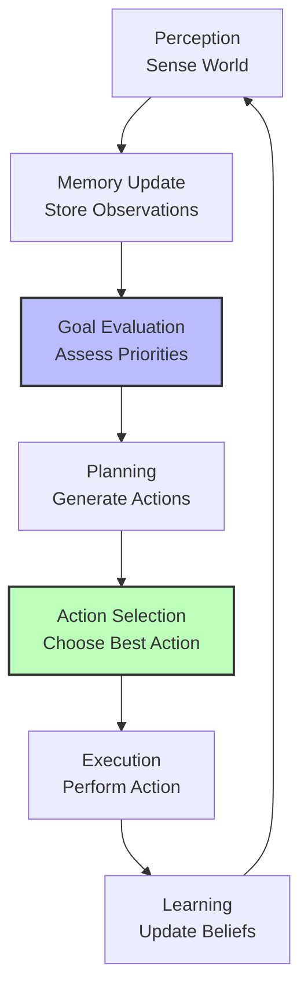

### Agent State Structure

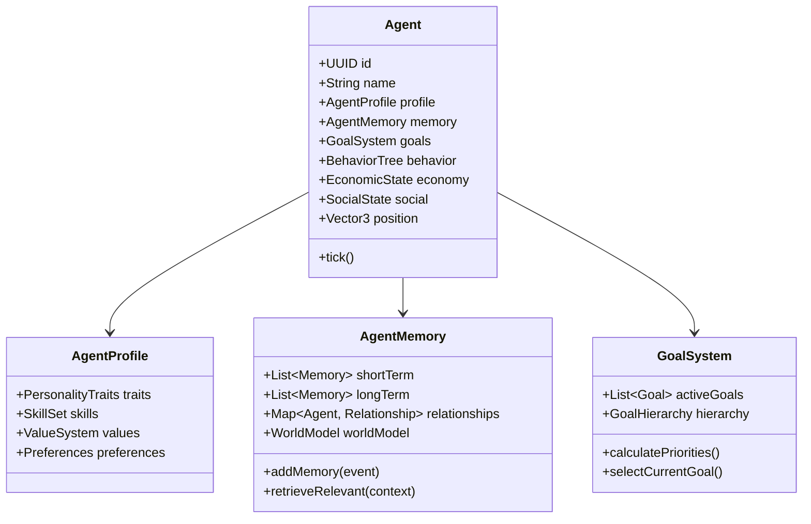

### Tick Processing

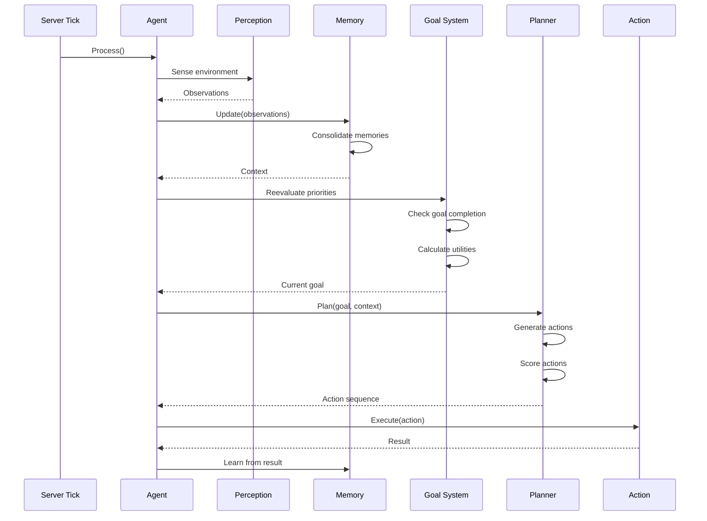

---

## 2. Goal System Architecture

### Goal Hierarchy

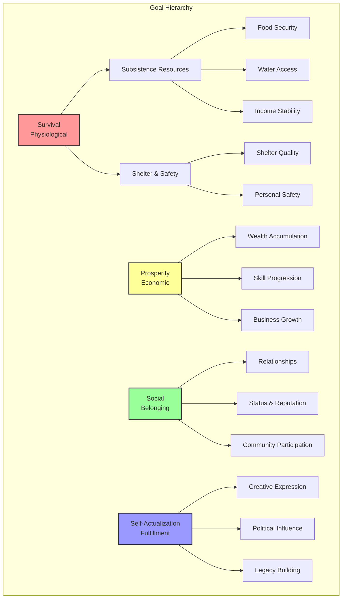

### Goal Priority Calculation

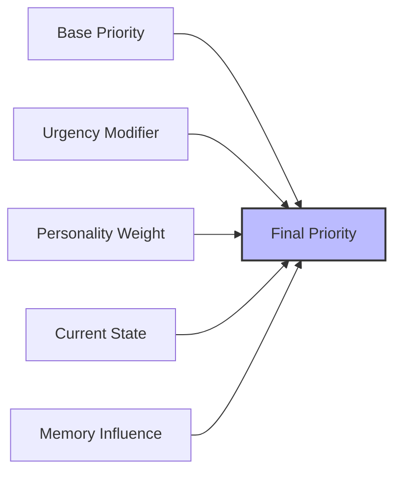

**Factors in Priority**:
1. **Base Priority**: Maslow hierarchy weight
2. **Urgency**: Time pressure (starving > comfortable)
3. **Personality**: Individual goal preferences
4. **Current State**: What's already satisfied
5. **Memory**: Past experiences ("Last time I ignored hunger...")

---

## 3. Agent Memory System

### Memory Architecture

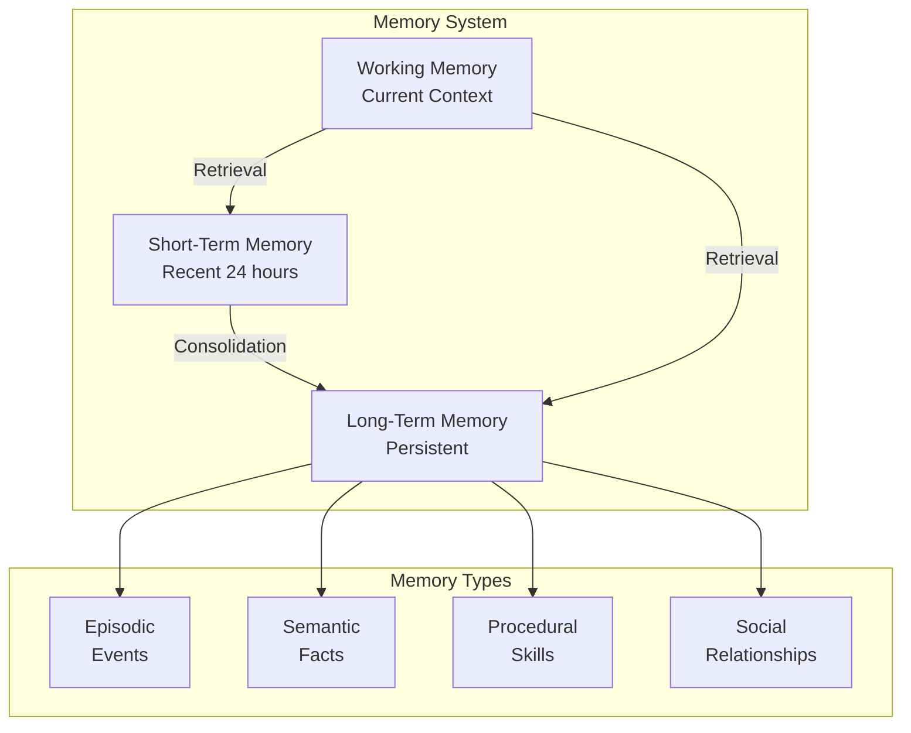

### Memory Data Structure

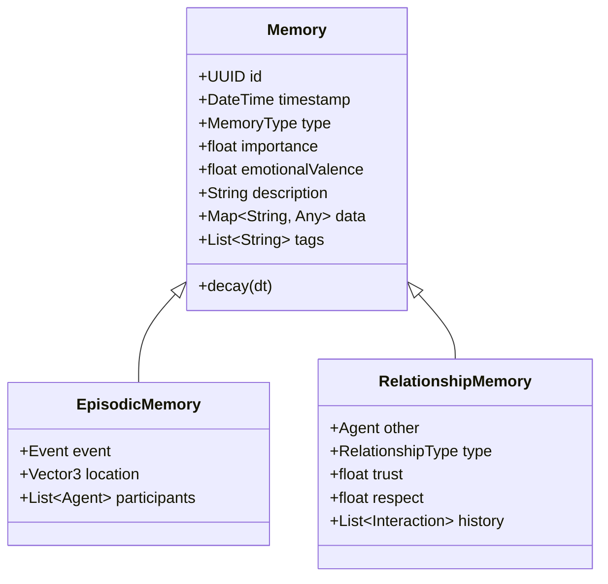

### What Agents Remember

**Short-Term (24 hours)**:
- Recent conversations
- Current transactions
- Immediate threats/opportunities
- Active plans

**Long-Term (Persistent)**:
- Major life events
- Traumatic experiences
- Successful strategies
- Relationship histories
- World facts (prices, locations, laws)

**Decay Mechanics**:
- Unimportant memories fade
- Emotional memories persist longer
- Accessed memories strengthen
- Contradicting memories update beliefs

---

## 4. Economic Behavior Model

### Price Belief Formation

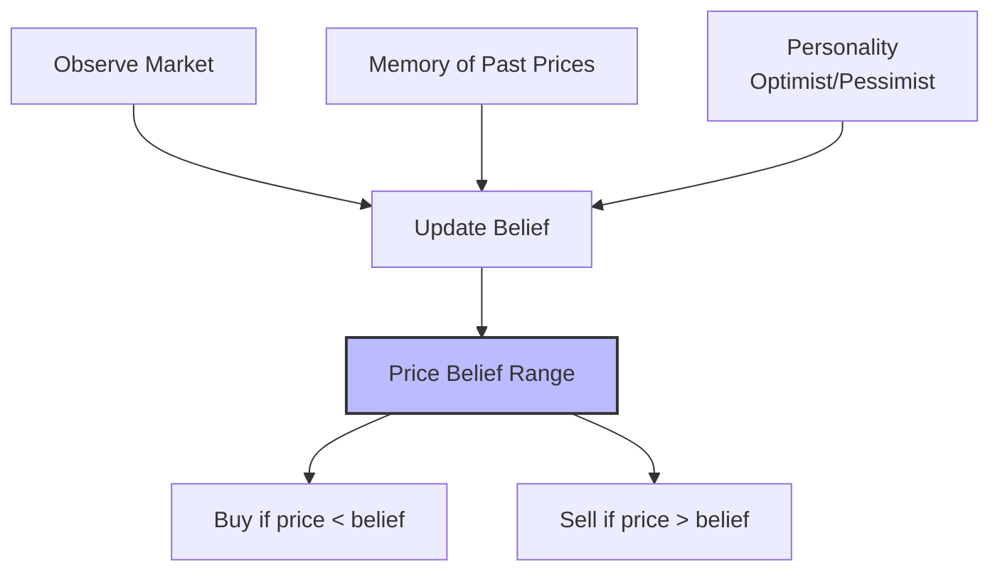

**Price Belief Formula**:
```
Belief = (ObservedPrices * WeightRecent) + (MemoryPrices * WeightPast) + PersonalityBias
Range = MinPrice to MaxPrice (with uncertainty)
```

### Trading Strategy

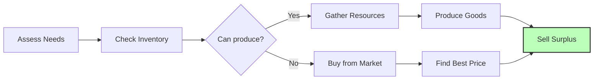

### Career Specialization Decision

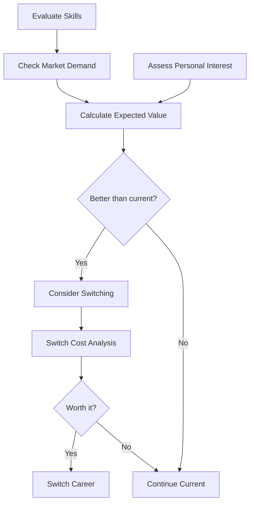

---

## 5. Political Behavior Model

### Voting Decision Process

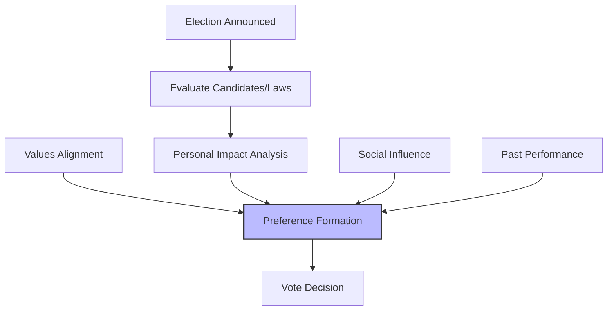

**Voting Factors**:
1. **Personal Impact**: How does this affect my wealth/survival?
2. **Values Alignment**: Does this match my ideology?
3. **Social Influence**: What do trusted friends think?
4. **Past Performance**: Track record of candidates
5. **Information Quality**: How much do I know?

### Faction Formation

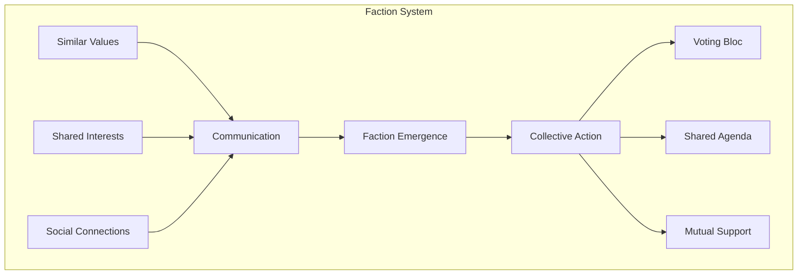

---

## 6. Social Behavior Model

### Relationship Formation

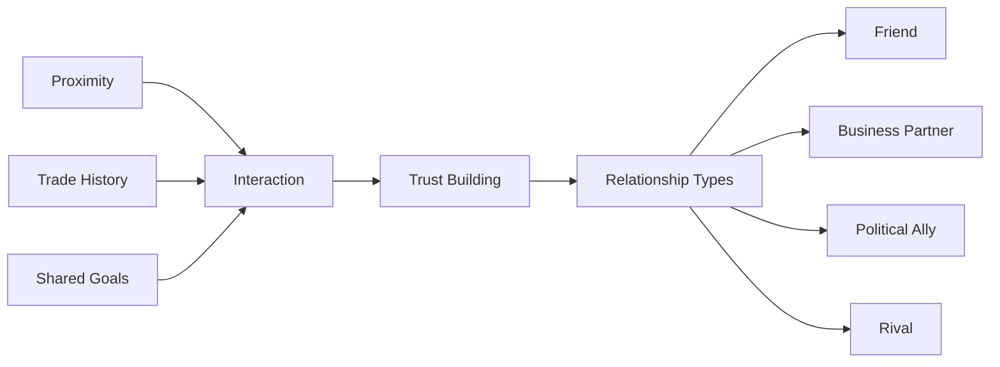

### Migration Decision

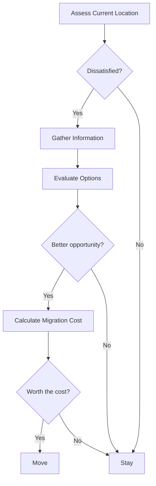

---

## 7. Population Elasticity System

### Elasticity Architecture

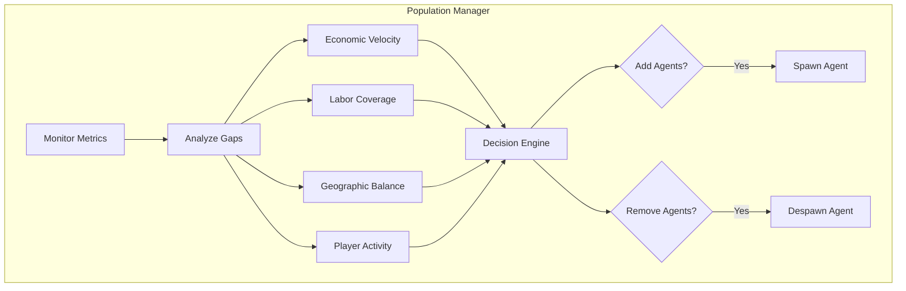

### Elasticity Triggers

| Metric | Low (Add Agents) | High (Reduce Agents) |
|--------|-----------------|---------------------|
| Economic Velocity | < 50% baseline | > 150% baseline |
| Labor Gaps | Critical roles empty | Human coverage good |
| Player Activity | Very low | High engagement |
| Geographic Balance | Abandoned regions | Well-distributed |

### Agent Lifecycle

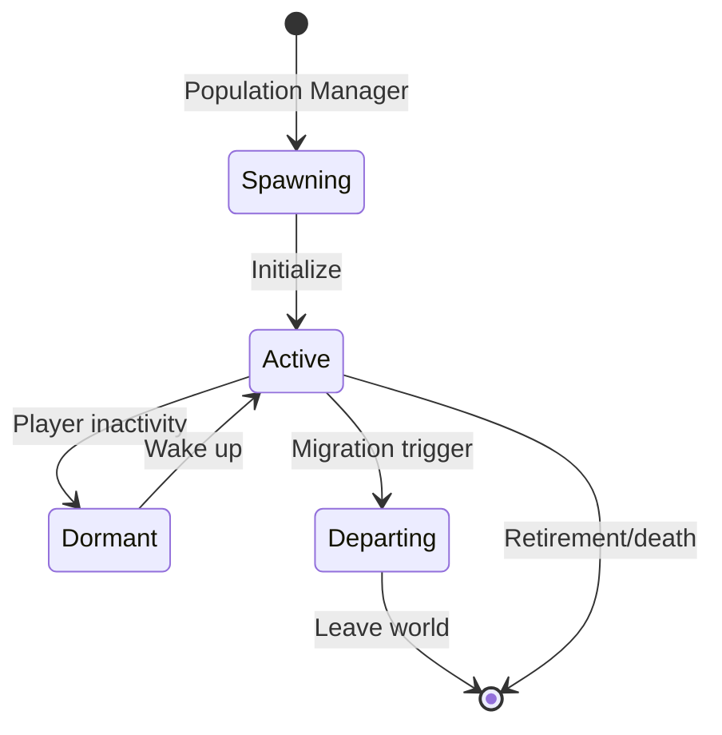

---

## 8. Personality & Diversity System

### Personality Model

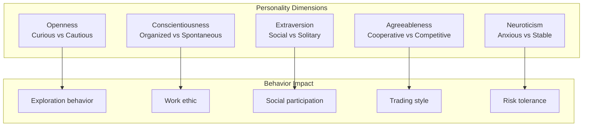

### Value Diversity

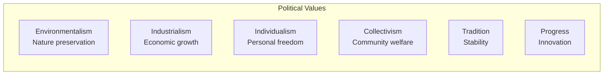

---

## 9. Emergent Narrative System

### How Players Learn About AI Lives

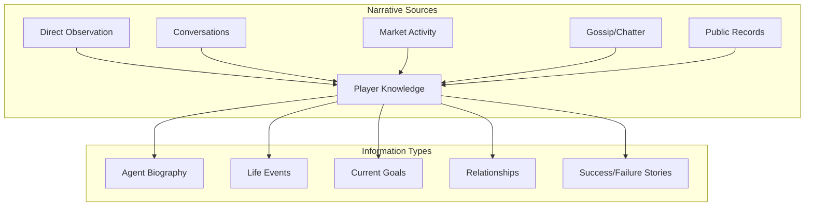

### Narrative Mechanics

**Direct Observation**:
- See agents working, building, trading
- Visual indicators of agent state (busy, idle, traveling)
- Overhead icons for notable activities

**Information UI**:
- "Agent Directory" - browse known agents
- "Life Stories" - notable agent biographies
- "Relationship Map" - social network visualization
- "Event Log" - significant agent actions

**Gossip System**:
- Agents share information with players
- News travels through social network
- Reputation based on information accuracy

**Public Records**:
- Census data, economic participation
- Political voting history (if public)
- Criminal records (if exists)
- Achievement/business registry

---

## 10. AI Debuggability Architecture

### Decision Tracing System

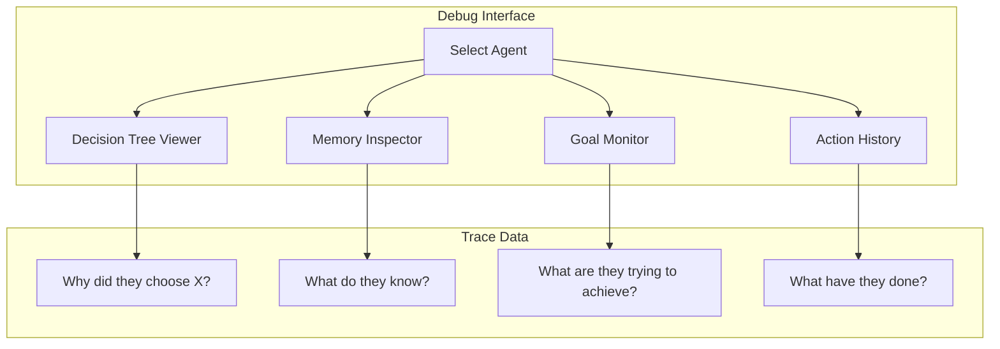

### Debug Features

**Decision Tree Viewer**:
- Visualize agent's current decision tree
- See scores for alternative actions
- Understand why an action was chosen

**Memory Inspector**:
- Browse agent's memory (short & long term)
- See memory importance scores
- View memory influence on current decisions

**Goal Monitor**:
- Current goal hierarchy
- Priority calculations
- Goal completion progress

**Action History**:
- Timeline of recent actions
- Success/failure outcomes
- Resource changes

**Simulation Replay**:
- Step through agent's past decisions
- See what they perceived
- Understand why they acted

### Debug UI Mockup

```
┌─────────────────────────────────────┐
│ Agent: Sarah the Farmer             │
├─────────────────────────────────────┤
│ [Overview] [Goals] [Memory] [Debug] │
├─────────────────────────────────────┤
│ Current Goal: Find Food (Urgency:   │
│ 8.5/10)                             │
│                                     │
│ Decision Trace:                     │
│ ├─ Goal: Find Food                  │
│ ├─ Options Considered:              │
│ │  ├─ Buy Bread (Score: 7.2)        │
│ │  ├─ Harvest Crops (Score: 6.8)    │
│ │  └─ Hunt (Score: 4.1)             │
│ └─ Selected: Buy Bread              │
│    ├─ Reason: Closest vendor        │
│    ├─ Price: Affordable             │
│    └─ Memory: Good past experience  │
└─────────────────────────────────────┘
```

---

## 11. Experimental Brain Configurations

### Configuration Variants

| Config | Rationality | Social Complexity | Goal Diversity | Information |
|--------|-------------|-------------------|----------------|-------------|
| **Realistic** | Bounded | High | High | Imperfect |
| **Optimal** | High | Low | Low | Perfect |
| **Chaotic** | Low | Medium | High | Imperfect |
| **Cooperative** | Medium | High | Low | Shared |

### Testing Metrics

- **Economic Efficiency**: Market clearing speed
- **Social Stability**: Conflict frequency
- **Political Engagement**: Voting participation
- **Player Satisfaction**: Survey results
- **Emergent Behavior**: Interesting events/minute

---

## 12. Open Questions & Future Research

### Unresolved Questions

- [ ] What's the computational cost of different brain configurations?
- [ ] How many memories can an agent have before performance degrades?
- [ ] What's the optimal tick budget per agent?
- [ ] How do we prevent "AI hive mind" behavior?
- [ ] What's the right balance of agent autonomy vs. story coherence?

### Research Needs

- [ ] Utility AI vs. GOAP vs. Behavior Trees for economic agents
- [ ] Memory consolidation algorithms
- [ ] Social simulation in games (academic research)
- [ ] Emergent narrative generation techniques
- [ ] AI debugging best practices

---

## 13. Decisions Log

| Date | Decision | Rationale |
|------|----------|-----------|
| Day 0 | Utility-based goals | Flexible, handles competing priorities |
| Day 0 | Episodic memory model | Creates believable, context-aware behavior |
| Day 0 | Price belief system | Realistic economic behavior, emergent dynamics |
| Day 0 | Faction formation | Emergent politics, no hardcoded parties |
| Day 0 | Multiple brain configs | Test what creates best player experience |

---

## 14. AI Implementation Skills & Knowledge Base

### Overview

This section documents the comprehensive AI development skills required for Societies' agent systems. These skills cover utility-based AI, memory systems, economic agents, political behavior, personality models, and emergent narrative generation.

### 14.1 Core AI Programming Skills

#### Skill 1: Utility-Based AI Systems

**Research Sources:**
- **Primary:** "Behavioral Mathematics for Game AI" by Dave Mark
- **Patterns:** "Game AI Pro" chapters on utility AI (free online)
- **Case Studies:** GDC talks on The Sims AI, Civilization AI
- **Academic:** Decision-theoretic planning papers (IEEE, AIIDE)

**Key Competencies:**
- Curve functions for utility scoring (linear, exponential, logistic)
- Normalization and weighting strategies
- Decision tree vs utility system tradeoffs
- Performance optimization for large agent counts (1000+)
- Goal selection algorithms with interruption
- Multi-criteria decision analysis

**Creation Process:**
1. Document goal hierarchy (Maslow-based: Survival, Prosperity, Social, Self-Actualization)
2. Create utility curves for each goal type
3. Implement priority calculation formula: `P = urgency × value × personalityAlignment`
4. Benchmark utility calculations at scale
5. Research The Sims' utility system implementation
6. Document goal interruption and resumption patterns

**Verification Steps:**
- [ ] Can design utility curves for different goal types
- [ ] Can implement priority calculations with weights
- [ ] Can handle goal interruption gracefully
- [ ] Performance: 1000+ agents < 1ms per tick
- [ ] Creates believable, non-random decision patterns

---

#### Skill 2: Memory System Architecture

**Research Sources:**
- **Psychology:** Human memory research (episodic, semantic, procedural, working)
- **Reference:** "The MIT Encyclopedia of the Cognitive Sciences"
- **Games:** Dwarf Fortress memory systems, The Sims memory
- **AI:** Knowledge representation (semantic networks, ontologies)

**Key Competencies:**
- Multi-tier memory (working, short-term, long-term)
- Consolidation algorithms (importance + emotional salience + rehearsal)
- Decay mechanics (time-based forgetting curves)
- Retrieval relevance scoring (context matching)
- Memory categorization (episodic, semantic, procedural, social)
- Memory visualization for debugging

**Creation Process:**
1. Document 4 memory types with structures:
   - Episodic: events with timestamp, location, emotional valence
   - Semantic: facts about world (prices, locations, recipes)
   - Procedural: how-to knowledge (skills, crafting)
   - Social: relationships, trust, reputation
2. Create memory decay formulas:
   - Working: 30 seconds
   - Short-term: hours with decay
   - Long-term: permanent with accessibility decay
3. Implement consolidation algorithm
4. Create memory retrieval with context matching
5. Build memory inspection tools

**Verification Steps:**
- [ ] Can store and retrieve different memory types
- [ ] Memory decay works realistically over time
- [ ] Consolidation promotes important memories
- [ ] Retrieval returns contextually relevant memories
- [ ] System handles 100+ memories per agent efficiently

---

#### Skill 3: Economic Agent Modeling

**Research Sources:**
- **Economics:** Behavioral economics (Kahneman, Thaler, Akerlof)
- **Games:** "Economics for Game Designers" GDC talks
- **Academic:** Agent-based modeling papers
- **Case Studies:** EVE Online economic postmortems

**Key Competencies:**
- Price belief formation (weighted averages with personality bias)
- Trading strategy algorithms (supply/demand response)
- Market analysis and opportunity detection
- Career specialization decisions
- Economic efficiency optimization
- Budget management and savings behavior

**Creation Process:**
1. Document price belief update algorithm:
   ```
   newBelief = (oldBelief × weight + observedPrice × (1-weight)) × personalityBias
   weight = 0.7 + (Openness × 0.2) - (Neuroticism × 0.1)
   ```
2. Create trading decision trees
3. Implement career specialization logic
4. Research economic agent models (Zero Intelligence, ZIP, GD)
5. Test with simulated market scenarios
6. Document market participation thresholds

**Verification Steps:**
- [ ] Can implement price belief updates
- [ ] Trading decisions respond to market conditions
- [ ] Career specialization feels realistic
- [ ] Agents show diverse economic behaviors
- [ ] Market dynamics emerge from agent interactions

---

#### Skill 4: Political Behavior Simulation

**Research Sources:**
- **Theory:** Voting theory (approval, ranked choice, Condorcet)
- **Psychology:** Political psychology (values voting, social influence)
- **Game Theory:** Faction formation and coalition building
- **Design:** Democratic theory, constitutional design principles

**Key Competencies:**
- Voting decision algorithms (impact × values × social influence × performance)
- Faction formation and coalition building
- Political campaign effectiveness
- Policy preference inference
- Vote counting methods (plurality, majority, ranked, approval)
- Political power dynamics

**Creation Process:**
1. Document voting calculation:
   ```
   VoteScore = personalImpact × 0.3 + valueAlignment × 0.3 + socialInfluence × 0.2 + pastPerformance × 0.2
   ```
2. Create faction dynamics simulation
3. Implement different voting methods
4. Research real-world voting behavior models
5. Test political scenarios (elections, legislation)
6. Document AI voting behavior customization

**Verification Steps:**
- [ ] Can implement multiple voting methods
- [ ] Voting decisions consider multiple factors
- [ ] Factions form based on shared interests
- [ ] Political behavior feels authentic
- [ ] Different personalities vote differently

---

#### Skill 5: Personality Systems (Big Five/OCEAN)

**Research Sources:**
- **Psychology:** Big Five personality literature (Costa & McCrae)
- **Reference:** "The Big Five Trait Taxonomy" research
- **Games:** Procedural character generation research
- **Psychology:** Value systems and moral psychology (Schwartz Theory)

**Key Competencies:**
- Five-factor model implementation (Openness, Conscientiousness, Extraversion, Agreeableness, Neuroticism)
- Trait-to-behavior mapping systems
- Value system integration (Schwartz values)
- Personality diversity generation
- Personality stability vs change over time
- Cultural value transmission

**Creation Process:**
1. Document trait definitions and ranges (0-100 scale):
   - Openness: creativity, curiosity, preference for variety
   - Conscientiousness: organization, diligence, goal-directed
   - Extraversion: sociability, energy, positive emotion
   - Agreeableness: cooperation, trust, altruism
   - Neuroticism: anxiety, stress, emotional instability
2. Create trait impact matrix (how each trait affects behaviors)
3. Implement personality generation algorithms
4. Document value systems (power, achievement, security, etc.)
5. Research procedural character generation
6. Validate personality diversity distribution

**Verification Steps:**
- [ ] Can generate diverse personalities
- [ ] Traits meaningfully impact decisions
- [ ] Personality distribution feels realistic
- [ ] Can explain why agent made specific choice
- [ ] Personality profiles are distinct and memorable

---

#### Skill 6: Emergent Narrative Systems

**Research Sources:**
- **Games:** Dwarf Fortress emergent storytelling postmortems
- **Academic:** Procedural narrative generation research
- **Sociology:** Information propagation models (gossip networks)
- **Analysis:** Social network analysis principles

**Key Competencies:**
- Gossip propagation mechanics (network spread, distortion)
- Event significance scoring (emotional impact × rarity × social relevance)
- Information decay and distortion over time
- Narrative reconstruction from records
- News/worthiness algorithms
- Story clustering and pattern detection

**Creation Process:**
1. Document gossip system architecture:
   - Spread probability based on Extraversion and relationship strength
   - Decay based on time and newsworthiness
   - Distortion based on number of hops
2. Create event significance algorithm
3. Implement information cascade models
4. Build narrative reconstruction from episodic memories
5. Create news generation from world events
6. Test narrative emergence in simulations

**Verification Steps:**
- [ ] Can spread information through social networks
- [ ] Significant events propagate further
- [ ] Information distorts naturally over time
- [ ] Can reconstruct stories from agent memories
- [ ] Players discover interesting emergent stories

---

### 14.2 AI Skill Development Workflow

#### Research Priority Schedule

**Immediate (Week 1-2):**
- Utility AI implementation patterns
- Memory system data structures
- Economic agent basic behaviors
- Tick processing optimization

**Short-term (Month 1-2):**
- Political behavior algorithms
- Personality trait systems
- Social relationship modeling
- Debug visualization tools

**Medium-term (Month 2-3):**
- Emergent narrative systems
- Population elasticity algorithms
- Faction and coalition dynamics
- Advanced economic strategies

**Ongoing:**
- Performance optimization
- New behavior types
- Debugging and profiling tools
- Validation and testing patterns

---

### 14.3 AI Skill Validation Process

**For Each AI Skill:**

1. **Prototype Implementation (1-2 weeks):**
   - Build minimal working version
   - Test with 100+ agents
   - Profile performance
   - Document behavior patterns

2. **Behavioral Validation:**
   - Does behavior match design specification?
   - Do agents act believably?
   - Is performance acceptable?
   - Can we debug their decisions?

3. **Scale Testing:**
   - Test with target agent counts (100-1000)
   - Measure tick processing time
   - Memory usage profiling
   - Network synchronization impact

4. **Documentation Update:**
   - Update skill with implementation details
   - Document deviations from original design
   - Add performance characteristics
   - Include code examples

5. **External Review:**
   - Share with AI programming community
   - Get feedback on approach
   - Compare with industry practices
   - Iterate based on feedback

---

### 14.4 Skills to Create Priority List

**Immediate (Prototype 1-2):**
1. Utility-Based AI Architecture
2. Agent Memory Systems
3. Tick-Based Agent Processing
4. AI Debugging and Visualization

**Short-term (Prototype 2-3):**
5. Economic Agent Behaviors
6. Price Belief Systems
7. Trading Strategy Algorithms
8. Population Elasticity System

**Medium-term (Prototype 3-4):**
9. Political Behavior Simulation
10. Voting System Implementation
11. Personality Systems (Big Five)
12. Social Relationship Modeling

**Ongoing:**
13. Emergent Narrative Systems
14. Faction and Coalition Dynamics
15. AI Performance Optimization
16. Agent Lifecycle Management

---

### 14.5 AI Research Resources

#### Primary Sources
| Resource | Focus | Application |
|----------|-------|-------------|
| "Behavioral Mathematics for Game AI" | Utility systems | Goal selection |
| Game AI Pro (free chapters) | Implementation patterns | All AI systems |
| GDC Vault - The Sims AI | Agent simulation | Memory, goals |
| IEEE Xplore - Multi-agent | Academic research | Advanced behaviors |
| AIIDE Proceedings | Game AI research | New techniques |

#### Psychology Sources
| Resource | Focus | Application |
|----------|-------|-------------|
| Big Five Research | Personality | OCEAN model |
| Behavioral Economics | Decision making | Economic agents |
| Social Psychology | Influence | Political behavior |
| Memory Research | Cognitive models | Agent memory |

#### Game References
| Game | AI System | Study Focus |
|------|-----------|-------------|
| The Sims | Utility-based goals | Goal selection |
| Dwarf Fortress | Emergent narrative | Story generation |
| Crusader Kings | Social simulation | Relationships |
| EVE Online | Economic agents | Market behavior |
| RimWorld | Story generation | Events and drama |

---

## Success Criteria

- [ ] Clear AI decision-making architecture
- [ ] Economic behavior model specified
- [ ] Political behavior model specified
- [ ] Population elasticity algorithm defined
- [ ] Personality/diversity system designed
- [ ] Experimental configurations outlined
- [ ] Emergent narrative system designed
- [ ] Debuggability architecture specified
- [ ] AI implementation skills documented
- [ ] Research sources catalogued
- [ ] Skill creation workflow defined

---

**Status**: COMPLETE - Ready for Day 2 Planning & Development

---

## Changes & Revisions Log

### [Date] - Session 2 Revision

**Trigger**: [What caused this revision]

**Changes Made**:
- [Section]: [What changed]

**Rationale**: [Why this revision was necessary]

**Impact**: [What other documents/systems are affected]

---

## Cross-Doc Issues

### Issue 1: [Brief Description]
**Discovered in**: Session 2
**Affects**: Session Y, Session Z
**Description**: [What contradicts what]
**Resolution**: [How/when it will be resolved]
**Status**: [Open/In Progress/Resolved]

---

**Status**: Template Updated - Ready for Session 2 Planning (Depth-Optimized Methodology)
