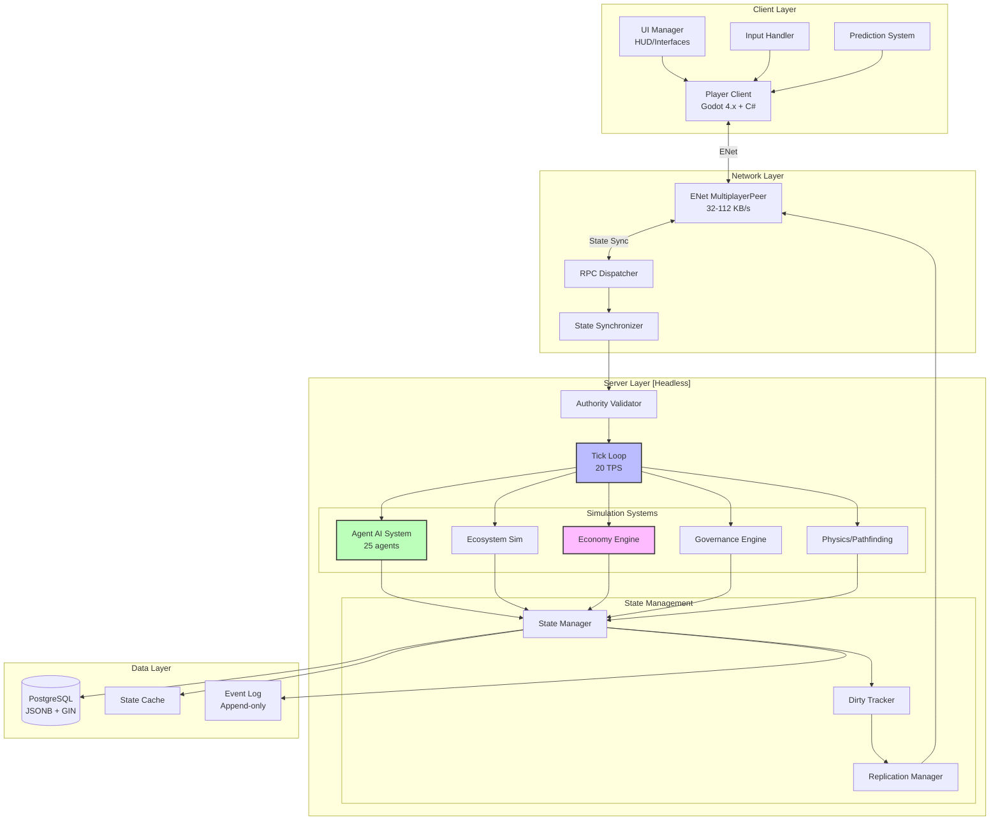
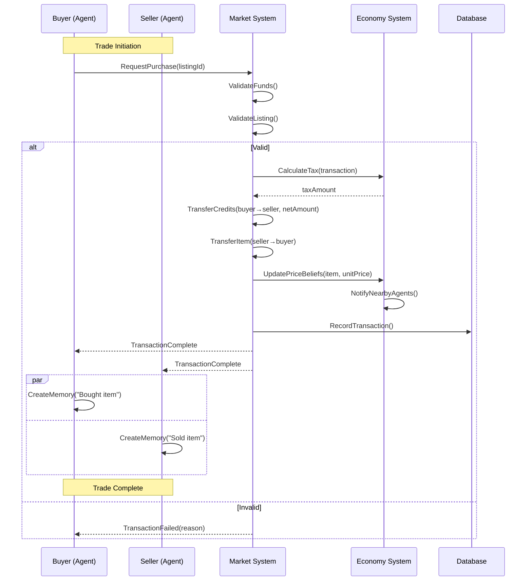
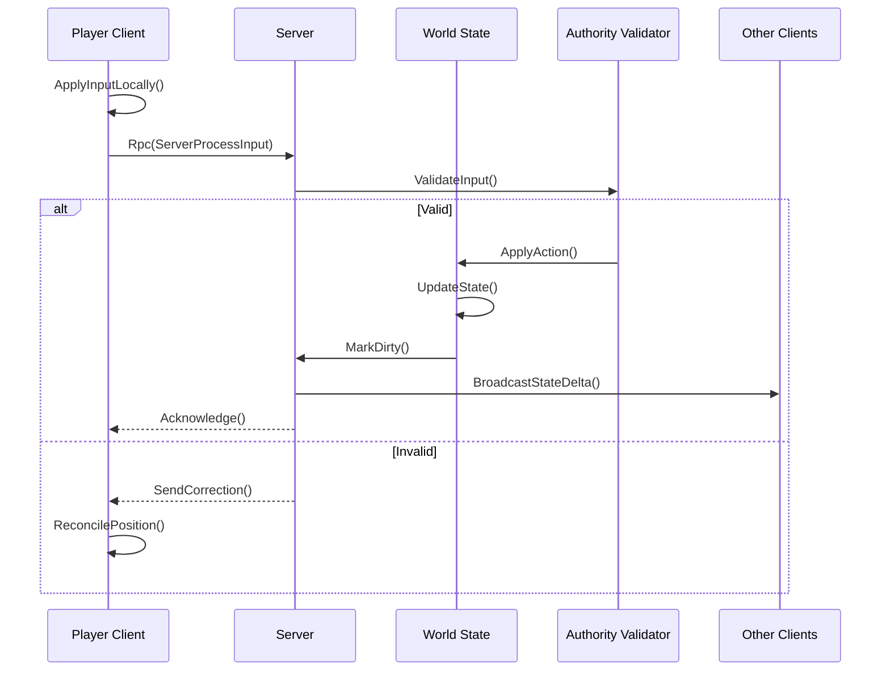
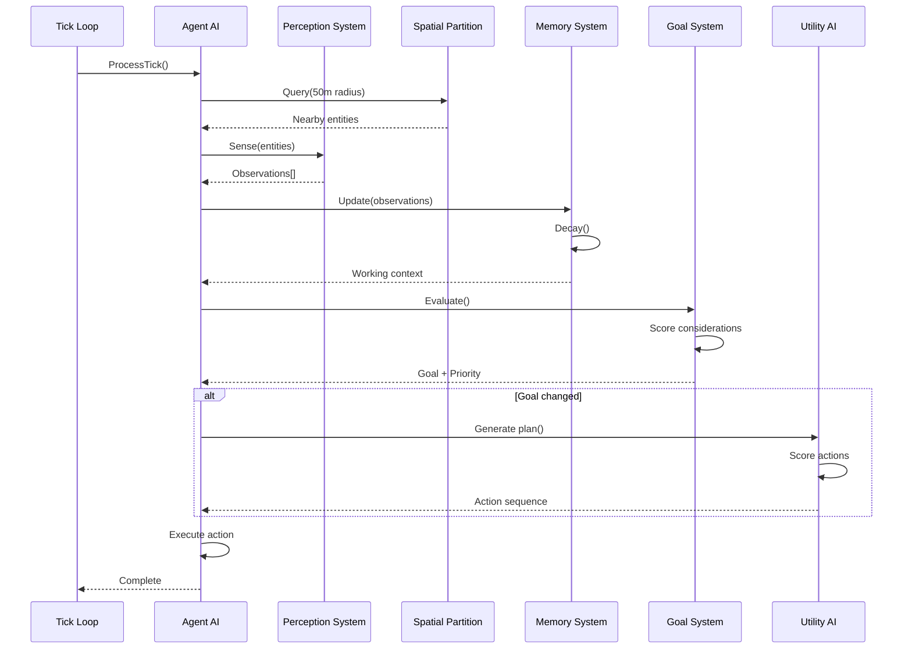
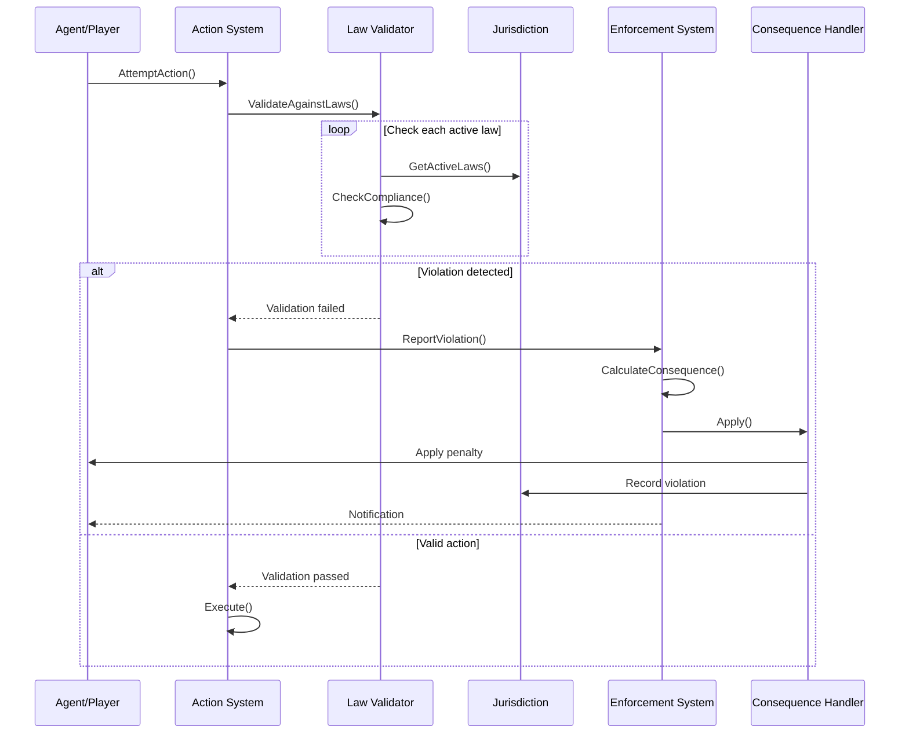
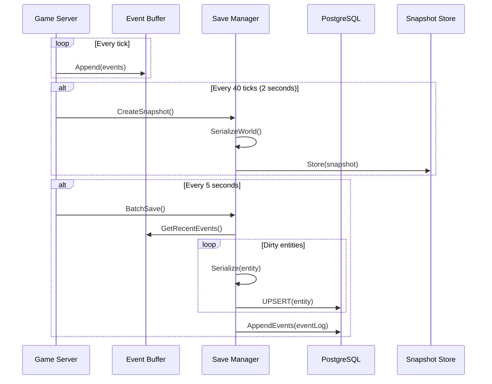
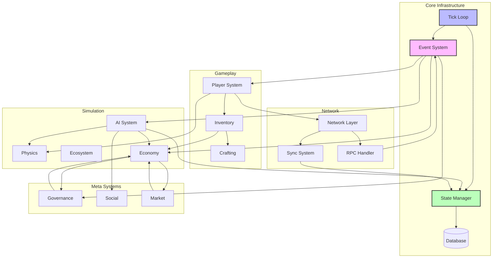

# System Integration Specification Map

**Project**: Societies  
**Document Type**: Technical Specification  
**Status**: Complete  
**Version**: 1.0  
**Date**: 2026-02-01  

> **Canonical alignment (2026-07-14):** Aspirational integration reference; current scope is governed by [`planning/active/`](../active/) and repo truth by [`CURRENT_BUILD.md`](../../CURRENT_BUILD.md). See [PRODUCT-THESIS.md](../PRODUCT-THESIS.md).

## Product Contract Overlay

Integrations must preserve deterministic simulation ownership of facts and outcomes. Inputs become validated commands and recorded events; LLMs receive structured observations and may only deliberate, communicate, summarize, or propose. Model failure or invalid output must safely fall back. Ecology, economy, trade, and governance must surface shared legible consequences for consequential humans and rights-bearing AI citizens without granting either model output or AI citizens special authority.

---

## Table of Contents

1. [Integration Architecture Overview](#1-integration-architecture-overview)
2. [Core Integration Points](#2-core-integration-points)
   - 2.1 Player ↔ World Integration
   - 2.2 AI ↔ Economy Integration
   - 2.3 Economy ↔ Governance Integration
   - 2.4 AI ↔ Social Integration
   - 2.5 World ↔ Ecosystem Integration
   - 2.6 Client ↔ Server Integration
   - 2.7 Server ↔ Database Integration
   - 2.8 AI ↔ Memory Integration
   - 2.9 Player ↔ Inventory Integration
   - 2.10 Market ↔ Trading Integration
   - 2.11 Governance ↔ Law Enforcement Integration
   - 2.12 Tick Loop ↔ AI Processing Integration
3. [Data Contracts](#3-data-contracts)
4. [Event Flow Diagrams](#4-event-flow-diagrams)
5. [API Signatures](#5-api-signatures)
6. [Dependency Chains](#6-dependency-chains)

---

## 1. Integration Architecture Overview

### High-Level System Diagram



### Data Flow Principles

1. **Server-Authoritative**: All state mutations originate from server; clients are dumb terminals with prediction
2. **Event-Driven**: Systems communicate via typed events with guaranteed delivery (reliable channel)
3. **State Sync**: Position/animation updates use unreliable channel; state changes use reliable channel
4. **Lazy Persistence**: Database writes batched every 5 seconds; reads cached in memory
5. **Dirty Tracking**: Only changed entities sync to clients (60-80% bandwidth reduction)

---

## 2. Core Integration Points

### 2.1 Player ↔ World Integration

**Purpose**: Connect human players to the simulation world with authoritative server validation

```
Data Flow:
  Player Input → Network Layer → Server Simulation → World State Update → Client Render

Events:
  - PlayerMoveEvent (unreliable ordered, 20 TPS)
  - PlayerActionEvent (reliable)
  - PlayerInteractEvent (reliable)
  - PlayerChatEvent (reliable)
  - PlayerVoteEvent (reliable, encrypted)

API:
  - GetPlayerState(playerId: UUID): PlayerState
  - UpdatePlayerPosition(playerId: UUID, pos: Vector3, vel: Vector3): void
  - ExecutePlayerAction(playerId: UUID, action: ActionType, target: EntityRef): ActionResult
  - ValidatePlayerInput(playerId: UUID, input: PlayerInput): bool
```

**Event Schema**:
```csharp
public struct PlayerMoveEvent {
    public UUID PlayerId;
    public Vector3 Position;
    public Vector3 Velocity;
    public uint SequenceNumber;  // For reconciliation
    public double Timestamp;
}

public struct PlayerActionEvent {
    public UUID PlayerId;
    public ActionType Action;
    public EntityRef Target;
    public Dictionary<string, Variant> Parameters;
    public double Timestamp;
}
```

**Integration Logic**:
```csharp
// Client-side prediction
public void OnPlayerInput(PlayerInput input) {
    // Apply immediately for responsiveness
    predictedPosition += input.MovementVector;
    
    // Send to server
    Rpc(nameof(ServerProcessInput), input.Serialize());
}

// Server-side validation
[Rpc(TransferMode = TransferModeEnum.Reliable)]
public void ServerProcessInput(PlayerInput input) {
    if (!IsMultiplayerAuthority()) return;
    
    // Validate input (no cheating)
    if (!ValidateMovementSpeed(input)) return;
    if (!ValidateActionRange(input)) return;
    
    // Apply to world state
    ApplyPlayerAction(input.PlayerId, input);
    
    // Broadcast to other clients
    BroadcastPlayerState(input.PlayerId);
}
```

---

### 2.2 AI ↔ Economy Integration

**Purpose**: Enable AI agents to participate in the economy through price beliefs and trading decisions

```
Data Flow:
  Market State → AI Perception → Price Belief Update → Trading Decision → Market Transaction

Events:
  - PriceUpdateEvent (reliable, 10 TPS)
  - TradeExecutedEvent (reliable, atomic)
  - MarketOpportunityEvent (unreliable)
  - BeliefUpdateEvent (internal)

API:
  - GetMarketPrice(itemId: ushort): float
  - ExecuteTrade(buyer: UUID, seller: UUID, item: ItemStack, price: float): TransactionResult
  - UpdatePriceBelief(agentId: UUID, itemId: ushort, observedPrice: float): void
  - EvaluateTradeOpportunity(agentId: UUID, itemId: ushort): TradeDecision
```

**Event Schema**:
```csharp
public struct TradeExecutedEvent {
    public UUID TransactionId;
    public UUID BuyerId;
    public UUID SellerId;
    public ItemStack Item;
    public float Price;
    public float UnitPrice;  // For belief updates
    public Vector3 Location;
    public double Timestamp;
    public bool IsAI_Buyer;
    public bool IsAI_Seller;
}

public struct PriceBeliefUpdate {
    public UUID AgentId;
    public ushort ItemId;
    public float OldMean;
    public float NewMean;
    public float Uncertainty;
    public float Confidence;
    public int ObservationCount;
}
```

**Integration Logic**:
```csharp
// AI observes trade and updates beliefs
public void OnTradeExecuted(TradeExecutedEvent evt) {
    // Notify nearby agents
    var nearbyAgents = spatialPartition.Query(evt.Location, 50f);
    
    foreach (var agent in nearbyAgents) {
        float unitPrice = evt.Price / evt.Item.Quantity;
        
        // Bayesian belief update
        var belief = agent.Economy.GetBelief(evt.Item.ItemId);
        belief.Update(unitPrice);
        
        // Check for trading opportunity
        if (belief.IsGoodDeal(unitPrice, TradeType.Buy)) {
            agent.Goals.QueueGoal(new PurchaseGoal(evt.Item.ItemId));
        }
    }
}

// AI decides to trade
public TradingDecision EvaluateTrade(Agent agent, ushort itemId, float offeredPrice, bool isBuying) {
    var belief = agent.Economy.GetBelief(itemId);
    
    if (isBuying) {
        if (offeredPrice <= belief.MinPrice * 0.9f)
            return new TradingDecision { Action = TradingAction.Accept, Urgency = TradeUrgency.High };
        else if (offeredPrice <= belief.MeanPrice)
            return new TradingDecision { Action = TradingAction.Accept, Urgency = TradeUrgency.Normal };
        else if (offeredPrice <= belief.MaxPrice)
            return new TradingDecision { Action = TradingAction.Negotiate };
        else
            return new TradingDecision { Action = TradingAction.Reject };
    } else {
        // Selling logic (inverse)
        if (offeredPrice >= belief.MaxPrice * 1.1f)
            return new TradingDecision { Action = TradingAction.Accept, Urgency = TradeUrgency.High };
        // ... etc
    }
}
```

---

### 2.3 Economy ↔ Governance Integration

**Purpose**: Connect economic systems with political decisions (taxation, subsidies, regulations)

```
Data Flow:
  Economic Indicators → Governance Dashboard → Policy Proposals → Vote → Law Enforcement → Economic Impact

Events:
  - TaxCollectionEvent (reliable, per transaction)
  - PolicyEnactedEvent (reliable)
  - EconomicIndicatorEvent (reliable, daily)
  - LawViolationEvent (reliable)

API:
  - CollectTax(transaction: Transaction, jurisdiction: Jurisdiction): TaxRecord
  - EnforceLaw(lawId: UUID, target: EntityRef): EnforcementResult
  - GetEconomicIndicators(jurisdiction: UUID): EconomicIndicators
  - ApplyPolicyImpact(law: Law, economy: EconomySystem): void
```

**Event Schema**:
```csharp
public struct TaxCollectionEvent {
    public UUID TransactionId;
    public TaxType Type;  // Sales, Income, Property
    public float Amount;
    public float Rate;
    public UUID JurisdictionId;
    public float TownShare;
    public float StateShare;
    public double Timestamp;
}

public struct PolicyEnactedEvent {
    public UUID LawId;
    public string LawName;
    public UUID JurisdictionId;
    public Dictionary<string, float> Parameters;  // Tax rates, etc
    public double EnactedAt;
    public double EffectiveAt;
}

public struct EconomicIndicators {
    public float GDP;
    public float InflationRate;
    public float UnemploymentRate;
    public float AverageWage;
    public float GiniCoefficient;
    public float CurrencySupply;
    public int Timestamp;
}
```

**Integration Logic**:
```csharp
// Tax collection at point of sale
public void OnTransactionComplete(Transaction transaction) {
    var jurisdiction = GetJurisdiction(transaction.Location);
    var taxRate = jurisdiction.GetTaxRate(TaxType.Sales, transaction.Item.Category);
    var taxAmount = transaction.Amount * taxRate;
    
    // Deduct from transaction
    transaction.TaxCollected = taxAmount;
    transaction.NetAmount = transaction.Amount - taxAmount;
    
    // Distribute to treasuries
    float townShare = taxAmount * 0.8f;
    float stateShare = taxAmount * 0.2f;
    
    jurisdiction.TownTreasury.Add(townShare);
    if (jurisdiction.State != null)
        jurisdiction.State.Treasury.Add(stateShare);
    
    // Emit event for AI agents to observe
    EmitEvent(new TaxCollectionEvent {
        TransactionId = transaction.Id,
        Type = TaxType.Sales,
        Amount = taxAmount,
        Rate = taxRate,
        JurisdictionId = jurisdiction.Id,
        Timestamp = CurrentTick
    });
}

// Law enforcement affecting economy
public void EnforceEconomicLaw(Law law, Agent agent) {
    switch (law.Type) {
        case LawType.MinimumWage:
            if (agent.Employer != null && agent.Wage < law.MinimumWage) {
                agent.Employer.MustIncreaseWage(agent, law.MinimumWage);
            }
            break;
            
        case LawType.PriceControl:
            // Check if agent's store prices violate controls
            if (agent.Store != null) {
                foreach (var listing in agent.Store.Listings) {
                    if (listing.Price > law.MaxPriceFor(listing.Item)) {
                        agent.Store.Delist(listing);
                        agent.Reputation -= 5;
                    }
                }
            }
            break;
            
        case LawType.TaxRate:
            // Tax rates already enforced at transaction level
            // Just update agent's knowledge
            agent.Economy.UpdateTaxExpectations(law.TaxRates);
            break;
    }
}
```

---

### 2.4 AI ↔ Social Integration

**Purpose**: Enable relationship formation, reputation systems, and social influence on AI behavior

```
Data Flow:
  Social Interaction → Relationship Update → Reputation Propagation → Social Influence → Decision Modification

Events:
  - SocialInteractionEvent (reliable)
  - RelationshipChangedEvent (reliable)
  - ReputationUpdateEvent (reliable)
  - GossipEvent (unreliable)

API:
  - RecordInteraction(agentA: UUID, agentB: UUID, type: InteractionType): RelationshipUpdate
  - GetReputation(agentId: UUID): ReputationScore
  - CalculateSocialInfluence(agentId: UUID, context: SocialContext): float
  - PropagateGossip(gossip: GossipInfo): void
```

**Event Schema**:
```csharp
public struct SocialInteractionEvent {
    public UUID AgentA_Id;
    public UUID AgentB_Id;
    public InteractionType Type;  // Trade, Conversation, Gift, Conflict
    public float Duration;
    public float EmotionalValence;  // -100 to +100
    public float Importance;  // 0-100
    public Dictionary<string, Variant> Context;
    public double Timestamp;
}

public struct Relationship {
    public UUID AgentA_Id;
    public UUID AgentB_Id;
    public float Trust;  // 0-100
    public float Affection;  // -100 to 100
    public float Respect;  // 0-100
    public RelationshipType Type;  // Friend, Enemy, Family, Romantic
    public float InteractionFrequency;
    public List<MemoryReference> SharedMemories;
}

public struct ReputationUpdateEvent {
    public UUID AgentId;
    public float OldReputation;
    public float NewReputation;
    public string Reason;
    public double Timestamp;
}
```

**Integration Logic**:
```csharp
// Record social interaction and update relationships
public void OnSocialInteraction(SocialInteractionEvent evt) {
    var agentA = GetAgent(evt.AgentA_Id);
    var agentB = GetAgent(evt.AgentB_Id);
    
    // Update or create relationship
    var relationship = agentA.Social.GetRelationship(evt.AgentB_Id);
    if (relationship == null) {
        relationship = new Relationship {
            AgentA_Id = evt.AgentA_Id,
            AgentB_Id = evt.AgentB_Id,
            Trust = 50,
            Affection = 0,
            Respect = 50
        };
        agentA.Social.AddRelationship(relationship);
    }
    
    // Modify based on interaction type and valence
    switch (evt.Type) {
        case InteractionType.Trade:
            relationship.Trust += evt.EmotionalValence * 0.1f;
            break;
        case InteractionType.Conversation:
            relationship.Affection += evt.EmotionalValence * 0.2f;
            break;
        case InteractionType.Gift:
            relationship.Affection += evt.EmotionalValence * 0.5f;
            agentA.Social.Reputation += 2f;
            break;
        case InteractionType.Conflict:
            relationship.Affection -= Math.Abs(evt.EmotionalValence) * 0.3f;
            relationship.Trust -= 10f;
            break;
    }
    
    // Clamp values
    relationship.Trust = Mathf.Clamp(relationship.Trust, 0, 100);
    relationship.Affection = Mathf.Clamp(relationship.Affection, -100, 100);
    
    // Create memories for both agents
    var memory = new Memory {
        Type = MemoryType.SocialInteraction,
        Participants = new[] { evt.AgentA_Id, evt.AgentB_Id },
        EmotionalValence = (sbyte)evt.EmotionalValence,
        Importance = (byte)evt.Importance,
        Timestamp = evt.Timestamp
    };
    
    agentA.Memory.AddToShortTerm(memory);
    agentB.Memory.AddToShortTerm(memory);
    
    // Emit relationship change event
    EmitEvent(new RelationshipChangedEvent {
        AgentA_Id = evt.AgentA_Id,
        AgentB_Id = evt.AgentB_Id,
        Relationship = relationship
    });
}

// Social influence on voting decisions
public float CalculateSocialInfluence(Agent agent, VoteOption option) {
    float totalInfluence = 0.0f;
    float totalWeight = 0.0f;
    
    foreach (var friend in agent.Social.Friends) {
        var opinion = friend.PoliticalBehavior.GetOpinion(option);
        if (opinion == null) continue;
        
        var relationship = agent.Social.GetRelationship(friend.Id);
        float relationshipStrength = (relationship.Trust + relationship.Respect) / 200f;
        
        // Close family has stronger influence
        if (relationship.Type == RelationshipType.Family)
            relationshipStrength *= 1.5f;
        
        // Respected community leaders have extra influence
        if (friend.Social.Reputation > 70)
            relationshipStrength *= 1.3f;
        
        totalInfluence += opinion.VoteScore * relationshipStrength;
        totalWeight += relationshipStrength;
    }
    
    if (totalWeight == 0) return 0.5f;
    
    float averageInfluence = totalInfluence / totalWeight;
    
    // High agreeableness = more susceptible to social influence
    float agreeablenessMod = 1.0f + (agent.Profile.Traits.Agreeableness - 50) * 0.01f;
    
    return Mathf.Clamp01(averageInfluence * agreeablenessMod);
}
```

---

### 2.5 World ↔ Ecosystem Integration

**Purpose**: Connect the game world with environmental simulation (plants, animals, pollution)

```
Data Flow:
  World State → Environmental Conditions → Ecosystem Update → Resource Changes → World Modification

Events:
  - ResourceDepletedEvent (reliable)
  - PlantGrowthEvent (unreliable, batch)
  - AnimalSpawnEvent (reliable)
  - PollutionSpreadEvent (reliable, periodic)
  - ClimateChangeEvent (reliable, daily)

API:
  - UpdateEcosystemChunk(chunk: ChunkId, deltaTime: float): void
  - GetResourceNode(resourceId: UUID): ResourceNode
  - SpawnAnimal(species: SpeciesType, location: Vector3): Animal
  - ApplyPollution(source: Vector3, amount: float, radius: float): void
  - GetClimateAt(location: Vector3): ClimateData
```

**Event Schema**:
```csharp
public struct ResourceDepletedEvent {
    public UUID ResourceId;
    public ushort ResourceType;
    public Vector3 Location;
    public UUID HarvestedBy;
    public float QuantityHarvested;
    public double Timestamp;
}

public struct PlantGrowthEvent {
    public UUID PlantId;
    public ushort PlantType;
    public Vector3 Location;
    public byte GrowthStage;  // 0-100
    public bool IsMature;
    public float YieldAmount;
}

public struct PollutionSpreadEvent {
    public Vector3 Source;
    public float PollutionLevel;
    public float Radius;
    public PollutionType Type;
    public double Timestamp;
}

public struct ClimateData {
    public float Temperature;
    public float Precipitation;
    public float Humidity;
    public Season CurrentSeason;
    public float DaylightHours;
    public float WindSpeed;
    public float WindDirection;
}
```

**Integration Logic**:
```csharp
// Ecosystem tick processing
public void ProcessEcosystemTick(float deltaTime) {
    // Process only active chunks (with players or AI nearby)
    var activeChunks = GetActiveChunks();
    
    foreach (var chunk in activeChunks) {
        // Update plant growth
        foreach (var plant in chunk.Plants) {
            float growthRate = CalculateGrowthRate(plant, chunk.Climate);
            plant.Growth += growthRate * deltaTime;
            
            if (plant.Growth >= 100f && !plant.HasMatured) {
                plant.HasMatured = true;
                EmitEvent(new PlantGrowthEvent {
                    PlantId = plant.Id,
                    PlantType = plant.Type,
                    Location = plant.Position,
                    GrowthStage = 100,
                    IsMature = true,
                    YieldAmount = plant.CalculateYield()
                });
            }
        }
        
        // Update animal populations
        foreach (var species in chunk.Species) {
            float carryingCapacity = CalculateCarryingCapacity(chunk, species);
            float population = species.Population;
            
            // Logistic growth model
            float growthRate = species.BaseGrowthRate * (1 - population / carryingCapacity);
            species.Population += growthRate * population * deltaTime;
            
            // Random spawn event if population grows
            if (species.Population > population + 1) {
                SpawnAnimal(species.Type, GetRandomLocationInChunk(chunk));
            }
        }
        
        // Spread pollution
        if (chunk.PollutionSources.Count > 0) {
            foreach (var source in chunk.PollutionSources) {
                SpreadPollution(source, deltaTime);
            }
        }
    }
}

// Resource harvesting
public void HarvestResource(UUID agentId, UUID resourceId, float amount) {
    var resource = GetResource(resourceId);
    
    if (resource.Quantity < amount) {
        amount = resource.Quantity;  // Take what's available
    }
    
    resource.Quantity -= amount;
    
    // Add to agent inventory
    var agent = GetAgent(agentId);
    agent.Inventory.Add(new ItemStack(resource.Type, amount));
    
    // Emit depletion event
    EmitEvent(new ResourceDepletedEvent {
        ResourceId = resourceId,
        ResourceType = resource.Type,
        Location = resource.Position,
        HarvestedBy = agentId,
        QuantityHarvested = amount,
        Timestamp = CurrentTick
    });
    
    // If fully depleted, remove from world
    if (resource.Quantity <= 0) {
        RemoveResource(resourceId);
        
        // May regenerate later based on ecosystem rules
        ScheduleResourceRegeneration(resource);
    }
}
```

---

### 2.6 Client ↔ Server Integration

**Purpose**: Handle network communication with authoritative server validation

```
Data Flow:
  Client Input → RPC Call → Server Validation → State Mutation → Delta Compression → Client Update

Events:
  - ClientInputEvent (unreliable ordered)
  - ServerStateUpdateEvent (unreliable, delta)
  - RPC_Request (reliable)
  - RPC_Response (reliable)
  - ConnectionStateEvent (reliable)

API:
  - SendRpc(method: string, args: Variant[]): void
  - ReceiveStateDelta(delta: StateDelta): void
  - RequestFullState(): WorldState
  - ValidateConnection(): bool
```

**Event Schema**:
```csharp
public struct ClientInputEvent {
    public UUID PlayerId;
    public PlayerInput Input;
    public uint SequenceNumber;
    public double ClientTimestamp;
    public double ServerTimestamp;
}

public struct StateDelta {
    public uint TickNumber;
    public List<EntityUpdate> EntityUpdates;
    public List<EntitySpawn> Spawns;
    public List<EntityDespawn> Despawns;
    public Dictionary<string, Variant> GlobalState;
    public uint BaselineTick;  // For delta compression
}

public struct EntityUpdate {
    public UUID EntityId;
    public uint EntityType;
    public Dictionary<string, Variant> ChangedProperties;
    public byte ChangedMask;  // Bitmask of which properties changed
}
```

**Integration Logic**:
```csharp
// Client-side: Send input with prediction
public void SendPlayerInput(PlayerInput input) {
    input.Sequence = nextSequenceNumber++;
    pendingInputs.Enqueue(input);
    
    // Predict locally
    predictedPosition += input.MovementVector;
    
    // Send to server
    Rpc(nameof(ServerReceiveInput), input.Serialize());
}

// Server-side: Receive and validate input
[Rpc(TransferMode = TransferModeEnum.UnreliableOrdered)]
public void ServerReceiveInput(byte[] serializedInput) {
    var input = PlayerInput.Deserialize(serializedInput);
    
    // Rate limiting check
    if (!CheckInputRateLimit(input.PlayerId)) return;
    
    // Validate input
    var player = GetPlayer(input.PlayerId);
    if (!ValidateMovement(player, input)) {
        // Cheating detected or invalid input
        SendCorrection(player);
        return;
    }
    
    // Apply to world state
    player.ApplyInput(input);
    
    // Mark entity as dirty for replication
    dirtyTracker.MarkDirty(player);
}

// Server-side: Send state delta to clients
public void BroadcastStateDelta() {
    var delta = new StateDelta {
        TickNumber = currentTick,
        EntityUpdates = new List<EntityUpdate>()
    };
    
    // Get all dirty entities
    var dirtyEntities = dirtyTracker.GetDirtyEntities();
    
    foreach (var entity in dirtyEntities) {
        var update = CreateEntityUpdate(entity);
        delta.EntityUpdates.Add(update);
    }
    
    // Compress and send to each client
    foreach (var client in connectedClients) {
        // Spatial culling - only send entities within view distance
        var relevantUpdates = delta.EntityUpdates
            .Where(u => IsWithinViewDistance(client.Player, u.EntityId))
            .ToList();
        
        if (relevantUpdates.Count > 0) {
            var clientDelta = delta;
            clientDelta.EntityUpdates = relevantUpdates;
            
            var compressed = CompressDelta(clientDelta, client.LastReceivedTick);
            RpcId(client.Id, nameof(ClientReceiveStateDelta), compressed);
        }
    }
    
    // Clear dirty flags
    dirtyTracker.ClearDirty();
}

// Client-side: Receive and interpolate state
public void ClientReceiveStateDelta(byte[] compressedDelta) {
    var delta = DecompressDelta(compressedDelta);
    
    foreach (var update in delta.EntityUpdates) {
        var entity = GetEntity(update.EntityId);
        
        if (entity == null) {
            // Entity doesn't exist locally, spawn it
            entity = SpawnEntity(update.EntityType, update.EntityId);
        }
        
        // For local player, reconcile with server
        if (update.EntityId == localPlayerId) {
            ReconcilePlayerPosition(entity, update);
        } else {
            // For other entities, update target position for interpolation
            entity.TargetPosition = (Vector3)update.ChangedProperties["Position"];
            entity.TargetVelocity = (Vector3)update.ChangedProperties["Velocity"];
        }
    }
}
```

---

### 2.7 Server ↔ Database Integration

**Purpose**: Persist world state with event sourcing for replay and debugging

```
Data Flow:
  World State → Event Sourcing → Batched Write → PostgreSQL/SQLite → Snapshot + Event Log

Events:
  - EntitySavedEvent (reliable, batched)
  - SnapshotCreatedEvent (reliable, every 2s)
  - EventLoggedEvent (append-only)
  - DatabaseSyncEvent (reliable)

API:
  - SaveEntity(entity: Entity): void
  - LoadEntity(entityId: UUID): Entity
  - CreateSnapshot(): WorldSnapshot
  - LoadSnapshot(snapshotId: UUID): WorldSnapshot
  - AppendEvent(evt: GameEvent): void
  - ReplayFromSnapshot(snapshotId: UUID, targetTick: int): WorldState
```

**Event Schema**:
```csharp
public struct EntitySavedEvent {
    public UUID EntityId;
    public uint EntityType;
    public byte[] SerializedState;  // JSONB
    public double Timestamp;
    public int TickNumber;
}

public struct WorldSnapshot {
    public UUID SnapshotId;
    public int TickNumber;
    public double Timestamp;
    public Dictionary<UUID, byte[]> EntityStates;
    public byte[] WorldMetadata;
}

public struct GameEvent {
    public UUID EventId;
    public EventType Type;
    public UUID? EntityId;
    public Dictionary<string, Variant> Data;
    public int TickNumber;
    public double Timestamp;
    public Guid? CausationId;  // For causal tracking
}
```

**Integration Logic**:
```csharp
// Event-sourced persistence
public void PersistWorldState() {
    // 1. Create snapshot every 40 ticks (2 seconds at 20 TPS)
    if (currentTick % 40 == 0) {
        var snapshot = CreateSnapshot();
        SaveSnapshot(snapshot);
    }
    
    // 2. Append all events since last persistence
    var recentEvents = eventBuffer.GetRecent(100);  // Last 100 events
    foreach (var evt in recentEvents) {
        AppendEventToLog(evt);
    }
    
    // 3. Batch save dirty entities to database
    var dirtyEntities = dirtyTracker.GetAndClearPersistDirty();
    if (dirtyEntities.Count > 0) {
        BatchSaveEntities(dirtyEntities);
    }
}

public void BatchSaveEntities(List<Entity> entities) {
    using (var transaction = db.BeginTransaction()) {
        foreach (var entity in entities) {
            var jsonState = JsonSerializer.Serialize(entity.ToState());
            
            // PostgreSQL JSONB insert with UPSERT
            var cmd = new NpgsqlCommand(@"
                INSERT INTO entities (id, type, state, last_updated, tick_number)
                VALUES (@id, @type, @state::jsonb, @timestamp, @tick)
                ON CONFLICT (id) DO UPDATE SET
                    state = EXCLUDED.state,
                    last_updated = EXCLUDED.last_updated,
                    tick_number = EXCLUDED.tick_number
            ");
            
            cmd.Parameters.AddWithValue("@id", entity.Id);
            cmd.Parameters.AddWithValue("@type", (int)entity.Type);
            cmd.Parameters.AddWithValue("@state", jsonState);
            cmd.Parameters.AddWithValue("@timestamp", DateTime.UtcNow);
            cmd.Parameters.AddWithValue("@tick", currentTick);
            
            cmd.ExecuteNonQuery();
        }
        
        transaction.Commit();
    }
}

// Replay for debugging
public WorldState ReplayFromSnapshot(UUID snapshotId, int targetTick) {
    // 1. Load snapshot
    var snapshot = LoadSnapshot(snapshotId);
    var worldState = DeserializeWorldState(snapshot);
    
    // 2. Load and apply events from snapshot tick to target tick
    var events = LoadEvents(snapshot.TickNumber, targetTick);
    
    foreach (var evt in events) {
        ApplyEvent(worldState, evt);
    }
    
    return worldState;
}

public void ApplyEvent(WorldState state, GameEvent evt) {
    switch (evt.Type) {
        case EventType.PlayerMove:
            var player = state.GetPlayer((UUID)evt.EntityId);
            player.Position = (Vector3)evt.Data["Position"];
            break;
            
        case EventType.TradeExecuted:
            // Apply transaction to both parties
            var buyer = state.GetAgent((UUID)evt.Data["BuyerId"]);
            var seller = state.GetAgent((UUID)evt.Data["SellerId"]);
            var item = ItemStack.FromDictionary(evt.Data["Item"]);
            var price = (float)evt.Data["Price"];
            
            buyer.Credits -= price;
            seller.Credits += price;
            buyer.Inventory.Add(item);
            seller.Inventory.Remove(item);
            break;
            
        // ... other event types
    }
}
```

---

### 2.8 AI ↔ Memory Integration

**Purpose**: Enable AI agents to form memories and use them in decision-making

```
Data Flow:
  Event Observation → Short-term Storage → Consolidation → Long-term Storage → Memory Retrieval → Decision Influence

Events:
  - MemoryFormedEvent (internal)
  - MemoryConsolidatedEvent (internal)
  - MemoryRetrievedEvent (internal)

API:
  - AddToShortTerm(agentId: UUID, memory: MemorySlot): void
  - ConsolidateToLongTerm(agentId: UUID): void
  - RetrieveRelevant(agentId: UUID, context: RetrievalContext): List<Memory>
  - CalculateEmotionalValence(memory: Memory): sbyte
```

**Event Schema**:
```csharp
public struct MemorySlot {
    public MemoryType Type;  // Episodic, Semantic, Procedural, Social
    public ushort EventId;   // Reference to event template
    public sbyte EmotionalValence;  // -100 to +100
    public byte Importance;  // 0-255 (slot competition score)
    public DateTime Timestamp;
    public Vector3 Location;
    public UUID[] Participants;  // Up to 4 other agents
    public byte[] Data;  // Event-specific payload (39 bytes)
}

public struct CoreMemory {
    public MemoryType Type;
    public string Description;
    public sbyte EmotionalValence;
    public DateTime Timestamp;
    public bool IsNeverForget;  // Cannot be overwritten
}

public struct MemoryRetrieval {
    public List<MemorySlot> ShortTermMatches;
    public List<MemorySlot> LongTermMatches;
    public List<CoreMemory> CoreMatches;
    public float RetrievalConfidence;
}
```

**Integration Logic**:
```csharp
// Add memory and handle slot competition
public void AddToShortTerm(Agent agent, MemorySlot newMemory) {
    var stm = agent.Memory.ShortTerm;
    
    // Check if we have empty slots
    if (stm.Any(slot => slot.IsEmpty)) {
        // Fill first empty slot
        var emptySlot = stm.First(slot => slot.IsEmpty);
        emptySlot.CopyFrom(newMemory);
    } else {
        // Slot competition: compare importance
        var weakest = stm.OrderBy(slot => slot.Importance).First();
        
        if (newMemory.Importance > weakest.Importance) {
            // Evict weakest, promote to LTM if significant
            if (weakest.Importance > 100) {
                PromoteToLongTerm(agent, weakest);
            }
            
            weakest.CopyFrom(newMemory);
        }
        // Otherwise, memory is forgotten
    }
}

// Consolidate significant memories to long-term
public void ConsolidateToLongTerm(Agent agent) {
    var stm = agent.Memory.ShortTerm;
    
    foreach (var memory in stm.Where(m => !m.IsEmpty)) {
        // Calculate if memory is significant enough to consolidate
        float significance = memory.Importance + Math.Abs(memory.EmotionalValence);
        float timeFactor = (DateTime.Now - memory.Timestamp).TotalHours / 24f;
        
        if (significance > 150 && timeFactor > 1.0f) {
            PromoteToLongTerm(agent, memory);
            memory.Clear();
        }
    }
}

// Retrieve memories relevant to current decision context
public MemoryRetrieval RetrieveRelevant(Agent agent, RetrievalContext context) {
    var result = new MemoryRetrieval();
    
    // Search short-term memory (recent, high detail)
    result.ShortTermMatches = agent.Memory.ShortTerm
        .Where(m => !m.IsEmpty)
        .Where(m => MatchesContext(m, context))
        .OrderByDescending(m => m.Importance)
        .Take(3)
        .ToList();
    
    // Search long-term memory (older, may be fuzzy)
    result.LongTermMatches = agent.Memory.LongTerm
        .Where(m => !m.IsEmpty)
        .Where(m => MatchesContext(m, context))
        .OrderByDescending(m => CalculateRelevanceScore(m, context))
        .Take(3)
        .ToList();
    
    // Search core memories (permanent, high impact)
    result.CoreMatches = agent.Memory.Core
        .Where(m => MatchesCoreContext(m, context))
        .ToList();
    
    result.RetrievalConfidence = CalculateRetrievalConfidence(result);
    
    return result;
}

// Memory influences goal priorities
public float CalculateGoalPriority(Agent agent, Goal goal) {
    float basePriority = goal.BasePriority;
    
    // Retrieve relevant memories
    var memories = RetrieveRelevant(agent, new RetrievalContext {
        GoalType = goal.Type,
        CurrentLocation = agent.Position,
        CurrentNeeds = agent.State.GetNeeds()
    });
    
    // Adjust based on memory emotional valence
    foreach (var memory in memories.ShortTermMatches) {
        if (memory.Type == MemoryType.GoalAttempt && memory.EventId == goal.Id) {
            // Previous attempt at this goal
            basePriority += memory.EmotionalValence * 0.01f;
            
            // Success/failure of previous attempts
            if (memory.Data[0] == 1) {  // Success flag
                basePriority += 10f;  // Encourage repeat of successful actions
            } else {
                basePriority -= 5f;   // Caution after failure
            }
        }
    }
    
    return Mathf.Clamp(basePriority, 0, 100);
}
```

---

### 2.9 Player ↔ Inventory Integration

**Purpose**: Manage player inventory with server validation and UI synchronization

```
Data Flow:
  Player Action → Server Validation → Inventory Update → UI Refresh → World Effect (if applicable)

Events:
  - InventoryChangedEvent (reliable)
  - ItemMovedEvent (reliable)
  - ItemUsedEvent (reliable)
  - ItemCraftedEvent (reliable)
  - InventoryFullEvent (reliable)

API:
  - AddItem(playerId: UUID, item: ItemStack): bool
  - RemoveItem(playerId: UUID, itemId: ushort, quantity: int): ItemStack
  - MoveItem(playerId: UUID, fromSlot: int, toSlot: int): bool
  - UseItem(playerId: UUID, slot: int): ItemUseResult
  - GetInventoryState(playerId: UUID): InventoryState
```

**Event Schema**:
```csharp
public struct InventoryChangedEvent {
    public UUID PlayerId;
    public int SlotIndex;
    public ItemStack OldItem;
    public ItemStack NewItem;
    public InventoryChangeType ChangeType;  // Add, Remove, Move, Consume
    public double Timestamp;
}

public struct ItemStack {
    public ushort ItemId;
    public int Quantity;
    public byte Quality;  // 0-4 (Poor to Masterwork)
    public float Durability;  // 0.0-1.0 for tools
    public Dictionary<string, Variant> Metadata;
}

public struct InventoryState {
    public UUID PlayerId;
    public int Capacity;  // 64 slots default
    public List<ItemStack> Slots;
    public float TotalWeight;
    public float MaxWeight;
    public float Currency;  // Digital credits
}
```

**Integration Logic**:
```csharp
// Server-side inventory operation with validation
[Rpc(TransferMode = TransferModeEnum.Reliable)]
public void ServerMoveItem(UUID playerId, int fromSlot, int toSlot) {
    var player = GetPlayer(playerId);
    var inventory = player.Inventory;
    
    // Validate slots
    if (fromSlot < 0 || fromSlot >= inventory.Capacity) return;
    if (toSlot < 0 || toSlot >= inventory.Capacity) return;
    
    var fromItem = inventory.Slots[fromSlot];
    var toItem = inventory.Slots[toSlot];
    
    // Check if items can stack
    if (toItem.ItemId == fromItem.ItemId && toItem.Quantity < MaxStackSize(toItem.ItemId)) {
        // Stack items
        int space = MaxStackSize(toItem.ItemId) - toItem.Quantity;
        int transfer = Math.Min(fromItem.Quantity, space);
        
        toItem.Quantity += transfer;
        fromItem.Quantity -= transfer;
        
        if (fromItem.Quantity <= 0) {
            inventory.Slots[fromSlot] = null;
        }
    } else {
        // Swap items
        inventory.Slots[fromSlot] = toItem;
        inventory.Slots[toSlot] = fromItem;
    }
    
    // Notify client of change
    RpcId(playerId, nameof(ClientSyncInventorySlot), fromSlot, inventory.Slots[fromSlot]);
    RpcId(playerId, nameof(ClientSyncInventorySlot), toSlot, inventory.Slots[toSlot]);
    
    // Log for persistence
    dirtyTracker.MarkDirty(player);
}

// Crafting integration
public void CraftItem(Player player, Recipe recipe) {
    var inventory = player.Inventory;
    
    // Verify ingredients
    foreach (var ingredient in recipe.Ingredients) {
        if (inventory.Count(ingredient.ItemId) < ingredient.Quantity) {
            return;  // Missing ingredients
        }
    }
    
    // Verify skill requirement
    if (player.Skills[recipe.RequiredSkill] < recipe.MinSkillLevel) {
        return;  // Skill too low
    }
    
    // Verify tool requirement
    if (recipe.RequiredTool.HasValue) {
        if (!inventory.HasTool(recipe.RequiredTool.Value)) {
            return;  // Missing required tool
        }
    }
    
    // Consume ingredients
    foreach (var ingredient in recipe.Ingredients) {
        inventory.Remove(ingredient.ItemId, ingredient.Quantity);
    }
    
    // Create output with quality based on skill
    int skillLevel = player.Skills[recipe.RequiredSkill];
    byte quality = CalculateOutputQuality(skillLevel);
    
    var output = new ItemStack {
        ItemId = recipe.Output.ItemId,
        Quantity = recipe.Output.Quantity,
        Quality = quality
    };
    
    // Add to inventory (or drop if full)
    if (!inventory.CanAdd(output)) {
        DropItemInWorld(output, player.Position);
    } else {
        inventory.Add(output);
    }
    
    // Grant skill XP
    player.Skills.AddXP(recipe.RequiredSkill, recipe.XP_Reward);
    
    // Emit events
    EmitEvent(new ItemCraftedEvent {
        PlayerId = player.Id,
        RecipeId = recipe.Id,
        Output = output,
        Quality = quality,
        Timestamp = CurrentTick
    });
    
    // Sync to client
    RpcId(player.Id, nameof(ClientSyncInventory), inventory.Serialize());
}
```

---

### 2.10 Market ↔ Trading Integration

**Purpose**: Connect market/shop systems with direct trading and economic simulation

```
Data Flow:
  Market Listing → Price Discovery → Purchase Request → Validation → Transaction → Belief Update

Events:
  - MarketListingCreatedEvent (reliable)
  - MarketListingUpdatedEvent (reliable)
  - MarketListingRemovedEvent (reliable)
  - PurchaseRequestEvent (reliable)
  - TransactionCompleteEvent (reliable)

API:
  - CreateListing(seller: UUID, item: ItemStack, price: float): MarketListing
  - UpdateListing(listingId: UUID, newPrice: float): bool
  - RemoveListing(listingId: UUID): bool
  - ExecutePurchase(buyer: UUID, listingId: UUID): TransactionResult
  - GetMarketListings(itemType: ushort): List<MarketListing>
```

**Event Schema**:
```csharp
public struct MarketListing {
    public UUID ListingId;
    public UUID SellerId;
    public ItemStack Item;
    public float Price;
    public float UnitPrice;
    public Vector3 Location;
    public DateTime ListedAt;
    public int Views;
    public bool IsNegotiable;
}

public struct PurchaseRequestEvent {
    public UUID BuyerId;
    public UUID ListingId;
    public float OfferedPrice;  // May differ from listing price if negotiable
    public bool IsNegotiating;
    public double Timestamp;
}

public struct TransactionCompleteEvent {
    public UUID TransactionId;
    public UUID BuyerId;
    public UUID SellerId;
    public UUID ListingId;
    public ItemStack Item;
    public float FinalPrice;
    public float TaxAmount;
    public TransactionType Type;  // Direct, Market, Contract
    public double Timestamp;
}
```

**Integration Logic**:
```csharp
// Create market listing
public MarketListing CreateListing(UUID sellerId, ItemStack item, float price, bool negotiable) {
    var seller = GetAgent(sellerId);
    
    // Verify seller owns item
    if (!seller.Inventory.Contains(item)) {
        return null;
    }
    
    // Calculate listing fee (1% of value per day)
    float listingFee = price * 0.01f;
    if (seller.Credits < listingFee) {
        return null;  // Can't afford listing fee
    }
    
    // Deduct fee
    seller.Credits -= listingFee;
    
    // Create listing
    var listing = new MarketListing {
        ListingId = Guid.NewGuid(),
        SellerId = sellerId,
        Item = item.Clone(),
        Price = price,
        UnitPrice = price / item.Quantity,
        Location = seller.Position,
        ListedAt = DateTime.Now,
        IsNegotiable = negotiable
    };
    
    // Remove item from seller inventory (held in escrow)
    seller.Inventory.Remove(item);
    
    // Add to market
    market.AddListing(listing);
    
    // Notify AI agents in area
    var nearbyAgents = spatialPartition.Query(seller.Position, 100f);
    foreach (var agent in nearbyAgents) {
        // Update price belief
        agent.Economy.UpdatePriceBelief(item.ItemId, listing.UnitPrice);
    }
    
    EmitEvent(new MarketListingCreatedEvent {
        ListingId = listing.ListingId,
        SellerId = sellerId,
        Item = item,
        Price = price,
        Timestamp = CurrentTick
    });
    
    return listing;
}

// Execute purchase
public TransactionResult ExecutePurchase(UUID buyerId, UUID listingId, float? offeredPrice = null) {
    var buyer = GetAgent(buyerId);
    var listing = market.GetListing(listingId);
    
    if (listing == null) {
        return new TransactionResult { Success = false, Error = "Listing not found" };
    }
    
    float finalPrice = offeredPrice ?? listing.Price;
    
    // Validate price (if negotiable)
    if (listing.IsNegotiable && offeredPrice.HasValue) {
        float minAcceptable = listing.Price * 0.8f;
        if (offeredPrice < minAcceptable) {
            return new TransactionResult { 
                Success = false, 
                Error = "Offer too low",
                CounterOffer = listing.Price * 0.95f
            };
        }
    }
    
    // Verify buyer has funds
    if (buyer.Credits < finalPrice) {
        return new TransactionResult { Success = false, Error = "Insufficient funds" };
    }
    
    // Calculate tax
    var jurisdiction = GetJurisdiction(listing.Location);
    float taxRate = jurisdiction.GetTaxRate(TaxType.Sales, listing.Item.Category);
    float taxAmount = finalPrice * taxRate;
    float sellerReceives = finalPrice - taxAmount;
    
    // Execute transaction
    buyer.Credits -= finalPrice;
    
    var seller = GetAgent(listing.SellerId);
    seller.Credits += sellerReceives;
    
    // Transfer item
    buyer.Inventory.Add(listing.Item);
    
    // Remove listing
    market.RemoveListing(listingId);
    
    // Collect tax
    jurisdiction.TownTreasury.Add(taxAmount * 0.8f);
    if (jurisdiction.State != null)
        jurisdiction.State.Treasury.Add(taxAmount * 0.2f);
    
    // Update price beliefs for both parties
    buyer.Economy.UpdatePriceBelief(listing.Item.ItemId, listing.UnitPrice);
    seller.Economy.UpdatePriceBelief(listing.Item.ItemId, listing.UnitPrice);
    
    // Create memories
    buyer.Memory.AddToShortTerm(new Memory {
        Type = MemoryType.Trade,
        Participants = new[] { listing.SellerId },
        EmotionalValence = (sbyte)(finalPrice < buyer.Economy.GetBelief(listing.Item.ItemId).MeanPrice ? 20 : -10),
        Importance = (byte)Mathf.Min(50 + (int)(finalPrice / 10), 100),
        Timestamp = CurrentTick
    });
    
    // Emit transaction event
    EmitEvent(new TransactionCompleteEvent {
        TransactionId = Guid.NewGuid(),
        BuyerId = buyerId,
        SellerId = listing.SellerId,
        ListingId = listingId,
        Item = listing.Item,
        FinalPrice = finalPrice,
        TaxAmount = taxAmount,
        Type = TransactionType.Market,
        Timestamp = CurrentTick
    });
    
    return new TransactionResult { Success = true };
}
```

---

### 2.11 Governance ↔ Law Enforcement Integration

**Purpose**: Enact laws through voting and enforce them through validation

```
Data Flow:
  Law Proposal → Vote Cast → Tally Votes → Law Enacted → Enforcement Trigger → Validation → Consequence

Events:
  - LawProposedEvent (reliable)
  - VoteCastEvent (reliable, encrypted)
  - VotingClosedEvent (reliable)
  - LawEnactedEvent (reliable)
  - LawViolationEvent (reliable)
  - LawEnforcedEvent (reliable)

API:
  - ProposeLaw(proposer: UUID, law: LawProposal): LawId
  - CastVote(voter: UUID, lawId: UUID, choice: VoteChoice): bool
  - TallyVotes(lawId: UUID): VoteResult
  - EnactLaw(lawId: UUID): void
  - ValidateAction(agentId: UUID, action: ActionType, context: ActionContext): ValidationResult
  - EnforceConsequence(agentId: UUID, violation: Violation): void
```

**Event Schema**:
```csharp
public struct Law {
    public UUID LawId;
    public string Name;
    public string Description;
    public LawType Type;  // Taxation, Regulation, Criminal
    public Dictionary<string, Variant> Parameters;
    public UUID ProposedBy;
    public DateTime ProposedAt;
    public DateTime? EnactedAt;
    public DateTime? ExpiresAt;
    public bool IsActive;
    public UUID JurisdictionId;
}

public struct VoteCastEvent {
    public UUID VoteId;
    public UUID VoterId;
    public UUID LawId;
    public VoteChoice Choice;
    public float Confidence;  // 0-1 how sure they are
    public double Timestamp;
    public byte[] EncryptedPayload;  // For privacy
}

public struct LawEnactedEvent {
    public UUID LawId;
    public string LawName;
    public VoteResult Result;
    public float SupportPercentage;
    public DateTime EnactedAt;
    public DateTime EffectiveAt;
}

public struct LawViolationEvent {
    public UUID ViolationId;
    public UUID LawId;
    public UUID ViolatorId;
    public ViolationType Type;
    public Vector3 Location;
    public Dictionary<string, Variant> Evidence;
    public double Timestamp;
}
```

**Integration Logic**:
```csharp
// Validate player/agent action against laws
public ValidationResult ValidateAction(UUID agentId, ActionType action, ActionContext context) {
    var agent = GetAgent(agentId);
    var jurisdiction = GetJurisdiction(context.Location);
    
    // Check all active laws
    foreach (var law in jurisdiction.GetActiveLaws()) {
        switch (law.Type) {
            case LawType.Regulation:
                if (!ValidateRegulatoryLaw(law, action, context, agent)) {
                    return new ValidationResult {
                        IsValid = false,
                        ViolatedLawId = law.LawId,
                        ViolationType = ViolationType.Regulatory,
                        Explanation = $"Action violates {law.Name}"
                    };
                }
                break;
                
            case LawType.Criminal:
                if (IsCriminalAction(law, action, context)) {
                    return new ValidationResult {
                        IsValid = false,
                        ViolatedLawId = law.LawId,
                        ViolationType = ViolationType.Criminal,
                        Explanation = $"Action is prohibited by {law.Name}"
                    };
                }
                break;
        }
    }
    
    return new ValidationResult { IsValid = true };
}

// Law enforcement
public void EnforceLaw(UUID agentId, UUID lawId, Violation violation) {
    var agent = GetAgent(agentId);
    var law = GetLaw(lawId);
    
    // Calculate consequence based on violation severity and history
    var history = GetViolationHistory(agentId, lawId);
    int offenseCount = history.Count;
    
    Consequence consequence = law.Type switch {
        LawType.Criminal => CalculateCriminalConsequence(violation, offenseCount),
        LawType.Regulatory => CalculateRegulatoryConsequence(violation, offenseCount),
        LawType.Taxation => CalculateTaxConsequence(violation, offenseCount),
        _ => new Consequence { Type = ConsequenceType.Warning }
    };
    
    // Apply consequence
    switch (consequence.Type) {
        case ConsequenceType.Fine:
            agent.Credits -= consequence.Amount;
            jurisdiction.Treasury.Add(consequence.Amount);
            agent.Reputation -= 5;
            break;
            
        case ConsequenceType.Jail:
            agent.Status = AgentStatus.Incarcerated;
            agent.JailReleaseTime = CurrentTick + consequence.DurationTicks;
            agent.Reputation -= 15;
            break;
            
        case ConsequenceType.AssetSeizure:
            foreach (var asset in consequence.TargetAssets) {
                jurisdiction.SeizeAsset(agent, asset);
            }
            agent.Reputation -= 30;
            break;
            
        case ConsequenceType.Ban:
            jurisdiction.BanAgent(agent, consequence.DurationTicks);
            agent.Reputation -= 50;
            break;
            
        case ConsequenceType.Warning:
            agent.AddWarning(lawId);
            break;
    }
    
    // Record violation
    RecordViolation(agentId, lawId, violation, consequence);
    
    // Notify agent
    RpcId(agentId, nameof(ClientLawEnforced), lawId, consequence);
    
    // Emit event
    EmitEvent(new LawEnforcedEvent {
        AgentId = agentId,
        LawId = lawId,
        Violation = violation,
        Consequence = consequence,
        Timestamp = CurrentTick
    });
}

// AI voting integration
public void OnVotingOpened(Law law) {
    // Notify all agents in jurisdiction
    var agents = GetAgentsInJurisdiction(law.JurisdictionId);
    
    foreach (var agent in agents) {
        // Calculate agent's vote
        var voteChoice = CalculateAIVote(agent, law);
        
        // Cast vote
        CastVote(agent.Id, law.LawId, voteChoice);
    }
}

private VoteChoice CalculateAIVote(Agent agent, Law law) {
    float personalImpact = CalculatePersonalImpact(agent, law);
    float valueAlignment = CalculateValueAlignment(agent, law);
    float socialInfluence = CalculateSocialInfluence(agent, law);
    float pastPerformance = CalculatePastPerformance(agent, law);
    
    float voteScore = (personalImpact * 0.3f) + 
                     (valueAlignment * 0.3f) + 
                     (socialInfluence * 0.2f) + 
                     (pastPerformance * 0.2f);
    
    // Personality modifiers
    if (agent.Traits.Neuroticism > 70)
        voteScore = Mathf.Lerp(voteScore, personalImpact, 0.15f);
    
    if (agent.Traits.Conscientiousness > 70)
        voteScore = Mathf.Lerp(voteScore, pastPerformance, 0.10f);
    
    // Abstention logic
    if (ShouldAbstain(agent, law)) {
        return VoteChoice.Abstain;
    }
    
    return voteScore > 0.5f ? VoteChoice.Yes : VoteChoice.No;
}
```

---

### 2.12 Tick Loop ↔ AI Processing Integration

**Purpose**: Coordinate agent AI processing within fixed timestep budget

```
Data Flow:
  Tick Start → Phase 1 (Critical) → Phase 2 (AI) → Phase 3 (Ecosystem) → Phase 4 (Background) → Tick End

Events:
  - TickStartEvent (internal)
  - PhaseCompleteEvent (internal)
  - AgentProcessedEvent (internal)
  - BudgetExceededEvent (internal)
  - TickEndEvent (internal)

API:
  - ProcessTick(deltaTime: float): void
  - ProcessAgentBucket(bucket: int): void
  - ProcessCriticalPhase(): void
  - ProcessHighPriorityPhase(): void
  - ProcessMediumPriorityPhase(): void
  - ProcessLowPriorityPhase(): void
```

**Event Schema**:
```csharp
public struct TickStartEvent {
    public int TickNumber;
    public double DeltaTime;
    public double StartTimestamp;
}

public struct PhaseCompleteEvent {
    public int TickNumber;
    public TickPhase Phase;
    public long DurationMicroseconds;
    public bool WasOverBudget;
}

public struct AgentProcessedEvent {
    public int TickNumber;
    public UUID AgentId;
    public long DurationMicroseconds;
    public bool WasDeferred;
}

public struct BudgetExceededEvent {
    public int TickNumber;
    public TickPhase Phase;
    public long OverBudgetAmount;
    public int ConsecutiveOverruns;
}
```

**Integration Logic**:
```csharp
public void ProcessTick(double deltaTime) {
    var tickMetrics = new TickMetrics {
        TickNumber = currentTick,
        StartTime = Stopwatch.GetTimestamp()
    };
    
    // Phase 1: Critical (must complete) - 3,000μs budget
    var phase1Start = Stopwatch.GetTimestamp();
    ProcessCriticalPhase();
    tickMetrics.CriticalPhaseDuration = GetElapsedMicroseconds(phase1Start);
    
    // Phase 2: High Priority (can defer) - 35,000μs budget
    var phase2Start = Stopwatch.GetTimestamp();
    ProcessHighPriorityPhase(tickMetrics);
    tickMetrics.HighPriorityDuration = GetElapsedMicroseconds(phase2Start);
    
    // Phase 3: Medium Priority (can skip) - 1,000μs budget
    var phase3Start = Stopwatch.GetTimestamp();
    if (!tickMetrics.WasOverBudget) {
        ProcessMediumPriorityPhase();
    }
    tickMetrics.MediumPriorityDuration = GetElapsedMicroseconds(phase3Start);
    
    // Phase 4: Low Priority (can skip) - 1,000μs budget
    var phase4Start = Stopwatch.GetTimestamp();
    if (!tickMetrics.WasOverBudget) {
        ProcessLowPriorityPhase();
    }
    tickMetrics.LowPriorityDuration = GetElapsedMicroseconds(phase4Start);
    
    // Record metrics
    tickMetrics.TotalDuration = GetElapsedMicroseconds(tickMetrics.StartTime);
    metricsCollector.Record(tickMetrics);
    
    // Handle over budget
    if (tickMetrics.TotalDuration > 50_000L) {
        HandleBudgetExceeded(tickMetrics);
    }
    
    currentTick++;
}

private void ProcessHighPriorityPhase(TickMetrics metrics) {
    // AI Processing - up to 30,000μs for 25 agents
    var aiStart = Stopwatch.GetTimestamp();
    var agentsToUpdate = GetAgentsForThisTick();
    
    int processedCount = 0;
    int deferredCount = 0;
    
    foreach (var agent in agentsToUpdate) {
        var agentStart = Stopwatch.GetTimestamp();
        
        // Check budget
        long elapsedAI = GetElapsedMicroseconds(aiStart);
        if (elapsedAI > 28_000L) {
            // Defer remaining agents
            DeferAgents(agentsToUpdate.Skip(processedCount));
            deferredCount = agentsToUpdate.Count - processedCount;
            break;
        }
        
        // Process agent
        ProcessAgent(agent);
        
        long agentDuration = GetElapsedMicroseconds(agentStart);
        agent.LastAITime = agentDuration;
        
        processedCount++;
    }
    
    metrics.AgentsProcessed = processedCount;
    metrics.AgentsDeferred = deferredCount;
    
    // Economy Updates - 3,000μs
    if (GetElapsedMicroseconds(aiStart) < 32_000L) {
        economyManager.UpdateMarkets();
        economyManager.ProcessTrades();
    }
    
    // Governance - 1,000μs
    if (GetElapsedMicroseconds(aiStart) < 33_000L) {
        governanceManager.EnforceLaws();
        governanceManager.ProcessVotes();
    }
    
    // State Sync - 1,000μs
    if (GetElapsedMicroseconds(aiStart) < 34_000L) {
        stateManager.SyncPlayerStates();
    }
}

private void ProcessAgent(Agent agent) {
    // 1. Perception (0.1ms)
    var nearby = spatialPartition.Query(agent.Position, 50f);
    var observations = perceptionSystem.Sense(agent, nearby);
    
    // 2. Memory Update (0.2ms)
    foreach (var obs in observations) {
        agent.Memory.AddToShortTerm(obs);
    }
    agent.Memory.Decay(deltaTime);
    
    // 3. Goal Evaluation (every 5 ticks, 0.3ms)
    if (agent.TicksProcessed % 5 == 0) {
        agent.Goals.EvaluatePriorities();
        var newGoal = agent.Goals.SelectCurrentGoal();
        
        if (newGoal != agent.Goals.Current && newGoal.Urgency > 0.8f) {
            agent.Goals.InterruptCurrent(newGoal);
            agent.Behavior.NeedsReplan = true;
        }
    }
    
    // 4. Planning (on goal change, 0.5ms)
    if (agent.Behavior.NeedsReplan) {
        var actions = actionSystem.GetAvailableActions(agent);
        var scored = utilityAI.ScoreActions(agent, actions);
        agent.Behavior.SetPlan(scored.Top(3));
        agent.Behavior.NeedsReplan = false;
    }
    
    // 5. Action Selection (every tick, 0.1ms)
    var action = agent.Behavior.GetCurrentAction();
    if (!action.IsValid(agent)) {
        agent.Behavior.AdvancePlan();
        action = agent.Behavior.GetCurrentAction();
    }
    
    // 6. Execution (every tick, 0.3ms)
    var result = action.Execute(agent, deltaTime);
    agent.State.UpdateFromAction(result);
    
    // 7. Learning (every 10 ticks, 0.1ms)
    if (agent.TicksProcessed % 10 == 0) {
        agent.Economy.UpdatePriceBeliefs();
        agent.Memory.Consolidate();
        agent.Skills.UpdateFromPractice();
    }
    
    agent.TicksProcessed++;
}

private void HandleBudgetExceeded(TickMetrics metrics) {
    consecutiveOverruns++;
    
    // Level 1: Skip low priority
    if (metrics.TotalDuration > 51_000L && consecutiveOverruns >= 2) {
        skipLowPriority = true;
    }
    
    // Level 2: Increase agent LOD
    if (metrics.TotalDuration > 55_000L && consecutiveOverruns >= 3) {
        agentLODManager.IncreaseLOD();
    }
    
    // Level 3: Skip medium priority
    if (metrics.TotalDuration > 60_000L && consecutiveOverruns >= 5) {
        skipMediumPriority = true;
    }
    
    // Level 4: Reduce tick rate
    if (metrics.TotalDuration > 70_000L && consecutiveOverruns >= 10) {
        TemporarilyReduceTickRate(15);
    }
}
```

---

## 3. Data Contracts

### 3.1 Input/Output Formats

**PlayerInput**:
```csharp
public struct PlayerInput {
    public uint SequenceNumber;
    public Vector2 MovementVector;     // Normalized, -1 to 1
    public Vector2 CameraRotation;     // Delta in degrees
    public bool JumpPressed;
    public bool SprintPressed;
    public bool InteractPressed;
    public uint ActionFlags;           // Bitmask of actions
    public double Timestamp;
    
    // Serialization: 24 bytes
    public byte[] Serialize() {
        var buffer = new byte[24];
        BitConverter.GetBytes(SequenceNumber).CopyTo(buffer, 0);
        BitConverter.GetBytes(MovementVector.X).CopyTo(buffer, 4);
        BitConverter.GetBytes(MovementVector.Y).CopyTo(buffer, 8);
        BitConverter.GetBytes(CameraRotation.X).CopyTo(buffer, 12);
        BitConverter.GetBytes(CameraRotation.Y).CopyTo(buffer, 16);
        BitConverter.GetBytes(ActionFlags).CopyTo(buffer, 20);
        return buffer;
    }
}
```

**WorldState**:
```csharp
public struct WorldState {
    public int TickNumber;
    public double Timestamp;
    public Dictionary<UUID, EntityState> Entities;
    public ClimateData GlobalClimate;
    public EconomicIndicators Economy;
    
    public byte[] SerializeCompressed() {
        // Delta compression against baseline
        var json = JsonSerializer.Serialize(this);
        return LZ4.Compress(json);
    }
}

public struct EntityState {
    public UUID Id;
    public uint Type;
    public Vector3 Position;
    public Vector3 Velocity;
    public byte[] StateData;  // Type-specific JSON
}
```

### 3.2 Event Schemas (Summary)

| Event | Frequency | Channel | Size |
|-------|-----------|---------|------|
| PlayerMoveEvent | 20 TPS | Unreliable Ordered | 32 bytes |
| PlayerActionEvent | On action | Reliable | 48 bytes |
| StateDelta | 20 TPS | Unreliable | 64-1024 bytes |
| TradeExecutedEvent | Per trade | Reliable | 80 bytes |
| PriceUpdateEvent | 10 TPS | Reliable | 24 bytes |
| InventoryChangedEvent | On change | Reliable | 32 bytes |

### 3.3 API Signatures Reference

**Network Layer**:
```csharp
public interface INetworkLayer {
    void SendRpc(string method, params Variant[] args);
    void SendRpcId(int peerId, string method, params Variant[] args);
    void BroadcastDelta(StateDelta delta);
    int GetLatency(int peerId);
    void SetChannel(int channel);
}
```

**Entity Manager**:
```csharp
public interface IEntityManager {
    Entity SpawnEntity(uint type, Vector3 position);
    void DespawnEntity(UUID id);
    Entity GetEntity(UUID id);
    List<Entity> Query(SpatialQuery query);
    void MarkDirty(Entity entity);
}
```

**AI System**:
```csharp
public interface IAISystem {
    void ProcessAgent(Agent agent, float deltaTime);
    void SetLOD(Agent agent, LODLevel level);
    void InterruptAgent(Agent agent, InterruptType type);
    UtilityScore ScoreAction(Agent agent, Action action);
}
```

---

## 4. Event Flow Diagrams

### 4.1 Complete Trade Flow



### 4.2 Player Action with Validation



### 4.3 AI Decision Flow



### 4.4 Law Enforcement Flow



### 4.5 Data Persistence Flow



---

## 5. API Signatures

### 5.1 Core System APIs

**Player System**:
```csharp
public interface IPlayerSystem {
    Player GetPlayer(UUID playerId);
    Player CreatePlayer(UUID playerId, string name);
    void RemovePlayer(UUID playerId);
    void ProcessInput(UUID playerId, PlayerInput input);
    PlayerState GetState(UUID playerId);
    void Teleport(UUID playerId, Vector3 position);
    void ApplyDamage(UUID playerId, float amount, DamageType type);
}
```

**AI Agent System**:
```csharp
public interface IAgentSystem {
    Agent SpawnAgent(Vector3 position, AgentTemplate template);
    void DespawnAgent(UUID agentId);
    Agent GetAgent(UUID agentId);
    List<Agent> GetAgentsInRadius(Vector3 center, float radius);
    void SetAgentGoal(UUID agentId, GoalType goal);
    void ProcessAgentTick(UUID agentId, float deltaTime);
    AgentState GetAgentState(UUID agentId);
}
```

**Economy System**:
```csharp
public interface IEconomySystem {
    float GetMarketPrice(ushort itemId);
    TransactionResult ExecuteTrade(UUID buyerId, UUID sellerId, ItemStack item, float price);
    void UpdatePriceBelief(UUID agentId, ushort itemId, float observedPrice);
    MarketListing CreateListing(UUID sellerId, ItemStack item, float price);
    TransactionResult ExecutePurchase(UUID buyerId, UUID listingId);
    EconomicIndicators GetIndicators(UUID jurisdictionId);
    float CollectTax(Transaction transaction, TaxType type);
}
```

**Governance System**:
```csharp
public interface IGovernanceSystem {
    Law ProposeLaw(UUID proposerId, LawProposal proposal);
    void CastVote(UUID voterId, UUID lawId, VoteChoice choice);
    VoteResult TallyVotes(UUID lawId);
    void EnactLaw(UUID lawId);
    ValidationResult ValidateAction(UUID agentId, ActionType action, ActionContext context);
    void EnforceConsequence(UUID agentId, Violation violation);
    List<Law> GetActiveLaws(UUID jurisdictionId);
}
```

**World/Ecosystem System**:
```csharp
public interface IWorldSystem {
    Chunk GetChunk(Vector3 position);
    ResourceNode GetResource(UUID resourceId);
    void HarvestResource(UUID agentId, UUID resourceId, float amount);
    Animal SpawnAnimal(SpeciesType species, Vector3 location);
    void ApplyPollution(Vector3 source, float amount, float radius);
    ClimateData GetClimateAt(Vector3 location);
    void SetTimeOfDay(float hour);
    void SetSeason(Season season);
}
```

**Inventory System**:
```csharp
public interface IInventorySystem {
    bool AddItem(UUID ownerId, ItemStack item);
    ItemStack RemoveItem(UUID ownerId, ushort itemId, int quantity);
    bool MoveItem(UUID ownerId, int fromSlot, int toSlot);
    ItemUseResult UseItem(UUID ownerId, int slot);
    InventoryState GetState(UUID ownerId);
    bool CanCraft(UUID ownerId, Recipe recipe);
    CraftingResult Craft(UUID ownerId, Recipe recipe);
}
```

**Network System**:
```csharp
public interface INetworkSystem {
    void Connect(string address, int port);
    void Disconnect();
    void SendRpc(string method, params Variant[] args);
    void SendRpcTo(int peerId, string method, params Variant[] args);
    void Broadcast(StateDelta delta);
    int GetPeerId();
    int GetLatency(int peerId);
    void SetTransferMode(TransferMode mode);
}
```

### 5.2 Event System

```csharp
public interface IEventSystem {
    void Subscribe<T>(Action<T> handler) where T : struct;
    void Unsubscribe<T>(Action<T> handler) where T : struct;
    void Emit<T>(T evt) where T : struct;
    void EmitReliable<T>(T evt) where T : struct;
    List<T> GetRecent<T>(int count) where T : struct;
}
```

---

## 6. Dependency Chains

### 6.1 System Dependencies Graph



### 6.2 Initialization Order

1. **Database Connection** - Establish PostgreSQL/SQLite connection
2. **Event System** - Initialize event bus and subscriptions
3. **State Manager** - Load world state from database
4. **Tick Loop** - Start server tick processing
5. **Spatial Partition** - Initialize world partitioning
6. **AI System** - Load agent behaviors and spawn initial agents
7. **Economy System** - Initialize markets and price histories
8. **Ecosystem** - Initialize flora/fauna states
9. **Governance** - Load active laws and jurisdictions
10. **Network Layer** - Start ENet server and accept connections
11. **Player System** - Initialize player management
12. **Inventory System** - Initialize item database

### 6.3 Shutdown Order

1. Stop accepting new connections
2. Notify all clients of shutdown
3. Disconnect all clients
4. Stop tick loop
5. Flush event buffer to database
6. Create final snapshot
7. Save all dirty entities
8. Close database connection
9. Release resources

---

## Appendix: Integration Testing Checkpoints

### Critical Integration Tests

| Integration | Test | Validation |
|-------------|------|------------|
| Player ↔ World | Movement with latency | Position reconciliation within 25cm |
| AI ↔ Economy | 100 trades over 1 minute | All beliefs update, no duplicate transactions |
| Economy ↔ Governance | Tax collection on 50 transactions | Total tax = sum of (amount × rate) |
| Client ↔ Server | 5 minutes of gameplay | No desyncs, all clients see same state |
| Server ↔ Database | Server restart | World state identical before/after |
| Tick Loop ↔ AI | 20 agents for 10 minutes | Average tick < 50ms, no agent over 2ms |

### Performance Benchmarks

| Metric | Target | Maximum |
|--------|--------|---------|
| Tick time | 40ms | 50ms |
| AI processing | 1.2ms per agent | 2.0ms |
| Network bandwidth | 32 KB/s per player | 112 KB/s |
| Database write | 5ms per batch | 20ms |
| State sync latency | 50ms | 150ms |

---

**Document End**

*This integration map serves as the definitive reference for all system connections in Societies. All implementations must conform to these contracts and event flows.*
