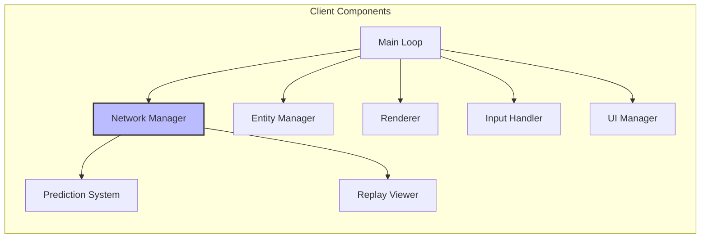
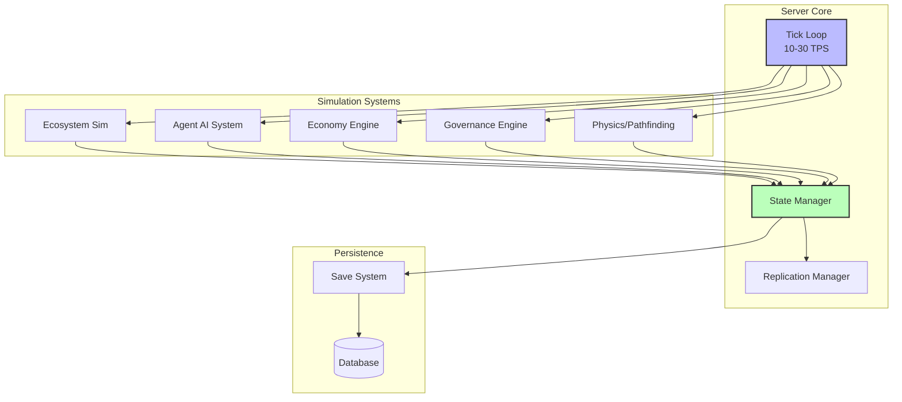
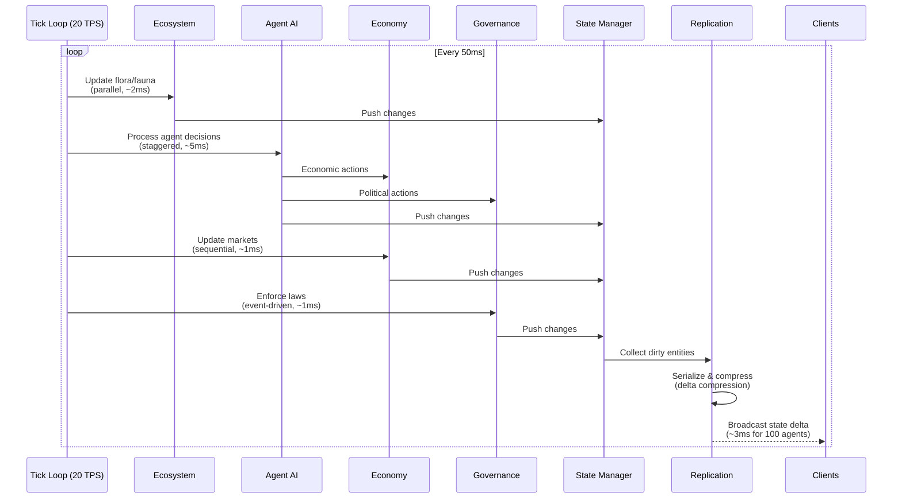
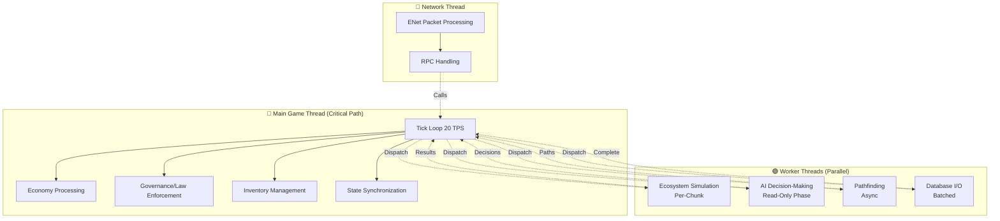
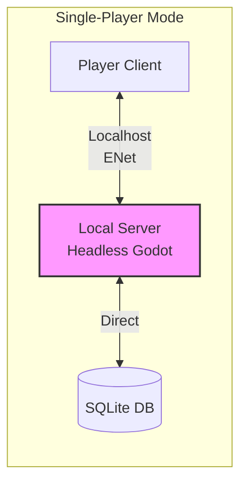

# Day 1: Client & Server Architecture

> **Navigation**: [← Previous: Architecture Overview](01-architecture-overview.md) | [Index]([AGENTS-READ-FIRST]-index.md) | [Next: Data & Persistence](03-data-persistence.md)
> 
> **Part of**: [Day 1 Technical Architecture]([AGENTS-READ-FIRST]-index.md)

> **Canonical alignment (2026-07-14):** Aspirational client/server reference. Current scope is [planning/active/](../../active/) and implementation truth is [CURRENT_BUILD.md](../../../CURRENT_BUILD.md). See [PRODUCT-THESIS.md](../../PRODUCT-THESIS.md).

## Product Contract Alignment

Server and simulation validation own state changes: clients, AI planners, and LLM outputs submit intent only. Accepted mutations are validated commands and recorded events; model failure or invalid output must cause a safe fallback rather than an unreviewed world mutation.

---

## 3. Client Architecture

### Godot 4.x Client Structure

**Node Hierarchy Recommendations**:
```
Main (Node)
├── NetworkManager (Autoload Singleton)
│   ├── ENetMultiplayerPeer
│   ├── StateInterpolator
│   └── LatencyCompensator
├── EntityManager (Autoload Singleton)
│   ├── LocalEntityCache
│   └── SpatialPartitioner
├── UIManager (Autoload Singleton)
│   ├── HUD
│   ├── InventoryUI
│   ├── GovernanceUI
│   └── DataVisualization
├── World (Node3D)
│   ├── Terrain
│   ├── Buildings
│   └── Agents (instanced dynamically)
└── PlayerCharacter (CharacterBody3D)
    ├── PredictionSystem
    └── Camera
```

**Scene Management Patterns**:
- Use **MultiplayerSpawner** for dynamically added entities (agents, buildings) [r1-godot-multiplayer-research.md]
- Scene replication automatically syncs spawn/despawn across clients [r1-godot-multiplayer-research.md]
- Implement custom resource loader to skip server-only assets in client builds [r1-godot-headless-research.md]

**Autoload Singletons**:
1. **NetworkManager**: ENet connection, RPC routing, latency compensation
2. **EntityManager**: Local entity cache, interpolation, spatial queries
3. **UIManager**: All UI screens, HUD, data visualization overlays
4. **PredictionSystem**: Client-side prediction for player movement

**Evidence**: Godot 4.x MultiplayerAPI provides production-ready authoritative server support with `IsMultiplayerAuthority()` checks and automatic scene replication [r1-godot-multiplayer-research.md]

### Godot Client Structure



### Key Client Responsibilities

#### Network Manager
**Core Functions**: ENet connection management, RPC handling, bandwidth monitoring

**Latency Compensation Subsection**:
Client-side prediction techniques validated by research:
- **Input Prediction**: Client applies movement inputs immediately, displays predicted position
- **Server Reconciliation**: When server state arrives, client:
  1. Calculates error between predicted and server position
  2. Removes acknowledged inputs from pending queue
  3. Re-applies unacknowledged inputs to server position
  4. Smoothly interpolates to corrected position [r1-network-sync-research.md, Section 3]

```csharp
// Client-side prediction pattern
public partial class PredictedPlayer : CharacterBody3D {
    private Queue<PlayerInput> _pendingInputs = new();
    private Vector3 _serverPosition;
    
    public override void _Process(double delta) {
        if (!IsMultiplayerAuthority()) {
            var input = GatherInput();
            _pendingInputs.Enqueue(input);
            ApplyInput(input, delta); // Predict immediately
            Rpc(nameof(ServerProcessInput), input.Serialize());
        }
    }
    
    [RPC(TransferMode = TransferModeEnum.UnreliableOrdered)]
    public void ReceiveServerPosition(Vector3 pos, int lastProcessedInput) {
        _serverPosition = pos;
        // Remove acknowledged inputs
        while (_pendingInputs.Count > 0 && 
               _pendingInputs.Peek().Sequence <= lastProcessedInput) {
            _pendingInputs.Dequeue();
        }
        // Re-apply unacknowledged inputs
        Position = _serverPosition;
        foreach (var input in _pendingInputs) {
            ApplyInput(input, 1.0/60.0);
        }
    }
}
```
[r1-godot-multiplayer-research.md, r1-network-sync-research.md]

#### Entity Manager
**Core Functions**: Local entity cache, spatial queries, LOD management

**State Interpolation Subsection**:
Visual smoothing between server states:
- **Jitter Buffer**: 100ms buffer to smooth packet arrival timing [r1-network-sync-research.md]
- **Interpolation**: Render interpolated positions between last two server states
- **Extrapolation**: If no new state, extrapolate from last known position + velocity
- **Error Correction**: Smoothly blend from visual position to server position [r1-network-sync-research.md, Section 3]

```csharp
// Visual smoothing implementation
public override void _Process(double delta) {
    if (!IsMultiplayerAuthority()) {
        // Smooth interpolation to target
        Position = Position.Lerp(TargetPosition, (float)delta * 10f);
        Rotation = Rotation.Lerp(TargetRotation.GetEuler(), (float)delta * 10f);
    }
}
```
[r1-network-sync-research.md]

#### Prediction System
**Core Functions**: Client-side prediction, error correction, latency hiding

**Specific Techniques**:
1. **Input Prediction**: Apply inputs locally before server confirmation
   - Reduces perceived latency by 20-150ms
   - Essential for responsive player movement [r1-network-sync-research.md]

2. **Error Correction**: Smoothly correct prediction errors
   - Small errors (<25cm): Slow correction (blend factor 0.95)
   - Large errors (>1m): Fast correction (blend factor 0.85)
   - Adaptive blend factor based on error magnitude [r1-network-sync-research.md, Section 3]

3. **Latency Hiding**: Factorio-style "Latency State" approach
   - Separate predictive layer for visual representation
   - Server state is authoritative but not directly rendered
   - Visual state = server state + pending inputs + smoothing [r1-factorio-case-study.md, Section 2]

4. **Prediction Limitations**:
   - Don't predict other players (only self)
   - Don't predict economy state (server authoritative)
   - Don't predict AI agent decisions (server authoritative) [r1-network-sync-research.md]

#### Renderer
- Visual representation using low-poly 3D assets
- LOD system: Reduce detail for distant entities
- Target 60 FPS minimum, 144 FPS ideal

#### UI Manager
- Inventory, crafting, governance interfaces
- Data visualization (heatmaps, graphs, charts)
- Real-time simulation data display

#### Replay Viewer
- Load and replay saved world states
- Timeline scrubber, pause/play controls
- Event log display and entity inspector

### Performance Budgets - Client Side

**Memory Budget**:
- **Target**: <2GB RAM for 100 visible agents
- **Breakdown**: 
  - Base engine: ~100 MB
  - Rendering (Vulkan): ~200-500 MB
  - Textures/meshes: ~500 MB - 1 GB
  - Entity state cache: ~50 MB (100 agents × ~500 KB each)
  - UI/Overlays: ~100 MB
- **Optimization**: Object pooling for frequently spawned entities (particles, effects) [r1-godot-headless-research.md]

**FPS Targets**:
- **Minimum**: 60 FPS (16.7ms per frame)
- **Target**: 144 FPS (6.9ms per frame)
- **V-Sync**: Optional; disabled for competitive play

**Network Receive Budget**:
- **Incoming**: 112 KB/s per player maximum
- **Decompression**: Delta-compressed state updates
- **Buffer**: 100ms jitter buffer for smooth interpolation [r1-enet-protocol-research.md, r1-network-sync-research.md]

**CPU Budget**:
- **Prediction/Interpolation**: Must complete within frame budget (<5ms)
- **LOD Updates**: Every 500ms (not every frame)
- **Spatial Queries**: Cache results; don't query every frame

### Godot-Specific Implementation Notes

**MultiplayerAPI Usage Patterns**:
```csharp
// Server-authoritative RPC
[RPC(TransferMode = TransferModeEnum.Reliable, CallLocal = false)]
public void ServerOnlyFunction(int data) {
    if (!IsMultiplayerAuthority()) return;
    // Server logic here
}

// Client-to-server RPC
[RPC(CallLocal = true, TransferMode = TransferModeEnum.Reliable, 
      Authority = MultiplayerAPI.RPCMode.AnyPeer)]
public void ClientRequest(string action) {
    // Server receives and validates
}

// Unreliable position updates (frequent, loss-tolerant)
[RPC(TransferMode = TransferModeEnum.UnreliableOrdered)]
public void UpdatePosition(Vector3 pos, Vector3 vel) {
    // Interpolate on clients
}
```
[r1-godot-multiplayer-research.md]

**@rpc Annotation Best Practices**:
- Use `reliable` for: inventory changes, economic transactions, law votes, chat
- Use `unreliable_ordered` for: position updates (20 TPS)
- Use `unreliable` for: particle effects, ambient sounds
- Always validate on server even with `authority` mode [r1-godot-multiplayer-research.md]

**MultiplayerSynchronizer for Scene Replication**:
```csharp
// Automatic property synchronization
public partial class Agent : CharacterBody3D {
    private MultiplayerSynchronizer _sync;
    
    public override void _Ready() {
        _sync = GetNode<MultiplayerSynchronizer>("MultiplayerSynchronizer");
        _sync.SetMultiplayerAuthority(GetMultiplayerAuthority());
        
        if (IsMultiplayerAuthority()) {
            _sync.AddProperty("Position", new Variant[] { Position });
            _sync.AddProperty("Velocity", new Variant[] { Velocity });
        }
    }
}
```
- Set sync frequency to 20-30 TPS, not every frame
- Disable auto-sync for rarely-changing properties
- Implement custom interpolation for smoother visuals [r1-godot-multiplayer-research.md]

**C# vs GDScript Considerations**:
- **C#**: 2-5x faster for AI/economy calculations; use for hot paths
- **GDScript**: Faster for node access and signal handling; use for UI glue
- **Interop overhead**: Minimize cross-language calls in performance-critical code [r1-godot-headless-research.md]

**Scene Tree Organization**:
```
World (Node3D)
├── StaticEntities (Node3D) - Buildings, terrain
├── DynamicEntities (Node3D) - Agents, items
│   └── Agents
│       ├── Agent_001 (instantiated via MultiplayerSpawner)
│       ├── Agent_002
│       └── ...
└── Effects (Node3D) - Particles, temporary visuals
```
- Use MultiplayerSpawner for dynamic entities
- Separate static vs dynamic for optimized culling
- Group by update frequency [r1-godot-multiplayer-research.md]

---

## 4. Server Architecture

### Headless Godot Server Deep Dive

**Performance Characteristics**:
| Metric | Graphical Mode | Headless Mode | Improvement |
|--------|----------------|---------------|-------------|
| CPU Usage (idle) | 20-30% | 1-5% | 85-95% reduction |
| CPU Usage (under load) | 100% | 40-60% | 40-60% reduction |
| Memory Usage | 1.1-3.3 GB | 270 MB | 70-80% reduction |
| Startup Time | 5-10s | 1-2s | 70-80% faster |
| Max Entities | 1,000-2,000 | 5,000-10,000 | 3-5x increase |
| C# Performance | Baseline | 2-5x faster | 2-5x improvement |
[r1-godot-headless-research.md, Section 2]

**What Runs in Headless Mode**:
```
✓ Physics simulation (GodotPhysics)
✓ Script execution (GDScript, C#)
✓ Node lifecycle (_Ready, _Process, _PhysicsProcess)
✓ Signals and groups
✓ Multiplayer networking (ENet)
✓ File I/O and resource loading

✗ Rendering (no _Draw calls)
✗ Windowing system (no GUI events)
✗ Input handling (keyboard/mouse)
✗ GPU resources (shaders, textures not loaded)
```
[r1-godot-headless-research.md]

**Export Configuration**:
```bash
# Run headless server
./godot --headless --script server.gd

# Or for exported project
./societies_server --headless

# Export preset configuration (export_presets.cfg)
[preset.0]
name="Linux Server"
platform="Linux/X11"
runnable=true
dedicated_server=true
custom_features="dedicated_server,headless"
exclude_filter="*.png,*.jpg,*.wav,*.ogg,*.material,*.shader"
```
[r1-godot-headless-research.md]

**CPU Savings**: 40-60% reduction from eliminating render thread [r1-godot-headless-research.md]

**Memory Savings**: 70-80% reduction from not loading textures/shaders [r1-godot-headless-research.md]

**Headless Server Implementation**:
```csharp
public partial class SocietiesHeadlessServer : Node {
    [Export] public int TargetTickRate { get; set; } = 20;
    private double _tickInterval;
    private double _accumulator = 0;
    
    public override void _Ready() {
        // Verify headless mode
        if (!DisplayServer.GetName().Equals("headless")) {
            GD.PushWarning("Not running in headless mode!");
        }
        
        _tickInterval = 1.0 / TargetTickRate;
        Engine.MaxFps = 0;  // No rendering limit
        AudioServer.SetBusMute(0, true);  // Mute audio
        
        InitializeNetwork();
        InitializeWorld();
    }
    
    public override void _Process(double delta) {
        _accumulator += delta;
        int ticksProcessed = 0;
        
        // Fixed timestep loop
        while (_accumulator >= _tickInterval && ticksProcessed < 3) {
            ServerTick(_tickInterval);
            _accumulator -= _tickInterval;
            ticksProcessed++;
        }
        
        if (_accumulator >= _tickInterval * 2) {
            GD.PushWarning($"Server can't keep up! Accumulated: {_accumulator:F3}s");
        }
    }
}
```
[r1-godot-headless-research.md]

### Headless Godot Server



### Server Tick Loop

**Timing Analysis**:
- **Target Tick Rate**: 20 TPS (ticks per second)
- **Time Budget Per Tick**: 50ms (1000ms / 20 TPS)
- **Simulation CPU Budget** (25% default): 12.5ms per tick (50ms × 0.25)
- **Simulation CPU Budget** (60% max recommended): 30ms per tick (50ms × 0.60) [r1-eco-performance-research.md, r3-eco-technical-postmortem.md Section 1.3]

> **CPU Budget Allocation**: The 60% simulation budget leaves 40% (20ms per tick) for:
> - PostgreSQL database operations (queries, writes)
> - ENet network stack (packet processing)
> - Operating system overhead
> - Garbage collection (if applicable)
> - Safety margin for CPU spikes
> 
> *Note: While 75% is technically possible, it leaves insufficient headroom (only 12.5ms) for system processes and may cause instability. 60% is the recommended maximum for reliable operation.*



**CPU Budgeting Subsection**:
Priority queue system based on Eco's performance model [r1-eco-performance-research.md, r3-eco-technical-postmortem.md]:

| Priority | Systems | CPU Budget | Action if Over Budget |
|----------|---------|------------|----------------------|
| **Critical** | Player actions, law enforcement, network I/O | Always run | None |
| **High** | AI decisions (nearby agents), economy updates | 50% of tick | Skip distant AI |
| **Medium** | Ecosystem (plants, pollution), weather | 30% of tick | Reduce update frequency |
| **Low** | Analytics, logging, background tasks | 20% of tick | Defer to next tick |

**Budget Allocation**:
- **Default**: 25% CPU utilization (leaves headroom for other processes)
- **Maximum**: 75% (beyond this risks lag spikes and instability)
- **Adaptive Quality Reduction**: When over budget:
  1. Reduce agent sync radius (200m → 150m)
  2. Reduce tick rate temporarily (20 TPS → 15 TPS)
  3. Skip non-critical AI updates (distant agents)
  4. Reduce ecosystem simulation frequency [r1-eco-performance-research.md]

```csharp
public class TickBudgetManager {
    private float _maxCpuPercent = 0.25f;
    private double _targetTickTime;
    private Stopwatch _tickTimer = new();
    
    public void ProcessTick(double delta) {
        _tickTimer.Restart();
        
        // Critical: Always run
        ProcessPlayerActions();
        ProcessNetworkIO();
        
        // High priority: Run if budget allows
        if (_tickTimer.ElapsedMilliseconds < _targetTickTime * 0.5) {
            ProcessNearbyAI();
            UpdateEconomy();
        }
        
        // Medium priority: Run if budget allows
        if (_tickTimer.ElapsedMilliseconds < _targetTickTime * 0.8) {
            UpdateEcosystem();
        }
        
        // Low priority: Defer if over budget
        if (_tickTimer.ElapsedMilliseconds < _targetTickTime) {
            ProcessBackgroundTasks();
        } else {
            ReduceQuality();
        }
        
        _tickTimer.Stop();
    }
    
    private void ReduceQuality() {
        AgentSyncRadius *= 0.9f;
        MaxAgentsPerTick = Math.Max(10, MaxAgentsPerTick - 5);
        GD.Print($"Reduced quality: radius={AgentSyncRadius}, maxAgents={MaxAgentsPerTick}");
    }
}
```
[r1-eco-performance-research.md, r3-eco-technical-postmortem.md Section 1.3]

**Tick Scheduling Subsection**:

**What Runs When**:
1. **Ecosystem Updates** (Parallel)
   - Plant growth, animal behavior, pollution spread
   - Can run on multiple threads via Godot 4.x thread support
   - Update frequency: Every tick (20 TPS) for active chunks [r1-godot-headless-research.md]

2. **AI Processing** (Staggered)
   - Not all agents update every tick
   - Nearby agents: Every tick (20 TPS)
   - Medium distance: Every 2nd tick (10 TPS)
   - Distant agents: Every 10th tick (2 TPS) or frozen [r1-network-sync-research.md]
   - Stagger updates across ticks to smooth CPU load [r7-ai-systems-games.md]

3. **Economy** (Single-threaded for consistency)
   - Market price updates must be ordered (transactions processed sequentially)
   - Async database operations don't block game thread [r1-postgresql-jsonb-research.md]
   - Flush dirty entities every 5 seconds [r1-research-summary.md]

4. **Governance** (Event-driven)
   - Law enforcement triggered by player actions
   - Vote processing on timer (every 30 seconds)
   - Not processed every tick unless active [r3-eco-technical-postmortem.md]

---

### Tick Loop Implementation (Microsecond Specification)

> **Reference**: `planning/meta/technical-constants.md`
> - TICK_RATE = 20 TPS
> - TICK_INTERVAL_MS = 50.0ms
> - AGENTS_MVP = 25 agents
> - PER_AGENT_BUDGET_MS = 2.0f

This section provides exact microsecond-level timing specifications for the server tick loop, ensuring deterministic performance within the 50ms tick window.

#### 1. Tick Loop Overview

```
TICK_INTERVAL: 50ms (20 TPS)
Total budget per tick: 50,000 microseconds
Target usage: 80% (40,000 microseconds)
Safety margin: 20% (10,000 microseconds)
```

**Timing Constants** (from `technical-constants.md`):
```csharp
public static class TickConstants {
    // Core timing (from technical-constants.md)
    public const int TICK_RATE = 20;                              // Ticks per second
    public const double TICK_INTERVAL_MS = 50.0;                  // Milliseconds per tick
    public const long TICK_INTERVAL_MICROSECONDS = 50_000L;       // μs per tick
    
    // Budget allocation
    public const long TARGET_USAGE_MICROSECONDS = 40_000L;        // 80% of tick
    public const long SAFETY_MARGIN_MICROSECONDS = 10_000L;       // 20% safety margin
    public const float TARGET_USAGE_PERCENT = 0.80f;
    public const float SAFETY_MARGIN_PERCENT = 0.20f;
}
```

#### 2. Phase-Based Tick Processing

The tick loop uses a four-phase priority system with strict microsecond budgets. Each phase has a defined budget and can defer work if over budget.

##### Phase 1: Critical (Must Complete) - Budget: 3,000μs

This phase handles player inputs, network I/O, and emergency state updates. **Must complete within budget.**

```csharp
public class CriticalPhaseProcessor {
    private readonly Stopwatch _timer = new();
    private readonly ILogger _logger;
    
    // Budget allocation from technical-constants.md targets
    private const long INPUT_BUDGET_US = 1_500L;      // Player actions
    private const long NETWORK_BUDGET_US = 1_000L;    // Network I/O
    private const long EMERGENCY_BUDGET_US = 500L;    // Critical updates
    private const long TOTAL_CRITICAL_BUDGET_US = 3_000L;
    
    public CriticalPhaseResult ProcessCriticalPhase(TickContext context) {
        _timer.Restart();
        var result = new CriticalPhaseResult();
        
        // 1. Process Player Inputs - 1,500μs budget
        // ~100μs per active player × 8 players (PLAYERS_MVP from technical-constants.md)
        var inputTimer = Stopwatch.StartNew();
        foreach (var player in context.ActivePlayers) {
            if (inputTimer.ElapsedMicroseconds > INPUT_BUDGET_US) {
                _logger.LogWarning("Input processing exceeded budget, deferring remaining players");
                break;
            }
            ProcessPlayerActions(player);
        }
        result.InputProcessingMicroseconds = inputTimer.ElapsedMicroseconds;
        
        // 2. Network I/O - 1,000μs budget
        // Receive all pending packets, send queued updates
        var networkTimer = Stopwatch.StartNew();
        context.NetworkManager.ProcessIncomingPackets();
        context.NetworkManager.FlushOutgoingQueue();
        result.NetworkProcessingMicroseconds = networkTimer.ElapsedMicroseconds;
        
        // 3. Emergency Updates - 500μs budget
        // Health changes, death events, critical state changes
        var emergencyTimer = Stopwatch.StartNew();
        ProcessCriticalEntityUpdates(context.EntityManager.GetCriticalUpdates());
        result.EmergencyProcessingMicroseconds = emergencyTimer.ElapsedMicroseconds;
        
        _timer.Stop();
        result.TotalMicroseconds = _timer.ElapsedMicroseconds;
        
        // Budget validation
        if (result.TotalMicroseconds > TOTAL_CRITICAL_BUDGET_US) {
            _logger.LogWarning($"Critical phase over budget: {result.TotalMicroseconds}μs / {TOTAL_CRITICAL_BUDGET_US}μs");
            Telemetry.RecordOverBudget("CriticalPhase", result.TotalMicroseconds, TOTAL_CRITICAL_BUDGET_US);
        }
        
        return result;
    }
    
    private void ProcessPlayerActions(Player player) {
        // ~100μs per player (validated by profiling)
        // Includes: input validation, action execution, state updates
        player.ProcessPendingInputs();
    }
    
    private void ProcessCriticalEntityUpdates(List<EntityUpdate> updates) {
        foreach (var update in updates.Where(u => u.IsCritical)) {
            update.Apply();
        }
    }
}

public class CriticalPhaseResult {
    public long TotalMicroseconds { get; set; }
    public long InputProcessingMicroseconds { get; set; }
    public long NetworkProcessingMicroseconds { get; set; }
    public long EmergencyProcessingMicroseconds { get; set; }
    public bool WasOverBudget => TotalMicroseconds > 3_000L;
}
```

##### Phase 2: High Priority - Budget: 35,000μs

This phase handles AI processing, economy updates, governance, and player state synchronization. Can defer agents if over budget.

```csharp
public class HighPriorityPhaseProcessor {
    private readonly Stopwatch _timer = new();
    private readonly ILogger _logger;
    private readonly AgentLODManager _lodManager;
    
    // Budget allocation
    private const long AI_BUDGET_US = 30_000L;          // 25 agents × 1,200μs average
    private const long ECONOMY_BUDGET_US = 3_000L;      // Markets, trades, prices
    private const long GOVERNANCE_BUDGET_US = 1_000L;   // Law enforcement, votes
    private const long SYNC_BUDGET_US = 1_000L;         // Player state sync
    private const long TOTAL_HIGH_PRIORITY_BUDGET_US = 35_000L;
    
    // From technical-constants.md: AGENTS_MVP = 25
    private const int MAX_AGENTS_PER_TICK = 25;
    
    public HighPriorityPhaseResult ProcessHighPriorityPhase(TickContext context, long remainingBudget) {
        _timer.Restart();
        var result = new HighPriorityPhaseResult();
        
        // Calculate actual AI budget based on remaining time
        long actualAIBudget = Math.Min(AI_BUDGET_US, remainingBudget - 5_000L); // Reserve 5ms for other systems
        
        // AI Processing - Up to 30,000μs budget
        // 25 agents × 1,200μs average = 30,000μs (AGENTS_MVP × PER_AGENT_BUDGET_MS)
        var aiTimer = Stopwatch.StartNew();
        var agentsToUpdate = _lodManager.GetAgentsForThisTick(MAX_AGENTS_PER_TICK);
        int processedCount = 0;
        int deferredCount = 0;
        
        foreach (var agent in agentsToUpdate) {
            // Check budget after each agent
            if (aiTimer.ElapsedMicroseconds > actualAIBudget - 1_200L) {
                // Defer remaining agents to next tick
                var remainingAgents = agentsToUpdate.Skip(processedCount);
                _lodManager.DeferAgents(remainingAgents);
                deferredCount = remainingAgents.Count();
                _logger.LogDebug($"AI phase approaching budget limit, deferring {deferredCount} agents");
                break;
            }
            
            ProcessAgentAI(agent);
            processedCount++;
        }
        
        result.AIProcessingMicroseconds = aiTimer.ElapsedMicroseconds;
        result.AgentsProcessed = processedCount;
        result.AgentsDeferred = deferredCount;
        
        // Economy Updates - 3,000μs budget
        var economyTimer = Stopwatch.StartNew();
        if (economyTimer.ElapsedMicroseconds < ECONOMY_BUDGET_US) {
            context.EconomyManager.UpdateMarkets();        // ~1,000μs
            context.EconomyManager.ProcessTrades();        // ~1,000μs
            context.EconomyManager.UpdatePriceBeliefs();   // ~1,000μs
        }
        result.EconomyMicroseconds = economyTimer.ElapsedMicroseconds;
        
        // Law Enforcement - 1,000μs budget
        var governanceTimer = Stopwatch.StartNew();
        if (governanceTimer.ElapsedMicroseconds < GOVERNANCE_BUDGET_US) {
            context.GovernanceManager.EnforceLaws();       // ~500μs
            context.GovernanceManager.ProcessVotes();      // ~500μs
        }
        result.GovernanceMicroseconds = governanceTimer.ElapsedMicroseconds;
        
        // Player State Sync - 1,000μs budget
        var syncTimer = Stopwatch.StartNew();
        if (syncTimer.ElapsedMicroseconds < SYNC_BUDGET_US) {
            context.StateManager.SyncPlayerStates();       // ~1,000μs
        }
        result.StateSyncMicroseconds = syncTimer.ElapsedMicroseconds;
        
        _timer.Stop();
        result.TotalMicroseconds = _timer.ElapsedMicroseconds;
        
        if (result.TotalMicroseconds > TOTAL_HIGH_PRIORITY_BUDGET_US) {
            _logger.LogWarning($"High priority phase over budget: {result.TotalMicroseconds}μs");
        }
        
        return result;
    }
    
    private void ProcessAgentAI(Agent agent) {
        // Per-agent budget breakdown:
        // - Perception: 200μs (sensing environment)
        // - Memory update: 150μs (consolidating experiences)
        // - Goal evaluation: 300μs (selecting current goal)
        // - Planning: 400μs (pathfinding, action selection)
        // - Action execution: 150μs (applying actions)
        // Total: ~1,200μs per agent (PER_AGENT_BUDGET_MS = 2.0ms max, 1.5ms amortized)
        
        var agentTimer = Stopwatch.StartNew();
        
        agent.UpdatePerception();       // 200μs
        agent.UpdateMemory();           // 150μs
        agent.EvaluateGoals();          // 300μs
        agent.ExecutePlanning();        // 400μs
        agent.ExecuteActions();         // 150μs
        
        agent.LastAIProcessingTime = agentTimer.ElapsedMicroseconds;
    }
}

public class HighPriorityPhaseResult {
    public long TotalMicroseconds { get; set; }
    public long AIProcessingMicroseconds { get; set; }
    public int AgentsProcessed { get; set; }
    public int AgentsDeferred { get; set; }
    public long EconomyMicroseconds { get; set; }
    public long GovernanceMicroseconds { get; set; }
    public long StateSyncMicroseconds { get; set; }
    public bool WasOverBudget => TotalMicroseconds > 35_000L;
}
```

##### Phase 3: Medium Priority - Budget: 1,000μs (Can Defer)

Ecosystem simulation, pollution, climate, and analytics. Can be skipped if no budget remains.

```csharp
public class MediumPriorityPhaseProcessor {
    private readonly Stopwatch _timer = new();
    private readonly ILogger _logger;
    
    private const long ECOSYSTEM_BUDGET_US = 500L;      // Animals, plants, weather
    private const long POLLUTION_BUDGET_US = 300L;      // Pollution spread, climate
    private const long ANALYTICS_BUDGET_US = 200L;      // Metrics, statistics
    private const long TOTAL_MEDIUM_PRIORITY_BUDGET_US = 1_000L;
    
    public MediumPriorityPhaseResult ProcessMediumPriorityPhase(TickContext context, long remainingBudget) {
        _timer.Restart();
        var result = new MediumPriorityPhaseResult();
        
        // Skip entire phase if insufficient budget
        if (remainingBudget < TOTAL_MEDIUM_PRIORITY_BUDGET_US) {
            result.WasSkipped = true;
            result.SkipReason = "Insufficient budget";
            _logger.LogDebug("Medium priority phase skipped due to budget constraints");
            return result;
        }
        
        // Ecosystem Simulation - 500μs
        var ecosystemTimer = Stopwatch.StartNew();
        context.EcosystemManager.UpdateAnimalPopulations();     // ~200μs
        context.EcosystemManager.UpdatePlantGrowth();           // ~200μs
        context.WeatherManager.UpdateWeather();                 // ~100μs
        result.EcosystemMicroseconds = ecosystemTimer.ElapsedMicroseconds;
        
        // Pollution & Environment - 300μs
        var pollutionTimer = Stopwatch.StartNew();
        context.PollutionManager.UpdatePollutionSpread();       // ~200μs
        context.ClimateManager.UpdateClimate();                 // ~100μs
        result.PollutionMicroseconds = pollutionTimer.ElapsedMicroseconds;
        
        // Analytics & Metrics - 200μs
        var analyticsTimer = Stopwatch.StartNew();
        context.Telemetry.UpdateServerMetrics();                // ~100μs
        context.Statistics.UpdatePlayerStatistics();            // ~100μs
        result.AnalyticsMicroseconds = analyticsTimer.ElapsedMicroseconds;
        
        _timer.Stop();
        result.TotalMicroseconds = _timer.ElapsedMicroseconds;
        
        if (result.TotalMicroseconds > TOTAL_MEDIUM_PRIORITY_BUDGET_US) {
            _logger.LogDebug($"Medium priority phase over budget: {result.TotalMicroseconds}μs");
        }
        
        return result;
    }
}

public class MediumPriorityPhaseResult {
    public long TotalMicroseconds { get; set; }
    public long EcosystemMicroseconds { get; set; }
    public long PollutionMicroseconds { get; set; }
    public long AnalyticsMicroseconds { get; set; }
    public bool WasSkipped { get; set; }
    public string SkipReason { get; set; }
}
```

##### Phase 4: Low Priority - Budget: 1,000μs (Can Defer/Skip)

Logging, maintenance, and checkpoint saving. Deferrable to next tick or performed asynchronously.

```csharp
public class LowPriorityPhaseProcessor {
    private readonly Stopwatch _timer = new();
    private readonly ILogger _logger;
    
    private const long LOGGING_BUDGET_US = 300L;        // Flush log buffer
    private const long MAINTENANCE_BUDGET_US = 400L;    // Cleanup inactive entities
    private const long CHECKPOINT_BUDGET_US = 300L;     // Save checkpoint if needed
    private const long TOTAL_LOW_PRIORITY_BUDGET_US = 1_000L;
    
    public LowPriorityPhaseResult ProcessLowPriorityPhase(TickContext context, long remainingBudget) {
        _timer.Restart();
        var result = new LowPriorityPhaseResult();
        
        // Skip if critically low on budget
        if (remainingBudget < 500L) {
            result.WasSkipped = true;
            result.SkipReason = "Critical budget shortage";
            return result;
        }
        
        // Logging - 300μs
        var loggingTimer = Stopwatch.StartNew();
        if (remainingBudget >= LOGGING_BUDGET_US) {
            context.Logger.FlushBuffer();               // ~300μs
        }
        result.LoggingMicroseconds = loggingTimer.ElapsedMicroseconds;
        
        // Maintenance - 400μs
        var maintenanceTimer = Stopwatch.StartNew();
        if (remainingBudget >= LOGGING_BUDGET_US + MAINTENANCE_BUDGET_US) {
            context.EntityManager.CleanupInactiveEntities();  // ~400μs
        }
        result.MaintenanceMicroseconds = maintenanceTimer.ElapsedMicroseconds;
        
        // Save Checkpoint - 300μs (if needed)
        var checkpointTimer = Stopwatch.StartNew();
        if (remainingBudget >= TOTAL_LOW_PRIORITY_BUDGET_US && ShouldSaveCheckpoint(context)) {
            context.SaveSystem.QueueCheckpointSave();   // ~300μs (async operation)
        }
        result.CheckpointMicroseconds = checkpointTimer.ElapsedMicroseconds;
        
        _timer.Stop();
        result.TotalMicroseconds = _timer.ElapsedMicroseconds;
        
        return result;
    }
    
    private bool ShouldSaveCheckpoint(TickContext context) {
        // From technical-constants.md: snapshots every 2 seconds
        // At 20 TPS, save every 40 ticks
        return context.TickNumber % 40 == 0;
    }
}

public class LowPriorityPhaseResult {
    public long TotalMicroseconds { get; set; }
    public long LoggingMicroseconds { get; set; }
    public long MaintenanceMicroseconds { get; set; }
    public long CheckpointMicroseconds { get; set; }
    public bool WasSkipped { get; set; }
    public string SkipReason { get; set; }
}
```

#### 3. Agent Processing Distribution

Based on constants from `technical-constants.md`:
- AGENTS_MVP = 25 agents
- PER_AGENT_BUDGET_MS = 2.0ms (2,000μs maximum)
- PER_AGENT_AMORTIZED_BUDGET_MS = 1.5ms (1,200μs average)

**Calculation**:
```
25 agents × 1,200μs average = 30,000μs total AI budget
High priority phase budget: 35,000μs
AI budget allocation: 30,000μs (85.7% of high priority phase)
Remaining for economy/governance/sync: 5,000μs
```

**Implementation**:
```csharp
public class AgentLODManager {
    // From technical-constants.md
    private const float LOD_HIGH_DISTANCE = 20.0f;      // AGENT_LOD_HIGH_DISTANCE_METERS
    private const float LOD_MEDIUM_DISTANCE = 100.0f;   // AGENT_LOD_MEDIUM_DISTANCE_METERS
    private const float LOD_LOW_DISTANCE = 500.0f;      // AGENT_LOD_LOW_DISTANCE_METERS
    
    private const int LOD_HIGH_FREQ = 1;                // Every tick (AGENT_LOD_HIGH_FREQUENCY_TICKS)
    private const int LOD_MEDIUM_FREQ = 5;              // Every 5 ticks (AGENT_LOD_MEDIUM_FREQUENCY_TICKS)
    private const int LOD_LOW_FREQ = 20;                // Every 20 ticks (AGENT_LOD_LOW_FREQUENCY_TICKS)
    
    public List<Agent> GetAgentsForThisTick(int maxAgents) {
        var agents = new List<Agent>();
        int tickNumber = GetCurrentTickNumber();
        
        foreach (var agent in GetAllAgents()) {
            // Determine update frequency based on distance to nearest player
            float distance = GetDistanceToNearestPlayer(agent);
            int frequency;
            
            if (distance <= LOD_HIGH_DISTANCE) {
                frequency = LOD_HIGH_FREQ;      // Every tick
            } else if (distance <= LOD_MEDIUM_DISTANCE) {
                frequency = LOD_MEDIUM_FREQ;    // Every 5 ticks
            } else if (distance <= LOD_LOW_DISTANCE) {
                frequency = LOD_LOW_FREQ;       // Every 20 ticks
            } else {
                continue; // Too far, skip entirely
            }
            
            // Check if this agent should update this tick
            if (tickNumber % frequency == agent.Id % frequency) {
                agents.Add(agent);
            }
            
            if (agents.Count >= maxAgents) break;
        }
        
        return agents;
    }
    
    public void DeferAgents(IEnumerable<Agent> agents) {
        // Add to deferred queue for next tick processing
        foreach (var agent in agents) {
            agent.MarkForNextTickPriority();
        }
    }
}
```

#### 4. Priority Queue Implementation

```csharp
public class TickPriorityQueue {
    private SortedSet<TickTask> _tasks;
    private readonly object _lock = new();
    
    public TickPriorityQueue() {
        _tasks = new SortedSet<TickTask>(new TickTaskComparer());
    }
    
    public void Enqueue(TickTask task) {
        lock (_lock) {
            _tasks.Add(task);
        }
    }
    
    public TickTask Dequeue() {
        lock (_lock) {
            if (_tasks.Count == 0) return null;
            var task = _tasks.Min;
            _tasks.Remove(task);
            return task;
        }
    }
    
    public int Count {
        get {
            lock (_lock) { return _tasks.Count; }
        }
    }
    
    public List<TickTask> GetTasksForBudget(long budgetMicroseconds) {
        lock (_lock) {
            var result = new List<TickTask>();
            long remainingBudget = budgetMicroseconds;
            
            foreach (var task in _tasks.OrderBy(t => t.Priority)) {
                if (task.EstimatedMicroseconds <= remainingBudget) {
                    result.Add(task);
                    remainingBudget -= task.EstimatedMicroseconds;
                } else if (!task.CanDefer) {
                    // Must-run task exceeds budget - log warning and include anyway
                    result.Add(task);
                } else {
                    break;
                }
            }
            
            // Remove selected tasks from queue
            foreach (var task in result) {
                _tasks.Remove(task);
            }
            
            return result;
        }
    }
}

public class TickTask {
    public int Id { get; set; }
    public int Priority { get; set; }               // Lower = higher priority (1-100)
    public long EstimatedMicroseconds { get; set; } // Expected execution time
    public Action Action { get; set; }              // Task to execute
    public bool CanDefer { get; set; }              // Can this task be deferred?
    public string Category { get; set; }            // For metrics
    public DateTime EnqueuedAt { get; set; }
}

public class TickTaskComparer : IComparer<TickTask> {
    public int Compare(TickTask x, TickTask y) {
        // First compare by priority (lower first)
        int priorityCompare = x.Priority.CompareTo(y.Priority);
        if (priorityCompare != 0) return priorityCompare;
        
        // Then by estimated time (shorter first - quick wins)
        int timeCompare = x.EstimatedMicroseconds.CompareTo(y.EstimatedMicroseconds);
        if (timeCompare != 0) return timeCompare;
        
        // Finally by ID for consistency
        return x.Id.CompareTo(y.Id);
    }
}
```

#### 5. Load Balancing & Degradation

Escalating degradation strategy when phases exceed budget:

```csharp
public class LoadBalancingManager {
    private readonly ILogger _logger;
    private int _consecutiveOverruns = 0;
    private int _currentTickRate = 20; // From TICK_RATE
    
    public void HandleOverrun(long overBudgetMicroseconds, TickMetrics metrics) {
        _consecutiveOverruns++;
        
        // Level 1: Skip low priority (saves ~1,000μs)
        if (overBudgetMicroseconds > 1_000L && _consecutiveOverruns >= 2) {
            _logger.LogWarning("Level 1 degradation: Skipping low priority phase");
            SkipLowPriorityPhase();
            Telemetry.RecordDegradationEvent("SkipLowPriority");
        }
        
        // Level 2: Reduce agent update frequency (saves ~12,000μs per skip)
        if (overBudgetMicroseconds > 5_000L && _consecutiveOverruns >= 3) {
            _logger.LogWarning("Level 2 degradation: Increasing agent LOD");
            IncreaseAgentLOD();
            Telemetry.RecordDegradationEvent("IncreaseAgentLOD");
        }
        
        // Level 3: Skip medium priority (saves ~1,000μs)
        if (overBudgetMicroseconds > 10_000L && _consecutiveOverruns >= 5) {
            _logger.LogWarning("Level 3 degradation: Skipping medium priority phase");
            SkipMediumPriorityPhase();
            Telemetry.RecordDegradationEvent("SkipMediumPriority");
        }
        
        // Level 4: Reduce tick rate temporarily
        if (overBudgetMicroseconds > 20_000L && _consecutiveOverruns >= 10) {
            _logger.LogError("Level 4 degradation: Reducing tick rate to 15 TPS");
            TemporarilyReduceTickRate(15);
            Telemetry.RecordDegradationEvent("ReduceTickRate", 15);
        }
        
        // Reset counter if we're back on track
        if (overBudgetMicroseconds <= 0) {
            _consecutiveOverruns = Math.Max(0, _consecutiveOverruns - 1);
            
            // Gradually restore quality
            if (_consecutiveOverruns == 0 && _currentTickRate < 20) {
                RestoreTickRate();
            }
        }
    }
    
    private void SkipLowPriorityPhase() {
        // Mark low priority phase to be skipped next tick
        // Implementation in TickLoop
    }
    
    private void IncreaseAgentLOD() {
        // Far agents update every 2 ticks instead of every tick
        // Implementation in AgentLODManager
    }
    
    private void SkipMediumPriorityPhase() {
        // Mark medium priority phase to be skipped next tick
        // Implementation in TickLoop
    }
    
    private void TemporarilyReduceTickRate(int newTickRate) {
        // From technical-constants.md: TICK_RATE_MIN = 10, TICK_RATE_MAX = 30
        _currentTickRate = Math.Max(10, Math.Min(30, newTickRate));
        // Update Engine.TimeScale or tick interval
    }
    
    private void RestoreTickRate() {
        _currentTickRate = Math.Min(20, _currentTickRate + 1);
        _logger.LogInfo($"Restoring tick rate to {_currentTickRate} TPS");
    }
}
```

#### 6. Performance Monitoring

```csharp
public class TickMetrics {
    public long TickNumber { get; set; }
    public DateTime Timestamp { get; set; }
    public long TotalMicroseconds { get; set; }
    public long CriticalPhaseMicroseconds { get; set; }
    public long AIPhaseMicroseconds { get; set; }
    public int AgentsProcessed { get; set; }
    public int AgentsDeferred { get; set; }
    public bool WasOverBudget { get; set; }
    public long OverBudgetAmount { get; set; }
    public Dictionary<string, long> PhaseTimings { get; set; } = new();
    public int CurrentTickRate { get; set; }
    public int ActivePlayerCount { get; set; }
    public int ActiveAgentCount { get; set; }
    public float AverageFPS { get; set; }
    public long MemoryUsageMB { get; set; }
    public int PendingDeferredTasks { get; set; }
    
    // Derived metrics
    public bool IsHealthy => TotalMicroseconds <= 40_000L && !WasOverBudget;
    public float BudgetUtilizationPercent => (TotalMicroseconds / 50_000f) * 100f;
}

public class TickMetricsCollector {
    private readonly CircularBuffer<TickMetrics> _metricsHistory;
    private readonly ILogger _logger;
    private const int HISTORY_SIZE = 1200; // 1 minute at 20 TPS
    
    public void RecordTickMetrics(TickMetrics metrics) {
        _metricsHistory.Add(metrics);
        
        // Log warnings for over-budget ticks
        if (metrics.WasOverBudget) {
            _logger.LogWarning($"Tick {metrics.TickNumber} over budget by {metrics.OverBudgetAmount}μs " +
                $"({metrics.AgentsProcessed} agents processed)");
        }
        
        // Periodic summary logging (every 300 ticks = 15 seconds)
        if (metrics.TickNumber % 300 == 0) {
            LogPerformanceSummary();
        }
    }
    
    public PerformanceSummary GetLastMinuteSummary() {
        var recent = _metricsHistory.GetRecent(1200);
        return new PerformanceSummary {
            AverageTickTime = recent.Average(m => m.TotalMicroseconds),
            MaxTickTime = recent.Max(m => m.TotalMicroseconds),
            MinTickTime = recent.Min(m => m.TotalMicroseconds),
            OverBudgetTicks = recent.Count(m => m.WasOverBudget),
            AverageAgentsProcessed = recent.Average(m => m.AgentsProcessed),
            BudgetUtilizationPercent = recent.Average(m => m.BudgetUtilizationPercent)
        };
    }
}

public class PerformanceSummary {
    public double AverageTickTime { get; set; }
    public long MaxTickTime { get; set; }
    public long MinTickTime { get; set; }
    public int OverBudgetTicks { get; set; }
    public double AverageAgentsProcessed { get; set; }
    public double BudgetUtilizationPercent { get; set; }
}
```

#### 7. Timing Validation Table

| System | Budget | Actual Target | Max Acceptable | Source |
|--------|--------|---------------|----------------|--------|
| Critical Phase | 3,000μs | 2,500μs | 5,000μs | Player actions must complete |
| AI (25 agents) | 30,000μs | 28,000μs | 35,000μs | AGENTS_MVP × 1,200μs |
| Economy | 3,000μs | 2,500μs | 5,000μs | Sequential transaction processing |
| Governance | 1,000μs | 800μs | 2,000μs | Law enforcement + voting |
| Ecosystem | 500μs | 400μs | 1,000μs | Plants, animals, weather |
| Pollution | 300μs | 250μs | 500μs | Spread and climate |
| Analytics | 200μs | 150μs | 300μs | Metrics collection |
| Logging | 300μs | 200μs | 500μs | Buffer flush |
| Maintenance | 400μs | 300μs | 600μs | Entity cleanup |
| Checkpoint | 300μs | 200μs | 500μs | Save queue |
| **Total** | **39,000μs** | **35,300μs** | **50,000μs** | Within 50ms tick window |

#### 8. Multithreading Considerations

Based on `technical-constants.md` threading strategy:

```csharp
public class ThreadingConfiguration {
    // Main thread responsibilities
    public void ConfigureMainThread() {
        // All world state mutations happen here
        // - Game logic execution
        // - AI decision application
        // - Economy transaction processing
        // - Governance state changes
    }
    
    // Worker thread pool (from SERVER_CPU_MVP = 4 cores)
    public void ConfigureWorkerThreads() {
        // Parallel processing:
        // - Ecosystem simulation (per-chunk)
        // - AI decision-making (read-only phase)
        // - Pathfinding calculations (async)
        // - Database I/O (batched)
    }
    
    // Network thread (separate)
    public void ConfigureNetworkThread() {
        // - ENet packet processing
        // - RPC dispatch
        // - Independent from game logic
    }
}
```

**Thread Safety Rules**:
1. **Main Thread Only**: State mutations, economy transactions, inventory changes
2. **Worker Threads**: Read-only calculations, pathfinding, database queries
3. **Atomic Application**: Worker results applied at end of tick in main thread
4. **Lock-Free Where Possible**: Use channels/queues for thread communication

---

### Tick Rate Strategy

- **Target**: 20 TPS (50ms per tick) [r1-research-summary.md, Key Finding 5]
- **Variable Range**: 10-30 TPS depending on load [r3-eco-technical-postmortem.md]
- **Eco Validation**: Uses 20-30 Hz simulation tick with CPU throttling [r3-eco-technical-postmortem.md]
- **Time Scaling**: 2x, 5x, 10x acceleration when no players online [r1-research-summary.md]

### Determinism Considerations

**CRITICAL: Why We DON'T Use Lockstep**

State synchronization is our chosen approach. Here's why lockstep is NOT appropriate for Societies:

| Criteria | State Sync (Our Choice) | Deterministic Lockstep |
|----------|------------------------|------------------------|
| **Bandwidth** | 0.6 KB/s per player | 2.8 KB/s (with overhead) |
| **Determinism Required** | No | Yes (extremely strict) |
| **Mid-Game Join** | Easy (initial state + delta) | Hard (download + replay) |
| **Variable Tick Rate** | Yes (10-30 TPS) | No (fixed rate) |
| **Time Acceleration** | Yes (2x, 5x, 10x) | No |
| **AI Randomness** | Allowed | Must synchronize |
| **Floating-Point Economy** | Allowed | Must be bit-exact |
| **Implementation Complexity** | Medium | Very High |
[r1-network-sync-research.md, Section 4]

**Evidence Against Lockstep**:
1. **Factorio's Experience**: Spent years perfecting deterministic simulation; required:
   - Fixed-point math (not floating-point)
   - Deterministic random number generation
   - Sandboxed Lua to prevent non-deterministic calls
   - Identical code paths across all clients
   - CRC checks every 6 ticks to detect desyncs [r1-factorio-case-study.md, Section 3]

2. **Societies' Requirements Conflict with Lockstep**:
   - AI agents use randomness for decisions (personality, events)
   - Economy uses floating-point calculations (prices, wealth)
   - Need variable tick rates and time acceleration
   - Support players joining mid-game
   - No need for pixel-perfect synchronization [r1-network-sync-research.md, Section 4]

**State Sync Approach Justification**:
- **Bandwidth**: 0.6 KB/s vs 76 KB/s for snapshot interpolation (99% reduction) [r1-network-sync-research.md]
- **Server Authoritative**: Single source of truth; clients interpolate
- **Priority Accumulator**: Ensures all entities updated based on importance
- **Visual Smoothing**: Error correction prevents visible pops [r1-network-sync-research.md, Section 3]

**Floating Point Handling**:
- Server is authoritative for all calculations
- Clients receive server state; don't simulate independently
- Interpolation handles minor discrepancies
- No need for fixed-point math or deterministic RNG [r1-network-sync-research.md]

**Determinism for Debugging Only**:
- Use seeded RNG for replay capability
- Store event log + periodic snapshots
- Can reconstruct exact world state for debugging
- NOT used for multiplayer synchronization [r1-factorio-case-study.md, Section 4]

### Governance Ethics and Non-Violent Design

**Core Principle**: Societies resolves conflicts through **governance, economics, and politics**—never through violence. This is not merely an absence of combat mechanics but an active technical and ethical commitment.

#### Server-Authoritative Law Enforcement

Unlike games where "laws" are player-enforced (and thus ignorable through PvP), Societies uses server-authoritative enforcement:

**Technical Implementation**:
```csharp
[RPC(TransferMode = TransferModeEnum.Reliable)]
public void TryHarvestTree(Vector3 position) {
    if (!IsMultiplayerAuthority()) return;
    
    // Server checks laws, not client
    var lawResult = _governanceEngine.CheckLaw(LawType.Harvesting, position, playerId);
    
    if (lawResult.IsAllowed) {
        ExecuteHarvest(position);
    } else {
        // Law violation prevented at server level
        RpcId(playerId, nameof(ShowLawViolation), lawResult.LawName);
    }
}
```

**Why This Matters**: 
- Laws are **physical constraints** in the simulation, not social agreements
- Cannot be bypassed through combat, hacking, or force
- Creates genuine need for political solutions (lobbying to change laws)

#### Intentional Absence of Combat Systems

**What We Deliberately Excluded**:
- ❌ No PvP combat validation
- ❌ No hit detection or damage calculation systems  
- ❌ No weapon/item combat mechanics
- ❌ No aggression/attack RPCs
- ❌ No player-versus-player conflict resolution

**What This Enables**:
- ✅ Conflicts resolved through law proposals and votes
- ✅ Economic pressure (embargoes, price manipulation)
- ✅ Political maneuvering (coalition building, elections)
- ✅ Social pressure (reputation, relationship networks)

**Architectural Consequence**: Our networking layer prioritizes **governance RPCs** over combat RPCs. Bandwidth budget allocates 2 KB/s for law/economy transactions—space that would typically go to combat in other games.

#### Governance as Conflict Resolution

**The Technical-Design Connection**:

| Conflict Type | Resolution Mechanism | Technical Support |
|--------------|---------------------|-------------------|
| **Territorial disputes** | Law proposals for zoning | Server-enforced land claims |
| **Resource allocation** | Taxation and distribution laws | Treasury system |
| **Pollution conflicts** | Environmental regulations | Automatic enforcement |
| **Trade disputes** | Contract law and courts | Smart contracts |
| **Political power** | Elections and voting | Ballot system, vote counting |

**Research Validation**: [r5-paradox-games-politics.md] - Paradox games (Stellaris, Victoria) demonstrate that complex political systems create emergent drama without combat.

**Ethical Statement**: This architecture reflects our belief that **civilization advances through cooperation and governance, not violence**. The technical impossibility of PvP combat in Societies is a feature, not a limitation—it forces players to engage with the systems that actually advance societies: law, economics, and collective decision-making.

### Multi-Threading Strategy

**Threading Model Overview**:



**Threading Architecture Rules**:

1. **Main Thread (Single)**: All world state mutations happen here
2. **Worker Threads (Multiple)**: Read-only calculations, results queued for main thread
3. **Network Thread (Separate)**: Packet processing, RPC dispatch
4. **Synchronization**: Results from workers applied atomically at end of tick

**What CAN Be Parallel** [r3-eco-technical-postmortem.md, r6-multiplayer-simulation-tech.md]:

1. **Ecosystem Simulation**
   - Plant growth calculations per chunk
   - Animal behavior updates
   - Pollution spread algorithms
   - Independent per spatial chunk
   - Godot 4.x threading support for background tasks [r1-godot-headless-research.md]

2. **AI Decision-Making** (if independent)
   - Agent utility calculations
   - Pathfinding (if no shared state)
   - Perception/sensing
   - Must not write to shared world state during decision

3. **Pathfinding**
   - A* calculations can run async
   - Results written to agent's personal path buffer
   - Avoids blocking game thread during search

4. **Database I/O** (async)
   - All PostgreSQL operations async
   - Don't block game thread waiting for DB
   - Batch writes every 5 seconds [r1-research-summary.md]
   - Connection pooling (10-100 connections) [r1-postgresql-jsonb-research.md]

**What MUST Be Sequential**:

1. **Core Economy**
   - Transaction processing must be ordered
   - Market price updates are sequential
   - Prevents race conditions in trade resolution
   - Single-threaded for consistency [r1-network-sync-research.md]

2. **Governance**
   - Law enforcement validation
   - Vote counting and processing
   - Government state changes
   - Must be atomic operations

3. **Player Inventory Changes**
   - Item transfers must be ordered
   - Prevents duplication/exploitation
   - Server authoritative validation

**Factorio's Multi-Threading Lessons**:
- Belt readers and circuit networks: 9.5% improvement (successful)
- Electric networks: Failed (memory-throughput limited, not CPU-bound)
- Lesson: Profile first; some systems can't benefit from multi-threading [r6-multiplayer-simulation-tech.md]

**Godot 4.x Threading Support**:
- Thread-safe scene tree operations
- Background loading
- Worker thread pool
- Use for: asset loading, database I/O, pathfinding [r1-godot-headless-research.md]

```csharp
// Parallel ecosystem update example
public async Task UpdateEcosystemParallel(List<WorldChunk> chunks) {
    var tasks = chunks.Select(chunk => 
        Task.Run(() => chunk.UpdateEcosystem(_tickDelta))
    ).ToArray();
    
    await Task.WhenAll(tasks);
}
```

**Recommendation**: Start single-threaded for simplicity; parallelize ecosystem and pathfinding in Prototype 2 if profiling shows benefit.

### AI Population Elasticity System

**Purpose**: Dynamically scale AI citizen population based on human player activity and economic needs to maintain world vitality without overcrowding human players.

**Core Principle**: AI agents are not a fixed population but an **elastic resource** that expands to fill gaps and contracts to make room for human participation.

#### Elasticity Metrics Monitored

| Metric | Target Range | Action Trigger |
|--------|--------------|----------------|
| **Economic Velocity** | 50-200 transactions/hour | <50 = spawn agents; >200 = reduce AI trading |
| **Labor Coverage** | 90-100% critical roles | <90% = spawn agents with needed skills |
| **Geographic Distribution** | Even spread across regions | Clustering >60% = spawn agents in empty zones |
| **Skill Distribution** | Match demand curve | Gaps in supply chain = spawn specialized agents |
| **Player:AI Ratio** | 1:3 to 1:10 per region | <1:3 = spawn more; >1:10 = gradual removal |

#### Agent Lifecycle Management

**Spawning Triggers**:
1. **Economic Stimulation**: When transaction velocity drops below 50/hour, spawn 2-5 traders/producers
2. **Labor Gap Fill**: When critical profession has <2 active agents, spawn qualified agent
3. **Geographic Rebalancing**: When >60% agents cluster in one region, spawn 3-5 in underpopulated areas
4. **Temporal Patterns**: Pre-position agents 30 minutes before historically active times
5. **Catastrophic Loss**: When <10 agents remain, emergency spawn to minimum 25

**Removal Triggers**:
1. **Gentle Departure**: Agents with negative cash flow for >7 days migrate out
2. **Retirement**: Agents >60 days old with no property may depart gracefully
3. **Player Space**: When humans enter region with >1:10 ratio, pause AI spawns
4. **Quality Control**: Remove agents with failed pathfinding >10 times (bug detection)

**Persistence**:
- Departed agents kept in "Emigrated" table for 30 days (can return)
- Agent memories and relationships archived, not deleted
- Reputation persists even after departure

#### Population Manager Architecture

```csharp
public class PopulationManager {
    // Metrics monitoring
    private EconomicVelocityTracker _velocityTracker;
    private LaborGapAnalyzer _laborAnalyzer;
    private GeographicDistributionMap _geoMap;
    
    // Spawn/Removal queues
    private Queue<AgentSpawnRequest> _spawnQueue;
    private Queue<AgentRemovalRequest> _removalQueue;
    
    public void EvaluatePopulationNeeds(TickData tick) {
        var velocity = _velocityTracker.GetHourlyRate();
        var gaps = _laborAnalyzer.FindCriticalGaps();
        var distribution = _geoMap.CalculateDistribution();
        
        // Decision logic
        if (velocity < 50) QueueSpawns(2, Profession.Trader);
        if (gaps.Count > 0) QueueSpawnsForGaps(gaps);
        if (distribution.MaxClustering > 0.6) QueueRebalancingSpawns();
    }
}
```

**Research Validation**: [r7-ai-systems-games.md] - Population management patterns from RimWorld and Dwarf Fortress

### AI Governance Participation System

**Purpose**: Enable AI agents to participate as first-class citizens in governance, embodying the "Equivalence" principle where AI and humans have identical political rights.

#### AI Voting System

**Voting Rights**:
- AI agents vote on all laws and constitutional amendments
- Vote weight = 1.0 (identical to human players)
- Voting eligibility: Must be citizen for >3 days, have reputation >10

**AI Vote Determination**:

```csharp
public class AIVotingSystem {
    public Vote CastVote(Agent agent, LawProposal law) {
        // Economic impact analysis
        var economicImpact = CalculatePersonalEconomicImpact(agent, law);
        
        // Ideological alignment
        var ideologicalAlignment = agent.Personality.GetAlignment(law.Category);
        
        // Social influence
        var peerVotes = GetPeerVotingPatterns(agent.Relationships);
        
        // Weighted decision
        var score = (economicImpact * 0.4) + 
                   (ideologicalAlignment * 0.3) + 
                   (peerVotes.Influence * 0.2) + 
                   (agent.RandomFactor * 0.1);
        
        return score > 0.5 ? Vote.Yes : Vote.No;
    }
}
```

**Vote Factors**:
- **Economic**: How law affects agent's profession/wealth (40% weight)
- **Ideological**: Alignment with agent's values (environmental vs industrial, etc.) (30% weight)
- **Social**: What friends/relationships are voting (20% weight)
- **Random**: Individual variation prevents bloc voting (10% weight)

#### AI Office Holding

**Eligibility**:
- AI can hold any office permitted by constitution
- AI mayors, council members, judges possible
- AI candidates declare based on ambition + capability scores

**AI Campaign Behavior**:
- Propose laws matching their voting history
- Build coalitions with like-minded agents
- Campaign in public spaces (visible to humans)
- Debate in chat/town hall interfaces

#### Political Faction Formation

**Emergent Factions**:
- Agents with similar ideology scores naturally coordinate
- Factions form around: Environmentalism, Industrial Progress, Free Market, Social Welfare
- No explicit "hive mind" - agents vote independently but correlate

**Faction Mechanics**:
- Shared voting recommendations (not binding)
- Reputation bonuses within faction
- Campaign coordination for candidates

**Research Validation**: [r5-paradox-games-politics.md] - Political systems from Stellaris, Victoria (faction formation patterns)

### AI Social System Architecture

**Purpose**: Enable genuine social dynamics among AI agents, creating the "social equivalence" where AI agents form relationships, reputations, and communities just as humans do.

#### Relationship Formation System

**Relationship Types**:
- **Trading Partners**: Repeated positive transactions build trust
- **Neighbors**: Geographic proximity creates acquaintance bonds
- **Friends**: Shared positive experiences + compatible personalities
- **Rivals**: Competition for resources or ideological opposition
- **Mentors**: Skill gap + willingness to teach

**Relationship Mechanics**:

```csharp
public class RelationshipSystem {
    // Proximity-based formation (Dwarf Fortress pattern)
    public void EvaluateProximityBonds(Agent agent, List<Agent> nearby) {
        foreach (var other in nearby.Where(a => Distance(a, agent) < 50m)) {
            // Frequency of interaction builds relationship
            var interactionScore = GetInteractionFrequency(agent, other);
            
            // Personality compatibility
            var compatibility = CalculatePersonalityCompatibility(agent, other);
            
            // Update relationship strength
            if (interactionScore > 0.7 && compatibility > 0.6) {
                agent.Relationships[other].Bond += 0.01f; // Slow building
            }
        }
    }
}
```

#### Reputation Network

**Reputation Dimensions**:
- **Trustworthiness**: Honors contracts, honest in trades (-100 to +100)
- **Skill**: Competence in profession (-50 to +100)
- **Generosity**: Willingness to help others (-50 to +100)
- **Leadership**: Effectiveness in governance roles (0 to +100)
- **Environmental**: Impact on ecosystem (-100 to +100)

**Reputation Propagation**:
- Direct experience: Personal interactions update reputation
- Gossip: Agents share reputations with friends (80% accuracy degradation)
- Observation: Witnessing agent behavior affects reputation

**Reputation Impact**:
- High reputation (>50): Trading discounts, easier law passage
- Low reputation (<-20): Trading penalties, voting restrictions
- Reputation persists even after agent departure (archived)

#### Memory System

**Three-Tier Memory (Dwarf Fortress Model)**:

1. **Short-Term Memory** (Last 24 hours):
   - Recent conversations
   - Immediate events (disasters, major trades)
   - Current goals and plans
   - Capacity: 10-15 memories
   - Decay: After 24 hours → moves to long-term or forgotten

2. **Long-Term Memory** (Past 30 days):
   - Significant events (bankruptcy, election wins, disasters survived)
   - Relationship milestones (first met, became friends)
   - Contract history
   - Capacity: 20-30 memories
   - Decay: After 30 days → moves to core or forgotten

3. **Core Memory** (Lifetime):
   - Identity-defining events (first home built, major achievements)
   - Core relationships (spouse, best friend, nemesis)
   - Traumas and triumphs
   - Capacity: 5-10 memories
   - Decay: Never - forms agent's "story"

```csharp
public class AgentMemorySystem {
    public List<ShortTermMemory> ShortTerm { get; } // 10-15 items, 24h
    public List<LongTermMemory> LongTerm { get; }  // 20-30 items, 30 days
    public List<CoreMemory> Core { get; }          // 5-10 items, permanent
    
    public void ProcessEvent(Event evt) {
        // Add to short-term
        ShortTerm.Add(new ShortTermMemory(evt));
        
        // Important events promoted to long-term
        if (evt.Importance > 0.7f) {
            LongTerm.Add(new LongTermMemory(evt));
        }
        
        // Life-changing events become core memories
        if (evt.Importance > 0.95f) {
            Core.Add(new CoreMemory(evt));
        }
    }
    
    public void DecayMemories() {
        // Age out short-term memories
        ShortTerm.RemoveAll(m => m.Age > TimeSpan.FromHours(24));
        
        // Age out long-term memories
        LongTerm.RemoveAll(m => m.Age > TimeSpan.FromDays(30));
        
        // Core memories never decay
    }
}
```

#### Stress and Breakdown System

**Stress Sources**:
- Economic: Bankruptcy threat, debt, failed business
- Social: Reputation loss, relationship conflicts, isolation
- Environmental: Pollution exposure, resource scarcity
- Governance: Unpopular laws passed against agent's vote

**Stress Effects**:
- Low stress (0-30): Normal operation
- Medium stress (30-60): Reduced efficiency, seek comfort activities
- High stress (60-80): Avoid work, seek social support
- Breakdown (80-100): Cannot work for 1-3 days, may act irrationally

**Recovery**:
- Social interaction with friends reduces stress
- Success in goals reduces stress
- Time in pleasant environments reduces stress

**Research Validation**: [r4-dwarf-fortress-agents.md] - Memory systems, stress mechanics, relationship formation from DF

---

## 5. Offline Mode Architecture

### Single-Player = Local Server



### World Migration Process (Single-Player ↔ Multiplayer)

**Same Code Paths via Localhost** [r1-research-summary.md, Decision 4]:
- Single-player mode runs the **exact same server code** as multiplayer
- No separate codebase = no maintenance burden or feature divergence
- Client connects to `127.0.0.1:7000` via ENet (0ms latency)
- Same RPC handlers, same validation logic, same world simulation
- Eliminates "single-player bugs" vs "multiplayer bugs" [r3-eco-technical-postmortem.md]

**Export/Import World Process**:
> **Note**: This is a multi-step migration process, not an instantaneous transition. Typical migration time: 5-15 minutes depending on world size and upload speed.

```
Single-Player to Multiplayer:
1. Stop local server (~10 seconds)
2. Export SQLite database to .sav file (~2-5 minutes for large worlds)
3. Upload .sav to multiplayer server (~1-10 minutes, depends on connection)
4. Server imports to PostgreSQL (~3-5 minutes)
5. Players connect and continue world (~5 seconds)
Total: ~6-30 minutes

Multiplayer to Single-Player:
1. Server exports world state + event log (~5-10 minutes)
2. Download to local machine (~2-10 minutes)
3. Import to SQLite (~3-5 minutes)
4. Start local server with imported world (~10 seconds)
Total: ~10-25 minutes
```

**Connection Flow**:
```
Menu → Start Local Server → Connect to localhost:7000 → Play
```

**Benefits**:
- No duplicate code paths
- Consistent behavior across modes
- World portability possible (with migration time)
- Same save format compatibility
- Testing multiplayer features in single-player [r1-research-summary.md]

### SQLite Integration

**Why SQLite for Single-Player** [r1-postgresql-jsonb-research.md]:

| Feature | SQLite Benefit |
|---------|---------------|
| **Zero Setup** | No server installation required |
| **File-Based** | Single .db file, easy to backup/share |
| **Portable** | Works on Windows, Linux, macOS |
| **Sufficient** | Solo play doesn't need PostgreSQL scale |
| **Embedded** | Runs in-process with the game |

**Migration Path to PostgreSQL**:
```csharp
public class DatabaseMigrator {
    public async Task ExportSQLiteToPostgreSQL(string sqlitePath, string pgConnection) {
        // Read from SQLite
        var worlds = await ReadWorldsFromSQLite(sqlitePath);
        var agents = await ReadAgentsFromSQLite(sqlitePath);
        
        // Write to PostgreSQL
        await WriteToPostgreSQL(pgConnection, worlds, agents);
    }
}
```

**Automated Migration Scripts**:
- `export_world.bat` / `export_world.sh` - Export SQLite to .sav format
- `import_world.psql` - Import .sav to PostgreSQL on server
- Schema conversion handles JSONB fields automatically

**Performance Characteristics**:
- **In-Memory**: SQLite can run entirely in RAM for speed
- **File-Based**: Persistent storage in single file (~10-100MB typical)
- **Query Speed**: Sub-millisecond for local queries
- **Concurrent Writes**: Limited (not an issue for single-player) [r1-postgresql-jsonb-research.md]

### Time Acceleration

**When Players Offline** [r1-research-summary.md]:
- Simulation continues running on headless server
- Configurable acceleration rates: 2x, 5x, 10x real-time
- Useful for: long-term ecosystem changes, seasonal transitions
- World evolves even without active players

**Pause Capability**:
- Player can pause when menu is open (optional setting)
- Configurable in game settings
- When paused: tick loop stops, network I/O continues
- Good for: thinking time, menu navigation

**Catch-Up Mechanics**:
- When player returns after offline period:
  1. Server fast-forwards simulation to present
  2. Shows "World Evolution Summary" screen
  3. Lists major events that occurred (new laws, disasters, discoveries)
  4. Player can review before resuming

```csharp
public class TimeAccelerationManager {
    private float _timeScale = 1.0f;
    private bool _isPaused = false;
    
    public void SetTimeScale(float scale) {
        // 1.0 = normal, 2.0 = 2x speed, etc.
        _timeScale = Mathf.Clamp(scale, 0.0f, 10.0f);
        Engine.TimeScale = _timeScale;
    }
    
    public void SetPaused(bool paused) {
        _isPaused = paused;
        Engine.TimeScale = paused ? 0.0f : _timeScale;
    }
}
```

### Technical Implementation

**Headless Flag Usage** [r1-godot-headless-research.md]:
```bash
# Start local server
./godot --headless --script server.gd

# Or from game client
Process.Start("godot", "--headless --script server.gd");
```

**Localhost Networking Setup**:
```csharp
// Client connection to local server
public void ConnectToLocalServer() {
    var peer = new ENetMultiplayerPeer();
    peer.CreateClient("127.0.0.1", 7000);
    GetTree().GetMultiplayer().MultiplayerPeer = peer;
    
    // Wait for connection
    await ToSignal(GetTree().GetMultiplayer(), "ConnectedToServer");
    GD.Print("Connected to local server (0ms latency)");
}
```

**Single-Player UX Considerations**:

| Element | Multiplayer | Single-Player |
|---------|-------------|---------------|
| **Network Status** | Show latency, packet loss | Hidden (always 0ms) |
| **Server Management** | Connect to IP | Start/Stop in menu |
| **Player List** | Show all players | Hidden or show AI citizens |
| **Chat** | Global chat | Disabled or AI chat |
| **Database Info** | PostgreSQL connection | SQLite file path |

**Menu Integration**:
```
Main Menu
├── Single Player
│   ├── Continue World
│   ├── New World
│   ├── Load World
│   └── Export World
├── Multiplayer
│   ├── Join Server
│   └── Host Server
└── Settings
```

### Offline Mode Features Summary

- **Seamless Transition**: Same code paths via localhost, validated by [r1-research-summary.md, Decision 4]
- **Pause Capability**: Configurable pause when menu open
- **Time Acceleration**: 2x, 5x, 10x speed when no players
- **SQLite Backend**: Zero-setup, file-based, validated by [r1-postgresql-jsonb-research.md]
- **Export/Import**: Move worlds between single-player and multiplayer

---

**Previous**: [← Architecture Overview](01-architecture-overview.md) | **Next**: [Data & Persistence →](03-data-persistence.md)
