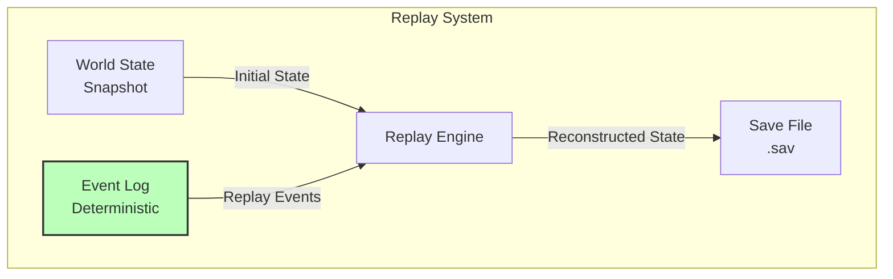

# Day 1: Data & Persistence

> **Navigation**: [← Previous: Client & Server Architecture](02-client-server-architecture.md) | [Index]([AGENTS-READ-FIRST]-index.md) | [Next: Performance & Scalability](04-performance-scalability.md)
> 
> **Part of**: [Day 1 Technical Architecture]([AGENTS-READ-FIRST]-index.md)

---

## 6. Save/Replay System

### Factorio Replay System Analysis

**How Factorio Does It** [r1-factorio-case-study.md, Section 4]:

Factorio's replay system is the gold standard for deterministic game debugging:

**Deterministic Lockstep Foundation**:
- All clients run identical simulation with same inputs
- Only player inputs (keyboard/mouse) sent over network
- CRC32 checksums calculated after each tick closure
- If CRCs mismatch = desync detected immediately
- Desynced client re-downloads map from server

**"Megapacket" Approach (90% Bandwidth Reduction)**:
```
Traditional (per-tick):
- 60 packets/second × 40 bytes overhead = 2,400 bytes overhead/s

Factorio (tick closures):
- Batch 6 ticks into one "closure"
- 10 packets/second × 40 bytes = 400 bytes overhead/s
- 83% reduction from batching alone
```
[r1-factorio-case-study.md, Section 5]

**What We Adopt vs. What We Adapt**:

| Factorio Feature | Societies Adoption |
|-----------------|-------------------|
| **Event sourcing** | ✅ Yes - Snapshots + event log |
| **Deterministic lockstep** | ❌ No - We use state sync |
| **CRC checks** | ⚠️ Optional - For debugging only |
| **Megapacket batching** | ✅ Yes - Batch 6-10 ticks |
| **Automatic desync recovery** | ❌ Not needed - state sync |
| **Replay debugging** | ✅ Yes - Essential for AI debugging |

**Key Lessons from Factorio**:
1. Event sourcing enables "what happened at tick X?" debugging
2. Periodic snapshots + event log = perfect reconstruction
3. Save files store: initial state + deterministic replay log
4. Any point in time reconstructable by loading snapshot + replaying [r1-factorio-case-study.md, Section 4]

### Event-Sourced Architecture



### Save System Design

**Snapshot Frequency**:
- **Full World State**: Saved every 15 minutes (every 18,000 ticks at 20 TPS)
- **Initial Connect**: Client receives latest snapshot + events since snapshot
- **Snapshot Size**: ~2-5 MB compressed for 20 agents + 5,000 entities (MVP) [r1-factorio-case-study.md]

**Event Log Structure** [r1-research-summary.md, Decision 5]:
- **Format**: Append-only, immutable log
- **Contents**: Agent decisions, player actions, random events, economy transactions
- **Storage**: Compressed JSON or binary format
- **Signature**: Each event signed with tick number for replay ordering

```csharp
public struct GameEvent {
    public uint Tick;                    // When event occurred
    public EventType Type;               // Category (AgentAction, PlayerInput, etc.)
    public string EntityId;              // Who performed action
    public string Action;                // What happened
    public Dictionary<string, object> Data;  // Contextual data
    public uint RandomSeed;              // RNG state for determinism
}
```

**Storage Format**:

| Component | Format | Size | Frequency |
|-----------|--------|------|-----------|
| **Snapshots** | Compressed binary (MessagePack/Protobuf) | 5-10 MB | Every 15 min |
| **Events** | Compressed JSON/binary | ~50 KB/min | Continuous |
| **Metadata** | JSON | ~1 KB | Per save |

**Deterministic Replay Requirements**:
1. **Same Random Seeds**: RNG initialized with recorded seed per tick
2. **Same Tick Rate**: Replay at original 20 TPS
3. **Same Initial Conditions**: Start from identical snapshot state
4. **Deterministic Code**: No external time calls, no unseeded random [r1-factorio-case-study.md, Section 4]

> **⚠️ Time Acceleration Limitations**: Time acceleration (2x-10x when no players are online) and variable tick rates (10-30 TPS based on load) can affect deterministic replay. The replay system works best with fixed 20 TPS. To maintain replay accuracy:
> - Use time acceleration only during non-replay periods, OR
> - Limit time acceleration to 2x-5x with fixed 20 TPS (batch multiple ticks per real-time frame), OR
> - Record actual tick timestamps (not just sequence) to reconstruct timing during replay
> - Accept that replays with variable tick rates may diverge slightly from original timing

**Example Replay Flow**:
```csharp
public WorldState ReplayToTick(uint targetTick) {
    // Load latest snapshot before target
    var snapshot = LoadLatestSnapshotBefore(targetTick);
    var state = Deserialize(snapshot.Data);
    
    // Initialize RNG with snapshot seed
    InitializeRandom(snapshot.InitialSeed);
    
    // Replay events up to target
    var events = _eventLog.Where(e => e.Tick > snapshot.Tick && e.Tick <= targetTick)
                          .OrderBy(e => e.Tick);
    
    foreach (var evt in events) {
        SetRandomSeed(evt.RandomSeed);
        ApplyEvent(state, evt);
        SimulateTick();
    }
    
    return state;
}
```

**Additional Replay Capabilities**:
- **Debug Tool**: Replays enable debugging ("What happened at tick 1847293?")
- **Branching Worlds**: Can fork world at any point (save as new world)

### Replay Use Cases

- **Debugging**: See exactly what led to a bug
- **Analysis**: Study agent behavior over time
- **Recovery**: Roll back to before catastrophic event
- **Content Creation**: Create timelapses of world evolution

### Debug Tool Integration

**"What Happened at Tick X?" Debugging** [r1-factorio-case-study.md, Section 4]:

Factorio's desync debugging approach applied to Societies:

1. **Load Snapshot Before Target Tick**
   - Find most recent snapshot prior to tick X
   - Load full world state from that point

2. **Replay Events Up to Tick X**
   - Apply all events from snapshot to target tick
   - Verify world state matches recorded state
   - If mismatch = investigate which event caused divergence

3. **Inspect World State at Any Point**
   - Agent positions, inventory, goals
   - Economy state (prices, wealth distribution)
   - Governance (active laws, votes)
   - Ecosystem (pollution levels, species counts)

**Branching Worlds Capability** [r1-research-summary.md]:
```
Timeline A (Original)
├── Tick 10000: Save point "Branch_Origin"
├── Tick 10001-15000: Player does X
└── Outcome A

Timeline B (Branch from 10000)
├── Tick 10000: Load "Branch_Origin"
├── Tick 10001-15000: Player does Y
└── Outcome B

Comparison:
- What if we had passed Law A instead of Law B?
- What if Agent Smith had chosen farming instead of mining?
```

**Replay Viewer UI**:

| Feature | Function |
|---------|----------|
| **Timeline Scrubber** | Drag to any tick; view world state |
| **Play/Pause** | Automatic replay at 1x, 2x, 10x speed |
| **Step Forward/Back** | Tick-by-tick analysis |
| **Entity Inspector** | Click any agent/object; view full state |
| **Event Log Display** | Filterable list of all events |
| **State Diff** | Compare world state between two ticks |

**Example Debug Session**:
```
Bug Report: "Agent disappeared at tick 1847293"

Debug Steps:
1. Load snapshot from tick 1845000 (15 min before)
2. Replay events to tick 1847290
3. Inspect Agent_042: Position (100, 0, 200), Health 50
4. Step to tick 1847291: Event "MeteorImpact" at (100, 0, 200)
5. Step to tick 1847292: Agent_042 health = 0, flagged for removal
6. Root cause: Meteor spawned at agent location, instant death
```

### Storage Requirements

**Event Log Growth Rate** [r1-factorio-case-study.md]:

| Metric | Calculation | Value |
|--------|-------------|-------|
| Events per minute | 20 agents × 1 decision/min | ~20 events |
| Size per event | JSON with compression | ~50 bytes |
| Per minute | 20 × 50 bytes | ~1 KB |
| Per hour | 1 KB × 60 | ~60 KB |
| Per day | 60 KB × 24 | ~1.4 MB |
| Per month | 1.4 MB × 30 | ~42 MB |

> **Important Clarification**: The ~216 MB/month estimate assumes logging only **significant decisions** (major actions like buying/selling, voting, law changes) at approximately 1 per minute per agent. If logging every tick-level event (20 TPS), storage would be ~41 GB/month. The implementation must sample/batch events or use aggressive compression for tick-level logging.

**Compression Strategies**:

1. **Run-Length Encoding for Idle Periods**
   ```
   Instead of: [tick_1: idle], [tick_2: idle], [tick_3: idle]...
   Store: [tick_1-1000: idle]
   ```

2. **Delta Compression for Positions**
   ```
   Instead of: position (100.0, 0.0, 200.0)
   Store: delta from last position (+0.1, 0.0, -0.05)
   ```

3. **Brotli/LZ4 Compression**
   - LZ4: Fast compression/decompression (real-time)
   - Brotli: Better compression ratio (archival)
   - Target: 50-70% size reduction [r1-factorio-case-study.md]

**Retention Policies**:

| Age | Retention | Storage |
|-----|-----------|---------|
| 0-30 days | Full event log | ~216 MB* |
| 30-90 days | Hourly snapshots + key events | ~500 MB |
| 90+ days | Daily snapshots only | ~150 MB |

\* Based on significant decisions only (1/min). Tick-level logging requires sampling or would increase storage 200x.

**Archive Strategy**:
- Hot events (recent): PostgreSQL JSONB
- Warm events (1-30 days): Compressed files
- Cold events (30+ days): Archive storage (load on demand)
- Replay on-demand: Fetch from archive when needed

**Total Storage Estimates**:
```
Active World (100 agents, 20 players):
- Snapshots: 10 MB × 96/day = 960 MB
- Events: 70 MB/day
- Total daily: ~1 GB
- Monthly: ~30 GB

With compression (60% reduction):
- Monthly: ~12 GB
```

---

## 7. Database Architecture

### Complete PostgreSQL Schema Specification

This section provides the complete CREATE TABLE statements, indexes, partitioning strategy, and query patterns for the Societies PostgreSQL database. All constraints reference values from `planning/meta/technical-constants.md`.

#### Core Schema Design Principles

1. **Hybrid JSONB/Column Strategy**: Stable fields in columns, flexible/experimental data in JSONB
2. **Partitioning by Tick Range**: Event table partitioned for efficient time-series queries
3. **Spatial Indexing**: GIST indexes for position-based queries
4. **Foreign Key Cascades**: Automatic cleanup on world deletion
5. **Check Constraints**: Enum validation at database level

---

### 7.1 Core Tables

#### worlds

Central world registry. All game data belongs to a world.

**Constants Referenced**:
- `WORLD_SIZE_MIN_KM2 = 0.5`
- `WORLD_SIZE_MAX_KM2 = 4.0`

```sql
CREATE TABLE worlds (
    id UUID PRIMARY KEY DEFAULT gen_random_uuid(),
    name VARCHAR(100) NOT NULL,
    seed BIGINT NOT NULL,
    size_km2 FLOAT NOT NULL CHECK (size_km2 BETWEEN 0.5 AND 4.0),
    created_at TIMESTAMP NOT NULL DEFAULT NOW(),
    last_tick BIGINT NOT NULL DEFAULT 0,
    game_time_hours BIGINT NOT NULL DEFAULT 0,
    state VARCHAR(20) NOT NULL DEFAULT 'active' 
        CHECK (state IN ('initializing', 'active', 'paused', 'shutting_down', 'archived')),
    settings JSONB NOT NULL DEFAULT '{}',
    statistics JSONB NOT NULL DEFAULT '{}',
    metadata JSONB NOT NULL DEFAULT '{}'
);

CREATE INDEX idx_worlds_state ON worlds(state) WHERE state = 'active';
CREATE INDEX idx_worlds_created ON worlds(created_at);
```

**JSONB Structure - settings**:
```json
{
  "tick_rate": 20,
  "time_acceleration": 1.0,
  "agent_limit": 25,
  "player_limit": 8,
  "difficulty": "normal",
  "meteor_enabled": true,
  "pollution_enabled": true
}
```

---

#### agents (AI citizens)

AI agent population. References AGENTS_MVP = 25, AGENTS_POST_MVP = 100, AGENTS_ABSOLUTE_MAX = 100.

**Constants Referenced**:
- `AGENTS_ABSOLUTE_MAX = 100` (per world limit enforced in application)
- `STARTING_CREDITS_AGENT = 100.0`
- `REPUTATION_MIN = -100.0`
- `REPUTATION_MAX = 100.0`
- `INVENTORY_SLOTS_AGENT = 64`

```sql
CREATE TABLE agents (
    id UUID PRIMARY KEY DEFAULT gen_random_uuid(),
    world_id UUID NOT NULL REFERENCES worlds(id) ON DELETE CASCADE,
    agent_type VARCHAR(50) NOT NULL 
        CHECK (agent_type IN ('citizen', 'merchant', 'official', 'wanderer')),
    display_name VARCHAR(100) NOT NULL,
    position_x FLOAT NOT NULL DEFAULT 0,
    position_y FLOAT NOT NULL DEFAULT 0,
    position_z FLOAT NOT NULL DEFAULT 0,
    rotation_y FLOAT NOT NULL DEFAULT 0,
    state VARCHAR(20) NOT NULL DEFAULT 'active'
        CHECK (state IN ('active', 'inactive', 'hibernating', 'despawned')),
    lifecycle_state VARCHAR(20) NOT NULL DEFAULT 'adult'
        CHECK (lifecycle_state IN ('child', 'adult', 'elder')),
    
    -- AI Core Data (JSONB for flexibility)
    personality JSONB NOT NULL DEFAULT '{}',
    memory_short_term JSONB NOT NULL DEFAULT '[]',
    memory_long_term JSONB NOT NULL DEFAULT '[]',
    skills JSONB NOT NULL DEFAULT '{}',
    beliefs JSONB NOT NULL DEFAULT '{}',
    goals JSONB NOT NULL DEFAULT '[]',
    
    -- Economic Data
    credits INTEGER NOT NULL DEFAULT 100 CHECK (credits >= 0),
    inventory JSONB NOT NULL DEFAULT '[]',
    price_beliefs JSONB NOT NULL DEFAULT '{}',
    
    -- Social Data
    reputation INTEGER NOT NULL DEFAULT 0 
        CHECK (reputation BETWEEN -100 AND 100),
    relationships JSONB NOT NULL DEFAULT '{}',
    
    -- Timestamps & Metadata
    created_at TIMESTAMP NOT NULL DEFAULT NOW(),
    updated_at TIMESTAMP NOT NULL DEFAULT NOW(),
    last_action_tick BIGINT NOT NULL DEFAULT 0,
    is_active BOOLEAN NOT NULL DEFAULT true,
    
    -- Processing metadata
    lod_level SMALLINT DEFAULT 1 
        CHECK (lod_level BETWEEN 0 AND 3),
    next_process_tick BIGINT DEFAULT 0
);

-- Core indexes for performance
CREATE INDEX idx_agents_world_active ON agents(world_id) WHERE is_active = true;
CREATE INDEX idx_agents_world_type ON agents(world_id, agent_type);
CREATE INDEX idx_agents_position ON agents USING GIST (point(position_x, position_z));
CREATE INDEX idx_agents_lod ON agents(world_id, lod_level, next_process_tick);
CREATE INDEX idx_agents_last_action ON agents(world_id, last_action_tick);

-- GIN indexes for JSONB queries
CREATE INDEX idx_agents_personality ON agents USING GIN (personality);
CREATE INDEX idx_agents_memory_stm ON agents USING GIN (memory_short_term);
CREATE INDEX idx_agents_goals ON agents USING GIN (goals);
CREATE INDEX idx_agents_skills ON agents USING GIN (skills);
CREATE INDEX idx_agents_inventory ON agents USING GIN (inventory);

-- Expression indexes for common queries
CREATE INDEX idx_agents_credits ON agents(world_id, credits) WHERE credits > 0;
CREATE INDEX idx_agents_reputation ON agents(world_id, reputation);
```

**JSONB Structure Specifications**:

**personality** (19 facets, 0-100 scale):
```json
{
  "gregariousness": 50,
  "work_ethic": 50,
  "greed": 50,
  "emotional_stability": 50,
  "openness": 50,
  "conscientiousness": 50,
  "extraversion": 50,
  "agreeableness": 50,
  "neuroticism": 50,
  "bravery": 50,
  "altruism": 50,
  "excitement_seeking": 50,
  "tradition": 50,
  "progressivism": 50,
  "creativity": 50,
  "cooperation": 50,
  "ambition": 50,
  "curiosity": 50,
  "empathy": 50
}
```

**memory_short_term** (max 5 slots):
```json
[
  {
    "tick": 1234567,
    "type": "trade",
    "entity_id": "uuid",
    "description": "Bought wood from merchant",
    "valence": 25,
    "importance": 128
  }
]
```

**memory_long_term** (max 5 slots):
```json
[
  {
    "tick": 1000000,
    "consolidated_from": [1234560, 1234561, 1234562],
    "type": "achievement",
    "description": "Built first house",
    "valence": 80,
    "importance": 255
  }
]
```

**skills** (levels 0-10):
```json
{
  "gathering": 3,
  "crafting": 2,
  "building": 1,
  "trading": 4,
  "farming": 0,
  "mining": 2
}
```

**inventory** (max 64 slots):
```json
[
  {
    "item_id": "wood",
    "quantity": 50,
    "quality": 75,
    "durability": 100
  }
]
```

**price_beliefs**:
```json
{
  "wood": {
    "mean": 5.0,
    "uncertainty": 0.15,
    "observations": 42,
    "last_updated": 1234500
  }
}
```

**relationships**:
```json
{
  "agent_uuid_1": {
    "type": "friend",
    "strength": 65,
    "last_interaction": 1234600
  }
}
```

---

#### players (human players)

Human player accounts and their world-specific state.

**Constants Referenced**:
- `INVENTORY_SLOTS_PLAYER = 64`
- `STARTING_CREDITS_PLAYER = 100.0`
- `HEALTH_MAX = 100.0`
- `ENERGY_MAX = 100.0`
- `HUNGER_MAX = 100.0`

```sql
CREATE TABLE players (
    id UUID PRIMARY KEY DEFAULT gen_random_uuid(),
    world_id UUID REFERENCES worlds(id) ON DELETE SET NULL,
    username VARCHAR(50) NOT NULL UNIQUE,
    email VARCHAR(255),
    password_hash VARCHAR(255) NOT NULL,
    display_name VARCHAR(100),
    
    -- Position
    position_x FLOAT DEFAULT 0,
    position_y FLOAT DEFAULT 0,
    position_z FLOAT DEFAULT 0,
    rotation_y FLOAT DEFAULT 0,
    
    -- Stats (caching frequently accessed values)
    health FLOAT DEFAULT 100 CHECK (health BETWEEN 0 AND 100),
    energy FLOAT DEFAULT 100 CHECK (energy BETWEEN 0 AND 100),
    hunger FLOAT DEFAULT 0 CHECK (hunger BETWEEN 0 AND 100),
    stamina FLOAT DEFAULT 100 CHECK (stamina BETWEEN 0 AND 100),
    
    -- Economy
    credits INTEGER DEFAULT 100 CHECK (credits >= 0),
    inventory JSONB DEFAULT '[]',
    
    -- Progression
    skills JSONB DEFAULT '{}',
    statistics JSONB DEFAULT '{}',
    achievements JSONB DEFAULT '[]',
    
    -- Preferences
    settings JSONB DEFAULT '{}',
    
    -- Session
    last_login TIMESTAMP,
    total_play_time_minutes INTEGER DEFAULT 0,
    is_online BOOLEAN DEFAULT false,
    client_address INET,
    
    -- Metadata
    created_at TIMESTAMP DEFAULT NOW(),
    updated_at TIMESTAMP DEFAULT NOW()
);

CREATE INDEX idx_players_username ON players(username);
CREATE INDEX idx_players_world ON players(world_id) WHERE world_id IS NOT NULL;
CREATE INDEX idx_players_online ON players(is_online) WHERE is_online = true;
CREATE INDEX idx_players_inventory ON players USING GIN (inventory);
CREATE INDEX idx_players_skills ON players USING GIN (skills);
```

---

#### entities (general game objects)

Buildings, resources, items on ground, and other world entities.

**Constants Referenced**:
- `MAX_ENTITIES_MVP = 2000`
- `MAX_ENTITIES_POST_MVP = 10000`

```sql
CREATE TABLE entities (
    id UUID PRIMARY KEY DEFAULT gen_random_uuid(),
    world_id UUID NOT NULL REFERENCES worlds(id) ON DELETE CASCADE,
    entity_type VARCHAR(50) NOT NULL,
    
    -- Owner references (polymorphic - can be agent or player)
    owner_type VARCHAR(10) CHECK (owner_type IN ('agent', 'player')),
    owner_id UUID,
    
    -- Position and rotation
    position_x FLOAT NOT NULL,
    position_y FLOAT NOT NULL,
    position_z FLOAT NOT NULL,
    rotation_x FLOAT DEFAULT 0,
    rotation_y FLOAT DEFAULT 0,
    rotation_z FLOAT DEFAULT 0,
    
    -- State data (entity-specific JSON)
    state_data JSONB NOT NULL DEFAULT '{}',
    
    -- Metadata
    created_at TIMESTAMP DEFAULT NOW(),
    updated_at TIMESTAMP DEFAULT NOW(),
    is_active BOOLEAN DEFAULT true,
    
    -- Chunk assignment for spatial queries
    chunk_x INTEGER NOT NULL,
    chunk_z INTEGER NOT NULL
);

-- Core indexes
CREATE INDEX idx_entities_world_type ON entities(world_id, entity_type);
CREATE INDEX idx_entities_world_active ON entities(world_id) WHERE is_active = true;
CREATE INDEX idx_entities_position ON entities USING GIST (point(position_x, position_z));
CREATE INDEX idx_entities_chunk ON entities(world_id, chunk_x, chunk_z);
CREATE INDEX idx_entities_owner ON entities(owner_type, owner_id) WHERE owner_id IS NOT NULL;
CREATE INDEX idx_entities_state ON entities USING GIN (state_data);
```

**JSONB Structure - state_data by entity_type**:

**Building**:
```json
{
  "building_type": "house",
  "durability": 500,
  "max_durability": 500,
  "material": "wood",
  "level": 1,
  "occupants": ["agent_uuid_1"],
  "storage_capacity": 100
}
```

**Resource Node**:
```json
{
  "resource_type": "iron_ore",
  "quantity_remaining": 150,
  "max_quantity": 200,
  "depletion_rate": 0.01,
  "regenerates": false
}
```

---

#### events (event sourcing)

Immutable event log for replay system. Partitioned by tick range for performance.

**Constants Referenced**:
- `TICK_RATE = 20` (events per second context)
- `TICKS_PER_HOUR = 72000`
- `TICKS_PER_DAY = 1728000`

```sql
CREATE TABLE events (
    id BIGSERIAL,
    world_id UUID NOT NULL REFERENCES worlds(id) ON DELETE CASCADE,
    tick BIGINT NOT NULL,
    event_type SMALLINT NOT NULL,
    entity_id UUID,
    actor_type VARCHAR(10) CHECK (actor_type IN ('agent', 'player', 'system')),
    actor_id UUID,
    position_x FLOAT,
    position_y FLOAT,
    position_z FLOAT,
    data JSONB NOT NULL DEFAULT '{}',
    timestamp TIMESTAMP NOT NULL DEFAULT NOW(),
    checksum VARCHAR(64),
    PRIMARY KEY (world_id, tick, id)
) PARTITION BY RANGE (tick);

-- Create initial partitions (1 million ticks = ~13.9 hours at 20 TPS)
CREATE TABLE events_tick_0_to_1m PARTITION OF events
    FOR VALUES FROM (0) TO (1000000);
CREATE TABLE events_tick_1m_to_2m PARTITION OF events
    FOR VALUES FROM (1000000) TO (2000000);
CREATE TABLE events_tick_2m_to_3m PARTITION OF events
    FOR VALUES FROM (2000000) TO (3000000);

-- Indexes
CREATE INDEX idx_events_world_tick ON events(world_id, tick);
CREATE INDEX idx_events_entity ON events(entity_id) WHERE entity_id IS NOT NULL;
CREATE INDEX idx_events_type ON events(event_type);
CREATE INDEX idx_events_actor ON events(actor_type, actor_id) WHERE actor_id IS NOT NULL;
CREATE INDEX idx_events_data ON events USING GIN (data);
```

**Event Type Enumeration** (SMALLINT for space efficiency):
```
1  - AgentSpawned
2  - AgentDespawned
3  - AgentMoved
4  - AgentAction (generic)
5  - TradeCompleted
6  - ItemCrafted
7  - BuildingConstructed
8  - BuildingDestroyed
9  - LawProposed
10 - LawEnacted
11 - LawRepealed
12 - VoteCast
13 - PlayerJoined
14 - PlayerLeft
15 - PlayerMoved
16 - PlayerAction
17 - ResourceGathered
18 - ItemPickedUp
19 - ItemDropped
20 - AgentDeath
```

**JSONB Structure - data field by event_type**:

**TradeCompleted (5)**:
```json
{
  "buyer_id": "uuid",
  "seller_id": "uuid",
  "item_id": "wood",
  "quantity": 10,
  "price_per_unit": 5.0,
  "total_amount": 50.0
}
```

**AgentMoved (3)**:
```json
{
  "from": {"x": 100.0, "y": 0.0, "z": 200.0},
  "to": {"x": 105.0, "y": 0.0, "z": 200.0},
  "velocity": 3.0,
  "reason": "pathfinding"
}
```

---

#### jurisdictions (governance regions)

Political boundaries for governance system.

**Constants Referenced**:
- `MIN_CITIZENS_TOWN = 3`
- `CLAIM_SIZE_HOMESTEAD_M2 = 10000.0`

```sql
CREATE TABLE jurisdictions (
    id UUID PRIMARY KEY DEFAULT gen_random_uuid(),
    world_id UUID NOT NULL REFERENCES worlds(id) ON DELETE CASCADE,
    parent_id UUID REFERENCES jurisdictions(id),
    
    jurisdiction_type VARCHAR(20) NOT NULL 
        CHECK (jurisdiction_type IN ('homestead', 'town', 'city', 'state', 'federation')),
    name VARCHAR(100) NOT NULL,
    description TEXT,
    
    -- Spatial boundary (simplified as bounding box for MVP)
    bounds_min_x FLOAT NOT NULL,
    bounds_min_z FLOAT NOT NULL,
    bounds_max_x FLOAT NOT NULL,
    bounds_max_z FLOAT NOT NULL,
    center_x FLOAT NOT NULL,
    center_z FLOAT NOT NULL,
    
    -- Governance
    founder_id UUID,
    government_type VARCHAR(20) 
        CHECK (government_type IN ('autocracy', 'democracy', 'oligarchy', 'consensus')),
    
    -- Economic
    treasury FLOAT DEFAULT 0,
    tax_rate FLOAT DEFAULT 0.10 CHECK (tax_rate BETWEEN 0.0 AND 0.50),
    
    -- Population
    population_count INTEGER DEFAULT 0,
    citizen_ids UUID[] DEFAULT '{}',
    
    -- Settings
    settings JSONB DEFAULT '{}',
    
    -- Metadata
    created_at TIMESTAMP DEFAULT NOW(),
    dissolved_at TIMESTAMP
);

CREATE INDEX idx_jurisdictions_world ON jurisdictions(world_id);
CREATE INDEX idx_jurisdictions_parent ON jurisdictions(parent_id) WHERE parent_id IS NOT NULL;
CREATE INDEX idx_jurisdictions_bounds ON jurisdictions USING GIST (
    box(point(bounds_min_x, bounds_min_z), point(bounds_max_x, bounds_max_z))
);
CREATE INDEX idx_jurisdictions_population ON jurisdictions(world_id, population_count);
```

---

#### laws (governance rules)

Active and proposed laws within jurisdictions.

**Constants Referenced**:
- `VOTE_DURATION_HOURS = 24.0`
- `TAX_RATE_MAX_PERCENT = 50.0`

```sql
CREATE TABLE laws (
    id UUID PRIMARY KEY DEFAULT gen_random_uuid(),
    world_id UUID NOT NULL REFERENCES worlds(id) ON DELETE CASCADE,
    jurisdiction_id UUID NOT NULL REFERENCES jurisdictions(id) ON DELETE CASCADE,
    
    law_type VARCHAR(50) NOT NULL
        CHECK (law_type IN ('tax', 'regulation', 'subsidy', 'prohibition', 'mandate', 'custom')),
    title VARCHAR(200) NOT NULL,
    description TEXT,
    
    -- Law logic
    trigger_condition JSONB NOT NULL,
    actions JSONB NOT NULL,
    scope_data JSONB NOT NULL,
    
    -- Proposer
    proposer_type VARCHAR(10) CHECK (proposer_type IN ('agent', 'player')),
    proposer_id UUID,
    proposed_at TIMESTAMP DEFAULT NOW(),
    
    -- Voting
    votes_for INTEGER DEFAULT 0,
    votes_against INTEGER DEFAULT 0,
    vote_record JSONB DEFAULT '{}',
    
    -- Status lifecycle
    status VARCHAR(20) DEFAULT 'proposed'
        CHECK (status IN ('proposed', 'voting', 'passed', 'enacted', 'repealed', 'rejected')),
    enacted_at TIMESTAMP,
    repealed_at TIMESTAMP,
    
    -- Enforcement
    is_active BOOLEAN DEFAULT false,
    last_enforced_tick BIGINT DEFAULT 0,
    
    -- Metadata
    metadata JSONB DEFAULT '{}'
);

CREATE INDEX idx_laws_world_jurisdiction ON laws(world_id, jurisdiction_id);
CREATE INDEX idx_laws_status ON laws(status);
CREATE INDEX idx_laws_active ON laws(world_id) WHERE is_active = true;
CREATE INDEX idx_laws_proposed ON laws(proposed_at);
CREATE INDEX idx_laws_trigger ON laws USING GIN (trigger_condition);
```

---

#### transactions (economic history)

Economic transaction log for market analysis and debugging.

```sql
CREATE TABLE transactions (
    id UUID PRIMARY KEY DEFAULT gen_random_uuid(),
    world_id UUID NOT NULL REFERENCES worlds(id) ON DELETE CASCADE,
    
    transaction_type VARCHAR(50) NOT NULL
        CHECK (transaction_type IN ('market', 'direct', 'tax', 'subsidy', 'gift', 'theft')),
    
    -- Participants
    buyer_type VARCHAR(10) CHECK (buyer_type IN ('agent', 'player', 'system')),
    buyer_id UUID,
    seller_type VARCHAR(10) CHECK (seller_type IN ('agent', 'player', 'system')),
    seller_id UUID,
    
    -- Transaction details
    item_id VARCHAR(50),
    quantity INTEGER CHECK (quantity > 0),
    quality INTEGER CHECK (quality BETWEEN 0 AND 100),
    price_per_unit FLOAT CHECK (price_per_unit >= 0),
    total_amount FLOAT CHECK (total_amount >= 0),
    currency VARCHAR(10) DEFAULT 'Cr',
    
    -- Location
    location_x FLOAT,
    location_y FLOAT,
    location_z FLOAT,
    jurisdiction_id UUID,
    
    -- Time context
    tick BIGINT NOT NULL,
    timestamp TIMESTAMP DEFAULT NOW(),
    
    -- Market context (for price analysis)
    market_price_low FLOAT,
    market_price_high FLOAT,
    
    -- Metadata
    metadata JSONB DEFAULT '{}'
);

CREATE INDEX idx_transactions_world_tick ON transactions(world_id, tick);
CREATE INDEX idx_transactions_timestamp ON transactions(timestamp);
CREATE INDEX idx_transactions_buyer ON transactions(buyer_type, buyer_id) WHERE buyer_id IS NOT NULL;
CREATE INDEX idx_transactions_seller ON transactions(seller_type, seller_id) WHERE seller_id IS NOT NULL;
CREATE INDEX idx_transactions_item ON transactions(world_id, item_id);
CREATE INDEX idx_transactions_jurisdiction ON transactions(jurisdiction_id) WHERE jurisdiction_id IS NOT NULL;
CREATE INDEX idx_transactions_location ON transactions USING GIST (point(location_x, location_z));
```

---

#### items (item definitions)

Static item catalog with variant support.

```sql
CREATE TABLE items (
    id VARCHAR(50) PRIMARY KEY,
    name VARCHAR(100) NOT NULL,
    description TEXT,
    category VARCHAR(50) NOT NULL
        CHECK (category IN ('resource', 'tool', 'food', 'building_material', 'consumable', 'equipment')),
    
    -- Physical properties
    weight_kg FLOAT NOT NULL DEFAULT 1.0,
    stack_size INTEGER NOT NULL DEFAULT 100,
    
    -- Durability (for tools/equipment)
    has_durability BOOLEAN DEFAULT false,
    max_durability INTEGER,
    
    -- Quality modifiers
    quality_affects_stats BOOLEAN DEFAULT false,
    
    -- Economic baseline
    base_value FLOAT DEFAULT 0,
    is_craftable BOOLEAN DEFAULT false,
    is_gatherable BOOLEAN DEFAULT false,
    
    -- Metadata
    tags VARCHAR(50)[],
    properties JSONB DEFAULT '{}',
    created_at TIMESTAMP DEFAULT NOW()
);

CREATE INDEX idx_items_category ON items(category);
CREATE INDEX idx_items_tags ON items USING GIN (tags);
CREATE INDEX idx_items_craftable ON items(is_craftable) WHERE is_craftable = true;
CREATE INDEX idx_items_gatherable ON items(is_gatherable) WHERE is_gatherable = true;
```

---

#### resource_nodes (harvestable resources)

Spawned resource nodes in the world.

```sql
CREATE TABLE resource_nodes (
    id UUID PRIMARY KEY DEFAULT gen_random_uuid(),
    world_id UUID NOT NULL REFERENCES worlds(id) ON DELETE CASCADE,
    
    node_type VARCHAR(50) NOT NULL,
    item_id VARCHAR(50) NOT NULL REFERENCES items(id),
    
    -- Position
    position_x FLOAT NOT NULL,
    position_y FLOAT NOT NULL,
    position_z FLOAT NOT NULL,
    chunk_x INTEGER NOT NULL,
    chunk_z INTEGER NOT NULL,
    
    -- Resource state
    quantity_remaining INTEGER NOT NULL,
    quantity_max INTEGER NOT NULL,
    respawns BOOLEAN DEFAULT false,
    respawn_tick BIGINT,
    
    -- Gathering difficulty
    difficulty_level INTEGER DEFAULT 1 CHECK (difficulty_level BETWEEN 1 AND 10),
    required_tool_type VARCHAR(50),
    
    -- Metadata
    state_data JSONB DEFAULT '{}',
    created_at TIMESTAMP DEFAULT NOW(),
    last_harvested_at TIMESTAMP,
    is_active BOOLEAN DEFAULT true
);

CREATE INDEX idx_resource_nodes_world ON resource_nodes(world_id);
CREATE INDEX idx_resource_nodes_type ON resource_nodes(world_id, node_type);
CREATE INDEX idx_resource_nodes_chunk ON resource_nodes(world_id, chunk_x, chunk_z);
CREATE INDEX idx_resource_nodes_position ON resource_nodes USING GIST (point(position_x, position_z));
CREATE INDEX idx_resource_nodes_active ON resource_nodes(world_id) WHERE is_active = true;
CREATE INDEX idx_resource_nodes_respawn ON resource_nodes(respawn_tick) WHERE respawns = true;
```

---

#### claims (land ownership)

Land claims for building rights.

**Constants Referenced**:
- `CLAIM_SIZE_HOMESTEAD_M2 = 10000.0`
- `CLAIM_SIZE_TOWN_M2 = 100000.0`
- `CLAIM_SIZE_CITY_M2 = 1000000.0`

```sql
CREATE TABLE claims (
    id UUID PRIMARY KEY DEFAULT gen_random_uuid(),
    world_id UUID NOT NULL REFERENCES worlds(id) ON DELETE CASCADE,
    jurisdiction_id UUID REFERENCES jurisdictions(id),
    
    -- Owner
    owner_type VARCHAR(10) NOT NULL CHECK (owner_type IN ('agent', 'player')),
    owner_id UUID NOT NULL,
    
    -- Claim type and bounds
    claim_type VARCHAR(20) NOT NULL 
        CHECK (claim_type IN ('homestead', 'town', 'city')),
    bounds_min_x FLOAT NOT NULL,
    bounds_min_z FLOAT NOT NULL,
    bounds_max_x FLOAT NOT NULL,
    bounds_max_z FLOAT NOT NULL,
    center_x FLOAT NOT NULL,
    center_z FLOAT NOT NULL,
    area_m2 FLOAT NOT NULL,
    
    -- Claim state
    is_active BOOLEAN DEFAULT true,
    abandoned_at TIMESTAMP,
    
    -- Permissions
    permissions JSONB DEFAULT '{}',
    
    -- Metadata
    created_at TIMESTAMP DEFAULT NOW(),
    metadata JSONB DEFAULT '{}'
);

CREATE INDEX idx_claims_world_owner ON claims(world_id, owner_type, owner_id);
CREATE INDEX idx_claims_jurisdiction ON claims(jurisdiction_id) WHERE jurisdiction_id IS NOT NULL;
CREATE INDEX idx_claims_bounds ON claims USING GIST (
    box(point(bounds_min_x, bounds_min_z), point(bounds_max_x, bounds_max_z))
);
CREATE INDEX idx_claims_active ON claims(world_id) WHERE is_active = true;
```

---

#### votes (governance voting)

Individual vote records.

```sql
CREATE TABLE votes (
    id UUID PRIMARY KEY DEFAULT gen_random_uuid(),
    world_id UUID NOT NULL REFERENCES worlds(id) ON DELETE CASCADE,
    law_id UUID NOT NULL REFERENCES laws(id) ON DELETE CASCADE,
    jurisdiction_id UUID NOT NULL REFERENCES jurisdictions(id) ON DELETE CASCADE,
    
    -- Voter
    voter_type VARCHAR(10) NOT NULL CHECK (voter_type IN ('agent', 'player')),
    voter_id UUID NOT NULL,
    
    -- Vote
    vote VARCHAR(10) NOT NULL CHECK (vote IN ('for', 'against', 'abstain')),
    vote_weight FLOAT DEFAULT 1.0,
    
    -- Rationale (for AI debugging)
    rationale JSONB DEFAULT '{}',
    
    -- Time
    tick BIGINT NOT NULL,
    timestamp TIMESTAMP DEFAULT NOW(),
    
    UNIQUE(world_id, law_id, voter_type, voter_id)
);

CREATE INDEX idx_votes_world_law ON votes(world_id, law_id);
CREATE INDEX idx_votes_jurisdiction ON votes(jurisdiction_id);
CREATE INDEX idx_votes_voter ON votes(voter_type, voter_id);
CREATE INDEX idx_votes_tick ON votes(world_id, tick);
```

---

### 7.2 Index Strategy Summary

#### Index Types Used

| Index Type | Purpose | Tables | Rationale |
|-----------|---------|--------|-----------|
| **B-tree (default)** | Equality/range queries | All primary keys, foreign keys | Standard PostgreSQL index |
| **GIN** | JSONB containment | agents, players, entities, events | Fast @>, ?, ?| operators |
| **GIST** | Spatial queries | agents, entities, claims, jurisdictions | Point/box containment |
| **Partial** | Filtered queries | Multiple | Smaller index, faster queries |
| **Expression** | Computed values | agents (credits, reputation) | Avoid table scans |
| **Composite** | Multi-column filters | Common query patterns | Covering index optimization |

#### Partial Index Rationale

```sql
-- Only index active agents (90%+ of queries filter on is_active)
CREATE INDEX idx_agents_world_active ON agents(world_id) WHERE is_active = true;
-- Reduces index size by ~10% when 10% of agents are inactive

-- Only index online players
CREATE INDEX idx_players_online ON players(is_online) WHERE is_online = true;
-- Index size scales with active players, not total accounts

-- Only index active laws
CREATE INDEX idx_laws_active ON laws(world_id) WHERE is_active = true;
-- Most queries care about currently enforced laws
```

---

### 7.3 Partitioning Strategy

#### events Table Partitioning

**Why Partition**: Event log grows without bound. Queries almost always filter by tick range.

**Partition Size**: 1 million ticks (~13.9 hours at 20 TPS)

**Partition Management**:
```sql
-- Create new partition (automated in application)
CREATE TABLE events_tick_3m_to_4m PARTITION OF events
    FOR VALUES FROM (3000000) TO (4000000);

-- Detach old partition for archiving
ALTER TABLE events DETACH PARTITION events_tick_0_to_1m;

-- Attach existing table as partition
ALTER TABLE events ATTACH PARTITION events_tick_4m_to_5m
    FOR VALUES FROM (4000000) TO (5000000);
```

**Automatic Partition Creation**:
```csharp
public async Task EnsurePartitionExists(long tick) {
    long partitionStart = (tick / 1_000_000) * 1_000_000;
    long partitionEnd = partitionStart + 1_000_000;
    
    var partitionName = $"events_tick_{partitionStart/1_000_000}m_to_{partitionEnd/1_000_000}m";
    
    // Check if partition exists, create if not
    var checkSql = $@"
        SELECT 1 FROM pg_tables 
        WHERE tablename = '{partitionName}'
    ";
    
    var createSql = $@"
        CREATE TABLE IF NOT EXISTS {partitionName} 
        PARTITION OF events
        FOR VALUES FROM ({partitionStart}) TO ({partitionEnd})
    ";
    
    await ExecuteAsync(createSql);
}
```

#### Future Partitioning (Post-MVP)

**transactions Table** (by month for historical analysis):
```sql
-- Example: Partition by month for long-term storage
CREATE TABLE transactions_2026_01 PARTITION OF transactions
    FOR VALUES FROM ('2026-01-01') TO ('2026-02-01');
```

**agents Table** (by region for large worlds):
```sql
-- For 4 km² worlds with 100 agents, partition by spatial region
-- Only if query patterns show region-based filtering
```

---

### 7.4 Common Query Patterns

#### Get All Active Agents in a World
```sql
SELECT id, display_name, position_x, position_y, position_z, state
FROM agents
WHERE world_id = 'uuid' AND is_active = true
ORDER BY last_action_tick DESC;

-- Index used: idx_agents_world_active
-- Expected time: < 1ms for 25 agents, < 5ms for 100 agents
```

#### Get Agents Within Radius (Spatial Query)
```sql
SELECT id, display_name, position_x, position_z,
       sqrt(power(position_x - 100.0, 2) + power(position_z - 200.0, 2)) as distance
FROM agents
WHERE world_id = 'uuid'
  AND is_active = true
  AND point(position_x, position_z) <@ circle(point(100.0, 200.0), 50.0)
ORDER BY distance;

-- Index used: idx_agents_position (GIST)
-- Expected time: < 5ms
```

#### Get Events for Replay (Tick Range)
```sql
SELECT * FROM events
WHERE world_id = 'uuid'
  AND tick BETWEEN 1000000 AND 1000500
ORDER BY tick, id;

-- Index used: idx_events_world_tick (composite)
-- Expected time: < 10ms for 500 ticks
```

#### Get Player Inventory with Item Details
```sql
SELECT 
    p.id as player_id,
    item->>'item_id' as item_id,
    i.name as item_name,
    (item->>'quantity')::int as quantity,
    i.category,
    i.weight_kg * (item->>'quantity')::int as total_weight
FROM players p
CROSS JOIN LATERAL jsonb_array_elements(p.inventory) as item
JOIN items i ON i.id = item->>'item_id'
WHERE p.id = 'uuid';

-- Uses idx_players_inventory GIN index for filtering
```

#### Get Active Laws in Jurisdiction
```sql
SELECT l.*, 
       (l.votes_for + l.votes_against) as total_votes,
       CASE 
         WHEN (l.votes_for + l.votes_against) > 0 
         THEN (l.votes_for::float / (l.votes_for + l.votes_against))
         ELSE 0 
       END as approval_ratio
FROM laws l
WHERE l.world_id = 'uuid'
  AND l.jurisdiction_id = 'uuid'
  AND l.is_active = true
ORDER BY l.enacted_at DESC;

-- Index used: idx_laws_active + idx_laws_world_jurisdiction
```

#### Get Transaction History for Market Analysis
```sql
SELECT 
    item_id,
    AVG(price_per_unit) as avg_price,
    MIN(price_per_unit) as min_price,
    MAX(price_per_unit) as max_price,
    COUNT(*) as transaction_count,
    SUM(quantity) as total_volume
FROM transactions
WHERE world_id = 'uuid'
  AND tick >= 500000  -- Last ~7 hours at 20 TPS
GROUP BY item_id;

-- Index used: idx_transactions_world_tick
```

#### Get Agents by Skill Level
```sql
SELECT id, display_name, skills->>'mining' as mining_skill
FROM agents
WHERE world_id = 'uuid'
  AND is_active = true
  AND (skills->>'mining')::int >= 5
ORDER BY (skills->>'mining')::int DESC;

-- Uses idx_agents_skills GIN for initial filter
-- Expression index on skill level would optimize further
```

---

### 7.5 Constraints & Validation

#### Check Constraints

```sql
-- World size limits (0.5 - 4.0 km²)
ALTER TABLE worlds ADD CONSTRAINT chk_world_size 
    CHECK (size_km2 BETWEEN 0.5 AND 4.0);

-- Agent reputation bounds (-100 to 100)
ALTER TABLE agents ADD CONSTRAINT chk_agent_reputation 
    CHECK (reputation BETWEEN -100 AND 100);

-- Player stats bounds (0-100)
ALTER TABLE players ADD CONSTRAINT chk_player_health 
    CHECK (health BETWEEN 0 AND 100);

-- Tax rate limits (0-50%)
ALTER TABLE jurisdictions ADD CONSTRAINT chk_tax_rate 
    CHECK (tax_rate BETWEEN 0.0 AND 0.50);

-- Non-negative credits
ALTER TABLE agents ADD CONSTRAINT chk_agent_credits 
    CHECK (credits >= 0);

-- Positive quantities
ALTER TABLE transactions ADD CONSTRAINT chk_transaction_quantity 
    CHECK (quantity > 0);
```

#### Foreign Key Cascades

```sql
-- World deletion cascades to all child tables
-- (Already defined in CREATE TABLE statements with ON DELETE CASCADE)

-- Jurisdiction dissolution handling
ALTER TABLE laws ADD CONSTRAINT fk_laws_jurisdiction 
    FOREIGN KEY (jurisdiction_id) REFERENCES jurisdictions(id) 
    ON DELETE SET NULL;  -- Keep law record but remove jurisdiction link

-- Agent deletion sets owner to NULL
ALTER TABLE entities ADD CONSTRAINT fk_entities_owner 
    FOREIGN KEY (owner_id) REFERENCES agents(id) 
    ON DELETE SET NULL;
```

#### Unique Constraints

```sql
-- One vote per voter per law
ALTER TABLE votes ADD CONSTRAINT uniq_vote_per_voter 
    UNIQUE (world_id, law_id, voter_type, voter_id);

-- One active claim per owner per world (optional rule)
-- CREATE UNIQUE INDEX idx_active_claim_per_owner 
--     ON claims (world_id, owner_type, owner_id) 
--     WHERE is_active = true;
```

---

### 7.6 Migration Framework

#### Schema Versioning

```
migrations/
├── 001_initial_schema.sql
├── 002_add_agent_memory.sql
├── 003_add_jurisdiction_system.sql
├── 004_event_partitioning.sql
├── 005_add_transaction_metadata.sql
└── README.md
```

#### Migration Script Template

```sql
-- migration/006_add_reputation_system.sql
-- Up Migration

BEGIN;

-- Add new column
ALTER TABLE agents ADD COLUMN reputation_history JSONB DEFAULT '[]';

-- Create GIN index
CREATE INDEX idx_agents_reputation_history ON agents USING GIN (reputation_history);

-- Migrate existing data
UPDATE agents 
SET reputation_history = jsonb_build_array(
    jsonb_build_object(
        'tick', last_action_tick,
        'value', reputation,
        'reason', 'initial_migration'
    )
)
WHERE reputation != 0;

-- Record migration
INSERT INTO schema_migrations (version, name, applied_at)
VALUES (6, 'add_reputation_system', NOW());

COMMIT;
```

#### Rollback Script Template

```sql
-- Rollback for migration 006
BEGIN;

DROP INDEX IF EXISTS idx_agents_reputation_history;

ALTER TABLE agents DROP COLUMN IF EXISTS reputation_history;

DELETE FROM schema_migrations WHERE version = 6;

COMMIT;
```

#### Schema Migrations Table

```sql
CREATE TABLE schema_migrations (
    version INTEGER PRIMARY KEY,
    name VARCHAR(100) NOT NULL,
    applied_at TIMESTAMP NOT NULL DEFAULT NOW(),
    checksum VARCHAR(64),
    execution_time_ms INTEGER
);

CREATE INDEX idx_schema_migrations_applied ON schema_migrations(applied_at);
```

#### Application-Level Migration Runner

```csharp
public class MigrationRunner {
    private readonly string _migrationsPath;
    private readonly IDbConnection _connection;
    
    public async Task MigrateAsync() {
        var appliedVersions = await GetAppliedVersionsAsync();
        var migrationFiles = Directory.GetFiles(_migrationsPath, "*.sql")
            .OrderBy(f => f);
        
        foreach (var file in migrationFiles) {
            var version = ExtractVersion(file);
            if (!appliedVersions.Contains(version)) {
                await ApplyMigrationAsync(file, version);
            }
        }
    }
    
    private async Task ApplyMigrationAsync(string file, int version) {
        var sql = await File.ReadAllTextAsync(file);
        using var transaction = _connection.BeginTransaction();
        
        try {
            await _connection.ExecuteAsync(sql, transaction);
            await transaction.CommitAsync();
        } catch {
            await transaction.RollbackAsync();
            throw;
        }
    }
}
```

#### Backward Compatibility Strategy

1. **Additive Changes Only**: Add columns/tables, never remove during minor versions
2. **Default Values**: All new columns have sensible defaults
3. **Feature Flags**: New schema features behind feature flags
4. **Dual-Write Period**: Write to both old and new structures during transition

```sql
-- Example: Adding new field with backward compatibility
-- Phase 1: Add nullable column (backward compatible)
ALTER TABLE agents ADD COLUMN faction_id UUID;

-- Phase 2: Populate gradually
UPDATE agents SET faction_id = 'default_faction' WHERE faction_id IS NULL;

-- Phase 3: Make non-nullable (after all data migrated)
ALTER TABLE agents ALTER COLUMN faction_id SET NOT NULL;
```

---

### 7.7 PostgreSQL Configuration Recommendations

#### For Production (PostgreSQL 14+)

```ini
# postgresql.conf recommendations for Societies

# Memory
shared_buffers = 2GB                    # 25% of system RAM
effective_cache_size = 6GB              # 75% of system RAM
work_mem = 16MB                         # Per-operation memory
maintenance_work_mem = 256MB            # For CREATE INDEX, VACUUM

# WAL/Checkpointing
wal_buffers = 16MB
checkpoint_completion_target = 0.9
max_wal_size = 2GB
min_wal_size = 512MB

# Connection Pooling (with PgBouncer recommended)
max_connections = 200                   # Leave room for PgBouncer

# JSONB Optimization
enable_bitmapscan = on                  # Important for GIN indexes
enable_indexscan = on

# Logging for Debugging
log_min_duration_statement = 1000       # Log queries > 1s
log_checkpoints = on
log_connections = on
log_disconnections = on
log_lock_waits = on

# Autovacuum (critical for JSONB tables)
autovacuum = on
autovacuum_naptime = 1min
autovacuum_vacuum_threshold = 50
autovacuum_analyze_threshold = 50
```

---

### 7.8 Backup Strategy

#### Automated Backups

```bash
#!/bin/bash
# backup-societies.sh

DATE=$(date +%Y%m%d_%H%M%S)
BACKUP_DIR=/var/backups/societies

# Full backup
pg_dump -Fc societies > $BACKUP_DIR/societies_$DATE.dump

# WAL archiving for point-in-time recovery
# (Requires archive_mode = on in postgresql.conf)

# Cleanup old backups (keep 7 days)
find $BACKUP_DIR -name "societies_*.dump" -mtime +7 -delete
```

#### Event Log Archival

```sql
-- Archive old events to compressed storage
-- Run monthly

-- 1. Export events older than 30 days
COPY (
    SELECT * FROM events 
    WHERE tick < (SELECT last_tick - 5184000 FROM worlds WHERE id = 'uuid')
) TO '/archive/events_old.csv' WITH CSV;

-- 2. Compress and move to cold storage
-- (Application-level script)

-- 3. Delete archived events from database
DELETE FROM events 
WHERE world_id = 'uuid' 
  AND tick < (SELECT last_tick - 5184000 FROM worlds WHERE id = 'uuid');
```

---

## 8. Database Performance Optimization

### Connection Pooling

```csharp
// Npgsql connection string with pooling
"Host=localhost;Database=societies;Username=soc;Password=xxx;
 MinPoolSize=10;MaxPoolSize=100;ConnectionLifetime=300;"
```

- **Minimum**: 10 connections (always ready)
- **Maximum**: 100 connections (upper limit)
- **Async**: All operations async to prevent blocking game thread

### Read Replicas Strategy

- **Primary**: All writes (world state changes)
- **Replica 1**: Analytics queries, leaderboards
- **Replica 2**: Replay system reads
- **Benefit**: Offload read-heavy operations from primary

### Batch Operations

```csharp
public class BatchedRepository<T> {
    private const int BatchSize = 100;
    
    public async Task BatchUpdateAsync(List<T> objects) {
        using var transaction = await _context.Database.BeginTransactionAsync();
        
        // Split into batches of 100
        for (int i = 0; i < objects.Count; i += BatchSize) {
            var batch = objects.Skip(i).Take(BatchSize).ToList();
            await ExecuteBatchAsync(batch);
        }
        
        await transaction.CommitAsync();
    }
}
```

---

## 9. Schema Evolution

### JSONB Flexibility Benefits

**Schema Evolution Without Migration**:
```sql
-- Add new field to agent without ALTER TABLE
UPDATE agents 
SET personality = personality || '{"new_trait": 50}'::jsonb 
WHERE id = 'agent-123';
```

**Experimental Features**:
- Try new data structures in JSONB first
- If successful, promote to columns later
- Backward compatible: Old code ignores new fields

**Migration Path**:
1. **Phase 1**: New feature in JSONB (experimental)
2. **Phase 2**: Validate usage, performance
3. **Phase 3**: Migrate to columns if needed
4. **Phase 4**: Deprecate JSONB version

---

**Previous**: [← Client & Server Architecture](02-client-server-architecture.md) | **Next**: [Performance & Scalability →](04-performance-scalability.md)
