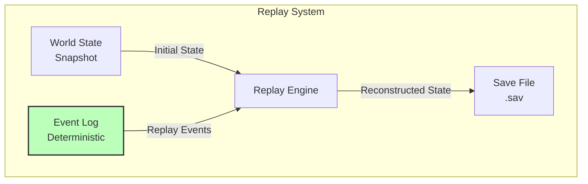
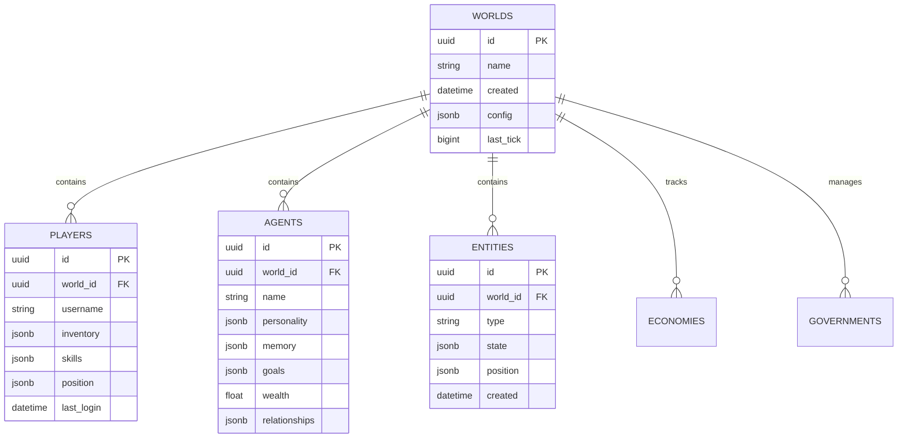

# Day 1: Data & Persistence

> **Navigation**: [← Previous: Client & Server Architecture](02-client-server-architecture.md) | [Index]([AGENTS-READ-FIRST]-index.md) | [Next: Performance & Scalability](04-performance-scalability.md)
> 
> **Part of**: [Day 1 Technical Architecture]([AGENTS-READ-FIRST]-index.md)

---

## 6. Save/Replay System

### Factorio Replay System Analysis

**How Factorio Does It** [r1-factorio-case-study.md, Section 4]:

Factorio's replay system is the gold standard for deterministic game debugging:

**Deterministic Lockstep Foundation**:
- All clients run identical simulation with same inputs
- Only player inputs (keyboard/mouse) sent over network
- CRC32 checksums calculated after each tick closure
- If CRCs mismatch = desync detected immediately
- Desynced client re-downloads map from server

**"Megapacket" Approach (90% Bandwidth Reduction)**:
```
Traditional (per-tick):
- 60 packets/second × 40 bytes overhead = 2,400 bytes overhead/s

Factorio (tick closures):
- Batch 6 ticks into one "closure"
- 10 packets/second × 40 bytes = 400 bytes overhead/s
- 83% reduction from batching alone
```
[r1-factorio-case-study.md, Section 5]

**What We Adopt vs. What We Adapt**:

| Factorio Feature | Societies Adoption |
|-----------------|-------------------|
| **Event sourcing** | ✅ Yes - Snapshots + event log |
| **Deterministic lockstep** | ❌ No - We use state sync |
| **CRC checks** | ⚠️ Optional - For debugging only |
| **Megapacket batching** | ✅ Yes - Batch 6-10 ticks |
| **Automatic desync recovery** | ❌ Not needed - state sync |
| **Replay debugging** | ✅ Yes - Essential for AI debugging |

**Key Lessons from Factorio**:
1. Event sourcing enables "what happened at tick X?" debugging
2. Periodic snapshots + event log = perfect reconstruction
3. Save files store: initial state + deterministic replay log
4. Any point in time reconstructable by loading snapshot + replaying [r1-factorio-case-study.md, Section 4]

### Event-Sourced Architecture



### Save System Design

**Snapshot Frequency**:
- **Full World State**: Saved every 15 minutes (every 18,000 ticks at 20 TPS)
- **Initial Connect**: Client receives latest snapshot + events since snapshot
- **Snapshot Size**: ~5-10 MB compressed for 100 agents + 5,000 entities [r1-factorio-case-study.md]

**Event Log Structure** [r1-research-summary.md, Decision 5]:
- **Format**: Append-only, immutable log
- **Contents**: Agent decisions, player actions, random events, economy transactions
- **Storage**: Compressed JSON or binary format
- **Signature**: Each event signed with tick number for replay ordering

```csharp
public struct GameEvent {
    public uint Tick;                    // When event occurred
    public EventType Type;               // Category (AgentAction, PlayerInput, etc.)
    public string EntityId;              // Who performed action
    public string Action;                // What happened
    public Dictionary<string, object> Data;  // Contextual data
    public uint RandomSeed;              // RNG state for determinism
}
```

**Storage Format**:

| Component | Format | Size | Frequency |
|-----------|--------|------|-----------|
| **Snapshots** | Compressed binary (MessagePack/Protobuf) | 5-10 MB | Every 15 min |
| **Events** | Compressed JSON/binary | ~50 KB/min | Continuous |
| **Metadata** | JSON | ~1 KB | Per save |

**Deterministic Replay Requirements**:
1. **Same Random Seeds**: RNG initialized with recorded seed per tick
2. **Same Tick Rate**: Replay at original 20 TPS
3. **Same Initial Conditions**: Start from identical snapshot state
4. **Deterministic Code**: No external time calls, no unseeded random [r1-factorio-case-study.md, Section 4]

> **⚠️ Time Acceleration Limitations**: Time acceleration (2x-10x when no players are online) and variable tick rates (10-30 TPS based on load) can affect deterministic replay. The replay system works best with fixed 20 TPS. To maintain replay accuracy:
> - Use time acceleration only during non-replay periods, OR
> - Limit time acceleration to 2x-5x with fixed 20 TPS (batch multiple ticks per real-time frame), OR
> - Record actual tick timestamps (not just sequence) to reconstruct timing during replay
> - Accept that replays with variable tick rates may diverge slightly from original timing

**Example Replay Flow**:
```csharp
public WorldState ReplayToTick(uint targetTick) {
    // Load latest snapshot before target
    var snapshot = LoadLatestSnapshotBefore(targetTick);
    var state = Deserialize(snapshot.Data);
    
    // Initialize RNG with snapshot seed
    InitializeRandom(snapshot.InitialSeed);
    
    // Replay events up to target
    var events = _eventLog.Where(e => e.Tick > snapshot.Tick && e.Tick <= targetTick)
                          .OrderBy(e => e.Tick);
    
    foreach (var evt in events) {
        SetRandomSeed(evt.RandomSeed);
        ApplyEvent(state, evt);
        SimulateTick();
    }
    
    return state;
}
```

**Additional Replay Capabilities**:
- **Debug Tool**: Replays enable debugging ("What happened at tick 1847293?")
- **Branching Worlds**: Can fork world at any point (save as new world)

### Replay Use Cases

- **Debugging**: See exactly what led to a bug
- **Analysis**: Study agent behavior over time
- **Recovery**: Roll back to before catastrophic event
- **Content Creation**: Create timelapses of world evolution

### Debug Tool Integration

**"What Happened at Tick X?" Debugging** [r1-factorio-case-study.md, Section 4]:

Factorio's desync debugging approach applied to Societies:

1. **Load Snapshot Before Target Tick**
   - Find most recent snapshot prior to tick X
   - Load full world state from that point

2. **Replay Events Up to Tick X**
   - Apply all events from snapshot to target tick
   - Verify world state matches recorded state
   - If mismatch = investigate which event caused divergence

3. **Inspect World State at Any Point**
   - Agent positions, inventory, goals
   - Economy state (prices, wealth distribution)
   - Governance (active laws, votes)
   - Ecosystem (pollution levels, species counts)

**Branching Worlds Capability** [r1-research-summary.md]:
```
Timeline A (Original)
├── Tick 10000: Save point "Branch_Origin"
├── Tick 10001-15000: Player does X
└── Outcome A

Timeline B (Branch from 10000)
├── Tick 10000: Load "Branch_Origin"
├── Tick 10001-15000: Player does Y
└── Outcome B

Comparison:
- What if we had passed Law A instead of Law B?
- What if Agent Smith had chosen farming instead of mining?
```

**Replay Viewer UI**:

| Feature | Function |
|---------|----------|
| **Timeline Scrubber** | Drag to any tick; view world state |
| **Play/Pause** | Automatic replay at 1x, 2x, 10x speed |
| **Step Forward/Back** | Tick-by-tick analysis |
| **Entity Inspector** | Click any agent/object; view full state |
| **Event Log Display** | Filterable list of all events |
| **State Diff** | Compare world state between two ticks |

**Example Debug Session**:
```
Bug Report: "Agent disappeared at tick 1847293"

Debug Steps:
1. Load snapshot from tick 1845000 (15 min before)
2. Replay events to tick 1847290
3. Inspect Agent_042: Position (100, 0, 200), Health 50
4. Step to tick 1847291: Event "MeteorImpact" at (100, 0, 200)
5. Step to tick 1847292: Agent_042 health = 0, flagged for removal
6. Root cause: Meteor spawned at agent location, instant death
```

### Storage Requirements

**Event Log Growth Rate** [r1-factorio-case-study.md]:

| Metric | Calculation | Value |
|--------|-------------|-------|
| Events per minute | 100 agents × 1 decision/min | ~100 events |
| Size per event | JSON with compression | ~50 bytes |
| Per minute | 100 × 50 bytes | ~5 KB |
| Per hour | 5 KB × 60 | ~300 KB |
| Per day | 300 KB × 24 | ~7.2 MB |
| Per month | 7.2 MB × 30 | ~216 MB |

> **Important Clarification**: The ~216 MB/month estimate assumes logging only **significant decisions** (major actions like buying/selling, voting, law changes) at approximately 1 per minute per agent. If logging every tick-level event (20 TPS), storage would be ~41 GB/month. The implementation must sample/batch events or use aggressive compression for tick-level logging.

**Compression Strategies**:

1. **Run-Length Encoding for Idle Periods**
   ```
   Instead of: [tick_1: idle], [tick_2: idle], [tick_3: idle]...
   Store: [tick_1-1000: idle]
   ```

2. **Delta Compression for Positions**
   ```
   Instead of: position (100.0, 0.0, 200.0)
   Store: delta from last position (+0.1, 0.0, -0.05)
   ```

3. **Brotli/LZ4 Compression**
   - LZ4: Fast compression/decompression (real-time)
   - Brotli: Better compression ratio (archival)
   - Target: 50-70% size reduction [r1-factorio-case-study.md]

**Retention Policies**:

| Age | Retention | Storage |
|-----|-----------|---------|
| 0-30 days | Full event log | ~216 MB* |
| 30-90 days | Hourly snapshots + key events | ~500 MB |
| 90+ days | Daily snapshots only | ~150 MB |

\* Based on significant decisions only (1/min). Tick-level logging requires sampling or would increase storage 200x.

**Archive Strategy**:
- Hot events (recent): PostgreSQL JSONB
- Warm events (1-30 days): Compressed files
- Cold events (30+ days): Archive storage (load on demand)
- Replay on-demand: Fetch from archive when needed

**Total Storage Estimates**:
```
Active World (100 agents, 20 players):
- Snapshots: 10 MB × 96/day = 960 MB
- Events: 70 MB/day
- Total daily: ~1 GB
- Monthly: ~30 GB

With compression (60% reduction):
- Monthly: ~12 GB
```

---

## 7. Database Architecture

### PostgreSQL Schema (Production)



### PostgreSQL JSONB Deep Dive

**Performance Characteristics** [r1-postgresql-jsonb-research.md]:

| Metric | JSONB with GIN | JSONB without Index | Normalized Columns |
|--------|----------------|---------------------|-------------------|
| **Read (indexed)** | 0.5-0.8ms | 300-400ms | 0.4-0.6ms |
| **Write** | 2-3ms | 1-2ms | 1.5-2ms |
| **Storage per row** | ~70-80 bytes | ~70-80 bytes | ~48 bytes |
| **Index size (1M rows)** | 67-84 MB | N/A | 20-30 MB |

**Read Penalty**: 10-20% slower than normalized tables (acceptable for flexibility) [r1-postgresql-jsonb-research.md]

**Write Penalty**: Higher due to parsing and index maintenance, but acceptable for 20 TPS [r1-postgresql-jsonb-research.md]

**GIN Index Queries**: 0.5-0.8ms with proper indexing vs 300ms+ without [r1-postgresql-jsonb-research.md]

**When to Use JSONB vs Columns** [r1-postgresql-jsonb-research.md]:

**Use JSONB For**:
- Agent personality (50 facets from R4)
- Agent memory (3-tier system from R4)
- Inventory (variable item lists)
- Skills (dynamic progression data)
- Experimental features (schema evolves frequently)

**Use Columns For**:
- world_id, player_id (foreign keys, always queried)
- created_at, updated_at, last_tick (timestamps)
- entity_type (enumerations, filtered often)
- x, y, z coordinates (spatial queries)
- is_active (boolean flags)

**Indexing Strategies**:

1. **GIN Index** (default operator class):
```sql
CREATE INDEX idx_agents_data ON agents USING GIN (data);
-- Supports: @> (contains), ? (exists), ?| (any), ?& (all)
```

2. **Path-Optimized GIN** (20% smaller index):
```sql
CREATE INDEX idx_agents_data_path ON agents USING GIN (data jsonb_path_ops);
-- Supports only: @>, @@, @? (more limited but faster)
```

3. **Expression Indexes** (for frequently filtered fields):
```sql
CREATE INDEX idx_agents_wealth ON agents((data->'economy'->>'wealth')::decimal);
CREATE INDEX idx_agents_profession ON agents((data->>'profession'));
```
[r1-postgresql-jsonb-research.md]

### Hybrid Schema Strategy

**Columns for Stable Fields** [r1-postgresql-jsonb-research.md]:

```sql
CREATE TABLE agents (
    -- Relational columns (frequently queried, stable)
    id uuid PRIMARY KEY DEFAULT gen_random_uuid(),
    world_id uuid REFERENCES worlds(id) ON DELETE CASCADE,
    agent_type varchar(50) NOT NULL,  -- 'citizen', 'merchant', 'official'
    created_at timestamp DEFAULT now(),
    last_tick bigint DEFAULT 0,
    is_active boolean DEFAULT true,
    position_x float DEFAULT 0,
    position_y float DEFAULT 0,
    position_z float DEFAULT 0,
    
    -- JSONB for flexible, evolving data
    data JSONB DEFAULT '{
        "personality": {},
        "memory": [],
        "goals": [],
        "skills": {},
        "inventory": {},
        "economy": {"wealth": 0, "income": 0, "expenses": 0},
        "health": {"physical": 100, "mental": 100},
        "relationships": {}
    }'
);

-- Core indexes
CREATE INDEX idx_agents_world ON agents(world_id);
CREATE INDEX idx_agents_active ON agents(world_id, is_active) WHERE is_active = true;
CREATE INDEX idx_agents_type ON agents(world_id, agent_type);
CREATE INDEX idx_agents_position ON agents(world_id, position_x, position_y, position_z);

-- GIN index for JSONB queries
CREATE INDEX idx_agents_data ON agents USING GIN (data);

-- Expression indexes for common JSONB filters
CREATE INDEX idx_agents_wealth ON agents(world_id, ((data->'economy'->>'wealth')::decimal));
CREATE INDEX idx_agents_health ON agents(world_id, ((data->'health'->>'physical')::int));
```

**JSONB for Flexible Data**:
- Agent personality (50 facets)
- Agent memory (3-tier system)
- Inventory (variable length)
- Skills (dynamic progression)
- Relationships (social network data)

**Migration Strategies**:
- Schema evolution easier with JSONB
- Add fields without ALTER TABLE
- Backward compatibility built-in
- Promote to columns when stable

### Eco's Database Lesson (CRITICAL WARNING)

**⚠️ Eco's LiteDB Disaster** [r3-eco-technical-postmortem.md, Section 1.3]:

Eco experienced significant database performance issues with LiteDB, where read/write operations caused server lag, block lag, and timeouts at scale.

**What Went Wrong**:
- Eco used **LiteDB** (embedded NoSQL database)
- For 50-100 player scale, LiteDB couldn't handle the I/O load
- Read/write spikes caused server lag and timeouts
- Embedded database created bottleneck that was hard to fix post-launch

**Why PostgreSQL from Day One** [r3-eco-technical-postmortem.md]:

| Feature | LiteDB (Eco) | PostgreSQL (Societies) |
|---------|--------------|------------------------|
| **Architecture** | Embedded (in-process) | Dedicated server |
| **Connection Pooling** | Limited | 10-100 connections |
| **Read Replicas** | No | Yes (for analytics) |
| **Performance at Scale** | Lag spikes | Stable latency |
| **Professional Grade** | Hobbyist | Production-proven |

**Lessons Learned**:
1. **Use dedicated database server** from day one
2. **Connection pooling** essential for concurrent access
3. **Async operations** - don't block game thread on DB
4. **Batch writes** - don't write every change immediately

**Our Mitigation**:
- PostgreSQL with JSONB (proven at scale)
- Async database operations
- Connection pooling (min 10, max 100)
- Dirty tracking + batching (flush every 5s)

### Performance Optimization

**Connection Pooling** [r1-postgresql-jsonb-research.md]:
```csharp
// Npgsql connection string with pooling
"Host=localhost;Database=societies;Username=soc;Password=xxx;
 MinPoolSize=10;MaxPoolSize=100;ConnectionLifetime=300;"
```
- **Minimum**: 10 connections (always ready)
- **Maximum**: 100 connections (upper limit)
- **Async**: All operations async to prevent blocking game thread

**Read Replicas Strategy**:
- **Primary**: All writes (world state changes)
- **Replica 1**: Analytics queries, leaderboards
- **Replica 2**: Replay system reads
- **Benefit**: Offload read-heavy operations from primary

**Batch Operations**:
```csharp
public class BatchedRepository<T> {
    private const int BatchSize = 100;
    
    public async Task BatchUpdateAsync(List<T> objects) {
        using var transaction = await _context.Database.BeginTransactionAsync();
        
        // Split into batches of 100
        for (int i = 0; i < objects.Count; i += BatchSize) {
            var batch = objects.Skip(i).Take(BatchSize).ToList();
            await ExecuteBatchAsync(batch);
        }
        
        await transaction.CommitAsync();
    }
}
```
- Batch size: 100-1000 rows
- Reduces round-trip overhead
- Atomic transactions per batch [r1-research-summary.md]

**Caching Layer**:
- **Hot Data**: Recently accessed agents, current prices
- **Redis Optional**: For extreme scale (1000+ concurrent reads)
- **In-Memory Cache**: Entity state cached server-side
- **Invalidate**: On entity update

### Schema Evolution

**Migration Strategies** [r1-postgresql-jsonb-research.md]:

**Forward Migrations**:
```sql
-- Migration 001: Add agent personality fields
UPDATE agents 
SET data = jsonb_set(data, '{personality}', '{"extroversion": 0.5, "neuroticism": 0.3}'::jsonb)
WHERE data->'personality' IS NULL;
```

**Backward Compatibility**:
- JSONB fields accept new keys without migration
- Old code ignores new fields
- Version control tracks schema changes

**Version Control**:
```
migrations/
├── 001_initial_schema.sql
├── 002_add_agent_personality.sql
├── 003_add_economy_fields.sql
└── 004_add_event_log.sql
```

**JSONB Flexibility Benefits**:
1. **Add new agent attributes** without ALTER TABLE
2. **Experimental features** in JSONB first
3. **Promote to columns** when stable and performance-critical
4. **Backward compatible** - old code ignores new fields

**Handling Breaking Changes**:
1. **Blue-green deployment**: Deploy new version alongside old
2. **Data migration scripts**: Transform old data to new format
3. **Feature flags**: Enable new schema gradually
4. **Rollback plan**: Keep old schema accessible

---

## 19. Database Schema Evolution

### Schema Versioning Strategy

**Migration Organization**:
```
migrations/
├── 001_initial_schema.sql
├── 002_add_player_inventory.sql
├── 003_add_agent_memory.sql
└── 004_jsonb_optimization.sql
```

**Version Control**:
- All migrations in Git
- Each migration has "up" and "down" versions
- Test migrations before production deployment

**Rollback Procedures**:
- Every migration reversible
- Down migration returns to previous state
- Test rollbacks in staging environment

### JSONB Flexibility Benefits

**Schema Evolution Without Migration**:
```sql
-- Add new field to agent without ALTER TABLE
UPDATE agents 
SET personality = personality || '{"new_trait": 50}'::jsonb 
WHERE id = 'agent-123';
```

**Experimental Features**:
- Try new data structures in JSONB first
- If successful, promote to columns later
- Backward compatible: Old code ignores new fields

**Migration Path**:
1. **Phase 1**: New feature in JSONB (experimental)
2. **Phase 2**: Validate usage, performance
3. **Phase 3**: Migrate to columns if needed
4. **Phase 4**: Deprecate JSONB version

### Migration Testing

**Automated Testing**:
- Run all migrations on test database in CI
- Verify data integrity (checksums, counts)
- Measure performance before/after

**Blue-Green Deployment**:
- Deploy new schema to "green" database
- Sync data from "blue" (production)
- Switch traffic to "green"
- Keep "blue" for quick rollback

### Handling Breaking Changes

**Deprecation Strategy**:
```sql
-- Step 1: Add new column
ALTER TABLE agents ADD COLUMN new_field INTEGER;

-- Step 2: Migrate data gradually
UPDATE agents SET new_field = old_json_field->>'value';

-- Step 3: Dual-write (write to both)
-- Application code writes to both old and new

-- Step 4: Switch reads to new column

-- Step 5: Remove old field
```

**Feature Flags**:
- Enable new schema gradually (10% → 50% → 100%)
- Monitor for issues
- Quick rollback if problems

---

**Previous**: [← Client & Server Architecture](02-client-server-architecture.md) | **Next**: [Performance & Scalability →](04-performance-scalability.md)
