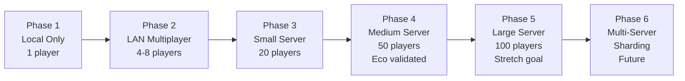

# Day 1: Performance & Scalability

> **Navigation**: [← Previous: Data & Persistence](03-data-persistence.md) | [Index]([AGENTS-READ-FIRST]-index.md) | [Next: Technology & Testing](05-technology-testing.md)
> 
> **Part of**: [Day 1 Technical Architecture]([AGENTS-READ-FIRST]-index.md)

---

## 8. Performance Budgets (MAJOR EXPANSION)

### Executive Summary

Societies targets **100 AI agents** with **100 concurrent players** at **20 TPS** (ticks per second). Key validated metrics:

- **Bandwidth**: 32 KB/s per player (256 KB/s server upload for 8 players MVP) [r1-research-summary.md, Key Finding 4]. Scales to 112 KB/s per player at full deployment.
- **Server CPU**: 25-75% utilization target with adaptive quality reduction [r1-eco-performance-research.md, r3-eco-technical-postmortem.md]
- **Memory**: 8GB minimum server RAM (headless mode) [r1-godot-headless-research.md]
- **Entity Limits**: 2,000 MVP, 10,000 stretch (validated in headless mode) [r1-godot-headless-research.md]
- **Player Limits**: 8 MVP, 100 stretch (Eco validated 50-100 players) [r3-eco-technical-postmortem.md]
- **Biomes**: 3 MVP (Boreal Forest, Subtropical Desert, Jungle), 6+ stretch

### Target Specifications

| Metric | MVP Target | Stretch Goal | Validated By | Hardware Requirements |
|--------|-----------|--------------|--------------|----------------------|
| World Size | 0.5 km² (3 biomes) | 4 km² (6+ biomes) | [r1-research-summary.md] | - |
| Max Agents (AI) | 25 | 100 | [r1-godot-headless-research.md] | CPU-bound |
| Max Players | 8 | 20 | [r3-eco-technical-postmortem.md] | 256 KB/s upload (MVP) |
| Total Entities | 2,000 | 10,000 | [r1-research-summary.md, Key Finding 6] | RAM-bound |
| Server Tick Rate | 20 TPS | 30 TPS | [r1-research-summary.md, Key Finding 5] | CPU |
| Client FPS | 60 FPS | 144 FPS | Industry standard | GPU |
| Memory (Server) | 8 GB | 16 GB | [r1-godot-headless-research.md] | See detailed breakdown below |
| Network (per player) | 32 KB/s | 112 KB/s | [r1-research-summary.md, Key Finding 4] | Bandwidth |

**Hardware Requirements by Scale** [r3-eco-technical-postmortem.md]:

| Server Size | Players | CPU Cores | RAM | Storage |
|-------------|---------|-----------|-----|---------|
| **MVP** | **4-8** | **4** | **8 GB** | **SSD** |
| Small | 10-25 | 4-6 | 16 GB | SSD |
| Medium | 25-50 | 6-8 | 32 GB | NVMe |
| Large | 50-100 | 12-16 | 64 GB | NVMe |

> **Scaling Note**: Reaching 100 players requires "Large" tier hardware (12-16 cores, 64GB RAM) per Eco's validated requirements [r3-eco-technical-postmortem.md]. The MVP (8GB) supports only 4-8 players. Horizontal sharding (Phase 6) would be required to exceed 100 players.

### Memory Requirements Breakdown

**Server RAM Allocation** (8GB recommended system) [r1-godot-headless-research.md]:

| Component | Memory | Notes |
|-----------|--------|-------|
| **Godot Headless Process** | ~270-500 MB | Core simulation (scales with agents) |
| **PostgreSQL Server** | ~1-2 GB | Database caching and connections |
| **Operating System** | ~1-2 GB | Linux/Windows overhead |
| **Network Buffers** | ~200-500 MB | ENet connections, packet queues |
| **Safety Margin** | ~2-4 GB | Headroom for spikes and growth |
| **Total Recommended** | **8 GB** | Headless process only uses 500MB-1GB |

**Client RAM** (graphical mode) [r1-godot-headless-research.md]:
- Base engine: ~100 MB
- Rendering (Vulkan): ~200-500 MB
- Textures/meshes: ~500 MB - 1 GB
- Entity state cache: ~50 MB (100 agents × ~500 KB each)
- UI/Overlays: ~100 MB
- **Total**: ~1-3 GB

**Key Clarification**: The "<1GB for 100 agents" claim refers specifically to the Godot headless process, not total server requirements. PostgreSQL and OS require additional RAM.

### Bandwidth Budget Breakdown

**Per-Player Bandwidth Calculation** [r1-research-summary.md, Key Finding 4; r1-enet-protocol-research.md]:

**MVP Scale (25 agents, 8 players)**:
| Component | Calculation | Bandwidth |
|-----------|-------------|-----------|
| **Agent Positions (nearby)** | 20 TPS × 25 agents × 0.04 KB | 20 KB/s |
| **State Updates (batched)** | Batched reliable RPCs | 0.5 KB/s |
| **World Snapshots** | 5 KB every 2 seconds | 2.5 KB/s avg |
| **Chat/Commands** | Text + protocol overhead | 2 KB/s |
| **Protocol Overhead** | ENet headers, acks (~22%) | ~7 KB/s |
| **Total Per Player** | | **32 KB/s** |

**Full Scale (100 agents, 20+ players)**:
| Component | Calculation | Bandwidth |
|-----------|-------------|-----------|
| **Agent Positions (nearby)** | 20 TPS × 100 agents × 0.04 KB | 80 KB/s |
| **State Updates (batched)** | Batched reliable RPCs | 0.5 KB/s |
| **World Snapshots** | 20 KB every 2 seconds | 10 KB/s avg |
| **Chat/Commands** | Text + protocol overhead | 2 KB/s |
| **Protocol Overhead** | ENet headers, acks (~18%) | ~20 KB/s |
| **Total Per Player** | | **112 KB/s** |

**Server Upload Requirements**:
- **MVP (8 players): 32 KB/s × 8 = 256 KB/s**
- Medium scale (20 players): 112 KB/s × 20 = 2.24 MB/s
- Large scale (50 players): 112 KB/s × 50 = 5.6 MB/s
- Full scale (100 players): 112 KB/s × 100 = 11.2 MB/s [r1-research-summary.md]

> **Note on Real-World Bandwidth**: Real-world bandwidth is typically 25-50% higher than these calculations due to Godot serialization overhead, full network stack overhead (46-54 bytes per packet), and network conditions.

**Bandwidth Optimization Strategies**:
1. **Spatial Culling**: Only sync agents within 200m radius (reduces from 500 to ~100 agents)
2. **Network LOD**: Nearby (20 TPS), medium (10 TPS), far (2 TPS) [r1-network-sync-research.md]
3. **Delta Compression**: Send state differences only (50-70% reduction) [r1-network-sync-research.md]
4. **Megapacket Batching**: Batch 6-10 ticks (90% overhead reduction) [r1-factorio-case-study.md]

### CPU Budgeting System

**Priority Queue Mechanism** [r1-eco-performance-research.md, r3-eco-technical-postmortem.md]:

| Priority | Systems | Budget Allocation | Action if Over Budget |
|----------|---------|-------------------|----------------------|
| **Critical** | Player actions, law enforcement, network I/O | Always runs | None |
| **High** | AI decisions (nearby), economy updates | 50% of tick | Skip distant AI |
| **Medium** | Ecosystem, weather, pollution | 30% of tick | Reduce frequency |
| **Low** | Analytics, logging, background tasks | 20% of tick | Defer to next tick |

**Budget Allocation**:
- **Default**: 25% CPU utilization (leaves headroom)
- **Maximum**: 75% (beyond this = lag spikes)
- **Per-tick budget at 20 TPS**: 50ms × 0.25 = 12.5ms [r1-eco-performance-research.md]

**Adaptive Quality Reduction**:
When over budget (>75% CPU):
1. Reduce tick rate temporarily (20 TPS → 15 TPS)
2. Reduce sync radius (200m → 150m)
3. Skip non-critical AI updates
4. Reduce ecosystem simulation frequency

```csharp
public class PerformanceManager {
    [Export] public float MaxCpuPercent { get; set; } = 0.25f;
    private double _tickBudgetMs;
    
    public override void _Ready() {
        _tickBudgetMs = (1000.0 / Engine.PhysicsTicksPerSecond) * MaxCpuPercent;
    }
    
    public void ProcessTick(double delta) {
        var stopwatch = Stopwatch.StartNew();
        
        // Critical: Always run
        ProcessPlayerActions();
        ProcessNetworkIO();
        
        // High priority
        if (stopwatch.ElapsedMilliseconds < _tickBudgetMs * 0.5) {
            ProcessNearbyAI();
            UpdateEconomy();
        }
        
        // Medium priority
        if (stopwatch.ElapsedMilliseconds < _tickBudgetMs * 0.8) {
            UpdateEcosystem();
        }
        
        // Low priority or over budget
        if (stopwatch.ElapsedMilliseconds >= _tickBudgetMs) {
            ReduceQuality();
        }
    }
    
    private void ReduceQuality() {
        AgentSyncRadius *= 0.9f;
        MaxAgentsPerTick = Math.Max(10, MaxAgentsPerTick - 5);
        GD.Print($"Quality reduced: radius={AgentSyncRadius}, maxAgents={MaxAgentsPerTick}");
    }
}
```
[r1-eco-performance-research.md, r3-eco-technical-postmortem.md]

### Memory Management

**Headless Mode Memory Usage** [r1-godot-headless-research.md]:

| Component | Graphical Mode | Headless Mode |
|-----------|----------------|---------------|
| Base Engine | ~100 MB | ~100 MB |
| Rendering (Vulkan) | ~200-500 MB | 0 MB |
| Textures | ~500 MB - 2 GB | 0 MB |
| Shaders | ~100-300 MB | 0 MB |
| Physics | ~100 MB | ~100 MB |
| Game State | ~50 MB | ~50 MB |
| Network Buffers | ~20 MB | ~20 MB |
| **Total** | **~1.1 - 3.3 GB** | **~270 MB** |

**Memory per Entity** [r1-godot-headless-research.md]:
- Agent (complex): ~8.5 KB (Node3D + script + state data)
- 100 agents: ~850 KB (negligible)
- Static entity: ~1.5 KB
- 5,000 entities: ~7.5 MB

**Object Pooling**:
- Reuse entity objects to reduce GC pressure
- Pre-allocate pools for: particles, projectiles, temporary effects
- Critical for long-running servers (days/weeks uptime)

### Single-Threaded Core Limitation

**⚠️ Critical Bottleneck Warning** [r3-eco-technical-postmortem.md]:

The core game simulation logic runs primarily on a **single thread**, which is the main scaling bottleneck for Societies:

- **Diminishing returns**: Adding more than 4-8 CPU cores provides minimal benefit for core simulation
- **Entity contention**: 100 agents + 20 players all compete for the same thread's processing time  
- **Vertical scaling limit**: Even with 12-16 cores, the single-threaded core limits maximum player/agent count
- **Stretch goal risk**: 100 agents + 20 players at 20 TPS may require reducing tick rate to 15 TPS or using 75% CPU utilization

**Mitigation Strategies**:
1. **Aggressive LOD**: Distant agents use minimal AI (2 TPS updates)
2. **Spatial Partitioning**: Only process chunks with active players  
3. **Priority Queues**: Skip non-critical AI when over budget
4. **Future**: Consider horizontal sharding for 100+ players (Phase 6)

### Optimization Strategies

**1. Spatial Partitioning (100m Chunks)** [r1-eco-performance-research.md, r3-eco-technical-postmortem.md]:
- Reduces O(n²) to O(n) for interaction checks
- Only process chunks with active players
- Critical for 1000+ entities
- Adjacent chunk communication for pollution/trade spread

**2. LOD (Level of Detail) System** [r1-network-sync-research.md]:
| Distance | Update Rate | Detail Level |
|----------|-------------|--------------|
| < 50m | 20 TPS | Full AI, animations |
| 50-200m | 10 TPS | Reduced AI, basic animations |
| > 200m | 2 TPS or frozen | Frozen state, no AI |

**3. Dirty Tracking** [r1-eco-performance-research.md]:
- Only sync changed entities
- Bandwidth reduction: 60-80%
- Database write reduction: 80%
- Track per-entity "dirty" flag, clear after sync

**4. Delta Compression** [r1-network-sync-research.md]:
- Send state differences vs full state
- Bandwidth reduction: 50-70%
- Send only changed fields
- Example: Position delta (+0.1, 0.0, -0.05) vs full position

**5. Megapacket Batching** [r1-factorio-case-study.md]:
- Batch 6-10 ticks of updates
- Reduces packet overhead by 90%
- Factorio's approach: 10 closures/second vs 60 packets/second
- Trade-off: Slightly higher latency (50ms) for 90% bandwidth savings

```csharp
// Batched update example
private List<StateUpdate> _pendingUpdates = new();
private double _batchTimer = 0;

public override void _Process(double delta) {
    _batchTimer += delta;
    
    // Accumulate updates
    foreach (var entity in GetDirtyEntities()) {
        _pendingUpdates.Add(CreateUpdate(entity));
    }
    
    // Send batch every 300ms (6 ticks at 20 TPS)
    if (_batchTimer >= 0.3) {
        Rpc(nameof(ReceiveBatch), Compress(_pendingUpdates));
        _pendingUpdates.Clear();
        _batchTimer = 0;
    }
}
```

**Optimization Priority**:
1. Spatial partitioning (biggest impact)
2. Dirty tracking (60-80% bandwidth reduction)
3. Delta compression (50-70% bandwidth reduction)
4. Megapacket batching (90% overhead reduction)
5. LOD system (CPU savings for distant entities)

---

## 11. Scalability Strategy

### Scaling Lessons from Games

**Factorio: Vertical Scaling Limits** [r6-multiplayer-simulation-tech.md]:
- Single-threaded core logic is the bottleneck
- Memory throughput limits before CPU limits
- 200+ players achievable but requires careful optimization
- Bandwidth remains constant regardless of factory size (lockstep advantage)

**Space Engineers: Sharding Considerations** [r6-multiplayer-simulation-tech.md]:
- Netcode rewrite took 4+ years (2014-2018)
- 16-32 players officially supported, 64 tested
- PCU (Performance Cost Unit) system limits world complexity
- Geographic sharding considered for future

**Eco: 50-100 Player Ceiling** [r3-eco-technical-postmortem.md]:
- Hardware requirements: 12-16 cores, 64GB RAM for 100 players
- Single-threaded simulation limits vertical scaling
- Database I/O (LiteDB) was major bottleneck
- **Lesson**: Plan for horizontal scaling from day one

### Growth Path



### MVP Scope (Month 1-3)

**Validated Targets** [r1-research-summary.md, r3-eco-technical-postmortem.md]:

| Component | MVP Target | Hardware Required | Validated By |
|-----------|-----------|-------------------|--------------|
| World Size | 0.5 km² (3 biomes) | - | Design decision |
| AI Agents | 25* | 4-core CPU | [r1-godot-headless-research.md] |
| Tick Rate | 20 TPS* | CPU-bound | [r1-research-summary.md] |
| Concurrent Players | 8 | 4-core CPU, 8GB RAM | [r3-eco-technical-postmortem.md] |
| Tick Rate | 20 TPS stable | CPU-bound | [r1-research-summary.md] |
| Max Latency | 50ms | Same network | [r1-enet-protocol-research.md] |
| Bandwidth | 32 KB/s/player | 256 KB/s upload | [r1-research-summary.md] |
| Database | SQLite/PostgreSQL | 8GB RAM | [r1-postgresql-jsonb-research.md] |

\* **Important**: The 25 AI agents at 20 TPS target requires achieving <2ms per agent decision time. If agents require 5ms each, the total would be 125ms per tick, exceeding the 50ms budget. Prototype validation is required. Alternative: Reduce to 15 TPS (66ms per tick) or reduce agent count to 15.

**Performance Targets**:
- 20 TPS stable with 25-75% CPU utilization [r1-eco-performance-research.md]
- 50ms latency max (same network) [r1-enet-protocol-research.md]
- 112 KB/s bandwidth per player [r1-research-summary.md]

### Multi-Server Architecture (Future)

**When to Shard** [r6-multiplayer-simulation-tech.md]:
- 100+ players (vertical scaling limits reached)
- Geographic regions (players on different continents)
- Different worlds (separate game instances)

**Cross-Server Communication**:
- Federation protocols for cross-world trade
- Data synchronization between shards
- Player migration between servers

**Not Needed for MVP**: Single server architecture sufficient for 20-100 players

### Entity Scaling Curves

**Linear vs Exponential Scaling** [r6-multiplayer-simulation-tech.md]:

| Entity Count | Architecture | CPU Cost | Notes |
|--------------|--------------|----------|-------|
| 0-1,000 | Standard OOP | Linear | Fine for MVP |
| 1,000-5,000 | OOP + Spatial Partitioning | Near-linear | Required optimization |
| 5,000-10,000 | OOP + Partitioning + LOD | O(n log n) | Current target |
| 10,000+ | ECS (Entity Component System) | O(n) | Consider migration |

**Hardware Scaling Relationships**:
- **CPU cores vs agent count**: Diminishing returns after 4-8 cores (single-threaded core)
- **RAM vs world size**: Linear growth (entity state)
- **Network vs player count**: Linear growth (112 KB/s per player)
- **Storage vs history**: Linear growth (event log)

**Breakpoints**:
- 0-1,000: OOP fine
- 1,000-5,000: Need spatial partitioning (implemented)
- 5,000+: Consider ECS migration (evaluate in Prototype 4) [r8-pdf-synthesis.md]

### Scaling Decisions

- **What's Hardcoded**: Tick rate (configurable via settings), world size constants (0.5 km² blocks)
- **What's Configurable**: Agent count (20-200), player limit (10-100), simulation speed (1x-10x)
- **Sharding Strategy**: Geographic regions (future consideration, not MVP)

---

**Previous**: [← Data & Persistence](03-data-persistence.md) | **Next**: [Technology & Testing →](05-technology-testing.md)
