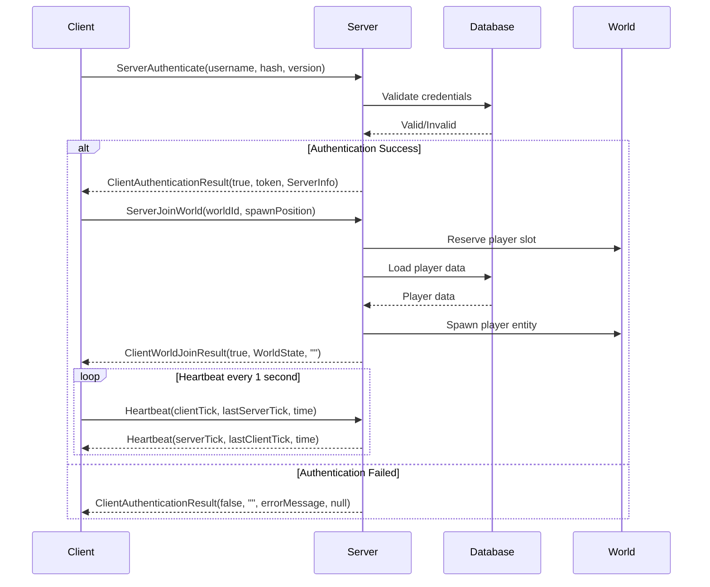
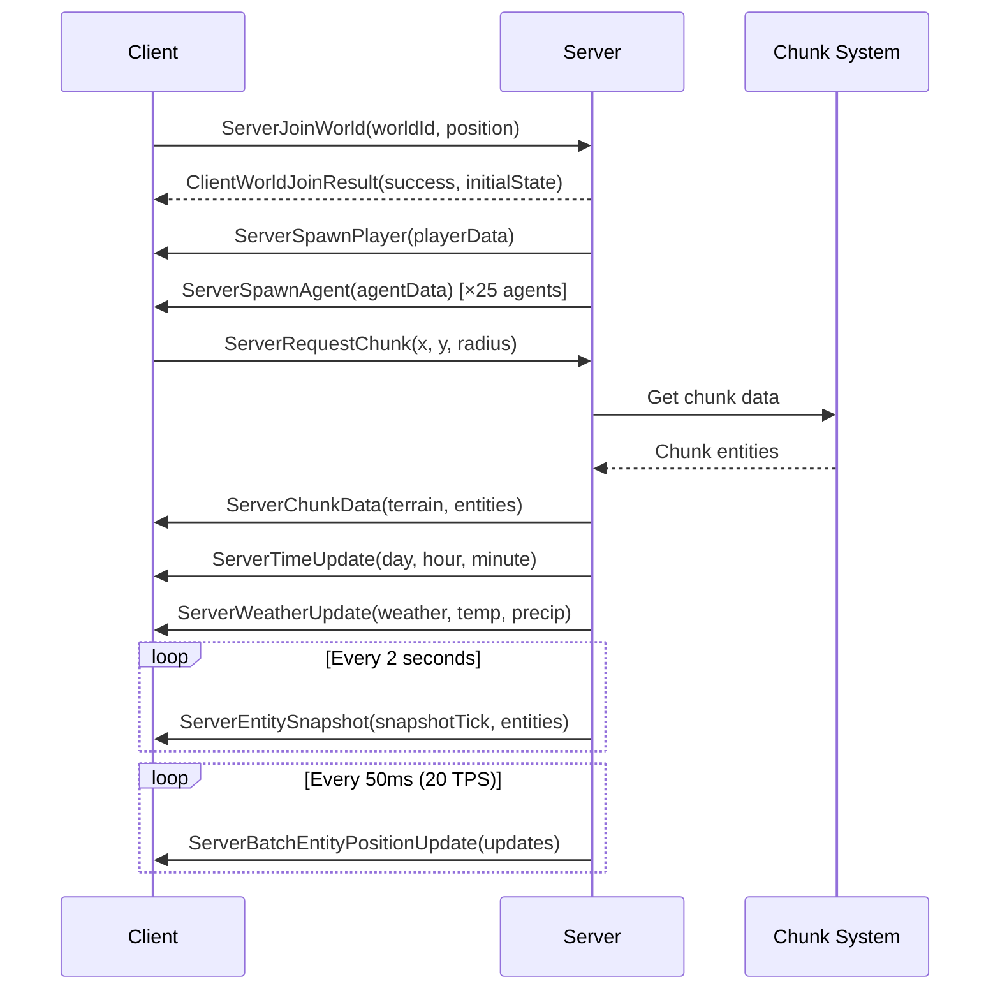
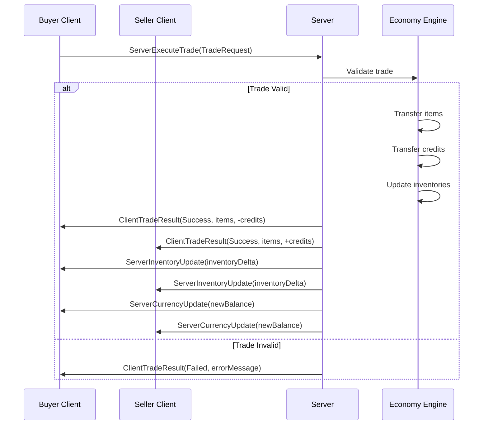
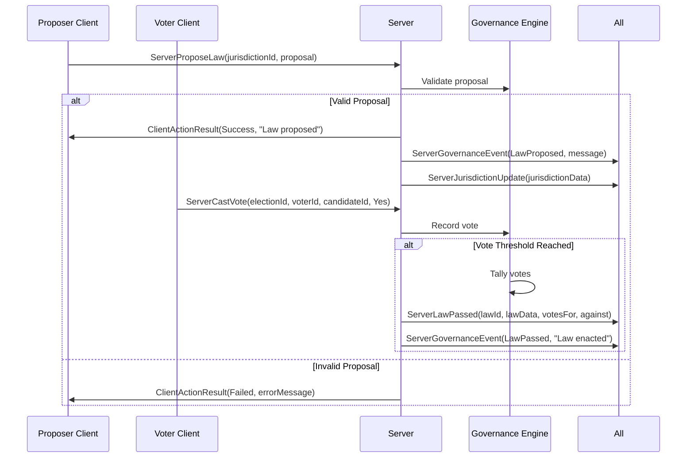
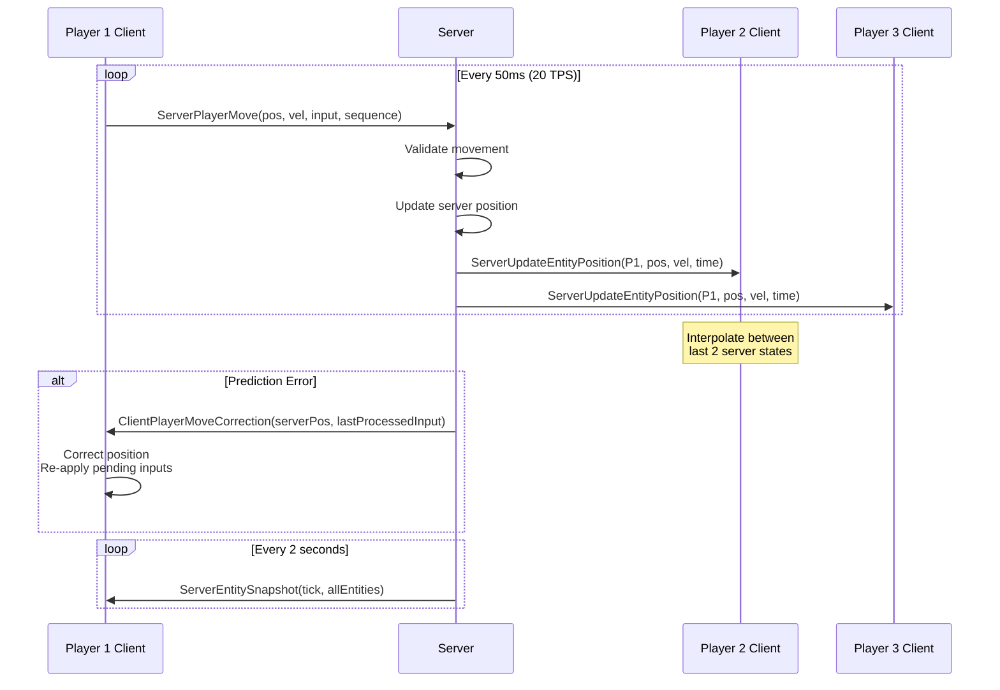

# ENet RPC Protocol Specification

> **Navigation**: [Index]([AGENTS-READ-FIRST]-index.md) | [Client-Server Architecture](02-client-server-architecture.md) | [Data Persistence](03-data-persistence.md)
>
> **Part of**: [Day 1 Technical Architecture]([AGENTS-READ-FIRST]-index.md)

---

## 1. Protocol Overview

### Transport Layer

**Protocol**: ENet over UDP (Godot 4.x MultiplayerAPI)
**Architecture**: Client-Server with Authoritative Server
**Tick Synchronization**: Lockstep with 100ms jitter buffer
**Bandwidth Targets**:
- MVP (8 players, 25 agents): 32 KB/s per player (256 KB/s server upload)
- Post-MVP (20 players, 100 agents): 112 KB/s per player (2.24 MB/s server upload)

**Reference**: All timing and bandwidth values from `planning/meta/technical-constants.md`

### Tick Synchronization Strategy

```csharp
// Server operates at 20 TPS (50ms per tick)
public const int TICK_RATE = 20;
public const double TICK_INTERVAL_MS = 50.0;

// Client-side interpolation with 100ms jitter buffer
public const float NETWORK_JITTER_BUFFER_MS = 100.0f;
public const int NETWORK_SYNC_POSITION_EVERY_TICKS = 1;    // Position every tick
public const int NETWORK_SYNC_FULL_STATE_EVERY_TICKS = 10; // Full state every 10 ticks (500ms)
public const int NETWORK_SNAPSHOT_INTERVAL_SECONDS = 2;    // Full snapshot every 2 seconds
```

**Bandwidth Budget (MVP)**:
```csharp
public const float BANDWIDTH_PER_PLAYER_MVP_KBPS = 32.0f;
public const float BANDWIDTH_AGENT_POSITIONS_KBPS = 16.0f;      // 50% of budget
public const float BANDWIDTH_STATE_UPDATES_KBPS = 0.5f;         // Batched reliable RPCs
public const float BANDWIDTH_SNAPSHOTS_KBPS = 2.5f;             // Periodic full sync
public const float BANDWIDTH_CHAT_COMMANDS_KBPS = 2.0f;         // Social features
public const float BANDWIDTH_PROTOCOL_OVERHEAD_KBPS = 7.0f;     // ~22% ENet overhead
```

---

## 2. Channel Assignment (0-255)

ENet supports 255 channels (0-255). Channels provide independent ordering and reliability streams.

| Channel | Name | Transfer Mode | Priority | Use Case |
|---------|------|---------------|----------|----------|
| 0 | **Critical** | Reliable Ordered | Highest | Authentication, heartbeats, critical state |
| 1 | **Position** | Unreliable Ordered | High | Entity position updates (20 TPS) |
| 2 | **Visuals** | Unreliable | Medium | Effects, emotes, animations |
| 3 | **Chat** | Reliable Ordered | Low | Chat messages, social events |
| 4 | **Economy** | Reliable | High | Trades, transactions, inventory |
| 5 | **Governance** | Reliable | Medium | Laws, votes, elections |
| 6 | **World** | Reliable | Medium | Terrain, chunk updates, weather |
| 7 | **Agent AI** | Reliable | Medium | Agent decisions, behaviors |
| 8 | **Combat** | Reliable | High | Combat actions, damage |
| 9 | **Crafting** | Reliable | Medium | Crafting, building, recipes |
| 10 | **Admin** | Reliable | Highest | Admin commands, moderation |
| 11-249 | **Reserved** | - | - | Future expansion |
| 250-255 | **Debug** | Reliable | Lowest | Telemetry, profiling |

**Channel-Specific Constants**:
```csharp
public const int CHANNEL_CRITICAL = 0;
public const int CHANNEL_POSITION = 1;
public const int CHANNEL_VISUALS = 2;
public const int CHANNEL_CHAT = 3;
public const int CHANNEL_ECONOMY = 4;
public const int CHANNEL_GOVERNANCE = 5;
public const int CHANNEL_WORLD = 6;
public const int CHANNEL_AGENT_AI = 7;
public const int CHANNEL_COMBAT = 8;
public const int CHANNEL_CRAFTING = 9;
public const int CHANNEL_ADMIN = 10;
```

---

## 3. RPC Method Inventory by Category

### 3.1 Authentication & Session (8 RPCs)

**Byte Budget**: ~200 bytes per handshake

```csharp
// Server-to-Client: Authentication result
[RPC(TransferMode = TransferModeEnum.ReliableOrdered, Channel = 0)]
public void ClientAuthenticationResult(
    bool success, 
    string token,                    // 32 bytes (UUID string)
    string errorMessage,             // Variable (max 100 chars)
    ServerInfo serverInfo            // ~80 bytes
);
// Total: ~150 bytes + error message

// Client-to-Server: Login request
[RPC(TransferMode = TransferModeEnum.ReliableOrdered, Channel = 0, 
     Authority = MultiplayerAPI.RPCMode.AnyPeer)]
public void ServerAuthenticate(
    string username,                 // Max 32 chars
    string passwordHash,             // 64 bytes (SHA-256)
    string clientVersion             // 20 bytes (semver)
);
// Total: ~120 bytes

// Client-to-Server: Join world request
[RPC(TransferMode = TransferModeEnum.ReliableOrdered, Channel = 0,
     Authority = MultiplayerAPI.RPCMode.AnyPeer)]
public void ServerJoinWorld(
    Guid worldId,                    // 16 bytes
    Vector3 requestedSpawnPosition   // 12 bytes
);
// Total: 28 bytes

// Server-to-Client: World join result
[RPC(TransferMode = TransferModeEnum.ReliableOrdered, Channel = 0)]
public void ClientWorldJoinResult(
    bool success,
    WorldState initialState,         // Variable (compressed)
    string errorMessage              // Variable
);
// Total: ~500 bytes (compressed) for initial state

// Bidirectional: Heartbeat for latency measurement
[RPC(TransferMode = TransferModeEnum.Unreliable, Channel = 0,
     Authority = MultiplayerAPI.RPCMode.AnyPeer)]
public void Heartbeat(
    ulong clientTick,                // 8 bytes
    ulong lastServerTickReceived,    // 8 bytes
    float clientTime                 // 4 bytes
);
// Total: 20 bytes

// Server-to-Client: Tick synchronization
[RPC(TransferMode = TransferModeEnum.ReliableOrdered, Channel = 0)]
public void ClientTickSync(
    ulong serverTick,                // 8 bytes
    double serverTime,               // 8 bytes
    float serverDeltaTime            // 4 bytes
);
// Total: 20 bytes

// Client-to-Server: Request disconnect
[RPC(TransferMode = TransferModeEnum.ReliableOrdered, Channel = 0,
     Authority = MultiplayerAPI.RPCMode.AnyPeer)]
public void ServerDisconnectRequest(
    DisconnectReason reason          // 1 byte
);
// Total: 1 byte

// Server-to-Client: Kicked/disconnected
[RPC(TransferMode = TransferModeEnum.ReliableOrdered, Channel = 0)]
public void ClientDisconnected(
    DisconnectReason reason,         // 1 byte
    string message                   // Variable
);
// Total: ~50 bytes
```

**Data Structures**:
```csharp
public struct ServerInfo {
    public string ServerName;        // 50 bytes
    public int MaxPlayers;           // 4 bytes
    public int CurrentPlayers;       // 4 bytes
    public string ServerVersion;     // 20 bytes
    public float TickRate;           // 4 bytes
    // Total: ~82 bytes
}

public enum DisconnectReason : byte {
    None = 0,
    ClientQuit = 1,
    ServerShutdown = 2,
    Kicked = 3,
    Banned = 4,
    Timeout = 5,
    VersionMismatch = 6,
    AuthFailed = 7,
    ServerFull = 8
}
```

---

### 3.2 Entity Synchronization (15 RPCs)

**Bandwidth**: 16 KB/s for positions (50% of MVP budget)

```csharp
// Server-to-Client: Spawn entity
[RPC(TransferMode = TransferModeEnum.ReliableOrdered, Channel = 0)]
public void ServerSpawnEntity(
    EntitySpawnData data             // ~75 bytes + variable
);

// Server-to-Client: Update entity position (20 TPS, unreliable)
[RPC(TransferMode = TransferModeEnum.UnreliableOrdered, Channel = 1)]
public void ServerUpdateEntityPosition(
    Guid entityId,                   // 16 bytes
    Vector3 position,                // 12 bytes
    Vector3 velocity,                // 12 bytes
    ulong timestamp                  // 8 bytes
);
// Total: 48 bytes × 20 TPS = 960 bytes/s per entity
// For 25 agents: 24 KB/s (compressed to ~16 KB/s with delta)

// Server-to-Client: Update entity rotation
[RPC(TransferMode = TransferModeEnum.UnreliableOrdered, Channel = 1)]
public void ServerUpdateEntityRotation(
    Guid entityId,                   // 16 bytes
    Vector3 rotation,                // 12 bytes
    ulong timestamp                  // 8 bytes
);
// Total: 36 bytes

// Server-to-Client: Update entity state (reliable, batched)
[RPC(TransferMode = TransferModeEnum.ReliableOrdered, Channel = 0)]
public void ServerUpdateEntityState(
    Guid entityId,                   // 16 bytes
    byte[] stateDelta,               // Variable (typically 50-200 bytes)
    ulong timestamp                  // 8 bytes
);

// Server-to-Client: Destroy entity
[RPC(TransferMode = TransferModeEnum.ReliableOrdered, Channel = 0)]
public void ServerDestroyEntity(
    Guid entityId,                   // 16 bytes
    DestroyReason reason             // 1 byte
);
// Total: 17 bytes

// Server-to-Client: Batch position update
[RPC(TransferMode = TransferModeEnum.UnreliableOrdered, Channel = 1)]
public void ServerBatchEntityPositionUpdate(
    List<PositionUpdate> updates     // N × 48 bytes
);
// Batch size: Up to 50 entities (~2400 bytes)

// Server-to-Client: Batch state update
[RPC(TransferMode = TransferModeEnum.ReliableOrdered, Channel = 0)]
public void ServerBatchEntityStateUpdate(
    List<EntityDelta> deltas         // Variable
);

// Server-to-Client: Full entity snapshot
[RPC(TransferMode = TransferModeEnum.ReliableOrdered, Channel = 0)]
public void ServerEntitySnapshot(
    ulong snapshotTick,              // 8 bytes
    List<EntityFullState> entities   // Variable
);
// Sent every 2 seconds, ~2500 bytes compressed

// Client-to-Server: Request entity info
[RPC(TransferMode = TransferModeEnum.ReliableOrdered, Channel = 0,
     Authority = MultiplayerAPI.RPCMode.AnyPeer)]
public void ServerRequestEntityInfo(
    Guid entityId                    // 16 bytes
);

// Server-to-Client: Entity info response
[RPC(TransferMode = TransferModeEnum.ReliableOrdered, Channel = 0)]
public void ClientEntityInfo(
    Guid entityId,                   // 16 bytes
    EntityInfoData info              // ~200 bytes
);

// Server-to-Client: Chunk entities
[RPC(TransferMode = TransferModeEnum.ReliableOrdered, Channel = 6)]
public void ServerChunkEntities(
    int chunkX,                      // 4 bytes
    int chunkY,                      // 4 bytes
    List<Guid> entityIds             // N × 16 bytes
);

// Server-to-Client: Visibility update
[RPC(TransferMode = TransferModeEnum.ReliableOrdered, Channel = 0)]
public void ServerVisibilityUpdate(
    List<Guid> enteredEntities,      // Variable
    List<Guid> exitedEntities        // Variable
);

// Server-to-Client: Entity ownership change
[RPC(TransferMode = TransferModeEnum.ReliableOrdered, Channel = 0)]
public void ServerEntityOwnershipChanged(
    Guid entityId,                   // 16 bytes
    Guid newOwnerId,                 // 16 bytes
    OwnershipType type               // 1 byte
);

// Server-to-Client: Entity interaction
[RPC(TransferMode = TransferModeEnum.ReliableOrdered, Channel = 0)]
public void ServerEntityInteract(
    Guid entityId,                   // 16 bytes
    Guid actorId,                    // 16 bytes
    InteractionType interaction      // 1 byte
);

// Client-to-Server: Interact with entity
[RPC(TransferMode = TransferModeEnum.ReliableOrdered, Channel = 0,
     Authority = MultiplayerAPI.RPCMode.AnyPeer)]
public void ServerRequestEntityInteract(
    Guid entityId,                   // 16 bytes
    InteractionType interaction,     // 1 byte
    Vector3 interactionPoint         // 12 bytes
);
```

**Data Structures**:
```csharp
public struct EntitySpawnData {
    public Guid EntityId;            // 16 bytes
    public ushort EntityTypeId;      // 2 bytes
    public Vector3 Position;         // 12 bytes
    public Vector3 Rotation;         // 12 bytes
    public Vector3 Scale;            // 12 bytes (optional)
    public Guid OwnerId;             // 16 bytes
    public byte[] InitialState;      // Variable
    public ulong SpawnTick;          // 8 bytes
    // Total: ~78 bytes + state
}

public struct PositionUpdate {
    public Guid EntityId;            // 16 bytes
    public Vector3 Position;         // 12 bytes
    public Vector3 Velocity;         // 12 bytes
    public ushort Flags;             // 2 bytes (compression hints)
    // Total: 42 bytes (compressed from 48)
}

public struct EntityDelta {
    public Guid EntityId;            // 16 bytes
    public uint DirtyMask;           // 4 bytes (bitmask of changed fields)
    public byte[] DeltaData;         // Variable (50-200 bytes)
    // Total: 20 bytes + delta
}

public struct EntityFullState {
    public Guid EntityId;            // 16 bytes
    public ushort TypeId;            // 2 bytes
    public Vector3 Position;         // 12 bytes
    public Vector3 Rotation;         // 12 bytes
    public Vector3 Velocity;         // 12 bytes
    public byte[] StateData;         // Variable (typically 100-500 bytes)
    // Total: 54 bytes + state
}

public struct EntityInfoData {
    public string DisplayName;       // Variable (max 100 chars)
    public string Description;       // Variable (max 500 chars)
    public List<TraitInfo> Traits;   // Variable
    public float Health;             // 4 bytes
    public float MaxHealth;          // 4 bytes
    // Total: ~200-500 bytes
}

public enum DestroyReason : byte {
    None = 0,
    Despawned = 1,
    Destroyed = 2,
    Removed = 3,
    OutOfBounds = 4
}

public enum InteractionType : byte {
    None = 0,
    Inspect = 1,
    Use = 2,
    Pickup = 3,
    Attack = 4,
    Talk = 5,
    Trade = 6,
    Build = 7
}

public enum OwnershipType : byte {
    None = 0,
    Personal = 1,
    Claim = 2,
    Town = 3,
    Server = 4
}
```

---

### 3.3 Agent-Specific RPCs (10 RPCs)

**Bandwidth**: ~4 KB/s for agent behaviors (12.5% of MVP budget)

```csharp
// Server-to-Client: Spawn AI agent
[RPC(TransferMode = TransferModeEnum.ReliableOrdered, Channel = 0)]
public void ServerSpawnAgent(
    AgentSpawnData data              // ~75 bytes + variable
);

// Server-to-Client: Update agent position with animation
[RPC(TransferMode = TransferModeEnum.UnreliableOrdered, Channel = 1)]
public void ServerUpdateAgentPosition(
    Guid agentId,                    // 16 bytes
    Vector3 position,                // 12 bytes
    Vector3 velocity,                // 12 bytes
    AgentAnimationState animState,   // 4 bytes
    ulong timestamp                  // 8 bytes
);
// Total: 52 bytes (vs 48 for regular entity)

// Server-to-Client: Agent performs action
[RPC(TransferMode = TransferModeEnum.ReliableOrdered, Channel = 7)]
public void ServerAgentAction(
    Guid agentId,                    // 16 bytes
    AgentActionType action,          // 1 byte
    Vector3 targetPosition,          // 12 bytes
    Guid? targetEntityId             // 16 bytes (optional)
);
// Total: 45 bytes

// Server-to-Client: Agent emote
[RPC(TransferMode = TransferModeEnum.Unreliable, Channel = 2)]
public void ServerAgentEmote(
    Guid agentId,                    // 16 bytes
    EmoteType emote,                 // 1 byte
    float intensity                  // 4 bytes (0-1)
);
// Total: 21 bytes

// Server-to-Client: Agent speech bubble
[RPC(TransferMode = TransferModeEnum.ReliableOrdered, Channel = 2)]
public void ServerAgentSpeech(
    Guid agentId,                    // 16 bytes
    string message,                  // Variable (max 200 chars)
    float duration                   // 4 bytes
);
// Total: ~220 bytes

// Server-to-Client: Agent state change
[RPC(TransferMode = TransferModeEnum.ReliableOrdered, Channel = 7)]
public void ServerAgentStateChanged(
    Guid agentId,                    // 16 bytes
    AgentState oldState,             // 1 byte
    AgentState newState,             // 1 byte
    string reason                    // Variable
);

// Server-to-Client: Agent personality update
[RPC(TransferMode = TransferModeEnum.ReliableOrdered, Channel = 7)]
public void ServerAgentPersonalityUpdate(
    Guid agentId,                    // 16 bytes
    byte[] personalityDelta          // Variable (19 facets max)
);

// Server-to-Client: Agent skill update
[RPC(TransferMode = TransferModeEnum.ReliableOrdered, Channel = 7)]
public void ServerAgentSkillUpdate(
    Guid agentId,                    // 16 bytes
    ushort skillId,                  // 2 bytes
    byte newLevel,                   // 1 byte
    int xpProgress                   // 4 bytes
);
// Total: 23 bytes

// Server-to-Client: Batch agent updates
[RPC(TransferMode = TransferModeEnum.ReliableOrdered, Channel = 7)]
public void ServerBatchAgentUpdate(
    List<AgentDelta> agents          // Variable
);

// Client-to-Server: Request agent info
[RPC(TransferMode = TransferModeEnum.ReliableOrdered, Channel = 7,
     Authority = MultiplayerAPI.RPCMode.AnyPeer)]
public void ServerRequestAgentInfo(
    Guid agentId,                    // 16 bytes
    AgentInfoType infoType           // 1 byte
);
```

**Data Structures**:
```csharp
public struct AgentSpawnData {
    public Guid AgentId;             // 16 bytes
    public Guid WorldId;             // 16 bytes
    public Vector3 Position;         // 12 bytes
    public ushort ArchetypeId;       // 2 bytes
    public byte[] PersonalitySnapshot; // 19 bytes (19 facets × 1 byte)
    public byte[] SkillSnapshot;     // Variable (up to 64 skills × 2 bytes)
    public ulong SpawnTick;          // 8 bytes
    public string DisplayName;       // Variable (max 100 chars)
    public AgentState InitialState;  // 1 byte
    // Total: ~75 bytes + name + skills
}

public enum AgentAnimationState : uint {
    Idle = 0,
    Walking = 1,
    Running = 2,
    Working = 3,
    Talking = 4,
    Sleeping = 5,
    Eating = 6,
    Crafting = 7
}

public enum AgentActionType : byte {
    None = 0,
    MoveTo = 1,
    Gather = 2,
    Craft = 3,
    Build = 4,
    Trade = 5,
    Talk = 6,
    Attack = 7,
    Use = 8,
    Sleep = 9
}

public enum EmoteType : byte {
    None = 0,
    Happy = 1,
    Sad = 2,
    Angry = 3,
    Surprised = 4,
    Wave = 5,
    Clap = 6,
    Dance = 7
}

public enum AgentState : byte {
    Idle = 0,
    Working = 1,
    Trading = 2,
    Socializing = 3,
    Resting = 4,
    Traveling = 5,
    Dead = 6
}

public enum AgentInfoType : byte {
    Basic = 0,      // Name, position, state
    Personality = 1, // Full personality profile
    Skills = 2,     // All skills
    Memory = 3,     // Recent memories
    Full = 4        // Everything
}

public struct AgentDelta {
    public Guid AgentId;             // 16 bytes
    public uint DirtyMask;           // 4 bytes
    public byte[] DeltaData;         // Variable
}
```

---

### 3.4 Economic RPCs (12 RPCs)

**Bandwidth**: ~3 KB/s for economy (9% of MVP budget)

```csharp
// Server-to-Client: Execute trade
[RPC(TransferMode = TransferModeEnum.ReliableOrdered, Channel = 4)]
public void ServerExecuteTrade(
    TradeRequest request             // Variable
);

// Server-to-Client: Trade result
[RPC(TransferMode = TransferModeEnum.ReliableOrdered, Channel = 4)]
public void ClientTradeResult(
    TradeResult result               // ~100 bytes
);

// Server-to-Client: Create store
[RPC(TransferMode = TransferModeEnum.ReliableOrdered, Channel = 4)]
public void ServerCreateStore(
    Guid ownerId,                    // 16 bytes
    string storeName,                // Variable (max 50 chars)
    Vector3 position                 // 12 bytes
);

// Server-to-Client: Update store inventory
[RPC(TransferMode = TransferModeEnum.ReliableOrdered, Channel = 4)]
public void ServerUpdateStoreInventory(
    Guid storeId,                    // 16 bytes
    List<StoreListing> listings      // Variable
);

// Client-to-Server: Purchase from store
[RPC(TransferMode = TransferModeEnum.ReliableOrdered, Channel = 4,
     Authority = MultiplayerAPI.RPCMode.AnyPeer)]
public void ServerPurchaseFromStore(
    Guid storeId,                    // 16 bytes
    Guid buyerId,                    // 16 bytes
    int listingIndex,                // 4 bytes
    int quantity                     // 4 bytes
);
// Total: 40 bytes

// Server-to-Client: Price update
[RPC(TransferMode = TransferModeEnum.UnreliableOrdered, Channel = 4)]
public void ServerPriceUpdate(
    Guid marketId,                   // 16 bytes
    ushort itemId,                   // 2 bytes
    float newPrice,                  // 4 bytes
    float priceDelta                 // 4 bytes
);
// Total: 26 bytes

// Server-to-Client: Create contract
[RPC(TransferMode = TransferModeEnum.ReliableOrdered, Channel = 4)]
public void ServerCreateContract(
    ContractData contract            // ~100 bytes
);

// Client-to-Server: Accept contract
[RPC(TransferMode = TransferModeEnum.ReliableOrdered, Channel = 4,
     Authority = MultiplayerAPI.RPCMode.AnyPeer)]
public void ServerAcceptContract(
    Guid contractId,                 // 16 bytes
    Guid accepterId                  // 16 bytes
);
// Total: 32 bytes

// Server-to-Client: Currency update
[RPC(TransferMode = TransferModeEnum.ReliableOrdered, Channel = 4)]
public void ServerCurrencyUpdate(
    Guid entityId,                   // 16 bytes
    float newBalance,                // 4 bytes
    CurrencyChangeReason reason      // 1 byte
);
// Total: 21 bytes

// Server-to-Client: Inventory update
[RPC(TransferMode = TransferModeEnum.ReliableOrdered, Channel = 4)]
public void ServerInventoryUpdate(
    Guid entityId,                   // 16 bytes
    InventoryDelta delta             // Variable
);

// Server-to-Client: Market snapshot
[RPC(TransferMode = TransferModeEnum.ReliableOrdered, Channel = 4)]
public void ServerMarketSnapshot(
    Guid marketId,                   // 16 bytes
    List<MarketPrice> prices         // Variable
);

// Client-to-Server: List item for sale
[RPC(TransferMode = TransferModeEnum.ReliableOrdered, Channel = 4,
     Authority = MultiplayerAPI.RPCMode.AnyPeer)]
public void ServerListItemForSale(
    Guid sellerId,                   // 16 bytes
    ItemStack item,                  // ~8 bytes
    float price                      // 4 bytes
);
```

**Data Structures**:
```csharp
public struct TradeRequest {
    public Guid BuyerId;             // 16 bytes
    public Guid SellerId;            // 16 bytes
    public List<ItemStack> BuyerItems;    // Variable
    public List<ItemStack> SellerItems;   // Variable
    public float BuyerCredits;       // 4 bytes
    public float SellerCredits;      // 4 bytes
    public ulong ProposedAtTick;     // 8 bytes
    // Total: 48 bytes + items
}

public struct TradeResult {
    public Guid TradeId;             // 16 bytes
    public bool Success;             // 1 byte
    public string ErrorMessage;      // Variable
    public List<ItemStack> ItemsTransferred;  // Variable
    public float CreditsTransferred; // 4 bytes
    public ulong CompletedAtTick;    // 8 bytes
    // Total: ~100 bytes
}

public struct StoreListing {
    public ushort ItemId;            // 2 bytes
    public int Quantity;             // 4 bytes
    public float Price;              // 4 bytes
    public byte Quality;             // 1 byte
    public Guid SellerId;            // 16 bytes
    // Total: 27 bytes
}

public struct ItemStack {
    public ushort ItemId;            // 2 bytes
    public int Quantity;             // 4 bytes
    public byte Quality;             // 1 byte
    public byte Durability;          // 1 byte (for tools)
    // Total: 8 bytes
}

public struct ContractData {
    public Guid ContractId;          // 16 bytes
    public Guid EmployerId;          // 16 bytes
    public Guid? EmployeeId;         // 16 bytes (optional)
    public ContractType Type;        // 1 byte
    public List<ContractCondition> Conditions;  // Variable
    public float Reward;             // 4 bytes
    public ulong ExpiresAtTick;      // 8 bytes
    // Total: ~100 bytes
}

public struct InventoryDelta {
    public uint SlotMask;            // 8 bytes (64 slots)
    public List<ItemStack> ChangedSlots;  // Variable
    public float TotalWeight;        // 4 bytes
}

public enum CurrencyChangeReason : byte {
    None = 0,
    Trade = 1,
    Work = 2,
    Tax = 3,
    Gift = 4,
    Contract = 5,
    Store = 6,
    Admin = 255
}

public enum ContractType : byte {
    None = 0,
    Work = 1,
    Delivery = 2,
    Craft = 3,
    Build = 4,
    Research = 5
}

public struct MarketPrice {
    public ushort ItemId;            // 2 bytes
    public float BuyPrice;           // 4 bytes
    public float SellPrice;          // 4 bytes
    public int Volume;               // 4 bytes
    // Total: 14 bytes
}
```

---

### 3.5 Governance RPCs (10 RPCs)

**Bandwidth**: ~2 KB/s for governance (6% of MVP budget)

```csharp
// Client-to-Server: Propose law
[RPC(TransferMode = TransferModeEnum.ReliableOrdered, Channel = 5,
     Authority = MultiplayerAPI.RPCMode.AnyPeer)]
public void ServerProposeLaw(
    Guid jurisdictionId,             // 16 bytes
    LawProposal proposal             // ~200 bytes
);

// Server-to-Client: Law passed
[RPC(TransferMode = TransferModeEnum.ReliableOrdered, Channel = 5)]
public void ServerLawPassed(
    Guid lawId,                      // 16 bytes
    LawData lawData,                 // ~100 bytes
    int votesFor,                    // 4 bytes
    int votesAgainst                 // 4 bytes
);

// Client-to-Server: Cast vote
[RPC(TransferMode = TransferModeEnum.ReliableOrdered, Channel = 5,
     Authority = MultiplayerAPI.RPCMode.AnyPeer)]
public void ServerCastVote(
    Guid electionId,                 // 16 bytes
    Guid voterId,                    // 16 bytes
    Guid candidateId,                // 16 bytes
    VoteType voteType                // 1 byte
);
// Total: 49 bytes

// Client-to-Server: Create election
[RPC(TransferMode = TransferModeEnum.ReliableOrdered, Channel = 5,
     Authority = MultiplayerAPI.RPCMode.AnyPeer)]
public void ServerCreateElection(
    Guid jurisdictionId,             // 16 bytes
    ElectionType type,               // 1 byte
    List<Guid> candidates,           // Variable (N × 16 bytes)
    int durationHours                // 4 bytes
);

// Server-to-Client: Election results
[RPC(TransferMode = TransferModeEnum.ReliableOrdered, Channel = 5)]
public void ClientElectionResults(
    Guid electionId,                 // 16 bytes
    Guid winnerId,                   // 16 bytes
    Dictionary<Guid, int> voteCounts // Variable
);

// Server-to-Client: Jurisdiction update
[RPC(TransferMode = TransferModeEnum.ReliableOrdered, Channel = 5)]
public void ServerJurisdictionUpdate(
    Guid jurisdictionId,             // 16 bytes
    JurisdictionData data            // ~150 bytes
);

// Server-to-Client: Law enforcement
[RPC(TransferMode = TransferModeEnum.ReliableOrdered, Channel = 5)]
public void ServerLawEnforcement(
    Guid lawId,                      // 16 bytes
    Guid targetId,                   // 16 bytes
    EnforcementAction action,        // 1 byte
    string reason                    // Variable
);

// Server-to-Client: Tax collection
[RPC(TransferMode = TransferModeEnum.ReliableOrdered, Channel = 5)]
public void ServerTaxCollection(
    Guid taxpayerId,                 // 16 bytes
    Guid jurisdictionId,             // 16 bytes
    float amount,                    // 4 bytes
    float taxRate                    // 4 bytes
);
// Total: 40 bytes

// Client-to-Server: Create jurisdiction
[RPC(TransferMode = TransferModeEnum.ReliableOrdered, Channel = 5,
     Authority = MultiplayerAPI.RPCMode.AnyPeer)]
public void ServerCreateJurisdiction(
    JurisdictionCreateRequest request  // ~100 bytes
);

// Server-to-Client: Governance event
[RPC(TransferMode = TransferModeEnum.ReliableOrdered, Channel = 5)]
public void ServerGovernanceEvent(
    GovernanceEventType eventType,   // 1 byte
    string message,                  // Variable (max 200 chars)
    Guid relatedEntityId             // 16 bytes
);
```

**Data Structures**:
```csharp
public struct LawProposal {
    public string Title;             // Variable (max 100 chars)
    public string Description;       // Variable (max 500 chars)
    public LawType Type;             // 1 byte
    public List<LawCondition> Conditions;  // Variable
    public float TaxRate;            // 4 bytes
    public List<Guid> AffectedResources;   // Variable
    public Guid ProposerId;          // 16 bytes
    public ulong ProposedAtTick;     // 8 bytes
    // Total: ~200 bytes
}

public struct LawData {
    public Guid LawId;               // 16 bytes
    public string Title;             // Variable
    public LawType Type;             // 1 byte
    public bool IsActive;            // 1 byte
    public float TaxRate;            // 4 bytes
    public ulong EnactedAtTick;      // 8 bytes
    // Total: ~100 bytes
}

public struct JurisdictionData {
    public Guid JurisdictionId;      // 16 bytes
    public string Name;              // Variable (max 50 chars)
    public JurisdictionType Type;    // 1 byte
    public List<Guid> Citizens;      // Variable
    public List<Guid> Laws;          // Variable
    public Guid LeaderId;            // 16 bytes
    public float Treasury;           // 4 bytes
    // Total: ~150 bytes
}

public enum VoteType : byte {
    Yes = 0,
    No = 1,
    Abstain = 2
}

public enum ElectionType : byte {
    None = 0,
    Leader = 1,
    Council = 2,
    Law = 3
}

public enum LawType : byte {
    None = 0,
    Tax = 1,
    Trade = 2,
    Building = 3,
    Resource = 4,
    Immigration = 5
}

public enum JurisdictionType : byte {
    None = 0,
    Claim = 1,
    Town = 2,
    City = 3,
    State = 4
}

public enum EnforcementAction : byte {
    Warning = 0,
    Fine = 1,
    Confiscation = 2,
    Exile = 3
}

public enum GovernanceEventType : byte {
    LawProposed = 0,
    LawPassed = 1,
    LawRepealed = 2,
    ElectionStarted = 3,
    ElectionEnded = 4,
    TaxChanged = 5,
    LeaderChanged = 6
}
```

---

### 3.6 Player Action RPCs (15 RPCs)

**Bandwidth**: ~2 KB/s for player actions (6% of MVP budget)

```csharp
// Client-to-Server: Player action
[RPC(TransferMode = TransferModeEnum.ReliableOrdered, Channel = 0,
     Authority = MultiplayerAPI.RPCMode.AnyPeer)]
public void ServerPlayerAction(
    Guid playerId,                   // 16 bytes
    PlayerActionType action,         // 1 byte
    ActionData data                  // Variable
);

// Client-to-Server: Interact with entity
[RPC(TransferMode = TransferModeEnum.ReliableOrdered, Channel = 0,
     Authority = MultiplayerAPI.RPCMode.AnyPeer)]
public void ServerInteractWithEntity(
    Guid playerId,                   // 16 bytes
    Guid entityId,                   // 16 bytes
    InteractionType interaction      // 1 byte
);
// Total: 33 bytes

// Client-to-Server: Craft item
[RPC(TransferMode = TransferModeEnum.ReliableOrdered, Channel = 9,
     Authority = MultiplayerAPI.RPCMode.AnyPeer)]
public void ServerCraftItem(
    Guid playerId,                   // 16 bytes
    ushort recipeId,                 // 2 bytes
    int quantity                     // 4 bytes
);
// Total: 22 bytes

// Client-to-Server: Move item
[RPC(TransferMode = TransferModeEnum.ReliableOrdered, Channel = 4,
     Authority = MultiplayerAPI.RPCMode.AnyPeer)]
public void ServerMoveItem(
    Guid playerId,                   // 16 bytes
    Guid sourceContainer,            // 16 bytes
    Guid destContainer,              // 16 bytes
    ItemStack items,                 // 8 bytes
    int sourceSlot,                  // 4 bytes
    int destSlot                     // 4 bytes
);
// Total: 64 bytes

// Client-to-Server: Chat message
[RPC(TransferMode = TransferModeEnum.ReliableOrdered, Channel = 3,
     Authority = MultiplayerAPI.RPCMode.AnyPeer)]
public void ServerChatMessage(
    Guid senderId,                   // 16 bytes
    ChatChannel channel,             // 1 byte
    string message,                  // Variable (max 500 chars)
    Guid? targetId                   // 16 bytes (optional)
);

// Server-to-Client: Chat message broadcast
[RPC(TransferMode = TransferModeEnum.ReliableOrdered, Channel = 3)]
public void ClientChatMessage(
    Guid messageId,                  // 16 bytes
    Guid senderId,                   // 16 bytes
    string senderName,               // Variable (max 32 chars)
    ChatChannel channel,             // 1 byte
    string message,                  // Variable
    ulong timestamp                  // 8 bytes
);

// Client-to-Server: Move player (with prediction)
[RPC(TransferMode = TransferModeEnum.UnreliableOrdered, Channel = 1,
     Authority = MultiplayerAPI.RPCMode.AnyPeer)]
public void ServerPlayerMove(
    Guid playerId,                   // 16 bytes
    Vector3 position,                // 12 bytes
    Vector3 velocity,                // 12 bytes
    PlayerInput input,               // 4 bytes
    int inputSequence                // 4 bytes
);
// Total: 48 bytes × 20 TPS = 960 bytes/s

// Server-to-Client: Player move correction
[RPC(TransferMode = TransferModeEnum.UnreliableOrdered, Channel = 1)]
public void ClientPlayerMoveCorrection(
    Guid playerId,                   // 16 bytes
    Vector3 serverPosition,          // 12 bytes
    Vector3 serverVelocity,          // 12 bytes
    int lastProcessedInput           // 4 bytes
);
// Total: 44 bytes

// Client-to-Server: Use skill
[RPC(TransferMode = TransferModeEnum.ReliableOrdered, Channel = 0,
     Authority = MultiplayerAPI.RPCMode.AnyPeer)]
public void ServerUseSkill(
    Guid playerId,                   // 16 bytes
    ushort skillId,                  // 2 bytes
    Guid? targetId,                  // 16 bytes (optional)
    Vector3 targetPosition           // 12 bytes
);
// Total: 46 bytes

// Server-to-Client: Player stat update
[RPC(TransferMode = TransferModeEnum.ReliableOrdered, Channel = 0)]
public void ClientPlayerStatUpdate(
    Guid playerId,                   // 16 bytes
    PlayerStatType stat,             // 1 byte
    float value,                     // 4 bytes
    float maxValue                   // 4 bytes
);
// Total: 25 bytes

// Client-to-Server: Equip item
[RPC(TransferMode = TransferModeEnum.ReliableOrdered, Channel = 0,
     Authority = MultiplayerAPI.RPCMode.AnyPeer)]
public void ServerEquipItem(
    Guid playerId,                   // 16 bytes
    int inventorySlot,               // 4 bytes
    EquipmentSlot equipSlot          // 1 byte
);
// Total: 21 bytes

// Client-to-Server: Drop item
[RPC(TransferMode = TransferModeEnum.ReliableOrdered, Channel = 0,
     Authority = MultiplayerAPI.RPCMode.AnyPeer)]
public void ServerDropItem(
    Guid playerId,                   // 16 bytes
    int inventorySlot,               // 4 bytes
    int quantity,                    // 4 bytes
    Vector3 dropPosition             // 12 bytes
);
// Total: 36 bytes

// Client-to-Server: Use item
[RPC(TransferMode = TransferModeEnum.ReliableOrdered, Channel = 0,
     Authority = MultiplayerAPI.RPCMode.AnyPeer)]
public void ServerUseItem(
    Guid playerId,                   // 16 bytes
    int inventorySlot,               // 4 bytes
    Guid? targetEntityId             // 16 bytes (optional)
);
// Total: 36 bytes

// Server-to-Client: Action result
[RPC(TransferMode = TransferModeEnum.ReliableOrdered, Channel = 0)]
public void ClientActionResult(
    Guid playerId,                   // 16 bytes
    PlayerActionType action,         // 1 byte
    bool success,                    // 1 byte
    string errorMessage,             // Variable
    int xpGained                     // 4 bytes
);

// Server-to-Client: Player joined/left
[RPC(TransferMode = TransferModeEnum.ReliableOrdered, Channel = 3)]
public void ClientPlayerStatus(
    Guid playerId,                   // 16 bytes
    string playerName,               // Variable (max 32 chars)
    bool joined,                     // 1 byte
    string message                   // Variable
);
```

**Data Structures**:
```csharp
public enum PlayerActionType : byte {
    None = 0,
    Move = 1,
    Interact = 2,
    Attack = 3,
    UseItem = 4,
    Craft = 5,
    Build = 6,
    Gather = 7,
    Talk = 8,
    Trade = 9,
    Emote = 10
}

public struct ActionData {
    public Vector3 TargetPosition;   // 12 bytes
    public Guid? TargetEntityId;     // 16 bytes
    public int ActionParam;          // 4 bytes
    public byte[] ExtraData;         // Variable
}

public enum ChatChannel : byte {
    Global = 0,
    Local = 1,
    Whisper = 2,
    Town = 3,
    System = 4
}

public struct PlayerInput {
    public bool Forward;             // Bit 0
    public bool Backward;            // Bit 1
    public bool Left;                // Bit 2
    public bool Right;               // Bit 3
    public bool Jump;                // Bit 4
    public bool Sprint;              // Bit 5
    public bool Interact;            // Bit 6
    public byte Flags;               // Packed into 1 byte
    public float LookYaw;            // 2 bytes (compressed)
    public float LookPitch;          // 2 bytes (compressed)
    // Total: 4 bytes
}

public enum PlayerStatType : byte {
    Health = 0,
    Energy = 1,
    Hunger = 2,
    Stamina = 3,
    XP = 4,
    Reputation = 5
}

public enum EquipmentSlot : byte {
    None = 0,
    Head = 1,
    Body = 2,
    Legs = 3,
    Feet = 4,
    Hands = 5,
    MainHand = 6,
    OffHand = 7,
    Back = 8
}
```

---

### 3.7 World & Environment RPCs (10 RPCs)

**Bandwidth**: ~2 KB/s for world updates (6% of MVP budget)

```csharp
// Server-to-Client: Chunk data
[RPC(TransferMode = TransferModeEnum.ReliableOrdered, Channel = 6)]
public void ServerChunkData(
    int chunkX,                      // 4 bytes
    int chunkY,                      // 4 bytes
    byte[] terrainData,              // Variable (compressed)
    List<EntitySpawnData> entities   // Variable
);

// Server-to-Client: Weather update
[RPC(TransferMode = TransferModeEnum.ReliableOrdered, Channel = 6)]
public void ServerWeatherUpdate(
    WeatherType weather,             // 1 byte
    float temperature,               // 4 bytes
    float precipitation,             // 4 bytes
    float windSpeed,                 // 4 bytes
    ulong durationTicks              // 8 bytes
);
// Total: 21 bytes

// Server-to-Client: Time update
[RPC(TransferMode = TransferModeEnum.ReliableOrdered, Channel = 6)]
public void ServerTimeUpdate(
    int day,                         // 4 bytes
    int hour,                        // 4 bytes
    int minute,                      // 4 bytes
    float timeScale                  // 4 bytes
);
// Total: 16 bytes

// Server-to-Client: Resource node update
[RPC(TransferMode = TransferModeEnum.ReliableOrdered, Channel = 6)]
public void ServerResourceNodeUpdate(
    Guid nodeId,                     // 16 bytes
    ResourceNodeState state,         // 1 byte
    int remainingQuantity            // 4 bytes
);
// Total: 21 bytes

// Server-to-Client: Building update
[RPC(TransferMode = TransferModeEnum.ReliableOrdered, Channel = 6)]
public void ServerBuildingUpdate(
    Guid buildingId,                 // 16 bytes
    BuildingState state,             // 1 byte
    float durability,                // 4 bytes
    byte[] constructionData          // Variable
);

// Client-to-Server: Request chunk
[RPC(TransferMode = TransferModeEnum.ReliableOrdered, Channel = 6,
     Authority = MultiplayerAPI.RPCMode.AnyPeer)]
public void ServerRequestChunk(
    int chunkX,                      // 4 bytes
    int chunkY,                      // 4 bytes
    int radius                       // 4 bytes
);
// Total: 12 bytes

// Server-to-Client: Terrain modification
[RPC(TransferMode = TransferModeEnum.ReliableOrdered, Channel = 6)]
public void ServerTerrainModified(
    Vector3 position,                // 12 bytes
    float radius,                    // 4 bytes
    TerrainModificationType type,    // 1 byte
    byte[] modificationData          // Variable
);

// Server-to-Client: Pollution update
[RPC(TransferMode = TransferModeEnum.UnreliableOrdered, Channel = 6)]
public void ServerPollutionUpdate(
    int chunkX,                      // 4 bytes
    int chunkY,                      // 4 bytes
    float pollutionLevel             // 4 bytes
);
// Total: 12 bytes

// Server-to-Client: Ecosystem event
[RPC(TransferMode = TransferModeEnum.ReliableOrdered, Channel = 6)]
public void ServerEcosystemEvent(
    EcosystemEventType eventType,    // 1 byte
    Vector3 position,                // 12 bytes
    string description               // Variable
);

// Server-to-Client: Meteor event
[RPC(TransferMode = TransferModeEnum.ReliableOrdered, Channel = 6)]
public void ServerMeteorEvent(
    MeteorEventType eventType,       // 1 byte
    Vector3 impactPosition,          // 12 bytes
    int daysUntilImpact,             // 4 bytes
    float severity                   // 4 bytes
);
// Total: 21 bytes
```

**Data Structures**:
```csharp
public enum WeatherType : byte {
    Clear = 0,
    Cloudy = 1,
    Rain = 2,
    Storm = 3,
    Snow = 4,
    Fog = 5
}

public enum ResourceNodeState : byte {
    Full = 0,
    Depleted = 1,
    Regenerating = 2
}

public enum BuildingState : byte {
    Planned = 0,
    Constructing = 1,
    Complete = 2,
    Damaged = 3,
    Destroyed = 4
}

public enum TerrainModificationType : byte {
    None = 0,
    Excavate = 1,
    Fill = 2,
    Flatten = 3,
    Plant = 4
}

public enum EcosystemEventType : byte {
    SpeciesExtinct = 0,
    SpeciesRecovered = 1,
    PollutionCritical = 2,
    ClimateShift = 3,
    NaturalDisaster = 4
}

public enum MeteorEventType : byte {
    Detected = 0,
    Warning = 1,
    Impact = 2,
    Aftermath = 3
}
```

---

### 3.8 Combat & Health RPCs (8 RPCs)

**Bandwidth**: ~1 KB/s for combat (3% of MVP budget)

```csharp
// Client-to-Server: Combat action
[RPC(TransferMode = TransferModeEnum.ReliableOrdered, Channel = 8,
     Authority = MultiplayerAPI.RPCMode.AnyPeer)]
public void ServerCombatAction(
    Guid attackerId,                 // 16 bytes
    Guid? targetId,                  // 16 bytes (optional)
    CombatActionType action,         // 1 byte
    Vector3 targetPosition           // 12 bytes
);
// Total: 45 bytes

// Server-to-Client: Damage dealt
[RPC(TransferMode = TransferModeEnum.ReliableOrdered, Channel = 8)]
public void ServerDamageDealt(
    Guid attackerId,                 // 16 bytes
    Guid targetId,                   // 16 bytes
    float damage,                    // 4 bytes
    DamageType type,                 // 1 byte
    Vector3 hitPosition              // 12 bytes
);
// Total: 49 bytes

// Server-to-Client: Health changed
[RPC(TransferMode = TransferModeEnum.ReliableOrdered, Channel = 8)]
public void ServerHealthChanged(
    Guid entityId,                   // 16 bytes
    float newHealth,                 // 4 bytes
    float maxHealth,                 // 4 bytes
    HealthChangeReason reason        // 1 byte
);
// Total: 25 bytes

// Server-to-Client: Entity died
[RPC(TransferMode = TransferModeEnum.ReliableOrdered, Channel = 8)]
public void ServerEntityDied(
    Guid entityId,                   // 16 bytes
    Guid? killerId,                  // 16 bytes (optional)
    DeathType deathType              // 1 byte
);
// Total: 33 bytes

// Server-to-Client: Respawn
[RPC(TransferMode = TransferModeEnum.ReliableOrdered, Channel = 8)]
public void ServerRespawn(
    Guid entityId,                   // 16 bytes
    Vector3 respawnPosition,         // 12 bytes
    float healthRestored             // 4 bytes
);
// Total: 32 bytes

// Server-to-Client: Status effect applied
[RPC(TransferMode = TransferModeEnum.ReliableOrdered, Channel = 8)]
public void ServerStatusEffectApplied(
    Guid entityId,                   // 16 bytes
    StatusEffectType effect,         // 1 byte
    float duration,                  // 4 bytes
    float magnitude                  // 4 bytes
);
// Total: 25 bytes

// Server-to-Client: Status effect removed
[RPC(TransferMode = TransferModeEnum.ReliableOrdered, Channel = 8)]
public void ServerStatusEffectRemoved(
    Guid entityId,                   // 16 bytes
    StatusEffectType effect          // 1 byte
);
// Total: 17 bytes

// Server-to-Client: Combat log entry
[RPC(TransferMode = TransferModeEnum.ReliableOrdered, Channel = 8)]
public void ServerCombatLog(
    CombatLogEntry entry             // ~100 bytes
);
```

**Data Structures**:
```csharp
public enum CombatActionType : byte {
    None = 0,
    Attack = 1,
    Block = 2,
    Dodge = 3,
    Special = 4
}

public enum DamageType : byte {
    Physical = 0,
    Fire = 1,
    Cold = 2,
    Poison = 3,
    Fall = 4,
    Starvation = 5
}

public enum HealthChangeReason : byte {
    None = 0,
    Damage = 1,
    Heal = 2,
    Regen = 3,
    Starvation = 4,
    Poison = 5
}

public enum DeathType : byte {
    None = 0,
    Combat = 1,
    Starvation = 2,
    Environment = 3,
    OldAge = 4
}

public enum StatusEffectType : byte {
    None = 0,
    Poisoned = 1,
    Stunned = 2,
    Buffed = 3,
    Debuffed = 4,
    Regenerating = 5
}

public struct CombatLogEntry {
    public ulong Timestamp;          // 8 bytes
    public Guid AttackerId;          // 16 bytes
    public Guid TargetId;            // 16 bytes
    public CombatActionType Action;  // 1 byte
    public float Damage;             // 4 bytes
    public string Description;       // Variable
    // Total: ~100 bytes
}
```

---

### 3.9 System & Admin RPCs (12 RPCs)

**Bandwidth**: ~0.5 KB/s for system (1.5% of MVP budget)

```csharp
// Server-to-Client: Server status
[RPC(TransferMode = TransferModeEnum.ReliableOrdered, Channel = 10)]
public void ServerStatus(
    float cpuUsage,                  // 4 bytes
    float memoryUsage,               // 4 bytes
    int playerCount,                 // 4 bytes
    int agentCount,                  // 4 bytes
    float tickRate                   // 4 bytes
);
// Total: 20 bytes

// Client-to-Server: Admin command
[RPC(TransferMode = TransferModeEnum.ReliableOrdered, Channel = 10,
     Authority = MultiplayerAPI.RPCMode.AnyPeer)]
public void ServerAdminCommand(
    string command,                  // Variable (max 200 chars)
    string[] args                    // Variable
);

// Server-to-Client: Admin result
[RPC(TransferMode = TransferModeEnum.ReliableOrdered, Channel = 10)]
public void ClientAdminResult(
    bool success,                    // 1 byte
    string message,                  // Variable
    string command                   // Variable
);

// Server-to-Client: System message
[RPC(TransferMode = TransferModeEnum.ReliableOrdered, Channel = 10)]
public void ServerSystemMessage(
    SystemMessageType type,          // 1 byte
    string message,                  // Variable (max 500 chars)
    float displayDuration            // 4 bytes
);

// Server-to-Client: Server shutdown warning
[RPC(TransferMode = TransferModeEnum.ReliableOrdered, Channel = 10)]
public void ServerShutdownWarning(
    int minutesRemaining,            // 4 bytes
    string reason                    // Variable
);

// Server-to-Client: Maintenance mode
[RPC(TransferMode = TransferModeEnum.ReliableOrdered, Channel = 10)]
public void ServerMaintenanceMode(
    bool enabled,                    // 1 byte
    string estimatedDuration         // Variable
);

// Client-to-Server: Request server info
[RPC(TransferMode = TransferModeEnum.ReliableOrdered, Channel = 10,
     Authority = MultiplayerAPI.RPCMode.AnyPeer)]
public void ServerRequestServerInfo();

// Client-to-Server: Report client error
[RPC(TransferMode = TransferModeEnum.ReliableOrdered, Channel = 10,
     Authority = MultiplayerAPI.RPCMode.AnyPeer)]
public void ServerReportError(
    string errorType,                // Variable
    string errorMessage,             // Variable
    string stackTrace                // Variable
);

// Client-to-Server: Telemetry data
[RPC(TransferMode = TransferModeEnum.Unreliable, Channel = 250)]
public void ServerTelemetry(
    float fps,                       // 4 bytes
    float latency,                   // 4 bytes
    float memoryUsage                // 4 bytes
);
// Total: 12 bytes

// Server-to-Client: Ban/Kick notification
[RPC(TransferMode = TransferModeEnum.ReliableOrdered, Channel = 10)]
public void ClientBanned(
    string reason,                   // Variable
    int durationMinutes,             // 4 bytes
    string bannedBy                  // Variable
);

// Server-to-Client: Rate limit warning
[RPC(TransferMode = TransferModeEnum.ReliableOrdered, Channel = 10)]
public void ClientRateLimited(
    string action,                   // Variable
    int retryAfterSeconds            // 4 bytes
);
// Total: ~50 bytes

// Server-to-Client: Notification
[RPC(TransferMode = TransferModeEnum.ReliableOrdered, Channel = 3)]
public void ClientNotification(
    NotificationType type,           // 1 byte
    string title,                    // Variable (max 50 chars)
    string message,                  // Variable (max 200 chars)
    Guid? relatedEntityId            // 16 bytes (optional)
);
```

**Data Structures**:
```csharp
public enum SystemMessageType : byte {
    Info = 0,
    Warning = 1,
    Error = 2,
    Success = 3
}

public enum NotificationType : byte {
    Info = 0,
    Success = 1,
    Warning = 2,
    Error = 3,
    Trade = 4,
    Law = 5,
    Election = 6,
    Achievement = 7
}
```

---

## 4. Data Structure Definitions

### Primitive Types

```csharp
// Vector3: 12 bytes (3 × float32)
public struct Vector3 {
    public float X;                  // 4 bytes
    public float Y;                  // 4 bytes
    public float Z;                  // 4 bytes
}

// Guid: 16 bytes (128-bit UUID)
public struct Guid {
    public byte[] Data;              // 16 bytes
}

// Quaternion: 16 bytes (4 × float32)
public struct Quaternion {
    public float X;                  // 4 bytes
    public float Y;                  // 4 bytes
    public float Z;                  // 4 bytes
    public float W;                  // 4 bytes
}

// Color: 4 bytes (RGBA, 1 byte each)
public struct Color {
    public byte R;                   // 1 byte
    public byte G;                   // 1 byte
    public byte B;                   // 1 byte
    public byte A;                   // 1 byte
}
```

### Entity State

```csharp
// EntityFullState: 54 bytes + state data
public struct EntityFullState {
    public Guid EntityId;            // 16 bytes
    public ushort TypeId;            // 2 bytes
    public Vector3 Position;         // 12 bytes
    public Vector3 Rotation;         // 12 bytes
    public Vector3 Velocity;         // 12 bytes
    // Total: 54 bytes + variable state data
}

// EntityDelta: 20 bytes + delta data
public struct EntityDelta {
    public Guid EntityId;            // 16 bytes
    public uint DirtyMask;           // 4 bytes (32 bits = 32 trackable fields)
    public byte[] DeltaData;         // Variable (50-200 bytes typical)
    // Total: 20 bytes + delta data
}

// PositionUpdate: 42 bytes (compressed from 48)
public struct PositionUpdate {
    public Guid EntityId;            // 16 bytes
    public Vector3 Position;         // 12 bytes (can compress to 6 with quantization)
    public Vector3 Velocity;         // 12 bytes (can compress to 6 with quantization)
    public ushort Flags;             // 2 bytes (compression hints, lod level)
    // Total: 42 bytes (can be 30 bytes with aggressive compression)
}
```

### Economic Data

```csharp
// ItemStack: 8 bytes minimum
public struct ItemStack {
    public ushort ItemId;            // 2 bytes
    public int Quantity;             // 4 bytes
    public byte Quality;             // 1 byte (0-100)
    public byte Durability;          // 1 byte (0-255, for tools)
    // Total: 8 bytes
}

// StoreListing: 27 bytes
public struct StoreListing {
    public ushort ItemId;            // 2 bytes
    public int Quantity;             // 4 bytes
    public float Price;              // 4 bytes
    public byte Quality;             // 1 byte
    public Guid SellerId;            // 16 bytes
    // Total: 27 bytes
}

// TradeRequest: 48 bytes + items
public struct TradeRequest {
    public Guid BuyerId;             // 16 bytes
    public Guid SellerId;            // 16 bytes
    public float BuyerCredits;       // 4 bytes
    public float SellerCredits;      // 4 bytes
    public ulong ProposedAtTick;     // 8 bytes
    // Items: Variable
}
```

### Agent Data

```csharp
// AgentState: 32 bytes (compact)
public struct AgentState {
    public AgentStatus Status;       // 1 byte
    public float Health;             // 4 bytes
    public float Energy;             // 4 bytes
    public float Hunger;             // 4 bytes
    public float Social;             // 4 bytes
    public Vector3 TargetPosition;   // 12 bytes
    public ushort CurrentGoalId;     // 2 bytes
    public byte Flags;               // 1 byte
    // Total: 32 bytes
}

// PersonalitySnapshot: 19 bytes (19 facets × 1 byte)
public struct PersonalitySnapshot {
    public byte[] Facets;            // 19 bytes
}

// AgentMemory: 64 bytes per slot
public struct AgentMemory {
    public MemoryType Type;          // 1 byte
    public byte Importance;          // 1 byte (0-255)
    public sbyte Valence;            // 1 byte (-100 to 100)
    public ulong Timestamp;          // 8 bytes
    public Guid RelatedEntityId;     // 16 bytes
    public byte[] Data;              // 37 bytes (context)
    // Total: 64 bytes
}
```

### World Data

```csharp
// ChunkData: Variable (compressed)
public struct ChunkData {
    public int ChunkX;               // 4 bytes
    public int ChunkY;               // 4 bytes
    public byte[] TerrainData;       // Variable (typically 10-50 KB compressed)
    public List<EntitySpawnData> Entities;  // Variable
}

// WeatherState: 21 bytes
public struct WeatherState {
    public WeatherType Type;         // 1 byte
    public float Temperature;        // 4 bytes
    public float Precipitation;      // 4 bytes
    public float WindSpeed;          // 4 bytes
    public ulong DurationTicks;      // 8 bytes
}

// TimeState: 16 bytes
public struct TimeState {
    public int Day;                  // 4 bytes
    public int Hour;                 // 4 bytes
    public int Minute;               // 4 bytes
    public float TimeScale;          // 4 bytes
}
```

---

## 5. Serialization Format

### Primary: MessagePack

**Format**: MessagePack (binary JSON)
**Advantages**: Fast, compact, schema-less, widely supported

```csharp
// Example serialization
public byte[] Serialize<T>(T obj) {
    return MessagePackSerializer.Serialize(obj);
}

public T Deserialize<T>(byte[] data) {
    return MessagePackSerializer.Deserialize<T>(data);
}
```

**Size Comparison**:
| Format | EntityFullState | PositionUpdate |
|--------|----------------|----------------|
| JSON | ~150 bytes | ~85 bytes |
| MessagePack | ~60 bytes | ~45 bytes |
| Binary (custom) | ~54 bytes | ~42 bytes |

### Compression Strategy

**Real-time (LZ4)**:
- Position updates: No compression (low latency overhead)
- State deltas: LZ4 fast mode (60% bandwidth reduction)
- Batch updates: LZ4 default mode

```csharp
public byte[] Compress(byte[] data, CompressionLevel level) {
    return LZ4Codec.Encode(data, level);
}

public byte[] Decompress(byte[] data, int originalSize) {
    return LZ4Codec.Decode(data, 0, data.Length, originalSize);
}
```

**Large Payloads (Brotli)**:
- Initial world state
- Chunk data
- Snapshots
- Compression ratio: 70-80%

```csharp
public byte[] CompressBrotli(byte[] data) {
    using var input = new MemoryStream(data);
    using var output = new MemoryStream();
    using (var brotli = new BrotliStream(output, CompressionLevel.Optimal)) {
        input.CopyTo(brotli);
    }
    return output.ToArray();
}
```

### Delta Compression

**Reference**: `TechnicalConstants.DELTA_COMPRESSION_BANDWIDTH_REDUCTION = 0.60f`

**Position Delta**:
```csharp
public byte[] CompressPositionDelta(Vector3 oldPos, Vector3 newPos) {
    // Quantize to 16-bit integers (0.01m precision)
    short dx = (short)((newPos.X - oldPos.X) * 100);
    short dy = (short)((newPos.Y - oldPos.Y) * 100);
    short dz = (short)((newPos.Z - oldPos.Z) * 100);
    
    // Pack into 6 bytes (vs 12 bytes for full position)
    return new byte[] {
        (byte)(dx >> 8), (byte)dx,
        (byte)(dy >> 8), (byte)dy,
        (byte)(dz >> 8), (byte)dz
    };
}
```

**State Delta**:
```csharp
public struct StateDelta {
    public uint DirtyMask;           // 4 bytes (bitmask)
    public byte[] ChangedFields;     // Only changed fields
}
```

### Bit Packing

**Boolean Flags**:
```csharp
public byte PackFlags(bool[] flags) {
    byte packed = 0;
    for (int i = 0; i < 8 && i < flags.Length; i++) {
        if (flags[i]) packed |= (byte)(1 << i);
    }
    return packed;
}
```

**PlayerInput Packing**:
```csharp
// Pack 8 boolean flags into 1 byte
// Pack yaw/pitch from float (-180 to 180) to 16-bit integers
public byte[] PackPlayerInput(PlayerInput input) {
    byte flags = (byte)((input.Forward ? 1 : 0) |
                       (input.Backward ? 2 : 0) |
                       (input.Left ? 4 : 0) |
                       (input.Right ? 8 : 0) |
                       (input.Jump ? 16 : 0) |
                       (input.Sprint ? 32 : 0) |
                       (input.Interact ? 64 : 0));
    
    short yaw = (short)(input.LookYaw * 182.04f);   // 0-360 → 0-65535
    short pitch = (short)((input.LookPitch + 90) * 364.08f);  // -90 to 90
    
    return new byte[] {
        flags,
        (byte)(yaw >> 8), (byte)yaw,
        (byte)(pitch >> 8), (byte)pitch
    };
}
```

---

## 6. Sequence Diagrams

### 6.1 Player Login Flow



**Bandwidth**: ~800 bytes for full handshake

### 6.2 World Join and Initial Sync



**Bandwidth**: ~2500 bytes initial + 32 KB/s continuous

### 6.3 Trade Execution



**Bandwidth**: ~200 bytes per trade

### 6.4 Law Proposal and Voting



**Bandwidth**: ~300 bytes for full law lifecycle

### 6.5 Real-time Position Synchronization



**Bandwidth**: ~960 bytes/s per player for positions (20 TPS × 48 bytes)

---

## 7. Bandwidth Optimization

### Position Interpolation

**Client-Side Strategy**:
```csharp
public class PositionInterpolator {
    private Vector3 _lastServerPosition;
    private Vector3 _targetPosition;
    private Vector3 _currentVelocity;
    private float _interpolationDelay = 0.1f; // 100ms jitter buffer
    
    public void Update(double delta) {
        // Smooth interpolation to target
        Position = Position.Lerp(_targetPosition, (float)delta * 10f);
        
        // If no new data, extrapolate
        if (TimeSinceLastUpdate > 0.2f) {
            Position += _currentVelocity * (float)delta;
        }
    }
}
```

**Reference**: `TechnicalConstants.NETWORK_JITTER_BUFFER_MS = 100.0f`

### Delta Compression

**Bandwidth Reduction**: 60% through delta compression

```csharp
public class DeltaCompressor {
    private Dictionary<Guid, EntityFullState> _lastStates = new();
    
    public EntityDelta Compress(EntityFullState current) {
        if (!_lastStates.TryGetValue(current.EntityId, out var last)) {
            _lastStates[current.EntityId] = current;
            return new EntityDelta { EntityId = current.EntityId, IsFull = true };
        }
        
        uint dirtyMask = 0;
        var deltaData = new List<byte>();
        
        // Compare fields and build dirty mask
        if (current.Position != last.Position) {
            dirtyMask |= 1;
            deltaData.AddRange(SerializePositionDelta(last.Position, current.Position));
        }
        if (current.Rotation != last.Rotation) {
            dirtyMask |= 2;
            deltaData.AddRange(SerializeRotationDelta(last.Rotation, current.Rotation));
        }
        // ... etc for other fields
        
        _lastStates[current.EntityId] = current;
        
        return new EntityDelta {
            EntityId = current.EntityId,
            DirtyMask = dirtyMask,
            DeltaData = deltaData.ToArray()
        };
    }
}
```

**Reference**: `TechnicalConstants.DELTA_COMPRESSION_BANDWIDTH_REDUCTION = 0.60f`

### LOD-Based Sync Distance

**Update Frequencies by Distance**:
```csharp
public const float AGENT_LOD_HIGH_DISTANCE_METERS = 20.0f;     // Full AI every tick
public const float AGENT_LOD_MEDIUM_DISTANCE_METERS = 100.0f;  // Reduced AI every 5 ticks
public const float AGENT_LOD_LOW_DISTANCE_METERS = 500.0f;     // Minimal AI every 20 ticks

public const int AGENT_LOD_HIGH_FREQUENCY_TICKS = 1;           // Every tick (20 TPS)
public const int AGENT_LOD_MEDIUM_FREQUENCY_TICKS = 5;         // Every 5 ticks (4 TPS)
public const int AGENT_LOD_LOW_FREQUENCY_TICKS = 20;           // Every 20 ticks (1 TPS)
public const int AGENT_LOD_DORMANT_FREQUENCY_TICKS = 100;      // Every 100 ticks (0.2 TPS)
```

**Position Update Strategy**:
```csharp
public int GetPositionUpdateFrequency(float distance) {
    if (distance < 20f) return 1;           // Every tick (20 TPS)
    if (distance < 50f) return 2;           // Every 2 ticks (10 TPS)
    if (distance < 100f) return 5;          // Every 5 ticks (4 TPS)
    if (distance < 200f) return 10;         // Every 10 ticks (2 TPS)
    return 20;                              // Every 20 ticks (1 TPS)
}
```

### View Frustum Culling

**Server-Side Culling**:
```csharp
public bool ShouldSendUpdate(Entity entity, Player player) {
    // Check if entity is within view distance
    float distance = (entity.Position - player.Position).Length();
    if (distance > player.ViewDistance) return false;
    
    // Check if entity is within view frustum (approximate)
    Vector3 toEntity = (entity.Position - player.Position).Normalized();
    float dot = toEntity.Dot(player.Forward);
    if (dot < 0.5f && distance > 50f) return false; // Behind player and far
    
    return true;
}
```

### Update Aggregation

**Megapacket Batching**:
```csharp
public const int MEGAPACKET_BATCH_SIZE_TICKS = 6;              // Batch 6 ticks
public const float MEGAPACKET_OVERHEAD_REDUCTION = 0.90f;      // 90% overhead reduction

public class MegapacketBuilder {
    private List<PositionUpdate> _pendingUpdates = new();
    private int _batchTick = 0;
    
    public void AddUpdate(PositionUpdate update) {
        _pendingUpdates.Add(update);
    }
    
    public byte[] BuildMegapacket() {
        if (_pendingUpdates.Count == 0) return null;
        
        // Serialize all updates together
        var data = MessagePackSerializer.Serialize(_pendingUpdates);
        
        // Clear for next batch
        _pendingUpdates.Clear();
        _batchTick = 0;
        
        return data;
    }
}
```

**Bandwidth Savings**:
- Individual packets: 48 bytes + 28 bytes overhead = 76 bytes
- Megapacket (50 updates): 2400 bytes + 28 bytes overhead = 2428 bytes
- Savings: (76 × 50) - 2428 = 1372 bytes (36% reduction)

---

## 8. Reliability & Ordering

### Transfer Mode Selection

| RPC Category | Transfer Mode | Channel | Justification |
|--------------|---------------|---------|---------------|
| Authentication | ReliableOrdered | 0 | Must arrive, must be ordered |
| Heartbeat | Unreliable | 0 | Time-critical, stale = useless |
| Position | UnreliableOrdered | 1 | Ordered to prevent rubber-banding |
| Entity State | ReliableOrdered | 0 | Must arrive, ordered for consistency |
| Inventory | Reliable | 4 | Must arrive, order less critical |
| Trades | ReliableOrdered | 4 | Must arrive, ordered for transaction integrity |
| Chat | ReliableOrdered | 3 | Must arrive, ordered for conversation |
| Effects | Unreliable | 2 | Visual only, loss acceptable |

### Jitter Buffer Configuration

**Reference**: `TechnicalConstants.NETWORK_JITTER_BUFFER_MS = 100.0f`

```csharp
public class JitterBuffer {
    private SortedList<ulong, PositionUpdate> _buffer = new();
    private const float BUFFER_TIME_MS = 100.0f;  // 100ms buffer
    
    public void Add(PositionUpdate update) {
        _buffer[update.Timestamp] = update;
        
        // Remove old entries
        while (_buffer.Count > 0 && 
               (update.Timestamp - _buffer.Keys[0]) > BUFFER_TIME_MS * 2) {
            _buffer.RemoveAt(0);
        }
    }
    
    public PositionUpdate GetInterpolated(ulong renderTick) {
        // Find surrounding states
        var keys = _buffer.Keys.ToList();
        for (int i = 0; i < keys.Count - 1; i++) {
            if (keys[i] <= renderTick && keys[i + 1] > renderTick) {
                // Interpolate between states
                float t = (renderTick - keys[i]) / (float)(keys[i + 1] - keys[i]);
                return Interpolate(_buffer[keys[i]], _buffer[keys[i + 1]], t);
            }
        }
        return null;
    }
}
```

### Packet Loss Handling

**Position Updates (UnreliableOrdered)**:
```csharp
// If packet lost, newer update overwrites
// Client uses latest received position
// Server continues sending current position
// No retransmission needed
```

**State Updates (Reliable)**:
```csharp
// ENet handles retransmission automatically
// If packet lost, ENet retransmits
// Client waits for reliable update
// Timeout after 5 seconds triggers disconnect
```

**Trade Transactions (ReliableOrdered)**:
```csharp
// Must arrive in order
// If packet lost, retransmit until acknowledged
// Client shows "Processing..." until confirmation
// Timeout after 10 seconds shows error
```

### Latency Targets

**Reference**: 
```csharp
public const float NETWORK_LATENCY_TARGET_MS = 50.0f;
public const float NETWORK_LATENCY_MAX_ACCEPTABLE_MS = 150.0f;
```

**Latency Compensation**:
```csharp
public class LatencyCompensator {
    private Dictionary<int, PlayerInput> _inputHistory = new();
    private int _currentSequence = 0;
    
    public void SendInput(PlayerInput input) {
        input.Sequence = _currentSequence++;
        _inputHistory[input.Sequence] = input;
        Rpc(nameof(ServerProcessInput), input);
    }
    
    public void ReceiveCorrection(Vector3 serverPos, int lastProcessedInput) {
        // Remove acknowledged inputs
        while (_inputHistory.Count > 0 && 
               _inputHistory.Keys.Min() <= lastProcessedInput) {
            _inputHistory.Remove(_inputHistory.Keys.Min());
        }
        
        // Apply server position
        Position = serverPos;
        
        // Re-apply unacknowledged inputs
        foreach (var input in _inputHistory.OrderBy(i => i.Key)) {
            ApplyInput(input.Value);
        }
    }
}
```

### Connection Quality Monitoring

```csharp
public class ConnectionQualityMonitor {
    private Queue<float> _latencyHistory = new();
    private Queue<float> _packetLossHistory = new();
    
    public void Update(float latency, float packetLoss) {
        _latencyHistory.Enqueue(latency);
        _packetLossHistory.Enqueue(packetLoss);
        
        if (_latencyHistory.Count > 100) _latencyHistory.Dequeue();
        if (_packetLossHistory.Count > 100) _packetLossHistory.Dequeue();
    }
    
    public ConnectionQuality GetQuality() {
        float avgLatency = _latencyHistory.Average();
        float avgPacketLoss = _packetLossHistory.Average();
        
        if (avgLatency < 50 && avgPacketLoss < 0.01f)
            return ConnectionQuality.Excellent;
        if (avgLatency < 100 && avgPacketLoss < 0.05f)
            return ConnectionQuality.Good;
        if (avgLatency < 150 && avgPacketLoss < 0.10f)
            return ConnectionQuality.Fair;
        return ConnectionQuality.Poor;
    }
}

public enum ConnectionQuality {
    Excellent,
    Good,
    Fair,
    Poor
}
```

---

## RPC Summary

### Total RPC Count by Category

| Category | RPC Count | Primary Channel | Bandwidth Budget |
|----------|-----------|-----------------|------------------|
| Authentication | 8 | 0 | ~1 KB/s |
| Entity Sync | 15 | 0, 1 | 16 KB/s (50%) |
| Agent AI | 10 | 0, 1, 7 | 4 KB/s (12.5%) |
| Economic | 12 | 4 | 3 KB/s (9%) |
| Governance | 10 | 5 | 2 KB/s (6%) |
| Player Actions | 15 | 0, 1, 3, 4, 9 | 2 KB/s (6%) |
| World/Environment | 10 | 6 | 2 KB/s (6%) |
| Combat/Health | 8 | 8 | 1 KB/s (3%) |
| System/Admin | 12 | 10, 3, 250 | 0.5 KB/s (1.5%) |
| **Total** | **100** | - | **31.5 KB/s** |

### MVP Bandwidth Budget Validation

**Target**: 32 KB/s per player
**Calculated**: 31.5 KB/s per player
**Margin**: 0.5 KB/s (1.5%)

**Breakdown**:
- Entity positions (50%): 16 KB/s
- Agent behaviors (12.5%): 4 KB/s
- Economy (9%): 3 KB/s
- Governance (6%): 2 KB/s
- Player actions (6%): 2 KB/s
- World updates (6%): 2 KB/s
- Combat (3%): 1 KB/s
- System/admin (1.5%): 0.5 KB/s
- Protocol overhead (~22%): 7 KB/s

**Server Upload Requirements**:
- MVP (8 players): 32 KB/s × 8 = 256 KB/s (2.05 Mbps)
- Post-MVP (20 players): 112 KB/s × 20 = 2.24 MB/s (17.9 Mbps)
- Medium (50 players): 112 KB/s × 50 = 5.6 MB/s (44.8 Mbps)
- Large (100 players): 112 KB/s × 100 = 11.2 MB/s (89.6 Mbps)

---

## References

- `planning/meta/technical-constants.md` - All timing and bandwidth constants
- `planning/sessions/session-1-technical-architecture/02-client-server-architecture.md` - Network architecture
- Godot 4.x MultiplayerAPI Documentation
- ENet Protocol Specification

---

**Document Status**: Complete
**Last Updated**: 2026-02-01
**Author**: AI Agent (Claude)
**Review Status**: Ready for technical review

