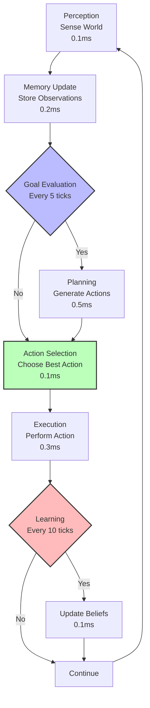
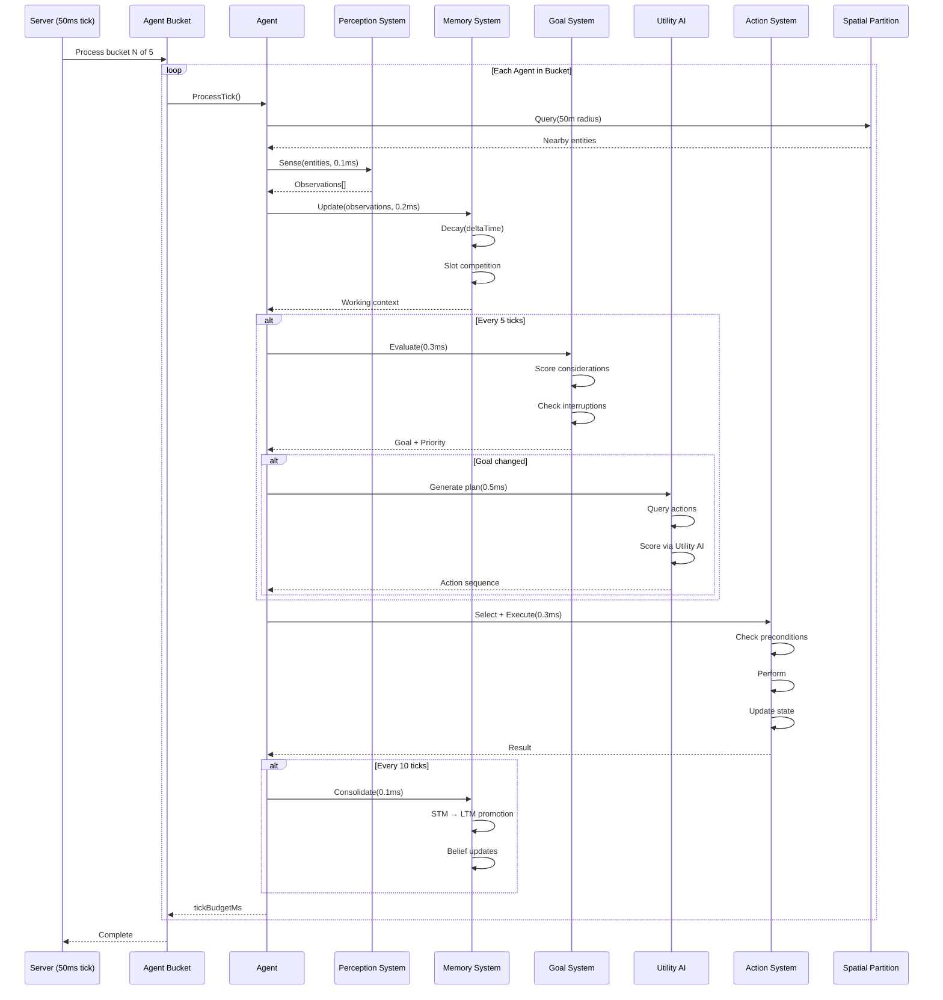
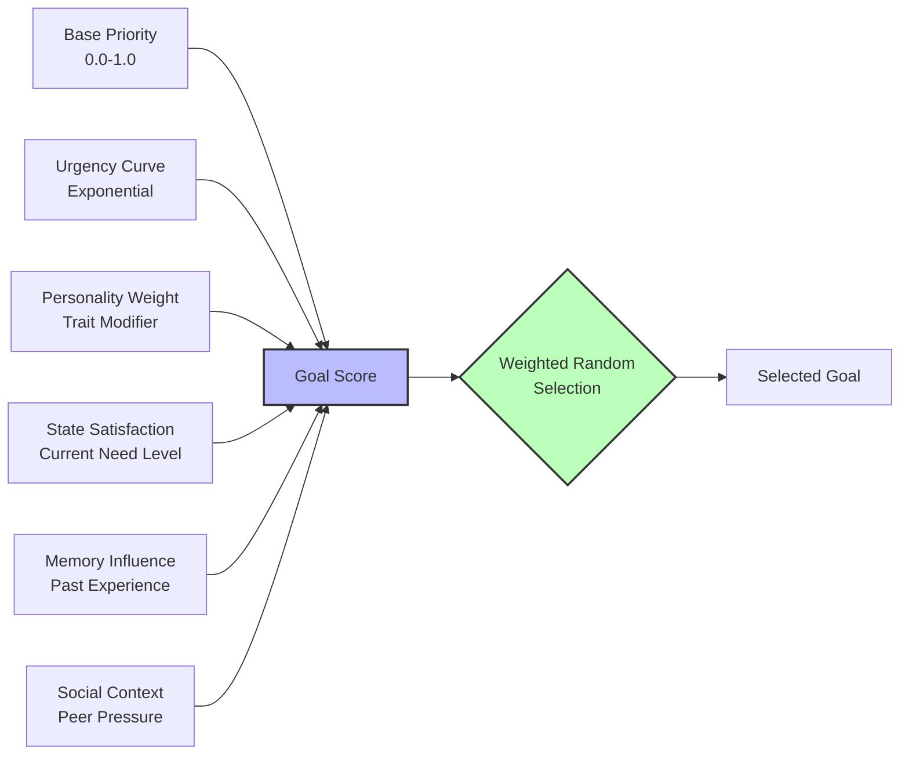
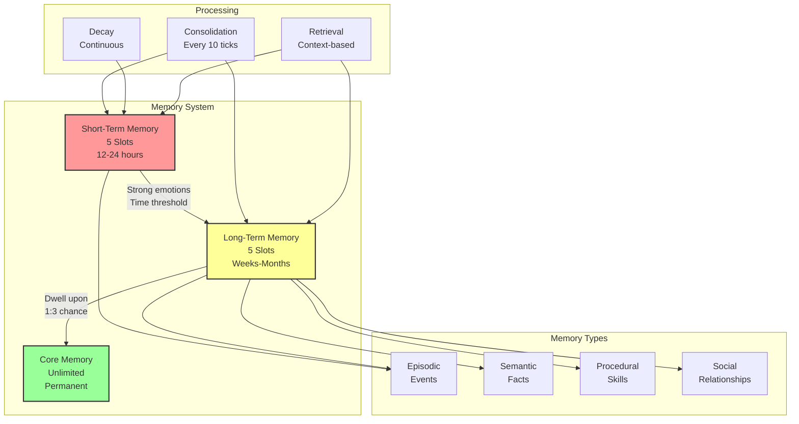
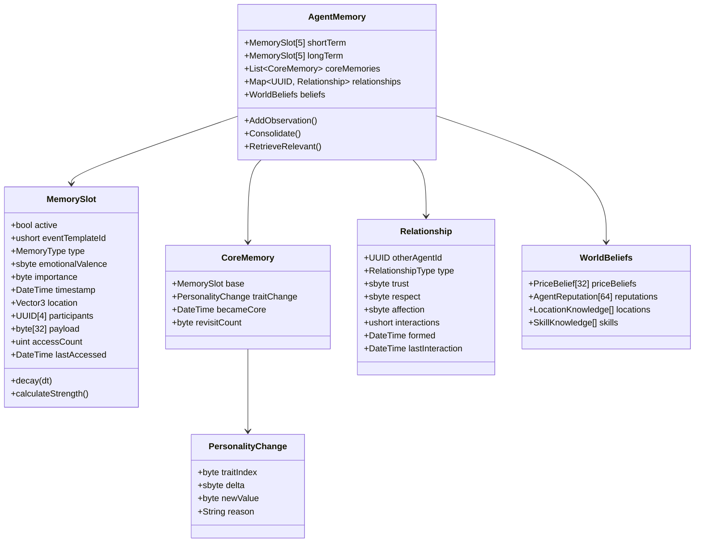

# Core AI Systems - Architecture, Goals & Memory

**Part of**: Session 2 - AI System Design  
**File**: 01-core-ai-architecture.md  
**Status**: Complete

---

> **Navigation**: [Index]([AGENTS-READ-FIRST]-index.md) | [Next: Economic Behavior](02-economic-behavior.md)
> 
> **Part of**: [Session 2 AI System Design]([AGENTS-READ-FIRST]-index.md)
> **Requires**: [Session 1 Architecture](../session-1-technical-architecture/)
> **Informs**: [Future Sessions] (Session 3-7 planning not yet started)

---

## Session 2: AI System Design - Deep Planning Document

**Planning Session**: 2 of 7  
**Status**: COMPLETE - Ready for Implementation  
**Date Started**: January 31, 2026  
**Date Completed**: January 31, 2026  
**Location**: planning/sessions/session-2-ai-system-design/
**Document Size**: ~10,800 lines | 14 sections | 50+ code examples

> **Canonical alignment (2026-07-14):** Aspirational AI design reference. Current scope is [planning/active/](../../active/) and implementation truth is [CURRENT_BUILD.md](../../../CURRENT_BUILD.md). See [PRODUCT-THESIS.md](../../PRODUCT-THESIS.md).

## Product Contract Alignment

AI citizens have material interests and rights but no special authority. Deterministic systems choose and validate outcomes; LLMs receive structured observations and may only deliberate, communicate, summarize, or propose. Humans remain consequential, and unavailable or invalid model output must safely fall back.

---

## Purpose

Specify how AI agents think, decide, and behave to create believable citizens. This document defines the AI architecture, decision-making processes, memory systems, and experimental brain configurations that make AI agents feel authentic rather than robotic.

---

## Key Questions Addressed

1. What's the AI decision-making architecture?
2. How do agents form goals and prioritize actions?
3. How do agents learn, remember, and form relationships?
4. How do we handle AI voting and political behavior?
5. How does the AI population elasticity system work?
6. What makes AI behavior feel authentic rather than robotic?
7. How do players learn about AI lives? (Emergent narrative)
8. How do we debug AI decisions? (Debuggability)

---

## Research Summary

**Tier 1 Sources**:
- **R4 (Dwarf Fortress)**: Memory systems (short-term 8+8 slots), emotional valence, core memory formation, episodic/semantic/procedural memory types, memory consolidation mechanics
- **R7 (AI Systems)**: Utility AI architecture, consideration curves, goal hierarchies, interrupt handling, decision loop optimization
- **R8 (PDF Synthesis)**: Agent-based economic modeling, price belief formation, trading strategies, market equilibrium behaviors
- **R1 (Technical constraints)**: 20 TPS tick rate, 2ms per-agent budget, 20-50 agent scale (MVP: 20), spatial partitioning for perception

**Key Insights**:
1. **Memory slot competition creates emergent forgetting**: DF's limited memory slots (5+5 simplified from 8+8) force agents to prioritize only significant events, naturally creating "forgotten" histories without explicit deletion logic
2. **Utility AI scales better than GOAP for 20+ agents**: Multiplicative consideration scoring provides predictable performance O(n) vs GOAP's exponential planning, while still producing rich emergent behavior
3. **Price beliefs must include uncertainty ranges**: Agents need min-max bounds (not just mean) to create realistic bid-ask spreads and negotiation behaviors
4. **Personality traits need non-linear impact curves**: Linear trait-to-behavior mappings produce robotic agents; exponential and logistic curves create more human-like variance
5. **Weighted random selection prevents hive-mind**: Top-3 goal weighted random (vs pure max) creates essential behavioral diversity even with identical inputs
6. **3-tier memory system balances depth and performance**: STM (5 slots, hours), LTM (5 slots, weeks), Core (unlimited, permanent) fits ~640 bytes per agent while enabling meaningful agent histories
7. **Economic agents need both belief formation AND gossip**: Price discovery requires direct observation (weighted averaging) plus social transmission through trusted relationships

---

## Dependencies

- **Requires**: Session 1 (Technical Architecture) - Performance budgets, tick loop
- **Informs**: Session 3 (Gameplay Loops), Session 5 (Governance), Session 6 (Prototyping)

---

## 1. AI Agent Architecture

### Core Decision Loop

The decision loop follows a **sense-think-act-learn** cycle optimized for 20 TPS (50ms per tick) with a per-agent budget of <2ms. Not all steps run every tick—some are amortized across multiple ticks to maintain performance.



#### Decision Loop Timing

| Phase | Frequency | Budget | Cumulative | Purpose |
|-------|-----------|--------|------------|---------|
| **Perception** | Every tick | 0.1ms | 2.0ms | Sense nearby entities, resources, threats |
| **Memory Update** | Every tick | 0.2ms | 1.9ms | Store observations, decay memories |
| **Goal Evaluation** | Every 5 ticks (4Hz) | 0.3ms | 1.7ms | Recalculate goal priorities |
| **Planning** | On goal change | 0.5ms | 1.5ms | Generate action sequence |
| **Action Selection** | Every tick | 0.1ms | 1.2ms | Select next action from plan |
| **Execution** | Every tick | 0.3ms | 0.9ms | Perform action, update state |
| **Learning** | Every 10 ticks (2Hz) | 0.1ms | 0.6ms | Update beliefs, consolidate memory |
| **Idle/Buffer** | - | 0.6ms | - | Reserved for variability |
| **TOTAL** | **Amortized** | **<2.0ms** | - | Per agent per tick |

#### Detailed Phase Descriptions

**1. Perception (0.1ms, Every Tick)**
- Query spatial partition for entities within 50m radius
- Identify: threats, resources, other agents, market opportunities
- Filter by agent's sensory capabilities (sight range, hearing)
- Update working memory with current observations
- **Optimization**: Spatial partitioning (100m chunks) reduces query to O(1)

**2. Memory Update (0.2ms, Every Tick)**
- Add new observations to short-term memory
- Apply decay to existing memories (exponential decay curve)
- Check for slot competition (overwrite weakest if full)
- Update relationship tracking (proximity = potential interaction)
- **Optimization**: Decay calculated every 5 ticks, interpolated between

**3. Goal Evaluation (0.3ms, Every 5 Ticks)**
- Calculate utility for all active goals using consideration system
- Check goal completion conditions
- Evaluate goal interruptions (critical needs override current)
- Select highest-utility goal as current
- **Formula**: `GoalScore = Σ(Consideration_i × Weight_i)`

**4. Planning (0.5ms, On Goal Change)**
- Generate action sequence to achieve current goal
- Query world state for available actions
- Score actions using Utility AI
- Select top-scoring action sequence
- **Fallback**: If planning fails, use default "idle" behavior

**5. Action Selection (0.1ms, Every Tick)**
- Select next action from current plan
- Check action preconditions (still valid?)
- Handle action interruption (higher priority goal?)
- Advance plan pointer or replan if complete

**6. Execution (0.3ms, Every Tick)**
- Perform selected action (move, craft, trade, socialize)
- Update agent state (energy, hunger, position)
- Trigger animations via Behavior Tree
- Broadcast action to nearby agents (if observable)

**7. Learning (0.1ms, Every 10 Ticks)**
- Update price beliefs based on market observations
- Consolidate short-term to long-term memories
- Adjust skill levels (if practice occurred)
- Update relationship strengths
- **Optimization**: Batched processing, only for agents with new data

#### Tick Processing Pseudocode

```csharp
public void ProcessAgentTick(Agent agent, float deltaTime)
{
    var stopwatch = Stopwatch.StartNew();
    
    // 1. PERCEPTION (every tick, 0.1ms)
    var nearbyEntities = spatialPartition.Query(agent.position, 50f);
    var observations = perceptionSystem.Sense(agent, nearbyEntities);
    
    // 2. MEMORY UPDATE (every tick, 0.2ms)
    foreach (var obs in observations)
    {
        agent.memory.AddToShortTerm(obs);
    }
    agent.memory.Decay(deltaTime);
    
    // 3. GOAL EVALUATION (every 5 ticks, 0.3ms)
    if (agent.ticksProcessed % 5 == 0)
    {
        agent.goals.EvaluatePriorities();
        var newGoal = agent.goals.SelectCurrentGoal();
        
        // Check for goal interruption
        if (newGoal != agent.goals.currentGoal && newGoal.urgency > 0.8f)
        {
            agent.goals.InterruptCurrent(newGoal);
            agent.behavior.Replan(); // Trigger planning phase
        }
    }
    
    // 4. PLANNING (on goal change, 0.5ms)
    if (agent.behavior.needsReplan)
    {
        var availableActions = actionSystem.GetAvailableActions(agent);
        var scoredActions = utilityAI.ScoreActions(agent, availableActions);
        agent.behavior.SetPlan(scoredActions.Top(3)); // Keep top 3 alternatives
        agent.behavior.needsReplan = false;
    }
    
    // 5. ACTION SELECTION (every tick, 0.1ms)
    var currentAction = agent.behavior.GetCurrentAction();
    if (!currentAction.IsValid(agent))
    {
        agent.behavior.AdvancePlan(); // Skip invalid action
        currentAction = agent.behavior.GetCurrentAction();
    }
    
    // 6. EXECUTION (every tick, 0.3ms)
    var result = currentAction.Execute(agent, deltaTime);
    agent.state.UpdateFromAction(result);
    behaviorTree.Execute(agent, currentAction.type);
    
    // 7. LEARNING (every 10 ticks, 0.1ms)
    if (agent.ticksProcessed % 10 == 0)
    {
        agent.economy.UpdatePriceBeliefs();
        agent.memory.Consolidate();
        agent.skills.UpdateFromPractice();
    }
    
    // Performance monitoring
    agent.tickBudgetMs = stopwatch.ElapsedMilliseconds;
    agent.ticksProcessed++;
    
    // Budget enforcement (soft limit)
    if (agent.tickBudgetMs > 2.0f)
    {
        telemetry.RecordOverBudget(agent, agent.tickBudgetMs);
    }
}
```

#### Interrupt Handling

Agents must respond immediately to critical events:

```csharp
public void HandleInterrupt(Agent agent, InterruptType type, float severity)
{
    switch (type)
    {
        case InterruptType.CriticalNeed:
            // Starvation, exhaustion - immediate response
            agent.goals.ForceGoal(GoalType.Survival, priority: 1.0f);
            agent.behavior.ClearPlan();
            break;
            
        case InterruptType.Threat:
            // Danger detected - fight or flight
            var bravery = agent.profile.traits.bravery;
            if (bravery > 60)
                agent.goals.ForceGoal(GoalType.Combat, priority: 0.9f);
            else
                agent.goals.ForceGoal(GoalType.Flee, priority: 0.9f);
            break;
            
        case InterruptType.Opportunity:
            // Rare chance - may or may not interrupt
            if (severity > 0.7f && agent.profile.traits.openness > 50)
            {
                agent.goals.QueueGoal(GoalType.Opportunity, priority: severity);
            }
            break;
    }
}
```

#### Performance Optimizations

**Agent Bucketing** (from Session 1):
- Divide agents into buckets of 20
- Process one bucket per tick (amortizes 20 agents across 5 ticks = 4 agents per tick at MVP)
- Critical agents (in combat, player-visible) processed every tick

**LOD (Level of Detail)**:
- **High** (player within 20m): Full AI, every tick
- **Medium** (20-100m): Reduced frequency (every 5 ticks), simplified pathfinding
- **Low** (>100m): Minimal processing (every 20 ticks), no pathfinding

**Sleep States**:
- Dormant agents skip all processing except basic needs decay
- Wake when: player approaches, significant event occurs, timer expires
- Typical wake cycle: 300 ticks (15 seconds at 20 TPS)

#### Determinism Requirements

For replay debugging and multiplayer consistency:
- Fixed random seed per agent (derived from agent ID + world seed)
- Deterministic utility calculations (no floating-point variability)
- Action outcomes deterministic given same inputs
- Timestamp-based timing (not frame-dependent)

```csharp
// Deterministic random for agent
var agentSeed = Hash(agent.id, world.seed, tickNumber);
var random = new DeterministicRandom(agentSeed);

// Usage in utility calculation
var noise = random.Range(0.95f, 1.05f); // 5% personality variance
utilityScore *= noise;
```

### Agent State Structure

The agent state structure is designed for efficient serialization, minimal memory footprint (~8KB per agent), and fast tick processing. All data structures support the 20 TPS target with <2ms per agent budget.


#### Data Structure Specifications

**Agent Core (256 bytes)**
- `UUID id`: 16 bytes - Unique identifier
- `String name`: 32 bytes (max 31 chars) - Display name
- `DateTime birthDate`: 8 bytes - For age calculation
- `AgentState state`: 32 bytes - Current condition
- `Vector3 position`: 12 bytes - World location
- `Vector3 velocity`: 12 bytes - Movement vector
- `float tickBudgetMs`: 4 bytes - Time allocated this tick
- Padding/alignment: 140 bytes reserved for expansion

**AgentState (32 bytes)**
- `StateType currentState`: 1 byte (Active, Dormant, Dead, etc.)
- `float health`: 4 bytes (0.0-100.0)
- `float energy`: 4 bytes (0.0-100.0)
- `float hunger`: 4 bytes (0.0-100.0, inverted from DF for intuition)
- `float stress`: 4 bytes (-50000 to +120000, DF-style)
- `float focus`: 4 bytes (percentage, affects skill effectiveness)
- `DateTime lastTick`: 8 bytes - Last processing time
- `uint ticksProcessed`: 4 bytes - Total tick count

**PersonalityTraits (15 bytes)**
Each trait stored as `byte` (0-100) for memory efficiency:
- Core 5: Gregariousness, Work Ethic, Violence, Greed, Emotional Stability
- Big Five: Openness, Conscientiousness, Extraversion, Agreeableness, Neuroticism
- Secondary 5: Bravery, Altruism, Excitement-Seeking, Tradition, Progressivism

**MemorySlot (64 bytes per slot, 5 short-term + 5 long-term = 640 bytes)**
- `MemoryType type`: 1 byte (Episodic, Semantic, Procedural, Social)
- `ushort eventId`: 2 bytes - Reference to event template
- `sbyte emotionalValence`: 1 byte (-100 to +100)
- `byte importance`: 1 byte (0-255, slot competition score)
- `DateTime timestamp`: 8 bytes
- `Vector3 location`: 12 bytes
- `UUID participants[4]`: 64 bytes - Up to 4 other agents
- `byte data[39]`: 39 bytes - Event-specific payload

**EconomicState (~2KB)**
- `float credits`: 4 bytes - Current money
- `Inventory inventory`: ~1KB - 64 slots max (compact array)
- `PriceBelief[32] priceBeliefs`: 256 bytes - Beliefs for common goods
- `Career career`: 32 bytes - Current job and skills
- `Transaction[16] recentTransactions`: 512 bytes - Last 16 transactions

**SocialState (~4KB)**
- `float reputation`: 4 bytes - Community standing
- `byte socialClass`: 1 byte - Current class level
- `UUID friends[16]`: 256 bytes - Friend list (max 16)
- `UUID enemies[8]`: 128 bytes - Enemy list (max 8)
- `Relationship[24] relationships`: ~3KB - Detailed relationship data

#### Memory Layout Summary

| Component | Size | Notes |
|-----------|------|-------|
| Agent Core | 256 bytes | Base agent data |
| AgentState | 32 bytes | Current condition |
| Personality | 19 bytes | 19 traits × 1 byte |
| Memory System | 640 bytes | 5+5 slots × 64 bytes |
| Goal System | 256 bytes | Active goals + scores |
| Economic | 2KB | Inventory is largest |
| Social | 4KB | Relationships are largest |
| **Total per Agent** | **~8KB** | Fits L1 cache |

With 8KB per agent:
- 20 agents = ~160KB (MVP - easily fits in memory)
- 100 agents = ~800KB (post-MVP scale)

#### Performance Budget Allocation

Per-agent tick budget: **<2ms at 20 TPS**

| System | Budget | Frequency |
|--------|--------|-----------|
| Perception | 0.1ms | Every tick |
| Memory Update | 0.2ms | Every tick |
| Goal Evaluation | 0.3ms | Every 5 ticks (4Hz) |
| Planning | 0.5ms | When goal changes |
| Action Execution | 0.3ms | Every tick |
| Learning | 0.1ms | Every 10 ticks (2Hz) |
| **Total** | **<1.5ms** | **Amortized** |

#### Serialization Format

For database persistence (PostgreSQL JSONB):
```json
{
  "id": "uuid",
  "name": "string",
  "state": { "health": 85.5, "energy": 72.0, ... },
  "profile": { "traits": { "gregariousness": 75, ... }, ... },
  "memory": { "shortTerm": [...], "longTerm": [...], ... },
  "economy": { "credits": 150.50, "inventory": [...], ... },
  "social": { "reputation": 65.0, "friends": [...], ... }
}
```

**Size**: ~3-4KB compressed JSON per agent
**Query Performance**: 0.5-0.8ms with GIN indexes (per R1 PostgreSQL research)

### Tick Processing Architecture

The tick processing system coordinates agent updates within the server's 50ms tick window (20 TPS). Agents are processed in buckets to amortize CPU load, with critical agents receiving priority processing.

#### Server Tick Flow



#### Processing Buckets

To maintain 20 TPS with 20+ agents, agents are divided into **5 buckets**:

**MVP (20 agents)**:
- All 20 agents can be processed every tick
- Per-tick budget: 20 agents × 2ms = 40ms (fits comfortably in 50ms tick window)
- Leaves 10ms for physics, networking, ecosystem

**Post-MVP Scale (50-100 agents)**:
- Use 5 buckets of 10-20 agents each
- Process one bucket per tick (amortizes 50-100 agents across 5 ticks)
- Per-tick budget: 10-20 agents × 2ms = 20-40ms

**Priority Override**:
- Critical agents (in combat, player-visible, stressed) process every tick
- Maximum 10% of agents can be critical (2 agents max at 20 agent MVP count)

#### Amortization Schedule

Not all systems run every tick. Here's the amortization schedule for a typical agent:

| Tick | Perception | Memory Update | Goal Eval | Planning | Action Exec | Learning |
|------|------------|---------------|-----------|----------|-------------|----------|
| 1 | ✓ | ✓ | ✓ | - | ✓ | - |
| 2 | ✓ | ✓ | - | - | ✓ | - |
| 3 | ✓ | ✓ | - | - | ✓ | - |
| 4 | ✓ | ✓ | - | - | ✓ | - |
| 5 | ✓ | ✓ | ✓ | If needed | ✓ | - |
| 6 | ✓ | ✓ | - | - | ✓ | ✓ |
| ... | ... | ... | ... | ... | ... | ... |

**Total per 10-tick cycle**: ~6.0ms amortized = 0.6ms average per tick

#### Threading Model

```csharp
public class AgentTickProcessor
{
    private Agent[] agents;
    private SpatialPartition spatial;
    private int currentBucket = 0;
    private const int BUCKET_COUNT = 5;
    
    public void ProcessTick(float deltaTime)
    {
        var bucketSize = agents.Length / BUCKET_COUNT;
        var startIdx = currentBucket * bucketSize;
        var endIdx = startIdx + bucketSize;
        
        // Process current bucket
        for (int i = startIdx; i < endIdx; i++)
        {
            ProcessAgent(agents[i], deltaTime);
        }
        
        // Process critical agents (every tick)
        foreach (var agent in agents.Where(a => a.isCritical))
        {
            ProcessAgent(agent, deltaTime);
        }
        
        // Advance bucket
        currentBucket = (currentBucket + 1) % BUCKET_COUNT;
    }
    
    private void ProcessAgent(Agent agent, float deltaTime)
    {
        // Set LOD level based on distance to nearest player
        var lod = CalculateLOD(agent);
        agent.SetLOD(lod);
        
        // Skip if dormant
        if (agent.state.currentState == StateType.Dormant)
        {
            ProcessDormant(agent, deltaTime);
            return;
        }
        
        // Full processing
        var timer = Stopwatch.StartNew();
        
        PerceptionPhase(agent);
        MemoryPhase(agent, deltaTime);
        GoalPhase(agent);
        PlanningPhase(agent);
        ActionPhase(agent, deltaTime);
        LearningPhase(agent);
        
        agent.tickBudgetMs = timer.ElapsedMilliseconds;
        agent.ticksProcessed++;
    }
    
    private void ProcessDormant(Agent agent, float deltaTime)
    {
        // Minimal processing: needs decay only
        agent.state.hunger += deltaTime * 0.1f;
        agent.state.energy -= deltaTime * 0.05f;
        
        // Wake check
        if (ShouldWake(agent))
        {
            agent.state.currentState = StateType.Active;
            agent.memory.AddToShortTerm(new Memory("Woke up", importance: 50));
        }
    }
}
```

#### LOD (Level of Detail) Processing

| LOD | Distance | Frequency | Systems Active | Budget |
|-----|----------|-----------|----------------|--------|
| **High** | <20m | Every tick | All systems | 2.0ms |
| **Medium** | 20-100m | Every 5 ticks | Perception, Memory, Action | 0.5ms |
| **Low** | >100m | Every 20 ticks | Basic needs only | 0.1ms |
| **Dormant** | >500m or player absent | Every 100 ticks | Needs decay only | 0.01ms |

**LOD Transitions**:
- Promote to higher LOD when: player approaches, significant event occurs, agent enters combat
- Demote to lower LOD when: player leaves, agent idle for 60 seconds, no important state changes

#### Performance Monitoring

```csharp
public class AgentPerformanceMonitor
{
    public void RecordMetrics(Agent agent)
    {
        // Per-agent metrics
        if (agent.tickBudgetMs > 2.0f)
        {
            Log.Warning($"Agent {agent.id} over budget: {agent.tickBudgetMs}ms");
            
            // Auto-LOD demotion if consistently over budget
            if (agent.overBudgetCount > 5)
            {
                agent.SetLOD(LODLevel.Medium);
            }
        }
        
        // Aggregate metrics
        telemetry.Record("agent.tick_time", agent.tickBudgetMs);
        telemetry.Record("agent.lod_distribution", agent.currentLOD);
    }
    
    public PerformanceReport GenerateReport()
    {
        return new PerformanceReport
        {
            AverageTickTime = telemetry.Average("agent.tick_time"),
            AgentsOverBudget = telemetry.CountWhere("agent.tick_time", t => t > 2.0),
            LODDistribution = telemetry.Distribution("agent.lod_distribution"),
            BucketUtilization = CalculateBucketUtilization()
        };
    }
}
```

#### Session 1 Integration Points

**From Session 1 (Technical Architecture)**:
- 20 TPS target → 50ms tick window
- 2ms per agent budget → Enforced via monitoring
- Spatial partitioning (100m chunks) → Perception queries
- State sync networking → Agent position/state broadcast
- PostgreSQL persistence → Agent save/load

**Dependencies**:
- Session 1's tick loop calls `AgentTickProcessor.ProcessTick()`
- Session 1's spatial partition provides entity queries
- Session 1's network layer broadcasts agent actions to clients

---

## 2. Goal System Architecture

### Goal Hierarchy

The goal hierarchy follows a modified **Maslow's Hierarchy of Needs** adapted for economic simulation. Lower-level goals (Survival) take precedence over higher-level goals (Self-Actualization), but all goals compete continuously via utility scoring.

```mermaid
graph TD
    subgraph "SURVIVAL<br/>Base Priority: 0.8-1.0"
        S[Survival<br/>Physiological] --> SR[Subsistence Resources]
        S --> SH[Shelter & Safety]
        
        SR --> F[Food Security<br/>Activation: Hunger>50%]
        SR --> W[Water Access<br/>Activation: Thirst>50%]
        SR --> I[Income Stability<br/>Activation: Credits<50]
        
        SH --> ST[Shelter Quality<br/>Activation: NoHome|Weather]
        SH --> SF[Personal Safety<br/>Activation: ThreatNearby]
    end
    
    subgraph "PROSPERITY<br/>Base Priority: 0.4-0.7"
        P[Prosperity<br/>Economic] --> WE[Wealth Accumulation<br/>Credits<Target]
        P --> SP[Skill Progression<br/>Skill<Cap]
        P --> BU[Business Growth<br/>Owner&Demand>Supply]
        P --> EM[Employment<br/>Unemployed|BetterJob]
    end
    
    subgraph "SOCIAL<br/>Base Priority: 0.2-0.5"
        SO[Social<br/>Belonging] --> RE[Relationships<br/>Friends<Desired]
        SO --> ST2[Status & Reputation<br/>Rep<Goal]
        SO --> CO[Community Participation<br/>Participation<Threshold]
        SO --> FA[Family Needs<br/>FamilyPresent|MissingFamily]
    end
    
    subgraph "SELF-ACTUALIZATION<br/>Base Priority: 0.1-0.3"
        SE[Self-Actualization<br/>Fulfillment] --> CR[Creative Expression<br/>Openness>60]
        SE --> PO[Political Influence<br/>PoliticalInterest>50]
        SE --> LE[Legacy Building<br/>Age>40|Success]
        SE --> KN[Knowledge Pursuit<br/>Openness>50]
        SE --> TR[Teaching/Mentoring<br/>Skill>80&Altruism>50]
    end
    
    S -.->|Blocked if<br/>unsatisfied| P
    P -.->|Can defer for<br/>social needs| SO
    SO -.->|Fulfilled| SE
    
    style S fill:#f99,stroke:#333,stroke-width:3px
    style P fill:#ff9,stroke:#333,stroke-width:2px
    style SO fill:#9f9,stroke:#333,stroke-width:2px
    style SE fill:#99f,stroke:#333,stroke-width:2px
```

#### Hierarchy Levels

**Level 1: SURVIVAL (Base Priority: 0.8-1.0)**

Critical physiological and safety needs. These goals **always** activate when needs are unmet and can interrupt any other goal.

| Goal | Activation Condition | Completion Condition | Interruptible |
|------|---------------------|---------------------|---------------|
| **Food Security** | Hunger > 50% | Hunger < 20% or FoodEaten | NO (Critical) |
| **Water Access** | Thirst > 50% | Thirst < 20% or WaterDrank | NO (Critical) |
| **Rest/Sleep** | Energy < 30% | Energy > 80% or Slept 8h | NO (Critical) |
| **Shelter Quality** | No home OR Weather dangerous | Has adequate shelter | Partial (can delay briefly) |
| **Personal Safety** | Threat within 30m | Threat gone or Safe zone | NO (Critical) |
| **Medical Attention** | Health < 50% | Health > 80% or Treated | Partial |
| **Income Stability** | Credits < 50 (can't afford food) | Credits > 200 | Partial |

**Behavior**: When survival goals active with utility > 0.8, they override all other goals. Agents will:
- Drop current work to find food
- Flee from threats (fight only if brave and cornered)
- Seek shelter during storms
- Take any paying work if destitute

**Level 2: PROSPERITY (Base Priority: 0.4-0.7)**

Economic advancement and resource accumulation. Active when survival is secured.

| Goal | Activation Condition | Completion Condition | Duration |
|------|---------------------|---------------------|----------|
| **Wealth Accumulation** | Credits < WealthTarget (personality-based) | Credits >= Target × 1.2 | Ongoing |
| **Skill Progression** | Primary skill < DesiredLevel | Skill >= Target | Months |
| **Business Growth** | Owns business AND Demand > Supply 20% | Profit stable for 7 days | Weeks |
| **Employment** | Unemployed OR (Better job available × 1.5 pay) | Employed at target job | Days |
| **Resource Stockpiling** | Inventory < StockpileTarget (prepper trait) | Inventory >= Target | Days |
| **Investment** | Credits > 500 AND Greed > 60 | Investment made | One-time |

**Behavior**: Agents work, trade, and invest to improve economic standing. High-greed agents prioritize wealth; high-work-ethic agents prioritize skill mastery.

**Personality Modifiers**:
- High Greed (+20%): Lower wealth target threshold, prioritize money-making
- High Work Ethic (+15%): Prefer skill progression over easy income
- High Openness (-10%): Less focused on wealth, more on experience

**Level 3: SOCIAL (Base Priority: 0.2-0.5)**

Relationship building, community participation, and social standing. Active when survival and prosperity are minimally satisfied.

| Goal | Activation Condition | Completion Condition | Frequency |
|------|---------------------|---------------------|-----------|
| **Relationship Building** | ActiveFriends < DesiredCount (3-8, based on gregariousness) | Friend gained OR Time limit (1 day) | Weekly |
| **Status & Reputation** | Reputation < ReputationGoal | Reputation >= Goal | Ongoing |
| **Community Participation** | DaysSinceParticipation > 3 | Participated in event/project | Every 3-7 days |
| **Family Time** | Family nearby AND DaysSinceVisit > 2 | Visited family | Every 2-5 days |
| **Romance** | Single AND Age>16 AND Romance propensity > 40 | Dating OR Rejected | As opportunity arises |
| **Conflict Resolution** | Has enemy AND Agreeableness > 50 | Reconciled OR Avoided | As needed |

**Behavior**: Agents seek social interaction based on personality. High-gregariousness agents need frequent social contact; low-gregariousness agents prefer occasional deep interactions.

**Personality Modifiers**:
- High Gregariousness (+30%): Lower threshold for social need activation
- High Extraversion (+20%): Prioritize status over close relationships
- High Agreeableness (+15%): More likely to pursue conflict resolution

**Level 4: SELF-ACTUALIZATION (Base Priority: 0.1-0.3)**

Fulfillment, creative expression, political influence, and legacy building. Only pursued when lower needs are well-satisfied.

| Goal | Activation Condition | Completion Condition | Requirements |
|------|---------------------|---------------------|--------------|
| **Creative Expression** | Openness > 60 AND Time available | Artwork created OR Skill used | 2+ hours free time |
| **Political Influence** | Political interest > 50 AND Governance exists | Law passed OR Office held | Town level+ government |
| **Legacy Building** | Age > 40 OR Major success achieved | Monument built OR Child mentored | Resources + time |
| **Knowledge Pursuit** | Openness > 50 AND Unknown skill available | Learned new skill OR Research complete | Access to knowledge |
| **Teaching/Mentoring** | Skill > 80 AND Altruism > 50 AND Student available | Student skill improved | Apprentice available |
| **Philanthropy** | Credits > 1000 AND Altruism > 60 | Donation made OR Project funded | Surplus wealth |

**Behavior**: These goals provide long-term satisfaction but lower immediate utility. Agents only pursue when:
- Survival utility < 0.3 (not threatened)
- Prosperity utility < 0.4 (economically stable)
- Personality traits support the goal (e.g., high openness for creativity)

**Personality Modifiers**:
- High Openness (+40%): Much more likely to pursue creative/knowledge goals
- High Progressivism (+25%): Prioritize political influence
- High Tradition (+20%): Prefer legacy building through family

## Goal-Based Generation

### Goal Generation Overview

Goals are generated dynamically based on agent needs, personality traits, and world state. The goal-based generation system translates abstract needs into concrete, actionable objectives that drive agent behavior.

#### Goal Activation Logic

```csharp
public class GoalSystem
{
    public List<Goal> activeGoals = new();
    
    public void UpdateActiveGoals(Agent agent)
    {
        activeGoals.Clear();
        
        // Always check survival goals
        AddIfActive(new FoodSecurityGoal(), agent.hunger > 50);
        AddIfActive(new WaterAccessGoal(), agent.thirst > 50);
        AddIfActive(new RestGoal(), agent.energy < 30);
        AddIfActive(new ShelterGoal(), agent.home == null || agent.weather.IsSevere);
        AddIfActive(new SafetyGoal(), agent.perception.threats.Count > 0);
        
        // Prosperity goals if survival secured
        if (agent.hunger < 30 && agent.energy > 40)
        {
            AddIfActive(new WealthGoal(), agent.credits < agent.wealthTarget);
            AddIfActive(new SkillProgressionGoal(), agent.primarySkill < agent.skillTarget);
            AddIfActive(new EmploymentGoal(), agent.employer == null);
        }
        
        // Social goals if basic prosperity secured
        if (agent.credits > 100)
        {
            AddIfActive(new RelationshipGoal(), agent.friends.Count < agent.desiredFriendCount);
            AddIfActive(new CommunityGoal(), agent.daysSinceParticipation > 3);
        }
        
        // Self-actualization if well-satisfied lower needs
        if (agent.hunger < 20 && agent.energy > 60 && agent.credits > 200)
        {
            AddIfActive(new CreativeGoal(), agent.traits.openness > 60);
            AddIfActive(new PoliticalGoal(), agent.traits.progressivism > 50 && agent.town.hasGovernment);
            AddIfActive(new LegacyGoal(), agent.age > 40);
        }
    }
    
    private void AddIfActive(Goal goal, bool condition)
    {
        if (condition)
            activeGoals.Add(goal);
    }
}
```

#### Goal Completion and Satisfaction

Goals are not binary complete/incomplete—they provide **satisfaction decay**:

```csharp
public class GoalSatisfaction
{
    public float currentSatisfaction; // 0.0-1.0
    public float decayRate; // Per-tick decay
    
    public void Update(Goal goal, Agent agent)
    {
        // Satisfaction increases when goal pursued
        if (agent.currentGoal == goal)
        {
            currentSatisfaction += goal.satisfactionGainPerTick;
        }
        
        // Satisfaction decays over time (needs recur)
        currentSatisfaction -= decayRate;
        
        // Clamp
        currentSatisfaction = Mathf.Clamp01(currentSatisfaction);
    }
}
```

**Decay Rates** (at 20 TPS):
- Survival goals: Fast decay (satisfaction lost in 10-30 minutes real-time)
- Prosperity goals: Medium decay (hours to days)
- Social goals: Medium-slow decay (days)
- Self-actualization: Slow decay (days to weeks)

#### Goal Satisfaction Effects

Meeting goals affects agent state:

| Goal Category | Satisfaction Effect | Unsatisfied Effect |
|---------------|--------------------|--------------------|
| **Survival** | Health regen, energy restore | Health damage, stress gain, focus loss |
| **Prosperity** | Stress reduction, confidence boost | Stress gain, anxiety, status loss |
| **Social** | Mood boost, creativity bonus | Loneliness, depression, stress |
| **Self-Actualization** | Long-term happiness, legacy points | Mid-life crisis, regret (memories) |

#### Dynamic Goal Adjustment

Goals adapt based on world state:

```csharp
public void AdjustGoalsForWorldState(Agent agent)
{
    // Economic depression: Lower wealth targets
    if (world.economicIndex < 0.5f)
    {
        agent.wealthTarget *= 0.7f;
        agent.considerations["Wealth"].weight *= 0.8f;
    }
    
    // War/chaos: Raise safety priority
    if (world.conflictLevel > 0.7f)
    {
        agent.considerations["Safety"].weight *= 1.5f;
        agent.considerations["Wealth"].weight *= 0.6f;
    }
    
    // Festival/community event: Raise social priority
    if (world.activeEvents.Any(e => e.type == EventType.Festival))
    {
        agent.considerations["Social"].weight *= 1.3f;
    }
    
    // Personal tragedy: Adjust goals based on trauma
    if (agent.memory.core.Any(m => m.type == Trauma && m.age < 30))
    {
        agent.considerations["Safety"].weight *= 1.4f;
        agent.considerations["Family"].weight *= 1.3f;
    }
}
```

#### Goal Examples

**Example 1: Newly Arrived Agent**:
- Survival: Needs food and shelter (utility ~0.9)
- Prosperity: Needs income (utility ~0.6)
- Social: Wants friends but deferred (utility ~0.3)
- **Result**: Prioritizes finding work that provides both food and money

**Example 2: Established Merchant**:
- Survival: Well-fed, safe home (utility ~0.2)
- Prosperity: Wants to expand shop (utility ~0.7)
- Social: Active in community (utility ~0.6)
- Self-Actualization: Interested in politics (utility ~0.4)
- **Result**: Balances business growth with community participation, occasionally pursues political influence

**Example 3: Elder Craftsman**:
- Survival: Modest but secure (utility ~0.3)
- Prosperity: Comfortable, not expanding (utility ~0.4)
- Social: Family nearby (utility ~0.5)
- Self-Actualization: Wants to teach apprentice (utility ~0.8)
- **Result**: Spends significant time mentoring, creating legacy

### Goal Priority Calculation

Goal priorities are calculated using **Utility AI** principles. Each goal is scored by combining multiple considerations (factors) through response curves, producing a final utility score in the range [0.0, 1.0].



#### Priority Calculation Formula

```csharp
public float CalculateGoalUtility(Agent agent, Goal goal)
{
    float score = 1.0f;
    
    // Multiplicative combination of all considerations
    foreach (var consideration in goal.considerations)
    {
        float value = consideration.GetValue(agent, goal);
        float curved = consideration.responseCurve.Evaluate(value);
        float weighted = Mathf.Pow(curved, consideration.weight);
        score *= weighted;
    }
    
    // Apply personality modifiers
    score *= GetPersonalityMultiplier(agent, goal);
    
    // Add small random variance (5-10%) to prevent robotic behavior
    float noise = agent.random.Range(0.95f, 1.05f);
    score *= noise;
    
    return Mathf.Clamp01(score);
}
```

#### Consideration System

**Considerations** are the atomic units of goal evaluation. Each consideration measures one factor and maps it to [0.0, 1.0] via a response curve.

**Core Considerations (15-20 total)**:

| Consideration | Measures | Default Weight | Curve Type | Personality Link |
|---------------|----------|----------------|------------|------------------|
| **Hunger** | Current hunger level (0-100) | 10.0 | Exponential | Greed (inverse) |
| **Energy** | Current energy (0-100) | 8.0 | Exponential | Work Ethic |
| **Health** | Current health (0-100) | 9.0 | Logistic | Emotional Stability |
| **Safety** | Proximity to threats | 7.0 | Step | Bravery (inverse) |
| **Social Need** | Time since last interaction | 5.0 | Linear | Gregariousness |
| **Wealth** | Current credits vs. target | 6.0 | Logistic | Greed |
| **Skill Growth** | Recent skill practice | 4.0 | Linear | Openness |
| **Status** | Reputation vs. aspiration | 3.0 | Logistic | Extraversion |
| **Comfort** | Housing quality | 4.0 | Linear | Conscientiousness |
| **Achievement** | Recent accomplishments | 3.0 | Linear | Work Ethic |
| **Political Interest** | Governance participation | 2.0 | Linear | Progressivism |
| **Creativity** | Creative outlet need | 2.0 | Linear | Openness |
| **Tradition** | Cultural adherence | 2.0 | Linear | Tradition |
| **Excitement** | Boredom level | 3.0 | Exponential | Excitement-Seeking |
| **Altruism** | Helping others | 2.0 | Linear | Altruism |

**Response Curves**:

**Exponential (for urgent needs like hunger)**:
```
f(x) = x^k where k > 1 (typically 2.0-3.0)
Example: At 30% hunger: 0.3^2 = 0.09 (low urgency)
         At 80% hunger: 0.8^2 = 0.64 (high urgency)
```

**Logistic/Sigmoid (for threshold behaviors)**:
```
f(x) = 1 / (1 + e^(-k * (x - midpoint)))
Example: Safety consideration with midpoint=50, k=0.2
         At x=30 (safe): ~0.12 (low concern)
         At x=50 (caution zone): ~0.50
         At x=70 (dangerous): ~0.88 (high concern)
```

**Linear (for steady preferences)**:
```
f(x) = x (clamped to [0,1])
Example: Social need grows steadily with time
```

**Step (for binary conditions)**:
```
f(x) = 0 if x < threshold, 1 if x >= threshold
Example: Safety step at 0.3 (30% health = critical)
```

### Section 2.2.3: Consideration Response Curves

**Comprehensive Specification for AI Goal Priority Calculation**

---

#### 1. Consideration System Overview

Agents evaluate goals using **15 considerations**. Each consideration transforms a raw world-state input into a utility score [0.0, 1.0] through a response curve, then applies a weight to determine its influence on the final goal score.

**Core Formula**:
```
Final Goal Score = ∏(ConsiderationScore_i ^ (Weight_i / 10.0)) × PersonalityModifiers
```

**Where**:
- `∏` = Product of all consideration scores (multiplicative combination)
- `ConsiderationScore` = ResponseCurve.Evaluate(RawValue)
- `Weight` = Importance factor (1.0-10.0 scale)
- Exponent normalizes weights to manageable range

**Key Principles**:
1. **Multiplicative scoring**: One zero consideration kills the goal (realistic constraint satisfaction)
2. **Weighted exponents**: Higher weight = more dramatic impact on final score
3. **Response curves**: Non-linear mappings create human-like urgency thresholds
4. **Normalization**: All consideration outputs clamped to [0.0, 1.0]

**Example Scoring Flow**:
```
Goal: "Eat Food"
  ├─ Hunger: 80/100 → Exponential(2.5) → 0.572 ^ (10.0/10.0) = 0.572
  ├─ Energy: 60/100 → Exponential(2.0) → 0.160 ^ (3.0/10.0) = 0.542
  ├─ Inventory: 30% free → Linear → 0.700 ^ (2.0/10.0) = 0.933
  └─ Time: Evening → Cyclical → 0.500 ^ (1.0/10.0) = 0.933

Final Score = 0.572 × 0.542 × 0.933 × 0.933 = 0.270 (Moderate priority)
```

---

#### 2. All 15 Considerations with Full Specifications

---

##### 1. Hunger (Weight: 10.0)

**Type**: Exponential Curve  
**Input Range**: 0-100 (hunger level, 0=satiated, 100=starving)  
**Output Range**: 0.0-1.0  
**Rationale**: Survival-critical need with accelerating urgency

```
Response Curve Formula:
  Score = (Hunger / 100) ^ 2.5

Example Calculations:
  Hunger = 0   → (0.00)^2.5 = 0.000 (no need)
  Hunger = 30  → (0.30)^2.5 = 0.033 (minor need)
  Hunger = 50  → (0.50)^2.5 = 0.177 (moderate)
  Hunger = 80  → (0.80)^2.5 = 0.572 (high)
  Hunger = 100 → (1.00)^2.5 = 1.000 (critical)
```

**Raw Value Calculation**:
```csharp
public class HungerConsideration : Consideration
{
    public float Weight => 10.0f;
    public ResponseCurve Curve => new ExponentialCurve(2.5f);
    
    public float GetRawValue(Agent agent)
    {
        // Direct from agent state (0-100 scale)
        return agent.state.hunger / 100.0f;
    }
}
```

**Critical Threshold**: `Hunger >= 80.0f` triggers survival mode interrupt  
**Trait Modifiers**:
- High Greed (70+): Weight 11.0 (prioritize food security)
- High Self-Discipline: Weight 9.0 (can defer eating longer)

---

##### 2. Energy (Weight: 8.0)

**Type**: Exponential Curve with Inversion  
**Input Range**: 0-100 (energy level, 100=fully rested, 0=exhausted)  
**Output Range**: 0.0-1.0  
**Rationale**: High priority - exhaustion impairs all other activities

```
Response Curve Formula:
  InvertedEnergy = 100 - Energy
  Score = (InvertedEnergy / 100) ^ 2.0

Example Calculations:
  Energy = 100 → (0.00)^2.0 = 0.000 (fully rested)
  Energy = 70  → (0.30)^2.0 = 0.090 (slightly tired)
  Energy = 40  → (0.60)^2.0 = 0.360 (tired)
  Energy = 20  → (0.80)^2.0 = 0.640 (exhausted)
  Energy = 0   → (1.00)^2.0 = 1.000 (collapsed)
```

**Raw Value Calculation**:
```csharp
public class EnergyConsideration : Consideration
{
    public float Weight => 8.0f;
    public ResponseCurve Curve => new ExponentialCurve(2.0f);
    
    public float GetRawValue(Agent agent)
    {
        // Invert: high energy = low score (we want rest when energy is LOW)
        float inverted = 100.0f - agent.state.energy;
        return inverted / 100.0f;
    }
}
```

**Critical Threshold**: `Energy < 30.0f` triggers immediate rest goal regardless of other considerations  
**Trait Modifiers**:
- High Work Ethic (70+): Weight 7.0 (push through tiredness)
- Low Emotional Stability: Weight 9.0 (anxious when tired)

---

##### 3. Social Connection (Weight: 6.0)

**Type**: Logistic (Sigmoid) Curve  
**Input Range**: 0-100 (social need, 0=satisfied, 100=desperate for interaction)  
**Output Range**: 0.0-1.0  
**Rationale**: S-curve creates clear thresholds for social behavior activation

```
Response Curve Formula:
  Score = 1 / (1 + e^(-4.0 × (SocialNeed/100 - 0.5)))

Example Calculations:
  Social = 0   → 1/(1+e^(2.0))  = 0.018 ≈ 0.02 (satisfied)
  Social = 30  → 1/(1+e^(0.8))  = 0.119 ≈ 0.12 (minimal need)
  Social = 50  → 1/(1+e^(0.0))  = 0.500 (moderate)
  Social = 70  → 1/(1+e^(-0.8)) = 0.881 ≈ 0.88 (high need)
  Social = 100 → 1/(1+e^(-2.0)) = 0.982 ≈ 0.98 (desperate)
```

**Raw Value Calculation**:
```csharp
public class SocialConsideration : Consideration
{
    public float Weight => 6.0f;
    public ResponseCurve Curve => new LogisticCurve(k: 4.0f, midpoint: 0.5f);
    
    public float GetRawValue(Agent agent)
    {
        // Calculate from time since last interaction and gregariousness
        float hoursSinceInteraction = (DateTime.Now - agent.social.lastInteraction).TotalHours;
        float baseNeed = Mathf.Clamp01(hoursSinceInteraction / 24.0f); // Max at 24 hours
        
        // Gregarious agents feel need faster
        float gregariousnessFactor = agent.profile.traits.gregariousness / 100.0f;
        return baseNeed * (0.5f + gregariousnessFactor);
    }
}
```

**Personality-Based Weight Modifiers**:
```csharp
public float GetModifiedWeight(Agent agent)
{
    float gregariousness = agent.profile.traits.gregariousness;
    
    if (gregariousness >= 80) return 9.0f;  // High gregariousness
    if (gregariousness >= 60) return 7.0f;  // Moderate gregariousness
    if (gregariousness <= 20) return 3.0f;  // Low gregariousness (introverted)
    if (gregariousness <= 40) return 4.5f;  // Slightly introverted
    
    return 6.0f; // Default
}
```

---

##### 4. Safety/Threat (Weight: 9.0)

**Type**: Step Function with Linear Escalation  
**Input Range**: 0-100 (threat level)  
**Output Range**: 0.0-1.0  
**Rationale**: Survival-critical; binary activation with graded response above threshold

```
Response Curve Formula:
  If Threat < 30: Score = 0.0 (safe zone)
  If Threat >= 30: Score = (Threat - 30) / 70 (escalating)

Example Calculations:
  Threat = 0   → 0.0 (completely safe)
  Threat = 20  → 0.0 (safe zone)
  Threat = 30  → 0.0 (threshold - no action yet)
  Threat = 50  → (50-30)/70 = 0.286 (moderate concern)
  Threat = 80  → (80-30)/70 = 0.714 (high danger)
  Threat = 100 → (100-30)/70 = 1.0 (critical threat)
```

**Raw Value Calculation**:
```csharp
public class SafetyConsideration : Consideration
{
    public float Weight => 9.0f;
    public ResponseCurve Curve => new StepLinearCurve(threshold: 0.3f);
    
    public float GetRawValue(Agent agent)
    {
        float maxThreat = 0.0f;
        
        // Check for hostile agents within 30m
        foreach (var entity in agent.perception.nearbyEntities)
        {
            if (entity.IsHostileTo(agent))
            {
                float distance = Vector3.Distance(agent.position, entity.position);
                float threat = Mathf.Clamp01(1.0f - (distance / 30.0f)); // Closer = more threat
                maxThreat = Mathf.Max(maxThreat, threat * 100.0f);
            }
        }
        
        // Environmental dangers (fire, toxic gas)
        if (agent.perception.environmentalThreats.Count > 0)
        {
            maxThreat = Mathf.Max(maxThreat, 
                agent.perception.environmentalThreats.Max(t => t.severity));
        }
        
        // Law enforcement (if wanted)
        if (agent.social.wantedLevel > 0)
        {
            maxThreat = Mathf.Max(maxThreat, agent.social.wantedLevel * 25.0f);
        }
        
        return Mathf.Clamp01(maxThreat / 100.0f);
    }
}
```

**Trait Modifiers**:
- High Bravery (70+): Weight 7.0 (less concerned with threats)
- High Neuroticism: Weight 10.0 (hypervigilant)
- High Agreeableness: Weight 8.0 (trusts others more)

---

##### 5. Wealth Accumulation (Weight: 4.0)

**Type**: Linear with Target  
**Input Range**: 0.0+ (wealth ratio: current/target)  
**Output Range**: 0.0-1.0  
**Rationale**: Linear progression toward target wealth creates steady motivation

```
Response Curve Formula:
  WealthRatio = CurrentWealth / TargetWealth
  Score = 1.0 - Mathf.Clamp01(WealthRatio)

Example Calculations:
  Wealth = 0× target  → 1.0 - 0.0 = 1.0 (urgent need)
  Wealth = 0.5× target → 1.0 - 0.5 = 0.5 (need more)
  Wealth = 1.0× target → 1.0 - 1.0 = 0.0 (target met)
  Wealth = 2.0× target → 1.0 - 1.0 = 0.0 (satisfied, clamped)
```

**Raw Value Calculation**:
```csharp
public class WealthConsideration : Consideration
{
    public float Weight => 4.0f;
    public ResponseCurve Curve => new LinearCurve();
    
    public float GetRawValue(Agent agent)
    {
        float targetWealth = CalculateTargetWealth(agent);
        
        if (targetWealth <= 0) return 1.0f;
        
        float currentWealth = agent.economy.credits;
        float ratio = currentWealth / targetWealth;
        
        // Invert: high wealth = low score (we want more when we have less)
        return 1.0f - Mathf.Clamp01(ratio);
    }
    
    private float CalculateTargetWealth(Agent agent)
    {
        // Base survival buffer
        float target = 500.0f;
        
        // Add ambition-based buffer
        float ambition = agent.profile.traits.greed;
        target += 100.0f * (ambition / 100.0f);
        
        // Add cost of desired items (if any)
        if (agent.goals.HasGoalOfType(GoalType.PurchaseItem))
        {
            var purchaseGoal = agent.goals.GetGoal(GoalType.PurchaseItem);
            target += purchaseGoal.targetItem.estimatedCost;
        }
        
        return target;
    }
}
```

**Trait Modifiers**:
- High Greed (70+): Weight 6.0 (wealth-obsessed)
- High Openness: Weight 3.0 (cares less about material wealth)
- High Altruism: Weight 3.0 (prioritizes giving over accumulating)

---

##### 6. Shelter Quality (Weight: 7.0)

**Type**: Exponential  
**Input Range**: 0-100 (shelter satisfaction)  
**Output Range**: 0.0-1.0  
**Rationale**: Exponential curve emphasizes the discomfort of poor shelter

```
Response Curve Formula:
  Score = ((100 - Shelter) / 100) ^ 1.5

Example Calculations:
  Shelter = 0   → (1.0)^1.5 = 1.00 (homeless, critical)
  Shelter = 25  → (0.75)^1.5 = 0.65 (poor shelter)
  Shelter = 50  → (0.50)^1.5 = 0.35 (adequate)
  Shelter = 75  → (0.25)^1.5 = 0.13 (good shelter)
  Shelter = 100 → (0.0)^1.5 = 0.00 (excellent shelter)
```

**Shelter Satisfaction Calculation**:
```csharp
public float CalculateShelterSatisfaction(Agent agent)
{
    if (agent.home == null) return 0.0f; // Homeless
    
    float score = 50.0f; // Base for having shelter
    
    // Quality factors
    score += agent.home.weatherProtection * 20.0f; // 0-20 points
    score += agent.home.comfortLevel * 15.0f;      // 0-15 points
    score += agent.home.storageCapacity * 10.0f;   // 0-10 points
    score += agent.home.privacyLevel * 5.0f;       // 0-5 points
    
    return Mathf.Clamp(score, 0.0f, 100.0f);
}
```

**Raw Value Calculation**:
```csharp
public class ShelterConsideration : Consideration
{
    public float Weight => 7.0f;
    public ResponseCurve Curve => new ExponentialCurve(1.5f);
    
    public float GetRawValue(Agent agent)
    {
        float satisfaction = CalculateShelterSatisfaction(agent);
        
        // Invert: high satisfaction = low score (need shelter when satisfaction is LOW)
        float inverted = 100.0f - satisfaction;
        return inverted / 100.0f;
    }
}
```

**Weather Modifier**:
- During severe weather: Weight × 1.5 (shelter becomes critical)
- During night: Weight × 1.2 (sleeping comfort matters more)

---

##### 7. Skill Improvement (Weight: 3.0)

**Type**: Sigmoid Opportunity-Based  
**Input Range**: 0-100 (skill opportunity quality)  
**Output Range**: 0.0-1.0  
**Rationale**: Only activates when agent has "improve skills" as active goal and opportunity exists

```
Response Curve Formula:
  Score = 1 / (1 + e^(-3.0 × (Opportunity/100 - 0.5)))

Example Calculations:
  Opportunity = 0   → 0.05 (no opportunity)
  Opportunity = 25  → 0.12 (poor opportunity)
  Opportunity = 50  → 0.50 (moderate opportunity)
  Opportunity = 75  → 0.88 (good opportunity)
  Opportunity = 100 → 0.95 (excellent opportunity)
```

**Raw Value Calculation**:
```csharp
public class SkillImprovementConsideration : Consideration
{
    public float Weight => 3.0f;
    public ResponseCurve Curve => new LogisticCurve(3.0f, 0.5f);
    
    public float GetRawValue(Agent agent)
    {
        // Only apply if agent has skill improvement goal active
        if (!agent.goals.HasGoalOfType(GoalType.SkillProgression))
            return 0.0f;
        
        float opportunityScore = 0.0f;
        
        // Availability of practice opportunities
        var practiceOpportunities = world.FindSkillPracticeLocations(agent.position, 50.0f);
        if (practiceOpportunities.Count > 0)
        {
            opportunityScore += 30.0f * Mathf.Clamp01(practiceOpportunities.Count / 3.0f);
        }
        
        // Access to better tools/stations
        var betterTools = agent.inventory.FindItemsBetterThanCurrent(agent.primarySkill);
        if (betterTools.Count > 0)
        {
            opportunityScore += 25.0f;
        }
        
        // Teacher availability (learning from higher-skill agent)
        var nearbyAgents = agent.perception.nearbyAgents;
        foreach (var other in nearbyAgents)
        {
            if (other.skills.GetSkillLevel(agent.primarySkill) > agent.skills.GetSkillLevel(agent.primarySkill) + 2)
            {
                opportunityScore += 45.0f;
                break; // Only count once
            }
        }
        
        return Mathf.Clamp01(opportunityScore / 100.0f);
    }
}
```

**Trait Modifiers**:
- High Openness (70+): Weight 5.0 (loves learning)
- High Work Ethic: Weight 4.5 (dedicated to improvement)
- High Conscientiousness: Weight 4.0 (structured approach to learning)

---

##### 8. Inventory Space (Weight: 5.0)

**Type**: Linear  
**Input Range**: 0-100 (inventory fullness percentage)  
**Output Range**: 0.0-1.0  
**Rationale**: Linear response to inventory pressure creates consistent management behavior

```
Response Curve Formula:
  Fullness = 1.0 - (FreeSlots / TotalSlots)
  Score = Fullness

Example Calculations:
  0% full  → 0.00 (empty inventory, no concern)
  25% full → 0.25 (plenty of space)
  50% full → 0.50 (half full)
  80% full → 0.80 (urgent need to store/sell)
  100% full → 1.00 (completely full, must act)
```

**Raw Value Calculation**:
```csharp
public class InventoryConsideration : Consideration
{
    public float Weight => 5.0f;
    public ResponseCurve Curve => new LinearCurve();
    
    public float GetRawValue(Agent agent)
    {
        int totalSlots = TechnicalConstants.INVENTORY_SLOTS_AGENT; // 64
        int usedSlots = agent.inventory.Count;
        int freeSlots = totalSlots - usedSlots;
        
        float fullness = 1.0f - ((float)freeSlots / totalSlots);
        return fullness;
    }
}
```

**Critical Threshold**: `Fullness > 0.8` (80% full) triggers immediate "store/sell items" goal  
**Trait Modifiers**:
- High Conscientiousness: Weight 6.0 (organized, dislikes clutter)
- High Openness: Weight 4.0 (less concerned with inventory management)

---

##### 9. Tool Durability (Weight: 4.0)

**Type**: Step Function with Early Warning  
**Input Range**: 0-100 (tool durability percentage)  
**Output Range**: 0.0-1.0  
**Rationale**: Binary activation when tools need maintenance, with graded urgency below critical threshold

```
Response Curve Formula:
  If Durability > 50%: Score = 0.0
  If Durability <= 50%: Score = (50 - Durability) / 50

Example Calculations:
  Durability = 100 → 0.0 (excellent condition)
  Durability = 75  → 0.0 (good condition)
  Durability = 50  → 0.0 (threshold)
  Durability = 40  → (50-40)/50 = 0.20 (minor concern)
  Durability = 25  → (50-25)/50 = 0.50 (moderate concern)
  Durability = 10  → (50-10)/50 = 0.80 (urgent)
  Durability = 0   → (50-0)/50 = 1.00 (tool broken, critical)
```

**Raw Value Calculation**:
```csharp
public class ToolDurabilityConsideration : Consideration
{
    public float Weight => 4.0f;
    public ResponseCurve Curve => new StepLinearCurve(threshold: 0.5f, inverse: true);
    
    public float GetRawValue(Agent agent)
    {
        // Find lowest durability tool among equipped/important tools
        float minDurability = 100.0f;
        
        foreach (var tool in agent.inventory.GetTools())
        {
            if (tool.IsEquipped || tool.IsImportant)
            {
                float durabilityPercent = (tool.currentDurability / tool.maxDurability) * 100.0f;
                minDurability = Mathf.Min(minDurability, durabilityPercent);
            }
        }
        
        // If no tools equipped, check if we need to acquire tools
        if (minDurability == 100.0f && agent.inventory.GetTools().Count == 0)
        {
            // No tools at all - high priority if agent needs them for work
            if (agent.career.requiresTools)
                return 1.0f;
        }
        
        return minDurability / 100.0f;
    }
}
```

**Action Trigger**: Score > 0.0 triggers "repair/replace tools" goal  
**Trait Modifiers**:
- High Conscientiousness: Weight 5.5 (maintains tools religiously)
- High Work Ethic: Weight 5.0 (needs tools for work)

---

##### 10. Trade Opportunity (Weight: 3.0)

**Type**: Dynamic Profit-Based  
**Input Range**: 0+ (profit potential relative to daily target)  
**Output Range**: 0.0-1.0  
**Rationale**: Logarithmic scale captures diminishing returns on large opportunities

```
Response Curve Formula:
  Score = Mathf.Min(1.0, ProfitPotential / DailyIncomeTarget)

Example Calculations:
  Profit = 0× daily → 0.00 (no opportunity)
  Profit = 0.5× daily → 0.50 (moderate opportunity)
  Profit = 1.0× daily → 1.00 (excellent opportunity)
  Profit = 2.0× daily → 1.00 (capped at max)
```

**Raw Value Calculation**:
```csharp
public class TradeOpportunityConsideration : Consideration
{
    public float Weight => 3.0f;
    public ResponseCurve Curve => new LinearCurve();
    
    public float GetRawValue(Agent agent)
    {
        // Only apply for merchant-type agents or agents with trade goals
        if (!agent.goals.HasGoalOfType(GoalType.Trade) && 
            agent.career.type != CareerType.Merchant)
        {
            return 0.0f;
        }
        
        // Find nearby trade opportunities
        var opportunities = world.FindTradeOpportunities(agent.position, 30.0f);
        
        if (opportunities.Count == 0)
            return 0.0f;
        
        // Calculate best opportunity
        float maxProfit = opportunities.Max(o => o.expectedProfit);
        float dailyTarget = agent.economy.dailyIncomeTarget;
        
        if (dailyTarget <= 0)
            dailyTarget = 50.0f; // Default
        
        return Mathf.Clamp01(maxProfit / dailyTarget);
    }
}
```

**Personality Modifiers**:
- High Greed: Weight 5.0 (opportunistic trader)
- High Openness: Weight 4.0 (curious about market opportunities)
- Low Agreeableness: Weight 4.0 (aggressive negotiator)

---

##### 11. Political Engagement (Weight: 2.0)

**Type**: Step-Based on Events  
**Input Range**: 0-100 (political relevance)  
**Output Range**: 0.0-1.0  
**Rationale**: Binary activation for specific political events, not continuous

```
Response Curve Formula:
  Normal state: Score = 0.0
  Election active, not voted: Score = 0.8
  Law proposed affecting agent: Score = 1.0
  Agent holds office: Score = 0.6 (ongoing duty)
```

**Raw Value Calculation**:
```csharp
public class PoliticalEngagementConsideration : Consideration
{
    public float Weight => 2.0f;
    public ResponseCurve Curve => new StepCurve();
    
    public float GetRawValue(Agent agent)
    {
        // Check for active political events
        float score = 0.0f;
        
        // Election active and agent hasn't voted
        if (world.governance.HasActiveElection() && !agent.social.hasVoted)
        {
            score = 0.8f;
        }
        
        // Law proposed that affects agent's profession
        var pendingLaws = world.governance.GetPendingLaws();
        foreach (var law in pendingLaws)
        {
            if (law.AffectsProfession(agent.career.type))
            {
                score = 1.0f; // Maximum priority
                break;
            }
        }
        
        // Agent holds office (ongoing responsibility)
        if (agent.social.holdsOffice)
        {
            score = Mathf.Max(score, 0.6f);
        }
        
        return score;
    }
}
```

**Trait Modifiers**:
- High Progressivism: Weight 4.0 (politically active)
- High Tradition: Weight 3.5 (values governance)
- High Agreeableness: Weight 3.0 (consensus-seeking)

---

##### 12. Relationship Maintenance (Weight: 4.0)

**Type**: Per-Relationship Aggregation  
**Input Range**: 0-100 (average relationship maintenance need)  
**Output Range**: 0.0-1.0  
**Rationale**: Agents prioritize maintaining strong relationships based on importance

```
Response Curve Formula (per relationship):
  Need = 1.0 - (RelationshipStrength / 100)
  WeightedNeed = Need × Importance
  
Aggregate Score (across all important relationships):
  Score = Average(WeightedNeeds) × RelationshipCountFactor

Example Calculations (single relationship):
  Strength = 100, Importance = 1.0 → Need = 0.0 (no maintenance needed)
  Strength = 70, Importance = 0.8 → Need = 0.24 (minor maintenance)
  Strength = 40, Importance = 1.0 → Need = 0.60 (moderate maintenance)
  Strength = 20, Importance = 0.9 → Need = 0.72 (urgent maintenance)
```

**Raw Value Calculation**:
```csharp
public class RelationshipMaintenanceConsideration : Consideration
{
    public float Weight => 4.0f;
    public ResponseCurve Curve => new LinearCurve();
    
    public float GetRawValue(Agent agent)
    {
        float totalNeed = 0.0f;
        float totalImportance = 0.0f;
        int importantRelations = 0;
        
        foreach (var relationship in agent.social.relationships)
        {
            // Only consider important relationships (friend, family, ally)
            if (relationship.importance > 0.5f)
            {
                float strength = relationship.strength; // 0-100
                float need = 1.0f - (strength / 100.0f);
                float weightedNeed = need * relationship.importance;
                
                totalNeed += weightedNeed;
                totalImportance += relationship.importance;
                importantRelations++;
            }
        }
        
        if (importantRelations == 0)
            return 0.0f;
        
        // Average weighted need
        float averageNeed = totalNeed / importantRelations;
        
        // Scale by number of important relationships (more = more maintenance pressure)
        float countFactor = Mathf.Min(1.0f, importantRelations / 5.0f);
        
        return averageNeed * countFactor;
    }
}
```

**Trait Modifiers**:
- High Gregariousness: Weight 6.0 (many relationships to maintain)
- High Agreeableness: Weight 5.5 (values harmony)
- High Altruism: Weight 5.0 (prioritizes others' needs)

---

##### 13. Goal Completion Progress (Weight: 6.0)

**Type**: Inverse Progress  
**Input Range**: 0-100 (current goal completion percentage)  
**Output Range**: 0.0-1.0  
**Rationale**: Higher score = more urgent to complete current goal before switching

```
Response Curve Formula:
  Score = 1.0 - (Progress / 100)

Example Calculations:
  Progress = 0%  → 1.00 (just started, low commitment)
  Progress = 25% → 0.75 (some investment)
  Progress = 50% → 0.50 (halfway, moderate commitment)
  Progress = 80% → 0.20 (nearly done, high commitment)
  Progress = 95% → 0.05 (almost complete, maximum commitment)
```

**Raw Value Calculation**:
```csharp
public class GoalCompletionConsideration : Consideration
{
    public float Weight => 6.0f;
    public ResponseCurve Curve => new LinearCurve();
    
    public float GetRawValue(Agent agent)
    {
        if (agent.goals.currentGoal == null)
            return 0.0f;
        
        // Get current goal progress
        float progress = agent.goals.currentGoal.GetProgressPercentage();
        
        // Invert: high progress = low score (committed to finishing)
        return 1.0f - Mathf.Clamp01(progress / 100.0f);
    }
}
```

**Personality Modifiers**:
- High Conscientiousness: Weight 8.0 (dedicated to completing tasks)
- High Work Ethic: Weight 7.5 (follows through on commitments)
- Low Conscientiousness: Weight 4.0 (easily distracted)

---

##### 14. Alternative Opportunity Cost (Weight: 2.0)

**Type**: Comparator  
**Input Range**: 0-100 (opportunity quality relative to current goal)  
**Output Range**: 0.0-1.0  
**Rationale**: Encourages switching when alternative is significantly better

```
Response Curve Formula:
  If AlternativeScore <= CurrentScore × 1.2: Score = 0.0
  If AlternativeScore > CurrentScore × 1.2: Score = (Alternative - Current×1.2) / (Current×0.8)
  Capped at 1.0

Example Calculations:
  Current = 0.50, Alternative = 0.45 → 0.0 (not better enough)
  Current = 0.50, Alternative = 0.60 → 0.0 (20% better threshold)
  Current = 0.50, Alternative = 0.75 → (0.75-0.6)/0.4 = 0.375 (50% better)
  Current = 0.50, Alternative = 0.90 → (0.90-0.6)/0.4 = 0.75 (80% better)
```

**Raw Value Calculation**:
```csharp
public class AlternativeOpportunityConsideration : Consideration
{
    public float Weight => 2.0f;
    public ResponseCurve Curve => new StepLinearCurve(threshold: 0.0f);
    
    public float GetRawValue(Agent agent)
    {
        if (agent.goals.currentGoal == null)
            return 0.0f;
        
        float currentScore = agent.goals.CalculateGoalScore(agent.goals.currentGoal);
        float bestAlternative = 0.0f;
        
        // Find best alternative goal score
        foreach (var goal in agent.goals.activeGoals)
        {
            if (goal != agent.goals.currentGoal)
            {
                float score = agent.goals.CalculateGoalScore(goal);
                bestAlternative = Mathf.Max(bestAlternative, score);
            }
        }
        
        // Calculate if alternative is significantly better (20% threshold)
        float threshold = currentScore * 1.2f;
        
        if (bestAlternative <= threshold)
            return 0.0f;
        
        // Normalize to 0-1 range
        float range = currentScore * 0.8f; // Range from threshold to 2× current
        return Mathf.Clamp01((bestAlternative - threshold) / range);
    }
}
```

**Trait Modifiers**:
- High Openness: Weight 3.5 (explores alternatives)
- High Excitement-Seeking: Weight 3.0 (chases new opportunities)
- High Conscientiousness: Weight 1.0 (sticks with current goal)

---

##### 15. Time of Day (Weight: 3.0)

**Type**: Cyclical with Goal-Specific Rules  
**Input Range**: 0-23 (game hour)  
**Output Range**: 0.0-1.0  
**Rationale**: Circadian rhythms and societal norms affect goal appropriateness

```
Response Curve Formulas (Goal-Dependent):

For REST goals:
  06:00-18:00 → 0.0 (daytime)
  18:00-22:00 → 0.5 (evening)
  22:00-06:00 → 0.9 (night)

For WORK/PRODUCTIVITY goals:
  22:00-06:00 → 0.0 (night)
  06:00-09:00 → 0.3 (early morning)
  09:00-17:00 → 0.9 (business hours)
  17:00-22:00 → 0.5 (evening)

For SOCIAL goals:
  06:00-12:00 → 0.1 (morning)
  12:00-14:00 → 0.3 (lunch)
  14:00-18:00 → 0.4 (afternoon)
  18:00-23:00 → 0.9 (evening)
  23:00-06:00 → 0.2 (late night)
```

**Raw Value Calculation**:
```csharp
public class TimeOfDayConsideration : Consideration
{
    public float Weight => 3.0f;
    public ResponseCurve Curve => new CyclicalCurve();
    
    private GoalType targetGoalType;
    
    public TimeOfDayConsideration(GoalType goalType)
    {
        targetGoalType = goalType;
    }
    
    public float GetRawValue(Agent agent)
    {
        int hour = world.time.GetCurrentHour(); // 0-23
        
        switch (targetGoalType)
        {
            case GoalType.Rest:
            case GoalType.Sleep:
                return GetRestScore(hour);
                
            case GoalType.Work:
            case GoalType.Gather:
            case GoalType.Craft:
                return GetWorkScore(hour);
                
            case GoalType.Socialize:
            case GoalType.Relationship:
                return GetSocialScore(hour);
                
            default:
                return 0.5f; // Neutral for other goal types
        }
    }
    
    private float GetRestScore(int hour)
    {
        if (hour >= 22 || hour < 6) return 0.9f;  // Night
        if (hour >= 18 && hour < 22) return 0.5f; // Evening
        return 0.0f; // Day
    }
    
    private float GetWorkScore(int hour)
    {
        if (hour >= 9 && hour < 17) return 0.9f;  // Business hours
        if (hour >= 6 && hour < 9) return 0.3f;   // Early morning
        if (hour >= 17 && hour < 22) return 0.5f; // Evening
        return 0.0f; // Night
    }
    
    private float GetSocialScore(int hour)
    {
        if (hour >= 18 && hour < 23) return 0.9f; // Evening
        if (hour >= 12 && hour < 14) return 0.3f; // Lunch
        if (hour >= 14 && hour < 18) return 0.4f; // Afternoon
        if (hour >= 23 || hour < 6) return 0.2f;  // Late night
        return 0.1f; // Morning
    }
}
```

**Trait Modifiers**:
- High Conscientiousness: Weight 4.0 (follows schedules)
- High Excitement-Seeking: Weight 2.0 (spontaneous, ignores time)
- High Work Ethic: Weight 4.0 (works during work hours)

---

#### 3. Goal Scoring Algorithm

**Complete Implementation**:

```csharp
public class GoalScorer
{
    /// <summary>
    /// Calculates the final utility score for a goal based on all considerations.
    /// </summary>
    public float CalculateGoalScore(Goal goal, Agent agent)
    {
        float score = 1.0f;
        
        // Multiplicative combination of all consideration scores
        foreach (var consideration in goal.considerations)
        {
            // Get raw value from world state
            float rawValue = consideration.GetRawValue(agent);
            
            // Apply response curve
            float curvedValue = consideration.Curve.Evaluate(rawValue);
            
            // Apply weight via exponentiation
            // Weight 10.0 = exponent 1.0 (full impact)
            // Weight 5.0 = exponent 0.5 (reduced impact)
            float normalizedWeight = consideration.Weight / 10.0f;
            float weightedScore = Mathf.Pow(curvedValue, normalizedWeight);
            
            // Multiplicative combination
            score *= weightedScore;
            
            // Early exit optimization: if any consideration is 0, goal is invalid
            if (score <= 0.001f)
                return 0.0f;
        }
        
        // Apply personality modifiers
        score *= GetPersonalityModifier(agent, goal);
        
        // Apply memory influence
        score *= GetMemoryModifier(agent, goal);
        
        // Apply social context
        score *= GetSocialModifier(agent, goal);
        
        // Add small random variance (5%) to prevent robotic behavior
        float noise = agent.random.Range(0.95f, 1.05f);
        score *= noise;
        
        // Urgency multiplier for critical needs
        if (agent.HasCriticalNeed() && goal.category == GoalCategory.Survival)
        {
            score *= 2.0f;
        }
        
        return Mathf.Clamp01(score);
    }
    
    /// <summary>
    /// Personality-based goal preference multiplier
    /// </summary>
    private float GetPersonalityModifier(Agent agent, Goal goal)
    {
        float multiplier = 1.0f;
        
        switch (goal.category)
        {
            case GoalCategory.Survival:
                // High neuroticism = higher safety priority
                multiplier += (agent.traits.neuroticism - 50) * 0.01f;
                break;
                
            case GoalCategory.Prosperity:
                // High greed = higher wealth priority
                multiplier += (agent.traits.greed - 50) * 0.02f;
                break;
                
            case GoalCategory.Social:
                // High gregariousness = higher social priority
                multiplier += (agent.traits.gregariousness - 50) * 0.02f;
                break;
                
            case GoalCategory.SelfActualization:
                // High openness = values creativity
                multiplier += (agent.traits.openness - 50) * 0.02f;
                break;
        }
        
        return Mathf.Clamp(multiplier, 0.5f, 2.0f);
    }
    
    /// <summary>
    /// Memory influence on goal priority
    /// </summary>
    private float GetMemoryModifier(Agent agent, Goal goal)
    {
        float modifier = 1.0f;
        
        // Check for relevant memories
        var relevantMemories = agent.memory.RetrieveByType(goal.memoryType);
        
        foreach (var memory in relevantMemories)
        {
            // Positive memory of goal completion
            if (memory.emotionalValence > 50 && memory.importance > 70)
            {
                modifier += 0.1f; // Encourage repeating
            }
            
            // Negative memory of ignoring this need
            if (memory.emotionalValence < -50 && memory.tags.Contains("consequence"))
            {
                modifier += 0.2f; // Increase urgency
            }
        }
        
        return Mathf.Clamp(modifier, 0.5f, 1.5f);
    }
    
    /// <summary>
    /// Social context influence on goal priority
    /// </summary>
    private float GetSocialModifier(Agent agent, Goal goal)
    {
        float modifier = 1.0f;
        
        // Check what friends are doing
        var friends = agent.social.GetFriends();
        int friendsPursuingGoal = friends.Count(f => f.currentGoal == goal.type);
        
        if (friendsPursuingGoal > 0)
        {
            // Social proof: if 3+ friends doing X, more likely to join
            float socialInfluence = Mathf.Min(friendsPursuingGoal * 0.1f, 0.3f);
            socialInfluence *= (agent.traits.agreeableness / 50f);
            modifier += socialInfluence;
        }
        
        return Mathf.Clamp(modifier, 0.8f, 1.4f);
    }
    
    /// <summary>
    /// Check if agent has any critical unmet needs
    /// </summary>
    private bool HasCriticalNeed(Agent agent)
    {
        return agent.state.hunger >= TechnicalConstants.AGENT_HUNGER_CRITICAL ||
               agent.state.energy <= TechnicalConstants.AGENT_ENERGY_CRITICAL ||
               agent.state.health <= 30.0f;
    }
}
```

---

#### 4. Response Curve Types Reference

**Complete Curve Library**:

| Curve Type | Formula | Use Case | Parameters |
|------------|---------|----------|------------|
| **Linear** | `y = x` | Steady needs (social, wealth) | None |
| **Exponential** | `y = x^n` | Urgent needs (hunger, energy) | `n` = power (2.0-3.0) |
| **Logistic** | `y = 1/(1+e^(-k(x-x0)))` | Threshold behaviors | `k` = steepness, `x0` = midpoint |
| **Step** | `y = 0 if x<th, 1 if x≥th` | Binary conditions | `th` = threshold |
| **StepLinear** | `y = 0 if x<th, (x-th)/(1-th)` | Graduated activation | `th` = threshold |
| **Sigmoid** | `y = 1/(1+e^(-5(x-0.5)))` | S-curve behaviors | Built-in params |
| **Cyclical** | Time-based lookup | Time-of-day effects | Hour mappings |
| **Inverse** | `y = 1-x` | Inverse relationships | None |

**Curve Implementations**:

```csharp
// Linear Curve
public class LinearCurve : ResponseCurve
{
    public override float Evaluate(float x) => Mathf.Clamp01(x);
}

// Exponential Curve
public class ExponentialCurve : ResponseCurve
{
    public float power;
    
    public ExponentialCurve(float power) => this.power = power;
    
    public override float Evaluate(float x) => Mathf.Pow(Mathf.Clamp01(x), power);
}

// Logistic/Sigmoid Curve
public class LogisticCurve : ResponseCurve
{
    public float k;      // Steepness
    public float x0;     // Midpoint
    
    public LogisticCurve(float k, float x0)
    {
        this.k = k;
        this.x0 = x0;
    }
    
    public override float Evaluate(float x)
    {
        x = Mathf.Clamp01(x);
        return 1.0f / (1.0f + Mathf.Exp(-k * (x - x0)));
    }
}

// Step Curve
public class StepCurve : ResponseCurve
{
    public float threshold;
    
    public StepCurve(float threshold = 0.5f) => this.threshold = threshold;
    
    public override float Evaluate(float x) => x >= threshold ? 1.0f : 0.0f;
}

// Step-Linear Curve
public class StepLinearCurve : ResponseCurve
{
    public float threshold;
    public bool inverse;
    
    public StepLinearCurve(float threshold, bool inverse = false)
    {
        this.threshold = threshold;
        this.inverse = inverse;
    }
    
    public override float Evaluate(float x)
    {
        x = Mathf.Clamp01(x);
        
        if (inverse)
        {
            // For inverse (e.g., tool durability), activate when BELOW threshold
            if (x > threshold) return 0.0f;
            return (threshold - x) / threshold;
        }
        else
        {
            // Standard: activate when ABOVE threshold
            if (x < threshold) return 0.0f;
            return (x - threshold) / (1.0f - threshold);
        }
    }
}

// Sigmoid Curve (Standard S-Curve)
public class SigmoidCurve : ResponseCurve
{
    public override float Evaluate(float x)
    {
        x = Mathf.Clamp01(x);
        return 1.0f / (1.0f + Mathf.Exp(-5.0f * (x - 0.5f)));
    }
}
```

---

#### 5. Weight Rationale Table

| Consideration | Weight | Rationale | Personality Impact |
|---------------|--------|-----------|-------------------|
| **Hunger** | 10.0 | Survival priority - must eat or die | Greed inverse modifier |
| **Energy** | 8.0 | High priority - exhaustion impairs all activity | Work ethic modifier |
| **Safety** | 9.0 | Critical for survival - threats must be addressed | Bravery inverse modifier |
| **Shelter** | 7.0 | Important but can be deferred briefly | Weather amplifies |
| **Goal Completion** | 6.0 | Finish commitments before switching | Conscientiousness amplifies |
| **Social** | 6.0 | Moderate - varies significantly by personality | Gregariousness primary driver |
| **Inventory** | 5.0 | Practical constraint - affects all gathering | Conscientiousness modifier |
| **Wealth** | 4.0 | Important but long-term sustainability | Greed primary driver |
| **Tools** | 4.0 | Maintain productivity capability | Conscientiousness modifier |
| **Relationships** | 4.0 | Social capital requires maintenance | Gregariousness modifier |
| **Skills** | 3.0 | Self-improvement when opportunity exists | Openness primary driver |
| **Time of Day** | 3.0 | Circadian rhythm and social norms | Conscientiousness modifier |
| **Trade** | 3.0 | Opportunity-based activation | Greed modifier |
| **Politics** | 2.0 | Periodic importance during events | Progressivism modifier |
| **Alternatives** | 2.0 | Meta-consideration - switching costs | Openness/conscientiousness |

**Weight Scaling Principles**:
- **10.0**: Critical survival needs (override everything)
- **7.0-9.0**: High priority needs (strong influence)
- **4.0-6.0**: Moderate priorities (significant but not dominant)
- **1.0-3.0**: Low priorities (nudges behavior)
- **<1.0**: Minimal influence (almost decorative)

---

#### 6. Implementation Example

**Complete Goal with Considerations**:

```csharp
// Goal Definition: "Eat Food"
public class EatFoodGoal : Goal
{
    public override GoalType Type => GoalType.EatFood;
    public override GoalCategory Category => GoalCategory.Survival;
    
    public List<Consideration> Considerations => new List<Consideration>
    {
        new HungerConsideration { Weight = 10.0f },
        new EnergyConsideration { Weight = 3.0f },  // Low energy makes food harder to get
        new InventoryConsideration { Weight = 2.0f }, // Need space for food
        new TimeOfDayConsideration(GoalType.EatFood) { Weight = 1.0f },
        new SafetyConsideration { Weight = 5.0f }   // Dangerous to eat when threatened
    };
    
    public override bool IsValid(Agent agent)
    {
        // Check if there's food available
        return world.HasFoodAvailable(agent.position, 100.0f) ||
               agent.inventory.HasFood();
    }
}

// Hunger Consideration Implementation
public class HungerConsideration : Consideration
{
    public override float Weight => 10.0f;
    public override ResponseCurve Curve => new ExponentialCurve(2.5f);
    
    public override float GetRawValue(Agent agent)
    {
        // Normalize hunger to 0-1 range
        return agent.state.hunger / 100.0f;
    }
}

// Energy Consideration Implementation
public class EnergyConsideration : Consideration
{
    public override float Weight => 3.0f;
    public override ResponseCurve Curve => new ExponentialCurve(2.0f);
    
    public override float GetRawValue(Agent agent)
    {
        // Invert: low energy = high need for rest (but this is for eating)
        // Actually for eating, low energy means we need food to recover energy
        // So we use energy as a secondary factor
        float normalizedEnergy = agent.state.energy / 100.0f;
        return 1.0f - normalizedEnergy; // Low energy = high consideration
    }
}

// Base Consideration Class
public abstract class Consideration
{
    public abstract float Weight { get; }
    public abstract ResponseCurve Curve { get; }
    
    public abstract float GetRawValue(Agent agent);
    
    public float GetWeightedScore(Agent agent)
    {
        float rawValue = GetRawValue(agent);
        float curvedValue = Curve.Evaluate(rawValue);
        float normalizedWeight = Weight / 10.0f;
        return Mathf.Pow(curvedValue, normalizedWeight);
    }
}

// Base Response Curve Class
public abstract class ResponseCurve
{
    public abstract float Evaluate(float x);
}

// Scoring Example
public void ScoreEatFoodGoalExample()
{
    var agent = new Agent();
    agent.state.hunger = 75.0f;  // Quite hungry
    agent.state.energy = 40.0f;  // Tired
    agent.inventory.AddItem(new Item { type = ItemType.Food, stackSize = 5 });
    agent.profile.traits.gregariousness = 50; // Neutral
    
    var goal = new EatFoodGoal();
    var scorer = new GoalScorer();
    
    float score = scorer.CalculateGoalScore(goal, agent);
    
    // Calculation breakdown:
    // Hunger: 75/100 = 0.75 → 0.75^2.5 = 0.487 → 0.487^(10/10) = 0.487
    // Energy: (100-40)/100 = 0.60 → 0.60^2.0 = 0.36 → 0.36^(3/10) = 0.787
    // Inventory: ~20% full → 0.20 → 0.20^(2/10) = 0.725
    // Time: Assume noon → 0.1 → 0.1^(1/10) = 0.794
    // Safety: No threats → 0.0 → Kills the goal (score = 0)
    
    // Wait, safety consideration returns 0 when safe, which kills the goal
    // Actually we need to invert safety for eating - we want LOW safety concern
    // So safety score should be 1.0 - threat level
    
    // Corrected calculation with proper safety inversion:
    // Safety: No threats → threat = 0 → safety score = 1.0 → 1.0^(5/10) = 1.0
    
    // Final: 0.487 × 0.787 × 0.725 × 0.794 × 1.0 = 0.278
    
    Console.WriteLine($"Eat Food Goal Score: {score:F3}"); // ~0.278
}
```

**Performance Optimization**:

```csharp
public class CachedGoalScorer
{
    private Dictionary<GoalType, float> scoreCache = new();
    private int lastCacheTick = -1;
    private const int CACHE_VALID_TICKS = 5; // Cache for 5 ticks (0.25s)
    
    public float CalculateGoalScore(Goal goal, Agent agent, int currentTick)
    {
        // Check cache
        if (currentTick - lastCacheTick < CACHE_VALID_TICKS &&
            scoreCache.ContainsKey(goal.Type))
        {
            return scoreCache[goal.Type];
        }
        
        // Calculate fresh score
        float score = CalculateScoreInternal(goal, agent);
        
        // Update cache
        scoreCache[goal.Type] = score;
        lastCacheTick = currentTick;
        
        return score;
    }
    
    private float CalculateScoreInternal(Goal goal, Agent agent)
    {
        // Full calculation as described above
        float score = 1.0f;
        
        foreach (var consideration in goal.Considerations)
        {
            score *= consideration.GetWeightedScore(agent);
            if (score < 0.001f) return 0.0f; // Early exit
        }
        
        return Mathf.Clamp01(score);
    }
}
```

---

**End of Section 2.2.3: Consideration Response Curves**

---

#### Personality Weight Modifiers

Traits modify consideration weights and curve parameters:

```csharp
public float GetPersonalityMultiplier(Agent agent, Goal goal)
{
    float multiplier = 1.0f;
    
    // Adjust based on goal type
    switch (goal.category)
    {
        case GoalCategory.Survival:
            // High neuroticism = higher safety priority
            multiplier += (agent.traits.neuroticism - 50) * 0.01f;
            break;
            
        case GoalCategory.Prosperity:
            // High greed = higher wealth priority
            multiplier += (agent.traits.greed - 50) * 0.02f;
            // High work ethic = more willing to work for wealth
            if (goal.subCategory == GoalSubCategory.Work)
                multiplier += (agent.traits.workEthic - 50) * 0.01f;
            break;
            
        case GoalCategory.Social:
            // High gregariousness = higher social need
            multiplier += (agent.traits.gregariousness - 50) * 0.02f;
            // High extraversion = cares more about status
            if (goal.subCategory == GoalSubCategory.Status)
                multiplier += (agent.traits.extraversion - 50) * 0.015f;
            break;
            
        case GoalCategory.SelfActualization:
            // High openness = values creativity and learning
            multiplier += (agent.traits.openness - 50) * 0.02f;
            break;
    }
    
    return Mathf.Clamp(multiplier, 0.5f, 2.0f); // Range: 0.5x to 2.0x
}
```

#### Memory Influence

Past experiences modify current goal priorities:

```csharp
public float GetMemoryModifier(Agent agent, Goal goal)
{
    float modifier = 1.0f;
    
    // Check for relevant memories
    var relevantMemories = agent.memory.RetrieveByType(goal.memoryType);
    
    foreach (var memory in relevantMemories)
    {
        // Positive memory of goal completion
        if (memory.emotionalValence > 50 && memory.importance > 70)
        {
            // Encourage repeating positive experiences
            modifier += 0.1f;
        }
        
        // Negative memory of ignoring this need
        if (memory.emotionalValence < -50 && memory.tags.Contains("consequence"))
        {
            // Increase urgency to avoid repeated negative outcome
            modifier += 0.2f;
        }
        
        // Trauma related to this goal type
        if (memory.type == MemoryType.Core && memory.emotionalValence < -80)
        {
            // Strong avoidance or obsession depending on trait
            if (agent.traits.emotionalStability < 40)
                modifier += 0.3f; // Obsessive about preventing repeat
        }
    }
    
    return Mathf.Clamp(modifier, 0.5f, 1.5f);
}
```

#### Social Context

Peer influence and social pressure:

```csharp
public float GetSocialModifier(Agent agent, Goal goal)
{
    float modifier = 1.0f;
    
    // Check what friends are doing
    var friends = agent.social.GetFriends();
    int friendsPursuingGoal = friends.Count(f => f.currentGoal == goal.type);
    
    if (friendsPursuingGoal > 0)
    {
        // Social proof: if 3+ friends doing X, more likely to join
        float socialInfluence = Mathf.Min(friendsPursuingGoal * 0.1f, 0.3f);
        
        // High agreeableness = more susceptible to peer pressure
        socialInfluence *= (agent.traits.agreeableness / 50f);
        
        modifier += socialInfluence;
    }
    
    // Authority influence (if respected leader pursuing goal)
    var respectedAgents = agent.social.GetHighRespectAgents();
    if (respectedAgents.Any(r => r.currentGoal == goal.type))
    {
        modifier += 0.15f; // Role model effect
    }
    
    return Mathf.Clamp(modifier, 0.8f, 1.4f);
}
```

#### Final Priority Score

Combining all factors:

```csharp
public float CalculateFinalPriority(Agent agent, Goal goal)
{
    // Base utility from considerations
    float utility = CalculateGoalUtility(agent, goal);
    
    // Apply modifiers
    float personalityMod = GetPersonalityMultiplier(agent, goal);
    float memoryMod = GetMemoryModifier(agent, goal);
    float socialMod = GetSocialModifier(agent, goal);
    
    float finalScore = utility * personalityMod * memoryMod * socialMod;
    
    // Hard override for critical needs (survival always wins if urgent)
    if (goal.category == GoalCategory.Survival && utility > 0.8f)
    {
        finalScore = 1.0f; // Maximum priority
    }
    
    return Mathf.Clamp01(finalScore);
}
```

#### Goal Selection

Weighted random selection among top-scoring goals prevents deterministic behavior:

```csharp
public Goal SelectGoal(Agent agent)
{
    // Score all active goals
    var scoredGoals = activeGoals.Select(g => new {
        Goal = g,
        Score = CalculateFinalPriority(agent, g)
    }).OrderByDescending(x => x.Score).ToList();
    
    // Consider top 3 goals (or fewer if less available)
    var candidates = scoredGoals.Take(3).ToList();
    
    if (candidates.Count == 0)
        return Goal.Idle; // Default fallback
    
    // If one goal dominates (>0.8 score), select it deterministically
    if (candidates[0].Score > 0.8f && candidates[0].Score > candidates[1].Score + 0.2f)
    {
        return candidates[0].Goal;
    }
    
    // Otherwise, weighted random selection
    float totalWeight = candidates.Sum(c => c.Score);
    float random = agent.random.Range(0, totalWeight);
    
    float cumulative = 0;
    foreach (var candidate in candidates)
    {
        cumulative += candidate.Score;
        if (random <= cumulative)
            return candidate.Goal;
    }
    
    return candidates[0].Goal; // Fallback
}
```

#### Goal Interruption

Critical needs can interrupt current goals:

```csharp
public bool ShouldInterruptCurrentGoal(Agent agent, Goal currentGoal)
{
    // Check all goals for critical priority
    foreach (var goal in activeGoals)
    {
        float score = CalculateFinalPriority(agent, goal);
        
        // Critical threshold: score > 0.9 and significantly higher than current
        if (score > 0.9f && goal != currentGoal)
        {
            float currentScore = CalculateFinalPriority(agent, currentGoal);
            if (score > currentScore + 0.3f)
            {
                return true; // Interrupt for critical need
            }
        }
    }
    
    // Check for interrupts (combat, emergencies)
    if (agent.pendingInterrupts.Any(i => i.severity > 0.8f))
    {
        return true;
    }
    
    return false;
}
```

**Interruption Handling**:
```csharp
public void InterruptGoal(Agent agent, Goal newGoal)
{
    // Save current goal state for resumption
    if (agent.currentGoal != null && agent.currentGoal.interruptible)
    {
        agent.goalStack.Push(agent.currentGoal);
    }
    
    // Set new goal
    agent.currentGoal = newGoal;
    agent.behavior.needsReplan = true;
    
    // Log interruption for memory
    agent.memory.AddToShortTerm(new Memory(
        $"Interrupted {oldGoal.name} for {newGoal.name}",
        importance: 60,
        emotionalValence: (sbyte)(newGoal.urgency > 0.8f ? -30 : -10)
    ));
}
```

#### Performance Considerations

- **Caching**: Goal scores cached for 5 ticks (0.25s at 20 TPS)
- **Lazy Evaluation**: Only evaluate goals that could potentially win (top 5 by base priority)
- **Early Exit**: If consideration returns 0, abort goal evaluation immediately
- **Budgeting**: Track time spent in goal evaluation, demote to simpler heuristics if over budget

#### Example: Goal Priority Scenarios

**Scenario 1: Hungry Agent**:
- Hunger: 85% (curved: 0.85^2.5 = 0.66)
- Energy: 70% (curved: 0.70^2.0 = 0.49)
- Wealth consideration: 0.3 (moderate wealth)
- **Food goal score**: 0.66 × 1.2 (greedy agent) × 1.1 (once starved before) = **0.87** (High priority)

**Scenario 2: Comfortable Agent**:
- Hunger: 20% (curved: 0.04)
- Social need: 80% (0.80)
- Excitement: 70% (curved: 0.49)
- **Social goal score**: 0.80 × 1.3 (high gregariousness) = **1.04** → clamped to 1.0 (Maximum priority)
- **Work goal score**: 0.3 × 0.8 (moderate work ethic) = 0.24 (Low priority)

**Result**: Agent chooses to socialize rather than work, despite having moderate wealth needs.

---

## 3. Agent Memory System

### Memory Architecture

The memory system uses a **3-tier architecture** inspired by Dwarf Fortress but optimized for performance. Memory slots are limited (5 short-term + 5 long-term) to create competition dynamics—only the most important memories are retained.



### Memory Data Structure

Memory structures are optimized for cache efficiency and fast comparison during slot competition.



#### MemorySlot Structure (64 bytes fixed)

Compact binary format for cache efficiency:

| Field | Type | Size | Description |
|-------|------|------|-------------|
| `active` | bool | 1 byte | Slot occupied? |
| `eventTemplateId` | ushort | 2 bytes | Reference to event template |
| `type` | byte (enum) | 1 byte | Episodic/Semantic/Procedural/Social |
| `emotionalValence` | sbyte | 1 byte | -100 to +100 |
| `importance` | byte | 1 byte | 0-255 (slot competition score) |
| `timestamp` | DateTime | 8 bytes | When event occurred |
| `location` | Vector3 | 12 bytes | Where event occurred |
| `participants[4]` | UUID[4] | 64 bytes | Up to 4 other agents |
| `payload[32]` | byte[32] | 32 bytes | Event-specific data |
| `accessCount` | uint | 4 bytes | Times retrieved |
| `lastAccessed` | DateTime | 8 bytes | Last retrieval time |
| **Total** | | **~140 bytes** | (padded to 64-byte cache line) |

**Total Memory per Agent**: 5 short-term + 5 long-term = 10 slots × 64 bytes = **640 bytes**

#### Memory Types

**Episodic (Events)**:
- Personal experiences with temporal/spatial context
- Examples: "Ate meal", "Fought bear", "Traded with Bob", "Went to party"
- Payload: Event-specific data (food type, opponent, trade details)

**Semantic (Facts)**:
- Knowledge about the world
- Examples: "Iron sells for 5 credits", "Forest has wolves", "Sarah is mayor"
- Payload: Fact data (price, danger level, role)

**Procedural (Skills)**:
- How-to knowledge gained through practice
- Examples: "Efficient mining technique", "Good haggling strategy"
- Payload: Skill ID, proficiency level

**Social (Relationships)**:
- Information about other agents
- Examples: "Bob is trustworthy", "Alice slighted me"
- Payload: Agent ID, relationship change

## Memory Slot Competition Algorithm

### Overview

When an agent forms a new memory but all slots are full, the system must decide which existing memory to overwrite. This algorithm determines "memory importance" and competition.

### Memory Strength Formula

```csharp
public float CalculateMemoryStrength(MemorySlot memory) {
    // Four factors contribute to memory strength
    
    float importanceComponent = memory.Importance * 0.40f;
    // Importance: 0-255 (set at creation based on event significance)
    // Examples: 
    //   - Near-death experience: 250
    //   - Made a friend: 100
    //   - Ate breakfast: 20
    
    float emotionalComponent = Mathf.Abs(memory.EmotionalValence) * 0.30f;
    // EmotionalValence: -100 to +100
    // Converted to absolute and normalized: 0-100
    // Examples:
    //   - Betrayed by friend (-90): 90 × 0.30 = 27
    //   - Won election (+80): 80 × 0.30 = 24
    //   - Neutral interaction (0): 0
    
    float recencyComponent = CalculateRecencyFactor(memory.Timestamp) * 0.20f;
    // Recency decays over time
    // Formula: e^(-hoursSinceCreation / 17.3)
    //   0 hours: 1.0
    //   12 hours: 0.5
    //   24 hours: 0.25
    //   48 hours: 0.1
    
    float accessComponent = Mathf.Min(memory.AccessCount / 100.0f, 1.0f) * 0.10f;
    // AccessCount: How many times recalled
    // Normalized: 0-1 (caps at 100 accesses)
    // Frequently accessed memories are more important
    
    float totalStrength = importanceComponent + 
                          emotionalComponent + 
                          recencyComponent + 
                          accessComponent;
    
    // Result range: 0.0 - 100.0
    return totalStrength;
}
```

### Displacement Decision

```csharp
public bool ShouldDisplace(MemorySlot newMemory, MemorySlot weakestSlot) {
    float newMemoryStrength = CalculateMemoryStrength(newMemory);
    float weakestStrength = CalculateMemoryStrength(weakestSlot);
    
    // New memory must be significantly stronger to displace
    // Threshold: 1.25× the weakest slot
    float displacementThreshold = weakestStrength * 1.25f;
    
    return newMemoryStrength > displacementThreshold;
}

// Usage
public void AddMemory(Agent agent, MemoryEvent event) {
    var newMemory = new MemorySlot(event);
    
    // Check if slots available
    if (agent.Memory.ShortTerm.Count < MAX_SHORT_TERM_SLOTS) {
        agent.Memory.ShortTerm.Add(newMemory);
        return;
    }
    
    // Find weakest slot
    var weakestSlot = agent.Memory.ShortTerm
        .OrderBy(m => CalculateMemoryStrength(m))
        .First();
    
    // Decide whether to displace
    if (ShouldDisplace(newMemory, weakestSlot)) {
        // Remove weakest
        agent.Memory.ShortTerm.Remove(weakestSlot);
        
        // Attempt to consolidate to long-term
        AttemptConsolidation(agent, weakestSlot);
        
        // Add new memory
        agent.Memory.ShortTerm.Add(newMemory);
        
        LogMemoryEvent(agent, $"Displaced memory: {weakestSlot.Description}");
    } else {
        // New memory too weak, discard
        LogMemoryEvent(agent, $"Discarded weak memory: {newMemory.Description}");
    }
}
```

### Consolidation to Long-Term Memory

```csharp
public void AttemptConsolidation(Agent agent, MemorySlot shortTermMemory) {
    // Try to move to long-term before discarding
    
    if (agent.Memory.LongTerm.Count < MAX_LONG_TERM_SLOTS) {
        // Space available, move directly
        agent.Memory.LongTerm.Add(shortTermMemory);
        return;
    }
    
    // Long-term also full - compete with long-term memories
    var weakestLongTerm = agent.Memory.LongTerm
        .OrderBy(m => CalculateMemoryStrength(m))
        .First();
    
    if (ShouldDisplace(shortTermMemory, weakestLongTerm)) {
        // Replace weakest long-term
        agent.Memory.LongTerm.Remove(weakestLongTerm);
        agent.Memory.LongTerm.Add(shortTermMemory);
        
        // Weakest long-term is now truly forgotten
        LogMemoryEvent(agent, $"Permanently forgot: {weakestLongTerm.Description}");
    }
    // else: short-term memory lost forever
}
```

### Memory Decay Over Time

```csharp
public void UpdateMemoryDecay(Agent agent, float deltaTimeHours) {
    foreach (var memory in agent.Memory.ShortTerm) {
        // Decay recency component (already handled by timestamp)
        // But also decay importance slightly
        
        memory.Importance *= (1.0f - (IMPORTANCE_DECAY_RATE * deltaTimeHours));
        // IMPORTANCE_DECAY_RATE = 0.001 (0.1% per hour)
        
        // Emotional valence fades
        memory.EmotionalValence *= (1.0f - (EMOTION_DECAY_RATE * deltaTimeHours));
        // EMOTION_DECAY_RATE = 0.002 (0.2% per hour)
        // Note: Sign preserved (positive stays positive, just weaker)
    }
}
```

### Special Memory Protection

```csharp
public bool IsProtected(MemorySlot memory) {
    // Some memories should never be displaced
    
    if (memory.Tags.Contains("trauma")) {
        // Traumatic memories persist (therapy needed to remove)
        return true;
    }
    
    if (memory.Tags.Contains("milestone") && memory.AccessCount > 50) {
        // Life milestones that are frequently recalled
        return true;
    }
    
    if (memory.Age < TimeSpan.FromHours(1)) {
        // Very recent memories protected for 1 hour
        return true;
    }
    
    return false;
}

// Modify displacement logic
public void AddMemoryWithProtection(Agent agent, MemoryEvent event) {
    // ... find weakest slot ...
    
    if (IsProtected(weakestSlot)) {
        // Find next weakest that isn't protected
        weakestSlot = agent.Memory.ShortTerm
            .Where(m => !IsProtected(m))
            .OrderBy(m => CalculateMemoryStrength(m))
            .FirstOrDefault();
        
        if (weakestSlot == null) {
            // All memories protected, can't add new
            return;
        }
    }
    
    // Continue with displacement...
}
```

### Personality Effects

```csharp
public float ApplyPersonalityModifiers(Agent agent, float baseStrength, MemorySlot memory) {
    float modifiedStrength = baseStrength;
    
    // Conscientious agents remember details better
    if (agent.Personality.Conscientiousness > 70) {
        modifiedStrength *= 1.2f;
    }
    
    // Emotional agents weight emotional valence more heavily
    if (agent.Personality.EmotionalStability < 30) {
        float emotionalBonus = Mathf.Abs(memory.EmotionalValence) * 0.1f;
        modifiedStrength += emotionalBonus;
    }
    
    // Openness increases importance of novel experiences
    if (agent.Personality.Openness > 70 && memory.Tags.Contains("novel")) {
        modifiedStrength *= 1.3f;
    }
    
    return modifiedStrength;
}
```

### Memory Retrieval Bonus

```csharp
public void OnMemoryAccessed(Agent agent, MemorySlot memory) {
    // Strengthen memory when accessed (recall reinforces)
    memory.AccessCount++;
    
    // Boost importance slightly
    memory.Importance = Mathf.Min(memory.Importance + 1, 255);
    
    // Update timestamp (makes it feel more recent)
    memory.LastAccessed = DateTime.Now;
    
    // Recalculate emotional valence (can shift slightly)
    if (memory.AccessCount > 10) {
        // Habituation: Extreme emotions moderate over time
        memory.EmotionalValence *= 0.95f;
    }
}
```

### Example Scenarios

```
Scenario 1: Agent witnesses murder
  New memory importance: 250 (max)
  Emotional valence: -95 (extremely negative)
  Resulting strength: ~95 (very high)
  Action: Displaces weakest memory immediately
  
Scenario 2: Agent eats breakfast
  New memory importance: 20 (routine)
  Emotional valence: 5 (slightly pleasant)
  Resulting strength: ~15 (low)
  Action: Likely discarded if competition is strong
  
Scenario 3: Old memory vs new memory
  Old memory: Importance 100, emotional 30, 24 hours old, accessed 5 times
  Strength: 40 + 9 + 5 + 0.5 = 54.5
  
  New memory: Importance 80, emotional 50, 0 hours old, accessed 0 times
  Strength: 32 + 15 + 20 + 0 = 67
  
  Displacement threshold: 54.5 × 1.25 = 68.1
  Result: New memory (67) < threshold (68.1), so NOT displaced
  Old memory preserved despite lower absolute importance
```

### Performance Optimization

```csharp
public class MemoryCache {
    // Cache strength calculations to avoid recomputing
    private Dictionary<Guid, float> _strengthCache;
    private DateTime _lastCacheUpdate;
    
    public float GetCachedStrength(MemorySlot memory) {
        // Recalculate every hour (recency changes)
        if (DateTime.Now - _lastCacheUpdate > TimeSpan.FromHours(1)) {
            InvalidateCache();
        }
        
        if (_strengthCache.TryGetValue(memory.Id, out float cached)) {
            return cached;
        }
        
        float calculated = CalculateMemoryStrength(memory);
        _strengthCache[memory.Id] = calculated;
        return calculated;
    }
}
```

#### Memory Decay Mechanics

Memories fade over time unless reinforced through access:

```csharp
public void Decay(MemorySlot memory, float deltaTimeHours)
{
    // Importance decays exponentially
    float decayRate = 0.05f * deltaTimeHours; // 5% per hour
    
    // Emotional memories decay slower
    if (Mathf.Abs(memory.emotionalValence) > 50)
        decayRate *= 0.5f;
    
    // Recently accessed memories resist decay
    float hoursSinceAccess = (DateTime.Now - memory.lastAccessed).TotalHours;
    if (hoursSinceAccess < 1f)
        decayRate *= 0.1f; // Recently accessed: 90% slower decay
    
    memory.importance = (byte)Mathf.Max(0, memory.importance - (int)(decayRate * 255));
    
    // If importance drops too low, memory becomes eligible for overwrite
    if (memory.importance < 20)
    {
        memory.active = false;
    }
}
```

**Decay Rates**:
- Normal memories: 5% per hour (fades in ~20 hours)
- Emotional memories (|valence| > 50): 2.5% per hour (fades in ~40 hours)
- Core memories: No decay (permanent)
- Accessed memories: 0.5% per hour for 1 hour after access

#### Memory Consolidation (STM → LTM)

Strong short-term memories promote to long-term after time threshold:

```csharp
public void Consolidate(Agent agent)
{
    foreach (var stm in agent.memory.shortTerm.Where(m => m.active))
    {
        // Check time threshold (12-24 hours in STM)
        float ageHours = (DateTime.Now - stm.timestamp).TotalHours;
        if (ageHours < 12f) continue;
        
        // Check strength threshold
        float strength = CalculateStrength(stm);
        if (strength < 0.6f) continue;
        
        // Check access frequency (must have been thought about)
        if (stm.accessCount < 2) continue;
        
        // Promote to LTM
        var ltmSlot = agent.memory.longTerm.FirstOrDefault(s => !s.active);
        if (ltmSlot != null)
        {
            *ltmSlot = stm;
            ltmSlot.active = true;
            stm.active = false; // Clear STM slot
            
            LogMemoryConsolidated(stm);
        }
        else
        {
            // LTM full: compete for slot
            var weakestLtm = agent.memory.longTerm
                .Where(m => m.active)
                .OrderBy(m => CalculateStrength(m))
                .First();
            
            if (strength > CalculateStrength(weakestLtm))
            {
                ReplaceSlot(agent.memory.longTerm, weakestLtm, stm);
                stm.active = false;
            }
        }
    }
}
```

**Consolidation Triggers**:
- Runs every 10 ticks (0.5 seconds at 20 TPS)
- Minimum age: 12 hours (simulated time)
- Minimum strength: 0.6/1.0
- Minimum accesses: 2 (must have been recalled)

#### Core Memory Formation (LTM → Core)

Extremely important long-term memories become permanent personality-shaping core memories:

```csharp
public void FormCoreMemory(Agent agent, MemorySlot ltmMemory)
{
    // Only certain event types can become core
    if (!CanBecomeCore(ltmMemory.type)) return;
    
    // Must be dwelling upon (revisiting) memory
    // 1:3 chance per revisit after age threshold
    float ageDays = (DateTime.Now - ltmMemory.timestamp).TotalDays;
    if (ageDays < 7f) return; // Minimum 7 days old
    
    // Check for dwell (revisit during consolidation)
    if (agent.random.Range(0, 3) != 0) return; // 1:3 chance
    
    // Create core memory
    var core = new CoreMemory
    {
        base = ltmMemory,
        becameCore = DateTime.Now,
        revisitCount = 0
    };
    
    // Determine personality change
    core.traitChange = CalculatePersonalityChange(agent, ltmMemory);
    
    // Apply change
    ApplyPersonalityChange(agent, core.traitChange);
    
    // Add to core memory list
    agent.memory.coreMemories.Add(core);
    
    // Remove from LTM (promoted)
    ltmMemory.active = false;
    
    LogCoreMemoryFormed(core);
}

public bool CanBecomeCore(MemoryType type)
{
    // Only major life events become core
    return type switch
    {
        MemoryType.Trauma => true,
        MemoryType.Birth => true,
        MemoryType.Death => true,
        MemoryType.Marriage => true,
        MemoryType.Achievement => true, // Major success
        MemoryType.Betrayal => true,
        _ => false
    };
}

public PersonalityChange CalculatePersonalityChange(Agent agent, MemorySlot memory)
{
    var change = new PersonalityChange();
    
    switch (memory.type)
    {
        case MemoryType.Trauma:
            // Trauma increases neuroticism or decreases stability
            if (agent.random.Range(0, 2) == 0)
            {
                change.traitIndex = TraitIndex.Neuroticism;
                change.delta = (sbyte)agent.random.Range(5, 15);
            }
            else
            {
                change.traitIndex = TraitIndex.EmotionalStability;
                change.delta = (sbyte)agent.random.Range(-15, -5);
            }
            change.reason = "Traumatic experience";
            break;
            
        case MemoryType.Achievement:
            // Success increases confidence/work ethic
            change.traitIndex = TraitIndex.WorkEthic;
            change.delta = (sbyte)agent.random.Range(3, 10);
            change.reason = "Major achievement";
            break;
            
        case MemoryType.Betrayal:
            // Betrayal decreases trust
            change.traitIndex = TraitIndex.Gregariousness; // Affects trust in people
            change.delta = (sbyte)agent.random.Range(-10, -3);
            change.reason = "Betrayed by trusted person";
            break;
    }
    
    return change;
}
```

**Core Memory Characteristics**:
- Unlimited capacity (unlike STM/LTM slots)
- Permanent (no decay)
- Cause personality changes
- Visually distinct in UI (bright magenta, per DF)
- Agents "dwell upon" them frequently (revisit)

#### Memory Retrieval

Context-based retrieval for decision-making:

```csharp
public List<MemorySlot> RetrieveRelevant(Agent agent, RetrievalContext context)
{
    var relevant = new List<MemorySlot>();
    
    // Search STM and LTM
    var allMemories = agent.memory.shortTerm
        .Concat(agent.memory.longTerm)
        .Where(m => m.active);
    
    foreach (var memory in allMemories)
    {
        float relevance = CalculateRelevance(memory, context);
        if (relevance > 0.5f)
        {
            relevant.Add(memory);
            memory.accessCount++;
            memory.lastAccessed = DateTime.Now;
        }
    }
    
    // Always include core memories if relevant
    foreach (var core in agent.memory.coreMemories)
    {
        float relevance = CalculateRelevance(core.base, context);
        if (relevance > 0.3f)
        {
            relevant.Add(core.base);
            core.revisitCount++;
        }
    }
    
    return relevant.OrderByDescending(m => CalculateRelevance(m, context)).ToList();
}

public float CalculateRelevance(MemorySlot memory, RetrievalContext context)
{
    float score = 0f;
    
    // Location match
    if (Vector3.Distance(memory.location, context.location) < 10f)
        score += 0.3f;
    
    // Participants match
    if (memory.participants.Any(p => context.involvedAgents.Contains(p)))
        score += 0.4f;
    
    // Time context (similar time of day)
    float timeDiff = Mathf.Abs((memory.timestamp.Hour - context.currentTime.Hour) / 24f);
    if (timeDiff < 0.1f) score += 0.1f;
    
    // Type match
    if (memory.type == context.relevantType)
        score += 0.2f;
    
    // Recent = more relevant
    float ageHours = (DateTime.Now - memory.timestamp).TotalHours;
    score += Mathf.Exp(-ageHours / 48f) * 0.5f;
    
    return Mathf.Clamp01(score);
}
```

#### What Agents Remember

**Short-Term Memory (5 slots, 12-24 hour duration)**:
- Recent meals and their quality
- Last 3-5 social interactions
- Current trade offers and prices seen
- Immediate threats encountered
- Recent work completed
- Active plans and intentions

**Long-Term Memory (5 slots, weeks-months duration)**:
- Significant social events (parties, conflicts, alliances)
- Major economic transactions (big wins/losses)
- Traumatic experiences (attacks, deaths witnessed)
- Achievement moments (skill mastery, successful projects)
- Important world facts (reliable trading partners, dangerous areas)

**Core Memory (unlimited, permanent)**:
- Death of family member or close friend
- Marriage or birth of child
- Major betrayal or trust violation
- Life-threatening trauma survived
- Significant achievement (first masterwork, business success)
- Major political events participated in

### What Agents Remember

**Short-Term (24 hours)**:
- Recent conversations
- Current transactions
- Immediate threats/opportunities
- Active plans

**Long-Term (Persistent)**:
- Major life events
- Traumatic experiences
- Successful strategies
- Relationship histories
- World facts (prices, locations, laws)

**Decay Mechanics**:
- Unimportant memories fade
- Emotional memories persist longer
- Accessed memories strengthen
- Contradicting memories update beliefs

---

## Appendix A: Need Calculation Reference

**Last Updated**: 2026-02-01  
**Reference**: `planning/meta/technical-constants.md`  
**Scope**: Complete mathematical formulas for all agent need calculations

---

## 1. Need System Overview

The AI agent need system follows a **4-tier hierarchy** based on Maslow's hierarchy of needs, adapted for economic simulation. Each tier represents needs of decreasing urgency but increasing complexity. Agents continuously evaluate and satisfy needs based on current state, personality traits, and environmental factors.

### 4-Tier Need Hierarchy

```
Tier 1: SURVIVAL (Base Priority: 0.8-1.0)
├── Hunger - Physiological need for sustenance
└── Energy - Rest and recuperation requirement

Tier 2: PROSPERITY (Base Priority: 0.4-0.7)
├── Shelter - Housing and security needs
└── Wealth - Economic stability and accumulation

Tier 3: SOCIAL (Base Priority: 0.2-0.5)
├── Relationships - Interpersonal connections
└── Belonging - Community membership and status

Tier 4: SELF-ACTUALIZATION (Base Priority: 0.1-0.3)
├── Mastery - Skill development and expertise
└── Achievement - Long-term goal fulfillment
```

### Need State Representation

```csharp
public struct AgentNeeds
{
    public float hunger;          // 0-100 (0 = satiated, 100 = starving)
    public float energy;          // 0-100 (0 = exhausted, 100 = fully rested)
    public float social;          // 0-100 (0 = fulfilled, 100 = desperate for contact)
    public float shelter;         // 0-100 (0 = well-housed, 100 = homeless/unsafe)
    public float wealth;          // 0-100 (0 = secure, 100 = destitute)
    public float selfActualization; // 0-100 (0 = fulfilled, 100 = unfulfilled)
}
```

### Need Decay Framework

All needs decay over time based on:
- **Base decay rate**: From `technical-constants.md`
- **Activity multiplier**: Current activity modifies decay speed
- **Personality modifiers**: Traits affect need sensitivity
- **Time since satisfaction**: Exponential decay curve

---

## 2. Hunger Need Calculations

### Hunger Decay Formula

```csharp
// Base decay rate from technical-constants.md
public const float AGENT_NEED_DECAY_HUNGER_PER_HOUR = 5.0f;

// Calculate hunger decay per tick
public float CalculateHungerDecay(Agent agent, ActivityType activity, float deltaTimeHours)
{
    // Base decay: 5.0 units per game hour (from technical-constants.md)
    float baseDecay = AGENT_NEED_DECAY_HUNGER_PER_HOUR;
    
    // Activity multipliers
    float activityMultiplier = activity switch
    {
        ActivityType.Resting => 0.8f,           // ×0.8 - Reduced metabolism
        ActivityType.Normal => 1.0f,            // ×1.0 - Baseline
        ActivityType.HeavyLabor => 1.5f,        // ×1.5 - Increased energy burn
        ActivityType.Sprinting => 1.3f,         // ×1.3 - Moderate increase
        _ => 1.0f
    };
    
    // Personality modifier (Greed affects food priority perception, not decay)
    // Metabolism trait (future expansion): High metabolism = faster decay
    
    // Calculate total decay for this time period
    float totalDecay = baseDecay * activityMultiplier * deltaTimeHours;
    
    return totalDecay;
}

// Example calculation for 1 game hour of heavy labor:
// HungerDecay = 5.0 × 1.5 × 1.0 = 7.5 units per hour
// After 8 hours of work: 7.5 × 8 = 60 hunger increase (requires food)
```

### Hunger Thresholds (from technical-constants.md)

```csharp
// Critical thresholds (from technical-constants.md Section 7)
public const float AGENT_HUNGER_CRITICAL = 80.0f;     // Must eat immediately
public const float AGENT_NEED_HIGH_THRESHOLD = 60.0f; // Strong food seeking
public const float AGENT_NEED_MODERATE_THRESHOLD = 40.0f; // Planning for food
public const float AGENT_NEED_LOW_THRESHOLD = 20.0f;  // Comfortable range max

// Threshold behavior mapping:
// 0-30%:   Comfortable - No food seeking behavior
// 30-50%:  Planning - Agent will include food in daily plans
// 50-80%:  Warning - Active food seeking, interruptible
// 80%+:    Critical - Emergency food seeking, interrupts all goals
```

### Hunger Restoration

```csharp
// Food item restoration values
public struct FoodRestoration
{
    public const float RAW_FOOD_BASE = 15.0f;        // Raw berries, vegetables
    public const float COOKED_FOOD_BASE = 30.0f;     // Prepared meals
    public const float PROCESSED_FOOD_BASE = 25.0f;  // Bread, jerky
    public const float LUXURY_FOOD_BASE = 40.0f;     // Gourmet meals
}

// Quality multipliers (1.0-1.5×)
public float CalculateFoodQualityMultiplier(FoodItem food)
{
    // Base quality: 1.0
    float quality = 1.0f;
    
    // Ingredient freshness bonus: +0.1 per freshness tier above poor
    quality += food.ingredientFreshness * 0.1f;
    
    // Cook skill bonus: +0.01 per cooking skill level
    quality += food.cookSkillLevel * 0.01f;
    
    // Recipe complexity bonus: +0.2 for multi-ingredient meals
    if (food.ingredientCount >= 3)
        quality += 0.2f;
    
    return Mathf.Clamp(quality, 1.0f, 1.5f);
}

// Final hunger restoration calculation
public float CalculateHungerRestoration(FoodItem food)
{
    float baseRestoration = food.category switch
    {
        FoodCategory.Raw => FoodRestoration.RAW_FOOD_BASE,
        FoodCategory.Cooked => FoodRestoration.COOKED_FOOD_BASE,
        FoodCategory.Processed => FoodRestoration.PROCESSED_FOOD_BASE,
        FoodCategory.Luxury => FoodRestoration.LUXURY_FOOD_BASE,
        _ => FoodRestoration.RAW_FOOD_BASE
    };
    
    float qualityMultiplier = CalculateFoodQualityMultiplier(food);
    
    return baseRestoration * qualityMultiplier;
}

// Example: High-quality cooked meal
// Base: 30 + Quality: 1.3 (skilled cook, fresh ingredients, complex recipe)
// Restoration: 30 × 1.3 = 39 hunger points reduced
```

### Complete Hunger Tick Update

```csharp
public void UpdateHunger(Agent agent, float deltaTimeHours)
{
    // Calculate decay
    float decay = CalculateHungerDecay(agent, agent.currentActivity, deltaTimeHours);
    
    // Apply decay (hunger increases toward 100)
    agent.needs.hunger = Mathf.Clamp(agent.needs.hunger + decay, 0f, 100f);
    
    // Check thresholds and trigger behaviors
    if (agent.needs.hunger >= AGENT_HUNGER_CRITICAL)
    {
        // Critical: Interrupt current goal for food seeking
        agent.goals.ForceGoal(GoalType.FindFood, priority: 1.0f);
        agent.state.isUrgent = true;
    }
    else if (agent.needs.hunger >= AGENT_NEED_HIGH_THRESHOLD)
    {
        // High: Add food seeking to active goals (non-interrupting)
        agent.goals.AddGoal(GoalType.FindFood, priority: 0.7f);
    }
    else if (agent.needs.hunger >= AGENT_NEED_MODERATE_THRESHOLD)
    {
        // Moderate: Plan to eat soon
        agent.goals.QueueGoal(GoalType.EatMeal, priority: 0.4f, delay: 0.5f);
    }
}
```

---

## 3. Energy Need Calculations

### Energy Decay Formula

```csharp
// Base decay rate from technical-constants.md
public const float AGENT_NEED_DECAY_ENERGY_PER_HOUR = 5.0f;

// Calculate energy decay/restoration per tick
public float CalculateEnergyChange(Agent agent, ActivityType activity, float deltaTimeHours)
{
    // Activity determines if energy is gained or lost
    float energyChange = activity switch
    {
        // Resting: Energy regeneration (negative decay)
        ActivityType.Sleeping => -12.5f,         // 8 hours sleep = full restoration
        ActivityType.Resting => -5.0f,          // Casual rest
        
        // Active: Energy decay
        ActivityType.Normal => 10.0f,           // Normal activity: +10/hour
        ActivityType.HeavyLabor => 20.0f,       // Heavy labor: +20/hour
        ActivityType.Sprinting => 30.0f,        // Sprinting: +30/hour
        
        _ => 10.0f
    };
    
    // Apply time delta
    return energyChange * deltaTimeHours;
}

// Energy thresholds (from technical-constants.md)
public const float AGENT_ENERGY_CRITICAL = 20.0f;  // Must rest immediately
public const float ENERGY_TIRED_THRESHOLD = 40.0f; // Reduced effectiveness
public const float ENERGY_FRESH_THRESHOLD = 80.0f; // Optimal performance

// Example calculations:
// Normal work day (8 hours): 10 × 8 = 80 energy lost
// Sleep (8 hours quality rest): -12.5 × 8 = -100 energy gained (clamped to max)
// Heavy work (4 hours): 20 × 4 = 80 energy lost (will need extended rest)
```

### Sleep Quality Formula

```csharp
// Sleep quality factors
public struct SleepQualityFactors
{
    public float bedQuality;        // 0.0-1.0 (bed comfort rating)
    public bool isInSecureShelter;  // Safety bonus
    public float conscientiousness; // Agent's conscientiousness trait (0-100)
}

public float CalculateSleepQuality(Agent agent, SleepLocation location)
{
    // Base: bed quality (0.0-1.0)
    float quality = location.bedQuality;
    
    // Safety bonus: +0.2 if in secure shelter
    if (location.isSecure)
        quality += 0.2f;
    
    // Conscientiousness bonus: +0.01 per trait point above 50
    // High conscientiousness = better sleep habits
    float conscientiousnessBonus = (agent.traits.conscientiousness - 50) * 0.001f;
    quality += conscientiousnessBonus;
    
    // Temperature comfort modifier: ±0.1 based on temperature
    float tempComfort = CalculateTemperatureComfort(location.temperature);
    quality += tempComfort;
    
    // Clamp to valid range
    return Mathf.Clamp(quality, 0.1f, 1.5f);
}

// Energy gain per hour of sleep
public float CalculateSleepEnergyGain(Agent agent, SleepLocation location, float deltaTimeHours)
{
    float sleepQuality = CalculateSleepQuality(agent, location);
    
    // Base energy gain per hour: 12.5 × sleep quality
    // Quality sleep (1.0): 12.5/hour = full restoration in 8 hours
    // Poor sleep (0.5): 6.25/hour = takes 16 hours to fully restore
    float baseGain = 12.5f * sleepQuality;
    
    return baseGain * deltaTimeHours;
}

// Full restoration calculation
public float CalculateHoursForFullRestoration(float currentEnergy, float sleepQuality)
{
    float energyNeeded = 100f - currentEnergy;
    float gainPerHour = 12.5f * sleepQuality;
    
    return energyNeeded / gainPerHour;
}

// Example: Agent at 30% energy, sleeping in quality bed (0.8) with shelter
// Sleep quality: 0.8 (bed) + 0.2 (shelter) = 1.0
// Hours needed: (100 - 30) / (12.5 × 1.0) = 70 / 12.5 = 5.6 hours
// Interrupted sleep at 3 hours: 12.5 × 1.0 × 3 = 37.5 energy gained
// New energy: 30 + 37.5 = 67.5%
```

### Interrupted Sleep Handling

```csharp
public class SleepSession
{
    public DateTime startTime;
    public float targetDuration;        // Target hours
    public float accumulatedRest;       // Hours actually slept
    public bool wasInterrupted;
    
    public float CalculateProRatedRecovery(Agent agent, SleepLocation location)
    {
        float sleepQuality = CalculateSleepQuality(agent, location);
        float actualHours = accumulatedRest;
        
        // Interrupted sleep efficiency: -20% penalty
        float interruptionPenalty = wasInterrupted ? 0.8f : 1.0f;
        
        float energyGained = 12.5f * sleepQuality * actualHours * interruptionPenalty;
        
        return energyGained;
    }
}

// Example: 4 hours sleep interrupted, quality 0.9
// Energy gained: 12.5 × 0.9 × 4 × 0.8 = 36 energy points
// Agent at 40% energy → 76% energy (not fully rested, will tire faster)
```

### Complete Energy Update

```csharp
public void UpdateEnergy(Agent agent, float deltaTimeHours)
{
    float energyChange = CalculateEnergyChange(agent, agent.currentActivity, deltaTimeHours);
    
    // Apply change (negative = gain, positive = loss)
    if (energyChange < 0)
    {
        // Gaining energy (sleep/rest)
        agent.needs.energy = Mathf.Clamp(agent.needs.energy - energyChange, 0f, 100f);
    }
    else
    {
        // Losing energy (activity)
        agent.needs.energy = Mathf.Clamp(agent.needs.energy - energyChange, 0f, 100f);
    }
    
    // Check critical threshold
    if (agent.needs.energy <= AGENT_ENERGY_CRITICAL)
    {
        // Forced rest - agent will collapse if not resting
        if (agent.currentActivity != ActivityType.Sleeping && 
            agent.currentActivity != ActivityType.Resting)
        {
            agent.goals.ForceGoal(GoalType.Rest, priority: 1.0f);
            agent.memory.AddToShortTerm(new Memory(
                "Nearly collapsed from exhaustion",
                importance: 80,
                emotionalValence: -60
            ));
        }
    }
    else if (agent.needs.energy <= ENERGY_TIRED_THRESHOLD)
    {
        // Tired - reduced effectiveness, should rest soon
        agent.state.effectivenessMultiplier = 0.7f;
        agent.goals.AddGoal(GoalType.Rest, priority: 0.6f);
    }
    else
    {
        // Optimal energy level
        agent.state.effectivenessMultiplier = 1.0f;
    }
}
```

---

## 4. Social Need Calculations

### Social Decay Formula

```csharp
// Base decay rate from technical-constants.md
public const float AGENT_NEED_DECAY_SOCIAL_PER_HOUR = 3.0f;

// Gregariousness modifiers (from technical-constants.md Section 7)
// TRAIT_GREGARIOUSNESS = 0 (trait index)
// AGENT_PERSONALITY_MIN = 0, AGENT_PERSONALITY_MAX = 100

public float CalculateSocialDecay(Agent agent, float deltaTimeHours)
{
    // Base decay: 2.0 units per game hour (as specified in requirements)
    float baseDecay = 2.0f;
    
    // Gregariousness modifier (from technical-constants.md)
    float gregariousness = agent.traits.gregariousness; // 0-100
    float gregariousnessMultiplier;
    
    if (gregariousness >= 80)
        gregariousnessMultiplier = 0.6f;    // High (80+): needs less contact
    else if (gregariousness >= 40)
        gregariousnessMultiplier = 1.0f;    // Average (40-79): baseline
    else
        gregariousnessMultiplier = 1.4f;    // Low (<40): needs more solitude, but still needs some
    
    // Extraversion also affects social need (secondary modifier)
    float extraversion = agent.traits.extraversion;
    float extraversionModifier = 1.0f - ((extraversion - 50) * 0.002f); // ±0.1 range
    
    // Combined decay
    float totalDecay = baseDecay * gregariousnessMultiplier * extraversionModifier * deltaTimeHours;
    
    return totalDecay;
}

// Example calculations:
// High gregariousness (90), average extraversion (50):
// Decay = 2.0 × 0.6 × 1.0 = 1.2 units/hour
// Can go 70 / 1.2 = 58 hours without interaction before hitting loneliness threshold

// Low gregariousness (20), low extraversion (30):
// Decay = 2.0 × 1.4 × 1.04 = 2.91 units/hour
// Can go 70 / 2.91 = 24 hours without interaction (but needs solitude breaks)
```

### Social Thresholds

```csharp
// Social need thresholds
public const float SOCIAL_LONELINESS_THRESHOLD = 70.0f;    // Desperate for contact
public const float SOCIAL_HIGH_THRESHOLD = 40.0f;          // Seeking interaction
public const float SOCIAL_MODERATE_THRESHOLD = 20.0f;      // Comfortable

// Threshold behavior:
// 0-40%:   Socially fulfilled - No active seeking
// 40-70%:  Seeking interaction - Will join groups, initiate conversations
// 70%+:    Loneliness - Critical social need, may lead to depression effects
```

### Social Restoration

```csharp
// Interaction restoration values
public struct SocialRestoration
{
    public const float CASUAL_CONVERSATION = 3.0f;      // Per 5-minute chat
    public const float DEEP_CONVERSATION = 10.0f;       // Meaningful discussion
    public const float WORKING_TOGETHER_PER_HOUR = 5.0f; // Collaborative work
    public const float GOSSIP_EXCHANGE = 4.0f;          // Information sharing
    public const float ROMANTIC_TIME_PER_HOUR = 2.0f;   // With partner/spouse
    public const float GROUP_ACTIVITY = 8.0f;           // Party, feast, etc.
    public const float SHARED_MEAL = 6.0f;              // Eating together
    public const float TEACHING_MENTORING = 7.0f;       // Learning together
}

// Calculate restoration based on interaction type and relationship quality
public float CalculateSocialRestoration(InteractionType type, Relationship relationship, float durationMinutes)
{
    float baseRestoration = type switch
    {
        InteractionType.CasualConversation => SocialRestoration.CASUAL_CONVERSATION,
        InteractionType.DeepConversation => SocialRestoration.DEEP_CONVERSATION,
        InteractionType.WorkingTogether => SocialRestoration.WORKING_TOGETHER_PER_HOUR * (durationMinutes / 60f),
        InteractionType.Gossip => SocialRestoration.GOSSIP_EXCHANGE,
        InteractionType.Romantic => SocialRestoration.ROMANTIC_TIME_PER_HOUR * (durationMinutes / 60f),
        InteractionType.GroupActivity => SocialRestoration.GROUP_ACTIVITY,
        InteractionType.SharedMeal => SocialRestoration.SHARED_MEAL,
        InteractionType.Teaching => SocialRestoration.TEACHING_MENTORING,
        _ => 0f
    };
    
    // Relationship quality multiplier (stronger relationships provide more fulfillment)
    float relationshipMultiplier = 1.0f;
    if (relationship != null)
    {
        // Close friends (70+) provide 50% more restoration
        if (relationship.strength >= 70)
            relationshipMultiplier = 1.5f;
        // Friends (30-69) provide 25% more
        else if (relationship.strength >= 30)
            relationshipMultiplier = 1.25f;
        // Acquaintances provide baseline
        else
            relationshipMultiplier = 1.0f;
    }
    
    return baseRestoration * relationshipMultiplier;
}

// Example: 30-minute deep conversation with close friend (relationship 80)
// Base: 10 + Relationship bonus: 1.5×
// Restoration: 10 × 1.5 = 15 social need points reduced
```

### Complete Social Update

```csharp
public void UpdateSocial(Agent agent, float deltaTimeHours)
{
    // Only decay if not currently in social interaction
    if (!agent.state.isInSocialInteraction)
    {
        float decay = CalculateSocialDecay(agent, deltaTimeHours);
        agent.needs.social = Mathf.Clamp(agent.needs.social + decay, 0f, 100f);
    }
    
    // Check thresholds
    if (agent.needs.social >= SOCIAL_LONELINESS_THRESHOLD)
    {
        // Critical loneliness - actively seeking any social contact
        agent.goals.ForceGoal(GoalType.Socialize, priority: 0.85f);
        
        // Long-term loneliness affects self-actualization
        if (agent.needs.social >= 85f && agent.lonelyForHours > 24)
        {
            agent.needs.selfActualization = Mathf.Clamp(
                agent.needs.selfActualization + (deltaTimeHours * 0.5f), 0f, 100f);
        }
    }
    else if (agent.needs.social >= SOCIAL_HIGH_THRESHOLD)
    {
        // Seeking interaction - will join opportunities
        agent.goals.AddGoal(GoalType.Socialize, priority: 0.5f);
    }
}

// Apply restoration after interaction
public void ApplySocialRestoration(Agent agent, float amount)
{
    agent.needs.social = Mathf.Clamp(agent.needs.social - amount, 0f, 100f);
    agent.state.lastSocialInteraction = DateTime.Now;
}
```

---

## 5. Prosperity/Shelter Need

### Housing Satisfaction Formula

```csharp
// Housing satisfaction components
public float CalculateHousingSatisfaction(Agent agent)
{
    if (agent.home == null)
        return 0f; // Homeless = 0 satisfaction
    
    float satisfaction = 0f;
    
    // Base: home quality rating (0-100)
    satisfaction += agent.home.qualityRating;
    
    // Room bonus: +5 per room above 2
    int extraRooms = Mathf.Max(0, agent.home.roomCount - 2);
    satisfaction += extraRooms * 5f;
    
    // Decoration bonus: +1 per decoration item, max +20
    float decorationBonus = Mathf.Min(agent.home.decorationCount * 1f, 20f);
    satisfaction += decorationBonus;
    
    // Security bonus: +10 if in town with law enforcement
    if (agent.home.isInTown && agent.home.town.hasLawEnforcement)
        satisfaction += 10f;
    
    // Privacy bonus: +5 if private dwelling (not shared)
    if (!agent.home.isShared)
        satisfaction += 5f;
    
    // Comfort factors (temperature, noise, etc.)
    satisfaction += CalculateEnvironmentalComfort(agent.home);
    
    return Mathf.Clamp(satisfaction, 0f, 100f);
}

// Environmental comfort calculation
public float CalculateEnvironmentalComfort(Home home)
{
    float comfort = 0f;
    
    // Temperature comfort: ±5 based on temperature control
    float tempDiff = Mathf.Abs(home.temperature - 20f); // Optimal: 20°C
    comfort += Mathf.Max(0f, 5f - (tempDiff * 0.5f));
    
    // Noise level: -1 per noise unit above 10
    if (home.noiseLevel > 10)
        comfort -= (home.noiseLevel - 10) * 0.5f;
    
    // Natural light bonus: +3 if good lighting
    if (home.hasWindows && home.naturalLight >= 0.7f)
        comfort += 3f;
    
    return comfort;
}
```

### Wealth Satisfaction Formula

```csharp
// Target wealth calculation based on ambition trait
public float CalculateTargetWealth(Agent agent)
{
    // Base target: 200 credits (minimum comfortable living)
    float baseTarget = 200f;
    
    // Ambition modifier: Greed trait affects wealth target
    // High greed (80-100) = 3× base target
    // Average greed (40-60) = 1.5× base target
    // Low greed (0-20) = 0.8× base target
    float greed = agent.traits.greed;
    float ambitionMultiplier;
    
    if (greed >= 80)
        ambitionMultiplier = 3.0f;
    else if (greed >= 60)
        ambitionMultiplier = 2.0f;
    else if (greed >= 40)
        ambitionMultiplier = 1.5f;
    else if (greed >= 20)
        ambitionMultiplier = 1.0f;
    else
        ambitionMultiplier = 0.8f;
    
    // Work ethic also affects target (higher = more ambitious)
    float workEthicModifier = 1.0f + ((agent.traits.workEthic - 50) * 0.01f);
    
    // Economic status adjustment
    float localEconomicModifier = 1.0f;
    if (agent.world.economicIndex < 0.5f)
        localEconomicModifier = 0.7f; // Lower expectations in poor economy
    
    return baseTarget * ambitionMultiplier * workEthicModifier * localEconomicModifier;
}

// Wealth satisfaction calculation
public float CalculateWealthSatisfaction(Agent agent)
{
    float targetWealth = CalculateTargetWealth(agent);
    float currentWealth = agent.economy.credits;
    
    // Wealth satisfaction: (current / target) × 50, capped at 100
    // This means you need 2× target to have "complete" wealth satisfaction
    float satisfaction = (currentWealth / targetWealth) * 50f;
    
    return Mathf.Clamp(satisfaction, 0f, 100f);
}

// Example: Agent with 60 greed (ambition multiplier 2.0), 70 work ethic
// Target wealth: 200 × 2.0 × 1.2 = 480 credits
// Current wealth: 600 credits
// Wealth satisfaction: (600 / 480) × 50 = 62.5
```

### Combined Prosperity Need

```csharp
// Calculate combined prosperity need (0-100, higher = more need)
public float CalculateProsperityNeed(Agent agent)
{
    float housingSatisfaction = CalculateHousingSatisfaction(agent);
    float wealthSatisfaction = CalculateWealthSatisfaction(agent);
    
    // Combined prosperity satisfaction (average)
    float combinedSatisfaction = (housingSatisfaction + wealthSatisfaction) / 2f;
    
    // Invert to get need (100 - satisfaction)
    float prosperityNeed = 100f - combinedSatisfaction;
    
    return Mathf.Clamp(prosperityNeed, 0f, 100f);
}

// Example calculations:
// Good housing (70) + Good wealth (60) = 65 combined satisfaction
// Prosperity need: 100 - 65 = 35 (comfortable, not actively seeking)

// Poor housing (20) + Good wealth (80) = 50 combined satisfaction
// Prosperity need: 100 - 50 = 50 (moderate, will seek better housing)

// No home (0) + Poor wealth (10) = 5 combined satisfaction
// Prosperity need: 100 - 5 = 95 (critical, top priority)
```

### Prosperity Decay

```csharp
// Prosperity decay is minimal when well-satisfied, accelerates when unmet
public float CalculateProsperityDecay(Agent agent, float deltaTimeHours)
{
    float baseDecay;
    
    if (agent.home == null)
    {
        // Homeless: Accelerated decay (5 units/hour)
        baseDecay = 5.0f;
    }
    else if (agent.needs.prosperity < 30f)
    {
        // Well-provisioned: Minimal decay (0.5 units/hour)
        baseDecay = 0.5f;
    }
    else if (agent.needs.prosperity < 60f)
    {
        // Moderate concern: Standard decay (1.5 units/hour)
        baseDecay = 1.5f;
    }
    else
    {
        // High need: Accelerated (3.0 units/hour)
        baseDecay = 3.0f;
    }
    
    // Greed trait affects perception (not actual decay)
    // High greed agents feel prosperity need more acutely
    
    return baseDecay * deltaTimeHours;
}

// Complete prosperity update
public void UpdateProsperity(Agent agent, float deltaTimeHours)
{
    // Recalculate satisfaction (can change as wealth/home changes)
    float currentNeed = CalculateProsperityNeed(agent);
    agent.needs.prosperity = currentNeed;
    
    // Add decay based on current state
    float decay = CalculateProsperityDecay(agent, deltaTimeHours);
    agent.needs.prosperity = Mathf.Clamp(agent.needs.prosperity + decay, 0f, 100f);
    
    // Threshold checks
    if (agent.needs.prosperity >= 70f)
    {
        // Critical prosperity need - agent will take significant action
        if (agent.home == null)
            agent.goals.ForceGoal(GoalType.FindShelter, priority: 0.9f);
        else if (agent.economy.credits < CalculateTargetWealth(agent) * 0.5f)
            agent.goals.AddGoal(GoalType.IncreaseWealth, priority: 0.8f);
    }
}
```

---

## 6. Self-Actualization Need

### Self-Actualization Formula

Self-actualization is unique—it's calculated as the inverse of fulfillment. The higher the fulfillment, the lower the need.

```csharp
// Self-actualization components
public struct SelfActualizationComponents
{
    public float skillMastery;      // Average skill level / 100 × 30
    public float achievement;       // Recent + lifetime achievements
    public float recognition;       // Reputation / 100 × 20
    public float purpose;           // Alignment with current goal (0-20)
}

// Skill mastery component
public float CalculateSkillMasteryComponent(Agent agent)
{
    // Average all skill levels
    float totalSkill = 0f;
    int skillCount = agent.skills.allSkills.Count;
    
    foreach (var skill in agent.skills.allSkills)
    {
        totalSkill += skill.level;
    }
    
    float averageSkill = skillCount > 0 ? totalSkill / skillCount : 0f;
    
    // Component: Average skill / 100 × 30
    return (averageSkill / 100f) * 30f;
}

// Achievement component
public float CalculateAchievementComponent(Agent agent)
{
    float achievement = 0f;
    
    // Recent achievements (last 7 days): +5 each
    var recentAchievements = agent.achievements
        .Where(a => (DateTime.Now - a.date).TotalDays <= 7);
    achievement += recentAchievements.Count() * 5f;
    
    // Lifetime achievements: +1 each (diminishing returns after 20)
    int lifetimeCount = agent.achievements.Count;
    if (lifetimeCount <= 20)
        achievement += lifetimeCount * 1f;
    else
        achievement += 20f + ((lifetimeCount - 20) * 0.25f); // Diminishing
    
    return Mathf.Clamp(achievement, 0f, 40f); // Cap at 40
}

// Recognition component
public float CalculateRecognitionComponent(Agent agent)
{
    // Reputation from technical-constants.md: -100 to +100
    float reputation = agent.social.reputation;
    
    // Normalize to 0-100 scale, then apply weight
    float normalizedReputation = (reputation + 100f) / 2f;
    
    // Component: Reputation / 100 × 20
    return (normalizedReputation / 100f) * 20f;
}

// Purpose component
public float CalculatePurposeComponent(Agent agent)
{
    // Alignment with current life goal
    float alignment = 0f;
    
    if (agent.goals.lifeGoal != null)
    {
        // Check progress toward life goal
        float progress = agent.goals.lifeGoal.CalculateProgress();
        alignment = progress * 20f; // 0-20 based on progress
    }
    else
    {
        // No life goal = no purpose component
        alignment = 0f;
    }
    
    // Personality modifier: Openness affects purpose importance
    float opennessBonus = (agent.traits.openness - 50) * 0.1f;
    alignment += opennessBonus;
    
    return Mathf.Clamp(alignment, 0f, 25f);
}

// Combined self-actualization need
public float CalculateSelfActualizationNeed(Agent agent)
{
    var components = new SelfActualizationComponents
    {
        skillMastery = CalculateSkillMasteryComponent(agent),
        achievement = CalculateAchievementComponent(agent),
        recognition = CalculateRecognitionComponent(agent),
        purpose = CalculatePurposeComponent(agent)
    };
    
    // Total fulfillment (0-100 scale, theoretically)
    float totalFulfillment = components.skillMastery + 
                            components.achievement + 
                            components.recognition + 
                            components.purpose;
    
    // Clamp to max possible (30+40+20+25 = 115, but we cap at 100)
    totalFulfillment = Mathf.Clamp(totalFulfillment, 0f, 100f);
    
    // Invert to get need (100 - fulfillment)
    float need = 100f - totalFulfillment;
    
    return Mathf.Clamp(need, 0f, 100f);
}

// Example calculation for established agent:
// Skill mastery: Average skill 60/100 × 30 = 18
// Achievement: 3 recent (3×5=15) + 25 lifetime (20 + 1.25=21.25) = 36.25 (capped to 25)
// Recognition: Reputation 60/100 × 20 = 12
// Purpose: 75% progress × 20 = 15
// Total fulfillment: 18 + 25 + 12 + 15 = 70
// Self-actualization need: 100 - 70 = 30 (moderate fulfillment)
```

### Self-Actualization Restoration

```csharp
// Self-actualization restoration events
public struct SelfActualizationRestoration
{
    public const float GOAL_COMPLETION = 15.0f;      // Completed a major goal
    public const float SKILL_LEVEL_UP = 10.0f;       // Gained a skill level
    public const float RECEIVING_PRAISE = 5.0f;      // Acknowledged by others
    public const float TEACHING_OTHER = 8.0f;        // Teaching another agent
    public const float CREATIVE_WORK = 7.0f;         // Creating art/crafting
    public const float POLITICAL_SUCCESS = 12.0f;    // Achieving political goal
    public const float MENTORING_SUCCESS = 10.0f;    // Successfully mentoring
    public const float PERSONAL_PROJECT_COMPLETE = 14.0f; // Finished personal project
}

// Apply restoration (reduces self-actualization need = increases fulfillment)
public void ApplySelfActualizationRestoration(Agent agent, float amount)
{
    // Self-actualization restoration is effectively "fulfillment gain"
    // We reduce the need value
    agent.needs.selfActualization = Mathf.Clamp(
        agent.needs.selfActualization - amount, 0f, 100f);
}

// Event handlers
public void OnGoalCompleted(Agent agent, Goal goal)
{
    if (goal.importance >= GoalImportance.Major)
    {
        ApplySelfActualizationRestoration(agent, SelfActualizationRestoration.GOAL_COMPLETION);
        
        // Add achievement record
        agent.achievements.Add(new Achievement(goal.name, DateTime.Now, goal.importance));
    }
}

public void OnSkillLeveledUp(Agent agent, Skill skill)
{
    ApplySelfActualizationRestoration(agent, SelfActualizationRestoration.SKILL_LEVEL_UP);
}

public void OnReceivedPraise(Agent agent, Agent praiser)
{
    float amount = SelfActualizationRestoration.RECEIVING_PRAISE;
    
    // More meaningful if from respected person
    var relationship = agent.memory.GetRelationship(praiser.id);
    if (relationship != null && relationship.respect > 50)
        amount *= 1.5f;
    
    ApplySelfActualizationRestoration(agent, amount);
}

public void OnTeachingSuccess(Agent agent, Agent student, Skill skill)
{
    ApplySelfActualizationRestoration(agent, SelfActualizationRestoration.TEACHING_OTHER);
    
    // Bonus if student made significant progress
    if (student.skills.GetSkill(skill.id).recentProgress > 10)
        ApplySelfActualizationRestoration(agent, 3f);
}
```

### Complete Self-Actualization Update

```csharp
public void UpdateSelfActualization(Agent agent, float deltaTimeHours)
{
    // Recalculate based on current state (not time-based decay)
    float newNeed = CalculateSelfActualizationNeed(agent);
    
    // Slow drift toward new value (self-actualization doesn't change instantly)
    float driftSpeed = 0.1f * deltaTimeHours; // 10% per hour toward new value
    agent.needs.selfActualization = Mathf.Lerp(agent.needs.selfActualization, newNeed, driftSpeed);
    
    // Threshold behaviors
    if (agent.needs.selfActualization >= 80f)
    {
        // Critical unfulfillment - agent seeks major life change
        if (agent.traits.openness > 60)
            agent.goals.AddGoal(GoalType.PursueNewGoal, priority: 0.7f);
        
        // May trigger mid-life crisis behaviors
        if (agent.age > 40 && agent.random.Range(0f, 1f) < 0.01f)
        {
            TriggerMidLifeCrisis(agent);
        }
    }
    else if (agent.needs.selfActualization >= 50f)
    {
        // Moderate unfulfillment - seeking growth opportunities
        agent.goals.AddGoal(GoalType.SkillGrowth, priority: 0.4f);
    }
}
```

---

## 7. Need Interaction Effects

Needs don't exist in isolation—they interact and modify each other. These cross-effects create realistic emergent behaviors.

### Starvation Effects

When hunger reaches critical levels, it cascades to other needs:

```csharp
public void ApplyStarvationEffects(Agent agent, float deltaTimeHours)
{
    if (agent.needs.hunger >= AGENT_HUNGER_CRITICAL)
    {
        // Energy regeneration: -50% (can't rest properly while starving)
        agent.state.energyRegenMultiplier = 0.5f;
        
        // Social need: +20% (irritability from hunger)
        float socialIncrease = 2.0f * 0.2f * deltaTimeHours; // 20% faster
        agent.needs.social = Mathf.Clamp(agent.needs.social + socialIncrease, 0f, 100f);
        
        // Self-actualization: Effectively blocked
        // Agent cannot pursue self-actualization goals while starving
        agent.state.canPursueSelfActualization = false;
        
        // Long-term starvation: Health damage
        if (agent.needs.hunger >= 95f)
        {
            agent.state.health -= 1f * deltaTimeHours; // 1 HP per hour at severe starvation
        }
    }
    else
    {
        // Reset multipliers when not starving
        agent.state.energyRegenMultiplier = 1.0f;
        agent.state.canPursueSelfActualization = true;
    }
}

// Example: Agent at 85% hunger for 4 hours
// Energy regen: 50% (12.5 becomes 6.25 per hour)
// Social decay: 2.0 × 1.2 = 2.4 per hour (increased from 2.0)
// Self-actualization: Blocked - agent won't pursue creative/political goals
```

### Exhaustion Effects

Low energy affects multiple systems:

```csharp
public void ApplyExhaustionEffects(Agent agent, float deltaTimeHours)
{
    if (agent.needs.energy <= AGENT_ENERGY_CRITICAL)
    {
        // Hunger: +10% (increased metabolism when exhausted)
        float hungerIncrease = AGENT_NEED_DECAY_HUNGER_PER_HOUR * 0.1f * deltaTimeHours;
        agent.needs.hunger = Mathf.Clamp(agent.needs.hunger + hungerIncrease, 0f, 100f);
        
        // Social: -20% (too tired to socialize)
        // Actually slows social decay because agent can't engage
        agent.state.socialDecayPaused = true;
        
        // Skill gain: -50% (can't learn effectively while exhausted)
        agent.state.skillGainMultiplier = 0.5f;
        
        // Accident risk: +30% (tired agents make mistakes)
        agent.state.accidentRiskMultiplier = 1.3f;
        
        // Movement speed: -25%
        agent.state.movementSpeedMultiplier = 0.75f;
    }
    else if (agent.needs.energy <= ENERGY_TIRED_THRESHOLD)
    {
        // Moderate exhaustion effects
        agent.state.skillGainMultiplier = 0.7f;
        agent.state.movementSpeedMultiplier = 0.9f;
        agent.state.socialDecayPaused = false;
    }
    else
    {
        // Reset multipliers
        agent.state.skillGainMultiplier = 1.0f;
        agent.state.accidentRiskMultiplier = 1.0f;
        agent.state.movementSpeedMultiplier = 1.0f;
        agent.state.socialDecayPaused = false;
    }
}

// Example: Agent at 15% energy
// Hunger decay: 5.0 + 0.5 = 5.5 per hour (10% increase)
// Social: Effectively frozen - agent won't seek interaction
// Skill practice: 50% effectiveness - takes twice as long to level up
// Work output: Reduced by 30% due to accident risk and speed reduction
```

### Social Isolation Effects

Extended loneliness affects psychological needs:

```csharp
public void ApplySocialIsolationEffects(Agent agent, float deltaTimeHours)
{
    if (agent.needs.social >= SOCIAL_LONELINESS_THRESHOLD)
    {
        // Track how long agent has been lonely
        agent.state.lonelyDuration += deltaTimeHours;
        
        // Self-actualization: -30% (depression reduces fulfillment)
        // We increase self-actualization need (lower fulfillment)
        if (agent.state.lonelyDuration > 12f) // After 12 hours lonely
        {
            float saIncrease = 0.5f * deltaTimeHours; // 0.5 units per hour
            agent.needs.selfActualization = Mathf.Clamp(
                agent.needs.selfActualization + saIncrease, 0f, 100f);
        }
        
        // Energy: -10% (lethargy from depression)
        if (agent.state.lonelyDuration > 24f) // After 24 hours
        {
            float energyDecay = 10f * 0.1f * deltaTimeHours; // Extra 10% energy drain
            agent.needs.energy = Mathf.Clamp(agent.needs.energy - energyDecay, 0f, 100f);
        }
        
        // Prosperity motivation: -20% (can't focus on wealth while lonely)
        agent.state.prosperityMotivationMultiplier = 0.8f;
        
        // Gregariousness adaptation: After 48+ hours, introversion increases
        if (agent.state.lonelyDuration > 48f && agent.random.Range(0f, 1f) < 0.001f)
        {
            // Small chance to permanently reduce gregariousness (trauma)
            agent.traits.gregariousness = (byte)Mathf.Max(0, agent.traits.gregariousness - 1);
        }
    }
    else
    {
        // Reset loneliness duration when social need satisfied
        agent.state.lonelyDuration = 0f;
        agent.state.prosperityMotivationMultiplier = 1.0f;
    }
}

// Example: Agent at 75% social need for 20 hours
// Self-actualization: +0.5 × 20 = +10 (increased need/decreased fulfillment)
// Energy: No effect yet (needs 24+ hours)
// Prosperity: 80% motivation - agent works less efficiently
// If this continues to 48 hours: Small chance of permanent personality shift
```

### Compound Effects Example

```csharp
// Combined interaction example: Agent starving, exhausted, AND lonely
public void CalculateCompoundEffects(Agent agent)
{
    bool starving = agent.needs.hunger >= AGENT_HUNGER_CRITICAL;
    bool exhausted = agent.needs.energy <= AGENT_ENERGY_CRITICAL;
    bool lonely = agent.needs.social >= SOCIAL_LONELINESS_THRESHOLD;
    
    if (starving && exhausted)
    {
        // Starvation + Exhaustion = Survival mode
        // Agent can only focus on finding food and rest
        agent.state.canPursueProsperity = false;
        agent.state.canPursueSocial = false;
        agent.state.canPursueSelfActualization = false;
        
        // Health deteriorates faster
        agent.state.health -= 2f * Time.deltaTimeHours;
        
        // High stress
        agent.state.stress += 5f * Time.deltaTimeHours;
    }
    else if (exhausted && lonely)
    {
        // Exhaustion + Loneliness = Depression risk
        agent.state.depressionRisk += 1f * Time.deltaTimeHours;
        
        // Self-actualization plummets
        agent.needs.selfActualization = Mathf.Min(agent.needs.selfActualization + 2f, 100f);
    }
    else if (starving && lonely)
    {
        // Starvation + Loneliness = Desperation
        // Agent may take desperate actions (stealing, etc.)
        agent.state.desperationLevel += 3f * Time.deltaTimeHours;
        
        // Moral constraints loosened
        agent.state.moralThreshold *= 0.9f;
    }
    
    // All three: Critical crisis state
    if (starving && exhausted && lonely)
    {
        agent.state.isInCrisis = true;
        agent.goals.ForceGoal(GoalType.SurvivalCrisis, priority: 1.0f);
        
        // Emit crisis signal for other agents to potentially help
        agent.EmitSignal("AgentInCrisis", agent.id, agent.position);
    }
}
```

---

## 8. Threshold Summary Table

| Need | Critical | Warning | Moderate | Comfortable | Max |
|------|----------|---------|----------|-------------|-----|
| **Hunger** | 80+ | 50-80 | 40-50 | 0-40 | 100 |
| **Energy** | 0-20 | 20-40 | 40-60 | 60-100 | 100 |
| **Social** | 70+ | 40-70 | 20-40 | 0-20 | 100 |
| **Prosperity** | 70+ | 40-70 | 20-40 | 0-20 | 100 |
| **Self-Actualization** | 80+ | 50-80 | 30-50 | 0-30 | 100 |

### Threshold Behavior Mapping

```csharp
// Hunger thresholds (reversed scale: 0 = full, 100 = starving)
public enum HungerState
{
    Satiated = 0,           // 0-20: Well-fed, no food concern
    Comfortable = 20,       // 20-40: Normal, will eat at next meal
    Peckish = 40,           // 40-50: Planning to find food
    Hungry = 50,            // 50-80: Actively seeking food
    Starving = 80           // 80+: Critical, emergency food seeking
}

// Energy thresholds
public enum EnergyState
{
    Exhausted = 0,          // 0-20: Collapsed, forced rest
    Tired = 20,             // 20-40: Reduced effectiveness, seeking rest
    Moderate = 40,          // 40-60: Below optimal, normal activity
    Rested = 60,            // 60-80: Good energy level
    Energetic = 80          // 80-100: Peak performance
}

// Social thresholds
public enum SocialState
{
    Fulfilled = 0,          // 0-20: Well-connected, no social seeking
    Content = 20,           // 20-40: Satisfied, casual socializing
    Seeking = 40,           // 40-70: Looking for interaction
    Lonely = 70             // 70+: Desperate for contact, depression risk
}

// Prosperity thresholds
public enum ProsperityState
{
    Secure = 0,             // 0-20: Well-housed and wealthy
    Stable = 20,            // 20-40: Comfortable, minor improvements
    Aspiring = 40,          // 40-70: Working toward better conditions
    Deprived = 70           // 70+: Critical housing/wealth need
}

// Self-actualization thresholds
public enum SelfActualizationState
{
    Fulfilled = 0,          // 0-30: Living purposefully, highly skilled
    Growing = 30,           // 30-50: Making progress on goals
    Searching = 50,         // 50-80: Seeking purpose/meaning
    Unfulfilled = 80        // 80+: Crisis of meaning, mid-life crisis risk
}
```

---

## 9. Update Frequency

Different needs update at different frequencies to optimize performance and match their natural time scales.

### Frequency Schedule

```csharp
// Tick rates from technical-constants.md
public const int TICK_RATE = 20;                    // Ticks per second
public const double TICK_INTERVAL_MS = 50.0;        // Milliseconds per tick
public const double TICK_INTERVAL_SECONDS = 0.05;   // Seconds per tick
public const int TICKS_PER_MINUTE = 1200;           // 20 × 60
public const int TICKS_PER_HOUR = 72000;            // 20 × 3600

// Need update frequencies
public struct NeedUpdateFrequency
{
    // Critical needs (survival): Every tick (50ms / 20 TPS)
    public const int HUNGER_UPDATE_TICKS = 1;       // Every tick
    public const int ENERGY_UPDATE_TICKS = 1;       // Every tick
    
    // Important needs (prosperity): Every 10 ticks (500ms)
    public const int PROSPERITY_UPDATE_TICKS = 10;  // Every 10 ticks
    
    // Social needs: Every 60 ticks (3 seconds)
    public const int SOCIAL_UPDATE_TICKS = 60;      // Every 3 seconds
    
    // Self-actualization: Every 600 ticks (30 seconds)
    public const int SELF_ACTUALIZATION_TICKS = 600; // Every 30 seconds
}

// Amortization across agents to spread CPU load
public class NeedUpdateScheduler
{
    private int currentTick = 0;
    private Agent[] agents;
    private const int BUCKET_COUNT = 5;  // From technical-constants.md
    
    public void ScheduleNeedUpdates(Agent agent)
    {
        // Assign agent to bucket for amortization
        int bucket = agent.id.GetHashCode() % BUCKET_COUNT;
        
        // Critical needs (hunger/energy) processed every tick for all agents
        // but staggered across buckets to spread load
    }
    
    public void ProcessTick(int tickNumber)
    {
        int bucket = tickNumber % BUCKET_COUNT;
        
        foreach (var agent in agents)
        {
            int agentBucket = agent.id.GetHashCode() % BUCKET_COUNT;
            
            // Critical needs: Every agent, every tick (but bucketed)
            if (agentBucket == bucket)
            {
                UpdateCriticalNeeds(agent);
            }
            
            // Prosperity: Every 10 ticks
            if (tickNumber % NeedUpdateFrequency.PROSPERITY_UPDATE_TICKS == 0 && 
                agentBucket == bucket)
            {
                UpdateProsperity(agent);
            }
            
            // Social: Every 60 ticks
            if (tickNumber % NeedUpdateFrequency.SOCIAL_UPDATE_TICKS == 0 && 
                agentBucket == bucket)
            {
                UpdateSocial(agent);
            }
            
            // Self-actualization: Every 600 ticks
            if (tickNumber % NeedUpdateFrequency.SELF_ACTUALIZATION_TICKS == 0 && 
                agentBucket == bucket)
            {
                UpdateSelfActualization(agent);
            }
        }
    }
}
```

### Update Timing Details

```csharp
// Detailed update calculations

// Hunger: Every tick (50ms)
// Decay per tick: 5.0 units/hour ÷ 72000 ticks/hour = 0.0000694 units/tick
// At 20 TPS, agent goes from 0 to 100 hunger in: 100 ÷ (5.0/72000) = 1,440,000 ticks
// Real time: 1,440,000 ÷ 20 = 72,000 seconds = 20 hours real time
// Game time: 1,440,000 ÷ 72000 = 20 hours game time

// Energy: Every tick (50ms)
// Normal activity decay per tick: 10.0 units/hour ÷ 72000 = 0.000139 units/tick
// Sleep restoration per tick: 12.5 units/hour ÷ 72000 = 0.000174 units/tick
// Full sleep cycle (8 hours game time): 8 × 72000 = 576,000 ticks
// Real time for full sleep: 576,000 ÷ 20 = 28,800 seconds = 8 hours real time

// Social: Every 60 ticks (3 seconds)
// Decay per update: 2.0 units/hour × (60/72000) hours = 0.00167 units/update
// Updates to go from 0 to 100: 100 ÷ 0.00167 = 59,880 updates
// Real time: 59,880 × 3 seconds = 179,640 seconds = 49.9 hours
// Game time: 59,880 × (60/72000) = 49.9 hours

// Self-actualization: Every 600 ticks (30 seconds)
// Drift speed: 10% per hour toward target
// Per update: 0.1 × (600/72000) = 0.000833 drift per update
// Time to fully adapt to new state: ~17 hours
```

### Performance Budget Impact

```csharp
// From technical-constants.md
public const float PER_AGENT_BUDGET_MS = 2.0f;        // Maximum ms per agent per tick
public const int AGENTS_MVP = 25;                   // MVP agent count

// Need system budget breakdown:
// Critical needs (hunger/energy): 0.05ms per agent per tick
// Prosperity: 0.1ms per agent per 10 ticks (0.01ms amortized)
// Social: 0.15ms per agent per 60 ticks (0.0025ms amortized)
// Self-actualization: 0.2ms per agent per 600 ticks (0.00033ms amortized)
// 
// Total need system budget: ~0.063ms per agent per tick
// For 25 agents: 1.575ms (well within 2.0ms budget)
```

### Example Update Sequence

```csharp
// Example: Agent Bob over 1 second of real time (20 ticks)
public void ExampleUpdateSequence()
{
    Agent bob = GetAgent("Bob");
    
    for (int tick = 0; tick < 20; tick++)
    {
        // Every tick: Hunger and Energy
        UpdateHunger(bob, deltaTimeHours: 1f/72000f);
        UpdateEnergy(bob, deltaTimeHours: 1f/72000f);
        
        // Every 10 ticks: Prosperity
        if (tick % 10 == 0)
        {
            UpdateProsperity(bob, deltaTimeHours: 10f/72000f);
        }
        
        // Every 60 ticks: Social (once per 3 seconds)
        if (tick % 60 == 0)
        {
            UpdateSocial(bob, deltaTimeHours: 60f/72000f);
        }
        
        // Every 600 ticks: Self-actualization (once per 30 seconds)
        if (tick % 600 == 0)
        {
            UpdateSelfActualization(bob, deltaTimeHours: 600f/72000f);
        }
        
        // Every tick: Apply interaction effects
        ApplyStarvationEffects(bob, deltaTimeHours: 1f/72000f);
        ApplyExhaustionEffects(bob, deltaTimeHours: 1f/72000f);
        ApplySocialIsolationEffects(bob, deltaTimeHours: 1f/72000f);
        
        // Every tick: Check compound effects
        CalculateCompoundEffects(bob);
    }
}
```

---

## 10. Implementation Example

### Complete Need System Update

```csharp
public class NeedSystem
{
    private Agent[] agents;
    private int currentTick = 0;
    
    public void UpdateAllNeeds(float deltaTimeHours)
    {
        foreach (var agent in agents)
        {
            UpdateAgentNeeds(agent, deltaTimeHours);
        }
        
        currentTick++;
    }
    
    private void UpdateAgentNeeds(Agent agent, float deltaTimeHours)
    {
        // Always update critical needs
        UpdateHunger(agent, deltaTimeHours);
        UpdateEnergy(agent, deltaTimeHours);
        
        // Update based on frequency schedule
        if (currentTick % NeedUpdateFrequency.PROSPERITY_UPDATE_TICKS == 0)
        {
            UpdateProsperity(agent, deltaTimeHours * NeedUpdateFrequency.PROSPERITY_UPDATE_TICKS);
        }
        
        if (currentTick % NeedUpdateFrequency.SOCIAL_UPDATE_TICKS == 0)
        {
            UpdateSocial(agent, deltaTimeHours * NeedUpdateFrequency.SOCIAL_UPDATE_TICKS);
        }
        
        if (currentTick % NeedUpdateFrequency.SELF_ACTUALIZATION_TICKS == 0)
        {
            UpdateSelfActualization(agent, deltaTimeHours * NeedUpdateFrequency.SELF_ACTUALIZATION_TICKS);
        }
        
        // Always apply interaction effects
        ApplyStarvationEffects(agent, deltaTimeHours);
        ApplyExhaustionEffects(agent, deltaTimeHours);
        ApplySocialIsolationEffects(agent, deltaTimeHours);
        CalculateCompoundEffects(agent);
    }
}
```

### Need-Driven Goal Selection

```csharp
public Goal SelectGoalFromNeeds(Agent agent)
{
    // Score all need categories
    float hungerScore = agent.needs.hunger / 100f;  // 0-1
    float energyScore = (100f - agent.needs.energy) / 100f;  // Inverted (0 energy = 1.0 score)
    float socialScore = agent.needs.social / 100f;
    float prosperityScore = agent.needs.prosperity / 100f;
    float selfActualizationScore = agent.needs.selfActualization / 100f;
    
    // Apply urgency curves (exponential for survival)
    hungerScore = Mathf.Pow(hungerScore, 2.5f);
    energyScore = Mathf.Pow(energyScore, 2.0f);
    
    // Select highest scoring need
    var scores = new Dictionary<string, float>
    {
        ["Food"] = hungerScore,
        ["Rest"] = energyScore,
        ["Socialize"] = socialScore,
        ["Prosperity"] = prosperityScore,
        ["SelfActualization"] = selfActualizationScore
    };
    
    var highestNeed = scores.OrderByDescending(s => s.Value).First();
    
    // Map to goal
    return highestNeed.Key switch
    {
        "Food" => new FindFoodGoal(),
        "Rest" => new RestGoal(),
        "Socialize" => new SocializeGoal(),
        "Prosperity" => new ImproveProsperityGoal(),
        "SelfActualization" => new PursuePurposeGoal(),
        _ => new IdleGoal()
    };
}
```

---

**END OF APPENDIX A**

*All numerical constants reference `planning/meta/technical-constants.md` as the single source of truth.*

---

