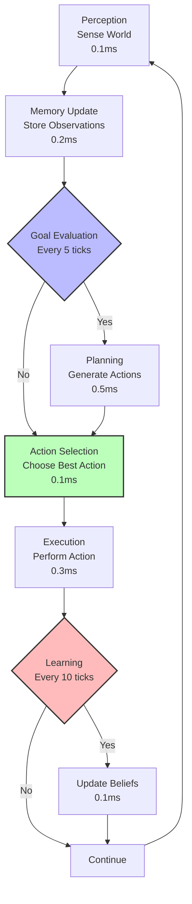
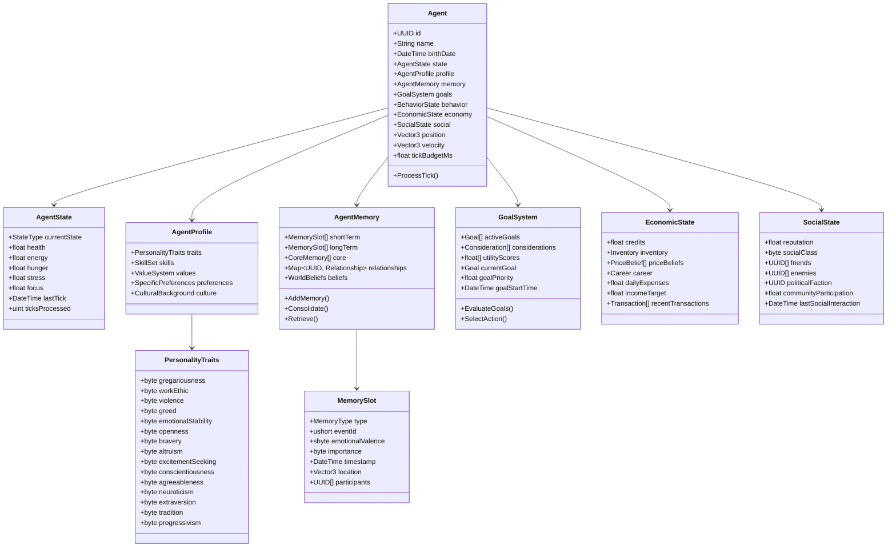
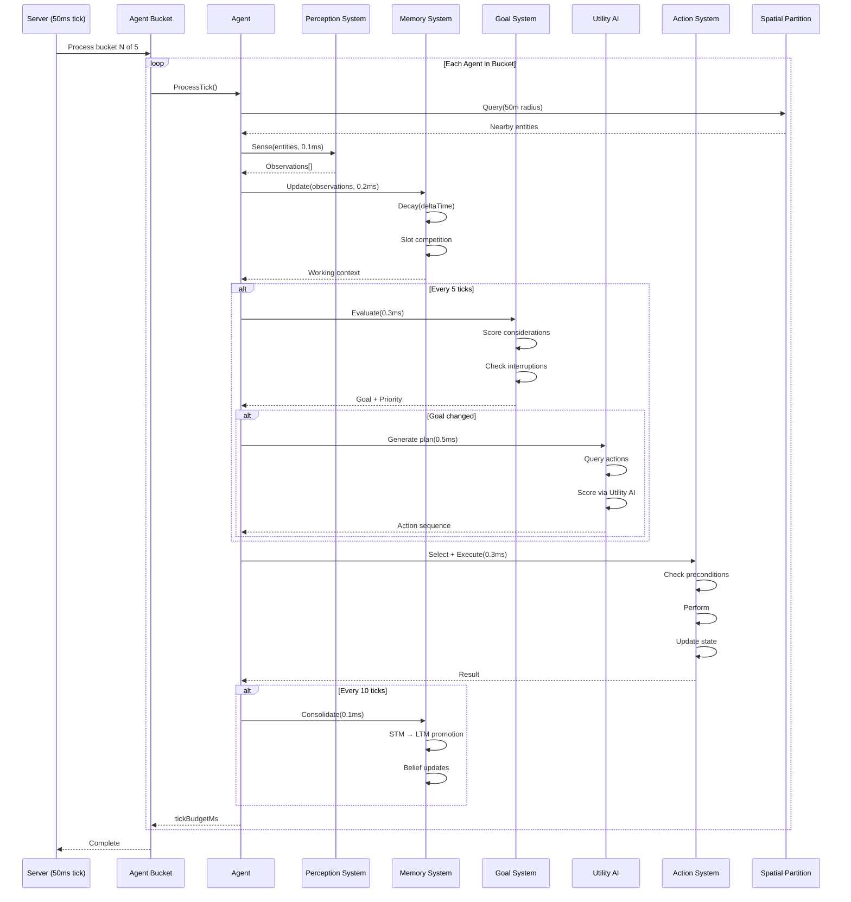
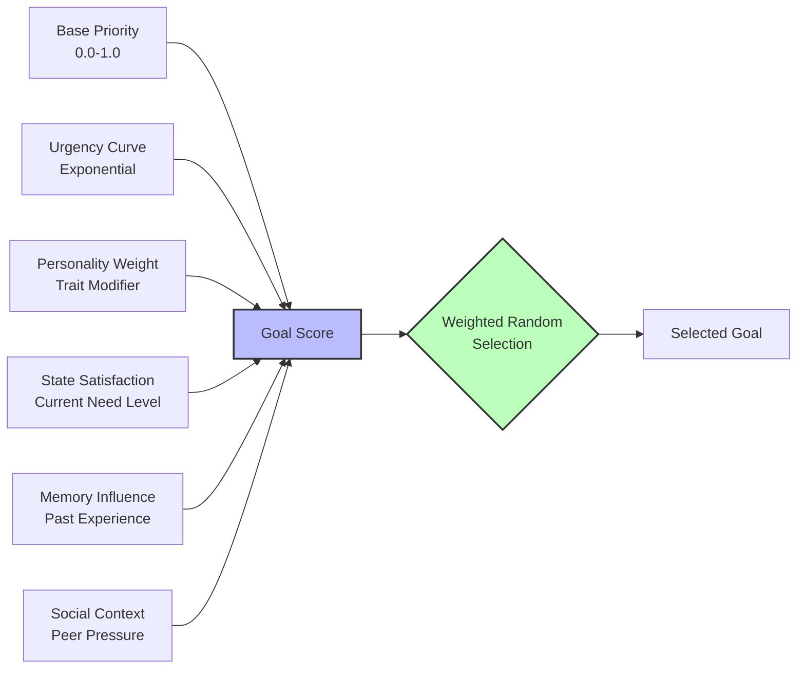
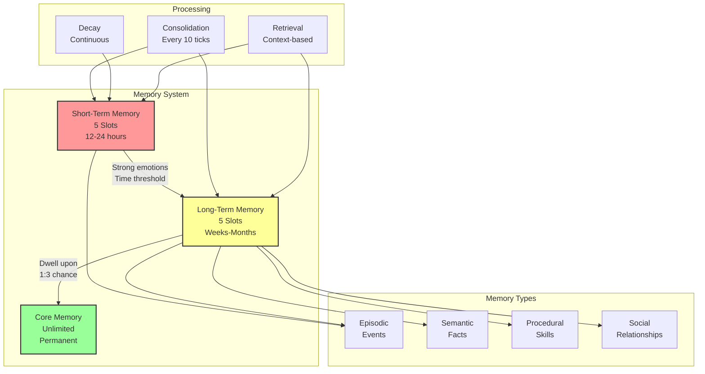
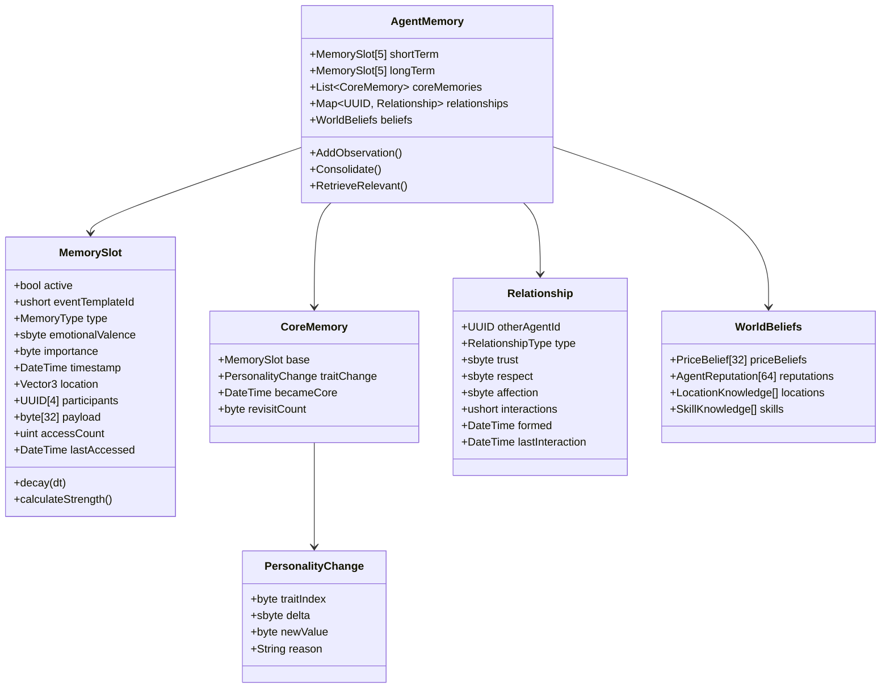

# Core AI Systems - Architecture, Goals & Memory

**Part of**: Session 2 - AI System Design  
**File**: 01-core-ai-architecture.md  
**Status**: Complete

---

> **Navigation**: [Index]([AGENTS-READ-FIRST]-index.md) | [Next: Economic Behavior](02-economic-behavior.md)
> 
> **Part of**: [Session 2 AI System Design]([AGENTS-READ-FIRST]-index.md)
> **Requires**: [Session 1 Architecture](../session-1-technical-architecture/)
> **Informs**: [Future Sessions] (Session 3-7 planning not yet started)

---

## Session 2: AI System Design - Deep Planning Document

**Planning Session**: 2 of 7  
**Status**: COMPLETE - Ready for Implementation  
**Date Started**: January 31, 2026  
**Date Completed**: January 31, 2026  
**Location**: planning/sessions/session-2-ai-system-design/
**Document Size**: ~10,800 lines | 14 sections | 50+ code examples

---

## Purpose

Specify how AI agents think, decide, and behave to create believable citizens. This document defines the AI architecture, decision-making processes, memory systems, and experimental brain configurations that make AI agents feel authentic rather than robotic.

---

## Key Questions Addressed

1. What's the AI decision-making architecture?
2. How do agents form goals and prioritize actions?
3. How do agents learn, remember, and form relationships?
4. How do we handle AI voting and political behavior?
5. How does the AI population elasticity system work?
6. What makes AI behavior feel authentic rather than robotic?
7. How do players learn about AI lives? (Emergent narrative)
8. How do we debug AI decisions? (Debuggability)

---

## Research Summary

**Tier 1 Sources**:
- **R4 (Dwarf Fortress)**: Memory systems (short-term 8+8 slots), emotional valence, core memory formation, episodic/semantic/procedural memory types, memory consolidation mechanics
- **R7 (AI Systems)**: Utility AI architecture, consideration curves, goal hierarchies, interrupt handling, decision loop optimization
- **R8 (PDF Synthesis)**: Agent-based economic modeling, price belief formation, trading strategies, market equilibrium behaviors
- **R1 (Technical constraints)**: 20 TPS tick rate, 2ms per-agent budget, 100-1000 agent scale, spatial partitioning for perception

**Key Insights**:
1. **Memory slot competition creates emergent forgetting**: DF's limited memory slots (5+5 simplified from 8+8) force agents to prioritize only significant events, naturally creating "forgotten" histories without explicit deletion logic
2. **Utility AI scales better than GOAP for 100+ agents**: Multiplicative consideration scoring provides predictable performance O(n) vs GOAP's exponential planning, while still producing rich emergent behavior
3. **Price beliefs must include uncertainty ranges**: Agents need min-max bounds (not just mean) to create realistic bid-ask spreads and negotiation behaviors
4. **Personality traits need non-linear impact curves**: Linear trait-to-behavior mappings produce robotic agents; exponential and logistic curves create more human-like variance
5. **Weighted random selection prevents hive-mind**: Top-3 goal weighted random (vs pure max) creates essential behavioral diversity even with identical inputs
6. **3-tier memory system balances depth and performance**: STM (5 slots, hours), LTM (5 slots, weeks), Core (unlimited, permanent) fits ~640 bytes per agent while enabling meaningful agent histories
7. **Economic agents need both belief formation AND gossip**: Price discovery requires direct observation (weighted averaging) plus social transmission through trusted relationships

---

## Dependencies

- **Requires**: Session 1 (Technical Architecture) - Performance budgets, tick loop
- **Informs**: Session 3 (Gameplay Loops), Session 5 (Governance), Session 6 (Prototyping)

---

## 1. AI Agent Architecture

### Core Decision Loop

The decision loop follows a **sense-think-act-learn** cycle optimized for 20 TPS (50ms per tick) with a per-agent budget of <2ms. Not all steps run every tick—some are amortized across multiple ticks to maintain performance.



#### Decision Loop Timing

| Phase | Frequency | Budget | Cumulative | Purpose |
|-------|-----------|--------|------------|---------|
| **Perception** | Every tick | 0.1ms | 2.0ms | Sense nearby entities, resources, threats |
| **Memory Update** | Every tick | 0.2ms | 1.9ms | Store observations, decay memories |
| **Goal Evaluation** | Every 5 ticks (4Hz) | 0.3ms | 1.7ms | Recalculate goal priorities |
| **Planning** | On goal change | 0.5ms | 1.5ms | Generate action sequence |
| **Action Selection** | Every tick | 0.1ms | 1.2ms | Select next action from plan |
| **Execution** | Every tick | 0.3ms | 0.9ms | Perform action, update state |
| **Learning** | Every 10 ticks (2Hz) | 0.1ms | 0.6ms | Update beliefs, consolidate memory |
| **Idle/Buffer** | - | 0.6ms | - | Reserved for variability |
| **TOTAL** | **Amortized** | **<2.0ms** | - | Per agent per tick |

#### Detailed Phase Descriptions

**1. Perception (0.1ms, Every Tick)**
- Query spatial partition for entities within 50m radius
- Identify: threats, resources, other agents, market opportunities
- Filter by agent's sensory capabilities (sight range, hearing)
- Update working memory with current observations
- **Optimization**: Spatial partitioning (100m chunks) reduces query to O(1)

**2. Memory Update (0.2ms, Every Tick)**
- Add new observations to short-term memory
- Apply decay to existing memories (exponential decay curve)
- Check for slot competition (overwrite weakest if full)
- Update relationship tracking (proximity = potential interaction)
- **Optimization**: Decay calculated every 5 ticks, interpolated between

**3. Goal Evaluation (0.3ms, Every 5 Ticks)**
- Calculate utility for all active goals using consideration system
- Check goal completion conditions
- Evaluate goal interruptions (critical needs override current)
- Select highest-utility goal as current
- **Formula**: `GoalScore = Σ(Consideration_i × Weight_i)`

**4. Planning (0.5ms, On Goal Change)**
- Generate action sequence to achieve current goal
- Query world state for available actions
- Score actions using Utility AI
- Select top-scoring action sequence
- **Fallback**: If planning fails, use default "idle" behavior

**5. Action Selection (0.1ms, Every Tick)**
- Select next action from current plan
- Check action preconditions (still valid?)
- Handle action interruption (higher priority goal?)
- Advance plan pointer or replan if complete

**6. Execution (0.3ms, Every Tick)**
- Perform selected action (move, craft, trade, socialize)
- Update agent state (energy, hunger, position)
- Trigger animations via Behavior Tree
- Broadcast action to nearby agents (if observable)

**7. Learning (0.1ms, Every 10 Ticks)**
- Update price beliefs based on market observations
- Consolidate short-term to long-term memories
- Adjust skill levels (if practice occurred)
- Update relationship strengths
- **Optimization**: Batched processing, only for agents with new data

#### Tick Processing Pseudocode

```csharp
public void ProcessAgentTick(Agent agent, float deltaTime)
{
    var stopwatch = Stopwatch.StartNew();
    
    // 1. PERCEPTION (every tick, 0.1ms)
    var nearbyEntities = spatialPartition.Query(agent.position, 50f);
    var observations = perceptionSystem.Sense(agent, nearbyEntities);
    
    // 2. MEMORY UPDATE (every tick, 0.2ms)
    foreach (var obs in observations)
    {
        agent.memory.AddToShortTerm(obs);
    }
    agent.memory.Decay(deltaTime);
    
    // 3. GOAL EVALUATION (every 5 ticks, 0.3ms)
    if (agent.ticksProcessed % 5 == 0)
    {
        agent.goals.EvaluatePriorities();
        var newGoal = agent.goals.SelectCurrentGoal();
        
        // Check for goal interruption
        if (newGoal != agent.goals.currentGoal && newGoal.urgency > 0.8f)
        {
            agent.goals.InterruptCurrent(newGoal);
            agent.behavior.Replan(); // Trigger planning phase
        }
    }
    
    // 4. PLANNING (on goal change, 0.5ms)
    if (agent.behavior.needsReplan)
    {
        var availableActions = actionSystem.GetAvailableActions(agent);
        var scoredActions = utilityAI.ScoreActions(agent, availableActions);
        agent.behavior.SetPlan(scoredActions.Top(3)); // Keep top 3 alternatives
        agent.behavior.needsReplan = false;
    }
    
    // 5. ACTION SELECTION (every tick, 0.1ms)
    var currentAction = agent.behavior.GetCurrentAction();
    if (!currentAction.IsValid(agent))
    {
        agent.behavior.AdvancePlan(); // Skip invalid action
        currentAction = agent.behavior.GetCurrentAction();
    }
    
    // 6. EXECUTION (every tick, 0.3ms)
    var result = currentAction.Execute(agent, deltaTime);
    agent.state.UpdateFromAction(result);
    behaviorTree.Execute(agent, currentAction.type);
    
    // 7. LEARNING (every 10 ticks, 0.1ms)
    if (agent.ticksProcessed % 10 == 0)
    {
        agent.economy.UpdatePriceBeliefs();
        agent.memory.Consolidate();
        agent.skills.UpdateFromPractice();
    }
    
    // Performance monitoring
    agent.tickBudgetMs = stopwatch.ElapsedMilliseconds;
    agent.ticksProcessed++;
    
    // Budget enforcement (soft limit)
    if (agent.tickBudgetMs > 2.0f)
    {
        telemetry.RecordOverBudget(agent, agent.tickBudgetMs);
    }
}
```

#### Interrupt Handling

Agents must respond immediately to critical events:

```csharp
public void HandleInterrupt(Agent agent, InterruptType type, float severity)
{
    switch (type)
    {
        case InterruptType.CriticalNeed:
            // Starvation, exhaustion - immediate response
            agent.goals.ForceGoal(GoalType.Survival, priority: 1.0f);
            agent.behavior.ClearPlan();
            break;
            
        case InterruptType.Threat:
            // Danger detected - fight or flight
            var bravery = agent.profile.traits.bravery;
            if (bravery > 60)
                agent.goals.ForceGoal(GoalType.Combat, priority: 0.9f);
            else
                agent.goals.ForceGoal(GoalType.Flee, priority: 0.9f);
            break;
            
        case InterruptType.Opportunity:
            // Rare chance - may or may not interrupt
            if (severity > 0.7f && agent.profile.traits.openness > 50)
            {
                agent.goals.QueueGoal(GoalType.Opportunity, priority: severity);
            }
            break;
    }
}
```

#### Performance Optimizations

**Agent Bucketing** (from Session 1):
- Divide agents into buckets of 100
- Process one bucket per tick (amortizes 100 agents across 5 ticks)
- Critical agents (in combat, player-visible) processed every tick

**LOD (Level of Detail)**:
- **High** (player within 20m): Full AI, every tick
- **Medium** (20-100m): Reduced frequency (every 5 ticks), simplified pathfinding
- **Low** (>100m): Minimal processing (every 20 ticks), no pathfinding

**Sleep States**:
- Dormant agents skip all processing except basic needs decay
- Wake when: player approaches, significant event occurs, timer expires
- Typical wake cycle: 300 ticks (15 seconds at 20 TPS)

#### Determinism Requirements

For replay debugging and multiplayer consistency:
- Fixed random seed per agent (derived from agent ID + world seed)
- Deterministic utility calculations (no floating-point variability)
- Action outcomes deterministic given same inputs
- Timestamp-based timing (not frame-dependent)

```csharp
// Deterministic random for agent
var agentSeed = Hash(agent.id, world.seed, tickNumber);
var random = new DeterministicRandom(agentSeed);

// Usage in utility calculation
var noise = random.Range(0.95f, 1.05f); // 5% personality variance
utilityScore *= noise;
```

### Agent State Structure

The agent state structure is designed for efficient serialization, minimal memory footprint (~8KB per agent), and fast tick processing. All data structures support the 20 TPS target with <2ms per agent budget.



#### Data Structure Specifications

**Agent Core (256 bytes)**
- `UUID id`: 16 bytes - Unique identifier
- `String name`: 32 bytes (max 31 chars) - Display name
- `DateTime birthDate`: 8 bytes - For age calculation
- `AgentState state`: 32 bytes - Current condition
- `Vector3 position`: 12 bytes - World location
- `Vector3 velocity`: 12 bytes - Movement vector
- `float tickBudgetMs`: 4 bytes - Time allocated this tick
- Padding/alignment: 140 bytes reserved for expansion

**AgentState (32 bytes)**
- `StateType currentState`: 1 byte (Active, Dormant, Dead, etc.)
- `float health`: 4 bytes (0.0-100.0)
- `float energy`: 4 bytes (0.0-100.0)
- `float hunger`: 4 bytes (0.0-100.0, inverted from DF for intuition)
- `float stress`: 4 bytes (-50000 to +120000, DF-style)
- `float focus`: 4 bytes (percentage, affects skill effectiveness)
- `DateTime lastTick`: 8 bytes - Last processing time
- `uint ticksProcessed`: 4 bytes - Total tick count

**PersonalityTraits (15 bytes)**
Each trait stored as `byte` (0-100) for memory efficiency:
- Core 5: Gregariousness, Work Ethic, Violence, Greed, Emotional Stability
- Big Five: Openness, Conscientiousness, Extraversion, Agreeableness, Neuroticism
- Secondary 5: Bravery, Altruism, Excitement-Seeking, Tradition, Progressivism

**MemorySlot (64 bytes per slot, 5 short-term + 5 long-term = 640 bytes)**
- `MemoryType type`: 1 byte (Episodic, Semantic, Procedural, Social)
- `ushort eventId`: 2 bytes - Reference to event template
- `sbyte emotionalValence`: 1 byte (-100 to +100)
- `byte importance`: 1 byte (0-255, slot competition score)
- `DateTime timestamp`: 8 bytes
- `Vector3 location`: 12 bytes
- `UUID participants[4]`: 64 bytes - Up to 4 other agents
- `byte data[39]`: 39 bytes - Event-specific payload

**EconomicState (~2KB)**
- `float credits`: 4 bytes - Current money
- `Inventory inventory`: ~1KB - 64 slots max (compact array)
- `PriceBelief[32] priceBeliefs`: 256 bytes - Beliefs for common goods
- `Career career`: 32 bytes - Current job and skills
- `Transaction[16] recentTransactions`: 512 bytes - Last 16 transactions

**SocialState (~4KB)**
- `float reputation`: 4 bytes - Community standing
- `byte socialClass`: 1 byte - Current class level
- `UUID friends[16]`: 256 bytes - Friend list (max 16)
- `UUID enemies[8]`: 128 bytes - Enemy list (max 8)
- `Relationship[24] relationships`: ~3KB - Detailed relationship data

#### Memory Layout Summary

| Component | Size | Notes |
|-----------|------|-------|
| Agent Core | 256 bytes | Base agent data |
| AgentState | 32 bytes | Current condition |
| Personality | 19 bytes | 19 traits × 1 byte |
| Memory System | 640 bytes | 5+5 slots × 64 bytes |
| Goal System | 256 bytes | Active goals + scores |
| Economic | 2KB | Inventory is largest |
| Social | 4KB | Relationships are largest |
| **Total per Agent** | **~8KB** | Fits L1 cache |

With 8KB per agent:
- 100 agents = ~800KB (easily fits in memory)
- 1000 agents = ~8MB (still reasonable)

#### Performance Budget Allocation

Per-agent tick budget: **<2ms at 20 TPS**

| System | Budget | Frequency |
|--------|--------|-----------|
| Perception | 0.1ms | Every tick |
| Memory Update | 0.2ms | Every tick |
| Goal Evaluation | 0.3ms | Every 5 ticks (4Hz) |
| Planning | 0.5ms | When goal changes |
| Action Execution | 0.3ms | Every tick |
| Learning | 0.1ms | Every 10 ticks (2Hz) |
| **Total** | **<1.5ms** | **Amortized** |

#### Serialization Format

For database persistence (PostgreSQL JSONB):
```json
{
  "id": "uuid",
  "name": "string",
  "state": { "health": 85.5, "energy": 72.0, ... },
  "profile": { "traits": { "gregariousness": 75, ... }, ... },
  "memory": { "shortTerm": [...], "longTerm": [...], ... },
  "economy": { "credits": 150.50, "inventory": [...], ... },
  "social": { "reputation": 65.0, "friends": [...], ... }
}
```

**Size**: ~3-4KB compressed JSON per agent
**Query Performance**: 0.5-0.8ms with GIN indexes (per R1 PostgreSQL research)

### Tick Processing Architecture

The tick processing system coordinates agent updates within the server's 50ms tick window (20 TPS). Agents are processed in buckets to amortize CPU load, with critical agents receiving priority processing.

#### Server Tick Flow



#### Processing Buckets

To maintain 20 TPS with 100+ agents, agents are divided into **5 buckets** of 20 agents each:

| Tick | Bucket | Agents Processed | Processing Time |
|------|--------|------------------|-----------------|
| 1 | A | 0-19 | ~30ms |
| 2 | B | 20-39 | ~30ms |
| 3 | C | 40-59 | ~30ms |
| 4 | D | 60-79 | ~30ms |
| 5 | E | 80-99 | ~30ms |
| 6 | A | 0-19 (repeat) | ~30ms |

**Benefits**:
- Distributes 100 agents across 5 ticks = 20 agents per tick
- Per-tick budget: 20 agents × 2ms = 40ms (fits in 50ms tick)
- Leaves 10ms for physics, networking, ecosystem

**Priority Override**:
- Critical agents (in combat, player-visible, stressed) process every tick
- Maximum 10% of agents can be critical (10 agents max at 100 agent count)

#### Amortization Schedule

Not all systems run every tick. Here's the amortization schedule for a typical agent:

| Tick | Perception | Memory Update | Goal Eval | Planning | Action Exec | Learning |
|------|------------|---------------|-----------|----------|-------------|----------|
| 1 | ✓ | ✓ | ✓ | - | ✓ | - |
| 2 | ✓ | ✓ | - | - | ✓ | - |
| 3 | ✓ | ✓ | - | - | ✓ | - |
| 4 | ✓ | ✓ | - | - | ✓ | - |
| 5 | ✓ | ✓ | ✓ | If needed | ✓ | - |
| 6 | ✓ | ✓ | - | - | ✓ | ✓ |
| ... | ... | ... | ... | ... | ... | ... |

**Total per 10-tick cycle**: ~6.0ms amortized = 0.6ms average per tick

#### Threading Model

```csharp
public class AgentTickProcessor
{
    private Agent[] agents;
    private SpatialPartition spatial;
    private int currentBucket = 0;
    private const int BUCKET_COUNT = 5;
    
    public void ProcessTick(float deltaTime)
    {
        var bucketSize = agents.Length / BUCKET_COUNT;
        var startIdx = currentBucket * bucketSize;
        var endIdx = startIdx + bucketSize;
        
        // Process current bucket
        for (int i = startIdx; i < endIdx; i++)
        {
            ProcessAgent(agents[i], deltaTime);
        }
        
        // Process critical agents (every tick)
        foreach (var agent in agents.Where(a => a.isCritical))
        {
            ProcessAgent(agent, deltaTime);
        }
        
        // Advance bucket
        currentBucket = (currentBucket + 1) % BUCKET_COUNT;
    }
    
    private void ProcessAgent(Agent agent, float deltaTime)
    {
        // Set LOD level based on distance to nearest player
        var lod = CalculateLOD(agent);
        agent.SetLOD(lod);
        
        // Skip if dormant
        if (agent.state.currentState == StateType.Dormant)
        {
            ProcessDormant(agent, deltaTime);
            return;
        }
        
        // Full processing
        var timer = Stopwatch.StartNew();
        
        PerceptionPhase(agent);
        MemoryPhase(agent, deltaTime);
        GoalPhase(agent);
        PlanningPhase(agent);
        ActionPhase(agent, deltaTime);
        LearningPhase(agent);
        
        agent.tickBudgetMs = timer.ElapsedMilliseconds;
        agent.ticksProcessed++;
    }
    
    private void ProcessDormant(Agent agent, float deltaTime)
    {
        // Minimal processing: needs decay only
        agent.state.hunger += deltaTime * 0.1f;
        agent.state.energy -= deltaTime * 0.05f;
        
        // Wake check
        if (ShouldWake(agent))
        {
            agent.state.currentState = StateType.Active;
            agent.memory.AddToShortTerm(new Memory("Woke up", importance: 50));
        }
    }
}
```

#### LOD (Level of Detail) Processing

| LOD | Distance | Frequency | Systems Active | Budget |
|-----|----------|-----------|----------------|--------|
| **High** | <20m | Every tick | All systems | 2.0ms |
| **Medium** | 20-100m | Every 5 ticks | Perception, Memory, Action | 0.5ms |
| **Low** | >100m | Every 20 ticks | Basic needs only | 0.1ms |
| **Dormant** | >500m or player absent | Every 100 ticks | Needs decay only | 0.01ms |

**LOD Transitions**:
- Promote to higher LOD when: player approaches, significant event occurs, agent enters combat
- Demote to lower LOD when: player leaves, agent idle for 60 seconds, no important state changes

#### Performance Monitoring

```csharp
public class AgentPerformanceMonitor
{
    public void RecordMetrics(Agent agent)
    {
        // Per-agent metrics
        if (agent.tickBudgetMs > 2.0f)
        {
            Log.Warning($"Agent {agent.id} over budget: {agent.tickBudgetMs}ms");
            
            // Auto-LOD demotion if consistently over budget
            if (agent.overBudgetCount > 5)
            {
                agent.SetLOD(LODLevel.Medium);
            }
        }
        
        // Aggregate metrics
        telemetry.Record("agent.tick_time", agent.tickBudgetMs);
        telemetry.Record("agent.lod_distribution", agent.currentLOD);
    }
    
    public PerformanceReport GenerateReport()
    {
        return new PerformanceReport
        {
            AverageTickTime = telemetry.Average("agent.tick_time"),
            AgentsOverBudget = telemetry.CountWhere("agent.tick_time", t => t > 2.0),
            LODDistribution = telemetry.Distribution("agent.lod_distribution"),
            BucketUtilization = CalculateBucketUtilization()
        };
    }
}
```

#### Session 1 Integration Points

**From Session 1 (Technical Architecture)**:
- 20 TPS target → 50ms tick window
- 2ms per agent budget → Enforced via monitoring
- Spatial partitioning (100m chunks) → Perception queries
- State sync networking → Agent position/state broadcast
- PostgreSQL persistence → Agent save/load

**Dependencies**:
- Session 1's tick loop calls `AgentTickProcessor.ProcessTick()`
- Session 1's spatial partition provides entity queries
- Session 1's network layer broadcasts agent actions to clients

---

## 2. Goal System Architecture

### Goal Hierarchy

The goal hierarchy follows a modified **Maslow's Hierarchy of Needs** adapted for economic simulation. Lower-level goals (Survival) take precedence over higher-level goals (Self-Actualization), but all goals compete continuously via utility scoring.

```mermaid
graph TD
    subgraph "SURVIVAL<br/>Base Priority: 0.8-1.0"
        S[Survival<br/>Physiological] --> SR[Subsistence Resources]
        S --> SH[Shelter & Safety]
        
        SR --> F[Food Security<br/>Activation: Hunger>50%]
        SR --> W[Water Access<br/>Activation: Thirst>50%]
        SR --> I[Income Stability<br/>Activation: Credits<50]
        
        SH --> ST[Shelter Quality<br/>Activation: NoHome|Weather]
        SH --> SF[Personal Safety<br/>Activation: ThreatNearby]
    end
    
    subgraph "PROSPERITY<br/>Base Priority: 0.4-0.7"
        P[Prosperity<br/>Economic] --> WE[Wealth Accumulation<br/>Credits<Target]
        P --> SP[Skill Progression<br/>Skill<Cap]
        P --> BU[Business Growth<br/>Owner&Demand>Supply]
        P --> EM[Employment<br/>Unemployed|BetterJob]
    end
    
    subgraph "SOCIAL<br/>Base Priority: 0.2-0.5"
        SO[Social<br/>Belonging] --> RE[Relationships<br/>Friends<Desired]
        SO --> ST2[Status & Reputation<br/>Rep<Goal]
        SO --> CO[Community Participation<br/>Participation<Threshold]
        SO --> FA[Family Needs<br/>FamilyPresent|MissingFamily]
    end
    
    subgraph "SELF-ACTUALIZATION<br/>Base Priority: 0.1-0.3"
        SE[Self-Actualization<br/>Fulfillment] --> CR[Creative Expression<br/>Openness>60]
        SE --> PO[Political Influence<br/>PoliticalInterest>50]
        SE --> LE[Legacy Building<br/>Age>40|Success]
        SE --> KN[Knowledge Pursuit<br/>Openness>50]
        SE --> TR[Teaching/Mentoring<br/>Skill>80&Altruism>50]
    end
    
    S -.->|Blocked if<br/>unsatisfied| P
    P -.->|Can defer for<br/>social needs| SO
    SO -.->|Fulfilled| SE
    
    style S fill:#f99,stroke:#333,stroke-width:3px
    style P fill:#ff9,stroke:#333,stroke-width:2px
    style SO fill:#9f9,stroke:#333,stroke-width:2px
    style SE fill:#99f,stroke:#333,stroke-width:2px
```

#### Hierarchy Levels

**Level 1: SURVIVAL (Base Priority: 0.8-1.0)**

Critical physiological and safety needs. These goals **always** activate when needs are unmet and can interrupt any other goal.

| Goal | Activation Condition | Completion Condition | Interruptible |
|------|---------------------|---------------------|---------------|
| **Food Security** | Hunger > 50% | Hunger < 20% or FoodEaten | NO (Critical) |
| **Water Access** | Thirst > 50% | Thirst < 20% or WaterDrank | NO (Critical) |
| **Rest/Sleep** | Energy < 30% | Energy > 80% or Slept 8h | NO (Critical) |
| **Shelter Quality** | No home OR Weather dangerous | Has adequate shelter | Partial (can delay briefly) |
| **Personal Safety** | Threat within 30m | Threat gone or Safe zone | NO (Critical) |
| **Medical Attention** | Health < 50% | Health > 80% or Treated | Partial |
| **Income Stability** | Credits < 50 (can't afford food) | Credits > 200 | Partial |

**Behavior**: When survival goals active with utility > 0.8, they override all other goals. Agents will:
- Drop current work to find food
- Flee from threats (fight only if brave and cornered)
- Seek shelter during storms
- Take any paying work if destitute

**Level 2: PROSPERITY (Base Priority: 0.4-0.7)**

Economic advancement and resource accumulation. Active when survival is secured.

| Goal | Activation Condition | Completion Condition | Duration |
|------|---------------------|---------------------|----------|
| **Wealth Accumulation** | Credits < WealthTarget (personality-based) | Credits >= Target × 1.2 | Ongoing |
| **Skill Progression** | Primary skill < DesiredLevel | Skill >= Target | Months |
| **Business Growth** | Owns business AND Demand > Supply 20% | Profit stable for 7 days | Weeks |
| **Employment** | Unemployed OR (Better job available × 1.5 pay) | Employed at target job | Days |
| **Resource Stockpiling** | Inventory < StockpileTarget (prepper trait) | Inventory >= Target | Days |
| **Investment** | Credits > 500 AND Greed > 60 | Investment made | One-time |

**Behavior**: Agents work, trade, and invest to improve economic standing. High-greed agents prioritize wealth; high-work-ethic agents prioritize skill mastery.

**Personality Modifiers**:
- High Greed (+20%): Lower wealth target threshold, prioritize money-making
- High Work Ethic (+15%): Prefer skill progression over easy income
- High Openness (-10%): Less focused on wealth, more on experience

**Level 3: SOCIAL (Base Priority: 0.2-0.5)**

Relationship building, community participation, and social standing. Active when survival and prosperity are minimally satisfied.

| Goal | Activation Condition | Completion Condition | Frequency |
|------|---------------------|---------------------|-----------|
| **Relationship Building** | ActiveFriends < DesiredCount (3-8, based on gregariousness) | Friend gained OR Time limit (1 day) | Weekly |
| **Status & Reputation** | Reputation < ReputationGoal | Reputation >= Goal | Ongoing |
| **Community Participation** | DaysSinceParticipation > 3 | Participated in event/project | Every 3-7 days |
| **Family Time** | Family nearby AND DaysSinceVisit > 2 | Visited family | Every 2-5 days |
| **Romance** | Single AND Age>16 AND Romance propensity > 40 | Dating OR Rejected | As opportunity arises |
| **Conflict Resolution** | Has enemy AND Agreeableness > 50 | Reconciled OR Avoided | As needed |

**Behavior**: Agents seek social interaction based on personality. High-gregariousness agents need frequent social contact; low-gregariousness agents prefer occasional deep interactions.

**Personality Modifiers**:
- High Gregariousness (+30%): Lower threshold for social need activation
- High Extraversion (+20%): Prioritize status over close relationships
- High Agreeableness (+15%): More likely to pursue conflict resolution

**Level 4: SELF-ACTUALIZATION (Base Priority: 0.1-0.3)**

Fulfillment, creative expression, political influence, and legacy building. Only pursued when lower needs are well-satisfied.

| Goal | Activation Condition | Completion Condition | Requirements |
|------|---------------------|---------------------|--------------|
| **Creative Expression** | Openness > 60 AND Time available | Artwork created OR Skill used | 2+ hours free time |
| **Political Influence** | Political interest > 50 AND Governance exists | Law passed OR Office held | Town level+ government |
| **Legacy Building** | Age > 40 OR Major success achieved | Monument built OR Child mentored | Resources + time |
| **Knowledge Pursuit** | Openness > 50 AND Unknown skill available | Learned new skill OR Research complete | Access to knowledge |
| **Teaching/Mentoring** | Skill > 80 AND Altruism > 50 AND Student available | Student skill improved | Apprentice available |
| **Philanthropy** | Credits > 1000 AND Altruism > 60 | Donation made OR Project funded | Surplus wealth |

**Behavior**: These goals provide long-term satisfaction but lower immediate utility. Agents only pursue when:
- Survival utility < 0.3 (not threatened)
- Prosperity utility < 0.4 (economically stable)
- Personality traits support the goal (e.g., high openness for creativity)

**Personality Modifiers**:
- High Openness (+40%): Much more likely to pursue creative/knowledge goals
- High Progressivism (+25%): Prioritize political influence
- High Tradition (+20%): Prefer legacy building through family

## Goal-Based Generation

### Goal Generation Overview

Goals are generated dynamically based on agent needs, personality traits, and world state. The goal-based generation system translates abstract needs into concrete, actionable objectives that drive agent behavior.

#### Goal Activation Logic

```csharp
public class GoalSystem
{
    public List<Goal> activeGoals = new();
    
    public void UpdateActiveGoals(Agent agent)
    {
        activeGoals.Clear();
        
        // Always check survival goals
        AddIfActive(new FoodSecurityGoal(), agent.hunger > 50);
        AddIfActive(new WaterAccessGoal(), agent.thirst > 50);
        AddIfActive(new RestGoal(), agent.energy < 30);
        AddIfActive(new ShelterGoal(), agent.home == null || agent.weather.IsSevere);
        AddIfActive(new SafetyGoal(), agent.perception.threats.Count > 0);
        
        // Prosperity goals if survival secured
        if (agent.hunger < 30 && agent.energy > 40)
        {
            AddIfActive(new WealthGoal(), agent.credits < agent.wealthTarget);
            AddIfActive(new SkillProgressionGoal(), agent.primarySkill < agent.skillTarget);
            AddIfActive(new EmploymentGoal(), agent.employer == null);
        }
        
        // Social goals if basic prosperity secured
        if (agent.credits > 100)
        {
            AddIfActive(new RelationshipGoal(), agent.friends.Count < agent.desiredFriendCount);
            AddIfActive(new CommunityGoal(), agent.daysSinceParticipation > 3);
        }
        
        // Self-actualization if well-satisfied lower needs
        if (agent.hunger < 20 && agent.energy > 60 && agent.credits > 200)
        {
            AddIfActive(new CreativeGoal(), agent.traits.openness > 60);
            AddIfActive(new PoliticalGoal(), agent.traits.progressivism > 50 && agent.town.hasGovernment);
            AddIfActive(new LegacyGoal(), agent.age > 40);
        }
    }
    
    private void AddIfActive(Goal goal, bool condition)
    {
        if (condition)
            activeGoals.Add(goal);
    }
}
```

#### Goal Completion and Satisfaction

Goals are not binary complete/incomplete—they provide **satisfaction decay**:

```csharp
public class GoalSatisfaction
{
    public float currentSatisfaction; // 0.0-1.0
    public float decayRate; // Per-tick decay
    
    public void Update(Goal goal, Agent agent)
    {
        // Satisfaction increases when goal pursued
        if (agent.currentGoal == goal)
        {
            currentSatisfaction += goal.satisfactionGainPerTick;
        }
        
        // Satisfaction decays over time (needs recur)
        currentSatisfaction -= decayRate;
        
        // Clamp
        currentSatisfaction = Mathf.Clamp01(currentSatisfaction);
    }
}
```

**Decay Rates** (at 20 TPS):
- Survival goals: Fast decay (satisfaction lost in 10-30 minutes real-time)
- Prosperity goals: Medium decay (hours to days)
- Social goals: Medium-slow decay (days)
- Self-actualization: Slow decay (days to weeks)

#### Goal Satisfaction Effects

Meeting goals affects agent state:

| Goal Category | Satisfaction Effect | Unsatisfied Effect |
|---------------|--------------------|--------------------|
| **Survival** | Health regen, energy restore | Health damage, stress gain, focus loss |
| **Prosperity** | Stress reduction, confidence boost | Stress gain, anxiety, status loss |
| **Social** | Mood boost, creativity bonus | Loneliness, depression, stress |
| **Self-Actualization** | Long-term happiness, legacy points | Mid-life crisis, regret (memories) |

#### Dynamic Goal Adjustment

Goals adapt based on world state:

```csharp
public void AdjustGoalsForWorldState(Agent agent)
{
    // Economic depression: Lower wealth targets
    if (world.economicIndex < 0.5f)
    {
        agent.wealthTarget *= 0.7f;
        agent.considerations["Wealth"].weight *= 0.8f;
    }
    
    // War/chaos: Raise safety priority
    if (world.conflictLevel > 0.7f)
    {
        agent.considerations["Safety"].weight *= 1.5f;
        agent.considerations["Wealth"].weight *= 0.6f;
    }
    
    // Festival/community event: Raise social priority
    if (world.activeEvents.Any(e => e.type == EventType.Festival))
    {
        agent.considerations["Social"].weight *= 1.3f;
    }
    
    // Personal tragedy: Adjust goals based on trauma
    if (agent.memory.core.Any(m => m.type == Trauma && m.age < 30))
    {
        agent.considerations["Safety"].weight *= 1.4f;
        agent.considerations["Family"].weight *= 1.3f;
    }
}
```

#### Goal Examples

**Example 1: Newly Arrived Agent**:
- Survival: Needs food and shelter (utility ~0.9)
- Prosperity: Needs income (utility ~0.6)
- Social: Wants friends but deferred (utility ~0.3)
- **Result**: Prioritizes finding work that provides both food and money

**Example 2: Established Merchant**:
- Survival: Well-fed, safe home (utility ~0.2)
- Prosperity: Wants to expand shop (utility ~0.7)
- Social: Active in community (utility ~0.6)
- Self-Actualization: Interested in politics (utility ~0.4)
- **Result**: Balances business growth with community participation, occasionally pursues political influence

**Example 3: Elder Craftsman**:
- Survival: Modest but secure (utility ~0.3)
- Prosperity: Comfortable, not expanding (utility ~0.4)
- Social: Family nearby (utility ~0.5)
- Self-Actualization: Wants to teach apprentice (utility ~0.8)
- **Result**: Spends significant time mentoring, creating legacy

### Goal Priority Calculation

Goal priorities are calculated using **Utility AI** principles. Each goal is scored by combining multiple considerations (factors) through response curves, producing a final utility score in the range [0.0, 1.0].



#### Priority Calculation Formula

```csharp
public float CalculateGoalUtility(Agent agent, Goal goal)
{
    float score = 1.0f;
    
    // Multiplicative combination of all considerations
    foreach (var consideration in goal.considerations)
    {
        float value = consideration.GetValue(agent, goal);
        float curved = consideration.responseCurve.Evaluate(value);
        float weighted = Mathf.Pow(curved, consideration.weight);
        score *= weighted;
    }
    
    // Apply personality modifiers
    score *= GetPersonalityMultiplier(agent, goal);
    
    // Add small random variance (5-10%) to prevent robotic behavior
    float noise = agent.random.Range(0.95f, 1.05f);
    score *= noise;
    
    return Mathf.Clamp01(score);
}
```

#### Consideration System

**Considerations** are the atomic units of goal evaluation. Each consideration measures one factor and maps it to [0.0, 1.0] via a response curve.

**Core Considerations (15-20 total)**:

| Consideration | Measures | Default Weight | Curve Type | Personality Link |
|---------------|----------|----------------|------------|------------------|
| **Hunger** | Current hunger level (0-100) | 10.0 | Exponential | Greed (inverse) |
| **Energy** | Current energy (0-100) | 8.0 | Exponential | Work Ethic |
| **Health** | Current health (0-100) | 9.0 | Logistic | Emotional Stability |
| **Safety** | Proximity to threats | 7.0 | Step | Bravery (inverse) |
| **Social Need** | Time since last interaction | 5.0 | Linear | Gregariousness |
| **Wealth** | Current credits vs. target | 6.0 | Logistic | Greed |
| **Skill Growth** | Recent skill practice | 4.0 | Linear | Openness |
| **Status** | Reputation vs. aspiration | 3.0 | Logistic | Extraversion |
| **Comfort** | Housing quality | 4.0 | Linear | Conscientiousness |
| **Achievement** | Recent accomplishments | 3.0 | Linear | Work Ethic |
| **Political Interest** | Governance participation | 2.0 | Linear | Progressivism |
| **Creativity** | Creative outlet need | 2.0 | Linear | Openness |
| **Tradition** | Cultural adherence | 2.0 | Linear | Tradition |
| **Excitement** | Boredom level | 3.0 | Exponential | Excitement-Seeking |
| **Altruism** | Helping others | 2.0 | Linear | Altruism |

**Response Curves**:

**Exponential (for urgent needs like hunger)**:
```
f(x) = x^k where k > 1 (typically 2.0-3.0)
Example: At 30% hunger: 0.3^2 = 0.09 (low urgency)
         At 80% hunger: 0.8^2 = 0.64 (high urgency)
```

**Logistic/Sigmoid (for threshold behaviors)**:
```
f(x) = 1 / (1 + e^(-k * (x - midpoint)))
Example: Safety consideration with midpoint=50, k=0.2
         At x=30 (safe): ~0.12 (low concern)
         At x=50 (caution zone): ~0.50
         At x=70 (dangerous): ~0.88 (high concern)
```

**Linear (for steady preferences)**:
```
f(x) = x (clamped to [0,1])
Example: Social need grows steadily with time
```

**Step (for binary conditions)**:
```
f(x) = 0 if x < threshold, 1 if x >= threshold
Example: Safety step at 0.3 (30% health = critical)
```

#### Personality Weight Modifiers

Traits modify consideration weights and curve parameters:

```csharp
public float GetPersonalityMultiplier(Agent agent, Goal goal)
{
    float multiplier = 1.0f;
    
    // Adjust based on goal type
    switch (goal.category)
    {
        case GoalCategory.Survival:
            // High neuroticism = higher safety priority
            multiplier += (agent.traits.neuroticism - 50) * 0.01f;
            break;
            
        case GoalCategory.Prosperity:
            // High greed = higher wealth priority
            multiplier += (agent.traits.greed - 50) * 0.02f;
            // High work ethic = more willing to work for wealth
            if (goal.subCategory == GoalSubCategory.Work)
                multiplier += (agent.traits.workEthic - 50) * 0.01f;
            break;
            
        case GoalCategory.Social:
            // High gregariousness = higher social need
            multiplier += (agent.traits.gregariousness - 50) * 0.02f;
            // High extraversion = cares more about status
            if (goal.subCategory == GoalSubCategory.Status)
                multiplier += (agent.traits.extraversion - 50) * 0.015f;
            break;
            
        case GoalCategory.SelfActualization:
            // High openness = values creativity and learning
            multiplier += (agent.traits.openness - 50) * 0.02f;
            break;
    }
    
    return Mathf.Clamp(multiplier, 0.5f, 2.0f); // Range: 0.5x to 2.0x
}
```

#### Memory Influence

Past experiences modify current goal priorities:

```csharp
public float GetMemoryModifier(Agent agent, Goal goal)
{
    float modifier = 1.0f;
    
    // Check for relevant memories
    var relevantMemories = agent.memory.RetrieveByType(goal.memoryType);
    
    foreach (var memory in relevantMemories)
    {
        // Positive memory of goal completion
        if (memory.emotionalValence > 50 && memory.importance > 70)
        {
            // Encourage repeating positive experiences
            modifier += 0.1f;
        }
        
        // Negative memory of ignoring this need
        if (memory.emotionalValence < -50 && memory.tags.Contains("consequence"))
        {
            // Increase urgency to avoid repeated negative outcome
            modifier += 0.2f;
        }
        
        // Trauma related to this goal type
        if (memory.type == MemoryType.Core && memory.emotionalValence < -80)
        {
            // Strong avoidance or obsession depending on trait
            if (agent.traits.emotionalStability < 40)
                modifier += 0.3f; // Obsessive about preventing repeat
        }
    }
    
    return Mathf.Clamp(modifier, 0.5f, 1.5f);
}
```

#### Social Context

Peer influence and social pressure:

```csharp
public float GetSocialModifier(Agent agent, Goal goal)
{
    float modifier = 1.0f;
    
    // Check what friends are doing
    var friends = agent.social.GetFriends();
    int friendsPursuingGoal = friends.Count(f => f.currentGoal == goal.type);
    
    if (friendsPursuingGoal > 0)
    {
        // Social proof: if 3+ friends doing X, more likely to join
        float socialInfluence = Mathf.Min(friendsPursuingGoal * 0.1f, 0.3f);
        
        // High agreeableness = more susceptible to peer pressure
        socialInfluence *= (agent.traits.agreeableness / 50f);
        
        modifier += socialInfluence;
    }
    
    // Authority influence (if respected leader pursuing goal)
    var respectedAgents = agent.social.GetHighRespectAgents();
    if (respectedAgents.Any(r => r.currentGoal == goal.type))
    {
        modifier += 0.15f; // Role model effect
    }
    
    return Mathf.Clamp(modifier, 0.8f, 1.4f);
}
```

#### Final Priority Score

Combining all factors:

```csharp
public float CalculateFinalPriority(Agent agent, Goal goal)
{
    // Base utility from considerations
    float utility = CalculateGoalUtility(agent, goal);
    
    // Apply modifiers
    float personalityMod = GetPersonalityMultiplier(agent, goal);
    float memoryMod = GetMemoryModifier(agent, goal);
    float socialMod = GetSocialModifier(agent, goal);
    
    float finalScore = utility * personalityMod * memoryMod * socialMod;
    
    // Hard override for critical needs (survival always wins if urgent)
    if (goal.category == GoalCategory.Survival && utility > 0.8f)
    {
        finalScore = 1.0f; // Maximum priority
    }
    
    return Mathf.Clamp01(finalScore);
}
```

#### Goal Selection

Weighted random selection among top-scoring goals prevents deterministic behavior:

```csharp
public Goal SelectGoal(Agent agent)
{
    // Score all active goals
    var scoredGoals = activeGoals.Select(g => new {
        Goal = g,
        Score = CalculateFinalPriority(agent, g)
    }).OrderByDescending(x => x.Score).ToList();
    
    // Consider top 3 goals (or fewer if less available)
    var candidates = scoredGoals.Take(3).ToList();
    
    if (candidates.Count == 0)
        return Goal.Idle; // Default fallback
    
    // If one goal dominates (>0.8 score), select it deterministically
    if (candidates[0].Score > 0.8f && candidates[0].Score > candidates[1].Score + 0.2f)
    {
        return candidates[0].Goal;
    }
    
    // Otherwise, weighted random selection
    float totalWeight = candidates.Sum(c => c.Score);
    float random = agent.random.Range(0, totalWeight);
    
    float cumulative = 0;
    foreach (var candidate in candidates)
    {
        cumulative += candidate.Score;
        if (random <= cumulative)
            return candidate.Goal;
    }
    
    return candidates[0].Goal; // Fallback
}
```

#### Goal Interruption

Critical needs can interrupt current goals:

```csharp
public bool ShouldInterruptCurrentGoal(Agent agent, Goal currentGoal)
{
    // Check all goals for critical priority
    foreach (var goal in activeGoals)
    {
        float score = CalculateFinalPriority(agent, goal);
        
        // Critical threshold: score > 0.9 and significantly higher than current
        if (score > 0.9f && goal != currentGoal)
        {
            float currentScore = CalculateFinalPriority(agent, currentGoal);
            if (score > currentScore + 0.3f)
            {
                return true; // Interrupt for critical need
            }
        }
    }
    
    // Check for interrupts (combat, emergencies)
    if (agent.pendingInterrupts.Any(i => i.severity > 0.8f))
    {
        return true;
    }
    
    return false;
}
```

**Interruption Handling**:
```csharp
public void InterruptGoal(Agent agent, Goal newGoal)
{
    // Save current goal state for resumption
    if (agent.currentGoal != null && agent.currentGoal.interruptible)
    {
        agent.goalStack.Push(agent.currentGoal);
    }
    
    // Set new goal
    agent.currentGoal = newGoal;
    agent.behavior.needsReplan = true;
    
    // Log interruption for memory
    agent.memory.AddToShortTerm(new Memory(
        $"Interrupted {oldGoal.name} for {newGoal.name}",
        importance: 60,
        emotionalValence: (sbyte)(newGoal.urgency > 0.8f ? -30 : -10)
    ));
}
```

#### Performance Considerations

- **Caching**: Goal scores cached for 5 ticks (0.25s at 20 TPS)
- **Lazy Evaluation**: Only evaluate goals that could potentially win (top 5 by base priority)
- **Early Exit**: If consideration returns 0, abort goal evaluation immediately
- **Budgeting**: Track time spent in goal evaluation, demote to simpler heuristics if over budget

#### Example: Goal Priority Scenarios

**Scenario 1: Hungry Agent**:
- Hunger: 85% (curved: 0.85^2.5 = 0.66)
- Energy: 70% (curved: 0.70^2.0 = 0.49)
- Wealth consideration: 0.3 (moderate wealth)
- **Food goal score**: 0.66 × 1.2 (greedy agent) × 1.1 (once starved before) = **0.87** (High priority)

**Scenario 2: Comfortable Agent**:
- Hunger: 20% (curved: 0.04)
- Social need: 80% (0.80)
- Excitement: 70% (curved: 0.49)
- **Social goal score**: 0.80 × 1.3 (high gregariousness) = **1.04** → clamped to 1.0 (Maximum priority)
- **Work goal score**: 0.3 × 0.8 (moderate work ethic) = 0.24 (Low priority)

**Result**: Agent chooses to socialize rather than work, despite having moderate wealth needs.

---

## 3. Agent Memory System

### Memory Architecture

The memory system uses a **3-tier architecture** inspired by Dwarf Fortress but optimized for performance. Memory slots are limited (5 short-term + 5 long-term) to create competition dynamics—only the most important memories are retained.



### Memory Data Structure

Memory structures are optimized for cache efficiency and fast comparison during slot competition.



#### MemorySlot Structure (64 bytes fixed)

Compact binary format for cache efficiency:

| Field | Type | Size | Description |
|-------|------|------|-------------|
| `active` | bool | 1 byte | Slot occupied? |
| `eventTemplateId` | ushort | 2 bytes | Reference to event template |
| `type` | byte (enum) | 1 byte | Episodic/Semantic/Procedural/Social |
| `emotionalValence` | sbyte | 1 byte | -100 to +100 |
| `importance` | byte | 1 byte | 0-255 (slot competition score) |
| `timestamp` | DateTime | 8 bytes | When event occurred |
| `location` | Vector3 | 12 bytes | Where event occurred |
| `participants[4]` | UUID[4] | 64 bytes | Up to 4 other agents |
| `payload[32]` | byte[32] | 32 bytes | Event-specific data |
| `accessCount` | uint | 4 bytes | Times retrieved |
| `lastAccessed` | DateTime | 8 bytes | Last retrieval time |
| **Total** | | **~140 bytes** | (padded to 64-byte cache line) |

**Total Memory per Agent**: 5 short-term + 5 long-term = 10 slots × 64 bytes = **640 bytes**

#### Memory Types

**Episodic (Events)**:
- Personal experiences with temporal/spatial context
- Examples: "Ate meal", "Fought bear", "Traded with Bob", "Went to party"
- Payload: Event-specific data (food type, opponent, trade details)

**Semantic (Facts)**:
- Knowledge about the world
- Examples: "Iron sells for 5 credits", "Forest has wolves", "Sarah is mayor"
- Payload: Fact data (price, danger level, role)

**Procedural (Skills)**:
- How-to knowledge gained through practice
- Examples: "Efficient mining technique", "Good haggling strategy"
- Payload: Skill ID, proficiency level

**Social (Relationships)**:
- Information about other agents
- Examples: "Bob is trustworthy", "Alice slighted me"
- Payload: Agent ID, relationship change

#### Slot Competition Algorithm

When a new memory arrives, it competes for a slot based on **strength score**:

```csharp
public float CalculateStrength(MemorySlot memory)
{
    // Base: importance (0-255 mapped to 0-1)
    float baseStrength = memory.importance / 255f;
    
    // Emotional amplification
    float emotionFactor = 1.0f + (Mathf.Abs(memory.emotionalValence) / 100f);
    
    // Recency bonus (exponential decay over time)
    float ageHours = (DateTime.Now - memory.timestamp).TotalHours;
    float recency = Mathf.Exp(-ageHours / 24f); // Decay over 24 hours
    
    // Access frequency (memories we think about are stronger)
    float rehearsal = Mathf.Min(memory.accessCount / 10f, 1.0f);
    
    return baseStrength * emotionFactor * (0.5f + 0.5f * recency) * (0.8f + 0.2f * rehearsal);
}

public void AddToShortTerm(Agent agent, Observation observation)
{
    // Create new memory
    var newMemory = new MemorySlot
    {
        eventTemplateId = observation.templateId,
        type = observation.memoryType,
        emotionalValence = (sbyte)Mathf.Clamp(observation.emotion, -100, 100),
        importance = CalculateInitialImportance(observation),
        timestamp = DateTime.Now,
        location = observation.location,
        participants = observation.participants,
        payload = observation.SerializePayload()
    };
    
    // Check if same event type already exists
    var existing = agent.memory.shortTerm.FirstOrDefault(m => 
        m.active && m.eventTemplateId == newMemory.eventTemplateId);
    
    if (existing != null)
    {
        // Replace if new memory is stronger
        if (CalculateStrength(newMemory) > CalculateStrength(existing))
        {
            ReplaceSlot(agent.memory.shortTerm, existing, newMemory);
        }
        // Otherwise, strengthen existing (it's been reinforced)
        else
        {
            existing.importance = (byte)Mathf.Min(existing.importance + 10, 255);
            existing.lastAccessed = DateTime.Now;
        }
        return;
    }
    
    // Find weakest slot
    var weakest = agent.memory.shortTerm
        .Where(m => m.active)
        .OrderBy(m => CalculateStrength(m))
        .FirstOrDefault();
    
    // Replace if new memory is stronger than weakest
    if (weakest == null || CalculateStrength(newMemory) > CalculateStrength(weakest))
    {
        ReplaceSlot(agent.memory.shortTerm, weakest, newMemory);
    }
    // Otherwise: memory forgotten (too weak to compete)
}

public void ReplaceSlot(MemorySlot[] slots, MemorySlot old, MemorySlot newMem)
{
    if (old != null)
    {
        // Move to forgotten list (for analytics/debugging)
        LogMemoryForgotten(old);
        old.active = false;
    }
    
    // Find empty slot or overwrite
    var targetSlot = old ?? slots.FirstOrDefault(s => !s.active);
    if (targetSlot != null)
    {
        *targetSlot = newMem;
        targetSlot.active = true;
    }
}
```

#### Memory Decay Mechanics

Memories fade over time unless reinforced through access:

```csharp
public void Decay(MemorySlot memory, float deltaTimeHours)
{
    // Importance decays exponentially
    float decayRate = 0.05f * deltaTimeHours; // 5% per hour
    
    // Emotional memories decay slower
    if (Mathf.Abs(memory.emotionalValence) > 50)
        decayRate *= 0.5f;
    
    // Recently accessed memories resist decay
    float hoursSinceAccess = (DateTime.Now - memory.lastAccessed).TotalHours;
    if (hoursSinceAccess < 1f)
        decayRate *= 0.1f; // Recently accessed: 90% slower decay
    
    memory.importance = (byte)Mathf.Max(0, memory.importance - (int)(decayRate * 255));
    
    // If importance drops too low, memory becomes eligible for overwrite
    if (memory.importance < 20)
    {
        memory.active = false;
    }
}
```

**Decay Rates**:
- Normal memories: 5% per hour (fades in ~20 hours)
- Emotional memories (|valence| > 50): 2.5% per hour (fades in ~40 hours)
- Core memories: No decay (permanent)
- Accessed memories: 0.5% per hour for 1 hour after access

#### Memory Consolidation (STM → LTM)

Strong short-term memories promote to long-term after time threshold:

```csharp
public void Consolidate(Agent agent)
{
    foreach (var stm in agent.memory.shortTerm.Where(m => m.active))
    {
        // Check time threshold (12-24 hours in STM)
        float ageHours = (DateTime.Now - stm.timestamp).TotalHours;
        if (ageHours < 12f) continue;
        
        // Check strength threshold
        float strength = CalculateStrength(stm);
        if (strength < 0.6f) continue;
        
        // Check access frequency (must have been thought about)
        if (stm.accessCount < 2) continue;
        
        // Promote to LTM
        var ltmSlot = agent.memory.longTerm.FirstOrDefault(s => !s.active);
        if (ltmSlot != null)
        {
            *ltmSlot = stm;
            ltmSlot.active = true;
            stm.active = false; // Clear STM slot
            
            LogMemoryConsolidated(stm);
        }
        else
        {
            // LTM full: compete for slot
            var weakestLtm = agent.memory.longTerm
                .Where(m => m.active)
                .OrderBy(m => CalculateStrength(m))
                .First();
            
            if (strength > CalculateStrength(weakestLtm))
            {
                ReplaceSlot(agent.memory.longTerm, weakestLtm, stm);
                stm.active = false;
            }
        }
    }
}
```

**Consolidation Triggers**:
- Runs every 10 ticks (0.5 seconds at 20 TPS)
- Minimum age: 12 hours (simulated time)
- Minimum strength: 0.6/1.0
- Minimum accesses: 2 (must have been recalled)

#### Core Memory Formation (LTM → Core)

Extremely important long-term memories become permanent personality-shaping core memories:

```csharp
public void FormCoreMemory(Agent agent, MemorySlot ltmMemory)
{
    // Only certain event types can become core
    if (!CanBecomeCore(ltmMemory.type)) return;
    
    // Must be dwelling upon (revisiting) memory
    // 1:3 chance per revisit after age threshold
    float ageDays = (DateTime.Now - ltmMemory.timestamp).TotalDays;
    if (ageDays < 7f) return; // Minimum 7 days old
    
    // Check for dwell (revisit during consolidation)
    if (agent.random.Range(0, 3) != 0) return; // 1:3 chance
    
    // Create core memory
    var core = new CoreMemory
    {
        base = ltmMemory,
        becameCore = DateTime.Now,
        revisitCount = 0
    };
    
    // Determine personality change
    core.traitChange = CalculatePersonalityChange(agent, ltmMemory);
    
    // Apply change
    ApplyPersonalityChange(agent, core.traitChange);
    
    // Add to core memory list
    agent.memory.coreMemories.Add(core);
    
    // Remove from LTM (promoted)
    ltmMemory.active = false;
    
    LogCoreMemoryFormed(core);
}

public bool CanBecomeCore(MemoryType type)
{
    // Only major life events become core
    return type switch
    {
        MemoryType.Trauma => true,
        MemoryType.Birth => true,
        MemoryType.Death => true,
        MemoryType.Marriage => true,
        MemoryType.Achievement => true, // Major success
        MemoryType.Betrayal => true,
        _ => false
    };
}

public PersonalityChange CalculatePersonalityChange(Agent agent, MemorySlot memory)
{
    var change = new PersonalityChange();
    
    switch (memory.type)
    {
        case MemoryType.Trauma:
            // Trauma increases neuroticism or decreases stability
            if (agent.random.Range(0, 2) == 0)
            {
                change.traitIndex = TraitIndex.Neuroticism;
                change.delta = (sbyte)agent.random.Range(5, 15);
            }
            else
            {
                change.traitIndex = TraitIndex.EmotionalStability;
                change.delta = (sbyte)agent.random.Range(-15, -5);
            }
            change.reason = "Traumatic experience";
            break;
            
        case MemoryType.Achievement:
            // Success increases confidence/work ethic
            change.traitIndex = TraitIndex.WorkEthic;
            change.delta = (sbyte)agent.random.Range(3, 10);
            change.reason = "Major achievement";
            break;
            
        case MemoryType.Betrayal:
            // Betrayal decreases trust
            change.traitIndex = TraitIndex.Gregariousness; // Affects trust in people
            change.delta = (sbyte)agent.random.Range(-10, -3);
            change.reason = "Betrayed by trusted person";
            break;
    }
    
    return change;
}
```

**Core Memory Characteristics**:
- Unlimited capacity (unlike STM/LTM slots)
- Permanent (no decay)
- Cause personality changes
- Visually distinct in UI (bright magenta, per DF)
- Agents "dwell upon" them frequently (revisit)

#### Memory Retrieval

Context-based retrieval for decision-making:

```csharp
public List<MemorySlot> RetrieveRelevant(Agent agent, RetrievalContext context)
{
    var relevant = new List<MemorySlot>();
    
    // Search STM and LTM
    var allMemories = agent.memory.shortTerm
        .Concat(agent.memory.longTerm)
        .Where(m => m.active);
    
    foreach (var memory in allMemories)
    {
        float relevance = CalculateRelevance(memory, context);
        if (relevance > 0.5f)
        {
            relevant.Add(memory);
            memory.accessCount++;
            memory.lastAccessed = DateTime.Now;
        }
    }
    
    // Always include core memories if relevant
    foreach (var core in agent.memory.coreMemories)
    {
        float relevance = CalculateRelevance(core.base, context);
        if (relevance > 0.3f)
        {
            relevant.Add(core.base);
            core.revisitCount++;
        }
    }
    
    return relevant.OrderByDescending(m => CalculateRelevance(m, context)).ToList();
}

public float CalculateRelevance(MemorySlot memory, RetrievalContext context)
{
    float score = 0f;
    
    // Location match
    if (Vector3.Distance(memory.location, context.location) < 10f)
        score += 0.3f;
    
    // Participants match
    if (memory.participants.Any(p => context.involvedAgents.Contains(p)))
        score += 0.4f;
    
    // Time context (similar time of day)
    float timeDiff = Mathf.Abs((memory.timestamp.Hour - context.currentTime.Hour) / 24f);
    if (timeDiff < 0.1f) score += 0.1f;
    
    // Type match
    if (memory.type == context.relevantType)
        score += 0.2f;
    
    // Recent = more relevant
    float ageHours = (DateTime.Now - memory.timestamp).TotalHours;
    score += Mathf.Exp(-ageHours / 48f) * 0.5f;
    
    return Mathf.Clamp01(score);
}
```

#### What Agents Remember

**Short-Term Memory (5 slots, 12-24 hour duration)**:
- Recent meals and their quality
- Last 3-5 social interactions
- Current trade offers and prices seen
- Immediate threats encountered
- Recent work completed
- Active plans and intentions

**Long-Term Memory (5 slots, weeks-months duration)**:
- Significant social events (parties, conflicts, alliances)
- Major economic transactions (big wins/losses)
- Traumatic experiences (attacks, deaths witnessed)
- Achievement moments (skill mastery, successful projects)
- Important world facts (reliable trading partners, dangerous areas)

**Core Memory (unlimited, permanent)**:
- Death of family member or close friend
- Marriage or birth of child
- Major betrayal or trust violation
- Life-threatening trauma survived
- Significant achievement (first masterwork, business success)
- Major political events participated in

### What Agents Remember

**Short-Term (24 hours)**:
- Recent conversations
- Current transactions
- Immediate threats/opportunities
- Active plans

**Long-Term (Persistent)**:
- Major life events
- Traumatic experiences
- Successful strategies
- Relationship histories
- World facts (prices, locations, laws)

**Decay Mechanics**:
- Unimportant memories fade
- Emotional memories persist longer
- Accessed memories strengthen
- Contradicting memories update beliefs

---
