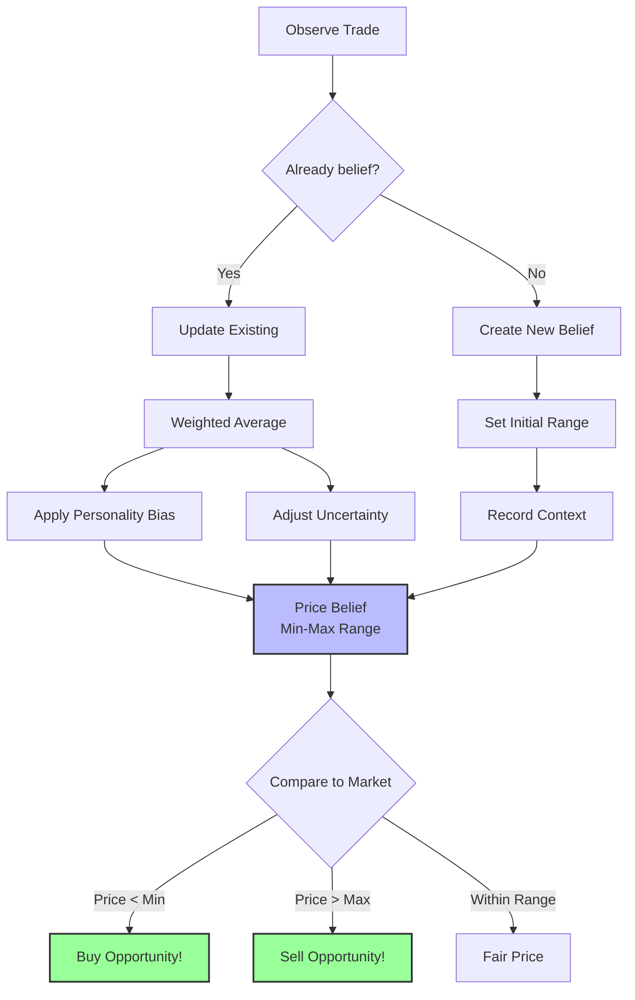
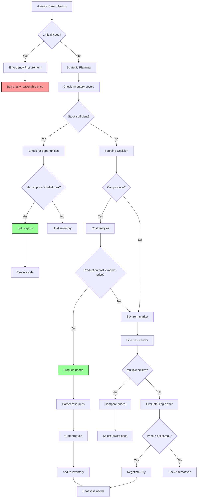
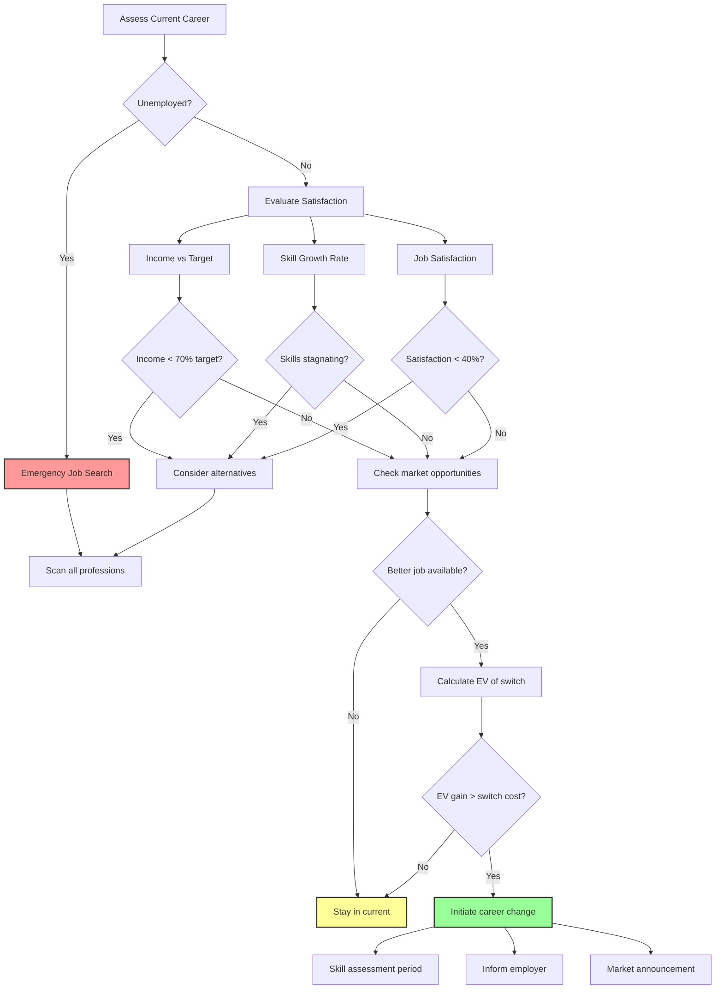

# Economic Behavior Model

**Part of**: Session 2 - AI System Design  
**File**: 02-economic-behavior.md  
**Status**: Complete

---

> **Navigation**: [Index]([AGENTS-READ-FIRST]-index.md) | [Prev: Core Architecture](01-core-ai-architecture.md) | [Next: Political & Social](03-political-social-behavior.md)
> 
> **Part of**: [Session 2 AI System Design]([AGENTS-READ-FIRST]-index.md)
> **Requires**: [Session 1 Architecture](../session-1-technical-architecture/)
> **Informs**: [Future Sessions] (Session 3-7 planning not yet started)

---

## 4. Economic Behavior Model

### Price Belief Formation

Agents form beliefs about fair market prices through observation and experience, creating diverse pricing expectations that drive market dynamics.



#### Price Belief Data Structure

```csharp
public struct PriceBelief
{
    public ushort itemId;          // What item
    public float meanPrice;        // Expected fair price
    public float uncertainty;      // Price range (±uncertainty)
    public float minPrice;         // Won't pay more than this
    public float maxPrice;         // Won't sell for less than this
    public byte observationCount;  // How many observations
    public DateTime lastUpdated;   // Last observation time
    public float confidence;       // 0-1 certainty in belief
}
```

#### Belief Update Algorithm

When an agent observes a transaction or market listing:

```csharp
public void UpdatePriceBelief(Agent agent, ushort itemId, float observedPrice)
{
    var belief = agent.economy.GetBelief(itemId);
    
    if (belief == null)
    {
        // Create initial belief
        belief = new PriceBelief
        {
            itemId = itemId,
            meanPrice = observedPrice,
            uncertainty = observedPrice * 0.3f, // 30% initial uncertainty
            observationCount = 1,
            lastUpdated = DateTime.Now,
            confidence = 0.3f
        };
    }
    else
    {
        // Calculate recency weight
        float hoursSinceUpdate = (DateTime.Now - belief.lastUpdated).TotalHours;
        float recencyDecay = Mathf.Exp(-hoursSinceUpdate / 24f); // Decay over 24 hours
        
        // Base weight depends on observation count
        float baseWeight = Mathf.Min(belief.observationCount / 10f, 0.7f);
        
        // Personality: Openness = more willing to update beliefs
        float opennessFactor = 1.0f + (agent.traits.openness - 50) * 0.01f;
        
        // Neuroticism = more cautious about price changes
        float neuroticismFactor = 1.0f - (agent.traits.neuroticism - 50) * 0.005f;
        
        float memoryWeight = baseWeight * recencyDecay * opennessFactor * neuroticismFactor;
        memoryWeight = Mathf.Clamp(memoryWeight, 0.3f, 0.9f);
        
        float observationWeight = 1.0f - memoryWeight;
        
        // Update mean price (weighted average)
        float oldMean = belief.meanPrice;
        belief.meanPrice = (oldMean * memoryWeight) + (observedPrice * observationWeight);
        
        // Update uncertainty (decreases with more observations)
        float priceVariance = Mathf.Abs(observedPrice - oldMean);
        belief.uncertainty = (belief.uncertainty * memoryWeight) + (priceVariance * observationWeight);
        belief.uncertainty = Mathf.Max(belief.uncertainty, belief.meanPrice * 0.1f); // Min 10% uncertainty
        
        // Update min/max bounds
        belief.minPrice = belief.meanPrice - belief.uncertainty;
        belief.maxPrice = belief.meanPrice + belief.uncertainty;
        
        // Increase observation count (capped at 100)
        belief.observationCount = (byte)Mathf.Min(belief.observationCount + 1, 100);
        
        // Update confidence
        belief.confidence = Mathf.Min(belief.observationCount / 20f, 0.95f);
        belief.lastUpdated = DateTime.Now;
    }
    
    // Apply personality bias to bounds
    ApplyPersonalityBias(agent, belief);
    
    agent.economy.SetBelief(belief);
}
```

#### Personality Bias Application

Different personalities interpret prices differently:

```csharp
public void ApplyPersonalityBias(Agent agent, PriceBelief belief)
{
    // Greed: Wants to pay less, sell for more
    float greedFactor = (agent.traits.greed - 50) * 0.002f; // ±10% at extremes
    
    // Optimists think prices will go up (buy now, hold out when selling)
    // Pessimists think prices will go down (wait to buy, sell now)
    float neuroticismBias = (agent.traits.neuroticism - 50) * 0.001f;
    
    // Buying bias (what agent considers "fair" to pay)
    float buyBias = 1.0f - greedFactor + neuroticismBias;
    belief.minPrice *= buyBias;
    
    // Selling bias (what agent considers "fair" to receive)
    float sellBias = 1.0f + greedFactor - neuroticismBias;
    belief.maxPrice *= sellBias;
    
    // Conscientiousness: More disciplined about price discipline
    if (agent.traits.conscientiousness > 70)
    {
        // Tighter spreads for high-conscientiousness agents
        belief.uncertainty *= 0.8f;
    }
}
```

#### Belief Decay and Uncertainty

Beliefs become less certain over time without observations:

```csharp
public void DecayPriceBeliefs(Agent agent, float deltaTimeHours)
{
    foreach (var belief in agent.economy.priceBeliefs)
    {
        // Uncertainty grows with time
        float decayRate = 0.02f * deltaTimeHours; // 2% per hour
        belief.uncertainty *= (1.0f + decayRate);
        
        // Max uncertainty cap (300% of mean)
        belief.uncertainty = Mathf.Min(belief.uncertainty, belief.meanPrice * 3.0f);
        
        // Confidence decays
        belief.confidence *= (1.0f - decayRate * 0.5f);
        
        // Update bounds
        belief.minPrice = belief.meanPrice - belief.uncertainty;
        belief.maxPrice = belief.meanPrice + belief.uncertainty;
    }
}
```

#### Trading Decision Based on Beliefs

Agents use beliefs to identify trading opportunities:

```csharp
public TradingDecision EvaluateTrade(Agent agent, ushort itemId, float offeredPrice, bool isBuying)
{
    var belief = agent.economy.GetBelief(itemId);
    
    if (belief == null || belief.confidence < 0.2f)
    {
        // No strong belief - accept if price seems reasonable
        return new TradingDecision { action = TradingAction.Accept, confidence = 0.5f };
    }
    
    if (isBuying)
    {
        // Buying: Want price below our max willingness to pay
        if (offeredPrice <= belief.minPrice)
        {
            // Great deal! Below our minimum expectation
            return new TradingDecision { action = TradingAction.Accept, urgency = TradeUrgency.High };
        }
        else if (offeredPrice <= belief.meanPrice)
        {
            // Fair deal, within acceptable range
            return new TradingDecision { action = TradingAction.Accept, urgency = TradeUrgency.Normal };
        }
        else if (offeredPrice <= belief.maxPrice)
        {
            // Expensive but not outrageous
            // Consider need urgency
            float needUrgency = GetNeedUrgency(agent, itemId);
            if (needUrgency > 0.7f)
                return new TradingDecision { action = TradingAction.Accept, urgency = TradeUrgency.Reluctant };
            else
                return new TradingDecision { action = TradingAction.Negotiate };
        }
        else
        {
            // Way too expensive
            return new TradingDecision { action = TradingAction.Reject };
        }
    }
    else // Selling
    {
        // Selling: Want price above our minimum willingness to accept
        if (offeredPrice >= belief.maxPrice)
        {
            // Great deal! Above our maximum expectation
            return new TradingDecision { action = TradingAction.Accept, urgency = TradeUrgency.High };
        }
        else if (offeredPrice >= belief.meanPrice)
        {
            // Fair deal
            return new TradingDecision { action = TradingAction.Accept, urgency = TradeUrgency.Normal };
        }
        else if (offeredPrice >= belief.minPrice)
        {
            // Below ideal but acceptable
            // Consider urgency to sell
            float surplusUrgency = GetSurplusUrgency(agent, itemId);
            if (surplusUrgency > 0.6f)
                return new TradingDecision { action = TradingAction.Accept, urgency = TradeUrgency.Reluctant };
            else
                return new TradingDecision { action = TradingAction.Negotiate };
        }
        else
        {
            // Way too low
            return new TradingDecision { action = TradingAction.Reject };
        }
    }
}
```

#### Market Discovery

Agents actively seek price information:

```csharp
public void SeekPriceInformation(Agent agent)
{
    // Check which items we need beliefs for
    var itemsOfInterest = GetItemsOfInterest(agent);
    
    foreach (var itemId in itemsOfInterest)
    {
        var belief = agent.economy.GetBelief(itemId);
        
        // If belief is stale or low confidence, seek info
        if (belief == null || belief.confidence < 0.4f)
        {
            // Option 1: Visit market and observe
            agent.goals.QueueGoal(new VisitMarketGoal(itemId));
            
            // Option 2: Ask friends
            var knowledgeableFriend = agent.social.friends
                .Where(f => f.economy.HasRecentBelief(itemId))
                .FirstOrDefault();
            
            if (knowledgeableFriend != null && agent.traits.trust > 50)
            {
                agent.goals.QueueGoal(new AskPriceGoal(knowledgeableFriend, itemId));
            }
        }
    }
}
```

**Price Information Gossip**:
```csharp
public void SharePriceInfo(Agent speaker, Agent listener, ushort itemId)
{
    var belief = speaker.economy.GetBelief(itemId);
    if (belief == null || belief.confidence < 0.5f) return;
    
    // Trust affects whether listener believes the info
    float trust = listener.social.GetRelationship(speaker.id).trust;
    float credibility = trust / 100f;
    
    // Update listener's belief (weighted by credibility)
    listener.economy.UpdatePriceBelief(itemId, belief.meanPrice, credibility);
    
    // Create memory
    listener.memory.AddToShortTerm(new Memory(
        $"{speaker.name} told me {itemId} costs around {belief.meanPrice}",
        importance: (byte)(30 * credibility),
        emotionalValence: 0
    ));
}
```

**Example Price Belief Evolution**:

**Agent: Sarah the Carpenter (Greed: 65, Openness: 45)**

**Day 1**: Observes lumber selling for 10 credits
- Initial belief: Mean=10, Uncertainty=3, Min=7, Max=13, Confidence=0.3

**Day 3**: Observes lumber selling for 12 credits
- Update: Memory weight 0.5 (2 observations), Observation weight 0.5
- New mean: (10×0.5 + 12×0.5) = 11
- New uncertainty: (3×0.5 + 2×0.5) = 2.5
- Observation count: 2, Confidence: 0.4

**With Greed Bias (65 = +15% greed)**:
- Min price (what she'll pay): 7 × 0.85 = 5.95
- Max price (what she'll accept): 13 × 1.15 = 14.95

**Result**: Sarah thinks fair price is 11, but she's biased to:
- Buy only if price ≤ 5.95 (looking for bargains)
- Sell only if price ≥ 14.95 (holding out for premium)
- This creates realistic price spread in market

### Trading Strategy

Agents engage in multi-stage economic decision-making: assessing needs, sourcing goods (produce vs. buy), managing inventory, and selling surplus.



#### Needs Assessment Algorithm

Agents continuously evaluate resource requirements:

```csharp
public class NeedsAssessment
{
    public List<ResourceNeed> CalculateNeeds(Agent agent)
    {
        var needs = new List<ResourceNeed>();
        
        // 1. Survival needs (highest priority)
        if (agent.state.hunger > 60)
        {
            needs.Add(new ResourceNeed
            {
                itemId = ItemType.Food,
                quantity = CalculateFoodNeed(agent),
                urgency = Urgency.Critical,
                maxPrice = agent.credits * 0.5f // Willing to spend 50% of money on food when hungry
            });
        }
        
        // 2. Tool durability (work equipment)
        foreach (var tool in agent.inventory.GetTools())
        {
            if (tool.durability < 0.2f) // Tool about to break
            {
                needs.Add(new ResourceNeed
                {
                    itemId = tool.itemId,
                    quantity = 1,
                    urgency = Urgency.High,
                    maxPrice = agent.economy.GetBelief(tool.itemId)?.meanPrice * 1.2f ?? 100f
                });
            }
        }
        
        // 3. Input materials for profession
        var profession = agent.economy.career.profession;
        var requiredInputs = profession.GetRequiredInputs();
        foreach (var input in requiredInputs)
        {
            var currentStock = agent.inventory.Count(input.itemId);
            var optimalStock = input.optimalStock;
            
            if (currentStock < optimalStock * 0.3f) // Below 30% of optimal
            {
                needs.Add(new ResourceNeed
                {
                    itemId = input.itemId,
                    quantity = optimalStock - currentStock,
                    urgency = Urgency.Medium,
                    maxPrice = CalculateMaxInputPrice(agent, input)
                });
            }
        }
        
        // 4. Investment/stockpiling (low greed = more stockpiling)
        if (agent.traits.greed < 40 && agent.economy.credits > 200)
        {
            var stockpileItems = GetStockpileOpportunities(agent);
            needs.AddRange(stockpileItems);
        }
        
        return needs.OrderByDescending(n => n.urgency).ToList();
    }
    
    private float CalculateMaxInputPrice(Agent agent, InputRequirement input)
    {
        // Calculate break-even price
        var productBelief = agent.economy.GetBelief(input.productId);
        if (productBelief == null) return float.MaxValue;
        
        float expectedProductPrice = productBelief.meanPrice;
        float breakEvenInputPrice = expectedProductPrice * input.inputRatio;
        
        // High work ethic agents accept lower margins
        float marginRequirement = 1.0f + (0.3f - (agent.traits.workEthic - 50) * 0.005f);
        
        return breakEvenInputPrice / marginRequirement;
    }
}
```

#### Production vs. Purchase Decision

Agents decide whether to make or buy based on cost analysis:

```csharp
public SourcingDecision DecideSourcingMethod(Agent agent, ResourceNeed need)
{
    // Option 1: Buy from market
    var marketBelief = agent.economy.GetBelief(need.itemId);
    float marketCost = float.MaxValue;
    
    if (marketBelief != null)
    {
        marketCost = marketBelief.meanPrice * need.quantity;
    }
    
    // Option 2: Produce (if agent has skill)
    float productionCost = float.MaxValue;
    bool canProduce = false;
    
    var recipe = CraftingSystem.GetRecipe(need.itemId);
    if (recipe != null && agent.skills.HasSkill(recipe.requiredSkill))
    {
        canProduce = true;
        
        // Calculate input costs
        productionCost = 0;
        foreach (var ingredient in recipe.ingredients)
        {
            var ingredientBelief = agent.economy.GetBelief(ingredient.itemId);
            float ingredientPrice = ingredientBelief?.meanPrice ?? 50f;
            productionCost += ingredientPrice * ingredient.quantity;
        }
        
        // Add labor cost (opportunity cost)
        float timeRequired = recipe.craftingTime / agent.skills.GetLevel(recipe.requiredSkill);
        float hourlyWorth = agent.economy.career.hourlyIncomeTarget;
        productionCost += timeRequired * hourlyWorth;
    }
    
    // Option 3: Gather raw (if resource exists in world)
    float gatheringCost = float.MaxValue;
    bool canGather = false;
    
    if (ResourceNodes.Exists(need.itemId))
    {
        canGather = true;
        var nearestNode = ResourceNodes.FindNearest(agent.position, need.itemId);
        if (nearestNode != null)
        {
            float travelTime = Pathfinder.EstimateTime(agent.position, nearestNode.position);
            float gatheringTime = nearestNode.gatheringTime;
            gatheringCost = (travelTime + gatheringTime) * agent.economy.career.hourlyWorth;
        }
    }
    
    // Personality modifiers
    // High work ethic prefers production
    if (agent.traits.workEthic > 60 && canProduce)
        productionCost *= 0.9f;
    
    // High greed prefers cheapest option regardless
    // High excitement-seeking might prefer gathering (adventure)
    if (agent.traits.excitementSeeking > 70 && canGather)
        gatheringCost *= 0.8f;
    
    // Select best option
    var options = new List<(SourcingMethod method, float cost)>
    {
        (SourcingMethod.Buy, marketCost),
        (SourcingMethod.Produce, productionCost),
        (SourcingMethod.Gather, gatheringCost)
    }.Where(o => o.cost < float.MaxValue).OrderBy(o => o.cost).ToList();
    
    if (options.Count == 0)
        return new SourcingDecision { method = SourcingMethod.None, reason = "No viable sourcing method" };
    
    var best = options[0];
    return new SourcingDecision
    {
        method = best.method,
        estimatedCost = best.cost,
        alternativeCost = options.Count > 1 ? options[1].cost : best.cost,
        savings = options.Count > 1 ? options[1].cost - best.cost : 0
    };
}
```

#### Market Search and Vendor Selection

When buying, agents seek the best available price:

```csharp
public Vendor SelectVendor(Agent buyer, ushort itemId, float maxPrice)
{
    // Get all available vendors
    var vendors = Market.GetVendorsSelling(itemId)
        .Where(v => v.price <= maxPrice)
        .Where(v => v.stock >= buyer.needs.MinQuantity)
        .ToList();
    
    if (vendors.Count == 0)
        return null;
    
    if (vendors.Count == 1)
        return vendors[0]; // Only one option
    
    // Score each vendor
    var scoredVendors = vendors.Select(v => new
    {
        Vendor = v,
        Score = CalculateVendorScore(buyer, v)
    }).OrderByDescending(v => v.Score).ToList();
    
    // Weighted random selection among top 3
    var topVendors = scoredVendors.Take(3).ToList();
    float totalWeight = topVendors.Sum(v => v.Score);
    float random = buyer.random.Range(0, totalWeight);
    
    float cumulative = 0;
    foreach (var v in topVendors)
    {
        cumulative += v.Score;
        if (random <= cumulative)
            return v.Vendor;
    }
    
    return topVendors[0].Vendor;
}

public float CalculateVendorScore(Agent buyer, Vendor vendor)
{
    float score = 1.0f;
    
    // Price factor (lower is better)
    var belief = buyer.economy.GetBelief(vendor.itemId);
    float expectedPrice = belief?.meanPrice ?? vendor.price;
    float priceAdvantage = (expectedPrice - vendor.price) / expectedPrice;
    score *= (1.0f + priceAdvantage * 2); // 10% cheaper = 20% score bonus
    
    // Relationship factor
    var relationship = buyer.social.GetRelationship(vendor.ownerId);
    if (relationship != null)
    {
        score *= (1.0f + relationship.trust * 0.01f); // +1% per trust point
    }
    
    // Distance factor (closer is better)
    float distance = Vector3.Distance(buyer.position, vendor.location);
    float distancePenalty = Mathf.Min(distance / 100f, 0.5f); // Max 50% penalty
    score *= (1.0f - distancePenalty);
    
    // Convenience (one-stop shopping)
    int otherNeededItems = buyer.needs.Count(n => vendor.stock.Contains(n.itemId));
    score *= (1.0f + otherNeededItems * 0.1f); // +10% per additional needed item
    
    return score;
}
```

#### Inventory Management

Agents manage inventory to balance availability and capital efficiency:

```csharp
public class InventoryManager
{
    public void RebalanceInventory(Agent agent)
    {
        foreach (var item in agent.inventory.GetTradeableItems())
        {
            var optimal = CalculateOptimalStock(agent, item.itemId);
            var current = item.quantity;
            
            if (current > optimal.max)
            {
                // Sell surplus
                int surplus = current - optimal.target;
                agent.economy.QueueForSale(item.itemId, surplus);
            }
            else if (current < optimal.min)
            {
                // Acquire more
                int needed = optimal.target - current;
                agent.needs.Add(new ResourceNeed
                {
                    itemId = item.itemId,
                    quantity = needed,
                    urgency = Urgency.Low
                });
            }
        }
        
        // Emergency liquidity
        if (agent.credits < 50 && agent.traits.greed < 60)
        {
            // Sell non-essential items
            var sellable = agent.inventory.GetNonEssentialItems()
                .OrderBy(i => i.importanceToAgent)
                .FirstOrDefault();
            
            if (sellable != null)
            {
                agent.economy.QueueForSale(sellable.itemId, sellable.quantity / 2);
            }
        }
    }
    
    private OptimalStock CalculateOptimalStock(Agent agent, ushort itemId)
    {
        // Base on consumption rate
        float dailyConsumption = GetDailyConsumption(agent, itemId);
        
        // Safety stock (higher for cautious agents)
        float safetyMultiplier = 1.0f + (agent.traits.neuroticism - 50) * 0.02f;
        int safetyStock = (int)(dailyConsumption * 3 * safetyMultiplier); // 3 days buffer
        
        // Economic order quantity (EOQ)
        float orderCost = 10f; // Fixed cost per purchase trip
        float holdingCost = 0.01f; // 1% per day carrying cost
        float annualDemand = dailyConsumption * 365;
        float eoq = Mathf.Sqrt((2 * annualDemand * orderCost) / holdingCost);
        
        return new OptimalStock
        {
            min = safetyStock,
            target = (int)eoq,
            max = (int)(eoq * 1.5f)
        };
    }
}
```

#### Transaction Execution

When a trade is agreed upon:

```csharp
public void ExecuteTrade(Agent buyer, Agent seller, ushort itemId, int quantity, float price)
{
    // Verify preconditions
    if (!buyer.inventory.CanAfford(price))
        throw new TradeException("Buyer cannot afford");
    
    if (seller.inventory.Count(itemId) < quantity)
        throw new TradeException("Seller insufficient stock");
    
    // Transfer credits
    buyer.credits -= price;
    seller.credits += price;
    
    // Transfer items
    var items = seller.inventory.Remove(itemId, quantity);
    buyer.inventory.Add(items);
    
    // Update beliefs
    float unitPrice = price / quantity;
    buyer.economy.UpdatePriceBelief(itemId, unitPrice);
    seller.economy.UpdatePriceBelief(itemId, unitPrice);
    
    // Record transaction
    var transaction = new Transaction
    {
        buyerId = buyer.id,
        sellerId = seller.id,
        itemId = itemId,
        quantity = quantity,
        price = price,
        timestamp = DateTime.Now,
        location = buyer.position
    };
    
    Market.RecordTransaction(transaction);
    buyer.economy.recentTransactions.Add(transaction);
    seller.economy.recentTransactions.Add(transaction);
    
    // Create memories
    var importance = (byte)Mathf.Min(50 + (int)(price / 10), 100);
    buyer.memory.AddToShortTerm(new Memory(
        $"Bought {quantity} {itemId} from {seller.name} for {price} credits",
        importance: importance,
        emotionalValence: (sbyte)(price < buyer.economy.GetBelief(itemId).meanPrice ? 20 : -10)
    ));
    
    seller.memory.AddToShortTerm(new Memory(
        $"Sold {quantity} {itemId} to {buyer.name} for {price} credits",
        importance: importance,
        emotionalValence: (sbyte)(price > seller.economy.GetBelief(itemId).meanPrice ? 20 : -10)
    ));
    
    // Update relationship
    buyer.social.RecordTransaction(seller.id, price);
    seller.social.RecordTransaction(buyer.id, price);
}
```

#### Trading Examples

**Example 1: Hungry Laborer**
- Needs: Food (urgency: Critical)
- Credits: 30
- Belief: Food should cost ~5 credits
- Market price: 8 credits
- **Decision**: Buy at 8 (overpaying because hungry), grumbling about high prices

**Example 2: Merchant Restocking**
- Needs: Iron ingots for tools
- Can produce (has smithing skill) or buy
- Production cost: 60 credits (materials + time)
- Market price: 50 credits
- **Decision**: Buy from market (cheaper), update price belief to ~50

**Example 3: Cautious Stockpiler**
- Current food: 10 units
- Optimal stock (neuroticism=70): 30 units
- **Decision**: Buy 20 units even though not immediately hungry (fear of shortage)

### Career Specialization Decision

Agents choose and switch careers based on expected income, skill aptitude, market demand, and personal satisfaction. Career decisions are major life choices with significant switching costs.



#### Career Evaluation Algorithm

Agents periodically evaluate their career (every 7 days):

```csharp
public CareerEvaluation EvaluateCurrentCareer(Agent agent)
{
    var career = agent.economy.career;
    var evaluation = new CareerEvaluation();
    
    // 1. Income assessment
    float avgIncome = agent.economy.recentTransactions
        .Where(t => t.timestamp > DateTime.Now.AddDays(-7))
        .Where(t => t.sellerId == agent.id)
        .Sum(t => t.price) / 7f;
    
    evaluation.incomeSatisfaction = avgIncome / agent.economy.incomeTarget;
    
    // 2. Skill growth assessment
    var primarySkill = career.primarySkill;
    float skillGrowth = agent.skills.GetGrowthRate(primarySkill);
    evaluation.skillGrowthSatisfaction = skillGrowth / career.expectedSkillGrowth;
    
    // 3. Job satisfaction (personality fit)
    float personalityFit = CalculatePersonalityFit(agent, career.profession);
    float workConditions = career.workEnvironmentQuality;
    evaluation.jobSatisfaction = (personalityFit * 0.6f) + (workConditions * 0.4f);
    
    // 4. Market demand
    evaluation.marketDemand = Market.GetDemandFor(career.profession.outputItemId);
    
    // 5. Overall career health
    evaluation.overallScore = (
        evaluation.incomeSatisfaction * 0.4f +
        evaluation.skillGrowthSatisfaction * 0.2f +
        evaluation.jobSatisfaction * 0.25f +
        evaluation.marketDemand * 0.15f
    );
    
    return evaluation;
}

public float CalculatePersonalityFit(Agent agent, Profession profession)
{
    float fit = 0.5f; // Baseline
    
    // Each profession has ideal personality profile
    switch (profession.type)
    {
        case ProfessionType.Miner:
            fit += (agent.traits.workEthic - 50) * 0.01f; // + for high work ethic
            fit += (agent.traits.excitementSeeking - 50) * 0.005f; // Slight + for adventure
            fit -= (agent.traits.gregariousness - 50) * 0.01f; // - for high social need (isolated work)
            break;
            
        case ProfessionType.Merchant:
            fit += (agent.traits.greed - 50) * 0.015f; // + for high greed
            fit += (agent.traits.gregariousness - 50) * 0.01f; // + for social
            fit += (agent.traits.openness - 50) * 0.005f; // + for adaptability
            break;
            
        case ProfessionType.Craftsman:
            fit += (agent.traits.workEthic - 50) * 0.01f;
            fit += (agent.traits.openness - 50) * 0.008f; // Creativity
            fit -= (agent.traits.excitementSeeking - 50) * 0.01f; // - for boredom with routine
            break;
            
        case ProfessionType.Farmer:
            fit += (agent.traits.conscientiousness - 50) * 0.01f;
            fit += (agent.traits.tradition - 50) * 0.008f;
            fit -= (agent.traits.excitementSeeking - 50) * 0.015f; // Farming is routine
            break;
    }
    
    return Mathf.Clamp01(fit);
}
```

## Career Systems

### Career Selection Overview

Agents evaluate career options based on personality fit, economic opportunity, and social factors. The career system integrates with the economic behavior model to create believable professional development.

#### Alternative Career Analysis

When considering a switch, agents evaluate alternatives:

```csharp
public List<CareerOption> EvaluateAlternatives(Agent agent)
{
    var options = new List<CareerOption>();
    
    foreach (var profession in Profession.All)
    {
        // Skip current profession
        if (profession == agent.economy.career.profession) continue;
        
        var option = new CareerOption
        {
            profession = profession,
            
            // 1. Expected income
            marketPrice = Market.GetAveragePrice(profession.outputItemId),
            productionRate = profession.baseProductionRate,
            expectedDailyIncome = marketPrice * productionRate,
            
            // 2. Skill transfer
            existingSkillLevel = agent.skills.GetLevel(profession.primarySkill),
            skillTransferBonus = CalculateSkillTransfer(agent, profession),
            
            // 3. Learning curve
            timeToCompetence = (10 - existingSkillLevel) * profession.learningDifficulty,
            incomeDuringLearning = expectedDailyIncome * (existingSkillLevel / 10f),
            
            // 4. Startup costs
            toolCost = profession.requiredTools.Sum(t => Market.GetPrice(t.itemId)),
            materialCost = profession.dailyMaterialCost,
            
            // 5. Personality fit
            personalityFit = CalculatePersonalityFit(agent, profession),
            
            // 6. Market demand
            marketDemand = Market.GetDemandFor(profession.outputItemId),
            competitionLevel = Market.GetSellerCount(profession.outputItemId)
        };
        
        // Calculate EV (Expected Value)
        float learningPhaseEV = option.incomeDuringLearning * option.timeToCompetence;
        float competentPhaseEV = option.expectedDailyIncome * 30; // 30 days
        float totalCost = option.toolCost + (option.materialCost * option.timeToCompetence);
        
        option.expectedValue = (learningPhaseEV + competentPhaseEV - totalCost) * option.personalityFit * option.marketDemand;
        option.switchCost = totalCost + (agent.economy.career.seniority * 10); // Lose seniority
        
        option.netValue = option.expectedValue - option.switchCost;
        
        options.Add(option);
    }
    
    return options.OrderByDescending(o => o.netValue).ToList();
}
```

#### Career Switch Decision

Agents decide whether to switch based on net value analysis:

```csharp
public bool ShouldSwitchCareer(Agent agent, CareerOption alternative)
{
    var current = EvaluateCurrentCareer(agent);
    
    // Current career EV (next 30 days)
    float currentEV = agent.economy.career.averageDailyIncome * 30 * current.jobSatisfaction;
    
    // Alternative EV
    float alternativeEV = alternative.expectedValue;
    
    // Switch cost
    float switchCost = alternative.switchCost;
    
    // Net gain
    float netGain = alternativeEV - currentEV - switchCost;
    
    // Decision thresholds (personality-based)
    float riskTolerance = agent.traits.bravery * 0.01f; // 0.5 to 1.0
    float requiredReturn = 1.2f - (riskTolerance * 0.2f); // Risk-takers need less return
    
    // High work ethic = more willing to endure current career
    if (agent.traits.workEthic > 70)
        requiredReturn += 0.1f;
    
    // High neuroticism = less willing to switch (fear of change)
    if (agent.traits.neuroticism > 70)
        requiredReturn += 0.15f;
    
    // Decision
    return netGain > (currentEV * (requiredReturn - 1f));
}

public void ExecuteCareerSwitch(Agent agent, CareerOption newCareer)
{
    // 1. Purchase required tools
    foreach (var tool in newCareer.profession.requiredTools)
    {
        if (!agent.inventory.Has(tool.itemId))
        {
            var vendor = FindVendor(agent, tool.itemId);
            if (vendor != null)
            {
                ExecuteTrade(agent, vendor.owner, tool.itemId, 1, vendor.price);
            }
        }
    }
    
    // 2. Update career
    var oldCareer = agent.economy.career;
    agent.economy.career = new Career
    {
        profession = newCareer.profession,
        startDate = DateTime.Now,
        hourlyIncomeTarget = newCareer.expectedDailyIncome / 8f, // 8 hour work day
        previousCareer = oldCareer.profession.name
    };
    
    // 3. Create memories
    agent.memory.AddToShortTerm(new Memory(
        $"Switched career from {oldCareer.profession.name} to {newCareer.profession.name}",
        importance: 80,
        emotionalValence: (sbyte)(newCareer.personalityFit > 0.7 ? 40 : 10)
    ));
    
    // 4. Announce to community (for gossip)
    GossipSystem.Announce($"{agent.name} has become a {newCareer.profession.name}");
    
    // 5. Log for analytics
    Analytics.RecordCareerChange(agent, oldCareer, agent.economy.career, newCareer.netValue);
}
```

#### Career Progression

Within a career, agents advance based on skill and performance:

```csharp
public void AdvanceCareer(Agent agent)
{
    var career = agent.economy.career;
    
    // Check for promotion
    if (career.skillLevel > career.currentTier.requiredSkill + 10)
    {
        var nextTier = career.profession.GetNextTier(career.currentTier);
        if (nextTier != null)
        {
            // Apply for promotion
            career.Promote(nextTier);
            
            agent.memory.AddToShortTerm(new Memory(
                $"Promoted to {nextTier.title} in {career.profession.name}",
                importance: 70,
                emotionalValence: 50
            ));
        }
    }
    
    // Check for specialization
    if (career.yearsInProfession > 2 && agent.traits.openness > 60)
    {
        var specializations = career.profession.GetSpecializations();
        var bestFit = specializations.OrderByDescending(s => CalculatePersonalityFit(agent, s)).First();
        
        if (CalculatePersonalityFit(agent, bestFit) > 0.8f)
        {
            career.Specialize(bestFit);
        }
    }
}
```

**Career Switching Costs**:

| Cost Type | Amount | Notes |
|-----------|--------|-------|
| **Tool Investment** | 50-500 credits | New profession equipment |
| **Learning Period** | 7-30 days | Reduced income while learning |
| **Seniority Loss** | Varies | Lose accumulated benefits |
| **Social Capital** | Moderate | May leave professional network |
| **Psychological** | High for some | Stress of change (neuroticism) |

**Example Career Decision**:

**Agent: Tom the Miner**
- Current: Mining (income: 40/day, satisfaction: 0.6, skills stagnating)
- Alternative: Smithing
  - Expected income: 60/day
  - Tool cost: 200 credits
  - Learning time: 14 days at 30/day
  - Personality fit: 0.75
  - Market demand: 0.8
  - EV: (30×14 + 60×30) × 0.75 × 0.8 = 1332
  - Switch cost: 200 + (40×14) = 760
  - Net gain: 1332 - (40×30) - 760 = 92
- **Decision**: Switch (modest positive gain + better personality fit)

## Recipe System Data Structures

### Overview
AI agents use recipe data to make economic decisions: what to produce, whether to buy or craft, and how to evaluate production costs.

### Core Data Structures

```csharp
// Recipe Definition
public class Recipe {
    public int Id { get; set; }
    public string Name { get; set; }
    public RecipeCategory Category { get; set; }
    public List<Ingredient> Ingredients { get; set; }
    public Product Output { get; set; }
    
    // Production requirements
    public float BaseProductionTime { get; set; } // In seconds
    public SkillType RequiredSkill { get; set; }
    public int MinSkillLevel { get; set; }
    public ToolType? RequiredTool { get; set; }
    public CraftingStationType? RequiredStation { get; set; }
    
    // Economic properties
    public bool CanMassProduce { get; set; }
    public int MaxBatchSize { get; set; }
    public float BatchEfficiency { get; set; } // Time multiplier for batches
    
    // AI evaluation properties
    public float BaseDemand { get; set; } // 0-1, how commonly needed
    public List<string> Tags { get; set; } // For categorization
}

public class Ingredient {
    public ItemType Item { get; set; }
    public int Quantity { get; set; }
    public bool IsConsumed { get; set; } = true; // Tools not consumed
    public bool IsTool { get; set; } = false;
}

public class Product {
    public ItemType Item { get; set; }
    public int Quantity { get; set; }
    public int QualityLevel { get; set; } // 0-4 (Poor to Masterwork)
}
```

### Production Cost Calculation

```csharp
public class ProductionCostCalculator {
    public ProductionCost CalculateCost(Recipe recipe, Agent agent) {
        var cost = new ProductionCost();
        
        // 1. Material costs
        foreach (var ingredient in recipe.Ingredients) {
            if (ingredient.IsConsumed) {
                float ingredientPrice = agent.GetPriceBelief(ingredient.Item).MeanPrice;
                cost.MaterialCost += ingredientPrice * ingredient.Quantity;
            }
            // Tools not consumed, but must be available
        }
        
        // 2. Time cost (opportunity cost)
        float agentHourlyRate = agent.GetSkillWage(recipe.RequiredSkill);
        float productionHours = recipe.BaseProductionTime / 3600f; // Convert to hours
        
        // Apply skill speed bonus
        int skillLevel = agent.Skills.GetLevel(recipe.RequiredSkill);
        float speedMultiplier = 1.0f - (skillLevel * 0.05f); // 5% faster per level
        productionHours *= speedMultiplier;
        
        cost.TimeCost = agentHourlyRate * productionHours;
        
        // 3. Tool wear cost
        if (recipe.RequiredTool.HasValue) {
            float toolWearCost = CalculateToolWearCost(recipe, agent);
            cost.ToolWearCost = toolWearCost;
        }
        
        // 4. Fuel/station cost (if applicable)
        if (recipe.RequiredStation.HasValue) {
            float stationCost = GetStationUsageCost(recipe.RequiredStation.Value);
            cost.StationCost = stationCost;
        }
        
        // Total
        cost.TotalCost = cost.MaterialCost + cost.TimeCost + cost.ToolWearCost + cost.StationCost;
        cost.ProductionTime = productionHours;
        
        return cost;
    }
    
    private float CalculateToolWearCost(Recipe recipe, Agent agent) {
        // Tools lose durability with use
        // Cost = (ToolPrice / TotalDurability) × UsesRequired
        
        var tool = recipe.RequiredTool.Value;
        float toolPrice = agent.GetPriceBelief(tool).MeanPrice;
        int toolDurability = GetToolDurability(tool);
        
        // Each production "hits" the tool once
        float wearCost = toolPrice / toolDurability;
        
        return wearCost;
    }
}

public class ProductionCost {
    public float MaterialCost { get; set; }
    public float TimeCost { get; set; }
    public float ToolWearCost { get; set; }
    public float StationCost { get; set; }
    public float TotalCost { get; set; }
    public float ProductionTime { get; set; }
    
    // Per-unit cost
    public float CostPerUnit => TotalCost; // Assuming 1 output unit
}
```

### Make vs Buy Decision

```csharp
public class ProductionDecision {
    public bool ShouldProduce { get; set; }
    public bool ShouldBuy { get; set; }
    public Recipe? BestRecipe { get; set; }
    public float ExpectedProfit { get; set; }
    public float MarketPrice { get; set; }
    public float ProductionCost { get; set; }
}

public ProductionDecision EvaluateMakeVsBuy(ItemType item, Agent agent) {
    var decision = new ProductionDecision();
    
    // Get market price
    var priceBelief = agent.GetPriceBelief(item);
    decision.MarketPrice = priceBelief.MeanPrice;
    
    // Find best recipe
    var availableRecipes = GetRecipesForItem(item)
        .Where(r => agent.CanCraft(r)) // Has skill, tools, station
        .ToList();
    
    if (!availableRecipes.Any()) {
        // Can't craft, must buy
        decision.ShouldBuy = true;
        decision.ShouldProduce = false;
        return decision;
    }
    
    // Calculate cost for each recipe
    Recipe bestRecipe = null;
    float lowestCost = float.MaxValue;
    
    foreach (var recipe in availableRecipes) {
        var cost = CalculateCost(recipe, agent);
        if (cost.TotalCost < lowestCost) {
            lowestCost = cost.TotalCost;
            bestRecipe = recipe;
        }
    }
    
    decision.BestRecipe = bestRecipe;
    decision.ProductionCost = lowestCost;
    decision.ExpectedProfit = decision.MarketPrice - lowestCost;
    
    // Decision logic
    float profitMargin = decision.ExpectedProfit / decision.MarketPrice;
    
    if (profitMargin > 0.3f) {
        // 30%+ profit margin - definitely produce
        decision.ShouldProduce = true;
        decision.ShouldBuy = false;
    }
    else if (profitMargin > 0.1f) {
        // 10-30% margin - produce if we have time
        decision.ShouldProduce = !agent.IsBusy;
        decision.ShouldBuy = !decision.ShouldProduce;
    }
    else if (profitMargin > -0.1f) {
        // -10% to 10% - break even, prefer buy to save time
        decision.ShouldProduce = false;
        decision.ShouldBuy = true;
    }
    else {
        // >10% loss - never produce, buy if needed
        decision.ShouldProduce = false;
        decision.ShouldBuy = agent.NeedsItem(item);
    }
    
    return decision;
}
```

### Supply Chain Analysis

```csharp
public class SupplyChainNode {
    public ItemType Item { get; set; }
    public List<Recipe> ProductionMethods { get; set; }
    public List<SupplyChainNode> Dependencies { get; set; }
    public float MarketPrice { get; set; }
    public float MinimumProductionCost { get; set; }
    public bool IsRawMaterial { get; set; }
}

public class SupplyChainAnalyzer {
    public List<SupplyChainNode> BuildSupplyChain(ItemType targetItem, Agent agent) {
        var chain = new List<SupplyChainNode>();
        var visited = new HashSet<ItemType>();
        
        AnalyzeItem(targetItem, chain, visited, agent);
        
        return chain;
    }
    
    private void AnalyzeItem(ItemType item, List<SupplyChainNode> chain, HashSet<ItemType> visited, Agent agent) {
        if (visited.Contains(item)) return;
        visited.Add(item);
        
        var node = new SupplyChainNode {
            Item = item,
            MarketPrice = agent.GetPriceBelief(item).MeanPrice,
            ProductionMethods = GetRecipesForItem(item),
            Dependencies = new List<SupplyChainNode>()
        };
        
        // Find minimum production cost
        float minCost = float.MaxValue;
        foreach (var recipe in node.ProductionMethods) {
            var cost = CalculateCost(recipe, agent);
            if (cost.TotalCost < minCost) {
                minCost = cost.TotalCost;
            }
            
            // Analyze dependencies (ingredients)
            foreach (var ingredient in recipe.Ingredients.Where(i => i.IsConsumed)) {
                AnalyzeItem(ingredient.Item, chain, visited, agent);
                var depNode = chain.First(n => n.Item == ingredient.Item);
                node.Dependencies.Add(depNode);
            }
        }
        
        node.MinimumProductionCost = minCost == float.MaxValue ? 0 : minCost;
        node.IsRawMaterial = !node.ProductionMethods.Any();
        
        chain.Add(node);
    }
}
```

### Recipe Knowledge System

```csharp
public class RecipeKnowledge {
    public List<Recipe> KnownRecipes { get; set; }
    public Dictionary<int, DateTime> LearnedDates { get; set; }
    public Dictionary<int, int> TimesCrafted { get; set; }
    
    public void LearnRecipe(Recipe recipe) {
        if (!KnownRecipes.Any(r => r.Id == recipe.Id)) {
            KnownRecipes.Add(recipe);
            LearnedDates[recipe.Id] = DateTime.Now;
            TimesCrafted[recipe.Id] = 0;
        }
    }
    
    public void OnCraftSuccess(int recipeId) {
        if (TimesCrafted.ContainsKey(recipeId)) {
            TimesCrafted[recipeId]++;
        }
    }
    
    public List<Recipe> GetProfitableRecipes(Agent agent) {
        return KnownRecipes
            .Where(r => {
                var cost = CalculateCost(r, agent);
                var price = agent.GetPriceBelief(r.Output.Item).MeanPrice;
                return price > cost.TotalCost * 1.2f; // 20% profit margin
            })
            .OrderByDescending(r => {
                var cost = CalculateCost(r, agent);
                var price = agent.GetPriceBelief(r.Output.Item).MeanPrice;
                return price - cost.TotalCost;
            })
            .ToList();
    }
}
```

### Skill-Based Recipe Availability

```csharp
public bool CanCraft(Recipe recipe, Agent agent) {
    // Check skill level
    if (agent.Skills.GetLevel(recipe.RequiredSkill) < recipe.MinSkillLevel) {
        return false;
    }
    
    // Check for required tool (must have in inventory or equipped)
    if (recipe.RequiredTool.HasValue) {
        if (!agent.Inventory.HasTool(recipe.RequiredTool.Value)) {
            return false;
        }
    }
    
    // Check for station access
    if (recipe.RequiredStation.HasValue) {
        if (!agent.HasAccessToStation(recipe.RequiredStation.Value)) {
            return false;
        }
    }
    
    // Check for ingredients
    foreach (var ingredient in recipe.Ingredients) {
        if (ingredient.IsConsumed) {
            if (agent.Inventory.GetCount(ingredient.Item) < ingredient.Quantity) {
                return false;
            }
        }
        else if (ingredient.IsTool) {
            // Just need to have it, not consumed
            if (!agent.Inventory.HasItem(ingredient.Item)) {
                return false;
            }
        }
    }
    
    return true;
}
```

---
