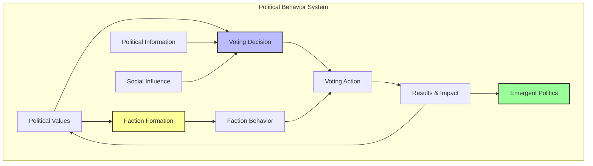
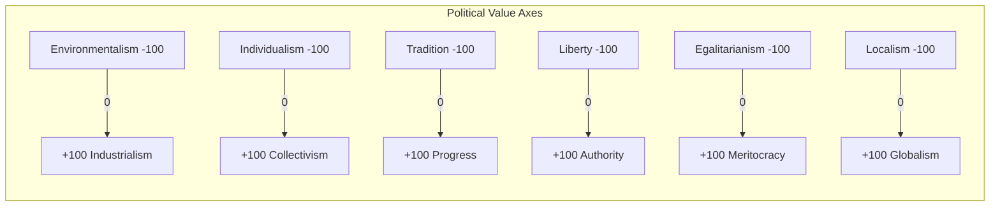
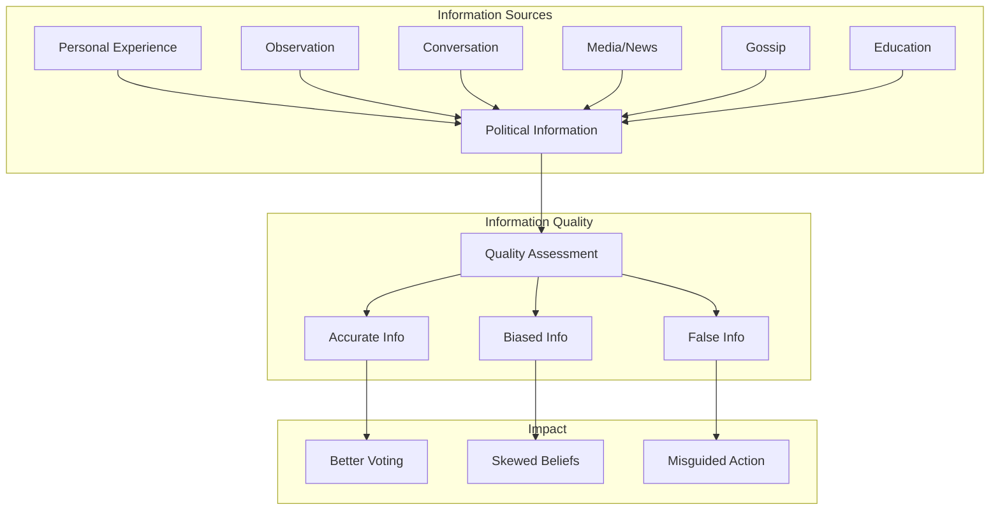
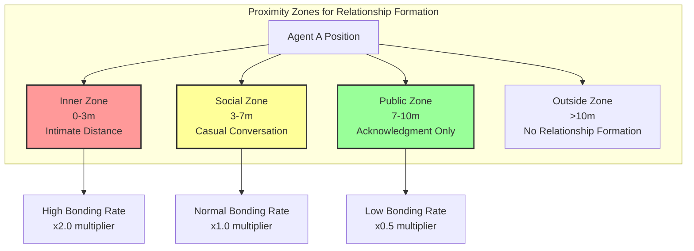
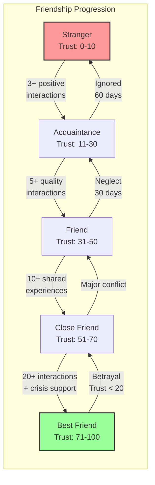
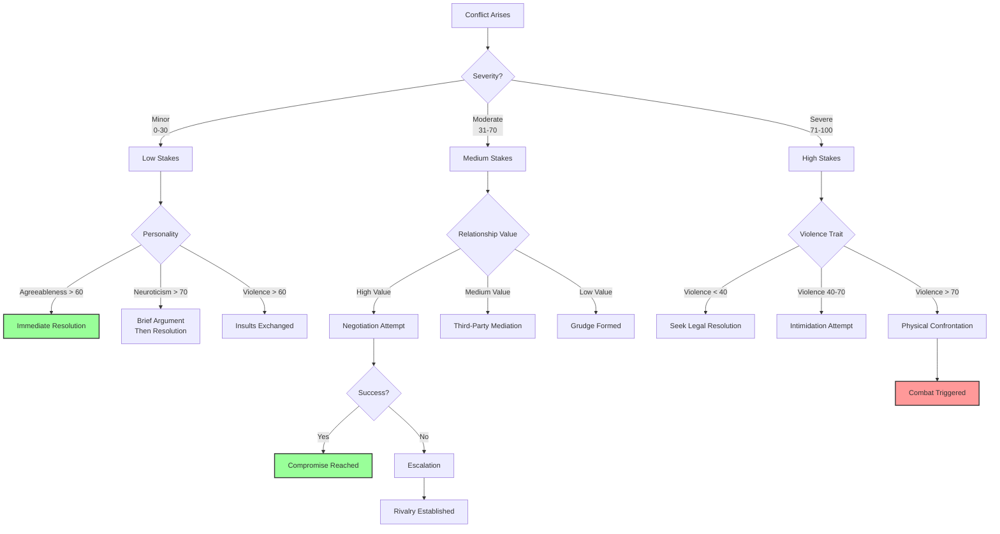

# Political & Social Behavior Models

**Part of**: Session 2 - AI System Design  
**File**: 03-political-social-behavior.md  
**Status**: Complete

---

> **Navigation**: [Index]([AGENTS-READ-FIRST]-index.md) | [Prev: Economic Behavior](02-economic-behavior.md) | [Next: Population & Personality](04-population-personality.md)
> 
> **Part of**: [Session 2 AI System Design]([AGENTS-READ-FIRST]-index.md)
> **Requires**: [Session 1 Architecture](../session-1-technical-architecture/)
> **Informs**: [Future Sessions] (Session 3-7 planning not yet started)

> **Canonical alignment (2026-07-14):** Aspirational political/social reference. Current scope is [planning/active/](../../active/) and implementation truth is [CURRENT_BUILD.md](../../../CURRENT_BUILD.md). See [PRODUCT-THESIS.md](../../PRODUCT-THESIS.md).

## Product Contract Alignment

Humans remain consequential and AI citizens hold material interests and rights, but neither LLM output nor AI citizenship has special authority. Deterministic governance validates civic commands and records outcomes; LLMs may communicate or propose from structured observations and must safely fall back when unavailable or invalid.

---

## 5. Political Behavior Model

The political behavior system creates emergent governance dynamics where agents form opinions, join factions, and participate in collective decision-making. This system integrates with the economic and social systems to create believable political landscapes.



### 5.1 Voting Decision Process

The voting decision process uses a weighted multi-factor model that considers personal interests, values alignment, social pressure, and candidate track records. This creates diverse voting patterns where different agents prioritize different factors.

#### Vote Score Formula

The core voting decision algorithm calculates a **VoteScore** for each option (candidate or law):

```
VoteScore = (personalImpact × 0.3) + (valueAlignment × 0.3) + (socialInfluence × 0.2) + (pastPerformance × 0.2)
```

**Variable Definitions:**
- `personalImpact` (0.0-1.0): How the option affects the agent's wealth, safety, and daily life
- `valueAlignment` (0.0-1.0): How well the option matches the agent's political values
- `socialInfluence` (0.0-1.0): Pressure from friends, family, and respected community members
- `pastPerformance` (0.0-1.0): Historical track record of candidates or similar policies

**Personality Modifiers:**
- High Neuroticism (+15% personalImpact weight): Anxious agents focus more on self-interest
- High Extraversion (+10% socialInfluence weight): Social agents care more about peer opinions
- High Conscientiousness (+10% pastPerformance weight): Diligent agents research track records
- High Openness (+10% valueAlignment weight): Open-minded agents prioritize ideological fit

#### Detailed Factor Calculations

**1. Personal Impact Calculation**

```csharp
public float CalculatePersonalImpact(Agent agent, VoteOption option)
{
    float impact = 0.0f;
    
    // Economic impact (wealth changes)
    float economicImpact = 0.0f;
    if (option.affectsTaxes)
    {
        float taxChange = option.taxChangeAmount;
        float income = agent.economy.averageDailyIncome * 30; // Monthly income
        float taxImpact = (taxChange / income) * 100; // As percentage of income
        
        // Normalize to 0-1 range (±20% income change = full impact)
        economicImpact = Mathf.Clamp01(Mathf.Abs(taxImpact) / 20f);
        
        // Direction matters: tax increases are negative for most
        if (taxChange > 0 && agent.economy.credits < 500)
            economicImpact *= -1.5f; // Poor agents feel tax hikes more
        else if (taxChange < 0)
            economicImpact *= 1.2f; // Tax cuts are good
    }
    
    // Profession impact (job-related effects)
    float professionImpact = 0.0f;
    if (option.affectsProfessions)
    {
        var myProfession = agent.economy.career.profession;
        if (option.benefitedProfessions.Contains(myProfession))
            professionImpact = 0.8f;
        else if (option.harmedProfessions.Contains(myProfession))
            professionImpact = -0.8f;
    }
    
    // Resource access impact
    float resourceImpact = 0.0f;
    if (option.affectsResourceAccess)
    {
        foreach (var resource in option.resourceChanges)
        {
            var need = agent.needs.GetNeed(resource.itemId);
            if (need != null)
            {
                float importance = need.urgency / 100f;
                float change = resource.availabilityChange; // -1.0 to +1.0
                resourceImpact += importance * change * 0.3f;
            }
        }
        resourceImpact = Mathf.Clamp(resourceImpact, -1f, 1f);
    }
    
    // Safety/Security impact
    float safetyImpact = 0.0f;
    if (option.affectsSafety)
    {
        safetyImpact = option.safetyChange; // -1.0 to +1.0
        // High neuroticism amplifies safety concerns
        safetyImpact *= 1.0f + (agent.traits.neuroticism - 50) * 0.01f;
    }
    
    // Combine impacts (weighted by agent priorities)
    impact = (Mathf.Abs(economicImpact) * 0.35f) + 
             (Mathf.Abs(professionImpact) * 0.25f) + 
             (Mathf.Abs(resourceImpact) * 0.25f) + 
             (Mathf.Abs(safetyImpact) * 0.15f);
    
    // Direction: positive or negative impact
    float netDirection = (economicImpact * 0.35f) + 
                         (professionImpact * 0.25f) + 
                         (resourceImpact * 0.25f) + 
                         (safetyImpact * 0.15f);
    
    // Return score: 0.5 = neutral, 1.0 = very positive, 0.0 = very negative
    return Mathf.Clamp01(0.5f + (netDirection * impact * 0.5f));
}
```

**2. Value Alignment Calculation**

```csharp
public float CalculateValueAlignment(Agent agent, VoteOption option)
{
    float alignment = 0.0f;
    int valueCount = 0;
    
    // Check each political value axis
    foreach (var valueAxis in PoliticalValues.AllAxes)
    {
        if (!option.valueImplications.ContainsKey(valueAxis)) continue;
        
        // Agent's position on this axis (-1.0 to +1.0)
        float agentPosition = agent.politicalValues.GetPosition(valueAxis);
        
        // Option's position on this axis (-1.0 to +1.0)
        float optionPosition = option.valueImplications[valueAxis];
        
        // Calculate alignment (1.0 = perfect match, 0.0 = total opposite)
        float axisAlignment = 1.0f - Mathf.Abs(agentPosition - optionPosition) / 2f;
        
        // Weight by how much agent cares about this axis
        float importance = agent.politicalValues.GetImportance(valueAxis);
        
        alignment += axisAlignment * importance;
        valueCount++;
    }
    
    if (valueCount == 0) return 0.5f; // No relevant values
    
    // Normalize
    alignment /= valueCount;
    
    // High-tradition agents care more about value alignment
    alignment *= 1.0f + (agent.traits.tradition - 50) * 0.005f;
    
    return Mathf.Clamp01(alignment);
}
```

**3. Social Influence Calculation**

```csharp
public float CalculateSocialInfluence(Agent agent, VoteOption option)
{
    float totalInfluence = 0.0f;
    float totalWeight = 0.0f;
    
    // Check influence from each social connection
    foreach (var relationship in agent.social.relationships)
    {
        var other = GetAgent(relationship.otherId);
        if (other == null) continue;
        
        // Has this person expressed an opinion?
        var opinion = other.politicalBehavior.GetOpinion(option);
        if (opinion == null) continue;
        
        // Calculate influence weight based on relationship
        float relationshipStrength = (relationship.trust + relationship.respect) / 200f;
        float influenceWeight = relationshipStrength;
        
        // Close family has stronger influence
        if (relationship.type == RelationshipType.Family)
            influenceWeight *= 1.5f;
        
        // Romantic partner has very strong influence
        if (relationship.type == RelationshipType.Romantic)
            influenceWeight *= 2.0f;
        
        // Respected community leaders have extra influence
        if (other.social.reputation > 70)
            influenceWeight *= 1.3f;
        
        // Apply influence
        float theirVoteScore = opinion.voteScore; // 0.0-1.0
        totalInfluence += theirVoteScore * influenceWeight;
        totalWeight += influenceWeight;
    }
    
    if (totalWeight == 0) return 0.5f; // No social influence available
    
    float averageInfluence = totalInfluence / totalWeight;
    
    // High agreeableness = more susceptible to social influence
    float agreeablenessMod = 1.0f + (agent.traits.agreeableness - 50) * 0.01f;
    
    // High extraversion = more influenced by social network
    float extraversionMod = 1.0f + (agent.traits.extraversion - 50) * 0.008f;
    
    // Calculate deviation from personal preference (conformity pressure)
    float personalPreference = agent.politicalBehavior.GetPersonalPreference(option);
    float conformityPressure = 1.0f - Mathf.Abs(averageInfluence - personalPreference);
    
    return Mathf.Clamp01(averageInfluence * agreeablenessMod * extraversionMod * conformityPressure);
}
```

**4. Past Performance Calculation**

```csharp
public float CalculatePastPerformance(Agent agent, VoteOption option)
{
    // For candidates: track record
    if (option.type == VoteOptionType.Candidate)
    {
        var candidate = option.candidate;
        
        // Check memories of this candidate
        var candidateMemories = agent.memory.RetrieveByParticipant(candidate.id);
        
        float positiveActions = 0;
        float negativeActions = 0;
        float totalWeight = 0;
        
        foreach (var memory in candidateMemories)
        {
            float weight = CalculateMemoryWeight(memory);
            
            if (memory.emotionalValence > 30)
                positiveActions += weight;
            else if (memory.emotionalValence < -30)
                negativeActions += weight;
            
            totalWeight += weight;
        }
        
        if (totalWeight == 0) return 0.5f; // No information
        
        float performance = positiveActions / (positiveActions + negativeActions);
        
        // High conscientiousness agents research more thoroughly
        if (agent.traits.conscientiousness > 70)
        {
            // Bonus for having more information
            float informationBonus = Mathf.Min(totalWeight / 10f, 0.1f);
            performance = Mathf.Lerp(0.5f, performance, 0.8f + informationBonus);
        }
        
        return Mathf.Clamp01(performance);
    }
    
    // For laws/policies: similar past policies
    if (option.type == VoteOptionType.Law)
    {
        // Find similar past laws
        var similarLaws = World.GetPastLaws()
            .Where(l => l.category == option.lawCategory)
            .Where(l => (DateTime.Now - l.passedDate).TotalDays < 365);
        
        float totalImpact = 0;
        int lawCount = 0;
        
        foreach (var law in similarLaws)
        {
            // Did this agent experience the effects?
            var impactMemory = agent.memory.RetrieveByType(MemoryType.PolicyImpact)
                .FirstOrDefault(m => m.payload.lawId == law.id);
            
            if (impactMemory != null)
            {
                totalImpact += impactMemory.emotionalValence / 100f; // -1.0 to +1.0
                lawCount++;
            }
        }
        
        if (lawCount == 0) return 0.5f;
        
        // Normalize to 0-1
        float avgImpact = totalImpact / lawCount;
        return Mathf.Clamp01(0.5f + avgImpact * 0.5f);
    }
    
    return 0.5f;
}
```

#### Abstention Logic

Not all agents vote. Abstention depends on apathy, barriers, and satisfaction with status quo.

```csharp
public bool ShouldAbstain(Agent agent, Election election)
{
    // Base abstention rate: 10-30% depending on civic engagement
    float baseAbstention = 0.2f;
    
    // Apathy factors
    float apathyScore = 0.0f;
    
    // Low political interest = higher apathy
    if (agent.politicalValues.politicalEngagement < 30)
        apathyScore += 0.3f;
    
    // Satisfaction with status quo = less reason to vote
    if (agent.politicalValues.statusQuoSatisfaction > 70)
        apathyScore += 0.2f;
    
    // Information barriers
    float informationBarrier = 0.0f;
    
    // Low information quality = don't feel qualified to vote
    if (agent.politicalBehavior.informationQuality < 0.4f)
        informationBarrier += 0.25f;
    
    // Distance to polling location (if physical voting)
    if (election.requiresPhysicalPresence)
    {
        float distance = Vector3.Distance(agent.position, election.pollingLocation);
        if (distance > 500) informationBarrier += 0.3f; // Far away
    }
    
    // Social factors
    float socialBarrier = 0.0f;
    
    // If friends are voting, more likely to vote (social pressure)
    int votingFriends = agent.social.friends.Count(f => f.politicalBehavior.willVote);
    float friendVotingRate = votingFriends / (float)Mathf.Max(agent.social.friends.Count, 1);
    socialBarrier -= friendVotingRate * 0.2f; // Reduces abstention
    
    // Calculate final abstention probability
    float abstentionProb = baseAbstention + apathyScore + informationBarrier + socialBarrier;
    
    // Personality modifiers
    if (agent.traits.conscientiousness > 70)
        abstentionProb -= 0.15f; // Conscientious agents fulfill civic duties
    
    if (agent.traits.extraversion < 30)
        abstentionProb += 0.1f; // Introverts less likely to engage
    
    // Final decision
    return agent.random.Range(0f, 1f) < Mathf.Clamp01(abstentionProb);
}
```

#### Multiple Voting Methods

The system supports various voting mechanisms for different types of decisions:

**1. Plurality Voting (First-Past-The-Post)**

```csharp
public VoteChoice VotePlurality(Agent agent, List<VoteOption> options)
{
    // Calculate scores for all options
    var scoredOptions = options.Select(o => new {
        Option = o,
        Score = CalculateVoteScore(agent, o)
    }).ToList();
    
    // Select highest scoring option
    var best = scoredOptions.OrderByDescending(x => x.Score).First();
    
    return new VoteChoice {
        option = best.Option,
        method = VotingMethod.Plurality,
        confidence = best.Score
    };
}
```

**2. Approval Voting**

```csharp
public List<VoteOption> VoteApproval(Agent agent, List<VoteOption> options)
{
    var approved = new List<VoteOption>();
    
    // Calculate threshold for approval (personality-based)
    float approvalThreshold = 0.6f; // Default: must be 60% aligned
    
    // High agreeableness agents approve more options
    if (agent.traits.agreeableness > 70)
        approvalThreshold = 0.5f;
    
    // High conscientiousness agents are more selective
    if (agent.traits.conscientiousness > 70)
        approvalThreshold = 0.7f;
    
    foreach (var option in options)
    {
        float score = CalculateVoteScore(agent, option);
        if (score >= approvalThreshold)
        {
            approved.Add(option);
        }
    }
    
    // Must approve at least one if voting
    if (approved.Count == 0)
    {
        var best = options.OrderByDescending(o => CalculateVoteScore(agent, o)).First();
        approved.Add(best);
    }
    
    return approved;
}
```

**3. Ranked Choice Voting (Instant Runoff)**

```csharp
public List<(VoteOption option, int rank)> VoteRankedChoice(Agent agent, List<VoteOption> options)
{
    var rankings = new List<(VoteOption option, float score)>();
    
    // Calculate scores
    foreach (var option in options)
    {
        float score = CalculateVoteScore(agent, option);
        rankings.Add((option, score));
    }
    
    // Sort by score (descending)
    rankings = rankings.OrderByDescending(x => x.score).ToList();
    
    // Convert to rank order
    var result = new List<(VoteOption option, int rank)>();
    int currentRank = 1;
    float lastScore = -1;
    
    foreach (var (option, score) in rankings)
    {
        // Agents with low conscientiousness may rank ties randomly
        if (Mathf.Abs(score - lastScore) < 0.05f && agent.traits.conscientiousness < 50)
        {
            // 50% chance to swap with previous (simulating indifference)
            if (agent.random.Range(0f, 1f) < 0.5f && result.Count > 0)
            {
                var last = result[result.Count - 1];
                result[result.Count - 1] = (option, last.rank);
                result.Add((last.option, currentRank));
                continue;
            }
        }
        
        result.Add((option, currentRank));
        currentRank++;
        lastScore = score;
    }
    
    return result;
}
```

**4. Score Voting (Range Voting)**

```csharp
public Dictionary<VoteOption, int> VoteScore(Agent agent, List<VoteOption> options, int minScore = 0, int maxScore = 5)
{
    var scores = new Dictionary<VoteOption, int>();
    
    foreach (var option in options)
    {
        float normalizedScore = CalculateVoteScore(agent, option); // 0.0-1.0
        
        // Map to score range
        int score = Mathf.RoundToInt(normalizedScore * (maxScore - minScore)) + minScore;
        
        // Strategic voters (high greed) may exaggerate scores
        if (agent.traits.greed > 70 && normalizedScore > 0.5f)
        {
            score = maxScore; // Maximally support preferred option
        }
        else if (agent.traits.greed > 70 && normalizedScore < 0.5f)
        {
            score = minScore; // Minimally support disliked option
        }
        
        scores[option] = Mathf.Clamp(score, minScore, maxScore);
    }
    
    return scores;
}
```

#### Vote Counting and Winner Determination

```csharp
public class VoteCounter
{
    public VoteOption CountVotes(List<VoteChoice> votes, VotingMethod method)
    {
        switch (method)
        {
            case VotingMethod.Plurality:
                return CountPlurality(votes);
                
            case VotingMethod.Approval:
                return CountApproval(votes);
                
            case VotingMethod.RankedChoice:
                return CountRankedChoice(votes);
                
            case VotingMethod.Score:
                return CountScore(votes);
                
            default:
                return CountPlurality(votes);
        }
    }
    
    private VoteOption CountPlurality(List<VoteChoice> votes)
    {
        var voteCounts = new Dictionary<VoteOption, int>();
        
        foreach (var vote in votes)
        {
            if (!voteCounts.ContainsKey(vote.option))
                voteCounts[vote.option] = 0;
            voteCounts[vote.option]++;
        }
        
        return voteCounts.OrderByDescending(x => x.Value).First().Key;
    }
    
    private VoteOption CountRankedChoice(List<VoteChoice> votes)
    {
        var activeOptions = votes.SelectMany(v => v.rankedOptions.Select(r => r.option)).Distinct().ToList();
        
        while (activeOptions.Count > 1)
        {
            // Count first preferences among active options
            var firstPrefs = new Dictionary<VoteOption, int>();
            foreach (var option in activeOptions)
                firstPrefs[option] = 0;
            
            foreach (var vote in votes)
            {
                // Find highest-ranked active option
                var highestActive = vote.rankedOptions
                    .Where(r => activeOptions.Contains(r.option))
                    .OrderBy(r => r.rank)
                    .FirstOrDefault();
                
                if (highestActive.option != null)
                    firstPrefs[highestActive.option]++;
            }
            
            // Check for majority winner
            int totalVotes = firstPrefs.Values.Sum();
            var winner = firstPrefs.FirstOrDefault(x => x.Value > totalVotes / 2.0);
            
            if (winner.Key != null)
                return winner.Key;
            
            // Eliminate lowest option
            var loser = firstPrefs.OrderBy(x => x.Value).First().Key;
            activeOptions.Remove(loser);
        }
        
        return activeOptions.FirstOrDefault();
    }
}
```

### 5.2 Political Values System

Political values define an agent's ideological preferences across multiple axes. These values are generated from personality traits and evolve based on life experiences.

#### Six Political Value Axes



**Axis 1: Environmentalism vs Industrialism** (-100 to +100)
- **Environmentalism (-100)**: Prioritizes nature preservation, sustainability, low pollution
- **Industrialism (+100)**: Prioritizes economic growth, production efficiency, resource extraction
- **Impact**: Affects votes on environmental regulations, zoning, resource policies

**Axis 2: Individualism vs Collectivism** (-100 to +100)
- **Individualism (-100)**: Personal freedom, private property rights, minimal government
- **Collectivism (+100)**: Community welfare, shared resources, cooperative ownership
- **Impact**: Affects votes on taxation, public services, property laws

**Axis 3: Tradition vs Progress** (-100 to +100)
- **Tradition (-100)**: Values established customs, stability, gradual change
- **Progress (+100)**: Values innovation, reform, rapid advancement
- **Impact**: Affects votes on social reforms, new technologies, cultural policies

**Axis 4: Liberty vs Authority** (-100 to +100)
- **Liberty (-100)**: Minimal laws, personal autonomy, anti-authoritarian
- **Authority (+100)**: Strong laws, social order, respect for hierarchy
- **Impact**: Affects votes on law enforcement, government powers, civil liberties

**Axis 5: Egalitarianism vs Meritocracy** (-100 to +100)
- **Egalitarianism (-100)**: Equal outcomes, wealth redistribution, social safety nets
- **Meritocracy (+100)**: Reward by effort/talent, competition, personal responsibility
- **Impact**: Affects votes on welfare systems, education funding, tax structures

**Axis 6: Localism vs Globalism** (-100 to +100)
- **Localism (-100)**: Community focus, local production, insular policies
- **Globalism (+100)**: Trade openness, immigration, cosmopolitan values
- **Impact**: Affects votes on trade policies, immigration, infrastructure

#### Value Generation from Personality Traits

```csharp
public class PoliticalValuesGenerator
{
    public PoliticalValues GenerateFromPersonality(AgentProfile profile)
    {
        var values = new PoliticalValues();
        
        // Environmentalism vs Industrialism
        // Openness: curious about nature = environmental
        // Conscientiousness: organized planning = can go either way
        // Excitement-seeking: risk-taking = industrial growth
        values.environmentalismIndustrialism = Calculate(
            (profile.traits.openness - 50) * 1.5f +        // High openness = environmental
            (profile.traits.excitementSeeking - 50) * -1.0f + // High excitement = industrial
            (profile.traits.greed - 50) * -1.2f +          // High greed = industrial
            agent.random.Range(-20f, 20f)                  // Random variance
        );
        
        // Individualism vs Collectivism
        // Gregariousness: social need = collectivism
        // Agreeableness: cooperative = collectivism
        // Greed: self-interest = individualism
        values.individualismCollectivism = Calculate(
            (profile.traits.gregariousness - 50) * 1.0f +
            (profile.traits.agreeableness - 50) * 0.8f +
            (profile.traits.greed - 50) * -1.5f +          // High greed = individualism
            (profile.traits.altruism - 50) * 1.2f +        // High altruism = collectivism
            agent.random.Range(-15f, 15f)
        );
        
        // Tradition vs Progress
        // Tradition trait directly maps
        // Progressivism trait directly maps
        // Openness: new experiences = progress
        values.traditionProgress = Calculate(
            (profile.traits.tradition - 50) * 1.8f +       // Strong weight on tradition trait
            (profile.traits.progressivism - 50) * -1.8f +  // Negative = progress
            (profile.traits.openness - 50) * -1.0f +       // Open = progress
            (profile.traits.conscientiousness - 50) * -0.5f + // Conscientious = slightly traditional
            agent.random.Range(-10f, 10f)
        );
        
        // Liberty vs Authority
        // Bravery: anti-authoritarian (rebels)
        // Violence: might prefer authority to maintain order, or chaos
        // Neuroticism: anxious = prefer authority for safety
        values.libertyAuthority = Calculate(
            (profile.traits.bravery - 50) * -1.0f +        // Brave = liberty (anti-authority)
            (profile.traits.neuroticism - 50) * 1.2f +     // Anxious = authority (security)
            (profile.traits.conscientiousness - 50) * 0.6f + // Conscientious = respect for order
            (profile.traits.violence - 50) * -0.8f +       // Violent = anti-authority
            agent.random.Range(-20f, 20f)
        );
        
        // Egalitarianism vs Meritocracy
        // Greed: want to keep wealth = meritocracy
        // Altruism: care for others = egalitarianism
        // Work ethic: believe in effort = meritocracy
        values.egalitarianismMeritocracy = Calculate(
            (profile.traits.greed - 50) * 1.5f +           // Greedy = meritocracy
            (profile.traits.altruism - 50) * -1.3f +       // Altruistic = egalitarian
            (profile.traits.workEthic - 50) * 1.0f +       // Hard worker = meritocracy
            (profile.traits.emotionalStability - 50) * -0.5f + // Stable = egalitarian
            agent.random.Range(-15f, 15f)
        );
        
        // Localism vs Globalism
        // Gregariousness: social = globalism
        // Tradition: traditional = localism
        // Openness: open = globalism
        values.localismGlobalism = Calculate(
            (profile.traits.gregariousness - 50) * 0.8f +
            (profile.traits.tradition - 50) * -1.0f +      // Traditional = local
            (profile.traits.openness - 50) * 1.2f +        // Open = global
            (profile.traits.conscientiousness - 50) * 0.4f +
            agent.random.Range(-20f, 20f)
        );
        
        // Set importance weights (how much agent cares about each axis)
        values.axisImportance = new Dictionary<ValueAxis, float>();
        foreach (var axis in Enum.GetValues(typeof(ValueAxis)))
        {
            // Importance varies by personality
            float baseImportance = agent.random.Range(0.5f, 1.0f);
            
            // High openness = care more about environmental/progress issues
            if ((axis == ValueAxis.EnvironmentalismIndustrialism || 
                 axis == ValueAxis.TraditionProgress) && 
                profile.traits.openness > 60)
                baseImportance += 0.2f;
            
            // High greed = care more about economic axes
            if ((axis == ValueAxis.EgalitarianismMeritocracy || 
                 axis == ValueAxis.IndividualismCollectivism) && 
                profile.traits.greed > 60)
                baseImportance += 0.2f;
            
            values.axisImportance[axis] = Mathf.Clamp01(baseImportance);
        }
        
        return values;
    }
    
    private float Calculate(float value)
    {
        // Normalize to -100 to +100 range
        return Mathf.Clamp(value, -100f, 100f);
    }
}
```

#### Value Evolution Over Time

Political values shift based on life experiences, economic conditions, and social influence:

```csharp
public class ValueEvolution
{
    public void UpdateValues(Agent agent, float deltaTimeDays)
    {
        var values = agent.politicalValues;
        
        // 1. Economic experience effects
        UpdateFromEconomicExperience(agent, values, deltaTimeDays);
        
        // 2. Social influence effects
        UpdateFromSocialInfluence(agent, values, deltaTimeDays);
        
        // 3. Major life events
        UpdateFromLifeEvents(agent, values, deltaTimeDays);
        
        // 4. Information exposure
        UpdateFromInformationExposure(agent, values, deltaTimeDays);
        
        // Apply gradual normalization (tend toward 0 over long periods)
        ApplyNormalization(values, deltaTimeDays);
    }
    
    private void UpdateFromEconomicExperience(Agent agent, PoliticalValues values, float deltaTimeDays)
    {
        // Recent economic success/failure affects egalitarianism/meritocracy
        float recentIncome = agent.economy.GetAverageIncome(30); // Last 30 days
        float historicalIncome = agent.economy.GetHistoricalAverageIncome();
        
        if (recentIncome > historicalIncome * 1.3f)
        {
            // Doing better than average = shift toward meritocracy
            values.egalitarianismMeritocracy += 0.5f * deltaTimeDays;
        }
        else if (recentIncome < historicalIncome * 0.7f)
        {
            // Doing worse = shift toward egalitarianism
            values.egalitarianismMeritocracy -= 0.5f * deltaTimeDays;
        }
        
        // Resource scarcity affects environmentalism
        float foodSecurity = agent.state.foodSecurity; // 0-1
        if (foodSecurity < 0.3f)
        {
            // Starvation risk = prioritize industrialism (food production)
            values.environmentalismIndustrialism += 1.0f * deltaTimeDays;
        }
        
        // Career type affects values
        switch (agent.economy.career.profession.category)
        {
            case ProfessionCategory.Farmer:
                // Farmers value tradition and localism
                values.traditionProgress -= 0.1f * deltaTimeDays;
                values.localismGlobalism -= 0.2f * deltaTimeDays;
                break;
                
            case ProfessionCategory.Merchant:
                // Merchants value globalism
                values.localismGlobalism += 0.2f * deltaTimeDays;
                break;
                
            case ProfessionCategory.Craftsman:
                // Craftspeople value tradition and individualism
                values.traditionProgress -= 0.15f * deltaTimeDays;
                values.individualismCollectivism -= 0.1f * deltaTimeDays;
                break;
        }
    }
    
    private void UpdateFromSocialInfluence(Agent agent, PoliticalValues values, float deltaTimeDays)
    {
        // Values drift toward friends' values over time
        foreach (var friend in agent.social.friends)
        {
            float relationshipStrength = agent.social.GetRelationship(friend.id).affection / 100f;
            float influence = relationshipStrength * 0.02f * deltaTimeDays; // Slow drift
            
            // Drift each axis toward friend's position
            values.environmentalismIndustrialism = Mathf.Lerp(
                values.environmentalismIndustrialism,
                friend.politicalValues.environmentalismIndustrialism,
                influence
            );
            
            values.individualismCollectivism = Mathf.Lerp(
                values.individualismCollectivism,
                friend.politicalValues.individualismCollectivism,
                influence
            );
            
            values.traditionProgress = Mathf.Lerp(
                values.traditionProgress,
                friend.politicalValues.traditionProgress,
                influence
            );
            
            values.environmentalismExploitation = Mathf.Lerp(
                values.environmentalismExploitation,
                friend.politicalValues.environmentalismExploitation,
                influence
            );
            
            values.individualismCollectivism = Mathf.Lerp(
                values.individualismCollectivism,
                friend.politicalValues.individualismCollectivism,
                influence
            );
            
            values.libertyAuthority = Mathf.Lerp(
                values.libertyAuthority,
                friend.politicalValues.libertyAuthority,
                influence
            );
            
            values.egalitarianismElitism = Mathf.Lerp(
                values.egalitarianismElitism,
                friend.politicalValues.egalitarianismElitism,
                influence
            );
            
            values.localismGlobalism = Mathf.Lerp(
                values.localismGlobalism,
                friend.politicalValues.localismGlobalism,
                influence
            );
        }
        
        // Faction membership causes stronger value alignment
        if (agent.social.politicalFaction != Guid.Empty)
        {
            var faction = Faction.Get(agent.social.politicalFaction);
            if (faction != null)
            {
                float factionInfluence = 0.05f * deltaTimeDays; // Stronger than friends
                
                // Align with faction platform
                values.environmentalismExploitation = Mathf.Lerp(
                    values.environmentalismExploitation,
                    faction.platform.environmentalismExploitation,
                    factionInfluence
                );
                
                values.individualismCollectivism = Mathf.Lerp(
                    values.individualismCollectivism,
                    faction.platform.individualismCollectivism,
                    factionInfluence
                );
                
                values.traditionProgress = Mathf.Lerp(
                    values.traditionProgress,
                    faction.platform.traditionProgress,
                    factionInfluence
                );
                
                values.libertyAuthority = Mathf.Lerp(
                    values.libertyAuthority,
                    faction.platform.libertyAuthority,
                    factionInfluence
                );
                
                values.egalitarianismElitism = Mathf.Lerp(
                    values.egalitarianismElitism,
                    faction.platform.egalitarianismElitism,
                    factionInfluence
                );
                
                values.localismGlobalism = Mathf.Lerp(
                    values.localismGlobalism,
                    faction.platform.localismGlobalism,
                    factionInfluence
                );
            }
        }
    }
    
    private void UpdateFromLifeEvents(Agent agent, PoliticalValues values, float deltaTimeDays)
    {
        // Check for significant memories that affect values
        var recentMemories = agent.memory.RetrieveRecent(30); // Last 30 days
        
        foreach (var memory in recentMemories)
        {
            switch (memory.type)
            {
                case MemoryType.VictimOfCrime:
                    // Victimization pushes toward authority
                    values.libertyAuthority += 5f;
                    break;
                    
                case MemoryType.BusinessSuccess:
                    // Success pushes toward individualism/meritocracy
                    values.individualismCollectivism -= 3f;
                    values.egalitarianismMeritocracy += 3f;
                    break;
                    
                case MemoryType.BusinessFailure:
                    // Failure pushes toward collectivism/egalitarianism
                    values.individualismCollectivism += 3f;
                    values.egalitarianismMeritocracy -= 3f;
                    break;
                    
                case MemoryType.EnvironmentalDisaster:
                    // Disasters push toward environmentalism
                    values.environmentalismIndustrialism -= 5f;
                    break;
                    
                case MemoryType.CommunitySupport:
                    // Received help = collectivism
                    values.individualismCollectivism += 4f;
                    break;
            }
        }
    }
    
    private void UpdateFromInformationExposure(Agent agent, PoliticalValues values, float deltaTimeDays)
    {
        // Media/information exposure affects values
        var recentInfo = agent.politicalBehavior.recentInformation;
        
        foreach (var info in recentInfo)
        {
            if (info.ageDays > 7) continue; // Only recent info matters
            
            float impact = info.credibility * info.emotionalImpact * 0.1f * deltaTimeDays;
            
            // Info about environmental issues
            if (info.category == InfoCategory.Environmental)
            {
                if (info.valence > 0) // Positive environmental news
                    values.environmentalismIndustrialism -= impact;
                else
                    values.environmentalismIndustrialism += impact;
            }
            
            // Info about economic inequality
            if (info.category == InfoCategory.EconomicInequality)
            {
                if (info.valence < 0) // Negative news about inequality
                    values.egalitarianismMeritocracy -= impact;
            }
            
            // Other categories...
        }
    }
    
    private void ApplyNormalization(PoliticalValues values, float deltaTimeDays)
    {
        // Very slow drift toward moderation (0) over years
        float normalizationRate = 0.001f * deltaTimeDays; // Extremely slow
        
        values.environmentalismIndustrialism *= (1f - normalizationRate);
        values.individualismCollectivism *= (1f - normalizationRate);
        values.traditionProgress *= (1f - normalizationRate);
        values.libertyAuthority *= (1f - normalizationRate);
        values.egalitarianismMeritocracy *= (1f - normalizationRate);
        values.localismGlobalism *= (1f - normalizationRate);
    }
}
```

### 5.3 Faction Formation

Factions emerge organically when agents with similar values communicate and coordinate. Unlike pre-defined political parties, factions form dynamically based on shared interests and social connections.

#### Faction Emergence Triggers

```csharp
public class FactionFormation
{
    public List<Faction> DetectEmergingFactions(List<Agent> agents)
    {
        var potentialFactions = new List<PotentialFaction>();
        
        // 1. Find clusters of similar values
        var valueClusters = FindValueClusters(agents);
        
        foreach (var cluster in valueClusters)
        {
            // 2. Check communication network density
            float networkDensity = CalculateNetworkDensity(cluster.agents);
            
            // 3. Check for shared interests/goals
            float interestAlignment = CalculateInterestAlignment(cluster.agents);
            
            // 4. Check for triggering events (crisis, opportunity)
            float triggerIntensity = CalculateTriggerIntensity(cluster.agents);
            
            // Faction emergence score
            float emergenceScore = (networkDensity * 0.3f) + 
                                   (interestAlignment * 0.3f) + 
                                   (cluster.valueSimilarity * 0.25f) + 
                                   (triggerIntensity * 0.15f);
            
            // Minimum threshold and size requirement
            if (emergenceScore > 0.6f && cluster.agents.Count >= 3)
            {
                potentialFactions.Add(new PotentialFaction
                {
                    agents = cluster.agents,
                    formationScore = emergenceScore,
                    averageValues = cluster.averageValues,
                    sharedInterests = cluster.sharedInterests
                });
            }
        }
        
        // 5. Resolve overlapping factions (merge or select strongest)
        var resolvedFactions = ResolveOverlaps(potentialFactions);
        
        // 6. Create actual faction entities
        return resolvedFactions.Select(pf => CreateFaction(pf)).ToList();
    }
    
    private List<ValueCluster> FindValueClusters(List<Agent> agents)
    {
        var clusters = new List<ValueCluster>();
        var unclustered = new HashSet<Agent>(agents);
        
        foreach (var agent in agents)
        {
            if (!unclustered.Contains(agent)) continue;
            
            // Find all agents with similar values
            var similarAgents = unclustered
                .Where(a => a != agent)
                .Where(a => CalculateValueSimilarity(agent, a) > 0.7f)
                .ToList();
            
            if (similarAgents.Count >= 2) // Need at least 2 others (3 total)
            {
                similarAgents.Add(agent);
                
                var cluster = new ValueCluster
                {
                    agents = similarAgents,
                    valueSimilarity = CalculateGroupSimilarity(similarAgents),
                    averageValues = CalculateAverageValues(similarAgents),
                    sharedInterests = FindSharedInterests(similarAgents)
                };
                
                clusters.Add(cluster);
                
                foreach (var a in similarAgents)
                    unclustered.Remove(a);
            }
        }
        
        return clusters;
    }
    
    private float CalculateValueSimilarity(Agent a1, Agent a2)
    {
        float diff = 0f;
        
        // Calculate differences across all axes
        diff += Mathf.Abs(a1.politicalValues.environmentalismIndustrialism - 
                         a2.politicalValues.environmentalismIndustrialism);
        diff += Mathf.Abs(a1.politicalValues.individualismCollectivism - 
                         a2.politicalValues.individualismCollectivism);
        diff += Mathf.Abs(a1.politicalValues.traditionProgress - 
                         a2.politicalValues.traditionProgress);
        diff += Mathf.Abs(a1.politicalValues.libertyAuthority - 
                         a2.politicalValues.libertyAuthority);
        diff += Mathf.Abs(a1.politicalValues.egalitarianismMeritocracy - 
                         a2.politicalValues.egalitarianismMeritocracy);
        diff += Mathf.Abs(a1.politicalValues.localismGlobalism - 
                         a2.politicalValues.localismGlobalism);
        
        // Normalize to 0-1 (max possible diff is 1200 = 6 axes * 200 range)
        float avgDiff = diff / 6f;
        float similarity = 1f - (avgDiff / 200f);
        
        return Mathf.Clamp01(similarity);
    }
}
```

#### Faction Structure and Properties

```csharp
public class Faction
{
    public Guid id;
    public string name;
    public DateTime formationDate;
    public FactionType type;
    
    // Membership
    public List<Agent> members;
    public Agent leader;
    public int memberCount => members.Count;
    
    // Political platform (average of member values)
    public PoliticalValues platform;
    public List<PolicyGoal> agenda;
    
    // Cohesion metrics
    public float internalCohesion; // 0.0-1.0
    public float externalInfluence; // 0.0-1.0
    public float resourcePool; // Credits/resources contributed
    
    // Organizational structure
    public bool hasFormalLeadership;
    public bool hasSharedResources;
    public bool hasCollectiveAction;
    
    // History
    public List<FactionAction> actionHistory;
    public List<ElectionResult> electionResults;
    
    public float CalculateCohesion()
    {
        if (members.Count < 2) return 1.0f;
        
        float valueAlignment = CalculateGroupSimilarity(members);
        
        // Social connection density
        float connectionDensity = 0f;
        int possibleConnections = members.Count * (members.Count - 1) / 2;
        int actualConnections = 0;
        
        for (int i = 0; i < members.Count; i++)
        {
            for (int j = i + 1; j < members.Count; j++)
            {
                var relationship = members[i].social.GetRelationship(members[j].id);
                if (relationship != null && relationship.trust > 30)
                    actualConnections++;
            }
        }
        
        connectionDensity = (float)actualConnections / possibleConnections;
        
        // Recent shared experiences (collective action)
        float sharedExperience = Mathf.Min(actionHistory.Count / 10f, 1.0f);
        
        // Success/failure history
        float successRate = 0.5f;
        if (electionResults.Count > 0)
        {
            int wins = electionResults.Count(r => r.won);
            successRate = (float)wins / electionResults.Count;
        }
        
        return (valueAlignment * 0.35f) + 
               (connectionDensity * 0.25f) + 
               (sharedExperience * 0.2f) + 
               (successRate * 0.2f);
    }
}
```

#### Faction Cohesion Mechanics

```csharp
public class FactionCohesionSystem
{
    public void UpdateFactionCohesion(Faction faction, float deltaTime)
    {
        // Base cohesion from value alignment
        float baseCohesion = CalculateValueAlignmentCohesion(faction);
        
        // Social bonding effects
        float socialCohesion = CalculateSocialBonding(faction, deltaTime);
        
        // Success/failure effects
        float successCohesion = CalculateSuccessEffect(faction);
        
        // Conflict resolution
        float conflictEffect = CalculateInternalConflict(faction);
        
        // External pressure (common enemy increases cohesion)
        float externalPressure = CalculateExternalPressure(faction);
        
        // Combine factors
        float newCohesion = (baseCohesion * 0.3f) + 
                           (socialCohesion * 0.25f) + 
                           (successCohesion * 0.2f) + 
                           (conflictEffect * 0.15f) + 
                           (externalPressure * 0.1f);
        
        // Gradual change (cohesion doesn't shift instantly)
        faction.internalCohesion = Mathf.Lerp(faction.internalCohesion, newCohesion, 0.1f * deltaTime);
        
        // Check for faction collapse
        if (faction.internalCohesion < 0.2f && faction.members.Count > 3)
        {
            ConsiderFactionSplit(faction);
        }
    }
    
    private void ConsiderFactionSplit(Faction faction)
    {
        // Find subgroups with different value emphases
        var subgroups = FindValueSubgroups(faction.members);
        
        if (subgroups.Count >= 2 && subgroups[0].Count >= 3 && subgroups[1].Count >= 3)
        {
            // Split the faction
            var newFaction = CreateFactionFromSubgroup(subgroups[1]);
            
            // Remove members from old faction
            foreach (var agent in subgroups[1])
            {
                faction.members.Remove(agent);
                agent.social.politicalFaction = newFaction.id;
            }
            
            // Recalculate both factions' platforms
            faction.platform = CalculateAverageValues(faction.members);
            newFaction.platform = CalculateAverageValues(newFaction.members);
            
            // Log event
            LogFactionSplit(faction, newFaction);
        }
    }
}
```

#### Voting Bloc Behavior

When factions participate in elections, they coordinate to maximize their influence:

```csharp
public class VotingBlocBehavior
{
    public VoteChoice DetermineFactionVote(Faction faction, Election election)
    {
        // 1. Calculate faction's preference
        var factionPreferences = CalculateFactionPreferences(faction, election.options);
        
        // 2. Assess viability of options
        var viabilityScores = AssessOptionViability(election);
        
        // 3. Strategic decision: support best viable option or stick to principles
        bool strategicMode = ShouldBeStrategic(faction);
        
        if (strategicMode)
        {
            // Strategic voting: support most viable option close to faction platform
            var strategicChoice = factionPreferences
                .Where(p => viabilityScores[p.option] > 0.3f) // Minimum viability
                .OrderByDescending(p => p.score * viabilityScores[p.option])
                .FirstOrDefault();
            
            return strategicChoice;
        }
        else
        {
            // Principled voting: support closest match regardless of viability
            return factionPreferences.OrderByDescending(p => p.score).First();
        }
    }
    
    private bool ShouldBeStrategic(Faction faction)
    {
        // High cohesion factions can afford to be principled
        if (faction.internalCohesion > 0.8f) return false;
        
        // Desperate factions (low success) become strategic
        if (faction.electionResults.Count(r => !r.won) > 3) return true;
        
        // Pragmatic factions (industrialism, meritocracy) are more strategic
        if (faction.platform.individualismCollectivism < -30) return true;
        if (faction.platform.egalitarianismMeritocracy > 30) return true;
        
        return faction.internalCohesion < 0.5f;
    }
    
    public void CoordinateMemberVotes(Faction faction, VoteChoice factionChoice, Election election)
    {
        foreach (var member in faction.members)
        {
            // Calculate personal preference
            var personalChoice = CalculatePersonalVote(member, election);
            
            // Determine loyalty to faction
            float loyalty = CalculateFactionLoyalty(member, faction);
            
            // Blend personal preference with faction recommendation
            float blend = loyalty;
            
            // High conscientiousness = more loyal
            if (member.traits.conscientiousness > 70) blend += 0.1f;
            
            // Low cohesion = less pressure to conform
            blend *= faction.internalCohesion;
            
            // If personal preference very strong, may override faction
            if (personalChoice.confidence > 0.9f && factionChoice.confidence < 0.6f)
            {
                blend -= 0.3f;
            }
            
            blend = Mathf.Clamp01(blend);
            
            // Make final vote choice
            if (agent.random.Range(0f, 1f) < blend)
            {
                member.politicalBehavior.castVote = factionChoice;
                member.politicalBehavior.voteReason = VoteReason.FactionLoyalty;
            }
            else
            {
                member.politicalBehavior.castVote = personalChoice;
                member.politicalBehavior.voteReason = VoteReason.PersonalPreference;
            }
        }
    }
}
```

#### Faction Agenda Formation

Factions develop policy agendas based on member priorities and platform values:

```csharp
public class FactionAgendaSystem
{
    public List<PolicyGoal> GenerateAgenda(Faction faction)
    {
        var agenda = new List<PolicyGoal>();
        
        // 1. Identify priority issues from platform
        var priorityAxes = GetPriorityAxes(faction.platform);
        
        // 2. Find policy opportunities
        var availablePolicies = GetAvailablePolicies();
        
        // 3. Score each policy for faction alignment
        var scoredPolicies = availablePolicies.Select(p => new {
            Policy = p,
            AlignmentScore = CalculatePolicyAlignment(faction, p),
            FeasibilityScore = CalculateFeasibility(faction, p),
            UrgencyScore = CalculateUrgency(faction, p)
        }).ToList();
        
        // 4. Select top priorities
        var topPolicies = scoredPolicies
            .OrderByDescending(p => 
                p.AlignmentScore * 0.4f + 
                p.FeasibilityScore * 0.3f + 
                p.UrgencyScore * 0.3f)
            .Take(5)
            .ToList();
        
        // 5. Create policy goals
        foreach (var scored in topPolicies)
        {
            var goal = new PolicyGoal
            {
                policy = scored.Policy,
                priority = scored.AlignmentScore,
                feasibility = scored.FeasibilityScore,
                targetCompletion = EstimateCompletionDate(scored.Policy),
                supportingArguments = GenerateArguments(faction, scored.Policy),
                targetedVoters = IdentifyTargetVoters(faction, scored.Policy)
            };
            
            agenda.Add(goal);
        }
        
        return agenda.OrderByDescending(g => g.priority).ToList();
    }
    
    private List<ValueAxis> GetPriorityAxes(PoliticalValues platform)
    {
        var priorities = new List<(ValueAxis axis, float extremity)>();
        
        // Find axes where faction has strong positions
        if (Mathf.Abs(platform.environmentalismIndustrialism) > 50)
            priorities.Add((ValueAxis.EnvironmentalismIndustrialism, 
                          Mathf.Abs(platform.environmentalismIndustrialism)));
        
        if (Mathf.Abs(platform.individualismCollectivism) > 50)
            priorities.Add((ValueAxis.IndividualismCollectivism, 
                          Mathf.Abs(platform.individualismCollectivism)));
        
        if (Mathf.Abs(platform.traditionProgress) > 50)
            priorities.Add((ValueAxis.TraditionProgress, 
                          Mathf.Abs(platform.traditionProgress)));
        
        // Environmentalism vs. Exploitation
        if (Mathf.Abs(platform.environmentalismExploitation) > 50)
            priorities.Add((ValueAxis.EnvironmentalismExploitation, 
                          Mathf.Abs(platform.environmentalismExploitation)));
        
        // Liberty vs. Authority
        if (Mathf.Abs(platform.libertyAuthority) > 50)
            priorities.Add((ValueAxis.LibertyAuthority, 
                          Mathf.Abs(platform.libertyAuthority)));
        
        // Egalitarianism vs. Elitism
        if (Mathf.Abs(platform.egalitarianismElitism) > 50)
            priorities.Add((ValueAxis.EgalitarianismElitism, 
                          Mathf.Abs(platform.egalitarianismElitism)));
        
        // Localism vs. Globalism
        if (Mathf.Abs(platform.localismGlobalism) > 50)
            priorities.Add((ValueAxis.LocalismGlobalism, 
                          Mathf.Abs(platform.localismGlobalism)));
        
        return priorities.OrderByDescending(p => p.extremity).Select(p => p.axis).ToList();
    }
    
    private float CalculatePolicyAlignment(Faction faction, Policy policy)
    {
        float alignment = 0f;
        int relevantAxes = 0;
        
        foreach (var implication in policy.valueImplications)
        {
            float factionPosition = faction.platform.GetPosition(implication.Key);
            float policyPosition = implication.Value;
            
            // Alignment is inverse of difference
            float axisAlignment = 1f - Mathf.Abs(factionPosition - policyPosition) / 200f;
            
            alignment += axisAlignment;
            relevantAxes++;
        }
        
        if (relevantAxes == 0) return 0.5f;
        
        return alignment / relevantAxes;
    }
}
```

### 5.4 Information and Political Knowledge

Agents learn about political issues through experience, observation, communication, and information gathering. Information quality affects voting accuracy and political engagement.

#### Information Acquisition Channels



```csharp
public class PoliticalInformationSystem
{
    // Information channels and their characteristics
    public enum InformationChannel
    {
        PersonalExperience,    // Highest accuracy, limited scope
        DirectObservation,     // High accuracy, limited scope
        Conversation,          // Medium accuracy, varies by trust
        OfficialNews,          // High accuracy, broad scope
        RumorGossip,           // Low accuracy, fast spread
        Educational,           // High accuracy, slow acquisition
        CampaignMaterial       // Biased accuracy, persuasive
    }
    
    public class PoliticalInformation
    {
        public Guid id;
        public string content;
        public InformationChannel source;
        public InfoCategory category;
        public float accuracy; // 0.0-1.0
        public float bias; // -1.0 to +1.0 (directional bias)
        public float emotionalImpact;
        public DateTime receivedDate;
        public float credibility; // Agent's assessment of reliability
        public int spreadCount; // How many times shared
    }
}
```

#### Learning About Political Issues

```csharp
public class PoliticalLearning
{
    public void LearnFromExperience(Agent agent, PoliticalEvent politicalEvent)
    {
        // Create memory of political event
        var info = new PoliticalInformation
        {
            id = Guid.NewGuid(),
            content = GenerateEventDescription(politicalEvent, agent),
            source = InformationChannel.PersonalExperience,
            category = ClassifyEventCategory(politicalEvent),
            accuracy = 0.9f, // Personal experience is highly accurate
            bias = 0.0f, // Minimal bias in direct experience
            emotionalImpact = CalculateEmotionalImpact(agent, politicalEvent),
            receivedDate = DateTime.Now,
            credibility = 1.0f,
            spreadCount = 0
        };
        
        agent.politicalBehavior.AddInformation(info);
        
        // Update beliefs based on experience
        UpdateBeliefsFromExperience(agent, politicalEvent);
    }
    
    public void LearnFromObservation(Agent agent, Agent observedAgent, PoliticalAction action)
    {
        // Observed agent taking political action
        var info = new PoliticalInformation
        {
            source = InformationChannel.DirectObservation,
            content = GenerateObservationDescription(observedAgent, action),
            accuracy = 0.8f,
            bias = 0.0f,
            emotionalImpact = 0.3f,
            receivedDate = DateTime.Now
        };
        
        agent.politicalBehavior.AddInformation(info);
        
        // Update opinion of observed agent
        UpdateAgentOpinion(agent, observedAgent, action);
    }
    
    public void LearnFromConversation(Agent agent, Agent source, PoliticalInformation info)
    {
        // Assess credibility of source
        float trust = agent.social.GetRelationship(source.id)?.trust ?? 50f;
        float sourceCompetence = source.skills.politicalKnowledge / 100f;
        
        // Calculate information credibility
        float credibility = (trust / 100f) * 0.6f + (sourceCompetence * 0.4f);
        
        // Check for existing conflicting information
        var existingInfo = agent.politicalBehavior.GetInformation(info.category);
        if (existingInfo != null)
        {
            float conflict = CalculateInformationConflict(existingInfo, info);
            if (conflict > 0.5f)
            {
                // Conflicting info - decide which to believe
                if (existingInfo.credibility > credibility)
                {
                    // Keep existing belief, mark new as suspicious
                    credibility *= 0.5f;
                }
                else
                {
                    // Replace with new info
                    agent.politicalBehavior.RemoveInformation(existingInfo);
                }
            }
        }
        
        // Add new information
        var newInfo = info.Clone();
        newInfo.source = InformationChannel.Conversation;
        newInfo.credibility = credibility;
        newInfo.accuracy *= credibility; // Accuracy degraded by credibility
        
        agent.politicalBehavior.AddInformation(newInfo);
        
        // Create memory
        agent.memory.AddToShortTerm(new Memory(
            $"{source.name} told me about {info.category}: {info.content}",
            importance: (byte)(30 + info.emotionalImpact * 30),
            emotionalValence: (sbyte)(info.emotionalImpact * 50)
        ));
    }
}
```

#### Information Quality Effects on Voting

```csharp
public class InformationQualityEffects
{
    public float AdjustVoteConfidence(Agent agent, VoteOption option, float baseScore)
    {
        // Get information quality for this option
        float infoQuality = GetInformationQuality(agent, option);
        
        // Low information quality reduces confidence
        float confidenceModifier = 0.5f + (infoQuality * 0.5f); // 0.5 to 1.0
        
        // Calculate adjusted score
        float adjustedScore = baseScore;
        
        // With low information, agents rely more on heuristics
        if (infoQuality < 0.4f)
        {
            // Use social influence more heavily
            float socialOverride = agent.social.friends
                .Select(f => f.politicalBehavior.castVote?.option == option ? 1f : 0f)
                .DefaultIfEmpty(0f)
                .Average();
            
            adjustedScore = Mathf.Lerp(baseScore, socialOverride, 0.4f);
            
            // Low info + low engagement = might abstain
            if (agent.politicalValues.politicalEngagement < 30 && agent.random.Range(0f, 1f) < 0.3f)
            {
                agent.politicalBehavior.willAbstain = true;
            }
        }
        
        // High conscientiousness agents reduce confidence if low info
        if (agent.traits.conscientiousness > 70 && infoQuality < 0.5f)
        {
            adjustedScore = 0.5f; // Uncertain/undecided
        }
        
        return adjustedScore * confidenceModifier;
    }
    
    public float GetInformationQuality(Agent agent, VoteOption option)
    {
        float totalQuality = 0f;
        float totalWeight = 0f;
        
        // Check relevant information
        var relevantInfo = agent.politicalBehavior.information
            .Where(i => IsRelevantToOption(i, option))
            .Where(i => (DateTime.Now - i.receivedDate).TotalDays < 30) // Recent only
            .ToList();
        
        foreach (var info in relevantInfo)
        {
            float age = (DateTime.Now - info.receivedDate).TotalDays;
            float recencyWeight = Mathf.Exp(-age / 7f); // Decay over week
            
            float weightedQuality = info.accuracy * info.credibility * recencyWeight;
            
            totalQuality += weightedQuality;
            totalWeight += recencyWeight;
        }
        
        if (totalWeight == 0) return 0.2f; // Minimum baseline
        
        float avgQuality = totalQuality / totalWeight;
        
        // High openness agents gather better information
        avgQuality *= 1.0f + (agent.traits.openness - 50) * 0.01f;
        
        return Mathf.Clamp01(avgQuality);
    }
}
```

#### Gossip and Information Spread

```csharp
public class PoliticalGossipSystem
{
    public void SpreadInformation(Agent source, PoliticalInformation info, List<Agent> potentialListeners)
    {
        // Determine spread probability based on info characteristics
        float newsworthiness = CalculateNewsworthiness(info);
        
        foreach (var listener in potentialListeners)
        {
            // Check if they can hear it (proximity, social connection)
            if (!CanReceiveGossip(source, listener)) continue;
            
            // Check willingness to share
            float spreadProb = newsworthiness;
            
            // Extraverts spread more
            spreadProb *= 1.0f + (source.traits.extraversion - 50) * 0.01f;
            
            // High trust in listener = more likely to share
            float trust = source.social.GetRelationship(listener.id)?.trust ?? 30f;
            spreadProb *= trust / 100f;
            
            // Shared faction = more communication
            if (source.social.politicalFaction == listener.social.politicalFaction && 
                source.social.politicalFaction != Guid.Empty)
            {
                spreadProb *= 1.3f;
            }
            
            if (source.random.Range(0f, 1f) < spreadProb)
            {
                // Share the information
                TransmitInformation(source, listener, info);
            }
        }
    }
    
    private void TransmitInformation(Agent source, Agent listener, PoliticalInformation info)
    {
        // Information degrades with transmission
        var transmittedInfo = info.Clone();
        transmittedInfo.accuracy *= 0.95f; // Lose 5% accuracy per hop
        transmittedInfo.credibility *= source.social.GetRelationship(listener.id)?.trust / 100f ?? 0.5f;
        transmittedInfo.spreadCount++;
        
        // Add bias based on source's values
        transmittedInfo.bias = CalculateTransmissionBias(source, info);
        
        // Listener receives and processes
        listener.politicalBehavior.ReceiveGossip(source, transmittedInfo);
        
        // Create gossip memory for both
        source.memory.AddToShortTerm(new Memory(
            $"Told {listener.name} about {info.category}",
            importance: 25,
            emotionalValence: 10
        ));
        
        listener.memory.AddToShortTerm(new Memory(
            $"Heard from {source.name} about {info.category}: {info.content}",
            importance: (byte)(20 + info.emotionalImpact * 20),
            emotionalValence: (sbyte)(transmittedInfo.bias * 30)
        ));
    }
    
    private float CalculateNewsworthiness(PoliticalInformation info)
    {
        float score = 0.5f;
        
        // Emotional impact increases spread
        score += info.emotionalImpact * 0.3f;
        
        // Recency matters
        float age = (DateTime.Now - info.receivedDate).TotalHours;
        score *= Mathf.Exp(-age / 24f); // Decay over 24 hours
        
        // Rarity/scarcity increases interest
        if (info.spreadCount < 5)
            score += 0.2f;
        
        // Controversy increases spread
        score += Mathf.Abs(info.bias) * 0.2f;
        
        return Mathf.Clamp01(score);
    }
}
```

## Social Networks

### Relationship Network Overview

Social networks form the backbone of agent interaction, enabling information flow, relationship development, and collective behavior. Agents build and maintain relationships through repeated interactions, shared experiences, and mutual benefit.

#### Social Network Mechanics

Relationships develop through:
- **Proximity**: Regular physical contact increases familiarity
- **Shared Activities**: Working, trading, or socializing together
- **Reciprocity**: Mutual aid and exchange builds trust
- **Values Alignment**: Similar political views strengthen bonds
- **Personality Compatibility**: Complementary traits attract

#### Political Knowledge Skill

Agents can improve their political knowledge over time:

```csharp
public class PoliticalKnowledgeSkill
{
    public void GainPoliticalKnowledge(Agent agent, float amount, KnowledgeSource source)
    {
        float currentKnowledge = agent.skills.politicalKnowledge; // 0-100
        
        // Diminishing returns as knowledge increases
        float learningRate = (100f - currentKnowledge) / 100f;
        float actualGain = amount * learningRate;
        
        // Personality modifiers
        if (agent.traits.openness > 60)
            actualGain *= 1.2f; // Open-minded agents learn faster
        
        if (agent.traits.conscientiousness > 70)
            actualGain *= 1.1f; // Conscientious agents study harder
        
        agent.skills.politicalKnowledge = Mathf.Min(100f, currentKnowledge + actualGain);
        
        // High knowledge affects information processing
        if (agent.skills.politicalKnowledge > 70)
        {
            // Better at detecting bias
            agent.politicalBehavior.biasDetection = 0.6f + (agent.skills.politicalKnowledge - 70) * 0.01f;
            
            // Better at finding accurate sources
            agent.politicalBehavior.sourceEvaluation = 0.7f;
        }
    }
    
    public void ApplyKnowledgeToVoting(Agent agent, VoteOption option)
    {
        float knowledge = agent.skills.politicalKnowledge / 100f;
        
        // High knowledge agents get information quality bonus
        agent.politicalBehavior.informationQuality *= (0.8f + knowledge * 0.2f);
        
        // Better prediction of policy outcomes
        if (knowledge > 0.6f)
        {
            float predictionAccuracy = knowledge;
            agent.politicalBehavior.predictedOutcome = CalculateRealisticOutcome(option, predictionAccuracy);
        }
    }
}
```

---

---

## Voting Memory Weight Calculation

### Overview
When agents vote, they recall past experiences with candidates and issues. These memories influence their voting decisions with weights based on importance, recency, and emotional impact.

### Memory Retrieval for Voting

```csharp
public class VotingMemoryCalculator {
    public float CalculatePastPerformanceScore(Agent voter, Guid candidateId) {
        // Retrieve all memories involving this candidate
        var relevantMemories = voter.Memory.LongTerm
            .Concat(voter.Memory.ShortTerm)
            .Where(m => m.InvolvesEntity(candidateId))
            .ToList();
        
        if (!relevantMemories.Any()) {
            // No memories - neutral score
            return 0.5f;
        }
        
        // Calculate weighted score for each memory
        float totalWeightedScore = 0;
        float totalWeight = 0;
        
        foreach (var memory in relevantMemories) {
            float weight = CalculateMemoryWeight(memory);
            float score = ConvertValenceToScore(memory.EmotionalValence);
            
            totalWeightedScore += score * weight;
            totalWeight += weight;
        }
        
        // Normalize to 0-1 range
        if (totalWeight == 0) return 0.5f;
        return totalWeightedScore / totalWeight;
    }
    
    private float CalculateMemoryWeight(MemorySlot memory) {
        // Three factors contribute to weight
        
        // 1. Importance (40%)
        float importanceComponent = (memory.Importance / 255f) * 0.4f;
        
        // 2. Recency (35%) - exponential decay
        float daysOld = (DateTime.Now - memory.Timestamp).TotalDays;
        float recencyFactor = Mathf.Exp(-daysOld / 30f); // 30-day half-life
        float recencyComponent = recencyFactor * 0.35f;
        
        // 3. Emotional intensity (25%)
        float emotionalIntensity = Mathf.Abs(memory.EmotionalValence) / 100f;
        float emotionalComponent = emotionalIntensity * 0.25f;
        
        return importanceComponent + recencyComponent + emotionalComponent;
    }
    
    private float ConvertValenceToScore(float valence) {
        // Convert -100 to +100 valence to 0-1 score
        // -100 (very negative) = 0
        // 0 (neutral) = 0.5
        // +100 (very positive) = 1
        
        return (valence + 100f) / 200f;
    }
}
```

### Memory Categories for Voting

```csharp
public enum PoliticalMemoryType {
    PromiseKept,        // Candidate fulfilled promise
    PromiseBroken,      // Candidate broke promise
    GoodPolicy,         // Policy had good outcome
    BadPolicy,          // Policy had bad outcome
    Corruption,         // Scandal or corruption
    Leadership,         // Showed good leadership
    Betrayal,           // Went against voter's interests
    Assistance,         // Helped voter personally
    Representation,     // Represented voter's values
    Incompetence        // Failed at basic duties
}

public class PoliticalMemoryWeightModifier {
    public Dictionary<PoliticalMemoryType, float> TypeMultipliers = new() {
        { PoliticalMemoryType.PromiseBroken, 1.5f },    // Broken promises weigh heavily
        { PoliticalMemoryType.Corruption, 1.4f },       // Corruption is very important
        { PoliticalMemoryType.Betrayal, 1.3f },         // Personal betrayal is significant
        { PoliticalMemoryType.Assistance, 1.2f },       // Personal help is remembered
        { PoliticalMemoryType.PromiseKept, 1.0f },      // Standard weight
        { PoliticalMemoryType.Leadership, 1.0f },
        { PoliticalMemoryType.GoodPolicy, 0.9f },
        { PoliticalMemoryType.BadPolicy, 0.9f },
        { PoliticalMemoryType.Representation, 0.8f },
        { PoliticalMemoryType.Incompetence, 0.7f }
    };
    
    public float GetModifiedWeight(MemorySlot memory, float baseWeight) {
        if (memory.Tags.TryGetValue("political_type", out var typeStr) &&
            Enum.TryParse<PoliticalMemoryType>(typeStr, out var type)) {
            return baseWeight * TypeMultipliers[type];
        }
        return baseWeight;
    }
}
```

### Complete Vote Score Formula

```csharp
public float CalculateVoteScore(Agent voter, Guid candidateId, LawProposal proposal) {
    // Four components contribute to vote decision
    
    // 1. Personal Impact (30%)
    float personalImpact = CalculatePersonalImpact(voter, proposal);
    
    // 2. Value Alignment (30%)
    float valueAlignment = CalculateValueAlignment(voter, proposal);
    
    // 3. Social Influence (20%)
    float socialInfluence = CalculateSocialInfluence(voter, candidateId);
    
    // 4. Past Performance (20%)
    float pastPerformance = CalculatePastPerformanceScore(voter, candidateId);
    
    // Weighted sum
    float totalScore = 
        (personalImpact * 0.3f) +
        (valueAlignment * 0.3f) +
        (socialInfluence * 0.2f) +
        (pastPerformance * 0.2f);
    
    return Mathf.Clamp01(totalScore);
}

private float CalculatePersonalImpact(Agent voter, LawProposal proposal) {
    // How will this law affect voter personally?
    float impact = 0.5f; // Neutral baseline
    
    // Economic impact
    if (proposal.AffectsEconomy) {
        float economicImpact = proposal.GetEconomicImpact(voter.Profession);
        impact += economicImpact * 0.3f;
    }
    
    // Tax impact
    if (proposal.IncludesTaxChange) {
        float taxDelta = proposal.GetTaxImpact(voter.Wealth);
        impact -= taxDelta * 0.2f; // Higher taxes = negative impact
    }
    
    // Property impact
    if (proposal.AffectsProperty && voter.OwnsProperty) {
        float propertyImpact = proposal.GetPropertyImpact(voter.Claims);
        impact += propertyImpact * 0.25f;
    }
    
    // Rights/Freedom impact
    if (proposal.RestrictsFreedom) {
        float freedomValue = voter.PersonalityValues[ValueAxis.AuthorityVsLiberty];
        if (freedomValue > 50) { // Values liberty
            impact -= 0.2f; // Restrictions are negative
        }
    }
    
    return Mathf.Clamp01(impact);
}

private float CalculateValueAlignment(Agent voter, LawProposal proposal) {
    // How well does proposal align with voter's political values?
    
    float alignment = 0.5f;
    
    // Check each political axis
    foreach (var axis in proposal.AffectedAxes) {
        float voterValue = voter.PoliticalValues[axis.Axis];
        float proposalValue = axis.Value;
        
        // Calculate distance (closer = more aligned)
        float distance = Mathf.Abs(voterValue - proposalValue);
        float axisAlignment = 1f - (distance / 100f);
        
        // Weight by importance of this axis to voter
        alignment += axisAlignment * axis.ImportanceToVoter * 0.1f;
    }
    
    return Mathf.Clamp01(alignment);
}

private float CalculateSocialInfluence(Agent voter, Guid candidateId) {
    // How do people voter trusts feel about this candidate?
    
    float totalInfluence = 0;
    float totalWeight = 0;
    
    // Get voters with positive relationships
    var influentialAgents = voter.Relationships
        .Where(r => r.Value > 30) // Friends and allies
        .ToList();
    
    foreach (var relation in influentialAgents) {
        var otherAgent = GetAgent(relation.Key);
        if (otherAgent == null) continue;
        
        // Get their opinion of the candidate
        float theirOpinion = otherAgent.GetOpinion(candidateId);
        
        // Weight by strength of relationship
        float relationshipWeight = relation.Value / 100f;
        
        totalInfluence += theirOpinion * relationshipWeight;
        totalWeight += relationshipWeight;
    }
    
    if (totalWeight == 0) return 0.5f;
    return Mathf.Clamp01(totalInfluence / totalWeight);
}
```

### Voting Decision

```csharp
public Vote CastVote(Agent voter, Election election) {
    // Calculate score for each candidate
    var candidateScores = election.Candidates
        .Select(c => new {
            Candidate = c,
            Score = CalculateVoteScore(voter, c.Id, election.LawProposal)
        })
        .ToList();
    
    // For plurality voting: pick highest
    if (election.VotingMethod == VotingMethod.Plurality) {
        var best = candidateScores.OrderByDescending(c => c.Score).First();
        return new Vote {
            VoterId = voter.Id,
            ElectionId = election.Id,
            Choice = best.Candidate.Id,
            Confidence = best.Score
        };
    }
    
    // For approval voting: approve all above threshold
    if (election.VotingMethod == VotingMethod.Approval) {
        float threshold = 0.6f;
        var approved = candidateScores
            .Where(c => c.Score >= threshold)
            .Select(c => c.Candidate.Id)
            .ToList();
        
        return new Vote {
            VoterId = voter.Id,
            ElectionId = election.Id,
            Approvals = approved
        };
    }
    
    // For ranked choice: order by score
    if (election.VotingMethod == VotingMethod.RankedChoice) {
        var ranked = candidateScores
            .OrderByDescending(c => c.Score)
            .Select(c => c.Candidate.Id)
            .ToList();
        
        return new Vote {
            VoterId = voter.Id,
            ElectionId = election.Id,
            Ranking = ranked
        };
    }
    
    return null;
}
```

### Memory Consolidation for Politics

```csharp
public void ConsolidatePoliticalMemory(Agent agent, PoliticalEvent event) {
    // When something political happens, form a memory
    var memory = new MemorySlot {
        Timestamp = DateTime.Now,
        Importance = CalculatePoliticalImportance(event),
        EmotionalValence = CalculateEmotionalResponse(agent, event),
        Tags = {
            { "type", "political" },
            { "political_type", event.MemoryType.ToString() },
            { "candidate_id", event.CandidateId.ToString() }
        }
    };
    
    agent.Memory.Add(memory);
}

private int CalculatePoliticalImportance(PoliticalEvent event) {
    int importance = 100; // Base
    
    // Major policy changes are important
    if (event.IsMajorPolicy) importance += 50;
    
    // Scandals are important
    if (event.IsScandal) importance += 40;
    
    // Personal impact increases importance
    if (event.AffectsPlayerDirectly) importance += 30;
    
    // Timing: Election season = more important
    if (IsNearElection()) importance += 20;
    
    return Mathf.Min(importance, 255);
}
```

---

---

## 6. Social Behavior Model

### Relationship Formation

The relationship formation system creates authentic social networks through proximity-based discovery, compatibility scoring, and progressive trust building. Agents form relationships organically based on their personalities, shared experiences, and practical needs.

#### Proximity Requirements

Agents can only form relationships when physical and visibility conditions are met:

| Requirement | Specification | Rationale |
|-------------|--------------|-----------|
| **Maximum Distance** | 10 meters | Conversation range for natural interaction |
| **Line of Sight** | Required | Must be able to see each other |
| **Time Threshold** | Minimum 30 seconds co-located | Brief encounters don't form bonds |
| **Frequency** | 3+ encounters within 7 days | Repeated contact needed for relationship |
| **Context** | Non-hostile environment | Combat or threats prevent bonding |

**Proximity Detection Algorithm:**

```csharp
public bool CanFormRelationship(Agent agentA, Agent agentB)
{
    // Distance check (10m threshold)
    float distance = Vector3.Distance(agentA.position, agentB.position);
    if (distance > 10.0f) return false;
    
    // Line of sight check
    if (!spatialSystem.HasLineOfSight(agentA, agentB)) return false;
    
    // Context validation
    if (agentA.state.IsInCombat() || agentB.state.IsInCombat()) return false;
    if (agentA.state.stress > 80 || agentB.state.stress > 80) return false;
    
    // Time tracking for relationship formation
    float timeTogether = agentA.social.GetTimeWith(agentB.id);
    if (timeTogether < 30.0f) return false;
    
    // Frequency check
    int recentEncounters = agentA.memory.CountEncountersWith(agentB.id, days: 7);
    if (recentEncounters < 3) return false;
    
    return true;
}
```

**Proximity Zone Architecture:**



#### Compatibility Scoring Algorithm

Relationship formation depends on personality compatibility calculated using a multi-factor scoring system:

**Core Compatibility Formula:**

```
compatibility = 50 + Σ(personality differences < 20 ? +5 : -10) + sharedInterests × 3
```

**Pseudocode Implementation:**

```csharp
public int CalculateCompatibility(Agent agentA, Agent agentB)
{
    int baseScore = 50;
    int personalityScore = 0;
    int interestScore = 0;
    
    // Compare 19 personality traits (Core 5 + Big Five + Secondary 9)
    string[] traits = {
        "gregariousness", "workEthic", "violence", "greed", "emotionalStability",
        "openness", "conscientiousness", "extraversion", "agreeableness", "neuroticism",
        "bravery", "altruism", "excitementSeeking", "tradition", "progressivism",
        "dominance", "orderliness", "artisticInterest", "cautiousness"
    };
    
    foreach (var trait in traits)
    {
        int diff = Math.Abs(agentA.profile.traits[trait] - agentB.profile.traits[trait]);
        
        // Compatibility bonus for similar traits
        if (diff < 20)
        {
            personalityScore += 5;
        }
        // Penalty for very different traits
        else if (diff > 60)
        {
            personalityScore -= 10;
        }
        // Neutral zone (20-60 difference)
        else
        {
            personalityScore += 0;
        }
    }
    
    // Shared interests bonus
    var sharedInterests = agentA.profile.interests.Intersect(agentB.profile.interests);
    interestScore = sharedInterests.Count() * 3;
    
    // Special trait interactions
    int specialModifier = CalculateSpecialModifiers(agentA, agentB);
    
    // Final calculation
    int compatibility = baseScore + personalityScore + interestScore + specialModifier;
    
    // Clamp to 0-100 range
    return Math.Clamp(compatibility, 0, 100);
}

private int CalculateSpecialModifiers(Agent agentA, Agent agentB)
{
    int modifier = 0;
    
    // High agreeableness agents get along with almost everyone
    if (agentA.profile.traits.agreeableness > 80 || agentB.profile.traits.agreeableness > 80)
    {
        modifier += 10;
    }
    
    // Two high-neuroticism agents may clash
    if (agentA.profile.traits.neuroticism > 70 && agentB.profile.traits.neuroticism > 70)
    {
        modifier -= 15;
    }
    
    // Complementary traits: High bravery + High caution can work well
    if (Math.Abs(agentA.profile.traits.bravery - agentB.profile.traits.bravery) > 50)
    {
        modifier += 5; // "Opposites attract" bonus
    }
    
    // Business compatibility: Low greed with low greed = good
    if (agentA.profile.traits.greed < 30 && agentB.profile.traits.greed < 30)
    {
        modifier += 8; // Trust bonus for non-greedy agents
    }
    
    return modifier;
}
```

**Compatibility Thresholds:**

| Compatibility Range | Relationship Potential | Formation Probability |
|--------------------|----------------------|---------------------|
| 0-30 | Hostile/Ignored | 5% (only if forced) |
| 31-50 | Tolerated | 25% |
| 51-70 | Acquaintance Material | 60% |
| 71-85 | Friend Potential | 85% |
| 86-100 | Best Friend/Soulmate | 95% |

#### Trust Building Mechanics

Trust increases through positive interactions and decreases through negative experiences. Trust is the foundation for relationship progression.

**Trust Dynamics:**

```csharp
public class TrustSystem
{
    public float currentTrust; // 0.0 - 100.0
    public float trustDecayRate = 0.1f; // Per day without interaction
    
    public void UpdateTrust(InteractionResult result)
    {
        switch (result.type)
        {
            case InteractionType.SuccessfulTrade:
                currentTrust += result.value * 2.0f; // +2 to +20 per trade
                break;
                
            case InteractionType.FulfilledPromise:
                currentTrust += result.importance * 3.0f; // Keeping promises builds trust
                break;
                
            case InteractionType.SharedExperience:
                currentTrust += 1.5f; // Small boost for time together
                break;
                
            case InteractionType.BrokenPromise:
                currentTrust -= result.importance * 5.0f; // Breaking promises hurts
                break;
                
            case InteractionType.Betrayal:
                currentTrust -= 30.0f; // Major trust loss
                break;
                
            case InteractionType.Conflict:
                currentTrust -= result.severity * 2.0f; // Arguments reduce trust
                break;
        }
        
        // Apply decay if no recent positive interaction
        if (DaysSinceLastPositiveInteraction() > 7)
        {
            currentTrust -= trustDecayRate * DaysSinceLastPositiveInteraction();
        }
        
        // Clamp
        currentTrust = Math.Clamp(currentTrust, 0.0f, 100.0f);
    }
}
```

**Trust Thresholds for Relationship Types:**

| Trust Level | Value Range | Relationship Actions Unlocked |
|------------|-------------|------------------------------|
| **Stranger** | 0-10 | Basic greeting only |
| **Acquaintance** | 11-30 | Simple conversations, small trades |
| **Familiar** | 31-50 | Personal topics, lending small items |
| **Trusted** | 51-70 | Sharing secrets, significant favors |
| **Close** | 71-85 | Deep confidences, business partnerships |
| **Intimate** | 86-100 | Life commitments, family bonds |

#### Relationship Types

Agents form five distinct relationship types, each with unique mechanics and benefits:

**1. Friend Relationship**

```csharp
public class FriendshipRelationship : Relationship
{
    public int friendLevel; // 1-4 (Acquaintance → Best Friend)
    public float emotionalSupport; // Stress reduction when together
    public DateTime lastActivity;
    
    public void OnSocialInteraction(Agent friend)
    {
        // Stress reduction for high-quality friends
        float stressReduction = 5.0f * friendLevel;
        owner.state.stress = Math.Max(0, owner.state.stress - stressReduction);
        
        // Emotional support during hard times
        if (owner.state.stress > 60)
        {
            float supportBonus = emotionalSupport * 0.5f;
            owner.memory.AddToShortTerm(new Memory(
                $"Friend {friend.name} helped during tough time",
                emotionalValence: 70,
                importance: 80
            ));
        }
    }
}
```

**Friendship Benefits:**
- Stress reduction: -5 to -20 stress per interaction
- Information sharing: Friends share market tips, gossip, warnings
- Emergency help: High-trust friends assist during crises
- Happiness bonus: +10% mood when near friends

**2. Business Partner Relationship**

```csharp
public class BusinessRelationship : Relationship
{
    public float businessTrust; // Separate from personal trust
    public int successfulTrades;
    public int failedTrades;
    public float creditLimit; // Max credit extended
    public List<Contract> activeContracts;
    
    public float CalculateBusinessTrust()
    {
        float baseTrust = (successfulTrades * 2.0f) - (failedTrades * 10.0f);
        float reliabilityBonus = (successfulTrades / Math.Max(1, successfulTrades + failedTrades)) * 20.0f;
        
        return Math.Clamp(baseTrust + reliabilityBonus, 0.0f, 100.0f);
    }
    
    public void OnSuccessfulTrade(float value)
    {
        successfulTrades++;
        creditLimit += value * 0.1f; // 10% of trade value increases credit limit
        businessTrust = CalculateBusinessTrust();
    }
}
```

**Business Benefits:**
- Trade discounts: 5-15% better prices based on trust
- Credit access: Trusted partners extend credit for large purchases
- Exclusive deals: High-trust partners offer rare goods first
- Market information: Share price trends and opportunities

**3. Political Ally Relationship**

```csharp
public class PoliticalRelationship : Relationship
{
    public Faction faction;
    public int politicalInfluence; // 0-100
    public List<Policy> supportedPolicies;
    public List<Policy> opposedPolicies;
    
    public float CalculatePoliticalAlignment()
    {
        float alignment = 0.0f;
        
        // Compare political values
        alignment += 1.0f - (Math.Abs(owner.profile.values.equality - target.profile.values.equality) / 100.0f);
        alignment += 1.0f - (Math.Abs(owner.profile.values.liberty - target.profile.values.liberty) / 100.0f);
        alignment += 1.0f - (Math.Abs(owner.profile.values.tradition - target.profile.values.tradition) / 100.0f);
        
        return alignment / 3.0f; // Normalize to 0-1
    }
    
    public bool WillSupportPolicy(Policy policy)
    {
        float alignment = CalculatePoliticalAlignment();
        float trustFactor = currentTrust / 100.0f;
        
        // Political allies support policies when aligned and trust is high
        return alignment > 0.6f && trustFactor > 0.5f;
    }
}
```

**Political Benefits:**
- Voting bloc: Allies vote together on policies
- Campaign support: Help each other gain office
- Policy influence: Combined influence to pass legislation
- Protection: Defend each other politically

**4. Rival Relationship**

```csharp
public class RivalRelationship : Relationship
{
    public float rivalryIntensity; // 0-100
    public CompetitionType competitionType;
    public DateTime lastConflict;
    public int winsAgainst;
    public int lossesTo;
    
    public void EscalateConflict(ConflictType type, float severity)
    {
        rivalryIntensity += severity;
        
        // High rivalry can trigger active sabotage
        if (rivalryIntensity > 70)
        {
            owner.goals.AddGoal(new SabotageGoal(target));
        }
        
        // Very high rivalry can lead to violence for aggressive agents
        if (rivalryIntensity > 85 && owner.profile.traits.violence > 60)
        {
            owner.goals.AddGoal(new ConfrontGoal(target));
        }
    }
    
    public void ResolveConflict(ResolutionType resolution)
    {
        switch (resolution)
        {
            case ResolutionType.Apology:
                rivalryIntensity -= 20;
                break;
            case ResolutionType.Compromise:
                rivalryIntensity -= 15;
                break;
            case ResolutionType.Mediation:
                rivalryIntensity -= 10;
                break;
            case ResolutionType.Victory:
                winsAgainst++;
                rivalryIntensity -= 5; // Winning reduces rivalry
                break;
            case ResolutionType.Defeat:
                lossesTo++;
                rivalryIntensity += 10; // Losing increases rivalry
                break;
        }
        
        // If intensity drops below 20, convert to neutral relationship
        if (rivalryIntensity < 20)
        {
            ConvertToNeutral();
        }
    }
}
```

**Rivalry Mechanics:**
- Competition: Rivals compete for same resources, status, mates
- Sabotage: High rivalry leads to undermining behavior
- Stress generation: Being near rival increases stress
- Resolution paths: Apology, competition victory, third-party mediation

**5. Family Relationship**

```csharp
public class FamilyRelationship : Relationship
{
    public FamilyRelationType relationType; // Parent, Child, Sibling, Spouse
    public float familyObligation; // 0-100, sense of duty
    public float inheritancePriority; // Position in will
    public bool livingTogether;
    public List<FamilyTradition> sharedTraditions;
    
    public float CalculateFamilySupport()
    {
        float support = familyObligation * 0.6f;
        support += currentTrust * 0.3f;
        support += (livingTogether ? 10.0f : 0.0f);
        
        // Special bond for parent-child
        if (relationType == FamilyRelationType.Parent || relationType == FamilyRelationType.Child)
        {
            support += 15.0f;
        }
        
        return Math.Clamp(support, 0.0f, 100.0f);
    }
    
    public void OnFamilyEmergency(Agent familyMember)
    {
        float supportLevel = CalculateFamilySupport();
        
        // Family emergencies trigger immediate help
        if (supportLevel > 50)
        {
            owner.goals.ForceGoal(new HelpFamilyGoal(familyMember), priority: 0.9f);
            
            // Financial assistance if possible
            if (owner.economy.credits > 100 && supportLevel > 70)
            {
                float aidAmount = owner.economy.credits * 0.2f; // 20% of wealth
                TransferCredits(familyMember, aidAmount);
            }
        }
    }
}
```

**Family Benefits:**
- Unconditional support: Family helps even with low trust
- Inheritance: Family members receive priority in estate
- Housing: Family can live together, share costs
- Reputation: Family connections affect social standing

#### Relationship Progression

Relationships progress through distinct stages based on interaction quality, trust level, and time investment.

**Relationship Progression Pipeline:**



**Progression Mechanics:**

```csharp
public class RelationshipProgression
{
    public RelationshipStage currentStage;
    public float stageProgress; // 0.0 - 100.0
    public int interactionsAtCurrentStage;
    public DateTime stageEntryDate;
    
    public void UpdateProgression(Relationship relationship)
    {
        // Calculate progress based on recent interactions
        float progressDelta = 0.0f;
        
        // Quality interactions advance progress
        var recentInteractions = relationship.GetRecentInteractions(days: 30);
        foreach (var interaction in recentInteractions)
        {
            if (interaction.quality > 70)
            {
                progressDelta += 2.0f; // High quality interaction
            }
            else if (interaction.quality > 40)
            {
                progressDelta += 0.5f; // Average interaction
            }
            else
            {
                progressDelta -= 1.0f; // Poor interaction
            }
        }
        
        // Trust level affects progression speed
        float trustMultiplier = relationship.trust / 50.0f; // 0-2x multiplier
        progressDelta *= trustMultiplier;
        
        // Time factor: Relationships need time to develop
        int daysAtStage = (DateTime.Now - stageEntryDate).Days;
        if (daysAtStage < GetMinimumDaysForStage(currentStage))
        {
            progressDelta *= 0.5f; // Slow down if not enough time passed
        }
        
        // Apply decay if no interactions
        if (recentInteractions.Count == 0)
        {
            progressDelta -= 5.0f * DaysSinceLastInteraction();
        }
        
        stageProgress += progressDelta;
        
        // Check for stage advancement
        if (stageProgress >= 100.0f)
        {
            AdvanceStage();
        }
        else if (stageProgress < 0.0f)
        {
            RegressStage();
        }
    }
    
    private int GetMinimumDaysForStage(RelationshipStage stage)
    {
        return stage switch
        {
            RelationshipStage.Stranger => 0,
            RelationshipStage.Acquaintance => 3,
            RelationshipStage.Friend => 7,
            RelationshipStage.CloseFriend => 14,
            RelationshipStage.BestFriend => 30,
            _ => 0
        };
    }
    
    private void AdvanceStage()
    {
        if (currentStage < RelationshipStage.BestFriend)
        {
            currentStage++;
            stageProgress = 0.0f;
            stageEntryDate = DateTime.Now;
            interactionsAtCurrentStage = 0;
            
            // Trigger memory of progression
            owner.memory.AddToShortTerm(new Memory(
                $"Became {currentStage} with {relationship.target.name}",
                importance: 70,
                emotionalValence: 80
            ));
        }
    }
}
```

**Stage-Specific Requirements:**

| Stage | Min Time | Min Interactions | Trust Required | Special Condition |
|-------|----------|------------------|----------------|-------------------|
| Acquaintance | 3 days | 3 | 11+ | None |
| Friend | 7 days | 8 | 31+ | One shared positive experience |
| Close Friend | 14 days | 15 | 51+ | One favor exchanged |
| Best Friend | 30 days | 30 | 71+ | Crisis support provided |

### Social Interactions

The social interaction system governs how agents communicate, exchange gifts, resolve conflicts, and participate in community events.

#### Conversation System

Conversations follow a topic selection algorithm based on agent interests, current context, and relationship depth.

**Topic Selection Algorithm:**

```csharp
public class ConversationSystem
{
    public List<Topic> availableTopics;
    public Topic currentTopic;
    public float conversationQuality; // 0-100
    
    public Topic SelectTopic(Agent speaker, Agent listener, Relationship relationship)
    {
        // Score all possible topics
        var scoredTopics = new List<ScoredTopic>();
        
        foreach (var topic in availableTopics)
        {
            float score = 50.0f; // Base score
            
            // Speaker interest
            float speakerInterest = speaker.profile.GetInterestLevel(topic.category);
            score += speakerInterest * 0.3f;
            
            // Listener interest
            float listenerInterest = listener.profile.GetInterestLevel(topic.category);
            score += listenerInterest * 0.3f;
            
            // Context relevance
            float contextScore = GetContextRelevance(topic, speaker.state.currentContext);
            score += contextScore * 0.2f;
            
            // Relationship depth
            if (topic.intimacyLevel <= relationship.intimacyLevel)
            {
                score += 20.0f; // Bonus for appropriate intimacy
            }
            else
            {
                score -= 30.0f; // Penalty for too personal topics
            }
            
            // Shared interests bonus
            if (speaker.profile.interests.Overlaps(listener.profile.interests, topic.category))
            {
                score += 15.0f;
            }
            
            // Recent conversation memory (avoid repetition)
            if (speaker.memory.RecentlyDiscussed(topic, days: 1))
            {
                score -= 20.0f;
            }
            
            // Personality modifiers
            if (topic.category == TopicCategory.Gossip && speaker.profile.traits.gregariousness > 70)
            {
                score += 10.0f;
            }
            
            scoredTopics.Add(new ScoredTopic(topic, score));
        }
        
        // Select from top 3 weighted by score
        var topTopics = scoredTopics.OrderByDescending(st => st.score).Take(3).ToList();
        float totalWeight = topTopics.Sum(st => st.score);
        float random = speaker.random.Range(0, totalWeight);
        
        float cumulative = 0;
        foreach (var scored in topTopics)
        {
            cumulative += scored.score;
            if (random <= cumulative)
                return scored.topic;
        }
        
        return topTopics[0].topic;
    }
}
```

**Topic Categories:**

| Category | Intimacy Level | Best For | Personality Preference |
|----------|---------------|----------|----------------------|
| Weather | 1 (Casual) | Strangers, breaking ice | All |
| Trade/Business | 2 | Business partners, merchants | High greed |
| Local News | 2 | Acquaintances | High openness |
| Hobbies | 3 | Friends | Matching interests |
| Personal Goals | 4 | Close friends | High extraversion |
| Fears/Worries | 5 | Best friends, family | High neuroticism |
| Secrets | 5 | Best friends only | High trust required |

#### Gift-Giving Mechanics

Gift exchange builds relationships and satisfies social obligations. Gifts are evaluated based on recipient preferences, value, and timing.

**Gift Evaluation Formula:**

```
giftAppreciation = baseValue × preferenceMultiplier × occasionBonus × timingFactor - expectationPenalty
```

```csharp
public class GiftSystem
{
    public float EvaluateGift(Agent giver, Agent recipient, Item gift, Occasion occasion)
    {
        float appreciation = 0.0f;
        
        // Base value (normalized 0-100)
        float baseValue = gift.marketValue / 10.0f; // 100 credits = 10 appreciation
        appreciation += baseValue;
        
        // Preference matching
        float preferenceMultiplier = 1.0f;
        if (recipient.profile.preferences.favoriteCategories.Contains(gift.category))
        {
            preferenceMultiplier = 2.0f; // Double appreciation for favorite category
        }
        else if (recipient.profile.preferences.dislikedCategories.Contains(gift.category))
        {
            preferenceMultiplier = 0.3f; // 70% penalty for disliked
        }
        appreciation *= preferenceMultiplier;
        
        // Occasion bonus
        float occasionBonus = occasion switch
        {
            Occasion.Birthday => 1.5f,
            Occasion.Festival => 1.3f,
            Occasion.ThankYou => 1.2f,
            Occasion.Apology => 1.4f,
            Occasion.Random => 1.0f,
            _ => 1.0f
        };
        appreciation *= occasionBonus;
        
        // Timing factor (recent good deed = better reception)
        var recentHelp = recipient.memory.GetRecentHelpFrom(giver.id, days: 7);
        if (recentHelp != null)
        {
            appreciation *= 1.2f; // 20% bonus if recently helped
        }
        
        // Expectation penalty (extravagant gifts create obligation)
        Relationship relationship = recipient.social.GetRelationship(giver.id);
        float expectedValue = GetExpectedGiftValue(relationship);
        if (baseValue > expectedValue * 3)
        {
            appreciation -= (baseValue - expectedValue * 3) * 0.5f; // Diminishing returns
            relationship.trust -= 5.0f; // Suspicion of ulterior motives
        }
        
        // Generosity trait bonus
        if (giver.profile.traits.altruism > 70)
        {
            appreciation *= 1.1f; // 10% bonus for known generous givers
        }
        
        return Math.Clamp(appreciation, 0.0f, 100.0f);
    }
    
    public void OnGiftReceived(Agent recipient, Agent giver, Item gift, float appreciation)
    {
        // Update relationship
        var relationship = recipient.social.GetRelationship(giver.id);
        relationship.trust += appreciation * 0.2f;
        relationship.fondness += appreciation * 0.15f;
        
        // Create memory
        recipient.memory.AddToShortTerm(new Memory(
            $"Received {gift.name} from {giver.name}",
            emotionalValence: (sbyte)(appreciation / 2 - 25), // -25 to +25 range
            importance: (byte)(appreciation * 0.8f)
        ));
        
        // Social obligation
        if (appreciation > 60)
        {
            recipient.social.AddObligation(giver.id, appreciation * 0.5f);
        }
        
        // Reciprocity planning
        if (relationship.relationshipType == RelationshipType.Friend || 
            relationship.relationshipType == RelationshipType.Family)
        {
            recipient.goals.AddGoal(new ReciprocateGiftGoal(giver, gift.marketValue));
        }
    }
}
```

#### Conflict Resolution vs Escalation

When conflicts arise, agents choose between resolution and escalation based on personality, relationship value, and conflict severity.

**Conflict Decision Tree:**



**Conflict Resolution Algorithm:**

```csharp
public class ConflictResolution
{
    public ConflictOutcome ResolveConflict(Agent agentA, Agent agentB, Conflict conflict)
    {
        // Calculate resolution probability
        float resolutionChance = CalculateResolutionChance(agentA, agentB, conflict);
        
        // Determine resolution approach
        ResolutionApproach approach = SelectApproach(agentA, agentB, conflict);
        
        // Attempt resolution
        if (agentA.random.Range(0.0f, 1.0f) < resolutionChance)
        {
            // Success - apply resolution
            ApplyResolution(agentA, agentB, conflict, approach);
            return ConflictOutcome.Resolved;
        }
        else
        {
            // Failure - escalate
            EscalateConflict(agentA, agentB, conflict);
            return ConflictOutcome.Escalated;
        }
    }
    
    private float CalculateResolutionChance(Agent agentA, Agent agentB, Conflict conflict)
    {
        float chance = 0.5f; // Base 50%
        
        // Personality factors
        float avgAgreeableness = (agentA.profile.traits.agreeableness + agentB.profile.traits.agreeableness) / 2.0f;
        chance += (avgAgreeableness - 50) * 0.01f; // +/- 0.5 based on agreeableness
        
        // Relationship value
        var relationship = agentA.social.GetRelationship(agentB.id);
        if (relationship != null)
        {
            chance += relationship.value * 0.3f; // Up to +30% for valuable relationships
        }
        
        // Conflict severity (harder to resolve severe conflicts)
        chance -= conflict.severity * 0.003f; // Up to -30% for severe conflicts
        
        // Time factor (cooling off period helps)
        if (conflict.hoursSinceStart > 24)
        {
            chance += 0.1f; // +10% after a day
        }
        
        // Third party available?
        if (FindMediator(agentA, agentB) != null)
        {
            chance += 0.15f; // +15% with mediator
        }
        
        return Math.Clamp(chance, 0.05f, 0.95f); // Never guaranteed
    }
    
    private void ApplyResolution(Agent agentA, Agent agentB, Conflict conflict, ResolutionApproach approach)
    {
        switch (approach)
        {
            case ResolutionApproach.Apology:
                // Agent with higher fault apologizes
                var apologizer = (conflict.faultRatio > 0.5f) ? agentA : agentB;
                var recipient = (apologizer == agentA) ? agentB : agentA;
                
                recipient.memory.AddToShortTerm(new Memory(
                    $"Received sincere apology from {apologizer.name}",
                    emotionalValence: 40,
                    importance: 60
                ));
                
                // Restore trust
                var relationship = recipient.social.GetRelationship(apologizer.id);
                relationship.trust += 15.0f;
                break;
                
            case ResolutionApproach.Compromise:
                // Both agents give something up
                float agentASacrifice = conflict.stakes * conflict.faultRatio;
                float agentBSacrifice = conflict.stakes * (1 - conflict.faultRatio);
                
                ApplySacrifice(agentA, agentASacrifice);
                ApplySacrifice(agentB, agentBSacrifice);
                
                // Create compromise memory
                agentA.memory.AddToShortTerm(new Memory(
                    $"Reached compromise with {agentB.name}",
                    emotionalValence: 20,
                    importance: 50
                ));
                break;
                
            case ResolutionApproach.Mediation:
                var mediator = FindMediator(agentA, agentB);
                float mediatorAuthority = mediator.social.reputation / 100.0f;
                
                // Mediated solutions accepted based on mediator respect
                if (agentA.random.Range(0.0f, 1.0f) < mediatorAuthority)
                {
                    ApplyMediatedSolution(agentA, agentB, conflict, mediator);
                }
                break;
        }
        
        // Clear conflict
        agentA.social.RemoveConflict(agentB.id);
        agentB.social.RemoveConflict(agentA.id);
    }
}
```

#### Social Event Participation

Agents decide whether to attend social events based on event type, their social needs, and practical considerations.

**Event Participation Decision:**

```csharp
public class EventParticipation
{
    public bool WillAttendEvent(Agent agent, SocialEvent socialEvent)
    {
        // Calculate attendance score
        float attendanceScore = 0.0f;
        
        // Base interest in event type
        float typeInterest = GetEventTypeInterest(agent, socialEvent.type);
        attendanceScore += typeInterest * 0.25f;
        
        // Social need level
        float socialNeed = agent.considerations["Social"].GetValue();
        attendanceScore += socialNeed * 0.30f;
        
        // Friends attending (social proof)
        int friendsAttending = CountFriendsAttending(agent, socialEvent);
        attendanceScore += friendsAttending * 5.0f; // +5 per friend
        
        // Cost-benefit analysis
        float cost = CalculateAttendanceCost(agent, socialEvent);
        float benefit = socialEvent.expectedFun + socialEvent.networkingValue;
        float costBenefit = (benefit - cost) / 100.0f;
        attendanceScore += costBenefit * 0.20f;
        
        // Reputation concern
        if (socialEvent.isHighStatus && agent.social.reputation < 50)
        {
            attendanceScore -= 15.0f; // May feel out of place
        }
        
        // Current state
        if (agent.state.energy < 30)
        {
            attendanceScore -= 20.0f; // Too tired
        }
        if (agent.state.stress > 70)
        {
            attendanceScore += 10.0f; // Seeking stress relief
        }
        
        // Obligations
        if (agent.social.HasObligationToAttend(socialEvent))
        {
            attendanceScore += 25.0f;
        }
        
        return attendanceScore > 50.0f;
    }
    
    public void ParticipateInEvent(Agent agent, SocialEvent socialEvent)
    {
        // Event participation provides multiple benefits
        
        // Social need satisfaction
        float satisfaction = socialEvent.funLevel * 0.5f;
        agent.considerations["Social"].Satisfy(satisfaction);
        
        // Stress reduction
        agent.state.stress = Math.Max(0, agent.state.stress - socialEvent.funLevel * 0.3f);
        
        // Meeting new people
        int newAcquaintances = 0;
        var attendees = socialEvent.GetAttendees().Where(a => a != agent);
        foreach (var attendee in attendees)
        {
            if (!agent.social.Knows(attendee.id))
            {
                float compatibility = CalculateCompatibility(agent, attendee);
                if (compatibility > 50 && agent.random.Range(0.0f, 1.0f) < 0.3f)
                {
                    // 30% chance to form acquaintance if compatible
                    agent.social.FormAcquaintance(attendee);
                    newAcquaintances++;
                }
            }
            else
            {
                // Strengthen existing relationships
                var relationship = agent.social.GetRelationship(attendee.id);
                relationship.Interact(quality: socialEvent.funLevel / 2);
            }
        }
        
        // Memory creation
        agent.memory.AddToShortTerm(new Memory(
            $"Attended {socialEvent.name}, met {newAcquaintances} new people",
            emotionalValence: (sbyte)(socialEvent.funLevel / 2),
            importance: (byte)(60 + newAcquaintances * 5)
        ));
        
        // Skill gains
        if (socialEvent.type == EventType.Dance || socialEvent.type == EventType.Festival)
        {
            agent.skills.Improve(SkillType.Social, amount: 0.5f);
        }
    }
}
```

**Event Types and Agent Preferences:**

| Event Type | Interest Base | Gregariousness Bonus | Extraversion Bonus | Energy Cost |
|------------|--------------|---------------------|-------------------|-------------|
| Market Festival | 60 | +20 | +10 | Medium |
| Political Rally | 40 | +5 | +25 | Low |
| Art Exhibition | 50 | +0 | +15 | Low |
| Music Concert | 70 | +30 | +20 | High |
| Religious Ceremony | 45 | +10 | +0 | Low |
| Sports Tournament | 55 | +25 | +30 | High |
| Business Networking | 35 | +10 | +20 | Medium |
| Community Meeting | 50 | +15 | +10 | Low |

---

---
