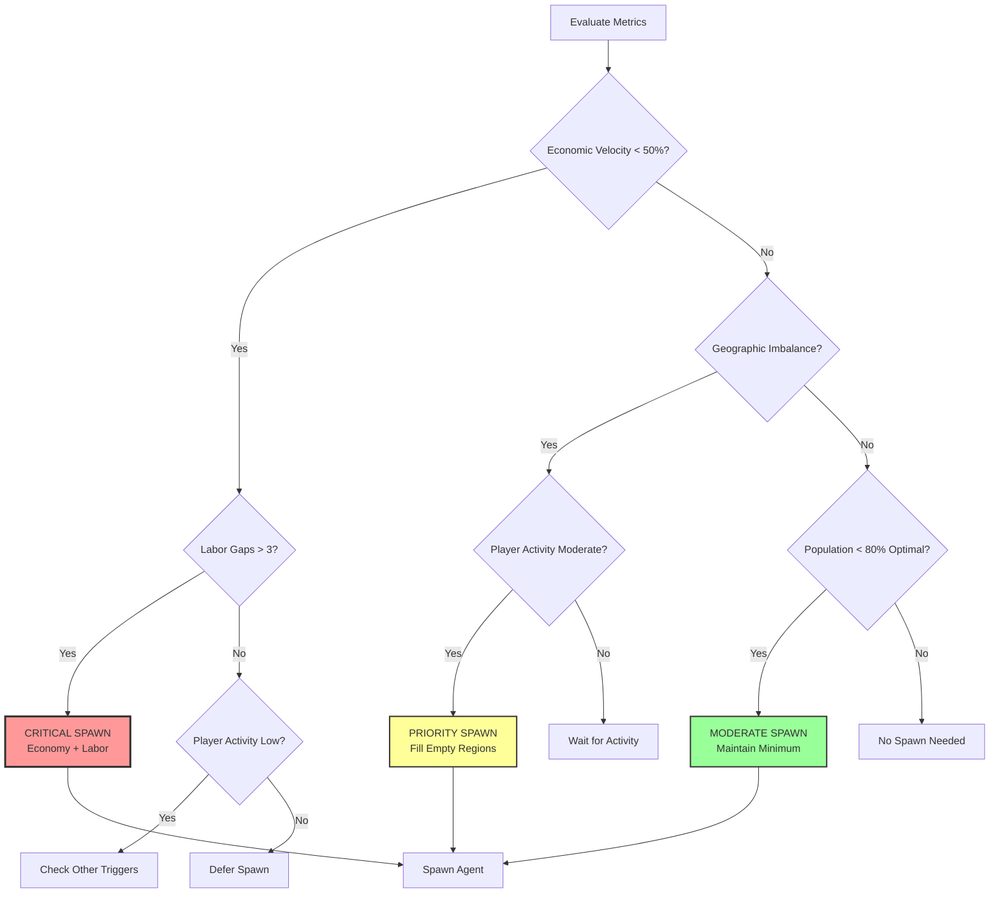
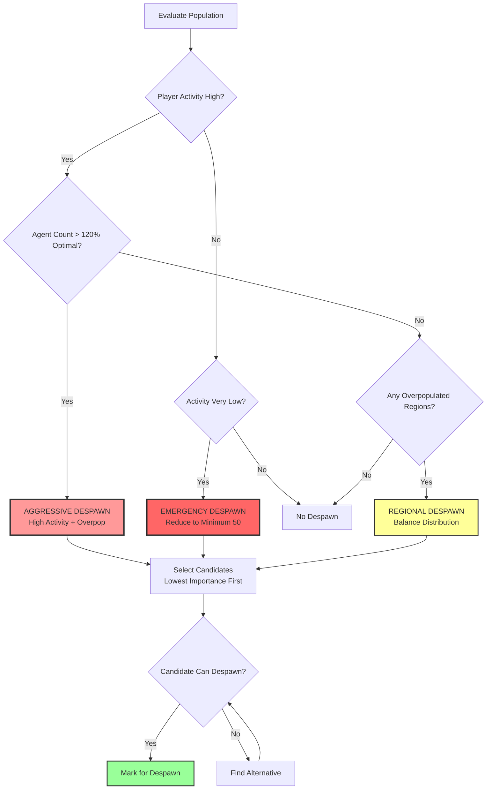
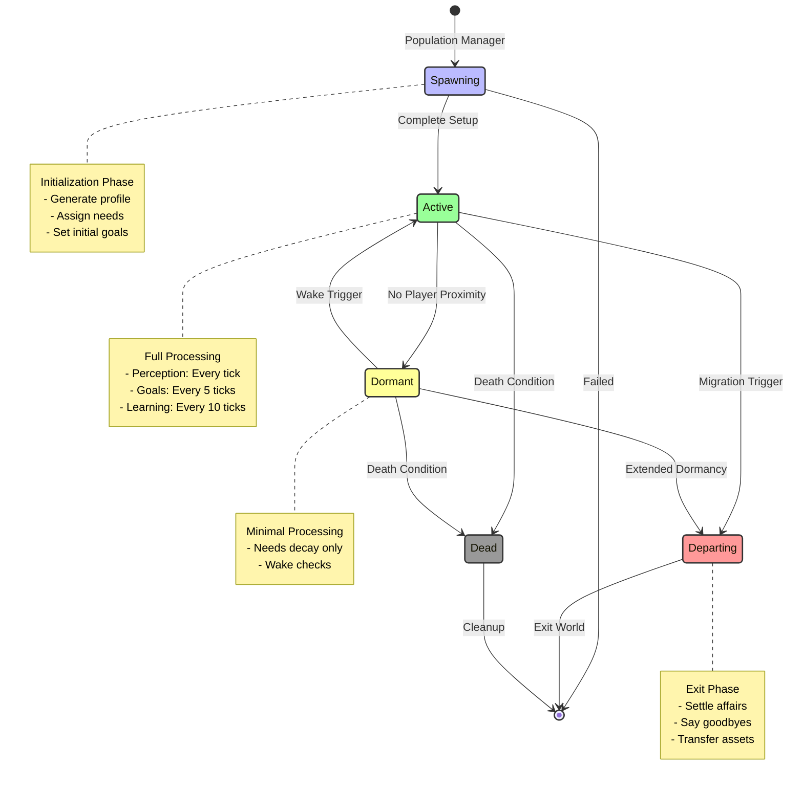
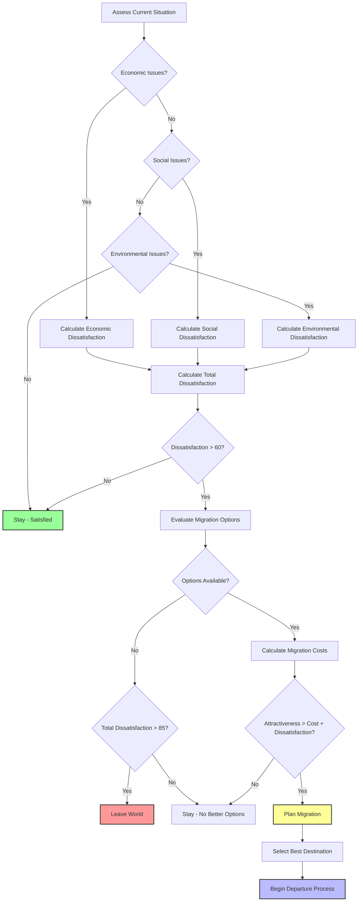
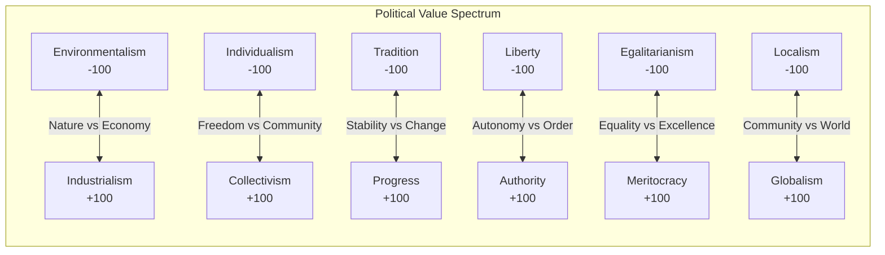

# Population Elasticity & Personality Systems

**Part of**: Session 2 - AI System Design  
**File**: 04-population-personality.md  
**Status**: Complete

---

> **Navigation**: [Index]([AGENTS-READ-FIRST]-index.md) | [Prev: Political & Social](03-political-social-behavior.md) | [Next: Narrative & Debugging](05-narrative-debugging.md)
> 
> **Part of**: [Session 2 AI System Design]([AGENTS-READ-FIRST]-index.md)
> **Requires**: [Session 1 Architecture](../session-1-technical-architecture/)
> **Informs**: [Future Sessions] (Session 3-7 planning not yet started)

---

## Population Elasticity

### Population Management Overview

The population elasticity system manages agent spawning, despawning, and migration to maintain world vitality while respecting performance constraints. It responds to economic conditions, player activity, and simulation needs.

## 7. Population Elasticity System

### Elasticity Metrics

The population elasticity system continuously monitors four key metrics to determine when to spawn or despawn agents, ensuring the world feels alive without overwhelming computational resources.

#### Economic Velocity

Economic velocity measures the rate of economic transactions and activity in the world, indicating whether the economy needs more participants.

**Economic Velocity Calculation:**

```csharp
public class EconomicVelocityMetric
{
    public float currentVelocity; // 0.0 - 100.0 (percentage of baseline)
    public float baselineVelocity; // Expected transactions per day
    public Queue<float> velocityHistory; // Last 7 days
    
    public void CalculateVelocity(World world)
    {
        // Count transactions in last 24 hours
        int transactionCount = world.economy.GetTransactionCount(hours: 24);
        
        // Calculate value-weighted velocity
        float totalValue = world.economy.GetTransactionValue(hours: 24);
        float valueVelocity = (totalValue / baselineVelocity) * 100.0f;
        
        // Count active economic agents
        int activeTraders = world.agents.Count(a => a.economy.recentTransactions.Count > 0);
        float participationRate = (float)activeTraders / world.agents.Count * 100.0f;
        
        // Composite velocity score
        currentVelocity = (valueVelocity * 0.6f) + (participationRate * 0.4f);
        
        // Update history
        velocityHistory.Enqueue(currentVelocity);
        if (velocityHistory.Count > 7)
            velocityHistory.Dequeue();
    }
    
    public float GetAverageVelocity(int days = 3)
    {
        return velocityHistory.Take(days).Average();
    }
    
    public bool IsLowVelocity()
    {
        return GetAverageVelocity() < 50.0f; // Below 50% baseline
    }
    
    public bool IsHighVelocity()
    {
        return GetAverageVelocity() > 150.0f; // Above 150% baseline
    }
}
```

**Velocity Components:**

| Component | Weight | Measurement | Low Threshold | High Threshold |
|-----------|--------|-------------|---------------|----------------|
| Transaction Volume | 40% | Credits exchanged/day | < 40% baseline | > 160% baseline |
| Transaction Count | 30% | Number of trades/day | < 30% baseline | > 170% baseline |
| Active Agents | 20% | % agents trading | < 25% | > 80% |
| Market Listings | 10% | New listings/day | < 20% baseline | > 180% baseline |

#### Labor Gap Analysis

Labor gaps identify unfilled jobs and skill shortages that indicate a need for new agents with specific professions.

**Labor Gap Calculation:**

```csharp
public class LaborGapAnalyzer
{
    public Dictionary<Profession, LaborGap> laborGaps;
    
    public void AnalyzeLaborGaps(World world)
    {
        laborGaps.Clear();
        
        foreach (var profession in Enum.GetValues<Profession>())
        {
            // Count current workers
            int currentWorkers = world.agents.Count(a => a.career.profession == profession && a.career.isEmployed);
            
            // Calculate demand based on population and economy
            int requiredWorkers = CalculateRequiredWorkers(profession, world);
            
            // Calculate gap
            int gap = requiredWorkers - currentWorkers;
            
            // Calculate urgency based on unmet demand
            float urgency = 0.0f;
            if (gap > 0)
            {
                // Check for unfilled job postings
                int unfilledJobs = world.jobs.Count(j => j.profession == profession && !j.isFilled);
                
                // Check for service shortages (e.g., no food available)
                float serviceShortage = CalculateServiceShortage(profession, world);
                
                urgency = (gap * 10.0f) + (unfilledJobs * 5.0f) + (serviceShortage * 20.0f);
            }
            
            laborGaps[profession] = new LaborGap
            {
                profession = profession,
                currentWorkers = currentWorkers,
                requiredWorkers = requiredWorkers,
                gap = gap,
                urgency = urgency
            };
        }
    }
    
    private int CalculateRequiredWorkers(Profession profession, World world)
    {
        int population = world.agents.Count;
        
        // Base requirements per population size
        return profession switch
        {
            Profession.Farmer => Math.Max(1, population / 5), // 1 farmer per 5 people
            Profession.Merchant => Math.Max(1, population / 8),
            Profession.Blacksmith => Math.Max(1, population / 15),
            Profession.Carpenter => Math.Max(1, population / 12),
            Profession.Miner => Math.Max(1, population / 10),
            Profession.Cook => Math.Max(1, population / 6),
            Profession.Healer => Math.Max(1, population / 20),
            Profession.Guard => Math.Max(1, population / 25),
            Profession.Artisan => Math.Max(1, population / 18),
            _ => 0
        };
    }
    
    public List<LaborGap> GetCriticalGaps()
    {
        return laborGaps.Values
            .Where(g => g.gap > 0 && g.urgency > 30.0f)
            .OrderByDescending(g => g.urgency)
            .ToList();
    }
    
    public int GetTotalLaborGapScore()
    {
        // Sum all critical gaps
        return laborGaps.Values
            .Where(g => g.gap > 0)
            .Sum(g => g.gap);
    }
}
```

**Gap Thresholds:**

| Gap Severity | Unfilled Jobs | Service Impact | Spawn Priority |
|--------------|--------------|----------------|----------------|
| Critical | 5+ | Severe shortage | Immediate |
| High | 3-4 | Noticeable shortage | High |
| Moderate | 1-2 | Minor inconvenience | Medium |
| Low | 0 | None | Low |

#### Geographic Balance

Geographic balance monitors agent distribution across regions to prevent overcrowding in some areas and abandonment in others.

**Geographic Balance Calculation:**

```csharp
public class GeographicBalanceAnalyzer
{
    public Dictionary<Region, RegionBalance> regionBalance;
    
    public void AnalyzeGeographicBalance(World world)
    {
        regionBalance.Clear();
        
        float totalPopulation = world.agents.Count;
        float idealDensity = totalPopulation / world.regions.Count; // Even distribution
        
        foreach (var region in world.regions)
        {
            int agentCount = region.GetAgentCount();
            float currentDensity = agentCount / region.area;
            float densityRatio = currentDensity / (idealDensity / world.regions.Average(r => r.area));
            
            // Calculate balance score (1.0 = perfect, <1 = underpopulated, >1 = overcrowded)
            float balanceScore = 1.0f / densityRatio;
            
            // Check for amenities (agents leave regions without food, shelter, work)
            float amenityScore = CalculateAmenityScore(region);
            
            // Calculate satisfaction (happy agents stay, unhappy ones leave)
            float satisfaction = region.GetAverageAgentSatisfaction();
            
            regionBalance[region] = new RegionBalance
            {
                region = region,
                agentCount = agentCount,
                idealCount = (int)(totalPopulation / world.regions.Count * (region.area / world.totalArea)),
                densityRatio = densityRatio,
                balanceScore = balanceScore,
                amenityScore = amenityScore,
                satisfaction = satisfaction,
                needsAgents = balanceScore > 1.3f && amenityScore > 0.5f,
                overpopulated = densityRatio > 2.0f
            };
        }
    }
    
    private float CalculateAmenityScore(Region region)
    {
        float score = 0.0f;
        
        // Check for essential services
        bool hasFood = region.buildings.Any(b => b.producesFood);
        bool hasShelter = region.buildings.Any(b => b.providesHousing);
        bool hasWork = region.jobs.Any(j => j.isAvailable);
        bool hasWater = region.hasWaterSource;
        
        score += hasFood ? 0.25f : 0.0f;
        score += hasShelter ? 0.25f : 0.0f;
        score += hasWork ? 0.25f : 0.0f;
        score += hasWater ? 0.25f : 0.0f;
        
        return score;
    }
    
    public List<Region> GetRegionsNeedingAgents()
    {
        return regionBalance.Values
            .Where(rb => rb.needsAgents)
            .OrderByDescending(rb => rb.balanceScore)
            .Select(rb => rb.region)
            .ToList();
    }
    
    public List<Region> GetOverpopulatedRegions()
    {
        return regionBalance.Values
            .Where(rb => rb.overpopulated)
            .OrderByDescending(rb => rb.densityRatio)
            .Select(rb => rb.region)
            .ToList();
    }
}
```

**Geographic Distribution Targets:**

| Region Type | Target Density | Max Density | Min Amenities Required |
|-------------|---------------|-------------|----------------------|
| City Center | High (1.5x avg) | 3.0x avg | 3/4 |
| Residential | Medium (1.0x avg) | 2.0x avg | 4/4 |
| Industrial | Medium (0.8x avg) | 1.5x avg | 2/4 |
| Rural | Low (0.5x avg) | 1.0x avg | 2/4 |
| Frontier | Very Low (0.2x avg) | 0.5x avg | 1/4 |

#### Player Activity Monitoring

Player activity tracking ensures agent population aligns with actual player engagement, preventing dead worlds during low activity and overcrowding during peak times.

**Player Activity Tracker:**

```csharp
public class PlayerActivityMonitor
{
    public float currentActivityLevel; // 0.0 - 100.0
    public float averageSessionLength; // Minutes
    public int concurrentPlayers;
    public Queue<float> activityHistory; // Hourly snapshots
    
    public void MonitorActivity(World world)
    {
        // Count active players (logged in within last 5 minutes)
        concurrentPlayers = world.players.Count(p => p.lastActivity > DateTime.Now.AddMinutes(-5));
        
        // Calculate activity based on player actions
        float actionIntensity = 0.0f;
        foreach (var player in world.players.Where(p => p.isOnline))
        {
            // Weight different activity types
            actionIntensity += player.recentActions.Count(a => a.type == ActionType.Combat) * 2.0f;
            actionIntensity += player.recentActions.Count(a => a.type == ActionType.Trading) * 1.5f;
            actionIntensity += player.recentActions.Count(a => a.type == ActionType.Social) * 1.0f;
            actionIntensity += player.recentActions.Count(a => a.type == ActionType.Crafting) * 0.8f;
            actionIntensity += player.recentActions.Count(a => a.type == ActionType.Exploration) * 0.5f;
        }
        
        // Normalize by expected activity level
        float expectedActivity = concurrentPlayers * 10.0f; // 10 actions per player baseline
        currentActivityLevel = (actionIntensity / expectedActivity) * 100.0f;
        
        // Update history
        activityHistory.Enqueue(currentActivityLevel);
        if (activityHistory.Count > 24)
            activityHistory.Dequeue();
    }
    
    public float GetTrend()
    {
        if (activityHistory.Count < 6)
            return 0.0f; // Not enough data
            
        // Compare last 3 hours to previous 3 hours
        float recent = activityHistory.Take(3).Average();
        float previous = activityHistory.Skip(3).Take(3).Average();
        
        return recent - previous; // Positive = increasing, negative = decreasing
    }
    
    public ActivityClassification GetClassification()
    {
        float avgActivity = activityHistory.Average();
        
        if (avgActivity < 20.0f)
            return ActivityClassification.VeryLow;
        else if (avgActivity < 40.0f)
            return ActivityClassification.Low;
        else if (avgActivity < 70.0f)
            return ActivityClassification.Moderate;
        else if (avgActivity < 90.0f)
            return ActivityClassification.High;
        else
            return ActivityClassification.VeryHigh;
    }
    
    public int GetRecommendedPopulation()
    {
        var classification = GetClassification();
        
        return classification switch
        {
            ActivityClassification.VeryLow => 50,   // Minimal population
            ActivityClassification.Low => 75,       // Reduced population
            ActivityClassification.Moderate => 100, // Standard population
            ActivityClassification.High => 125,     // Increased population
            ActivityClassification.VeryHigh => 150, // Maximum population
            _ => 100
        };
    }
}
```

**Activity Level Triggers:**

| Activity Level | Range | Population Adjustment | Spawn Rate | Despawn Rate |
|----------------|-------|---------------------|------------|--------------|
| Very Low | 0-20% | -50% | None | Aggressive |
| Low | 21-40% | -25% | Slow | Moderate |
| Moderate | 41-70% | Baseline | Normal | Low |
| High | 71-90% | +25% | Increased | None |
| Very High | 91-100% | +50% | Aggressive | None |

### Spawn/Despawn Triggers

The population manager uses specific threshold combinations to decide when to add or remove agents from the world.

#### Spawn Triggers

**Primary Spawn Conditions:**

```csharp
public class SpawnTriggerEvaluator
{
    public bool ShouldSpawnAgent(World world)
    {
        var metrics = world.populationMetrics;
        
        // CRITICAL: Economic velocity < 50% AND Labor gaps > 3
        if (metrics.economicVelocity.IsLowVelocity() && 
            metrics.laborGaps.GetTotalLaborGapScore() > 3)
        {
            return true; // Economy needs workers
        }
        
        // HIGH PRIORITY: Geographic imbalance AND Low activity
        var needyRegions = metrics.geographicBalance.GetRegionsNeedingAgents();
        if (needyRegions.Count > 0 && 
            metrics.playerActivity.GetClassification() == ActivityClassification.Moderate)
        {
            return true; // Fill empty regions during active play
        }
        
        // MODERATE: Low player activity AND Below optimal population
        int optimalPopulation = metrics.playerActivity.GetRecommendedPopulation();
        if (world.agents.Count < optimalPopulation * 0.8f &&
            metrics.playerActivity.GetClassification() <= ActivityClassification.Low)
        {
            return true; // Maintain minimum population
        }
        
        // SPECIAL: Critical labor shortage in essential profession
        var criticalGaps = metrics.laborGaps.GetCriticalGaps();
        if (criticalGaps.Any(g => IsEssentialProfession(g.profession)))
        {
            return true; // Always fill essential jobs (food, shelter, medicine)
        }
        
        return false;
    }
    
    private bool IsEssentialProfession(Profession profession)
    {
        return profession == Profession.Farmer ||
               profession == Profession.Cook ||
               profession == Profession.Healer ||
               profession == Profession.Builder;
    }
    
    public SpawnPriority GetSpawnPriority(World world)
    {
        var metrics = world.populationMetrics;
        
        // Calculate urgency score
        float urgency = 0.0f;
        
        // Economic urgency
        if (metrics.economicVelocity.IsLowVelocity())
            urgency += 30.0f;
        
        // Labor urgency
        urgency += Math.Min(metrics.laborGaps.GetTotalLaborGapScore() * 5.0f, 40.0f);
        
        // Geographic urgency
        var needyRegions = metrics.geographicBalance.GetRegionsNeedingAgents();
        urgency += needyRegions.Count * 5.0f;
        
        // Population deficit
        int optimal = metrics.playerActivity.GetRecommendedPopulation();
        float deficit = (optimal - world.agents.Count) / (float)optimal;
        urgency += deficit * 20.0f;
        
        if (urgency > 80.0f)
            return SpawnPriority.Critical;
        else if (urgency > 60.0f)
            return SpawnPriority.High;
        else if (urgency > 40.0f)
            return SpawnPriority.Moderate;
        else
            return SpawnPriority.Low;
    }
}
```

**Spawn Trigger Matrix:**



#### Despawn Triggers

**Primary Despawn Conditions:**

```csharp
public class DespawnTriggerEvaluator
{
    public List<Agent> GetDespawnCandidates(World world)
    {
        var candidates = new List<Agent>();
        var metrics = world.populationMetrics;
        
        // PRIMARY: High player activity AND Above optimal population
        int optimalPopulation = metrics.playerActivity.GetRecommendedPopulation();
        if (world.agents.Count > optimalPopulation * 1.2f &&
            metrics.playerActivity.GetClassification() >= ActivityClassification.High)
        {
            // Find excess agents to remove
            int excessCount = world.agents.Count - optimalPopulation;
            var removableAgents = FindRemovableAgents(world, excessCount);
            candidates.AddRange(removableAgents);
        }
        
        // SECONDARY: Overpopulated regions
        var overpopulatedRegions = metrics.geographicBalance.GetOverpopulatedRegions();
        foreach (var region in overpopulatedRegions)
        {
            var excessAgents = region.GetAgents()
                .Where(a => CanDespawn(a))
                .OrderBy(a => a.social.reputation) // Remove least important first
                .Take(region.agentCount - region.idealCount);
            
            candidates.AddRange(excessAgents);
        }
        
        // TERTIARY: Very low activity (aggressive reduction)
        if (metrics.playerActivity.GetClassification() == ActivityClassification.VeryLow)
        {
            var removableAgents = world.agents
                .Where(a => CanDespawn(a) && !IsEssential(a))
                .OrderBy(a => CalculateAgentImportance(a))
                .Take(world.agents.Count - 50); // Reduce to minimum 50
            
            candidates.AddRange(removableAgents);
        }
        
        return candidates.Distinct().ToList();
    }
    
    private bool CanDespawn(Agent agent)
    {
        // Don't despawn if:
        if (agent.state.currentState == StateType.InCombat)
            return false; // In active combat
            
        if (agent.social.HasActiveRelationshipsWithPlayer())
            return false; // Player knows this agent personally
            
        if (agent.economy.HasActiveContracts())
            return false; // Has business obligations
            
        if (agent.memory.HasRecentImportantMemories(hours: 24))
            return false; // Recently did something significant
            
        if (agent.isCriticalNPC)
            return false; // Plot-critical character
            
        if (agent.social.reputation > 80)
            return false; // Very important community member
            
        // Can despawn if:
        if (agent.state.currentState == StateType.Dormant)
            return true; // Already dormant
            
        if (agent.timeSinceLastPlayerInteraction > TimeSpan.FromHours(2))
            return true; // No player contact for 2+ hours
            
        if (agent.dissatisfaction > 70)
            return true; // Already wants to leave
            
        return false;
    }
    
    private bool IsEssential(Agent agent)
    {
        // Essential if fills critical labor gap
        var gap = world.populationMetrics.laborGaps.GetGap(agent.career.profession);
        return gap != null && gap.gap > 0;
    }
    
    private float CalculateAgentImportance(Agent agent)
    {
        float importance = 0.0f;
        
        // Reputation score
        importance += agent.social.reputation;
        
        // Relationship network size
        importance += agent.social.relationships.Count * 2.0f;
        
        // Economic contribution
        importance += agent.economy.GetRecentTransactionValue(days: 7) / 10.0f;
        
        // Job criticality
        if (IsEssential(agent))
            importance += 50.0f;
        
        // Recent player interaction
        if (agent.timeSinceLastPlayerInteraction < TimeSpan.FromHours(1))
            importance += 30.0f;
        
        return importance;
    }
}
```

**Despawn Selection Priority (Lowest Importance First):**

1. **Dormant agents** (no processing, safe to remove)
2. **Low reputation** (not important to community)
3. **No player contact** (2+ hours since interaction)
4. **High dissatisfaction** (already wants to leave)
5. **No active relationships** (won't be missed)
6. **Redundant profession** (not filling labor gap)

**Despawn Trigger Matrix:**



### Agent Lifecycle

Agents progress through distinct lifecycle states, each with different processing requirements and transition triggers.

#### Lifecycle State Machine



#### Lifecycle State Definitions

**1. Spawning State**

```csharp
public class SpawningState : AgentState
{
    public override StateType Type => StateType.Spawning;
    
    public override void Enter(Agent agent)
    {
        // Generate agent profile
        agent.profile = profileGenerator.Generate(
            professionPreference: GetNeededProfession(),
            region: GetTargetRegion()
        );
        
        // Initialize starting conditions
        agent.economy.credits = CalculateStartingCredits();
        agent.state.health = 100.0f;
        agent.state.energy = 80.0f;
        agent.state.hunger = 30.0f;
        
        // Set initial goals based on needs
        agent.goals.AddGoal(new SettleInGoal(agent));
        
        // Create arrival memory
        agent.memory.AddToShortTerm(new Memory(
            $"Arrived in {agent.location.region.name} seeking opportunity",
            importance: 80,
            emotionalValence: 30
        ));
        
        // Transition to active after setup
        agent.TransitionToState(new ActiveState());
    }
    
    private Profession GetNeededProfession()
    {
        var criticalGaps = world.populationMetrics.laborGaps.GetCriticalGaps();
        if (criticalGaps.Any())
        {
            // 70% chance to fill critical gap
            if (random.Range(0.0f, 1.0f) < 0.7f)
            {
                return criticalGaps.First().profession;
            }
        }
        
        // Otherwise random profession weighted by demand
        return professionSelector.SelectWeightedByDemand();
    }
}
```

**2. Active State**

```csharp
public class ActiveState : AgentState
{
    public override StateType Type => StateType.Active;
    
    public override void ProcessTick(Agent agent, float deltaTime)
    {
        // Full AI processing
        perceptionSystem.Process(agent);
        memorySystem.Process(agent, deltaTime);
        goalSystem.Evaluate(agent);
        behaviorSystem.Execute(agent, deltaTime);
        learningSystem.Process(agent);
        
        // Check for dormancy transition
        if (ShouldEnterDormancy(agent))
        {
            agent.TransitionToState(new DormantState());
        }
        
        // Check for departure
        if (ShouldDepart(agent))
        {
            agent.TransitionToState(new DepartingState());
        }
    }
    
    private bool ShouldEnterDormancy(Agent agent)
    {
        // No player within 100m
        float nearestPlayer = GetDistanceToNearestPlayer(agent);
        if (nearestPlayer > 100.0f)
        {
            // Check if dormant for 5 minutes
            agent.dormancyTimer += Time.deltaTime;
            if (agent.dormancyTimer > 300.0f) // 5 minutes
            {
                return true;
            }
        }
        else
        {
            agent.dormancyTimer = 0.0f; // Reset timer
        }
        
        return false;
    }
    
    private bool ShouldDepart(Agent agent)
    {
        // Dissatisfaction threshold
        if (agent.dissatisfaction > 85)
        {
            return true;
        }
        
        // Economic failure
        if (agent.economy.credits < 10 && agent.daysWithoutIncome > 7)
        {
            return true;
        }
        
        // Personal tragedy
        if (agent.memory.HasRecentTrauma(days: 30) && agent.profile.traits.emotionalStability < 40)
        {
            return true;
        }
        
        return false;
    }
}
```

**3. Dormant State**

```csharp
public class DormantState : AgentState
{
    public override StateType Type => StateType.Dormant;
    
    private float dormancyDuration = 0.0f;
    private const float MAX_DORMANCY = 1800.0f; // 30 minutes
    
    public override void ProcessTick(Agent agent, float deltaTime)
    {
        // Minimal processing
        
        // Basic needs decay
        agent.state.hunger += deltaTime * 0.05f;
        agent.state.energy -= deltaTime * 0.03f;
        
        // Wake checks (every 5 seconds)
        dormancyDuration += deltaTime;
        
        if (dormancyDuration % 5.0f < deltaTime) // Every 5 seconds
        {
            if (ShouldWake(agent))
            {
                agent.TransitionToState(new ActiveState());
            }
        }
        
        // Extended dormancy leads to departure
        if (dormancyDuration > MAX_DORMANCY)
        {
            agent.TransitionToState(new DepartingState());
        }
    }
    
    private bool ShouldWake(Agent agent)
    {
        // Player proximity
        float nearestPlayer = GetDistanceToNearestPlayer(agent);
        if (nearestPlayer < 30.0f)
        {
            return true;
        }
        
        // Scheduled wake time
        if (agent.schedule.HasScheduledActivity(withinMinutes: 15))
        {
            return true;
        }
        
        // Critical need
        if (agent.state.hunger > 80 || agent.state.energy < 20)
        {
            return true;
        }
        
        // Important event
        if (world.events.HasRelevantEventFor(agent))
        {
            return true;
        }
        
        return false;
    }
}
```

**4. Departing State**

```csharp
public class DepartingState : AgentState
{
    public override StateType Type => StateType.Departing;
    
    private float departureTimer = 0.0f;
    private const float DEPARTURE_TIME = 300.0f; // 5 minutes to wrap up
    
    public override void Enter(Agent agent)
    {
        // Notify relationships
        foreach (var relationship in agent.social.relationships)
        {
            var otherAgent = world.GetAgent(relationship.targetId);
            if (otherAgent != null)
            {
                otherAgent.memory.AddToShortTerm(new Memory(
                    $"{agent.name} announced they are leaving",
                    importance: 60,
                    emotionalValence: (sbyte)(relationship.trust > 50 ? -40 : -10)
                ));
            }
        }
        
        // Settle economic affairs
        agent.economy.SettleAccounts();
        
        // Create departure memory
        agent.memory.AddToShortTerm(new Memory(
            $"Departed {world.name} in search of better opportunities",
            importance: 90,
            emotionalValence: -20
        ));
    }
    
    public override void ProcessTick(Agent agent, float deltaTime)
    {
        departureTimer += deltaTime;
        
        // Walk to exit point
        if (departureTimer < DEPARTURE_TIME)
        {
            agent.behavior.WalkTo(world.GetExitPoint());
        }
        
        // Complete departure
        if (departureTimer >= DEPARTURE_TIME)
        {
            world.RemoveAgent(agent);
            agent.Destroy();
        }
    }
}
```

**5. Dead State**

```csharp
public class DeadState : AgentState
{
    public override StateType Type => StateType.Dead;
    
    public override void Enter(Agent agent)
    {
        // Create death memory for witnesses
        var witnesses = world.GetAgentsInRange(agent.position, 20.0f);
        foreach (var witness in witnesses)
        {
            witness.memory.AddToShortTerm(new Memory(
                $"Witnessed death of {agent.name}",
                importance: 95,
                emotionalValence: -70
            ));
        }
        
        // Handle inheritance
        inheritanceSystem.DistributeAssets(agent);
        
        // Update family relationships
        foreach (var family in agent.social.GetFamily())
        {
            family.OnFamilyMemberDeath(agent);
        }
        
        // Schedule cleanup
        agent.cleanupTimer = 3600.0f; // 1 hour for funeral/loot
    }
    
    public override void ProcessTick(Agent agent, float deltaTime)
    {
        // No AI processing, just cleanup countdown
        agent.cleanupTimer -= deltaTime;
        
        if (agent.cleanupTimer <= 0)
        {
            world.RemoveAgent(agent);
            agent.Destroy();
        }
    }
}
```

#### Migration Decisions

When agents become dissatisfied, they evaluate whether to migrate to a different region or leave the world entirely.

**Migration Decision Algorithm:**

```csharp
public class MigrationDecisionSystem
{
    public MigrationDecision EvaluateMigration(Agent agent)
    {
        // Calculate dissatisfaction factors
        float economicDissatisfaction = CalculateEconomicDissatisfaction(agent);
        float socialDissatisfaction = CalculateSocialDissatisfaction(agent);
        float environmentalDissatisfaction = CalculateEnvironmentalDissatisfaction(agent);
        
        float totalDissatisfaction = 
            economicDissatisfaction * 0.4f + 
            socialDissatisfaction * 0.35f + 
            environmentalDissatisfaction * 0.25f;
        
        // Check if migration threshold reached
        if (totalDissatisfaction < 60.0f)
        {
            return new MigrationDecision { shouldMigrate = false };
        }
        
        // Evaluate migration options
        var options = EvaluateMigrationOptions(agent);
        
        if (options.Any())
        {
            // Select best option
            var bestOption = options.OrderByDescending(o => o.attractiveness).First();
            
            // Calculate migration cost
            float migrationCost = CalculateMigrationCost(agent, bestOption.destination);
            
            // Determine if worth it
            if (bestOption.attractiveness > totalDissatisfaction + migrationCost)
            {
                return new MigrationDecision
                {
                    shouldMigrate = true,
                    destination = bestOption.destination,
                    reason = bestOption.reason,
                    urgency = totalDissatisfaction / 100.0f
                };
            }
        }
        
        // No good options, consider leaving world entirely
        if (totalDissatisfaction > 85)
        {
            return new MigrationDecision
            {
                shouldMigrate = true,
                destination = null, // Leave world
                reason = MigrationReason.TotalDissatisfaction,
                urgency = 1.0f
            };
        }
        
        return new MigrationDecision { shouldMigrate = false };
    }
    
    private float CalculateEconomicDissatisfaction(Agent agent)
    {
        float dissatisfaction = 0.0f;
        
        // Income vs needs
        if (agent.economy.credits < agent.economy.dailyExpenses * 7)
        {
            dissatisfaction += 30.0f;
        }
        
        // Unemployment
        if (agent.career.isUnemployed)
        {
            dissatisfaction += 25.0f;
        }
        
        // Job dissatisfaction
        if (agent.career.satisfaction < 40)
        {
            dissatisfaction += 20.0f;
        }
        
        // Price dissatisfaction (can't afford necessities)
        if (agent.economy.canAffordFood == false)
        {
            dissatisfaction += 40.0f;
        }
        
        return Math.Min(dissatisfaction, 100.0f);
    }
    
    private float CalculateSocialDissatisfaction(Agent agent)
    {
        float dissatisfaction = 0.0f;
        
        // Loneliness
        int friendCount = agent.social.GetFriends().Count;
        int desiredFriends = agent.GetDesiredFriendCount();
        if (friendCount < desiredFriends * 0.5f)
        {
            dissatisfaction += 25.0f;
        }
        
        // Reputation issues
        if (agent.social.reputation < 30)
        {
            dissatisfaction += 20.0f;
        }
        
        // Enemies
        int enemyCount = agent.social.GetEnemies().Count;
        dissatisfaction += enemyCount * 10.0f;
        
        // Social rejection
        if (agent.memory.HasRecentSocialRejection(days: 30))
        {
            dissatisfaction += 15.0f;
        }
        
        return Math.Min(dissatisfaction, 100.0f);
    }
    
    private List<MigrationOption> EvaluateMigrationOptions(Agent agent)
    {
        var options = new List<MigrationOption>();
        
        foreach (var region in world.regions.Where(r => r != agent.location.region))
        {
            float attractiveness = 0.0f;
            var reasons = new List<string>();
            
            // Economic opportunity
            var jobOpportunities = region.GetJobOpenings(agent.career.profession);
            if (jobOpportunities.Any())
            {
                float bestPay = jobOpportunities.Max(j => j.salary);
                if (bestPay > agent.career.currentSalary * 1.2f)
                {
                    attractiveness += 30.0f;
                    reasons.Add($"Better job opportunities ({(bestPay / agent.career.currentSalary - 1) * 100:F0}% higher pay)");
                }
            }
            
            // Lower cost of living
            if (region.costOfLiving < agent.location.region.costOfLiving * 0.8f)
            {
                attractiveness += 15.0f;
                reasons.Add("Lower cost of living");
            }
            
            // Social opportunity (new start)
            if (agent.social.reputation < 40 && region.averageReputation > 50)
            {
                attractiveness += 20.0f;
                reasons.Add("Chance to rebuild reputation");
            }
            
            // Known contacts in region
            int contactsInRegion = agent.social.GetFriendsInRegion(region).Count;
            attractiveness += contactsInRegion * 5.0f;
            if (contactsInRegion > 0)
            {
                reasons.Add($"Has {contactsInRegion} contacts there");
            }
            
            // Amenity quality
            if (region.amenityScore > agent.location.region.amenityScore * 1.2f)
            {
                attractiveness += 10.0f;
                reasons.Add("Better amenities");
            }
            
            if (attractiveness > 30.0f)
            {
                options.Add(new MigrationOption
                {
                    destination = region,
                    attractiveness = attractiveness,
                    reason = string.Join(", ", reasons)
                });
            }
        }
        
        return options;
    }
}
```

**Migration Decision Flow:**



---

## Personality System

### 19-Facet Personality Overview

The personality system creates believable individual variation through 19 distinct facets organized into core traits, Big Five dimensions, and secondary characteristics. This creates emergent diversity that prevents "hive mind" behavior.

## 8. Personality & Diversity System

### Personality Model (Big Five/OCEAN + Extended Facets)

The personality system combines the established Big Five (OCEAN) model with game-relevant traits to create 15-20 distinct facets that drive agent behavior. Each trait is stored as a byte (0-100) for memory efficiency and generates diverse, believable agent populations.

#### Complete Trait Inventory (19 Facets)

**Core 5 - Primary Behavioral Drivers:**

| Trait | Range | Description | Game Impact |
|-------|-------|-------------|-------------|
| **Gregariousness** | 0-100 | Desire for social interaction | Social need activation frequency, friendship capacity |
| **Work Ethic** | 0-100 | Dedication to productive labor | Crafting quality, job persistence, skill growth rate |
| **Violence** | 0-100 | Aggression and physical conflict tendency | Combat initiation, threat response, rivalry escalation |
| **Greed** | 0-100 | Desire for material accumulation | Price expectations, hoarding behavior, risk tolerance |
| **Emotional Stability** | 0-100 | Resilience to stress and setbacks | Stress recovery, trauma recovery, mood volatility |

**Big Five - OCEAN Dimensions:**

| Trait | Range | Low (0-30) | High (70-100) | System Impact |
|-------|-------|-----------|--------------|---------------|
| **Openness** | 0-100 | Traditional, practical | Curious, creative | Career diversity, exploration, adaptability |
| **Conscientiousness** | 0-100 | Spontaneous, casual | Organized, disciplined | Plan completion, inventory management, punctuality |
| **Extraversion** | 0-100 | Reserved, solitary | Outgoing, energetic | Social event participation, status-seeking, influence |
| **Agreeableness** | 0-100 | Competitive, skeptical | Cooperative, trusting | Trade fairness, conflict resolution, faction loyalty |
| **Neuroticism** | 0-100 | Calm, stable | Anxious, reactive | Stress generation, safety prioritization, mood swings |

**Secondary 9 - Nuanced Behavioral Modifiers:**

| Trait | Range | Description | Behavioral Manifestation |
|-------|-------|-------------|------------------------|
| **Bravery** | 0-100 | Willingness to face danger vs. seek safety | Exploration range, combat participation, risk-taking |
| **Altruism** | 0-100 | Concern for others' welfare | Helping behaviors, charity, sacrifice for others |
| **Excitement-Seeking** | 0-100 | Desire for novelty and stimulation | Travel frequency, dangerous activities, boredom threshold |
| **Tradition** | 0-100 | Respect for customs and established ways | Resistance to change, cultural adherence, generational values |
| **Progressivism** | 0-100 | Desire for reform and advancement | Innovation adoption, political activism, change support |
| **Dominance** | 0-100 | Preference for leadership vs. following | Faction leadership, political ambition, social hierarchy |
| **Orderliness** | 0-100 | Need for structure and tidiness | Home organization, schedule adherence, tool maintenance |
| **Artistic Interest** | 0-100 | Appreciation for beauty and expression | Decorative building, creative professions, aesthetic choices |
| **Cautiousness** | 0-100 | Careful deliberation vs. spontaneity | Decision speed, risk assessment, planning thoroughness |

```mermaid
graph TD
    subgraph "Personality Facets - 19 Total"
        CORE[Core 5]
        BIG5[Big Five - OCEAN]
        SEC[Secondary 9]
        
        CORE --> G[Gregariousness]
        CORE --> WE[Work Ethic]
        CORE --> V[Violence]
        CORE --> GR[Greed]
        CORE --> ES[Emotional Stability]
        
        BIG5 --> O[Openness]
        BIG5 --> C[Conscientiousness]
        BIG5 --> E[Extraversion]
        BIG5 --> A[Agreeableness]
        BIG5 --> N[Neuroticism]
        
        SEC --> B[Bravery]
        SEC --> AL[Altruism]
        SEC --> EX[Excitement-Seeking]
        SEC --> T[Tradition]
        SEC --> P[Progressivism]
        SEC --> D[Dominance]
        SEC --> OR[Orderliness]
        SEC --> AR[Artistic Interest]
        SEC --> CA[Cautiousness]
    end
    
    subgraph "Trait Interactions"
        G -.->|Modulates| SOCIAL[Social System]
        WE -.->|Drives| ECON[Economic System]
        V -.->|Controls| COMBAT[Combat System]
        GR -.->|Shapes| TRADE[Trading System]
        ES -.->|Buffers| STRESS[Stress System]
    end
```



#### Personality Generation Algorithm

Agents are generated with personalities using a **bell curve distribution with species/cultural biases** to create realistic population diversity:

```csharp
public class PersonalityGenerator
{
    // Standard bell curve parameters (mean = 50, std dev = 15)
    private const float BASE_MEAN = 50.0f;
    private const float BASE_STD_DEV = 15.0f;
    
    public PersonalityTraits Generate(AgentTemplate template, Culture culture, Random rng)
    {
        var traits = new PersonalityTraits();
        
        // Generate each trait with normal distribution
        traits.gregariousness = GenerateTraitWithBias(
            template.gregariousnessBias, 
            culture.socialNorm, 
            rng
        );
        
        traits.workEthic = GenerateTraitWithBias(
            template.workEthicBias,
            culture.workCulture,
            rng
        );
        
        traits.violence = GenerateTraitWithBias(
            template.violenceBias,
            culture.conflictStyle,
            rng
        );
        
        traits.greed = GenerateTraitWithBias(
            template.greedBias,
            culture.economicSystem,
            rng
        );
        
        traits.emotionalStability = GenerateTraitWithBias(
            template.stabilityBias,
            0, // No cultural bias for stability
            rng
        );
        
        // Big Five with moderate correlation
        traits.openness = GenerateCorrelatedTrait(
            traits.gregariousness, 0.3f, // Slight correlation
            template.opennessBias,
            rng
        );
        
        traits.conscientiousness = GenerateCorrelatedTrait(
            traits.workEthic, 0.6f, // Strong correlation
            template.conscientiousnessBias,
            rng
        );
        
        traits.extraversion = GenerateCorrelatedTrait(
            traits.gregariousness, 0.7f, // Very strong correlation
            template.extraversionBias,
            rng
        );
        
        traits.agreeableness = GenerateCorrelatedTrait(
            traits.violence, -0.5f, // Inverse correlation
            template.agreeablenessBias,
            rng
        );
        
        traits.neuroticism = GenerateCorrelatedTrait(
            traits.emotionalStability, -0.8f, // Strong inverse
            template.neuroticismBias,
            rng
        );
        
        // Secondary traits with weaker correlations
        traits.bravery = GenerateSecondaryTrait(
            new[] { traits.violence, traits.emotionalStability },
            new[] { 0.4f, 0.3f },
            template.braveryBias,
            rng
        );
        
        traits.altruism = GenerateSecondaryTrait(
            new[] { traits.agreeableness, traits.greed },
            new[] { 0.5f, -0.4f },
            template.altruismBias,
            rng
        );
        
        traits.excitementSeeking = GenerateSecondaryTrait(
            new[] { traits.openness, traits.violence, traits.bravery },
            new[] { 0.4f, 0.3f, 0.3f },
            template.excitementSeekingBias,
            rng
        );
        
        traits.tradition = GenerateSecondaryTrait(
            new[] { traits.openness, traits.age },
            new[] { -0.5f, 0.3f }, // Older = more traditional
            template.traditionBias,
            rng
        );
        
        traits.progressivism = GenerateCorrelatedTrait(
            traits.tradition, -0.6f,
            template.progressivismBias,
            rng
        );
        
        // Pure independent traits
        traits.dominance = GenerateIndependentTrait(template.dominanceBias, rng);
        traits.orderliness = GenerateCorrelatedTrait(traits.conscientiousness, 0.5f, 0, rng);
        traits.artisticInterest = GenerateCorrelatedTrait(traits.openness, 0.6f, 0, rng);
        traits.cautiousness = GenerateCorrelatedTrait(traits.conscientiousness, 0.4f, 0, rng);
        
        return traits;
    }
    
    private byte GenerateTraitWithBias(float bias, float culturalBias, Random rng)
    {
        // Box-Muller transform for normal distribution
        float u1 = rng.NextFloat();
        float u2 = rng.NextFloat();
        float normal = Mathf.Sqrt(-2.0f * Mathf.Log(u1)) * Mathf.Sin(2.0f * Mathf.PI * u2);
        
        // Apply mean shift from biases (each bias point = 2 units shift)
        float mean = BASE_MEAN + (bias * 2.0f) + (culturalBias * 3.0f);
        
        // Calculate final value
        float value = mean + (normal * BASE_STD_DEV);
        
        // Clamp to valid range
        return (byte)Mathf.Clamp(value, 0, 100);
    }
    
    private byte GenerateCorrelatedTrait(byte primaryTrait, float correlation, float bias, Random rng)
    {
        // Start with correlated portion
        float correlatedComponent = (primaryTrait - 50) * correlation;
        
        // Add independent variation (remaining variance)
        float independentVariance = Mathf.Sqrt(1.0f - correlation * correlation) * BASE_STD_DEV;
        float u1 = rng.NextFloat();
        float u2 = rng.NextFloat();
        float normal = Mathf.Sqrt(-2.0f * Mathf.Log(u1)) * Mathf.Sin(2.0f * Mathf.PI * u2);
        float independentComponent = normal * independentVariance;
        
        // Combine and apply bias
        float value = 50 + correlatedComponent + independentComponent + (bias * 2.0f);
        
        return (byte)Mathf.Clamp(value, 0, 100);
    }
    
    private byte GenerateSecondaryTrait(byte[] primaryTraits, float[] weights, float bias, Random rng)
    {
        float weightedSum = 0;
        float totalWeight = 0;
        
        for (int i = 0; i < primaryTraits.Length; i++)
        {
            weightedSum += (primaryTraits[i] - 50) * weights[i];
            totalWeight += Mathf.Abs(weights[i]);
        }
        
        float correlatedComponent = weightedSum / totalWeight;
        
        // Add 30% independent variation
        float u1 = rng.NextFloat();
        float u2 = rng.NextFloat();
        float normal = Mathf.Sqrt(-2.0f * Mathf.Log(u1)) * Mathf.Sin(2.0f * Mathf.PI * u2);
        float independentComponent = normal * BASE_STD_DEV * 0.3f;
        
        float value = 50 + correlatedComponent + independentComponent + (bias * 2.0f);
        
        return (byte)Mathf.Clamp(value, 0, 100);
    }
}
```

**Distribution Characteristics:**
- ~68% of population falls within 35-65 range (1 std dev)
- ~95% of population falls within 20-80 range (2 std dev)
- Only ~5% are extreme (0-20 or 80-100)
- Cultural biases shift means by ±15 points
- Template biases shift means by ±10 points

**Species/Culture Trait Biases:**

| Culture/Species | Gregariousness | Work Ethic | Violence | Greed | Openness | Tradition |
|----------------|----------------|------------|----------|-------|----------|-----------|
| Industrial | -5 | +10 | -5 | +5 | +5 | -10 |
| Agrarian | +5 | +5 | -10 | -5 | -10 | +15 |
| Mercantile | +10 | +5 | -5 | +10 | +5 | -5 |
| Martial | -5 | +5 | +15 | +0 | -5 | +10 |
| Scholarly | -10 | +5 | -15 | -5 | +15 | +5 |
| Nomadic | +5 | -5 | +5 | -5 | +10 | -5 |

#### Trait Impact Matrix

Each trait affects 10+ specific behaviors through weighted multipliers:

**Core 5 Impact Matrix:**

| Trait | Behavior 1 | Behavior 2 | Behavior 3 | Behavior 4 | Behavior 5 | Behavior 6 | Behavior 7 | Behavior 8 | Behavior 9 | Behavior 10 |
|-------|-----------|-----------|-----------|-----------|-----------|-----------|-----------|-----------|-----------|------------|
| **Gregariousness** | Social freq (+40%) | Friend capacity (+30%) | Party attendance (+35%) | Gossip spread (+25%) | Loneliness threshold (-20%) | Conversation length (+20%) | Group work preference (+30%) | Conflict avoidance (+15%) | Event hosting (+25%) | Relationship decay (-15%) |
| **Work Ethic** | Crafting speed (+30%) | Job persistence (+40%) | Skill growth (+35%) | Task completion (+25%) | Quality output (+20%) | Overtime willingness (+30%) | Procrastination (-25%) | Tool maintenance (+20%) | Plan adherence (+25%) | Wealth accumulation (+15%) |
| **Violence** | Combat initiation (+45%) | Threat response (+40%) | Rivalry escalation (+35%) | Criminal behavior (+30%) | Diplomacy (-25%) | Property damage (+20%) | Intimidation use (+30%) | Mercenary work (+25%) | Defense aggression (+35%) | Conflict duration (+20%) |
| **Greed** | Price markup (+30%) | Hoarding (+40%) | Risk tolerance (+25%) | Charity (-35%) | Bargaining effort (+30%) | Quality compromise (+20%) | Investment (+25%) | Debt avoidance (+15%) | Tax evasion (+20%) | Resource competition (+25%) |
| **Emotional Stability** | Stress recovery (+35%) | Trauma impact (-30%) | Mood volatility (-40%) | Decision consistency (+25%) | Panic response (-30%) | Rumination (-25%) | Resilience (+35%) | Optimism (+20%) | Grudge duration (-20%) | Setback recovery (+30%) |

**Big Five Impact Matrix:**

| Trait | Behavior 1 | Behavior 2 | Behavior 3 | Behavior 4 | Behavior 5 | Behavior 6 | Behavior 7 | Behavior 8 | Behavior 9 | Behavior 10 |
|-------|-----------|-----------|-----------|-----------|-----------|-----------|-----------|-----------|-----------|------------|
| **Openness** | Career diversity (+35%) | Exploration range (+30%) | Innovation adoption (+40%) | Routine tolerance (-25%) | Artistic activity (+35%) | Travel frequency (+25%) | Learning speed (+20%) | Creative solutions (+30%) | Tradition adherence (-20%) | Experimentation (+35%) |
| **Conscientiousness** | Plan completion (+40%) | Punctuality (+35%) | Organization (+30%) | Detail attention (+25%) | Promise keeping (+40%) | Health maintenance (+20%) | Financial planning (+25%) | Error rate (-30%) | Preparation (+35%) | Long-term goals (+30%) |
| **Extraversion** | Social event participation (+40%) | Status seeking (+30%) | Group leadership (+35%) | Public speaking (+25%) | Energy from crowds (+30%) | Risk taking (+20%) | Network building (+35%) | Assertiveness (+30%) | Attention seeking (+25%) | Social media use (+30%) |
| **Agreeableness** | Trade fairness (+30%) | Conflict resolution (+35%) | Trust level (+40%) | Competition avoidance (+20%) | Helping behavior (+35%) | Forgiveness (+30%) | Negotiation style (+25%) | Faction loyalty (+20%) | Social harmony (+35%) | Altruistic acts (+30%) |
| **Neuroticism** | Stress generation (+40%) | Safety prioritization (+35%) | Mood swings (+45%) | Complaint frequency (+30%) | Worry duration (+35%) | Sensitivity (+30%) | Risk aversion (+25%) | Health anxiety (+20%) | Catastrophizing (+30%) | Help seeking (+25%) |

**Impact Calculation Formula:**

```csharp
public class TraitImpactCalculator
{
    public float CalculateTraitImpact(byte traitValue, string behavior, ImpactCurve curve)
    {
        // Normalize trait to -1 to +1 range (50 = 0)
        float normalized = (traitValue - 50) / 50.0f;
        
        // Apply response curve
        float curvedValue = curve.Evaluate(normalized);
        
        // Get base impact weight for this behavior
        float weight = GetBehaviorWeight(behavior);
        
        // Calculate final impact multiplier
        // Example: 70 trait = +0.4 normalized = +0.3 curved = +12% impact (at 30% weight)
        float impact = 1.0f + (curvedValue * weight);
        
        return impact;
    }
    
    private float GetBehaviorWeight(string behavior)
    {
        return behavior switch
        {
            "social_frequency" => 0.40f,
            "crafting_speed" => 0.30f,
            "combat_initiation" => 0.45f,
            "price_markup" => 0.30f,
            "stress_recovery" => 0.35f,
            "exploration_range" => 0.30f,
            "plan_completion" => 0.40f,
            "event_participation" => 0.40f,
            "trade_fairness" => 0.30f,
            "mood_stability" => 0.40f,
            _ => 0.25f
        };
    }
}

public enum ImpactCurve
{
    Linear,           // f(x) = x
    Exponential,      // f(x) = x^2 (amplifies extremes)
    Logistic,         // S-curve (moderates extremes)
    Step,             // Binary threshold
    Quadratic         // f(x) = x^2 * sign(x)
}
```

**Combined Trait Effects:**

Certain trait combinations create emergent personality archetypes:

| Archetype | Key Traits | Behavioral Signature | Population % |
|-----------|-----------|---------------------|--------------|
| **The Entrepreneur** | High Greed + High Openness + High Work Ethic | Innovative business creation, risk-taking, wealth building | ~8% |
| **The Diplomat** | High Agreeableness + High Extraversion + Low Violence | Conflict resolution, networking, mediation | ~10% |
| **The Hermit** | Low Gregariousness + High Tradition + High Conscientiousness | Self-sufficient, routine-oriented, avoids crowds | ~6% |
| **The Warrior** | High Violence + High Bravery + Low Agreeableness | Combat-focused, protective, aggressive problem-solving | ~5% |
| **The Artist** | High Openness + High Artistic Interest + Low Conscientiousness | Creative expression, chaotic lifestyle, beauty-focused | ~7% |
| **The Altruist** | High Altruism + High Agreeableness + Low Greed | Charity work, helping others, community service | ~9% |
| **The Rebel** | High Progressivism + High Bravery + Low Tradition | Political activism, challenging norms, innovation | ~6% |
| **The Cautious** | High Cautiousness + High Neuroticism + Low Bravery | Risk-avoidant, safety-focused, slow decision-making | ~8% |

### Value Diversity System

#### Six Political Value Axes

Values represent ideological preferences that influence voting, faction membership, and goal prioritization. Each axis spans -100 to +100, with 0 representing neutral/undecided.



**Axis 1: Environmentalism (-100) ↔ Industrialism (+100)**

| Position | Description | Policy Preferences | Goal Impact |
|----------|-------------|-------------------|-------------|
| -80 to -100 | Radical Environmentalist | Ban resource extraction, nature preservation laws, pollution criminalization | Prioritize conservation over profit; refuse polluting jobs |
| -40 to -79 | Environmentalist | Environmental regulations, sustainable practices, green technology | Prefer eco-friendly careers; support environmental policies |
| -10 to -39 | Mild Environmentalist | Moderate regulations, conservation areas, pollution taxes | Slight preference for green options; vote for mild regulations |
| +10 to +39 | Mild Industrialist | Limited regulations, economic growth focus, resource development | Prefer high-output careers; prioritize efficiency over environment |
| +40 to +79 | Industrialist | Deregulation, industrial expansion, resource extraction | Support industrial policies; maximize production goals |
| +80 to +100 | Radical Industrialist | No environmental laws, maximum extraction, pollution allowed | Ignore environmental consequences; maximize profit above all |

**Generation Correlation:**
```csharp
// Environmentalism derived from:
// + Openness (curiosity about nature)
// - Excitement-seeking (conservative)
// - Greed (profit motive)
// + Age (older = more environmental)
environmentalism = (openness - 50) * 0.8f 
                 + (excitementSeeking - 50) * -0.3f 
                 + (greed - 50) * -1.2f 
                 + (age - 40) * 0.5f
                 + rng.Range(-20, 20);
```

**Axis 2: Individualism (-100) ↔ Collectivism (+100)**

| Position | Economic View | Property Rights | Social View | Goal Prioritization |
|----------|--------------|-----------------|-------------|---------------------|
| -100 | Free market extremist | Absolute private property | Self-reliance | Personal wealth, independence |
| -60 | Free market advocate | Strong property rights | Personal responsibility | Individual success, minimal taxes |
| -20 | Individual-leaning | Property with limits | Balanced | Personal goals + some community |
| +20 | Collective-leaning | Shared resources | Community support | Community participation |
| +60 | Collective advocate | Cooperative ownership | Mutual aid | Group success, shared resources |
| +100 | Collectivist extremist | Common ownership | Collective identity | Collective welfare above self |

**Behavioral Effects:**
- Individualists: Form fewer deep friendships, prioritize personal businesses, resist taxation
- Collectivists: Join factions readily, support welfare policies, prefer cooperative work

**Axis 3: Tradition (-100) ↔ Progress (+100)**

| Position | Attitude to Change | Technology | Social Reform | Goal Duration |
|----------|-------------------|------------|---------------|---------------|
| -100 | Extreme conservative | Reject new tech | Oppose all reform | Long-term, stable goals |
| -60 | Traditionalist | Skeptical of new tech | Gradual reform | Prefer established paths |
| -20 | Moderate conservative | Cautious adoption | Slow change | Mix of old and new |
| +20 | Moderate progressive | Enthusiastic adoption | Moderate reform | Balanced approach |
| +60 | Progressive | Early adopter | Rapid reform | Seek new opportunities |
| +100 | Radical progressive | Immediate adoption | Revolutionary change | Constantly changing goals |

**Direct Trait Mapping:**
- Tradition trait (0-100) = -Tradition axis value
- Progressivism trait (0-100) = +Progress axis value
- Openness trait positively correlates with Progress

**Axis 4: Liberty (-100) ↔ Authority (+100)**

| Position | Law Preference | Governance | Personal Autonomy | Conflict Response |
|----------|---------------|------------|-------------------|-------------------|
| -100 | Anarchist | No government | Absolute freedom | Reject all authority |
| -60 | Libertarian | Minimal government | High autonomy | Resist restrictions |
| -20 | Liberty-leaning | Limited government | Moderate autonomy | Prefer freedom |
| +20 | Authority-leaning | Active government | Some restrictions | Accept necessary rules |
| +60 | Authoritarian | Strong government | Low autonomy | Support strong leadership |
| +100 | Totalitarian | Total government control | No autonomy | Enforce compliance |

**Generation Factors:**
- High Bravery = Liberty (anti-authority stance)
- High Neuroticism = Authority (security-seeking)
- High Conscientiousness = slight Authority (respect for order)
- Victim of crime memory = +20 Authority shift

**Axis 5: Egalitarianism (-100) ↔ Meritocracy (+100)**

| Position | Wealth Distribution | Opportunity | Reward System | Career Perspective |
|----------|-------------------|-------------|---------------|-------------------|
| -100 | Total equality | Guaranteed outcomes | Equal rewards | Disincentivizes effort |
| -60 | Strong redistribution | Equal opportunity focus | Need-based | Supports social safety net |
| -20 | Moderate redistribution | Some equalization | Mixed criteria | Accepts moderate inequality |
| +20 | Limited redistribution | Merit focus | Performance-based | Rewards effort |
| +60 | Minimal redistribution | Pure meritocracy | Achievement-based | Strong performance focus |
| +100 | No redistribution | Winner-takes-all | Market-determined | Extreme competition |

**Economic Correlation:**
- Greed (+) = Meritocracy (+)
- Altruism (+) = Egalitarianism (+)
- Work Ethic (+) = Meritocracy (+)
- Recent economic success = shift toward Meritocracy
- Recent economic failure = shift toward Egalitarianism

**Axis 6: Localism (-100) ↔ Globalism (+100)**

| Position | Trade Policy | Immigration | Infrastructure | Information Focus |
|----------|-------------|-------------|----------------|-------------------|
| -100 | Total isolation | Closed borders | Local only | Ignore outside world |
| -60 | Protectionist | Limited immigration | Regional focus | Local news only |
| -20 | Local preference | Selective immigration | Local priority | Mostly local info |
| +20 | Global preference | Open immigration | Global connections | Balanced info |
| +60 | Free trade | Open borders | Global infrastructure | Global awareness |
| +100 | Total free trade | Unlimited immigration | World-connected | Global citizen |

**Professional Modifiers:**
- Merchants: +20 Globalism (trade-focused)
- Farmers: -15 Globalism (land-focused)
- Scholars: +25 Globalism (knowledge-seeking)
- Craftsmen: -10 Globalism (local production)

#### Value Influence on Goal Priorities

Values modify goal utilities through weighted consideration adjustments:

```csharp
public class ValueGoalModifier
{
    public float ModifyGoalUtility(Agent agent, Goal goal, float baseUtility)
    {
        float valueModifier = 1.0f;
        var values = agent.politicalValues;
        
        // Environmentalism/Industrialism affects economic goals
        if (goal.category == GoalCategory.Economic)
        {
            float envBias = (values.environmentalism + 100) / 200f; // 0-1
            
            if (goal.HasTag("environmentally_friendly"))
            {
                valueModifier += envBias * 0.3f; // Up to +30% for green goals
            }
            else if (goal.HasTag("industrial"))
            {
                valueModifier += (1 - envBias) * 0.25f; // Up to +25% for industrial goals
            }
            else if (goal.HasTag("polluting"))
            {
                valueModifier -= envBias * 0.4f; // Up to -40% for polluting
            }
        }
        
        // Individualism/Collectivism affects social goals
        if (goal.category == GoalCategory.Social)
        {
            float indivBias = (values.individualism + 100) / 200f;
            
            if (goal.HasTag("group_activity"))
            {
                valueModifier += (1 - indivBias) * 0.2f; // Collectivists prefer groups
            }
            else if (goal.HasTag("personal_achievement"))
            {
                valueModifier += indivBias * 0.25f; // Individualists prefer personal goals
            }
        }
        
        // Tradition/Progress affects adoption of new opportunities
        if (goal.HasTag("innovation"))
        {
            float progressBias = (values.progress + 100) / 200f;
            valueModifier += progressBias * 0.35f;
        }
        else if (goal.HasTag("traditional"))
        {
            float traditionBias = (values.tradition + 100) / 200f; // Inverted
            valueModifier += (1 - progressBias) * 0.3f;
        }
        
        // Liberty/Authority affects governance participation
        if (goal.category == GoalCategory.Political)
        {
            float libertyBias = (values.liberty + 100) / 200f;
            
            if (goal.HasTag("anti_authority"))
            {
                valueModifier += libertyBias * 0.4f;
            }
            else if (goal.HasTag("establishment"))
            {
                valueModifier += (1 - libertyBias) * 0.3f;
            }
        }
        
        // Egalitarianism/Meritocracy affects career choices
        if (goal.type == GoalType.CareerAdvancement)
        {
            float egalitarianBias = (values.egalitarianism + 100) / 200f;
            
            // Egalitarians prefer public service, teachers, healers
            // Meritocrats prefer competitive fields, merchants, high-risk/high-reward
            if (goal.profession.category == ProfessionCategory.PublicService)
            {
                valueModifier += egalitarianBias * 0.25f;
            }
            else if (goal.profession.category == ProfessionCategory.Competitive)
            {
                valueModifier += (1 - egalitarianBias) * 0.2f;
            }
        }
        
        // Localism/Globalism affects migration and trade
        if (goal.type == GoalType.Migrate)
        {
            float globalismBias = (values.globalism + 100) / 200f;
            valueModifier += globalismBias * 0.3f; // Globalists more willing to migrate
        }
        
        if (goal.type == GoalType.Trade)
        {
            float globalismBias = (values.globalism + 100) / 200f;
            
            if (goal.tradeScope == TradeScope.LongDistance)
            {
                valueModifier += globalismBias * 0.25f;
            }
            else if (goal.tradeScope == TradeScope.Local)
            {
                valueModifier += (1 - globalismBias) * 0.2f;
            }
        }
        
        return baseUtility * valueModifier;
    }
}
```

#### Value-Based Voting Decision Matrix

Values directly translate to voting behavior through position matching:

| Policy Type | Environmentalism Vote | Individualism Vote | Tradition Vote | Liberty Vote | Egalitarian Vote | Localism Vote |
|------------|---------------------|-------------------|---------------|-------------|-----------------|--------------|
| **Environmental Regulation** | Strong For (-60 to -100) | Against (restricts business) | Slight For (preservation) | Against (govt power) | Neutral | Neutral |
| **Tax Increase for Welfare** | Neutral | Strong Against | Neutral | Against | Strong For | Slight Against (local taxes) |
| **New Technology Adoption** | Neutral/Slight Against | For (innovation) | Strong Against | Neutral | Neutral | Neutral |
| **Stronger Law Enforcement** | Neutral | Against | For (order) | Strong Against | Slight For (protects weak) | For (community safety) |
| **Free Trade Agreement** | Slight Against | Strong For | Against | For | Against (exploitation) | Strong Against |
| **Open Immigration** | Neutral | For (freedom of movement) | Against | For | For (opportunity) | Strong Against |
| **Public Education Funding** | Neutral | Against (taxes) | For (community) | Against | Strong For | For (local schools) |
| **Business Deregulation** | Strong Against | Strong For | Neutral | For | Strong Against | Neutral |

**Vote Calculation Formula:**

```csharp
public float CalculateValueVoteScore(Agent agent, Policy policy)
{
    float score = 0.5f; // Neutral baseline
    var values = agent.politicalValues;
    
    foreach (var implication in policy.valueImplications)
    {
        ValueAxis axis = implication.Key;
        float policyPosition = implication.Value; // -1.0 to +1.0
        float agentPosition = values.GetPosition(axis) / 100f; // -1.0 to +1.0
        float axisImportance = values.GetImportance(axis); // 0.0 to 1.0
        
        // Calculate alignment (1.0 = perfect match, 0.0 = opposite)
        float alignment = 1.0f - Math.Abs(agentPosition - policyPosition) / 2f;
        
        // Weight by importance
        float weightedAlignment = alignment * axisImportance;
        
        // Add to score (normalize to 0-1)
        score += weightedAlignment * 0.1f;
    }
    
    // Personality modifiers
    if (agent.traits.openness > 70 && policy.HasTag("progressive"))
    {
        score += 0.05f;
    }
    
    if (agent.traits.tradition > 70 && policy.HasTag("traditional"))
    {
        score += 0.08f;
    }
    
    return Mathf.Clamp01(score);
}
```

**Value Drift Over Time:**

Values slowly shift based on life experiences at a rate of ±0.5 to ±2.0 points per significant event:

| Experience | Environmentalism | Individualism | Tradition | Liberty | Egalitarianism | Localism |
|-----------|-----------------|---------------|-----------|---------|---------------|----------|
| Business success | -1 (profit focus) | +2 | 0 | 0 | -2 (self-made) | 0 |
| Business failure | +1 (resource scarcity) | -2 (need help) | 0 | 0 | +2 (need support) | 0 |
| Crime victim | 0 | 0 | +1 | -3 (want protection) | +1 | +2 |
| Natural disaster | +3 (nature's power) | -1 (community help) | +1 | -1 | +2 (shared suffering) | +1 |
| Economic boom | -2 (industry growth) | +2 | 0 | 0 | -2 (merit rewarded) | -1 |
| Economic depression | +2 (sustainability) | -3 (need community) | +1 | -1 | +3 (inequality visible) | +2 |
| War/conflict | +1 (destruction) | -2 (unity needed) | +2 | -4 (security) | +1 | +3 |
| Scientific discovery | -1 (tech solution) | +1 | -3 (old ways wrong) | 0 | 0 | -1 |
| Community support | +1 | -3 (interdependence) | +2 | -1 | +2 | +3 |
| Political participation | 0 | +1 | 0 | +2 | +1 | 0 |
| Religious conversion | 0 | 0 | +3 (new faith) | 0 | 0 | 0 |
| Travel/migration | 0 | +2 (self-reliance) | -2 (new culture) | 0 | 0 | -2 |
| Education/learning | 0 | +1 | -1 | 0 | +1 | -1 |
| Health crisis | +1 (medical need) | -2 (depend on help) | 0 | -2 | +2 (care access) | +1 |
""  
"| Religious conversion | 0 | 0 | +3 (new faith) | 0 | 0 | 0 |" 

  
**Interpretation**: Values drift gradually based on life experiences. Extreme events (war, disasters) cause larger shifts than routine activities. Agents with high Openness drift faster; agents with high Tradition resist drift. Changes are applied during memory consolidation (every 10 ticks), with magnitude capped at +-2.0 per event to prevent radical personality changes. 
