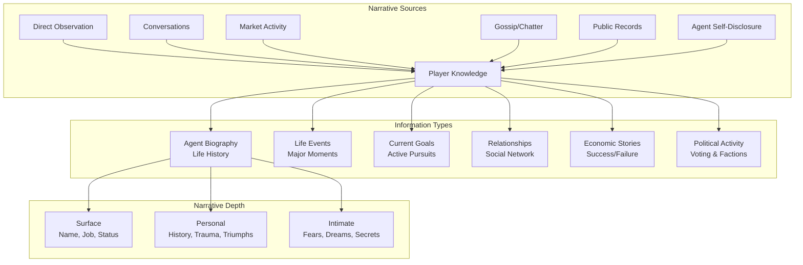
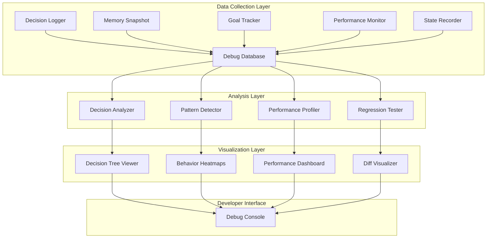
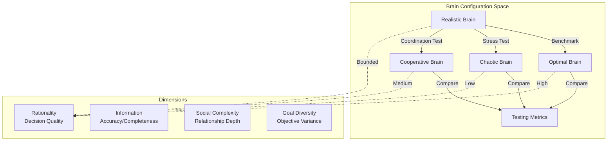

# Emergent Narrative, Debugging & Brain Configurations

**Part of**: Session 2 - AI System Design  
**File**: 05-narrative-debugging.md  
**Status**: Complete

---

> **Navigation**: [Index]([AGENTS-READ-FIRST]-index.md) | [Prev: Population & Personality](04-population-personality.md) | [Next: Skills & Reference](06-ai-skills-reference.md)
> 
> **Part of**: [Session 2 AI System Design]([AGENTS-READ-FIRST]-index.md)
> **Requires**: [Session 1 Architecture](../session-1-technical-architecture/)
> **Informs**: [Future Sessions] (Session 3-7 planning not yet started)

---

## 9. Emergent Narrative System

The emergent narrative system transforms AI agent behavior into discoverable stories that players can uncover through various information channels. Unlike scripted narratives, these stories emerge organically from agent interactions, goals, successes, and failures.

### Information Discovery Channels



### Direct Observation System

Players learn about agents by watching them in the world:

**Observable Behaviors:**

| Behavior | Visual Indicator | Information Revealed | Frequency |
|----------|-----------------|---------------------|-----------|
| **Working** | Tool animation, crafting particles | Profession, skill level, work ethic | Continuous |
| **Trading** | Coin exchange animation, market stall | Economic activity, wealth level | 3-5x/day |
| **Socializing** | Chat bubbles, gesture animations | Relationships, gregariousness | Variable |
| **Conflict** | Combat stance, argument animation | Violence trait, rivalries | Occasional |
| **Celebration** | Emote animations, cheering | Success events, personality | Event-driven |
| **Distress** | Low-health animation, limping | Survival needs, problems | As needed |

**Proximity-Based Discovery:**

```csharp
public class ObservationSystem
{
    // Players automatically observe agents within range
    public void ProcessPlayerObservation(Player player, Agent agent)
    {
        float distance = Vector3.Distance(player.position, agent.position);
        
        if (distance < 10f) // Close range
        {
            // Observe detailed behavior
            ObserveDetailedBehavior(player, agent);
            
            // Learn emotional state
            if (agent.state.stress > 70)
                player.knowledge.Add("Agent appears stressed", VisibilityLevel.CloseRange);
            
            // Observe current action
            if (agent.currentAction != null)
            {
                player.knowledge.AddActionObservation(agent.id, agent.currentAction);
            }
        }
        else if (distance < 50f) // Medium range
        {
            // Observe general activity type
            ObserveGeneralActivity(player, agent);
        }
        else if (distance < 100f) // Long range
        {
            // Only observe major events (combat, celebrations)
            if (agent.state.IsInCombat() || agent.state.IsCelebrating())
            {
                player.knowledge.AddMajorEvent(agent.id, agent.state.currentState);
            }
        }
    }
}
```

**Observation Memory System:**
- Players store observations for 7-30 days
- Repeated observations increase knowledge accuracy
- Contradictory observations create "mystery" narratives
- Important observations trigger notification UI

### Conversation & Information Exchange

**Initiating Conversations:**

Players can approach agents and initiate dialogue, with information quality depending on relationship and agent personality:

```csharp
public class ConversationSystem
{
    public ConversationResult InitiateConversation(Player player, Agent agent)
    {
        // Check if agent is willing to talk
        float willingness = CalculateConversationWillingness(agent, player);
        
        if (willingness < 0.3f)
        {
            return new ConversationResult 
            { 
                success = false, 
                reason = agent.traits.gregariousness < 30 ? "Agent is introverted" : "Agent is busy"
            };
        }
        
        // Determine information depth based on relationship
        var relationship = agent.social.GetPlayerRelationship(player.id);
        InformationDepth maxDepth = relationship?.trust switch
        {
            > 80 => InformationDepth.Intimate,
            > 50 => InformationDepth.Personal,
            > 20 => InformationDepth.Basic,
            _ => InformationDepth.Surface
        };
        
        // Agent shares information based on personality
        var sharedInfo = new List<Information>();
        
        // High extraversion agents share more
        int maxTopics = 2 + (agent.traits.extraversion / 20);
        
        // Select topics based on agent's current priorities
        var relevantMemories = agent.memory.GetMostImportant(5)
            .Where(m => m.depth <= maxDepth);
        
        foreach (var memory in relevantMemories.Take(maxTopics))
        {
            if (agent.random.Range(0f, 1f) < willingness)
            {
                sharedInfo.Add(ConvertMemoryToInformation(memory, agent));
            }
        }
        
        return new ConversationResult 
        { 
            success = true, 
            information = sharedInfo,
            relationshipChange = +5.0f
        };
    }
}
```

**Topic Selection Based on Agent State:**

| Agent State | Likely Topics | Information Value |
|------------|--------------|-------------------|
| **Happy/Successful** | Recent achievements, future plans | High positive valence |
| **Stressed** | Current problems, needs, conflicts | Problem-solving opportunities |
| **Angry** | Grievances, rivalries, complaints | Conflict narratives |
| **Afraid** | Threats, dangers, uncertainties | Safety information |
| **Excited** | Opportunities, discoveries, news | Event information |

## Gossip System

### Information Propagation Overview

Gossip serves as the primary social information transmission mechanism, allowing agents to share knowledge, spread rumors, and build social narratives. Information degrades and mutates as it spreads through the social network, creating emergent story variations.

### Gossip & Information Spread

**Gossip Propagation Mechanics:**

Information spreads through the social network with degradation and mutation:

```csharp
public class GossipPropagationSystem
{
    public void SpreadGossip(Information info, Agent source, float spreadProbability)
    {
        foreach (var friend in source.social.friends)
        {
            // Calculate probability of sharing
            float shareProb = spreadProbability;
            
            // High gregariousness spreads more
            shareProb += (source.traits.gregariousness - 50) * 0.01f;
            
            // Emotional information spreads faster
            if (Math.Abs(info.emotionalValence) > 50)
                shareProb += 0.2f;
            
            // Recent information spreads more
            float age = (DateTime.Now - info.timestamp).TotalHours;
            shareProb *= Mathf.Exp(-age / 24f);
            
            if (source.random.Range(0f, 1f) < shareProb)
            {
                // Transmit with degradation
                var gossip = info.Clone();
                gossip.accuracy *= 0.95f; // 5% accuracy loss per hop
                gossip.source = InfoSource.Gossip;
                gossip.transmissionHops++;
                
                // Emotional exaggeration
                gossip.emotionalValence *= 1.1f;
                
                friend.memory.AddToShortTerm(gossip);
            }
        }
    }
}
```

**Gossip Quality Degradation:**

| Transmission Hops | Accuracy | Emotional Amplification | Detail Loss |
|------------------|---------|------------------------| ------------|
| 0 (Original) | 100% | 1.0x | 0% |
| 1 | 95% | 1.1x | 10% |
| 2 | 90% | 1.2x | 20% |
| 3 | 85% | 1.3x | 30% |
| 4+ | 80% | 1.4x | 40%+ |

### Public Records System

**Accessible Records:**

| Record Type | Information Content | Access Level | Update Frequency |
|------------|-------------------|--------------|------------------|
| **Census Data** | Population, demographics, professions | Public | Daily |
| **Market Registry** | Business licenses, shop locations | Public | Weekly |
| **Voting Records** | Election results, turnout | Public | Per election |
| **Achievement Hall** | Notable accomplishments, honors | Public | Event-driven |
| **Property Records** | Land ownership, building permits | Public | Weekly |
| **Criminal Records** | Convictions, punishments | Restricted | As needed |
| **Marriage Records** | Unions, family trees | Public | Event-driven |

**Record Query Interface:**

```csharp
public class PublicRecordsSystem
{
    public RecordSet QueryRecords(RecordQuery query)
    {
        var results = new RecordSet();
        
        switch (query.type)
        {
            case RecordType.AgentHistory:
                results = archive.GetAgentTimeline(query.agentId, query.timeRange);
                break;
                
            case RecordType.EconomicActivity:
                results = market.GetTransactionHistory(query.parameters);
                break;
                
            case RecordType.PoliticalActivity:
                results = government.GetVotingRecord(query.agentId);
                break;
                
            case RecordType.SocialNetwork:
                results = social.GetRelationshipGraph(query.criteria);
                break;
        }
        
        // Apply player knowledge filters
        results = FilterByPlayerKnowledge(results, query.player);
        
        return results;
    }
}
```

### Narrative Event Detection

**Automatic Story Detection:**

The system automatically identifies narrative-worthy events and surfaces them to players:

```csharp
public class NarrativeDetector
{
    public List<NarrativeEvent> DetectNarrativeEvents(World world)
    {
        var events = new List<NarrativeEvent>();
        
        // Rags to riches stories
        var successStories = world.agents
            .Where(a => a.economy.credits > 1000 && a.memory.HasMemoryOfPoverty())
            .Select(a => new NarrativeEvent
            {
                type = NarrativeType.SuccessStory,
                protagonist = a,
                description = $"{a.name} rose from poverty to prosperity",
                significance = CalculateSignificance(a)
            });
        events.AddRange(successStories);
        
        // Feuds and conflicts
        var feuds = world.social.FindActiveFeuds()
            .Select(f => new NarrativeEvent
            {
                type = NarrativeType.Feud,
                protagonist = f.agentA,
                antagonist = f.agentB,
                description = $"Long-standing conflict between {f.agentA.name} and {f.agentB.name}",
                duration = f.duration
            });
        events.AddRange(feuds);
        
        // Political upheavals
        var politicalShifts = world.government.DetectPowerShifts()
            .Select(p => new NarrativeEvent
            {
                type = NarrativeType.PoliticalChange,
                description = $"{p.faction.name} gained influence over {p.policyArea}",
                impact = p.influenceChange
            });
        events.AddRange(politicalShifts);
        
        // Unlikely friendships
        var unlikelyFriendships = world.social.FindUnlikelyFriendships()
            .Select(uf => new NarrativeEvent
            {
                type = NarrativeType.UnlikelyAlliance,
                protagonist = uf.agentA,
                supporting = uf.agentB,
                description = $"Surprising friendship between {uf.agentA.name} and {uf.agentB.name} despite their differences"
            });
        events.AddRange(unlikelyFriendships);
        
        return events.OrderByDescending(e => e.significance).ToList();
    }
}
```

**Narrative Event Types:**

| Event Type | Trigger | Player Notification | Persistence |
|------------|---------|-------------------|-------------|
| **Success Story** | Wealth gain +50% | Toast notification | Added to "Legends" |
| **Tragedy** | Death, bankruptcy, betrayal | Urgent notification | Memorial record |
| **Feud** | Rivalry >70 for >7 days | Gossip notification | Conflict log |
| **Romance** | Relationship formation | Optional notification | Personal record |
| **Political Drama** | Faction conflict, scandal | News notification | History record |
| **Mystery** | Unexplained event | Investigation prompt | Case file |
| **Comeback** | Recovery from failure | Inspirational notification | Success archive |

### Player Knowledge Management

**Knowledge Levels:**

```csharp
public enum KnowledgeDepth
{
    Unknown,           // Never encountered
    NameOnly,          // Know name and visual
    Surface,           // Basic info (job, home, faction)
    Personal,          // History, relationships, goals
    Intimate           // Secrets, fears, true motivations
}

public class PlayerKnowledgeSystem
{
    public void UpdateKnowledge(Player player, Agent agent, Information info)
    {
        var currentKnowledge = player.knowledge.GetLevel(agent.id);
        
        // Information improves knowledge depth
        if (info.depth > currentKnowledge)
        {
            player.knowledge.SetLevel(agent.id, info.depth);
            
            // Notify player of new insight
            if (info.depth == KnowledgeDepth.Intimate)
            {
                ui.ShowDiscoveryNotification($"You learned something personal about {agent.name}");
            }
        }
        
        // Track information sources for credibility
        player.knowledge.AddInformationSource(agent.id, info);
    }
}
```

**Knowledge Persistence:**
- Player knowledge persists across sessions
- Outdated information marked as "possibly inaccurate"
- Contradictory information creates "uncertainty" tags
- Knowledge can be shared between players (with degradation)

### Narrative UI Components

**Agent Directory:**
```
┌─────────────────────────────────────┐
│ AGENT DIRECTORY                     │
├─────────────────────────────────────┤
│ Search: [__________] Filter: [All ▼]│
├─────────────────────────────────────┤
│ ★ Sarah Ironheart                   │
│   Blacksmith | Town Center          │
│   "Looking for rare ore suppliers"  │
│                                     │
│ ★ Tom the Farmer                    │
│   Farmer | Riverside                │
│   ⚠️ Recently robbed                │
│                                     │
│ ★ Marcus Rich                       │
│   Merchant | Market District        │
│   💰 Wealth: Very High              │
└─────────────────────────────────────┘
```

**Life Stories Feed:**
```
┌─────────────────────────────────────┐
│ LIFE STORIES                        │
├─────────────────────────────────────┤
│ TODAY                               │
│ • Sarah defeated a bear             │
│ • Tom and Mary ended their feud     │
│ • New shop opened by John           │
│                                     │
│ THIS WEEK                           │
│ • Marcus became town's richest      │
│ • Political scandal in faction A    │
│ • Wedding: James + Elizabeth        │
└─────────────────────────────────────┘
```

**Relationship Map:**
- Visual graph of agent connections
- Color-coded by relationship type
- Click to see relationship details
- Filter by faction, profession, location

---

## 10. AI Debuggability Architecture

The AI debuggability architecture provides comprehensive tools for developers and designers to understand, analyze, and troubleshoot agent behavior. The system captures decision traces, memory states, goal priorities, and performance metrics to answer the critical question: "Why did this agent do that?"

### Debug System Architecture



### Decision Tracing System

**Trace Data Structure:**

Every agent decision is logged with complete context:

```csharp
public class DecisionTrace
{
    public Guid agentId;
    public DateTime timestamp;
    public int tickNumber;
    public float tickBudgetMs;
    
    // Current state
    public AgentStateSnapshot state;
    public GoalSystemSnapshot goals;
    public MemorySystemSnapshot memory;
    
    // Decision inputs
    public List<ConsiderationTrace> considerations;
    public List<ActionTrace> actionOptions;
    
    // Decision output
    public ActionTrace selectedAction;
    public float selectionConfidence;
    public string selectionReason;
    
    // Performance data
    public float decisionTimeMs;
    public int optionsEvaluated;
}

public class ConsiderationTrace
{
    public string considerationName;
    public float rawValue;
    public float curvedValue;
    public float weight;
    public float contribution;
    public string curveType;
    public Dictionary<string, float> inputs;
}

public class ActionTrace
{
    public string actionName;
    public float finalScore;
    public float baseUtility;
    public List<float> considerationScores;
    public bool preconditionsMet;
    public List<string> failedPreconditions;
}
```

**Trace Collection Implementation:**

```csharp
public class DecisionTracer
{
    private CircularBuffer<DecisionTrace> traceBuffer;
    private const int MAX_TRACES_PER_AGENT = 1000;
    
    public void RecordDecision(Agent agent, Goal goal, List<Action> options, Action selected)
    {
        var trace = new DecisionTrace
        {
            agentId = agent.id,
            timestamp = DateTime.Now,
            tickNumber = agent.ticksProcessed,
            tickBudgetMs = agent.tickBudgetMs,
            
            state = CaptureStateSnapshot(agent),
            goals = CaptureGoalSnapshot(agent),
            memory = CaptureMemorySnapshot(agent),
            
            considerations = goal.considerations.Select(c => new ConsiderationTrace
            {
                considerationName = c.name,
                rawValue = c.GetRawValue(agent),
                curvedValue = c.GetCurvedValue(agent),
                weight = c.weight,
                contribution = c.CalculateContribution(agent, goal),
                curveType = c.responseCurve.GetType().Name,
                inputs = c.GetInputValues(agent)
            }).ToList(),
            
            actionOptions = options.Select(a => new ActionTrace
            {
                actionName = a.name,
                finalScore = a.finalScore,
                baseUtility = a.baseUtility,
                considerationScores = a.considerationScores.ToList(),
                preconditionsMet = a.CheckPreconditions(agent),
                failedPreconditions = a.GetFailedPreconditions(agent)
            }).ToList(),
            
            selectedAction = new ActionTrace
            {
                actionName = selected.name,
                finalScore = selected.finalScore,
                baseUtility = selected.baseUtility,
                considerationScores = selected.considerationScores.ToList(),
                preconditionsMet = true,
                failedPreconditions = new List<string>()
            },
            
            selectionConfidence = selected.finalScore / options.Max(o => o.finalScore),
            selectionReason = GenerateSelectionReason(selected, options),
            decisionTimeMs = agent.lastDecisionTimeMs,
            optionsEvaluated = options.Count
        };
        
        traceBuffer.Add(trace);
        
        // Log suspicious decisions for review
        if (trace.selectionConfidence < 0.6f)
        {
            LogWarning($"Low confidence decision by {agent.name}: {selected.name}");
        }
        
        if (trace.decisionTimeMs > 2.0f)
        {
            LogWarning($"Slow decision by {agent.name}: {trace.decisionTimeMs:F2}ms");
        }
    }
}
```

### Memory Inspection Tools

**Memory Browser Interface:**

```csharp
public class MemoryInspector
{
    public MemoryView GetMemoryView(Agent agent, MemoryFilter filter)
    {
        var view = new MemoryView();
        
        // Short-term memories
        view.shortTerm = agent.memory.shortTerm
            .Where(m => filter.Matches(m))
            .Select(m => new MemoryEntry
            {
                type = m.type,
                description = GetMemoryDescription(m),
                importance = m.importance,
                emotionalValence = m.emotionalValence,
                age = (DateTime.Now - m.timestamp).TotalHours,
                strength = CalculateMemoryStrength(m),
                participants = m.participants.Select(p => GetAgentName(p)).ToList(),
                location = m.location,
                isActive = m.active
            })
            .OrderByDescending(m => m.strength)
            .ToList();
        
        // Long-term memories
        view.longTerm = agent.memory.longTerm
            .Where(m => filter.Matches(m))
            .Select(m => new MemoryEntry
            {
                type = m.type,
                description = GetMemoryDescription(m),
                importance = m.importance,
                emotionalValence = m.emotionalValence,
                ageDays = (DateTime.Now - m.timestamp).TotalDays,
                accessCount = m.accessCount,
                isConsolidated = true
            })
            .OrderByDescending(m => m.importance)
            .ToList();
        
        // Core memories (personality-shaping)
        view.core = agent.memory.coreMemories
            .Select(c => new CoreMemoryEntry
            {
                description = GetMemoryDescription(c.base),
                traitChange = c.traitChange,
                revisitCount = c.revisitCount,
                personalityImpact = CalculatePersonalityImpact(c)
            })
            .ToList();
        
        // Beliefs and knowledge
        view.priceBeliefs = agent.economy.priceBeliefs
            .Select(b => new BeliefEntry
            {
                itemName = GetItemName(b.itemId),
                meanPrice = b.meanPrice,
                uncertainty = b.uncertainty,
                confidence = b.confidence,
                observations = b.observationCount,
                lastUpdated = b.lastUpdated
            })
            .ToList();
        
        // Relationship memories
        view.relationships = agent.memory.relationships
            .Select(r => new RelationshipEntry
            {
                otherAgent = GetAgentName(r.otherAgentId),
                trust = r.trust,
                respect = r.respect,
                affection = r.affection,
                recentInteractions = r.GetRecentInteractions(7).Count,
                memorableEvents = r.GetSignificantMemories().Select(GetMemoryDescription).ToList()
            })
            .ToList();
        
        return view;
    }
}
```

**Memory Visualization:**

```
┌──────────────────────────────────────────────────────────────┐
│ MEMORY INSPECTOR - Sarah the Farmer                          │
├──────────────────────────────────────────────────────────────┤
│ [Short-Term] [Long-Term] [Core] [Beliefs] [Relationships]   │
├──────────────────────────────────────────────────────────────┤
│ SHORT-TERM MEMORIES (5 slots)                                │
│                                                              │
│ Slot 1: Ate meal at Tom's tavern (2 hours ago)               │
│   Importance: ████████░░ 80 | Valence: 😊 +20                │
│   Strength: ██████░░░░ 0.62 (will consolidate)               │
│                                                              │
│ Slot 2: Bought wheat from Marcus (4 hours ago)               │
│   Importance: ██████░░░░ 65 | Valence: 😐 +5                 │
│   Participants: Marcus | Price: 12 credits                   │
│                                                              │
│ Slot 3: Fought off wolf (6 hours ago)                        │
│   Importance: ██████████ 95 | Valence: 😰 -40                │
│   ❗ HIGH EMOTION - Strong consolidation candidate           │
│                                                              │
│ Slot 4: [Empty]                                              │
│ Slot 5: [Empty]                                              │
│                                                              │
│ CONSOLIDATION QUEUE (will promote to LTM):                   │
│ • Slot 3 (Wolf fight) - Age: 6h, Accesses: 3                 │
└──────────────────────────────────────────────────────────────┘
```

### Goal Monitoring Dashboard

**Real-Time Goal Tracking:**

```csharp
public class GoalMonitor
{
    public GoalDashboard GetDashboard(Agent agent)
    {
        var dashboard = new GoalDashboard();
        
        // Active goals hierarchy
        dashboard.activeGoals = agent.goals.active.Select(g => new GoalView
        {
            name = g.name,
            category = g.category,
            priority = g.currentPriority,
            urgency = g.urgency,
            satisfaction = g.satisfaction,
            progress = g.GetCompletionPercentage(),
            timeActive = (DateTime.Now - g.startTime).TotalHours,
            isInterruptible = g.interruptible,
            blockedReasons = g.GetBlockedReasons(),
            
            // Detailed considerations
            considerations = g.considerations.Select(c => new ConsiderationView
            {
                name = c.name,
                rawValue = c.GetRawValue(agent),
                curvedValue = c.GetCurvedValue(agent),
                weight = c.weight,
                finalContribution = c.CalculateContribution(agent, g),
                responseCurve = c.responseCurve.GetDebugInfo()
            }).ToList()
        }).OrderByDescending(g => g.priority).ToList();
        
        // Goal history
        dashboard.recentlyCompleted = agent.goals.history
            .Where(g => g.endTime > DateTime.Now.AddDays(-7))
            .Select(g => new CompletedGoalView
            {
                name = g.name,
                duration = (g.endTime - g.startTime).TotalHours,
                outcome = g.outcome,
                finalSatisfaction = g.finalSatisfaction
            })
            .ToList();
        
        // Goal interruptions
        dashboard.interruptions = agent.goals.interruptionLog
            .Select(i => new InterruptionView
            {
                timestamp = i.timestamp,
                interruptedGoal = i.oldGoal.name,
                newGoal = i.newGoal.name,
                reason = i.reason,
                wasResumed = i.wasResumed
            })
            .ToList();
        
        return dashboard;
    }
}
```

**Goal Visualization:**

```
┌──────────────────────────────────────────────────────────────┐
│ GOAL MONITOR - Marcus the Merchant                           │
├──────────────────────────────────────────────────────────────┤
│ CURRENT GOALS (Ranked by Priority)                           │
├──────────────────────────────────────────────────────────────┤
│                                                              │
│ 🎯 1. Maximize Profits (PROSPERITY)                          │
│    Priority: ██████████ 8.9/10                               │
│    Urgency: ██░░░░░░░░ 2.3/10                                │
│    Satisfaction: ████████░░ 68%                              │
│    Active for: 3.5 hours                                     │
│                                                              │
│    CONSIDERATIONS:                                           │
│    ├─ Wealth Need        0.7 → ███░░░░░░░ (Linear) × 1.0 = 0.70│
│    ├─ Greed Trait        0.8 → ████░░░░░░ (Logistic) × 1.2 = 0.96│
│    ├─ Market Opportunity 0.6 → ███░░░░░░░ (Step) × 0.9 = 0.54 │
│    └─ Risk Tolerance     0.5 → ██░░░░░░░░ (Linear) × 0.8 = 0.40│
│    TOTAL: 8.9 (weighted product)                             │
│                                                              │
│ 🎯 2. Maintain Shop Inventory (PROSPERITY)                   │
│    Priority: ██████░░░░░ 6.2/10                               │
│    BLOCKED: Insufficient credits (need 150, have 89)         │
│                                                              │
│ 🎯 3. Build Relationship with Sarah (SOCIAL)                 │
│    Priority: █████░░░░░░ 4.8/10                               │
│    [View Full Details...]                                    │
└──────────────────────────────────────────────────────────────┘
```

### Performance Profiling Tools

**Agent Performance Analytics:**

```csharp
public class PerformanceProfiler
{
    public PerformanceReport GenerateReport(List<Agent> agents, TimeSpan period)
    {
        var report = new PerformanceReport();
        
        // Tick time distribution
        var tickTimes = agents.SelectMany(a => a.performance.tickTimes);
        report.averageTickTime = tickTimes.Average();
        report.maxTickTime = tickTimes.Max();
        report.p95TickTime = CalculatePercentile(tickTimes, 0.95);
        report.p99TickTime = CalculatePercentile(tickTimes, 0.99);
        
        // Agents over budget
        report.agentsOverBudget = agents.Count(a => 
            a.performance.tickTimes.Any(t => t > 2.0f));
        report.totalBudgetViolations = agents.Sum(a => 
            a.performance.tickTimes.Count(t => t > 2.0f));
        
        // System breakdown
        report.systemBreakdown = new Dictionary<string, float>
        {
            ["Perception"] = agents.Average(a => a.performance.perceptionTimeMs),
            ["Memory"] = agents.Average(a => a.performance.memoryTimeMs),
            ["Goals"] = agents.Average(a => a.performance.goalTimeMs),
            ["Planning"] = agents.Average(a => a.performance.planningTimeMs),
            ["Action"] = agents.Average(a => a.performance.actionTimeMs),
            ["Learning"] = agents.Average(a => a.performance.learningTimeMs)
        };
        
        // Hot agents (consistently slow)
        report.hotAgents = agents
            .Where(a => a.performance.averageTickTime > 1.5f)
            .OrderByDescending(a => a.performance.averageTickTime)
            .Take(10)
            .Select(a => new HotAgentInfo
            {
                agentId = a.id,
                agentName = a.name,
                averageTickTime = a.performance.averageTickTime,
                violationCount = a.performance.budgetViolations,
                primarySystem = GetSlowestSystem(a)
            })
            .ToList();
        
        // Memory usage
        report.totalMemoryMB = agents.Sum(a => a.GetMemoryFootprint()) / (1024 * 1024);
        report.averageMemoryKB = agents.Average(a => a.GetMemoryFootprint()) / 1024;
        
        return report;
    }
}
```

**Performance Dashboard:**

```
┌──────────────────────────────────────────────────────────────┐
│ PERFORMANCE DASHBOARD - Last Hour                            │
├──────────────────────────────────────────────────────────────┤
│ OVERALL STATISTICS                                           │
│ Agents: 128 | Active: 95 | Dormant: 33                       │
│                                                              │
│ TICK PERFORMANCE                                             │
│ Average: 0.85ms | P95: 1.42ms | P99: 1.89ms | Max: 2.34ms   │
│                                                              │
│ BUDGET COMPLIANCE                                            │
│ ✅ 118 agents (92%) within 2ms budget                        │
│ ⚠️  10 agents (8%) exceeded budget                           │
│                                                              │
│ SYSTEM BREAKDOWN (Average ms per tick)                       │
│ Perception  ████████████████████░░░░░░ 0.32ms (38%)          │
│ Memory      ██████████░░░░░░░░░░░░░░░░ 0.18ms (21%)          │
│ Goals       ████████░░░░░░░░░░░░░░░░░░ 0.14ms (16%)          │
│ Planning    ██████░░░░░░░░░░░░░░░░░░░░ 0.11ms (13%)          │
│ Action      ████░░░░░░░░░░░░░░░░░░░░░░ 0.07ms (8%)           │
│ Learning    ██░░░░░░░░░░░░░░░░░░░░░░░░ 0.03ms (4%)           │
│                                                              │
│ HOT AGENTS (Over budget)                                     │
│ 1. Sarah_042      2.18ms avg  | 12 violations | Goals        │
│ 2. Marcus_117     2.03ms avg  |  8 violations | Planning     │
│ 3. Tom_089        1.95ms avg  |  5 violations | Memory       │
└──────────────────────────────────────────────────────────────┘
```

### Regression Testing Framework

**Behavioral Regression Detection:**

```csharp
public class RegressionTester
{
    public RegressionReport CompareBehaviors(
        string baselineVersion, 
        string currentVersion, 
        List<TestScenario> scenarios)
    {
        var report = new RegressionReport();
        
        foreach (var scenario in scenarios)
        {
            // Run scenario with baseline AI
            var baselineResult = RunScenario(scenario, baselineVersion);
            
            // Run scenario with current AI
            var currentResult = RunScenario(scenario, currentVersion);
            
            // Compare outcomes
            var comparison = CompareResults(baselineResult, currentResult);
            
            if (comparison.significantDifference)
            {
                report.regressions.Add(new Regression
                {
                    scenario = scenario.name,
                    severity = comparison.differenceMagnitude,
                    baselineBehavior = baselineResult.description,
                    currentBehavior = currentResult.description,
                    decisionDiff = comparison.decisionChanges,
                    metricChanges = comparison.metricDeltas
                });
            }
        }
        
        return report;
    }
    
    private ScenarioResult RunScenario(TestScenario scenario, string aiVersion)
    {
        // Initialize world with scenario parameters
        var world = WorldLoader.LoadScenario(scenario);
        world.SetAIVersion(aiVersion);
        
        // Run for scenario duration
        for (int tick = 0; tick < scenario.durationTicks; tick++)
        {
            world.Tick();
        }
        
        // Collect metrics
        return new ScenarioResult
        {
            finalState = world.CaptureState(),
            agentActions = world.GetActionLog(),
            decisionTraces = world.GetDecisionTraces(),
            metrics = world.GetMetrics(),
            description = GenerateBehaviorDescription(world)
        };
    }
}
```

**Test Scenarios:**

| Scenario | Description | Success Criteria | Regression Threshold |
|----------|-------------|-----------------|---------------------|
| **Survival Crisis** | Agent with 10% hunger, no food | Finds food within 2 hours | >25% increase in time |
| **Economic Opportunity** | Low price detected | Agent buys and resells | >20% decrease in profit |
| **Social Conflict** | Two rival agents meet | Appropriate response | Change in resolution type |
| **Trade Negotiation** | Price disagreement | Successful negotiation | >15% more failed trades |
| **Career Change** | Better job available | Switches careers | <50% of baseline rate |
| **Political Vote** | Election with clear best choice | Votes optimally | >10% incorrect votes |

### Debug Console Commands

**Developer Commands:**

```csharp
public class DebugConsole
{
    // Agent inspection
    [ConsoleCommand("agent.inspect")]
    public void InspectAgent(Guid agentId)
    {
        var agent = World.GetAgent(agentId);
        if (agent == null)
        {
            Debug.LogError($"Agent {agentId} not found");
            return;
        }
        
        var inspector = new AgentInspector();
        var view = inspector.GetFullView(agent);
        DebugUI.ShowInspector(view);
    }
    
    // Force agent action
    [ConsoleCommand("agent.force_action")]
    public void ForceAction(Guid agentId, string actionName)
    {
        var agent = World.GetAgent(agentId);
        var action = ActionRegistry.Get(actionName);
        
        if (agent != null && action != null)
        {
            agent.behavior.ForceAction(action);
            Debug.Log($"Forced {agent.name} to perform {actionName}");
        }
    }
    
    // Set agent state
    [ConsoleCommand("agent.set_state")]
    public void SetState(Guid agentId, string stateType, float value)
    {
        var agent = World.GetAgent(agentId);
        if (agent == null) return;
        
        switch (stateType.ToLower())
        {
            case "hunger":
                agent.state.hunger = value;
                break;
            case "energy":
                agent.state.energy = value;
                break;
            case "health":
                agent.state.health = value;
                break;
            case "credits":
                agent.economy.credits = value;
                break;
            case "stress":
                agent.state.stress = value;
                break;
        }
        
        Debug.Log($"Set {agent.name}'s {stateType} to {value}");
    }
    
    // Inject memory
    [ConsoleCommand("agent.inject_memory")]
    public void InjectMemory(Guid agentId, string memoryType, string description, int importance)
    {
        var agent = World.GetAgent(agentId);
        if (agent == null) return;
        
        var memory = new MemorySlot
        {
            type = Enum.Parse<MemoryType>(memoryType),
            emotionalValence = 0,
            importance = (byte)importance,
            timestamp = DateTime.Now,
            location = agent.position
        };
        
        agent.memory.AddToShortTerm(memory);
        Debug.Log($"Injected memory into {agent.name}: {description}");
    }
    
    // Performance diagnostics
    [ConsoleCommand("perf.profile")]
    public void ProfilePerformance(int duration = 60)
    {
        var profiler = new PerformanceProfiler();
        var agents = World.GetAllAgents();
        
        Debug.Log($"Starting {duration}s performance profile...");
        
        // Collect data
        Thread.Sleep(duration * 1000);
        
        var report = profiler.GenerateReport(agents, TimeSpan.FromSeconds(duration));
        DebugUI.ShowPerformanceReport(report);
    }
    
    // Export decision trace
    [ConsoleCommand("trace.export")]
    public void ExportTrace(Guid agentId, string filename)
    {
        var tracer = DecisionTracer.GetInstance();
        var traces = tracer.GetTraces(agentId);
        
        var json = JsonConvert.SerializeObject(traces, Formatting.Indented);
        File.WriteAllText(filename, json);
        
        Debug.Log($"Exported {traces.Count} decision traces to {filename}");
    }
}
```

### Visualization Tools

**Decision Tree Visualizer:**
- Interactive tree showing all considered actions
- Color-coded by score (green = high, red = low)
- Expandable nodes showing consideration details
- Time-slider to see decision evolution

**Behavior Heatmaps:**
- Spatial visualization of agent activities
- Time-based animation showing movement patterns
- Density maps for social clustering
- Economic activity zones

**Relationship Graph:**
- Force-directed graph of agent relationships
- Edge thickness = relationship strength
- Node color = faction/profession
- Click to expand agent details

**Real-Time Monitoring:**
- Live tick time graphs
- Decision confidence over time
- Goal priority fluctuations
- Memory consolidation events

## Debug Tools

### AI Debuggability Overview

Debug tools enable developers to inspect agent decision-making, visualize behavior patterns, and diagnose issues in real-time. These tools are essential for understanding emergent behavior and optimizing performance.

---

## 11. Experimental Brain Configurations

The experimental brain configurations allow systematic testing of AI behavior under different cognitive constraints. Each configuration manipulates rationality, information quality, social complexity, and goal diversity to isolate the impact of specific cognitive factors on emergent behavior.

### Configuration Overview



---

### Configuration 1: Realistic Brain

The **Realistic Brain** represents the baseline intended for production use. It simulates human-like bounded rationality with imperfect information processing, rich social complexity, and diverse individual goals.

#### Rationality Level: Bounded (Human-Like)

**Decision Error Profile:**

| Error Type | Frequency | Magnitude | Cause |
|-----------|-----------|-----------|-------|
| **Calculation Errors** | 5-10% of decisions | ±10-20% utility miscalculation | Cognitive load, complexity |
| **Heuristic Bias** | 15-25% of decisions | Override optimal choice | Availability bias, anchoring |
| **Emotional Interference** | 10-15% of decisions | Utility × 0.7 to 1.5 multiplier | Stress, mood, recent events |
| **Memory Retrieval Failure** | 8-12% of queries | Missing relevant information | Decay, interference, overload |
| **Future Prediction Error** | 20-30% of projections | ±25% outcome misestimation | Complexity, uncertainty |

**Bounded Rationality Implementation:**

```csharp
public class BoundedRationalityProcessor
{
    // Agents cannot evaluate all options perfectly
    private const int MAX_OPTIONS_CONSIDERED = 5;
    private const float CONSIDERATION_TIME_LIMIT_MS = 0.5f;
    
    public float CalculateUtilityWithErrors(Agent agent, Action action)
    {
        // Base calculation
        float baseUtility = CalculateBaseUtility(agent, action);
        
        // Apply calculation error (5-10% frequency, ±10-20% magnitude)
        if (agent.random.Range(0f, 1f) < 0.075f) // 7.5% average
        {
            float errorMagnitude = agent.random.Range(0.1f, 0.2f);
            float errorDirection = agent.random.Range(0f, 1f) < 0.5f ? -1f : 1f;
            baseUtility *= (1 + errorMagnitude * errorDirection);
        }
        
        // Apply heuristic bias (15-25% frequency)
        if (agent.random.Range(0f, 1f) < 0.20f)
        {
            baseUtility = ApplyHeuristicBias(agent, action, baseUtility);
        }
        
        // Apply emotional interference (10-15% frequency)
        if (agent.random.Range(0f, 1f) < 0.125f)
        {
            float emotionalMultiplier = CalculateEmotionalMultiplier(agent);
            baseUtility *= emotionalMultiplier;
        }
        
        // Memory retrieval failure affects information-based decisions
        if (action.requiresSpecificKnowledge && agent.random.Range(0f, 1f) < 0.10f)
        {
            // Missing key information - utility calculated with defaults
            baseUtility *= 0.85f; // Penalty for uncertainty
        }
        
        return baseUtility;
    }
    
    private float ApplyHeuristicBias(Agent agent, Action action, float utility)
    {
        // Availability bias: recent memories overweighted
        var recentMemories = agent.memory.GetRecent(24); // Last 24 hours
        bool recentSuccess = recentMemories.Any(m => m.actionType == action.type && m.outcome == Outcome.Success);
        bool recentFailure = recentMemories.Any(m => m.actionType == action.type && m.outcome == Outcome.Failure);
        
        if (recentSuccess) utility *= 1.15f;
        if (recentFailure) utility *= 0.75f;
        
        // Anchoring bias: first option seen becomes reference
        if (action.isFirstOptionConsidered)
        {
            utility = (utility + agent.firstConsideredOptionUtility) / 2f;
        }
        
        return utility;
    }
    
    private float CalculateEmotionalMultiplier(Agent agent)
    {
        // Stress amplifies survival needs
        if (agent.state.stress > 70)
        {
            return agent.random.Range(0.6f, 1.4f); // High variance when stressed
        }
        
        // Mood affects risk tolerance
        if (agent.state.mood > 70) // Good mood
        {
            return 1.0f + (agent.state.mood - 70) * 0.01f; // More optimistic
        }
        else if (agent.state.mood < 30) // Bad mood
        {
            return 1.0f - (30 - agent.state.mood) * 0.015f; // More pessimistic
        }
        
        return 1.0f;
    }
}
```

#### Information Quality: Imperfect (Realistic)

**Information Accuracy Distribution:**

| Information Type | Accuracy Range | Completeness | Update Frequency |
|-----------------|----------------|--------------|------------------|
| **Personal Observations** | 85-95% | 100% | Real-time |
| **Direct Communication** | 70-85% | 80-90% | Event-driven |
| **Market Data** | 75-90% | 60-75% | Every 6 hours |
| **Gossip/Hearsay** | 40-65% | 50-70% | Event-driven |
| **World State** | 60-80% | 40-60% | Every 12 hours |
| **Historical Data** | 70-85% | 30-50% | Daily |

**Information Decay Model:**

```csharp
public class ImperfectInformationModel
{
    // Information accuracy degrades over time and transmission
    public float CalculateInformationAccuracy(Information info, Agent agent)
    {
        float baseAccuracy = info.sourceAccuracy;
        
        // Time decay (exponential)
        float age = (DateTime.Now - info.timestamp).TotalHours;
        float timeDecay = Mathf.Exp(-age / info.reliabilityHalfLife);
        
        // Transmission decay (each hop loses 5-15% accuracy)
        float transmissionDecay = Mathf.Pow(0.90f, info.transmissionHops);
        
        // Agent processing quality (openness improves, neuroticism degrades)
        float processingQuality = 1.0f + (agent.traits.openness - 50) * 0.002f 
                                        - (agent.traits.neuroticism - 50) * 0.003f;
        
        // Memory interference (more memories = more interference)
        float memoryLoad = agent.memory.Count / 100f; // Normalize to 0-1
        float interference = 1.0f - (memoryLoad * 0.2f);
        
        return baseAccuracy * timeDecay * transmissionDecay * processingQuality * interference;
    }
    
    // Agents fill gaps with assumptions (often wrong)
    public WorldState FillInformationGaps(Agent agent, WorldState knownState)
    {
        var filledState = knownState.Clone();
        
        // For unknown prices, use last known + inflation assumption
        foreach (var item in Item.All)
        {
            if (!filledState.HasPrice(item))
            {
                var lastPrice = agent.memory.GetLastKnownPrice(item);
                if (lastPrice != null)
                {
                    // Assume 2-5% inflation since last known
                    float inflationEstimate = 1.0f + agent.random.Range(0.02f, 0.05f);
                    filledState.SetPrice(item, lastPrice.value * inflationEstimate);
                }
                else
                {
                    // No information - use cultural default
                    filledState.SetPrice(item, Culture.GetDefaultPrice(item));
                }
            }
        }
        
        return filledState;
    }
}
```

#### Social Complexity: High (Rich Relationships)

**Relationship Network Characteristics:**

| Metric | Value | Description |
|--------|-------|-------------|
| **Max Friends** | 8-16 | Varies by gregariousness trait |
| **Relationship Types** | 5 | Friend, Business, Political, Rival, Family |
| **Relationship Depth** | 3 layers | Close (5), Moderate (15), Distant (25+) |
| **Social Information Spread** | 60%/day | Of agents learn something social daily |
| **Reputation Tracking** | Per-agent | Each agent tracks 20-50 reputations |
| **Trust Decay** | 2%/day | Without positive interaction |

**Social Processing Overhead:**

```csharp
public class HighSocialComplexityProcessor
{
    // Full relationship simulation
    public void ProcessSocialTick(Agent agent, float deltaTime)
    {
        // Update all relationships (O(n) where n = relationship count)
        foreach (var relationship in agent.social.relationships)
        {
            // Trust decay
            if (relationship.daysSinceInteraction > 1)
            {
                relationship.trust -= 2.0f * deltaTime;
            }
            
            // Check for social obligation fulfillment
            if (relationship.hasPendingObligation)
            {
                relationship.obligationStress += 1.0f * deltaTime;
            }
            
            // Calculate relationship influence on decisions
            relationship.decisionInfluence = CalculateInfluenceWeight(relationship);
            
            // Update emotional valence
            relationship.UpdateEmotionalState(deltaTime);
        }
        
        // Process social observations
        var nearbyAgents = spatialQuery.GetAgentsInRange(agent.position, 20.0f);
        foreach (var other in nearbyAgents)
        {
            if (other == agent) continue;
            
            // Update proximity tracking
            agent.social.RecordProximity(other.id, deltaTime);
            
            // Observe and potentially learn from their actions
            if (CanObserveAction(agent, other))
            {
                var observation = ObserveAction(agent, other);
                agent.memory.AddToShortTerm(observation);
            }
        }
        
        // Social identity maintenance
        UpdateSocialIdentity(agent, deltaTime);
        
        // Faction dynamics
        if (agent.social.faction != null)
        {
            ProcessFactionInteractions(agent, deltaTime);
        }
    }
    
    private float CalculateInfluenceWeight(Relationship relationship)
    {
        // Complex multi-factor influence calculation
        float influence = 0.0f;
        
        // Base from trust
        influence += relationship.trust * 0.3f;
        
        // Emotional bond
        influence += relationship.affection * 0.25f;
        
        // Social status of other
        influence += relationship.other.social.reputation * 0.2f;
        
        // Recency of interaction
        float recencyBonus = Mathf.Max(0, 7 - relationship.daysSinceInteraction) * 2.0f;
        influence += recencyBonus * 0.15f;
        
        // Shared faction
        if (relationship.sharedFaction)
        {
            influence += 10.0f * 0.1f;
        }
        
        return Mathf.Clamp(influence, 0.0f, 100.0f);
    }
}
```

#### Goal Diversity: High (Individualized Goals)

**Goal Variation Parameters:**

```csharp
public class DiverseGoalConfiguration
{
    // Each agent has unique goal weights based on personality
    public Dictionary<GoalType, float> GeneratePersonalizedGoalWeights(Agent agent)
    {
        var weights = new Dictionary<GoalType, float>();
        
        // Base weights from personality
        weights[GoalType.Wealth] = 0.5f + (agent.traits.greed - 50) * 0.01f;
        weights[GoalType.Social] = 0.5f + (agent.traits.gregariousness - 50) * 0.01f;
        weights[GoalType.Skill] = 0.5f + (agent.traits.workEthic - 50) * 0.008f;
        weights[GoalType.Safety] = 0.5f + (agent.traits.neuroticism - 50) * 0.01f;
        weights[GoalType.Status] = 0.5f + (agent.traits.extraversion - 50) * 0.008f;
        weights[GoalType.Creativity] = 0.3f + (agent.traits.openness - 50) * 0.01f;
        weights[GoalType.Adventure] = 0.3f + (agent.traits.excitementSeeking - 50) * 0.01f;
        weights[GoalType.Altruism] = 0.3f + (agent.traits.altruism - 50) * 0.01f;
        
        // Random variation (±20%)
        foreach (var goal in weights.Keys.ToList())
        {
            weights[goal] *= agent.random.Range(0.8f, 1.2f);
        }
        
        // Life stage modifiers
        if (agent.age < 25) // Youth
        {
            weights[GoalType.Adventure] *= 1.3f;
            weights[GoalType.Skill] *= 1.2f;
        }
        else if (agent.age > 60) // Elder
        {
            weights[GoalType.Safety] *= 1.3f;
            weights[GoalType.Adventure] *= 0.7f;
        }
        
        return weights;
    }
}
```

**Goal Diversity Metrics:**
- **Active Goal Types**: 8-12 types per agent (from pool of 20)
- **Priority Variance**: Coefficient of variation = 0.35 (high diversity)
- **Goal Switching Rate**: 3-7 times per day (personality-dependent)
- **Unique Goal Combinations**: 10,000+ possible profiles

---

### Configuration 2: Optimal Brain

The **Optimal Brain** serves as a testing baseline with perfect rationality, complete information, minimal social complexity, and uniform goals. This configuration isolates system-level effects from cognitive limitations.

#### Rationality Level: High (Near-Perfect)

**Decision Error Profile:**

| Error Type | Frequency | Magnitude | Notes |
|-----------|-----------|-----------|-------|
| **Calculation Errors** | <1% | ±2% | Rounding errors only |
| **Heuristic Bias** | 0% | N/A | Full utility calculation always |
| **Emotional Interference** | 0% | N/A | No emotional state |
| **Memory Retrieval** | 100% | N/A | Perfect recall |
| **Future Prediction** | 5% | ±10% | Optimal statistical modeling |

**Optimal Decision Algorithm:**

```csharp
public class OptimalRationalityProcessor
{
    // Exhaustive search with perfect calculation
    public Action SelectOptimalAction(Agent agent, List<Action> availableActions)
    {
        Action bestAction = null;
        float bestUtility = float.MinValue;
        
        // Consider ALL available options (no pruning)
        foreach (var action in availableActions)
        {
            // Calculate true expected utility
            float utility = CalculateTrueUtility(agent, action);
            
            // Perfect prediction of outcomes
            var outcomes = PredictOutcomes(action);
            float expectedUtility = outcomes.Sum(o => o.probability * o.utility);
            
            if (expectedUtility > bestUtility)
            {
                bestUtility = expectedUtility;
                bestAction = action;
            }
        }
        
        return bestAction;
    }
    
    private float CalculateTrueUtility(Agent agent, Action action)
    {
        // Perfect calculation without bias
        float utility = 0.0f;
        
        // Resource change utility
        utility += action.resourceDelta.credits * agent.economy.creditsUtilityWeight;
        utility += action.resourceDelta.food * agent.needs.hungerUtility;
        utility += action.resourceDelta.materials * agent.career.materialUtility;
        
        // State change utility
        utility += action.stateDelta.health * 10.0f;
        utility += action.stateDelta.energy * 5.0f;
        utility += action.stateDelta.stress * -8.0f;
        
        // Goal progress utility
        foreach (var goal in agent.goals.active)
        {
            float progress = action.CalculateGoalProgress(goal);
            utility += progress * goal.priority * 20.0f;
        }
        
        // Perfect time discounting
        utility /= (1 + action.duration * 0.01f);
        
        return utility;
    }
}
```

#### Information Quality: Perfect (Complete Knowledge)

**Information Accuracy:**

| Information Type | Accuracy | Completeness | Latency |
|-----------------|---------|--------------|---------|
| **Market Prices** | 100% | 100% | Real-time |
| **Resource Locations** | 100% | 100% | Real-time |
| **Agent States** | 100% | 100% | Real-time |
| **World Events** | 100% | 100% | Real-time |
| **Historical Data** | 100% | 100% | Instant |

**Perfect Information Access:**

```csharp
public class PerfectInformationModel
{
    // Direct access to world state
    public WorldState GetPerfectWorldState(Agent agent)
    {
        return new WorldState
        {
            // All market prices
            marketPrices = Market.GetAllCurrentPrices(),
            
            // All resource locations
            resourceLocations = ResourceManager.GetAllLocations(),
            
            // All agent positions and states
            agentStates = AgentManager.GetAllStates(),
            
            // Current world events
            activeEvents = EventManager.GetActiveEvents(),
            
            // Perfect economic forecasts
            economicForecast = EconomicModel.GetPerfectForecast(days: 30),
            
            // Perfect knowledge of all available actions
            availableActions = ActionRegistry.GetAllValidActions(agent)
        };
    }
}
```

#### Social Complexity: Low (Minimal Social Processing)

**Simplified Social Model:**

| Aspect | Configuration |
|--------|--------------|
| **Relationships** | None tracked |
| **Reputation** | Global average only |
| **Social Influence** | Disabled (0%) |
| **Gossip** | Disabled |
| **Faction Membership** | None |
| **Trust** | Constant (50%) |

**Social System Bypass:**

```csharp
public class MinimalSocialProcessor
{
    // All social factors neutralized
    public float GetSocialInfluence(Agent agent, Goal goal)
    {
        return 0.5f; // Neutral, no impact
    }
    
    public float GetReputationImpact(Agent agent, Agent other)
    {
        return 1.0f; // No reputation effects
    }
    
    public void ProcessSocialTick(Agent agent, float deltaTime)
    {
        // NO-OP: No social processing
    }
}
```

#### Goal Diversity: Low (Uniform Goals)

**Standardized Goal Profile:**

```csharp
public class UniformGoalConfiguration
{
    // All agents share identical goal weights
    public static readonly Dictionary<GoalType, float> STANDARD_GOALS = new()
    {
        [GoalType.Survival] = 1.0f,
        [GoalType.Wealth] = 0.7f,
        [GoalType.Social] = 0.5f,
        [GoalType.Skill] = 0.6f,
        [GoalType.Status] = 0.4f,
        [GoalType.Safety] = 0.8f,
        [GoalType.Comfort] = 0.5f,
        [GoalType.Creativity] = 0.3f
    };
    
    public Dictionary<GoalType, float> GetGoals(Agent agent)
    {
        // Return identical goals for all agents
        return STANDARD_GOALS;
    }
}
```

---

### Configuration 3: Chaotic Brain

The **Chaotic Brain** creates a stress test with low rationality, diverse conflicting goals, and highly imperfect information. This tests system robustness and emergent complexity limits.

#### Rationality Level: Low (Erratic)

**Decision Error Profile:**

| Error Type | Frequency | Magnitude | Impact |
|-----------|-----------|-----------|--------|
| **Random Selection** | 25% | N/A | Complete choice randomization |
| **Severe Miscalculation** | 35% | ±30-50% | Massive utility errors |
| **Impulsive Override** | 30% | Ignore planning | Immediate gratification |
| **Memory Confusion** | 40% | Mix events | Wrong associations |
| **Contradictory Goals** | 50% | Active conflict | Pursue conflicting objectives |

**Chaotic Decision Algorithm:**

```csharp
public class ChaoticRationalityProcessor
{
    public Action SelectChaoticAction(Agent agent, List<Action> availableActions)
    {
        // 25% chance: Pure random selection
        if (agent.random.Range(0f, 1f) < 0.25f)
        {
            return availableActions[agent.random.Range(0, availableActions.Count)];
        }
        
        // Calculate utilities with heavy noise
        var scoredActions = new List<(Action action, float score)>();
        
        foreach (var action in availableActions)
        {
            float baseScore = CalculateBaseUtility(agent, action);
            
            // Add massive random noise (±40%)
            float noise = agent.random.Range(-0.4f, 0.4f);
            float noisyScore = baseScore * (1 + noise);
            
            // 35% chance: Severe miscalculation
            if (agent.random.Range(0f, 1f) < 0.35f)
            {
                float error = agent.random.Range(0.3f, 0.5f);
                bool direction = agent.random.Range(0f, 1f) < 0.5f;
                noisyScore *= direction ? (1 + error) : (1 - error);
            }
            
            // Memory confusion: randomly associate with unrelated memory
            if (agent.random.Range(0f, 1f) < 0.40f)
            {
                var randomMemory = agent.memory.GetRandom();
                if (randomMemory != null)
                {
                    // Inappropriately apply memory valence
                    float memoryInfluence = randomMemory.emotionalValence / 100f;
                    noisyScore *= (1 + memoryInfluence * 0.5f);
                }
            }
            
            scoredActions.Add((action, noisyScore));
        }
        
        // Select with weighted random (not best)
        float totalWeight = scoredActions.Sum(s => Math.Max(s.score, 0.1f));
        float random = agent.random.Range(0f, totalWeight);
        
        float cumulative = 0;
        foreach (var (action, score) in scoredActions)
        {
            cumulative += Math.Max(score, 0.1f);
            if (random <= cumulative)
                return action;
        }
        
        return scoredActions.Last().action;
    }
}
```

#### Information Quality: Highly Imperfect

**Information Corruption:**

| Information Type | Accuracy | Error Pattern |
|-----------------|---------|---------------|
| **All Sources** | 40-70% | Heavy randomization |
| **Time Decay** | 2x faster | 50% loss in 6 hours |
| **Transmission** | -20% per hop | Rapid degradation |
| **Confabulation** | 30% | Invented "memories" |

#### Social Complexity: Medium (Unstable)

**Erratic Social Behavior:**
- Rapid relationship formation and dissolution
- Trust swings: ±30 points per interaction
- Unpredictable faction switching
- Random gossip (disregard truth)

#### Goal Diversity: High (Conflicting)

**Contradictory Goal System:**

```csharp
public class ConflictingGoalConfiguration
{
    // Agents pursue actively conflicting goals
    public List<Goal> GenerateConflictingGoals(Agent agent)
    {
        var goals = new List<Goal>();
        
        // Always include conflicting pairs
        goals.Add(new Goal(GoalType.Wealth, priority: 0.9f));
        goals.Add(new Goal(GoalType.Altruism, priority: 0.9f)); // Conflicts: giving vs hoarding
        
        goals.Add(new Goal(GoalType.Safety, priority: 0.8f));
        goals.Add(new Goal(GoalType.Adventure, priority: 0.8f)); // Conflicts: risk avoidance vs seeking
        
        goals.Add(new Goal(GoalType.Social, priority: 0.7f));
        goals.Add(new Goal(GoalType.Solitude, priority: 0.7f)); // Conflicts: company vs alone
        
        // Random additional conflicts
        if (agent.random.Range(0f, 1f) < 0.5f)
        {
            goals.Add(new Goal(GoalType.Progress, priority: 0.6f));
            goals.Add(new Goal(GoalType.Tradition, priority: 0.6f));
        }
        
        // No prioritization resolution - pursue all simultaneously
        return goals;
    }
}
```

---

### Configuration 4: Cooperative Brain

The **Cooperative Brain** tests collective intelligence with shared information, high social complexity, and aligned goals. This measures emergent coordination capabilities.

#### Rationality Level: Medium (Bounded but Consistent)

**Rationality Profile:**
- Calculation errors: 3-5% (slightly better than realistic)
- No heuristic bias (group deliberation)
- Emotional interference reduced by social support
- Collective decision-making improves accuracy

#### Information Quality: Shared (Collective Knowledge)

**Information Sharing System:**

```csharp
public class SharedInformationModel
{
    // Information propagates rapidly through network
    public void ShareInformation(Faction faction, Information info)
    {
        // All faction members receive information
        foreach (var member in faction.members)
        {
            // High accuracy transfer (90%)
            var sharedInfo = info.Clone();
            sharedInfo.accuracy *= 0.9f;
            sharedInfo.credibility = 1.0f; // Trust faction
            
            member.politicalBehavior.AddInformation(sharedInfo);
        }
        
        // Information spreads to friends of faction members
        foreach (var member in faction.members)
        {
            foreach (var friend in member.social.friends)
            {
                if (friend.politicalBehavior.HasFaction()) continue; // Don't double-share
                
                // Lower accuracy for non-members (80%)
                var secondaryInfo = info.Clone();
                secondaryInfo.accuracy *= 0.8f;
                
                if (friend.random.Range(0f, 1f) < 0.7f) // 70% chance to share
                {
                    friend.politicalBehavior.AddInformation(secondaryInfo);
                }
            }
        }
    }
}

**Information Metrics:**
- Internal faction accuracy: 85-90%
- Cross-faction accuracy: 70-80%
- Propagation speed: 80% of faction informed within 24 hours
- Consensus formation: 2-3 days for faction position
```

#### Social Complexity: High (Coordinated)

**Cooperative Social Structure:**

| Feature | Specification |
|---------|--------------|
| **Faction Membership** | 90% of agents |
| **Decision Coordination** | Faction votes on major decisions |
| **Resource Sharing** | 20-40% of surplus shared |
| **Collective Goals** | Shared faction objectives |
| **Reputation System** | Faction-wide reputation |
| **Conflict Resolution** | Mediation mechanisms |

**Coordination Algorithm:**

```csharp
public class CooperativeGoalCoordinator
{
    // Align individual goals with faction objectives
    public void CoordinateGoals(Agent agent, Faction faction)
    {
        // Get faction's collective goals
        var factionGoals = faction.GetCollectiveGoals();
        
        foreach (var personalGoal in agent.goals.active)
        {
            // Check if personal goal aligns with faction
            float alignment = CalculateGoalAlignment(personalGoal, factionGoals);
            
            if (alignment > 0.7f)
            {
                // High alignment: faction provides support
                personalGoal.factionSupport = true;
                personalGoal.priority *= 1.2f; // Boost priority
            }
            else if (alignment < 0.3f)
            {
                // Low alignment: social pressure to deprioritize
                personalGoal.priority *= 0.7f;
                
                // Create new goal that serves faction
                var cooperativeGoal = CreateCooperativeAlternative(personalGoal, factionGoals);
                agent.goals.Add(cooperativeGoal);
            }
        }
    }
}
```

#### Goal Diversity: Low (Aligned)

**Shared Goal System:**

```csharp
public class AlignedGoalConfiguration
{
    // Faction determines goal priorities
    public Dictionary<GoalType, float> GetFactionAlignedGoals(Agent agent, Faction faction)
    {
        var factionGoals = faction.GetSharedGoalWeights();
        var personalWeights = new Dictionary<GoalType, float>();
        
        foreach (var (goalType, factionWeight) in factionGoals)
        {
            // Blend faction preference with agent personality (70/30 split)
            float personalBase = GetPersonalityGoalWeight(agent, goalType);
            float blendedWeight = (factionWeight * 0.7f) + (personalBase * 0.3f);
            
            // High agreeableness agents align more
            float alignmentFactor = 0.7f + (agent.traits.agreeableness - 50) * 0.006f;
            alignmentFactor = Mathf.Clamp(alignmentFactor, 0.5f, 0.9f);
            
            personalWeights[goalType] = (factionWeight * alignmentFactor) + 
                                       (personalBase * (1 - alignmentFactor));
        }
        
        return personalWeights;
    }
}
```

---

### Testing Metrics & Comparison Framework

#### Primary Metrics

**1. Economic Efficiency**

| Metric | Definition | Target | Measurement |
|--------|-----------|--------|-------------|
| **Market Clearing Time** | Time for supply/demand balance | <24 hours | Track price volatility |
| **Resource Utilization** | % of resources productively used | >75% | Resource tracking |
| **Trade Volume** | Transactions per agent per day | 3-7 | Transaction logs |
| **Price Convergence** | Spread between buy/sell prices | <15% | Market data |
| **GDP per Capita** | Economic output per agent | Growth trend | Aggregate economics |

**2. Social Stability**

| Metric | Definition | Target | Measurement |
|--------|-----------|--------|-------------|
| **Conflict Frequency** | Disputes per 100 agents per day | <2 | Event logging |
| **Relationship Persistence** | Avg relationship duration | >7 days | Relationship tracking |
| **Faction Cohesion** | Internal agreement score | >0.6 | Voting alignment |
| **Social Mobility** | Rate of status change | 10-20% | Reputation tracking |
| **Trust Network Density** | Interconnectedness | 0.3-0.5 | Graph analysis |

**3. Political Engagement**

| Metric | Definition | Target | Measurement |
|--------|-----------|--------|-------------|
| **Voting Participation** | % of eligible voters | 60-80% | Election records |
| **Policy Satisfaction** | Approval of passed laws | >50% | Survey simulation |
| **Faction Membership** | % in organized groups | 40-60% | Faction tracking |
| **Political Information Spread** | % aware of issues | >70% | Information tracking |
| **Coalition Formation** | Cross-faction cooperation | Occurs | Event detection |

**4. Emergent Behavior**

| Metric | Definition | Target | Measurement |
|--------|-----------|--------|-------------|
| **Interesting Events/Hour** | Notable emergent incidents | >5 | Event classification |
| **Narrative Complexity** | Unique story threads | Growth | Memory analysis |
| **Agent Individuality** | Behavioral distinctiveness | High | Trajectory comparison |
| **System Dynamics** | Feedback loop activity | Moderate | Pattern detection |
| **Innovation Rate** | Novel strategies discovered | >1/day | Behavior analysis |

#### Configuration Comparison Matrix

```
┌─────────────────────────────────────────────────────────────────┐
│ Configuration Performance Comparison                            │
├─────────────────────────────────────────────────────────────────┤
│ Metric              │ Realistic │ Optimal │ Chaotic │ Cooperative│
├─────────────────────┼───────────┼─────────┼─────────┼────────────┤
│ Economic Efficiency │    ★★★☆☆  │ ★★★★★  │ ★★☆☆☆  │  ★★★★☆    │
│ Social Stability    │    ★★★★☆  │ ★★★☆☆  │ ★☆☆☆☆  │  ★★★★★    │
│ Political Engagement│    ★★★★☆  │ ★★☆☆☆  │ ★★☆☆☆  │  ★★★★★    │
│ Emergent Behavior   │    ★★★★★  │ ★★☆☆☆  │ ★★★★☆  │  ★★★☆☆    │
│ Player Believability│    ★★★★★  │ ★★☆☆☆  │ ★★★☆☆  │  ★★★★☆    │
│ System Robustness   │    ★★★★☆  │ ★★☆☆☆  │ ★★★★★  │  ★★★★☆    │
│ Computational Cost  │    ★★★☆☆  │ ★★★★☆  │ ★★☆☆☆  │  ★★★★☆    │
├─────────────────────┼───────────┼─────────┼─────────┼────────────┤
│ BEST FOR:           │ Production│ Baseline│ Stress  │ Coordination│
│                     │ Use       │ Testing │ Testing │ Testing    │
└─────────────────────────────────────────────────────────────────┘
```

#### Automated Testing Protocol

```csharp
public class BrainConfigurationTester
{
    public TestResults RunComparisonTest(int durationDays = 30)
    {
        var results = new TestResults();
        var configurations = new[]
        {
            BrainConfiguration.Realistic,
            BrainConfiguration.Optimal,
            BrainConfiguration.Chaotic,
            BrainConfiguration.Cooperative
        };
        
        foreach (var config in configurations)
        {
            // Initialize world with configuration
            var world = InitializeWorld(config);
            
            // Run simulation
            for (int day = 0; day < durationDays; day++)
            {
                world.SimulateDay();
                
                // Collect daily metrics
                results.RecordMetric(config, "economic_efficiency", world.economy.GetEfficiency());
                results.RecordMetric(config, "social_stability", world.social.GetStability());
                results.RecordMetric(config, "political_engagement", world.politics.GetEngagement());
                results.RecordMetric(config, "emergent_events", world.events.GetInterestingEventCount());
            }
            
            // Calculate aggregate scores
            results.CalculateAverages(config);
        }
        
        // Generate comparison report
        return results.GenerateReport();
    }
}
```

**Test Duration Requirements:**
- **Short Test**: 7 days (168 simulation hours) - Basic stability
- **Standard Test**: 30 days (720 hours) - Full economic cycles
- **Long Test**: 90 days (2160 hours) - Political cycles, generational effects
- **Stress Test**: 7 days with 2x population - Scalability verification

---
