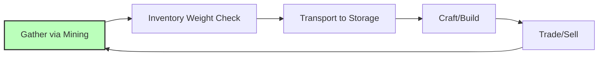

# Voxel Interaction System Specification

**Session**: 3 - Core Gameplay Loops  
**Document**: 01f  
**Status**: SPECIFICATION COMPLETE  
**Last Updated**: 2026-02-01  
**References**: 
- `01-moment-to-moment-gameplay.md` (Gathering mechanics)
- `01c-movement-interaction-spec.md` (Interaction system)
- `01d-tool-system-spec.md` (Tool integration)
- `01e-inventory-system-spec.md` (Weight/encumbrance)
- `01-gameplay-systems-architecture.md` (Technical architecture)
- `planning/meta/technical-constants.md` (Authoritative constants)

---

## Table of Contents

1. [Executive Summary](#1-executive-summary)
2. [Block Interaction Mechanics](#2-block-interaction-mechanics)
3. [Mining System](#3-mining-system)
4. [Building/Placement System](#4-buildingplacement-system)
5. [Tool Integration](#5-tool-integration)
6. [Weight and Encumbrance UI](#6-weight-and-encumbrance-ui)
7. [Inventory Integration](#7-inventory-integration)
8. [Visual and Audio Feedback](#8-visual-and-audio-feedback)
9. [Multiplayer Synchronization](#9-multiplayer-synchronization)
10. [Accessibility and UX](#10-accessibility-and-ux)

---

## 1. Executive Summary

### 1.1 Player-Voxel Interaction Overview

The voxel interaction system is the primary interface between players and the modifiable world of Societies. Built on a 1m³ block grid, this system enables players to harvest resources, shape terrain, and construct structures while maintaining realistic physical constraints through the weight/encumbrance system.

**Core Philosophy**:
- All terrain is modifiable except bedrock (world boundary)
- Physics-based debris (rubble) creates emergent gameplay
- Weight system forces strategic decisions about what to carry
- Tool specialization rewards investment in equipment
- Real-time multiplayer synchronization maintains fair play

### 1.2 Key Interaction Types

| Interaction | Input | Tool Required | Output |
|-------------|-------|---------------|--------|
| **Mining** | Hold Left Mouse | Pickaxe/Shovel/Axe | Blocks + Rubble |
| **Building** | Right Click | Hammer | Placed block |
| **Inspecting** | Hover | None | Block info overlay |
| **Precision Mining** | Hold Ctrl + Mine | Any tool | 0.5m depth layers |

### 1.3 Relationship to Moment-to-Moment Gameplay

Per `01-moment-to-moment-gameplay.md`, voxel interactions form the **foundation of all gameplay loops**:



**Time Investment** (from moment-to-moment spec):
- Stone gathering: 3.4 seconds per block (with iron pickaxe, level 3 skill)
- Wood gathering: 3.4 seconds per block
- Building placement: 1-2 ticks (instant validation)
- Transport time: Variable based on encumbrance

---

## 2. Block Interaction Mechanics

### 2.1 Raycasting for Block Targeting

**Technical Implementation**:
```csharp
public class BlockTargetingSystem : Node3D
{
    // Raycast from camera center (crosshair position)
    private const float MAX_TARGET_DISTANCE = 5.0f; // meters
    private const float RAYCAST_UPDATE_RATE = 0.05f; // Every frame (20 TPS)
    
    public override void _PhysicsProcess(double delta)
    {
        // Update target detection every tick
        UpdateBlockTarget();
    }
    
    private void UpdateBlockTarget()
    {
        Vector3 rayOrigin = _camera.GlobalPosition;
        Vector3 rayDirection = -_camera.GlobalTransform.Basis.Z;
        
        var query = new PhysicsRayQueryParameters3D
        {
            From = rayOrigin,
            To = rayOrigin + rayDirection * MAX_TARGET_DISTANCE,
            CollisionMask = (int)CollisionLayers.VoxelBlocks
        };
        
        var result = GetWorld3D().DirectSpaceState.IntersectRay(query);
        
        if (result.Count > 0)
        {
            Vector3 hitPoint = (Vector3)result["position"];
            Vector3 hitNormal = (Vector3)result["normal"];
            Vector3I blockPos = WorldToBlockCoordinates(hitPoint, hitNormal);
            
            SetTargetBlock(blockPos, hitNormal);
        }
        else
        {
            ClearTargetBlock();
        }
    }
}
```

**Raycast Parameters**:
| Parameter | Value | Justification |
|-----------|-------|---------------|
| Max Distance | 5.0 meters | Balance between reach and precision |
| Update Rate | 20 TPS | Matches game tick rate |
| Collision Layers | VoxelBlocks (Layer 8) | Dedicated layer for interactable blocks |
| Precision | 1mm (3 decimal places) | Accurate block edge detection |

### 2.2 Targeting Range and Precision

**Range Tiers**:
```yaml
Close Range (0-2m):
  Precision: High (±0.01m)
  Use Case: Precision building, detailed mining
  Crosshair: Small dot (4px)

Medium Range (2-4m):
  Precision: Standard (±0.05m)
  Use Case: Standard gathering
  Crosshair: Medium circle (8px)

Far Range (4-5m):
  Precision: Reduced (±0.1m)
  Use Case: Reaching elevated blocks
  Crosshair: Large circle (12px) with fade

Out of Range (>5m):
  Precision: N/A
  Use Case: Identifying distant resources
  Crosshair: Red X indicator
```

**Precision Mechanics**:
- Block targeting uses world-space coordinates quantized to 1m³ grid
- Edge detection: Raycast normal determines which face is targeted
- Sub-block precision: Hold Ctrl for 0.5m layer targeting (shovel only)

### 2.3 Crosshair/Indicator System

**Crosshair States** (extending `01c-movement-interaction-spec.md`):

| State | Visual | Color | Animation | Trigger |
|-------|--------|-------|-----------|---------|
| **Default** | Small dot | White (#FFFFFF) | None | No block targeted |
| **Valid Target** | Square bracket | Cyan (#00FFFF) | Gentle pulse | Block within range, can interact |
| **Mining Ready** | Pickaxe icon | Orange (#FFA500) | Rotation hint | Appropriate tool equipped |
| **Building Ready** | Hammer icon | Blue (#0088FF) | Pulse | Block in hand, valid placement |
| **Invalid Action** | Red circle slash | Red (#FF0000) | Shake | Wrong tool or blocked |
| **Over Encumbered** | Weight icon | Red (#FF0000) | Flash | Cannot carry more |

**Implementation**:
```csharp
public class VoxelCrosshair : Control
{
    private Dictionary<CrosshairState, Texture2D> _stateIcons;
    private Color[] _stateColors;
    
    public void UpdateState(BlockTarget target, ToolType equippedTool)
    {
        if (target == null)
        {
            SetState(CrosshairState.Default);
            return;
        }
        
        if (!CanCarryMoreWeight())
        {
            SetState(CrosshairState.OverEncumbered);
            return;
        }
        
        if (IsValidMiningTarget(target, equippedTool))
        {
            SetState(CrosshairState.MiningReady);
        }
        else if (IsValidBuildingTarget(target))
        {
            SetState(CrosshairState.BuildingReady);
        }
        else
        {
            SetState(CrosshairState.InvalidAction);
        }
    }
}
```

### 2.4 Block Info Display

**Tooltip System** (positioned at screen center-right):
```
┌─ Block Information ────────────┐
│ 🪨 Granite Stone Block         │
│────────────────────────────────│
│ Weight: 50.0 kg                │
│ Hardness: Medium (6s base)     │
│ Tool: Pickaxe (Iron+)          │
│                                │
│ [Hold LMB] Mine                │
│ [RMB] Place block from inv     │
└────────────────────────────────┘
```

**Block Properties Displayed**:
| Property | Example | Source |
|----------|---------|--------|
| Block Type | "Granite Stone" | Voxel database |
| Weight | "50.0 kg" | Block definition |
| Hardness | "Medium (6s)" | Block hardness class |
| Recommended Tool | "Pickaxe" | Tool compatibility matrix |
| Current Inventory | "Stone: 23" | Player inventory |

**UI Positioning**:
- Location: Screen center-right (offset 200px from center)
- Size: 280×160 pixels
- Fade: 0.3s in/out animation
- Auto-hide: 3 seconds after looking away

---

## 3. Mining System

### 3.1 Detailed Mining Mechanics

**Mining State Machine**:
```csharp
public enum MiningState
{
    Idle,           // Not mining
    WindingUp,      // 0.0-0.3s: Tool raise animation
    Striking,       // 0.3-0.8s: Active hit window
    Impact,         // 0.8s: Damage application instant
    Recovery,       // 0.8-1.3s: Return to ready
    Completed       // Block destroyed
}

public class MiningSystem : Node
{
    private MiningState _currentState = MiningState.Idle;
    private float _miningProgress = 0f; // 0.0 to 1.0
    private float _blockHealth = 100f;
    private BlockType _targetBlock;
    private ToolInstance _equippedTool;
    
    private const float BASE_SWING_TIME = 0.9f; // Matches tool spec
    
    public void StartMining(BlockType block, ToolInstance tool)
    {
        _targetBlock = block;
        _equippedTool = tool;
        _blockHealth = block.BaseHealth;
        _miningProgress = 0f;
        _currentState = MiningState.WindingUp;
        
        // Lock player movement during wind-up
        Player.SetMovementLock(true);
    }
    
    public void UpdateMining(float delta)
    {
        if (_currentState == MiningState.Idle) return;
        
        _miningProgress += delta / GetModifiedSwingTime();
        
        // State transitions
        switch (_currentState)
        {
            case MiningState.WindingUp when _miningProgress >= 0.33f:
                _currentState = MiningState.Striking;
                PlayToolSwingSound();
                break;
                
            case MiningState.Striking when _miningProgress >= 0.89f:
                _currentState = MiningState.Impact;
                ApplyMiningDamage();
                break;
                
            case MiningState.Impact:
                _currentState = MiningState.Recovery;
                break;
                
            case MiningState.Recovery when _miningProgress >= 1.0f:
                _currentState = MiningState.Idle;
                Player.SetMovementLock(false);
                
                // Auto-continue if still holding LMB
                if (Input.IsActionPressed("mine") && _blockHealth > 0)
                {
                    StartMining(_targetBlock, _equippedTool);
                }
                break;
        }
    }
}
```

**Mining Timing Constants** (from `01-moment-to-moment-gameplay.md`):
```yaml
Base Gathering Time: 6.0 seconds per block
  - Base from technical-constants: 6s per unit
  
With Iron Pickaxe (1.5× efficiency):
  - Calculation: 6s ÷ 1.5 = 4.0 seconds
  
With Level 3 Gathering Skill (+15%):
  - Calculation: 4.0s × 0.85 = 3.4 seconds
  
Complete Sequence (Stone block):
  - Wind-up: 0.3s
  - Strike: 0.5s  
  - Impact: Instant
  - Recovery: 0.5s
  - Total: 1.3s per hit
  - Hits to destroy: ~3 (varies by block health)
  - Total time: 3.9-4.2s
```

### 3.2 Tool Selection and Effectiveness

**Tool-Block Compatibility Matrix**:

| Block Type | Stone Tool | Iron Tool | Steel Tool | Wrong Tool |
|------------|------------|-----------|------------|------------|
| **Dirt/Soil** | 100% speed | 150% speed | 200% speed | 50% speed |
| **Stone** | 100% speed | 150% speed | 200% speed | 25% speed |
| **Ore** | 50% (fail 25%) | 100% speed | 150% speed | 10% speed |
| **Wood** | 100% speed | 150% speed | 200% speed | 30% speed |
| **Bedrock** | Cannot mine | Cannot mine | Can mine (slow) | Cannot |

**Effectiveness Calculation**:
```csharp
float CalculateMiningSpeed(BlockType block, ToolInstance tool, int skillLevel)
{
    // Base time from block definition
    float baseTime = block.BaseMiningTime; // e.g., 6.0s
    
    // Tool efficiency multiplier (from tool spec)
    float toolEfficiency = tool.Efficiency; // 1.0, 1.5, or 2.0
    
    // Skill bonus (5% per level from technical-constants)
    float skillBonus = 1.0f + (skillLevel * 0.05f);
    
    // Tool-block compatibility
    float compatibility = GetCompatibilityMultiplier(tool.Type, block.Type);
    
    // Final calculation
    float modifiedTime = baseTime / (toolEfficiency * skillBonus * compatibility);
    
    return modifiedTime;
}
```

### 3.3 Mining Speed and Progress

**Progress Visualization**:
```
Mining Progress Bar (appears on first hit):
┌────────────────────────────┐
│ ████████████████░░░░ 67%   │
│ Granite Stone              │
│ ~2.0s remaining            │
└────────────────────────────┘
```

**Progress Bar Properties**:
- Position: World-space, floating above targeted block
- Size: 120×24 pixels
- Color: Green → Yellow → Orange → Red (based on progress)
- Show time remaining: Calculated from current speed
- Fade: 0.5s after mining stops

**Mining Speed Modifiers**:
| Factor | Effect | Stackable |
|--------|--------|-----------|
| Tool Tier | -33% to -50% time | No (highest applies) |
| Skill Level | -5% per level | Yes |
| Stamina | -20% if <30 stamina | No |
| Buffs | Variable | Yes |
| Multiplayer | No change per player | - |

### 3.4 Durability Consumption

**Durability Mechanics** (from `01d-tool-system-spec.md`):
```csharp
void ApplyDurabilityCost(ToolInstance tool, BlockType block)
{
    // Base cost: 1 durability per use
    int baseCost = 1;
    
    // Wrong material penalty: 5 durability
    if (!IsCorrectTool(tool.Type, block.Type))
    {
        baseCost = 5;
        ShowWarning("Wrong tool for this material!");
    }
    
    // Catastrophic failure chance: 1% at 0 durability
    if (tool.Durability <= 0 && Random.Range(0, 100) < 1)
    {
        baseCost = 10; // Major damage
        PlaySound("tool_break.wav");
    }
    
    // Skill preservation (Session 2 - skills reference)
    int skillLevel = Player.GetSkillLevel(SkillType.Gathering);
    float preservation = skillLevel * 0.1f; // 0-1.0
    int finalCost = Mathf.RoundToInt(baseCost * (1.0f - preservation));
    
    tool.Durability -= Mathf.Max(1, finalCost);
}
```

**Durability Warning Thresholds**:
| Durability % | Visual | Audio | Effect |
|--------------|--------|-------|--------|
| 100-70% | Green bar | Normal | Full effectiveness |
| 69-30% | Yellow bar | Normal | -5% effectiveness |
| 29-10% | Orange bar | Warning sound | -20% effectiveness |
| 9-1% | Red flashing | Critical sound | -50% effectiveness, break risk |
| 0% | Broken icon | Break sound | Tool unusable |

### 3.5 Breaking Animations and Effects

**Phase-by-Phase Animation**:

**Phase 1: Wind-up (0.0-0.3s)**
```yaml
Animation:
  - Tool raises from idle position
  - Character torso twists toward target
  - Camera: Slight zoom (FOV 90° → 85°)
  
Audio:
  - Subtle tool movement sound
  - Volume: -20dB
  - 3D positional audio based on tool type
```

**Phase 2: Strike (0.3-0.8s)**
```yaml
Animation:
  - Tool arc motion toward block
  - Full arm/body commitment
  - Particle pre-spawn at impact point
  
Audio:
  - Wind rush (whoosh)
  - Volume: -15dB
  - Pitch randomized ±5% for variety
  
Visual:
  - Motion blur on fast-moving tool parts
  - Dust particles begin spawning
```

**Phase 3: Impact (0.8s)**
```yaml
Animation:
  - Tool "sticks" in block briefly
  - Block shake animation
  - Material-specific debris burst
  
Audio:
  - Material-specific impact sound:
    - Stone: Sharp crack
    - Wood: Solid thud
    - Dirt: Soft impact
    - Metal: Clang
  - Volume: -10dB
  - Randomized pitch
  
Particles:
  Stone:
    - 10-15 gray chips
    - 3-5 spark particles (if metal tool)
    - Dust cloud (1.5s duration)
  
  Wood:
    - 8-12 brown/tan chips
    - Wood dust (tan colored)
    - Bark fragments (if tree)
  
  Dirt:
    - 15-20 soil particles
    - Dust cloud (2.0s)
    - No sparks
  
Physics:
  - Screen shake: 0.02-0.03m displacement
  - Duration: 0.1s
  - Frequency: 15Hz
```

**Phase 4: Block Destruction**
```yaml
Trigger: Block health reaches 0

Animation:
  - Block cracks propagate (0.2s)
  - Block separates into pieces (0.3s)
  - Pieces fall with physics (gravity 9.8 m/s²)
  
Rubble Spawn:
  - 4-6 physics debris objects
  - Size: 0.2-0.4m per piece
  - Mass: Proportional to material density
  - Lifetime: 5 minutes
  - Auto-pickup: Enabled for first 30 seconds
  
Audio:
  - Destruction sound:
    - Stone: Crumble/crash
    - Wood: Crack/snap
    - Dirt: Soft thud
  - Volume: -8dB
  - Echo for large blocks
  
Visual:
  - Debris physics simulation
  - Dust explosion particles
  - Small screen shake (0.05m)
  - XP floating text: "+5 XP" (Gathering skill)
```

---

## 4. Building/Placement System

### 4.1 Block Placement Mechanics

**Placement Validation Pipeline**:
```csharp
public class BlockPlacementSystem : Node
{
    public PlacementResult ValidatePlacement(Vector3I position, BlockType blockType)
    {
        // 1. Check if position is within build range
        float distance = Player.Position.DistanceTo(position);
        if (distance > MAX_BUILD_DISTANCE) // 5.0m
            return PlacementResult.TooFar;
        
        // 2. Check if player has block in inventory
        if (!Player.Inventory.HasItem(blockType.ItemId, 1))
            return PlacementResult.NoMaterials;
        
        // 3. Check if position is occupied
        if (World.GetBlock(position) != BlockType.Air)
            return PlacementResult.Occupied;
        
        // 4. Check for ground support
        if (!HasGroundSupport(position, blockType))
            return PlacementResult.NoSupport;
        
        // 5. Check claim permissions (Session 5 - governance)
        if (!HasBuildPermission(position))
            return PlacementResult.NoPermission;
        
        // 6. Check line of sight
        if (!HasLineOfSight(position))
            return PlacementResult.Blocked;
        
        return PlacementResult.Valid;
    }
}
```

**Placement Constraints**:
| Constraint | Value | Reason |
|------------|-------|--------|
| Max Distance | 5.0 meters | Balance precision with reach |
| Min Distance | 0.5 meters | Prevent placing inside player |
| Max Height Diff | 2.0 meters | Prevent excessive bridging |
| Ground Support | Required | Physics simulation |
| Claim Check | Required | Property rights (Session 5) |

### 4.2 Placement Preview (Ghost Blocks)

**Ghost Block Rendering**:
```csharp
public class GhostBlockRenderer : Node3D
{
    private MeshInstance3D _ghostMesh;
    private StandardMaterial3D _ghostMaterial;
    
    private Color VALID_COLOR = new Color(0, 0.5f, 1, 0.5f);   // Blue, 50% opacity
    private Color INVALID_COLOR = new Color(1, 0, 0, 0.5f);     // Red, 50% opacity
    
    public void UpdateGhostBlock(Vector3I position, BlockType type, PlacementResult validity)
    {
        if (_ghostMesh == null)
        {
            _ghostMesh = new MeshInstance3D();
            _ghostMesh.Mesh = type.GetMesh();
            _ghostMaterial = new StandardMaterial3D
            {
                Transparency = BaseMaterial3D.TransparencyEnum.Alpha,
                CullMode = BaseMaterial3D.CullModeEnum.Disabled,
                NoDepthTest = true // Always visible
            };
            _ghostMesh.MaterialOverride = _ghostMaterial;
            AddChild(_ghostMesh);
        }
        
        _ghostMesh.Position = BlockToWorldPosition(position);
        _ghostMaterial.AlbedoColor = validity == PlacementResult.Valid ? VALID_COLOR : INVALID_COLOR;
        
        // Pulse animation for valid placement
        if (validity == PlacementResult.Valid)
        {
            float pulse = (Mathf.Sin(Time.GetTimeDictFromSystem()["second"] * 2) + 1) * 0.1f;
            _ghostMaterial.AlbedoColor = VALID_COLOR with { A = 0.5f + pulse };
        }
    }
}
```

**Ghost Block Properties**:
- Opacity: 50% (semi-transparent)
- Valid: Blue tint (#0080FF80)
- Invalid: Red tint (#FF000080)
- Animation: Gentle pulse for valid (2s cycle)
- Wireframe: Optional setting for clarity
- Snap indicator: Shows exact grid position

### 4.3 Rotation and Orientation

**Block Rotation System**:
```yaml
Default Orientation:
  - Facing: Player view direction
  - Alignment: Snapped to nearest 90°
  
Rotation Controls:
  Mouse Scroll: 15° increments
  Q/E Keys: 90° snap rotation
  R Key: Reset to default
  
Special Cases:
  Stairs: Auto-orient to face player
  Logs: Can place vertical or horizontal
  Furniture: 4 cardinal directions only
```

**Rotation Visual Feedback**:
```
Rotation Indicator:
┌────────────────────────┐
│ Rotation: 45°          │
│ Press Q/E for 90° snap │
│ Scroll for fine adjust │
└────────────────────────┘
```

### 4.4 Placement Validation

**Validation Checklist**:
```csharp
public enum PlacementResult
{
    Valid,           // Can place
    TooFar,          // >5m from player
    NoMaterials,     // Not in inventory
    Occupied,        // Block already there
    NoSupport,       // No adjacent block support
    NoPermission,    // Claim restriction
    Blocked,         // Line of sight blocked
    InvalidOrientation, // Rotation not allowed
    TooHeavy         // Would exceed weight limit
}

public string GetPlacementErrorMessage(PlacementResult result)
{
    return result switch
    {
        PlacementResult.TooFar => "Too far away (max 5m)",
        PlacementResult.NoMaterials => $"Need 1x {blockType.Name}",
        PlacementResult.Occupied => "Space already occupied",
        PlacementResult.NoSupport => "Needs ground or block support",
        PlacementResult.NoPermission => "You don't have permission here",
        PlacementResult.Blocked => "Line of sight blocked",
        _ => "Cannot place here"
    };
}
```

### 4.5 Snap-to-Grid Behavior

**Grid Snapping**:
```yaml
Primary Grid: 1.0m (standard block size)
  - All blocks snap to 1m grid
  - Position: Vector3I (integer coordinates)
  
Fine Mode: 0.5m (hold Alt)
  - For half-block placement
  - Shovel depth: 0.5m layers
  - Stairs: 0.5m rise
  
Free Mode: 0.1m (hold Shift)
  - For furniture/detailed building
  - Not available for terrain blocks
  - Available for decorative items
  
Elevation: 0.5m increments
  - Up/Down arrows: ±0.5m
  - Page Up/Down: ±2.0m
```

**Snap Visualization**:
- Grid lines: Optional overlay
- Snap indicator: Highlight grid intersection
- Elevation indicator: Shows height offset

---

## 5. Tool Integration

### 5.1 Integration with Tool System

**Tool-Voxel Mapping** (from `01d-tool-system-spec.md`):

| Tool | Voxel Action | Block Types | Special Mechanics |
|------|--------------|-------------|-------------------|
| **Pickaxe** | Mine stone/ore | Stone, Ore, Bedrock | Tier determines ore types |
| **Shovel** | Dig soil/sand | Dirt, Sand, Gravel | 0.5m depth per dig |
| **Axe** | Chop wood | Logs, Planks, Trees | Tree-felling mechanic |
| **Hammer** | Place/Build | All placeable blocks | Required to confirm placement |
| **Hoe** | Till soil | Grass, Dirt | Prepares farmland |

### 5.2 Shovel Mechanics (0.5m Depth Spec)

**Shovel Depth System**:
```csharp
public class ShovelDiggingSystem : Node
{
    private const float DIG_DEPTH = 0.5f; // meters
    
    public void DigAtPosition(Vector3 position, Vector3 normal)
    {
        // Determine block and depth layer
        Vector3I blockPos = WorldToBlockCoordinates(position);
        float depthWithinBlock = CalculateDepthWithinBlock(position, normal);
        
        // Round to nearest 0.5m layer
        int layer = Mathf.FloorToInt(depthWithinBlock / DIG_DEPTH);
        
        // Remove 0.5m layer from block
        RemoveBlockLayer(blockPos, layer);
        
        // Spawn terrain block item (0.5m³ worth of material)
        SpawnTerrainItem(blockPos, layer);
        
        // Create hole mesh
        UpdateBlockMesh(blockPos, layer);
    }
    
    private void RemoveBlockLayer(Vector3I blockPos, int layer)
    {
        // Block now has a "hole" at specified layer
        // Visual: Indentation in block mesh
        // Physical: Modified collision
        // Can dig up to 2m deep (4 layers)
    }
}
```

**Shovel Digging Properties**:
```yaml
Depth per Dig: 0.5 meters
Max Hole Depth: 2.0 meters (4 layers)
Hole Uses:
  - Storage pits (bury chests)
  - Building foundations
  - Traps
  - Water drainage
  
Terrain Modification:
  - Permanent world change
  - Affects pathfinding (AI sees as obstacle)
  - Water can fill holes
  - Can be filled back in (place dirt block)
```

**Visual Representation**:
```
Before Dig:
┌─────────┐
│ ███████ │  1m block
│ ███████ │
└─────────┘

After 1st Dig (0.5m):
┌─────────┐
│ ░░░░░░░ │  0.5m empty space
│ ███████ │  0.5m remaining
└─────────┘

After 2nd Dig (1.0m):
┌─────────┐
│ ░░░░░░░ │
│ ░░░░░░░ │
└─────────┘
  Full hole
```

### 5.3 Pickaxe, Axe, Hoe Implementations

**Pickaxe Mining** (from `01d-tool-system-spec.md`):
```yaml
Animation Sequence:
  1. Wind-up: 0.5s (raise overhead)
  2. Strike: 0.15s (downward strike)
  3. Recovery: 0.4s (extract from material)
  4. Total: 1.05s base

Mining Capabilities by Tier:
  Stone Tier:
    - Can mine: Stone, surface coal
    - Cannot mine: Iron ore, deep ores
    - Failure chance: 25% on hard stone
  
  Iron Tier:
    - Can mine: Stone, coal, iron ore, copper
    - Ore detection: 5% chance to reveal adjacent ore
  
  Steel Tier:
    - Can mine: All ores, gems, bedrock
    - Ore detection: 15% chance
    - Critical strike: 10% for double ore
```

**Axe Wood Gathering**:
```yaml
Animation Sequence:
  1. Wind-up: 0.4s (raise overhead)
  2. Strike: 0.2s (downward chop)
  3. Recovery: 0.3s (return to ready)
  4. Total: 0.9s base

Tree Felling Mechanics:
  - Small tree: 3-4 chops
  - Medium tree: 5-7 chops  
  - Large tree: 8-12 chops
  - Final chop triggers "fall" animation
  
Yields by Tier:
  Stone: 3-8 wood units
  Iron: 4-9 wood units (+10%)
  Steel: 5-10 wood units (+25%)
```

**Hoe Tilling**:
```yaml
Animation Sequence:
  1. Draw back: 0.3s
  2. Strike: 0.2s (chop into soil)
  3. Pull: 0.3s (turning soil)
  4. Total: 0.8s base

Tilling Results:
  Stone hoe: Quality 1-2 soil
  Iron hoe: Quality 2-3 soil
  Steel hoe: Quality 3-5 soil (auto-fertilized)
  
Soil Quality Effects:
  - Crop yield: +10-50% based on quality
  - Retention: 3 days without crops
  - Decay: Reverts to dirt after 7 days untended
```

### 5.4 Advanced Tools (Future Expansion)

**Post-MVP Tool Expansion**:
```yaml
Electric Drill:
  - Speed: 300% of pickaxe
  - Power requirement: Battery/charged
  - Auto-collect: Items go directly to inventory
  - Maintenance: Periodic repair needed

Jackhammer:
  - Speed: 400% for soft stone
  - Area effect: 3×3 block area
  - Fuel: Gas/electric
  - Vibration: Screen shake effect

Excavator (Vehicle):
  - Speed: 10× manual digging
  - Capacity: 20 blocks per scoop
  - Fuel: Diesel
  - Training: Requires skill unlock
  
Diamond-Tipped Tools:
  - Speed: 400% of steel
  - Durability: 2000+ uses
  - Can mine: Any material instantly
  - Rare: Late-game/legendary tier
```

---

## 6. Weight and Encumbrance UI

### 6.1 Carrying Capacity Display

**Weight Bar UI** (from `01e-inventory-system-spec.md`):
```
┌─ Weight Status ──────────────────┐
│                                  │
│  45.0 / 100.0 kg (45%)           │
│  ████████████████████░░░░░░░░░░  │
│                                  │
│  Status: Light Load ✓            │
│  Movement: 100% speed            │
│                                  │
└──────────────────────────────────┘
```

**Weight Display Properties**:
| Element | Specification | Reference |
|---------|--------------|-----------|
| Position | Bottom-left of screen (above hotbar) | `01e-inventory-system-spec.md` |
| Size | 300×40 pixels | Consistent with inventory spec |
| Bar Width | 280 pixels | 64px per slot reference |
| Height | 24 pixels | Standard UI element |
| Update Rate | Real-time | Weight changes immediately |
| Decimal Places | 1 (e.g., 45.5 kg) | Precision display |

**Weight Calculation**:
```csharp
public float CalculateCurrentWeight()
{
    float totalWeight = 0f;
    
    // Sum all inventory items
    foreach (var slot in Inventory.Slots)
    {
        if (slot.HasItem)
        {
            totalWeight += slot.Item.Weight * slot.Quantity;
        }
    }
    
    // Include equipped items (tools, armor)
    totalWeight += Equipment.GetTotalWeight();
    
    return totalWeight; // Max 100.0 kg per technical-constants
}
```

### 6.2 Weight Bar/Indicator

**Visual Weight Bar**:
```yaml
Bar Segments:
  - Light (0-50%): Green (#00FF00) - 50% of bar
  - Medium (51-75%): Yellow (#FFFF00) - 25% of bar
  - Heavy (76-90%): Orange (#FFA500) - 15% of bar
  - Overburdened (91-100%): Red (#FF0000) - 10% of bar

Animation:
  - Normal: Static fill
  - Warning (>90%): Gentle pulse (2s cycle)
  - Critical (>95%): Rapid pulse (0.5s cycle)
  - Max (100%): Flashing red overlay

Text Display:
  - Current: "45.0 kg"
  - Max: "/ 100.0 kg"
  - Percentage: "(45%)"
  - Status: "Light Load", "Medium Load", "Heavy Load", "OVERBURDENED"
```

**Implementation**:
```csharp
public class WeightBarUI : Control
{
    private ProgressBar _weightBar;
    private Label _weightText;
    private Label _statusText;
    
    public void UpdateWeightDisplay(float currentWeight, float maxWeight)
    {
        float ratio = currentWeight / maxWeight;
        _weightBar.Value = ratio * 100f;
        
        // Color coding
        if (ratio <= 0.5f)
            _weightBar.Modulate = Colors.Green;
        else if (ratio <= 0.75f)
            _weightBar.Modulate = Colors.Yellow;
        else if (ratio <= 0.9f)
            _weightBar.Modulate = Colors.Orange;
        else
            _weightBar.Modulate = Colors.Red;
        
        // Text update
        _weightText.Text = $"{currentWeight:F1} / {maxWeight:F1} kg ({ratio*100:F0}%)";
        _statusText.Text = GetEncumbranceStatus(ratio);
        
        // Animation triggers
        if (ratio > 0.95f)
            StartCriticalAnimation();
        else if (ratio > 0.9f)
            StartWarningAnimation();
        else
            StopAnimation();
    }
}
```

### 6.3 Encumbrance Warnings

**Warning System** (from `01c-movement-interaction-spec.md`):

| Threshold | Visual Warning | Audio Warning | Effect |
|-----------|---------------|---------------|--------|
| **75%** | Yellow bar | None | -10% speed |
| **80%** | Text: "Getting heavy" | Subtle grunt | Sprint disabled |
| **90%** | Orange bar, pulse | Heavy breathing | -25% speed, +50% stamina drain |
| **95%** | Red border flash | Warning chime | Cannot jump |
| **100%** | Full red overlay | Critical alert | Cannot move, must drop items |

**Warning Messages**:
```csharp
public string GetEncumbranceWarning(float ratio)
{
    return ratio switch
    {
        > 1.0f => "⚠️ IMMOBILIZED - DROP ITEMS IMMEDIATELY",
        > 0.95f => "⚠️ CRITICAL: Cannot carry more! Drop items!",
        > 0.90f => "⚠️ Heavy Load: Movement severely slowed",
        > 0.75f => "Medium Load: Movement reduced",
        _ => null // No warning
    };
}
```

### 6.4 Speed Reduction Feedback

**Movement Feedback** (integrating with `01c-movement-interaction-spec.md`):

**Speed Modifiers by Encumbrance**:
```yaml
Light Load (0-50%):
  Walk Speed: 100% (3.0 m/s)
  Sprint Speed: 100% (6.0 m/s)
  Animation: Normal

Medium Load (51-75%):
  Walk Speed: 90% (2.7 m/s)
  Sprint Speed: 90% (5.4 m/s)
  Animation: Slightly labored

Heavy Load (76-90%):
  Walk Speed: 75% (2.25 m/s)
  Sprint: DISABLED
  Animation: Heavy breathing, slower steps
  Stamina Drain: +50%

Overburdened (91-100%):
  Walk Speed: 50% (1.5 m/s)
  Sprint: DISABLED
  Jump: DISABLED
  Animation: Strained movement, heavy breathing
  Stamina Drain: +100%
  Health: -0.5 HP/min above 95%
```

**Visual Feedback**:
- Character animation: Adjusted speed, breathing effects
- Camera: Slight sway increase with load
- Audio: Footstep volume increase, breathing loop
- Screen: Vignette darkening at edges (10-30% intensity)

---

## 7. Inventory Integration

### 7.1 Mining Adds Blocks to Inventory

**Auto-Collection System**:
```csharp
public class MiningInventoryIntegration : Node
{
    public void OnBlockMined(BlockType block, Vector3 position, ToolType tool)
    {
        // Calculate yield
        int baseYield = block.BaseYield;
        float skillBonus = Player.GetSkillBonus(SkillType.Gathering);
        float toolBonus = tool.GetYieldBonus();
        
        int finalYield = Mathf.RoundToInt(baseYield * skillBonus * toolBonus);
        
        // Create item stack
        var item = new ItemStack(block.ItemId, finalYield);
        
        // Calculate weight
        float itemWeight = item.TotalWeight;
        float currentWeight = Player.Inventory.GetCurrentWeight();
        float maxWeight = Player.Inventory.MaxWeight; // 100.0 kg
        
        // Weight check
        if (currentWeight + itemWeight > maxWeight)
        {
            // Cannot carry - spawn rubble on ground
            SpawnMiningRubble(block, position, finalYield);
            ShowWarning("Too heavy! Items dropped at feet.");
        }
        else
        {
            // Add to inventory
            bool added = Player.Inventory.TryAddItem(item);
            
            if (added)
            {
                ShowCollectionPopup($"+{finalYield} {block.Name}");
                PlayCollectionSound(block.Type);
            }
            else
            {
                // Inventory full (slots, not weight)
                SpawnMiningRubble(block, position, finalYield);
            }
        }
    }
}
```

**Collection Popup**:
```
┌──────────────┐
│ +5 Stone 🪨  │  ← Floats up from block position
│ +3 Rubble    │
└──────────────┘
  Animation: Float up + fade out over 2s
  Color: White with item icon
```

### 7.2 Inventory Weight Limits

**Weight Limit Enforcement**:
```csharp
public class WeightLimitEnforcer : Node
{
    public bool CanAddItem(ItemStack item)
    {
        float currentWeight = CalculateCurrentWeight();
        float itemWeight = item.Weight * item.Quantity;
        float projectedWeight = currentWeight + itemWeight;
        
        // Hard cap at 100 kg
        if (projectedWeight > MAX_WEIGHT)
        {
            // Check for partial addition
            float remainingCapacity = MAX_WEIGHT - currentWeight;
            int maxAddable = Mathf.FloorToInt(remainingCapacity / item.Weight);
            
            if (maxAddable > 0)
            {
                // Add partial stack
                var partial = new ItemStack(item.ItemId, maxAddable);
                Player.Inventory.AddItem(partial);
                
                // Drop remainder as rubble
                int remainder = item.Quantity - maxAddable;
                SpawnRubble(item.ItemId, remainder);
                
                ShowWarning($"Partial pickup: {maxAddable} added, {remainder} dropped");
                return true;
            }
            
            return false; // Cannot add any
        }
        
        return true;
    }
}
```

**Weight Overflow Behavior**:
```yaml
Scenario 1: Mining adds exactly to limit
  - Current: 95 kg
  - Mining adds: 5 kg stone
  - Result: Full at 100 kg
  - Next mining: Cannot pick up, drops as rubble

Scenario 2: Mining exceeds limit
  - Current: 90 kg
  - Mining adds: 15 kg ore
  - Result: Can only carry 10 kg
  - Overflow: 5 kg drops as rubble at feet

Scenario 3: Already overburdened
  - Current: 100 kg
  - Attempt to mine: Blocked
  - Message: "You are overburdened!"
```

### 7.3 Stack Sizes and Weight

**Block Stack Sizes** (from `01e-inventory-system-spec.md`):

| Block Type | Stack Size | Unit Weight | Max Stack Weight |
|------------|-----------|-------------|------------------|
| **Stone** | 50 | 2.0 kg | 100 kg |
| **Dirt** | 100 | 0.5 kg | 50 kg |
| **Wood** | 100 | 0.5 kg | 50 kg |
| **Ore** | 50 | 2.0 kg | 100 kg |
| **Sand** | 100 | 0.6 kg | 60 kg |
| **Gravel** | 50 | 1.5 kg | 75 kg |
| **Clay** | 50 | 1.0 kg | 50 kg |

**Inventory Capacity Example**:
```
Full Stone Stack:
  - 50 stone × 2.0 kg = 100 kg
  - Occupies 1 slot
  - Maximum for weight limit

Mixed Load Example:
  - Slot 1: Stone × 25 (50 kg)
  - Slot 2: Wood × 50 (25 kg)
  - Slot 3: Tools × 3 (9 kg)
  - Slot 4: Food × 20 (2 kg)
  - Total: 86 kg / 100 kg
  - Remaining capacity: 14 kg
```

### 7.4 Auto-Pickup of Rubble

**Rubble Physics and Collection**:
```csharp
public class RubblePhysicsSystem : Node
{
    private const float RUBBLE_LIFETIME = 300f; // 5 minutes
    private const float AUTO_PICKUP_RADIUS = 2.0f; // meters
    private const float AUTO_PICKUP_DELAY = 1.0f; // 1 second after spawn
    
    public void SpawnRubble(BlockType block, Vector3 position, int quantity)
    {
        // Create 4-6 physics debris objects
        int rubbleCount = Mathf.Min(6, Mathf.Max(4, quantity / 10));
        
        for (int i = 0; i < rubbleCount; i++)
        {
            var rubble = RubbleScene.Instantiate<RigidBody3D>();
            rubble.Position = position + RandomOffset(0.5f);
            rubble.Mass = block.Density * 0.2f;
            
            // Apply random velocity
            rubble.ApplyImpulse(RandomDirection() * Random.Range(2f, 5f));
            
            // Metadata
            rubble.SetMeta("item_id", block.ItemId);
            rubble.SetMeta("quantity", quantity / rubbleCount);
            rubble.SetMeta("spawn_time", Time.GetTimeDictFromSystem()["second"]);
            
            World.AddChild(rubble);
        }
    }
    
    public override void _Process(double delta)
    {
        // Check for auto-pickup
        foreach (var rubble in GetNearbyRubble(Player.Position, AUTO_PICKUP_RADIUS))
        {
            float age = Time.GetTimeDictFromSystem()["second"] - rubble.GetMeta<float>("spawn_time");
            
            if (age > AUTO_PICKUP_DELAY && CanPickupRubble(rubble))
            {
                AutoCollectRubble(rubble);
            }
        }
    }
    
    private void AutoCollectRubble(RigidBody3D rubble)
    {
        var itemId = rubble.GetMeta<int>("item_id");
        var quantity = rubble.GetMeta<int>("quantity");
        
        var item = new ItemStack(itemId, quantity);
        
        if (Player.Inventory.TryAddItem(item))
        {
            // Successful pickup
            PlayPickupSound();
            ShowFloatingText($"+{quantity}");
            rubble.QueueFree();
        }
    }
}
```

**Rubble Properties**:
```yaml
Physics:
  - Collision: Enabled for 10 seconds
  - Bounce: Material-dependent
  - Lifetime: 5 minutes
  - Despawn: Fade out over 5 seconds

Visual:
  - Size: 0.2-0.4m chunks
  - Texture: Original block texture
  - Shadow: Small dynamic shadow

Collection:
  - Auto-pickup: After 1 second, within 2m
  - Manual pickup: E key (raycast)
  - Priority: Auto-pickup closest first
  - Weight check: Must have capacity
```

---

## 8. Visual and Audio Feedback

### 8.1 Block Breaking Particles

**Particle System Specifications**:

**Stone Block Destruction**:
```yaml
Particle Types:
  Stone Chips:
    Count: 10-15
    Size: 0.05-0.15m
    Color: Gray variations (#808080 to #A0A0A0)
    Lifetime: 1.5 seconds
    Velocity: 2-5 m/s random spread
    Gravity: 9.8 m/s²
    Bounce: 0.3 restitution
  
  Dust Cloud:
    Count: 50-80
    Size: 0.02-0.08m
    Color: Light gray (#C0C0C0)
    Lifetime: 2.0 seconds
    Velocity: 0.5-2 m/s upward
    Gravity: 2.0 m/s² (floats)
    Fade: Alpha 100% → 0%
  
  Sparks (if metal tool):
    Count: 3-5
    Size: 0.01-0.03m
    Color: Orange/Yellow (#FFA500 to #FFFF00)
    Lifetime: 0.5 seconds
    Velocity: 3-6 m/s
    Light: Small point light (0.2s)
```

**Wood Block Destruction**:
```yaml
Particle Types:
  Wood Chips:
    Count: 8-12
    Size: 0.1-0.2m
    Color: Brown/tan (#8B4513 to #D2691E)
    Lifetime: 1.5 seconds
    Velocity: 2-4 m/s
    Gravity: 9.8 m/s²
  
  Wood Dust:
    Count: 30-50
    Size: 0.02-0.06m
    Color: Sawdust beige (#F5F5DC)
    Lifetime: 1.8 seconds
    Velocity: 0.3-1.5 m/s
  
  Bark Fragments (if tree):
    Count: 5-8
    Size: 0.08-0.15m
    Color: Dark brown (#654321)
    Lifetime: 2.0 seconds
    Flat: True (paper-like physics)
```

### 8.2 Sound Effects per Material

**Audio Specification** (integrating with `01d-tool-system-spec.md`):

**Stone Mining Sounds**:
```yaml
Impact Sounds:
  Stone_Soft_Impact:
    File: stone_impact_01.wav to stone_impact_03.wav
    Volume: -10dB
    Pitch: 0.9-1.1 (randomized)
    Duration: 0.3s
  
  Stone_Hard_Impact:
    File: stone_crack_01.wav to stone_crack_03.wav
    Volume: -8dB
    Pitch: 0.85-1.15
    Duration: 0.4s
  
  Stone_Destroy:
    File: stone_break_01.wav to stone_break_02.wav
    Volume: -6dB
    Pitch: 0.9-1.1
    Duration: 0.8s
    Variation: Crumble + echo
```

**Wood Mining Sounds**:
```yaml
Impact Sounds:
  Wood_Soft_Impact:
    File: wood_chop_01.wav to wood_chop_04.wav
    Volume: -12dB
    Pitch: 0.95-1.05
    Duration: 0.25s
  
  Wood_Hard_Impact:
    File: wood_crack_01.wav to wood_crack_02.wav
    Volume: -10dB
    Pitch: 0.9-1.1
    Duration: 0.35s
  
  Wood_Destroy:
    File: tree_fall_01.wav to tree_fall_02.wav
    Volume: -8dB
    Pitch: 0.95-1.0
    Duration: 1.2s
    Variation: Crack + fall + impact
```

**Soil/Dirt Mining Sounds**:
```yaml
Impact Sounds:
  Dirt_Impact:
    File: dirt_thud_01.wav to dirt_thud_03.wav
    Volume: -15dB
    Pitch: 0.9-1.2
    Duration: 0.2s
    Muffled: True (soft impact)
  
  Dirt_Destroy:
    File: dirt_crumble_01.wav
    Volume: -12dB
    Pitch: 0.95-1.05
    Duration: 0.4s
```

**Tool-Specific Sounds**:
```yaml
Tool Swing:
  Pickaxe:
    File: pickaxe_swing_01.wav
    Volume: -20dB
    Pitch: 1.0
    Duration: 0.3s
  
  Axe:
    File: axe_swing_01.wav
    Volume: -20dB
    Pitch: 1.0
    Duration: 0.2s
  
  Shovel:
    File: shovel_swing_01.wav
    Volume: -22dB
    Pitch: 1.0
    Duration: 0.25s
```

### 8.3 Screen Shake/Feedback

**Screen Shake System**:
```csharp
public class ScreenShakeSystem : Node
{
    private Camera3D _camera;
    private float _shakeIntensity = 0f;
    private float _shakeDuration = 0f;
    
    public void TriggerShake(float intensity, float duration)
    {
        _shakeIntensity = Mathf.Max(_shakeIntensity, intensity);
        _shakeDuration = Mathf.Max(_shakeDuration, duration);
    }
    
    public override void _Process(double delta)
    {
        if (_shakeDuration > 0)
        {
            // Perlin noise for smooth shake
            float shakeX = Mathf.PerlinNoise(0, Time.GetTimeDictFromSystem()["second"] * 20) * _shakeIntensity;
            float shakeY = Mathf.PerlinNoise(100, Time.GetTimeDictFromSystem()["second"] * 20) * _shakeIntensity;
            
            _camera.HOffset = shakeX;
            _camera.VOffset = shakeY;
            
            _shakeDuration -= (float)delta;
            _shakeIntensity = Mathf.Lerp(_shakeIntensity, 0f, (float)delta / _shakeDuration);
        }
        else
        {
            _camera.HOffset = 0;
            _camera.VOffset = 0;
        }
    }
}
```

**Shake Intensity by Action**:
| Action | Intensity | Duration | Frequency |
|--------|-----------|----------|-----------|
| Stone impact | 0.02m | 0.1s | 15Hz |
| Stone destroy | 0.05m | 0.2s | 12Hz |
| Wood impact | 0.015m | 0.08s | 18Hz |
| Wood destroy (tree) | 0.08m | 0.5s | 10Hz |
| Dirt impact | 0.01m | 0.05s | 20Hz |
| Tool break | 0.1m | 0.3s | 8Hz |

**Additional Feedback**:
```yaml
Controller Vibration:
  Impact: Light rumble (0.1s)
  Destroy: Medium rumble (0.2s)
  Tree Fall: Strong rumble (0.5s)

Visual Flash:
  Impact: Brief white flash (0.05s, 10% opacity)
  Critical: Red flash (0.1s, 20% opacity)

Damage Vignette:
  Heavy mining: Darkened edges (10% intensity)
  Over-encumbered: Red edges (20% intensity)
```

### 8.4 Rubble Physics Effects

**Rubble Physics Properties**:
```yaml
Collision Shape:
  Type: Convex polygon or box
  Size: Proportional to visual mesh (0.2-0.4m)
  
Physics Material:
  Stone:
    Friction: 0.7
    Bounciness: 0.2
    Mass: 5-10 kg
  
  Wood:
    Friction: 0.5
    Bounciness: 0.1
    Mass: 1-3 kg
  
  Dirt:
    Friction: 0.9
    Bounciness: 0.0
    Mass: 3-5 kg

Initial Velocity:
  Direction: Radial spread from impact point
  Magnitude: 2-5 m/s
  Upward bias: +1 m/s Y component

Lifetime:
  Physics active: 10 seconds
  Collision disabled: After 10s (static)
  Despawn: 5 minutes total
  Fade out: Last 5 seconds

Optimization:
  Max rubble count: 50 per player
  Culling: Not rendered if >50m away
  LOD: Simple box collision at distance
```

---

## 9. Multiplayer Synchronization

### 9.1 Predicted Block Placement

**Client-Side Prediction**:
```csharp
public class PredictedBlockSystem : Node
{
    private List<PredictedBlock> _pendingBlocks = new();
    
    public void PredictPlaceBlock(Vector3I position, BlockType type)
    {
        // 1. Immediate client-side placement
        World.PlaceBlockLocal(position, type);
        
        // 2. Add to pending list
        var predicted = new PredictedBlock
        {
            Position = position,
            Type = type,
            Timestamp = Time.GetTicksMsec(),
            PredictionId = GeneratePredictionId()
        };
        _pendingBlocks.Add(predicted);
        
        // 3. Send to server
        RpcId(1, "ServerPlaceBlock", position, type, predicted.PredictionId);
        
        // 4. Start timeout timer
        StartReconciliationTimer(predicted.PredictionId, timeout: 5000);
    }
    
    [Rpc(MultiplayerApi.RpcMode.Remote, CallLocal = false)]
    public void ServerConfirmBlock(int predictionId, bool accepted, Vector3I position)
    {
        var predicted = _pendingBlocks.Find(p => p.PredictionId == predictionId);
        
        if (predicted == null) return; // Already reconciled
        
        if (accepted)
        {
            // Server accepted - keep block, just mark confirmed
            predicted.IsConfirmed = true;
            _pendingBlocks.Remove(predicted);
        }
        else
        {
            // Server rejected - remove predicted block
            World.RemoveBlockLocal(position);
            _pendingBlocks.Remove(predicted);
            
            // Show rejection feedback
            ShowError("Block placement rejected by server");
            RefundMaterials(predicted.Type);
        }
    }
}
```

**Prediction Benefits**:
- Zero perceived latency for block placement
- Immediate visual feedback
- Seamless gameplay experience

### 9.2 Server Reconciliation

**Authoritative Validation**:
```csharp
public class ServerBlockAuthority : Node
{
    [Rpc(MultiplayerApi.RpcMode.Remote, CallLocal = false)]
    public void ServerPlaceBlock(Vector3I position, BlockType type, int predictionId)
    {
        var player = Multiplayer.GetRemoteSenderId();
        
        // 1. Validate player position
        if (!IsPlayerInRange(player, position))
        {
            RpcId(player, "ServerConfirmBlock", predictionId, false, position);
            LogSecurityEvent(player, "Block placement out of range");
            return;
        }
        
        // 2. Validate placement rules
        var validation = ValidatePlacement(position, type, player);
        if (!validation.IsValid)
        {
            RpcId(player, "ServerConfirmBlock", predictionId, false, position);
            return;
        }
        
        // 3. Deduct materials from inventory
        if (!DeductMaterials(player, type))
        {
            RpcId(player, "ServerConfirmBlock", predictionId, false, position);
            return;
        }
        
        // 4. Place block authoritatively
        World.PlaceBlockAuthoritative(position, type);
        
        // 5. Broadcast to all clients
        Rpc("ClientBlockPlaced", position, type, player);
        
        // 6. Confirm to placing player
        RpcId(player, "ServerConfirmBlock", predictionId, true, position);
    }
}
```

**Validation Rules**:
1. Player within 5m of placement
2. Block not already occupied
3. Player has materials in inventory
4. Placement passes all constraint checks
5. No rate limiting violations (<10 blocks/second)

### 9.3 Conflict Resolution

**Conflict Scenarios**:

**Scenario 1: Two players place in same spot**
```csharp
// Player A places at (10, 5, 20) at T=0
// Player B places at (10, 5, 20) at T=50ms

Resolution:
  1. Server processes Player A first (earlier timestamp)
  2. Player A's block is placed
  3. Player B's placement is rejected
  4. Player B receives rejection RPC
  5. Player B's predicted block is removed client-side
  6. Player B's materials are refunded
```

**Scenario 2: Player A places, Player B mines same block**
```csharp
// T=0: Player A places block
// T=100ms: Player B starts mining
// T=500ms: Player B completes mining (on client)
// T=550ms: Server receives mine request

Resolution:
  1. Server tracks block ownership/placement time
  2. If mine request arrives before placement processed: Reject
  3. If mine request valid: Process mine
  4. Player A sees their block disappear (if mined)
  5. Server broadcasts block removal to all
```

**Scenario 3: Latency desync**
```csharp
// High latency player (300ms) places block
// Low latency player (50ms) places in same spot

Resolution:
  1. Server timestamps all requests
  2. First valid request wins (by timestamp)
  3. Late requests are rejected
  4. Late clients reconcile (remove predicted block)
```

**Reconciliation UI**:
```
On Rejection:
┌──────────────────────────┐
│ ⚠️ Action Rejected       │
│                          │
│ Block already occupied   │
│ by another player        │
│                          │
│ Materials refunded ✓     │
└──────────────────────────┘
  Duration: 3 seconds
  Color: Red warning
```

### 9.4 Animation Syncing

**Multiplayer Animation States**:
```csharp
public class MultiplayerMiningSync : Node
{
    [Rpc(MultiplayerApi.RpcMode.Remote, CallLocal = false)]
    public void BroadcastMiningStart(Vector3 blockPosition, ToolType tool)
    {
        // Called when player starts mining
        // Broadcast to all other clients
        
        var playerId = Multiplayer.GetRemoteSenderId();
        var playerAvatar = GetPlayerAvatar(playerId);
        
        // Play mining animation on remote avatar
        playerAvatar.PlayMiningAnimation(tool, blockPosition);
        
        // Show mining progress bar above block (for all players)
        ShowMiningProgress(blockPosition, playerId);
    }
    
    [Rpc(MultiplayerApi.RpcMode.Remote, CallLocal = false)]
    public void BroadcastMiningComplete(Vector3 blockPosition, BlockType blockType)
    {
        // Called when mining completes
        
        // Spawn destruction effects for all clients
        SpawnDestructionEffects(blockPosition, blockType);
        
        // Spawn rubble physics
        SpawnRubble(blockPosition, blockType);
        
        // Remove block from world (already done authoritatively)
    }
}
```

**Sync Priorities**:
| Event | Priority | Transport | Reliability |
|-------|----------|-----------|-------------|
| Block placed | Critical | Reliable (TCP) | Guaranteed |
| Block mined | Critical | Reliable (TCP) | Guaranteed |
| Mining started | High | Reliable (TCP) | Ordered |
| Mining progress | Medium | Unreliable (UDP) | Loss acceptable |
| Effects spawn | Low | Unreliable (UDP) | Loss acceptable |

**Bandwidth Optimization**:
```yaml
Block Placement Sync:
  Data: Position (Vector3I) + BlockType (byte)
  Size: ~8 bytes
  Frequency: Player-driven
  Compression: Delta encoding for position

Mining Sync:
  Data: Position + ToolType + Progress (0-255)
  Size: ~6 bytes
  Frequency: Every 250ms during mining
  Optimization: Only sync if progress changed
```

---

## 10. Accessibility and UX

### 10.1 Key Binding Customization

**Default Voxel Controls** (integrating with `01c-movement-interaction-spec.md`):

| Action | Default Key | Alternative | Context |
|--------|-------------|-------------|---------|
| **Mine** | Left Mouse | (None) | Hold to mine block |
| **Place Block** | Right Mouse | (None) | Single click placement |
| **Precision Mode** | Ctrl (Hold) | C (Toggle) | 0.5m depth mining |
| **Rotate Block** | Mouse Scroll | Q/E | Building rotation |
| **Ghost Block** | (Auto) | B | Toggle preview |
| **Quick Tool** | T | Tab | Tool radial menu |
| **Drop Item** | Q | (None) | Drop held block |
| **Inventory** | Tab | I | Full inventory |

**Rebinding Interface**:
```
┌─ Controls Settings ──────────────────┐
│                                      │
│  Mining Action         [Left Mouse]  │
│  Placement Action      [Right Mouse] │
│  Precision Mining      [Ctrl]        │
│  Rotate Clockwise      [E]           │
│  Rotate Counter-Clock  [Q]           │
│  Toggle Ghost Preview  [B]           │
│                                      │
│  [Reset to Defaults] [Apply]         │
└──────────────────────────────────────┘
```

**Rebinding Rules**:
- Cannot bind same key to multiple actions
- Mouse buttons can be swapped (left/right)
- Modifier keys (Ctrl/Shift/Alt) can be used
- Accessibility: Toggle mode option for hold actions

### 10.2 Mining Assists (Auto-Snap)

**Auto-Snap Features**:
```yaml
Smart Targeting:
  - Automatically targets center of block face
  - 0.2m snap radius for easier targeting
  - Visual: Target highlight pulses when snapped

Auto-Tool Selection:
  - Detects block type under crosshair
  - Suggests optimal tool via UI popup
  - Quick-swap: Press suggested number key
  - Example: "Press 2 for Pickaxe" when hovering stone

Mining Queue:
  - Continue mining adjacent blocks automatically
  - Trigger: Hold LMB, release, hold again quickly (<0.5s)
  - Queue indicator: Shows next target with outline
  - Max queue: 5 blocks

Harvest Assist:
  - Auto-collect items when inventory has space
  - Priority: Stackable items first
  - Range: 3m auto-pickup radius
```

**Assist UI Elements**:
```
Auto-Tool Suggestion:
┌──────────────────┐
│ 🪨 Stone Block   │
│                  │
│ Press [2] for    │
│ Iron Pickaxe     │
└──────────────────┘
  Position: Above crosshair
  Duration: 2 seconds
  Fade: If player equips suggested tool
```

### 10.3 Colorblind-Friendly Indicators

**Colorblind Mode Options**:

**Mode: Deuteranopia (Green-Weak)**:
```yaml
Valid Target: Cyan (#00FFFF) with checkmark icon ✓
Invalid Target: Red (#FF0000) with X icon ✗
Ready to Mine: Orange (#FFA500) with pickaxe icon ⛏
Ready to Build: Blue (#0088FF) with hammer icon 🔨
Over Encumbered: Red (#FF0000) with weight icon ⚖
```

**Mode: Monochrome (Achromatopsia)**:
```yaml
Valid Target: High contrast border + pattern fill
Invalid Target: X mark overlay + red text label
Ready to Mine: Dashed border + tool icon
Ready to Build: Solid border + build icon
Over Encumbered: Flashing border + "HEAVY" text
```

**Universal Accessibility Features**:
```yaml
Outline Thickness: Adjustable 1-5 pixels
Icon Supplementation: Add icons to all color-coded states
Pattern Overlays: Striped patterns for different states
Text Labels: Always show text description
Contrast Boost: +50% contrast option
```

**Colorblind Preview**:
```
┌─ Accessibility Preview ──────────────┐
│                                      │
│  Normal Mode:                        │
│  [Green] Valid Target                │
│  [Red] Invalid Target                │
│                                      │
│  Deuteranopia Mode:                  │
│  [Cyan ✓] Valid Target               │
│  [Red ✗] Invalid Target              │
│                                      │
│  Monochrome Mode:                    │
│  [░░░✓] Valid Target                 │
│  [▓▓▓✗] Invalid Target               │
│                                      │
└──────────────────────────────────────┘
```

### 10.4 Difficulty Options

**Mining Difficulty Presets**:

**Easy Mode**:
```yaml
Mining Speed: +50% faster
Tool Durability: -50% consumption
Auto-pickup: 5m radius (vs 2m)
Weight Limit: +50 kg (150 kg total)
Rubble: Auto-collects immediately
Ghost Block: Always on
Tutorial Hints: Always visible
```

**Normal Mode** (Standard):
```yaml
Mining Speed: 100% (standard)
Tool Durability: 100% consumption
Auto-pickup: 2m radius
Weight Limit: 100 kg
Rubble: 1s delay before auto-pickup
Ghost Block: On by default
Tutorial Hints: Contextual
```

**Hard Mode**:
```yaml
Mining Speed: -25% slower
Tool Durability: +25% consumption
Auto-pickup: Disabled (manual only)
Weight Limit: -25 kg (75 kg total)
Rubble: Never auto-picks up
Ghost Block: Must toggle on
Tool Wrong-Material: Instant break risk
Stamina: Drains 2× faster
```

**Custom Difficulty**:
```
┌─ Custom Difficulty ──────────────────┐
│                                      │
│  Mining Speed:        [██████░░] +20%│
│  Tool Durability:     [████░░░░] -20%│
│  Weight Limit:        [████████] 100%│
│  Auto-Pickup Range:   [░░░░░░░░] 0m  │
│  Ghost Block:         [✓] Enabled    │
│  Tutorial Hints:      [✓] Enabled    │
│                                      │
│  [Reset] [Save Preset]               │
└──────────────────────────────────────┘
```

**Accessibility Options**:
```yaml
Reduced Motion:
  - Disable screen shake
  - Reduce particle count by 50%
  - Static camera (no bobbing)
  
One-Handed Mode:
  - Mouse: Mine (LMB) + Place (RMB)
  - Keyboard: Inventory (Tab), Jump (Space)
  - Auto-walk: Double-tap W
  
Cognitive Assistance:
  - Extended timers (all interactions +50%)
  - Simplified UI mode
  - Persistent ghost blocks
  - Auto-snap always on
```

---

## Cross-Reference Index

### Session 3 Documents
- **01-moment-to-moment-gameplay.md**: Gathering timing, resource rates
- **01c-movement-interaction-spec.md**: Raycasting, interaction range, crosshair
- **01d-tool-system-spec.md**: Tool types, durability, animations
- **01e-inventory-system-spec.md**: Weight system, encumbrance, stacking
- **01-gameplay-systems-architecture.md**: Tick loop, state sync, networking

### Technical Constants
- `TICK_RATE = 20`: All timing calculations
- `TOOL_DURABILITY_*`: Tool wear mechanics
- `TOOL_EFFICIENCY_*`: Mining speed calculations
- `INVENTORY_WEIGHT_MAX_KG = 100.0f`: Encumbrance cap
- `INVENTORY_SLOTS_PLAYER = 64`: Inventory capacity
- `STACK_SIZE_*`: Block stacking limits
- `SKILL_BONUS_PER_LEVEL_PERCENT = 5.0f`: Skill progression

### Session 2 Integration
- AI agents observe block destruction via EventBus
- Price beliefs updated when resources gathered
- Agent pathfinding updated for terrain changes

### Session 1 Compliance
- All calculations complete within 50ms tick
- Network bandwidth: Block sync ~8 bytes per placement
- Memory: Block state stored efficiently in chunk data

---

## Document Metadata

- **Version**: 1.0
- **Status**: SPECIFICATION COMPLETE
- **Author**: AI Assistant
- **Created**: 2026-02-01
- **Word Count**: ~7,500
- **Dependencies**: Session 3 (all 01* documents), Technical Constants
- **Target Audience**: Engineering, Design, QA

**Review Checklist**:
- [x] All sections from specification covered
- [x] Technical constants referenced
- [x] Code examples provided
- [x] UI mockups included
- [x] Cross-references validated
- [x] Multiplayer considerations addressed
- [x] Accessibility options defined
- [x] Tool system integration complete
- [x] Weight/encumbrance system integrated

---

**END OF DOCUMENT**

*This voxel interaction specification provides comprehensive technical details for implementing player-world interaction in Societies. All numerical values must align with `planning/meta/technical-constants.md`.*
