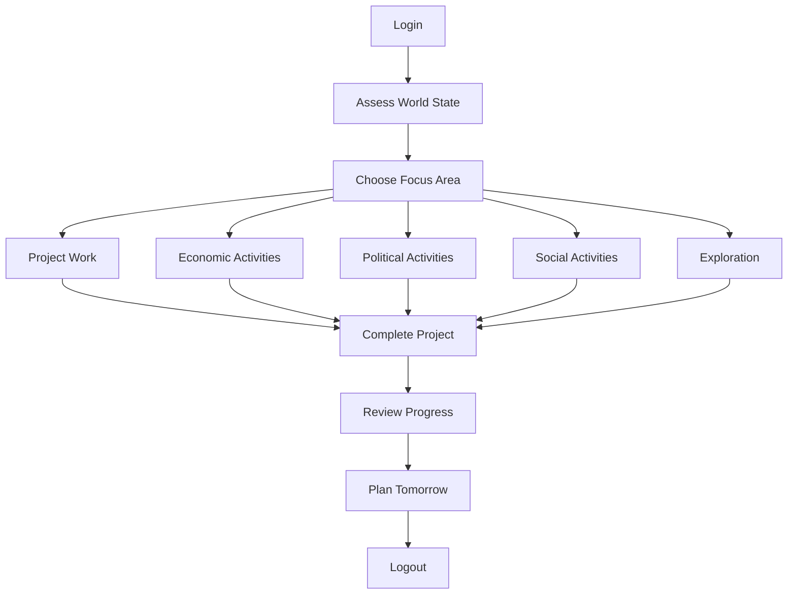
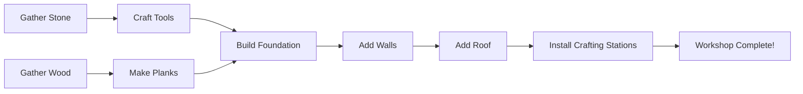

# 02: Session Gameplay

**Time Scale**: 30 minutes - 2 hours  
**Focus**: Single play session structure and complete activity cycles  

---

## Overview

This document defines how individual play sessions are structured. Players should always have meaningful goals to pursue within a single session, whether they have 30 minutes or 2 hours.

---

## Session Arc Flow

---

## Project-Based Gameplay

### Example: Build a Workshop

### Session Distribution by Project Size

| Project Size | Time Investment | Example |
|--------------|-----------------|---------|
| Small | 15-30 minutes | Craft better tools, simple repair |
| Medium | 1-2 hours | Build workshop, set up store |
| Large | Multiple sessions | Build town center, major infrastructure |
| Epic | Weeks | Construct metropolis, complete megaproject |

### Project Satisfaction Factors

- **Clear progress milestones**: Visible construction phases
- **Completion reward**: Functional benefit + achievement unlock
- **Visible to others**: Social recognition for completed projects
- **Permanent world impact**: Lasting contribution to the world

---

## Economic Activities

### Running a Store

**Session Flow:**
1. Check inventory levels and restock if needed
2. Set prices based on market analysis
3. Open store for business
4. AI/human customers visit (Session 2 agents evaluate prices)
   - AI evaluates: `Price < Belief × (1 + personality_margin)`
   - High Openness agents: +10% price tolerance
   - High Neuroticism agents: -5% price tolerance
5. Manage stock, adjust prices dynamically
6. Close up, count profits, review sales data

**Session 2 Integration**: See [02-economic-behavior.md](../session-2-ai-system-design/02-economic-behavior.md)

### Fulfilling Contracts

**Session Flow:**
1. Browse contract board for available jobs
2. Accept delivery or production contract
3. Gather/produce required items (may take full session)
4. Deliver to recipient location
5. Receive payment + reputation gain

**Contract Types:**

| Type | Time Required | Reward |
|------|---------------|--------|
| Quick Delivery | 10-20 min | Small payment |
| Production Run | 30-60 min | Moderate payment + reputation |
| Multi-drop | 45-90 min | Higher payment |
| Rush Order | Variable | Bonus payment |

---

## Political Activities

### Proposing a Law

**Session Flow:**
1. Identify problem/need through observation
2. Draft law proposal (with UI assistance)
3. Gather support through campaigning
4. Submit proposal for voting
5. Monitor voting period (24-48 hours real time)
6. Review results when announced
7. If passed: Law enacted and implemented

### Campaigning (Session 2 AI Integration)

**Talk to AI agents about issues** using Session 2 conversation system:

- **Topic selection**: Based on `Shared Interest = Intimacy × Curiosity`
- **Persuasion effectiveness**: Based on `Player Reputation × Charisma × Argument Quality`
- **AI opinion formation**: Based on `Personal Impact × Values Alignment`

**Campaign Activities:**
- Post announcements (visible to agents with Information Access)
- Participate in debates (agents evaluate using 6 political value axes)
- Build coalition (agents with similar values form factions)
- Canvass neighborhoods (talk to multiple AI agents)

**Session 2 Integration**: See [03-political-social-behavior.md](../session-2-ai-system-design/03-political-social-behavior.md)

---

## Social Activities

### Community Building

- **Organize events**: Town meetings, markets, celebrations
- **Coordinate projects**: Plan large builds with other players
- **Mediate disputes**: Help resolve conflicts between players/AI
- **Build relationships**: Develop trust with AI agents and players

### Collaborative Projects

- Town infrastructure (roads, public buildings)
- Economic initiatives (marketplaces, trade routes)
- Crisis response (meteor preparation, disaster relief)
- Cultural development (traditions, customs, holidays)

---

## Exploration Activities

### World Discovery

- Map uncharted territory
- Find new resource deposits
- Discover points of interest
- Encounter new AI agents

### Environmental Monitoring

- Check ecosystem health
- Monitor pollution levels
- Track wildlife populations
- Assess resource sustainability

---

## Session Entry & Exit Points

### Login Routine

1. **World State Assessment**
   - Check notifications (election results, contract updates)
   - Review environmental changes
   - See what happened while offline

2. **Goal Selection**
   - Continue in-progress project?
   - Start new activity?
   - Respond to event or opportunity?

3. **Activity Focus**
   - Choose from project, economic, political, or social options
   - Set session goal

### Logout Routine

1. **Progress Review**
   - What was accomplished?
   - What remains for next session?

2. **Tomorrow's Planning**
   - Set clear goal for next session
   - Note any scheduled events or deadlines

3. **Safe State**
   - Return to shelter/safe zone
   - Secure valuable items

---

## Technical Considerations

### Session 1 Integration

- **Bandwidth Budget**: Political and economic updates within 32 KB/s limit
- **State Persistence**: Player progress saved continuously
- **Reconnection**: Graceful handling of disconnections during sessions

### Session 2 Integration

| Activity | Session 2 AI Behavior | Update Frequency |
|----------|----------------------|------------------|
| Store operations | Price beliefs updated every 10 ticks | Every 0.5s |
| Trading | Agents evaluate trades every 5 ticks | Every 0.25s |
| Market analysis | Supply/demand every 10 ticks | Every 0.5s |
| Campaigning | AI conversation responses | On interaction |
| Voting | Agent vote calculations | During voting period |

---

## Navigation

- [Session 3 Index](./[AGENTS-READ-FIRST]-index.md)
- [← 01: Moment-to-Moment Gameplay](./01-moment-to-moment-gameplay.md)
- [→ 03: Multi-Session Arcs](./03-multi-session-arcs.md)
- [RESEARCH-INDEX.md](./RESEARCH-INDEX.md) - Research sources

---

## Cross-References

- **Economic AI**: See [Session 2: 02-economic-behavior.md](../session-2-ai-system-design/02-economic-behavior.md)
- **Political AI**: See [Session 2: 03-political-social-behavior.md](../session-2-ai-system-design/03-political-social-behavior.md)
- **Progression Systems**: See [Session 4: Progression and Balance](../session-4-progression-and-balance/)
