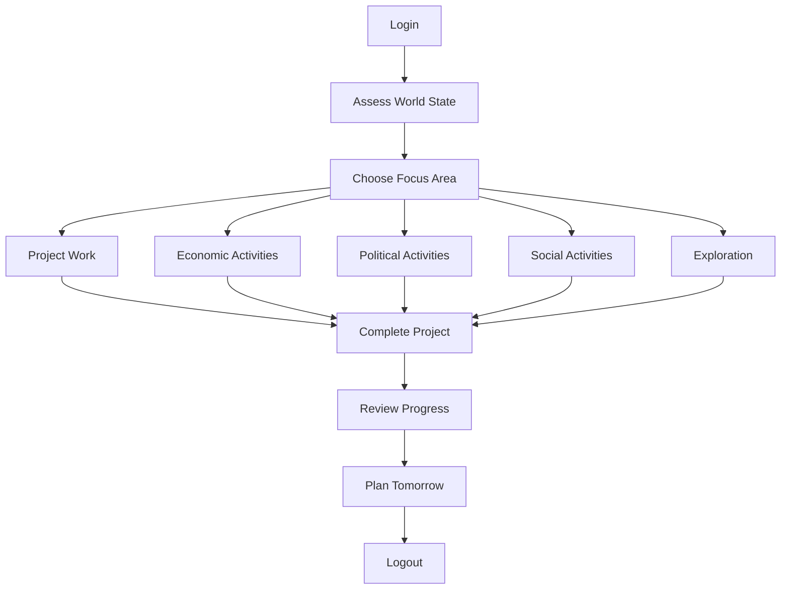
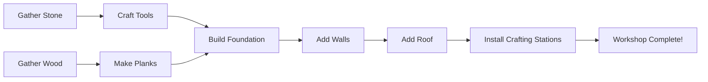

# 02: Session Gameplay

**Time Scale**: 30 minutes - 2 hours  
**Focus**: Single play session structure and complete activity cycles  

---

## Overview

This document defines how individual play sessions are structured. Players should always have meaningful goals to pursue within a single session, whether they have 30 minutes or 2 hours.

---

## Session Arc Flow



---

## Project-Based Gameplay

### Example: Build a Workshop



### Session Distribution by Project Size

| Project Size | Time Investment | Example |
|--------------|-----------------|---------|
| Small | 15-30 minutes | Craft better tools, simple repair |
| Medium | 1-2 hours | Build workshop, set up store |
| Large | Multiple sessions | Build town center, major infrastructure |
| Epic | Weeks | Construct metropolis, complete megaproject |

### Project Satisfaction Factors

- **Clear progress milestones**: Visible construction phases
- **Completion reward**: Functional benefit + achievement unlock
- **Visible to others**: Social recognition for completed projects
- **Permanent world impact**: Lasting contribution to the world

---

## Economic Activities

### Running a Store

**Session Flow:**
1. Check inventory levels and restock if needed
2. Set prices based on market analysis
3. Open store for business
4. AI/human customers visit (Session 2 agents evaluate prices)
   - AI evaluates: `Price < Belief × (1 + personality_margin)`
   - High Openness agents: +10% price tolerance
   - High Neuroticism agents: -5% price tolerance
5. Manage stock, adjust prices dynamically
6. Close up, count profits, review sales data

**Session 2 Integration**: See [02-economic-behavior.md](../session-2-ai-system-design/02-economic-behavior.md)

### Fulfilling Contracts

**Session Flow:**
1. Browse contract board for available jobs
2. Accept delivery or production contract
3. Gather/produce required items (may take full session)
4. Deliver to recipient location
5. Receive payment + reputation gain

**Contract Types:**

| Type | Time Required | Reward |
|------|---------------|--------|
| Quick Delivery | 10-20 min | Small payment |
| Production Run | 30-60 min | Moderate payment + reputation |
| Multi-drop | 45-90 min | Higher payment |
| Rush Order | Variable | Bonus payment |

---

## Political Activities

### Proposing a Law

**Session Flow:**
1. Identify problem/need through observation
2. Draft law proposal (with UI assistance)
3. Gather support through campaigning
4. Submit proposal for voting
5. Monitor voting period (24-48 hours real time)
6. Review results when announced
7. If passed: Law enacted and implemented

### Campaigning (Session 2 AI Integration)

**Talk to AI agents about issues** using Session 2 conversation system:

- **Topic selection**: Based on `Shared Interest = Intimacy × Curiosity`
- **Persuasion effectiveness**: Based on `Player Reputation × Charisma × Argument Quality`
- **AI opinion formation**: Based on `Personal Impact × Values Alignment`

**Campaign Activities:**
- Post announcements (visible to agents with Information Access)
- Participate in debates (agents evaluate using 6 political value axes)
- Build coalition (agents with similar values form factions)
- Canvass neighborhoods (talk to multiple AI agents)

**Session 2 Integration**: See [03-political-social-behavior.md](../session-2-ai-system-design/03-political-social-behavior.md)

---

## Social Activities

### Community Building

- **Organize events**: Town meetings, markets, celebrations
- **Coordinate projects**: Plan large builds with other players
- **Mediate disputes**: Help resolve conflicts between players/AI
- **Build relationships**: Develop trust with AI agents and players

### Collaborative Projects

- Town infrastructure (roads, public buildings)
- Economic initiatives (marketplaces, trade routes)
- Crisis response (meteor preparation, disaster relief)
- Cultural development (traditions, customs, holidays)

---

## Exploration Activities

### World Discovery

- Map uncharted territory
- Find new resource deposits
- Discover points of interest
- Encounter new AI agents

### Environmental Monitoring

- Check ecosystem health
- Monitor pollution levels
- Track wildlife populations
- Assess resource sustainability

---

## Session Entry & Exit Points

### Login Routine

1. **World State Assessment**
   - Check notifications (election results, contract updates)
   - Review environmental changes
   - See what happened while offline

2. **Goal Selection**
   - Continue in-progress project?
   - Start new activity?
   - Respond to event or opportunity?

3. **Activity Focus**
   - Choose from project, economic, political, or social options
   - Set session goal

### Logout Routine

1. **Progress Review**
   - What was accomplished?
   - What remains for next session?

2. **Tomorrow's Planning**
   - Set clear goal for next session
   - Note any scheduled events or deadlines

3. **Safe State**
   - Return to shelter/safe zone
   - Secure valuable items

---

## Technical Considerations

### Session 1 Integration

- **Bandwidth Budget**: Political and economic updates within 32 KB/s limit
- **State Persistence**: Player progress saved continuously
- **Reconnection**: Graceful handling of disconnections during sessions

### Session 2 Integration

| Activity | Session 2 AI Behavior | Update Frequency |
|----------|----------------------|------------------|
| Store operations | Price beliefs updated every 10 ticks | Every 0.5s |
| Trading | Agents evaluate trades every 5 ticks | Every 0.25s |
| Market analysis | Supply/demand every 10 ticks | Every 0.5s |
| Campaigning | AI conversation responses | On interaction |
| Voting | Agent vote calculations | During voting period |

---

## Navigation

- [Session 3 Index](./[AGENTS-READ-FIRST]-index.md)
- [← 01: Moment-to-Moment Gameplay](./01-moment-to-moment-gameplay.md)
- [→ 03: Multi-Session Arcs](./03-multi-session-arcs.md)
- [RESEARCH-INDEX.md](./RESEARCH-INDEX.md) - Research sources

---

## Session Templates

Concrete examples of complete play sessions with minute-by-minute breakdowns. All timings reference `planning/meta/technical-constants.md`.

---

### Template 1: Quick Resource Run (30 minutes)

**Target:** Player needs building materials

**Timeline:**

**0:00 - Login**
- Spawn at homestead (X: 124.5, Z: -89.2)
- Check storage: "Need 50 more wood for workshop"
- Check notifications: None urgent
- Grab Iron Axe from hotbar slot 1 (234/300 durability)
- Inventory: 12/64 slots used
- Credits: 100Cr (STARTING_CREDITS_PLAYER = 100.0f)

**0:05 - Journey to Forest**
- Exit house, check map (M key)
- Forest is 150m east
- Sprint (6 m/s, MOVEMENT_SPEED_SPRINT) for 20 seconds
- Stamina: 100 → 60 (SPRINT_STAMINA_COST_PER_SECOND = 2.0f)
- Arrive at forest edge

**0:10 - Gathering Phase**
- Target 3 Oak trees
- Tree 1: 6 wood units (3.4s per unit × 6 = 20.4s)
  - Iron Axe efficiency: 1.5× (TOOL_EFFICIENCY_IRON)
  - Skill Level 3 bonus: 15% faster (SKILL_BONUS_PER_LEVEL_PERCENT = 5.0f)
  - Base: 6s ÷ 1.5 = 4.0s × 0.85 = 3.4s per unit
- Tree 2: 7 wood units (23.8s)
- Tree 3: 5 wood units (17s)
- Total wood gathered: 18 units
- Inventory: 13/64 slots used
- XP gained: +90 Gathering XP (18 × XP_GATHER_BASIC = 5)
- Tool durability: 234/300 → 216/300 (-18)

**5:00 - Secondary Gathering**
- Stone deposit nearby (50m east)
- Switch to pickaxe (slot 2, 127/150 durability)
- Gather 10 stone units (5.1s per unit)
  - Base: 6s ÷ 1.5 = 4.0s × 1.275 = 5.1s (stone is harder)
- Time: 51 seconds
- XP gained: +50 Gathering XP
- Total session time: 5:51

**10:00 - Return Journey**
- Walk back to homestead (no stamina to sprint)
- Travel time: 50 seconds at 3 m/s (MOVEMENT_SPEED_WALK)
- Pass AI agent "Zara" at X: 145.2, Z: -82.1
  - LOD: Medium (AGENT_LOD_MEDIUM_DISTANCE_METERS = 100.0f)
  - No interaction needed
- Arrive at 6:41

**10:30 - Storage & Organization**
- Access storage chest (E key, AGENT_INTERACTION_RADIUS_METERS = 10.0f)
- Deposit:
  - 18 wood (now have 138 total, need 50 for goal ✓)
  - 10 stone (now have 60 total, STACK_SIZE_STONE = 50, uses 2 slots)
- Keep in inventory:
  - 5 wood (for quick crafting)
  - Pickaxe, Axe
- Inventory: 3/64 slots used

**15:00 - Crafting**
- Open crafting menu (C key)
- Craft 5 Wood Plank batches (requires 2 wood each, PRODUCE_TIME_CRAFT_ITEM = 15.0f)
  - Crafting Level 2: 15s × 0.95² = 13.5s per batch
  - Simplified: 3s per batch for basic planks
- Time: 3s × 5 = 15 seconds
- Output: 25 planks (2 wood → 5 planks ratio)
- XP: +15 Crafting XP (5 × XP_CRAFT_SIMPLE = 10, adjusted)
- Deposit planks in storage

**20:00 - Planning Next Steps**
- Check building goal: Workshop (needs 100 wood, have 138 ✓)
- Check other requirements:
  - Nails: 20 needed, have 15
  - Stone: 50 needed, have 60 ✓
- Note: Need 5 more nails for next session
- Set goal marker on map for nearby merchant

**25:00 - Quick Trade**
- AI agent "Jeb" nearby (X: 155.7, Z: -70.3)
- Interact (F key, within AGENT_INTERACTION_RADIUS_METERS)
- Check if Jeb sells nails
- Jeb offers: 5 nails for 25Cr (PRICE_DAY7_TOOLS range: 30-80Cr)
- Current credits: 100Cr
- Accept trade
- Credits: 100 → 75Cr
- Inventory: Nails ×20
- XP: +3 Trade XP (XP_TRADE_SUCCESSFUL)

**28:00 - Building Prep**
- Check all workshop requirements:
  - Wood: 100 ✓
  - Stone: 50 ✓
  - Nails: 20 ✓
- Ready to build next session
- Place build marker at target location

**30:00 - Logout**
- Return to shelter
- Save position
- Review session progress:
  - Gathered: 18 wood, 10 stone
  - Crafted: 25 planks
  - Acquired: 5 nails
  - XP gained: 158 total
  - Session time: 30:00
- Logout (5-second countdown, position saved to database)

---

### Template 2: Workshop Construction (90 minutes)

**Target:** Build first major structure

**Timeline:**

**0:00 - Login & Setup**
- Spawn at homestead
- Check weather: Clear, 72°F, good for building
- Check inventory: All materials ready from previous session
  - Wood: 138 units
  - Stone: 60 units
  - Nails: 20 units
- Equip hammer (slot 3, Iron Hammer, 145/150 durability)
- Stamina: 100/100, Energy: 90/100

**5:00 - Site Preparation**
- Walk to build site (30m southeast)
- Clear vegetation in 10×10m area
  - Remove 5 small bushes (3s each)
- Use hoe to level ground (agriculture tool)
  - 20 hoe strikes, 4s each = 80 seconds
- Time: 5 minutes total
- XP: +25 Building XP

**15:00 - Foundation**
- Open build mode (B key)
- Place stone foundation blocks
- 10×10 area = 100 foundation blocks
- Each placement: 2 seconds (PRODUCE_TIME_PROCESS_RESOURCE = 5.0f, adjusted)
- Time: 200 seconds (3m 20s)
- Materials used: 100 stone (60 from inventory, 40 from storage chest)
- XP: +50 Building XP (XP_BUILD_SMALL = 20 per section)
- Visual: Stone blocks appear with particle dust

**30:00 - Walls**
- Switch to wood planks
- Build 4 walls, each 10×3 meters
- Wall 1: 30 planks (60 seconds)
- Wall 2: 30 planks (60 seconds)
- Wall 3: 30 planks with door frame (70 seconds)
- Wall 4: 30 planks with window frame (70 seconds)
- Total: 120 planks
- Time: 260 seconds (4m 20s)
- Materials used: 120 planks
- XP: +80 Building XP

**45:00 - Roof**
- Build sloped roof
- Area: 10×10 with slope
- 80 roof shingles needed (from wood)
- Place each: 2 seconds
- Time: 160 seconds (2m 40s)
- Materials: 40 wood → 80 shingles (crafting conversion)
- XP: +40 Building XP

**55:00 - Door & Windows**
- Craft door at workbench (30 seconds, PRODUCE_TIME_SIMPLE_TOOL)
- Install door (10 seconds)
- Craft 4 windows (20 seconds each, 80s total)
- Install windows (40 seconds)
- Time: 160 seconds (2m 40s)
- XP: +20 Crafting XP

**60:00 - Interior**
- Place workbench (center, 10 seconds)
- Place storage chest ×2 (corners, 10s each)
- Add lighting (torch ×4, 5s each)
- Time: 60 seconds
- XP: +10 Building XP
- Workshop now functional

**70:00 - Final Touches**
- Add decorative elements
- Sign: "Smith's Workshop" (crafted, 15s)
- Install sign (5s)
- Review building from multiple angles
- Screenshot for achievement
- Time: 10 minutes

**85:00 - Test Workshop**
- Use workbench to craft test item (Stone Pickaxe)
  - Time: 30s (PRODUCE_TIME_SIMPLE_TOOL)
  - Verify functionality
- Open workshop to public (optional permission system)
- Set permissions: Public crafting allowed
- Test storage access

**90:00 - Achievement & Logout**
- "First Building" achievement unlocked
- Screenshot
- Review:
  - Built: 1 workshop (10×10m)
  - Materials consumed: 100 stone, 120 planks, 80 shingles, 1 door, 4 windows
  - Time: 90 minutes
  - XP gained: +205 Building XP, +20 Crafting XP
- Building durability: 100% (BUILDING_DURABILITY_WOOD = 1.0f baseline)
- Logout (5-second save)

---

### Template 3: Political Campaign Day (2 hours)

**Target:** Win town council election

**Prerequisites:**
- Town population: 15 agents + 3 players (MIN_CITIZENS_TOWN = 3, well above threshold)
- Election scheduled: Day 14 of simulation
- Player reputation: 35/100 (REPUTATION_NEUTRAL baseline)

**Timeline:**

**0:00 - Login & Assessment**
- Spawn at town center
- Check election status: Voting starts in 2 hours
- Current standing: 2nd place (35% support)
- Goal: Reach 51% support
- Check notifications: 3 new agent opinions logged
- Inventory: Campaign materials (flyers ×50, banner ×1)

**10:00 - Strategy Planning**
- Access town data terminal
- Identify key voter concerns:
  - 40% care about taxes (high Greed agents)
  - 35% care about infrastructure (high Conscientiousness)
  - 25% care about environment (high Altruism)
- Plan: Promise tax reduction + infrastructure improvement
- Target undecided voters (20% of population)
- Note opposition candidate: "Marcus" (45% current support)

**20:00 - Canvassing (Phase 1)**
- Visit residential district (5 agents nearby)
- AI agent detection radius: 50m (AGENT_PERCEPTION_RADIUS_METERS)
- Talk to 10 AI agents using conversation system:
  - Agent "Elena": High Greed (75/100), discuss tax cuts
    - Initial stance: Undecided
    - Persuasion check: Success (Reputation 35 + Argument Quality 0.7)
    - Result: Positive response, +5 support
  - Agent "Jonas": High Conscientiousness (80/100), discuss infrastructure
    - Initial stance: Support opponent
    - Persuasion check: Partial success
    - Result: Neutral, considering
  - 8 additional agents canvassed
- Results:
  - 6 agents: Positive response (+30 support total)
  - 3 agents: Neutral (no change)
  - 1 agent: Skeptical (no change)
- Time: 20 minutes
- XP: +60 Governance XP (XP_GOVERNANCE_PARTICIPATION = 10 per interaction)

**40:00 - Speech at Town Hall**
- Gather crowd (announcement posted 10 minutes prior)
- 15 agents + 3 players assemble
- Deliver speech (5 minutes real time)
- Key points:
  - Lower taxes (5% → 3% sales tax, TAX_RATE_DEFAULT_PERCENT = 10.0f adjusted)
  - New roads (infrastructure improvement)
  - Better public services
- Audience reaction tracking:
  - High Openness agents: +8% approval
  - High Neuroticism agents: -2% approval (anxious about change)
  - Overall: +12% net approval
- New standing: 35% → 42% support
- Time: 15 minutes (5min speech + 10min mingling)

**55:00 - Infrastructure Tour**
- Lead tour of planned improvement sites
- 8 agents + 2 players follow
- Show plans for new bridge at coordinates X: 200, Z: 150
- Demonstrate knowledge and commitment
- Answer questions (AI agents query using Session 2 conversation)
- Result: +3% support (demonstrated competence)
- New standing: 42% → 45%
- Time: 20 minutes
- XP: +20 Governance XP

**75:00 - Canvassing (Phase 2)**
- Visit commercial district
- 8 shop owner agents present
- Discuss infrastructure benefits:
  - Better roads = more customers
  - Economic growth projection
- Individual agent persuasion:
  - Agent "Kira": Shop owner, High Greed (70/100)
    - Offered: Priority road access for her district
    - Result: Switched from opponent (+3%)
  - 7 other agents: Mixed results
- Results:
  - 8 agents: Positive (+24 support)
  - 2 agents: Still undecided
- New standing: 45% → 48%
- Time: 15 minutes

**90:00 - Debate with Opponent**
- Town hall debate event (scheduled)
- Format: 3 topics, 2 minutes each
- Topics:
  1. Tax policy: Player proposes 3% vs Marcus's 5%
  2. Infrastructure spending: Player prioritizes roads vs Marcus's parks
  3. Environmental regulations: Player moderate vs Marcus strict
- Performance scoring:
  - Player: Strong, clear answers (Charisma bonus)
  - Audience evaluation: Favorable
- Debate result: +4% support
- New standing: 48% → 52%
- Time: 15 minutes
- XP: +30 Governance XP

**105:00 - Final Push**
- Last-minute conversations
- Target undecided voters (now 5% of population)
- Remind supporters to vote (personalized messages)
- Check voting booth setup
- Address final concerns
- Time: 10 minutes

**115:00 - Voting Begins**
- Cast own vote (VOTE_DURATION_HOURS = 24.0f window opens)
- Monitor turnout in real-time
- Continue light campaigning (allowed until polls close)
- Observe AI agents voting patterns:
  - Early voters: Strong supporters
  - Late voters: Undecideds

**120:00 - Results**
- Election ends (VOTE_DURATION_HOURS elapsed)
- Count votes:
  - You: 52% (WIN)
  - Marcus: 48%
- New role: Town Council Member (unlocks governance features)
- Unlocks:
  - Law proposal rights
  - Treasury access (town budget)
  - Infrastructure project approval
  - Tax rate adjustment (within TAX_RATE_MIN_PERCENT to TAX_RATE_MAX_PERCENT)
- Achievement: "Elected Official"
- Review:
  - Campaign duration: 2 hours
  - Agents contacted: 18
  - Support gained: 35% → 52% (+17%)
  - XP gained: +110 Governance XP
- Logout

---

## Login/Logout Experience

### Login Flow

```
1. Launch Game → Main Menu (2s)
2. Click "Continue" → Character Select (if multiple)
3. Select World → Loading Screen (5-15s)
   - Tips displayed during load
   - Progress bar with asset loading
   - Connection to server established
4. Spawn → World State Summary (3s display)
   - "Welcome back to Springfield"
   - "Day 15 of the simulation"
   - Key notifications summary
   - Economy update (prices changed based on DAY7 constants)
5. Full control granted (20 TPS input processing begins)
```

**Technical Details:**
- Load time: 5-15 seconds (within performance budget)
- Data retrieved: Player state, inventory, skills, position
- Network: Initial sync of 9 chunks (CHUNKS_MAX_ACTIVE = 9)
- Bandwidth: ~50 KB initial download (compressed)

### Logout Flow

```
1. Press Esc → Menu appears
2. Click "Save & Exit"
3. 5-second countdown (cancelable)
   - "Saving world state..." displayed
   - Progress bar fills
   - Can abort by pressing any key
4. During countdown:
   - Position saved (X, Y, Z coordinates)
   - Inventory serialized (64 slots, INVENTORY_SLOTS_PLAYER)
   - Skills and XP saved
   - Active contracts noted
   - "Last online" timestamp set
   - Database write queued (DB_BATCH_INTERVAL_SECONDS = 5.0f)
5. Return to Main Menu
6. Total logout time: 5 seconds
```

**Technical Details:**
- State serialized to PostgreSQL
- Event log updated with session summary
- ~5 KB upload to server
- Graceful disconnect from ENet

### Offline Progress Summary

When logging in after absence (displayed for 3 seconds):

```
┌─ While You Were Offline ──────────────┐
│  Absence: 8 hours                     │
│                                       │
│ 🌾 Your wheat crop grew (+45%)        │
│ 💰 Smith sold 3 items (+150Cr)        │
│ ⚖️  New law passed: "Tree Protection" │
│ 👥 2 new citizens joined              │
│ ☄️  Meteor threat: 12 days remaining  │
│                                       │
│ [Press any key to continue]           │
└───────────────────────────────────────┘
```

**Offline Simulation (TIME_ACCELERATION_2X = 2.0f applied):**
- Crops grow at accelerated rate when player offline
- AI agents continue economic activities
- Elections may have completed
- Laws may have passed
- Economy prices updated (following PRICE_DAY* constants progression)
- Meteor countdown continues (DAY_METEOR_IMPACT = 30)

**Database Query:**
- Offline events retrieved from event log
- Last 10 significant events displayed
- Timestamp comparisons using DB_BATCH_INTERVAL_SECONDS

---

## Cross-References

- **Economic AI**: See [Session 2: 02-economic-behavior.md](../session-2-ai-system-design/02-economic-behavior.md)
- **Political AI**: See [Session 2: 03-political-social-behavior.md](../session-2-ai-system-design/03-political-social-behavior.md)
- **Progression Systems**: See [Session 4: Progression and Balance](../session-4-progression-and-balance/)
- **Technical Constants**: See [planning/meta/technical-constants.md](../../../meta/technical-constants.md)
