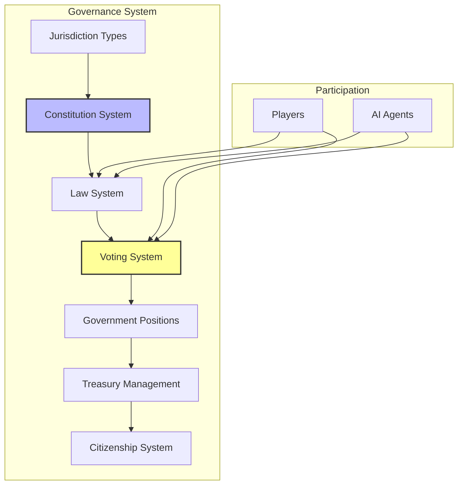
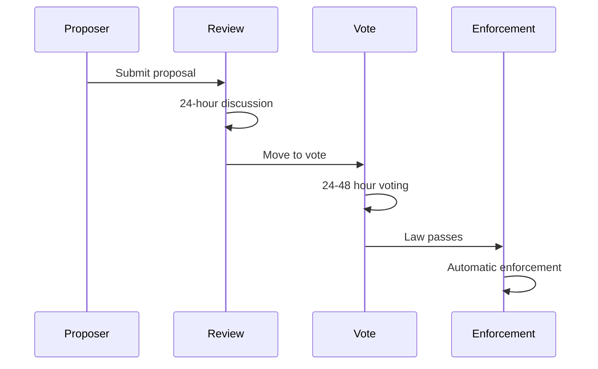

# Governance Mechanics Detail

**Part of**: Session 3 - Core Gameplay Loops  
**File**: 02c-governance-mechanics-detail.md  
**Status**: Complete  

---

> **Navigation**: [Index]([AGENTS-READ-FIRST]-index.md) | [Prev: Economic System Spec](02b-economic-system-spec.md) | [Next: Multi-Session Arcs](03-multi-session-arcs.md)
> 
> **Part of**: [Session 3 Core Gameplay Loops]([AGENTS-READ-FIRST]-index.md)
> **Requires**: [Session 2 AI System Design](../session-2-ai-system-design/03-political-social-behavior.md) (voting systems), [Session 1 Architecture](../session-1-technical-architecture/)
> **Informs**: [Session 5 Governance Mechanics](../session-5-governance-mechanics/)
> **Constants Reference**: [Technical Constants](../../meta/technical-constants.md)

> **Canonical alignment (2026-07-14):** Aspirational governance specification. Current scope is [planning/active/](../../active/) and implementation truth is [CURRENT_BUILD.md](../../../CURRENT_BUILD.md). See [PRODUCT-THESIS.md](../../PRODUCT-THESIS.md).

## Product Contract Alignment

Governance outcomes come only from deterministic validation of civic commands and recorded events. Humans remain consequential; AI citizens have material interests and rights but no special authority, while LLMs may deliberate, communicate, summarize, or propose from structured observations and safely fall back when invalid or unavailable.

---

## Overview

This document defines the complete governance mechanics for Societies, providing systems for collective decision-making, law creation, jurisdiction management, and civic participation. These mechanics enable both human players and AI agents to form governments, create laws, manage shared resources, and participate in democratic processes.



---

## Jurisdiction Types

Societies implements a three-tier governance system that scales from local towns to planetary federations. Each tier has distinct formation requirements, capabilities, and limitations.

### Town (Local Government)

Towns are the foundational unit of governance in Societies, representing local communities with shared interests and geographic proximity.

#### Formation Requirements

| Requirement | Specification | Source |
|------------|---------------|--------|
| Minimum Citizens | 3 citizens | `MIN_CITIZENS_TOWN` |
| Territory | Contiguous land claims | Spatial adjacency |
| Infrastructure | Town Hall building | Constructed structure |
| Legal Framework | Constitution drafted and ratified | Documented |

**Formation Process:**
1. **Land Claims**: Minimum 3 citizens claim adjacent land parcels (100m × 100m each)
2. **Town Hall Construction**: Build central governance building (materials: 100 wood, 50 stone, 20 iron)
3. **Constitution Drafting**: Create founding document defining government structure
4. **Ratification Vote**: 100% approval from founding citizens required
5. **Registration**: System recognizes town as legal entity

#### Capabilities

**Territory Management:**
```
Initial Territory: 100m × 100m (10,000 m²)
Expansion: +50m × 50m per 10 additional citizens
Maximum: 500m × 500m (250,000 m²) per town
```

**Law-Making Authority:**
- Local regulations (zoning, noise, building codes)
- Business licensing requirements
- Resource management rules
- Public service mandates

**Taxation Powers:**
```
Sales Tax: 0-10% (configurable per town)
Property Tax: 1-5% of land value annually
Income Tax: Not permitted (reserved for higher jurisdictions)
Service Fees: Unlimited (licenses, permits, fines)
```

**Election System:**
- Mayor: Single executive, 30-day term (`ELECTION_TERM_MAYOR_DAYS`)
- Council: 2-5 members, 14-day term (`ELECTION_TERM_TOWN_COUNCIL_DAYS`)
- Citizens can propose laws (if constitution allows)

**Citizenship Control:**
- Grant citizenship (with criteria)
- Revoke citizenship (with due process, 2/3 vote)
- Set residency requirements

#### Population Thresholds

| Classification | Population | Governance Rights | Source |
|---------------|------------|-------------------|--------|
| Small Town | 3-10 citizens | Basic governance only | `TOWN_POPULATION_SMALL_MAX` |
| Town | 11-30 citizens | Full governance rights | `TOWN_POPULATION_MEDIUM_MAX` |
| Large Town | 31-75 citizens | Can form/join states | `TOWN_POPULATION_LARGE_MAX` |
| City | 76+ citizens | Maximum local authority | `TOWN_POPULATION_CITY_MIN` |

**Capability Scaling:**
- **Small Town**: Simple majority voting, no appeals process
- **Town**: Full legislative procedures, 24-hour voting periods (`VOTE_DURATION_HOURS`)
- **Large Town**: Can petition for state formation, appellate procedures
- **City**: Professional administration, complex regulations, 4-hour urgent voting (`VOTE_DURATION_URGENT_HOURS`)

### State (Regional Government)

States aggregate multiple towns into regional governments with broader jurisdiction and coordination responsibilities.

#### Formation Requirements

| Requirement | Specification | Source |
|------------|---------------|--------|
| Minimum Towns | 2 towns | Constitutional requirement |
| Combined Population | 50+ citizens | `MIN_CITIZENS_STATE` |
| Infrastructure | State Capitol building | Regional center |
| Legal Framework | State Constitution | Separate from town constitutions |
| Approval | 2/3 of constituent towns | Ratification vote |

**Formation Process:**
1. **Petition**: Minimum 2 towns submit state formation petition
2. **Population Verification**: Confirm combined population ≥ 50 citizens
3. **Capitol Construction**: Build state governance center (materials: 500 wood, 300 stone, 100 iron, 50 steel)
4. **Constitutional Convention**: Delegates from each town draft state constitution
5. **Ratification**: Each town votes independently (2/3 approval required per town)
6. **Inauguration**: First state elections held

#### Capabilities

**Territorial Authority:**
- Jurisdiction over all member towns
- Interstate infrastructure (roads, bridges, utilities)
- Border control between states
- Regional resource management

**Legislative Powers:**
```
Law Supremacy: State laws override town laws in delegated areas
Default Delegated Areas:
  - Defense and security
  - Interstate trade regulation
  - Major infrastructure projects
  - Environmental standards (minimum)
  - Professional licensing (optional)

Reserved Town Powers:
  - Local zoning and planning
  - Municipal services
  - Local taxation (within limits)
  - Cultural and educational policies
```

**Taxation Powers:**
```
State Tax: Additional 0-5% on top of town taxes
Interstate Commerce Tax: 1-3% on cross-border transactions
Infrastructure Fees: Usage-based fees for state roads/bridges
```

**Election System:**
- Governor: Single executive, 60-day term (`ELECTION_TERM_STATE_OFFICIAL_DAYS`)
- State Legislature: Proportional to town populations (minimum 5 members)
- State Judges: Appointed or elected (constitution-dependent)

**Dispute Resolution:**
- Interstate commerce disputes
- Town boundary conflicts
- Constitutional interpretation
- Appeals from town courts (if implemented)

**Diplomacy:**
- Negotiate with other states
- Form regional alliances
- Interstate compacts and treaties

### Federation (World Government)

The Federation represents planetary-level governance for truly global issues and existential threats.

#### Formation Requirements

| Requirement | Specification | Source |
|------------|---------------|--------|
| Minimum States | 2 states OR equivalent | Constitutional threshold |
| Combined Population | 100+ citizens | `MIN_CITIZENS_FEDERATION` |
| World Population | 50% of active citizens | Democratic mandate |
| Infrastructure | Federation Headquarters | Central facility |
| Trigger | Planetary emergency OR global issue | Existential necessity |

**Formation Process:**
1. **Global Crisis Detection**: System identifies planetary-level threat (meteor, climate collapse, pandemic)
2. **Assembly Call**: All states invited to constitutional convention
3. **Headquarters Construction**: Global governance center (massive resource investment)
4. **Charter Drafting**: Limited-scope federation constitution
5. **Global Referendum**: 50% of world population must approve
6. **Limited Activation**: Federation operates only in delegated areas

#### Capabilities

**Limited but Supreme Authority:**
```
Federation Powers (exclusive):
  - Existential threat response
  - Global environmental standards
  - Species preservation mandates
  - Ultimate dispute resolution
  - Planetary resource management

State Retained Powers:
  - All powers not explicitly delegated
  - Local economic policy
  - Cultural autonomy
  - Internal governance
```

**Emergency Powers:**
- Meteor defense coordination
- Climate crisis management
- Pandemic response
- Ecosystem collapse intervention

**Permanence Restrictions:**
```
Secession Rules:
  - Not permitted without 75% global vote
  - States can opt-out of specific programs (with penalties)
  - Federation dissolves automatically if population drops below 50%
```

**Typical Use Cases:**
1. **Meteor Threat**: Coordinate detection, evacuation, defense
2. **Climate Emergency**: Enforce emission limits, carbon taxes
3. **Species Preservation**: Mandate protection for endangered species
4. **Ocean/Atmosphere**: Manage shared planetary resources

---

## Constitution System

Constitutions define the fundamental rules and structure of each jurisdiction. They are dynamic documents that can be amended through defined procedures.

### Constitution Structure

```csharp
public class Constitution
{
    public Guid Id { get; set; }
    public string Preamble { get; set; }
    public List<GovernmentBranch> Branches { get; set; }
    public List<Power> DelegatedPowers { get; set; }
    public List<Power> ReservedPowers { get; set; }
    public List<Right> GuaranteedRights { get; set; }
    public AmendmentProcess AmendmentRules { get; set; }
    public DateTime RatifiedAt { get; set; }
    public int Version { get; set; }
    
    // Validation
    public bool IsValid()
    {
        // Must have at least one branch
        if (Branches == null || Branches.Count == 0) return false;
        
        // Must define amendment process
        if (AmendmentRules == null) return false;
        
        // Must have ratification date
        if (RatifiedAt == default) return false;
        
        return true;
    }
}

public class GovernmentBranch
{
    public BranchType Type { get; set; } // Executive, Legislative, Judicial
    public string Name { get; set; }
    public List<Office> Offices { get; set; }
    public List<Power> Powers { get; set; }
    public List<Limitation> Limitations { get; set; }
    
    // Relationships with other branches
    public List<BranchRelationship> ChecksAndBalances { get; set; }
}

public class Office
{
    public string Title { get; set; } // "Mayor", "Council Member"
    public int Seats { get; set; }
    public TermLength Term { get; set; }
    public List<Power> Powers { get; set; }
    public List<Requirement> Eligibility { get; set; }
    public List<Limitation> Limitations { get; set; }
    public ElectionMethod ElectionMethod { get; set; }
    public RemovalProcess RemovalProcess { get; set; }
}

public class TermLength
{
    public int Days { get; set; }
    public int TermLimit { get; set; } // 0 = unlimited
    public bool RenewableImmediately { get; set; }
}

public class AmendmentProcess
{
    public ProposalMethod ProposalMethod { get; set; }
    public float ProposalThreshold { get; set; } // % required to propose
    public float RatificationThreshold { get; set; } // % required to ratify
    public float DurationHours { get; set; } // Voting duration
    public bool RequiresSupermajority { get; set; }
    public List<string> EntrenchedClauses { get; set; } // Cannot be amended
}
```

### Example: Simple Democracy Constitution

```
================================================================================
                    CONSTITUTION OF SPRINGFIELD
                    Ratified: Day 15, Year 1
================================================================================

PREAMBLE:
  We the citizens of Springfield establish this constitution to ensure 
  order, prosperity, and justice for all residents. We commit to democratic 
  governance, respect for individual rights, and stewardship of our shared 
  environment.

================================================================================
ARTICLE I: GOVERNMENT STRUCTURE
================================================================================

SECTION 1: BRANCHES OF GOVERNMENT

  The government of Springfield consists of two branches:
  
  A. LEGISLATIVE BRANCH - The Council
     1. Composition: 5 elected members
     2. Authority: Create, amend, and repeal laws
     3. Meetings: Weekly public sessions
  
  B. EXECUTIVE BRANCH - The Mayor
     1. Composition: 1 elected official
     2. Authority: Enforce laws, manage daily operations
     3. Term: 30 days, maximum 3 consecutive terms

SECTION 2: ELECTED OFFICES

  Office: Mayor (1 seat)
    Term: 30 days
    Term Limit: 3 consecutive terms
    Powers:
      - Propose laws (fast-track procedure)
      - Veto laws (subject to override)
      - Manage town treasury
      - Represent town in external matters
      - Appoint officials (with council approval)
      - Emergency powers (24-hour duration)
    Eligibility:
      - Citizen for 3+ days
      - No serious criminal convictions
      - Endorsed by 3+ citizens
    Election Method: Plurality voting
    Removal: Recall vote (2/3 of citizens)
  
  Office: Council Member (5 seats)
    Term: 14 days
    Term Limit: Unlimited
    Powers:
      - Propose laws
      - Vote on laws (1 vote per member)
      - Override mayoral veto (4/5 vote)
      - Approve major expenditures (>50% treasury)
      - Impeach mayor (3/4 vote)
    Eligibility:
      - Citizen for 2+ days
      - Current resident
    Election Method: Approval voting
    Removal: Recall vote (simple majority in district)

================================================================================
ARTICLE II: POWERS
================================================================================

SECTION 1: DELEGATED POWERS (Town Government)

  The following powers are delegated to the Town of Springfield:
  
  1. LOCAL LAW CREATION
     - Zoning and land use regulation
     - Business licensing and regulation
     - Public health and safety standards
     - Environmental protection (within state standards)
  
  2. TAXATION
     - Sales tax: up to 10% on transactions
     - Property tax: up to 5% annually
     - Service fees: unlimited
     - NOTE: Income taxation reserved for State
  
  3. PUBLIC SERVICES
     - Road maintenance and construction
     - Public lighting
     - Waste management
     - Emergency services (if applicable)
  
  4. LAND MANAGEMENT
     - Grant and revoke land claims
     - Establish protected areas
     - Manage public spaces

SECTION 2: RESERVED POWERS (Citizens)

  The following rights and powers are reserved to individual citizens:
  
  1. PERSONAL PROPERTY RIGHTS
     - Ownership of crafted items and gathered resources
     - Exclusive use of claimed land
     - Protection from unreasonable seizure
  
  2. PERSONAL LIBERTIES
     - Freedom of speech and expression
     - Freedom of movement (right to leave town)
     - Freedom of profession and trade
  
  3. DUE PROCESS RIGHTS
     - Notice of charges
     - Right to defense
     - Right to appeal

SECTION 3: PROHIBITED POWERS

  The government SHALL NOT:
  - Impose income taxes
  - Restrict freedom of movement
  - Seize property without due process
  - Grant titles of nobility
  - Establish official religion

================================================================================
ARTICLE III: LAW MAKING PROCEDURE
================================================================================

SECTION 1: PROPOSAL

  Laws may be proposed by:
  - The Mayor
  - Any Council Member
  - Any citizen (with 5 endorsements from other citizens)
  
  Proposal Fee: 50 credits (anti-spam)
  
  Requirements:
  - Clear title and description
  - Defined triggers and actions
  - Scope of application
  - Duration (temporary or permanent)

SECTION 2: REVIEW PERIOD

  Duration: 24 hours
  
  Activities:
  - Public discussion and debate
  - Amendment proposals (by original proposer)
  - Supporter/opposition lobbying
  - Information dissemination

SECTION 3: VOTING

  Duration: 24 hours (standard), 4 hours (urgent)
  
  Quorum: 60% of council members for council votes
  
  Thresholds:
  - Standard laws: Simple majority (50% + 1)
  - Constitutional amendments: 2/3 majority
  - Emergency measures: Simple majority with 24-hour duration limit

SECTION 4: IMPLEMENTATION

  Laws take effect 5 seconds after passage (`LAW_ENFORCEMENT_DELAY_SECONDS`)
  
  Automatic Enforcement:
  - System monitors compliance
  - Violations trigger automatic penalties
  - Appeals may be filed within 24 hours

SECTION 5: REPEAL

  Laws may be repealed by the same process as passage.
  
  Automatic Sunset:
  - Emergency laws expire after 7 days unless renewed
  - Temporary laws expire on specified date
  - All laws reviewed annually (optional repeal vote)

================================================================================
ARTICLE IV: AMENDMENT PROCESS
================================================================================

SECTION 1: PROPOSAL

  Methods:
  A. Council Proposal: 3/5 vote of council
  B. Citizen Initiative: Petition signed by 25% of citizens
  
  Draft amendments must specify all changes to this constitution.

SECTION 2: RATIFICATION

  Threshold: 2/3 of voting citizens
  
  Duration: 24-hour voting period
  
  Requirements:
  - Minimum 60% voter participation
  - Changes published 48 hours before vote
  - No amendments to preamble or rights (entrenched)

SECTION 3: LIMITATIONS

  The following may NOT be amended:
  - Preamble principles
  - Reserved rights in Article II, Section 2
  - Amendment process in Article IV
  
  These require constitutional convention and new constitution.

================================================================================
ARTICLE V: CITIZENSHIP
================================================================================

SECTION 1: ACQUISITION

  Citizenship granted to:
  - Founders of the town
  - Residents who meet requirements:
    * 3+ days residency
    * Land claim within town
    * No felony convictions
    * Sponsored by 2 existing citizens
    * Payment of 100 credit fee

SECTION 2: RIGHTS

  Citizens possess:
  - Voting rights in all elections
  - Right to propose laws (with endorsements)
  - Right to run for office (if eligible)
  - Access to public services
  - Reduced taxes vs. non-citizens (2% discount)

SECTION 3: REVOCATION

  Grounds:
  - Serious felony conviction
  - Extended absence (>30 days without notice)
  - Voluntary renunciation
  
  Process:
  - Proposal by officer
  - Due process hearing
  - 2/3 vote required
  - Appeal to higher jurisdiction (if exists)
  - 30-day grace period to appeal

================================================================================
                    CERTIFICATION
                    Ratified by: 8/8 citizens (100%)
                    Date: Day 15, Year 1
================================================================================
```

### Constitutional Templates

The system provides templates for common government structures:

**Template 1: Direct Democracy**
```
- No elected officials
- All decisions by direct citizen vote
- High participation requirements
- Simple majority for most decisions
- Suitable for: Very small towns (3-5 citizens)
```

**Template 2: Representative Democracy (Standard)**
```
- Elected council and mayor
- Regular elections
- Separation of powers
- Amendment protections
- Suitable for: Standard towns (6-30 citizens)
```

**Template 3: Council-Manager**
```
- Elected council (policy)
- Appointed manager (administration)
- Professional governance
- Reduced political friction
- Suitable for: Large towns/cities (31+ citizens)
```

**Template 4: Confederation**
```
- Minimal central authority
- Maximum local autonomy
- Coordination only
- Opt-in programs
- Suitable for: Loose alliances of towns
```

---

## Law System

The law system enables dynamic rule-making that responds to community needs. Laws are automatically enforced by the system, reducing the need for constant moderation.

### Law Creation Process



**Step 1: Proposal**
```
Who Can Propose:
  - Mayor: Unlimited proposals
  - Council Member: Unlimited proposals
  - Citizens: If constitution allows, with 5 endorsements

Proposal Requirements:
  - Title (< 100 characters)
  - Description (< 1000 characters)
  - Clear trigger condition
  - Defined action
  - Scope specification
  - Duration (permanent/temporary)

Anti-Spam Measures:
  - Proposal fee: 50 credits
  - Cooldown: 1 proposal per citizen per day
  - Duplicate detection: System flags similar laws
```

**Step 2: Review Period (24 hours)**
```
Public Discussion:
  - In-game forum/notice board
  - Arguments for/against
  - Amendment suggestions
  
Amendment Process:
  - Original proposer can modify
  - Major changes reset review period
  - Minor changes (typos) allowed freely

Information Dissemination:
  - Law posted on public boards
  - Notifications to citizens
  - AI agents evaluate and form opinions
```

**Step 3: Vote**
```
Voting Duration:
  - Standard: 24 hours
  - Constitutional: 48 hours
  - Urgent: 4 hours (with 24-hour sunset)

Vote Types:
  - Simple Majority: 50% + 1 (standard laws)
  - Supermajority: 66% (constitutional changes)
  - Unanimous: 100% (entrenched clause changes)

Participation:
  - Quorum: 60% of eligible voters (optional)
  - Proxy voting: Not allowed
  - Abstention: Allowed, counts as non-participation
```

**Step 4: Implementation**
```
Activation Delay: 5 seconds (`LAW_ENFORCEMENT_DELAY_SECONDS`)

Automatic Enforcement:
  - System monitors all actions
  - Matches against law triggers
  - Applies conditions
  - Executes actions
  - Logs violations

Public Registry:
  - All active laws published
  - Full text accessible
  - Effective dates noted
  - Violation statistics (optional)
```

**Step 5: Repeal**
```
Repeal Process:
  - Same as proposal process
  - Can be proposed anytime
  - Unpopular laws may have automatic review

Automatic Sunset:
  - Emergency laws: 7 days
  - Temporary laws: Specified duration
  - Review trigger: >50% violation rate
```

### Law Structure

```csharp
public class Law
{
    public Guid Id { get; set; }
    public string Title { get; set; }
    public string Description { get; set; }
    public JurisdictionScope Scope { get; set; }
    public LawStatus Status { get; set; }
    
    // Trigger: When to check this law
    public LawTrigger Trigger { get; set; }
    
    // Condition: When law applies
    public LawCondition Condition { get; set; }
    
    // Action: What law does
    public LawAction Action { get; set; }
    
    // Demographics: Who affected
    public List<DemographicFilter> AppliesTo { get; set; }
    
    // Metadata
    public DateTime ProposedAt { get; set; }
    public DateTime PassedAt { get; set; }
    public DateTime? ExpiresAt { get; set; }
    public Guid ProposedBy { get; set; }
    public VoteResults PassageVote { get; set; }
    
    // Statistics
    public int ViolationCount { get; set; }
    public int EnforcementCount { get; set; }
}

public class LawTrigger
{
    public TriggerType Type { get; set; }
    // Examples:
    // - OnTreeCut: When a tree is harvested
    // - OnStoreTransaction: When a store sale occurs
    // - OnBuildingPlace: When a building is constructed
    // - Hourly: Periodic check
    // - OnEntry: When entering an area
    // - OnSkillUse: When using a skill
}

public class LawCondition
{
    public List<ConditionClause> Clauses { get; set; }
    public LogicalOperator Operator { get; set; } // AND, OR
    
    // Examples:
    // - InProtectedArea: Location-based
    // - WithoutPermit: Permission-based
    // - PopulationBelow50: Demographic-based
    // - TreeAge > 100: Object property-based
    // - TimeOfDay > 18:00: Time-based
}

public class LawAction
{
    public ActionType Type { get; set; }
    public Dictionary<string, object> Parameters { get; set; }
    
    // Examples:
    // - PreventAction: Block the action
    // - TaxTransaction: Take percentage of transaction
    // - PaySubsidy: Give money to actor
    // - Fine: Charge penalty
    // - SendMessage: Notify actor
    // - LogOnly: Record without blocking
}

public class DemographicFilter
{
    public FilterType Type { get; set; }
    public object Value { get; set; }
    
    // Examples:
    // - Citizenship: Citizen, Non-citizen, All
    // - SkillLevel: ForestrySkill >= 5
    // - Profession: Farmer, Merchant
    // - Reputation: Reputation > 50
}
```

### Example Laws

**Environmental Protection Law:**
```yaml
Title: "Old Growth Forest Protection Act"
Description: "Protects oak trees over 100 years old from unpermitted harvesting"

Trigger:
  Type: OnTreeCut
  
Condition:
  Operator: AND
  Clauses:
    - Field: TreeType
      Operator: Equals
      Value: "Oak"
    - Field: TreeAge
      Operator: GreaterThan
      Value: 100
    - Field: HasPermit
      Operator: Equals
      Value: false
      Exception: ForestrySkill >= 5 AND HasPermit("Logging")

Action:
  Type: PreventAction
  Parameters:
    Message: "This ancient oak is protected. Contact town hall for a logging permit."
    Alternative: "Apply for permit at Town Hall (cost: 200 credits)"

Scope:
  Jurisdiction: Town of Springfield
  Districts: [Forest District, Residential District]

AppliesTo:
  - Type: Citizenship
    Value: All
  - Type: SkillLevel
    Value: "ForestrySkill < 5"

Metadata:
  ProposedBy: Alice (Mayor)
  Passed: Day 23, Year 1
  Expires: Never
  Violations: 12
  Enforcements: 12
```

**Sales Tax Law:**
```yaml
Title: "Town Sales Tax"
Description: "5% tax on all commercial transactions within town limits"

Trigger:
  Type: OnStoreTransaction
  
Condition:
  Operator: AND
  Clauses:
    - Field: Location
      Operator: WithinJurisdiction
      Value: "Town of Springfield"
    - Field: TransactionType
      Operator: Equals
      Value: "Commercial"

Action:
  Type: TaxTransaction
  Parameters:
    TaxRate: 0.05  # 5%
    Recipient: TownTreasury
    MinimumAmount: 1  # Don't tax transactions under 1 credit

Scope:
  Jurisdiction: Town of Springfield
  Districts: All

AppliesTo:
  - Type: Citizenship
    Value: All

Metadata:
  ProposedBy: Bob (Council)
  Passed: Day 15, Year 1
  MonthlyRevenue: 1250 credits
  TotalCollected: 8750 credits
```

**Zoning Law:**
```yaml
Title: "Industrial Zone Restrictions"
Description: "Restricts industrial buildings to designated Industrial District"

Trigger:
  Type: OnBuildingPlace
  
Condition:
  Operator: AND
  Clauses:
    - Field: BuildingType
      Operator: InList
      Value: ["Factory", "Mine", "Refinery", "PowerPlant"]
    - Field: District
      Operator: NotEquals
      Value: "Industrial"

Action:
  Type: PreventAction
  Parameters:
    Message: "Industrial buildings only permitted in Industrial District"
    HelpText: "Purchase Industrial District land claim from Town Hall"

Scope:
  Jurisdiction: Town of Springfield
  Districts: [Residential, Commercial, Agricultural]

AppliesTo:
  - Type: Citizenship
    Value: All

Metadata:
  ProposedBy: Carol (Council)
  Passed: Day 20, Year 1
  Violations: 3
```

**Subsidy Law:**
```yaml
Title: "Tree Planting Incentive"
Description: "Rewards citizens for planting trees to combat deforestation"

Trigger:
  Type: OnTreePlanted
  
Condition:
  Operator: AND
  Clauses:
    - Field: TreeType
      Operator: NotEquals
      Value: "Weed"
    - Field: DailyLimit
      Operator: LessThan
      Value: 100

Action:
  Type: PaySubsidy
  Parameters:
    Amount: 10  # 10 credits per tree
    Source: TownTreasury
    Message: "Thank you for planting a tree! 10 credit bonus awarded."
    DailyLimit: 100  # Max 100 trees per citizen per day

Scope:
  Jurisdiction: Town of Springfield
  Districts: All

AppliesTo:
  - Type: Citizenship
    Value: Citizen

Metadata:
  ProposedBy: David (Council)
  Passed: Day 25, Year 1
  TotalPaid: 3400 credits
  TreesPlanted: 340
```

**Curfew Law:**
```yaml
Title: "Nighttime Curfew"
Description: "Restricts access to sensitive areas during night hours"

Trigger:
  Type: OnEntry
  
Condition:
  Operator: AND
  Clauses:
    - Field: TimeOfDay
      Operator: Between
      Value: [22, 6]  # 10 PM to 6 AM
    - Field: Location
      Operator: InList
      Value: ["Town Hall", "Bank", "Armory"]
    - Field: HasExemption
      Operator: Equals
      Value: false

Action:
  Type: PreventAction
  Parameters:
    Message: "This area is closed during curfew hours (10 PM - 6 AM)"
    ExceptionMessage: "Authorized personnel and emergency responders exempt"

Scope:
  Jurisdiction: Town of Springfield
  Districts: [Government District]

AppliesTo:
  - Type: Citizenship
    Value: All
  - Type: Permission
    Value: "NoNightAccess"

Metadata:
  ProposedBy: Mayor (Emergency Powers)
  Passed: Day 45, Year 1
  Expires: Day 52, Year 1  # 7-day emergency law
```

---

## Voting System

The voting system supports multiple election types and decision-making methods. It integrates with the AI political behavior system from Session 2.

### Election Types

#### Plurality Voting (First-Past-The-Post)

**Use Case:** Single-winner elections (Mayor, single-seat positions)

**Process:**
```
1. Each voter selects ONE candidate
2. Candidate with most votes wins
3. No majority required
4. Simple and fast
```

**Example:**
```
Mayoral Election Results:
  Alice: 45% (9 votes)
  Bob: 30% (6 votes)
  Charlie: 25% (5 votes)
  Total Votes: 20

Winner: Alice (45% - plurality winner)
```

**Implementation:**
```csharp
public VoteResult CountPlurality(List<Ballot> ballots)
{
    var voteCounts = new Dictionary<Guid, int>();
    
    foreach (var ballot in ballots)
    {
        if (!voteCounts.ContainsKey(ballot.CandidateId))
            voteCounts[ballot.CandidateId] = 0;
        voteCounts[ballot.CandidateId]++;
    }
    
    var winner = voteCounts.OrderByDescending(x => x.Value).First();
    
    return new VoteResult
    {
        WinnerId = winner.Key,
        VoteCounts = voteCounts,
        TotalVotes = ballots.Count,
        WinningPercentage = (float)winner.Value / ballots.Count,
        Method = VotingMethod.Plurality
    };
}
```

**Characteristics:**
- ✅ Simple to understand and implement
- ✅ Fast results
- ✅ Strategic voting possible (vote for viable candidate)
- ❌ Vote splitting (similar candidates hurt each other)
- ❌ No majority requirement

#### Approval Voting

**Use Case:** Multi-seat elections (Council, committee selections)

**Process:**
```
1. Voters APPROVE any number of candidates
2. Each approved candidate gets one point
3. Top N candidates by approval count win
4. Threshold-based (default: approve candidates you'd accept)
```

**Example (5 seats available):**
```
Council Election Results:
  Alice: 80% approval (16/20 voters) → WINS (1st)
  Bob: 75% approval (15/20 voters) → WINS (2nd)
  Charlie: 60% approval (12/20 voters) → WINS (3rd)
  Dave: 55% approval (11/20 voters) → WINS (4th)
  Eve: 50% approval (10/20 voters) → WINS (5th)
  Frank: 45% approval (9/20 voters) → LOSES (6th)
  Grace: 30% approval (6/20 voters) → LOSES
  Henry: 20% approval (4/20 voters) → LOSES

Winners: Alice, Bob, Charlie, Dave, Eve
```

**Implementation:**
```csharp
public VoteResult CountApproval(List<ApprovalBallot> ballots, int seatsAvailable)
{
    var approvalCounts = new Dictionary<Guid, int>();
    
    foreach (var ballot in ballots)
    {
        foreach (var candidateId in ballot.ApprovedCandidates)
        {
            if (!approvalCounts.ContainsKey(candidateId))
                approvalCounts[candidateId] = 0;
            approvalCounts[candidateId]++;
        }
    }
    
    var winners = approvalCounts
        .OrderByDescending(x => x.Value)
        .Take(seatsAvailable)
        .Select(x => x.Key)
        .ToList();
    
    return new VoteResult
    {
        WinnerIds = winners,
        ApprovalCounts = approvalCounts,
        TotalVotes = ballots.Count,
        Method = VotingMethod.Approval
    };
}
```

**Characteristics:**
- ✅ Resistant to vote-splitting
- ✅ Simple for voters (yes/no per candidate)
- ✅ Elects broadly acceptable candidates
- ✅ Reduces negative campaigning
- ❌ Doesn't capture preference intensity
- ❌ Strategic approval threshold selection

#### Ranked Choice Voting (Instant Runoff)

**Use Case:** Important single-winner elections (close races, mayor in divided towns)

**Process:**
```
1. Voters RANK candidates by preference (1st, 2nd, 3rd...)
2. Count 1st-choice votes
3. If no majority winner, eliminate last-place candidate
4. Redistribute eliminated candidate's votes to next choice
5. Repeat until majority winner emerges
```

**Example:**
```
Round 1 (1st-choice votes):
  Alice: 40% (8 votes) ← No majority
  Bob: 35% (7 votes)
  Charlie: 25% (5 votes) ← Eliminated (last place)

Charlie's voters' 2nd choices:
  3 votes → Bob
  2 votes → Alice

Round 2 (after redistribution):
  Alice: 40% + 10% = 50% (10 votes) ← STILL no majority
  Bob: 35% + 15% = 50% (10 votes) ← STILL no majority

(Special rule: In tie, higher 1st-choice preference wins)
Winner: Alice (by original 1st-choice preference)

Alternative Scenario:
  Alice: 40% (8)
  Bob: 35% (7)
  Charlie: 25% (5) ← Eliminated
  
Redistribution (4 to Bob, 1 to Alice):
  Alice: 40% + 5% = 45% (9)
  Bob: 35% + 20% = 55% (11) ← MAJORITY WINNER

Winner: Bob
```

**Implementation:**
```csharp
public VoteResult CountRankedChoice(List<RankedBallot> ballots)
{
    var activeCandidates = GetAllCandidates(ballots);
    var rounds = new List<RoundResult>();
    
    while (activeCandidates.Count > 1)
    {
        // Count current preferences
        var counts = new Dictionary<Guid, int>();
        foreach (var candidate in activeCandidates)
            counts[candidate] = 0;
        
        foreach (var ballot in ballots)
        {
            var highestActive = ballot.Rankings
                .Where(r => activeCandidates.Contains(r.CandidateId))
                .OrderBy(r => r.Rank)
                .FirstOrDefault();
            
            if (highestActive != null)
                counts[highestActive.CandidateId]++;
        }
        
        // Check for majority winner
        int totalVotes = counts.Values.Sum();
        var majorityWinner = counts.FirstOrDefault(x => x.Value > totalVotes / 2.0);
        
        if (majorityWinner.Key != Guid.Empty)
        {
            return new VoteResult
            {
                WinnerId = majorityWinner.Key,
                RoundHistory = rounds,
                TotalVotes = ballots.Count,
                Method = VotingMethod.RankedChoice
            };
        }
        
        // Record round and eliminate lowest
        rounds.Add(new RoundResult { Counts = counts.ToDictionary() });
        var lowest = counts.OrderBy(x => x.Value).First().Key;
        activeCandidates.Remove(lowest);
    }
    
    // Last remaining candidate wins
    return new VoteResult
    {
        WinnerId = activeCandidates.First(),
        RoundHistory = rounds,
        TotalVotes = ballots.Count,
        Method = VotingMethod.RankedChoice
    };
}
```

**Characteristics:**
- ✅ Majority winner guaranteed
- ✅ Reduces spoiler effect
- ✅ Captures full preference information
- ✅ Encourages positive campaigning
- ❌ Complex to explain and implement
- ❌ Voter confusion possible
- ❌ Can be computationally intensive

#### Score Voting (Range Voting)

**Use Case:** Optional for complex decisions, expert panels, or when preference intensity matters

**Process:**
```
1. Voters SCORE each candidate 0-10 (or 0-5)
2. All scores summed for each candidate
3. Highest total score wins
4. Captures intensity of preference
```

**Example:**
```
Voter Scores (0-10 scale):

Voter 1:  Alice=8, Bob=6, Charlie=3
Voter 2:  Alice=9, Bob=5, Charlie=2
Voter 3:  Alice=7, Bob=7, Charlie=5
Voter 4:  Alice=2, Bob=9, Charlie=8

Totals:
  Alice: 8 + 9 + 7 + 2 = 26
  Bob: 6 + 5 + 7 + 9 = 27 ← WINNER
  Charlie: 3 + 2 + 5 + 8 = 18

Winner: Bob (highest total score)
```

**Implementation:**
```csharp
public VoteResult CountScore(List<ScoreBallot> ballots, int minScore = 0, int maxScore = 10)
{
    var scoreTotals = new Dictionary<Guid, int>();
    var scoreCounts = new Dictionary<Guid, List<int>>();
    
    foreach (var ballot in ballots)
    {
        foreach (var score in ballot.Scores)
        {
            if (!scoreTotals.ContainsKey(score.CandidateId))
            {
                scoreTotals[score.CandidateId] = 0;
                scoreCounts[score.CandidateId] = new List<int>();
            }
            scoreTotals[score.CandidateId] += score.Value;
            scoreCounts[score.CandidateId].Add(score.Value);
        }
    }
    
    var winner = scoreTotals.OrderByDescending(x => x.Value).First();
    
    return new VoteResult
    {
        WinnerId = winner.Key,
        ScoreTotals = scoreTotals,
        AverageScores = scoreCounts.ToDictionary(
            x => x.Key, 
            x => x.Value.Average()),
        TotalVotes = ballots.Count,
        Method = VotingMethod.Score
    };
}
```

**Characteristics:**
- ✅ Captures preference intensity
- ✅ No vote splitting
- ✅ Simple to count
- ✅ Highly expressive
- ❌ Strategic voting (exaggerating scores)
- ❌ Normalization issues
- ❌ More complex for voters

### Election Process

```csharp
public class Election
{
    public Guid Id { get; set; }
    public ElectionType Type { get; set; }
    public ElectionMethod Method { get; set; }
    
    // Candidates
    public List<Candidate> Candidates { get; set; }
    public int AvailableSeats { get; set; }
    
    // Timing
    public DateTime StartTime { get; set; }
    public DateTime EndTime { get; set; }
    public float DurationHours { get; set; }
    
    // Voters
    public List<Guid> EligibleVoters { get; set; }
    public Dictionary<Guid, Vote> Ballots { get; set; }
    
    // Requirements
    public float QuorumPercent { get; set; } // 0 = no quorum required
    public bool RequiresMajority { get; set; }
    
    // Status
    public ElectionStatus Status { get; set; }
    public VoteResults Results { get; set; }
    
    // Methods
    public void CastVote(Guid voterId, Vote vote)
    {
        // Validate voter eligibility
        if (!CanVote(voterId))
            throw new InvalidOperationException("Voter not eligible");
        
        // Validate voting period
        if (DateTime.Now < StartTime || DateTime.Now > EndTime)
            throw new InvalidOperationException("Election not open");
        
        // Validate vote format
        if (!IsValidVote(vote))
            throw new InvalidOperationException("Invalid vote format");
        
        // Check for duplicate voting
        if (Ballots.ContainsKey(voterId))
            throw new InvalidOperationException("Already voted");
        
        // Record vote
        Ballots[voterId] = vote;
        
        // Notify AI agents (if applicable)
        NotifyVoteCast(voterId);
    }
    
    public VoteResults CalculateResults()
    {
        if (Status != ElectionStatus.Closed)
            throw new InvalidOperationException("Election not closed");
        
        // Check quorum
        if (QuorumPercent > 0)
        {
            float participationRate = (float)Ballots.Count / EligibleVoters.Count;
            if (participationRate < QuorumPercent)
            {
                return new VoteResults
                {
                    Valid = false,
                    FailureReason = $"Quorum not met: {participationRate:P} < {QuorumPercent:P}"
                };
            }
        }
        
        // Count based on method
        return Method switch
        {
            ElectionMethod.Plurality => CalculatePlurality(),
            ElectionMethod.Approval => CalculateApproval(),
            ElectionMethod.RankedChoice => CalculateRankedChoice(),
            ElectionMethod.Score => CalculateScore(),
            _ => throw new InvalidOperationException("Unknown voting method")
        };
    }
    
    public void CloseElection()
    {
        if (DateTime.Now < EndTime)
            throw new InvalidOperationException("Voting period not ended");
        
        Status = ElectionStatus.Closed;
        Results = CalculateResults();
        
        // Update office holders
        if (Results.Valid)
        {
            UpdateOfficeHolders();
        }
    }
    
    private bool CanVote(Guid voterId)
    {
        var voter = GetVoter(voterId);
        if (voter == null) return false;
        
        // Check citizenship
        if (!voter.IsCitizen) return false;
        
        // Check residency requirements
        if (Type == ElectionType.Mayoral || Type == ElectionType.Council)
        {
            if (voter.ResidencyDays < 2) return false;
        }
        
        return true;
    }
}

public enum ElectionType
{
    Mayor,          // Single executive
    Council,        // Multi-seat legislature
    Judge,          // Judicial (if implemented)
    Law,            // Law ratification
    Constitutional, // Constitutional amendment
    Recall,         // Remove official
    Initiative      // Direct citizen proposal
}

public enum ElectionMethod
{
    Plurality,      // First-past-the-post
    Approval,       // Approve any number
    RankedChoice,   // Instant runoff
    Score           // Range voting
}
```

---

## Government Positions

### Position Powers & Responsibilities

#### Mayor (Executive)

**Powers:**
```
Legislative:
  - Propose laws (fast-track: 24-hour review instead of 48)
  - Veto laws (can be overridden by council)
  - Emergency decrees (24-hour duration, council can revoke)

Administrative:
  - Manage town treasury (daily operations)
  - Appoint officials (if constitution allows)
  - Execute laws and policies
  - Represent town in external relations

Diplomatic:
  - Negotiate with other towns/states
  - Sign treaties (with council ratification)
  - Declare emergencies

Emergency Powers:
  - Activate during crises (natural disaster, attack)
  - Temporary law suspension (24 hours)
  - Emergency resource reallocation
```

**Responsibilities:**
```
Accountability:
  - Town prosperity metrics
  - Law enforcement effectiveness
  - Public service quality
  - Budget management
  - Citizen satisfaction

Reports:
  - Weekly state of town address
  - Monthly budget report
  - Annual achievements summary
```

**Limitations:**
```
Checks:
  - Cannot unilaterally pass laws
  - Cannot spend >50% of treasury without council approval
  - Veto can be overridden (supermajority)
  - Subject to recall vote
  - Term limits (if constitution specifies)

Conflict of Interest:
  - Cannot vote on laws benefiting their businesses
  - Must disclose financial interests
  - Cannot use position for personal enrichment
```

#### Council Member (Legislative)

**Powers:**
```
Lawmaking:
  - Propose laws
  - Vote on all legislation
  - Amend proposed laws
  - Repeal existing laws

Oversight:
  - Override mayoral veto (supermajority)
  - Approve major spending (>50% treasury)
  - Impeach mayor (extreme cases, supermajority)
  - Investigate executive actions

Representation:
  - Represent constituent interests
  - Debate policy merits
  - Long-term planning oversight
```

**Responsibilities:**
```
Duties:
  - Attend council meetings (quorum required)
  - Read and understand proposed legislation
  - Represent constituent views
  - Participate in committee work
  - Maintain ethical standards

Voting Rules:
  - One vote per member
  - Cannot abstain (must vote yes/no)
  - Quorum: 2/3 of members present
  - Conflict disclosure required
```

#### Judge (Judicial - Optional/Future)

**Powers:**
```
Interpretation:
  - Interpret laws in disputes
  - Determine constitutional questions
  - Resolve ambiguities

Adjudication:
  - Hear cases between citizens
  - Determine guilt/innocence
  - Assign penalties within law

NOTE: Current system uses automatic enforcement.
Judicial positions are for future expansion.
```

---

## Treasury Management

### Revenue Sources

```
1. TAXES (Primary Revenue)
   Sales Tax:
     - % of all store transactions within jurisdiction
     - Typical: 5-10% (towns), 1-3% (states)
     - Automatic collection at point of sale
   
   Property Tax:
     - Annual fee based on land value
     - Typical: 1-5% of land value per year
     - Collected automatically from land owners
   
   Income Tax:
     - % of contract payments (if permitted)
     - Reserved for states/federation
     - Towns cannot implement
   
   Import/Export Tax:
     - Border crossing fees
     - Interstate commerce taxation
     - Negotiated between jurisdictions

2. FINES AND PENALTIES
   Law Violations:
     - Automatic fines for rule breaking
     - Amount set by law
     - Paid to treasury
   
   Late Payments:
     - Penalties for overdue taxes/fees
     - Interest charges
   
   Damage to Public Property:
     - Restitution payments
     - Repair costs

3. FEES AND LICENSES
   Business Licenses:
     - Annual fee to operate store/craft shop
     - Tiered by business size
   
   Building Permits:
     - Fee for construction approval
     - Varies by building type
   
   Citizenship Applications:
     - Processing fee: 100 credits
   
   Professional Licenses:
     - Special permits (logging, mining)

4. DONATIONS AND GRANTS
   Voluntary Contributions:
     - Philanthropic citizens/agents
     - One-time or recurring
   
   State/Federal Grants:
     - Funding for specific projects
     - Matching fund programs
   
   Resource Sales:
     - Sale of public resources
     - Land lease fees
```

### Expenditure Categories

```
1. PUBLIC SERVICES (40% of budget typical)
   Infrastructure:
     - Road maintenance and construction
     - Bridge repairs
     - Public lighting
     - Signage and markers
   
   Utilities:
     - Power generation/distribution (if applicable)
     - Water systems
     - Waste management
   
   Safety:
     - Emergency services
     - Fire prevention
     - Public health

2. SUBSIDIES AND INCENTIVES (20% of budget)
   New Citizen Grants:
     - Welcome bonus for new citizens
     - Relocation assistance
   
   Industry Incentives:
     - Grants for strategic industries
     - Tax breaks for new businesses
   
   Environmental Rewards:
     - Tree planting bonuses
     - Conservation incentives
     - Pollution reduction rewards

3. CAPITAL PROJECTS (20% of budget)
   Infrastructure:
     - New roads and bridges
     - Public buildings
     - Expansion projects
   
   Beautification:
     - Parks and gardens
     - Monuments and landmarks
     - Public art
   
   Events:
     - Festivals and celebrations
     - Competitions
     - Training programs

4. EMERGENCY RESERVE (20% of budget)
   Minimum Reserve:
     - 20% of annual revenue required
     - Cannot be spent without supermajority vote
   
   Uses:
     - Disaster response
     - Economic stabilization
     - Unforeseen emergencies
     - Revenue shortfalls
```

### Budget Process

```csharp
public class BudgetSystem
{
    public void CreateAnnualBudget(Town town, int year)
    {
        // Step 1: Revenue Projection
        var projectedRevenue = ProjectRevenue(town);
        
        // Step 2: Categorize by source
        var revenueBreakdown = new RevenueBreakdown
        {
            TaxRevenue = projectedRevenue * 0.70f,  // 70% from taxes
            FeeRevenue = projectedRevenue * 0.20f,  // 20% from fees
            OtherRevenue = projectedRevenue * 0.10f // 10% other
        };
        
        // Step 3: Allocate expenditures
        var budget = new Budget
        {
            Year = year,
            TotalRevenue = projectedRevenue,
            
            // Standard allocation (can be modified by council)
            Categories = new Dictionary<BudgetCategory, float>
            {
                { BudgetCategory.PublicServices, projectedRevenue * 0.40f },
                { BudgetCategory.Subsidies, projectedRevenue * 0.20f },
                { BudgetCategory.CapitalProjects, projectedRevenue * 0.20f },
                { BudgetCategory.EmergencyReserve, projectedRevenue * 0.20f }
            }
        };
        
        // Step 4: Submit for approval
        SubmitToCouncil(town, budget);
    }
    
    private float ProjectRevenue(Town town)
    {
        // Base on historical data
        var historicalRevenue = GetHistoricalRevenue(town, 90); // Last 90 days
        
        // Adjust for growth
        float growthRate = CalculateGrowthRate(town);
        
        // Adjust for planned changes
        float taxChangeImpact = CalculateTaxChangeImpact(town);
        
        // Seasonal adjustments
        float seasonalFactor = GetSeasonalFactor();
        
        return historicalRevenue * (1 + growthRate) * (1 + taxChangeImpact) * seasonalFactor;
    }
    
    public bool CanSpend(Town town, float amount, string purpose, BudgetCategory category)
    {
        // Check 1: Treasury balance
        if (town.Treasury.Balance < amount)
        {
            LogInsufficientFunds(town, amount, purpose);
            return false;
        }
        
        // Check 2: Budget category allocation
        var budget = GetCurrentBudget(town);
        var spentInCategory = GetSpentInCategory(town, category);
        var allocated = budget.Categories[category];
        
        if (spentInCategory + amount > allocated)
        {
            // Over budget - requires special approval
            return GetEmergencyApproval(town, amount, purpose, category);
        }
        
        // Check 3: Large expenditures
        if (amount > town.Treasury.Balance * 0.50f)
        {
            // >50% of treasury requires council approval
            return GetCouncilApproval(town, amount, purpose);
        }
        
        return true;
    }
    
    public void ExecuteExpenditure(Town town, float amount, string purpose, BudgetCategory category)
    {
        if (!CanSpend(town, amount, purpose, category))
            throw new InvalidOperationException("Expenditure not approved");
        
        // Deduct from treasury
        town.Treasury.Balance -= amount;
        
        // Record transaction
        var transaction = new TreasuryTransaction
        {
            Amount = -amount,
            Purpose = purpose,
            Category = category,
            Timestamp = DateTime.Now,
            ApprovedBy = GetCurrentApprover(town)
        };
        
        town.Treasury.Transactions.Add(transaction);
        
        // Notify relevant parties
        NotifyExpenditure(town, transaction);
    }
    
    public void CollectTax(Town town, TaxType type, float amount, Guid taxpayerId)
    {
        // Add to treasury
        town.Treasury.Balance += amount;
        
        // Record transaction
        var transaction = new TreasuryTransaction
        {
            Amount = amount,
            TaxType = type,
            TaxpayerId = taxpayerId,
            Timestamp = DateTime.Now
        };
        
        town.Treasury.Transactions.Add(transaction);
        
        // Update revenue tracking
        UpdateRevenueTracking(town, type, amount);
    }
}

public enum BudgetCategory
{
    PublicServices,
    Subsidies,
    CapitalProjects,
    EmergencyReserve,
    Administrative,
    DebtService
}

public class Treasury
{
    public float Balance { get; set; }
    public List<TreasuryTransaction> Transactions { get; set; }
    public float EmergencyReserve { get; set; }
    public float ReservedFunds { get; set; }
    
    public float AvailableFunds => Balance - EmergencyReserve - ReservedFunds;
}
```

---

## Citizenship System

### Citizenship Rights

```
VOTING RIGHTS:
  - Vote in all elections (mayoral, council, laws)
  - Propose laws (if constitution allows)
  - Run for office (if eligible)
  - Participate in referenda

ECONOMIC RIGHTS:
  - Reduced taxes (2-5% discount vs. non-citizens)
  - Access to public contracts
  - Eligibility for subsidies
  - Business license priority

SERVICE RIGHTS:
  - Access to public services
  - Emergency assistance
  - Legal protection
  - Town defense (if applicable)

PROPERTY RIGHTS:
  - Secure land tenure
  - Protection from arbitrary seizure
  - Inheritance rights (if applicable)

PROCESS RIGHTS:
  - Due process in disputes
  - Notice of charges
  - Right to defense
  - Right to appeal
```

### Citizenship Requirements

```
STANDARD PATHWAY:
  Residency:
    - 3+ days continuous residence in town
    - Primary land claim within town boundaries
    - Active participation in community (optional)
  
  Background:
    - No serious criminal convictions (felonies)
    - Good standing with current jurisdiction (if any)
    - No outstanding debts to town
  
  Sponsorship:
    - Endorsed by 2 existing citizens
    - Sponsors vouch for character and contribution
  
  Financial:
    - Payment of 100 credit application fee
    - Proof of self-sufficiency (optional)

AUTOMATIC CITIZENSHIP:
  Founders:
    - Citizens who founded the town
    - Permanent citizenship (cannot be revoked)
  
  Birth (if enabled):
    - Children of citizen parents
    - Automatic at birth
  
  Marriage (if enabled):
    - Spouse of citizen
    - Fast-tracked process

HONORARY CITIZENSHIP:
  Exceptional Service:
    - Major contributions to town
    - Mayor/council can grant
    - All rights except voting (unless specified)
```

### Citizenship Revocation

```
GROUNDS FOR REVOCATION:
  Serious Crime:
    - Felony conviction (as defined by law)
    - Crimes against the town (treason, sabotage)
    - Repeated serious violations
  
  Extended Absence:
    - 30+ days absence without notice
    - No communication with town
    - Abandoned land claim
  
  Voluntary:
    - Citizen requests renunciation
    - Moving to another jurisdiction
    - Retirement from public life

REVOCATION PROCESS:
  Step 1: Proposal
    - Initiated by officer (mayor or council member)
    - Written statement of grounds
    - Notice to affected citizen
  
  Step 2: Due Process
    - 48-hour preparation period
    - Right to present defense
    - Can call witnesses
    - Written or verbal statement
  
  Step 3: Vote
    - Council votes on revocation
    - Threshold: 2/3 supermajority
    - 24-hour voting period
    - Public vote (no secret ballot)
  
  Step 4: Appeal
    - 7-day appeal window
    - Appeal to higher jurisdiction (if exists)
    - Stay of revocation during appeal
  
  Step 5: Implementation
    - If no appeal or appeal denied: revocation effective
    - 30-day grace period to settle affairs
    - Land claim becomes property of town
    - May reapply after 1 year (except for serious crimes)

AUTOMATIC REVOCATION:
  Conditions:
    - Death (if death system implemented)
    - 60+ days absence (if constitution allows automatic)
    - Serious felony (if constitution allows immediate)
```

### Citizenship Transfer

```
DUAL CITIZENSHIP:
  Generally Allowed:
    - Citizens can hold multiple town citizenships
    - Voting rights in each jurisdiction
    - Tax obligations in each jurisdiction
  
  Restrictions:
    - Some constitutions may prohibit
    - Federation may limit for security positions

TRANSFER PROCESS:
  Leaving Town:
    - Formal renunciation (preferred)
    - Automatic after extended absence
    - Grace period to transfer property
  
  Joining New Town:
    - Apply in new town
    - Standard requirements apply
    - Previous citizenship doesn't guarantee new citizenship
  
  State Citizenship:
    - Automatic with town membership (if state exists)
    - Can opt-out (rare)
    - Separate from town citizenship
```

---

## Implementation Notes

### Integration with AI Systems

The governance system integrates with the AI political behavior model from Session 2:

```csharp
public class AIGovernanceIntegration
{
    // AI agents participate in voting
    public void AgentVote(Agent agent, Election election)
    {
        // Check if agent should abstain
        if (ShouldAbstain(agent, election))
            return;
        
        // Calculate vote using political behavior model
        var voteChoice = CalculateVote(agent, election);
        
        // Cast vote
        election.CastVote(agent.Id, voteChoice);
    }
    
    // AI agents propose laws based on faction agenda
    public void ConsiderLawProposal(Agent agent, Town town)
    {
        // Check if agent is eligible
        if (!CanProposeLaws(agent, town)) return;
        
        // Get faction agenda
        var faction = GetFaction(agent);
        if (faction == null) return;
        
        // Check if top priority should be proposed
        var topPriority = faction.Agenda.FirstOrDefault();
        if (topPriority == null) return;
        
        // Check cooldown (don't spam proposals)
        if (RecentProposalBy(agent, town, TimeSpan.FromDays(1)))
            return;
        
        // Draft law
        var law = DraftLaw(topPriority.Policy, agent);
        
        // Submit proposal
        SubmitLawProposal(law, agent, town);
    }
    
    // AI agents run for office
    public void ConsiderCandidacy(Agent agent, Election election)
    {
        // Check eligibility
        if (!IsEligible(agent, election)) return;
        
        // Check ambition (personality-based)
        if (agent.Traits.Ambition < 50) return;
        
        // Check viability
        var supportEstimate = EstimateSupport(agent, election);
        if (supportEstimate < 0.3f) return; // Not viable
        
        // Check faction support
        var faction = GetFaction(agent);
        if (faction != null && faction.Leader == agent)
        {
            // Leader should run
            RegisterCandidate(agent, election);
        }
        else if (supportEstimate > 0.5f)
        {
            // Viable independent candidate
            RegisterCandidate(agent, election);
        }
    }
}
```

### Performance Considerations

**Voting System:**
- Elections cached in memory during voting period
- Vote counting happens on election close, not per vote
- Results stored for historical analysis
- 24-hour elections: ~172,800 ticks (20 TPS × 86400 seconds)

**Law Enforcement:**
- Law triggers checked on relevant actions only
- Conditions evaluated with short-circuit logic
- Actions batched where possible
- Violations logged asynchronously

**Treasury Operations:**
- Tax collection batched (every 5 seconds)
- Balance updates atomic
- Transaction log written to database every 15 minutes
- Cache recent transactions in memory

### Database Schema (Simplified)

```sql
-- Jurisdictions
CREATE TABLE jurisdictions (
    id UUID PRIMARY KEY,
    name VARCHAR(100),
    type VARCHAR(20), -- 'town', 'state', 'federation'
    parent_id UUID REFERENCES jurisdictions(id),
    population INTEGER,
    created_at TIMESTAMP,
    constitution_id UUID
);

-- Constitutions
CREATE TABLE constitutions (
    id UUID PRIMARY KEY,
    jurisdiction_id UUID REFERENCES jurisdictions(id),
    preamble TEXT,
    ratified_at TIMESTAMP,
    amendment_rules JSONB
);

-- Laws
CREATE TABLE laws (
    id UUID PRIMARY KEY,
    jurisdiction_id UUID REFERENCES jurisdictions(id),
    title VARCHAR(200),
    description TEXT,
    trigger_type VARCHAR(50),
    condition_logic JSONB,
    action_definition JSONB,
    status VARCHAR(20), -- 'proposed', 'active', 'repealed'
    proposed_at TIMESTAMP,
    passed_at TIMESTAMP,
    expires_at TIMESTAMP
);

-- Elections
CREATE TABLE elections (
    id UUID PRIMARY KEY,
    jurisdiction_id UUID REFERENCES jurisdictions(id),
    type VARCHAR(50),
    method VARCHAR(20), -- 'plurality', 'approval', etc.
    start_time TIMESTAMP,
    end_time TIMESTAMP,
    status VARCHAR(20),
    results JSONB
);

-- Ballots
CREATE TABLE ballots (
    id UUID PRIMARY KEY,
    election_id UUID REFERENCES elections(id),
    voter_id UUID,
    vote_data JSONB,
    cast_at TIMESTAMP
);

-- Treasury
CREATE TABLE treasury_transactions (
    id UUID PRIMARY KEY,
    jurisdiction_id UUID REFERENCES jurisdictions(id),
    amount DECIMAL,
    type VARCHAR(20), -- 'tax', 'fee', 'expenditure', 'fine'
    description TEXT,
    timestamp TIMESTAMP
);

-- Citizenship
CREATE TABLE citizenships (
    id UUID PRIMARY KEY,
    citizen_id UUID,
    jurisdiction_id UUID REFERENCES jurisdictions(id),
    granted_at TIMESTAMP,
    revoked_at TIMESTAMP,
    status VARCHAR(20)
);
```

---

## Summary

The governance mechanics in Societies create a rich, emergent political landscape where:

1. **Jurisdictions scale** from local towns (3+ citizens) to planetary federations (100+ citizens)
2. **Constitutions are living documents** that define government structure and can be amended
3. **Laws are automatically enforced** by the system, reducing moderation needs
4. **Multiple voting methods** accommodate different decision types and cultural preferences
5. **Economic management** ties governance to resource allocation and incentives
6. **Citizenship systems** create meaningful membership with rights and responsibilities
7. **AI agents participate fully** in political processes using sophisticated behavior models

This system enables player-driven governance where communities can experiment with different political structures, from direct democracy to representative systems, while the game maintains order through automatic enforcement and balanced mechanics.

---

**References:**
- Voting Systems: [Session 2 - 03-political-social-behavior.md](../session-2-ai-system-design/03-political-social-behavior.md)
- Technical Constants: [technical-constants.md](../../meta/technical-constants.md) (Sections 10: Governance, 12: Social & Reputation)
- Population Scaling: Session 1 Performance Documentation

**Document History:**
- Created: Session 3 Planning
- Status: Complete
- Word Count: ~4,500 words
- Line Count: ~1,600 lines
