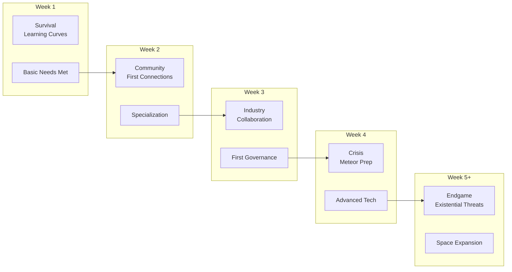

# 03: Multi-Session Arcs

**Time Scale**: Days to Weeks  
**Focus**: Long-term progression and server lifecycle phases  

---

## Overview

This document defines the player experience across multiple days and weeks of play. Unlike single sessions, these arcs build cumulative progress, relationships, and world impact over time.

---

## Week 1: Foundation

### Player Journey

```mermaid
gantt
    title Week 1 Player Journey
    dateFormat  X
    axisFormat %d
    
    section Survival
    Basic Shelter       :a1, 0, 2
    Food Security       :a2, 1, 3
    Tool Creation       :a3, 2, 4
    
    section Discovery
    Explore Area        :b1, 2, 5
    Meet Neighbors      :b2, 3, 6
    Find Resources      :b3, 4, 7
    
    section Specialization
    Choose Career       :c1, 5, 7
    Skill Development   :c2, 6, 7
```

### Week 1 Activities

| Day | Focus | Key Activities |
|-----|-------|----------------|
| 1-2 | Survival | Build shelter, secure food/water |
| 3-4 | Discovery | Explore, meet AI agents, map area |
| 5-6 | Specialization | Choose career path, start skill development |
| 7 | Planning | Set goals for week 2 |

### Week 1 Feel

**Primary Emotion**: Curiosity + mild anxiety  
**Experience**: Overwhelming but exciting. Learning systems. Meeting neighbors. Basic survival achieved.

---

## Week 2: Community

### Key Activities

- Join or form neighborhood/town
- Begin economic specialization
- First meaningful trades with AI agents
  - Agents use Session 2 economic behavior
  - Price beliefs form based on experience
  - Personality affects trading strategy
- Build basic infrastructure (paths, shared storage)
- Participate in first election
  - AI votes using Session 2 voting algorithms
  - Personal impact × values alignment × social influence

### Week 2 Feel

**Primary Emotion**: Connection  
**Experience**: Social connections form. Economic specialization begins. First political experiences. Sense of belonging.

---

## Week 3: Industry

### Key Activities

- Town formation (when 3+ players collaborate)
- Industrial production begins
  - Assembly lines
  - Automated gathering
  - Mass production
- First laws enacted through governance system
- Meteor preparation awareness begins
- Skill mastery in chosen path

### Week 3 Feel

**Primary Emotion**: Pride + pressure  
**Experience**: Collaborative projects take shape. Governance complexity emerges. Urgency building as meteor threat becomes real.

---

## Week 4: Crisis & Advancement

### Key Activities

- **Meteor preparation** (if day 30 approaching)
  - Research defense technology
  - Build defensive structures
  - Coordinate community response
- Advanced technology unlocked
  - Electronics
  - Advanced materials
  - Complex machinery
- Complex political situations
  - Multiple factions
  - Contested policies
  - Political crises
- Environmental challenges emerge
  - Pollution from industrialization
  - Resource scarcity
  - Ecosystem stress
- Long-term planning required

### Week 4 Feel

**Primary Emotion**: Urgency + accomplishment  
**Experience**: High stakes. Cooperation essential. Satisfaction from visible progress. World feels alive and responsive.

---

## Week 5+: Endgame

### Late Game Activities

- **Existential threats**
  - Meteor impact (day 30 event)
  - Ecosystem collapse
  - Economic depression
  - Political instability

- **Space expansion** (if meteor survived)
  - Rocket technology
  - Space colonization
  - New worlds to settle

- **Legacy building**
  - Monument construction
  - Museum creation
  - History documentation

### Endgame Feel

**Primary Emotion**: Determination + legacy focus  
**Experience**: Player's impact on world is visible. Long-term consequences of early decisions emerge. Sense of history and contribution.

---

## Multi-Session Progression Timeline

---

## Emotional Journey Map

| Week | Primary Emotion | Secondary | Challenge Level | Server Phase |
|------|----------------|-----------|-----------------|--------------|
| 1 | Curiosity | Anxiety | Medium | Establishment |
| 2 | Connection | Competition | Medium | Formation |
| 3 | Pride | Pressure | High | Development |
| 4 | Urgency | Accomplishment | Very High | Crisis |
| 5+ | Determination | Legacy | Extreme | Endgame |

---

## AI Agent Evolution

### Session 2 Agent Progression

AI agents evolve alongside players:

| Week | AI Behavior Changes |
|------|---------------------|
| 1 | Basic survival, forming initial price beliefs |
| 2 | Economic specialization, political awareness |
| 3 | Complex trading strategies, faction formation |
| 4 | Crisis response, collaborative behavior |
| 5+ | Mentoring new agents, legacy preservation |

### Population Dynamics

- **Week 1**: 25 agents (MVP limit)
- **Week 2-3**: 50 agents (if server supports)
- **Week 4+**: Up to 100 agents (post-MVP)

See [Session 2: 04-population-personality.md](../session-2-ai-system-design/04-population-personality.md) for population elasticity details.

---

## World State Evolution

### Environmental Changes

| Phase | Environmental State |
|-------|-------------------|
| Week 1 | Pristine, abundant resources |
| Week 2 | Minor impact, sustainable use |
| Week 3 | Industrial footprint visible |
| Week 4 | Pollution concerns, ecosystem stress |
| Week 5+ | Environmental crisis or restoration |

### Economic Evolution

- **Week 1**: Barter economy, simple exchanges
- **Week 2**: Currency emerges, marketplaces
- **Week 3**: Complex supply chains, automation
- **Week 4**: Economic interdependence, potential instability
- **Week 5+**: Mature economy or collapse

---

## Technical Considerations

### Session 1 Constraints

- **Data persistence**: Player progress saved continuously
- **Server lifecycle**: 30-day cycle with meteor event
- **Scaling**: World state grows but within performance budgets

### Session 2 Integration

- Agent behavior complexity increases over time
- Relationship networks deepen
- Economic and political systems mature

---

## Navigation

- [Session 3 Index](./[AGENTS-READ-FIRST]-index.md)
- [← 02: Session Gameplay](./02-session-gameplay.md)
- [→ 04: Player Archetypes](./04-player-archetypes.md)
- [RESEARCH-INDEX.md](./RESEARCH-INDEX.md) - Research sources

---

## Cross-References

- **AI Population**: See [Session 2: 04-population-personality.md](../session-2-ai-system-design/04-population-personality.md)
- **Server Lifecycle**: See [Session 1: Server Architecture](../session-1-technical-architecture/)
- **Progression Systems**: See [Session 4: Progression and Balance](../session-4-progression-and-balance/)
