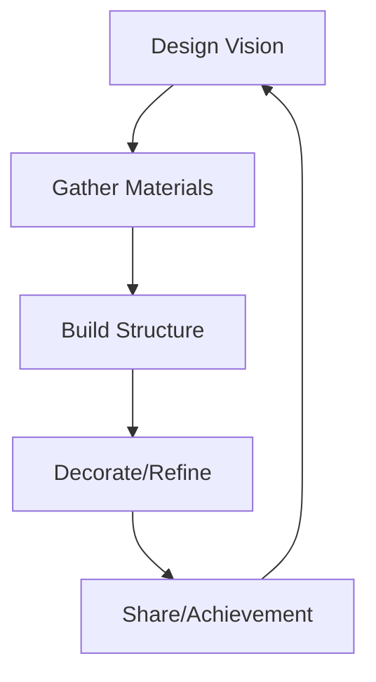
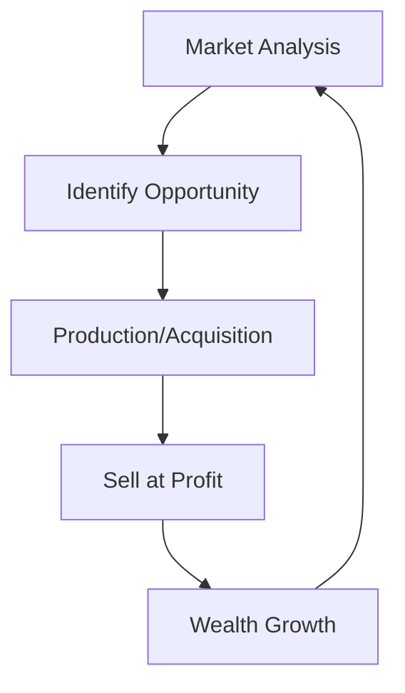
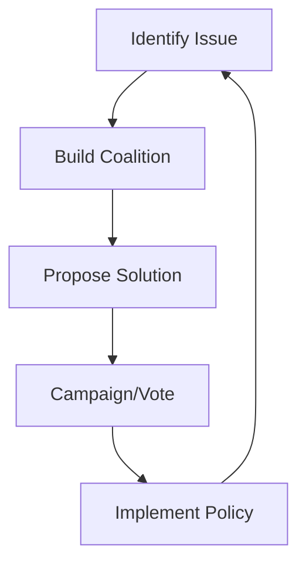
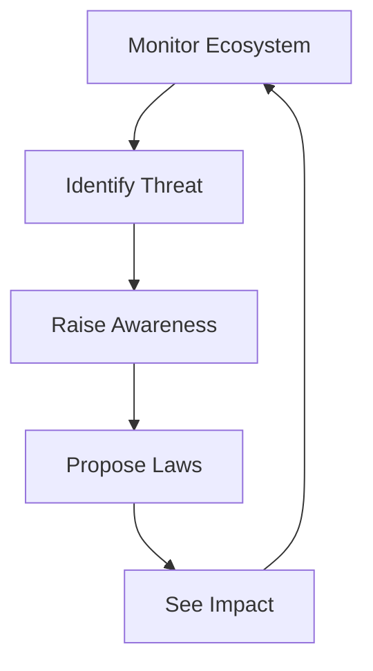
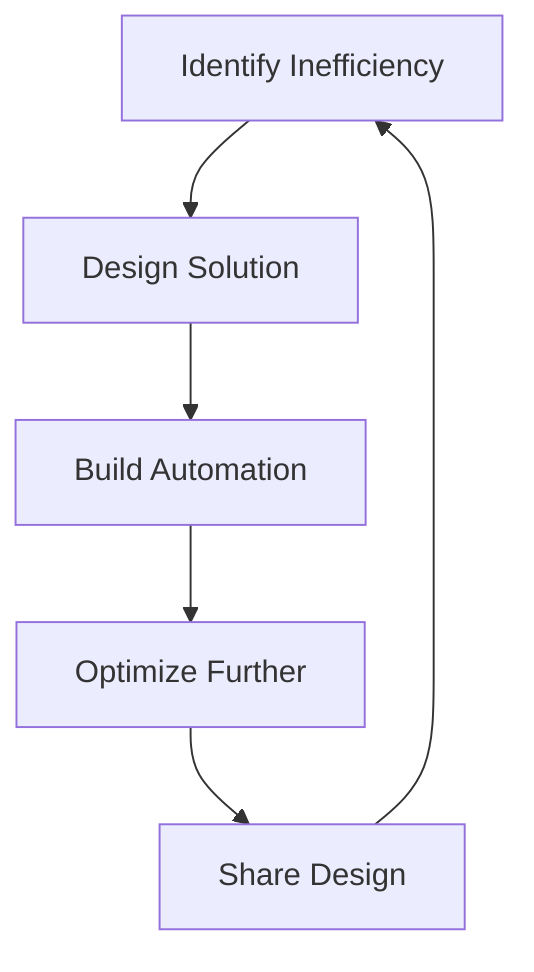
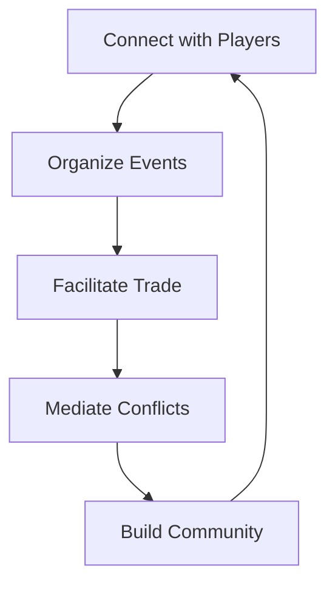

# 04: Player Archetypes

**Focus**: Different play styles, motivations, and gameplay loops  

---

## Overview

This document defines the six primary player archetypes in Societies. Each archetype has distinct motivations, preferred activities, and progression paths. Players often blend multiple archetypes, but understanding these profiles helps design meaningful gameplay for diverse preferences.

---

## The Builder

### Core Loop

**Loop**: Design → Build → Admire → Share

### Profile

| Attribute | Description |
|-----------|-------------|
| **Motivation** | Aesthetic expression, permanent impact |
| **Session Goals** | Complete construction projects |
| **Multi-Session** | Megaprojects, town design, monuments |
| **Satisfaction Sources** | Visual transformation, others' appreciation |

### Preferred Activities

- Architecture and design
- Material selection and aesthetics
- Blueprint creation and sharing
- Megaproject coordination
- Decoration and detailing

### Progression Path

1. Basic shelters
2. Functional workshops
3. Aesthetic homes
4. Public buildings
5. Town planning
6. Monumental architecture

---

## The Economist

### Core Loop

**Loop**: Analyze → Produce → Trade → Profit

### Profile

| Attribute | Description |
|-----------|-------------|
| **Motivation** | Optimization, wealth accumulation |
| **Session Goals** | Execute trades, optimize supply chains |
| **Multi-Session** | Build business empire, corner markets |
| **Satisfaction Sources** | Efficient systems, market dominance |

### Preferred Activities

- Price monitoring and analysis
- Supply chain optimization
- Store management
- Contract fulfillment
- Investment and speculation

### Progression Path

1. Basic trading
2. Store operation
3. Market analysis
4. Supply chain mastery
5. Economic influence
6. Market manipulation

### Session 2 Integration

Economists interact heavily with Session 2's economic AI:
- AI price belief systems
- Market dynamics
- Trading strategies
- Contract fulfillment

---

## The Politician

### Core Loop

**Loop**: Observe → Organize → Propose → Influence

### Profile

| Attribute | Description |
|-----------|-------------|
| **Motivation** | Power, social impact, leadership |
| **Session Goals** | Pass legislation, win elections |
| **Multi-Session** | Rise through government ranks |
| **Satisfaction Sources** | Policy impact, coalition building |

### Preferred Activities

- Law drafting and proposal
- Campaigning and coalition building
- Election strategy
- Governance and administration
- Diplomacy and negotiation

### Progression Path

1. Local advocacy
2. Proposal drafting
3. Campaign participation
4. Election candidacy
5. Government office
6. Leadership positions

### Session 2 Integration

Politicians work directly with Session 2's political AI:
- AI voting algorithms
- Faction dynamics
- Social influence networks
- Values alignment systems

---

## The Environmentalist

### Core Loop

**Loop**: Monitor → Alert → Protect → Restore

### Profile

| Attribute | Description |
|-----------|-------------|
| **Motivation** | Stewardship, sustainability |
| **Session Goals** | Environmental projects, conservation |
| **Multi-Session** | Restore damaged ecosystems |
| **Satisfaction Sources** | Ecosystem health, species preservation |

### Preferred Activities

- Environmental monitoring
- Data analysis and reporting
- Conservation projects
- Sustainable technology
- Policy advocacy for nature

### Progression Path

1. Basic resource awareness
2. Environmental monitoring
3. Conservation efforts
4. Sustainable systems
5. Ecosystem restoration
6. Environmental leadership

### Session 2 Integration

Environmentalists interact with:
- AI environmental awareness
- Resource consumption tracking
- Ecosystem simulation
- Sustainability metrics

---

## The Engineer

### Core Loop

**Loop**: Problem → Design → Build → Optimize

### Profile

| Attribute | Description |
|-----------|-------------|
| **Motivation** | Efficiency, problem-solving |
| **Session Goals** | Create automated systems |
| **Multi-Session** | Complex infrastructure networks |
| **Satisfaction Sources** | System efficiency, elegant solutions |

### Preferred Activities

- Automation design
- System optimization
- Blueprint engineering
- Resource flow management
- Technical problem solving

### Progression Path

1. Simple tools
2. Basic automation
3. Production lines
4. Complex systems
5. Infrastructure networks
6. Advanced engineering

---

## The Socializer

### Core Loop

**Loop**: Connect → Organize → Facilitate → Unite

### Profile

| Attribute | Description |
|-----------|-------------|
| **Motivation** | Social bonds, community impact |
| **Session Goals** | Social events, community building |
| **Multi-Session** | Town culture, traditions |
| **Satisfaction Sources** | Relationships, community harmony |

### Preferred Activities

- Event organization
- Community building
- Conflict mediation
- Trade facilitation
- Cultural development

### Progression Path

1. Meeting neighbors
2. Basic socializing
3. Event organizing
4. Community leadership
5. Cultural influence
6. Town mayor/leader

### Session 2 Integration

Socializers benefit from Session 2's social AI:
- Relationship formation with AI agents
- Social network development
- Reputation systems
- Information spreading

---

## Archetype Interactions

### Complementary Pairs

| Archetype A | Archetype B | Synergy |
|-------------|-------------|---------|
| Builder | Engineer | Efficient construction |
| Economist | Politician | Economic policy |
| Environmentalist | Engineer | Sustainable tech |
| Socializer | Politician | Coalition building |
| Builder | Environmentalist | Green architecture |

### Potential Conflicts

| Archetype A | Archetype B | Conflict |
|-------------|-------------|----------|
| Economist | Environmentalist | Growth vs preservation |
| Builder | Environmentalist | Development vs conservation |
| Politician | Engineer | Bureaucracy vs efficiency |

---

## Archetype Distribution

### Expected Player Mix

Based on Bartle taxonomy and similar games:

| Archetype | Estimated % | Primary Audience |
|-----------|-------------|------------------|
| Builder | 25% | Minecraft, Factorio players |
| Economist | 15% | EVE, Tycoon game players |
| Politician | 10% | Paradox game players |
| Environmentalist | 15% | Eco, Terra Nil players |
| Engineer | 20% | Factorio, Satisfactory players |
| Socializer | 15% | MMO, Second Life players |

### Design Implications

- All activities should serve at least one archetype
- Major features should support multiple archetypes
- Archetype-specific content depth is important
- Cross-archetype collaboration should be rewarded

---

## Archetype Migration

Players often shift archetypes over time:

### Common Progressions

1. **Survival → Specialization**: All players start with survival, then choose path
2. **Economist → Politician**: Wealth leads to political influence
3. **Engineer → Builder**: Technical skills enable grand projects
4. **Socializer → Politician**: Community trust enables leadership

### Design Support

- Allow players to try different activities
- Don't lock players into single archetype
- Support hybrid playstyles
- Reward archetype exploration

---

## Navigation

- [Session 3 Index](./[AGENTS-READ-FIRST]-index.md)
- [← 03: Multi-Session Arcs](./03-multi-session-arcs.md)
- [→ 05: Progression Feel](./05-progression-feel.md)
- [RESEARCH-INDEX.md](./RESEARCH-INDEX.md) - Research sources

---

## Cross-References

- **Bartle Taxonomy**: See RESEARCH-INDEX.md for player type theory
- **AI Behaviors**: See [Session 2: AI System Design](../session-2-ai-system-design/)
- **Progression Systems**: See [Session 4: Progression and Balance](../session-4-progression-and-balance/)
