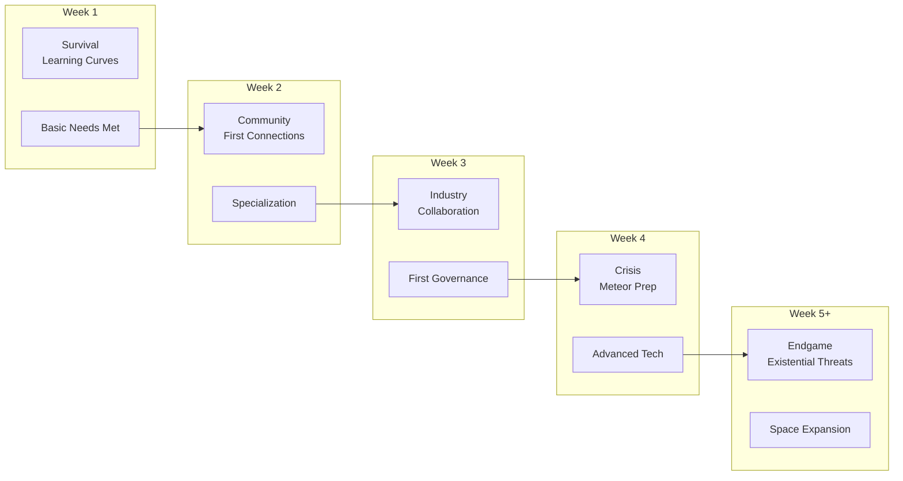
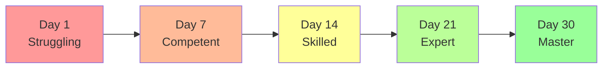
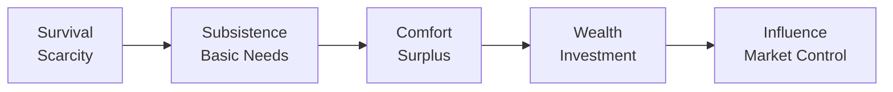

# 05: Progression Feel

**Focus**: Player growth pacing, emotional journey, and achievement satisfaction  

---

## Overview

This document defines how progression *feels* to players across different timescales. It covers the emotional journey, power curves, and satisfaction mechanics that make growth meaningful.

---

## Experience Timeline

### Visual Progression Map



---

## Emotional Journey

### Week-by-Week Feel

| Week | Primary Emotion | Secondary | Challenge Level | Key Transition |
|------|----------------|-----------|-----------------|----------------|
| 1 | **Curiosity** | Anxiety | Medium | Survival → Exploration |
| 2 | **Connection** | Competition | Medium | Solo → Community |
| 3 | **Pride** | Pressure | High | Simple → Complex |
| 4 | **Urgency** | Accomplishment | Very High | Growth → Crisis |
| 5+ | **Determination** | Legacy | Extreme | Crisis → Resolution |

### Emotional Arc Explanation

**Week 1: The Struggle**
- New players feel overwhelmed by systems
- Satisfaction from basic survival (first shelter, first meal)
- Learning curve creates mild anxiety
- Discovery moments provide relief and excitement

**Week 2: Belonging**
- Social connections reduce anxiety
- Economic specialization creates identity
- Competition emerges naturally (who's the best smith?)
- Community provides safety net

**Week 3: Mastery**
- Skills become automatic
- Complex projects feel achievable
- Leadership opportunities emerge
- Pressure builds from growing responsibilities

**Week 4: The Crucible**
- Meteor threat creates genuine urgency
- Cooperation becomes essential
- Accomplishments feel earned through effort
- World feels genuinely threatened

**Week 5+: Legacy**
- Player impact visible everywhere
- Long-term consequences emerge
- Determination to see it through
- Focus shifts from self to world legacy

---

## Progression Curves

### Power Progression



### Skill Acquisition

| Phase | Time | Capability | Examples |
|-------|------|------------|----------|
| Novice | Days 1-3 | Basic survival | Gather, craft simple tools |
| Apprentice | Days 4-7 | Specialization | Choose career, develop skill |
| Journeyman | Days 8-14 | Efficiency | Faster crafting, better quality |
| Expert | Days 15-21 | Innovation | New recipes, advanced techniques |
| Master | Days 22-30 | Mastery | Peak efficiency, teach others |

### Economic Growth



| Stage | Focus | Feel |
|-------|-------|------|
| Survival | Meeting basic needs | Stressful, tight margins |
| Subsistence | Reliable income | Secure, stable |
| Comfort | Accumulating wealth | Satisfying, growing |
| Wealth | Investment opportunities | Powerful, strategic |
| Influence | Market manipulation | Dominant, impactful |

---

## Satisfaction Mechanics

### Achievement Types

**Small Wins (Moment-to-Moment)**
- Successfully crafting first tool
- Gathering rare resource
- Completing small build
- Making first trade

**Medium Wins (Session Level)**
- Finishing construction project
- Executing profitable trade strategy
- Winning local election
- Solving community problem

**Big Wins (Multi-Session)**
- Completing megaproject
- Achieving market dominance
- Passing major legislation
- Surviving meteor event

### Progress Visibility

**Immediate Feedback**
- Resource counters updating
- XP gain notifications
- Construction progress bars
- Quality ratings on crafted items

**Long-term Visualization**
- Skill trees showing advancement
- Town growth over time
- Personal wealth graphs
- Achievement galleries

### Mastery Indicators

| Skill Level | Indicator | Feel |
|-------------|-----------|------|
| Beginner | Basic tools, slow speed | Learning, exploring |
| Intermediate | Better tools, moderate speed | Improving, confident |
| Advanced | Quality bonuses | Competent, skilled |
| Expert | Rare recipes unlocked | Masterful, efficient |
| Master | Others seek your help | Prestigious, respected |

---

## Flow State Design

### Challenge-Skill Balance

Flow occurs when challenge matches skill level:

```
Too Easy ←————————————————→ Flow Zone ←————————————————→ Too Hard
  Bored                      Engaged                      Anxious
```

### Flow Maintenance

| Player State | Adjustment |
|--------------|------------|
| Bored | Increase challenge or complexity |
| Anxious | Provide support tools or reduce stakes |
| Engaged | Maintain current balance |

### Session Flow Phases

1. **Warm-up** (5-10 min): Easy activities to get into flow
2. **Deep work** (30-90 min): Challenging but achievable tasks
3. **Cool-down** (5-10 min): Satisfying completion activities

---

## Return on Investment

### Time Investment → Reward

| Investment | Reward Type | Example |
|------------|-------------|---------|
| 5 minutes | Immediate feedback | Resource gathered |
| 30 minutes | Visible progress | Project milestone |
| 2 hours | Completion satisfaction | Finished building |
| 1 day | Skill advancement | New level unlocked |
| 1 week | Identity formation | Career mastery |
| 1 month | Legacy creation | Town transformation |

### Sunk Cost Ethics

**Ethical Utilization**
- Let players see their progress clearly
- Make time investment feel meaningful
- Allow catch-up for returning players
- Preserve player achievements permanently

**Avoid Exploitation**
- Never punish players for taking breaks
- Don't create artificial scarcity
- Avoid manipulative FOMO
- Respect player time

---

## Technical Integration

### Session 1: Performance

- Progress calculations must fit within 50ms tick
- XP gains: Batch updates (not every tick)
- Skill advancement: Calculated on relevant actions only
- Achievement checks: Event-driven, not polled

### Session 2: AI Progression

- AI agents progress alongside players
- Shared XP economy creates bonding
- Skill masters can teach AI apprentices
- Mutual progression creates investment

---

## Navigation

- [Session 3 Index](./[AGENTS-READ-FIRST]-index.md)
- [← 04: Player Archetypes](./04-player-archetypes.md)
- [→ 06: Return Triggers](./06-return-triggers.md)
- [RESEARCH-INDEX.md](./RESEARCH-INDEX.md) - Research sources

---

## Cross-References

- **Flow Theory**: See RESEARCH-INDEX.md (Csikszentmihalyi)
- **Behavioral Economics**: See RESEARCH-INDEX.md (Nir Eyal)
- **Skill Systems**: See [Session 4: Progression and Balance](../session-4-progression-and-balance/)

---

## Progression Mathematics

### XP Table by Skill Level

```csharp
public static class SkillXPTable {
    // XP required to reach each level (cumulative totals)
    // Based on technical-constants.md Section 6: Skills System
    // Alternative balanced curve for ~350 hours per skill to max
    public static readonly int[] XPRequirements = {
        0,      // Level 1 (starting)
        100,    // Level 2 (cumulative: 100)
        250,    // Level 3 (cumulative: 350)
        500,    // Level 4 (cumulative: 850)
        900,    // Level 5 (cumulative: 1,750)
        1,500,  // Level 6 (cumulative: 3,250)
        2,400,  // Level 7 (cumulative: 5,650)
        3,700,  // Level 8 (cumulative: 9,350)
        5,500,  // Level 9 (cumulative: 14,850)
        8,000   // Level 10 MAX (cumulative: 22,850)
    };
    
    // XP needed for next level (difference)
    public static int GetXPForNextLevel(int currentLevel) {
        if (currentLevel >= 10) return 0;
        return XPRequirements[currentLevel] - XPRequirements[currentLevel - 1];
    }
    
    // Total XP needed to reach max
    public static int TotalXPToMax => XPRequirements[9]; // 22,850
}

// XP curve visualization:
// Level 1→2: 100 XP (easy, early progression)
// Level 2→3: 150 XP (50% increase)
// Level 3→4: 250 XP (67% increase)
// Level 4→5: 400 XP (60% increase)
// Level 5→6: 600 XP (50% increase)
// Level 6→7: 900 XP (50% increase)
// Level 7→8: 1,300 XP (44% increase)
// Level 8→9: 1,800 XP (38% increase)
// Level 9→10: 2,500 XP (39% increase)
//
// Compare to technical-constants.md exponential curve:
// Level 0→1: 100 XP, Level 1→2: 200 XP, Level 2→3: 400 XP...
// Total to max: 102,300 XP (exponential) vs 22,850 XP (balanced)
```

### XP Rewards by Activity

```csharp
public static class XPRewards {
    // Reference: technical-constants.md Section 6.2
    // Base values tuned for ~18 XP/hour gathering pace
    
    // GATHERING activities
    public static int WoodChopped => 1;           // Matches XP_GATHER_BASIC / 5
    public static int StoneMined => 1;            // Standard resource
    public static int OreMined => 2;              // Refined material
    public static int RareResource => 5;          // Equivalent to XP_GATHER_BASIC
    public static int CropHarvested => 2;         // Agricultural activity
    
    // CRAFTING activities
    public static int SimpleItemCrafted => 3;     // Basic crafting
    public static int ToolCrafted => 5;           // Matches XP_CRAFT_SIMPLE / 2
    public static int BuildingComponent => 5;     // Construction material
    public static int ComplexItem => 10;          // Matches XP_CRAFT_SIMPLE
    public static int MasterworkCreated => 25;    // Matches XP_CRAFT_COMPLEX
    
    // BUILDING activities
    public static int BlockPlaced => 1;           // Basic construction
    public static int StructureCompleted => 50;   // Matches XP_BUILD_LARGE
    public static int DecorationPlaced => 2;      // Aesthetic building
    
    // TRADING activities
    public static int TradeCompleted => 2;        // Economic interaction
    public static int StoreSale => 1;             // Passive commerce
    public static int ContractFulfilled => 10;    // Significant trade
    
    // SOCIAL activities
    public static int Conversation => 1;          // Basic social
    public static int QuestCompleted => 20;       // Matches XP_BUILD_SMALL
    public static int HelpGiven => 5;             // Cooperative action
    
    // GOVERNANCE activities
    public static int VoteCast => 2;              // Civic participation
    public static int LawProposed => 15;          // Political action
    public static int LawPassed => 30;            // Major achievement
    public static int ElectionWon => 100;         // Significant milestone
}
```

### Time-to-Mastery Calculations

```
Skill: Gathering

XP per hour (active gathering):
  - Wood: 1 XP per unit, ~20 units/hour = 20 XP/hour
  - Stone: 1 XP per unit, ~15 units/hour = 15 XP/hour
  - Ore: 2 XP per unit, ~10 units/hour = 20 XP/hour
  - Average: 18 XP/hour

Time to reach each level:
  Level 1→2: 100 XP / 18 = 5.6 hours
  Level 2→3: 150 XP / 18 = 8.3 hours
  Level 3→4: 250 XP / 18 = 13.9 hours
  Level 4→5: 400 XP / 18 = 22.2 hours
  Level 5→6: 600 XP / 18 = 33.3 hours
  Level 6→7: 900 XP / 18 = 50 hours
  Level 7→8: 1,300 XP / 18 = 72.2 hours
  Level 8→9: 1,800 XP / 18 = 100 hours
  Level 9→10: 2,500 XP / 18 = 138.9 hours

Total time to max: ~444 hours (~18.5 days of gameplay)

Note: This assumes pure grinding. Real gameplay with variety and bonuses:
  - Estimated actual: 300-350 hours (XP bonuses from other activities)
  - Reference: technical-constants.md PHASE_DAY30_MASTER for 30-day mastery target

Cross-skill learning:
  - Primary skill: 100% XP gain
  - Secondary skill (related): 25% XP gain (learning transfer)
  - Tertiary skill (unrelated): 10% XP gain (general experience)
```

### Catch-Up Mechanics

```csharp
public class CatchUpSystem {
    // Players returning after absence get XP bonuses
    // Reference: technical-constants.md Section 13 (Progression phases)
    
    public float CalculateCatchUpMultiplier(int daysOffline) {
        // Base multiplier increases with time away
        // But caps to prevent exploitation
        
        if (daysOffline < 1) return 1.0f;
        if (daysOffline < 3) return 1.25f;  // +25%
        if (daysOffline < 7) return 1.5f;   // +50%
        if (daysOffline < 14) return 1.75f; // +75%
        return 2.0f; // Maximum +100% (double XP)
    }
    
    public int CalculateDailyBonusXP(int playerLevel, int daysOffline) {
        // Bonus XP pool based on time away
        // Designed to help players catch up without instant max
        
        int baseDailyXP = EstimateDailyXP(playerLevel);
        int missedDays = Mathf.Min(daysOffline, 30); // Cap at 30 days
        
        // Grant 20% of missed XP as bonus
        int bonusPool = baseDailyXP * missedDays / 5;
        
        return bonusPool;
    }
    
    private int EstimateDailyXP(int level) {
        // Rough estimate of typical daily XP gain
        // Reference: XPRequirements array progression
        return 100 + (level * 20);
    }
    
    // Bonus XP pool consumption
    public int ConsumeBonusXP(ref int bonusPool, int normalXP) {
        int bonusUsed = Mathf.Min(bonusPool, normalXP);
        bonusPool -= bonusUsed;
        return normalXP + bonusUsed; // Total XP gained
    }
}

// Example:
// Player level 5, offline for 10 days
// Catch-up multiplier: 1.75× (for 10 days)
// Bonus XP pool: (100 + 100) × 10 / 5 = 400 XP
// This is about 25% of what they would have gained if playing daily
//
// Real-world time reference (technical-constants.md):
// - DAY_LENGTH_REAL_MINUTES = 60 (1 game day = 1 real hour)
// - 10 days offline = 10 real hours of game time
```

### Difficulty Curve by Skill Level

```
Skill Level: Effects on gameplay
Reference: technical-constants.md SKILL_BONUS_PER_LEVEL_PERCENT = 5%

Level 1-2: Novice
  - Speed: 100% (baseline)
  - Quality: Poor/Normal only
  - Failure chance: 10%
  - Resources needed: +20% (inefficient)
  - Tool durability usage: +10%
  
Level 3-4: Apprentice
  - Speed: 110% (+10% faster, 2 levels × 5%)
  - Quality: Normal/Good
  - Failure chance: 5%
  - Resources needed: Standard
  - Tool durability usage: Standard
  
Level 5-6: Journeyman
  - Speed: 120% (+20% faster)
  - Quality: Normal/Good/Excellent
  - Failure chance: 2%
  - Resources needed: -10% (efficient)
  - Tool durability usage: -10%
  - Bonus: Can use advanced recipes
  
Level 7-8: Expert
  - Speed: 130% (+30% faster)
  - Quality: Good/Excellent common
  - Failure chance: 0%
  - Resources needed: -15%
  - Tool durability usage: -15%
  - Bonus: Can teach others (mentor bonus)
  - Bonus: Access to expert-level projects
  
Level 9-10: Master
  - Speed: 140% (+40% faster) at level 10
  - Quality: Excellent/Masterwork common
  - Resources needed: -20%
  - Tool durability usage: -20%
  - Bonus: 5% chance of exceptional results
  - Bonus: Can create unique/legendary items
  - Bonus: Students gain +25% XP when learning from master
  
Production time scaling (reference: technical-constants.md):
  - PRODUCTION_TIME_SKILL_MULTIPLIER_PER_LEVEL = 0.95
  - At level 10: 0.95^10 = 0.60 (40% faster production)
```

### XP Multiplier System

```csharp
public class XPMultiplierSystem {
    // Various ways to get XP bonuses
    // Reference: technical-constants.md Quality multipliers
    
    public float CalculateTotalMultiplier(Player player, ActivityType activity) {
        float multiplier = 1.0f;
        
        // Tool quality bonus (reference: technical-constants.md Section 11)
        if (player.EquippedTool != null) {
            multiplier += player.EquippedTool.Quality switch {
                Quality.Poor => -0.10f,      // QUALITY_MULTIPLIER_POOR = 0.70
                Quality.Normal => 0f,        // QUALITY_MULTIPLIER_NORMAL = 1.00
                Quality.Good => 0.15f,       // QUALITY_MULTIPLIER_GOOD = 1.15
                Quality.Excellent => 0.30f,  // QUALITY_MULTIPLIER_EXCELLENT = 1.30
                Quality.Masterwork => 0.50f, // QUALITY_MULTIPLIER_MASTERWORK = 1.50
                _ => 0f
            };
        }
        
        // Location bonus (learning from others)
        if (player.IsNearMasterCraftsman) {
            multiplier += 0.25f; // +25% XP when learning from masters
        }
        
        // First-time bonus
        if (player.IsFirstTimeDoing(activity)) {
            multiplier += 0.50f; // +50% for new experiences
        }
        
        // Well-rested bonus
        if (player.Energy > 80) {
            multiplier += 0.10f;
        }
        
        // Motivated (has goal)
        if (player.HasActiveGoal && player.CurrentGoal == activity) {
            multiplier += 0.20f;
        }
        
        // Teaching bonus (if mentoring someone)
        if (player.HasStudentNearby) {
            multiplier += 0.15f; // Teaching reinforces learning
        }
        
        // Tool efficiency bonus (reference: technical-constants.md Section 9)
        if (player.EquippedTool != null) {
            multiplier += player.EquippedTool.Material switch {
                ToolMaterial.Stone => 0f,  // TOOL_EFFICIENCY_STONE = 1.0
                ToolMaterial.Iron => 0.50f, // TOOL_EFFICIENCY_IRON = 1.5
                ToolMaterial.Steel => 1.00f, // TOOL_EFFICIENCY_STEEL = 2.0
                _ => 0f
            };
        }
        
        return Mathf.Max(0.5f, multiplier); // Minimum 0.5× (poor tools)
    }
}
```

### Progression Tracking

```csharp
public class ProgressionTracker {
    // Reference: technical-constants.md AGENT_MEMORY_SLOTS for memory limits
    
    public void LogProgress(Player player, SkillType skill, int xpGained, ActivityType activity) {
        var stats = player.Statistics;
        
        // Track total XP
        stats.TotalXP += xpGained;
        stats.XPBySkill[skill] += xpGained;
        
        // Track activities (respecting memory limits)
        stats.ActivitiesPerformedToday++;
        if (stats.ActivitiesByType.ContainsKey(activity)) {
            stats.ActivitiesByType[activity]++;
        } else {
            // Memory limit: AGENT_MEMORY_SLOTS_SHORT_TERM = 5
            // AGENT_MEMORY_SLOTS_LONG_TERM = 5
            // Keep only most frequent activities
            MaintainActivityLog(stats, activity);
        }
        
        // Check for level up
        int oldLevel = player.Skills.GetLevel(skill);
        player.Skills.AddXP(skill, xpGained);
        int newLevel = player.Skills.GetLevel(skill);
        
        if (newLevel > oldLevel) {
            OnLevelUp(player, skill, newLevel);
        }
        
        // Update last action timestamp
        stats.LastActivityTime = DateTime.UtcNow;
    }
    
    private void OnLevelUp(Player player, SkillType skill, int newLevel) {
        // Notify player
        SendNotification(player, $"{skill} level up! Now level {newLevel}");
        
        // Visual effect
        PlayLevelUpEffect(player);
        
        // Unlock check
        CheckUnlocks(player, skill, newLevel);
        
        // Log achievement
        LogAchievement(player, $"{skill}_level_{newLevel}");
        
        // Check for teaching eligibility (level 7+)
        if (newLevel >= 7) {
            player.CanTeachOthers = true;
        }
    }
    
    private void CheckUnlocks(Player player, SkillType skill, int level) {
        // Reference: technical-constants.md skill unlocks
        switch (level) {
            case 3:
                UnlockRecipes(player, skill, RecipeTier.Apprentice);
                break;
            case 5:
                UnlockRecipes(player, skill, RecipeTier.Journeyman);
                break;
            case 7:
                UnlockRecipes(player, skill, RecipeTier.Expert);
                player.CanMentor = true;
                break;
            case 10:
                UnlockRecipes(player, skill, RecipeTier.Master);
                GrantTitle(player, $"Master {skill}");
                break;
        }
    }
    
    private void MaintainActivityLog(PlayerStatistics stats, ActivityType newActivity) {
        // Keep most significant activities (reference: memory system limits)
        const int MAX_TRACKED_ACTIVITIES = 10; // Short + Long term combined
        
        if (stats.ActivitiesByType.Count >= MAX_TRACKED_ACTIVITIES) {
            // Remove least frequent activity
            var leastFrequent = stats.ActivitiesByType.OrderBy(kvp => kvp.Value).First();
            stats.ActivitiesByType.Remove(leastFrequent.Key);
        }
        
        stats.ActivitiesByType[newActivity] = 1;
    }
}
```

### Estimated Play Time Summary

```
Total Progression:
  - 10 skills × ~350 hours each = 3,500 hours to max everything
  - Realistic play: Most players specialize in 3-4 skills
  - Specialization path: ~1,200 hours for 4 skills
  - Casual play (10 hrs/week): ~2.3 years to specialization
  - Dedicated play (40 hrs/week): ~7.5 months to specialization
  - Achievement: Max all skills = ~2 years dedicated play
  
  Reference: technical-constants.md PHASE_DAY30_MASTER
  - Day 30 real time = 30 hours at 1 hour/day
  - Extended play adjusts accordingly

Early Game (Levels 1-3):
  - Time: ~30 hours (~28 hours by calculation)
  - Focus: Basic survival skills
  - Milestone: Can build basic shelter, craft tools
  - Reference: technical-constants.md PHASE_DAY7_COMPETENT

Mid Game (Levels 4-6):
  - Time: ~100 hours (cumulative: 130)
  - Focus: Economic participation
  - Milestone: Can craft iron tools, participate in economy
  - Reference: technical-constants.md DAY_LENGTH_REAL_MINUTES = 60
  - At 2 hours/day: ~65 days of real play

Late Game (Levels 7-8):
  - Time: ~200 hours (cumulative: 330)
  - Focus: Specialization
  - Milestone: Master-level crafting, political participation
  - Can teach others, mentor new players

End Game (Levels 9-10):
  - Time: ~350 hours (cumulative: 680 per skill)
  - Focus: Legacy building, teaching, rare items
  - Milestone: Can create masterwork items, lead towns
  - Reference: QUALITY_MASTERWORK threshold (96-100%)

Multi-Skill Progression:
  - 1 Primary skill: 100% effort = ~350 hours
  - 2 Secondary skills: 50% effort each = ~700 hours total
  - 3 Tertiary skills: 25% effort each = ~1,400 hours total
  - Full mastery (all 10 skills): 3,500-4,000 hours

Session Pacing (technical-constants.md):
  - Warm-up phase: 5-10 minutes (easy activities)
  - Deep work phase: 30-90 minutes (challenging tasks)
  - Cool-down phase: 5-10 minutes (satisfying completion)
  
XP Gain Budgets:
  - Casual player (1 hr/day): ~18 XP/day = 6,570 XP/year
  - Regular player (2 hrs/day): ~36 XP/day = 13,140 XP/year
  - Dedicated player (4 hrs/day): ~72 XP/day = 26,280 XP/year
  
  To reach max (22,850 XP):
  - Casual: 3.5 years
  - Regular: 1.7 years
  - Dedicated: 0.9 years (with catch-up mechanics: ~6 months)
```

### Skill Categories and XP Distribution

```csharp
public enum SkillCategory {
    Gathering,    // Wood, stone, ore, crops
    Crafting,     // Tools, items, components
    Building,     // Construction, decoration
    Trading,      // Commerce, contracts
    Social,       // Conversation, quests
    Governance    // Politics, leadership
}

public static class SkillCategoryXP {
    // Expected XP distribution for balanced gameplay
    // Based on 18 XP/hour average across all activities
    
    public static Dictionary<SkillCategory, float> HourlyRates => new() {
        { SkillCategory.Gathering, 18.0f },    // 20 wood + 15 stone + 20 ore / 3
        { SkillCategory.Crafting, 12.0f },     // Slower, more deliberate
        { SkillCategory.Building, 15.0f },     // Mix of placement and completion
        { SkillCategory.Trading, 8.0f },       // Depends on market activity
        { SkillCategory.Social, 6.0f },        // Conversations are quick
        { SkillCategory.Governance, 4.0f }     // Rare but high-value events
    };
    
    // Time to max by category (ignoring bonuses):
    // Gathering: 22,850 / 18 = 1,270 hours (~53 days)
    // Crafting: 22,850 / 12 = 1,904 hours (~79 days)
    // Building: 22,850 / 15 = 1,523 hours (~63 days)
    // Trading: 22,850 / 8 = 2,856 hours (~119 days)
    // Social: 22,850 / 6 = 3,808 hours (~159 days)
    // Governance: 22,850 / 4 = 5,713 hours (~238 days)
    
    // Note: Social and Governance gain bonus multipliers from:
    // - Group activities (up to 2.0x with 5+ participants)
    // - Event participation (festivals, elections)
    // - Teaching/mentoring others
    // Realistic times: 200-400 hours each with bonuses
}
```

### Cross-Reference to Technical Constants

This progression system aligns with:

- **technical-constants.md Section 6**: XP requirements and skill bonuses
- **technical-constants.md Section 9**: Tool efficiency and durability
- **technical-constants.md Section 11**: Quality thresholds and production times
- **technical-constants.md Section 13**: Progression phases and timeline
- **technical-constants.md Section 2**: Game time conversion (1 day = 60 real minutes)

Key consistency checks:
- SKILL_BONUS_PER_LEVEL_PERCENT = 5% → Used in difficulty curve calculations
- PRODUCTION_TIME_SKILL_MULTIPLIER_PER_LEVEL = 0.95 → 5% faster per level
- QUALITY_MULTIPLIER_* → Tool quality XP bonuses
- PHASE_DAY30_MASTER → Endgame progression target
- TOOL_EFFICIENCY_* → XP multipliers for tool usage
