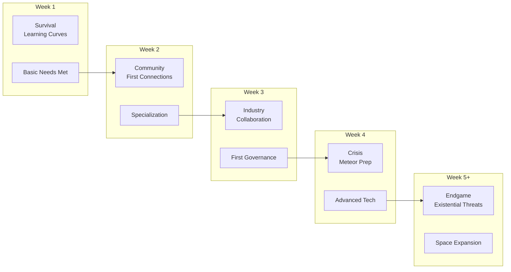
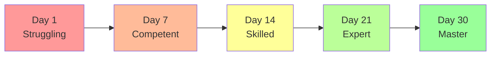
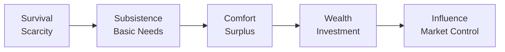

# 05: Progression Feel

**Focus**: Player growth pacing, emotional journey, and achievement satisfaction  

---

## Overview

This document defines how progression *feels* to players across different timescales. It covers the emotional journey, power curves, and satisfaction mechanics that make growth meaningful.

---

## Experience Timeline

### Visual Progression Map



---

## Emotional Journey

### Week-by-Week Feel

| Week | Primary Emotion | Secondary | Challenge Level | Key Transition |
|------|----------------|-----------|-----------------|----------------|
| 1 | **Curiosity** | Anxiety | Medium | Survival → Exploration |
| 2 | **Connection** | Competition | Medium | Solo → Community |
| 3 | **Pride** | Pressure | High | Simple → Complex |
| 4 | **Urgency** | Accomplishment | Very High | Growth → Crisis |
| 5+ | **Determination** | Legacy | Extreme | Crisis → Resolution |

### Emotional Arc Explanation

**Week 1: The Struggle**
- New players feel overwhelmed by systems
- Satisfaction from basic survival (first shelter, first meal)
- Learning curve creates mild anxiety
- Discovery moments provide relief and excitement

**Week 2: Belonging**
- Social connections reduce anxiety
- Economic specialization creates identity
- Competition emerges naturally (who's the best smith?)
- Community provides safety net

**Week 3: Mastery**
- Skills become automatic
- Complex projects feel achievable
- Leadership opportunities emerge
- Pressure builds from growing responsibilities

**Week 4: The Crucible**
- Meteor threat creates genuine urgency
- Cooperation becomes essential
- Accomplishments feel earned through effort
- World feels genuinely threatened

**Week 5+: Legacy**
- Player impact visible everywhere
- Long-term consequences emerge
- Determination to see it through
- Focus shifts from self to world legacy

---

## Progression Curves

### Power Progression



### Skill Acquisition

| Phase | Time | Capability | Examples |
|-------|------|------------|----------|
| Novice | Days 1-3 | Basic survival | Gather, craft simple tools |
| Apprentice | Days 4-7 | Specialization | Choose career, develop skill |
| Journeyman | Days 8-14 | Efficiency | Faster crafting, better quality |
| Expert | Days 15-21 | Innovation | New recipes, advanced techniques |
| Master | Days 22-30 | Mastery | Peak efficiency, teach others |

### Economic Growth



| Stage | Focus | Feel |
|-------|-------|------|
| Survival | Meeting basic needs | Stressful, tight margins |
| Subsistence | Reliable income | Secure, stable |
| Comfort | Accumulating wealth | Satisfying, growing |
| Wealth | Investment opportunities | Powerful, strategic |
| Influence | Market manipulation | Dominant, impactful |

---

## Satisfaction Mechanics

### Achievement Types

**Small Wins (Moment-to-Moment)**
- Successfully crafting first tool
- Gathering rare resource
- Completing small build
- Making first trade

**Medium Wins (Session Level)**
- Finishing construction project
- Executing profitable trade strategy
- Winning local election
- Solving community problem

**Big Wins (Multi-Session)**
- Completing megaproject
- Achieving market dominance
- Passing major legislation
- Surviving meteor event

### Progress Visibility

**Immediate Feedback**
- Resource counters updating
- XP gain notifications
- Construction progress bars
- Quality ratings on crafted items

**Long-term Visualization**
- Skill trees showing advancement
- Town growth over time
- Personal wealth graphs
- Achievement galleries

### Mastery Indicators

| Skill Level | Indicator | Feel |
|-------------|-----------|------|
| Beginner | Basic tools, slow speed | Learning, exploring |
| Intermediate | Better tools, moderate speed | Improving, confident |
| Advanced | Quality bonuses | Competent, skilled |
| Expert | Rare recipes unlocked | Masterful, efficient |
| Master | Others seek your help | Prestigious, respected |

---

## Flow State Design

### Challenge-Skill Balance

Flow occurs when challenge matches skill level:

```
Too Easy ←————————————————→ Flow Zone ←————————————————→ Too Hard
  Bored                      Engaged                      Anxious
```

### Flow Maintenance

| Player State | Adjustment |
|--------------|------------|
| Bored | Increase challenge or complexity |
| Anxious | Provide support tools or reduce stakes |
| Engaged | Maintain current balance |

### Session Flow Phases

1. **Warm-up** (5-10 min): Easy activities to get into flow
2. **Deep work** (30-90 min): Challenging but achievable tasks
3. **Cool-down** (5-10 min): Satisfying completion activities

---

## Return on Investment

### Time Investment → Reward

| Investment | Reward Type | Example |
|------------|-------------|---------|
| 5 minutes | Immediate feedback | Resource gathered |
| 30 minutes | Visible progress | Project milestone |
| 2 hours | Completion satisfaction | Finished building |
| 1 day | Skill advancement | New level unlocked |
| 1 week | Identity formation | Career mastery |
| 1 month | Legacy creation | Town transformation |

### Sunk Cost Ethics

**Ethical Utilization**
- Let players see their progress clearly
- Make time investment feel meaningful
- Allow catch-up for returning players
- Preserve player achievements permanently

**Avoid Exploitation**
- Never punish players for taking breaks
- Don't create artificial scarcity
- Avoid manipulative FOMO
- Respect player time

---

## Technical Integration

### Session 1: Performance

- Progress calculations must fit within 50ms tick
- XP gains: Batch updates (not every tick)
- Skill advancement: Calculated on relevant actions only
- Achievement checks: Event-driven, not polled

### Session 2: AI Progression

- AI agents progress alongside players
- Shared XP economy creates bonding
- Skill masters can teach AI apprentices
- Mutual progression creates investment

---

## Navigation

- [Session 3 Index](./[AGENTS-READ-FIRST]-index.md)
- [← 04: Player Archetypes](./04-player-archetypes.md)
- [→ 06: Return Triggers](./06-return-triggers.md)
- [RESEARCH-INDEX.md](./RESEARCH-INDEX.md) - Research sources

---

## Cross-References

- **Flow Theory**: See RESEARCH-INDEX.md (Csikszentmihalyi)
- **Behavioral Economics**: See RESEARCH-INDEX.md (Nir Eyal)
- **Skill Systems**: See [Session 4: Progression and Balance](../session-4-progression-and-balance/)
