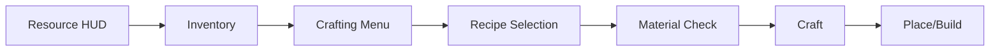
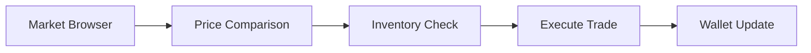
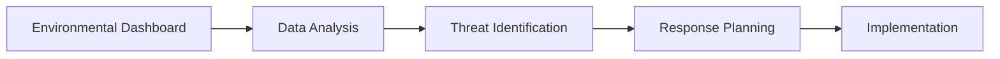

# 07: UI/UX Critical Paths

**Focus**: Interface design, information architecture, and user experience flows  

---

## Overview

This document defines the critical user interface paths and information architecture for Societies. Given the complexity of the simulation, careful UI design is essential to prevent information overload while maintaining depth.

---

## Gathering → Crafting → Building Path

### Flow Diagram

### Key UI Elements

| Element | Purpose | Priority |
|---------|---------|----------|
| Resource counter | Always visible resources | Critical |
| Quick-access crafting | One-click common recipes | High |
| Build preview | Ghost placement before commit | High |
| Progress indicators | Construction/crafting progress | Medium |
| Material checklist | What's needed vs available | High |

### Design Principles

- **Minimal clicks**: Core loop should be 3-4 clicks max
- **Immediate feedback**: Visual/audio on every action
- **Error prevention**: Clear indication of why action fails
- **Efficiency**: Support both mouse and keyboard shortcuts

---

## Economic Loop

### Flow Diagram

### Key UI Elements

| Element | Purpose | Complexity |
|---------|---------|------------|
| Price history graphs | Show trends over time | Medium |
| Market depth visualization | Supply/demand visualization | High |
| Quick-buy/quick-sell | One-click transactions | Low |
| Contract board | Available jobs/contracts | Medium |
| Wallet display | Current funds | Always visible |

### Progressive Disclosure

**Basic View**: Current prices + simple buy/sell  
**Advanced View**: Charts, trends, depth analysis  
**Expert View**: Full market data, API access

---

## Governance Loop

### Flow Diagram

### Key UI Elements

| Element | Purpose | Challenge |
|---------|---------|-----------|
| Plain-language law summaries | Make laws understandable | High |
| Impact prediction | Show effects before voting | High |
| Voting reminders | Don't miss elections | Medium |
| Election countdowns | Create urgency | Low |
| Coalition builder | See who supports what | Medium |

### Paradox Game Patterns

Learned from [RESEARCH-INDEX.md] Paradox analysis:
- Predictive feedback (show impact before action)
- Plain language for complex systems
- Nested tooltips for deep information
- Progressive disclosure of complexity

---

## Stewardship Loop

### Flow Diagram

### Key UI Elements

| Element | Purpose | Data Type |
|---------|---------|-----------|
| Pollution heat maps | Visual pollution levels | Spatial |
| Population graphs | Species counts over time | Temporal |
| Trend indicators | Rising/falling arrows | Categorical |
| Alert system | Critical thresholds | Event-driven |
| Impact predictor | "If you do X, Y will happen" | Predictive |

### Layered Heatmaps

From Paradox research:
- Toggle different environmental layers
- Combined views for correlation
- Time-slider for historical view
- Zoom from world → region → local

---

## Information Architecture

### What to Show When

| Context | Priority Information | Secondary |
|---------|---------------------|-----------|
| **General Play** | Resources, Health, Current Goal | Weather, Time, Notifications |
| **Trading** | Prices, Inventory, Wallet | Market trends, Recent trades |
| **Building** | Materials needed, Preview | Durability, Skill bonuses |
| **Governance** | Active votes, Laws, Support | Historical data, Projections |
| **Crisis** | Time remaining, Preparation % | Resource locations, Team status |

### Mode Detection

UI should automatically adapt based on player activity:

- **Gathering Mode**: Show resource hotspots, inventory space
- **Crafting Mode**: Show recipes, materials, output
- **Building Mode**: Show placement preview, materials
- **Trading Mode**: Show market data, wallet
- **Political Mode**: Show active proposals, voting
- **Crisis Mode**: Show countdown, preparation checklist

---

## Notification Strategy

### Priority Levels

**Critical** (Immediate popup + sound):
- Election results
- Contract deadlines (imminent)
- Disasters (meteor impact)
- Direct messages

**Important** (Sidebar notification + badge):
- Market price changes
- Skill level ups
- Project completions
- Law changes

**Background** (Log only, no alert):
- Routine agent activities
- Minor economic shifts
- Weather changes
- General world updates

### Notification Settings

Allow players to customize:
- Sound on/off per category
- Popup vs badge vs log only
- Do-not-disturb mode
- Batch notifications

---

## Progressive Disclosure

### Complexity Layering

**Layer 1: Essentials**
- Resource counts
- Basic crafting
- Simple trading
- Current goals

**Layer 2: Details**
- Full inventory
- All recipes
- Market depth
- Active proposals

**Layer 3: Expert**
- Production chains
- Advanced analytics
- Historical data
- Predictive models

### Disclosure Triggers

- **Hover**: Tooltip with basic info
- **Click**: Open detailed view
- **Right-click**: Context menu
- **Shift/Alt**: Expert modifiers

---

## Accessibility Considerations

### WCAG Guidelines

| Guideline | Implementation |
|-----------|----------------|
| Color contrast | 4.5:1 minimum for text |
| Text sizing | Scalable to 200% |
| Keyboard navigation | Full tab order |
| Screen reader | ARIA labels on all elements |
| Animation | Reduced motion option |

### Cognitive Load

- Chunk information (7±2 items max)
- Clear visual hierarchy
- Consistent patterns
- Plain language
- Error prevention

---

## Mobile/Controller Support

### Input Adaptations

| Input | Adaptation |
|-------|------------|
| Mouse | Hover tooltips, right-click menus |
| Controller | Radial menus, focus highlighting |
| Touch | Larger hit areas, swipe gestures |

### Cross-Platform Consistency

- Same information hierarchy
- Adapted interaction patterns
- Cloud-synced preferences
- Platform-specific optimizations

---

## Technical Integration

### Session 1: Bandwidth Budget

UI updates within 32 KB/s limit:

| Update Type | Size | Frequency |
|-------------|------|-----------|
| Resource counts | ~0.1 KB | On change |
| Inventory sync | ~0.5 KB | On change |
| Market data | ~1 KB | Every 10s |
| Position updates | ~0.04 KB | 20 TPS |

### Session 2: AI Information

- Agent status indicators
- Relationship meters
- Conversation history
- Vote predictions

---

## Navigation

- [Session 3 Index](./[AGENTS-READ-FIRST]-index.md)
- [← 06: Return Triggers](./06-return-triggers.md)
- [RESEARCH-INDEX.md](./RESEARCH-INDEX.md) - Research sources

---

## Cross-References

- **Paradox UI Research**: See RESEARCH-INDEX.md
- **Technical Constraints**: See [Session 1: 04-performance-scalability.md](../session-1-technical-architecture/04-performance-scalability.md)
- **Accessibility Guidelines**: WCAG 2.1 AA standard
