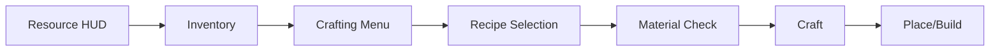
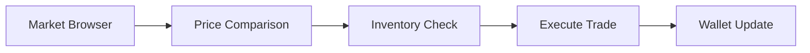
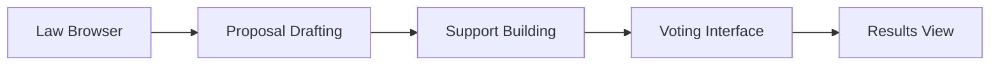
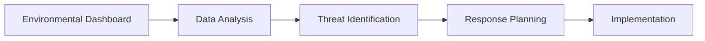

# 07: UI/UX Critical Paths

**Focus**: Interface design, information architecture, and user experience flows  

---

## Overview

This document defines the critical user interface paths and information architecture for Societies. Given the complexity of the simulation, careful UI design is essential to prevent information overload while maintaining depth.

---

## Gathering → Crafting → Building Path

### Flow Diagram



### Key UI Elements

| Element | Purpose | Priority |
|---------|---------|----------|
| Resource counter | Always visible resources | Critical |
| Quick-access crafting | One-click common recipes | High |
| Build preview | Ghost placement before commit | High |
| Progress indicators | Construction/crafting progress | Medium |
| Material checklist | What's needed vs available | High |

### Design Principles

- **Minimal clicks**: Core loop should be 3-4 clicks max
- **Immediate feedback**: Visual/audio on every action
- **Error prevention**: Clear indication of why action fails
- **Efficiency**: Support both mouse and keyboard shortcuts

---

## Economic Loop

### Flow Diagram



### Key UI Elements

| Element | Purpose | Complexity |
|---------|---------|------------|
| Price history graphs | Show trends over time | Medium |
| Market depth visualization | Supply/demand visualization | High |
| Quick-buy/quick-sell | One-click transactions | Low |
| Contract board | Available jobs/contracts | Medium |
| Wallet display | Current funds | Always visible |

### Progressive Disclosure

**Basic View**: Current prices + simple buy/sell  
**Advanced View**: Charts, trends, depth analysis  
**Expert View**: Full market data, API access

---

## Governance Loop

### Flow Diagram



### Key UI Elements

| Element | Purpose | Challenge |
|---------|---------|-----------|
| Plain-language law summaries | Make laws understandable | High |
| Impact prediction | Show effects before voting | High |
| Voting reminders | Don't miss elections | Medium |
| Election countdowns | Create urgency | Low |
| Coalition builder | See who supports what | Medium |

### Paradox Game Patterns

Learned from [RESEARCH-INDEX.md] Paradox analysis:
- Predictive feedback (show impact before action)
- Plain language for complex systems
- Nested tooltips for deep information
- Progressive disclosure of complexity

---

## Stewardship Loop

### Flow Diagram



### Key UI Elements

| Element | Purpose | Data Type |
|---------|---------|-----------|
| Pollution heat maps | Visual pollution levels | Spatial |
| Population graphs | Species counts over time | Temporal |
| Trend indicators | Rising/falling arrows | Categorical |
| Alert system | Critical thresholds | Event-driven |
| Impact predictor | "If you do X, Y will happen" | Predictive |

### Layered Heatmaps

From Paradox research:
- Toggle different environmental layers
- Combined views for correlation
- Time-slider for historical view
- Zoom from world → region → local

---

## Information Architecture

### What to Show When

| Context | Priority Information | Secondary |
|---------|---------------------|-----------|
| **General Play** | Resources, Health, Current Goal | Weather, Time, Notifications |
| **Trading** | Prices, Inventory, Wallet | Market trends, Recent trades |
| **Building** | Materials needed, Preview | Durability, Skill bonuses |
| **Governance** | Active votes, Laws, Support | Historical data, Projections |
| **Crisis** | Time remaining, Preparation % | Resource locations, Team status |

### Mode Detection

UI should automatically adapt based on player activity:

- **Gathering Mode**: Show resource hotspots, inventory space
- **Crafting Mode**: Show recipes, materials, output
- **Building Mode**: Show placement preview, materials
- **Trading Mode**: Show market data, wallet
- **Political Mode**: Show active proposals, voting
- **Crisis Mode**: Show countdown, preparation checklist

---

## Notification Strategy

### Priority Levels

**Critical** (Immediate popup + sound):
- Election results
- Contract deadlines (imminent)
- Disasters (meteor impact)
- Direct messages

**Important** (Sidebar notification + badge):
- Market price changes
- Skill level ups
- Project completions
- Law changes

**Background** (Log only, no alert):
- Routine agent activities
- Minor economic shifts
- Weather changes
- General world updates

### Notification Settings

Allow players to customize:
- Sound on/off per category
- Popup vs badge vs log only
- Do-not-disturb mode
- Batch notifications

---

## Progressive Disclosure

### Complexity Layering

**Layer 1: Essentials**
- Resource counts
- Basic crafting
- Simple trading
- Current goals

**Layer 2: Details**
- Full inventory
- All recipes
- Market depth
- Active proposals

**Layer 3: Expert**
- Production chains
- Advanced analytics
- Historical data
- Predictive models

### Disclosure Triggers

- **Hover**: Tooltip with basic info
- **Click**: Open detailed view
- **Right-click**: Context menu
- **Shift/Alt**: Expert modifiers

---

## Accessibility Considerations

### WCAG Guidelines

| Guideline | Implementation |
|-----------|----------------|
| Color contrast | 4.5:1 minimum for text |
| Text sizing | Scalable to 200% |
| Keyboard navigation | Full tab order |
| Screen reader | ARIA labels on all elements |
| Animation | Reduced motion option |

### Cognitive Load

- Chunk information (7±2 items max)
- Clear visual hierarchy
- Consistent patterns
- Plain language
- Error prevention

---

## Mobile/Controller Support

### Input Adaptations

| Input | Adaptation |
|-------|------------|
| Mouse | Hover tooltips, right-click menus |
| Controller | Radial menus, focus highlighting |
| Touch | Larger hit areas, swipe gestures |

### Cross-Platform Consistency

- Same information hierarchy
- Adapted interaction patterns
- Cloud-synced preferences
- Platform-specific optimizations

---

## Technical Integration

### Session 1: Bandwidth Budget

UI updates within 32 KB/s limit:

| Update Type | Size | Frequency |
|-------------|------|-----------|
| Resource counts | ~0.1 KB | On change |
| Inventory sync | ~0.5 KB | On change |
| Market data | ~1 KB | Every 10s |
| Position updates | ~0.04 KB | 20 TPS |

### Session 2: AI Information

- Agent status indicators
- Relationship meters
- Conversation history
- Vote predictions

---

# HUD Layout & Interface Design

**Reference Resolution**: 1920×1080 (1080p) - All measurements scaled from this baseline

---

## 1. Primary HUD Layout (1920×1080 Reference)

### Screen Layout Diagram

```
┌─────────────────────────────────────────────────────────────────┐
│  [Health] [Energy] [Hunger]        [Minimap]  [Time/Weather]   │
│   ████████  ██████▓░  ███▓░░░        ┌───┐      ☀ 10:30 AM    │
│   100/100   75/100   35/100          │ N │      Temp: 72°F    │
│                                      └───┘      Rain: 0%      │
│                                                                 │
│                         [CROSSHAIR]                            │
│                              +                                  │
│                                                                 │
│  [Notifications]                                               │
│  • Wheat ready in 2h                                           │
│  • Martha wants to trade                                       │
│  • Town meeting at 20:00                                       │
│                                                                 │
│         [Hotbar - 9 Slots]          [Credits] [Inventory]      │
│  [1][2][3][4][5][6][7][8][9]         1,250¢    45/64         │
│   🪓  🔨  🍞  🪵  _  _  _  _  _                                 │
│                                                                 │
│  [Active Tool: Iron Axe]  Durability: 234/300                  │
│  [Current Action: None]     [Progress: 0%]                     │
└─────────────────────────────────────────────────────────────────┘
```

---

### Health Bar (Top-Left)

**Reference Constant**: `HEALTH_MAX = 100.0f` (from technical-constants.md)

```
Position: X: 20, Y: 20 (screen pixels from top-left)
Size: 200×24 pixels

Visual Design:
  - Background: Dark gray (#333333)
  - Fill: Red gradient (#FF4444 to #CC0000)
  - Segments: 10 segments (20px each)
  - Text: White, 12px font, centered
  - Label: "HP" icon left of bar
  - Max Value: 100 (HEALTH_MAX)

States:
  - 100-70: Solid red, normal
  - 69-30: Yellow tint (#FFAA00), warning glow
  - 29-10: Orange (#FF6600), pulsing
  - 9-0: Red flashing, critical alarm

Animation:
  - Damage: Bar flashes white then decreases
  - Regen: Smooth increase
  - Critical: Pulsing glow effect
```

---

### Energy Bar (Below Health)

**Reference Constant**: `ENERGY_MAX = 100.0f` (from technical-constants.md)

```
Position: X: 20, Y: 50
Size: 200×24 pixels

Visual Design:
  - Fill: Yellow gradient (#FFFF44 to #CCCC00)
  - Text: "75/100" + small "EN" label
  - Max Value: 100 (ENERGY_MAX)

States:
  - 100-50: Normal yellow
  - 49-20: Darker yellow, "Tired" indicator
  - 19-0: Gray, "Exhausted" text appears

Function:
  - Sprinting drains this bar (SPRINT_STAMINA_COST_PER_SECOND = 2.0f)
  - Depleted = Cannot sprint (SPRINT_MIN_STAMINA_TO_START = 20.0f)
  - Regenerates while resting (ENERGY_REGEN_REST_PER_HOUR = 20.0f)
```

---

### Hunger Bar (Below Energy)

**Reference Constant**: `HUNGER_MAX = 100.0f` (from technical-constants.md)

```
Position: X: 20, Y: 80
Size: 200×24 pixels

Visual Design:
  - Fill: Orange/Brown gradient (#FFAA44 to #CC6600)
  - Icon: Apple or bread symbol left of bar
  - Text: "35/100"
  - Max Value: 100 (HUNGER_MAX, note: 0 = full, 100 = starving)

States:
  - 100-70: Normal, no issues (well-fed)
  - 69-50: Yellow warning "Hungry"
  - 49-20: Orange "Very Hungry"
  - 19-0: Red "Starving", gradual health loss

Function:
  - Eating food restores (varies by food type)
  - Decays over time (HUNGER_DECAY_PER_HOUR = 5.0f)
  - Affects stamina regeneration rate
  - At 100, begins damaging health
```

---

### Minimap (Top-Right)

```
Position: X: 1700, Y: 20
Size: 200×200 pixels (circular)

Features:
  - Range: 100 meter radius (configurable)
  - Rotation: Player always at center, facing up
  - Zoom: Mouse scroll (50m, 100m, 200m levels)
  
Icons:
  - Self: Blue arrow (showing facing direction, 16×16px)
  - Other players: Green dots (8×8px)
  - AI agents: Yellow dots (8×8px)
  - Buildings: White squares (varies by size)
  - Resources: Small icons (tree 🌲, rock 🪨, 12×12px)
  - POI: Special markers (star ⭐, flag 🚩, 16×16px)
  - North indicator: "N" at top

Visual:
  - Background: Semi-transparent black (#000000, 70% opacity)
  - Terrain: Simplified top-down view, green/brown
  - Fog of war: Unexplored areas dark gray (#222222)
  - Grid lines: Every 25 meters, subtle white
  - Border: 2px gold stroke
```

---

### Time & Weather (Top-Right, below minimap)

```
Position: X: 1700, Y: 230
Size: 200×100 pixels

Display:
  - Time: "10:30 AM" (12-hour format)
  - Day: "Day 12" or date "Spring 12"
  - Season: "Spring" (Spring/Summer/Fall/Winter)
  - Weather icon: Animated (☀ Sun, ☁ Clouds, 🌧 Rain, ❄ Snow)
  - Temperature: "72°F" or "22°C" (user preference)
  - Rain chance: "Rain: 0%"

Reference Constants:
  - SEASON_LENGTH_DAYS = 7
  - YEAR_LENGTH_DAYS = 28
  - DAY_LENGTH_REAL_MINUTES = 60

Visual:
  - Weather icon animates (sun rotates 360° over 10s loop)
  - Color changes by time:
    - Night (00:00-06:00): Dark blue tint (#1a1a2e)
    - Morning (06:00-12:00): Yellow/Orange tint (#ffd700)
    - Afternoon (12:00-18:00): Bright (#ffffff)
    - Evening (18:00-00:00): Orange/Red tint (#ff6b35)
  - Background: Semi-transparent panel (#000000, 60% opacity)
```

---

### Notification Panel (Left side, middle)

```
Position: X: 20, Y: 300
Width: 300 pixels
Max Height: 250 pixels (5 notifications × 50px each)

Display:
  - Icons: Different icons for different types
    - 🔔 General info (blue, #4a90e2)
    - ⚠️ Warning (yellow, #f5a623)
    - 🚨 Urgent (red, #d0021b)
    - 💬 Message (green, #7ed321)
    - 📈 Achievement (purple, #9013fe)
  - Text: Brief description, 14px white font
  - Time: "2m ago" in gray (#888888), 10px

Behavior:
  - Fade in: 0.3s ease-out when added
  - Auto-dismiss: 5 seconds (except urgent)
  - Click to dismiss: Immediate fade-out
  - Max 5 visible, scroll for more
  - Stack from bottom (newest at bottom)

Types:
  - Resource ready: "Wheat ready in 2h"
  - Trade offer: "Martha wants to trade"
  - Event starting: "Town meeting at 20:00"
  - Skill level up: "+1 Woodcutting!"
  - Achievement unlocked: "Master Builder"
```

---

### Hotbar (Bottom-Center)

```
Position: Centered horizontally, Y: 950
Size: 9 slots, each 64×64 pixels, gap 8px
Total Width: (9 × 64) + (8 × 8) = 640 pixels

Visual:
  - Background: Dark semi-transparent (#1a1a1a, 80% opacity)
  - Active slot: Gold border (#ffd700, 3px), glow effect
  - Inactive: Gray border (#555555, 2px)
  - Item icons: 48×48 centered in slot
  - Quantity: Small number bottom-right (if stackable)
  - Key labels: "1" through "9" above each slot, 10px gray

Function:
  - Keys 1-9 to select slot
  - Scroll wheel to rotate selection
  - Shows equipped tool + quick items
  - Right-click for context menu (use, drop, equip)

Example slots:
  1: Iron Axe (equipped, active slot)
  2: Stone Pickaxe
  3: Bread (×5)
  4: Wood (×20)
  5-9: Empty

Stack Sizes (from technical-constants.md):
  - Wood: 100 (STACK_SIZE_WOOD)
  - Stone: 50 (STACK_SIZE_STONE)
  - Food: 20 (STACK_SIZE_FOOD)
  - Tools: 1 (STACK_SIZE_TOOLS)
```

---

### Status Display (Bottom-Left)

```
Position: X: 20, Y: 920
Size: 400×80 pixels

Display:
  Line 1: [Tool Icon] Active tool: Iron Axe
  Line 2: Durability: 234/300 [████████░░░░░░░░░░]
  Line 3: Current action: Gathering... [Progress: 45%]
  Line 4: [Status Effect Icons]: 🛡️ Protected  ⚡ Energized

Tool Durability Reference:
  - Stone: 50 uses (TOOL_DURABILITY_STONE)
  - Iron: 150 uses (TOOL_DURABILITY_IRON)
  - Steel: 500 uses (TOOL_DURABILITY_STEEL)

Visual:
  - Tool name: White, 16px bold
  - Durability bar: Green (#00cc00) to yellow (#ffcc00) to red (#cc0000)
  - Progress bar: Blue (#0099ff), animated fill
  - Status effects: 24×24 icons, tooltip on hover
```

---

### Resource Display (Bottom-Right)

```
Position: X: 1600, Y: 920
Size: 300×80 pixels

Display:
  - Credits: "1,250¢" with coin icon (💰)
  - Inventory: "45/64" with bag icon (🎒)
  - Weight: "67/100 kg" (if >50% capacity)

Reference Constants:
  - STARTING_CREDITS_PLAYER = 100.0f
  - INVENTORY_SLOTS_PLAYER = 64
  - INVENTORY_WEIGHT_MAX_KG = 100.0f

Visual:
  - Credits: Gold color (#ffd700), coin animation on gain
  - Inventory: White normally
    - Yellow (#ffcc00) if >80% full (51/64)
    - Red (#ff4444) if full (64/64)
  - Weight: Only shown if >50kg, orange warning if >80kg
  - Icons: Left side of each value

Animation:
  - Credits gain: Coin icon bounces, number counts up
  - Credits loss: Number counts down, red flash
```

---

### Crosshair (Center)

```
Position: Screen center (960, 540 on 1080p)
Size: 24×24 pixels

Visual Styles:
  - Default: Simple "+" or dot (4×4px center)
  - Interactable: Hand icon appears (🖐️)
  - Combat: Target reticle (circle with crosshairs)
  - Building: Placement preview (ghost outline)

Color Coding:
  - White (#ffffff): Default state
  - Green (#00cc00): Valid target/action
  - Red (#cc0000): Invalid/blocked
  - Yellow (#ffcc00): Caution/confirmation needed

Dynamic Feedback:
  - Damage dealt: Crosshair expands briefly
  - Critical hit: Crosshair flashes red
  - Hit confirm: Dot appears momentarily
```

---

## 2. Contextual HUD Elements

### Interaction Prompt (Near crosshair)

```
Position: Below crosshair (960, 580)
Size: 300×40 pixels

Display Format:
  "[E] Chop Oak Tree"
  "[F] Hold to talk to Martha"
  "[RMB] Place wooden block"
  "[Shift+E] Quick craft Wooden Planks"

Visual:
  - Semi-transparent background (#000000, 70% opacity)
  - Key highlighted: [E] in gold box (#ffd700)
  - Action text: White, 14px
  - Target name: Context-aware, yellow tint

Animation:
  - Fade in: 0.2s when looking at interactable
  - Fade out: 0.2s when looking away
  - Bounce: Slight pulse when new interaction available

Key Bindings Shown:
  - E: Primary interaction
  - F: Secondary/Talk
  - RMB: Place/Use
  - Shift+Key: Modifiers
```

---

### Floating Text (World space)

```
Position: Above entities/objects in 3D world
Size: Varies by type

Types:
  Damage Numbers:
    - "-25" (red #ff4444, 18px)
    - Critical: Larger (24px) with "CRIT!" suffix
    - Position: Above target, slight random offset

  XP Gain:
    - "+5 XP" (blue #4a90e2, 16px)
    - "+15 Woodcutting XP" (skill-specific, purple)
    - Position: Near player

  Loot Drops:
    - "Wood ×3" (white #ffffff, 14px)
    - "+Iron Ore" (green #7ed321 for rare items)
    - Position: At collection point

  Agent Chat:
    - Speech bubble above agent head
    - Text: "Need any help?"
    - Duration: 3-5 seconds
    - Max 3 bubbles visible per agent

Animation Sequence:
  1. Pop in: Scale from 0 to 1 (0.1s)
  2. Float up: Move Y+50px over 1.5s
  3. Fade: Alpha 1.0 to 0.0 (last 0.5s)
  4. Disappear

Performance:
  - Object pooling for text objects
  - Max 20 floating texts on screen
  - Cull distance: 50 meters
```

---

### Notification Toast (Top-Center)

```
Position: X: 960 (center), Y: 100
Width: 400 pixels
Height: 60 pixels

Use Cases:
  - Major events: "Level Up!", "Achievement Unlocked"
  - Warnings: "Low Health!", "Inventory Full"
  - Milestones: "Day 30 - Meteor Approaching"

Visual by Type:
  Success:
    - Background: Green gradient (#4a90e2 to #357abd)
    - Icon: ✅
    - Sound: Positive chime

  Warning:
    - Background: Yellow gradient (#f5a623 to #d48718)
    - Icon: ⚠️
    - Sound: Alert tone

  Danger:
    - Background: Red gradient (#d0021b to #a00116)
    - Icon: 🚨
    - Sound: Urgent alarm

  Achievement:
    - Background: Purple gradient (#9013fe to #6b0cc0)
    - Icon: 🏆
    - Sound: Victory fanfare

Animation:
  - Entry: Slide down from Y:-100, bounce at Y:100
  - Hold: Display for 3-5 seconds
  - Exit: Slide up and fade
  - Stacking: Max 3 toasts, offset Y:100, Y:170, Y:240
```

---

## 3. HUD Modes

### Exploration Mode (Default)

```
All standard HUD elements visible:
  ✓ Health/Energy/Hunger bars (top-left)
  ✓ Minimap expanded (top-right)
  ✓ Time/Weather (top-right)
  ✓ Notifications (left-middle)
  ✓ Hotbar (bottom-center)
  ✓ Status display (bottom-left)
  ✓ Resource display (bottom-right)
  ✓ Crosshair (center)
  ✓ Interaction prompts (contextual)

Behavior:
  - Full information access
  - Contextual prompts for nearby objects
  - Minimap at 100m zoom default
  - Notifications auto-dismiss
```

---

### Building Mode

```
Additional Elements:
  Material Requirements Display (top-center):
    Position: X: 960, Y: 50
    Shows: "Need: Wood ×5, Stone ×2"
    Updates: Real-time as you select building type

  Ghost Placement Preview (3D world):
    - Semi-transparent blueprint of structure
    - Green: Valid placement
    - Red: Invalid placement
    - Shows final dimensions

  Rotation Controls HUD (bottom-center, above hotbar):
    Position: X: 960, Y: 880
    Display: "[Q] Rotate Left  [E] Rotate Right  [R] Flip"

  Grid Snap Toggle:
    Position: X: 960, Y: 910
    Display: "[G] Grid Snap: ON" (or OFF)

Hidden/Modified:
  - Hotbar: Simplified to show only building materials
  - Crosshair: Replaced with placement cursor (square brackets)
  - Status: Shows "Building Mode" instead of tool info
```

---

### Crafting Mode

```
Screen Transition:
  - Partial overlay: 80% screen coverage
  - HUD elements fade to 20% opacity

Essential Elements Remaining:
  - Health/Energy/Hunger (top-left, dimmed)
  - Credits (bottom-right, normal - needed for crafting costs)
  - Crosshair: Hidden

Crafting Interface:
  Left Panel - Recipe Categories:
    - Tools, Materials, Food, Building
    - Tab navigation

  Center Panel - Recipe Grid:
    - 8×6 grid of craftable items
    - Icons with quantity indicators
    - Filter and search bar at top

  Right Panel - Selected Recipe:
    - Item name and description
    - Required materials list
    - "Craft" button with quantity selector
    - Skill requirement indicator
    - Time to craft

Inventory Panel (bottom):
  - Shows current inventory for reference
  - Highlights materials you have
  - Shows missing materials in red
```

---

### Dialogue/Menu Mode

```
Visual Changes:
  - All HUD elements fade to 30% opacity
  - Background blur effect applied
  - Focus shifts to conversation/menu

Visible Elements:
  - Minimap: Still visible but dimmed
  - Health/Energy: Visible for survival context
  - Notifications: Paused, queue for later

Dialogue Interface:
  - Character portrait (left or right)
  - Dialogue text area (center-bottom)
  - Response options (below text)
  - Relationship meter (if known character)

Menu Interface:
  - Full-screen or overlay depending on menu
  - Settings, Inventory, Map, Social
```

---

### Photo/Cinematic Mode

```
Activation:
  - Key: F9 (toggle)
  - Command: /cinematic

HUD State:
  - All HUD completely hidden
  - Only world visible
  - Free camera controls enabled

Optional Toggles (via settings):
  - Show/Hide crosshair for aiming screenshots
  - Show/Hide time/weather for context
  - Enable grid overlay for framing

Exit:
  - Press ESC or F9 again
  - Restore all HUD elements
  - Return to previous mode
```

---

## 4. Responsive Design

### Resolution Scaling

```
Reference: 1920×1080 (1080p) - Base resolution

Scaling Multipliers:
  Resolution        Scale Factor    Example Sizes
  ─────────────────────────────────────────────────
  4K (3840×2160)    2.0×            Health: 400×48px
  1440p (2560×1440) 1.33×           Health: 266×32px
  1080p (1920×1080) 1.0× (base)     Health: 200×24px
  900p (1600×900)   0.83×           Health: 166×20px
  720p (1280×720)   0.67×           Health: 134×16px

UI Scale Setting:
  - Range: 0.5× to 2.0×
  - Default: Auto (based on resolution)
  - Can override automatic scaling

Positioning Rules:
  - All positions anchored to screen edges/corners
  - Health/Energy/Hunger: Top-left anchored
  - Minimap/Time: Top-right anchored
  - Hotbar: Bottom-center anchored
  - Resource display: Bottom-right anchored

Safe Zone:
  - Keep all HUD elements 5% from screen edges
  - Prevents cutoff on different aspect ratios
  - Configurable in settings (0-10%)
```

---

### Aspect Ratio Adaptation

```
16:9 Standard (1920×1080):
  - Full layout as specified
  - Optimal experience

21:9 Ultrawide (2560×1080, 3440×1440):
  - Horizontal spread
  - Keep critical info centered
  - Notifications move closer to center (X: 200)
  - Hotbar remains centered
  - Resource display moves inward (X: 2400 on 3440px)

4:3 Legacy (1280×1024, 1024×768):
  - Stack vertically, compact mode
  - Minimap: 150×150px (smaller)
  - Hotbar: 7 slots instead of 9
  - Notifications: Narrower (250px)
  - Status/Resource: Stacked vertically

32:9 Super Ultrawide:
  - Extreme spread
  - Critical HUD moved to center third
  - Side HUD (minimap) can be disabled
  - Focus on center 1920 pixels

Minimum Supported: 1280×720
  - Simplified mode automatically enabled
  - Fewer simultaneous notifications
  - Smaller minimap
```

---

## 5. Accessibility HUD Options

### Customization Options

```
Settings Menu - HUD Tab:

Scale & Size:
  - HUD Scale: 50% - 200% (slider)
  - Text Size: Small, Normal, Large, Extra Large
  - Icon Size: Small (75%), Normal (100%), Large (125%)

Opacity:
  - Background opacity: 0% - 100%
  - Panel opacity: 30% - 100%
  - Health bars always 100% for visibility

Position Presets:
  - Default: Standard layout
  - Compact: Minimal elements, larger text
  - Wide: For ultrawide monitors
  - Left-handed: Moves right-side elements to left
  - Centered: All elements near center

Element Toggles:
  ☑ Health Bar
  ☑ Energy Bar
  ☑ Hunger Bar
  ☑ Minimap
  ☑ Time/Weather
  ☑ Notifications
  ☑ Hotbar
  ☑ Status Display
  ☑ Resource Display
  ☐ Crosshair (can disable for immersion)
  ☐ Floating Text

Simplified Mode:
  - Enables minimal HUD
  - Only shows critical: Health, Emergency alerts
  - Hidden: Minimap, Time, Non-urgent notifications
  - Toggled with key: H
```

---

### Visual Aids

```
Color Themes:
  Standard:
    - Health: Red (#FF4444)
    - Energy: Yellow (#FFFF44)
    - Hunger: Orange (#FFAA44)

  High Contrast:
    - Health: Bright Red (#FF0000)
    - Energy: Bright Yellow (#FFFF00)
    - Hunger: Bright Orange (#FF8800)
    - Text: White on black always
    - Borders: 2px solid white

  Deuteranopia (Red-Green Colorblind):
    - Health: Blue (#0066FF) instead of red
    - Valid: Yellow (#FFDD00)
    - Invalid: Purple (#9900CC)
    - Icons use shapes, not just colors

  Protanopia (Red Colorblind):
    - Health: Orange-Yellow (#FFAA00)
    - Danger: Dark Red with ⚠️ icon
    - Use patterns/stripes for critical states

  Tritanopia (Blue-Yellow Colorblind):
    - Energy: Green (#00CC00) instead of yellow
    - Info: Magenta (#CC00CC) instead of blue
    - Adjust all blue/yellow elements

Text Options:
  - Icon Only Mode: Remove all text labels
  - Text Only Mode: Replace icons with text
  - Font Selection: Sans-serif, Serif, Monospace, Dyslexic-friendly
  - Letter Spacing: Compact, Normal, Wide

Screen Reader Support:
  - ARIA labels on all HUD elements
  - Audio cues for critical events
  - Text-to-speech for notifications (optional)
  - Navigation: Tab through HUD elements
```

---

## 6. Technical Implementation

### Godot UI Structure

```csharp
// HUD Scene Tree Structure
CanvasLayer (HUD root)
├── HealthBar (TextureProgressBar)
│   ├── Background (ColorRect: #333333)
│   ├── Fill (TextureProgressBar)
│   └── Label (Label: "100/100")
├── EnergyBar (TextureProgressBar)
│   └── [Same structure]
├── HungerBar (TextureProgressBar)
│   └── [Same structure]
├── Minimap (SubViewportContainer)
│   ├── SubViewport (200×200)
│   │   ├── Camera2D (top-down view)
│   │   └── EntityMarkers (Node2D with icons)
│   └── Border (TextureRect: circular mask)
├── TimeWeather (VBoxContainer)
│   ├── TimeLabel (Label: "10:30 AM")
│   ├── WeatherIcon (AnimatedSprite2D)
│   └── TempLabel (Label: "72°F")
├── NotificationPanel (VBoxContainer)
│   └── NotificationSlots (5× PanelContainer)
├── Hotbar (HBoxContainer)
│   └── Slot1 through Slot9 (TextureButton)
├── StatusDisplay (PanelContainer)
│   ├── ToolLabel (Label)
│   ├── DurabilityBar (ProgressBar)
│   ├── ActionLabel (Label)
│   └── ProgressBar (ProgressBar)
├── ResourceDisplay (HBoxContainer)
│   ├── CreditsLabel (Label: "1,250¢")
│   └── InventoryLabel (Label: "45/64")
└── Crosshair (CenterContainer)
    └── CrosshairTexture (TextureRect)
```

---

### Performance Optimization

```csharp
// Update Strategies
public class HUDManager : Node
{
    // Only update when values change
    private float _lastHealth = -1;
    private float _lastEnergy = -1;
    private float _lastHunger = -1;
    
    public override void _Process(double delta)
    {
        // Throttle updates for non-critical elements
        UpdateCriticalElements();    // Every frame
        UpdateImportantElements();   // Every 5 frames  
        UpdateBackgroundElements();  // Every 30 frames
    }
    
    private void UpdateHealthBar(float currentHealth)
    {
        // Only update if changed
        if (Mathf.Abs(currentHealth - _lastHealth) > 0.1f)
        {
            healthBar.Value = currentHealth;
            healthLabel.Text = $"{currentHealth:F0}/{HEALTH_MAX:F0}";
            _lastHealth = currentHealth;
            
            // Trigger animations only on state change
            UpdateHealthState(currentHealth);
        }
    }
    
    // Minimap optimization
    private int _minimapUpdateFrame = 0;
    private const int MINIMAP_UPDATE_FREQUENCY = 6; // ~3.3 FPS at 20 TPS
    
    private void UpdateMinimap()
    {
        if (_minimapUpdateFrame++ % MINIMAP_UPDATE_FREQUENCY == 0)
        {
            // Update minimap viewport
            minimapViewport.RenderTargetUpdateMode = 
                SubViewport.UpdateMode.Once;
        }
    }
}

// Floating text object pooling
public class FloatingTextPool : Node
{
    private const int POOL_SIZE = 20;
    private Queue<FloatingText> _available = new();
    private List<FloatingText> _active = new();
    
    public FloatingText GetFloatingText()
    {
        if (_available.Count > 0)
            return _available.Dequeue();
        
        // Create new if pool empty
        return CreateFloatingText();
    }
    
    public void ReturnFloatingText(FloatingText text)
    {
        text.Hide();
        _available.Enqueue(text);
        _active.Remove(text);
    }
}

// Culling off-screen elements
public override void _Process(double delta)
{
    // Check distance to player for floating text
    foreach (var text in _activeFloatingText)
    {
        float distance = text.GlobalPosition.DistanceTo(player.Position);
        text.Visible = distance < 50f; // Cull beyond 50 meters
    }
}
```

---

### Bandwidth Considerations

```
Per HUD Update Bandwidth (from Session 1 constraints):

| Element Type         | Update Size | Frequency      | Total/Second |
|---------------------|-------------|----------------|--------------|
| Health/Energy/Hunger| ~0.02 KB    | On change      | ~0.05 KB/s   |
| Position (minimap)  | ~0.04 KB    | Every 6 ticks  | ~0.13 KB/s   |
| Inventory sync      | ~0.5 KB     | On change      | ~0.1 KB/s    |
| Credits update      | ~0.01 KB    | On change      | ~0.02 KB/s   |
| Notification        | ~0.1 KB     | Event-driven   | ~0.05 KB/s   |
| Time/Weather        | ~0.02 KB    | Every 60 ticks | ~0.01 KB/s   |

Total HUD Bandwidth: ~0.36 KB/s (well within 32 KB/s budget)

Optimization Techniques:
  - Delta compression: Only send changed values
  - Batched updates: Group multiple HUD updates
  - Predictive client-side: Calculate hunger decay locally
  - Snapshots: Full state every 10 seconds
```

---

## Cross-References

- **Technical Constants**: See `planning/meta/technical-constants.md` for HEALTH_MAX, ENERGY_MAX, HUNGER_MAX, and all numerical values
- **Paradox UI Research**: See RESEARCH-INDEX.md
- **Technical Constraints**: See [Session 1: 04-performance-scalability.md](../session-1-technical-architecture/04-performance-scalability.md)
- **Accessibility Guidelines**: WCAG 2.1 AA standard

---

## Navigation

- [Session 3 Index](./[AGENTS-READ-FIRST]-index.md)
- [← 06: Return Triggers](./06-return-triggers.md)
- [RESEARCH-INDEX.md](./RESEARCH-INDEX.md) - Research sources
