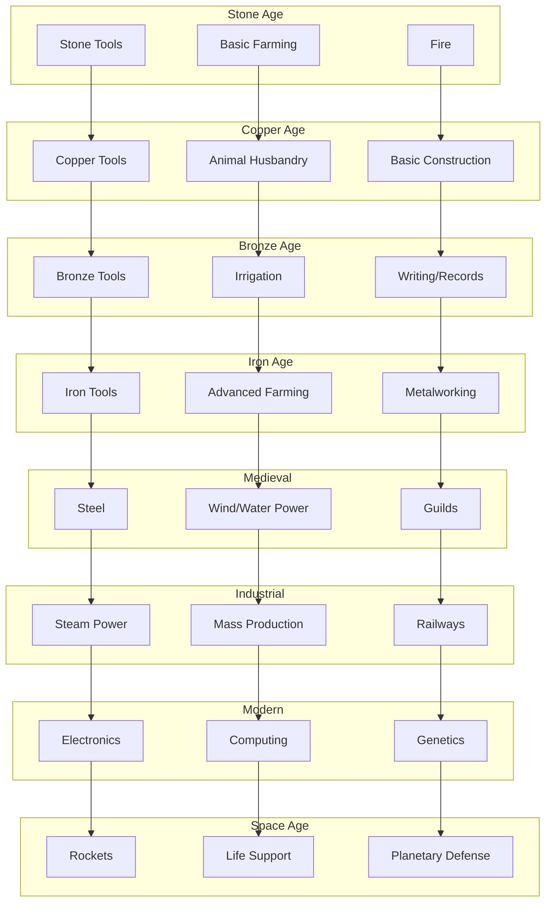
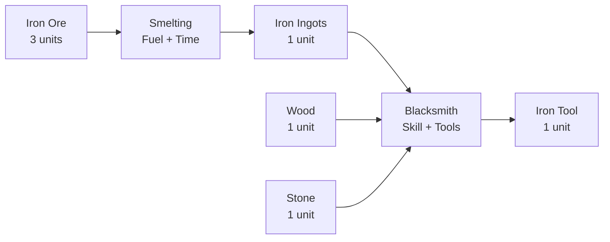
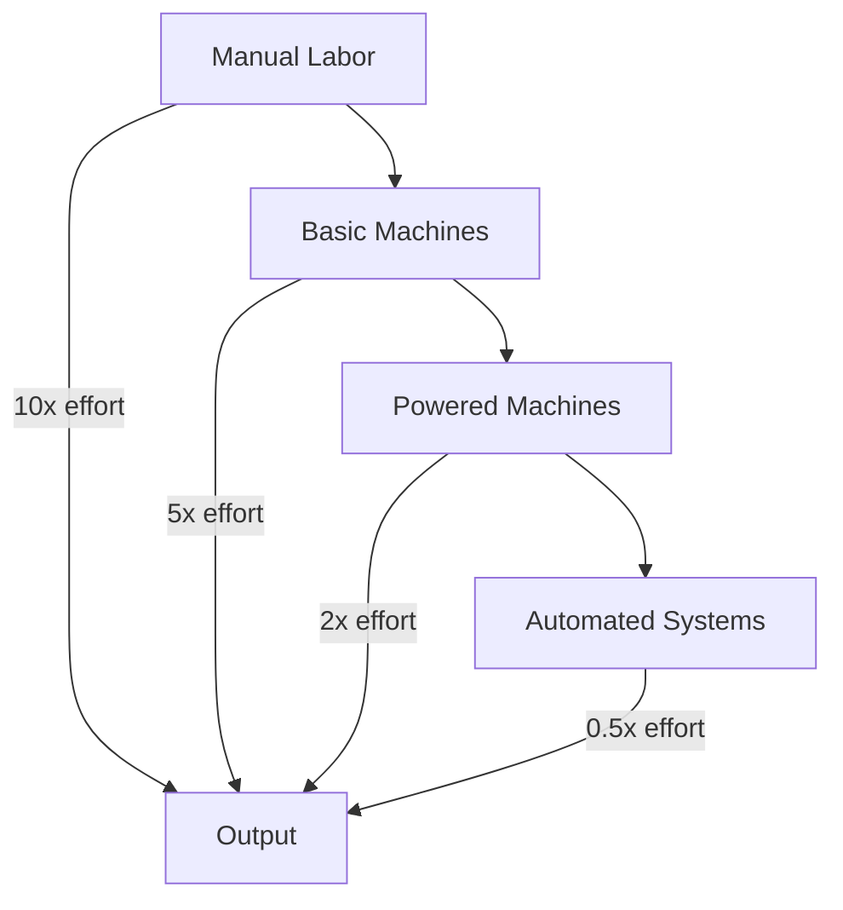
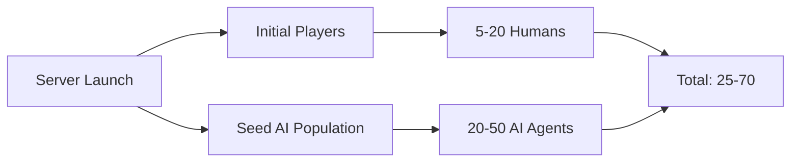
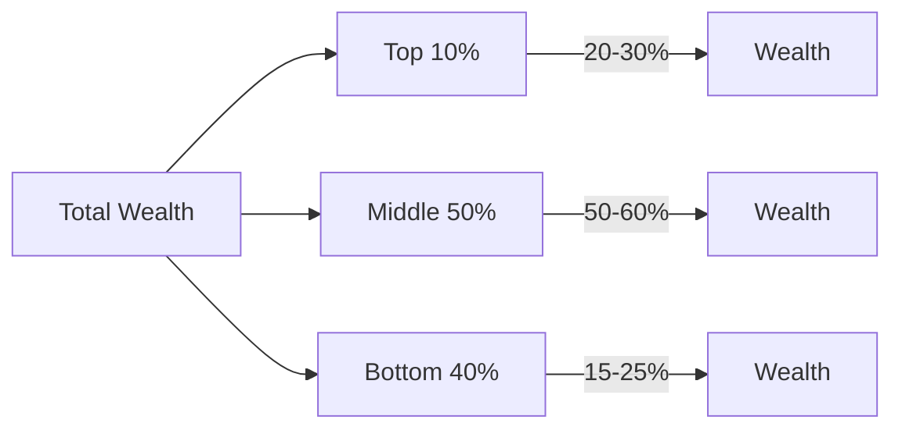
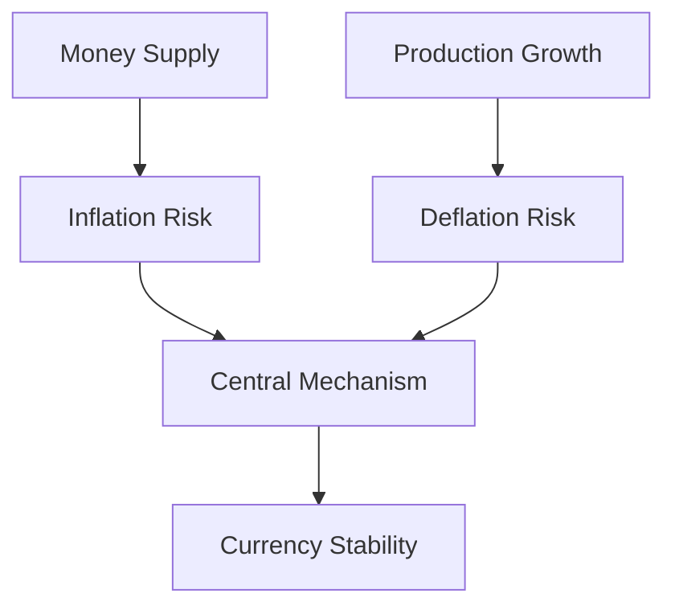
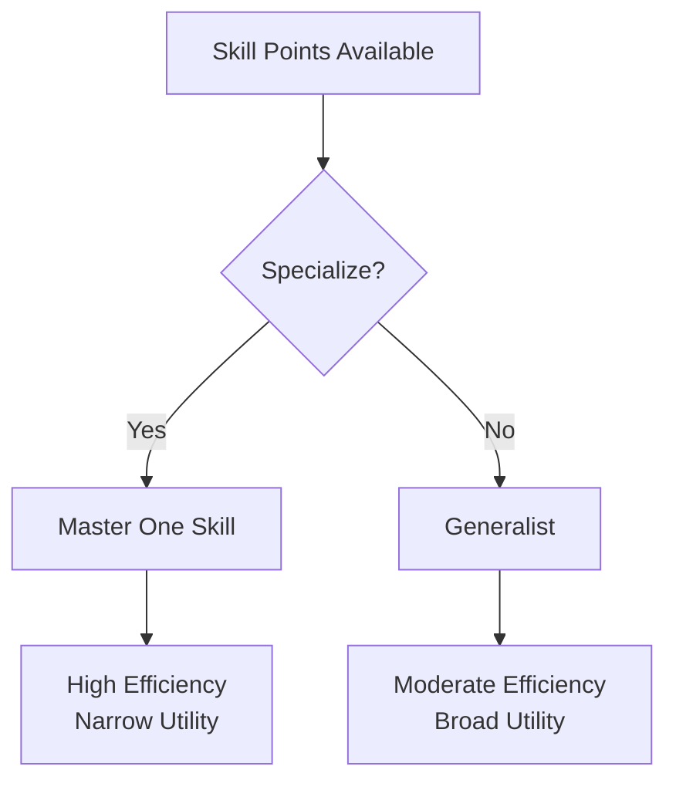
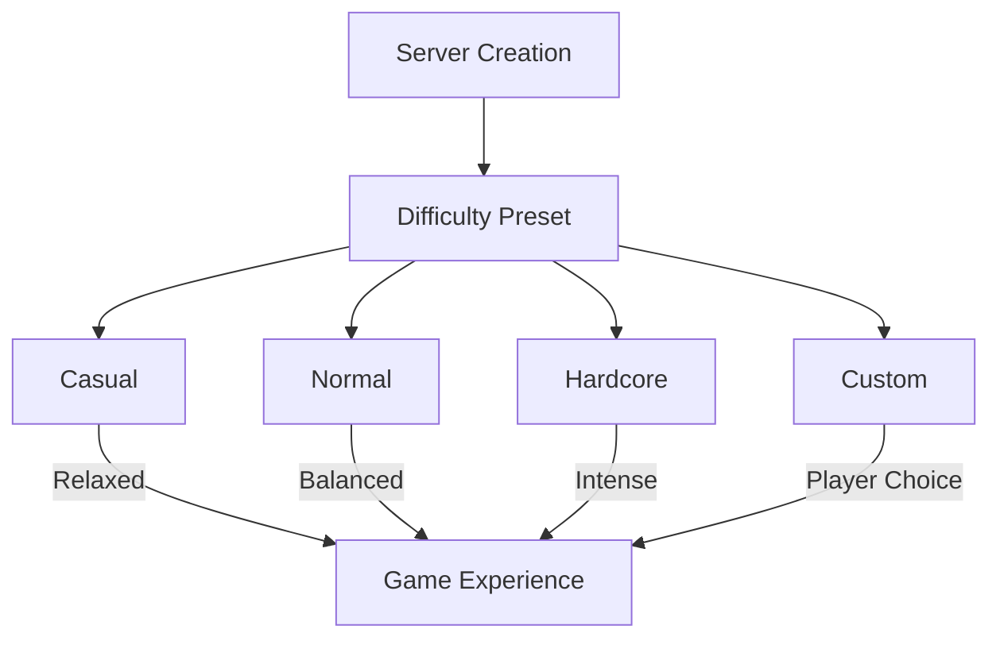

# Session 4: Progression & Balance - Deep Planning Document

**Planning Session**: 4 of 7  
**Status**: Content Ready  
**Date Started**: 2026-01-28  
**Date Completed**: 2026-01-28

---

## Purpose

Define the pacing, balance, and progression systems that make the game challenging but achievable. This document covers tech trees, economy balance, threat pacing, and server lifecycle management.

---

## Key Questions Addressed

1. What's the tech tree progression?
2. How long should each phase take?
3. What's the resource → production → consumption balance?
4. How do we prevent runaway leaders or hopeless stragglers?
5. What are the difficulty curves for different server sizes?

---

## Research Summary
**Tier 1 Sources**: [To be filled during research phase]
**Key Insights**: [Major learnings from research]

---

## Dependencies

- **Requires**: Session 3 (Gameplay Loops) - Activities define what progresses
- **Informs**: Session 5 (Governance), Session 6 (Prototype scope), Session 7 (Timeline)

---

## 1. Technology Tree

### Complete Tech Progression

### Tech Tree Structure

**Dependencies**:
- Linear path: Must unlock A before B
- Branching: Multiple paths available
- Prerequisites: Some techs need multiple prerequisites
- Soft gates: Techs available but inefficient without prereqs

**Research Mechanics**:
- Skill-based research (specialists work faster)
- Collaborative research (multiple players speed up)
- Resource investment (funding accelerates)
- Discovery chance (not guaranteed, adds variance)

### Critical Path vs. Optional Branches

**Critical Path** (Required for progression):
- Mining → Metalworking → Industry → Electronics → Space

**Optional Branches** (Enhance but not required):
- Aesthetics (decorations, architecture)
- Agriculture efficiency (not needed if trading)
- Transportation (walk if no vehicles)

---

## 2. Resource Economy Balance

### Resource Generation Rates

| Resource | Gathering | Processing | Production | Consumption |
|----------|-----------|------------|------------|-------------|
| **Wood** | 10/min | N/A | N/A | 2/min (fuel) |
| **Stone** | 5/min | N/A | N/A | 1/min (construction) |
| **Iron Ore** | 3/min | Smelt: 3→1 | N/A | 0.5/min (tools) |
| **Food** | 2/min | Cook: 1→2 | Farm: 5/min | 1/min (survival) |
| **Energy** | N/A | Coal→Power | Solar/ Wind | Varies by usage |

### Production Chain Example: Iron Tools

**Time to Produce**:
- Gather ore: 5 minutes
- Smelt: 10 minutes + fuel
- Smith: 15 minutes (beginner skill)
- **Total**: ~30 minutes for first tool

### Consumption & Durability

**Tool Durability** (uses before break):
- Stone tools: 20 uses
- Copper tools: 50 uses
- Iron tools: 100 uses
- Steel tools: 200 uses

**Food Consumption**:
- Base: 1 food/hour
- Working: 1.5 food/hour
- Starvation: Health decline after 24 hours without food

### Automation Impact

**Labor Requirements**:
- Manual: High labor, low capital
- Automated: Low labor, high capital + energy

---

## 3. Threat Timeline & Difficulty

### Server Lifecycle Threats

```mermaid
gantt
    title Server Threat Timeline
    dateFormat  X
    axisFormat Day %d
    
    section Preparation Phase
    Establishment      :a1, 0, 10
    Specialization     :a2, 5, 15
    
    section Industrial
    Industrialization  :b1, 10, 25
    
    section Crisis
    Meteor Threat      :crit, c1, 25, 30
    Meteor Impact      :crit, c2, 30, 31
    
    section Recovery
    Environmental      :d1, 30, 45
    Reconstruction     :d2, 35, 50
    
    section Late Game
    Advanced Threats   :e1, 50, 90
    Space Age          :e2, 60, 100
```

### Meteor Threat (Day 30)

**Preparation Required**:
- Detection system (Electronics age)
- Deflection capability (Space age)
- Or evacuation infrastructure

**Difficulty Targets**:
- Casual servers: 80% success rate
- Normal servers: 60% success rate
- Hardcore servers: 40% success rate

**Failure Consequences**:
- Partial destruction (50% of infrastructure)
- Population loss (20-40% of agents)
- Environmental damage (pollution spike)
- Recovery phase: 10-20 days

### Environmental Reckoning

**Trigger**: Pollution accumulation over days 1-30

**Severity Factors**:
- Heavy industry without mitigation: Severe consequences
- Balanced approach: Moderate challenges
- Environmental focus: Minimal impact

**Consequences**:
- Crop failures (10-30% yield reduction)
- Species extinction (biodiversity loss)
- Health impacts (agent productivity reduced)
- Cleanup required (economic cost)

### Difficulty Scaling by Server Size

| Server Size | Meteor HP | Resource Multiplier | AI Count |
|-------------|-----------|---------------------|----------|
| **Tiny** (1-5) | 50% | 2x | 50 |
| **Small** (6-15) | 75% | 1.5x | 100 |
| **Medium** (16-30) | 100% | 1x | 150 |
| **Large** (31-50) | 125% | 0.8x | 200 |
| **Massive** (50+) | 150% | 0.6x | 250 |

---

## 4. Population Scaling

### Starting Population

### Population Growth

**AI Elasticity**:
- Base growth: +1 agent per day (natural)
- Economic stimulus: +1 per 10% GDP growth
- Player influx: +2 per new human player
- Cap: 200 agents (performance limit)

**Population Pressure**:
- Overpopulation → Resource scarcity
- Scarcity → Price increases
- Increases → Migration or conflict
- Natural balancing via system

### Maximum Sustainable Population

By Tech Level:
- **Primitive**: 20-30 (subsistence farming)
- **Agricultural**: 50-80 (farming efficiency)
- **Industrial**: 100-150 (automation)
- **Modern**: 150-200 (high efficiency)
- **Space Age**: 200+ (off-world resources)

---

## 5. Economic Balance

### Wealth Distribution

**Target Distribution**:
- Gini coefficient: 0.3-0.4 (moderate inequality)
- Prevent wealth concentration (anti-monopoly laws)
- Support new players (startup capital)
- Bankruptcy as safety valve

### Price Discovery

**Market Mechanics**:
- Supply and demand based
- Agent price beliefs adjust over time
- Speculation possible (buy low, sell high)
- Currency stability via central bank mechanics

**Stability Factors**:
- Multiple producers (prevents monopoly pricing)
- Substitute goods (flexible demand)
- Storage (buffers supply shocks)
- Trade (regional arbitrage)

### Currency Management

**Inflation Control**:
- Money sinks (taxes, fees, destruction)
- Adjustable money supply
- Player-run central banking (late game)

### Starting Capital

**New Players/Agents**:
- Tools: Basic stone tools (value: ~50 currency)
- Food: 3 days supply
- Land: Small claim (enough for basic shelter)
- Currency: 100 units (seed money)

**Total Value**: ~200-300 currency equivalent

---

## 6. Skill Progression Balance

### Time to Competence

| Skill Level | Time Investment | Capability |
|-------------|----------------|------------|
| **Beginner** | 1-2 hours | Basic tasks, 50% efficiency |
| **Novice** | 5-10 hours | Standard tasks, 75% efficiency |
| **Competent** | 20-30 hours | All tasks, 100% efficiency |
| **Expert** | 50-80 hours | Advanced tasks, 125% efficiency |
| **Master** | 100+ hours | Innovation, 150% efficiency, teach others |

### Specialization vs. Generalization

**Trade-offs**:
- Specialist: Essential for community, high income, but dependent on others
- Generalist: Self-sufficient, flexible, but not top-tier in anything

### Catch-up Mechanics

**Late Joiners**:
- Accelerated early skill gain (learning from established players)
- Starting package improved by server wealth
- Guaranteed basic income (welfare system)
- Mentorship programs (XP bonus for teaching)

---

## 7. Server Lifecycle Pacing

### Phase Breakdown

```mermaid
gantt
    title Server Lifecycle Phases
    dateFormat  X
    axisFormat Day %d
    
    section Early Game
    Survival         :a1, 0, 7
    Establishment    :a2, 5, 14
    
    section Mid Game
    Specialization   :b1, 10, 25
    Industrialization :b2, 20, 35
    
    section Late Game
    Advanced         :c1, 30, 60
    Environmental    :c2, 40, 70
    
    section Endgame
    Space Prep       :d1, 50, 90
    Interstellar     :d2, 80, 120
```

### Phase Details

**Days 1-10: Survival & Establishment**
- Focus: Basic needs, tool creation, land claims
- Population: 20-50 total
- Tech: Stone → Copper
- Threats: Wildlife, weather

**Days 10-30: Industrialization & Meteor Prep**
- Focus: Scaling up, specialization, infrastructure
- Population: 50-100 total
- Tech: Bronze → Iron → Steel
- Threats: Pollution, Meteor (day 30)

**Days 30-60: Recovery & Stability**
- Focus: Environmental recovery, governance, trade networks
- Population: 100-150 total
- Tech: Industrial → Early Modern
- Threats: Resource depletion

**Days 60-120: Advanced Threats**
- Focus: Advanced technology, planetary coordination
- Population: 150-200 total
- Tech: Modern → Space
- Threats: Pandemic, climate, external

**Days 120+: Endgame & Space**
- Focus: Interstellar expansion, legacy building
- Population: 200+ (stable)
- Tech: Space Age
- Threats: Existential

### Server Completion

**Does a server "complete"?**

Options:
1. **Persistent**: Runs indefinitely, new threats emerge
2. **Victory Condition**: Defeat all threats, "win" state
3. **Seasonal Reset**: Complete cycle, start fresh (optional)
4. **Legacy Mode**: Continue with diminished threats

**Recommendation**: Persistent with optional seasonal resets

---

## 8. Difficulty Configuration

### Server Settings

### Configuration Options

**Threat Timer Adjustments**:
- Meteor: Day 30 (default), adjustable 15-60
- Environmental: Based on pollution rate
- Late threats: Scalable delay

**Resource Abundance**:
- Scarce: 0.5x resources, higher competition
- Normal: 1x resources
- Abundant: 2x resources, easier growth

**AI Difficulty**:
- Passive: Agents focus on cooperation
- Balanced: Mix of cooperation/competition
- Aggressive: High competition for resources

**Permadeath Options**:
- None: Inventory loss only
- Soft: Respawn with penalties
- Hardcore: Character deletion (for hardcore servers)

---

## 9. Open Questions & Future Research

### Unresolved Questions

- [ ] What's the optimal time-to-mastery for skills?
- [ ] How do we balance early-game accessibility with late-game depth?
- [ ] What's the right threshold for "too easy" vs "too hard"?
- [ ] How do seasonal resets affect player retention?
- [ ] What's the economic impact of 100 vs 200 agents?

### Research Needs

- [ ] Balance formulas from similar games (Eco, Factorio)
- [ ] Player retention data from persistent world games
- [ ] Economic simulation research (multi-agent markets)
- [ ] Difficulty curve analysis

---

## 10. Decisions Log

| Date | Decision | Rationale |
|------|----------|-----------|
| Day 0 | Day 30 meteor | Creates clear deadline, urgency |
| Day 0 | Gini 0.3-0.4 target | Realistic but not dystopian |
| Day 0 | Skill-based research | Rewards specialization |
| Day 0 | 200 agent cap | Performance constraints |

---

## 11. Game Balance & Systems Design Skills

### Overview

This section documents the comprehensive game balance skills required for Societies' progression systems, economy, difficulty curves, and server lifecycle management. These skills cover mathematical modeling, spreadsheet analysis, and system dynamics for complex simulation balancing.

### 11.1 Core Balance Skills

#### Skill 1: Resource Economy Balancing

**Research Sources:**
- **Primary:** "Game Balance" by Ian Schreiber (book)
- **Systems:** System dynamics modeling (Forrester, Meadows)
- **Economics:** Feedback loop analysis and stock-flow models
- **Optimization:** Production chain optimization algorithms
- **Games:** Factorio, Satisfactory resource balancing postmortems

**Key Competencies:**
- Generation rate calculations and formulas
- Production chain timing and throughput
- Consumption curve design (linear, exponential, step)
- Bottleneck identification and resolution
- Surplus and shortage management
- Resource sink design (preventing infinite accumulation)

**Creation Process:**
1. Document all resource rates in comprehensive tables:
   - Gathering rates per tool quality
   - Processing rates per facility level
   - Consumption rates per agent/activity
   - Decay rates for perishables
2. Create spreadsheet models for economy simulation
3. Identify feedback loops (positive/negative)
4. Test balance with simulation tools (Excel, custom scripts)
5. Validate against target Gini coefficients (0.3-0.4)
6. Document equilibrium points and stability

**Verification Steps:**
- [ ] Can model resource flows in spreadsheets
- [ ] Can identify bottlenecks in production chains
- [ ] Economy reaches stable equilibrium
- [ ] Resource scarcity creates meaningful choices
- [ ] No infinite resource exploits exist
- [ ] Gini coefficient stays within target range

**Tools Required:**
- Spreadsheet software (Excel, Google Sheets, LibreOffice)
- Python/R for advanced modeling
- System dynamics software (optional: Stella, Vensim)

---

#### Skill 2: Technology Tree Design

**Research Sources:**
- **Primary:** Civilization, Stellaris, Age of Empires tech trees
- **Theory:** Prerequisite graph theory (DAGs, topological sorting)
- **Pacing:** Research mechanics and pacing analysis
- **Design:** Era progression and unlocking strategies

**Key Competencies:**
- Prerequisite relationship design (linear, branching, converging)
- Era transition timing and gating
- Research cost curves (exponential vs linear)
- Tech unlock impact assessment
- Technology vs infrastructure balance
- Cross-era dependency management

**Creation Process:**
1. Document 8-era tech tree structure:
   - Stone Age → Copper → Bronze → Iron → Medieval → Industrial → Modern → Space
2. Create tech unlock dependency graphs (DAG visualization)
3. Calculate research times per technology
4. Balance era transitions (gating mechanisms)
5. Research historical technology progression for authenticity
6. Test research pacing with simulation

**Verification Steps:**
- [ ] Tech tree has no circular dependencies
- [ ] All technologies are reachable
- [ ] Era transitions feel meaningful
- [ ] Research times match intended pacing
- [ ] No "dead end" technologies
- [ ] Multiple viable paths exist

**Tools Required:**
- Graph visualization (Graphviz, Mermaid, Lucidchart)
- Spreadsheet for research cost calculations
- Timeline visualization tools

---

#### Skill 3: Difficulty Curve Design

**Research Sources:**
- **Psychology:** Flow theory (Csikszentmihalyi) - challenge/skill balance
- **Games:** Difficulty curves in Dark Souls, Celeste, FTL
- **Adaptive:** Dynamic difficulty adjustment (DDA) systems
- **Survival:** Threat pacing in RimWorld, Don't Starve

**Key Competencies:**
- Challenge ramping algorithms (linear, exponential, step, adaptive)
- Player skill adaptation tracking
- Failure recovery design (graceful degradation)
- Difficulty option implementation ( presets, sliders)
- Threat intensity modulation
- Success rate targeting (e.g., 60% for meteor)

**Creation Process:**
1. Document meteor threat timeline:
   - Day 30 impact
   - Preparation requirements
   - Success rate target: 60%
2. Create difficulty scaling formulas:
   - Player count scaling
   - Server age scaling
   - Skill level adaptation
3. Research threat systems from other games
4. Design failure recovery mechanics
5. Test success rates through simulation
6. Implement difficulty presets (Casual, Normal, Hardcore)

**Verification Steps:**
- [ ] Challenge increases gradually
- [ ] Flow state maintained (not bored or frustrated)
- [ ] Failure is recoverable
- [ ] Success rates match targets
- [ ] Difficulty options meaningfully change experience
- [ ] Late-game remains challenging

**Tools Required:**
- Mathematical modeling (Excel, Python)
- Playtesting frameworks
- Analytics for success rate tracking

---

#### Skill 4: Progression System Mathematics

**Research Sources:**
- **Math:** XP curve formulas (linear, exponential, logarithmic)
- **Psychology:** Time-to-competence research (deliberate practice)
- **Decay:** Skill decay and maintenance mechanics
- **Catch-up:** Late-joiner catch-up mechanics and algorithms

**Key Competencies:**
- XP curve design and formula selection
- Time investment vs reward balance
- Specialization vs generalization tradeoffs
- Late-joiner catch-up systems
- Skill decay and maintenance
- Power curve management (preventing runaway growth)

**Creation Process:**
1. Document skill progression tables:
   - Beginner: 1-2 hours (50% efficiency)
   - Novice: 5-10 hours (75% efficiency)
   - Competent: 20-30 hours (100% efficiency)
   - Expert: 50-80 hours (125% efficiency)
   - Master: 100+ hours (150% efficiency, can teach)
2. Create XP calculation formulas:
   - Total XP = Base × Multiplier
   - XP gain = Difficulty × Success × TeachingBonus
3. Balance time investments vs rewards
4. Design catch-up mechanics for late joiners
5. Research power curves in MMOs and RPGs
6. Test progression speed with simulation

**Verification Steps:**
- [ ] XP curves feel rewarding
- [ ] Time investments match player expectations
- [ ] Specialization has meaningful tradeoffs
- [ ] Late joiners can catch up
- [ ] Power growth is controlled (no god-mode)
- [ ] Mastery feels meaningful

**Tools Required:**
- Spreadsheet for XP calculations
- Graphing tools for curve visualization
- Statistical analysis software

---

#### Skill 5: Population & Economic Scaling

**Research Sources:**
- **Demographics:** Population dynamics models (logistic growth)
- **Economics:** Labor market equilibrium
- **Games:** Agent count scaling in simulation games
- **Performance:** Performance budgets and optimization

**Key Competencies:**
- Population growth algorithms (birth, death, migration)
- Carrying capacity calculations
- Labor market supply/demand
- Economic velocity and scaling
- Performance scaling with agent count
- Elasticity systems (AI population adjustment)

**Creation Process:**
1. Document population scaling:
   - Starting: 20-50 agents
   - Growth curve by era
   - Cap: 200 agents (performance limit)
2. Create population dynamics model:
   - Birth rate = f(health, housing, happiness)
   - Death rate = f(age, health, accidents)
   - Migration = f(economic opportunity)
3. Implement labor market equilibrium
4. Design elasticity triggers (spawn/despawn logic)
5. Test population scaling with performance profiling
6. Balance economic velocity at different scales

**Verification Steps:**
- [ ] Population grows realistically
- [ ] Carrying capacity is respected
- [ ] Labor market reaches equilibrium
- [ ] Economy scales with population
- [ ] Performance stays within budget
- [ ] Population feels dynamic, not static

**Tools Required:**
- Demographic modeling software
- Performance profiling tools
- Economic simulation frameworks

---

### 11.2 Balance Skill Workflow

#### Mathematical Modeling Process

**Step 1: Data Collection (1-2 hours)**
- Gather all numerical values from design
- Identify variables and constants
- Document relationships between systems
- Define target metrics (Gini, success rates, etc.)

**Step 2: Spreadsheet Modeling (3-4 hours)**
- Build resource flow model
- Calculate production chain timings
- Model XP and progression curves
- Simulate population dynamics
- Test different scenarios

**Step 3: Formula Development (2-3 hours)**
- Derive mathematical formulas
- Balance constants and coefficients
- Create scaling algorithms
- Document formulas with explanations

**Step 4: Validation (Ongoing)**
- Test with prototype implementations
- Collect playtest data
- Compare predicted vs actual outcomes
- Iterate based on feedback
- Update models with real data

---

### 11.3 Balance Tools & Software

#### Essential Tools
| Tool | Purpose | Proficiency |
|------|---------|-------------|
| Excel/Google Sheets | Resource modeling | Advanced |
| Python/R | Statistical analysis | Intermediate |
| Graphviz/Mermaid | Tech tree visualization | Basic |
| Godot Profiler | Performance validation | Advanced |

#### Specialized Software
- **System Dynamics:** Stella, Vensim, or AnyLogic (for complex feedback loops)
- **Statistical Analysis:** R, SPSS, or Python (scipy, pandas)
- **Spreadsheet Advanced:** Array formulas, VBA/macros, pivot tables
- **Version Control:** Track balance changes over time

---

### 11.4 Skills to Create Priority List

**Immediate (Week 1-2):**
1. Resource Flow Modeling
2. Spreadsheet-Based Balance Testing
3. Production Chain Analysis
4. Basic Economic Simulation

**Short-term (Month 1-2):**
5. Technology Tree Balancing
6. Difficulty Curve Design
7. XP and Progression Curves
8. Population Dynamics Modeling

**Medium-term (Month 2-3):**
9. Advanced Economic Equilibrium
10. Performance Scaling Analysis
11. Statistical Validation Methods
12. System Dynamics Modeling

**Ongoing:**
13. Live Balance Tuning
14. Player Data Analysis
15. A/B Testing for Balance
16. Meta-Game Balance

---

### 11.5 Balance Research Resources

#### Game Design Theory
| Resource | Author | Focus |
|----------|--------|-------|
| Game Balance | Ian Schreiber | Comprehensive balancing |
| The Art of Game Design | Jesse Schell | Design theory |
| A Theory of Fun | Raph Koster | Engagement theory |

#### Mathematical Modeling
| Resource | Type | Application |
|----------|------|-------------|
| System Dynamics | Academic | Feedback loops |
| Operations Research | Academic | Optimization |
| Game Theory | Academic | Strategic balance |
| Econometrics | Academic | Economic modeling |

#### Comparable Games
| Game | Balance Focus | Study Value |
|------|---------------|-------------|
| Factorio | Production chains | Similar complexity |
| Civilization | Tech trees | Era progression |
| RimWorld | Difficulty curves | Threat pacing |
| EVE Online | Economy | Market balance |
| Dark Souls | Difficulty | Challenge design |

---

## Success Criteria

- [ ] Complete technology tree mapped
- [ ] Resource economy balanced on paper
- [ ] Threat timeline with difficulty targets
- [ ] Population and economic balance models
- [ ] Server lifecycle pacing defined
- [ ] Configuration options identified
- [ ] Game balance skills documented
- [ ] Mathematical modeling approach defined
- [ ] Balance tools and software identified
- [ ] Validation methodology established

---

**Status**: COMPLETE - Ready for Day 4 Planning & Development

---

## Changes & Revisions Log

### [Date] - Session 4 Revision

**Trigger**: [What caused this revision]

**Changes Made**:
- [Section]: [What changed]

**Rationale**: [Why this revision was necessary]

**Impact**: [What other documents/systems are affected]

---

## Cross-Doc Issues

### Issue 1: [Brief Description]
**Discovered in**: Session 4
**Affects**: Session Y, Session Z
**Description**: [What contradicts what]
**Resolution**: [How/when it will be resolved]
**Status**: [Open/In Progress/Resolved]

---

**Status**: Template Updated - Ready for Session 4 Planning (Depth-Optimized Methodology)
