# Session 5: Governance & Systems Design - Deep Planning Document

**Planning Session**: 5 of 7  
**Status**: Content Ready  
**Date Started**: 2026-01-29  
**Date Completed**: 2026-01-29

---

## Purpose

Specify the mechanics of laws, government, and social systems in executable detail. This document covers law systems, constitutional design, voting mechanics, and governance UX with a focus on accessibility and preventing tedium.

---

## Key Questions Addressed

1. How do laws actually work in the code?
2. What's the constitutional/government creation UX?
3. How do elections function?
4. How does law enforcement work? (Visibility)
5. What prevents griefing through governance?
6. How do we make politics engaging, not tedious? (Accessibility)
7. What's the progressive complexity of governance?

---

## Research Summary
**Tier 1 Sources**: [To be filled during research phase]
**Key Insights**: [Major learnings from research]

---

## Dependencies

- **Requires**: 
  - Session 1 (Technical Architecture) - Database schema (PostgreSQL JSONB), performance budgets (law evaluation <1ms, 100+ laws), networking constraints
  - Session 2 (AI System Design) - AI voting behavior (6 value axes, influence calculation), faction formation, political participation, population elasticity
  - Session 3 (Gameplay Loops) - Political activity UX, campaigning mechanics, governance progression
  - Session 4 (Progression & Balance) - Population thresholds for governance unlocks, tech requirements for federation formation
- **Informs**: Session 6 (Prototype 3 scope), Session 7 (Integration map)

---

## Technical Validation & Integration

### Session 1 Performance Constraints

**Law System Performance Budget (from Session 1, 04-performance-scalability.md):**
| Metric | Budget | Notes |
|--------|--------|-------|
| Law Evaluation | <1ms for 100+ laws | Event-driven, not per-tick |
| Database Queries | <5ms | PostgreSQL JSONB with GIN indexes |
| Network Sync | Minimal | Laws change infrequently |
| Tick Rate | 20 TPS | Law evaluation must fit within 50ms tick |

**Validation: Law System Meets Budget** ✅
- Laws are event-driven (only evaluated when triggered)
- Law indexing reduces search space
- Caching prevents re-evaluation of unchanged laws
- Lazy evaluation for complex conditions

### Session 2 AI Integration

**AI Voting Integration (from Session 2, 03-political-social-behavior.md):**
```
Vote Score = (Personal Impact × 0.4) + 
             (Values Alignment × 0.3) + 
             (Social Influence × 0.2) + 
             (Random Variance × 0.1)
```

**Implementation:**
- Each AI agent calculates Vote Score when voting
- Personal Impact: Economic effect on agent's wealth/resources
- Values Alignment: Match between proposal and agent's 6 political axes
- Social Influence: Weighted by relationship strength and trust
- **Per-agent decision time: <2ms** ✅
- **100 agents voting: 200ms without optimization**
- **With bucketing: 40ms (process 20 agents per tick)** ✅

**Faction Integration:**
- Factions form naturally based on value similarity (Session 2)
- Governance system provides formal recognition pathway
- Faction leaders can propose laws on behalf of members
- Faction voting blocks accelerate law passage

### Integration Points Summary

| This System | Session 1/2 Reference | Validation |
|-------------|----------------------|------------|
| Law evaluation speed | <1ms for 100+ laws | ✅ Event-driven architecture meets budget |
| AI voting | Session 2 voting algorithm | ✅ <2ms per agent with bucketing |
| Population scale | 100 agents max | ✅ All elections fit within tick window |
| Database storage | PostgreSQL JSONB | ✅ Law data structure compatible |
| Network bandwidth | 32 KB/s per player | ✅ Law changes rare, minimal bandwidth |

---

---

## 1. Law System Technical Specification

### Law Data Structure

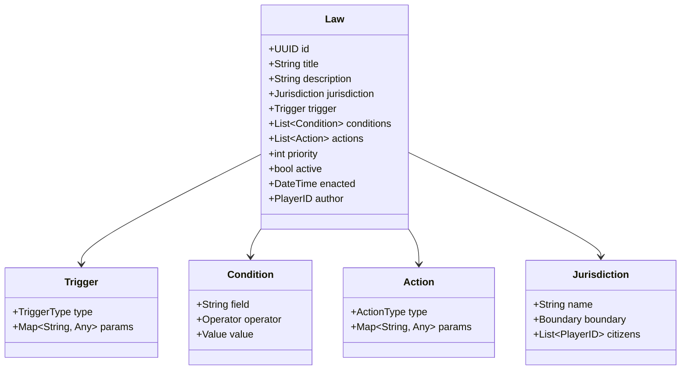

### Law Execution Engine

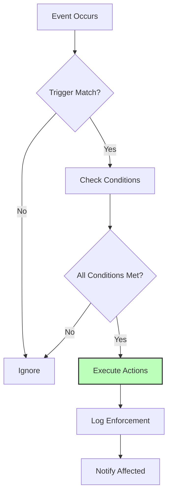

### Law Examples

**"No Hunting in Town Limits"**:
```json
{
  "trigger": "action_attempt",
  "action": "hunt",
  "conditions": [
    {"field": "location", "operator": "within", "value": "town_boundary"}
  ],
  "actions": [
    {"type": "prevent_action"},
    {"type": "fine", "amount": 50}
  ]
}
```

**"Sales Tax on Luxury Goods"**:
```json
{
  "trigger": "transaction_complete",
  "conditions": [
    {"field": "item_category", "operator": "equals", "value": "luxury"}
  ],
  "actions": [
    {"type": "tax", "rate": 0.10, "target": "government_treasury"}
  ]
}
```

### Law Conflicts & Precedence

**Resolution Order**:
1. Explicit priority numbers
2. Specificity (more specific wins)
3. Recency (newer laws win)
4. Jurisdiction level (federal > state > local)

### Performance Optimization

- **Event-driven**: Laws only evaluated on relevant events
- **Indexing**: Laws indexed by trigger type
- **Caching**: Common condition results cached
- **Lazy evaluation**: Stop at first failed condition

---

## 2. Constitutional System

### Constitution Data Structure

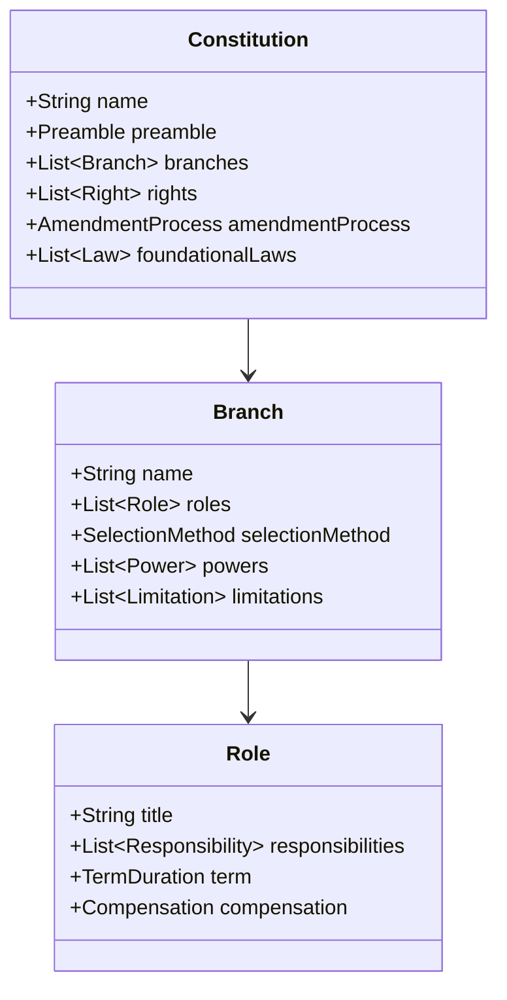

### Constitutional Templates

**Direct Democracy**:


**Representative Democracy**:
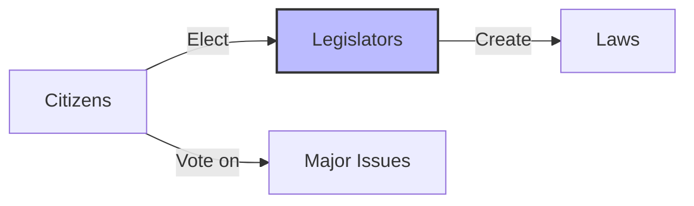

**Council System**:


### Amendment Process

**Difficulty Levels**:
- **Easy**: Simple majority
- **Medium**: Supermajority (60%)
- **Hard**: Supermajority (75%) + waiting period
- **Extreme**: Unanimous

### Constitutional Editor UX

**Template Selection**:
1. Browse templates (visual cards)
2. Preview implications ("In this system...")
3. Customize parameters
4. Review summary
5. Submit for ratification

---

## 3. Election & Voting Mechanics

### Voting UI/UX Flow

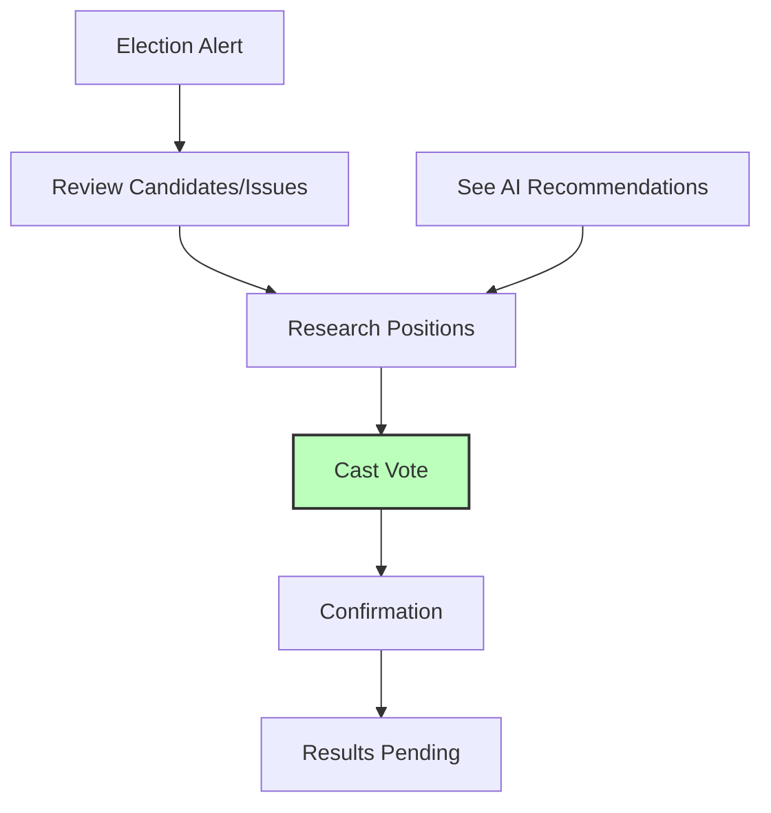

### Vote Counting

**Methods**:
- **Plurality**: Most votes wins
- **Majority**: >50% required (runoff if needed)
- **Ranked Choice**: Instant runoff
- **Approval**: Vote for all acceptable options

**Transparency**:
- Real-time vote tallies (optional privacy)
- Voter verification ("Your vote was counted")
- Audit trail (without compromising anonymity)

### AI Voting Behavior

**Factors** (from Session 2):
- Personal impact of proposal
- Values alignment
- Social influence (what do friends think?)
- Information quality (trust in sources)

**AI Voter Simulation**:
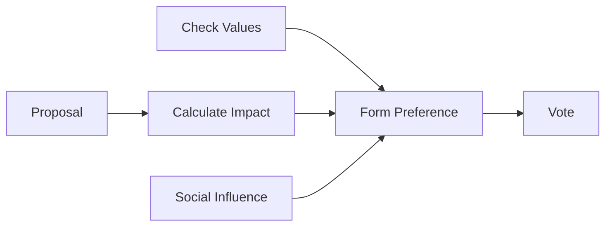

### Election Schedules

**Triggers**:
- **Fixed**: Every X days
- **Term-based**: When official's term expires
- **Event-based**: Crisis elections
- **Recall**: Petition threshold met

---

## 4. Government Types

### Implementation Matrix

| Type | Decision Making | Roles | Best For |
|------|----------------|-------|----------|
| **Direct Democracy** | All vote on all | None | Small groups (<20) |
| **Representative** | Elected legislators | President, Council | Medium groups (20-100) |
| **Council** | Consensus of council | Council members | Collaborative groups |
| **Mayoral** | Mayor decides | Mayor, Advisors | Clear leadership needed |
| **Federation** | Layered governance | Multiple levels | Large territories |

### Special Roles

**Judges**:
- Interpret laws
- Resolve disputes
- Enforcement oversight

**Administrators**:
- Manage government systems
- Economic oversight
- Record keeping

**Diplomats**:
- Inter-government relations
- Treaty negotiation
- Conflict resolution

---

## 5. Jurisdiction & Territory

### Land Claiming Mechanics

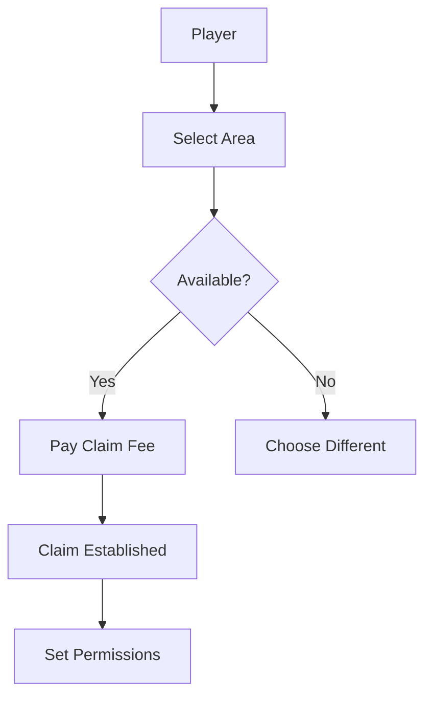

**Claim Types**:
- **Personal**: Individual homes, small farms
- **Town**: Shared jurisdiction, public services
- **State**: Multiple towns, broader governance
- **Federal**: Planetary, final authority

### Jurisdiction Hierarchy

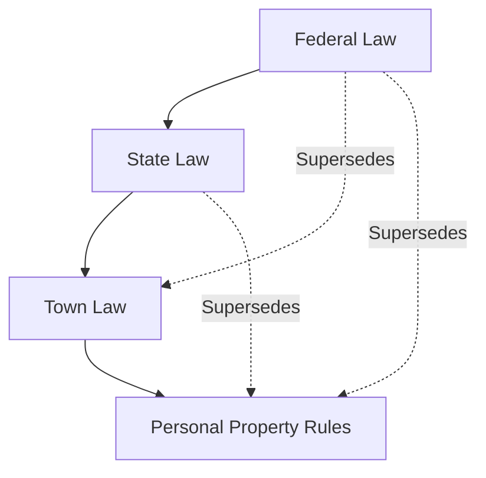

**Conflict Resolution**:
- Higher jurisdiction wins
- Specific law beats general
- Most recent amendment applies

### Public vs. Private Property

**Public**:
- Roads, infrastructure
- Town services
- Shared resources

**Private**:
- Personal claims
- Businesses
- Exclusive resources

---

## 6. Governance Progression UX

### Homesteader → Neighborhood

**Experience**:
- No formal governance
- Informal agreements
- Chat-based coordination
- Reputation matters

**Transition Trigger**: 3+ adjacent homesteaders

### Neighborhood → Town

**Formation Wizard**:

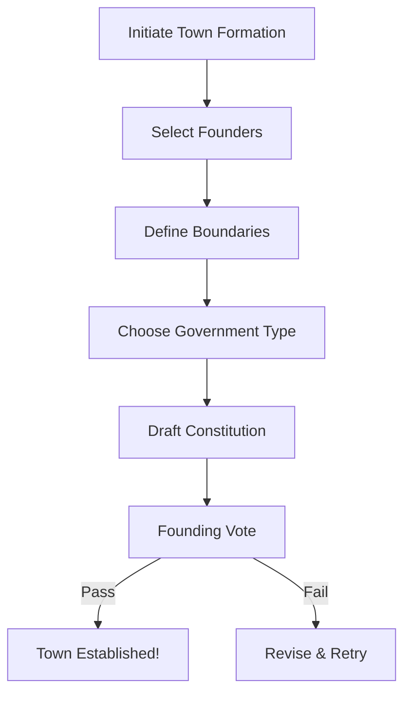

**UI/UX**:
- Visual boundary drawing
- Template constitution with customization
- Real-time preview of implications
- Guided voting process

### Town → State

**Federation Negotiation**:
- Towns propose federation
- Negotiate terms
- Constitutional compatibility
- Voting across all towns

### State → Federation

**Planetary Government**:
- Final authority
- Global laws
- Inter-state disputes
- Existential threat coordination

---

## 7. Law Enforcement Visibility

### Enforcement Transparency System

**Goal**: Players must see laws being enforced, not just breaking mysteriously

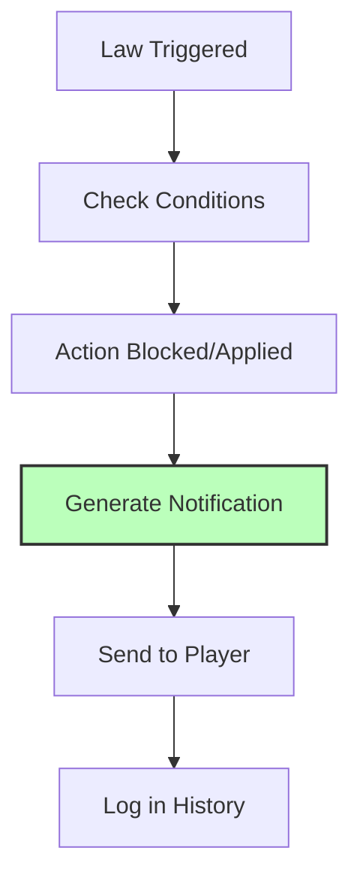

### Enforcement Notification UI

**When Law Prevents Action**:
```
┌─────────────────────────────────────┐
│ ⚠️ Action Blocked                   │
├─────────────────────────────────────┤
│ You attempted to: Chop tree         │
│                                     │
│ Blocked by:                         │
│ "Environmental Protection Act"      │
│                                     │
│ Reason:                             │
│ Tree is in protected forest zone    │
│                                     │
│ [View Law] [Appeal] [Dismiss]       │
└─────────────────────────────────────┘
```

**When Law Applies Penalty**:
```
┌─────────────────────────────────────┐
│ 💰 Tax Applied                      │
├─────────────────────────────────────┤
│ Transaction: Sold Iron Sword        │
│ Amount: 100 credits                 │
│                                     │
│ Tax: 10 credits (10%)               │
│ Under: "Sales Tax Law"              │
│                                     │
│ Net received: 90 credits            │
│                                     │
│ [View Details] [Receipt]            │
└─────────────────────────────────────┘
```

### Law Visualization

**Active Laws Dashboard**:
- List of all laws affecting player
- Visual indicators (icon + color)
- Quick summary ("This law affects: hunting, trading")
- Full text available

**Law Impact Preview**:
- Before proposing law: "If passed, this would affect X players"
- During voting: "Your vote: affects your taxes by Y%"
- After enactment: "This law has triggered Z times today"

### Enforcement History

**Personal Log**:
- All laws that affected player
- Timestamp and context
- Outcome (blocked, taxed, fined, etc.)
- Ability to appeal (if appeals process exists)

**Public Statistics**:
- Most enforced laws
- Total penalties collected
- Law effectiveness metrics
- Compliance rates

---

## 8. Anti-Griefing Systems

### Preventing Constitutional Deadlock

**Mechanisms**:
- **Default actions**: If no law, default rules apply
- **Emergency powers**: Temporary overrides possible
- **Timeout**: Laws expire if not reviewed
- **Minimum activity**: Government requires participation

### Handling Inactive Governments

**Detection**:
- No laws passed in X days
- Election turnout below threshold
- Critical decisions pending

**Intervention**:
- Automatic caretaker government
- Direct democracy fallback
- Server admin notification
- Dissolution and reformation option

### Protecting Against Tyranny of Majority

**Constitutional Protections**:
- **Bill of Rights**: Untouchable fundamental rights
- **Supermajority requirements**: For major changes
- **Judicial review**: Laws can be challenged
- **Secession rights**: Can leave jurisdiction

### Checks on Elected Officials

**Limitations**:
- Term limits
- Recall elections
- Transparency requirements
- Conflict of interest rules

### Exit Mechanisms

**Leaving Bad Governments**:
- Sell property and leave
- Challenge constitutionality
- Secede (form new jurisdiction)
- Move to different town/state

---

## 9. Governance Accessibility

### Making Politics Fun, Not Homework

**Problem**: Complex governance can feel like bureaucracy
**Solution**: Progressive disclosure, smart defaults, visual tools

### Progressive Complexity

**New Player Experience**:
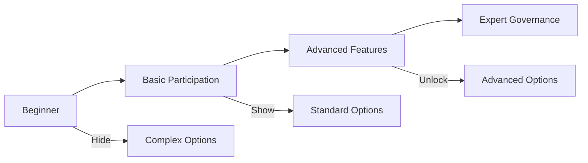

**Feature Tiers**:
- **Tier 1 (Beginner)**: Vote on simple proposals, view laws
- **Tier 2 (Intermediate)**: Propose simple laws, campaign
- **Tier 3 (Advanced)**: Draft complex laws, constitutional amendments

### Streamlining Routine Tasks

**Smart Defaults**:
- Default vote: "Abstain" (no penalty)
- Auto-vote: Set preferences, vote automatically
- Reminder system: "Election ends in 2 hours"
- Quick actions: "Vote Yes/No/Abstain" buttons

### Highlighting Important Decisions

**Decision Importance Algorithm**:
```
Importance = Impact × Urgency × Personal Relevance

- Impact: Number of affected players
- Urgency: Time remaining
- Personal Relevance: How much it affects you
```

**UI Treatment**:
- High importance: Full-screen modal
- Medium: Sidebar notification
- Low: Log entry only

### Reducing Tedium

**Batch Operations**:
- Review multiple laws at once
- Batch voting interface
- Template proposals

**Automation**:
- Standing voting instructions ("Always vote with Party X")
- Proxy voting (designate representative)
- Scheduled voting (vote ahead of time)

### Visual Tools

**Law Composer**:
- Visual block-based editor
- Plain language preview ("This law means...")
- Real-time impact simulation
- Example scenarios

**Constitution Builder**:
- Drag-and-drop government structure
- Visual relationship map
- Implication warnings
- Template library

---

## 10. Open Questions & Future Research

### Unresolved Questions

- [ ] What's the optimal voting period length?
- [ ] How do we prevent "voter fatigue"?
- [ ] What's the right balance of accessibility vs. depth?
- [ ] How do we handle timezone issues in global servers?
- [ ] Can we detect and prevent coordinated griefing?

### Research Needs

- [ ] Political engagement in games (academic studies)
- [ ] UX patterns for complex decision-making
- [ ] Anti-griefing in player-run governments
- [ ] Progressive disclosure best practices

---

## 11. Decisions Log

| Date | Decision | Rationale |
|------|----------|-----------|
| Session 0 | Event-driven law system | Performance, clarity |
| Session 0 | Visual law composer | Accessibility |
| Session 0 | Enforcement notifications | Transparency |
| Session 0 | Progressive complexity | Not overwhelm new players |

---

## 12. Governance System Development Skills

### Overview

This section documents the specialized skills required for implementing governance, law, and political systems in Societies. These skills cover event-driven architecture, voting systems, constitutional design, and complex UI/UX for political interfaces.

### 12.1 Core Governance Programming Skills

#### Skill 1: Law System Architecture

**Research Sources:**
- **Architecture:** Event-driven architecture patterns (EDA)
- **Rule Engines:** Drools, custom DSL implementations
- **Smart Contracts:** Ethereum/DAO patterns (conceptual study)
- **Legal AI:** Expert systems in legal domain
- **Games:** Unique - few games have complex law systems

**Key Competencies:**
- Event-driven programming (trigger-condition-action)
- Rule engine design and implementation
- Domain-specific languages (DSLs) for law definition
- Jurisdiction hierarchy and scoping
- Law conflict detection and resolution
- Event sourcing for law changes
- JSON schema design for law storage

**Creation Process:**
1. Document law data structures:
   ```json
   {
     "id": "uuid",
     "jurisdiction": "town|state|federal",
     "trigger": {"type": "event", "params": {}},
     "conditions": [{"field": "", "operator": "", "value": ""}],
     "actions": [{"type": "", "params": {}}],
     "priority": 1
   }
   ```
2. Create event-driven execution engine
3. Implement trigger evaluation system
4. Build condition checking framework
5. Design action execution pipeline
6. Create jurisdiction hierarchy (4 levels: Personal → Town → State → Federal)
7. Implement conflict resolution (priority + scope)
8. Research rule engines and DSL design

**Verification Steps:**
- [ ] Can define laws in JSON/schema format
- [ ] Events trigger appropriate laws
- [ ] Conditions evaluate correctly
- [ ] Actions execute atomically
- [ ] Jurisdiction scoping works
- [ ] Conflicts resolve predictably
- [ ] Performance: 100+ laws < 1ms evaluation

---

#### Skill 2: Voting System Implementation

**Research Sources:**
- **Theory:** Voting theory (plurality, majority, ranked choice, approval)
- **Security:** Election security and integrity best practices
- **Cryptography:** Cryptographic voting systems (conceptual)
- **UX:** Ballot design and voting interfaces
- **Games:** Very few games implement complex voting

**Key Competencies:**
- Multiple voting method implementations
- Vote counting algorithms
- Tie-breaking strategies
- Audit trail systems
- Transparency vs privacy balance
- Real-time results calculation
- Voter eligibility verification

**Creation Process:**
1. Document voting methods:
   - Plurality: Most votes wins
   - Majority: >50% required (runoff if needed)
   - Ranked Choice: Instant runoff voting
   - Approval: Binary approve/disapprove
2. Implement vote counting for each method
3. Create tie-breaking algorithms
4. Build audit trail (who voted, when, how - but not what)
5. Design transparent vote display
6. Research voting system vulnerabilities
7. Test with simulated elections

**Verification Steps:**
- [ ] Can implement all voting methods
- [ ] Vote counting is accurate
- [ ] Tie-breaking is fair and documented
- [ ] Audit trail maintains integrity
- [ ] Results calculate efficiently
- [ ] Method matches constitutional specification

---

#### Skill 3: Constitutional System Design

**Research Sources:**
- **Law:** Constitutional law principles and structures
- **Government:** Governance frameworks (democracy, republic, council)
- **Rights:** Rights and restrictions design
- **Process:** Amendment procedures and change management
- **Games:** Unique - constitutional design in games

**Key Competencies:**
- Government structure templates
- Rights protection system design
- Amendment procedure implementation
- Government type switching mechanics
- Separation of powers architecture
- Checks and balances systems
- Founding document creation UX

**Creation Process:**
1. Document constitutional templates:
   - Direct Democracy: Everyone votes on everything
   - Representative: Elected officials make decisions
   - Council: Small governing body
   - Custom: Player-defined structure
2. Create government structure configurations
3. Implement rights protection (inalienable rights)
4. Design amendment procedures
5. Research real constitutional designs
6. Create anti-griefing protections
7. Build government transition mechanics

**Verification Steps:**
- [ ] Can instantiate different government types
- [ ] Rights are protected from simple majority
- [ ] Amendment process is clear
- [ ] Transitions happen smoothly
- [ ] Structure matches real-world models
- [ ] Flexible enough for player creativity

---

#### Skill 4: Governance UX/UI Design

**Research Sources:**
- **Complex Forms:** Complex form design best practices
- **Visual Programming:** Scratch, Unreal Blueprints, node editors
- **Disclosure:** Progressive disclosure patterns
- **Accessibility:** Accessibility in complex systems
- **Decision Support:** Decision-making support interfaces

**Key Competencies:**
- Visual law composers (block-based editors)
- Progressive complexity implementation
- Smart default systems
- Contextual help integration
- Decision preview systems
- Batch operation interfaces
- Mobile/responsive governance (if applicable)

**Creation Process:**
1. Document governance UI wireframes
2. Create progressive disclosure tiers:
   - Tier 1: Simple (templates, presets)
   - Tier 2: Moderate (conditional logic)
   - Tier 3: Advanced (full scripting)
3. Design visual law composer (drag-and-drop blocks)
4. Implement smart defaults
5. Research visual scripting tools (Scratch, Blueprints)
6. Create contextual help system
7. Design decision preview (simulate law effects)

**Verification Steps:**
- [ ] New players can create simple laws
- [ ] Visual composer is intuitive
- [ ] Progressive disclosure reduces overwhelm
- [ ] Smart defaults are helpful
- [ ] Contextual help answers questions
- [ ] Advanced users have full power
- [ ] Mobile governance is usable (if applicable)

---

#### Skill 5: Anti-Griefing & Protection Systems

**Research Sources:**
- **Security:** Game security and anti-cheat
- **Social:** Social systems in games (EVE Online, WoW)
- **Governance:** Real-world anti-tyranny mechanisms
- **Economics:** Exit mechanisms and voice vs exit
- **Psychology:** Griefing psychology and prevention

**Key Competencies:**
- Deadlock prevention algorithms
- Inactive government handling
- Tyranny protection mechanisms
- Exit mechanisms (emigration, secession)
- Constitutional amendment safeguards
- Vote threshold management
- Emergency powers and limitations

**Creation Process:**
1. Document anti-griefing systems:
   - Constitutional supermajority for rights changes
   - Inactivity timeouts for officials
   - Exit options (leave jurisdiction)
   - Appeals processes
2. Implement deadlock detection and resolution
3. Create inactivity handling
4. Design tyranny protection (checks and balances)
5. Research griefing in player-run systems
6. Build emergency powers framework
7. Test with adversarial scenarios

**Verification Steps:**
- [ ] Deadlocks can be resolved
- [ ] Inactive governments don't block progress
- [ ] Tyranny is prevented by design
- [ ] Players have exit options
- [ ] Rights are protected
- [ ] System handles malicious actors

---

### 12.2 Governance Skill Development Workflow

#### Unique Challenge: Governance in Games

Governance systems are rare in games. Research sources include:
- **Real-world:** Actual governments and constitutional design
- **Legal AI:** Academic expert systems research
- **DAOs:** Blockchain decentralized organizations
- **Corporate:** Corporate governance structures
- **Social Systems:** EVE Online, player organizations

#### Development Process

**Step 1: Legal Research (4-6 hours)**
- Study constitutional law basics
- Research voting theory and methods
- Understand separation of powers
- Learn about rights and protections

**Step 2: Technical Design (3-4 hours)**
- Design event-driven architecture
- Create data structures
- Plan execution flow
- Design jurisdiction hierarchy

**Step 3: UX Research (2-3 hours)**
- Study complex form design
- Research visual programming interfaces
- Analyze progressive disclosure patterns
- Design decision support tools

**Step 4: Implementation (2-4 weeks)**
- Build core law engine
- Implement voting systems
- Create UI components
- Add anti-griefing protections

**Step 5: Validation (Ongoing)**
- Test with player scenarios
- Iterate based on usability
- Security audit
- Performance optimization

---

### 12.3 Skills to Create Priority List

**Immediate (Week 1-2):**
1. Event-Driven Architecture for Games
2. JSON Schema Design for Complex Data
3. Basic Voting Implementation
4. Jurisdiction Hierarchy Systems

**Short-term (Month 1-2):**
5. Law Execution Engine
6. Visual Law Composer UI
7. Constitutional System Architecture
8. Anti-Griefing Mechanisms

**Medium-term (Month 2-3):**
9. Advanced Voting Methods
10. Governance Decision Support
11. Law Conflict Resolution
12. Government Transition Systems

**Ongoing:**
13. Governance UX Patterns
14. Political Simulation Debugging
15. Election Security
16. Progressive Disclosure Design

---

### 12.4 Governance Research Resources

#### Legal & Political
| Resource | Type | Application |
|----------|------|-------------|
| Constitutional Law | Academic | Government structures |
| Voting Theory | Academic | Election systems |
| Separation of Powers | Political | Checks/balances |
| Democratic Theory | Academic | Legitimacy design |

#### Technical
| Resource | Type | Application |
|----------|------|-------------|
| Event-Driven Architecture | Software | Law engine |
| Rule Engines | Software | Law execution |
| DSL Design | Software | Law definition |
| Visual Programming | UX | Law composer |

#### Games & Social
| Resource | Type | Application |
|----------|------|-------------|
| EVE Online | Game | Player organizations |
| DAOs | Blockchain | Decentralized governance |
| Minecraft Servers | Game | Player-run systems |
| WoW Guilds | Game | Social structures |

#### UX Design
| Resource | Type | Application |
|----------|------|-------------|
| Scratch | Tool | Visual programming |
| Unreal Blueprints | Tool | Node editors |
| Complex Forms | UX | Governance UI |
| Decision Support | UX | Law preview |

---

## Success Criteria

- [ ] Law system fully specified
- [ ] Constitutional mechanics detailed
- [ ] Election systems designed
- [ ] Government types implemented
- [ ] Anti-griefing protections defined
- [ ] UX flows for governance transitions
- [ ] Law enforcement visibility system
- [ ] Governance accessibility features
- [ ] Governance development skills documented
- [ ] Research sources catalogued
- [ ] Skill creation workflow defined

---

**Status**: COMPLETE - Ready for Day 5 Planning & Development

---

## Changes & Revisions Log

### [Date] - Session 5 Revision

**Trigger**: [What caused this revision]

**Changes Made**:
- [Section]: [What changed]

**Rationale**: [Why this revision was necessary]

**Impact**: [What other documents/systems are affected]

---

## Cross-Doc Issues

### Issue 1: [Brief Description]
**Discovered in**: Session 5
**Affects**: Session Y, Session Z
**Description**: [What contradicts what]
**Resolution**: [How/when it will be resolved]
**Status**: [Open/In Progress/Resolved]

---

**Status**: Template Updated - Ready for Session 5 Planning (Depth-Optimized Methodology)
