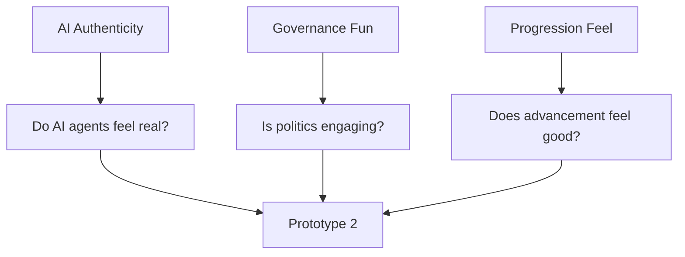
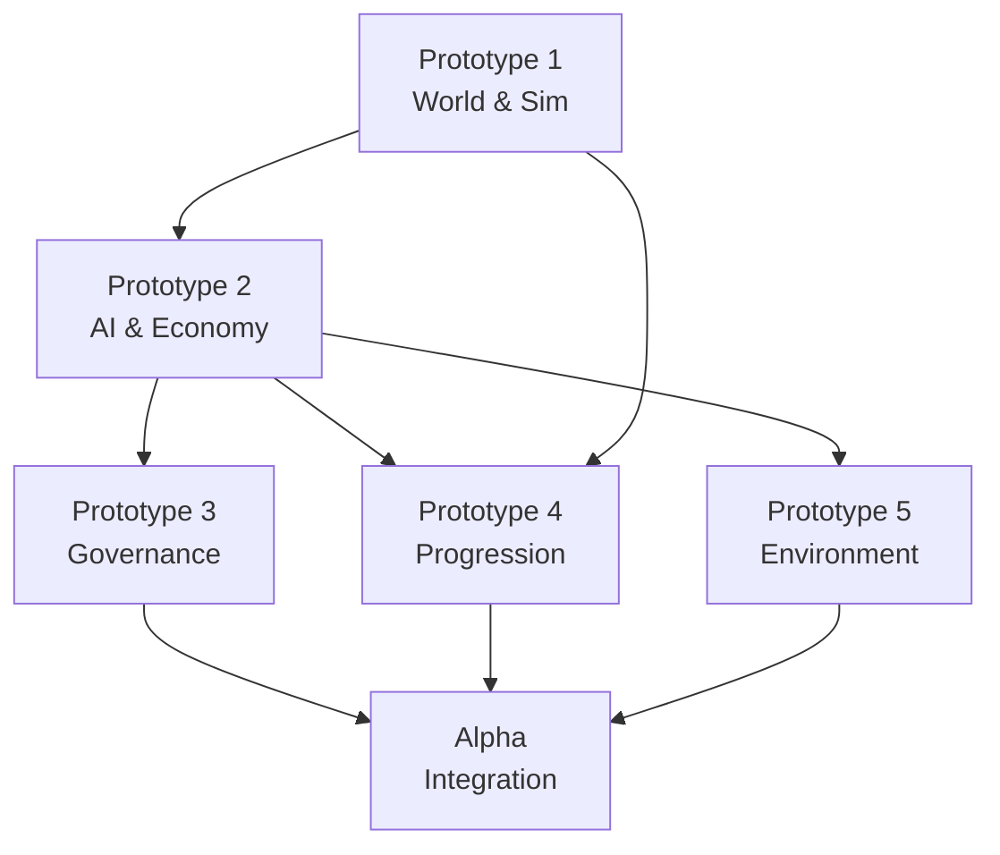
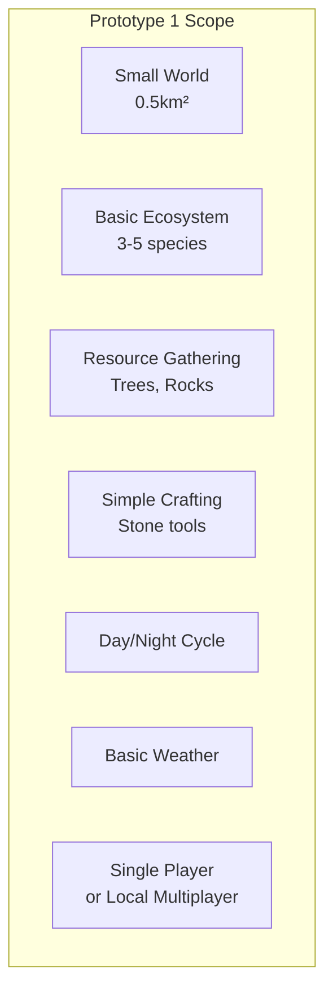
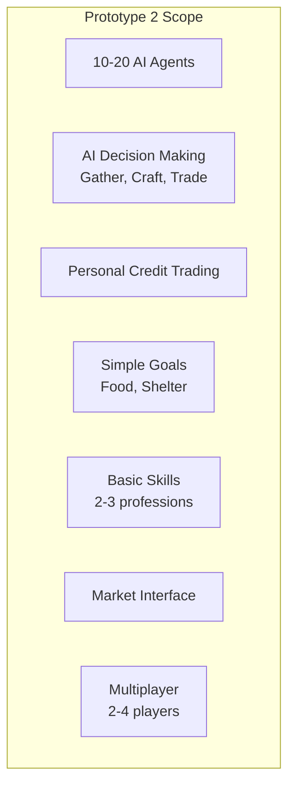
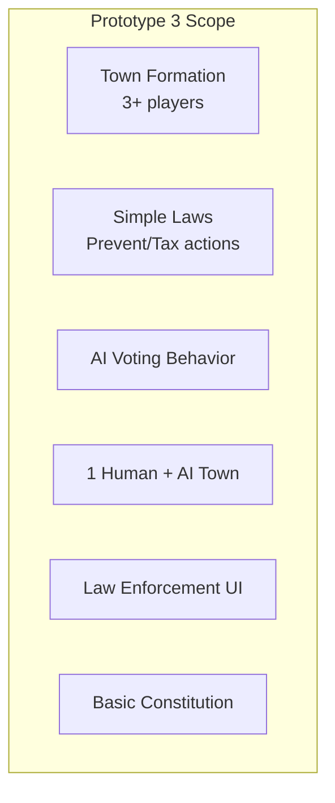
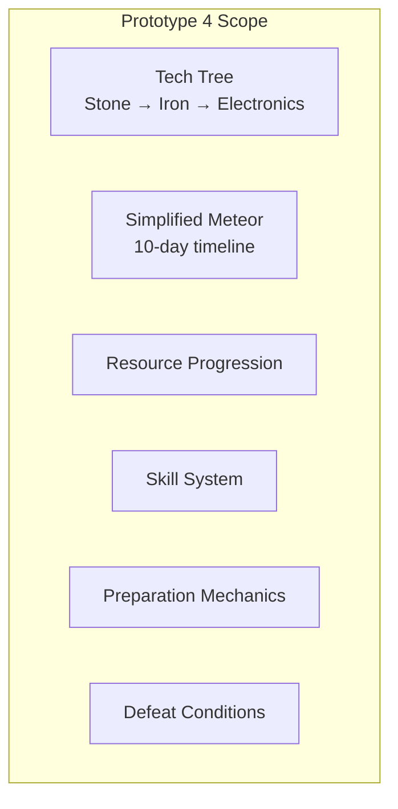
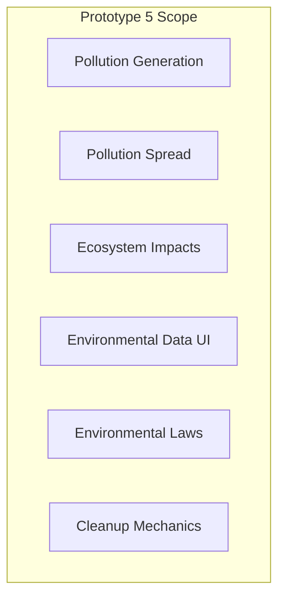
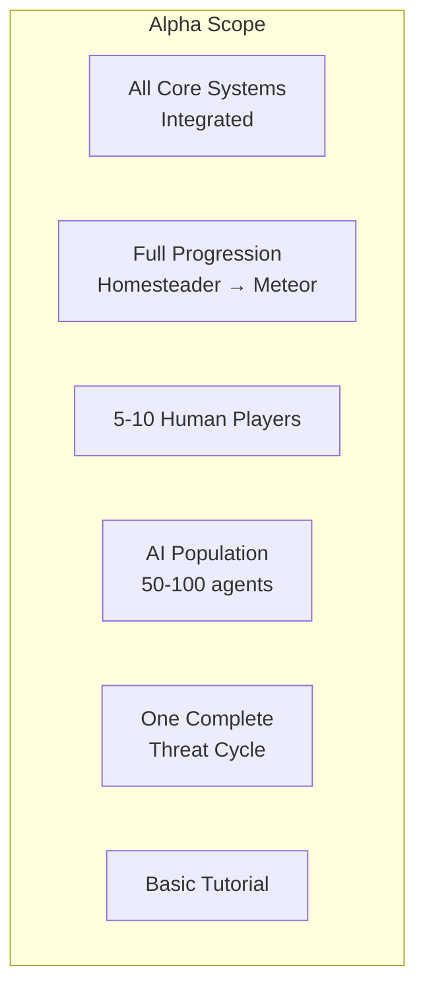
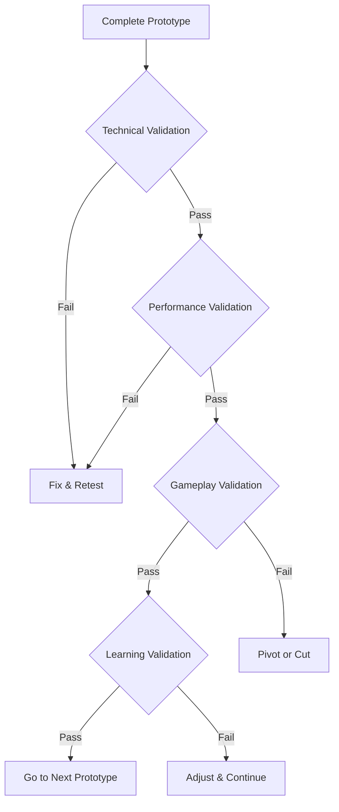
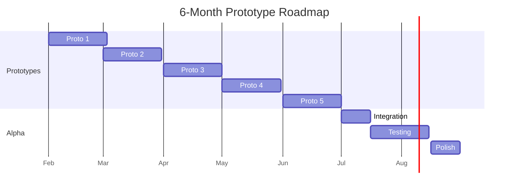

# Session 6: Prototyping Roadmap - Deep Planning Document

**Planning Session**: 6 of 7  
**Status**: Content Ready  
**Date Started**: 2026-01-30  
**Date Completed**: 2026-01-30

---

## Purpose

Identify what must be built first and in what order to validate core assumptions. This document creates a 6-month prototype roadmap with clear validation criteria and deferral decisions.

---

## Key Questions Addressed

1. What are the critical unknowns that need prototyping?
2. What's the minimum testable version?
3. What order do we build prototypes?
4. What can we defer until later?
5. What are the milestones for the next 6 months?

---

## Research Summary
**Tier 1 Sources**: [To be filled during research phase]
**Key Insights**: [Major learnings from research]

---

## Dependencies

- **Requires**: Sessions 1-5 (Architecture, AI, Gameplay, Balance, Governance)
- **Informs**: Session 7 (Master Plan)

---

## 1. Critical Validation Needs

### Technical Unknowns

```mermaid
graph TD
    A[Performance] --> B[Can we run 20 AI agents? (MVP)]
    C[Networking] --> D[Can we sync 20 players smoothly?]
    E[Godot Limits] --> F[Can Godot handle the simulation?]
    
    B --> G[Prototype 1 & 2]
    D --> G
    F --> G
```

### Gameplay Unknowns



### Prioritized Unknowns

| Rank | Unknown | Risk Level | Prototype |
|------|---------|------------|-----------|
| 1 | AI performance at scale | Critical | Proto 2 |
| 2 | Multiplayer sync quality | Critical | Proto 1 |
| 3 | AI behavior authenticity | High | Proto 2 |
| 4 | Law system usability | High | Proto 3 |
| 5 | Progression pacing | Medium | Proto 4 |
| 6 | Environmental balance | Medium | Proto 5 |

---

## 2. Prototype Dependency Graph



---

## 3. Prototype 1: Basic World & Simulation

**Month 1**

### Goal
Prove the simulation engine works and runs at acceptable performance.

### Scope



**Technical Implementation**:
- Godot 4.x project setup
- Terrain generation (simple)
- Basic entity system
- Resource nodes
- Crafting system
- Time system

**NOT Included**:
- AI agents
- Economy
- Governance
- Advanced simulation
- Networking (beyond localhost)

### Success Metrics

| Metric | Target | Measurement |
|--------|--------|-------------|
| **TPS** (Server Tick Rate) | 20+ | Server metrics |
| **Client FPS** | 60+ | In-game counter |
| Load Time | <10s | Stopwatch |
| Memory | <2GB | System monitor |
| Stability | No crashes | 4-hour playtest |

### Key Learnings
- Godot performance characteristics
- Simulation feel (is it satisfying?)
- Resource balance (too abundant? too scarce?)

### Go/No-Go Decision
- **Continue if**: Runs smoothly, feels engaging
- **Pivot if**: Performance issues, not fun

---

## 4. Prototype 2: AI Agents & Economy

**Month 2**

### Goal
Prove AI citizens can participate economically and sustain themselves.

### Scope



**Technical Implementation**:
- Agent entity system
- Goal-based AI
- Economic simulation
- Trading system
- Multiplayer foundation

**NOT Included**:
- Advanced AI personality
- Complex economy
- Governance
- Environmental simulation

### Success Metrics

| Metric | Target | Measurement | Session 1/2 Constraint |
|--------|--------|-------------|------------------------|
| **AI Survival** | 100% for 24h sim | Automated test | 25 agents (MVP) |
| **Economic Velocity** | 10+ trades/day | Log analysis | Session 2: 5-10 tick decision cycle |
| **AI Efficiency** | 50%+ of human | Comparison test | Baseline: human efficiency |
| **Multiplayer Latency** | <100ms | Network test | Session 1: 200ms budget |
| **Agent Decision Time** | <2ms per agent | Profiling | Session 2: Performance budget |

### Key Learnings
- AI behavior authenticity
- Economic emergent behavior
- Multiplayer sync quality

### Go/No-Go Decision
- **Continue if**: AI feels alive, economy works
- **Pivot if**: AI robotic, economy broken

---

## 5. Prototype 3: Basic Governance

**Month 3**

### Goal
Prove town formation and law system works and feels meaningful.

### Scope



**Technical Implementation**:
- Jurisdiction system
- Law execution engine
- Voting mechanics
- Constitutional framework
- UI for law creation

**NOT Included**:
- Complex government types
- Advanced political mechanics
- Full constitution editor

### Success Metrics

| Metric | Target | Measurement |
|--------|--------|-------------|
| Law Success Rate | 80%+ execute correctly | Automated test |
| AI Voting | Reasonable choices | Observation |
| UX Clarity | Players understand | User testing |
| Engagement | Laws feel impactful | Survey |

### Key Learnings
- Law system usability
- Political engagement
- UI clarity

### Go/No-Go Decision
- **Continue if**: Laws work, UI usable, feels meaningful
- **Pivot if**: System confusing, not engaging

---

## 6. Prototype 4: Progression & Threats

**Month 4**

### Goal
Prove the progression and threat system creates engagement.

### Scope



**Technical Implementation**:
- Technology system
- Research mechanics
- Skill progression
- Meteor event
- Win/lose conditions

**NOT Included**:
- Full tech tree
- Multiple threats
- Advanced preparation options

### Success Metrics

| Metric | Target | Measurement |
|--------|--------|-------------|
| Meteor Defeat Rate | 60%+ | Playtest results |
| Engagement | 4+ hours/session | Analytics |
| Progression Feel | Satisfying | Survey |
| Difficulty | Challenging but fair | Feedback |

### Key Learnings
- Pacing and difficulty
- Progression satisfaction
- Threat urgency balance

### Go/No-Go Decision
- **Continue if**: Engaging progression, appropriate challenge
- **Pivot if**: Too easy/hard, not satisfying

---

## 7. Prototype 5: Environmental Systems

**Month 5**

### Goal
Prove pollution and ecosystem damage creates meaningful challenge.

### Scope



**Technical Implementation**:
- Pollution simulation
- Ecosystem health tracking
- Data visualization
- Environmental law triggers
- Remediation systems

**NOT Included**:
- Complex climate simulation
- Multiple pollution types
- Advanced ecosystem modeling

### Success Metrics

| Metric | Target | Measurement |
|--------|--------|-------------|
| Pollution Visibility | Clear cause/effect | Observation |
| Challenge Level | Requires response | Playtest |
| UI Clarity | Data understandable | User testing |
| Law Impact | Environmental laws help | Metrics |

### Key Learnings
- Environmental balance
- Data visualization effectiveness
- Player response to threats

### Go/No-Go Decision
- **Continue if**: Pollution creates engaging challenge
- **Pivot if**: Ignorable or overwhelming

---

## 8. Alpha Version (Month 6)

### Goal
Integrated prototype ready for small-scale testing with 5-10 human players.

### Scope



**Technical Implementation**:
- All prototypes integrated
- Bug fixes and polish
- Server deployment
- Basic tutorial/onboarding
- Analytics integration

**NOT Included** (Deferred to Beta - NOT Cut from Project):
- Advanced threats (beyond meteor)
- **State/federation governance** (Confirmed in scope for Beta phase, months 7-18)
- Advanced automation
- Complex biomes
- Multi-server architecture
- Art/audio polish (placeholders OK)

### Success Metrics

| Metric | Target | Measurement |
|--------|--------|-------------|
| Session Length | 3+ hours avg | Analytics |
| Retention | 50%+ day 7 | Analytics |
| Meteor Success | 50%+ of servers | Server data |
| Fun Rating | 7+/10 | Survey |
| Bugs | <10 critical | Bug tracker |

### Key Learnings
- Complete game loop
- Long-term engagement
- Integration issues
- Performance at scale

### Alpha Testing Plan

**Week 1-2**: Internal testing (solo + friends)
**Week 3-4**: Closed alpha (5-10 external players)
**Week 5-6**: Feedback collection and iteration

---

## 9. What We're NOT Building Yet

### Deferred to Post-Alpha

| Feature | Deferred To | Reason |
|---------|-------------|---------|
| Advanced threats | Beta (months 7-12) | Core loop first |
| State/federation | Beta | Town-level sufficient |
| Advanced automation | Beta | Nice-to-have |
| Complex biomes | Beta | Start with 3-4 |
| Multi-server | Post-launch | Scale later |
| Art polish | Beta | Placeholders OK |
| Sound design | Beta | Silent acceptable |
| Full tutorial | Beta | Basic for alpha |

### Priority Justification

**MVP Philosophy**:
- Build smallest version that proves core assumptions
- Add complexity only after validation
- Cut scope aggressively to maintain timeline

---

## 10. Validation Criteria for Each Prototype

### Validation Framework



### Validation Checklist

**Technical**:
- [ ] Core systems function
- [ ] No critical bugs
- [ ] Runs on target hardware
- [ ] **Meets TPS targets (20 TPS)** [Session 1 constraint]
- [ ] **Agent processing <2ms per agent** [Session 2 constraint]

**Performance**:
- [ ] Meets **server tick rate targets (20 TPS)**
- [ ] Acceptable load times
- [ ] Stable over extended play
- [ ] **Network bandwidth within 32 KB/s per player**

**Gameplay**:
- [ ] Fun to play
- [ ] Clear goals
- [ ] Appropriate challenge
- [ ] **AI behavior authentic** [Session 2 validation]

**Learning**:
- [ ] Assumptions validated
- [ ] New insights documented
- [ ] Next steps clear
- [ ] **Performance budgets confirmed** [Sessions 1-2 constraints]

---

## 11. Timeline Summary



### Monthly Commitments

**Month 1**: Prototype 1 - World simulation
**Month 2**: Prototype 2 - AI and economy  
**Month 3**: Prototype 3 - Governance
**Month 4**: Prototype 4 - Progression
**Month 5**: Prototype 5 - Environment
**Month 6**: Alpha integration and testing

---

## 12. Risk Mitigation

### Prototype Risks

| Risk | Likelihood | Impact | Mitigation |
|------|------------|--------|------------|
| Scope creep | High | Delays | Strict MVP definition |
| Performance issues | Medium | Redesign | Profile early, often |
| Not fun | Medium | Pivot | Test with friends early |
| Technical blockers | Low | Major delay | Research upfront |

### Contingency Plans

**If Behind Schedule**:
- Cut scope aggressively
- Skip to core validation
- Extend timeline (flexible)

**If Prototype Fails**:
- Document learnings
- Pivot approach
- Reassess feasibility

---

## 13. Open Questions

### Planning Uncertainties

- [ ] What's realistic scope for solo developer?
- [ ] How long does Godot development actually take?
- [ ] What's the optimal prototype size?
- [ ] How much testing is needed?

### To Validate

- [ ] Can we hit performance targets?
- [ ] Will AI feel authentic?
- [ ] Is governance engaging?
- [ ] Is progression satisfying?

---

## 15. Validation-Driven Development Skills

### Overview

This section documents the methodology and skills required for effective prototype development, validation testing, and risk management. These skills cover scope definition, MVP design, validation frameworks, and iterative development processes.

### 15.1 Core Prototyping Skills

#### Skill 1: Scope Definition & MVP Design

**Research Sources:**
- **Lean:** "The Lean Startup" by Eric Ries (MVP concepts)
- **Games:** Rami Ismail talks on game MVP definition
- **Postmortems:** Failed project postmortems (scope creep lessons)
- **Management:** Feature cutting strategies and prioritization

**Key Competencies:**
- Critical unknown identification
- Minimum testable scope definition
- Feature deferral decision making
- Scope creep prevention techniques
- Vertical slice vs horizontal slice planning
- Technical debt assessment
- "Kill your darlings" decision making

**Creation Process:**
1. Document each prototype's scope clearly:
   - Proto 1: World + basic simulation (no AI, no multiplayer)
   - Proto 2: AI agents + economy (single-player)
   - Proto 3: Governance systems (single-player)
   - Proto 4: Progression + threats (single-player)
   - Proto 5: Environmental systems (single-player)
   - Alpha: Multiplayer + integration
2. Create "not building yet" lists for each prototype
3. Define success metrics for each (quantitative where possible)
4. Research similar prototype roadmaps
5. Establish go/no-go criteria explicitly
6. Document pivot options if validation fails

**Verification Steps:**
- [ ] Can identify critical unknowns vs nice-to-haves
- [ ] Scope is achievable in time allocated
- [ ] Each prototype tests specific hypothesis
- [ ] Deferral decisions are documented
- [ ] Team understands what's in/out of scope
- [ ] Success metrics are measurable

---

#### Skill 2: Validation Testing

**Research Sources:**
- **Methods:** Validation techniques (fake door, concierge, Wizard of Oz)
- **Playtesting:** Playtesting methodologies (GDC talks)
- **Statistics:** Statistical significance in game testing
- **Experimentation:** A/B testing frameworks for games

**Key Competencies:**
- Success metric definition (SMART criteria)
- Test design for specific hypotheses
- Data collection and analysis
- Pivot vs persevere decisions
- Qualitative vs quantitative validation
- Fake door testing (measure interest before building)
- Wizard of Oz testing (manual backend, real frontend)

**Creation Process:**
1. Document validation criteria for each prototype:
   - Proto 1: 60 FPS with 100 entities, <100ms save/load
   - Proto 2: AI passes "Turing test" with 70% players
   - Proto 3: Governance tasks completed in <5 minutes
   - Proto 4: 60% meteor survival rate
   - Proto 5: Environmental feedback loops visible
2. Create testing protocols for each validation
3. Design data collection systems
4. Establish statistical significance thresholds
5. Research game testing frameworks
6. Build rapid validation tools

**Verification Steps:**
- [ ] Can design test for any hypothesis
- [ ] Metrics are measurable and objective
- [ ] Sample sizes are statistically valid
- [ ] Tests can be run quickly (days, not weeks)
- [ ] Results lead to clear decisions
- [ ] False positives/negatives minimized

---

#### Skill 3: Risk Assessment & Mitigation

**Research Sources:**
- **Management:** Risk management in software projects (PMBOK)
- **Games:** Game development risk postmortems
- **Assessment:** Technical risk assessment frameworks (FMEA)
- **Planning:** Contingency planning and disaster recovery

**Key Competencies:**
- Risk probability/impact matrices
- Mitigation strategy design
- Contingency planning (Plan B, C, D)
- Early warning indicators
- Risk monitoring systems
- Technical debt quantification
- Dependency risk analysis

**Creation Process:**
1. Document risk matrix for Societies:
   - High Prob + High Impact: Performance at scale, AI authenticity
   - High Prob + Low Impact: Minor bugs, UI polish
   - Low Prob + High Impact: Data loss, security breach
   - Low Prob + Low Impact: Edge case crashes
2. Create mitigation plans for top 5 risks:
   - Performance: Early optimization, profiling tools, scalability tests
   - AI: Multiple brain configs, fallback behaviors, player feedback
   - Scope: Weekly scope reviews, ruthless cutting protocol
   - Team: Documentation, bus factor management
   - Market: Community building early, niche focus
3. Research similar project failures
4. Design risk monitoring dashboard
5. Establish escalation procedures

**Verification Steps:**
- [ ] All major risks identified
- [ ] Probability and impact assessed objectively
- [ ] Mitigation strategies are actionable
- [ ] Contingency plans exist for critical risks
- [ ] Early warning indicators defined
- [ ] Risk monitoring is ongoing

---

#### Skill 4: Iterative Development Process

**Research Sources:**
- **Agile:** Scrum, Kanban methodologies
- **Games:** Game development agile adaptations (Gamasutra)
- **Feedback:** Feedback loop design and learning organization
- **Improvement:** Kaizen (continuous improvement) principles

**Key Competencies:**
- Sprint planning for games (1-4 week cycles)
- Retrospective facilitation (lessons learned)
- Knowledge documentation (preventing repeat mistakes)
- Plan adjustment protocols (when to pivot)
- Learning integration (applying lessons)
- Velocity tracking and estimation
- Technical debt management

**Creation Process:**
1. Document 6-month prototype plan with milestones
2. Create iteration schedules (weekly sprints, monthly prototypes)
3. Establish retrospective format:
   - What went well?
   - What didn't go well?
   - What should we start doing?
   - What should we stop doing?
4. Design learning capture systems (decision log, lessons learned)
5. Research game-specific agile practices
6. Build plan adjustment criteria (when to change course)

**Verification Steps:**
- [ ] Iterations have clear goals
- [ ] Retrospectives happen regularly
- [ ] Lessons are documented and applied
- [ ] Plans adjust based on learning
- [ ] Velocity is tracked and predictable
- [ ] Technical debt is managed, not ignored

---

### 15.2 Prototype Skill Development Workflow

#### Validation Framework

**Four Types of Validation:**
1. **Technical Validation:** Does it work? (Performance, stability)
2. **Performance Validation:** Does it scale? (FPS, memory, network)
3. **Gameplay Validation:** Is it fun? (Engagement, retention)
4. **Learning Validation:** Did we learn? (Insights, next steps)

**Validation Checklist for Each Prototype:**
- [ ] Hypothesis clearly stated
- [ ] Test method designed
- [ ] Success criteria defined (quantitative preferred)
- [ ] Data collection plan ready
- [ ] Analysis method determined
- [ ] Decision criteria established (go/no-go/pivot)
- [ ] Timeline for validation set

#### Prototype-Specific Skills

Each prototype generates new skills:
- **Proto 1:** Technical foundation, world generation, basic systems
- **Proto 2:** AI behavior, economic simulation, agent management
- **Proto 3:** Governance systems, law execution, voting
- **Proto 4:** Progression systems, threat design, balancing
- **Proto 5:** Environmental simulation, ecosystem modeling
- **Alpha:** Integration, multiplayer, polish

---

### 15.3 Skills to Create Priority List

**Immediate (Week 1-2):**
1. Scope Definition and Cutting
2. Success Metric Design
3. Basic Validation Testing
4. Risk Identification

**Short-term (Month 1-2):**
5. MVP Design Principles
6. Statistical Validation Methods
7. Pivot vs Persevere Decisions
8. Risk Mitigation Planning

**Medium-term (Month 2-3):**
9. Advanced Prototyping Techniques
10. Iterative Planning
11. Knowledge Management
12. Technical Debt Assessment

**Ongoing:**
13. Retrospective Facilitation
14. Learning Documentation
15. Plan Adjustment Protocols
16. Estimation and Velocity Tracking

---

### 15.4 Prototype Research Resources

#### Lean & Agile
| Resource | Author | Focus |
|----------|--------|-------|
| The Lean Startup | Eric Ries | MVP, validation |
| Scrum Guide | Schwaber/Sutherland | Agile framework |
| Kanban | Anderson | Flow management |
| Lean Software Development | Poppendieck | Lean principles |

#### Game Development
| Resource | Type | Focus |
|----------|------|-------|
| Game Development Postmortems | Articles | Lessons learned |
| GDC Talks | Videos | Best practices |
| Game Design Workshop | Fullerton | Prototyping |
| Rapid Prototyping | Game jams | Quick iteration |

#### Testing & Validation
| Resource | Type | Focus |
|----------|------|-------|
| A/B Testing | Statistics | Experiment design |
| Playtesting | Methodology | Qualitative research |
| Fake Door Testing | Technique | Interest validation |
| Wizard of Oz | Technique | UX validation |

#### Risk Management
| Resource | Type | Focus |
|----------|------|-------|
| PMBOK | Standard | Project management |
| FMEA | Method | Risk assessment |
| Postmortems | Analysis | Failure analysis |
| Contingency Planning | Process | Backup plans |

---

## Success Criteria

- [ ] Critical unknowns identified and prioritized
- [ ] 6-month prototype roadmap defined
- [ ] Each prototype has clear scope and success metrics
- [ ] Deferral decisions made (what waits)
- [ ] Validation criteria established
- [ ] Risk mitigation strategies defined
- [ ] Validation-driven development skills documented
- [ ] Research sources catalogued
- [ ] Skill creation workflow defined

---

**Status**: COMPLETE - Ready for Day 6 Planning & Development

---

## Changes & Revisions Log

### [Date] - Session 6 Revision

**Trigger**: [What caused this revision]

**Changes Made**:
- [Section]: [What changed]

**Rationale**: [Why this revision was necessary]

**Impact**: [What other documents/systems are affected]

---

## Cross-Doc Issues

### Issue 1: [Brief Description]
**Discovered in**: Session 6
**Affects**: Session Y, Session Z
**Description**: [What contradicts what]
**Resolution**: [How/when it will be resolved]
**Status**: [Open/In Progress/Resolved]

---

**Status**: Template Updated - Ready for Session 6 Planning (Depth-Optimized Methodology)
