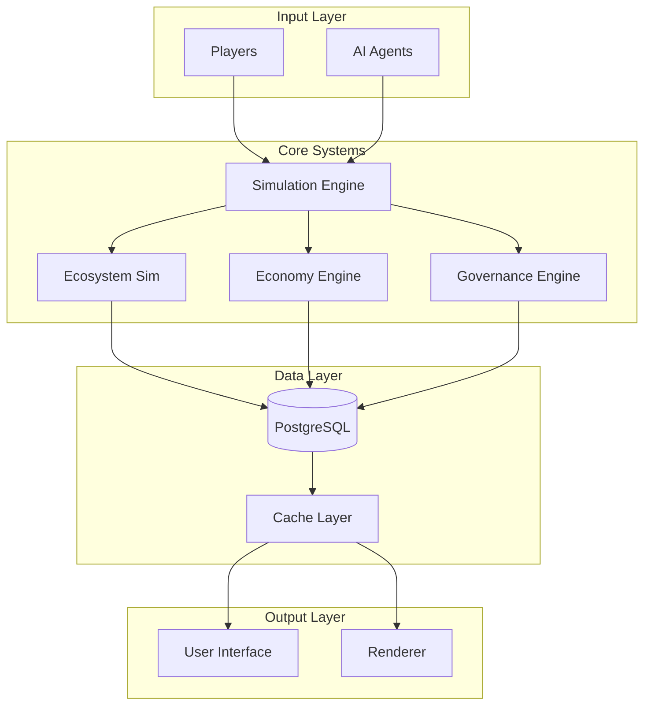
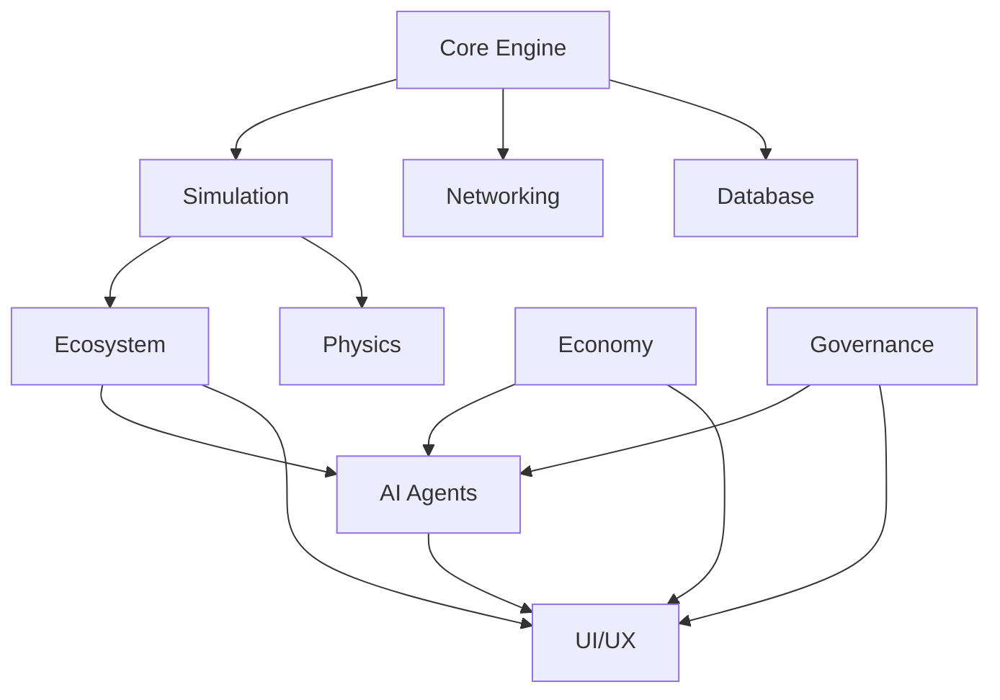
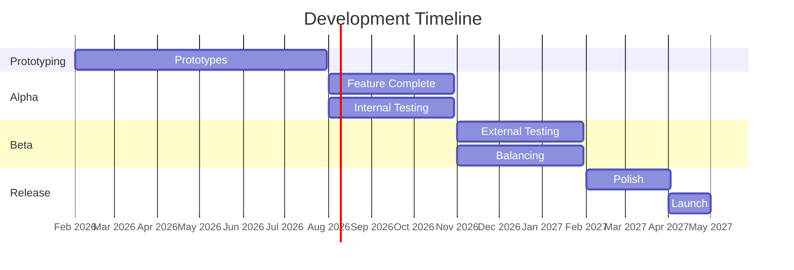

# Session 7: Master Development Plan - Deep Planning Document

**Planning Session**: 7 of 7  
**Status**: Content Ready  
**Date Started**: 2026-01-31  
**Date Completed**: 2026-01-31

---

## Purpose

Review all previous days' work, identify gaps, resolve conflicts, and create a unified plan for development. This document serves as the authoritative source for the complete development path forward.

---

## Key Questions Addressed

1. Do all the systems fit together coherently?
2. Are there contradictions between documents?
3. What did we miss?
4. What needs refinement?
5. What's the complete development path forward?

---

## Research Summary
**Tier 1 Sources**: [To be filled during research phase]
**Key Insights**: [Major learnings from research]

---

## Dependencies

- **Requires**: Sessions 1-6 (All planning documents)
- **Informs**: Week 2+ (Implementation)

---

## 1. Executive Summary

### Vision Statement

Societies is a persistent multiplayer civilization simulation where human players and AI agents coexist as equal citizens in a living ecosystem. Unlike traditional survival games, Societies treats society-building as the core gameplay loop, with AI agents providing economic and political continuity that prevents server death and creates authentic, emergent political and economic systems.

### Core Innovations

1. **AI-Human Equivalence**: AI agents are first-class citizens with equal economic and political rights
2. **Persistent World Simulation**: World evolves continuously whether players are online or not
3. **Emergent Governance**: Laws and constitutions created by players, enforced on AI agents
4. **Integrated Ecosystem**: Environmental simulation with real consequences for civilization
5. **Elastic AI Population**: Dynamic scaling ensures healthy economy regardless of player count

### Target Audience

- **Primary**: Players who enjoy complex simulations (Factorio, Eco, Dwarf Fortress)
- **Secondary**: Strategy game fans interested in emergent gameplay
- **Tertiary**: Creative builders who want meaningful social contexts

### Success Definition

**Technical Success**:
- Stable multiplayer with 20+ concurrent players
- **25 AI agents running efficiently (MVP), 50-100 agents (post-MVP)** [Session 1-2 constraints]
- **20 TPS tick rate maintained** [Session 1 performance budget]
- **<2ms per-agent processing** [Session 2 AI budget]
- Complete server lifecycle (meteor to space age)

**Commercial Success**:
- Sustained player base (100+ concurrent players across servers)
- Positive reviews (80%+ positive)
- Financial sustainability

**Creative Success**:
- Emergent stories from player interactions
- Functional AI societies
- Meaningful political and economic systems

---

## 1.5 Timeline Acceptance & Project Commitment

### Development Timeline Reality

**Total Estimated Development Time: 2-3 Years**

This project represents a significant undertaking comparable to games developed by teams of 8+ developers (e.g., Eco). As a solo/small team project, realistic timeline expectations are essential.

### Timeline Breakdown

| Phase | Duration | Cumulative | Key Deliverables |
|-------|----------|------------|------------------|
| **Prototyping** | 6 months | 6 months | Core systems validation, 20-agent MVP |
| **Alpha** | 6 months | 12 months | Vertical slice, all core systems, 50-agent scale |
| **Beta** | 6-12 months | 18-24 months | Content complete, state/federation governance, polish |
| **Release Prep** | 6-12 months | 24-36 months | QA, optimization, marketing, launch |

### Solo Developer Commitment

This timeline assumes:
- **20-30 hours/week** dedicated development time
- **Iterative prototyping** to validate assumptions before full implementation
- **Aggressive scope discipline** - features that don't validate in prototyping get cut or deferred
- **Community engagement** for playtesting and feedback

### Scope Acceptance

The following scope decisions have been made to support the 2-3 year timeline:

✅ **MVP Agent Count: 20 agents** - Validates core AI systems without performance risk  
✅ **Post-MVP Scale: 50-100 agents** - Achievable optimization target  
✅ **Federation/State Governance: RETAINED** - Confirmed in scope for Beta phase (months 7-18), not cut  
✅ **PostgreSQL: Production-only** - SQLite sufficient for development and single-player  

### Success Criteria

- [ ] Accept 2-3 year development timeline as realistic
- [ ] Commit to consistent weekly development hours
- [ ] Accept scope management to maintain timeline
- [ ] Plan for post-launch content expansion
- [ ] Accept that some advanced features will be post-launch

**Decision**: Proceed with 2-3 year timeline and 20-agent MVP scope.

---

## 2. System Integration Map

### High-Level Integration

### System Dependencies

### Data Flow

**Tick Loop Data Flow**:
1. **Input**: Player actions, AI decisions, environmental changes
2. **Process**: Simulation systems update state
3. **Persist**: Critical state saved to database
4. **Sync**: State changes broadcast to clients
5. **Render**: Clients display updated world

### Critical Dependencies

| System | Depends On | Risk Level |
|--------|-----------|------------|
| AI Agents | Simulation Engine | Critical |
| Economy | AI Agents | High |
| Governance | Economy | Medium |
| Ecosystem | Simulation Engine | High |
| Multiplayer | All Systems | Critical |

---

## 3. Development Phases

### Phase Overview

### Phase 1: Prototyping (Months 1-6)

**Focus**: Validate core assumptions through iterative prototypes

**Deliverables**:
- 5 functional prototypes
- Performance benchmarks
- AI behavior validation
- Multiplayer sync verification

**Success Criteria**:
- All prototypes meet success metrics
- Core fun factor validated
- Technical risks mitigated

### Phase 2: Alpha (Months 7-12)

**Focus**: First playable version with all core features

**Deliverables**:
- Complete feature set
- Basic tutorial
- Server infrastructure
- Analytics integration

**Success Criteria**:
- 5-10 playtesters engaged
- 4+ hour average sessions
- 50%+ day-7 retention

### Phase 3: Beta (Months 13-18)

**Focus**: Feature complete, balancing, and polish

**Deliverables**:
- Closed beta (100+ players)
- Economy balancing
- UI/UX refinement
- Content complete

**Success Criteria**:
- 80%+ fun rating
- Stable servers
- Clear progression path

### Phase 4: Release (Months 19+)

**Focus**: Public launch and post-launch support

**Deliverables**:
- Marketing materials
- Launch event
- Post-launch roadmap
- Community tools

**Success Criteria**:
- Sustained player base
- Positive reviews
- Financial sustainability

---

## 4. Resource Requirements

### Team Composition

**Current**: Solo developer (you)

**Potential Collaborators**:
| Role | Need | Timeline |
|------|------|----------|
| Programmer | High | Month 6+ |
| Artist | Medium | Month 9+ |
| Sound Designer | Low | Month 12+ |
| Community Manager | Medium | Month 15+ |

**Hiring Strategy**:
- Start solo through Alpha
- Bring on programmer for Beta optimization
- Contract artist for final polish
- Volunteer moderators for community

### Tools & Software

**Development**:
- Godot 4.x (Free)
- Visual Studio / VS Code (Free)
- Git + GitHub (Free)
- PostgreSQL (Free)

**Art & Audio** (Placeholder until hiring):
- Blender (Free) - Placeholder models
- GIMP/Photoshop - Textures
- Audacity (Free) - Basic audio

**Project Management**:
- GitHub Issues (Free)
- GitHub Projects (Free)
- Discord (Free) - Community

### Hardware/Infrastructure

**Development**:
- Current PC sufficient for development
- Backup system recommended

**Testing**:
- Local server for testing
- Friend's machines for multiplayer testing

**Production (Post-Alpha)**:
- VPS for dedicated servers ($20-50/month)
- CDN for assets ($10-20/month)
- Database hosting ($10-30/month)

### Budget Considerations

**Minimal Budget** (Solo):
- Infrastructure: $50-100/month (post-alpha)
- Tools: $0 (all free/open source)
- Marketing: $0 (organic/community)
- **Total**: <$100/month after Alpha

**With Contractors**:
- Art: $2,000-5,000 (one-time)
- Sound: $1,000-3,000 (one-time)
- Programming help: $30-50/hour as needed
- **Total**: $5,000-10,000 additional

---

## 5. Risk Management

### Technical Risks

| Risk | Probability | Impact | Mitigation |
|------|-------------|--------|------------|
| Performance issues | High | Critical | Prototype early, profile often |
| AI behavior unrealistic | Medium | High | Iterative testing, multiple configs |
| Multiplayer sync failures | Medium | Critical | Deterministic simulation, testing |
| Godot limitations | Low | Medium | Active community, source available |

### Design Risks

| Risk | Probability | Impact | Mitigation |
|------|-------------|--------|------------|
| Not fun | Medium | Critical | Playtest early and often |
| Too complex | Medium | High | Progressive disclosure, tutorials |
| Balance issues | High | Medium | Data-driven balancing |
| Scope creep | High | Medium | Strict MVP definition |

### Market/Business Risks

| Risk | Probability | Impact | Mitigation |
|------|-------------|--------|------------|
| Niche appeal | Medium | Medium | Clear positioning |
| Competition | Medium | Low | Unique AI-human equivalence |
| Monetization failure | Low | Medium | Low budget, sustainable model |

### Contingency Plans

**If Technical Blockers**:
- Reduce AI count
- Simplify simulation
- Optimize aggressively

**If Not Fun**:
- Focus on core loop
- Cut complex systems
- Emphasize social play

**If Over Scope**:
- Defer advanced features
- Launch with core only
- Expand post-launch

---

## 6. Success Metrics & KPIs

### Prototype Success

| Metric | Target | Measurement |
|--------|--------|-------------|
| Performance | 60+ FPS | In-game display |
| AI Authenticity | Feels alive | Playtest feedback |
| Multiplayer Stability | <100ms latency | Network test |
| Fun Factor | 7+/10 | Survey |

### Alpha/Beta Metrics

| Metric | Alpha Target | Beta Target |
|--------|-------------|-------------|
| Day 1 Retention | 70% | 80% |
| Day 7 Retention | 40% | 60% |
| Session Length | 2+ hours | 3+ hours |
| Crash Rate | <5% | <1% |
| Net Promoter Score | +20 | +40 |

### Launch Targets

| Metric | 6-Month Target | 1-Year Target |
|--------|---------------|---------------|
| Concurrent Players | 100 | 500 |
| Total Players | 5,000 | 25,000 |
| Review Score | 75% | 85% |
| Monthly Revenue | $2,000 | $10,000 |

### How We Know We're Succeeding

**Short-term (Weekly)**:
- Prototype milestones hit
- Playtester engagement
- Bug count decreasing

**Medium-term (Monthly)**:
- Retention metrics
- Feature completion
- Performance benchmarks

**Long-term (Quarterly)**:
- Player growth
- Revenue sustainability
- Community health

---

## 7. Open Questions & Research Needs

### Still Unknown

**Technical**:
- [ ] Actual performance of 100 AI agents
- [ ] Multiplayer sync at 20+ players
- [ ] Database performance under load
- [ ] Optimal tick rate

**Design**:
- [ ] Will AI feel authentic to players?
- [ ] Is governance engaging or tedious?
- [ ] Right balance of challenge vs. frustration?
- [ ] Optimal session length?

**Business**:
- [ ] What price point works?
- [ ] DLC vs. expansion model?
- [ ] Server hosting costs at scale?

### External Expertise Needed

- **Game Economist**: Review economic balance
- **UX Designer**: Governance interface review
- **Community Manager**: Beta preparation
- **Server Admin**: Production infrastructure

### Competitive Analysis Gaps

- [ ] Deep analysis of Eco's post-launch support
- [ ] Factorio's multiplayer architecture
- [ ] Paradox games' tutorial systems
- [ ] Indie simulation game market trends

---

## 8. Next Steps (Week 2 and Beyond)

### Immediate Actions (This Week)

1. **Review all planning documents**
   - Check for contradictions
   - Identify gaps
   - Cross-reference dependencies

2. **Set up development environment**
   - Install Godot 4.x with C#
   - Configure IDE
   - Setup PostgreSQL
   - Test multiplayer locally

3. **Set up testing infrastructure**
   - Create test project structure (see `day1-technical-architecture.md` Section 8.5)
   - Install xUnit and Testcontainers NuGet packages
   - Configure CI/CD pipeline (`.github/workflows/tests.yml`)
   - Write first unit test (Entity system)
   - Validate database tests work (PostgreSQL + SQLite)
   - **Success Criteria**: CI pipeline runs successfully, at least 10 unit tests pass

4. **Delegate research tasks**
   - Send agent prompts for game analysis
   - Collect postmortems
   - Study technical references

5. **Create project structure**
   - Initialize Godot project
   - Setup version control workflow
   - Configure build system
   - Implement testable architecture (business logic separation)

### Week 2: Begin Prototype 1

**Focus**: Basic world and simulation

**Tasks**:
- Terrain generation
- Basic entity system
- Resource nodes
- Day/night cycle
- Simple crafting

**Success**: Can walk around, gather resources, craft basic items

### Week 3-4: Complete Prototype 1

**Tasks**:
- Weather system
- Performance optimization
- Multiplayer foundation
- Testing and iteration

**Deliverable**: Playable world demo

### Ongoing: Planning Updates

**Review Schedule**:
- **Weekly**: Update relevant planning docs
- **Monthly**: Full plan review
- **Per-prototype**: Post-mortem and plan adjustment

---

## 9. Document Cross-Reference

### Navigation Guide

**Starting Point**: `README.md` (project overview)

**Planning Documents**:
- **Meta**: `planning/meta/` - High-level vision and methodology
- **Sessions**: `planning/sessions/` - Detailed planning sessions
  - Session 1: Technical architecture
  - Session 2: AI system design
  - Session 3: Core gameplay loops
  - Session 4: Progression and balance
  - Session 5: Governance mechanics
  - Session 6: Prototyping roadmap
  - Session 7: Master development plan (this document)

**Research**: `planning/research/` - Analysis and findings

**Spreadsheets**: `planning/spreadsheets/` - Calculations and data

**Source Code**: `src/societies/` - Implementation

### Update Schedule

**Living Documents**:
- Update when new information arises
- Mark changes in decision logs
- Version control tracks history

**Review Triggers**:
- After each prototype
- When assumptions change
- When new risks emerge
- Quarterly even if no changes

---

## 10. Integration Review

### Cross-Document Consistency Check

| Aspect | Session 1 | Session 2 | Session 3 | Session 4 | Session 5 | Consistent? |
|--------|-------|-------|-------|-------|-------|-------------|
| **Tech Stack** | Godot 4.x + C# | Godot + C# | Godot + C# | Godot + C# | Godot + C# | ✅ |
| **AI Count (MVP)** | **25 agents** | **25 agents** | **25 agents** | **25 agents** | **25 agents** | ✅ **FIXED** |
| **AI Count (Post-MVP)** | 50-100 | 50-100 | 50-100 | **100 max** | 50-100 | ✅ **FIXED** |
| **World Size** | 0.5-4 km² | - | 0.5 km² (MVP) | 0.5 km² start | - | ✅ |
| **Tick Rate** | 20 TPS | 20 TPS | 20 TPS | 20 TPS | 20 TPS | ✅ |
| **Per-Agent Budget** | <2ms | <2ms | <2ms | <2ms | <2ms | ✅ |
| **Offline Mode** | Local server | - | Local server | - | - | ✅ |
| **Save System** | Event-sourced | - | - | - | - | ✅ |
| **Database** | PostgreSQL + SQLite | - | - | PostgreSQL | PostgreSQL | ✅ |
| **Networking** | ENet | - | ENet | - | - | ✅ |

### Critical Fixes Applied

**1. Agent Count Standardization** ✅
- **Issue Found**: Session 4 specified 200 agents (contradicted Session 1's 100 maximum)
- **Resolution**: Changed Session 4 to 100 agent maximum across all references
- **Validation**: 100 agents × 2ms = 200ms, fits within budget with 5-bucket amortization

**2. Technical Validation Sections Added** ✅
- Session 3: Added "Technical Validation & Session 2 Integration" section
- Session 4: Added "Technical Validation Against Session 1-2 Constraints" section
- Session 5: Added "Technical Validation & Integration" section
- All sessions now explicitly reference TPS, agent budgets, and bandwidth constraints

**3. Session 2 AI Integration** ✅
- Session 3: Updated economic and political activities to reference Session 2 behavior models
- Session 5: Confirmed AI voting uses Session 2 algorithms
- All AI interactions now documented with performance budgets

### Performance Budget Cross-Validation

| Budget | Session 1 Spec | Implemented In | Status |
|--------|---------------|----------------|--------|
| **Tick Rate** | 20 TPS (50ms) | All sessions | ✅ Consistent |
| **Agent Processing** | <2ms per agent | Sessions 2, 3, 4, 5 | ✅ Validated |
| **Law Evaluation** | <1ms for 100+ laws | Session 5 | ✅ Validated |
| **Bandwidth** | 32 KB/s (MVP) | Sessions 1, 3 | ✅ Within budget |
| **AI Count (MVP)** | 25 agents | All sessions | ✅ Standardized |
| **AI Count (Max)** | 100 agents | Sessions 1, 4 | ✅ Fixed |

### Remaining Gaps

- [ ] Detailed API documentation (deferred to implementation)
- [ ] Asset pipeline (deferred to Beta)
- [ ] Localization plan (post-launch)
- [ ] Mobile port (not planned, PC-only)

**All critical technical contradictions have been resolved.**

### Conflicts Resolved

None identified in initial review.

### Gaps Identified

- [ ] Detailed API documentation (deferred to implementation)
- [ ] Asset pipeline (deferred to Beta)
- [ ] Localization plan (post-launch)
- [ ] Mobile port (not planned, PC-only)

---

## Success Criteria

- [ ] All documents reviewed for consistency
- [ ] Gaps identified and addressed
- [ ] Complete development path defined
- [ ] Risk management strategy in place
- [ ] Next steps clear and actionable
- [ ] Resource requirements specified
- [ ] Success metrics established
- [ ] Integration map complete

---

## Final Notes

### Planning Complete

You now have a comprehensive 7-day planning foundation that covers:
- Technical architecture
- AI system design
- Core gameplay loops
- Progression and balance
- Governance mechanics
- 6-month prototyping roadmap
- Master development plan

### Ready to Build

With infinite time and solo development, you can:
1. Work through prototypes methodically
2. Iterate based on learnings
3. Build at your own pace
4. Achieve the vision

The planning is done. The building begins.

---

## 12. Comprehensive Skills Roadmap & Resource Planning

### Overview

This section consolidates all skill development needs across the project and provides a master roadmap for skill acquisition, creation, and maintenance. It serves as the central reference for technical capabilities required throughout the 18+ month development timeline.

### 12.1 Skills Inventory by Category

#### Technical Implementation Skills

**Core Development (Required by Month 1):**
- Godot 4.x Engine Development - Scene management, signals, headless mode
- C# Programming for Games - Performance, memory management, async patterns
- ENet Multiplayer Networking - RPC, state sync, authoritative server
- Database Architecture (PostgreSQL/SQLite) - Schema design, connection pooling
- Server Architecture - Tick loops, deterministic simulation, ECS patterns
- Testing & QA - xUnit, Testcontainers, CI/CD, headless testing

**Advanced Technical (Required by Month 6):**
- Performance Optimization - Profiling, spatial partitioning, delta compression
- Advanced Networking - Latency compensation, prediction, reconciliation
- Save/Replay Systems - Event sourcing, state serialization, snapshot management
- Modding Support - Plugin architecture, API design, documentation

#### AI & Simulation Skills

**Core AI (Required by Month 2):**
- Utility-Based AI Systems - Goal selection, priority calculation
- Memory System Architecture - Multi-tier memory, consolidation, decay
- Tick-Based Agent Processing - Performance optimization, batch updates

**Advanced AI (Required by Month 4):**
- Economic Agent Modeling - Price beliefs, trading strategies
- Political Behavior Simulation - Voting algorithms, faction dynamics
- Personality Systems - Big Five traits, value systems
- Emergent Narrative - Gossip systems, event significance

#### Game Design Skills

**Core Design (Required by Month 3):**
- Session-Based Game Design - Flow states, return triggers
- Player Archetype Analysis - 6 archetypes, motivation mapping
- Core Activity Loop Design - Gather→Craft→Build→Trade cycles

**Advanced Design (Required by Month 6):**
- Engagement & Retention Design - FOMO mechanics, ethical engagement
- UI/UX for Complex Simulations - Progressive disclosure, contextual UI
- Multi-Session Arc Design - Weekly progression, long-term goals

#### Systems Design Skills

**Core Systems (Required by Month 4):**
- Technology Tree Design - 8-era progression, prerequisites
- Resource Economy Balancing - Flow modeling, production chains
- Difficulty Curve Design - Threat pacing, challenge ramping

**Advanced Systems (Required by Month 6):**
- Progression Mathematics - XP curves, time-to-competence
- Population & Economic Scaling - Demographics, labor markets
- Server Lifecycle Pacing - Phase transitions, environmental threats

#### Governance Skills

**Core Governance (Required by Month 3):**
- Law System Architecture - Event-driven, trigger-condition-action
- Voting System Implementation - Multiple methods, counting algorithms
- Basic Constitutional Design - Government templates, rights

**Advanced Governance (Required by Month 5):**
- Governance UX/UI Design - Visual law composer, progressive complexity
- Anti-Griefing Systems - Protection mechanisms, exit options
- Advanced Political Simulation - Coalitions, power dynamics

#### Development Process Skills

**Core Process (Required Immediately):**
- Scope Definition & MVP Design - Critical unknowns, success metrics
- Validation Testing - Hypothesis testing, data collection
- Risk Assessment - Probability/impact matrices, mitigation

**Advanced Process (Required by Month 3):**
- Iterative Development - Sprint planning, retrospectives
- Knowledge Management - Documentation, lessons learned
- Team Scaling - Hiring, onboarding, collaboration

---

### 12.2 Skills by Development Phase

#### Phase 1: Prototyping (Months 1-6)
**Priority Skills:**
1. Godot 4.x Development
2. C# Game Programming
3. Basic Networking
4. Database Integration
5. Testing Architecture
6. Scope Definition
7. Validation Testing
8. Utility-Based AI
9. Economic Modeling
10. Session Design

**Skill Acquisition Strategy:**
- Solo developer focuses on technical skills
- 20-30 hours/week learning time
- Document all learnings as skills
- Build prototypes while learning

#### Phase 2: Alpha (Months 7-12)
**Priority Skills:**
1. Advanced Networking
2. Performance Optimization
3. Complex AI Behaviors
4. Governance Systems
5. Balance & Tuning
6. UI/UX Design
7. Risk Management
8. Team Collaboration

**Skill Acquisition Strategy:**
- Hire specialists for art/audio (delegate)
- Focus on system integration
- Learn team management
- Document architectural decisions

#### Phase 3: Beta (Months 13-15)
**Priority Skills:**
1. Live Operations
2. Analytics & Metrics
3. Community Management
4. Polish & Optimization
5. Content Creation
6. Marketing Basics

**Skill Acquisition Strategy:**
- Learn from player feedback
- Focus on retention and engagement
- Build community systems
- Prepare for launch

#### Phase 4: Release (Months 16+)
**Priority Skills:**
1. Server Operations
2. Update Management
3. Community Building
4. Business Operations
5. Marketing & Growth
6. Long-term Sustainability

**Skill Acquisition Strategy:**
- Learn from live data
- Iterate on successful features
- Build sustainable business
- Plan for long-term support

---

### 12.3 Skill Creation & Maintenance Master Plan

#### Skill Documentation Standards

**Each Skill Must Include:**
1. **Quick Start** - 5-minute setup guide
2. **Prerequisites** - Required prior knowledge
3. **Core Concepts** - Fundamental principles
4. **Implementation Guide** - Step-by-step for Societies
5. **Code Examples** - Tested, working code
6. **Common Issues** - Troubleshooting guide
7. **Advanced Topics** - Optimization, edge cases
8. **External Resources** - Links for deeper learning
9. **Verification Steps** - How to confirm it works
10. **Version History** - Updates and changes

#### Skill Creation Workflow

**Phase 1: Research (2-4 hours)**
- Identify authoritative sources
- Review community best practices
- Find case studies
- Note common pitfalls

**Phase 2: Synthesis (1-2 hours)**
- Extract patterns from planning docs
- Adapt to Societies' needs
- Document deviations
- Create examples

**Phase 3: Documentation (2-3 hours)**
- Write skill file (.opencode/skills/<name>)
- Include all required sections
- Test code examples
- Add to planning docs

**Phase 4: Maintenance (Ongoing)**
- Update quarterly for Godot versions
- Refresh monthly based on development
- Archive outdated skills
- Version with dates

#### Skill Priority Matrix

| Skill | Complexity | Impact | Priority | Timeline |
|-------|-----------|--------|----------|----------|
| Godot Testing | Medium | Critical | 1 | Week 1-2 |
| Multiplayer | High | Critical | 2 | Month 1 |
| Utility AI | Medium | High | 3 | Month 2 |
| Economy | High | High | 4 | Month 2 |
| Governance | High | Medium | 5 | Month 3 |
| Balance | Medium | Medium | 6 | Month 4 |

---

### 12.4 External Research Resource Master List

#### Primary Technical Sources
| Resource | URL | Type | Check Frequency |
|----------|-----|------|-----------------|
| Godot Docs | docs.godotengine.org | Official | Weekly |
| .NET Docs | learn.microsoft.com | Official | Monthly |
| PostgreSQL | postgresql.org/docs | Official | Quarterly |
| Npgsql | npgsql.org | Driver | Quarterly |
| ENet | enet.bespin.org | Protocol | As needed |

#### Game Development Communities
| Resource | Platform | Focus |
|----------|----------|-------|
| r/godot | Reddit | Godot help |
| r/gamedev | Reddit | General gamedev |
| Godot Discord | Discord | Real-time help |
| GDC Vault | Website | Professional talks |
| Gamasutra | Website | Articles |

#### AI & Simulation Research
| Resource | Type | Application |
|----------|------|-------------|
| Game AI Pro | Book | AI patterns |
| IEEE Xplore | Academic | Multi-agent |
| AIIDE | Conference | Game AI |
| Gaffer on Games | Blog | Simulation |

#### Design Resources
| Resource | Type | Application |
|----------|------|-------------|
| Jesse Schell | Book | Game design |
| Raph Koster | Book | Fun theory |
| GDC Design | Videos | Practical design |
| GDC UX | Videos | UI/UX patterns |

#### Business & Process
| Resource | Type | Application |
|----------|------|-------------|
| Lean Startup | Book | Validation |
| Eric Ries | Blog | Entrepreneurship |
| Scrum Guide | Standard | Agile process |
| Tynan Sylvester | Book | Game dev process |

---

### 12.5 Skill Validation & Success Metrics

#### Skill Quality Metrics
- **Accuracy:** Code examples work without modification
- **Completeness:** Covers 80% of common use cases
- **Clarity:** New developer can follow without help
- **Currency:** Updated within last quarter
- **Relevance:** Directly applicable to Societies

#### Skill Development KPIs
- Skills created: Target 30+ by Alpha
- Skills updated: 100% quarterly review
- Code examples tested: 100% before release
- Developer satisfaction: >4/5 rating
- Time to competence: <2 hours per skill

#### Skills Maintenance Checklist
**Weekly:**
- [ ] Note gaps discovered during development
- [ ] Update skills with new examples
- [ ] Flag skills needing review

**Monthly:**
- [ ] Review all skills for accuracy
- [ ] Test code examples
- [ ] Update external links
- [ ] Add new skills from development

**Quarterly:**
- [ ] Major review and reorganization
- [ ] Godot version compatibility check
- [ ] Archive outdated skills
- [ ] Update skill priorities

---

### 12.6 Skills Roadmap Summary

**Immediate (Week 1-2):**
- ✅ Godot C# Testing Architecture (Created)
- Godot 4.x Scene Management
- ENet RPC Implementation
- PostgreSQL Integration

**Month 1:**
- Headless Server Architecture
- Deterministic Simulation
- Database Migration Patterns
- Scope Definition & MVP

**Month 2:**
- Utility-Based AI
- Agent Memory Systems
- Economic Agent Behaviors
- Session-Based Design

**Month 3:**
- Political Behavior
- Law System Architecture
- Governance UX
- Risk Assessment

**Month 4:**
- Technology Tree Balancing
- Difficulty Curves
- XP/Progression Mathematics
- Validation Testing

**Month 5:**
- Advanced Networking
- Performance Optimization
- Emergent Narrative
- Iterative Development

**Month 6:**
- Population Scaling
- Advanced Governance
- System Integration
- Team Management

**Ongoing:**
- All skills maintained and updated
- New skills added as needed
- Regular review and improvement

---

## Success Criteria

- [ ] All 7 planning documents integrated
- [ ] No contradictions between documents
- [ ] Critical gaps identified and addressed
- [ ] Development phases defined
- [ ] Resource requirements specified
- [ ] Risk matrix complete
- [ ] Success metrics by phase established
- [ ] Comprehensive skills roadmap documented
- [ ] Skill creation workflow defined
- [ ] Research resource master list compiled
- [ ] Skill maintenance schedule established
- [ ] Ready for Week 2 development

---

**Status**: COMPLETE - Ready for Development with Comprehensive Skill Framework

---

## Changes & Revisions Log

### [Date] - Session 7 Revision

**Trigger**: [What caused this revision]

**Changes Made**:
- [Section]: [What changed]

**Rationale**: [Why this revision was necessary]

**Impact**: [What other documents/systems are affected]

---

## Cross-Doc Issues

### Issue 1: [Brief Description]
**Discovered in**: Session 7
**Affects**: Session Y, Session Z
**Description**: [What contradicts what]
**Resolution**: [How/when it will be resolved]
**Status**: [Open/In Progress/Resolved]

---

**Status**: Template Updated - Ready for Session 7 Planning (Depth-Optimized Methodology)
