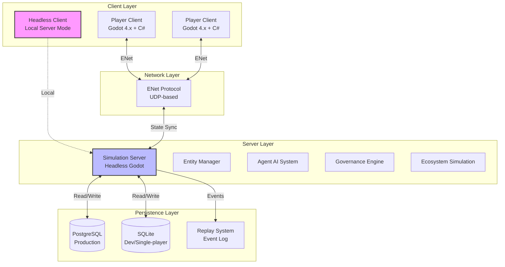
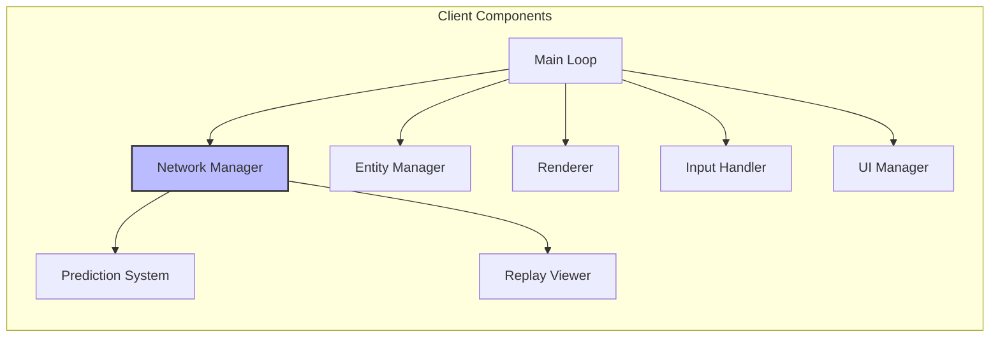
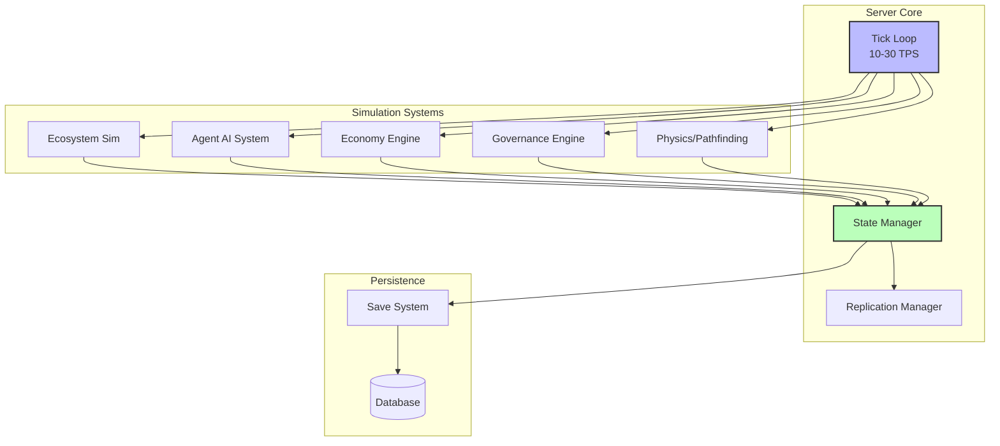
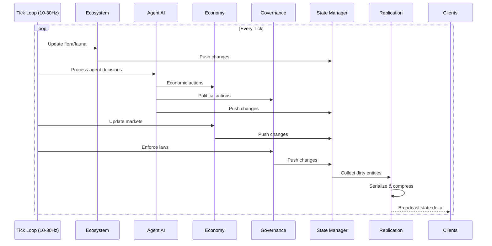
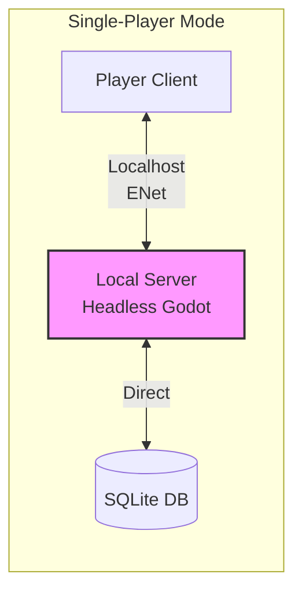
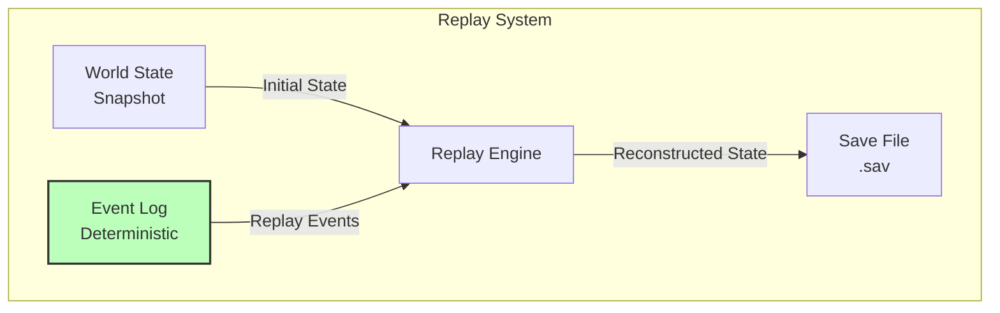
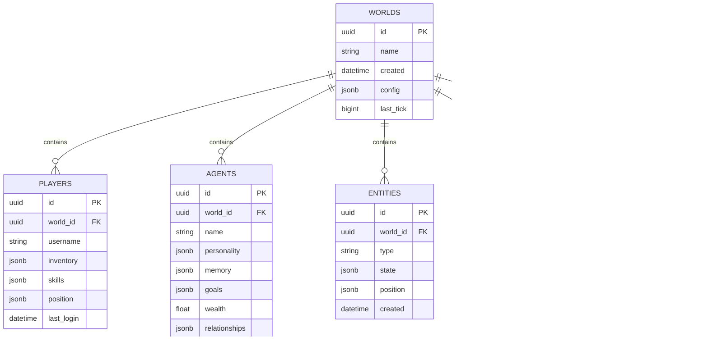
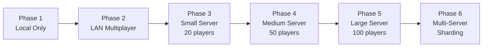

# Day 1: Technical Architecture - Deep Planning Document

**Planning Day**: 1 of 7  
**Status**: Draft  
**Last Updated**: Day 0 (Template Created)

---

## Purpose

Define the technical foundation that makes Societies possible. This document establishes the system architecture, performance budgets, technology stack decisions, and technical risk assessment for a multiplayer ecosystem simulation game built in Godot 4.x with C#.

---

## Key Questions Addressed

1. What's the overall system architecture (client/server, database, simulation engine)?
2. How do we handle continuous simulation (even when no players online)?
3. What are the performance constraints (world size, agent count, tick rate)?
4. How does offline mode work? (Single-player = local server)
5. What's the save/replay system architecture?
6. What are the hard technical limitations we must design within?

---

## Dependencies

- **Requires**: Comprehensive game design document (societies-comprehensive-breakdown.md)
- **Informs**: Day 2 (AI System Design), Day 6 (Prototyping Roadmap), Day 7 (Master Plan)

---

## 1. System Architecture Overview

### High-Level Architecture



### Architecture Principles

1. **Server-Authoritative**: All simulation logic runs on server; clients are dumb terminals with prediction
2. **Offline = Local Server**: Single-player mode runs headless server locally (no separate code path)
3. **Continuous Simulation**: World evolves even without players (time acceleration possible)
4. **Deterministic Simulation**: Reproducible results for debugging and replay system

---

## 2. Client Architecture

### Godot Client Structure



### Key Client Responsibilities

- **Network Manager**: ENet connection, RPC handling, state interpolation
- **Entity Manager**: Local entity cache, interpolation between server states
- **Prediction System**: Client-side prediction for player actions (compensate for latency)
- **Renderer**: Visual representation (low-poly 3D)
- **UI Manager**: All user interfaces (inventory, crafting, governance, data visualization)
- **Replay Viewer**: Load and replay saved world states

---

## 3. Server Architecture

### Headless Godot Server



### Server Tick Loop



### Tick Rate Strategy

- **Target**: 20 ticks/second (50ms per tick)
- **Variable**: Can scale down to 10 TPS during low activity, up to 30 TPS during events
- **Time Scaling**: Simulation can run faster than real-time when no players present

---

## 4. Offline Mode Architecture

### Single-Player = Local Server



### Offline Mode Features

- **Seamless Transition**: Same code paths, just localhost connection
- **Pause Capability**: Can pause simulation when player opens menu (optional setting)
- **Time Acceleration**: Can speed up simulation when player is offline (configurable)
- **SQLite Backend**: Lightweight, file-based database
- **Export/Import**: Can export single-player world to multiplayer server

---

## 5. Save/Replay System

### Event-Sourced Architecture



### Save System Design

1. **Periodic Snapshots**: Full world state saved every 15 minutes
2. **Event Log**: All deterministic events logged between snapshots
3. **Replay Capability**: Can reconstruct any point in time by loading snapshot + replaying events
4. **Debug Tool**: Replays enable debugging ("What happened at tick 1847293?")
5. **Branching Worlds**: Can fork world at any point (save as new world)

### Replay Use Cases

- **Debugging**: See exactly what led to a bug
- **Analysis**: Study agent behavior over time
- **Recovery**: Roll back to before catastrophic event
- **Content Creation**: Create timelapses of world evolution

---

## 6. Database Architecture

### PostgreSQL Schema (Production)



### Database Strategy

- **JSONB Columns**: Flexible schema for entity/agent data
- **Time-Series Data**: Separate tables for metrics (performance optimization)
- **Event Log**: Immutable append-only log for replay system
- **Indexing**: Heavy indexing on world_id, entity type, position (spatial queries)

---

## 7. Performance Budgets

### Target Specifications

| Metric | MVP Target | Stretch Goal |
|--------|-----------|--------------|
| World Size | 0.5 km² | 4 km² |
| Max Agents (AI) | 100 | 200 |
| Max Players | 20 | 100 |
| Total Entities | 5,000 | 20,000 |
| Server Tick Rate | 20 TPS | 30 TPS |
| Client FPS | 60 FPS | 144 FPS |
| Memory (Server) | 4 GB | 8 GB |
| Network (per player) | 50 KB/s | 100 KB/s |

### Performance Optimization Strategies

1. **Spatial Partitioning**: Grid-based entity culling
2. **LOD System**: Simplified simulation for distant entities
3. **Dirty Tracking**: Only sync changed entities
4. **Delta Compression**: Compress state updates
5. **Tick Budgeting**: Priority system for agent processing
6. **Batching**: Group similar operations

---

## 8. Technology Stack Decision

### Confirmed Stack

| Component | Technology | Rationale |
|-----------|-----------|-----------|
| **Game Engine** | Godot 4.x + C# | Free, lightweight, excellent multiplayer support |
| **Networking** | ENet (Godot native) | UDP-based, low latency, built-in RPC |
| **Server OS** | Linux (Ubuntu) | Stable, headless Godot support |
| **Database** | PostgreSQL | Complex relational data, JSON support |
| **Dev Database** | SQLite | Local testing, single-player mode |
| **Version Control** | Git + GitHub | Collaboration, documentation hosting |
| **CI/CD** | GitHub Actions | Automated builds, testing |
| **Unit Testing** | xUnit | Industry standard .NET testing framework |
| **Integration Testing** | xUnit + Testcontainers | Database and service integration tests |
| **Mocking** | Moq or NSubstitute | Interface-based unit testing |
| **Godot Testing** | Godot.XUnit | Headless Godot scene testing |

### Godot Multiplayer Features

- **MultiplayerAPI**: Built-in RPC system
- **Scene Replication**: Automatic state synchronization
- **ENet**: Fast UDP networking
- **Headless Mode**: Dedicated server capability
- **C# Support**: Full .NET integration

---

## 8.5 Testing Architecture

### Testing Philosophy

Our testing strategy follows these principles:
- **Test everything reasonably testable**: Focus on business logic, database operations, and critical paths
- **CI/CD integration from day one**: Automated testing on every commit
- **Dual database testing**: Both PostgreSQL and SQLite tested in CI pipeline
- **Network testing planned**: Deferred to later prototypes but architected for testability

### Testing Technology Stack

| Component | Technology | Rationale |
|-----------|-----------|-----------|
| **Unit Testing** | xUnit | Industry standard for .NET, excellent Godot C# support |
| **Integration Testing** | xUnit + Testcontainers | Production database parity in tests |
| **Mocking** | Moq or NSubstitute | Interface-based testing for network/database layers |
| **Godot Testing** | Godot.XUnit | Headless scene testing (future implementation) |
| **Test Runner** | `dotnet test` | Standard .NET CLI integration |
| **CI/CD** | GitHub Actions | Automated test execution on PR/push |

### Test Project Structure

```
tests/
├── Societies.Core.Tests/          # Unit tests for pure C# logic
│   ├── Entities/
│   │   └── EntityTests.cs
│   ├── Economy/
│   │   └── MarketTests.cs
│   ├── Database/
│   │   └── RepositoryTests.cs
│   └── Governance/
│       └── LawTests.cs
├── Societies.Integration.Tests/   # Integration tests
│   ├── PostgreSQL/
│   │   └── PostgreSQLTests.cs
│   ├── SQLite/
│   │   └── SQLiteTests.cs
│   └── SaveLoad/
│       └── SaveSystemTests.cs
└── Societies.Godot.Tests/         # Godot-specific tests (future)
    └── SceneTests.cs
```

### Code Organization for Testability

**Architecture Pattern**: Separate business logic from Godot dependencies

```csharp
// Testable: Pure C# business logic
public class EconomyCalculator {
    public decimal CalculateTax(decimal income, TaxBracket bracket) {
        // Pure logic, easily tested
    }
}

// Godot wrapper: Thin layer, minimal logic
public partial class EconomyManager : Node {
    private EconomyCalculator _calculator = new();
    
    public void ApplyTaxes() {
        // Call calculator, handle Godot-specific stuff
    }
}
```

**Benefits**:
- 80%+ of code in testable libraries
- Godot scripts reduced to coordination glue
- Fast unit tests (<100ms each)
- Godot tests only for UI/scene validation

### Database Testing Strategy

**PostgreSQL Testing**:
- Use Testcontainers for production database parity
- Spin up PostgreSQL in Docker for each test run
- Test schema migrations, transactions, concurrency
- Validate JSONB operations and spatial queries

**SQLite Testing**:
- In-memory database for fast unit tests
- File-based SQLite for integration tests
- Verify single-player mode operations
- Test export/import between SQLite and PostgreSQL

**Example Database Test**:
```csharp
[Fact]
public async Task SaveWorldState_PersistsToDatabase() {
    // Arrange
    var world = new World { Name = "Test World" };
    var repository = new WorldRepository(_dbContext);
    
    // Act
    await repository.SaveAsync(world);
    var retrieved = await repository.GetByIdAsync(world.Id);
    
    // Assert
    Assert.NotNull(retrieved);
    Assert.Equal("Test World", retrieved.Name);
}
```

### Godot Testing Strategy

**Headless Testing**:
```bash
# Run Godot in headless mode for CI
godot --headless --script tests/run_tests.cs
```

**Testing Approaches**:

1. **Pure C# Tests** (Primary):
   - Test all business logic outside Godot
   - Fast, reliable, no scene loading overhead
   - 90% of test coverage here

2. **Godot.XUnit Tests** (Secondary):
   - Test Node lifecycle and scene interactions
   - Validate RPC networking in controlled environment
   - UI component testing

3. **Integration Tests** (Full Stack):
   - End-to-end scenarios with real Godot instances
   - Localhost multiplayer testing
   - Save/load roundtrip validation

**Godot-Specific Test Example**:
```csharp
public class EntityNodeTests {
    [Fact]
    public void EntityNode_SynchronizesPosition() {
        // Arrange
        var entityNode = new EntityNode();
        var testPosition = new Vector3(10, 0, 20);
        
        // Act
        entityNode.Position = testPosition;
        
        // Assert
        Assert.Equal(testPosition, entityNode.Position);
    }
}
```

**Limitations & Workarounds**:
- Scene tree requires Godot runtime → Use headless mode
- Visual/UI testing difficult → Focus on state/logic testing
- Multiplayer requires network → Mock `INetworkManager` for unit tests

### Network Testing Strategy

**Interface-Based Design**:
```csharp
public interface INetworkManager {
    event Action<PlayerId> PlayerConnected;
    event Action<PlayerId> PlayerDisconnected;
    Task SendRpc(PlayerId target, string method, params object[] args);
}

// Real implementation for production
public class ENetNetworkManager : Node, INetworkManager { ... }

// Mock implementation for testing
public class MockNetworkManager : INetworkManager { ... }
```

**Testing Layers**:

1. **Unit Tests** (Mock-based):
   - Test logic that depends on networking
   - Verify RPC calls are made correctly
   - Fast, no actual network required

2. **Integration Tests** (Loopback):
   - Test real ENet connections on 127.0.0.1
   - Validate serialization/deserialization
   - Measure latency under controlled conditions

3. **Load Tests** (Future):
   - Docker-based multi-client simulation
   - Test with 20+ concurrent connections
   - Stress test with packet loss/latency injection

**Deferred Network Testing**:
- Full multiplayer stress tests: Month 3+ (Prototype 2 validation)
- Latency simulation: Month 4+ (when core systems stable)
- Production-like testing: Alpha phase (Month 6)

### CI/CD Integration (GitHub Actions)

**Workflow Overview**:
- **Trigger**: Every PR and push to `main`
- **Matrix**: Windows + Linux (macOS optional)
- **Databases**: PostgreSQL service container + SQLite
- **Steps**: Build → Unit Tests → Integration Tests → Coverage Report

**Sample Workflow** (see `.github/workflows/tests.yml` for full implementation):

```yaml
name: Tests
on: [push, pull_request]
jobs:
  test:
    runs-on: ${{ matrix.os }}
    strategy:
      matrix:
        os: [ubuntu-latest, windows-latest]
    services:
      postgres:
        image: postgres:15
        env:
          POSTGRES_PASSWORD: test
    steps:
      - uses: actions/checkout@v4
      - uses: actions/setup-dotnet@v4
        with:
          dotnet-version: '6.0'
      - run: dotnet test --configuration Release
```

**Pipeline Gates**:
- All unit tests must pass (zero tolerance)
- Integration tests must pass
- Code coverage minimum: 70% (initial), 80% (Alpha)
- Build must succeed on both platforms

### Testing Timeline by Prototype

| Prototype | Testing Focus | Coverage Target |
|-----------|--------------|-----------------|
| **Proto 1** (World) | Entity system, database ops, save/load | 50% |
| **Proto 2** (AI) | AI behavior, economy calculations | 60% |
| **Proto 3** (Governance) | Law system, voting logic | 70% |
| **Proto 4** (Progression) | Tech tree, skill system | 75% |
| **Proto 5** (Environment) | Pollution simulation, ecosystem | 75% |
| **Alpha** (Integration) | Full system integration, E2E | 80% |

### What Gets Tested vs. Deferred

**Tested Now**:
- Entity CRUD operations
- Economy calculations (pricing, taxes)
- Governance rules and law execution
- Database operations (both PostgreSQL and SQLite)
- Save/load serialization
- Utility functions and helpers

**Deferred**:
- Full multiplayer synchronization (Month 3+)
- Complex AI behavior validation (Month 2+)
- UI/UX flows (manual testing initially)
- Performance/stress tests (Alpha phase)
- Visual regression tests (Post-launch)

### Testing Best Practices

1. **Test Behavior, Not Implementation**: Test what code does, not how it does it
2. **One Assert Per Test**: Single concept per test method
3. **Arrange-Act-Assert**: Clear structure in every test
4. **Descriptive Names**: Test names should read like documentation
5. **Fast Tests**: Unit tests should complete in <100ms
6. **Isolated Tests**: No dependencies between tests
7. **Production Data**: Use realistic test data, not just "foo" and "bar"

### Example Test Patterns

**Entity Test**:
```csharp
public class EntityTests {
    [Fact]
    public void Entity_WithPosition_IsWithinWorldBounds() {
        // Arrange
        var world = new World(width: 100, height: 100);
        var entity = new Entity(world, x: 50, y: 50);
        
        // Act & Assert
        Assert.True(world.IsWithinBounds(entity.Position));
    }
    
    [Fact]
    public void Entity_MovesToPosition_UpdatesCoordinates() {
        // Arrange
        var entity = new Entity { Position = new Vector3(0, 0, 0) };
        var newPosition = new Vector3(10, 0, 10);
        
        // Act
        entity.MoveTo(newPosition);
        
        // Assert
        Assert.Equal(newPosition, entity.Position);
    }
}
```

**Economy Test**:
```csharp
public class MarketTests {
    [Theory]
    [InlineData(100, 0.10, 10)]  // 10% tax on 100 = 10
    [InlineData(50, 0.20, 10)]   // 20% tax on 50 = 10
    [InlineData(0, 0.10, 0)]     // No tax on zero
    public void CalculateTax_ReturnsCorrectAmount(
        decimal income, decimal rate, decimal expected) {
        // Arrange
        var calculator = new TaxCalculator();
        
        // Act
        var result = calculator.Calculate(income, rate);
        
        // Assert
        Assert.Equal(expected, result);
    }
}
```

### Test Data Management

**Test Fixtures**:
- Reusable world states for different scenarios
- Pre-configured agents with specific personalities
- Mock economies with known supply/demand
- Deterministic random seeds for reproducible tests

**Factories**:
```csharp
public static class TestDataFactory {
    public static World CreateTestWorld(int width = 100, int height = 100) {
        return new World {
            Width = width,
            Height = height,
            Seed = 12345 // Deterministic
        };
    }
    
    public static Agent CreateAgentWithWealth(decimal wealth) {
        return new Agent {
            Name = "Test Agent",
            Wealth = wealth,
            Personality = TestPersonalities.Average()
        };
    }
}
```

### Coverage Goals

| Phase | Line Coverage | Branch Coverage | Test Count |
|-------|--------------|-----------------|------------|
| Week 2 (Setup) | 0% → 30% | 0% → 20% | 10-20 |
| Proto 1 Complete | 50% | 40% | 50-100 |
| Proto 2 Complete | 60% | 50% | 100-200 |
| Alpha | 80% | 70% | 500+ |
| Beta | 85% | 75% | 1000+ |

---

## 9. Scalability Strategy

### Growth Path



### MVP Scope (Month 1-3)

- Single world per server
- 100 AI agents max
- 20 concurrent players
- 0.5 km² world
- SQLite or local PostgreSQL

### Scaling Decisions

- **What's Hardcoded**: Tick rate (configurable), world size constants
- **What's Configurable**: Agent count, player limit, simulation speed
- **Sharding Strategy**: Geographic regions (future consideration)

---

## 10. Technical Risk Assessment

### Top 5 Technical Risks

| Rank | Risk | Probability | Impact | Mitigation |
|------|------|-------------|--------|------------|
| 1 | **AI Performance** | High | Critical | Aggressive LOD, tick budgeting, behavior simplification |
| 2 | **Multiplayer Sync** | Medium | Critical | Deterministic simulation, state reconciliation |
| 3 | **Memory Usage** | Medium | High | Object pooling, aggressive cleanup, profiling early |
| 4 | **Database Performance** | Medium | Medium | Caching layer, read replicas, optimization |
| 5 | **Godot Limitations** | Low | High | Active community, source available, fallback strategies |

### Prototyping Needs

1. **Agent Stress Test**: 200+ agents, measure performance
2. **Network Sync Test**: 20 players, measure latency/desync
3. **Database Load Test**: Simulate high write load
4. **Godot Headless Server**: Validate dedicated server performance

---

## 11. Open Questions & Future Research

### Unresolved Technical Questions

- [ ] What's the actual CPU cost per AI agent?
- [ ] How much network bandwidth does ENet use under load?
- [ ] Can Godot handle 5000+ entities efficiently?
- [ ] What's the optimal spatial partitioning grid size?
- [ ] How much memory does PostgreSQL use for world state?
- [ ] What's the test execution time impact on development velocity?
- [ ] How much code coverage is realistic for Godot C# projects?
- [ ] Can we achieve <5 minute CI builds with full test suite?
- [ ] What's the performance overhead of Testcontainers for PostgreSQL?
- [ ] How testable is Godot.Node-based code in practice?
- [ ] What's the optimal balance between unit and integration tests?
- [ ] How do we test non-deterministic AI behavior?
- [ ] What's the cost of maintaining test data fixtures?
- [ ] How do we test multiplayer synchronization without real clients?

### Research Needed

- [ ] Godot 4.x multiplayer best practices
- [ ] ENet optimization techniques
- [ ] PostgreSQL JSONB performance patterns
- [ ] Deterministic simulation techniques (lockstep vs. state sync)
- [ ] Replay system implementations in other games

---

## 12. Decisions Log

| Date | Decision | Rationale |
|------|----------|-----------|
| Day 0 | Use Godot 4.x + C# | Free, excellent multiplayer, familiar |
| Day 0 | Use ENet networking | Native Godot support, UDP performance |
| Day 0 | PostgreSQL for production | Complex relational data, proven at scale |
| Day 0 | SQLite for dev/single-player | Zero setup, file-based, portable |
| Day 0 | Offline = local server | No code duplication, seamless transition |
| Day 0 | Event-sourced saves | Replay capability, debugging, branching |
| Day 0 | xUnit for .NET testing | Industry standard, Godot-compatible, rich ecosystem |
| Day 0 | Testcontainers for PostgreSQL testing | Production database parity, isolated test environments |
| Day 0 | Separate business logic from Godot | Maximizes testable code percentage, enables fast unit tests |
| Day 0 | Interface-based network design | Enables mocking for unit tests, testable architecture |
| Day 0 | CI/CD testing from day one | Prevents technical debt, ensures quality from start |
| Day 0 | Dual database testing (PostgreSQL + SQLite) | Validates both production and single-player modes |

---

## 13. Cross-References

### Documents Referenced
- `planning/meta/societies-comprehensive-breakdown.md` - Core game design
- `planning/meta/societies-meta-planning.md` - Planning methodology

### Documents to Update
- `day6-prototyping-roadmap.md` - Include technical prototypes and testing milestones
- `day7-master-development-plan.md` - Architecture dependencies, Week 2 testing setup tasks
- `.github/workflows/tests.yml` - CI/CD workflow implementation (see Section 8.5)

---

## Success Criteria

- [ ] Clear technology stack chosen with rationale
- [ ] System architecture diagram complete
- [ ] Performance targets defined
- [ ] Technical risks identified and prioritized
- [ ] Prototype needs identified
- [ ] Offline mode architecture defined
- [ ] Save/replay system designed
- [ ] Database schema outlined
- [ ] Testing architecture defined with technology choices
- [ ] Test project structure documented
- [ ] CI/CD testing strategy specified
- [ ] Database testing approach (PostgreSQL + SQLite) documented
- [ ] Godot testing strategy with workarounds
- [ ] Network testing plan (deferred but architected)
- [ ] Testing timeline by prototype phase

---

**Status**: TEMPLATE - Ready for Day 1 Planning
