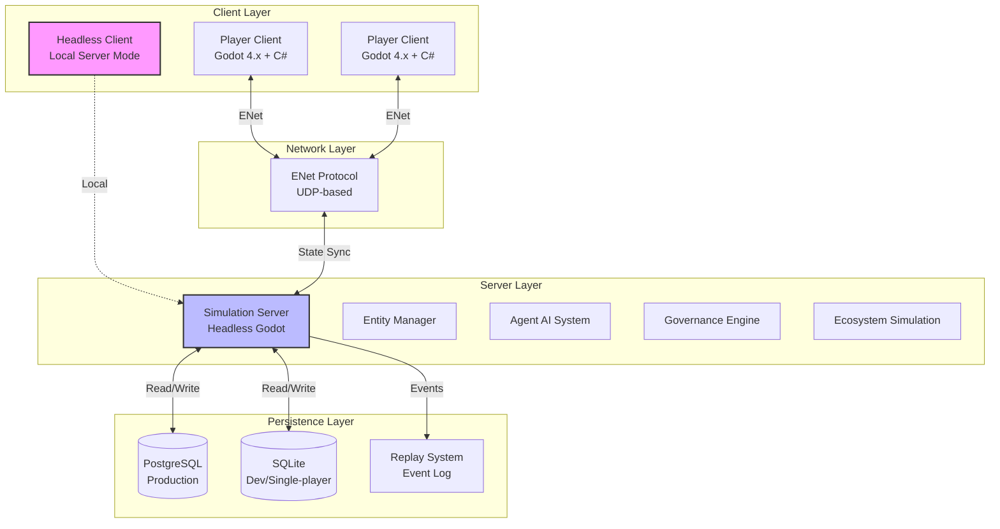
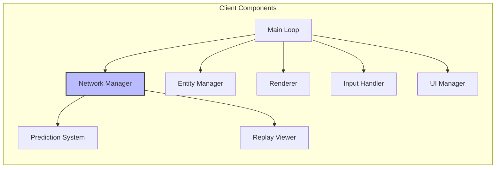
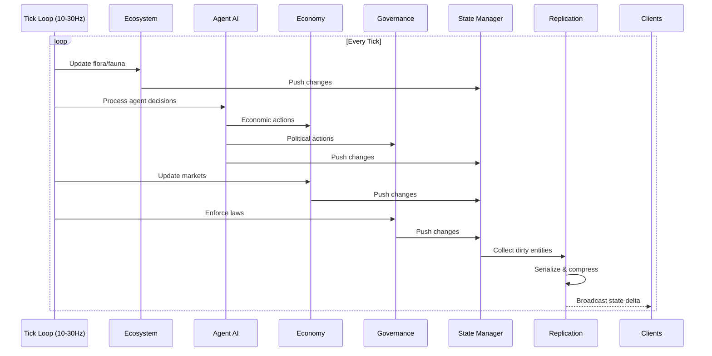
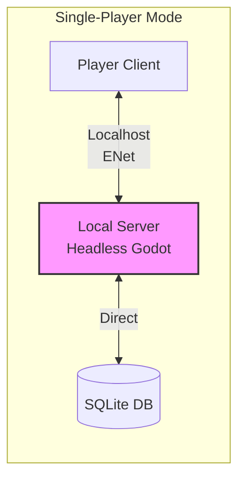
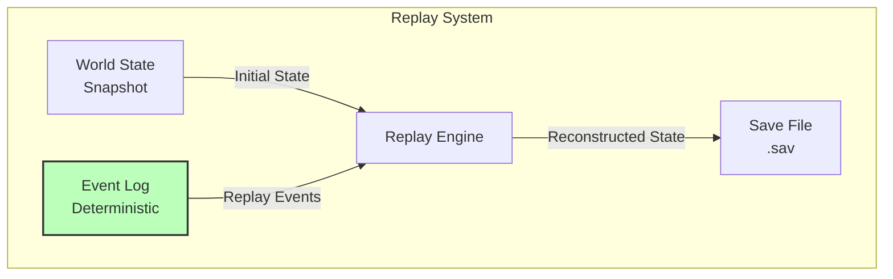
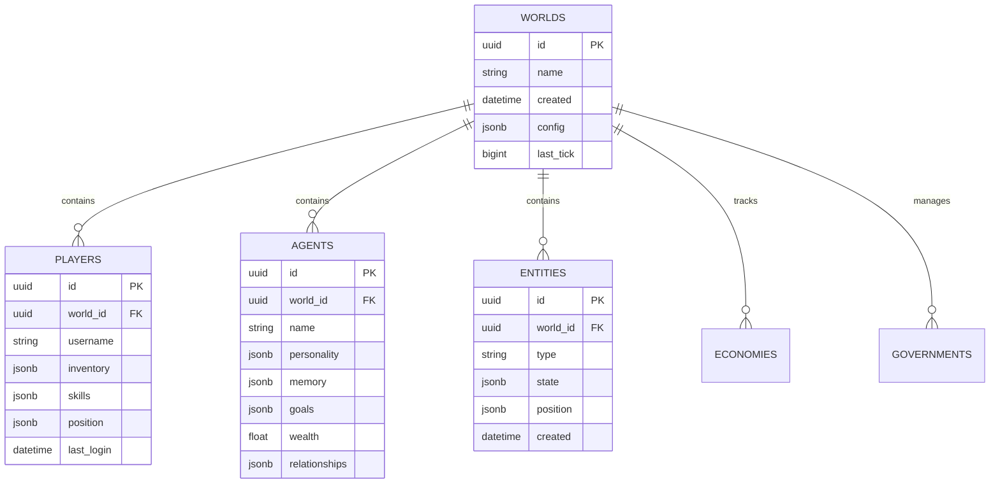
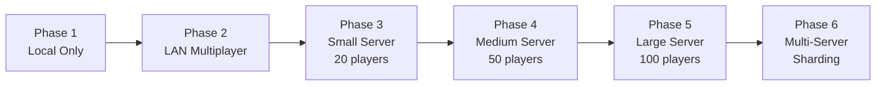

# Day 1: Technical Architecture - Deep Planning Document

**Planning Day**: 1 of 7  
**Status**: Draft  
**Last Updated**: Day 0 (Template Created)

---

## Purpose

Define the technical foundation that makes Societies possible. This document establishes the system architecture, performance budgets, technology stack decisions, and technical risk assessment for a multiplayer ecosystem simulation game built in Godot 4.x with C#.

---

## Key Questions Addressed

1. What's the overall system architecture (client/server, database, simulation engine)?
2. How do we handle continuous simulation (even when no players online)?
3. What are the performance constraints (world size, agent count, tick rate)?
4. How does offline mode work? (Single-player = local server)
5. What's the save/replay system architecture?
6. What are the hard technical limitations we must design within?

---

## Dependencies

- **Requires**: Comprehensive game design document (societies-comprehensive-breakdown.md)
- **Informs**: Day 2 (AI System Design), Day 6 (Prototyping Roadmap), Day 7 (Master Plan)

---

## 1. System Architecture Overview

### High-Level Architecture

### Architecture Principles

1. **Server-Authoritative**: All simulation logic runs on server; clients are dumb terminals with prediction
2. **Offline = Local Server**: Single-player mode runs headless server locally (no separate code path)
3. **Continuous Simulation**: World evolves even without players (time acceleration possible)
4. **Deterministic Simulation**: Reproducible results for debugging and replay system

---

## 2. Client Architecture

### Godot Client Structure

### Key Client Responsibilities

- **Network Manager**: ENet connection, RPC handling, state interpolation
- **Entity Manager**: Local entity cache, interpolation between server states
- **Prediction System**: Client-side prediction for player actions (compensate for latency)
- **Renderer**: Visual representation (low-poly 3D)
- **UI Manager**: All user interfaces (inventory, crafting, governance, data visualization)
- **Replay Viewer**: Load and replay saved world states

---

## 3. Server Architecture

### Headless Godot Server

```mermaid
graph TB
    subgraph "Server Core"
        TL[Tick Loop<br/>10-30 TPS]
        SM[State Manager]
        RM[Replication Manager]
    end

    subgraph "Simulation Systems"
        ES[Ecosystem Sim]
        AS[Agent AI System]
        EC[Economy Engine]
        GV[Governance Engine]
        PH[Physics/Pathfinding]
    end

    subgraph "Persistence"
        DB[(Database)]
        SS[Save System]
    end

    TL --> ES
    TL --> AS
    TL --> EC
    TL --> GV
    TL --> PH
    
    ES --> SM
    AS --> SM
    EC --> SM
    GV --> SM
    PH --> SM
    
    SM --> RM
    SM --> SS
    SS --> DB
    
    style TL fill:#bbf,stroke:#333,stroke-width:2px
    style SM fill:#bfb,stroke:#333,stroke-width:2px
```

### Server Tick Loop

### Tick Rate Strategy

- **Target**: 20 ticks/second (50ms per tick)
- **Variable**: Can scale down to 10 TPS during low activity, up to 30 TPS during events
- **Time Scaling**: Simulation can run faster than real-time when no players present

---

## 4. Offline Mode Architecture

### Single-Player = Local Server

### Offline Mode Features

- **Seamless Transition**: Same code paths, just localhost connection
- **Pause Capability**: Can pause simulation when player opens menu (optional setting)
- **Time Acceleration**: Can speed up simulation when player is offline (configurable)
- **SQLite Backend**: Lightweight, file-based database
- **Export/Import**: Can export single-player world to multiplayer server

---

## 5. Save/Replay System

### Event-Sourced Architecture

### Save System Design

1. **Periodic Snapshots**: Full world state saved every 15 minutes
2. **Event Log**: All deterministic events logged between snapshots
3. **Replay Capability**: Can reconstruct any point in time by loading snapshot + replaying events
4. **Debug Tool**: Replays enable debugging ("What happened at tick 1847293?")
5. **Branching Worlds**: Can fork world at any point (save as new world)

### Replay Use Cases

- **Debugging**: See exactly what led to a bug
- **Analysis**: Study agent behavior over time
- **Recovery**: Roll back to before catastrophic event
- **Content Creation**: Create timelapses of world evolution

---

## 6. Database Architecture

### PostgreSQL Schema (Production)

### Database Strategy

- **JSONB Columns**: Flexible schema for entity/agent data
- **Time-Series Data**: Separate tables for metrics (performance optimization)
- **Event Log**: Immutable append-only log for replay system
- **Indexing**: Heavy indexing on world_id, entity type, position (spatial queries)

---

## 7. Performance Budgets

### Target Specifications

| Metric | MVP Target | Stretch Goal |
|--------|-----------|--------------|
| World Size | 0.5 km² | 4 km² |
| Max Agents (AI) | 100 | 200 |
| Max Players | 20 | 100 |
| Total Entities | 5,000 | 20,000 |
| Server Tick Rate | 20 TPS | 30 TPS |
| Client FPS | 60 FPS | 144 FPS |
| Memory (Server) | 4 GB | 8 GB |
| Network (per player) | 50 KB/s | 100 KB/s |

### Performance Optimization Strategies

1. **Spatial Partitioning**: Grid-based entity culling
2. **LOD System**: Simplified simulation for distant entities
3. **Dirty Tracking**: Only sync changed entities
4. **Delta Compression**: Compress state updates
5. **Tick Budgeting**: Priority system for agent processing
6. **Batching**: Group similar operations

---

## 8. Technology Stack Decision

### Confirmed Stack

| Component | Technology | Rationale |
|-----------|-----------|-----------|
| **Game Engine** | Godot 4.x + C# | Free, lightweight, excellent multiplayer support |
| **Networking** | ENet (Godot native) | UDP-based, low latency, built-in RPC |
| **Server OS** | Linux (Ubuntu) | Stable, headless Godot support |
| **Database** | PostgreSQL | Complex relational data, JSON support |
| **Dev Database** | SQLite | Local testing, single-player mode |
| **Version Control** | Git + GitHub | Collaboration, documentation hosting |
| **CI/CD** | GitHub Actions | Automated builds, testing |

### Godot Multiplayer Features

- **MultiplayerAPI**: Built-in RPC system
- **Scene Replication**: Automatic state synchronization
- **ENet**: Fast UDP networking
- **Headless Mode**: Dedicated server capability
- **C# Support**: Full .NET integration

---

## 9. Scalability Strategy

### Growth Path

### MVP Scope (Month 1-3)

- Single world per server
- 100 AI agents max
- 20 concurrent players
- 0.5 km² world
- SQLite or local PostgreSQL

### Scaling Decisions

- **What's Hardcoded**: Tick rate (configurable), world size constants
- **What's Configurable**: Agent count, player limit, simulation speed
- **Sharding Strategy**: Geographic regions (future consideration)

---

## 10. Technical Risk Assessment

### Top 5 Technical Risks

| Rank | Risk | Probability | Impact | Mitigation |
|------|------|-------------|--------|------------|
| 1 | **AI Performance** | High | Critical | Aggressive LOD, tick budgeting, behavior simplification |
| 2 | **Multiplayer Sync** | Medium | Critical | Deterministic simulation, state reconciliation |
| 3 | **Memory Usage** | Medium | High | Object pooling, aggressive cleanup, profiling early |
| 4 | **Database Performance** | Medium | Medium | Caching layer, read replicas, optimization |
| 5 | **Godot Limitations** | Low | High | Active community, source available, fallback strategies |

### Prototyping Needs

1. **Agent Stress Test**: 200+ agents, measure performance
2. **Network Sync Test**: 20 players, measure latency/desync
3. **Database Load Test**: Simulate high write load
4. **Godot Headless Server**: Validate dedicated server performance

---

## 11. Open Questions & Future Research

### Unresolved Technical Questions

- [ ] What's the actual CPU cost per AI agent?
- [ ] How much network bandwidth does ENet use under load?
- [ ] Can Godot handle 5000+ entities efficiently?
- [ ] What's the optimal spatial partitioning grid size?
- [ ] How much memory does PostgreSQL use for world state?

### Research Needed

- [ ] Godot 4.x multiplayer best practices
- [ ] ENet optimization techniques
- [ ] PostgreSQL JSONB performance patterns
- [ ] Deterministic simulation techniques (lockstep vs. state sync)
- [ ] Replay system implementations in other games

---

## 12. Decisions Log

| Date | Decision | Rationale |
|------|----------|-----------|
| Day 0 | Use Godot 4.x + C# | Free, excellent multiplayer, familiar |
| Day 0 | Use ENet networking | Native Godot support, UDP performance |
| Day 0 | PostgreSQL for production | Complex relational data, proven at scale |
| Day 0 | SQLite for dev/single-player | Zero setup, file-based, portable |
| Day 0 | Offline = local server | No code duplication, seamless transition |
| Day 0 | Event-sourced saves | Replay capability, debugging, branching |

---

## 13. Cross-References

### Documents Referenced
- `planning/meta/societies-comprehensive-breakdown.md` - Core game design
- `planning/meta/societies-meta-planning.md` - Planning methodology

### Documents to Update
- `day6-prototyping-roadmap.md` - Include technical prototypes
- `day7-master-development-plan.md` - Architecture dependencies

---

## Success Criteria

- [ ] Clear technology stack chosen with rationale
- [ ] System architecture diagram complete
- [ ] Performance targets defined
- [ ] Technical risks identified and prioritized
- [ ] Prototype needs identified
- [ ] Offline mode architecture defined
- [ ] Save/replay system designed
- [ ] Database schema outlined

---

**Status**: TEMPLATE - Ready for Day 1 Planning
