# Day 2: AI System Design - Deep Planning Document

**Planning Day**: 2 of 7  
**Status**: Draft  
**Last Updated**: Day 0 (Template Created)

---

## Purpose

Specify how AI agents think, decide, and behave to create believable citizens. This document defines the AI architecture, decision-making processes, memory systems, and experimental brain configurations that make AI agents feel authentic rather than robotic.

---

## Key Questions Addressed

1. What's the AI decision-making architecture?
2. How do agents form goals and prioritize actions?
3. How do agents learn, remember, and form relationships?
4. How do we handle AI voting and political behavior?
5. How does the AI population elasticity system work?
6. What makes AI behavior feel authentic rather than robotic?
7. How do players learn about AI lives? (Emergent narrative)
8. How do we debug AI decisions? (Debuggability)

---

## Dependencies

- **Requires**: Day 1 (Technical Architecture) - Performance budgets, tick loop
- **Informs**: Day 3 (Gameplay Loops), Day 5 (Governance), Day 6 (Prototyping)

---

## 1. AI Agent Architecture

### Core Decision Loop

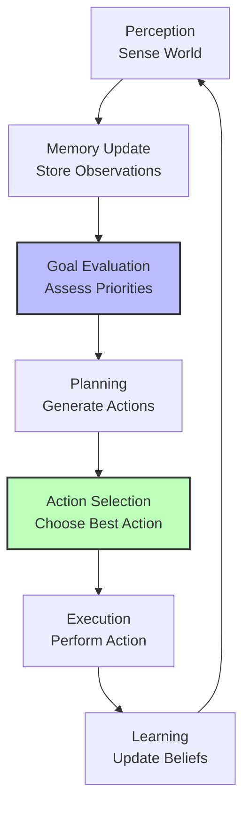

### Agent State Structure

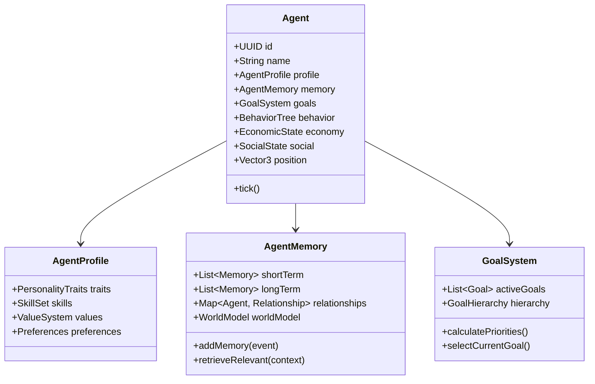

### Tick Processing

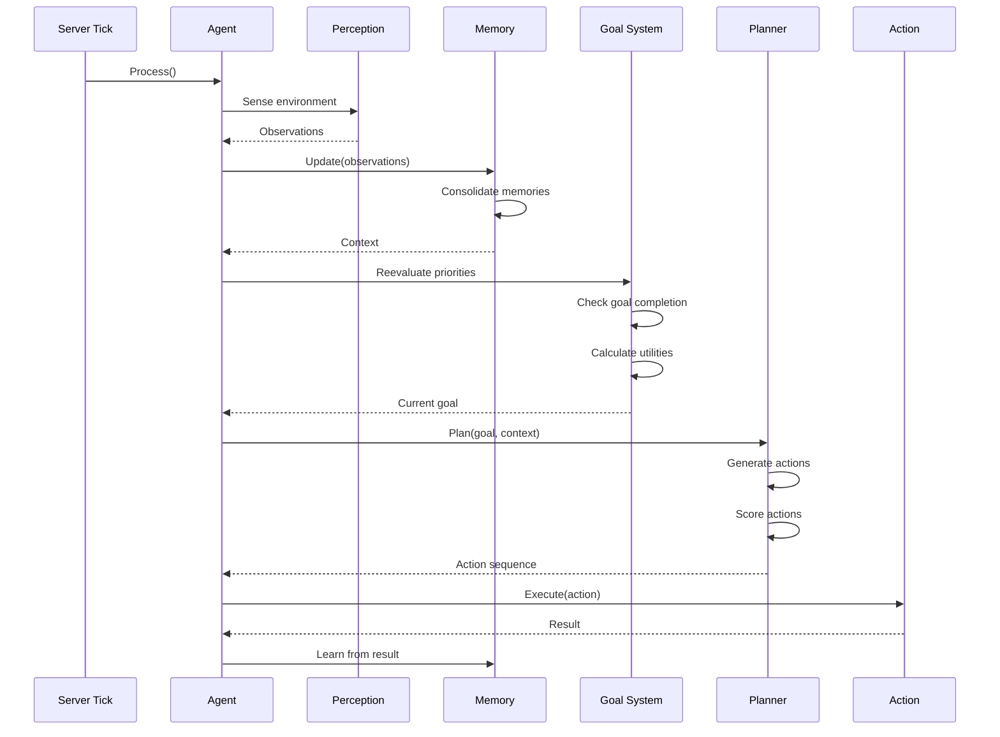

---

## 2. Goal System Architecture

### Goal Hierarchy

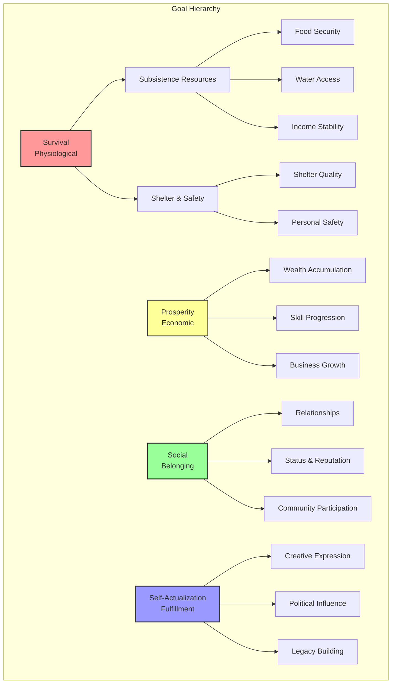

### Goal Priority Calculation

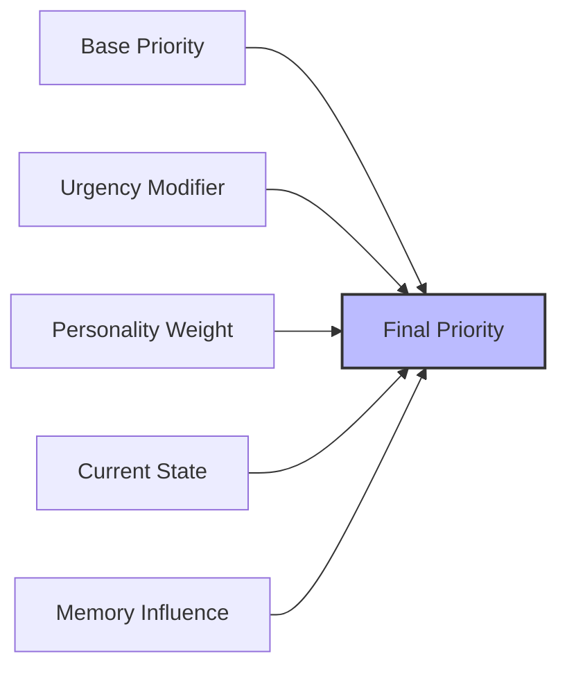

**Factors in Priority**:
1. **Base Priority**: Maslow hierarchy weight
2. **Urgency**: Time pressure (starving > comfortable)
3. **Personality**: Individual goal preferences
4. **Current State**: What's already satisfied
5. **Memory**: Past experiences ("Last time I ignored hunger...")

---

## 3. Agent Memory System

### Memory Architecture

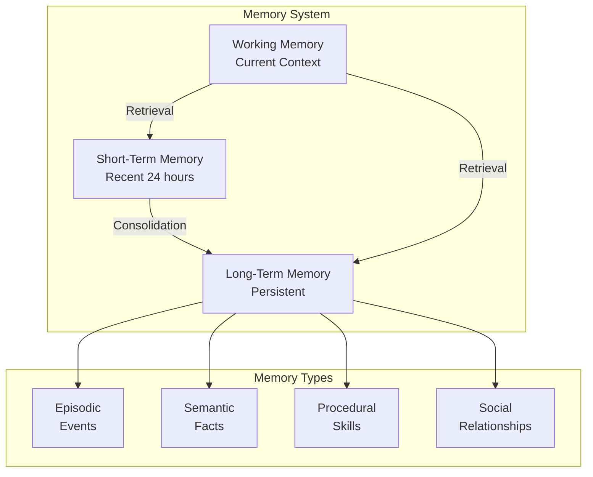

### Memory Data Structure

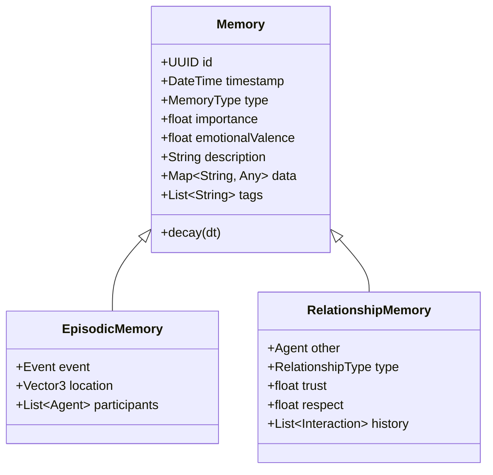

### What Agents Remember

**Short-Term (24 hours)**:
- Recent conversations
- Current transactions
- Immediate threats/opportunities
- Active plans

**Long-Term (Persistent)**:
- Major life events
- Traumatic experiences
- Successful strategies
- Relationship histories
- World facts (prices, locations, laws)

**Decay Mechanics**:
- Unimportant memories fade
- Emotional memories persist longer
- Accessed memories strengthen
- Contradicting memories update beliefs

---

## 4. Economic Behavior Model

### Price Belief Formation

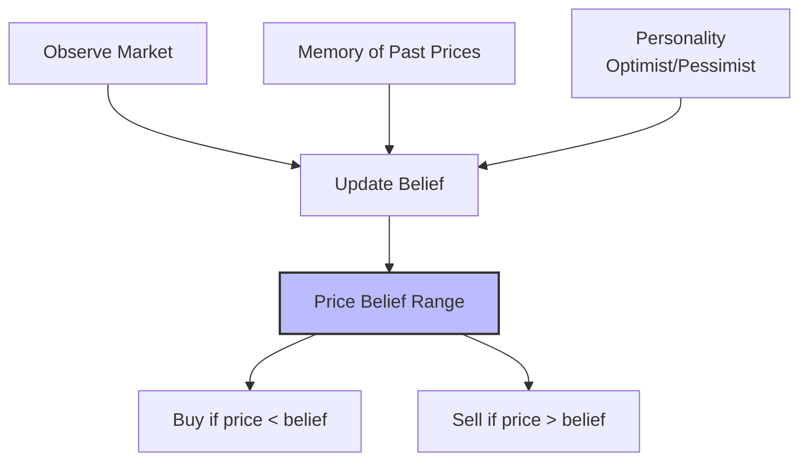

**Price Belief Formula**:
```
Belief = (ObservedPrices * WeightRecent) + (MemoryPrices * WeightPast) + PersonalityBias
Range = MinPrice to MaxPrice (with uncertainty)
```

### Trading Strategy

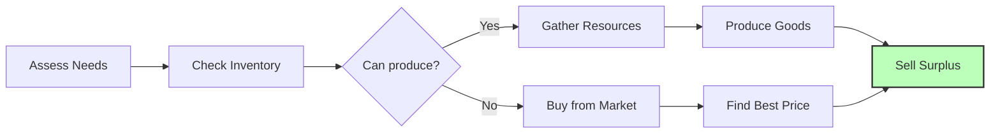

### Career Specialization Decision

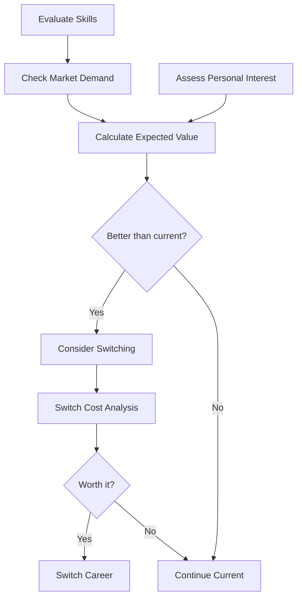

---

## 5. Political Behavior Model

### Voting Decision Process

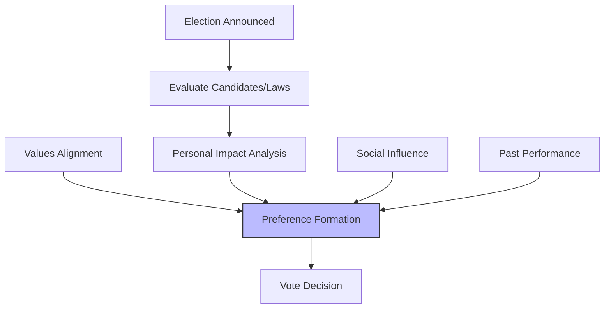

**Voting Factors**:
1. **Personal Impact**: How does this affect my wealth/survival?
2. **Values Alignment**: Does this match my ideology?
3. **Social Influence**: What do trusted friends think?
4. **Past Performance**: Track record of candidates
5. **Information Quality**: How much do I know?

### Faction Formation

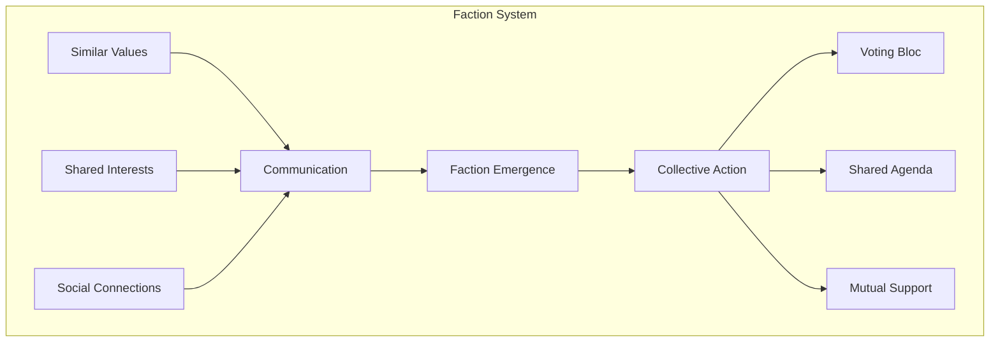

---

## 6. Social Behavior Model

### Relationship Formation

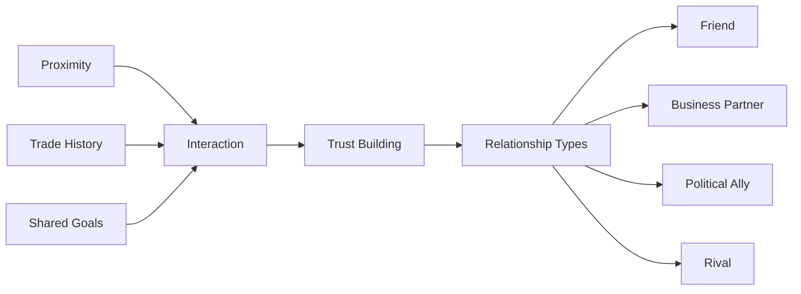

### Migration Decision

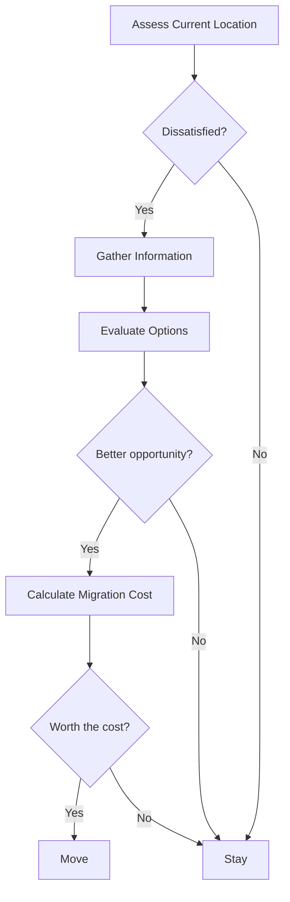

---

## 7. Population Elasticity System

### Elasticity Architecture

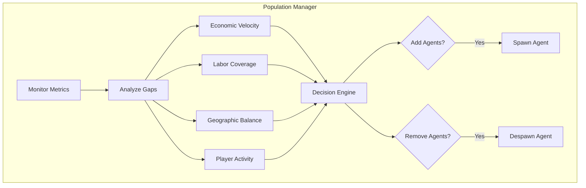

### Elasticity Triggers

| Metric | Low (Add Agents) | High (Reduce Agents) |
|--------|-----------------|---------------------|
| Economic Velocity | < 50% baseline | > 150% baseline |
| Labor Gaps | Critical roles empty | Human coverage good |
| Player Activity | Very low | High engagement |
| Geographic Balance | Abandoned regions | Well-distributed |

### Agent Lifecycle

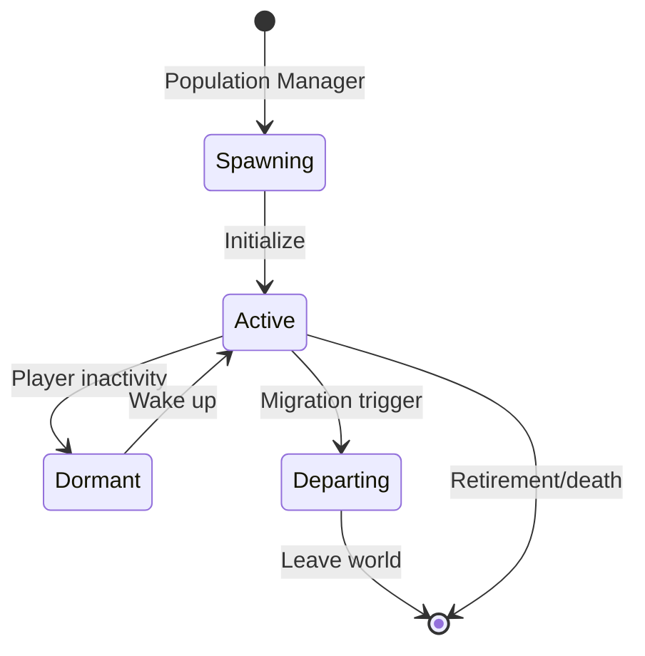

---

## 8. Personality & Diversity System

### Personality Model

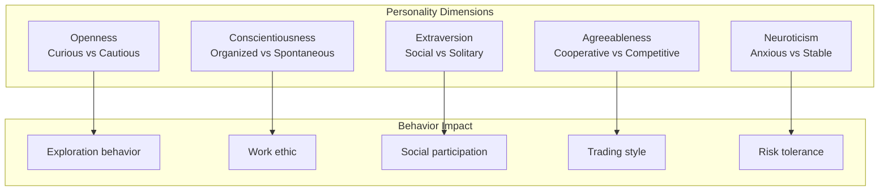

### Value Diversity

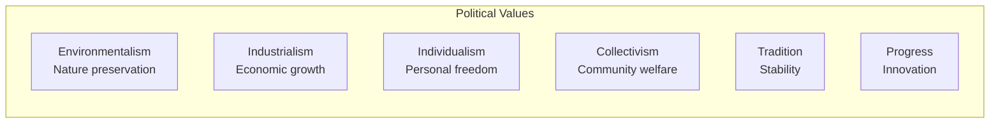

---

## 9. Emergent Narrative System

### How Players Learn About AI Lives

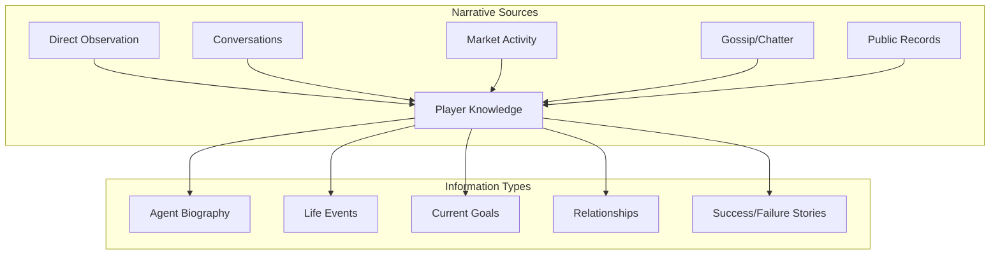

### Narrative Mechanics

**Direct Observation**:
- See agents working, building, trading
- Visual indicators of agent state (busy, idle, traveling)
- Overhead icons for notable activities

**Information UI**:
- "Agent Directory" - browse known agents
- "Life Stories" - notable agent biographies
- "Relationship Map" - social network visualization
- "Event Log" - significant agent actions

**Gossip System**:
- Agents share information with players
- News travels through social network
- Reputation based on information accuracy

**Public Records**:
- Census data, economic participation
- Political voting history (if public)
- Criminal records (if exists)
- Achievement/business registry

---

## 10. AI Debuggability Architecture

### Decision Tracing System

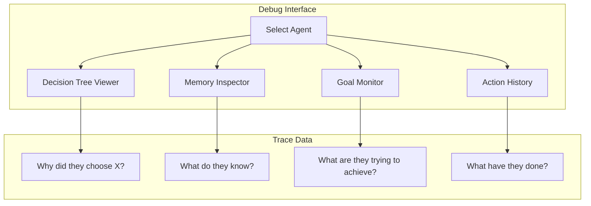

### Debug Features

**Decision Tree Viewer**:
- Visualize agent's current decision tree
- See scores for alternative actions
- Understand why an action was chosen

**Memory Inspector**:
- Browse agent's memory (short & long term)
- See memory importance scores
- View memory influence on current decisions

**Goal Monitor**:
- Current goal hierarchy
- Priority calculations
- Goal completion progress

**Action History**:
- Timeline of recent actions
- Success/failure outcomes
- Resource changes

**Simulation Replay**:
- Step through agent's past decisions
- See what they perceived
- Understand why they acted

### Debug UI Mockup

```
┌─────────────────────────────────────┐
│ Agent: Sarah the Farmer             │
├─────────────────────────────────────┤
│ [Overview] [Goals] [Memory] [Debug] │
├─────────────────────────────────────┤
│ Current Goal: Find Food (Urgency:   │
│ 8.5/10)                             │
│                                     │
│ Decision Trace:                     │
│ ├─ Goal: Find Food                  │
│ ├─ Options Considered:              │
│ │  ├─ Buy Bread (Score: 7.2)        │
│ │  ├─ Harvest Crops (Score: 6.8)    │
│ │  └─ Hunt (Score: 4.1)             │
│ └─ Selected: Buy Bread              │
│    ├─ Reason: Closest vendor        │
│    ├─ Price: Affordable             │
│    └─ Memory: Good past experience  │
└─────────────────────────────────────┘
```

---

## 11. Experimental Brain Configurations

### Configuration Variants

| Config | Rationality | Social Complexity | Goal Diversity | Information |
|--------|-------------|-------------------|----------------|-------------|
| **Realistic** | Bounded | High | High | Imperfect |
| **Optimal** | High | Low | Low | Perfect |
| **Chaotic** | Low | Medium | High | Imperfect |
| **Cooperative** | Medium | High | Low | Shared |

### Testing Metrics

- **Economic Efficiency**: Market clearing speed
- **Social Stability**: Conflict frequency
- **Political Engagement**: Voting participation
- **Player Satisfaction**: Survey results
- **Emergent Behavior**: Interesting events/minute

---

## 12. Open Questions & Future Research

### Unresolved Questions

- [ ] What's the computational cost of different brain configurations?
- [ ] How many memories can an agent have before performance degrades?
- [ ] What's the optimal tick budget per agent?
- [ ] How do we prevent "AI hive mind" behavior?
- [ ] What's the right balance of agent autonomy vs. story coherence?

### Research Needs

- [ ] Utility AI vs. GOAP vs. Behavior Trees for economic agents
- [ ] Memory consolidation algorithms
- [ ] Social simulation in games (academic research)
- [ ] Emergent narrative generation techniques
- [ ] AI debugging best practices

---

## 13. Decisions Log

| Date | Decision | Rationale |
|------|----------|-----------|
| Day 0 | Utility-based goals | Flexible, handles competing priorities |
| Day 0 | Episodic memory model | Creates believable, context-aware behavior |
| Day 0 | Price belief system | Realistic economic behavior, emergent dynamics |
| Day 0 | Faction formation | Emergent politics, no hardcoded parties |
| Day 0 | Multiple brain configs | Test what creates best player experience |

---

## Success Criteria

- [ ] Clear AI decision-making architecture
- [ ] Economic behavior model specified
- [ ] Political behavior model specified
- [ ] Population elasticity algorithm defined
- [ ] Personality/diversity system designed
- [ ] Experimental configurations outlined
- [ ] Emergent narrative system designed
- [ ] Debuggability architecture specified

---

**Status**: TEMPLATE - Ready for Day 2 Planning
