# Day 3: Core Gameplay Loops - Deep Planning Document

**Planning Day**: 3 of 7  
**Status**: Draft  
**Last Updated**: Day 0 (Template Created)

---

## Purpose

Define what players actually *do* moment-to-moment, hour-to-hour, session-to-session. This document maps the complete player experience across different time scales and player archetypes.

---

## Key Questions Addressed

1. What does a typical 15-minute play session look like?
2. What does a 2-hour session look like?
3. What does week 1 vs. week 4 feel like?
4. How do different player types experience the game?
5. What makes logging in tomorrow compelling?
6. What's fun moment-to-moment vs. satisfying long-term?

---

## Dependencies

- **Requires**: Day 2 (AI System Design) - Agent behavior informs player interactions
- **Informs**: Day 4 (Progression), Day 5 (Governance UX), Day 6 (Prototype scope)

---

## 1. Moment-to-Moment Gameplay (5-15 minutes)

### Core Activity Loop

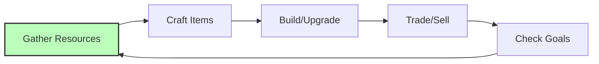

### Gathering Resources

**Activities**:
- Chop trees (wood)
- Mine stone/ore (minerals)
- Harvest plants (food, fiber)
- Hunt animals (meat, hides)
- Fish (food)
- Collect water

**Feedback Loops**:
- Resource counter increases
- Tool durability decreases (maintenance loop)
- Skill XP gain (progression)
- Inventory management decisions

**Fun Factors**:
- Visual/audio feedback (satisfying chop sounds)
- Resource rarity (excitement finding rare ore)
- Efficiency optimization (better tools = faster)

### Crafting Items

**Activities**:
- Open crafting menu
- Select recipe
- Ensure materials available
- Craft item
- Quality/variance based on skill

**Feedback Loops**:
- Inventory changes
- Skill XP gain
- New capabilities unlocked
- Quality rating (pride in workmanship)

### Building Structures

**Activities**:
- Select building type
- Place foundation
- Add materials progressively
- See construction progress
- Finished structure provides benefit

**Satisfaction Sources**:
- Visual transformation (empty lot → house)
- Functional benefit (shelter, storage)
- Aesthetic expression (design choices)
- Permanent impact on world

---

## 2. Session Gameplay (30 minutes - 2 hours)

### Session Arc Flow

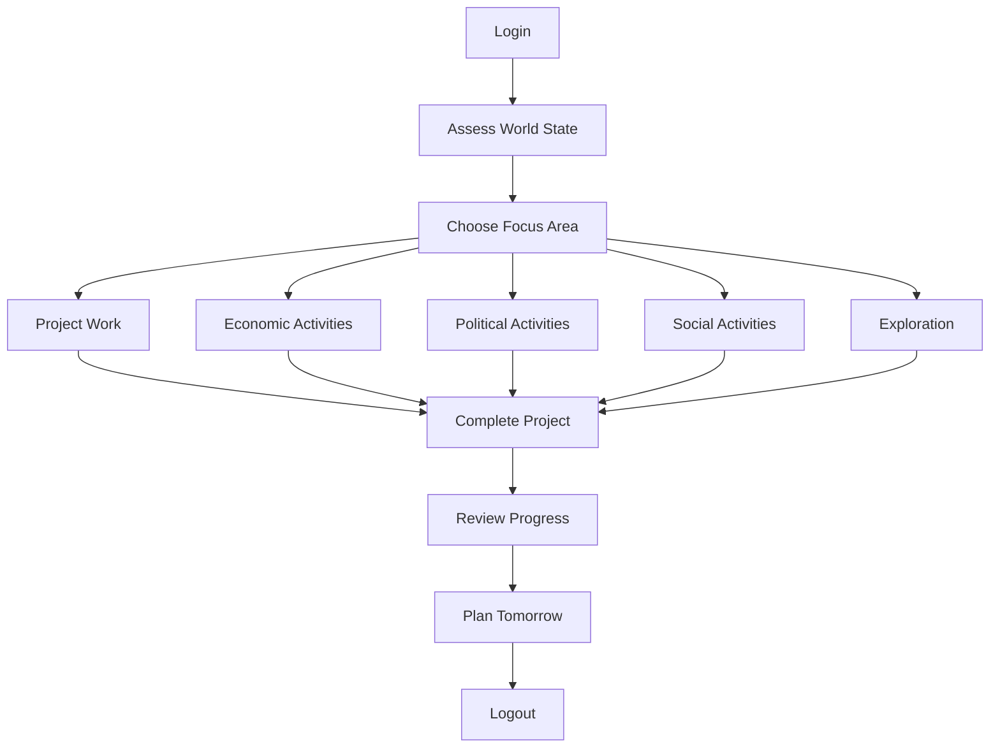

### Project-Based Gameplay

**Example: Build a Workshop**

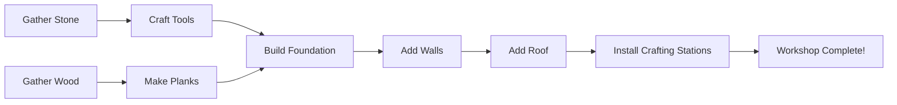

**Session Distribution**:
- Small project: 15-30 minutes (craft better tools)
- Medium project: 1-2 hours (build workshop)
- Large project: Multiple sessions (build town center)

### Economic Activities

**Running a Store**:
1. Check inventory levels
2. Set prices based on market
3. Open store for business
4. AI/human customers visit
5. Manage stock, adjust prices
6. Close up, count profits

**Fulfilling Contracts**:
1. Browse contract board
2. Accept delivery contract
3. Gather/produce required items
4. Deliver to recipient
5. Receive payment + reputation

### Political Activities

**Proposing a Law**:
1. Identify problem/need
2. Draft law (with UI help)
3. Gather support (campaign)
4. Proposal submitted
5. Voting period (24-48 hours)
6. Result announced
7. If passed: Law enacted

**Campaigning**:
- Talk to AI agents about issues
- Post announcements
- Participate in debates
- Build coalition

---

## 3. Multi-Session Arcs (Days to Weeks)

### Week 1: Foundation

```mermaid
gantt
    title Week 1 Player Journey
    dateFormat  X
    axisFormat %d
    
    section Survival
    Basic Shelter       :a1, 0, 2
    Food Security       :a2, 1, 3
    Tool Creation       :a3, 2, 4
    
    section Discovery
    Explore Area        :b1, 2, 5
    Meet Neighbors      :b2, 3, 6
    Find Resources      :b3, 4, 7
    
    section Specialization
    Choose Career       :c1, 5, 7
    Skill Development   :c2, 6, 7
```

**Week 1 Feel**: Overwhelming but exciting. Learning systems. Meeting neighbors. Basic survival achieved.

### Week 2: Community

**Activities**:
- Join/form neighborhood
- Begin specialization
- First trades with AI
- Basic infrastructure (paths, shared storage)
- Participate in first election

**Week 2 Feel**: Social connections form. Economic specialization begins. First political experiences.

### Week 3: Industry

**Activities**:
- Town formation (if 3+ players)
- Industrial production begins
- First laws enacted
- Meteor preparation awareness
- Skill mastery in chosen path

**Week 3 Feel**: Collaborative projects. Governance complexity. Urgency building.

### Week 4: Crisis & Advancement

**Activities**:
- Meteor preparation (if day 30 approaching)
- Advanced technology unlocked
- Complex political situations
- Environmental challenges emerge
- Long-term planning required

**Week 4 Feel**: High stakes. Cooperation essential. Satisfaction from progress.

---

## 4. Player Archetypes & Their Loops

### The Builder

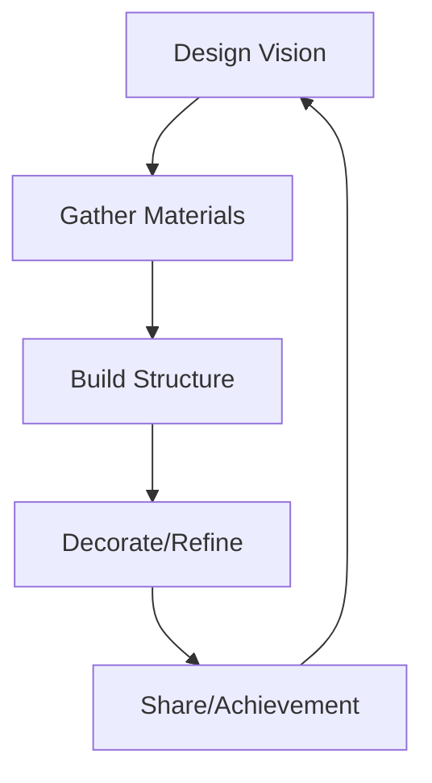

**Core Loop**: Design → Build → Admire → Share
**Session Goals**: Complete construction projects
**Multi-Session**: Megaprojects, town design
**Motivation**: Aesthetic expression, permanent impact

### The Economist

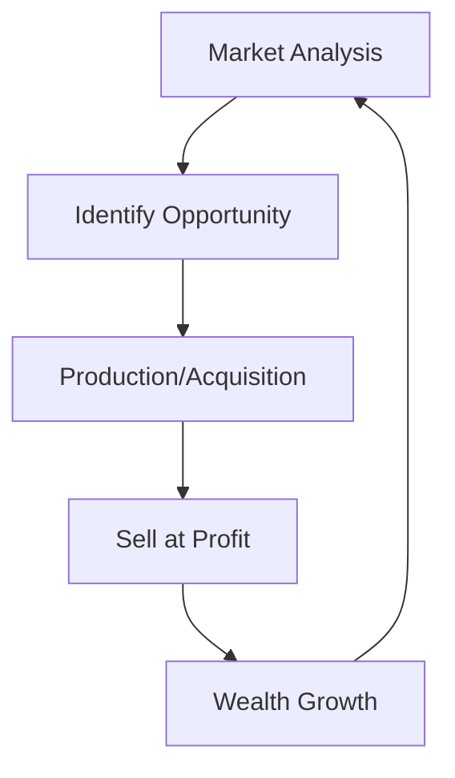

**Core Loop**: Analyze → Produce → Trade → Profit
**Session Goals**: Execute trades, optimize supply chains
**Multi-Session**: Build business empire, corner markets
**Motivation**: Optimization, wealth accumulation

### The Politician

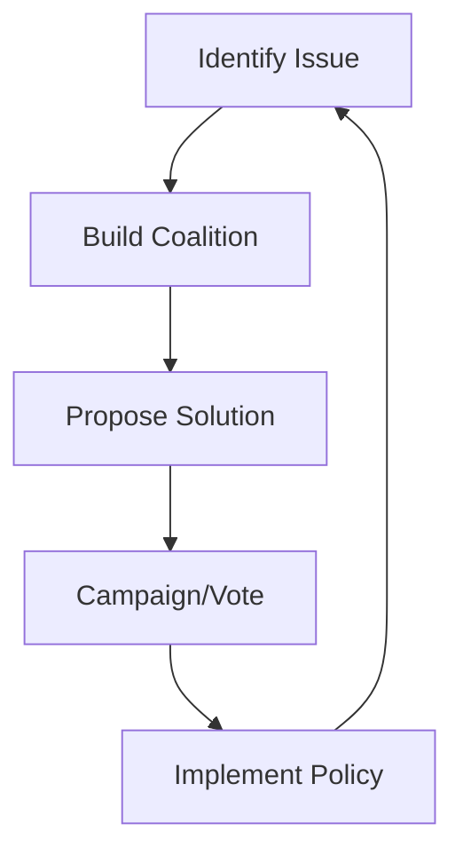

**Core Loop**: Observe → Organize → Propose → Influence
**Session Goals**: Pass legislation, win elections
**Multi-Session**: Rise through government ranks
**Motivation**: Power, social impact, leadership

### The Environmentalist

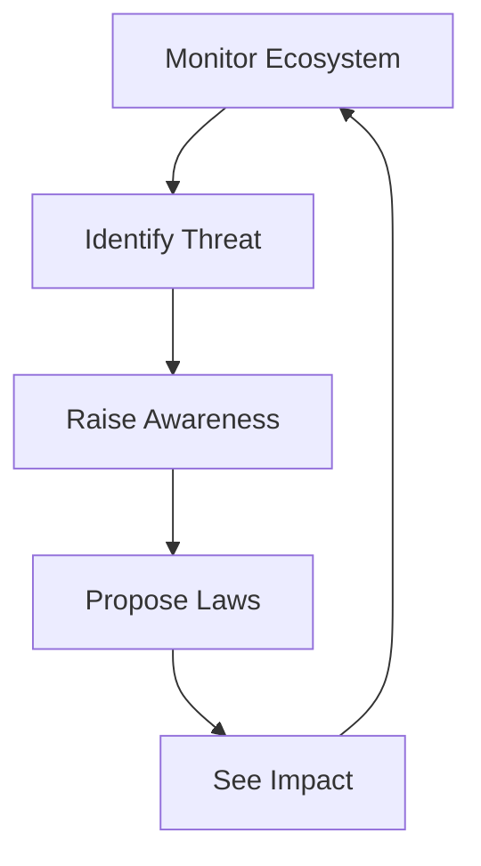

**Core Loop**: Monitor → Alert → Protect → Restore
**Session Goals**: Environmental projects, conservation
**Multi-Session**: Restore damaged ecosystems
**Motivation**: Stewardship, sustainability

### The Engineer

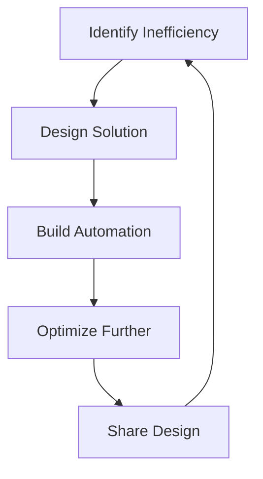

**Core Loop**: Problem → Design → Build → Optimize
**Session Goals**: Create automated systems
**Multi-Session**: Complex infrastructure networks
**Motivation**: Efficiency, problem-solving

### The Socializer

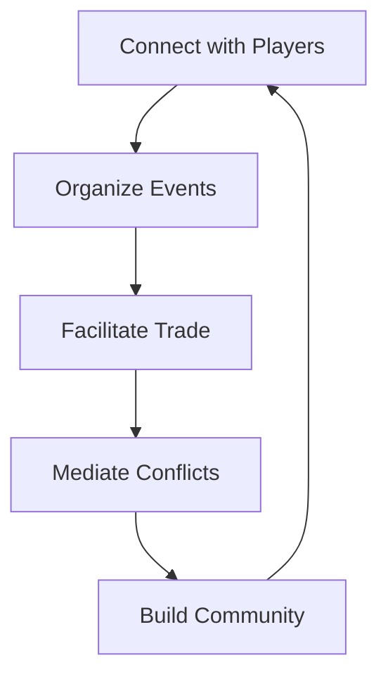

**Core Loop**: Connect → Organize → Facilitate → Unite
**Session Goals**: Social events, community building
**Multi-Session**: Town culture, traditions
**Motivation**: Social bonds, community impact

---

## 5. Progression Feel Over Time

### Experience Timeline

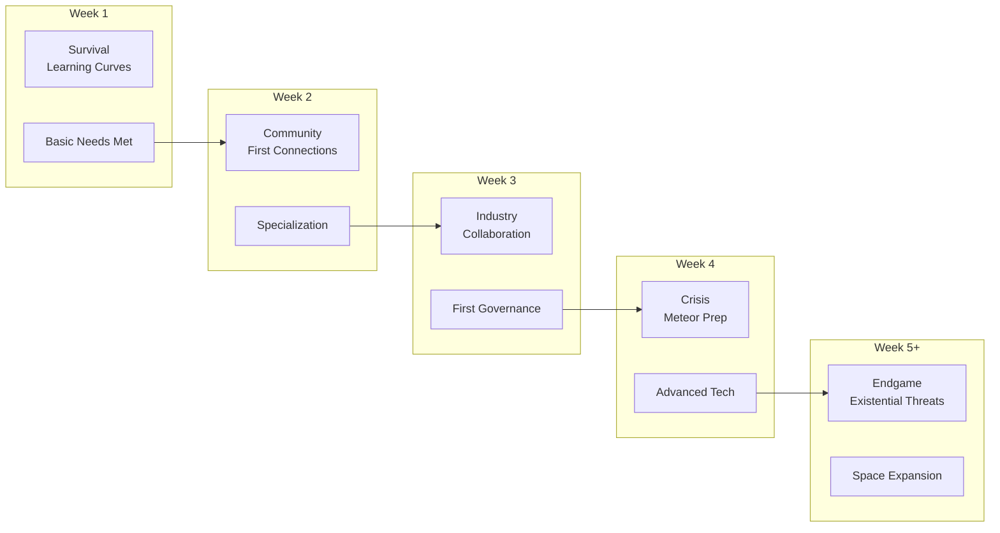

### Emotional Journey

| Week | Primary Emotion | Secondary | Challenge Level |
|------|----------------|-----------|----------------|
| 1 | Curiosity | Anxiety | Medium |
| 2 | Connection | Competition | Medium |
| 3 | Pride | Pressure | High |
| 4 | Urgency | Accomplishment | Very High |
| 5+ | Determination | Legacy | Extreme |

---

## 6. Compelling Return Triggers

### Why Log In Tomorrow?

**In-Progress Projects**:
- Construction in progress (can't wait to see it finished)
- Crops growing (need to harvest)
- Crafting queue (items ready)
- Research completing

**Commitments**:
- Contracts to fulfill (reputation at stake)
- Political obligations (vote coming up)
- Social promises (meeting other players)
- Economic orders (customers waiting)

**Scheduled Events**:
- Elections (vote deadline)
- Town meetings (governance decisions)
- Market openings (trading opportunities)
- Disaster warnings (meteor preparation)

### FOMO (Fear of Missing Out)

**Creates Urgency**:
- Limited-time market opportunities
- Election deadlines
- Event windows (comets, weather)
- Resource scarcity phases

**Balance Needed**: FOMO creates engagement but too much creates anxiety

### Obligation vs. Choice

**Healthy Obligations**:
- Chosen contracts (voluntary commitment)
- Self-set projects (personal goals)
- Social bonds (friends playing)

**Avoid**:
- Mandatory daily tasks (chores)
- Punishment for absence
- FOMO-based manipulation

---

## 7. UI/UX Critical Paths

### Gathering → Crafting → Building

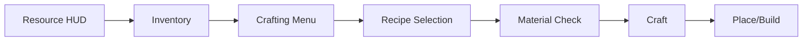

**Key UI Elements**:
- Resource counter (always visible)
- Quick-access crafting
- Build preview
- Progress indicators

### Economic Loop

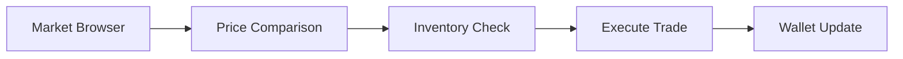

**Key UI Elements**:
- Price history graphs
- Market depth visualization
- Quick-buy/quick-sell
- Contract board

### Governance Loop

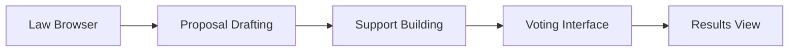

**Key UI Elements**:
- Plain-language law summaries
- Impact prediction
- Voting reminders
- Election countdowns

### Stewardship Loop

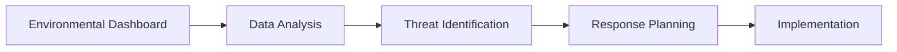

**Key UI Elements**:
- Pollution heat maps
- Population graphs
- Trend indicators
- Alert system

---

## 8. Information Architecture

### What to Show When

| Context | Priority Information | Secondary |
|---------|---------------------|-----------|
| **General Play** | Resources, Health, Current Goal | Weather, Time, Notifications |
| **Trading** | Prices, Inventory, Wallet | Market trends, Recent trades |
| **Building** | Materials needed, Preview | Durability, Skill bonuses |
| **Governance** | Active votes, Laws, Support | Historical data, Projections |
| **Crisis** | Time remaining, Preparation % | Resource locations, Team status |

### Notification Strategy

**Critical** (Immediate popup + sound):
- Election results
- Contract deadlines
- Disasters
- Direct messages

**Important** (Sidebar notification):
- Market price changes
- Skill level ups
- Project completions
- Law changes

**Background** (Log only):
- Routine agent activities
- Minor economic shifts
- Weather changes

---

## 9. Open Questions & Future Research

### Unresolved Questions

- [ ] What's the optimal session length for different player types?
- [ ] How do we prevent "analysis paralysis" in governance?
- [ ] What's the right balance of solo vs. group activities?
- [ ] How much UI complexity is too much?
- [ ] What creates the strongest "just one more thing" feeling?

### Research Needs

- [ ] Player session analysis from similar games
- [ ] UI/UX patterns in complex simulation games
- [ ] Engagement psychology in persistent worlds
- [ ] Onboarding best practices for complex games

---

## 10. Decisions Log

| Date | Decision | Rationale |
|------|----------|-----------|
| Day 0 | Project-based gameplay | Gives clear goals, sense of accomplishment |
| Day 0 | Multiple archetypes | Different players find different fun |
| Day 0 | Scheduled events | Create natural return triggers |
| Day 0 | Contextual UI | Reduce information overload |

---

## Success Criteria

- [ ] Clear minute-to-minute activity flow
- [ ] Session goals defined for different player types
- [ ] Progression feel articulated across timeline
- [ ] Return triggers identified
- [ ] Critical UI/UX paths mapped
- [ ] Information architecture specified
- [ ] Player archetypes fully defined

---

**Status**: TEMPLATE - Ready for Day 3 Planning
