# Day 5: Governance & Systems Design - Deep Planning Document

**Planning Day**: 5 of 7  
**Status**: Draft  
**Last Updated**: Day 0 (Template Created)

---

## Purpose

Specify the mechanics of laws, government, and social systems in executable detail. This document covers law systems, constitutional design, voting mechanics, and governance UX with a focus on accessibility and preventing tedium.

---

## Key Questions Addressed

1. How do laws actually work in the code?
2. What's the constitutional/government creation UX?
3. How do elections function?
4. How does law enforcement work? (Visibility)
5. What prevents griefing through governance?
6. How do we make politics engaging, not tedious? (Accessibility)
7. What's the progressive complexity of governance?

---

## Dependencies

- **Requires**: Day 2 (AI System) - AI voting behavior, Day 3 (Gameplay) - Political activities
- **Informs**: Day 6 (Prototyping), Day 7 (Master Plan)

---

## 1. Law System Technical Specification

### Law Data Structure

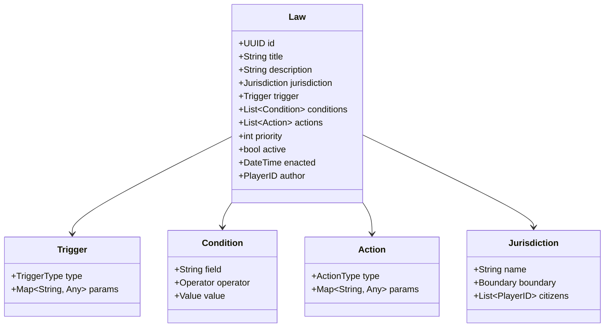

### Law Execution Engine

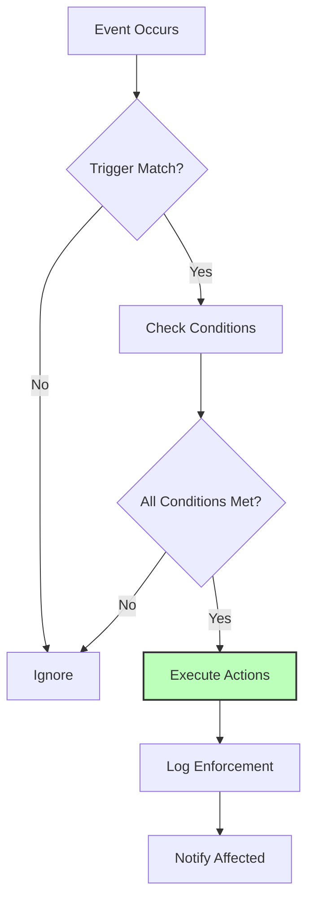

### Law Examples

**"No Hunting in Town Limits"**:
```json
{
  "trigger": "action_attempt",
  "action": "hunt",
  "conditions": [
    {"field": "location", "operator": "within", "value": "town_boundary"}
  ],
  "actions": [
    {"type": "prevent_action"},
    {"type": "fine", "amount": 50}
  ]
}
```

**"Sales Tax on Luxury Goods"**:
```json
{
  "trigger": "transaction_complete",
  "conditions": [
    {"field": "item_category", "operator": "equals", "value": "luxury"}
  ],
  "actions": [
    {"type": "tax", "rate": 0.10, "target": "government_treasury"}
  ]
}
```

### Law Conflicts & Precedence

**Resolution Order**:
1. Explicit priority numbers
2. Specificity (more specific wins)
3. Recency (newer laws win)
4. Jurisdiction level (federal > state > local)

### Performance Optimization

- **Event-driven**: Laws only evaluated on relevant events
- **Indexing**: Laws indexed by trigger type
- **Caching**: Common condition results cached
- **Lazy evaluation**: Stop at first failed condition

---

## 2. Constitutional System

### Constitution Data Structure

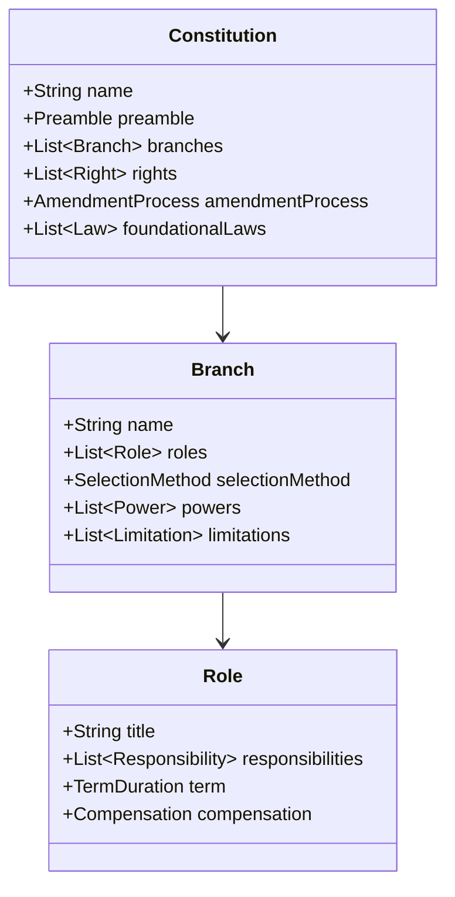

### Constitutional Templates

**Direct Democracy**:


**Representative Democracy**:
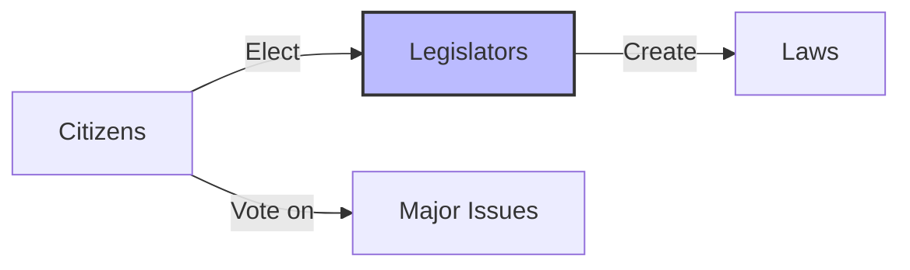

**Council System**:


### Amendment Process

**Difficulty Levels**:
- **Easy**: Simple majority
- **Medium**: Supermajority (60%)
- **Hard**: Supermajority (75%) + waiting period
- **Extreme**: Unanimous

### Constitutional Editor UX

**Template Selection**:
1. Browse templates (visual cards)
2. Preview implications ("In this system...")
3. Customize parameters
4. Review summary
5. Submit for ratification

---

## 3. Election & Voting Mechanics

### Voting UI/UX Flow

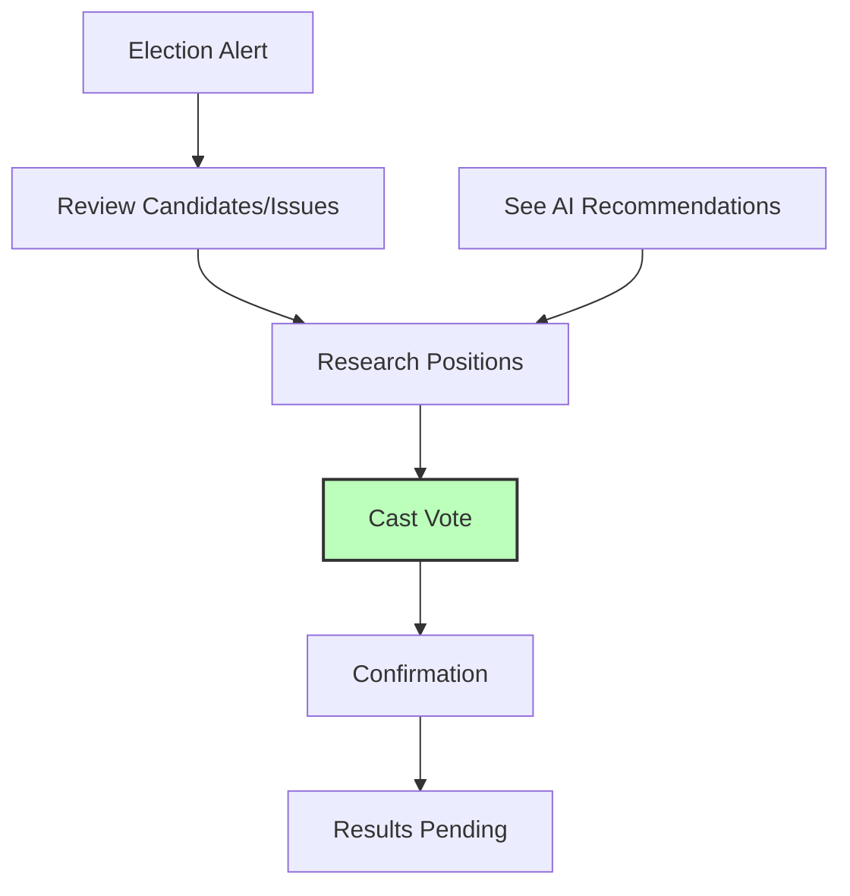

### Vote Counting

**Methods**:
- **Plurality**: Most votes wins
- **Majority**: >50% required (runoff if needed)
- **Ranked Choice**: Instant runoff
- **Approval**: Vote for all acceptable options

**Transparency**:
- Real-time vote tallies (optional privacy)
- Voter verification ("Your vote was counted")
- Audit trail (without compromising anonymity)

### AI Voting Behavior

**Factors** (from Day 2):
- Personal impact of proposal
- Values alignment
- Social influence (what do friends think?)
- Information quality (trust in sources)

**AI Voter Simulation**:
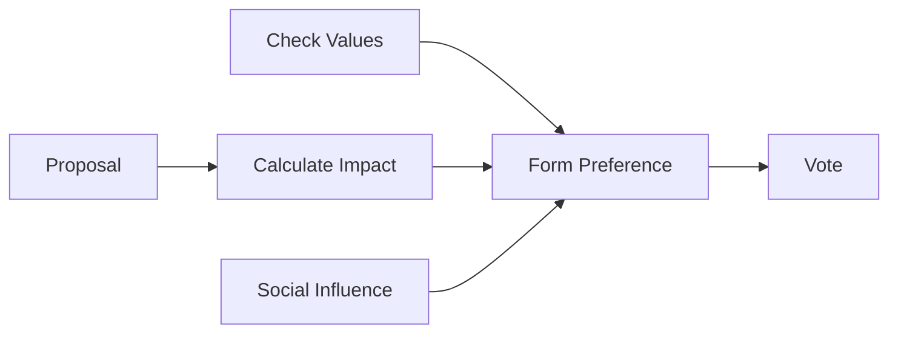

### Election Schedules

**Triggers**:
- **Fixed**: Every X days
- **Term-based**: When official's term expires
- **Event-based**: Crisis elections
- **Recall**: Petition threshold met

---

## 4. Government Types

### Implementation Matrix

| Type | Decision Making | Roles | Best For |
|------|----------------|-------|----------|
| **Direct Democracy** | All vote on all | None | Small groups (<20) |
| **Representative** | Elected legislators | President, Council | Medium groups (20-100) |
| **Council** | Consensus of council | Council members | Collaborative groups |
| **Mayoral** | Mayor decides | Mayor, Advisors | Clear leadership needed |
| **Federation** | Layered governance | Multiple levels | Large territories |

### Special Roles

**Judges**:
- Interpret laws
- Resolve disputes
- Enforcement oversight

**Administrators**:
- Manage government systems
- Economic oversight
- Record keeping

**Diplomats**:
- Inter-government relations
- Treaty negotiation
- Conflict resolution

---

## 5. Jurisdiction & Territory

### Land Claiming Mechanics

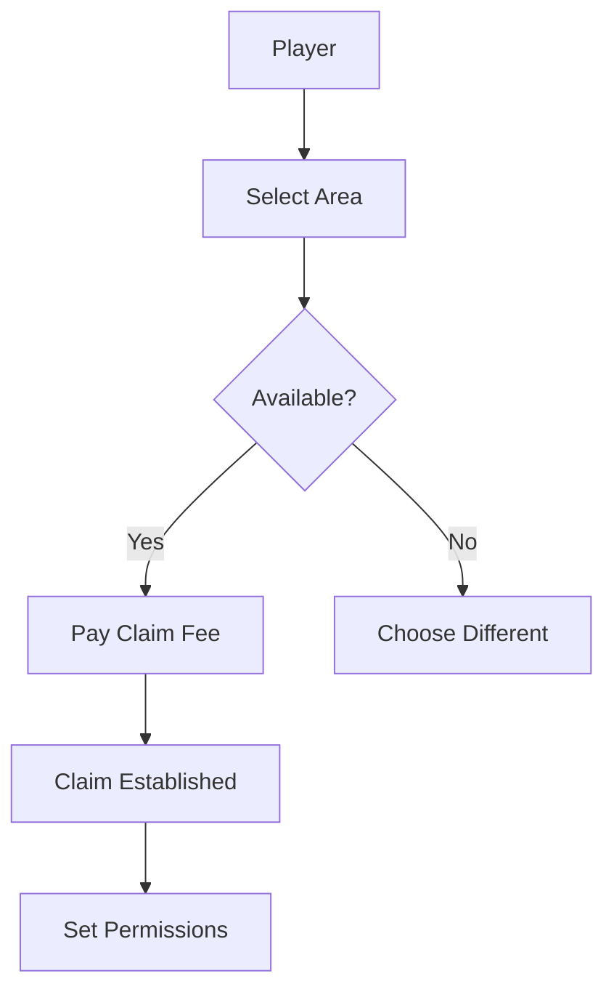

**Claim Types**:
- **Personal**: Individual homes, small farms
- **Town**: Shared jurisdiction, public services
- **State**: Multiple towns, broader governance
- **Federal**: Planetary, final authority

### Jurisdiction Hierarchy

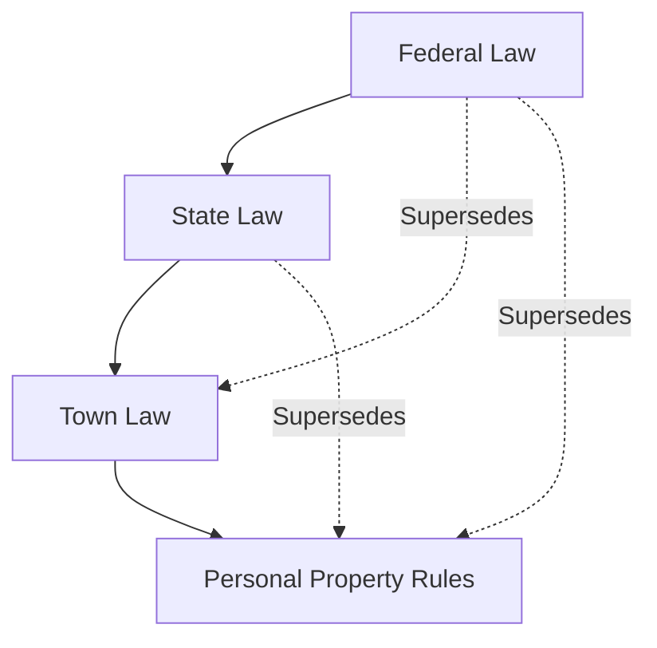

**Conflict Resolution**:
- Higher jurisdiction wins
- Specific law beats general
- Most recent amendment applies

### Public vs. Private Property

**Public**:
- Roads, infrastructure
- Town services
- Shared resources

**Private**:
- Personal claims
- Businesses
- Exclusive resources

---

## 6. Governance Progression UX

### Homesteader → Neighborhood

**Experience**:
- No formal governance
- Informal agreements
- Chat-based coordination
- Reputation matters

**Transition Trigger**: 3+ adjacent homesteaders

### Neighborhood → Town

**Formation Wizard**:

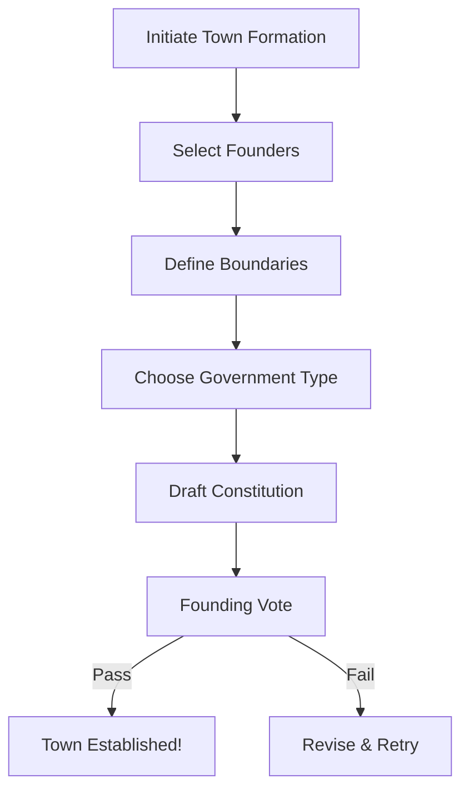

**UI/UX**:
- Visual boundary drawing
- Template constitution with customization
- Real-time preview of implications
- Guided voting process

### Town → State

**Federation Negotiation**:
- Towns propose federation
- Negotiate terms
- Constitutional compatibility
- Voting across all towns

### State → Federation

**Planetary Government**:
- Final authority
- Global laws
- Inter-state disputes
- Existential threat coordination

---

## 7. Law Enforcement Visibility

### Enforcement Transparency System

**Goal**: Players must see laws being enforced, not just breaking mysteriously

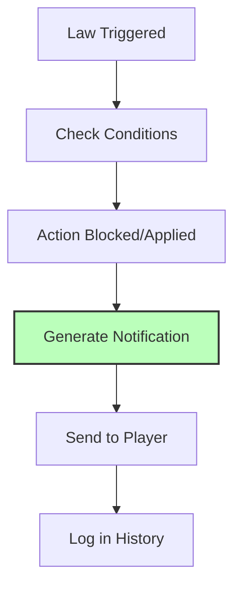

### Enforcement Notification UI

**When Law Prevents Action**:
```
┌─────────────────────────────────────┐
│ ⚠️ Action Blocked                   │
├─────────────────────────────────────┤
│ You attempted to: Chop tree         │
│                                     │
│ Blocked by:                         │
│ "Environmental Protection Act"      │
│                                     │
│ Reason:                             │
│ Tree is in protected forest zone    │
│                                     │
│ [View Law] [Appeal] [Dismiss]       │
└─────────────────────────────────────┘
```

**When Law Applies Penalty**:
```
┌─────────────────────────────────────┐
│ 💰 Tax Applied                      │
├─────────────────────────────────────┤
│ Transaction: Sold Iron Sword        │
│ Amount: 100 credits                 │
│                                     │
│ Tax: 10 credits (10%)               │
│ Under: "Sales Tax Law"              │
│                                     │
│ Net received: 90 credits            │
│                                     │
│ [View Details] [Receipt]            │
└─────────────────────────────────────┘
```

### Law Visualization

**Active Laws Dashboard**:
- List of all laws affecting player
- Visual indicators (icon + color)
- Quick summary ("This law affects: hunting, trading")
- Full text available

**Law Impact Preview**:
- Before proposing law: "If passed, this would affect X players"
- During voting: "Your vote: affects your taxes by Y%"
- After enactment: "This law has triggered Z times today"

### Enforcement History

**Personal Log**:
- All laws that affected player
- Timestamp and context
- Outcome (blocked, taxed, fined, etc.)
- Ability to appeal (if appeals process exists)

**Public Statistics**:
- Most enforced laws
- Total penalties collected
- Law effectiveness metrics
- Compliance rates

---

## 8. Anti-Griefing Systems

### Preventing Constitutional Deadlock

**Mechanisms**:
- **Default actions**: If no law, default rules apply
- **Emergency powers**: Temporary overrides possible
- **Timeout**: Laws expire if not reviewed
- **Minimum activity**: Government requires participation

### Handling Inactive Governments

**Detection**:
- No laws passed in X days
- Election turnout below threshold
- Critical decisions pending

**Intervention**:
- Automatic caretaker government
- Direct democracy fallback
- Server admin notification
- Dissolution and reformation option

### Protecting Against Tyranny of Majority

**Constitutional Protections**:
- **Bill of Rights**: Untouchable fundamental rights
- **Supermajority requirements**: For major changes
- **Judicial review**: Laws can be challenged
- **Secession rights**: Can leave jurisdiction

### Checks on Elected Officials

**Limitations**:
- Term limits
- Recall elections
- Transparency requirements
- Conflict of interest rules

### Exit Mechanisms

**Leaving Bad Governments**:
- Sell property and leave
- Challenge constitutionality
- Secede (form new jurisdiction)
- Move to different town/state

---

## 9. Governance Accessibility

### Making Politics Fun, Not Homework

**Problem**: Complex governance can feel like bureaucracy
**Solution**: Progressive disclosure, smart defaults, visual tools

### Progressive Complexity

**New Player Experience**:
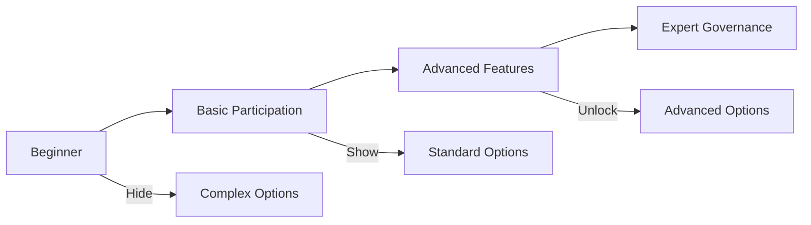

**Feature Tiers**:
- **Tier 1 (Beginner)**: Vote on simple proposals, view laws
- **Tier 2 (Intermediate)**: Propose simple laws, campaign
- **Tier 3 (Advanced)**: Draft complex laws, constitutional amendments

### Streamlining Routine Tasks

**Smart Defaults**:
- Default vote: "Abstain" (no penalty)
- Auto-vote: Set preferences, vote automatically
- Reminder system: "Election ends in 2 hours"
- Quick actions: "Vote Yes/No/Abstain" buttons

### Highlighting Important Decisions

**Decision Importance Algorithm**:
```
Importance = Impact × Urgency × Personal Relevance

- Impact: Number of affected players
- Urgency: Time remaining
- Personal Relevance: How much it affects you
```

**UI Treatment**:
- High importance: Full-screen modal
- Medium: Sidebar notification
- Low: Log entry only

### Reducing Tedium

**Batch Operations**:
- Review multiple laws at once
- Batch voting interface
- Template proposals

**Automation**:
- Standing voting instructions ("Always vote with Party X")
- Proxy voting (designate representative)
- Scheduled voting (vote ahead of time)

### Visual Tools

**Law Composer**:
- Visual block-based editor
- Plain language preview ("This law means...")
- Real-time impact simulation
- Example scenarios

**Constitution Builder**:
- Drag-and-drop government structure
- Visual relationship map
- Implication warnings
- Template library

---

## 10. Open Questions & Future Research

### Unresolved Questions

- [ ] What's the optimal voting period length?
- [ ] How do we prevent "voter fatigue"?
- [ ] What's the right balance of accessibility vs. depth?
- [ ] How do we handle timezone issues in global servers?
- [ ] Can we detect and prevent coordinated griefing?

### Research Needs

- [ ] Political engagement in games (academic studies)
- [ ] UX patterns for complex decision-making
- [ ] Anti-griefing in player-run governments
- [ ] Progressive disclosure best practices

---

## 11. Decisions Log

| Date | Decision | Rationale |
|------|----------|-----------|
| Day 0 | Event-driven law system | Performance, clarity |
| Day 0 | Visual law composer | Accessibility |
| Day 0 | Enforcement notifications | Transparency |
| Day 0 | Progressive complexity | Not overwhelm new players |

---

## Success Criteria

- [ ] Law system fully specified
- [ ] Constitutional mechanics detailed
- [ ] Election systems designed
- [ ] Government types implemented
- [ ] Anti-griefing protections defined
- [ ] UX flows for governance transitions
- [ ] Law enforcement visibility system
- [ ] Governance accessibility features

---

**Status**: TEMPLATE - Ready for Day 5 Planning
