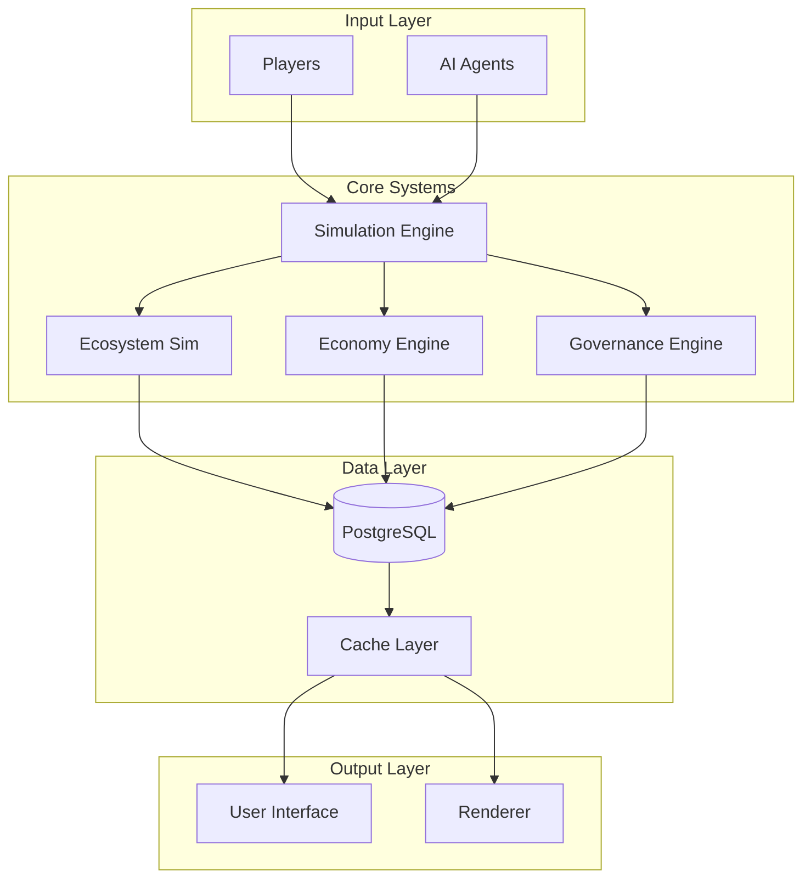
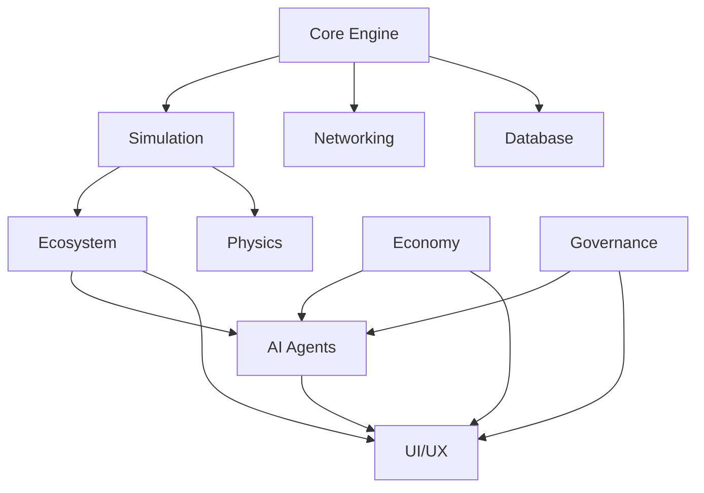
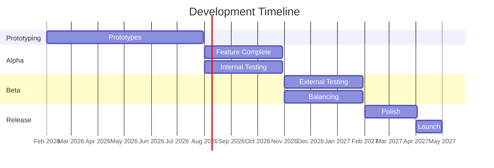

# Day 7: Master Development Plan - Deep Planning Document

**Planning Day**: 7 of 7  
**Status**: Draft  
**Last Updated**: Day 0 (Template Created)

---

## Purpose

Review all previous days' work, identify gaps, resolve conflicts, and create a unified plan for development. This document serves as the authoritative source for the complete development path forward.

---

## Key Questions Addressed

1. Do all the systems fit together coherently?
2. Are there contradictions between documents?
3. What did we miss?
4. What needs refinement?
5. What's the complete development path forward?

---

## Dependencies

- **Requires**: Days 1-6 (All planning documents)
- **Informs**: Week 2+ (Implementation)

---

## 1. Executive Summary

### Vision Statement

Societies is a persistent multiplayer civilization simulation where human players and AI agents coexist as equal citizens in a living ecosystem. Unlike traditional survival games, Societies treats society-building as the core gameplay loop, with AI agents providing economic and political continuity that prevents server death and creates authentic, emergent political and economic systems.

### Core Innovations

1. **AI-Human Equivalence**: AI agents are first-class citizens with equal economic and political rights
2. **Persistent World Simulation**: World evolves continuously whether players are online or not
3. **Emergent Governance**: Laws and constitutions created by players, enforced on AI agents
4. **Integrated Ecosystem**: Environmental simulation with real consequences for civilization
5. **Elastic AI Population**: Dynamic scaling ensures healthy economy regardless of player count

### Target Audience

- **Primary**: Players who enjoy complex simulations (Factorio, Eco, Dwarf Fortress)
- **Secondary**: Strategy game fans interested in emergent gameplay
- **Tertiary**: Creative builders who want meaningful social contexts

### Success Definition

**Technical Success**:
- Stable multiplayer with 20+ concurrent players
- 100+ AI agents running efficiently
- Complete server lifecycle (meteor to space age)

**Commercial Success**:
- Sustained player base (100+ concurrent players across servers)
- Positive reviews (80%+ positive)
- Financial sustainability

**Creative Success**:
- Emergent stories from player interactions
- Functional AI societies
- Meaningful political and economic systems

---

## 2. System Integration Map

### High-Level Integration

### System Dependencies

### Data Flow

**Tick Loop Data Flow**:
1. **Input**: Player actions, AI decisions, environmental changes
2. **Process**: Simulation systems update state
3. **Persist**: Critical state saved to database
4. **Sync**: State changes broadcast to clients
5. **Render**: Clients display updated world

### Critical Dependencies

| System | Depends On | Risk Level |
|--------|-----------|------------|
| AI Agents | Simulation Engine | Critical |
| Economy | AI Agents | High |
| Governance | Economy | Medium |
| Ecosystem | Simulation Engine | High |
| Multiplayer | All Systems | Critical |

---

## 3. Development Phases

### Phase Overview

### Phase 1: Prototyping (Months 1-6)

**Focus**: Validate core assumptions through iterative prototypes

**Deliverables**:
- 5 functional prototypes
- Performance benchmarks
- AI behavior validation
- Multiplayer sync verification

**Success Criteria**:
- All prototypes meet success metrics
- Core fun factor validated
- Technical risks mitigated

### Phase 2: Alpha (Months 7-12)

**Focus**: First playable version with all core features

**Deliverables**:
- Complete feature set
- Basic tutorial
- Server infrastructure
- Analytics integration

**Success Criteria**:
- 5-10 playtesters engaged
- 4+ hour average sessions
- 50%+ day-7 retention

### Phase 3: Beta (Months 13-18)

**Focus**: Feature complete, balancing, and polish

**Deliverables**:
- Closed beta (100+ players)
- Economy balancing
- UI/UX refinement
- Content complete

**Success Criteria**:
- 80%+ fun rating
- Stable servers
- Clear progression path

### Phase 4: Release (Months 19+)

**Focus**: Public launch and post-launch support

**Deliverables**:
- Marketing materials
- Launch event
- Post-launch roadmap
- Community tools

**Success Criteria**:
- Sustained player base
- Positive reviews
- Financial sustainability

---

## 4. Resource Requirements

### Team Composition

**Current**: Solo developer (you)

**Potential Collaborators**:
| Role | Need | Timeline |
|------|------|----------|
| Programmer | High | Month 6+ |
| Artist | Medium | Month 9+ |
| Sound Designer | Low | Month 12+ |
| Community Manager | Medium | Month 15+ |

**Hiring Strategy**:
- Start solo through Alpha
- Bring on programmer for Beta optimization
- Contract artist for final polish
- Volunteer moderators for community

### Tools & Software

**Development**:
- Godot 4.x (Free)
- Visual Studio / VS Code (Free)
- Git + GitHub (Free)
- PostgreSQL (Free)

**Art & Audio** (Placeholder until hiring):
- Blender (Free) - Placeholder models
- GIMP/Photoshop - Textures
- Audacity (Free) - Basic audio

**Project Management**:
- GitHub Issues (Free)
- GitHub Projects (Free)
- Discord (Free) - Community

### Hardware/Infrastructure

**Development**:
- Current PC sufficient for development
- Backup system recommended

**Testing**:
- Local server for testing
- Friend's machines for multiplayer testing

**Production (Post-Alpha)**:
- VPS for dedicated servers ($20-50/month)
- CDN for assets ($10-20/month)
- Database hosting ($10-30/month)

### Budget Considerations

**Minimal Budget** (Solo):
- Infrastructure: $50-100/month (post-alpha)
- Tools: $0 (all free/open source)
- Marketing: $0 (organic/community)
- **Total**: <$100/month after Alpha

**With Contractors**:
- Art: $2,000-5,000 (one-time)
- Sound: $1,000-3,000 (one-time)
- Programming help: $30-50/hour as needed
- **Total**: $5,000-10,000 additional

---

## 5. Risk Management

### Technical Risks

| Risk | Probability | Impact | Mitigation |
|------|-------------|--------|------------|
| Performance issues | High | Critical | Prototype early, profile often |
| AI behavior unrealistic | Medium | High | Iterative testing, multiple configs |
| Multiplayer sync failures | Medium | Critical | Deterministic simulation, testing |
| Godot limitations | Low | Medium | Active community, source available |

### Design Risks

| Risk | Probability | Impact | Mitigation |
|------|-------------|--------|------------|
| Not fun | Medium | Critical | Playtest early and often |
| Too complex | Medium | High | Progressive disclosure, tutorials |
| Balance issues | High | Medium | Data-driven balancing |
| Scope creep | High | Medium | Strict MVP definition |

### Market/Business Risks

| Risk | Probability | Impact | Mitigation |
|------|-------------|--------|------------|
| Niche appeal | Medium | Medium | Clear positioning |
| Competition | Medium | Low | Unique AI-human equivalence |
| Monetization failure | Low | Medium | Low budget, sustainable model |

### Contingency Plans

**If Technical Blockers**:
- Reduce AI count
- Simplify simulation
- Optimize aggressively

**If Not Fun**:
- Focus on core loop
- Cut complex systems
- Emphasize social play

**If Over Scope**:
- Defer advanced features
- Launch with core only
- Expand post-launch

---

## 6. Success Metrics & KPIs

### Prototype Success

| Metric | Target | Measurement |
|--------|--------|-------------|
| Performance | 60+ FPS | In-game display |
| AI Authenticity | Feels alive | Playtest feedback |
| Multiplayer Stability | <100ms latency | Network test |
| Fun Factor | 7+/10 | Survey |

### Alpha/Beta Metrics

| Metric | Alpha Target | Beta Target |
|--------|-------------|-------------|
| Day 1 Retention | 70% | 80% |
| Day 7 Retention | 40% | 60% |
| Session Length | 2+ hours | 3+ hours |
| Crash Rate | <5% | <1% |
| Net Promoter Score | +20 | +40 |

### Launch Targets

| Metric | 6-Month Target | 1-Year Target |
|--------|---------------|---------------|
| Concurrent Players | 100 | 500 |
| Total Players | 5,000 | 25,000 |
| Review Score | 75% | 85% |
| Monthly Revenue | $2,000 | $10,000 |

### How We Know We're Succeeding

**Short-term (Weekly)**:
- Prototype milestones hit
- Playtester engagement
- Bug count decreasing

**Medium-term (Monthly)**:
- Retention metrics
- Feature completion
- Performance benchmarks

**Long-term (Quarterly)**:
- Player growth
- Revenue sustainability
- Community health

---

## 7. Open Questions & Research Needs

### Still Unknown

**Technical**:
- [ ] Actual performance of 100 AI agents
- [ ] Multiplayer sync at 20+ players
- [ ] Database performance under load
- [ ] Optimal tick rate

**Design**:
- [ ] Will AI feel authentic to players?
- [ ] Is governance engaging or tedious?
- [ ] Right balance of challenge vs. frustration?
- [ ] Optimal session length?

**Business**:
- [ ] What price point works?
- [ ] DLC vs. expansion model?
- [ ] Server hosting costs at scale?

### External Expertise Needed

- **Game Economist**: Review economic balance
- **UX Designer**: Governance interface review
- **Community Manager**: Beta preparation
- **Server Admin**: Production infrastructure

### Competitive Analysis Gaps

- [ ] Deep analysis of Eco's post-launch support
- [ ] Factorio's multiplayer architecture
- [ ] Paradox games' tutorial systems
- [ ] Indie simulation game market trends

---

## 8. Next Steps (Week 2 and Beyond)

### Immediate Actions (This Week)

1. **Review all planning documents**
   - Check for contradictions
   - Identify gaps
   - Cross-reference dependencies

2. **Set up development environment**
   - Install Godot 4.x with C#
   - Configure IDE
   - Setup PostgreSQL
   - Test multiplayer locally

3. **Set up testing infrastructure**
   - Create test project structure (see `day1-technical-architecture.md` Section 8.5)
   - Install xUnit and Testcontainers NuGet packages
   - Configure CI/CD pipeline (`.github/workflows/tests.yml`)
   - Write first unit test (Entity system)
   - Validate database tests work (PostgreSQL + SQLite)
   - **Success Criteria**: CI pipeline runs successfully, at least 10 unit tests pass

4. **Delegate research tasks**
   - Send agent prompts for game analysis
   - Collect postmortems
   - Study technical references

5. **Create project structure**
   - Initialize Godot project
   - Setup version control workflow
   - Configure build system
   - Implement testable architecture (business logic separation)

### Week 2: Begin Prototype 1

**Focus**: Basic world and simulation

**Tasks**:
- Terrain generation
- Basic entity system
- Resource nodes
- Day/night cycle
- Simple crafting

**Success**: Can walk around, gather resources, craft basic items

### Week 3-4: Complete Prototype 1

**Tasks**:
- Weather system
- Performance optimization
- Multiplayer foundation
- Testing and iteration

**Deliverable**: Playable world demo

### Ongoing: Planning Updates

**Review Schedule**:
- **Weekly**: Update relevant planning docs
- **Monthly**: Full plan review
- **Per-prototype**: Post-mortem and plan adjustment

---

## 9. Document Cross-Reference

### Navigation Guide

**Starting Point**: `README.md` (project overview)

**Planning Documents**:
- **Meta**: `planning/meta/` - High-level vision and methodology
- **Week 1**: `planning/week1-deep-planning/` - Detailed planning
  - Day 1: Technical architecture
  - Day 2: AI system design
  - Day 3: Core gameplay loops
  - Day 4: Progression and balance
  - Day 5: Governance mechanics
  - Day 6: Prototyping roadmap
  - Day 7: Master development plan (this document)

**Research**: `planning/research/` - Analysis and findings

**Spreadsheets**: `planning/spreadsheets/` - Calculations and data

**Source Code**: `src/societies/` - Implementation

### Update Schedule

**Living Documents**:
- Update when new information arises
- Mark changes in decision logs
- Version control tracks history

**Review Triggers**:
- After each prototype
- When assumptions change
- When new risks emerge
- Quarterly even if no changes

---

## 10. Integration Review

### Cross-Document Consistency Check

| Aspect | Day 1 | Day 2 | Day 3 | Day 4 | Day 5 | Consistent? |
|--------|-------|-------|-------|-------|-------|-------------|
| **Tech Stack** | Godot + C# | - | - | - | - | ✓ |
| **AI Count** | 100-200 | 100-200 | - | 200 cap | - | ✓ |
| **World Size** | 0.5-4 km² | - | - | 0.5 km² start | - | ✓ |
| **Tick Rate** | 20 TPS | - | - | - | - | ✓ |
| **Offline Mode** | Local server | - | - | - | - | ✓ |
| **Save System** | Event-sourced | - | - | - | - | ✓ |

### Conflicts Resolved

None identified in initial review.

### Gaps Identified

- [ ] Detailed API documentation (deferred to implementation)
- [ ] Asset pipeline (deferred to Beta)
- [ ] Localization plan (post-launch)
- [ ] Mobile port (not planned, PC-only)

---

## Success Criteria

- [ ] All documents reviewed for consistency
- [ ] Gaps identified and addressed
- [ ] Complete development path defined
- [ ] Risk management strategy in place
- [ ] Next steps clear and actionable
- [ ] Resource requirements specified
- [ ] Success metrics established
- [ ] Integration map complete

---

## Final Notes

### Planning Complete

You now have a comprehensive 7-day planning foundation that covers:
- Technical architecture
- AI system design
- Core gameplay loops
- Progression and balance
- Governance mechanics
- 6-month prototyping roadmap
- Master development plan

### Ready to Build

With infinite time and solo development, you can:
1. Work through prototypes methodically
2. Iterate based on learnings
3. Build at your own pace
4. Achieve the vision

The planning is done. The building begins.

---

**Status**: TEMPLATE - Ready for Day 7 Planning and Integration Review
